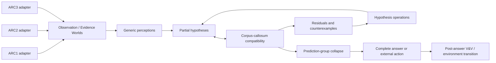

# ARC123 IHL Architecture

## Shared state

`observations, attended regions, hypotheses, support facts, residuals, counterexamples, posterior, learned constraints, history`.

## Adapter distinction

| Benchmark | Observable worlds | Action type | Feedback |
| --- | --- | --- | --- |
| ARC1/ARC2 | Training input/output pairs | Internal hypothesis/attention operation | Exact agreement, residual, counterexample, support reduction |
| ARC3 | Live environment state | External environment action | State transition, progress, failure, reward |

The common core does not assume that ARC1/ARC2 are literally official ARC3 games. `ARC12InteractiveEnv` makes their latent interactions explicit for research without changing their benchmark semantics.

## Current controller

The first controller implements `ATTEND`, `PROPOSE`, `APPLY_HYPOTHESIS`, `COMPARE`, `FIND_COUNTEREXAMPLE`, `REJECT_HYPOTHESIS`, `SPECIALIZE`, `PROMOTE_CONSTRAINT`, `COMPOSE`, `MERGE_RULES`, and `COMMIT`. It proposes generic identity, recolor, symmetry, translation, line-extension, and row-span hypotheses. This is deliberately a small falsifiable baseline, not a catalogue of task-shaped fitters.

## Compatibility semantics

- A concrete predicted cell that differs from a visible training output is an observed contradiction and gives that assertion exact zero support.
- A `null` partial-prediction cell is `UNKNOWN`, not impossible and not a mismatch.
- A partial compatible theory can be kept for later composition.
- Only complete training-compatible theories can enter test-prediction collapse.
