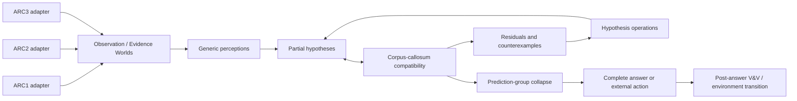

# ARC123 IHL Architecture



## Shared state

`observations, attended regions, hypotheses, support facts, residuals, counterexamples, posterior, learned constraints, history`.

## Adapter distinction

| Benchmark | Observable worlds | Action type | Feedback |
| --- | --- | --- | --- |
| ARC1/ARC2 | Training input/output pairs | Internal hypothesis/attention operation | Exact agreement, residual, counterexample, support reduction |
| ARC3 | Live environment state | External environment action | State transition, progress, failure, reward |

The common core does not assume that ARC1/ARC2 are literally official ARC3 games. `ARC12InteractiveEnv` makes their latent interactions explicit for research without changing their benchmark semantics.

## Current controller

The first controller implements `ATTEND`, `PROPOSE`, `APPLY_HYPOTHESIS`, `COMPARE`, `FIND_COUNTEREXAMPLE`, `REJECT_HYPOTHESIS`, `SPECIALIZE`, `PROMOTE_CONSTRAINT`, `COMPOSE`, `MERGE_RULES`, and `COMMIT`. It proposes generic identity, recolor, symmetry, translation, line-extension, and row-span hypotheses. This is deliberately a small falsifiable baseline, not a catalogue of task-shaped fitters.

## Compatibility semantics

- A concrete predicted cell that differs from a visible training output is an observed contradiction and gives that assertion exact zero support.
- A `null` partial-prediction cell is `UNKNOWN`, not impossible and not a mismatch.
- A partial compatible theory can be kept for later composition.
- Only complete training-compatible theories can enter test-prediction collapse.

## 2026-08-25 bidirectional corpus-callosum refinement

The next architecture treats the **crossing joint/subjoint**, not one directional conditional, as the authoritative local object. See [`docs/BIDIRECTIONAL_CORPUS_CALLOSUM.md`](docs/BIDIRECTIONAL_CORPUS_CALLOSUM.md) and issues #6–#9.

```text
                  shared callosal joint M
                /                         \
      forward predictive view       backward abductive view
```

For ARC1/2, `M` relates input/perception context + hypothesis/program state to output/effect. Forward propagation predicts visible effects; backward propagation uses visible TRAIN outputs/residuals to constrain possible causes/parameters. Held-out test output is never available to the backward path.

For ARC3, `M` is a transition/effect joint over pre-context + action + optional phase/bridge state + post-context/effect. Forward and reverse conditionals are two views of the same transition evidence; they need not be equal and the dynamics need not be invertible.

The central refinement loop is now:

```text
observe
 -> update shared callosal evidence
 -> derive/reconcile forward + backward views
 -> exact shared-joint / overlap compatibility
 -> certified zero propagation
 -> classify mismatch topology
 -> minimal perception/bridge/memory/fiber refinement
 -> prediction/action-equivalence collapse
```

A forward/backward match at a compressed interface is an exact **local singularity/equality state**, but it is not by itself a generalization certificate. If stronger observed structure falsifies the quotient, refine the representation rather than declaring the world incompatible. This is the ARC analogue of the `ABCABD` low-order negative control developed in `dannaf/SingularityML#3644–#3660`.
