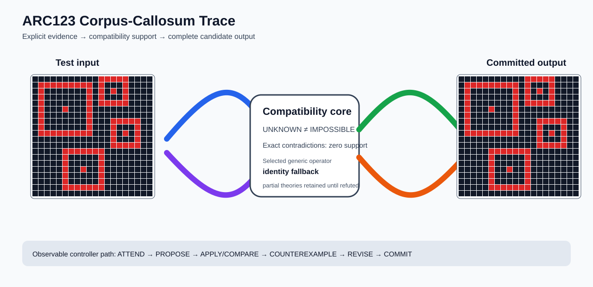

# ARC1 `00dbd492` IHL Brain Surgery Report

## Outcome: NO — TEST CELLS DO NOT ALL MATCH

- **Compared positions:** 400
- **Mismatched cells:** 88
- **Source commit:** `085f6dbe39050afac3d1d743f840bac95b1a8d1c`
- **Selected hypothesis:** `fallback_identity_complete_grid`
- **Training compatibility:** `False`
- **Fallback used:** `True`

## Live-Agent Boundary

The controller receives only training input/output evidence and the test input. It receives no task ID, historical schema/decomposition, GT feature contract, GT solver, or test target. The expected test output below is accessed only after the complete prediction is committed for V&V.

## Corpus-Callosum Visualization



- Full explicit event record: [`learning_trace.json`](learning_trace.json)

The diagram shows the actual test input, the typed compatibility core, and the committed full prediction. It renders observable operations only; it does not fabricate a one-to-one causal fiber where the selected program is only a factor-level dependency.

## Post-Answer V&V

### Test case 1
- **All cells match:** `False`
- **Mismatched cells:** `88`
- **Prediction:**
```json
[[0, 0, 0, 0, 0, 0, 0, 0, 0, 0, 0, 2, 2, 2, 2, 2, 0, 0, 0, 0], [0, 2, 2, 2, 2, 2, 2, 2, 2, 2, 0, 2, 0, 0, 0, 2, 0, 0, 0, 0], [0, 2, 0, 0, 0, 0, 0, 0, 0, 2, 0, 2, 0, 2, 0, 2, 0, 0, 0, 0], [0, 2, 0, 0, 0, 0, 0, 0, 0, 2, 0, 2, 0, 0, 0, 2, 0, 0, 0, 0], [0, 2, 0, 0, 0, 0, 0, 0, 0, 2, 0, 2, 2, 2, 2, 2, 0, 0, 0, 0], [0, 2, 0, 0, 0, 2, 0, 0, 0, 2, 0, 0, 0, 0, 0, 0, 0, 0, 0, 0], [0, 2, 0, 0, 0, 0, 0, 0, 0, 2, 0, 0, 0, 0, 0, 0, 0, 0, 0, 0], [0, 2, 0, 0, 0, 0, 0, 0, 0, 2, 0, 0, 0, 2, 2, 2, 2, 2, 0, 0], [0, 2, 0, 0, 0, 0, 0, 0, 0, 2, 0, 0, 0, 2, 0, 0, 0, 2, 0, 0], [0, 2, 2, 2, 2, 2, 2, 2, 2, 2, 0, 0, 0, 2, 0, 2, 0, 2, 0, 0], [0, 0, 0, 0, 0, 0, 0, 0, 0, 0, 0, 0, 0, 2, 0, 0, 0, 2, 0, 0], [0, 0, 0, 0, 0, 0, 0, 0, 0, 0, 0, 0, 0, 2, 2, 2, 2, 2, 0, 0], [0, 0, 0, 0, 0, 2, 2, 2, 2, 2, 2, 2, 0, 0, 0, 0, 0, 0, 0, 0], [0, 0, 0, 0, 0, 2, 0, 0, 0, 0, 0, 2, 0, 0, 0, 0, 0, 0, 0, 0], [0, 0, 0, 0, 0, 2, 0, 0, 0, 0, 0, 2, 0, 0, 0, 0, 0, 0, 0, 0], [0, 0, 0, 0, 0, 2, 0, 0, 2, 0, 0, 2, 0, 0, 0, 0, 0, 0, 0, 0], [0, 0, 0, 0, 0, 2, 0, 0, 0, 0, 0, 2, 0, 0, 0, 0, 0, 0, 0, 0], [0, 0, 0, 0, 0, 2, 0, 0, 0, 0, 0, 2, 0, 0, 0, 0, 0, 0, 0, 0], [0, 0, 0, 0, 0, 2, 2, 2, 2, 2, 2, 2, 0, 0, 0, 0, 0, 0, 0, 0], [0, 0, 0, 0, 0, 0, 0, 0, 0, 0, 0, 0, 0, 0, 0, 0, 0, 0, 0, 0]]
```
- **Expected output (post-answer only):**
```json
[[0, 0, 0, 0, 0, 0, 0, 0, 0, 0, 0, 2, 2, 2, 2, 2, 0, 0, 0, 0], [0, 2, 2, 2, 2, 2, 2, 2, 2, 2, 0, 2, 8, 8, 8, 2, 0, 0, 0, 0], [0, 2, 3, 3, 3, 3, 3, 3, 3, 2, 0, 2, 8, 2, 8, 2, 0, 0, 0, 0], [0, 2, 3, 3, 3, 3, 3, 3, 3, 2, 0, 2, 8, 8, 8, 2, 0, 0, 0, 0], [0, 2, 3, 3, 3, 3, 3, 3, 3, 2, 0, 2, 2, 2, 2, 2, 0, 0, 0, 0], [0, 2, 3, 3, 3, 2, 3, 3, 3, 2, 0, 0, 0, 0, 0, 0, 0, 0, 0, 0], [0, 2, 3, 3, 3, 3, 3, 3, 3, 2, 0, 0, 0, 0, 0, 0, 0, 0, 0, 0], [0, 2, 3, 3, 3, 3, 3, 3, 3, 2, 0, 0, 0, 2, 2, 2, 2, 2, 0, 0], [0, 2, 3, 3, 3, 3, 3, 3, 3, 2, 0, 0, 0, 2, 8, 8, 8, 2, 0, 0], [0, 2, 2, 2, 2, 2, 2, 2, 2, 2, 0, 0, 0, 2, 8, 2, 8, 2, 0, 0], [0, 0, 0, 0, 0, 0, 0, 0, 0, 0, 0, 0, 0, 2, 8, 8, 8, 2, 0, 0], [0, 0, 0, 0, 0, 0, 0, 0, 0, 0, 0, 0, 0, 2, 2, 2, 2, 2, 0, 0], [0, 0, 0, 0, 0, 2, 2, 2, 2, 2, 2, 2, 0, 0, 0, 0, 0, 0, 0, 0], [0, 0, 0, 0, 0, 2, 4, 4, 4, 4, 4, 2, 0, 0, 0, 0, 0, 0, 0, 0], [0, 0, 0, 0, 0, 2, 4, 4, 4, 4, 4, 2, 0, 0, 0, 0, 0, 0, 0, 0], [0, 0, 0, 0, 0, 2, 4, 4, 2, 4, 4, 2, 0, 0, 0, 0, 0, 0, 0, 0], [0, 0, 0, 0, 0, 2, 4, 4, 4, 4, 4, 2, 0, 0, 0, 0, 0, 0, 0, 0], [0, 0, 0, 0, 0, 2, 4, 4, 4, 4, 4, 2, 0, 0, 0, 0, 0, 0, 0, 0], [0, 0, 0, 0, 0, 2, 2, 2, 2, 2, 2, 2, 0, 0, 0, 0, 0, 0, 0, 0], [0, 0, 0, 0, 0, 0, 0, 0, 0, 0, 0, 0, 0, 0, 0, 0, 0, 0, 0, 0]]
```

## Observable IHL Walkthrough

The record contains explicit actions, predictions, feedback, and revisions; it does not claim or store hidden model reasoning.

### Action totals

- `APPLY_HYPOTHESIS`: 64
- `ATTEND`: 1
- `COMMIT`: 1
- `COMPARE`: 64
- `FIND_COUNTEREXAMPLE`: 64
- `PROPOSE`: 2
- `REJECT_HYPOTHESIS`: 64
- `SPECIALIZE`: 1

### Decision milestones

- `0` `ATTEND` — `{"demo_change_counts":[{"changed_cells":56,"demo_index":2},{"changed_cells":32,"demo_index":3},{"changed_cells":24,"demo_index":1},{"changed_cells":8,"demo_index":0}],"evidence_world_count":4,"selected_demo":2}`
- `1` `PROPOSE` — `{"generic_candidate_count":844,"locally_ranked_candidate_count":32,"stage":"global_generic_relations"}`
- `130` `SPECIALIZE` — `{"next_operator_family":"generic_line_and_span_relations","reason":"no_global_training_complete_hypothesis","retained_partial_hypothesis_count":0}`
- `131` `PROPOSE` — `{"generic_candidate_count":100,"locally_ranked_candidate_count":32,"stage":"residual_directed_generic_relations"}`
- `260` `COMMIT` — `{"complete_prediction_group_count":0,"fallback_reason":"no_complete_training_compatible_generic_hypothesis","posterior_mass":0.0,"selected_hypothesis":"fallback_identity_complete_grid","training_exact":false}`

### First counterexamples

- `4` — `{"counterexample":{"column":1,"demo_index":0,"observed":8,"predicted":0,"row":1},"hypothesis":"identity","stage":"global_generic_relations"}`
- `8` — `{"counterexample":{"column":1,"demo_index":0,"observed":2,"predicted":0,"row":0},"hypothesis":"translate(column_offset=0,row_offset=-2)","stage":"global_generic_relations"}`
- `12` — `{"counterexample":{"column":1,"demo_index":0,"observed":2,"predicted":0,"row":0},"hypothesis":"translate(column_offset=0,row_offset=-1)","stage":"global_generic_relations"}`
- `16` — `{"counterexample":{"column":3,"demo_index":0,"observed":2,"predicted":0,"row":0},"hypothesis":"translate(column_offset=-2,row_offset=0)","stage":"global_generic_relations"}`
- `20` — `{"counterexample":{"column":4,"demo_index":0,"observed":2,"predicted":0,"row":0},"hypothesis":"translate(column_offset=-1,row_offset=0)","stage":"global_generic_relations"}`
- `59` additional explicit counterexamples are retained in `learning_trace.json`.
