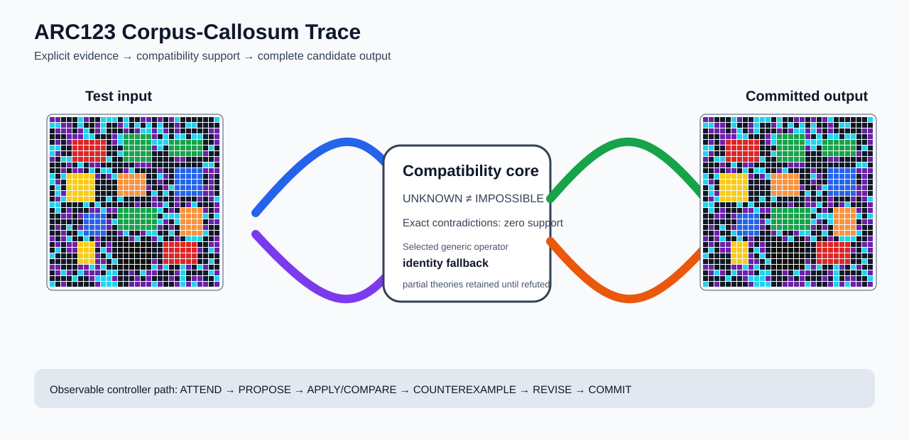

# ARC1 `0a1d4ef5` IHL Brain Surgery Report

## Outcome: NO — TEST CELLS DO NOT ALL MATCH

- **Compared positions:** 12
- **Mismatched cells:** 12
- **Source commit:** `085f6dbe39050afac3d1d743f840bac95b1a8d1c`
- **Selected hypothesis:** `fallback_identity_complete_grid`
- **Training compatibility:** `False`
- **Fallback used:** `True`

## Live-Agent Boundary

The controller receives only training input/output evidence and the test input. It receives no task ID, historical schema/decomposition, GT feature contract, GT solver, or test target. The expected test output below is accessed only after the complete prediction is committed for V&V.

## Corpus-Callosum Visualization



- Full explicit event record: [`learning_trace.json`](learning_trace.json)

The diagram shows the actual test input, the typed compatibility core, and the committed full prediction. It renders observable operations only; it does not fabricate a one-to-one causal fiber where the selected program is only a factor-level dependency.

## Post-Answer V&V

### Test case 1
- **All cells match:** `False`
- **Mismatched cells:** `12`
- **Prediction:**
```json
[[5, 5, 0, 0, 0, 8, 5, 0, 0, 8, 8, 8, 0, 8, 0, 0, 5, 5, 0, 5, 0, 5, 8, 0, 0, 0, 0, 0, 0, 8], [8, 8, 5, 5, 0, 8, 0, 0, 5, 8, 0, 0, 5, 8, 0, 8, 0, 8, 0, 8, 0, 0, 5, 0, 8, 8, 0, 0, 0, 0], [0, 5, 5, 5, 0, 5, 8, 0, 5, 8, 0, 0, 0, 5, 0, 5, 8, 8, 5, 8, 5, 0, 5, 0, 0, 0, 0, 0, 5, 5], [0, 0, 0, 5, 5, 5, 8, 8, 0, 0, 0, 5, 8, 3, 3, 3, 3, 3, 5, 0, 8, 0, 8, 8, 0, 8, 8, 0, 0, 5], [0, 5, 0, 5, 2, 2, 2, 2, 2, 2, 0, 5, 8, 3, 3, 3, 3, 3, 8, 8, 8, 3, 3, 3, 3, 3, 3, 0, 0, 5], [8, 8, 0, 0, 2, 2, 2, 2, 2, 2, 0, 0, 0, 3, 3, 3, 3, 3, 5, 8, 0, 3, 3, 3, 3, 3, 3, 0, 8, 0], [8, 5, 0, 0, 2, 2, 2, 2, 2, 2, 0, 0, 8, 3, 3, 3, 3, 3, 0, 0, 0, 3, 3, 3, 3, 3, 3, 5, 0, 0], [5, 0, 8, 8, 2, 2, 2, 2, 2, 2, 8, 0, 0, 3, 3, 3, 3, 3, 0, 0, 0, 0, 5, 5, 0, 0, 0, 0, 0, 5], [0, 0, 0, 5, 0, 8, 0, 5, 5, 0, 0, 0, 0, 0, 0, 5, 5, 5, 0, 0, 0, 0, 0, 0, 0, 0, 0, 8, 8, 0], [0, 0, 5, 0, 5, 5, 0, 8, 0, 8, 8, 0, 0, 5, 8, 0, 0, 0, 0, 5, 0, 0, 1, 1, 1, 1, 1, 5, 5, 5], [8, 0, 8, 4, 4, 4, 4, 4, 5, 0, 5, 8, 7, 7, 7, 7, 7, 0, 0, 8, 5, 0, 1, 1, 1, 1, 1, 0, 5, 0], [8, 5, 0, 4, 4, 4, 4, 4, 0, 0, 0, 0, 7, 7, 7, 7, 7, 0, 0, 5, 0, 0, 1, 1, 1, 1, 1, 0, 5, 0], [0, 8, 0, 4, 4, 4, 4, 4, 0, 0, 0, 0, 7, 7, 7, 7, 7, 5, 0, 0, 5, 8, 1, 1, 1, 1, 1, 5, 5, 0], [0, 8, 5, 4, 4, 4, 4, 4, 0, 0, 0, 0, 7, 7, 7, 7, 7, 0, 8, 0, 8, 0, 1, 1, 1, 1, 1, 5, 5, 0], [0, 5, 8, 4, 4, 4, 4, 4, 0, 0, 8, 0, 8, 0, 0, 0, 0, 0, 5, 0, 0, 0, 5, 0, 0, 0, 5, 0, 5, 8], [8, 8, 0, 0, 0, 0, 8, 0, 8, 0, 0, 0, 0, 0, 0, 5, 0, 0, 5, 5, 8, 0, 5, 0, 5, 8, 0, 0, 0, 5], [0, 8, 0, 5, 0, 0, 0, 5, 5, 8, 5, 5, 3, 3, 3, 3, 3, 3, 3, 8, 0, 5, 0, 7, 7, 7, 7, 5, 0, 5], [0, 0, 5, 5, 0, 5, 1, 1, 1, 1, 0, 0, 3, 3, 3, 3, 3, 3, 3, 0, 8, 8, 8, 7, 7, 7, 7, 8, 0, 8], [0, 0, 0, 0, 0, 0, 1, 1, 1, 1, 5, 8, 3, 3, 3, 3, 3, 3, 3, 8, 5, 0, 8, 7, 7, 7, 7, 0, 5, 5], [0, 5, 0, 8, 0, 5, 1, 1, 1, 1, 5, 0, 3, 3, 3, 3, 3, 3, 3, 5, 0, 5, 0, 7, 7, 7, 7, 5, 0, 0], [0, 0, 5, 0, 0, 8, 1, 1, 1, 1, 0, 0, 5, 8, 0, 0, 5, 8, 8, 0, 0, 8, 0, 7, 7, 7, 7, 8, 0, 0], [5, 0, 5, 8, 0, 0, 8, 0, 5, 0, 0, 0, 0, 0, 5, 8, 0, 0, 5, 8, 0, 0, 5, 0, 8, 8, 8, 0, 0, 5], [0, 5, 0, 5, 5, 4, 4, 4, 5, 0, 5, 0, 6, 6, 6, 6, 6, 6, 0, 0, 2, 2, 2, 2, 2, 2, 0, 0, 5, 5], [0, 8, 0, 5, 5, 4, 4, 4, 0, 8, 5, 0, 6, 6, 6, 6, 6, 6, 0, 0, 2, 2, 2, 2, 2, 2, 5, 0, 8, 5], [8, 0, 0, 0, 0, 4, 4, 4, 5, 0, 8, 0, 6, 6, 6, 6, 6, 6, 0, 0, 2, 2, 2, 2, 2, 2, 0, 0, 0, 0], [0, 0, 0, 0, 0, 4, 4, 4, 5, 5, 0, 8, 6, 6, 6, 6, 6, 6, 5, 0, 2, 2, 2, 2, 2, 2, 0, 0, 8, 0], [5, 5, 0, 0, 0, 5, 5, 8, 5, 8, 0, 0, 6, 6, 6, 6, 6, 6, 8, 5, 8, 0, 0, 8, 5, 0, 8, 5, 0, 0], [0, 5, 8, 5, 0, 8, 5, 5, 5, 0, 8, 8, 0, 0, 5, 0, 8, 5, 5, 0, 0, 0, 5, 8, 0, 0, 0, 0, 8, 5], [0, 0, 0, 0, 8, 0, 0, 5, 8, 8, 8, 5, 0, 0, 0, 5, 0, 5, 0, 0, 0, 5, 0, 8, 0, 5, 5, 0, 0, 8], [8, 0, 5, 0, 0, 0, 0, 0, 5, 8, 8, 8, 0, 0, 5, 5, 5, 5, 8, 5, 0, 0, 5, 8, 5, 8, 5, 5, 0, 5]]
```
- **Expected output (post-answer only):**
```json
[[2, 3, 3], [4, 7, 1], [1, 3, 7], [4, 6, 2]]
```

## Observable IHL Walkthrough

The record contains explicit actions, predictions, feedback, and revisions; it does not claim or store hidden model reasoning.

### Action totals

- `APPLY_HYPOTHESIS`: 1
- `ATTEND`: 1
- `COMMIT`: 1
- `COMPARE`: 1
- `PROPOSE`: 2
- `REJECT_HYPOTHESIS`: 1
- `SPECIALIZE`: 1

### Decision milestones

- `0` `ATTEND` — `{"demo_change_counts":[{"changed_cells":9,"demo_index":0},{"changed_cells":9,"demo_index":2},{"changed_cells":6,"demo_index":1}],"evidence_world_count":3,"selected_demo":0}`
- `1` `PROPOSE` — `{"generic_candidate_count":1,"locally_ranked_candidate_count":1,"stage":"global_generic_relations"}`
- `5` `SPECIALIZE` — `{"next_operator_family":"generic_line_and_span_relations","reason":"no_global_training_complete_hypothesis","retained_partial_hypothesis_count":0}`
- `6` `PROPOSE` — `{"generic_candidate_count":0,"locally_ranked_candidate_count":0,"stage":"residual_directed_generic_relations"}`
- `7` `COMMIT` — `{"complete_prediction_group_count":0,"fallback_reason":"no_complete_training_compatible_generic_hypothesis","posterior_mass":0.0,"selected_hypothesis":"fallback_identity_complete_grid","training_exact":false}`
