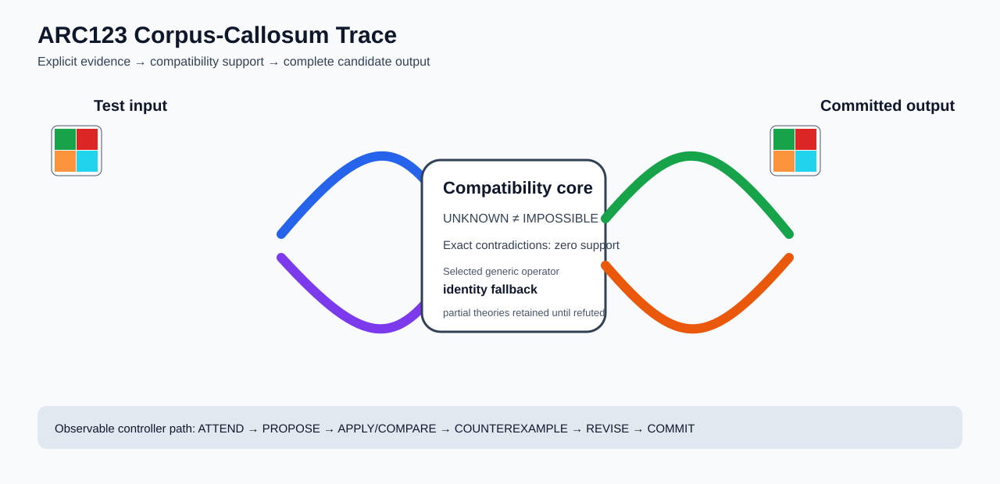

# ARC2 `00576224` IHL Brain Surgery Report

## Outcome: NO — TEST CELLS DO NOT ALL MATCH

- **Compared positions:** 36
- **Mismatched cells:** 36
- **Source commit:** `71f86ff4c5304e452e0659131171f0519b50e21c`
- **Selected hypothesis:** `fallback_identity_complete_grid`
- **Training compatibility:** `False`
- **Fallback used:** `True`

## Live-Agent Boundary

The controller receives only training input/output evidence and the test input. It receives no task ID, historical schema/decomposition, GT feature contract, GT solver, or test target. The expected test output below is accessed only after the complete prediction is committed for V&V.

## Corpus-Callosum Visualization



- Full explicit event record: [`learning_trace.json`](learning_trace.json)

The diagram shows the actual test input, the typed compatibility core, and the committed full prediction. It renders observable operations only; it does not fabricate a one-to-one causal fiber where the selected program is only a factor-level dependency.

## Post-Answer V&V

### Test case 1
- **All cells match:** `False`
- **Mismatched cells:** `36`
- **Prediction:**
```json
[[3, 2], [7, 8]]
```
- **Expected output (post-answer only):**
```json
[[3, 2, 3, 2, 3, 2], [7, 8, 7, 8, 7, 8], [2, 3, 2, 3, 2, 3], [8, 7, 8, 7, 8, 7], [3, 2, 3, 2, 3, 2], [7, 8, 7, 8, 7, 8]]
```

## Observable IHL Walkthrough

The record contains explicit actions, predictions, feedback, and revisions; it does not claim or store hidden model reasoning.

### Action totals

- `APPLY_HYPOTHESIS`: 1
- `ATTEND`: 1
- `COMMIT`: 1
- `COMPARE`: 1
- `PROPOSE`: 2
- `REJECT_HYPOTHESIS`: 1
- `SPECIALIZE`: 1

### Decision milestones

- `0` `ATTEND` — `{"demo_change_counts":[{"changed_cells":36,"demo_index":0},{"changed_cells":36,"demo_index":1}],"evidence_world_count":2,"selected_demo":0}`
- `1` `PROPOSE` — `{"generic_candidate_count":1,"locally_ranked_candidate_count":1,"stage":"global_generic_relations"}`
- `5` `SPECIALIZE` — `{"next_operator_family":"generic_line_and_span_relations","reason":"no_global_training_complete_hypothesis","retained_partial_hypothesis_count":0}`
- `6` `PROPOSE` — `{"generic_candidate_count":0,"locally_ranked_candidate_count":0,"stage":"residual_directed_generic_relations"}`
- `7` `COMMIT` — `{"complete_prediction_group_count":0,"fallback_reason":"no_complete_training_compatible_generic_hypothesis","posterior_mass":0.0,"selected_hypothesis":"fallback_identity_complete_grid","training_exact":false}`
