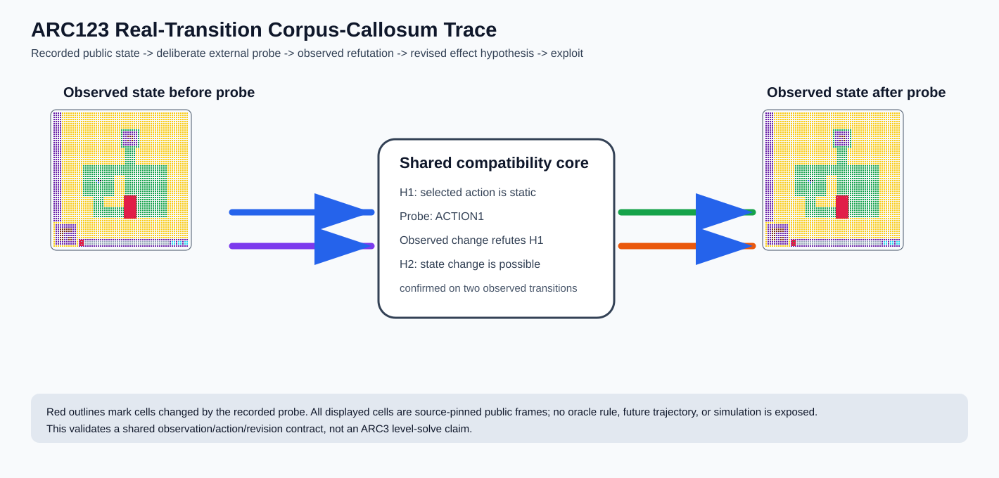

# ARC3 `ls20` L1 Shared-Core Brain Surgery Report

## Outcome: YES — SHARED-CORE TRANSITION HYPOTHESIS CONFIRMED

- **Recorded public transitions consumed:** `2`
- **Initial learned-rule store:** `empty`
- **Final generic effect hypothesis:** `environment_transition(effect=state_change_possible)`
- **Source commit:** `c0f27916881071fe4c9f622383d5c47a3bcc05ab`
- **ARC3 level solved:** `NO CLAIM`

## Boundary

The live learner receives one current recorded public frame and its available actions. It never receives a post-hoc rule, oracle diff, reasoning annotation, future action sequence, or simulated outcome. The adapter refuses an action without a matching recorded transition instead of fabricating a state.

## Corpus-Callosum Visualization

- Full explicit action/evidence/revision record: [`learning_trace.json`](learning_trace.json)

## V&V

- Source-pinned public action trajectory: [demos/human_play/segmented/ls20_L1_human.jsonl](https://github.com/dannaf/SingularityML/blob/c0f27916881071fe4c9f622383d5c47a3bcc05ab/demos/human_play/segmented/ls20_L1_human.jsonl)
- First deliberate probe accepted and changed state: `True`
- Second exploit action accepted and changed state: `True`
- This verifies the shared observation/action/revision contract only; it is not a game-solving result.

## Observable IHL Walkthrough

The record contains explicit actions, predictions, feedback, and revisions; it does not claim or store hidden model reasoning.

### Action totals

- `APPLY_LOCALLY`: 2
- `ATTEND`: 1
- `BIND_PARAMETER`: 1
- `COMMIT`: 1
- `COMPARE`: 2
- `FIND_COUNTEREXAMPLE`: 1
- `PROMOTE_CONSTRAINT`: 1
- `PROPOSE`: 1
- `SPECIALIZE`: 1

### Decision milestones

- `0` `ATTEND` — `{"live_oracle_visible":false,"observation":{"metadata":{"oracle_visible":false,"replay_cursor":0,"source_category":"observable_real_action_trajectory"},"observation_id":"arc3-ls20-l1-public-replay:step:0","observation_kind":"external_public_game_state","payload":{"available_actions":["ACTION1","ACTION2","ACTION3","ACTION4"],"frame":{"grid_summary":{"colors":[0,1,3,4,5,8,9,11,12],"height":64,"width":64}},"levels_completed":0,"score":0,"state":"GameState.NOT_FINISHED"},"world_id":"arc3-ls20-l1-public-replay"},"theory_id":"T0001"}`
- `1` `PROPOSE` — `{"mechanics_prediction":"selected_external_action_leaves_observation_static","theory":{"contradiction_count":0,"counterexamples":[],"description_length":1,"evaluated_demo_indices":[],"history":[{"kind":"ADD_RULE","parameters":{"effect":"state_static","learned_store_initially_empty":true},"target":"environment-effect"}],"matching_cell_count":0,"name":"environment_transition(effect=state_static)","parameter_bindings":{},"parent_theory_id":"T0000","rules":[{"description_length":1,"name":"environment_transition(effect=state_static)","operation":"environment_transition","parameters":{"effect":"state_static"},"rule_id":"environment-effect","scope":{"kind":"all","value":null}}],"scope_predicates":[{"kind":"all","value":null}],"theory_id":"T0001","unknown_cell_count":0,"unresolved_unknown":[]},"theory_id":"T0001"}`
- `5` `SPECIALIZE` — `{"parent_theory_id":"T0001","revised_rule":{"description_length":1,"name":"environment_transition(effect=state_change_possible)","operation":"environment_transition","parameters":{"effect":"state_change_possible"},"rule_id":"environment-effect","scope":{"kind":"all","value":null}},"theory_id":"T0002"}`
- `9` `PROMOTE_CONSTRAINT` — `{"status":"two_real_observed_transitions_support_state_change_possible","theory_id":"T0002"}`
- `10` `COMMIT` — `{"completion_claim":"not_an_arc3_game_solve","external_probe_confirmed":true,"final_theory":{"contradiction_count":0,"counterexamples":[],"description_length":1,"evaluated_demo_indices":[],"history":[{"kind":"ADD_RULE","parameters":{"effect":"state_static","learned_store_initially_empty":true},"target":"environment-effect"},{"kind":"SPECIALIZE","parameters":{"from_effect":"state_static","to_effect":"state_change_possible","trigger":"observed_public_transition"},"target":"environment-effect"}],"matching_cell_count":0,"name":"environment_transition(effect=state_change_possible)","parameter_bindings":{},"parent_theory_id":"T0001","rules":[{"description_length":1,"name":"environment_transition(effect=state_change_possible)","operation":"environment_transition","parameters":{"effect":"state_change_possible"},"rule_id":"environment-effect","scope":{"kind":"all","value":null}}],"scope_predicates":[{"kind":"all","value":null}],"theory_id":"T0002","unknown_cell_count":0,"unresolved_unknown":[]},"selected_hypothesis":"environment_transition(effect=state_change_possible)","theory_id":"T0002"}`

### First counterexamples

- `4` — `{"causal_next_operation":"revise_environment_effect_parameter","counterexample":{"external_action":{"action_type":"external_key","parameters":{"key":"ACTION1"}},"observation":"state_changed","prediction":"state_static"},"theory_id":"T0001"}`
