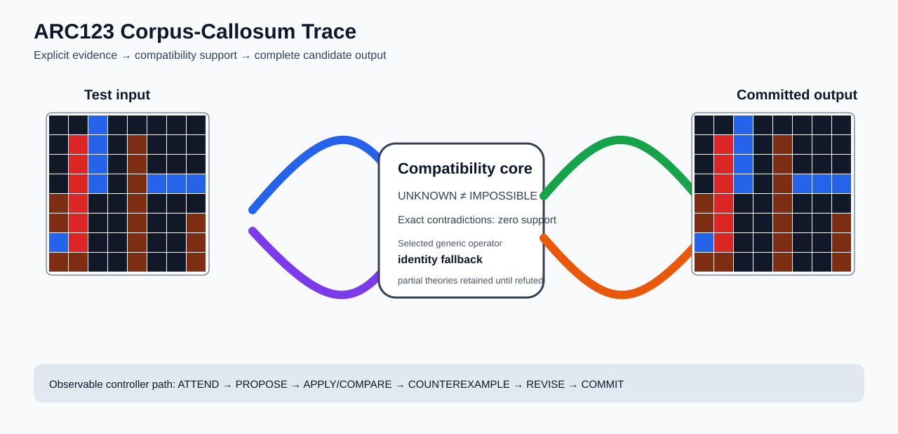

# ARC1 `833dafe3` IHL Brain Surgery Report

## Outcome: NO — TEST CELLS DO NOT ALL MATCH

- **Compared positions:** 256
- **Mismatched cells:** 256
- **Source commit:** `085f6dbe39050afac3d1d743f840bac95b1a8d1c`
- **Selected hypothesis:** `fallback_identity_complete_grid`
- **Training compatibility:** `False`
- **Fallback used:** `True`

## Live-Agent Boundary

The controller receives only training input/output evidence and the test input. It receives no task ID, historical schema/decomposition, GT feature contract, GT solver, or test target. The expected test output below is accessed only after the complete prediction is committed for V&V.

## Corpus-Callosum Visualization



- Full explicit event record: [`learning_trace.json`](learning_trace.json)

The diagram shows the actual test input, the typed compatibility core, and the committed full prediction. It renders observable operations only; it does not fabricate a one-to-one causal fiber where the selected program is only a factor-level dependency.

## Post-Answer V&V

### Test case 1
- **All cells match:** `False`
- **Mismatched cells:** `256`
- **Prediction:**
```json
[[0, 0, 1, 0, 0, 0, 0, 0], [0, 2, 1, 0, 9, 0, 0, 0], [0, 2, 1, 0, 9, 0, 0, 0], [0, 2, 1, 0, 9, 1, 1, 1], [9, 2, 0, 0, 9, 0, 0, 0], [9, 2, 0, 0, 9, 0, 0, 9], [1, 2, 0, 0, 9, 0, 0, 9], [9, 9, 0, 0, 9, 0, 0, 9]]
```
- **Expected output (post-answer only):**
```json
[[9, 0, 0, 9, 0, 0, 9, 9, 9, 9, 0, 0, 9, 0, 0, 9], [9, 0, 0, 9, 0, 0, 2, 1, 1, 2, 0, 0, 9, 0, 0, 9], [9, 0, 0, 9, 0, 0, 2, 9, 9, 2, 0, 0, 9, 0, 0, 9], [0, 0, 0, 9, 0, 0, 2, 9, 9, 2, 0, 0, 9, 0, 0, 0], [1, 1, 1, 9, 0, 1, 2, 0, 0, 2, 1, 0, 9, 1, 1, 1], [0, 0, 0, 9, 0, 1, 2, 0, 0, 2, 1, 0, 9, 0, 0, 0], [0, 0, 0, 9, 0, 1, 2, 0, 0, 2, 1, 0, 9, 0, 0, 0], [0, 0, 0, 0, 0, 1, 0, 0, 0, 0, 1, 0, 0, 0, 0, 0], [0, 0, 0, 0, 0, 1, 0, 0, 0, 0, 1, 0, 0, 0, 0, 0], [0, 0, 0, 9, 0, 1, 2, 0, 0, 2, 1, 0, 9, 0, 0, 0], [0, 0, 0, 9, 0, 1, 2, 0, 0, 2, 1, 0, 9, 0, 0, 0], [1, 1, 1, 9, 0, 1, 2, 0, 0, 2, 1, 0, 9, 1, 1, 1], [0, 0, 0, 9, 0, 0, 2, 9, 9, 2, 0, 0, 9, 0, 0, 0], [9, 0, 0, 9, 0, 0, 2, 9, 9, 2, 0, 0, 9, 0, 0, 9], [9, 0, 0, 9, 0, 0, 2, 1, 1, 2, 0, 0, 9, 0, 0, 9], [9, 0, 0, 9, 0, 0, 9, 9, 9, 9, 0, 0, 9, 0, 0, 9]]
```

## Observable IHL Walkthrough

The record contains explicit actions, predictions, feedback, and revisions; it does not claim or store hidden model reasoning.

### Action totals

- `APPLY_HYPOTHESIS`: 64
- `ATTEND`: 64
- `CHOOSE_NEXT_DEMO`: 64
- `COMMIT`: 1
- `COMPARE`: 64
- `COMPOSE_RULE`: 28
- `EXPLAIN_RESIDUAL`: 28
- `FIND_COUNTEREXAMPLE`: 55
- `PROPOSE`: 5
- `REJECT_RULE`: 4

### Decision milestones

- `0` `PROPOSE` — `{"parent_theory_id":"T0000","rule":{"description_length":1,"name":"identity","operation":"identity","parameters":{},"rule_id":"identity","scope":{"kind":"all","value":null}},"stage":"initial_generic_theories","theory_id":"T0001"}`
- `1` `PROPOSE` — `{"parent_theory_id":"T0000","rule":{"description_length":3,"name":"tile_repeat(column_factor=2,row_factor=2)","operation":"full_operator","parameters":{"column_factor":2,"operator":"tile_repeat","row_factor":2},"rule_id":"rule-tile_repeat","scope":{"kind":"all","value":null}},"stage":"initial_generic_theories","theory_id":"T0002"}`
- `2` `PROPOSE` — `{"parent_theory_id":"T0000","rule":{"description_length":2,"name":"left_right(scope=all)","operation":"coordinate_transform","parameters":{"axis":"left_right"},"rule_id":"coordinate-left_right","scope":{"kind":"all","value":null}},"stage":"initial_generic_theories","theory_id":"T0003"}`
- `3` `PROPOSE` — `{"parent_theory_id":"T0000","rule":{"description_length":2,"name":"top_bottom(scope=all)","operation":"coordinate_transform","parameters":{"axis":"top_bottom"},"rule_id":"coordinate-top_bottom","scope":{"kind":"all","value":null}},"stage":"initial_generic_theories","theory_id":"T0004"}`
- `4` `PROPOSE` — `{"parent_theory_id":"T0000","rule":{"description_length":2,"name":"rotate_180(scope=all)","operation":"coordinate_transform","parameters":{"axis":"rotate_180"},"rule_id":"coordinate-rotate_180","scope":{"kind":"all","value":null}},"stage":"initial_generic_theories","theory_id":"T0005"}`
- `6` `ATTEND` — `{"reason":"initial_highest_observed_change_and_color_discrimination","selected_demo":1,"selected_region":{"region":"whole_demo"},"theory_id":"T0001"}`
- `10` `ATTEND` — `{"reason":"initial_highest_observed_change_and_color_discrimination","selected_demo":1,"selected_region":{"region":"whole_demo"},"theory_id":"T0003"}`
- `14` `ATTEND` — `{"reason":"initial_highest_observed_change_and_color_discrimination","selected_demo":1,"selected_region":{"region":"whole_demo"},"theory_id":"T0004"}`
- `18` `ATTEND` — `{"reason":"initial_highest_observed_change_and_color_discrimination","selected_demo":1,"selected_region":{"region":"whole_demo"},"theory_id":"T0005"}`
- `22` `ATTEND` — `{"reason":"initial_highest_observed_change_and_color_discrimination","selected_demo":1,"selected_region":{"column":1,"row":0},"theory_id":"T0002"}`
- `26` `ATTEND` — `{"reason":"unseen_demo_selected_for_residual_version_space_discrimination","selected_demo":0,"selected_region":{"region":"whole_demo"},"theory_id":"T0001"}`
- `30` `ATTEND` — `{"reason":"unseen_demo_selected_for_residual_version_space_discrimination","selected_demo":0,"selected_region":{"region":"whole_demo"},"theory_id":"T0003"}`
- `34` `ATTEND` — `{"reason":"unseen_demo_selected_for_residual_version_space_discrimination","selected_demo":0,"selected_region":{"region":"whole_demo"},"theory_id":"T0004"}`
- `38` `ATTEND` — `{"reason":"unseen_demo_selected_for_residual_version_space_discrimination","selected_demo":0,"selected_region":{"region":"whole_demo"},"theory_id":"T0005"}`
- `49` `ATTEND` — `{"reason":"initial_highest_observed_change_and_color_discrimination","selected_demo":1,"selected_region":{"column":2,"row":0},"theory_id":"T0006"}`
- `56` `ATTEND` — `{"reason":"initial_highest_observed_change_and_color_discrimination","selected_demo":1,"selected_region":{"column":0,"row":0},"theory_id":"T0007"}`
- `61` `ATTEND` — `{"reason":"unseen_demo_selected_for_residual_version_space_discrimination","selected_demo":0,"selected_region":{"column":0,"row":0},"theory_id":"T0007"}`
- `68` `ATTEND` — `{"reason":"initial_highest_observed_change_and_color_discrimination","selected_demo":1,"selected_region":{"column":0,"row":0},"theory_id":"T0008"}`
- `73` `ATTEND` — `{"reason":"unseen_demo_selected_for_residual_version_space_discrimination","selected_demo":0,"selected_region":{"column":1,"row":0},"theory_id":"T0008"}`
- `80` `ATTEND` — `{"reason":"initial_highest_observed_change_and_color_discrimination","selected_demo":1,"selected_region":{"column":0,"row":0},"theory_id":"T0009"}`
- `85` `ATTEND` — `{"reason":"unseen_demo_selected_for_residual_version_space_discrimination","selected_demo":0,"selected_region":{"column":2,"row":0},"theory_id":"T0009"}`
- `92` `ATTEND` — `{"reason":"initial_highest_observed_change_and_color_discrimination","selected_demo":1,"selected_region":{"column":0,"row":0},"theory_id":"T0010"}`
- `97` `ATTEND` — `{"reason":"unseen_demo_selected_for_residual_version_space_discrimination","selected_demo":0,"selected_region":{"column":1,"row":0},"theory_id":"T0010"}`
- `104` `ATTEND` — `{"reason":"initial_highest_observed_change_and_color_discrimination","selected_demo":1,"selected_region":{"column":0,"row":0},"theory_id":"T0011"}`
- `109` `ATTEND` — `{"reason":"unseen_demo_selected_for_residual_version_space_discrimination","selected_demo":0,"selected_region":{"column":2,"row":0},"theory_id":"T0011"}`
- `116` `ATTEND` — `{"reason":"initial_highest_observed_change_and_color_discrimination","selected_demo":1,"selected_region":{"column":0,"row":0},"theory_id":"T0012"}`
- `121` `ATTEND` — `{"reason":"unseen_demo_selected_for_residual_version_space_discrimination","selected_demo":0,"selected_region":{"column":1,"row":0},"theory_id":"T0012"}`
- `128` `ATTEND` — `{"reason":"initial_highest_observed_change_and_color_discrimination","selected_demo":1,"selected_region":{"column":0,"row":0},"theory_id":"T0013"}`
- `133` `ATTEND` — `{"reason":"unseen_demo_selected_for_residual_version_space_discrimination","selected_demo":0,"selected_region":{"column":2,"row":0},"theory_id":"T0013"}`
- `140` `ATTEND` — `{"reason":"initial_highest_observed_change_and_color_discrimination","selected_demo":1,"selected_region":{"column":0,"row":0},"theory_id":"T0014"}`
- `145` `ATTEND` — `{"reason":"unseen_demo_selected_for_residual_version_space_discrimination","selected_demo":0,"selected_region":{"column":1,"row":0},"theory_id":"T0014"}`
- `152` `ATTEND` — `{"reason":"initial_highest_observed_change_and_color_discrimination","selected_demo":1,"selected_region":{"column":0,"row":0},"theory_id":"T0015"}`
- `157` `ATTEND` — `{"reason":"unseen_demo_selected_for_residual_version_space_discrimination","selected_demo":0,"selected_region":{"column":2,"row":0},"theory_id":"T0015"}`
- `164` `ATTEND` — `{"reason":"initial_highest_observed_change_and_color_discrimination","selected_demo":1,"selected_region":{"column":0,"row":0},"theory_id":"T0016"}`
- `169` `ATTEND` — `{"reason":"unseen_demo_selected_for_residual_version_space_discrimination","selected_demo":0,"selected_region":{"column":1,"row":0},"theory_id":"T0016"}`
- `176` `ATTEND` — `{"reason":"initial_highest_observed_change_and_color_discrimination","selected_demo":1,"selected_region":{"column":0,"row":0},"theory_id":"T0017"}`
- `181` `ATTEND` — `{"reason":"unseen_demo_selected_for_residual_version_space_discrimination","selected_demo":0,"selected_region":{"column":2,"row":0},"theory_id":"T0017"}`
- `188` `ATTEND` — `{"reason":"initial_highest_observed_change_and_color_discrimination","selected_demo":1,"selected_region":{"column":0,"row":0},"theory_id":"T0018"}`
- `193` `ATTEND` — `{"reason":"unseen_demo_selected_for_residual_version_space_discrimination","selected_demo":0,"selected_region":{"column":1,"row":0},"theory_id":"T0018"}`
- `200` `ATTEND` — `{"reason":"initial_highest_observed_change_and_color_discrimination","selected_demo":1,"selected_region":{"column":0,"row":0},"theory_id":"T0019"}`
- `205` `ATTEND` — `{"reason":"unseen_demo_selected_for_residual_version_space_discrimination","selected_demo":0,"selected_region":{"column":2,"row":0},"theory_id":"T0019"}`
- `212` `ATTEND` — `{"reason":"initial_highest_observed_change_and_color_discrimination","selected_demo":1,"selected_region":{"column":0,"row":0},"theory_id":"T0020"}`
- `217` `ATTEND` — `{"reason":"unseen_demo_selected_for_residual_version_space_discrimination","selected_demo":0,"selected_region":{"column":1,"row":0},"theory_id":"T0020"}`
- `224` `ATTEND` — `{"reason":"initial_highest_observed_change_and_color_discrimination","selected_demo":1,"selected_region":{"column":0,"row":0},"theory_id":"T0021"}`
- `229` `ATTEND` — `{"reason":"unseen_demo_selected_for_residual_version_space_discrimination","selected_demo":0,"selected_region":{"column":2,"row":0},"theory_id":"T0021"}`
- `236` `ATTEND` — `{"reason":"initial_highest_observed_change_and_color_discrimination","selected_demo":1,"selected_region":{"column":0,"row":0},"theory_id":"T0022"}`
- `241` `ATTEND` — `{"reason":"unseen_demo_selected_for_residual_version_space_discrimination","selected_demo":0,"selected_region":{"column":1,"row":0},"theory_id":"T0022"}`
- `248` `ATTEND` — `{"reason":"initial_highest_observed_change_and_color_discrimination","selected_demo":1,"selected_region":{"column":0,"row":0},"theory_id":"T0023"}`
- `253` `ATTEND` — `{"reason":"unseen_demo_selected_for_residual_version_space_discrimination","selected_demo":0,"selected_region":{"column":2,"row":0},"theory_id":"T0023"}`
- `260` `ATTEND` — `{"reason":"initial_highest_observed_change_and_color_discrimination","selected_demo":1,"selected_region":{"column":0,"row":0},"theory_id":"T0024"}`
- `265` `ATTEND` — `{"reason":"unseen_demo_selected_for_residual_version_space_discrimination","selected_demo":0,"selected_region":{"column":1,"row":0},"theory_id":"T0024"}`
- `272` `ATTEND` — `{"reason":"initial_highest_observed_change_and_color_discrimination","selected_demo":1,"selected_region":{"column":0,"row":0},"theory_id":"T0025"}`
- `277` `ATTEND` — `{"reason":"unseen_demo_selected_for_residual_version_space_discrimination","selected_demo":0,"selected_region":{"column":2,"row":0},"theory_id":"T0025"}`
- `284` `ATTEND` — `{"reason":"initial_highest_observed_change_and_color_discrimination","selected_demo":1,"selected_region":{"column":0,"row":0},"theory_id":"T0026"}`
- `289` `ATTEND` — `{"reason":"unseen_demo_selected_for_residual_version_space_discrimination","selected_demo":0,"selected_region":{"column":1,"row":0},"theory_id":"T0026"}`
- `296` `ATTEND` — `{"reason":"initial_highest_observed_change_and_color_discrimination","selected_demo":1,"selected_region":{"column":0,"row":0},"theory_id":"T0027"}`
- `301` `ATTEND` — `{"reason":"unseen_demo_selected_for_residual_version_space_discrimination","selected_demo":0,"selected_region":{"column":2,"row":0},"theory_id":"T0027"}`
- `308` `ATTEND` — `{"reason":"initial_highest_observed_change_and_color_discrimination","selected_demo":1,"selected_region":{"column":0,"row":0},"theory_id":"T0028"}`
- `313` `ATTEND` — `{"reason":"unseen_demo_selected_for_residual_version_space_discrimination","selected_demo":0,"selected_region":{"column":1,"row":0},"theory_id":"T0028"}`
- `320` `ATTEND` — `{"reason":"initial_highest_observed_change_and_color_discrimination","selected_demo":1,"selected_region":{"column":0,"row":0},"theory_id":"T0029"}`
- `325` `ATTEND` — `{"reason":"unseen_demo_selected_for_residual_version_space_discrimination","selected_demo":0,"selected_region":{"column":2,"row":0},"theory_id":"T0029"}`
- `332` `ATTEND` — `{"reason":"initial_highest_observed_change_and_color_discrimination","selected_demo":1,"selected_region":{"column":0,"row":0},"theory_id":"T0030"}`
- `337` `ATTEND` — `{"reason":"unseen_demo_selected_for_residual_version_space_discrimination","selected_demo":0,"selected_region":{"column":1,"row":0},"theory_id":"T0030"}`
- `344` `ATTEND` — `{"reason":"initial_highest_observed_change_and_color_discrimination","selected_demo":1,"selected_region":{"column":0,"row":0},"theory_id":"T0031"}`
- `349` `ATTEND` — `{"reason":"unseen_demo_selected_for_residual_version_space_discrimination","selected_demo":0,"selected_region":{"column":2,"row":0},"theory_id":"T0031"}`
- `356` `ATTEND` — `{"reason":"initial_highest_observed_change_and_color_discrimination","selected_demo":1,"selected_region":{"column":0,"row":0},"theory_id":"T0032"}`
- `361` `ATTEND` — `{"reason":"unseen_demo_selected_for_residual_version_space_discrimination","selected_demo":0,"selected_region":{"column":1,"row":0},"theory_id":"T0032"}`
- `368` `ATTEND` — `{"reason":"initial_highest_observed_change_and_color_discrimination","selected_demo":1,"selected_region":{"column":0,"row":0},"theory_id":"T0033"}`
- `373` `ATTEND` — `{"reason":"unseen_demo_selected_for_residual_version_space_discrimination","selected_demo":0,"selected_region":{"column":2,"row":0},"theory_id":"T0033"}`
- `376` `COMMIT` — `{"best_partial_theory":{"contradiction_count":0,"counterexamples":[],"description_length":1,"evaluated_demo_indices":[],"history":[{"kind":"ADD_RULE","parameters":{"initial_proposal":true,"operation":"identity"},"target":"identity"}],"matching_cell_count":0,"name":"identity","parameter_bindings":{},"parent_theory_id":"T0000","rules":[{"description_length":1,"name":"identity","operation":"identity","parameters":{},"rule_id":"identity","scope":{"kind":"all","value":null}}],"scope_predicates":[{"kind":"all","value":null}],"theory_id":"T0001","unknown_cell_count":0,"unresolved_unknown":[]},"complete_prediction_group_count":0,"fallback_reason":"no_complete_training_compatible_partial_theory","posterior_mass":0.0,"selected_hypothesis":"fallback_identity_complete_grid","training_exact":false}`

### First counterexamples

- `45` — `{"causal_next_operation":"scope_or_rule_revision","counterexample":{"column":1,"demo_index":1,"observed":3,"predicted":6,"row":0},"responsible_rule":{"description_length":3,"name":"tile_repeat(column_factor=2,row_factor=2)","operation":"full_operator","parameters":{"column_factor":2,"operator":"tile_repeat","row_factor":2},"rule_id":"rule-tile_repeat","scope":{"kind":"all","value":null}},"responsible_rule_id":"rule-tile_repeat","theory_id":"T0002"}`
- `52` — `{"causal_next_operation":"scope_or_rule_revision","counterexample":{"column":2,"demo_index":1,"observed":3,"predicted":0,"row":0},"responsible_rule":{"description_length":3,"name":"tile_repeat(column_factor=2,row_factor=2)","operation":"full_operator","parameters":{"column_factor":2,"operator":"tile_repeat","row_factor":2},"rule_id":"rule-tile_repeat","scope":{"kind":"all","value":null}},"responsible_rule_id":"rule-tile_repeat","theory_id":"T0006"}`
- `59` — `{"causal_next_operation":"scope_or_rule_revision","counterexample":{"column":0,"demo_index":1,"observed":0,"predicted":3,"row":0},"responsible_rule":{"description_length":2,"name":"recolor(to=3,scope=color==0)","operation":"recolor_scoped","parameters":{"to_color":3},"rule_id":"recolor-color-0-to-3","scope":{"kind":"color_equals","value":0}},"responsible_rule_id":"recolor-color-0-to-3","theory_id":"T0007"}`
- `64` — `{"causal_next_operation":"scope_or_rule_revision","counterexample":{"column":0,"demo_index":0,"observed":2,"predicted":3,"row":0},"responsible_rule":{"description_length":3,"name":"tile_repeat(column_factor=2,row_factor=2)","operation":"full_operator","parameters":{"column_factor":2,"operator":"tile_repeat","row_factor":2},"rule_id":"rule-tile_repeat","scope":{"kind":"all","value":null}},"responsible_rule_id":"rule-tile_repeat","theory_id":"T0007"}`
- `71` — `{"causal_next_operation":"scope_or_rule_revision","counterexample":{"column":0,"demo_index":1,"observed":0,"predicted":3,"row":0},"responsible_rule":{"description_length":2,"name":"recolor(to=3,scope=color==0)","operation":"recolor_scoped","parameters":{"to_color":3},"rule_id":"recolor-color-0-to-3","scope":{"kind":"color_equals","value":0}},"responsible_rule_id":"recolor-color-0-to-3","theory_id":"T0008"}`
- `50` additional explicit counterexamples are retained in `learning_trace.json`.
