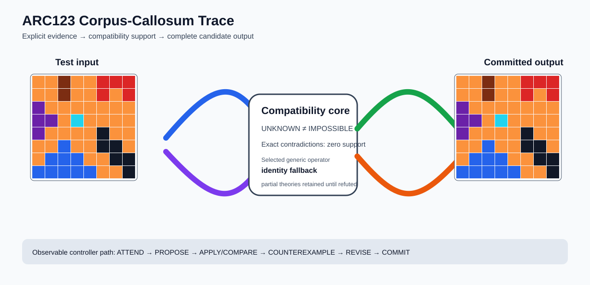

# ARC2 `5587a8d0` IHL Brain Surgery Report

## Outcome: NO — TEST CELLS DO NOT ALL MATCH

- **Compared positions:** 121
- **Mismatched cells:** 121
- **Source commit:** `71f86ff4c5304e452e0659131171f0519b50e21c`
- **Selected hypothesis:** `fallback_identity_complete_grid`
- **Training compatibility:** `False`
- **Fallback used:** `True`

## Live-Agent Boundary

The controller receives only training input/output evidence and the test input. It receives no task ID, historical schema/decomposition, GT feature contract, GT solver, or test target. The expected test output below is accessed only after the complete prediction is committed for V&V.

## Corpus-Callosum Visualization



- Full explicit event record: [`learning_trace.json`](learning_trace.json)

The diagram shows the actual test input, the typed compatibility core, and the committed full prediction. It renders observable operations only; it does not fabricate a one-to-one causal fiber where the selected program is only a factor-level dependency.

## Post-Answer V&V

### Test case 1
- **All cells match:** `False`
- **Mismatched cells:** `121`
- **Prediction:**
```json
[[7, 7, 9, 7, 7, 2, 2, 2], [7, 7, 9, 7, 7, 2, 7, 2], [5, 7, 7, 7, 7, 7, 7, 7], [5, 5, 7, 8, 7, 7, 7, 7], [5, 7, 7, 7, 7, 0, 7, 7], [7, 7, 1, 7, 7, 0, 0, 7], [7, 1, 1, 1, 7, 7, 0, 0], [1, 1, 1, 1, 1, 7, 7, 0]]
```
- **Expected output (post-answer only):**
```json
[[1, 1, 1, 1, 1, 1, 1, 1, 1, 1, 1], [1, 0, 0, 0, 0, 0, 0, 0, 0, 0, 1], [1, 0, 2, 2, 2, 2, 2, 2, 2, 0, 1], [1, 0, 2, 5, 5, 5, 5, 5, 2, 0, 1], [1, 0, 2, 5, 9, 9, 9, 5, 2, 0, 1], [1, 0, 2, 5, 9, 8, 9, 5, 2, 0, 1], [1, 0, 2, 5, 9, 9, 9, 5, 2, 0, 1], [1, 0, 2, 5, 5, 5, 5, 5, 2, 0, 1], [1, 0, 2, 2, 2, 2, 2, 2, 2, 0, 1], [1, 0, 0, 0, 0, 0, 0, 0, 0, 0, 1], [1, 1, 1, 1, 1, 1, 1, 1, 1, 1, 1]]
```

## Observable IHL Walkthrough

The record contains explicit actions, predictions, feedback, and revisions; it does not claim or store hidden model reasoning.

### Action totals

- `APPLY_HYPOTHESIS`: 88
- `ATTEND`: 88
- `CHOOSE_NEXT_DEMO`: 88
- `COMMIT`: 1
- `COMPARE`: 88
- `COMPOSE_RULE`: 8
- `EXPLAIN_RESIDUAL`: 8
- `FIND_COUNTEREXAMPLE`: 8
- `PROPOSE`: 4
- `SPECIALIZE`: 96

### Decision milestones

- `0` `PROPOSE` — `{"parent_theory_id":"T0000","rule":{"description_length":1,"name":"identity","operation":"identity","parameters":{},"rule_id":"identity","scope":{"kind":"all","value":null}},"stage":"initial_generic_theories","theory_id":"T0001"}`
- `1` `PROPOSE` — `{"parent_theory_id":"T0000","rule":{"description_length":2,"name":"left_right(scope=all)","operation":"coordinate_transform","parameters":{"axis":"left_right"},"rule_id":"coordinate-left_right","scope":{"kind":"all","value":null}},"stage":"initial_generic_theories","theory_id":"T0002"}`
- `2` `PROPOSE` — `{"parent_theory_id":"T0000","rule":{"description_length":2,"name":"top_bottom(scope=all)","operation":"coordinate_transform","parameters":{"axis":"top_bottom"},"rule_id":"coordinate-top_bottom","scope":{"kind":"all","value":null}},"stage":"initial_generic_theories","theory_id":"T0003"}`
- `3` `PROPOSE` — `{"parent_theory_id":"T0000","rule":{"description_length":2,"name":"rotate_180(scope=all)","operation":"coordinate_transform","parameters":{"axis":"rotate_180"},"rule_id":"coordinate-rotate_180","scope":{"kind":"all","value":null}},"stage":"initial_generic_theories","theory_id":"T0004"}`
- `5` `ATTEND` — `{"reason":"initial_highest_observed_change_and_color_discrimination","selected_demo":2,"selected_region":{"column":0,"row":0},"theory_id":"T0001"}`
- `9` `ATTEND` — `{"reason":"initial_highest_observed_change_and_color_discrimination","selected_demo":2,"selected_region":{"column":0,"row":0},"theory_id":"T0002"}`
- `13` `ATTEND` — `{"reason":"initial_highest_observed_change_and_color_discrimination","selected_demo":2,"selected_region":{"column":0,"row":0},"theory_id":"T0003"}`
- `17` `ATTEND` — `{"reason":"initial_highest_observed_change_and_color_discrimination","selected_demo":2,"selected_region":{"column":0,"row":0},"theory_id":"T0004"}`
- `23` `SPECIALIZE` — `{"added_rule":{"description_length":4,"name":"line_extend(direction=up,fill_color=8,seed_color=0)","operation":"full_operator","parameters":{"direction":"up","fill_color":8,"operator":"line_extend","seed_color":0},"rule_id":"structural-line_extend","scope":{"kind":"all","value":null}},"parent_theory_id":"T0001","reason":"unexplained_residual_proposed_generic_structural_rule","theory_id":"T0006"}`
- `24` `SPECIALIZE` — `{"added_rule":{"description_length":4,"name":"line_extend(direction=right,fill_color=8,seed_color=0)","operation":"full_operator","parameters":{"direction":"right","fill_color":8,"operator":"line_extend","seed_color":0},"rule_id":"structural-line_extend","scope":{"kind":"all","value":null}},"parent_theory_id":"T0001","reason":"unexplained_residual_proposed_generic_structural_rule","theory_id":"T0007"}`
- `25` `SPECIALIZE` — `{"added_rule":{"description_length":4,"name":"line_extend(direction=down,fill_color=8,seed_color=3)","operation":"full_operator","parameters":{"direction":"down","fill_color":8,"operator":"line_extend","seed_color":3},"rule_id":"structural-line_extend","scope":{"kind":"all","value":null}},"parent_theory_id":"T0001","reason":"unexplained_residual_proposed_generic_structural_rule","theory_id":"T0008"}`
- `26` `SPECIALIZE` — `{"added_rule":{"description_length":4,"name":"line_extend(direction=right,fill_color=0,seed_color=0)","operation":"full_operator","parameters":{"direction":"right","fill_color":0,"operator":"line_extend","seed_color":0},"rule_id":"structural-line_extend","scope":{"kind":"all","value":null}},"parent_theory_id":"T0001","reason":"unexplained_residual_proposed_generic_structural_rule","theory_id":"T0009"}`
- `27` `SPECIALIZE` — `{"added_rule":{"description_length":4,"name":"line_extend(direction=up,fill_color=8,seed_color=8)","operation":"full_operator","parameters":{"direction":"up","fill_color":8,"operator":"line_extend","seed_color":8},"rule_id":"structural-line_extend","scope":{"kind":"all","value":null}},"parent_theory_id":"T0001","reason":"unexplained_residual_proposed_generic_structural_rule","theory_id":"T0010"}`
- `28` `SPECIALIZE` — `{"added_rule":{"description_length":4,"name":"line_extend(direction=right,fill_color=3,seed_color=8)","operation":"full_operator","parameters":{"direction":"right","fill_color":3,"operator":"line_extend","seed_color":8},"rule_id":"structural-line_extend","scope":{"kind":"all","value":null}},"parent_theory_id":"T0001","reason":"unexplained_residual_proposed_generic_structural_rule","theory_id":"T0011"}`
- `29` `SPECIALIZE` — `{"added_rule":{"description_length":4,"name":"line_extend(direction=right,fill_color=0,seed_color=8)","operation":"full_operator","parameters":{"direction":"right","fill_color":0,"operator":"line_extend","seed_color":8},"rule_id":"structural-line_extend","scope":{"kind":"all","value":null}},"parent_theory_id":"T0001","reason":"unexplained_residual_proposed_generic_structural_rule","theory_id":"T0012"}`
- `30` `SPECIALIZE` — `{"added_rule":{"description_length":4,"name":"line_extend(direction=left,fill_color=8,seed_color=8)","operation":"full_operator","parameters":{"direction":"left","fill_color":8,"operator":"line_extend","seed_color":8},"rule_id":"structural-line_extend","scope":{"kind":"all","value":null}},"parent_theory_id":"T0001","reason":"unexplained_residual_proposed_generic_structural_rule","theory_id":"T0013"}`
- `31` `SPECIALIZE` — `{"added_rule":{"description_length":4,"name":"line_extend(direction=left,fill_color=3,seed_color=9)","operation":"full_operator","parameters":{"direction":"left","fill_color":3,"operator":"line_extend","seed_color":9},"rule_id":"structural-line_extend","scope":{"kind":"all","value":null}},"parent_theory_id":"T0001","reason":"unexplained_residual_proposed_generic_structural_rule","theory_id":"T0014"}`
- `32` `SPECIALIZE` — `{"added_rule":{"description_length":4,"name":"line_extend(direction=down,fill_color=3,seed_color=8)","operation":"full_operator","parameters":{"direction":"down","fill_color":3,"operator":"line_extend","seed_color":8},"rule_id":"structural-line_extend","scope":{"kind":"all","value":null}},"parent_theory_id":"T0001","reason":"unexplained_residual_proposed_generic_structural_rule","theory_id":"T0015"}`
- `33` `SPECIALIZE` — `{"added_rule":{"description_length":4,"name":"line_extend(direction=down,fill_color=0,seed_color=8)","operation":"full_operator","parameters":{"direction":"down","fill_color":0,"operator":"line_extend","seed_color":8},"rule_id":"structural-line_extend","scope":{"kind":"all","value":null}},"parent_theory_id":"T0001","reason":"unexplained_residual_proposed_generic_structural_rule","theory_id":"T0016"}`
- `34` `SPECIALIZE` — `{"added_rule":{"description_length":4,"name":"line_extend(direction=down,fill_color=0,seed_color=3)","operation":"full_operator","parameters":{"direction":"down","fill_color":0,"operator":"line_extend","seed_color":3},"rule_id":"structural-line_extend","scope":{"kind":"all","value":null}},"parent_theory_id":"T0001","reason":"unexplained_residual_proposed_generic_structural_rule","theory_id":"T0017"}`
- `36` `ATTEND` — `{"reason":"initial_highest_observed_change_and_color_discrimination","selected_demo":2,"selected_region":{"column":1,"row":1},"theory_id":"T0005"}`
- `40` `ATTEND` — `{"reason":"initial_highest_observed_change_and_color_discrimination","selected_demo":2,"selected_region":{"column":2,"row":0},"theory_id":"T0006"}`
- `44` `ATTEND` — `{"reason":"initial_highest_observed_change_and_color_discrimination","selected_demo":2,"selected_region":{"column":0,"row":0},"theory_id":"T0007"}`
- `48` `ATTEND` — `{"reason":"initial_highest_observed_change_and_color_discrimination","selected_demo":2,"selected_region":{"column":0,"row":0},"theory_id":"T0008"}`
- `52` `ATTEND` — `{"reason":"initial_highest_observed_change_and_color_discrimination","selected_demo":2,"selected_region":{"column":0,"row":0},"theory_id":"T0009"}`
- `56` `ATTEND` — `{"reason":"initial_highest_observed_change_and_color_discrimination","selected_demo":2,"selected_region":{"column":0,"row":0},"theory_id":"T0010"}`
- `60` `ATTEND` — `{"reason":"initial_highest_observed_change_and_color_discrimination","selected_demo":2,"selected_region":{"column":0,"row":0},"theory_id":"T0011"}`
- `64` `ATTEND` — `{"reason":"initial_highest_observed_change_and_color_discrimination","selected_demo":2,"selected_region":{"column":0,"row":0},"theory_id":"T0012"}`
- `68` `ATTEND` — `{"reason":"initial_highest_observed_change_and_color_discrimination","selected_demo":2,"selected_region":{"column":0,"row":0},"theory_id":"T0013"}`
- `72` `ATTEND` — `{"reason":"initial_highest_observed_change_and_color_discrimination","selected_demo":2,"selected_region":{"column":0,"row":0},"theory_id":"T0014"}`
- `76` `ATTEND` — `{"reason":"initial_highest_observed_change_and_color_discrimination","selected_demo":2,"selected_region":{"column":0,"row":0},"theory_id":"T0015"}`
- `80` `ATTEND` — `{"reason":"initial_highest_observed_change_and_color_discrimination","selected_demo":2,"selected_region":{"column":0,"row":0},"theory_id":"T0016"}`
- `86` `SPECIALIZE` — `{"added_rule":{"description_length":4,"name":"line_extend(direction=up,fill_color=8,seed_color=0)","operation":"full_operator","parameters":{"direction":"up","fill_color":8,"operator":"line_extend","seed_color":0},"rule_id":"structural-line_extend","scope":{"kind":"all","value":null}},"parent_theory_id":"T0005","reason":"unexplained_residual_proposed_generic_structural_rule","theory_id":"T0019"}`
- `87` `SPECIALIZE` — `{"added_rule":{"description_length":4,"name":"line_extend(direction=right,fill_color=8,seed_color=0)","operation":"full_operator","parameters":{"direction":"right","fill_color":8,"operator":"line_extend","seed_color":0},"rule_id":"structural-line_extend","scope":{"kind":"all","value":null}},"parent_theory_id":"T0005","reason":"unexplained_residual_proposed_generic_structural_rule","theory_id":"T0020"}`
- `88` `SPECIALIZE` — `{"added_rule":{"description_length":4,"name":"line_extend(direction=down,fill_color=8,seed_color=3)","operation":"full_operator","parameters":{"direction":"down","fill_color":8,"operator":"line_extend","seed_color":3},"rule_id":"structural-line_extend","scope":{"kind":"all","value":null}},"parent_theory_id":"T0005","reason":"unexplained_residual_proposed_generic_structural_rule","theory_id":"T0021"}`
- `89` `SPECIALIZE` — `{"added_rule":{"description_length":4,"name":"line_extend(direction=right,fill_color=0,seed_color=0)","operation":"full_operator","parameters":{"direction":"right","fill_color":0,"operator":"line_extend","seed_color":0},"rule_id":"structural-line_extend","scope":{"kind":"all","value":null}},"parent_theory_id":"T0005","reason":"unexplained_residual_proposed_generic_structural_rule","theory_id":"T0022"}`
- `90` `SPECIALIZE` — `{"added_rule":{"description_length":4,"name":"line_extend(direction=up,fill_color=8,seed_color=8)","operation":"full_operator","parameters":{"direction":"up","fill_color":8,"operator":"line_extend","seed_color":8},"rule_id":"structural-line_extend","scope":{"kind":"all","value":null}},"parent_theory_id":"T0005","reason":"unexplained_residual_proposed_generic_structural_rule","theory_id":"T0023"}`
- `91` `SPECIALIZE` — `{"added_rule":{"description_length":4,"name":"line_extend(direction=right,fill_color=3,seed_color=8)","operation":"full_operator","parameters":{"direction":"right","fill_color":3,"operator":"line_extend","seed_color":8},"rule_id":"structural-line_extend","scope":{"kind":"all","value":null}},"parent_theory_id":"T0005","reason":"unexplained_residual_proposed_generic_structural_rule","theory_id":"T0024"}`
- `92` `SPECIALIZE` — `{"added_rule":{"description_length":4,"name":"line_extend(direction=right,fill_color=0,seed_color=8)","operation":"full_operator","parameters":{"direction":"right","fill_color":0,"operator":"line_extend","seed_color":8},"rule_id":"structural-line_extend","scope":{"kind":"all","value":null}},"parent_theory_id":"T0005","reason":"unexplained_residual_proposed_generic_structural_rule","theory_id":"T0025"}`
- `93` `SPECIALIZE` — `{"added_rule":{"description_length":4,"name":"line_extend(direction=left,fill_color=8,seed_color=8)","operation":"full_operator","parameters":{"direction":"left","fill_color":8,"operator":"line_extend","seed_color":8},"rule_id":"structural-line_extend","scope":{"kind":"all","value":null}},"parent_theory_id":"T0005","reason":"unexplained_residual_proposed_generic_structural_rule","theory_id":"T0026"}`
- `94` `SPECIALIZE` — `{"added_rule":{"description_length":4,"name":"line_extend(direction=left,fill_color=3,seed_color=9)","operation":"full_operator","parameters":{"direction":"left","fill_color":3,"operator":"line_extend","seed_color":9},"rule_id":"structural-line_extend","scope":{"kind":"all","value":null}},"parent_theory_id":"T0005","reason":"unexplained_residual_proposed_generic_structural_rule","theory_id":"T0027"}`
- `95` `SPECIALIZE` — `{"added_rule":{"description_length":4,"name":"line_extend(direction=down,fill_color=3,seed_color=8)","operation":"full_operator","parameters":{"direction":"down","fill_color":3,"operator":"line_extend","seed_color":8},"rule_id":"structural-line_extend","scope":{"kind":"all","value":null}},"parent_theory_id":"T0005","reason":"unexplained_residual_proposed_generic_structural_rule","theory_id":"T0028"}`
- `96` `SPECIALIZE` — `{"added_rule":{"description_length":4,"name":"line_extend(direction=down,fill_color=0,seed_color=8)","operation":"full_operator","parameters":{"direction":"down","fill_color":0,"operator":"line_extend","seed_color":8},"rule_id":"structural-line_extend","scope":{"kind":"all","value":null}},"parent_theory_id":"T0005","reason":"unexplained_residual_proposed_generic_structural_rule","theory_id":"T0029"}`
- `97` `SPECIALIZE` — `{"added_rule":{"description_length":4,"name":"line_extend(direction=down,fill_color=0,seed_color=3)","operation":"full_operator","parameters":{"direction":"down","fill_color":0,"operator":"line_extend","seed_color":3},"rule_id":"structural-line_extend","scope":{"kind":"all","value":null}},"parent_theory_id":"T0005","reason":"unexplained_residual_proposed_generic_structural_rule","theory_id":"T0030"}`
- `99` `ATTEND` — `{"reason":"initial_highest_observed_change_and_color_discrimination","selected_demo":2,"selected_region":{"column":4,"row":1},"theory_id":"T0018"}`
- `103` `ATTEND` — `{"reason":"initial_highest_observed_change_and_color_discrimination","selected_demo":2,"selected_region":{"column":2,"row":0},"theory_id":"T0019"}`
- `107` `ATTEND` — `{"reason":"initial_highest_observed_change_and_color_discrimination","selected_demo":2,"selected_region":{"column":0,"row":0},"theory_id":"T0020"}`
- `111` `ATTEND` — `{"reason":"initial_highest_observed_change_and_color_discrimination","selected_demo":2,"selected_region":{"column":0,"row":0},"theory_id":"T0021"}`
- `115` `ATTEND` — `{"reason":"initial_highest_observed_change_and_color_discrimination","selected_demo":2,"selected_region":{"column":0,"row":0},"theory_id":"T0022"}`
- `119` `ATTEND` — `{"reason":"initial_highest_observed_change_and_color_discrimination","selected_demo":2,"selected_region":{"column":0,"row":0},"theory_id":"T0023"}`
- `123` `ATTEND` — `{"reason":"initial_highest_observed_change_and_color_discrimination","selected_demo":2,"selected_region":{"column":0,"row":0},"theory_id":"T0024"}`
- `127` `ATTEND` — `{"reason":"initial_highest_observed_change_and_color_discrimination","selected_demo":2,"selected_region":{"column":0,"row":0},"theory_id":"T0025"}`
- `131` `ATTEND` — `{"reason":"initial_highest_observed_change_and_color_discrimination","selected_demo":2,"selected_region":{"column":0,"row":0},"theory_id":"T0026"}`
- `135` `ATTEND` — `{"reason":"initial_highest_observed_change_and_color_discrimination","selected_demo":2,"selected_region":{"column":0,"row":0},"theory_id":"T0027"}`
- `139` `ATTEND` — `{"reason":"initial_highest_observed_change_and_color_discrimination","selected_demo":2,"selected_region":{"column":0,"row":0},"theory_id":"T0028"}`
- `143` `ATTEND` — `{"reason":"initial_highest_observed_change_and_color_discrimination","selected_demo":2,"selected_region":{"column":0,"row":0},"theory_id":"T0029"}`
- `149` `SPECIALIZE` — `{"added_rule":{"description_length":4,"name":"line_extend(direction=up,fill_color=8,seed_color=0)","operation":"full_operator","parameters":{"direction":"up","fill_color":8,"operator":"line_extend","seed_color":0},"rule_id":"structural-line_extend","scope":{"kind":"all","value":null}},"parent_theory_id":"T0018","reason":"unexplained_residual_proposed_generic_structural_rule","theory_id":"T0032"}`
- `150` `SPECIALIZE` — `{"added_rule":{"description_length":4,"name":"line_extend(direction=right,fill_color=8,seed_color=0)","operation":"full_operator","parameters":{"direction":"right","fill_color":8,"operator":"line_extend","seed_color":0},"rule_id":"structural-line_extend","scope":{"kind":"all","value":null}},"parent_theory_id":"T0018","reason":"unexplained_residual_proposed_generic_structural_rule","theory_id":"T0033"}`
- `151` `SPECIALIZE` — `{"added_rule":{"description_length":4,"name":"line_extend(direction=down,fill_color=8,seed_color=3)","operation":"full_operator","parameters":{"direction":"down","fill_color":8,"operator":"line_extend","seed_color":3},"rule_id":"structural-line_extend","scope":{"kind":"all","value":null}},"parent_theory_id":"T0018","reason":"unexplained_residual_proposed_generic_structural_rule","theory_id":"T0034"}`
- `152` `SPECIALIZE` — `{"added_rule":{"description_length":4,"name":"line_extend(direction=right,fill_color=0,seed_color=0)","operation":"full_operator","parameters":{"direction":"right","fill_color":0,"operator":"line_extend","seed_color":0},"rule_id":"structural-line_extend","scope":{"kind":"all","value":null}},"parent_theory_id":"T0018","reason":"unexplained_residual_proposed_generic_structural_rule","theory_id":"T0035"}`
- `153` `SPECIALIZE` — `{"added_rule":{"description_length":4,"name":"line_extend(direction=up,fill_color=8,seed_color=8)","operation":"full_operator","parameters":{"direction":"up","fill_color":8,"operator":"line_extend","seed_color":8},"rule_id":"structural-line_extend","scope":{"kind":"all","value":null}},"parent_theory_id":"T0018","reason":"unexplained_residual_proposed_generic_structural_rule","theory_id":"T0036"}`
- `154` `SPECIALIZE` — `{"added_rule":{"description_length":4,"name":"line_extend(direction=right,fill_color=3,seed_color=8)","operation":"full_operator","parameters":{"direction":"right","fill_color":3,"operator":"line_extend","seed_color":8},"rule_id":"structural-line_extend","scope":{"kind":"all","value":null}},"parent_theory_id":"T0018","reason":"unexplained_residual_proposed_generic_structural_rule","theory_id":"T0037"}`
- `155` `SPECIALIZE` — `{"added_rule":{"description_length":4,"name":"line_extend(direction=right,fill_color=0,seed_color=8)","operation":"full_operator","parameters":{"direction":"right","fill_color":0,"operator":"line_extend","seed_color":8},"rule_id":"structural-line_extend","scope":{"kind":"all","value":null}},"parent_theory_id":"T0018","reason":"unexplained_residual_proposed_generic_structural_rule","theory_id":"T0038"}`
- `156` `SPECIALIZE` — `{"added_rule":{"description_length":4,"name":"line_extend(direction=left,fill_color=8,seed_color=8)","operation":"full_operator","parameters":{"direction":"left","fill_color":8,"operator":"line_extend","seed_color":8},"rule_id":"structural-line_extend","scope":{"kind":"all","value":null}},"parent_theory_id":"T0018","reason":"unexplained_residual_proposed_generic_structural_rule","theory_id":"T0039"}`
- `157` `SPECIALIZE` — `{"added_rule":{"description_length":4,"name":"line_extend(direction=left,fill_color=3,seed_color=9)","operation":"full_operator","parameters":{"direction":"left","fill_color":3,"operator":"line_extend","seed_color":9},"rule_id":"structural-line_extend","scope":{"kind":"all","value":null}},"parent_theory_id":"T0018","reason":"unexplained_residual_proposed_generic_structural_rule","theory_id":"T0040"}`
- `158` `SPECIALIZE` — `{"added_rule":{"description_length":4,"name":"line_extend(direction=down,fill_color=3,seed_color=8)","operation":"full_operator","parameters":{"direction":"down","fill_color":3,"operator":"line_extend","seed_color":8},"rule_id":"structural-line_extend","scope":{"kind":"all","value":null}},"parent_theory_id":"T0018","reason":"unexplained_residual_proposed_generic_structural_rule","theory_id":"T0041"}`
- `159` `SPECIALIZE` — `{"added_rule":{"description_length":4,"name":"line_extend(direction=down,fill_color=0,seed_color=8)","operation":"full_operator","parameters":{"direction":"down","fill_color":0,"operator":"line_extend","seed_color":8},"rule_id":"structural-line_extend","scope":{"kind":"all","value":null}},"parent_theory_id":"T0018","reason":"unexplained_residual_proposed_generic_structural_rule","theory_id":"T0042"}`
- `160` `SPECIALIZE` — `{"added_rule":{"description_length":4,"name":"line_extend(direction=down,fill_color=0,seed_color=3)","operation":"full_operator","parameters":{"direction":"down","fill_color":0,"operator":"line_extend","seed_color":3},"rule_id":"structural-line_extend","scope":{"kind":"all","value":null}},"parent_theory_id":"T0018","reason":"unexplained_residual_proposed_generic_structural_rule","theory_id":"T0043"}`
- `162` `ATTEND` — `{"reason":"initial_highest_observed_change_and_color_discrimination","selected_demo":2,"selected_region":{"column":0,"row":0},"theory_id":"T0031"}`
- `166` `ATTEND` — `{"reason":"initial_highest_observed_change_and_color_discrimination","selected_demo":2,"selected_region":{"column":2,"row":0},"theory_id":"T0032"}`
- `170` `ATTEND` — `{"reason":"initial_highest_observed_change_and_color_discrimination","selected_demo":2,"selected_region":{"column":0,"row":0},"theory_id":"T0033"}`
- `174` `ATTEND` — `{"reason":"initial_highest_observed_change_and_color_discrimination","selected_demo":2,"selected_region":{"column":0,"row":0},"theory_id":"T0034"}`
- `178` `ATTEND` — `{"reason":"initial_highest_observed_change_and_color_discrimination","selected_demo":2,"selected_region":{"column":0,"row":0},"theory_id":"T0035"}`
- `182` `ATTEND` — `{"reason":"initial_highest_observed_change_and_color_discrimination","selected_demo":2,"selected_region":{"column":0,"row":0},"theory_id":"T0036"}`
- `186` `ATTEND` — `{"reason":"initial_highest_observed_change_and_color_discrimination","selected_demo":2,"selected_region":{"column":0,"row":0},"theory_id":"T0037"}`
- `190` `ATTEND` — `{"reason":"initial_highest_observed_change_and_color_discrimination","selected_demo":2,"selected_region":{"column":0,"row":0},"theory_id":"T0038"}`
- `194` `ATTEND` — `{"reason":"initial_highest_observed_change_and_color_discrimination","selected_demo":2,"selected_region":{"column":0,"row":0},"theory_id":"T0039"}`
- `198` `ATTEND` — `{"reason":"initial_highest_observed_change_and_color_discrimination","selected_demo":2,"selected_region":{"column":0,"row":0},"theory_id":"T0040"}`
- `202` `ATTEND` — `{"reason":"initial_highest_observed_change_and_color_discrimination","selected_demo":2,"selected_region":{"column":0,"row":0},"theory_id":"T0041"}`
- `206` `ATTEND` — `{"reason":"initial_highest_observed_change_and_color_discrimination","selected_demo":2,"selected_region":{"column":0,"row":0},"theory_id":"T0042"}`
- `212` `SPECIALIZE` — `{"added_rule":{"description_length":4,"name":"line_extend(direction=up,fill_color=8,seed_color=0)","operation":"full_operator","parameters":{"direction":"up","fill_color":8,"operator":"line_extend","seed_color":0},"rule_id":"structural-line_extend","scope":{"kind":"all","value":null}},"parent_theory_id":"T0031","reason":"unexplained_residual_proposed_generic_structural_rule","theory_id":"T0045"}`
- `213` `SPECIALIZE` — `{"added_rule":{"description_length":4,"name":"line_extend(direction=right,fill_color=8,seed_color=0)","operation":"full_operator","parameters":{"direction":"right","fill_color":8,"operator":"line_extend","seed_color":0},"rule_id":"structural-line_extend","scope":{"kind":"all","value":null}},"parent_theory_id":"T0031","reason":"unexplained_residual_proposed_generic_structural_rule","theory_id":"T0046"}`
- `214` `SPECIALIZE` — `{"added_rule":{"description_length":4,"name":"line_extend(direction=down,fill_color=8,seed_color=3)","operation":"full_operator","parameters":{"direction":"down","fill_color":8,"operator":"line_extend","seed_color":3},"rule_id":"structural-line_extend","scope":{"kind":"all","value":null}},"parent_theory_id":"T0031","reason":"unexplained_residual_proposed_generic_structural_rule","theory_id":"T0047"}`
- `215` `SPECIALIZE` — `{"added_rule":{"description_length":4,"name":"line_extend(direction=right,fill_color=0,seed_color=0)","operation":"full_operator","parameters":{"direction":"right","fill_color":0,"operator":"line_extend","seed_color":0},"rule_id":"structural-line_extend","scope":{"kind":"all","value":null}},"parent_theory_id":"T0031","reason":"unexplained_residual_proposed_generic_structural_rule","theory_id":"T0048"}`
- `216` `SPECIALIZE` — `{"added_rule":{"description_length":4,"name":"line_extend(direction=up,fill_color=8,seed_color=8)","operation":"full_operator","parameters":{"direction":"up","fill_color":8,"operator":"line_extend","seed_color":8},"rule_id":"structural-line_extend","scope":{"kind":"all","value":null}},"parent_theory_id":"T0031","reason":"unexplained_residual_proposed_generic_structural_rule","theory_id":"T0049"}`
- `217` `SPECIALIZE` — `{"added_rule":{"description_length":4,"name":"line_extend(direction=right,fill_color=3,seed_color=8)","operation":"full_operator","parameters":{"direction":"right","fill_color":3,"operator":"line_extend","seed_color":8},"rule_id":"structural-line_extend","scope":{"kind":"all","value":null}},"parent_theory_id":"T0031","reason":"unexplained_residual_proposed_generic_structural_rule","theory_id":"T0050"}`
- `218` `SPECIALIZE` — `{"added_rule":{"description_length":4,"name":"line_extend(direction=right,fill_color=0,seed_color=8)","operation":"full_operator","parameters":{"direction":"right","fill_color":0,"operator":"line_extend","seed_color":8},"rule_id":"structural-line_extend","scope":{"kind":"all","value":null}},"parent_theory_id":"T0031","reason":"unexplained_residual_proposed_generic_structural_rule","theory_id":"T0051"}`
- `219` `SPECIALIZE` — `{"added_rule":{"description_length":4,"name":"line_extend(direction=left,fill_color=8,seed_color=8)","operation":"full_operator","parameters":{"direction":"left","fill_color":8,"operator":"line_extend","seed_color":8},"rule_id":"structural-line_extend","scope":{"kind":"all","value":null}},"parent_theory_id":"T0031","reason":"unexplained_residual_proposed_generic_structural_rule","theory_id":"T0052"}`
- `220` `SPECIALIZE` — `{"added_rule":{"description_length":4,"name":"line_extend(direction=left,fill_color=3,seed_color=9)","operation":"full_operator","parameters":{"direction":"left","fill_color":3,"operator":"line_extend","seed_color":9},"rule_id":"structural-line_extend","scope":{"kind":"all","value":null}},"parent_theory_id":"T0031","reason":"unexplained_residual_proposed_generic_structural_rule","theory_id":"T0053"}`
- `221` `SPECIALIZE` — `{"added_rule":{"description_length":4,"name":"line_extend(direction=down,fill_color=3,seed_color=8)","operation":"full_operator","parameters":{"direction":"down","fill_color":3,"operator":"line_extend","seed_color":8},"rule_id":"structural-line_extend","scope":{"kind":"all","value":null}},"parent_theory_id":"T0031","reason":"unexplained_residual_proposed_generic_structural_rule","theory_id":"T0054"}`
- `222` `SPECIALIZE` — `{"added_rule":{"description_length":4,"name":"line_extend(direction=down,fill_color=0,seed_color=8)","operation":"full_operator","parameters":{"direction":"down","fill_color":0,"operator":"line_extend","seed_color":8},"rule_id":"structural-line_extend","scope":{"kind":"all","value":null}},"parent_theory_id":"T0031","reason":"unexplained_residual_proposed_generic_structural_rule","theory_id":"T0055"}`
- `223` `SPECIALIZE` — `{"added_rule":{"description_length":4,"name":"line_extend(direction=down,fill_color=0,seed_color=3)","operation":"full_operator","parameters":{"direction":"down","fill_color":0,"operator":"line_extend","seed_color":3},"rule_id":"structural-line_extend","scope":{"kind":"all","value":null}},"parent_theory_id":"T0031","reason":"unexplained_residual_proposed_generic_structural_rule","theory_id":"T0056"}`
- `225` `ATTEND` — `{"reason":"initial_highest_observed_change_and_color_discrimination","selected_demo":2,"selected_region":{"column":4,"row":1},"theory_id":"T0044"}`
- `229` `ATTEND` — `{"reason":"initial_highest_observed_change_and_color_discrimination","selected_demo":2,"selected_region":{"column":2,"row":0},"theory_id":"T0045"}`
- `233` `ATTEND` — `{"reason":"initial_highest_observed_change_and_color_discrimination","selected_demo":2,"selected_region":{"column":0,"row":0},"theory_id":"T0046"}`
- `237` `ATTEND` — `{"reason":"initial_highest_observed_change_and_color_discrimination","selected_demo":2,"selected_region":{"column":0,"row":0},"theory_id":"T0047"}`
- `241` `ATTEND` — `{"reason":"initial_highest_observed_change_and_color_discrimination","selected_demo":2,"selected_region":{"column":0,"row":0},"theory_id":"T0048"}`
- `245` `ATTEND` — `{"reason":"initial_highest_observed_change_and_color_discrimination","selected_demo":2,"selected_region":{"column":0,"row":0},"theory_id":"T0049"}`
- `249` `ATTEND` — `{"reason":"initial_highest_observed_change_and_color_discrimination","selected_demo":2,"selected_region":{"column":0,"row":0},"theory_id":"T0050"}`
- `253` `ATTEND` — `{"reason":"initial_highest_observed_change_and_color_discrimination","selected_demo":2,"selected_region":{"column":0,"row":0},"theory_id":"T0051"}`
- `257` `ATTEND` — `{"reason":"initial_highest_observed_change_and_color_discrimination","selected_demo":2,"selected_region":{"column":0,"row":0},"theory_id":"T0052"}`
- `261` `ATTEND` — `{"reason":"initial_highest_observed_change_and_color_discrimination","selected_demo":2,"selected_region":{"column":0,"row":0},"theory_id":"T0053"}`
- `265` `ATTEND` — `{"reason":"initial_highest_observed_change_and_color_discrimination","selected_demo":2,"selected_region":{"column":0,"row":0},"theory_id":"T0054"}`
- `269` `ATTEND` — `{"reason":"initial_highest_observed_change_and_color_discrimination","selected_demo":2,"selected_region":{"column":0,"row":0},"theory_id":"T0055"}`
- `275` `SPECIALIZE` — `{"added_rule":{"description_length":4,"name":"line_extend(direction=up,fill_color=8,seed_color=0)","operation":"full_operator","parameters":{"direction":"up","fill_color":8,"operator":"line_extend","seed_color":0},"rule_id":"structural-line_extend","scope":{"kind":"all","value":null}},"parent_theory_id":"T0044","reason":"unexplained_residual_proposed_generic_structural_rule","theory_id":"T0058"}`
- `276` `SPECIALIZE` — `{"added_rule":{"description_length":4,"name":"line_extend(direction=right,fill_color=8,seed_color=0)","operation":"full_operator","parameters":{"direction":"right","fill_color":8,"operator":"line_extend","seed_color":0},"rule_id":"structural-line_extend","scope":{"kind":"all","value":null}},"parent_theory_id":"T0044","reason":"unexplained_residual_proposed_generic_structural_rule","theory_id":"T0059"}`
- `277` `SPECIALIZE` — `{"added_rule":{"description_length":4,"name":"line_extend(direction=down,fill_color=8,seed_color=3)","operation":"full_operator","parameters":{"direction":"down","fill_color":8,"operator":"line_extend","seed_color":3},"rule_id":"structural-line_extend","scope":{"kind":"all","value":null}},"parent_theory_id":"T0044","reason":"unexplained_residual_proposed_generic_structural_rule","theory_id":"T0060"}`
- `278` `SPECIALIZE` — `{"added_rule":{"description_length":4,"name":"line_extend(direction=right,fill_color=0,seed_color=0)","operation":"full_operator","parameters":{"direction":"right","fill_color":0,"operator":"line_extend","seed_color":0},"rule_id":"structural-line_extend","scope":{"kind":"all","value":null}},"parent_theory_id":"T0044","reason":"unexplained_residual_proposed_generic_structural_rule","theory_id":"T0061"}`
- `279` `SPECIALIZE` — `{"added_rule":{"description_length":4,"name":"line_extend(direction=up,fill_color=8,seed_color=8)","operation":"full_operator","parameters":{"direction":"up","fill_color":8,"operator":"line_extend","seed_color":8},"rule_id":"structural-line_extend","scope":{"kind":"all","value":null}},"parent_theory_id":"T0044","reason":"unexplained_residual_proposed_generic_structural_rule","theory_id":"T0062"}`
- `280` `SPECIALIZE` — `{"added_rule":{"description_length":4,"name":"line_extend(direction=right,fill_color=3,seed_color=8)","operation":"full_operator","parameters":{"direction":"right","fill_color":3,"operator":"line_extend","seed_color":8},"rule_id":"structural-line_extend","scope":{"kind":"all","value":null}},"parent_theory_id":"T0044","reason":"unexplained_residual_proposed_generic_structural_rule","theory_id":"T0063"}`
- `281` `SPECIALIZE` — `{"added_rule":{"description_length":4,"name":"line_extend(direction=right,fill_color=0,seed_color=8)","operation":"full_operator","parameters":{"direction":"right","fill_color":0,"operator":"line_extend","seed_color":8},"rule_id":"structural-line_extend","scope":{"kind":"all","value":null}},"parent_theory_id":"T0044","reason":"unexplained_residual_proposed_generic_structural_rule","theory_id":"T0064"}`
- `282` `SPECIALIZE` — `{"added_rule":{"description_length":4,"name":"line_extend(direction=left,fill_color=8,seed_color=8)","operation":"full_operator","parameters":{"direction":"left","fill_color":8,"operator":"line_extend","seed_color":8},"rule_id":"structural-line_extend","scope":{"kind":"all","value":null}},"parent_theory_id":"T0044","reason":"unexplained_residual_proposed_generic_structural_rule","theory_id":"T0065"}`
- `283` `SPECIALIZE` — `{"added_rule":{"description_length":4,"name":"line_extend(direction=left,fill_color=3,seed_color=9)","operation":"full_operator","parameters":{"direction":"left","fill_color":3,"operator":"line_extend","seed_color":9},"rule_id":"structural-line_extend","scope":{"kind":"all","value":null}},"parent_theory_id":"T0044","reason":"unexplained_residual_proposed_generic_structural_rule","theory_id":"T0066"}`
- `284` `SPECIALIZE` — `{"added_rule":{"description_length":4,"name":"line_extend(direction=down,fill_color=3,seed_color=8)","operation":"full_operator","parameters":{"direction":"down","fill_color":3,"operator":"line_extend","seed_color":8},"rule_id":"structural-line_extend","scope":{"kind":"all","value":null}},"parent_theory_id":"T0044","reason":"unexplained_residual_proposed_generic_structural_rule","theory_id":"T0067"}`
- `285` `SPECIALIZE` — `{"added_rule":{"description_length":4,"name":"line_extend(direction=down,fill_color=0,seed_color=8)","operation":"full_operator","parameters":{"direction":"down","fill_color":0,"operator":"line_extend","seed_color":8},"rule_id":"structural-line_extend","scope":{"kind":"all","value":null}},"parent_theory_id":"T0044","reason":"unexplained_residual_proposed_generic_structural_rule","theory_id":"T0068"}`
- `286` `SPECIALIZE` — `{"added_rule":{"description_length":4,"name":"line_extend(direction=down,fill_color=0,seed_color=3)","operation":"full_operator","parameters":{"direction":"down","fill_color":0,"operator":"line_extend","seed_color":3},"rule_id":"structural-line_extend","scope":{"kind":"all","value":null}},"parent_theory_id":"T0044","reason":"unexplained_residual_proposed_generic_structural_rule","theory_id":"T0069"}`
- `288` `ATTEND` — `{"reason":"initial_highest_observed_change_and_color_discrimination","selected_demo":2,"selected_region":{"column":0,"row":0},"theory_id":"T0057"}`
- `292` `ATTEND` — `{"reason":"initial_highest_observed_change_and_color_discrimination","selected_demo":2,"selected_region":{"column":2,"row":0},"theory_id":"T0058"}`
- `296` `ATTEND` — `{"reason":"initial_highest_observed_change_and_color_discrimination","selected_demo":2,"selected_region":{"column":0,"row":0},"theory_id":"T0059"}`
- `300` `ATTEND` — `{"reason":"initial_highest_observed_change_and_color_discrimination","selected_demo":2,"selected_region":{"column":0,"row":0},"theory_id":"T0060"}`
- `304` `ATTEND` — `{"reason":"initial_highest_observed_change_and_color_discrimination","selected_demo":2,"selected_region":{"column":0,"row":0},"theory_id":"T0061"}`
- `308` `ATTEND` — `{"reason":"initial_highest_observed_change_and_color_discrimination","selected_demo":2,"selected_region":{"column":0,"row":0},"theory_id":"T0062"}`
- `312` `ATTEND` — `{"reason":"initial_highest_observed_change_and_color_discrimination","selected_demo":2,"selected_region":{"column":0,"row":0},"theory_id":"T0063"}`
- `316` `ATTEND` — `{"reason":"initial_highest_observed_change_and_color_discrimination","selected_demo":2,"selected_region":{"column":0,"row":0},"theory_id":"T0064"}`
- `320` `ATTEND` — `{"reason":"initial_highest_observed_change_and_color_discrimination","selected_demo":2,"selected_region":{"column":0,"row":0},"theory_id":"T0065"}`
- `324` `ATTEND` — `{"reason":"initial_highest_observed_change_and_color_discrimination","selected_demo":2,"selected_region":{"column":0,"row":0},"theory_id":"T0066"}`
- `328` `ATTEND` — `{"reason":"initial_highest_observed_change_and_color_discrimination","selected_demo":2,"selected_region":{"column":0,"row":0},"theory_id":"T0067"}`
- `332` `ATTEND` — `{"reason":"initial_highest_observed_change_and_color_discrimination","selected_demo":2,"selected_region":{"column":0,"row":0},"theory_id":"T0068"}`
- `338` `SPECIALIZE` — `{"added_rule":{"description_length":4,"name":"line_extend(direction=up,fill_color=8,seed_color=0)","operation":"full_operator","parameters":{"direction":"up","fill_color":8,"operator":"line_extend","seed_color":0},"rule_id":"structural-line_extend","scope":{"kind":"all","value":null}},"parent_theory_id":"T0057","reason":"unexplained_residual_proposed_generic_structural_rule","theory_id":"T0071"}`
- `339` `SPECIALIZE` — `{"added_rule":{"description_length":4,"name":"line_extend(direction=right,fill_color=8,seed_color=0)","operation":"full_operator","parameters":{"direction":"right","fill_color":8,"operator":"line_extend","seed_color":0},"rule_id":"structural-line_extend","scope":{"kind":"all","value":null}},"parent_theory_id":"T0057","reason":"unexplained_residual_proposed_generic_structural_rule","theory_id":"T0072"}`
- `340` `SPECIALIZE` — `{"added_rule":{"description_length":4,"name":"line_extend(direction=down,fill_color=8,seed_color=3)","operation":"full_operator","parameters":{"direction":"down","fill_color":8,"operator":"line_extend","seed_color":3},"rule_id":"structural-line_extend","scope":{"kind":"all","value":null}},"parent_theory_id":"T0057","reason":"unexplained_residual_proposed_generic_structural_rule","theory_id":"T0073"}`
- `341` `SPECIALIZE` — `{"added_rule":{"description_length":4,"name":"line_extend(direction=right,fill_color=0,seed_color=0)","operation":"full_operator","parameters":{"direction":"right","fill_color":0,"operator":"line_extend","seed_color":0},"rule_id":"structural-line_extend","scope":{"kind":"all","value":null}},"parent_theory_id":"T0057","reason":"unexplained_residual_proposed_generic_structural_rule","theory_id":"T0074"}`
- `342` `SPECIALIZE` — `{"added_rule":{"description_length":4,"name":"line_extend(direction=up,fill_color=8,seed_color=8)","operation":"full_operator","parameters":{"direction":"up","fill_color":8,"operator":"line_extend","seed_color":8},"rule_id":"structural-line_extend","scope":{"kind":"all","value":null}},"parent_theory_id":"T0057","reason":"unexplained_residual_proposed_generic_structural_rule","theory_id":"T0075"}`
- `343` `SPECIALIZE` — `{"added_rule":{"description_length":4,"name":"line_extend(direction=right,fill_color=3,seed_color=8)","operation":"full_operator","parameters":{"direction":"right","fill_color":3,"operator":"line_extend","seed_color":8},"rule_id":"structural-line_extend","scope":{"kind":"all","value":null}},"parent_theory_id":"T0057","reason":"unexplained_residual_proposed_generic_structural_rule","theory_id":"T0076"}`
- `344` `SPECIALIZE` — `{"added_rule":{"description_length":4,"name":"line_extend(direction=right,fill_color=0,seed_color=8)","operation":"full_operator","parameters":{"direction":"right","fill_color":0,"operator":"line_extend","seed_color":8},"rule_id":"structural-line_extend","scope":{"kind":"all","value":null}},"parent_theory_id":"T0057","reason":"unexplained_residual_proposed_generic_structural_rule","theory_id":"T0077"}`
- `345` `SPECIALIZE` — `{"added_rule":{"description_length":4,"name":"line_extend(direction=left,fill_color=8,seed_color=8)","operation":"full_operator","parameters":{"direction":"left","fill_color":8,"operator":"line_extend","seed_color":8},"rule_id":"structural-line_extend","scope":{"kind":"all","value":null}},"parent_theory_id":"T0057","reason":"unexplained_residual_proposed_generic_structural_rule","theory_id":"T0078"}`
- `346` `SPECIALIZE` — `{"added_rule":{"description_length":4,"name":"line_extend(direction=left,fill_color=3,seed_color=9)","operation":"full_operator","parameters":{"direction":"left","fill_color":3,"operator":"line_extend","seed_color":9},"rule_id":"structural-line_extend","scope":{"kind":"all","value":null}},"parent_theory_id":"T0057","reason":"unexplained_residual_proposed_generic_structural_rule","theory_id":"T0079"}`
- `347` `SPECIALIZE` — `{"added_rule":{"description_length":4,"name":"line_extend(direction=down,fill_color=3,seed_color=8)","operation":"full_operator","parameters":{"direction":"down","fill_color":3,"operator":"line_extend","seed_color":8},"rule_id":"structural-line_extend","scope":{"kind":"all","value":null}},"parent_theory_id":"T0057","reason":"unexplained_residual_proposed_generic_structural_rule","theory_id":"T0080"}`
- `348` `SPECIALIZE` — `{"added_rule":{"description_length":4,"name":"line_extend(direction=down,fill_color=0,seed_color=8)","operation":"full_operator","parameters":{"direction":"down","fill_color":0,"operator":"line_extend","seed_color":8},"rule_id":"structural-line_extend","scope":{"kind":"all","value":null}},"parent_theory_id":"T0057","reason":"unexplained_residual_proposed_generic_structural_rule","theory_id":"T0081"}`
- `349` `SPECIALIZE` — `{"added_rule":{"description_length":4,"name":"line_extend(direction=down,fill_color=0,seed_color=3)","operation":"full_operator","parameters":{"direction":"down","fill_color":0,"operator":"line_extend","seed_color":3},"rule_id":"structural-line_extend","scope":{"kind":"all","value":null}},"parent_theory_id":"T0057","reason":"unexplained_residual_proposed_generic_structural_rule","theory_id":"T0082"}`
- `351` `ATTEND` — `{"reason":"initial_highest_observed_change_and_color_discrimination","selected_demo":2,"selected_region":{"column":4,"row":1},"theory_id":"T0070"}`
- `355` `ATTEND` — `{"reason":"initial_highest_observed_change_and_color_discrimination","selected_demo":2,"selected_region":{"column":2,"row":0},"theory_id":"T0071"}`
- `359` `ATTEND` — `{"reason":"initial_highest_observed_change_and_color_discrimination","selected_demo":2,"selected_region":{"column":0,"row":0},"theory_id":"T0072"}`
- `363` `ATTEND` — `{"reason":"initial_highest_observed_change_and_color_discrimination","selected_demo":2,"selected_region":{"column":0,"row":0},"theory_id":"T0073"}`
- `367` `ATTEND` — `{"reason":"initial_highest_observed_change_and_color_discrimination","selected_demo":2,"selected_region":{"column":0,"row":0},"theory_id":"T0074"}`
- `371` `ATTEND` — `{"reason":"initial_highest_observed_change_and_color_discrimination","selected_demo":2,"selected_region":{"column":0,"row":0},"theory_id":"T0075"}`
- `375` `ATTEND` — `{"reason":"initial_highest_observed_change_and_color_discrimination","selected_demo":2,"selected_region":{"column":0,"row":0},"theory_id":"T0076"}`
- `379` `ATTEND` — `{"reason":"initial_highest_observed_change_and_color_discrimination","selected_demo":2,"selected_region":{"column":0,"row":0},"theory_id":"T0077"}`
- `383` `ATTEND` — `{"reason":"initial_highest_observed_change_and_color_discrimination","selected_demo":2,"selected_region":{"column":0,"row":0},"theory_id":"T0078"}`
- `387` `ATTEND` — `{"reason":"initial_highest_observed_change_and_color_discrimination","selected_demo":2,"selected_region":{"column":0,"row":0},"theory_id":"T0079"}`
- `391` `ATTEND` — `{"reason":"initial_highest_observed_change_and_color_discrimination","selected_demo":2,"selected_region":{"column":0,"row":0},"theory_id":"T0080"}`
- `395` `ATTEND` — `{"reason":"initial_highest_observed_change_and_color_discrimination","selected_demo":2,"selected_region":{"column":0,"row":0},"theory_id":"T0081"}`
- `401` `SPECIALIZE` — `{"added_rule":{"description_length":4,"name":"line_extend(direction=up,fill_color=8,seed_color=0)","operation":"full_operator","parameters":{"direction":"up","fill_color":8,"operator":"line_extend","seed_color":0},"rule_id":"structural-line_extend","scope":{"kind":"all","value":null}},"parent_theory_id":"T0070","reason":"unexplained_residual_proposed_generic_structural_rule","theory_id":"T0084"}`
- `402` `SPECIALIZE` — `{"added_rule":{"description_length":4,"name":"line_extend(direction=right,fill_color=8,seed_color=0)","operation":"full_operator","parameters":{"direction":"right","fill_color":8,"operator":"line_extend","seed_color":0},"rule_id":"structural-line_extend","scope":{"kind":"all","value":null}},"parent_theory_id":"T0070","reason":"unexplained_residual_proposed_generic_structural_rule","theory_id":"T0085"}`
- `403` `SPECIALIZE` — `{"added_rule":{"description_length":4,"name":"line_extend(direction=down,fill_color=8,seed_color=3)","operation":"full_operator","parameters":{"direction":"down","fill_color":8,"operator":"line_extend","seed_color":3},"rule_id":"structural-line_extend","scope":{"kind":"all","value":null}},"parent_theory_id":"T0070","reason":"unexplained_residual_proposed_generic_structural_rule","theory_id":"T0086"}`
- `404` `SPECIALIZE` — `{"added_rule":{"description_length":4,"name":"line_extend(direction=right,fill_color=0,seed_color=0)","operation":"full_operator","parameters":{"direction":"right","fill_color":0,"operator":"line_extend","seed_color":0},"rule_id":"structural-line_extend","scope":{"kind":"all","value":null}},"parent_theory_id":"T0070","reason":"unexplained_residual_proposed_generic_structural_rule","theory_id":"T0087"}`
- `405` `SPECIALIZE` — `{"added_rule":{"description_length":4,"name":"line_extend(direction=up,fill_color=8,seed_color=8)","operation":"full_operator","parameters":{"direction":"up","fill_color":8,"operator":"line_extend","seed_color":8},"rule_id":"structural-line_extend","scope":{"kind":"all","value":null}},"parent_theory_id":"T0070","reason":"unexplained_residual_proposed_generic_structural_rule","theory_id":"T0088"}`
- `406` `SPECIALIZE` — `{"added_rule":{"description_length":4,"name":"line_extend(direction=right,fill_color=3,seed_color=8)","operation":"full_operator","parameters":{"direction":"right","fill_color":3,"operator":"line_extend","seed_color":8},"rule_id":"structural-line_extend","scope":{"kind":"all","value":null}},"parent_theory_id":"T0070","reason":"unexplained_residual_proposed_generic_structural_rule","theory_id":"T0089"}`
- `407` `SPECIALIZE` — `{"added_rule":{"description_length":4,"name":"line_extend(direction=right,fill_color=0,seed_color=8)","operation":"full_operator","parameters":{"direction":"right","fill_color":0,"operator":"line_extend","seed_color":8},"rule_id":"structural-line_extend","scope":{"kind":"all","value":null}},"parent_theory_id":"T0070","reason":"unexplained_residual_proposed_generic_structural_rule","theory_id":"T0090"}`
- `408` `SPECIALIZE` — `{"added_rule":{"description_length":4,"name":"line_extend(direction=left,fill_color=8,seed_color=8)","operation":"full_operator","parameters":{"direction":"left","fill_color":8,"operator":"line_extend","seed_color":8},"rule_id":"structural-line_extend","scope":{"kind":"all","value":null}},"parent_theory_id":"T0070","reason":"unexplained_residual_proposed_generic_structural_rule","theory_id":"T0091"}`
- `409` `SPECIALIZE` — `{"added_rule":{"description_length":4,"name":"line_extend(direction=left,fill_color=3,seed_color=9)","operation":"full_operator","parameters":{"direction":"left","fill_color":3,"operator":"line_extend","seed_color":9},"rule_id":"structural-line_extend","scope":{"kind":"all","value":null}},"parent_theory_id":"T0070","reason":"unexplained_residual_proposed_generic_structural_rule","theory_id":"T0092"}`
- `410` `SPECIALIZE` — `{"added_rule":{"description_length":4,"name":"line_extend(direction=down,fill_color=3,seed_color=8)","operation":"full_operator","parameters":{"direction":"down","fill_color":3,"operator":"line_extend","seed_color":8},"rule_id":"structural-line_extend","scope":{"kind":"all","value":null}},"parent_theory_id":"T0070","reason":"unexplained_residual_proposed_generic_structural_rule","theory_id":"T0093"}`
- `411` `SPECIALIZE` — `{"added_rule":{"description_length":4,"name":"line_extend(direction=down,fill_color=0,seed_color=8)","operation":"full_operator","parameters":{"direction":"down","fill_color":0,"operator":"line_extend","seed_color":8},"rule_id":"structural-line_extend","scope":{"kind":"all","value":null}},"parent_theory_id":"T0070","reason":"unexplained_residual_proposed_generic_structural_rule","theory_id":"T0094"}`
- `412` `SPECIALIZE` — `{"added_rule":{"description_length":4,"name":"line_extend(direction=down,fill_color=0,seed_color=3)","operation":"full_operator","parameters":{"direction":"down","fill_color":0,"operator":"line_extend","seed_color":3},"rule_id":"structural-line_extend","scope":{"kind":"all","value":null}},"parent_theory_id":"T0070","reason":"unexplained_residual_proposed_generic_structural_rule","theory_id":"T0095"}`
- `414` `ATTEND` — `{"reason":"initial_highest_observed_change_and_color_discrimination","selected_demo":2,"selected_region":{"column":0,"row":0},"theory_id":"T0083"}`
- `418` `ATTEND` — `{"reason":"initial_highest_observed_change_and_color_discrimination","selected_demo":2,"selected_region":{"column":2,"row":0},"theory_id":"T0084"}`
- `422` `ATTEND` — `{"reason":"initial_highest_observed_change_and_color_discrimination","selected_demo":2,"selected_region":{"column":0,"row":0},"theory_id":"T0085"}`
- `426` `ATTEND` — `{"reason":"initial_highest_observed_change_and_color_discrimination","selected_demo":2,"selected_region":{"column":0,"row":0},"theory_id":"T0086"}`
- `430` `ATTEND` — `{"reason":"initial_highest_observed_change_and_color_discrimination","selected_demo":2,"selected_region":{"column":0,"row":0},"theory_id":"T0087"}`
- `434` `ATTEND` — `{"reason":"initial_highest_observed_change_and_color_discrimination","selected_demo":2,"selected_region":{"column":0,"row":0},"theory_id":"T0088"}`
- `438` `ATTEND` — `{"reason":"initial_highest_observed_change_and_color_discrimination","selected_demo":2,"selected_region":{"column":0,"row":0},"theory_id":"T0089"}`
- `442` `ATTEND` — `{"reason":"initial_highest_observed_change_and_color_discrimination","selected_demo":2,"selected_region":{"column":0,"row":0},"theory_id":"T0090"}`
- `446` `ATTEND` — `{"reason":"initial_highest_observed_change_and_color_discrimination","selected_demo":2,"selected_region":{"column":0,"row":0},"theory_id":"T0091"}`
- `450` `ATTEND` — `{"reason":"initial_highest_observed_change_and_color_discrimination","selected_demo":2,"selected_region":{"column":0,"row":0},"theory_id":"T0092"}`
- `454` `ATTEND` — `{"reason":"initial_highest_observed_change_and_color_discrimination","selected_demo":2,"selected_region":{"column":0,"row":0},"theory_id":"T0093"}`
- `458` `ATTEND` — `{"reason":"initial_highest_observed_change_and_color_discrimination","selected_demo":2,"selected_region":{"column":0,"row":0},"theory_id":"T0094"}`
- `464` `SPECIALIZE` — `{"added_rule":{"description_length":4,"name":"line_extend(direction=up,fill_color=8,seed_color=0)","operation":"full_operator","parameters":{"direction":"up","fill_color":8,"operator":"line_extend","seed_color":0},"rule_id":"structural-line_extend","scope":{"kind":"all","value":null}},"parent_theory_id":"T0083","reason":"unexplained_residual_proposed_generic_structural_rule","theory_id":"T0097"}`
- `465` `SPECIALIZE` — `{"added_rule":{"description_length":4,"name":"line_extend(direction=right,fill_color=8,seed_color=0)","operation":"full_operator","parameters":{"direction":"right","fill_color":8,"operator":"line_extend","seed_color":0},"rule_id":"structural-line_extend","scope":{"kind":"all","value":null}},"parent_theory_id":"T0083","reason":"unexplained_residual_proposed_generic_structural_rule","theory_id":"T0098"}`
- `466` `SPECIALIZE` — `{"added_rule":{"description_length":4,"name":"line_extend(direction=down,fill_color=8,seed_color=3)","operation":"full_operator","parameters":{"direction":"down","fill_color":8,"operator":"line_extend","seed_color":3},"rule_id":"structural-line_extend","scope":{"kind":"all","value":null}},"parent_theory_id":"T0083","reason":"unexplained_residual_proposed_generic_structural_rule","theory_id":"T0099"}`
- `467` `SPECIALIZE` — `{"added_rule":{"description_length":4,"name":"line_extend(direction=right,fill_color=0,seed_color=0)","operation":"full_operator","parameters":{"direction":"right","fill_color":0,"operator":"line_extend","seed_color":0},"rule_id":"structural-line_extend","scope":{"kind":"all","value":null}},"parent_theory_id":"T0083","reason":"unexplained_residual_proposed_generic_structural_rule","theory_id":"T0100"}`
- `468` `SPECIALIZE` — `{"added_rule":{"description_length":4,"name":"line_extend(direction=up,fill_color=8,seed_color=8)","operation":"full_operator","parameters":{"direction":"up","fill_color":8,"operator":"line_extend","seed_color":8},"rule_id":"structural-line_extend","scope":{"kind":"all","value":null}},"parent_theory_id":"T0083","reason":"unexplained_residual_proposed_generic_structural_rule","theory_id":"T0101"}`
- `469` `SPECIALIZE` — `{"added_rule":{"description_length":4,"name":"line_extend(direction=right,fill_color=3,seed_color=8)","operation":"full_operator","parameters":{"direction":"right","fill_color":3,"operator":"line_extend","seed_color":8},"rule_id":"structural-line_extend","scope":{"kind":"all","value":null}},"parent_theory_id":"T0083","reason":"unexplained_residual_proposed_generic_structural_rule","theory_id":"T0102"}`
- `470` `SPECIALIZE` — `{"added_rule":{"description_length":4,"name":"line_extend(direction=right,fill_color=0,seed_color=8)","operation":"full_operator","parameters":{"direction":"right","fill_color":0,"operator":"line_extend","seed_color":8},"rule_id":"structural-line_extend","scope":{"kind":"all","value":null}},"parent_theory_id":"T0083","reason":"unexplained_residual_proposed_generic_structural_rule","theory_id":"T0103"}`
- `471` `SPECIALIZE` — `{"added_rule":{"description_length":4,"name":"line_extend(direction=left,fill_color=8,seed_color=8)","operation":"full_operator","parameters":{"direction":"left","fill_color":8,"operator":"line_extend","seed_color":8},"rule_id":"structural-line_extend","scope":{"kind":"all","value":null}},"parent_theory_id":"T0083","reason":"unexplained_residual_proposed_generic_structural_rule","theory_id":"T0104"}`
- `472` `SPECIALIZE` — `{"added_rule":{"description_length":4,"name":"line_extend(direction=left,fill_color=3,seed_color=9)","operation":"full_operator","parameters":{"direction":"left","fill_color":3,"operator":"line_extend","seed_color":9},"rule_id":"structural-line_extend","scope":{"kind":"all","value":null}},"parent_theory_id":"T0083","reason":"unexplained_residual_proposed_generic_structural_rule","theory_id":"T0105"}`
- `473` `SPECIALIZE` — `{"added_rule":{"description_length":4,"name":"line_extend(direction=down,fill_color=3,seed_color=8)","operation":"full_operator","parameters":{"direction":"down","fill_color":3,"operator":"line_extend","seed_color":8},"rule_id":"structural-line_extend","scope":{"kind":"all","value":null}},"parent_theory_id":"T0083","reason":"unexplained_residual_proposed_generic_structural_rule","theory_id":"T0106"}`
- `474` `SPECIALIZE` — `{"added_rule":{"description_length":4,"name":"line_extend(direction=down,fill_color=0,seed_color=8)","operation":"full_operator","parameters":{"direction":"down","fill_color":0,"operator":"line_extend","seed_color":8},"rule_id":"structural-line_extend","scope":{"kind":"all","value":null}},"parent_theory_id":"T0083","reason":"unexplained_residual_proposed_generic_structural_rule","theory_id":"T0107"}`
- `475` `SPECIALIZE` — `{"added_rule":{"description_length":4,"name":"line_extend(direction=down,fill_color=0,seed_color=3)","operation":"full_operator","parameters":{"direction":"down","fill_color":0,"operator":"line_extend","seed_color":3},"rule_id":"structural-line_extend","scope":{"kind":"all","value":null}},"parent_theory_id":"T0083","reason":"unexplained_residual_proposed_generic_structural_rule","theory_id":"T0108"}`
- `476` `COMMIT` — `{"best_partial_theory":{"contradiction_count":0,"counterexamples":[],"description_length":1,"evaluated_demo_indices":[],"history":[{"kind":"ADD_RULE","parameters":{"initial_proposal":true,"operation":"identity"},"target":"identity"}],"matching_cell_count":0,"name":"identity","parameter_bindings":{},"parent_theory_id":"T0000","rules":[{"description_length":1,"name":"identity","operation":"identity","parameters":{},"rule_id":"identity","scope":{"kind":"all","value":null}}],"scope_predicates":[{"kind":"all","value":null}],"theory_id":"T0001","unknown_cell_count":0,"unresolved_unknown":[]},"complete_prediction_group_count":0,"fallback_reason":"no_complete_training_compatible_partial_theory","posterior_mass":0.0,"selected_hypothesis":"fallback_identity_complete_grid","training_exact":false}`

### First counterexamples

- `20` — `{"causal_next_operation":"scope_or_rule_revision","counterexample":{"column":0,"demo_index":2,"observed":8,"predicted":7,"row":0},"responsible_rule":{"description_length":1,"name":"identity","operation":"identity","parameters":{},"rule_id":"identity","scope":{"kind":"all","value":null}},"responsible_rule_id":"identity","theory_id":"T0001"}`
- `83` — `{"causal_next_operation":"scope_or_rule_revision","counterexample":{"column":1,"demo_index":2,"observed":0,"predicted":8,"row":1},"responsible_rule":{"description_length":1,"name":"identity","operation":"identity","parameters":{},"rule_id":"identity","scope":{"kind":"all","value":null}},"responsible_rule_id":"identity","theory_id":"T0005"}`
- `146` — `{"causal_next_operation":"scope_or_rule_revision","counterexample":{"column":4,"demo_index":2,"observed":0,"predicted":8,"row":1},"responsible_rule":{"description_length":2,"name":"recolor(to=8,scope=color==7)","operation":"recolor_scoped","parameters":{"to_color":8},"rule_id":"recolor-color-7-to-8","scope":{"kind":"color_equals","value":7}},"responsible_rule_id":"recolor-color-7-to-8","theory_id":"T0018"}`
- `209` — `{"causal_next_operation":"scope_or_rule_revision","counterexample":{"column":0,"demo_index":2,"observed":8,"predicted":0,"row":0},"responsible_rule":{"description_length":2,"name":"recolor(to=0,scope=color==7)","operation":"recolor_scoped","parameters":{"to_color":0},"rule_id":"recolor-color-7-to-0","scope":{"kind":"color_equals","value":7}},"responsible_rule_id":"recolor-color-7-to-0","theory_id":"T0031"}`
- `272` — `{"causal_next_operation":"scope_or_rule_revision","counterexample":{"column":4,"demo_index":2,"observed":0,"predicted":8,"row":1},"responsible_rule":{"description_length":2,"name":"recolor(to=8,scope=color==7)","operation":"recolor_scoped","parameters":{"to_color":8},"rule_id":"recolor-color-7-to-8","scope":{"kind":"color_equals","value":7}},"responsible_rule_id":"recolor-color-7-to-8","theory_id":"T0044"}`
- `3` additional explicit counterexamples are retained in `learning_trace.json`.
