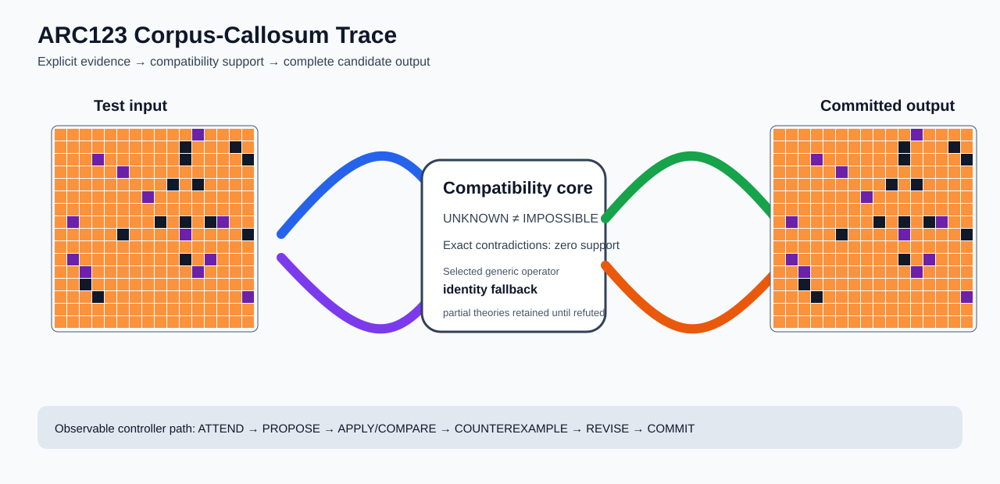

# ARC2 `878187ab` IHL Brain Surgery Report

## Outcome: NO — TEST CELLS DO NOT ALL MATCH

- **Compared positions:** 256
- **Mismatched cells:** 177
- **Source commit:** `71f86ff4c5304e452e0659131171f0519b50e21c`
- **Selected hypothesis:** `fallback_identity_complete_grid`
- **Training compatibility:** `False`
- **Fallback used:** `True`

## Live-Agent Boundary

The controller receives only training input/output evidence and the test input. It receives no task ID, historical schema/decomposition, GT feature contract, GT solver, or test target. The expected test output below is accessed only after the complete prediction is committed for V&V.

## Corpus-Callosum Visualization



- Full explicit event record: [`learning_trace.json`](learning_trace.json)

The diagram shows the actual test input, the typed compatibility core, and the committed full prediction. It renders observable operations only; it does not fabricate a one-to-one causal fiber where the selected program is only a factor-level dependency.

## Post-Answer V&V

### Test case 1
- **All cells match:** `False`
- **Mismatched cells:** `177`
- **Prediction:**
```json
[[7, 7, 7, 7, 7, 7, 7, 7, 7, 7, 7, 5, 7, 7, 7, 7], [7, 7, 7, 7, 7, 7, 7, 7, 7, 7, 0, 7, 7, 7, 0, 7], [7, 7, 7, 5, 7, 7, 7, 7, 7, 7, 0, 7, 7, 7, 7, 0], [7, 7, 7, 7, 7, 5, 7, 7, 7, 7, 7, 7, 7, 7, 7, 7], [7, 7, 7, 7, 7, 7, 7, 7, 7, 0, 7, 0, 7, 7, 7, 7], [7, 7, 7, 7, 7, 7, 7, 5, 7, 7, 7, 7, 7, 7, 7, 7], [7, 7, 7, 7, 7, 7, 7, 7, 7, 7, 7, 7, 7, 7, 7, 7], [7, 5, 7, 7, 7, 7, 7, 7, 0, 7, 0, 7, 0, 5, 7, 7], [7, 7, 7, 7, 7, 0, 7, 7, 7, 7, 5, 7, 7, 7, 7, 0], [7, 7, 7, 7, 7, 7, 7, 7, 7, 7, 7, 7, 7, 7, 7, 7], [7, 5, 7, 7, 7, 7, 7, 7, 7, 7, 0, 7, 5, 7, 7, 7], [7, 7, 5, 7, 7, 7, 7, 7, 7, 7, 7, 5, 7, 7, 7, 7], [7, 7, 0, 7, 7, 7, 7, 7, 7, 7, 7, 7, 7, 7, 7, 7], [7, 7, 7, 0, 7, 7, 7, 7, 7, 7, 7, 7, 7, 7, 7, 5], [7, 7, 7, 7, 7, 7, 7, 7, 7, 7, 7, 7, 7, 7, 7, 7], [7, 7, 7, 7, 7, 7, 7, 7, 7, 7, 7, 7, 7, 7, 7, 7]]
```
- **Expected output (post-answer only):**
```json
[[7, 7, 7, 7, 7, 7, 7, 7, 7, 7, 7, 7, 7, 7, 7, 7], [7, 7, 7, 7, 7, 7, 7, 7, 7, 7, 7, 7, 7, 7, 7, 7], [7, 7, 7, 7, 7, 7, 7, 7, 7, 7, 7, 7, 7, 7, 7, 7], [7, 7, 7, 7, 7, 7, 7, 7, 7, 7, 7, 7, 7, 7, 7, 7], [2, 2, 4, 2, 2, 2, 2, 2, 2, 2, 2, 4, 2, 2, 7, 7], [2, 2, 2, 4, 2, 2, 2, 2, 2, 2, 4, 2, 2, 2, 7, 7], [2, 2, 2, 2, 4, 2, 2, 2, 2, 4, 2, 2, 2, 2, 7, 7], [2, 2, 2, 2, 2, 4, 2, 2, 4, 2, 2, 2, 2, 2, 7, 7], [2, 2, 2, 2, 2, 2, 4, 4, 2, 2, 2, 2, 2, 2, 7, 7], [2, 2, 2, 2, 2, 2, 4, 4, 2, 2, 2, 2, 2, 2, 7, 7], [2, 2, 2, 2, 2, 4, 2, 2, 4, 2, 2, 2, 2, 2, 7, 7], [2, 2, 2, 2, 4, 2, 2, 2, 2, 4, 2, 2, 2, 2, 7, 7], [2, 2, 2, 4, 2, 2, 2, 2, 2, 2, 4, 2, 2, 2, 7, 7], [2, 2, 4, 2, 2, 2, 2, 2, 2, 2, 2, 4, 2, 2, 7, 7], [2, 4, 2, 2, 2, 2, 2, 2, 2, 2, 2, 2, 4, 2, 7, 7], [4, 2, 2, 2, 2, 2, 2, 2, 2, 2, 2, 2, 2, 4, 7, 7]]
```

## Observable IHL Walkthrough

The record contains explicit actions, predictions, feedback, and revisions; it does not claim or store hidden model reasoning.

### Action totals

- `ADD_CONDITION`: 6
- `APPLY_HYPOTHESIS`: 42
- `ATTEND`: 42
- `CHANGE_SCOPE`: 6
- `CHOOSE_NEXT_DEMO`: 42
- `COMMIT`: 1
- `COMPARE`: 42
- `COMPOSE_RULE`: 11
- `EXPLAIN_RESIDUAL`: 11
- `FIND_COUNTEREXAMPLE`: 21
- `PROPOSE`: 4
- `REJECT_RULE`: 7

### Decision milestones

- `0` `PROPOSE` — `{"parent_theory_id":"T0000","rule":{"description_length":1,"name":"identity","operation":"identity","parameters":{},"rule_id":"identity","scope":{"kind":"all","value":null}},"stage":"initial_generic_theories","theory_id":"T0001"}`
- `1` `PROPOSE` — `{"parent_theory_id":"T0000","rule":{"description_length":2,"name":"left_right(scope=all)","operation":"coordinate_transform","parameters":{"axis":"left_right"},"rule_id":"coordinate-left_right","scope":{"kind":"all","value":null}},"stage":"initial_generic_theories","theory_id":"T0002"}`
- `2` `PROPOSE` — `{"parent_theory_id":"T0000","rule":{"description_length":2,"name":"top_bottom(scope=all)","operation":"coordinate_transform","parameters":{"axis":"top_bottom"},"rule_id":"coordinate-top_bottom","scope":{"kind":"all","value":null}},"stage":"initial_generic_theories","theory_id":"T0003"}`
- `3` `PROPOSE` — `{"parent_theory_id":"T0000","rule":{"description_length":2,"name":"rotate_180(scope=all)","operation":"coordinate_transform","parameters":{"axis":"rotate_180"},"rule_id":"coordinate-rotate_180","scope":{"kind":"all","value":null}},"stage":"initial_generic_theories","theory_id":"T0004"}`
- `5` `ATTEND` — `{"reason":"initial_highest_observed_change_and_color_discrimination","selected_demo":1,"selected_region":{"region":"whole_demo"},"theory_id":"T0001"}`
- `9` `ATTEND` — `{"reason":"initial_highest_observed_change_and_color_discrimination","selected_demo":1,"selected_region":{"region":"whole_demo"},"theory_id":"T0002"}`
- `13` `ATTEND` — `{"reason":"initial_highest_observed_change_and_color_discrimination","selected_demo":1,"selected_region":{"region":"whole_demo"},"theory_id":"T0003"}`
- `17` `ATTEND` — `{"reason":"initial_highest_observed_change_and_color_discrimination","selected_demo":1,"selected_region":{"region":"whole_demo"},"theory_id":"T0004"}`
- `21` `ATTEND` — `{"reason":"unseen_demo_selected_for_residual_version_space_discrimination","selected_demo":0,"selected_region":{"column":1,"row":0},"theory_id":"T0001"}`
- `25` `ATTEND` — `{"reason":"unseen_demo_selected_for_residual_version_space_discrimination","selected_demo":0,"selected_region":{"column":14,"row":0},"theory_id":"T0002"}`
- `29` `ATTEND` — `{"reason":"unseen_demo_selected_for_residual_version_space_discrimination","selected_demo":0,"selected_region":{"column":14,"row":0},"theory_id":"T0003"}`
- `33` `ATTEND` — `{"reason":"unseen_demo_selected_for_residual_version_space_discrimination","selected_demo":0,"selected_region":{"column":1,"row":0},"theory_id":"T0004"}`
- `42` `ATTEND` — `{"reason":"initial_highest_observed_change_and_color_discrimination","selected_demo":1,"selected_region":{"region":"whole_demo"},"theory_id":"T0005"}`
- `46` `ATTEND` — `{"reason":"initial_highest_observed_change_and_color_discrimination","selected_demo":1,"selected_region":{"region":"whole_demo"},"theory_id":"T0006"}`
- `50` `ATTEND` — `{"reason":"unseen_demo_selected_for_residual_version_space_discrimination","selected_demo":0,"selected_region":{"column":1,"row":0},"theory_id":"T0005"}`
- `54` `ATTEND` — `{"reason":"unseen_demo_selected_for_residual_version_space_discrimination","selected_demo":0,"selected_region":{"column":14,"row":0},"theory_id":"T0006"}`
- `63` `ATTEND` — `{"reason":"initial_highest_observed_change_and_color_discrimination","selected_demo":1,"selected_region":{"region":"whole_demo"},"theory_id":"T0007"}`
- `67` `ATTEND` — `{"reason":"initial_highest_observed_change_and_color_discrimination","selected_demo":1,"selected_region":{"region":"whole_demo"},"theory_id":"T0008"}`
- `71` `ATTEND` — `{"reason":"unseen_demo_selected_for_residual_version_space_discrimination","selected_demo":0,"selected_region":{"column":1,"row":0},"theory_id":"T0007"}`
- `75` `ATTEND` — `{"reason":"unseen_demo_selected_for_residual_version_space_discrimination","selected_demo":0,"selected_region":{"column":14,"row":0},"theory_id":"T0008"}`
- `82` `ATTEND` — `{"reason":"initial_highest_observed_change_and_color_discrimination","selected_demo":1,"selected_region":{"region":"whole_demo"},"theory_id":"T0009"}`
- `86` `ATTEND` — `{"reason":"unseen_demo_selected_for_residual_version_space_discrimination","selected_demo":0,"selected_region":{"column":14,"row":0},"theory_id":"T0009"}`
- `95` `ATTEND` — `{"reason":"initial_highest_observed_change_and_color_discrimination","selected_demo":1,"selected_region":{"region":"whole_demo"},"theory_id":"T0010"}`
- `99` `ATTEND` — `{"reason":"unseen_demo_selected_for_residual_version_space_discrimination","selected_demo":0,"selected_region":{"column":14,"row":0},"theory_id":"T0010"}`
- `108` `ATTEND` — `{"reason":"initial_highest_observed_change_and_color_discrimination","selected_demo":1,"selected_region":{"region":"whole_demo"},"theory_id":"T0011"}`
- `112` `ATTEND` — `{"reason":"unseen_demo_selected_for_residual_version_space_discrimination","selected_demo":0,"selected_region":{"column":1,"row":3},"theory_id":"T0011"}`
- `119` `ATTEND` — `{"reason":"initial_highest_observed_change_and_color_discrimination","selected_demo":1,"selected_region":{"region":"whole_demo"},"theory_id":"T0012"}`
- `123` `ATTEND` — `{"reason":"unseen_demo_selected_for_residual_version_space_discrimination","selected_demo":0,"selected_region":{"column":0,"row":11},"theory_id":"T0012"}`
- `130` `ATTEND` — `{"reason":"initial_highest_observed_change_and_color_discrimination","selected_demo":1,"selected_region":{"region":"whole_demo"},"theory_id":"T0013"}`
- `134` `ATTEND` — `{"reason":"unseen_demo_selected_for_residual_version_space_discrimination","selected_demo":0,"selected_region":{"column":0,"row":0},"theory_id":"T0013"}`
- `143` `ATTEND` — `{"reason":"initial_highest_observed_change_and_color_discrimination","selected_demo":1,"selected_region":{"region":"whole_demo"},"theory_id":"T0014"}`
- `147` `ATTEND` — `{"reason":"initial_highest_observed_change_and_color_discrimination","selected_demo":1,"selected_region":{"region":"whole_demo"},"theory_id":"T0015"}`
- `151` `ATTEND` — `{"reason":"unseen_demo_selected_for_residual_version_space_discrimination","selected_demo":0,"selected_region":{"column":1,"row":0},"theory_id":"T0014"}`
- `155` `ATTEND` — `{"reason":"unseen_demo_selected_for_residual_version_space_discrimination","selected_demo":0,"selected_region":{"column":1,"row":0},"theory_id":"T0015"}`
- `162` `ATTEND` — `{"reason":"initial_highest_observed_change_and_color_discrimination","selected_demo":1,"selected_region":{"region":"whole_demo"},"theory_id":"T0016"}`
- `166` `ATTEND` — `{"reason":"unseen_demo_selected_for_residual_version_space_discrimination","selected_demo":0,"selected_region":{"column":1,"row":0},"theory_id":"T0016"}`
- `173` `ATTEND` — `{"reason":"initial_highest_observed_change_and_color_discrimination","selected_demo":1,"selected_region":{"region":"whole_demo"},"theory_id":"T0017"}`
- `177` `ATTEND` — `{"reason":"unseen_demo_selected_for_residual_version_space_discrimination","selected_demo":0,"selected_region":{"column":1,"row":0},"theory_id":"T0017"}`
- `184` `ATTEND` — `{"reason":"initial_highest_observed_change_and_color_discrimination","selected_demo":1,"selected_region":{"region":"whole_demo"},"theory_id":"T0018"}`
- `188` `ATTEND` — `{"reason":"unseen_demo_selected_for_residual_version_space_discrimination","selected_demo":0,"selected_region":{"column":7,"row":2},"theory_id":"T0018"}`
- `197` `ATTEND` — `{"reason":"initial_highest_observed_change_and_color_discrimination","selected_demo":1,"selected_region":{"region":"whole_demo"},"theory_id":"T0019"}`
- `201` `ATTEND` — `{"reason":"unseen_demo_selected_for_residual_version_space_discrimination","selected_demo":0,"selected_region":{"column":7,"row":2},"theory_id":"T0019"}`
- `210` `ATTEND` — `{"reason":"initial_highest_observed_change_and_color_discrimination","selected_demo":1,"selected_region":{"region":"whole_demo"},"theory_id":"T0020"}`
- `214` `ATTEND` — `{"reason":"unseen_demo_selected_for_residual_version_space_discrimination","selected_demo":0,"selected_region":{"column":14,"row":0},"theory_id":"T0020"}`
- `223` `ATTEND` — `{"reason":"initial_highest_observed_change_and_color_discrimination","selected_demo":1,"selected_region":{"region":"whole_demo"},"theory_id":"T0021"}`
- `227` `ATTEND` — `{"reason":"unseen_demo_selected_for_residual_version_space_discrimination","selected_demo":0,"selected_region":{"column":14,"row":0},"theory_id":"T0021"}`
- `234` `COMMIT` — `{"best_partial_theory":{"contradiction_count":0,"counterexamples":[],"description_length":1,"evaluated_demo_indices":[],"history":[{"kind":"ADD_RULE","parameters":{"initial_proposal":true,"operation":"identity"},"target":"identity"}],"matching_cell_count":0,"name":"identity","parameter_bindings":{},"parent_theory_id":"T0000","rules":[{"description_length":1,"name":"identity","operation":"identity","parameters":{},"rule_id":"identity","scope":{"kind":"all","value":null}}],"scope_predicates":[{"kind":"all","value":null}],"theory_id":"T0001","unknown_cell_count":0,"unresolved_unknown":[]},"complete_prediction_group_count":0,"fallback_reason":"no_complete_training_compatible_partial_theory","posterior_mass":0.0,"selected_hypothesis":"fallback_identity_complete_grid","training_exact":false}`

### First counterexamples

- `36` — `{"causal_next_operation":"scope_or_rule_revision","counterexample":{"column":14,"demo_index":0,"observed":7,"predicted":8,"row":0},"responsible_rule":{"description_length":2,"name":"left_right(scope=all)","operation":"coordinate_transform","parameters":{"axis":"left_right"},"rule_id":"coordinate-left_right","scope":{"kind":"all","value":null}},"responsible_rule_id":"coordinate-left_right","theory_id":"T0002"}`
- `57` — `{"causal_next_operation":"scope_or_rule_revision","counterexample":{"column":14,"demo_index":0,"observed":7,"predicted":8,"row":0},"responsible_rule":{"description_length":2,"name":"top_bottom(scope=all)","operation":"coordinate_transform","parameters":{"axis":"top_bottom"},"rule_id":"coordinate-top_bottom","scope":{"kind":"all","value":null}},"responsible_rule_id":"coordinate-top_bottom","theory_id":"T0003"}`
- `78` — `{"causal_next_operation":"scope_or_rule_revision","counterexample":{"column":14,"demo_index":0,"observed":7,"predicted":8,"row":0},"responsible_rule":{"description_length":2,"name":"top_bottom(scope=color==8)","operation":"coordinate_transform","parameters":{"axis":"top_bottom"},"rule_id":"coordinate-top_bottom","scope":{"kind":"color_equals","value":8}},"responsible_rule_id":"coordinate-top_bottom","theory_id":"T0008"}`
- `89` — `{"causal_next_operation":"scope_or_rule_revision","counterexample":{"column":14,"demo_index":0,"observed":7,"predicted":8,"row":0},"responsible_rule":{"description_length":2,"name":"top_bottom(scope=color==8)","operation":"coordinate_transform","parameters":{"axis":"top_bottom"},"rule_id":"coordinate-top_bottom","scope":{"kind":"color_equals","value":8}},"responsible_rule_id":"coordinate-top_bottom","theory_id":"T0009"}`
- `91` — `{"causal_next_operation":"scope_or_rule_revision","counterexample":{"column":14,"demo_index":0,"observed":7,"predicted":8,"row":0},"responsible_rule":{"description_length":2,"name":"left_right(scope=color==8)","operation":"coordinate_transform","parameters":{"axis":"left_right"},"rule_id":"coordinate-left_right","scope":{"kind":"color_equals","value":8}},"responsible_rule_id":"coordinate-left_right","theory_id":"T0006"}`
- `16` additional explicit counterexamples are retained in `learning_trace.json`.
