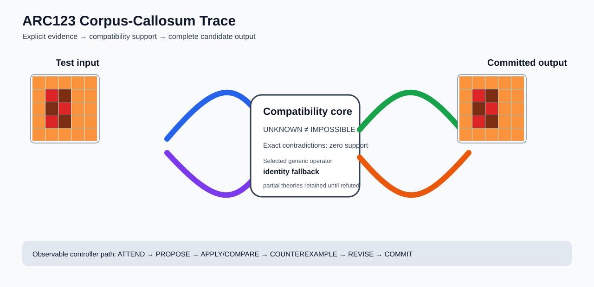

# ARC2 `9968a131` IHL Brain Surgery Report

## Outcome: NO — TEST CELLS DO NOT ALL MATCH

- **Compared positions:** 25
- **Mismatched cells:** 3
- **Source commit:** `71f86ff4c5304e452e0659131171f0519b50e21c`
- **Selected hypothesis:** `fallback_identity_complete_grid`
- **Training compatibility:** `False`
- **Fallback used:** `True`

## Live-Agent Boundary

The controller receives only training input/output evidence and the test input. It receives no task ID, historical schema/decomposition, GT feature contract, GT solver, or test target. The expected test output below is accessed only after the complete prediction is committed for V&V.

## Corpus-Callosum Visualization



- Full explicit event record: [`learning_trace.json`](learning_trace.json)

The diagram shows the actual test input, the typed compatibility core, and the committed full prediction. It renders observable operations only; it does not fabricate a one-to-one causal fiber where the selected program is only a factor-level dependency.

## Post-Answer V&V

### Test case 1
- **All cells match:** `False`
- **Mismatched cells:** `3`
- **Prediction:**
```json
[[7, 7, 7, 7, 7], [7, 2, 9, 7, 7], [7, 9, 2, 7, 7], [7, 2, 9, 7, 7], [7, 7, 7, 7, 7]]
```
- **Expected output (post-answer only):**
```json
[[7, 7, 7, 7, 7], [7, 2, 9, 7, 7], [7, 7, 9, 2, 7], [7, 2, 9, 7, 7], [7, 7, 7, 7, 7]]
```

## Observable IHL Walkthrough

The record contains explicit actions, predictions, feedback, and revisions; it does not claim or store hidden model reasoning.

### Action totals

- `APPLY_HYPOTHESIS`: 74
- `ATTEND`: 74
- `CHOOSE_NEXT_DEMO`: 74
- `COMMIT`: 1
- `COMPARE`: 74
- `COMPOSE_RULE`: 21
- `EXPLAIN_RESIDUAL`: 21
- `FIND_COUNTEREXAMPLE`: 41
- `PROPOSE`: 35
- `SPECIALIZE`: 24

### Decision milestones

- `0` `PROPOSE` — `{"parent_theory_id":"T0000","rule":{"description_length":1,"name":"identity","operation":"identity","parameters":{},"rule_id":"identity","scope":{"kind":"all","value":null}},"stage":"initial_generic_theories","theory_id":"T0001"}`
- `1` `PROPOSE` — `{"parent_theory_id":"T0000","rule":{"description_length":3,"name":"translate(column_offset=-5,row_offset=-5)","operation":"full_operator","parameters":{"column_offset":-5,"operator":"translate","row_offset":-5},"rule_id":"rule-translate","scope":{"kind":"all","value":null}},"stage":"initial_generic_theories","theory_id":"T0002"}`
- `2` `PROPOSE` — `{"parent_theory_id":"T0000","rule":{"description_length":3,"name":"translate(column_offset=-4,row_offset=-5)","operation":"full_operator","parameters":{"column_offset":-4,"operator":"translate","row_offset":-5},"rule_id":"rule-translate","scope":{"kind":"all","value":null}},"stage":"initial_generic_theories","theory_id":"T0003"}`
- `3` `PROPOSE` — `{"parent_theory_id":"T0000","rule":{"description_length":3,"name":"translate(column_offset=-3,row_offset=-5)","operation":"full_operator","parameters":{"column_offset":-3,"operator":"translate","row_offset":-5},"rule_id":"rule-translate","scope":{"kind":"all","value":null}},"stage":"initial_generic_theories","theory_id":"T0004"}`
- `4` `PROPOSE` — `{"parent_theory_id":"T0000","rule":{"description_length":3,"name":"translate(column_offset=-2,row_offset=-5)","operation":"full_operator","parameters":{"column_offset":-2,"operator":"translate","row_offset":-5},"rule_id":"rule-translate","scope":{"kind":"all","value":null}},"stage":"initial_generic_theories","theory_id":"T0005"}`
- `5` `PROPOSE` — `{"parent_theory_id":"T0000","rule":{"description_length":3,"name":"translate(column_offset=-1,row_offset=-5)","operation":"full_operator","parameters":{"column_offset":-1,"operator":"translate","row_offset":-5},"rule_id":"rule-translate","scope":{"kind":"all","value":null}},"stage":"initial_generic_theories","theory_id":"T0006"}`
- `6` `PROPOSE` — `{"parent_theory_id":"T0000","rule":{"description_length":3,"name":"translate(column_offset=0,row_offset=-5)","operation":"full_operator","parameters":{"column_offset":0,"operator":"translate","row_offset":-5},"rule_id":"rule-translate","scope":{"kind":"all","value":null}},"stage":"initial_generic_theories","theory_id":"T0007"}`
- `7` `PROPOSE` — `{"parent_theory_id":"T0000","rule":{"description_length":3,"name":"translate(column_offset=1,row_offset=-5)","operation":"full_operator","parameters":{"column_offset":1,"operator":"translate","row_offset":-5},"rule_id":"rule-translate","scope":{"kind":"all","value":null}},"stage":"initial_generic_theories","theory_id":"T0008"}`
- `8` `PROPOSE` — `{"parent_theory_id":"T0000","rule":{"description_length":3,"name":"translate(column_offset=2,row_offset=-5)","operation":"full_operator","parameters":{"column_offset":2,"operator":"translate","row_offset":-5},"rule_id":"rule-translate","scope":{"kind":"all","value":null}},"stage":"initial_generic_theories","theory_id":"T0009"}`
- `9` `PROPOSE` — `{"parent_theory_id":"T0000","rule":{"description_length":3,"name":"translate(column_offset=3,row_offset=-5)","operation":"full_operator","parameters":{"column_offset":3,"operator":"translate","row_offset":-5},"rule_id":"rule-translate","scope":{"kind":"all","value":null}},"stage":"initial_generic_theories","theory_id":"T0010"}`
- `10` `PROPOSE` — `{"parent_theory_id":"T0000","rule":{"description_length":3,"name":"translate(column_offset=4,row_offset=-5)","operation":"full_operator","parameters":{"column_offset":4,"operator":"translate","row_offset":-5},"rule_id":"rule-translate","scope":{"kind":"all","value":null}},"stage":"initial_generic_theories","theory_id":"T0011"}`
- `11` `PROPOSE` — `{"parent_theory_id":"T0000","rule":{"description_length":3,"name":"translate(column_offset=5,row_offset=-5)","operation":"full_operator","parameters":{"column_offset":5,"operator":"translate","row_offset":-5},"rule_id":"rule-translate","scope":{"kind":"all","value":null}},"stage":"initial_generic_theories","theory_id":"T0012"}`
- `12` `PROPOSE` — `{"parent_theory_id":"T0000","rule":{"description_length":3,"name":"translate(column_offset=-5,row_offset=-4)","operation":"full_operator","parameters":{"column_offset":-5,"operator":"translate","row_offset":-4},"rule_id":"rule-translate","scope":{"kind":"all","value":null}},"stage":"initial_generic_theories","theory_id":"T0013"}`
- `13` `PROPOSE` — `{"parent_theory_id":"T0000","rule":{"description_length":3,"name":"translate(column_offset=-4,row_offset=-4)","operation":"full_operator","parameters":{"column_offset":-4,"operator":"translate","row_offset":-4},"rule_id":"rule-translate","scope":{"kind":"all","value":null}},"stage":"initial_generic_theories","theory_id":"T0014"}`
- `14` `PROPOSE` — `{"parent_theory_id":"T0000","rule":{"description_length":3,"name":"translate(column_offset=-3,row_offset=-4)","operation":"full_operator","parameters":{"column_offset":-3,"operator":"translate","row_offset":-4},"rule_id":"rule-translate","scope":{"kind":"all","value":null}},"stage":"initial_generic_theories","theory_id":"T0015"}`
- `15` `PROPOSE` — `{"parent_theory_id":"T0000","rule":{"description_length":3,"name":"translate(column_offset=-2,row_offset=-4)","operation":"full_operator","parameters":{"column_offset":-2,"operator":"translate","row_offset":-4},"rule_id":"rule-translate","scope":{"kind":"all","value":null}},"stage":"initial_generic_theories","theory_id":"T0016"}`
- `16` `PROPOSE` — `{"parent_theory_id":"T0000","rule":{"description_length":3,"name":"translate(column_offset=-1,row_offset=-4)","operation":"full_operator","parameters":{"column_offset":-1,"operator":"translate","row_offset":-4},"rule_id":"rule-translate","scope":{"kind":"all","value":null}},"stage":"initial_generic_theories","theory_id":"T0017"}`
- `17` `PROPOSE` — `{"parent_theory_id":"T0000","rule":{"description_length":3,"name":"translate(column_offset=0,row_offset=-4)","operation":"full_operator","parameters":{"column_offset":0,"operator":"translate","row_offset":-4},"rule_id":"rule-translate","scope":{"kind":"all","value":null}},"stage":"initial_generic_theories","theory_id":"T0018"}`
- `18` `PROPOSE` — `{"parent_theory_id":"T0000","rule":{"description_length":3,"name":"translate(column_offset=1,row_offset=-4)","operation":"full_operator","parameters":{"column_offset":1,"operator":"translate","row_offset":-4},"rule_id":"rule-translate","scope":{"kind":"all","value":null}},"stage":"initial_generic_theories","theory_id":"T0019"}`
- `19` `PROPOSE` — `{"parent_theory_id":"T0000","rule":{"description_length":3,"name":"translate(column_offset=2,row_offset=-4)","operation":"full_operator","parameters":{"column_offset":2,"operator":"translate","row_offset":-4},"rule_id":"rule-translate","scope":{"kind":"all","value":null}},"stage":"initial_generic_theories","theory_id":"T0020"}`
- `20` `PROPOSE` — `{"parent_theory_id":"T0000","rule":{"description_length":3,"name":"translate(column_offset=3,row_offset=-4)","operation":"full_operator","parameters":{"column_offset":3,"operator":"translate","row_offset":-4},"rule_id":"rule-translate","scope":{"kind":"all","value":null}},"stage":"initial_generic_theories","theory_id":"T0021"}`
- `21` `PROPOSE` — `{"parent_theory_id":"T0000","rule":{"description_length":3,"name":"translate(column_offset=4,row_offset=-4)","operation":"full_operator","parameters":{"column_offset":4,"operator":"translate","row_offset":-4},"rule_id":"rule-translate","scope":{"kind":"all","value":null}},"stage":"initial_generic_theories","theory_id":"T0022"}`
- `22` `PROPOSE` — `{"parent_theory_id":"T0000","rule":{"description_length":3,"name":"translate(column_offset=5,row_offset=-4)","operation":"full_operator","parameters":{"column_offset":5,"operator":"translate","row_offset":-4},"rule_id":"rule-translate","scope":{"kind":"all","value":null}},"stage":"initial_generic_theories","theory_id":"T0023"}`
- `23` `PROPOSE` — `{"parent_theory_id":"T0000","rule":{"description_length":3,"name":"translate(column_offset=-5,row_offset=-3)","operation":"full_operator","parameters":{"column_offset":-5,"operator":"translate","row_offset":-3},"rule_id":"rule-translate","scope":{"kind":"all","value":null}},"stage":"initial_generic_theories","theory_id":"T0024"}`
- `24` `PROPOSE` — `{"parent_theory_id":"T0000","rule":{"description_length":3,"name":"translate(column_offset=-4,row_offset=-3)","operation":"full_operator","parameters":{"column_offset":-4,"operator":"translate","row_offset":-3},"rule_id":"rule-translate","scope":{"kind":"all","value":null}},"stage":"initial_generic_theories","theory_id":"T0025"}`
- `25` `PROPOSE` — `{"parent_theory_id":"T0000","rule":{"description_length":3,"name":"translate(column_offset=-3,row_offset=-3)","operation":"full_operator","parameters":{"column_offset":-3,"operator":"translate","row_offset":-3},"rule_id":"rule-translate","scope":{"kind":"all","value":null}},"stage":"initial_generic_theories","theory_id":"T0026"}`
- `26` `PROPOSE` — `{"parent_theory_id":"T0000","rule":{"description_length":3,"name":"translate(column_offset=-2,row_offset=-3)","operation":"full_operator","parameters":{"column_offset":-2,"operator":"translate","row_offset":-3},"rule_id":"rule-translate","scope":{"kind":"all","value":null}},"stage":"initial_generic_theories","theory_id":"T0027"}`
- `27` `PROPOSE` — `{"parent_theory_id":"T0000","rule":{"description_length":3,"name":"translate(column_offset=-1,row_offset=-3)","operation":"full_operator","parameters":{"column_offset":-1,"operator":"translate","row_offset":-3},"rule_id":"rule-translate","scope":{"kind":"all","value":null}},"stage":"initial_generic_theories","theory_id":"T0028"}`
- `28` `PROPOSE` — `{"parent_theory_id":"T0000","rule":{"description_length":3,"name":"translate(column_offset=0,row_offset=-3)","operation":"full_operator","parameters":{"column_offset":0,"operator":"translate","row_offset":-3},"rule_id":"rule-translate","scope":{"kind":"all","value":null}},"stage":"initial_generic_theories","theory_id":"T0029"}`
- `29` `PROPOSE` — `{"parent_theory_id":"T0000","rule":{"description_length":3,"name":"translate(column_offset=1,row_offset=-3)","operation":"full_operator","parameters":{"column_offset":1,"operator":"translate","row_offset":-3},"rule_id":"rule-translate","scope":{"kind":"all","value":null}},"stage":"initial_generic_theories","theory_id":"T0030"}`
- `30` `PROPOSE` — `{"parent_theory_id":"T0000","rule":{"description_length":3,"name":"translate(column_offset=2,row_offset=-3)","operation":"full_operator","parameters":{"column_offset":2,"operator":"translate","row_offset":-3},"rule_id":"rule-translate","scope":{"kind":"all","value":null}},"stage":"initial_generic_theories","theory_id":"T0031"}`
- `31` `PROPOSE` — `{"parent_theory_id":"T0000","rule":{"description_length":3,"name":"translate(column_offset=3,row_offset=-3)","operation":"full_operator","parameters":{"column_offset":3,"operator":"translate","row_offset":-3},"rule_id":"rule-translate","scope":{"kind":"all","value":null}},"stage":"initial_generic_theories","theory_id":"T0032"}`
- `32` `PROPOSE` — `{"parent_theory_id":"T0000","rule":{"description_length":2,"name":"left_right(scope=all)","operation":"coordinate_transform","parameters":{"axis":"left_right"},"rule_id":"coordinate-left_right","scope":{"kind":"all","value":null}},"stage":"initial_generic_theories","theory_id":"T0033"}`
- `33` `PROPOSE` — `{"parent_theory_id":"T0000","rule":{"description_length":2,"name":"top_bottom(scope=all)","operation":"coordinate_transform","parameters":{"axis":"top_bottom"},"rule_id":"coordinate-top_bottom","scope":{"kind":"all","value":null}},"stage":"initial_generic_theories","theory_id":"T0034"}`
- `34` `PROPOSE` — `{"parent_theory_id":"T0000","rule":{"description_length":2,"name":"rotate_180(scope=all)","operation":"coordinate_transform","parameters":{"axis":"rotate_180"},"rule_id":"coordinate-rotate_180","scope":{"kind":"all","value":null}},"stage":"initial_generic_theories","theory_id":"T0035"}`
- `36` `ATTEND` — `{"reason":"initial_highest_observed_change_and_color_discrimination","selected_demo":1,"selected_region":{"column":0,"row":1},"theory_id":"T0001"}`
- `40` `ATTEND` — `{"reason":"initial_highest_observed_change_and_color_discrimination","selected_demo":1,"selected_region":{"column":0,"row":0},"theory_id":"T0033"}`
- `44` `ATTEND` — `{"reason":"initial_highest_observed_change_and_color_discrimination","selected_demo":1,"selected_region":{"column":0,"row":0},"theory_id":"T0034"}`
- `48` `ATTEND` — `{"reason":"initial_highest_observed_change_and_color_discrimination","selected_demo":1,"selected_region":{"column":0,"row":0},"theory_id":"T0035"}`
- `52` `ATTEND` — `{"reason":"initial_highest_observed_change_and_color_discrimination","selected_demo":1,"selected_region":{"column":0,"row":0},"theory_id":"T0002"}`
- `56` `ATTEND` — `{"reason":"initial_highest_observed_change_and_color_discrimination","selected_demo":1,"selected_region":{"column":0,"row":0},"theory_id":"T0003"}`
- `60` `ATTEND` — `{"reason":"initial_highest_observed_change_and_color_discrimination","selected_demo":1,"selected_region":{"column":0,"row":0},"theory_id":"T0004"}`
- `64` `ATTEND` — `{"reason":"initial_highest_observed_change_and_color_discrimination","selected_demo":1,"selected_region":{"column":0,"row":0},"theory_id":"T0005"}`
- `68` `ATTEND` — `{"reason":"initial_highest_observed_change_and_color_discrimination","selected_demo":1,"selected_region":{"column":1,"row":0},"theory_id":"T0006"}`
- `72` `ATTEND` — `{"reason":"initial_highest_observed_change_and_color_discrimination","selected_demo":1,"selected_region":{"column":0,"row":0},"theory_id":"T0007"}`
- `76` `ATTEND` — `{"reason":"initial_highest_observed_change_and_color_discrimination","selected_demo":1,"selected_region":{"column":0,"row":0},"theory_id":"T0008"}`
- `80` `ATTEND` — `{"reason":"initial_highest_observed_change_and_color_discrimination","selected_demo":1,"selected_region":{"column":0,"row":0},"theory_id":"T0009"}`
- `86` `SPECIALIZE` — `{"added_rule":{"description_length":4,"name":"row_span_fill(fill_color=7,seed_color=5)","operation":"full_operator","parameters":{"fill_color":7,"operator":"row_span_fill","seed_color":5},"rule_id":"structural-row_span_fill","scope":{"kind":"all","value":null}},"parent_theory_id":"T0001","reason":"unexplained_residual_proposed_generic_structural_rule","theory_id":"T0037"}`
- `87` `SPECIALIZE` — `{"added_rule":{"description_length":4,"name":"row_span_fill(fill_color=7,seed_color=0)","operation":"full_operator","parameters":{"fill_color":7,"operator":"row_span_fill","seed_color":0},"rule_id":"structural-row_span_fill","scope":{"kind":"all","value":null}},"parent_theory_id":"T0001","reason":"unexplained_residual_proposed_generic_structural_rule","theory_id":"T0038"}`
- `88` `SPECIALIZE` — `{"added_rule":{"description_length":4,"name":"row_span_fill(fill_color=5,seed_color=5)","operation":"full_operator","parameters":{"fill_color":5,"operator":"row_span_fill","seed_color":5},"rule_id":"structural-row_span_fill","scope":{"kind":"all","value":null}},"parent_theory_id":"T0001","reason":"unexplained_residual_proposed_generic_structural_rule","theory_id":"T0039"}`
- `89` `SPECIALIZE` — `{"added_rule":{"description_length":4,"name":"row_span_fill(fill_color=5,seed_color=0)","operation":"full_operator","parameters":{"fill_color":5,"operator":"row_span_fill","seed_color":0},"rule_id":"structural-row_span_fill","scope":{"kind":"all","value":null}},"parent_theory_id":"T0001","reason":"unexplained_residual_proposed_generic_structural_rule","theory_id":"T0040"}`
- `90` `SPECIALIZE` — `{"added_rule":{"description_length":4,"name":"row_span_fill(fill_color=0,seed_color=5)","operation":"full_operator","parameters":{"fill_color":0,"operator":"row_span_fill","seed_color":5},"rule_id":"structural-row_span_fill","scope":{"kind":"all","value":null}},"parent_theory_id":"T0001","reason":"unexplained_residual_proposed_generic_structural_rule","theory_id":"T0041"}`
- `91` `SPECIALIZE` — `{"added_rule":{"description_length":4,"name":"row_span_fill(fill_color=0,seed_color=0)","operation":"full_operator","parameters":{"fill_color":0,"operator":"row_span_fill","seed_color":0},"rule_id":"structural-row_span_fill","scope":{"kind":"all","value":null}},"parent_theory_id":"T0001","reason":"unexplained_residual_proposed_generic_structural_rule","theory_id":"T0042"}`
- `92` `SPECIALIZE` — `{"added_rule":{"description_length":4,"name":"line_extend(direction=up,fill_color=7,seed_color=5)","operation":"full_operator","parameters":{"direction":"up","fill_color":7,"operator":"line_extend","seed_color":5},"rule_id":"structural-line_extend","scope":{"kind":"all","value":null}},"parent_theory_id":"T0001","reason":"unexplained_residual_proposed_generic_structural_rule","theory_id":"T0043"}`
- `93` `SPECIALIZE` — `{"added_rule":{"description_length":4,"name":"line_extend(direction=up,fill_color=7,seed_color=0)","operation":"full_operator","parameters":{"direction":"up","fill_color":7,"operator":"line_extend","seed_color":0},"rule_id":"structural-line_extend","scope":{"kind":"all","value":null}},"parent_theory_id":"T0001","reason":"unexplained_residual_proposed_generic_structural_rule","theory_id":"T0044"}`
- `94` `SPECIALIZE` — `{"added_rule":{"description_length":4,"name":"line_extend(direction=up,fill_color=5,seed_color=5)","operation":"full_operator","parameters":{"direction":"up","fill_color":5,"operator":"line_extend","seed_color":5},"rule_id":"structural-line_extend","scope":{"kind":"all","value":null}},"parent_theory_id":"T0001","reason":"unexplained_residual_proposed_generic_structural_rule","theory_id":"T0045"}`
- `95` `SPECIALIZE` — `{"added_rule":{"description_length":4,"name":"line_extend(direction=up,fill_color=5,seed_color=0)","operation":"full_operator","parameters":{"direction":"up","fill_color":5,"operator":"line_extend","seed_color":0},"rule_id":"structural-line_extend","scope":{"kind":"all","value":null}},"parent_theory_id":"T0001","reason":"unexplained_residual_proposed_generic_structural_rule","theory_id":"T0046"}`
- `96` `SPECIALIZE` — `{"added_rule":{"description_length":4,"name":"line_extend(direction=up,fill_color=0,seed_color=5)","operation":"full_operator","parameters":{"direction":"up","fill_color":0,"operator":"line_extend","seed_color":5},"rule_id":"structural-line_extend","scope":{"kind":"all","value":null}},"parent_theory_id":"T0001","reason":"unexplained_residual_proposed_generic_structural_rule","theory_id":"T0047"}`
- `97` `SPECIALIZE` — `{"added_rule":{"description_length":4,"name":"line_extend(direction=up,fill_color=0,seed_color=0)","operation":"full_operator","parameters":{"direction":"up","fill_color":0,"operator":"line_extend","seed_color":0},"rule_id":"structural-line_extend","scope":{"kind":"all","value":null}},"parent_theory_id":"T0001","reason":"unexplained_residual_proposed_generic_structural_rule","theory_id":"T0048"}`
- `99` `ATTEND` — `{"reason":"initial_highest_observed_change_and_color_discrimination","selected_demo":1,"selected_region":{"column":1,"row":0},"theory_id":"T0036"}`
- `103` `ATTEND` — `{"reason":"initial_highest_observed_change_and_color_discrimination","selected_demo":1,"selected_region":{"column":0,"row":1},"theory_id":"T0037"}`
- `107` `ATTEND` — `{"reason":"initial_highest_observed_change_and_color_discrimination","selected_demo":1,"selected_region":{"column":0,"row":1},"theory_id":"T0038"}`
- `111` `ATTEND` — `{"reason":"initial_highest_observed_change_and_color_discrimination","selected_demo":1,"selected_region":{"column":0,"row":1},"theory_id":"T0039"}`
- `115` `ATTEND` — `{"reason":"initial_highest_observed_change_and_color_discrimination","selected_demo":1,"selected_region":{"column":0,"row":1},"theory_id":"T0040"}`
- `119` `ATTEND` — `{"reason":"initial_highest_observed_change_and_color_discrimination","selected_demo":1,"selected_region":{"column":0,"row":1},"theory_id":"T0041"}`
- `123` `ATTEND` — `{"reason":"initial_highest_observed_change_and_color_discrimination","selected_demo":1,"selected_region":{"column":0,"row":1},"theory_id":"T0042"}`
- `127` `ATTEND` — `{"reason":"initial_highest_observed_change_and_color_discrimination","selected_demo":1,"selected_region":{"column":0,"row":1},"theory_id":"T0043"}`
- `131` `ATTEND` — `{"reason":"initial_highest_observed_change_and_color_discrimination","selected_demo":1,"selected_region":{"column":0,"row":1},"theory_id":"T0044"}`
- `135` `ATTEND` — `{"reason":"initial_highest_observed_change_and_color_discrimination","selected_demo":1,"selected_region":{"column":0,"row":1},"theory_id":"T0045"}`
- `139` `ATTEND` — `{"reason":"initial_highest_observed_change_and_color_discrimination","selected_demo":1,"selected_region":{"column":0,"row":1},"theory_id":"T0046"}`
- `143` `ATTEND` — `{"reason":"initial_highest_observed_change_and_color_discrimination","selected_demo":1,"selected_region":{"column":0,"row":1},"theory_id":"T0047"}`
- `147` `SPECIALIZE` — `{"added_rule":{"description_length":4,"name":"row_span_fill(fill_color=7,seed_color=5)","operation":"full_operator","parameters":{"fill_color":7,"operator":"row_span_fill","seed_color":5},"rule_id":"structural-row_span_fill","scope":{"kind":"all","value":null}},"parent_theory_id":"T0036","reason":"unexplained_residual_proposed_generic_structural_rule","theory_id":"T0049"}`
- `148` `SPECIALIZE` — `{"added_rule":{"description_length":4,"name":"row_span_fill(fill_color=7,seed_color=0)","operation":"full_operator","parameters":{"fill_color":7,"operator":"row_span_fill","seed_color":0},"rule_id":"structural-row_span_fill","scope":{"kind":"all","value":null}},"parent_theory_id":"T0036","reason":"unexplained_residual_proposed_generic_structural_rule","theory_id":"T0050"}`
- `149` `SPECIALIZE` — `{"added_rule":{"description_length":4,"name":"row_span_fill(fill_color=5,seed_color=5)","operation":"full_operator","parameters":{"fill_color":5,"operator":"row_span_fill","seed_color":5},"rule_id":"structural-row_span_fill","scope":{"kind":"all","value":null}},"parent_theory_id":"T0036","reason":"unexplained_residual_proposed_generic_structural_rule","theory_id":"T0051"}`
- `150` `SPECIALIZE` — `{"added_rule":{"description_length":4,"name":"row_span_fill(fill_color=5,seed_color=0)","operation":"full_operator","parameters":{"fill_color":5,"operator":"row_span_fill","seed_color":0},"rule_id":"structural-row_span_fill","scope":{"kind":"all","value":null}},"parent_theory_id":"T0036","reason":"unexplained_residual_proposed_generic_structural_rule","theory_id":"T0052"}`
- `151` `SPECIALIZE` — `{"added_rule":{"description_length":4,"name":"row_span_fill(fill_color=0,seed_color=5)","operation":"full_operator","parameters":{"fill_color":0,"operator":"row_span_fill","seed_color":5},"rule_id":"structural-row_span_fill","scope":{"kind":"all","value":null}},"parent_theory_id":"T0036","reason":"unexplained_residual_proposed_generic_structural_rule","theory_id":"T0053"}`
- `152` `SPECIALIZE` — `{"added_rule":{"description_length":4,"name":"row_span_fill(fill_color=0,seed_color=0)","operation":"full_operator","parameters":{"fill_color":0,"operator":"row_span_fill","seed_color":0},"rule_id":"structural-row_span_fill","scope":{"kind":"all","value":null}},"parent_theory_id":"T0036","reason":"unexplained_residual_proposed_generic_structural_rule","theory_id":"T0054"}`
- `153` `SPECIALIZE` — `{"added_rule":{"description_length":4,"name":"line_extend(direction=up,fill_color=7,seed_color=5)","operation":"full_operator","parameters":{"direction":"up","fill_color":7,"operator":"line_extend","seed_color":5},"rule_id":"structural-line_extend","scope":{"kind":"all","value":null}},"parent_theory_id":"T0036","reason":"unexplained_residual_proposed_generic_structural_rule","theory_id":"T0055"}`
- `154` `SPECIALIZE` — `{"added_rule":{"description_length":4,"name":"line_extend(direction=up,fill_color=7,seed_color=0)","operation":"full_operator","parameters":{"direction":"up","fill_color":7,"operator":"line_extend","seed_color":0},"rule_id":"structural-line_extend","scope":{"kind":"all","value":null}},"parent_theory_id":"T0036","reason":"unexplained_residual_proposed_generic_structural_rule","theory_id":"T0056"}`
- `155` `SPECIALIZE` — `{"added_rule":{"description_length":4,"name":"line_extend(direction=up,fill_color=5,seed_color=5)","operation":"full_operator","parameters":{"direction":"up","fill_color":5,"operator":"line_extend","seed_color":5},"rule_id":"structural-line_extend","scope":{"kind":"all","value":null}},"parent_theory_id":"T0036","reason":"unexplained_residual_proposed_generic_structural_rule","theory_id":"T0057"}`
- `156` `SPECIALIZE` — `{"added_rule":{"description_length":4,"name":"line_extend(direction=up,fill_color=5,seed_color=0)","operation":"full_operator","parameters":{"direction":"up","fill_color":5,"operator":"line_extend","seed_color":0},"rule_id":"structural-line_extend","scope":{"kind":"all","value":null}},"parent_theory_id":"T0036","reason":"unexplained_residual_proposed_generic_structural_rule","theory_id":"T0058"}`
- `157` `SPECIALIZE` — `{"added_rule":{"description_length":4,"name":"line_extend(direction=up,fill_color=0,seed_color=5)","operation":"full_operator","parameters":{"direction":"up","fill_color":0,"operator":"line_extend","seed_color":5},"rule_id":"structural-line_extend","scope":{"kind":"all","value":null}},"parent_theory_id":"T0036","reason":"unexplained_residual_proposed_generic_structural_rule","theory_id":"T0059"}`
- `158` `SPECIALIZE` — `{"added_rule":{"description_length":4,"name":"line_extend(direction=up,fill_color=0,seed_color=0)","operation":"full_operator","parameters":{"direction":"up","fill_color":0,"operator":"line_extend","seed_color":0},"rule_id":"structural-line_extend","scope":{"kind":"all","value":null}},"parent_theory_id":"T0036","reason":"unexplained_residual_proposed_generic_structural_rule","theory_id":"T0060"}`
- `160` `ATTEND` — `{"reason":"initial_highest_observed_change_and_color_discrimination","selected_demo":1,"selected_region":{"column":0,"row":1},"theory_id":"T0049"}`
- `164` `ATTEND` — `{"reason":"initial_highest_observed_change_and_color_discrimination","selected_demo":1,"selected_region":{"column":0,"row":1},"theory_id":"T0050"}`
- `168` `ATTEND` — `{"reason":"initial_highest_observed_change_and_color_discrimination","selected_demo":1,"selected_region":{"column":0,"row":1},"theory_id":"T0051"}`
- `172` `ATTEND` — `{"reason":"initial_highest_observed_change_and_color_discrimination","selected_demo":1,"selected_region":{"column":0,"row":1},"theory_id":"T0052"}`
- `176` `ATTEND` — `{"reason":"initial_highest_observed_change_and_color_discrimination","selected_demo":1,"selected_region":{"column":0,"row":1},"theory_id":"T0053"}`
- `180` `ATTEND` — `{"reason":"initial_highest_observed_change_and_color_discrimination","selected_demo":1,"selected_region":{"column":0,"row":1},"theory_id":"T0054"}`
- `184` `ATTEND` — `{"reason":"initial_highest_observed_change_and_color_discrimination","selected_demo":1,"selected_region":{"column":0,"row":1},"theory_id":"T0055"}`
- `188` `ATTEND` — `{"reason":"initial_highest_observed_change_and_color_discrimination","selected_demo":1,"selected_region":{"column":0,"row":1},"theory_id":"T0056"}`
- `192` `ATTEND` — `{"reason":"initial_highest_observed_change_and_color_discrimination","selected_demo":1,"selected_region":{"column":0,"row":1},"theory_id":"T0057"}`
- `196` `ATTEND` — `{"reason":"initial_highest_observed_change_and_color_discrimination","selected_demo":1,"selected_region":{"column":0,"row":1},"theory_id":"T0058"}`
- `200` `ATTEND` — `{"reason":"initial_highest_observed_change_and_color_discrimination","selected_demo":1,"selected_region":{"column":0,"row":1},"theory_id":"T0059"}`
- `204` `ATTEND` — `{"reason":"initial_highest_observed_change_and_color_discrimination","selected_demo":1,"selected_region":{"column":0,"row":1},"theory_id":"T0060"}`
- `211` `ATTEND` — `{"reason":"initial_highest_observed_change_and_color_discrimination","selected_demo":1,"selected_region":{"column":1,"row":0},"theory_id":"T0061"}`
- `218` `ATTEND` — `{"reason":"initial_highest_observed_change_and_color_discrimination","selected_demo":1,"selected_region":{"column":1,"row":0},"theory_id":"T0062"}`
- `225` `ATTEND` — `{"reason":"initial_highest_observed_change_and_color_discrimination","selected_demo":1,"selected_region":{"column":1,"row":0},"theory_id":"T0063"}`
- `232` `ATTEND` — `{"reason":"initial_highest_observed_change_and_color_discrimination","selected_demo":1,"selected_region":{"column":1,"row":0},"theory_id":"T0064"}`
- `239` `ATTEND` — `{"reason":"initial_highest_observed_change_and_color_discrimination","selected_demo":1,"selected_region":{"column":1,"row":0},"theory_id":"T0065"}`
- `246` `ATTEND` — `{"reason":"initial_highest_observed_change_and_color_discrimination","selected_demo":1,"selected_region":{"column":1,"row":0},"theory_id":"T0066"}`
- `253` `ATTEND` — `{"reason":"initial_highest_observed_change_and_color_discrimination","selected_demo":1,"selected_region":{"column":1,"row":0},"theory_id":"T0067"}`
- `260` `ATTEND` — `{"reason":"initial_highest_observed_change_and_color_discrimination","selected_demo":1,"selected_region":{"column":1,"row":0},"theory_id":"T0068"}`
- `267` `ATTEND` — `{"reason":"initial_highest_observed_change_and_color_discrimination","selected_demo":1,"selected_region":{"column":1,"row":0},"theory_id":"T0069"}`
- `274` `ATTEND` — `{"reason":"initial_highest_observed_change_and_color_discrimination","selected_demo":1,"selected_region":{"column":1,"row":0},"theory_id":"T0070"}`
- `281` `ATTEND` — `{"reason":"initial_highest_observed_change_and_color_discrimination","selected_demo":1,"selected_region":{"column":1,"row":0},"theory_id":"T0071"}`
- `288` `ATTEND` — `{"reason":"initial_highest_observed_change_and_color_discrimination","selected_demo":1,"selected_region":{"column":1,"row":0},"theory_id":"T0072"}`
- `293` `ATTEND` — `{"reason":"unseen_demo_selected_for_residual_version_space_discrimination","selected_demo":0,"selected_region":{"column":1,"row":1},"theory_id":"T0061"}`
- `298` `ATTEND` — `{"reason":"unseen_demo_selected_for_residual_version_space_discrimination","selected_demo":0,"selected_region":{"column":1,"row":1},"theory_id":"T0062"}`
- `303` `ATTEND` — `{"reason":"unseen_demo_selected_for_residual_version_space_discrimination","selected_demo":0,"selected_region":{"column":1,"row":1},"theory_id":"T0063"}`
- `308` `ATTEND` — `{"reason":"unseen_demo_selected_for_residual_version_space_discrimination","selected_demo":0,"selected_region":{"column":1,"row":1},"theory_id":"T0064"}`
- `313` `ATTEND` — `{"reason":"unseen_demo_selected_for_residual_version_space_discrimination","selected_demo":0,"selected_region":{"column":1,"row":1},"theory_id":"T0065"}`
- `318` `ATTEND` — `{"reason":"unseen_demo_selected_for_residual_version_space_discrimination","selected_demo":0,"selected_region":{"column":1,"row":1},"theory_id":"T0066"}`
- `323` `ATTEND` — `{"reason":"unseen_demo_selected_for_residual_version_space_discrimination","selected_demo":0,"selected_region":{"column":1,"row":1},"theory_id":"T0067"}`
- `328` `ATTEND` — `{"reason":"unseen_demo_selected_for_residual_version_space_discrimination","selected_demo":0,"selected_region":{"column":1,"row":1},"theory_id":"T0068"}`
- `333` `ATTEND` — `{"reason":"unseen_demo_selected_for_residual_version_space_discrimination","selected_demo":0,"selected_region":{"column":1,"row":1},"theory_id":"T0069"}`
- `338` `ATTEND` — `{"reason":"unseen_demo_selected_for_residual_version_space_discrimination","selected_demo":0,"selected_region":{"column":1,"row":1},"theory_id":"T0070"}`
- `343` `ATTEND` — `{"reason":"unseen_demo_selected_for_residual_version_space_discrimination","selected_demo":0,"selected_region":{"column":1,"row":1},"theory_id":"T0071"}`
- `348` `ATTEND` — `{"reason":"unseen_demo_selected_for_residual_version_space_discrimination","selected_demo":0,"selected_region":{"column":1,"row":1},"theory_id":"T0072"}`
- `355` `ATTEND` — `{"reason":"initial_highest_observed_change_and_color_discrimination","selected_demo":1,"selected_region":{"column":1,"row":0},"theory_id":"T0073"}`
- `360` `ATTEND` — `{"reason":"unseen_demo_selected_for_residual_version_space_discrimination","selected_demo":0,"selected_region":{"column":2,"row":0},"theory_id":"T0073"}`
- `367` `ATTEND` — `{"reason":"initial_highest_observed_change_and_color_discrimination","selected_demo":1,"selected_region":{"column":1,"row":0},"theory_id":"T0074"}`
- `372` `ATTEND` — `{"reason":"unseen_demo_selected_for_residual_version_space_discrimination","selected_demo":0,"selected_region":{"column":2,"row":0},"theory_id":"T0074"}`
- `379` `ATTEND` — `{"reason":"initial_highest_observed_change_and_color_discrimination","selected_demo":1,"selected_region":{"column":1,"row":0},"theory_id":"T0075"}`
- `384` `ATTEND` — `{"reason":"unseen_demo_selected_for_residual_version_space_discrimination","selected_demo":0,"selected_region":{"column":2,"row":0},"theory_id":"T0075"}`
- `391` `ATTEND` — `{"reason":"initial_highest_observed_change_and_color_discrimination","selected_demo":1,"selected_region":{"column":1,"row":0},"theory_id":"T0076"}`
- `396` `ATTEND` — `{"reason":"unseen_demo_selected_for_residual_version_space_discrimination","selected_demo":0,"selected_region":{"column":2,"row":0},"theory_id":"T0076"}`
- `403` `ATTEND` — `{"reason":"initial_highest_observed_change_and_color_discrimination","selected_demo":1,"selected_region":{"column":1,"row":0},"theory_id":"T0077"}`
- `408` `ATTEND` — `{"reason":"unseen_demo_selected_for_residual_version_space_discrimination","selected_demo":0,"selected_region":{"column":2,"row":0},"theory_id":"T0077"}`
- `415` `ATTEND` — `{"reason":"initial_highest_observed_change_and_color_discrimination","selected_demo":1,"selected_region":{"column":1,"row":0},"theory_id":"T0078"}`
- `420` `ATTEND` — `{"reason":"unseen_demo_selected_for_residual_version_space_discrimination","selected_demo":0,"selected_region":{"column":2,"row":0},"theory_id":"T0078"}`
- `427` `ATTEND` — `{"reason":"initial_highest_observed_change_and_color_discrimination","selected_demo":1,"selected_region":{"column":1,"row":0},"theory_id":"T0079"}`
- `432` `ATTEND` — `{"reason":"unseen_demo_selected_for_residual_version_space_discrimination","selected_demo":0,"selected_region":{"column":2,"row":0},"theory_id":"T0079"}`
- `438` `COMMIT` — `{"best_partial_theory":{"contradiction_count":0,"counterexamples":[],"description_length":1,"evaluated_demo_indices":[],"history":[{"kind":"ADD_RULE","parameters":{"initial_proposal":true,"operation":"identity"},"target":"identity"}],"matching_cell_count":0,"name":"identity","parameter_bindings":{},"parent_theory_id":"T0000","rules":[{"description_length":1,"name":"identity","operation":"identity","parameters":{},"rule_id":"identity","scope":{"kind":"all","value":null}}],"scope_predicates":[{"kind":"all","value":null}],"theory_id":"T0001","unknown_cell_count":0,"unresolved_unknown":[]},"complete_prediction_group_count":0,"fallback_reason":"no_complete_training_compatible_partial_theory","posterior_mass":0.0,"selected_hypothesis":"fallback_identity_complete_grid","training_exact":false}`

### First counterexamples

- `83` — `{"causal_next_operation":"scope_or_rule_revision","counterexample":{"column":0,"demo_index":1,"observed":7,"predicted":5,"row":1},"responsible_rule":{"description_length":1,"name":"identity","operation":"identity","parameters":{},"rule_id":"identity","scope":{"kind":"all","value":null}},"responsible_rule_id":"identity","theory_id":"T0001"}`
- `146` — `{"causal_next_operation":"scope_or_rule_revision","counterexample":{"column":1,"demo_index":1,"observed":5,"predicted":7,"row":0},"responsible_rule":{"description_length":2,"name":"recolor(to=7,scope=color==5)","operation":"recolor_scoped","parameters":{"to_color":7},"rule_id":"recolor-color-5-to-7","scope":{"kind":"color_equals","value":5}},"responsible_rule_id":"recolor-color-5-to-7","theory_id":"T0036"}`
- `207` — `{"causal_next_operation":"scope_or_rule_revision","counterexample":{"column":0,"demo_index":1,"observed":7,"predicted":5,"row":1},"responsible_rule":{"description_length":4,"name":"row_span_fill(fill_color=7,seed_color=5)","operation":"full_operator","parameters":{"fill_color":7,"operator":"row_span_fill","seed_color":5},"rule_id":"structural-row_span_fill","scope":{"kind":"all","value":null}},"responsible_rule_id":"structural-row_span_fill","theory_id":"T0049"}`
- `214` — `{"causal_next_operation":"scope_or_rule_revision","counterexample":{"column":0,"demo_index":1,"observed":7,"predicted":5,"row":1},"responsible_rule":{"description_length":4,"name":"row_span_fill(fill_color=7,seed_color=0)","operation":"full_operator","parameters":{"fill_color":7,"operator":"row_span_fill","seed_color":0},"rule_id":"structural-row_span_fill","scope":{"kind":"all","value":null}},"responsible_rule_id":"structural-row_span_fill","theory_id":"T0050"}`
- `221` — `{"causal_next_operation":"scope_or_rule_revision","counterexample":{"column":0,"demo_index":1,"observed":7,"predicted":5,"row":1},"responsible_rule":{"description_length":4,"name":"row_span_fill(fill_color=5,seed_color=5)","operation":"full_operator","parameters":{"fill_color":5,"operator":"row_span_fill","seed_color":5},"rule_id":"structural-row_span_fill","scope":{"kind":"all","value":null}},"responsible_rule_id":"structural-row_span_fill","theory_id":"T0051"}`
- `36` additional explicit counterexamples are retained in `learning_trace.json`.
