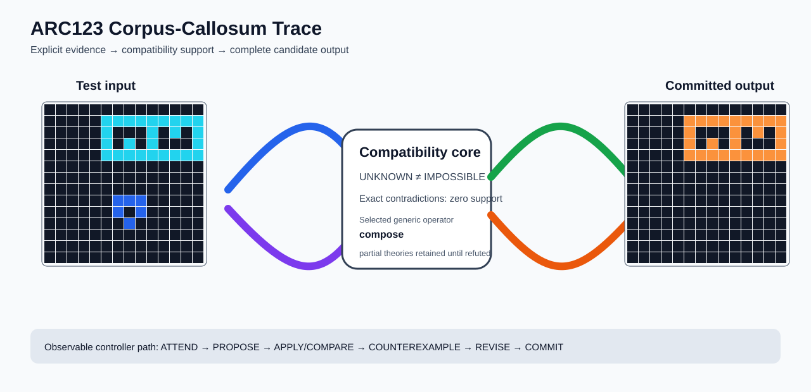

# ARC1 `009d5c81` P0007 Brain Surgery Report

## Outcome: YES — ALL TEST CELLS MATCH

- **Compared positions:** 196
- **Mismatched cells:** 0
- **Training compatibility:** `True`
- **Fallback used:** `False`
- **Causal trace acceptance:** `YES`
- **Selected hypothesis:** `compose(identity,marker_shape_target_recolor(marker=1,target=8,mapping_count=3),erase(color=1,to=input_background))`
- **Source commit:** `085f6dbe39050afac3d1d743f840bac95b1a8d1c`

## Causal Ablations

| Configuration | Exact all-cell result | Training exact | Fallback | Selected hypothesis |
| --- | --- | --- | --- | --- |
| `no_revision` | `False` | `False` | `True` | `fallback_identity_complete_grid` |
| `no_new_residual_family` | `False` | `False` | `True` | `fallback_identity_complete_grid` |

## Live-Agent Boundary

The controller receives only visible training input/output examples and test inputs. It receives no task ID, offline audit label, GT feature record, GT solver, historical decomposition, or held-out output before committing a complete grid. The expected output appears only in the post-answer V&V section.

## Corpus-Callosum Visualization



- Full explicit event record: [`learning_trace.json`](learning_trace.json)
- Full three-configuration record: [`ablations.json`](ablations.json)

## Causal Trace Check

- **Counterexample observed:** `True`
- **Additional visible demonstration selected:** `True`
- **Composition recorded:** `True`
- **Parameter or multi-rule revision:** `True`
- **Generic families in selected theory:** `marker_shape_target_recolor`

## Post-Answer V&V

### Test case 1
- **All cells match:** `True`
- **Mismatched cells:** `0`
- **Prediction:**
```json
[[0, 0, 0, 0, 0, 0, 0, 0, 0, 0, 0, 0, 0, 0], [0, 0, 0, 0, 0, 7, 7, 7, 7, 7, 7, 7, 7, 7], [0, 0, 0, 0, 0, 7, 0, 0, 0, 7, 0, 7, 0, 7], [0, 0, 0, 0, 0, 7, 0, 7, 0, 7, 0, 0, 0, 7], [0, 0, 0, 0, 0, 7, 7, 7, 7, 7, 7, 7, 7, 7], [0, 0, 0, 0, 0, 0, 0, 0, 0, 0, 0, 0, 0, 0], [0, 0, 0, 0, 0, 0, 0, 0, 0, 0, 0, 0, 0, 0], [0, 0, 0, 0, 0, 0, 0, 0, 0, 0, 0, 0, 0, 0], [0, 0, 0, 0, 0, 0, 0, 0, 0, 0, 0, 0, 0, 0], [0, 0, 0, 0, 0, 0, 0, 0, 0, 0, 0, 0, 0, 0], [0, 0, 0, 0, 0, 0, 0, 0, 0, 0, 0, 0, 0, 0], [0, 0, 0, 0, 0, 0, 0, 0, 0, 0, 0, 0, 0, 0], [0, 0, 0, 0, 0, 0, 0, 0, 0, 0, 0, 0, 0, 0], [0, 0, 0, 0, 0, 0, 0, 0, 0, 0, 0, 0, 0, 0]]
```
- **Expected output (post-answer only):**
```json
[[0, 0, 0, 0, 0, 0, 0, 0, 0, 0, 0, 0, 0, 0], [0, 0, 0, 0, 0, 7, 7, 7, 7, 7, 7, 7, 7, 7], [0, 0, 0, 0, 0, 7, 0, 0, 0, 7, 0, 7, 0, 7], [0, 0, 0, 0, 0, 7, 0, 7, 0, 7, 0, 0, 0, 7], [0, 0, 0, 0, 0, 7, 7, 7, 7, 7, 7, 7, 7, 7], [0, 0, 0, 0, 0, 0, 0, 0, 0, 0, 0, 0, 0, 0], [0, 0, 0, 0, 0, 0, 0, 0, 0, 0, 0, 0, 0, 0], [0, 0, 0, 0, 0, 0, 0, 0, 0, 0, 0, 0, 0, 0], [0, 0, 0, 0, 0, 0, 0, 0, 0, 0, 0, 0, 0, 0], [0, 0, 0, 0, 0, 0, 0, 0, 0, 0, 0, 0, 0, 0], [0, 0, 0, 0, 0, 0, 0, 0, 0, 0, 0, 0, 0, 0], [0, 0, 0, 0, 0, 0, 0, 0, 0, 0, 0, 0, 0, 0], [0, 0, 0, 0, 0, 0, 0, 0, 0, 0, 0, 0, 0, 0], [0, 0, 0, 0, 0, 0, 0, 0, 0, 0, 0, 0, 0, 0]]
```

## Observable IHL Walkthrough

The record contains explicit actions, predictions, feedback, and revisions; it does not claim or store hidden model reasoning.

### Action totals

- `ADD_RULE`: 12
- `APPLY_HYPOTHESIS`: 214
- `ATTEND`: 214
- `CHOOSE_NEXT_DEMO`: 214
- `COMMIT`: 1
- `COMPARE`: 214
- `COMPOSE_RULE`: 43
- `EXPLAIN_RESIDUAL`: 55
- `FIND_COUNTEREXAMPLE`: 20
- `MERGE_RULES`: 1
- `PROMOTE_CONSTRAINT`: 22
- `PROPOSE`: 1

### Decision milestones

- `0` `PROPOSE` — `{"parent_theory_id":"T0000","rule":{"description_length":1,"name":"identity","operation":"identity","parameters":{},"rule_id":"identity","scope":{"kind":"all","value":null}},"stage":"initial_generic_theories","theory_id":"T0001"}`
- `2` `ATTEND` — `{"reason":"initial_highest_observed_change_and_color_discrimination","selected_demo":3,"selected_region":{"column":7,"row":0},"theory_id":"T0001"}`
- `6` `ATTEND` — `{"reason":"counterexample_requires_visible_conditional_evidence:unseen_demo_selected_for_residual_version_space_discrimination","selected_demo":0,"selected_region":{"column":7,"row":1},"theory_id":"T0001"}`
- `10` `ATTEND` — `{"reason":"counterexample_requires_visible_conditional_evidence:unseen_demo_selected_for_residual_version_space_discrimination","selected_demo":2,"selected_region":{"column":3,"row":0},"theory_id":"T0001"}`
- `14` `ATTEND` — `{"reason":"counterexample_requires_visible_conditional_evidence:unseen_demo_selected_for_residual_version_space_discrimination","selected_demo":4,"selected_region":{"column":8,"row":1},"theory_id":"T0001"}`
- `18` `ATTEND` — `{"reason":"counterexample_requires_visible_conditional_evidence:unseen_demo_selected_for_residual_version_space_discrimination","selected_demo":1,"selected_region":{"column":4,"row":2},"theory_id":"T0001"}`
- `33` `ATTEND` — `{"reason":"initial_highest_observed_change_and_color_discrimination","selected_demo":3,"selected_region":{"column":7,"row":0},"theory_id":"T0002"}`
- `37` `ATTEND` — `{"reason":"initial_highest_observed_change_and_color_discrimination","selected_demo":3,"selected_region":{"region":"whole_demo"},"theory_id":"T0004"}`
- `41` `ATTEND` — `{"reason":"unseen_demo_selected_for_residual_version_space_discrimination","selected_demo":0,"selected_region":{"region":"whole_demo"},"theory_id":"T0004"}`
- `45` `ATTEND` — `{"reason":"unseen_demo_selected_for_residual_version_space_discrimination","selected_demo":2,"selected_region":{"region":"whole_demo"},"theory_id":"T0004"}`
- `49` `ATTEND` — `{"reason":"unseen_demo_selected_for_residual_version_space_discrimination","selected_demo":4,"selected_region":{"region":"whole_demo"},"theory_id":"T0004"}`
- `53` `ATTEND` — `{"reason":"unseen_demo_selected_for_residual_version_space_discrimination","selected_demo":1,"selected_region":{"region":"whole_demo"},"theory_id":"T0004"}`
- `56` `PROMOTE_CONSTRAINT` — `{"evaluated_demo_count":5,"rule_count":3,"status":"complete_training_compatibility_after_revision","theory_id":"T0004"}`
- `58` `ATTEND` — `{"reason":"initial_highest_observed_change_and_color_discrimination","selected_demo":3,"selected_region":{"column":5,"row":12},"theory_id":"T0003"}`
- `62` `ATTEND` — `{"reason":"counterexample_requires_visible_conditional_evidence:unseen_demo_selected_for_residual_version_space_discrimination","selected_demo":0,"selected_region":{"region":"whole_demo"},"theory_id":"T0003"}`
- `66` `ATTEND` — `{"reason":"counterexample_requires_visible_conditional_evidence:unseen_demo_selected_for_residual_version_space_discrimination","selected_demo":2,"selected_region":{"region":"whole_demo"},"theory_id":"T0003"}`
- `70` `ATTEND` — `{"reason":"counterexample_requires_visible_conditional_evidence:unseen_demo_selected_for_residual_version_space_discrimination","selected_demo":4,"selected_region":{"column":2,"row":8},"theory_id":"T0003"}`
- `74` `ATTEND` — `{"reason":"counterexample_requires_visible_conditional_evidence:unseen_demo_selected_for_residual_version_space_discrimination","selected_demo":1,"selected_region":{"column":3,"row":10},"theory_id":"T0003"}`
- `85` `ATTEND` — `{"reason":"initial_highest_observed_change_and_color_discrimination","selected_demo":3,"selected_region":{"region":"whole_demo"},"theory_id":"T0005"}`
- `89` `ATTEND` — `{"reason":"unseen_demo_selected_for_residual_version_space_discrimination","selected_demo":0,"selected_region":{"region":"whole_demo"},"theory_id":"T0005"}`
- `93` `ATTEND` — `{"reason":"unseen_demo_selected_for_residual_version_space_discrimination","selected_demo":2,"selected_region":{"region":"whole_demo"},"theory_id":"T0005"}`
- `97` `ATTEND` — `{"reason":"unseen_demo_selected_for_residual_version_space_discrimination","selected_demo":4,"selected_region":{"region":"whole_demo"},"theory_id":"T0005"}`
- `101` `ATTEND` — `{"reason":"unseen_demo_selected_for_residual_version_space_discrimination","selected_demo":1,"selected_region":{"region":"whole_demo"},"theory_id":"T0005"}`
- `104` `PROMOTE_CONSTRAINT` — `{"evaluated_demo_count":5,"rule_count":4,"status":"complete_training_compatibility_after_revision","theory_id":"T0005"}`
- `106` `ATTEND` — `{"reason":"initial_highest_observed_change_and_color_discrimination","selected_demo":3,"selected_region":{"region":"whole_demo"},"theory_id":"T0006"}`
- `110` `ATTEND` — `{"reason":"unseen_demo_selected_for_residual_version_space_discrimination","selected_demo":0,"selected_region":{"region":"whole_demo"},"theory_id":"T0006"}`
- `114` `ATTEND` — `{"reason":"unseen_demo_selected_for_residual_version_space_discrimination","selected_demo":2,"selected_region":{"region":"whole_demo"},"theory_id":"T0006"}`
- `118` `ATTEND` — `{"reason":"unseen_demo_selected_for_residual_version_space_discrimination","selected_demo":4,"selected_region":{"region":"whole_demo"},"theory_id":"T0006"}`
- `122` `ATTEND` — `{"reason":"unseen_demo_selected_for_residual_version_space_discrimination","selected_demo":1,"selected_region":{"region":"whole_demo"},"theory_id":"T0006"}`
- `125` `PROMOTE_CONSTRAINT` — `{"evaluated_demo_count":5,"rule_count":5,"status":"complete_training_compatibility_after_revision","theory_id":"T0006"}`
- `127` `ATTEND` — `{"reason":"counterexample_requires_visible_conditional_evidence:unseen_demo_selected_for_residual_version_space_discrimination","selected_demo":0,"selected_region":{"column":2,"row":9},"theory_id":"T0002"}`
- `131` `ATTEND` — `{"reason":"counterexample_requires_visible_conditional_evidence:unseen_demo_selected_for_residual_version_space_discrimination","selected_demo":2,"selected_region":{"column":8,"row":9},"theory_id":"T0002"}`
- `135` `ATTEND` — `{"reason":"counterexample_requires_visible_conditional_evidence:unseen_demo_selected_for_residual_version_space_discrimination","selected_demo":4,"selected_region":{"column":8,"row":1},"theory_id":"T0002"}`
- `139` `ATTEND` — `{"reason":"counterexample_requires_visible_conditional_evidence:unseen_demo_selected_for_residual_version_space_discrimination","selected_demo":1,"selected_region":{"column":4,"row":2},"theory_id":"T0002"}`
- `154` `ATTEND` — `{"reason":"initial_highest_observed_change_and_color_discrimination","selected_demo":3,"selected_region":{"column":7,"row":0},"theory_id":"T0007"}`
- `158` `ATTEND` — `{"reason":"initial_highest_observed_change_and_color_discrimination","selected_demo":3,"selected_region":{"region":"whole_demo"},"theory_id":"T0009"}`
- `162` `ATTEND` — `{"reason":"unseen_demo_selected_for_residual_version_space_discrimination","selected_demo":0,"selected_region":{"region":"whole_demo"},"theory_id":"T0009"}`
- `166` `ATTEND` — `{"reason":"unseen_demo_selected_for_residual_version_space_discrimination","selected_demo":2,"selected_region":{"region":"whole_demo"},"theory_id":"T0009"}`
- `170` `ATTEND` — `{"reason":"unseen_demo_selected_for_residual_version_space_discrimination","selected_demo":4,"selected_region":{"region":"whole_demo"},"theory_id":"T0009"}`
- `174` `ATTEND` — `{"reason":"unseen_demo_selected_for_residual_version_space_discrimination","selected_demo":1,"selected_region":{"region":"whole_demo"},"theory_id":"T0009"}`
- `177` `PROMOTE_CONSTRAINT` — `{"evaluated_demo_count":5,"rule_count":4,"status":"complete_training_compatibility_after_revision","theory_id":"T0009"}`
- `179` `ATTEND` — `{"reason":"initial_highest_observed_change_and_color_discrimination","selected_demo":3,"selected_region":{"column":5,"row":12},"theory_id":"T0008"}`
- `183` `ATTEND` — `{"reason":"counterexample_requires_visible_conditional_evidence:unseen_demo_selected_for_residual_version_space_discrimination","selected_demo":0,"selected_region":{"region":"whole_demo"},"theory_id":"T0008"}`
- `187` `ATTEND` — `{"reason":"counterexample_requires_visible_conditional_evidence:unseen_demo_selected_for_residual_version_space_discrimination","selected_demo":2,"selected_region":{"region":"whole_demo"},"theory_id":"T0008"}`
- `191` `ATTEND` — `{"reason":"counterexample_requires_visible_conditional_evidence:unseen_demo_selected_for_residual_version_space_discrimination","selected_demo":4,"selected_region":{"column":2,"row":8},"theory_id":"T0008"}`
- `195` `ATTEND` — `{"reason":"counterexample_requires_visible_conditional_evidence:unseen_demo_selected_for_residual_version_space_discrimination","selected_demo":1,"selected_region":{"column":3,"row":10},"theory_id":"T0008"}`
- `206` `ATTEND` — `{"reason":"initial_highest_observed_change_and_color_discrimination","selected_demo":3,"selected_region":{"region":"whole_demo"},"theory_id":"T0010"}`
- `210` `ATTEND` — `{"reason":"unseen_demo_selected_for_residual_version_space_discrimination","selected_demo":0,"selected_region":{"region":"whole_demo"},"theory_id":"T0010"}`
- `214` `ATTEND` — `{"reason":"unseen_demo_selected_for_residual_version_space_discrimination","selected_demo":2,"selected_region":{"region":"whole_demo"},"theory_id":"T0010"}`
- `218` `ATTEND` — `{"reason":"unseen_demo_selected_for_residual_version_space_discrimination","selected_demo":4,"selected_region":{"region":"whole_demo"},"theory_id":"T0010"}`
- `222` `ATTEND` — `{"reason":"unseen_demo_selected_for_residual_version_space_discrimination","selected_demo":1,"selected_region":{"region":"whole_demo"},"theory_id":"T0010"}`
- `225` `PROMOTE_CONSTRAINT` — `{"evaluated_demo_count":5,"rule_count":5,"status":"complete_training_compatibility_after_revision","theory_id":"T0010"}`
- `227` `ATTEND` — `{"reason":"initial_highest_observed_change_and_color_discrimination","selected_demo":3,"selected_region":{"region":"whole_demo"},"theory_id":"T0011"}`
- `231` `ATTEND` — `{"reason":"unseen_demo_selected_for_residual_version_space_discrimination","selected_demo":0,"selected_region":{"region":"whole_demo"},"theory_id":"T0011"}`
- `235` `ATTEND` — `{"reason":"unseen_demo_selected_for_residual_version_space_discrimination","selected_demo":2,"selected_region":{"region":"whole_demo"},"theory_id":"T0011"}`
- `239` `ATTEND` — `{"reason":"unseen_demo_selected_for_residual_version_space_discrimination","selected_demo":4,"selected_region":{"region":"whole_demo"},"theory_id":"T0011"}`
- `243` `ATTEND` — `{"reason":"unseen_demo_selected_for_residual_version_space_discrimination","selected_demo":1,"selected_region":{"region":"whole_demo"},"theory_id":"T0011"}`
- `246` `PROMOTE_CONSTRAINT` — `{"evaluated_demo_count":5,"rule_count":6,"status":"complete_training_compatibility_after_revision","theory_id":"T0011"}`
- `248` `ATTEND` — `{"reason":"counterexample_requires_visible_conditional_evidence:unseen_demo_selected_for_residual_version_space_discrimination","selected_demo":0,"selected_region":{"region":"whole_demo"},"theory_id":"T0007"}`
- `252` `ATTEND` — `{"reason":"counterexample_requires_visible_conditional_evidence:unseen_demo_selected_for_residual_version_space_discrimination","selected_demo":2,"selected_region":{"region":"whole_demo"},"theory_id":"T0007"}`
- `256` `ATTEND` — `{"reason":"counterexample_requires_visible_conditional_evidence:unseen_demo_selected_for_residual_version_space_discrimination","selected_demo":4,"selected_region":{"column":8,"row":1},"theory_id":"T0007"}`
- `260` `ATTEND` — `{"reason":"counterexample_requires_visible_conditional_evidence:unseen_demo_selected_for_residual_version_space_discrimination","selected_demo":1,"selected_region":{"column":4,"row":2},"theory_id":"T0007"}`
- `273` `ATTEND` — `{"reason":"initial_highest_observed_change_and_color_discrimination","selected_demo":3,"selected_region":{"column":7,"row":0},"theory_id":"T0012"}`
- `277` `ATTEND` — `{"reason":"initial_highest_observed_change_and_color_discrimination","selected_demo":3,"selected_region":{"region":"whole_demo"},"theory_id":"T0014"}`
- `281` `ATTEND` — `{"reason":"unseen_demo_selected_for_residual_version_space_discrimination","selected_demo":0,"selected_region":{"region":"whole_demo"},"theory_id":"T0014"}`
- `285` `ATTEND` — `{"reason":"unseen_demo_selected_for_residual_version_space_discrimination","selected_demo":2,"selected_region":{"region":"whole_demo"},"theory_id":"T0014"}`
- `289` `ATTEND` — `{"reason":"unseen_demo_selected_for_residual_version_space_discrimination","selected_demo":4,"selected_region":{"region":"whole_demo"},"theory_id":"T0014"}`
- `293` `ATTEND` — `{"reason":"unseen_demo_selected_for_residual_version_space_discrimination","selected_demo":1,"selected_region":{"region":"whole_demo"},"theory_id":"T0014"}`
- `296` `PROMOTE_CONSTRAINT` — `{"evaluated_demo_count":5,"rule_count":4,"status":"complete_training_compatibility_after_revision","theory_id":"T0014"}`
- `298` `ATTEND` — `{"reason":"initial_highest_observed_change_and_color_discrimination","selected_demo":3,"selected_region":{"column":5,"row":12},"theory_id":"T0013"}`
- `302` `ATTEND` — `{"reason":"counterexample_requires_visible_conditional_evidence:unseen_demo_selected_for_residual_version_space_discrimination","selected_demo":0,"selected_region":{"region":"whole_demo"},"theory_id":"T0013"}`
- `306` `ATTEND` — `{"reason":"counterexample_requires_visible_conditional_evidence:unseen_demo_selected_for_residual_version_space_discrimination","selected_demo":2,"selected_region":{"region":"whole_demo"},"theory_id":"T0013"}`
- `310` `ATTEND` — `{"reason":"counterexample_requires_visible_conditional_evidence:unseen_demo_selected_for_residual_version_space_discrimination","selected_demo":4,"selected_region":{"column":2,"row":8},"theory_id":"T0013"}`
- `314` `ATTEND` — `{"reason":"counterexample_requires_visible_conditional_evidence:unseen_demo_selected_for_residual_version_space_discrimination","selected_demo":1,"selected_region":{"column":3,"row":10},"theory_id":"T0013"}`
- `323` `ATTEND` — `{"reason":"initial_highest_observed_change_and_color_discrimination","selected_demo":3,"selected_region":{"region":"whole_demo"},"theory_id":"T0015"}`
- `327` `ATTEND` — `{"reason":"unseen_demo_selected_for_residual_version_space_discrimination","selected_demo":0,"selected_region":{"region":"whole_demo"},"theory_id":"T0015"}`
- `331` `ATTEND` — `{"reason":"unseen_demo_selected_for_residual_version_space_discrimination","selected_demo":2,"selected_region":{"region":"whole_demo"},"theory_id":"T0015"}`
- `335` `ATTEND` — `{"reason":"unseen_demo_selected_for_residual_version_space_discrimination","selected_demo":4,"selected_region":{"region":"whole_demo"},"theory_id":"T0015"}`
- `339` `ATTEND` — `{"reason":"unseen_demo_selected_for_residual_version_space_discrimination","selected_demo":1,"selected_region":{"region":"whole_demo"},"theory_id":"T0015"}`
- `342` `PROMOTE_CONSTRAINT` — `{"evaluated_demo_count":5,"rule_count":6,"status":"complete_training_compatibility_after_revision","theory_id":"T0015"}`
- `344` `ATTEND` — `{"reason":"initial_highest_observed_change_and_color_discrimination","selected_demo":3,"selected_region":{"column":5,"row":12},"theory_id":"T0016"}`
- `348` `ATTEND` — `{"reason":"counterexample_requires_visible_conditional_evidence:unseen_demo_selected_for_residual_version_space_discrimination","selected_demo":0,"selected_region":{"region":"whole_demo"},"theory_id":"T0016"}`
- `352` `ATTEND` — `{"reason":"counterexample_requires_visible_conditional_evidence:unseen_demo_selected_for_residual_version_space_discrimination","selected_demo":2,"selected_region":{"region":"whole_demo"},"theory_id":"T0016"}`
- `356` `ATTEND` — `{"reason":"counterexample_requires_visible_conditional_evidence:unseen_demo_selected_for_residual_version_space_discrimination","selected_demo":4,"selected_region":{"column":2,"row":8},"theory_id":"T0016"}`
- `360` `ATTEND` — `{"reason":"counterexample_requires_visible_conditional_evidence:unseen_demo_selected_for_residual_version_space_discrimination","selected_demo":1,"selected_region":{"column":3,"row":10},"theory_id":"T0016"}`
- `367` `ATTEND` — `{"reason":"initial_highest_observed_change_and_color_discrimination","selected_demo":3,"selected_region":{"region":"whole_demo"},"theory_id":"T0017"}`
- `371` `ATTEND` — `{"reason":"unseen_demo_selected_for_residual_version_space_discrimination","selected_demo":0,"selected_region":{"region":"whole_demo"},"theory_id":"T0017"}`
- `375` `ATTEND` — `{"reason":"unseen_demo_selected_for_residual_version_space_discrimination","selected_demo":2,"selected_region":{"region":"whole_demo"},"theory_id":"T0017"}`
- `379` `ATTEND` — `{"reason":"unseen_demo_selected_for_residual_version_space_discrimination","selected_demo":4,"selected_region":{"region":"whole_demo"},"theory_id":"T0017"}`
- `383` `ATTEND` — `{"reason":"unseen_demo_selected_for_residual_version_space_discrimination","selected_demo":1,"selected_region":{"region":"whole_demo"},"theory_id":"T0017"}`
- `386` `PROMOTE_CONSTRAINT` — `{"evaluated_demo_count":5,"rule_count":7,"status":"complete_training_compatibility_after_revision","theory_id":"T0017"}`
- `388` `ATTEND` — `{"reason":"counterexample_requires_visible_conditional_evidence:unseen_demo_selected_for_residual_version_space_discrimination","selected_demo":0,"selected_region":{"column":7,"row":1},"theory_id":"T0012"}`
- `392` `ATTEND` — `{"reason":"counterexample_requires_visible_conditional_evidence:unseen_demo_selected_for_residual_version_space_discrimination","selected_demo":2,"selected_region":{"column":3,"row":0},"theory_id":"T0012"}`
- `396` `ATTEND` — `{"reason":"counterexample_requires_visible_conditional_evidence:unseen_demo_selected_for_residual_version_space_discrimination","selected_demo":4,"selected_region":{"region":"whole_demo"},"theory_id":"T0012"}`
- `400` `ATTEND` — `{"reason":"counterexample_requires_visible_conditional_evidence:unseen_demo_selected_for_residual_version_space_discrimination","selected_demo":1,"selected_region":{"region":"whole_demo"},"theory_id":"T0012"}`
- `413` `ATTEND` — `{"reason":"initial_highest_observed_change_and_color_discrimination","selected_demo":3,"selected_region":{"column":7,"row":0},"theory_id":"T0018"}`
- `417` `ATTEND` — `{"reason":"initial_highest_observed_change_and_color_discrimination","selected_demo":3,"selected_region":{"region":"whole_demo"},"theory_id":"T0020"}`
- `421` `ATTEND` — `{"reason":"unseen_demo_selected_for_residual_version_space_discrimination","selected_demo":0,"selected_region":{"region":"whole_demo"},"theory_id":"T0020"}`
- `425` `ATTEND` — `{"reason":"unseen_demo_selected_for_residual_version_space_discrimination","selected_demo":2,"selected_region":{"region":"whole_demo"},"theory_id":"T0020"}`
- `429` `ATTEND` — `{"reason":"unseen_demo_selected_for_residual_version_space_discrimination","selected_demo":4,"selected_region":{"region":"whole_demo"},"theory_id":"T0020"}`
- `433` `ATTEND` — `{"reason":"unseen_demo_selected_for_residual_version_space_discrimination","selected_demo":1,"selected_region":{"region":"whole_demo"},"theory_id":"T0020"}`
- `436` `PROMOTE_CONSTRAINT` — `{"evaluated_demo_count":5,"rule_count":5,"status":"complete_training_compatibility_after_revision","theory_id":"T0020"}`
- `438` `ATTEND` — `{"reason":"initial_highest_observed_change_and_color_discrimination","selected_demo":3,"selected_region":{"column":5,"row":12},"theory_id":"T0019"}`
- `442` `ATTEND` — `{"reason":"counterexample_requires_visible_conditional_evidence:unseen_demo_selected_for_residual_version_space_discrimination","selected_demo":0,"selected_region":{"region":"whole_demo"},"theory_id":"T0019"}`
- `446` `ATTEND` — `{"reason":"counterexample_requires_visible_conditional_evidence:unseen_demo_selected_for_residual_version_space_discrimination","selected_demo":2,"selected_region":{"region":"whole_demo"},"theory_id":"T0019"}`
- `450` `ATTEND` — `{"reason":"counterexample_requires_visible_conditional_evidence:unseen_demo_selected_for_residual_version_space_discrimination","selected_demo":4,"selected_region":{"column":2,"row":8},"theory_id":"T0019"}`
- `454` `ATTEND` — `{"reason":"counterexample_requires_visible_conditional_evidence:unseen_demo_selected_for_residual_version_space_discrimination","selected_demo":1,"selected_region":{"column":3,"row":10},"theory_id":"T0019"}`
- `463` `ATTEND` — `{"reason":"initial_highest_observed_change_and_color_discrimination","selected_demo":3,"selected_region":{"region":"whole_demo"},"theory_id":"T0021"}`
- `467` `ATTEND` — `{"reason":"unseen_demo_selected_for_residual_version_space_discrimination","selected_demo":0,"selected_region":{"region":"whole_demo"},"theory_id":"T0021"}`
- `471` `ATTEND` — `{"reason":"unseen_demo_selected_for_residual_version_space_discrimination","selected_demo":2,"selected_region":{"region":"whole_demo"},"theory_id":"T0021"}`
- `475` `ATTEND` — `{"reason":"unseen_demo_selected_for_residual_version_space_discrimination","selected_demo":4,"selected_region":{"region":"whole_demo"},"theory_id":"T0021"}`
- `479` `ATTEND` — `{"reason":"unseen_demo_selected_for_residual_version_space_discrimination","selected_demo":1,"selected_region":{"region":"whole_demo"},"theory_id":"T0021"}`
- `482` `PROMOTE_CONSTRAINT` — `{"evaluated_demo_count":5,"rule_count":7,"status":"complete_training_compatibility_after_revision","theory_id":"T0021"}`
- `484` `ATTEND` — `{"reason":"initial_highest_observed_change_and_color_discrimination","selected_demo":3,"selected_region":{"column":5,"row":12},"theory_id":"T0022"}`
- `488` `ATTEND` — `{"reason":"counterexample_requires_visible_conditional_evidence:unseen_demo_selected_for_residual_version_space_discrimination","selected_demo":0,"selected_region":{"region":"whole_demo"},"theory_id":"T0022"}`
- `492` `ATTEND` — `{"reason":"counterexample_requires_visible_conditional_evidence:unseen_demo_selected_for_residual_version_space_discrimination","selected_demo":2,"selected_region":{"region":"whole_demo"},"theory_id":"T0022"}`
- `496` `ATTEND` — `{"reason":"counterexample_requires_visible_conditional_evidence:unseen_demo_selected_for_residual_version_space_discrimination","selected_demo":4,"selected_region":{"column":2,"row":8},"theory_id":"T0022"}`
- `500` `ATTEND` — `{"reason":"counterexample_requires_visible_conditional_evidence:unseen_demo_selected_for_residual_version_space_discrimination","selected_demo":1,"selected_region":{"column":3,"row":10},"theory_id":"T0022"}`
- `507` `ATTEND` — `{"reason":"initial_highest_observed_change_and_color_discrimination","selected_demo":3,"selected_region":{"region":"whole_demo"},"theory_id":"T0023"}`
- `511` `ATTEND` — `{"reason":"unseen_demo_selected_for_residual_version_space_discrimination","selected_demo":0,"selected_region":{"region":"whole_demo"},"theory_id":"T0023"}`
- `515` `ATTEND` — `{"reason":"unseen_demo_selected_for_residual_version_space_discrimination","selected_demo":2,"selected_region":{"region":"whole_demo"},"theory_id":"T0023"}`
- `519` `ATTEND` — `{"reason":"unseen_demo_selected_for_residual_version_space_discrimination","selected_demo":4,"selected_region":{"region":"whole_demo"},"theory_id":"T0023"}`
- `523` `ATTEND` — `{"reason":"unseen_demo_selected_for_residual_version_space_discrimination","selected_demo":1,"selected_region":{"region":"whole_demo"},"theory_id":"T0023"}`
- `526` `PROMOTE_CONSTRAINT` — `{"evaluated_demo_count":5,"rule_count":8,"status":"complete_training_compatibility_after_revision","theory_id":"T0023"}`
- `528` `ATTEND` — `{"reason":"counterexample_requires_visible_conditional_evidence:unseen_demo_selected_for_residual_version_space_discrimination","selected_demo":0,"selected_region":{"region":"whole_demo"},"theory_id":"T0018"}`
- `532` `ATTEND` — `{"reason":"counterexample_requires_visible_conditional_evidence:unseen_demo_selected_for_residual_version_space_discrimination","selected_demo":2,"selected_region":{"region":"whole_demo"},"theory_id":"T0018"}`
- `536` `ATTEND` — `{"reason":"counterexample_requires_visible_conditional_evidence:unseen_demo_selected_for_residual_version_space_discrimination","selected_demo":4,"selected_region":{"column":8,"row":1},"theory_id":"T0018"}`
- `540` `ATTEND` — `{"reason":"counterexample_requires_visible_conditional_evidence:unseen_demo_selected_for_residual_version_space_discrimination","selected_demo":1,"selected_region":{"column":4,"row":2},"theory_id":"T0018"}`
- `553` `ATTEND` — `{"reason":"initial_highest_observed_change_and_color_discrimination","selected_demo":3,"selected_region":{"column":7,"row":0},"theory_id":"T0024"}`
- `557` `ATTEND` — `{"reason":"initial_highest_observed_change_and_color_discrimination","selected_demo":3,"selected_region":{"region":"whole_demo"},"theory_id":"T0026"}`
- `561` `ATTEND` — `{"reason":"unseen_demo_selected_for_residual_version_space_discrimination","selected_demo":0,"selected_region":{"region":"whole_demo"},"theory_id":"T0026"}`
- `565` `ATTEND` — `{"reason":"unseen_demo_selected_for_residual_version_space_discrimination","selected_demo":2,"selected_region":{"region":"whole_demo"},"theory_id":"T0026"}`
- `569` `ATTEND` — `{"reason":"unseen_demo_selected_for_residual_version_space_discrimination","selected_demo":4,"selected_region":{"region":"whole_demo"},"theory_id":"T0026"}`
- `573` `ATTEND` — `{"reason":"unseen_demo_selected_for_residual_version_space_discrimination","selected_demo":1,"selected_region":{"region":"whole_demo"},"theory_id":"T0026"}`
- `576` `PROMOTE_CONSTRAINT` — `{"evaluated_demo_count":5,"rule_count":6,"status":"complete_training_compatibility_after_revision","theory_id":"T0026"}`
- `578` `ATTEND` — `{"reason":"initial_highest_observed_change_and_color_discrimination","selected_demo":3,"selected_region":{"column":5,"row":12},"theory_id":"T0025"}`
- `582` `ATTEND` — `{"reason":"counterexample_requires_visible_conditional_evidence:unseen_demo_selected_for_residual_version_space_discrimination","selected_demo":0,"selected_region":{"region":"whole_demo"},"theory_id":"T0025"}`
- `586` `ATTEND` — `{"reason":"counterexample_requires_visible_conditional_evidence:unseen_demo_selected_for_residual_version_space_discrimination","selected_demo":2,"selected_region":{"region":"whole_demo"},"theory_id":"T0025"}`
- `590` `ATTEND` — `{"reason":"counterexample_requires_visible_conditional_evidence:unseen_demo_selected_for_residual_version_space_discrimination","selected_demo":4,"selected_region":{"column":2,"row":8},"theory_id":"T0025"}`
- `594` `ATTEND` — `{"reason":"counterexample_requires_visible_conditional_evidence:unseen_demo_selected_for_residual_version_space_discrimination","selected_demo":1,"selected_region":{"column":3,"row":10},"theory_id":"T0025"}`
- `603` `ATTEND` — `{"reason":"initial_highest_observed_change_and_color_discrimination","selected_demo":3,"selected_region":{"region":"whole_demo"},"theory_id":"T0027"}`
- `607` `ATTEND` — `{"reason":"unseen_demo_selected_for_residual_version_space_discrimination","selected_demo":0,"selected_region":{"region":"whole_demo"},"theory_id":"T0027"}`
- `611` `ATTEND` — `{"reason":"unseen_demo_selected_for_residual_version_space_discrimination","selected_demo":2,"selected_region":{"region":"whole_demo"},"theory_id":"T0027"}`
- `615` `ATTEND` — `{"reason":"unseen_demo_selected_for_residual_version_space_discrimination","selected_demo":4,"selected_region":{"region":"whole_demo"},"theory_id":"T0027"}`
- `619` `ATTEND` — `{"reason":"unseen_demo_selected_for_residual_version_space_discrimination","selected_demo":1,"selected_region":{"region":"whole_demo"},"theory_id":"T0027"}`
- `622` `PROMOTE_CONSTRAINT` — `{"evaluated_demo_count":5,"rule_count":8,"status":"complete_training_compatibility_after_revision","theory_id":"T0027"}`
- `624` `ATTEND` — `{"reason":"initial_highest_observed_change_and_color_discrimination","selected_demo":3,"selected_region":{"column":5,"row":12},"theory_id":"T0028"}`
- `628` `ATTEND` — `{"reason":"counterexample_requires_visible_conditional_evidence:unseen_demo_selected_for_residual_version_space_discrimination","selected_demo":0,"selected_region":{"region":"whole_demo"},"theory_id":"T0028"}`
- `632` `ATTEND` — `{"reason":"counterexample_requires_visible_conditional_evidence:unseen_demo_selected_for_residual_version_space_discrimination","selected_demo":2,"selected_region":{"region":"whole_demo"},"theory_id":"T0028"}`
- `636` `ATTEND` — `{"reason":"counterexample_requires_visible_conditional_evidence:unseen_demo_selected_for_residual_version_space_discrimination","selected_demo":4,"selected_region":{"column":2,"row":8},"theory_id":"T0028"}`
- `640` `ATTEND` — `{"reason":"counterexample_requires_visible_conditional_evidence:unseen_demo_selected_for_residual_version_space_discrimination","selected_demo":1,"selected_region":{"column":3,"row":10},"theory_id":"T0028"}`
- `647` `ATTEND` — `{"reason":"initial_highest_observed_change_and_color_discrimination","selected_demo":3,"selected_region":{"region":"whole_demo"},"theory_id":"T0029"}`
- `651` `ATTEND` — `{"reason":"unseen_demo_selected_for_residual_version_space_discrimination","selected_demo":0,"selected_region":{"region":"whole_demo"},"theory_id":"T0029"}`
- `655` `ATTEND` — `{"reason":"unseen_demo_selected_for_residual_version_space_discrimination","selected_demo":2,"selected_region":{"region":"whole_demo"},"theory_id":"T0029"}`
- `659` `ATTEND` — `{"reason":"unseen_demo_selected_for_residual_version_space_discrimination","selected_demo":4,"selected_region":{"region":"whole_demo"},"theory_id":"T0029"}`
- `663` `ATTEND` — `{"reason":"unseen_demo_selected_for_residual_version_space_discrimination","selected_demo":1,"selected_region":{"region":"whole_demo"},"theory_id":"T0029"}`
- `666` `PROMOTE_CONSTRAINT` — `{"evaluated_demo_count":5,"rule_count":9,"status":"complete_training_compatibility_after_revision","theory_id":"T0029"}`
- `668` `ATTEND` — `{"reason":"counterexample_requires_visible_conditional_evidence:unseen_demo_selected_for_residual_version_space_discrimination","selected_demo":0,"selected_region":{"column":7,"row":1},"theory_id":"T0024"}`
- `672` `ATTEND` — `{"reason":"counterexample_requires_visible_conditional_evidence:unseen_demo_selected_for_residual_version_space_discrimination","selected_demo":2,"selected_region":{"column":3,"row":0},"theory_id":"T0024"}`
- `676` `ATTEND` — `{"reason":"counterexample_requires_visible_conditional_evidence:unseen_demo_selected_for_residual_version_space_discrimination","selected_demo":4,"selected_region":{"region":"whole_demo"},"theory_id":"T0024"}`
- `680` `ATTEND` — `{"reason":"counterexample_requires_visible_conditional_evidence:unseen_demo_selected_for_residual_version_space_discrimination","selected_demo":1,"selected_region":{"region":"whole_demo"},"theory_id":"T0024"}`
- `693` `ATTEND` — `{"reason":"initial_highest_observed_change_and_color_discrimination","selected_demo":3,"selected_region":{"column":7,"row":0},"theory_id":"T0030"}`
- `697` `ATTEND` — `{"reason":"initial_highest_observed_change_and_color_discrimination","selected_demo":3,"selected_region":{"region":"whole_demo"},"theory_id":"T0032"}`
- `701` `ATTEND` — `{"reason":"unseen_demo_selected_for_residual_version_space_discrimination","selected_demo":0,"selected_region":{"region":"whole_demo"},"theory_id":"T0032"}`
- `705` `ATTEND` — `{"reason":"unseen_demo_selected_for_residual_version_space_discrimination","selected_demo":2,"selected_region":{"region":"whole_demo"},"theory_id":"T0032"}`
- `709` `ATTEND` — `{"reason":"unseen_demo_selected_for_residual_version_space_discrimination","selected_demo":4,"selected_region":{"region":"whole_demo"},"theory_id":"T0032"}`
- `713` `ATTEND` — `{"reason":"unseen_demo_selected_for_residual_version_space_discrimination","selected_demo":1,"selected_region":{"region":"whole_demo"},"theory_id":"T0032"}`
- `716` `PROMOTE_CONSTRAINT` — `{"evaluated_demo_count":5,"rule_count":7,"status":"complete_training_compatibility_after_revision","theory_id":"T0032"}`
- `718` `ATTEND` — `{"reason":"initial_highest_observed_change_and_color_discrimination","selected_demo":3,"selected_region":{"column":5,"row":12},"theory_id":"T0031"}`
- `722` `ATTEND` — `{"reason":"counterexample_requires_visible_conditional_evidence:unseen_demo_selected_for_residual_version_space_discrimination","selected_demo":0,"selected_region":{"region":"whole_demo"},"theory_id":"T0031"}`
- `726` `ATTEND` — `{"reason":"counterexample_requires_visible_conditional_evidence:unseen_demo_selected_for_residual_version_space_discrimination","selected_demo":2,"selected_region":{"region":"whole_demo"},"theory_id":"T0031"}`
- `730` `ATTEND` — `{"reason":"counterexample_requires_visible_conditional_evidence:unseen_demo_selected_for_residual_version_space_discrimination","selected_demo":4,"selected_region":{"column":2,"row":8},"theory_id":"T0031"}`
- `734` `ATTEND` — `{"reason":"counterexample_requires_visible_conditional_evidence:unseen_demo_selected_for_residual_version_space_discrimination","selected_demo":1,"selected_region":{"column":3,"row":10},"theory_id":"T0031"}`
- `743` `ATTEND` — `{"reason":"initial_highest_observed_change_and_color_discrimination","selected_demo":3,"selected_region":{"region":"whole_demo"},"theory_id":"T0033"}`
- `747` `ATTEND` — `{"reason":"unseen_demo_selected_for_residual_version_space_discrimination","selected_demo":0,"selected_region":{"region":"whole_demo"},"theory_id":"T0033"}`
- `751` `ATTEND` — `{"reason":"unseen_demo_selected_for_residual_version_space_discrimination","selected_demo":2,"selected_region":{"region":"whole_demo"},"theory_id":"T0033"}`
- `755` `ATTEND` — `{"reason":"unseen_demo_selected_for_residual_version_space_discrimination","selected_demo":4,"selected_region":{"region":"whole_demo"},"theory_id":"T0033"}`
- `759` `ATTEND` — `{"reason":"unseen_demo_selected_for_residual_version_space_discrimination","selected_demo":1,"selected_region":{"region":"whole_demo"},"theory_id":"T0033"}`
- `762` `PROMOTE_CONSTRAINT` — `{"evaluated_demo_count":5,"rule_count":9,"status":"complete_training_compatibility_after_revision","theory_id":"T0033"}`
- `764` `ATTEND` — `{"reason":"initial_highest_observed_change_and_color_discrimination","selected_demo":3,"selected_region":{"column":5,"row":12},"theory_id":"T0034"}`
- `768` `ATTEND` — `{"reason":"counterexample_requires_visible_conditional_evidence:unseen_demo_selected_for_residual_version_space_discrimination","selected_demo":0,"selected_region":{"region":"whole_demo"},"theory_id":"T0034"}`
- `772` `ATTEND` — `{"reason":"counterexample_requires_visible_conditional_evidence:unseen_demo_selected_for_residual_version_space_discrimination","selected_demo":2,"selected_region":{"region":"whole_demo"},"theory_id":"T0034"}`
- `776` `ATTEND` — `{"reason":"counterexample_requires_visible_conditional_evidence:unseen_demo_selected_for_residual_version_space_discrimination","selected_demo":4,"selected_region":{"column":2,"row":8},"theory_id":"T0034"}`
- `780` `ATTEND` — `{"reason":"counterexample_requires_visible_conditional_evidence:unseen_demo_selected_for_residual_version_space_discrimination","selected_demo":1,"selected_region":{"column":3,"row":10},"theory_id":"T0034"}`
- `787` `ATTEND` — `{"reason":"initial_highest_observed_change_and_color_discrimination","selected_demo":3,"selected_region":{"region":"whole_demo"},"theory_id":"T0035"}`
- `791` `ATTEND` — `{"reason":"unseen_demo_selected_for_residual_version_space_discrimination","selected_demo":0,"selected_region":{"region":"whole_demo"},"theory_id":"T0035"}`
- `795` `ATTEND` — `{"reason":"unseen_demo_selected_for_residual_version_space_discrimination","selected_demo":2,"selected_region":{"region":"whole_demo"},"theory_id":"T0035"}`
- `799` `ATTEND` — `{"reason":"unseen_demo_selected_for_residual_version_space_discrimination","selected_demo":4,"selected_region":{"region":"whole_demo"},"theory_id":"T0035"}`
- `803` `ATTEND` — `{"reason":"unseen_demo_selected_for_residual_version_space_discrimination","selected_demo":1,"selected_region":{"region":"whole_demo"},"theory_id":"T0035"}`
- `806` `PROMOTE_CONSTRAINT` — `{"evaluated_demo_count":5,"rule_count":10,"status":"complete_training_compatibility_after_revision","theory_id":"T0035"}`
- `808` `ATTEND` — `{"reason":"counterexample_requires_visible_conditional_evidence:unseen_demo_selected_for_residual_version_space_discrimination","selected_demo":0,"selected_region":{"region":"whole_demo"},"theory_id":"T0030"}`
- `812` `ATTEND` — `{"reason":"counterexample_requires_visible_conditional_evidence:unseen_demo_selected_for_residual_version_space_discrimination","selected_demo":2,"selected_region":{"region":"whole_demo"},"theory_id":"T0030"}`
- `816` `ATTEND` — `{"reason":"counterexample_requires_visible_conditional_evidence:unseen_demo_selected_for_residual_version_space_discrimination","selected_demo":4,"selected_region":{"column":8,"row":1},"theory_id":"T0030"}`
- `820` `ATTEND` — `{"reason":"counterexample_requires_visible_conditional_evidence:unseen_demo_selected_for_residual_version_space_discrimination","selected_demo":1,"selected_region":{"column":4,"row":2},"theory_id":"T0030"}`
- `833` `ATTEND` — `{"reason":"initial_highest_observed_change_and_color_discrimination","selected_demo":3,"selected_region":{"column":7,"row":0},"theory_id":"T0036"}`
- `837` `ATTEND` — `{"reason":"initial_highest_observed_change_and_color_discrimination","selected_demo":3,"selected_region":{"region":"whole_demo"},"theory_id":"T0038"}`
- `841` `ATTEND` — `{"reason":"unseen_demo_selected_for_residual_version_space_discrimination","selected_demo":0,"selected_region":{"region":"whole_demo"},"theory_id":"T0038"}`
- `845` `ATTEND` — `{"reason":"unseen_demo_selected_for_residual_version_space_discrimination","selected_demo":2,"selected_region":{"region":"whole_demo"},"theory_id":"T0038"}`
- `849` `ATTEND` — `{"reason":"unseen_demo_selected_for_residual_version_space_discrimination","selected_demo":4,"selected_region":{"region":"whole_demo"},"theory_id":"T0038"}`
- `853` `ATTEND` — `{"reason":"unseen_demo_selected_for_residual_version_space_discrimination","selected_demo":1,"selected_region":{"region":"whole_demo"},"theory_id":"T0038"}`
- `856` `PROMOTE_CONSTRAINT` — `{"evaluated_demo_count":5,"rule_count":8,"status":"complete_training_compatibility_after_revision","theory_id":"T0038"}`
- `858` `ATTEND` — `{"reason":"initial_highest_observed_change_and_color_discrimination","selected_demo":3,"selected_region":{"column":5,"row":12},"theory_id":"T0037"}`
- `862` `ATTEND` — `{"reason":"counterexample_requires_visible_conditional_evidence:unseen_demo_selected_for_residual_version_space_discrimination","selected_demo":0,"selected_region":{"region":"whole_demo"},"theory_id":"T0037"}`
- `866` `ATTEND` — `{"reason":"counterexample_requires_visible_conditional_evidence:unseen_demo_selected_for_residual_version_space_discrimination","selected_demo":2,"selected_region":{"region":"whole_demo"},"theory_id":"T0037"}`
- `870` `ATTEND` — `{"reason":"counterexample_requires_visible_conditional_evidence:unseen_demo_selected_for_residual_version_space_discrimination","selected_demo":4,"selected_region":{"column":2,"row":8},"theory_id":"T0037"}`
- `874` `ATTEND` — `{"reason":"counterexample_requires_visible_conditional_evidence:unseen_demo_selected_for_residual_version_space_discrimination","selected_demo":1,"selected_region":{"column":3,"row":10},"theory_id":"T0037"}`
- `883` `ATTEND` — `{"reason":"initial_highest_observed_change_and_color_discrimination","selected_demo":3,"selected_region":{"region":"whole_demo"},"theory_id":"T0039"}`
- `887` `ATTEND` — `{"reason":"unseen_demo_selected_for_residual_version_space_discrimination","selected_demo":0,"selected_region":{"region":"whole_demo"},"theory_id":"T0039"}`
- `891` `ATTEND` — `{"reason":"unseen_demo_selected_for_residual_version_space_discrimination","selected_demo":2,"selected_region":{"region":"whole_demo"},"theory_id":"T0039"}`
- `895` `ATTEND` — `{"reason":"unseen_demo_selected_for_residual_version_space_discrimination","selected_demo":4,"selected_region":{"region":"whole_demo"},"theory_id":"T0039"}`
- `899` `ATTEND` — `{"reason":"unseen_demo_selected_for_residual_version_space_discrimination","selected_demo":1,"selected_region":{"region":"whole_demo"},"theory_id":"T0039"}`
- `902` `PROMOTE_CONSTRAINT` — `{"evaluated_demo_count":5,"rule_count":10,"status":"complete_training_compatibility_after_revision","theory_id":"T0039"}`
- `904` `ATTEND` — `{"reason":"initial_highest_observed_change_and_color_discrimination","selected_demo":3,"selected_region":{"column":5,"row":12},"theory_id":"T0040"}`
- `908` `ATTEND` — `{"reason":"counterexample_requires_visible_conditional_evidence:unseen_demo_selected_for_residual_version_space_discrimination","selected_demo":0,"selected_region":{"region":"whole_demo"},"theory_id":"T0040"}`
- `912` `ATTEND` — `{"reason":"counterexample_requires_visible_conditional_evidence:unseen_demo_selected_for_residual_version_space_discrimination","selected_demo":2,"selected_region":{"region":"whole_demo"},"theory_id":"T0040"}`
- `916` `ATTEND` — `{"reason":"counterexample_requires_visible_conditional_evidence:unseen_demo_selected_for_residual_version_space_discrimination","selected_demo":4,"selected_region":{"column":2,"row":8},"theory_id":"T0040"}`
- `920` `ATTEND` — `{"reason":"counterexample_requires_visible_conditional_evidence:unseen_demo_selected_for_residual_version_space_discrimination","selected_demo":1,"selected_region":{"column":3,"row":10},"theory_id":"T0040"}`
- `927` `ATTEND` — `{"reason":"initial_highest_observed_change_and_color_discrimination","selected_demo":3,"selected_region":{"region":"whole_demo"},"theory_id":"T0041"}`
- `931` `ATTEND` — `{"reason":"unseen_demo_selected_for_residual_version_space_discrimination","selected_demo":0,"selected_region":{"region":"whole_demo"},"theory_id":"T0041"}`
- `935` `ATTEND` — `{"reason":"unseen_demo_selected_for_residual_version_space_discrimination","selected_demo":2,"selected_region":{"region":"whole_demo"},"theory_id":"T0041"}`
- `939` `ATTEND` — `{"reason":"unseen_demo_selected_for_residual_version_space_discrimination","selected_demo":4,"selected_region":{"region":"whole_demo"},"theory_id":"T0041"}`
- `943` `ATTEND` — `{"reason":"unseen_demo_selected_for_residual_version_space_discrimination","selected_demo":1,"selected_region":{"region":"whole_demo"},"theory_id":"T0041"}`
- `946` `PROMOTE_CONSTRAINT` — `{"evaluated_demo_count":5,"rule_count":11,"status":"complete_training_compatibility_after_revision","theory_id":"T0041"}`
- `948` `ATTEND` — `{"reason":"counterexample_requires_visible_conditional_evidence:unseen_demo_selected_for_residual_version_space_discrimination","selected_demo":0,"selected_region":{"column":7,"row":1},"theory_id":"T0036"}`
- `952` `ATTEND` — `{"reason":"counterexample_requires_visible_conditional_evidence:unseen_demo_selected_for_residual_version_space_discrimination","selected_demo":2,"selected_region":{"column":3,"row":0},"theory_id":"T0036"}`
- `956` `ATTEND` — `{"reason":"counterexample_requires_visible_conditional_evidence:unseen_demo_selected_for_residual_version_space_discrimination","selected_demo":4,"selected_region":{"region":"whole_demo"},"theory_id":"T0036"}`
- `960` `ATTEND` — `{"reason":"counterexample_requires_visible_conditional_evidence:unseen_demo_selected_for_residual_version_space_discrimination","selected_demo":1,"selected_region":{"region":"whole_demo"},"theory_id":"T0036"}`
- `973` `ATTEND` — `{"reason":"initial_highest_observed_change_and_color_discrimination","selected_demo":3,"selected_region":{"column":7,"row":0},"theory_id":"T0042"}`
- `977` `ATTEND` — `{"reason":"initial_highest_observed_change_and_color_discrimination","selected_demo":3,"selected_region":{"region":"whole_demo"},"theory_id":"T0044"}`
- `981` `ATTEND` — `{"reason":"unseen_demo_selected_for_residual_version_space_discrimination","selected_demo":0,"selected_region":{"region":"whole_demo"},"theory_id":"T0044"}`
- `985` `ATTEND` — `{"reason":"unseen_demo_selected_for_residual_version_space_discrimination","selected_demo":2,"selected_region":{"region":"whole_demo"},"theory_id":"T0044"}`
- `989` `ATTEND` — `{"reason":"unseen_demo_selected_for_residual_version_space_discrimination","selected_demo":4,"selected_region":{"region":"whole_demo"},"theory_id":"T0044"}`
- `993` `ATTEND` — `{"reason":"unseen_demo_selected_for_residual_version_space_discrimination","selected_demo":1,"selected_region":{"region":"whole_demo"},"theory_id":"T0044"}`
- `996` `PROMOTE_CONSTRAINT` — `{"evaluated_demo_count":5,"rule_count":9,"status":"complete_training_compatibility_after_revision","theory_id":"T0044"}`
- `998` `ATTEND` — `{"reason":"initial_highest_observed_change_and_color_discrimination","selected_demo":3,"selected_region":{"column":5,"row":12},"theory_id":"T0043"}`
- `1002` `ATTEND` — `{"reason":"counterexample_requires_visible_conditional_evidence:unseen_demo_selected_for_residual_version_space_discrimination","selected_demo":0,"selected_region":{"region":"whole_demo"},"theory_id":"T0043"}`
- `1006` `ATTEND` — `{"reason":"counterexample_requires_visible_conditional_evidence:unseen_demo_selected_for_residual_version_space_discrimination","selected_demo":2,"selected_region":{"region":"whole_demo"},"theory_id":"T0043"}`
- `1009` `MERGE_RULES` — `{"compatible_theory_ids":["T0004","T0006","T0009","T0011","T0014","T0017","T0020","T0023","T0026","T0029","T0032","T0035","T0038","T0041","T0044"],"complete_prediction_group_size":15}`
- `1010` `COMMIT` — `{"complete_prediction_group_count":4,"final_theory":{"contradiction_count":0,"counterexamples":[],"description_length":10,"evaluated_demo_indices":[0,1,2,3,4],"history":[{"kind":"ADD_RULE","parameters":{"initial_proposal":true,"operation":"identity"},"target":"identity"},{"kind":"ATTEND","parameters":{"information_score":[37,3,4],"reason":"initial_highest_observed_change_and_color_discrimination"},"target":"demo:3"},{"kind":"ATTEND","parameters":{"information_score":[35,3,4],"reason":"counterexample_requires_visible_conditional_evidence:unseen_demo_selected_for_residual_version_space_discrimination"},"target":"demo:0"},{"kind":"ATTEND","parameters":{"information_score":[29,3,4],"reason":"counterexample_requires_visible_conditional_evidence:unseen_demo_selected_for_residual_version_space_discrimination"},"target":"demo:2"},{"kind":"ATTEND","parameters":{"information_score":[22,3,4],"reason":"counterexample_requires_visible_conditional_evidence:unseen_demo_selected_for_residual_version_space_discrimination"},"target":"demo:4"},{"kind":"ATTEND","parameters":{"information_score":[20,3,4],"reason":"counterexample_requires_visible_conditional_evidence:unseen_demo_selected_for_residual_version_space_discrimination"},"target":"demo:1"},{"kind":"ADD_RULE","parameters":{"mapping_count":3,"marker_color":1,"observed_demo_count":5,"paired_partial_rule":"erase-color-1","proposal_family":"marker_shape_target_residual","target_color":8},"target":"marker-shape-target-1-8-0"},{"kind":"ATTEND","parameters":{"information_score":[37,3,4],"reason":"initial_highest_observed_change_and_color_discrimination"},"target":"demo:3"},{"kind":"ATTEND","parameters":{"information_score":[35,3,4],"reason":"unseen_demo_selected_for_residual_version_space_discrimination"},"target":"demo:0"},{"kind":"ATTEND","parameters":{"information_score":[29,3,4],"reason":"unseen_demo_selected_for_residual_version_space_discrimination"},"target":"demo:2"},{"kind":"ATTEND","parameters":{"information_score":[22,3,4],"reason":"unseen_demo_selected_for_residual_version_space_discrimination"},"target":"demo:4"},{"kind":"ATTEND","parameters":{"information_score":[20,3,4],"reason":"unseen_demo_selected_for_residual_version_space_discrimination"},"target":"demo:1"}],"matching_cell_count":980,"name":"compose(identity,marker_shape_target_recolor(marker=1,target=8,mapping_count=3),erase(color=1,to=input_background))","parameter_bindings":{},"parent_theory_id":"T0001","rules":[{"description_length":1,"name":"identity","operation":"identity","parameters":{},"rule_id":"identity","scope":{"kind":"all","value":null}},{"description_length":7,"name":"marker_shape_target_recolor(marker=1,target=8,mapping_count=3)","operation":"marker_shape_target_recolor","parameters":{"mapping":"[[\"0,0;0,1;0,2;1,0;1,2;2,1\",7],[\"0,0;0,2;1,1;2,0;2,1;2,2\",3],[\"0,1;1,0;1,1;1,2;2,1\",2]]","marker_color":1,"target_color":8},"rule_id":"marker-shape-target-1-8-0","scope":{"kind":"all","value":null}},{"description_length":2,"name":"erase(color=1,to=input_background)","operation":"erase_color_to_background","parameters":{"source_color":1},"rule_id":"erase-color-1","scope":{"kind":"all","value":null}}],"scope_predicates":[{"kind":"all","value":null},{"kind":"all","value":null},{"kind":"all","value":null}],"theory_id":"T0004","unknown_cell_count":0,"unresolved_unknown":[]},"posterior_mass":0.9999850482044145,"selected_hypothesis":"compose(identity,marker_shape_target_recolor(marker=1,target=8,mapping_count=3),erase(color=1,to=input_background))","theory_id":"T0004","training_exact":true}`

### First counterexamples

- `21` — `{"causal_next_operation":"scope_or_rule_revision","counterexample":{"column":7,"demo_index":0,"observed":2,"predicted":8,"row":1},"responsible_rule":{"description_length":1,"name":"identity","operation":"identity","parameters":{},"rule_id":"identity","scope":{"kind":"all","value":null}},"responsible_rule_id":"identity","theory_id":"T0001"}`
- `77` — `{"causal_next_operation":"scope_or_rule_revision","counterexample":{"column":3,"demo_index":1,"observed":0,"predicted":3,"row":10},"responsible_rule":{"description_length":13,"name":"component_recolor(property=shape,mapping_count=10)","operation":"component_property_recolor","parameters":{"mapping":"[[\"0,0\",3],[\"0,0;0,1\",3],[\"0,0;0,1;0,2;1,1\",3],[\"0,0;0,1;1,0;2,0;2,1\",3],[\"0,0;0,1;1,1\",3],[\"0,0;0,1;1,1;2,0;2,1\",3],[\"0,1;0,2;1,0;1,1\",3],[\"0,2;0,6;1,0;1,2;1,4;1,6;1,8;2,0;2,1;2,2;2,3;2,4;2,5;2,6;2,7;2,8;3,0;3,2;3,4;3,6;3,8;4,0;4,4;4,8\",2],[\"0,3;0,4;0,6;0,7;1,4;1,5;1,6;2,1;2,2;2,3;2,4;3,0;3,1;3,3;3,6;3,7;4,3;4,4;4,5;4,6;5,4;5,6;6,2;6,3;6,4;6,6;6,7;6,8;7,2;7,8\",2],[\"0,3;0,4;1,4;1,5;1,6;2,6;2,8;3,1;3,2;3,3;3,4;3,6;3,7;3,8;4,0;4,1;4,4;4,5;4,6;4,8;4,9;5,3;5,4;5,8;6,2;6,3;6,7;6,8;7,5;7,6;7,7\",7]]","property":"shape"},"rule_id":"component-property-shape-0","scope":{"kind":"all","value":null}},"responsible_rule_id":"component-property-shape-0","theory_id":"T0003"}`
- `142` — `{"causal_next_operation":"scope_or_rule_revision","counterexample":{"column":2,"demo_index":0,"observed":0,"predicted":1,"row":9},"responsible_rule":{"description_length":1,"name":"identity","operation":"identity","parameters":{},"rule_id":"identity","scope":{"kind":"all","value":null}},"responsible_rule_id":"identity","theory_id":"T0002"}`
- `198` — `{"causal_next_operation":"scope_or_rule_revision","counterexample":{"column":3,"demo_index":1,"observed":0,"predicted":3,"row":10},"responsible_rule":{"description_length":13,"name":"component_recolor(property=shape,mapping_count=10)","operation":"component_property_recolor","parameters":{"mapping":"[[\"0,0\",3],[\"0,0;0,1\",3],[\"0,0;0,1;0,2;1,1\",3],[\"0,0;0,1;1,0;2,0;2,1\",3],[\"0,0;0,1;1,1\",3],[\"0,0;0,1;1,1;2,0;2,1\",3],[\"0,1;0,2;1,0;1,1\",3],[\"0,2;0,6;1,0;1,2;1,4;1,6;1,8;2,0;2,1;2,2;2,3;2,4;2,5;2,6;2,7;2,8;3,0;3,2;3,4;3,6;3,8;4,0;4,4;4,8\",2],[\"0,3;0,4;0,6;0,7;1,4;1,5;1,6;2,1;2,2;2,3;2,4;3,0;3,1;3,3;3,6;3,7;4,3;4,4;4,5;4,6;5,4;5,6;6,2;6,3;6,4;6,6;6,7;6,8;7,2;7,8\",2],[\"0,3;0,4;1,4;1,5;1,6;2,6;2,8;3,1;3,2;3,3;3,4;3,6;3,7;3,8;4,0;4,1;4,4;4,5;4,6;4,8;4,9;5,3;5,4;5,8;6,2;6,3;6,7;6,8;7,5;7,6;7,7\",7]]","property":"shape"},"rule_id":"component-property-shape-0","scope":{"kind":"all","value":null}},"responsible_rule_id":"component-property-shape-0","theory_id":"T0008"}`
- `263` — `{"causal_next_operation":"scope_or_rule_revision","counterexample":{"column":4,"demo_index":1,"observed":3,"predicted":2,"row":2},"responsible_rule":{"description_length":2,"name":"recolor(to=2,scope=color==8)","operation":"recolor_scoped","parameters":{"to_color":2},"rule_id":"recolor-color-8-to-2","scope":{"kind":"color_equals","value":8}},"responsible_rule_id":"recolor-color-8-to-2","theory_id":"T0007"}`
- `15` additional explicit counterexamples are retained in `learning_trace.json`.
