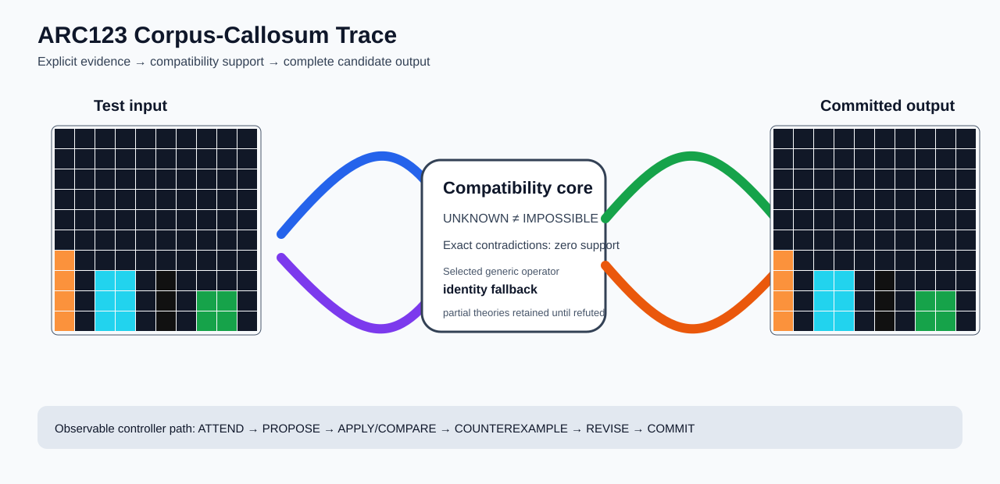

# ARC1 `03560426` P0007 Brain Surgery Report

## Outcome: NO — TEST CELLS DO NOT ALL MATCH

- **Compared positions:** 100
- **Mismatched cells:** 29
- **Training compatibility:** `False`
- **Fallback used:** `True`
- **Causal trace acceptance:** `NO`
- **Selected hypothesis:** `fallback_identity_complete_grid`
- **Source commit:** `085f6dbe39050afac3d1d743f840bac95b1a8d1c`

## Causal Ablations

| Configuration | Exact all-cell result | Training exact | Fallback | Selected hypothesis |
| --- | --- | --- | --- | --- |
| `no_revision` | `False` | `False` | `True` | `fallback_identity_complete_grid` |
| `no_new_residual_family` | `False` | `False` | `True` | `fallback_identity_complete_grid` |

## Live-Agent Boundary

The controller receives only visible training input/output examples and test inputs. It receives no task ID, offline audit label, GT feature record, GT solver, historical decomposition, or held-out output before committing a complete grid. The expected output appears only in the post-answer V&V section.

## Corpus-Callosum Visualization



- Full explicit event record: [`learning_trace.json`](learning_trace.json)
- Full three-configuration record: [`ablations.json`](ablations.json)

## Causal Trace Check

- **Counterexample observed:** `True`
- **Additional visible demonstration selected:** `True`
- **Composition recorded:** `True`
- **Parameter or multi-rule revision:** `True`
- **Generic families in selected theory:** `none`

## Post-Answer V&V

### Test case 1
- **All cells match:** `False`
- **Mismatched cells:** `29`
- **Prediction:**
```json
[[0, 0, 0, 0, 0, 0, 0, 0, 0, 0], [0, 0, 0, 0, 0, 0, 0, 0, 0, 0], [0, 0, 0, 0, 0, 0, 0, 0, 0, 0], [0, 0, 0, 0, 0, 0, 0, 0, 0, 0], [0, 0, 0, 0, 0, 0, 0, 0, 0, 0], [0, 0, 0, 0, 0, 0, 0, 0, 0, 0], [7, 0, 0, 0, 0, 0, 0, 0, 0, 0], [7, 0, 8, 8, 0, 6, 0, 0, 0, 0], [7, 0, 8, 8, 0, 6, 0, 3, 3, 0], [7, 0, 8, 8, 0, 6, 0, 3, 3, 0]]
```
- **Expected output (post-answer only):**
```json
[[7, 0, 0, 0, 0, 0, 0, 0, 0, 0], [7, 0, 0, 0, 0, 0, 0, 0, 0, 0], [7, 0, 0, 0, 0, 0, 0, 0, 0, 0], [8, 8, 0, 0, 0, 0, 0, 0, 0, 0], [8, 8, 0, 0, 0, 0, 0, 0, 0, 0], [8, 6, 0, 0, 0, 0, 0, 0, 0, 0], [0, 6, 0, 0, 0, 0, 0, 0, 0, 0], [0, 3, 3, 0, 0, 0, 0, 0, 0, 0], [0, 3, 3, 0, 0, 0, 0, 0, 0, 0], [0, 0, 0, 0, 0, 0, 0, 0, 0, 0]]
```

## Observable IHL Walkthrough

The record contains explicit actions, predictions, feedback, and revisions; it does not claim or store hidden model reasoning.

### Action totals

- `ADD_CONDITION`: 2
- `APPLY_HYPOTHESIS`: 248
- `ATTEND`: 248
- `BIND_PARAMETER`: 2
- `CHOOSE_NEXT_DEMO`: 248
- `COMMIT`: 1
- `COMPARE`: 248
- `COMPOSE_RULE`: 6
- `EXPLAIN_RESIDUAL`: 6
- `FIND_COUNTEREXAMPLE`: 8
- `PROPOSE`: 1
- `SPECIALIZE`: 83

### Decision milestones

- `0` `PROPOSE` — `{"parent_theory_id":"T0000","rule":{"description_length":1,"name":"identity","operation":"identity","parameters":{},"rule_id":"identity","scope":{"kind":"all","value":null}},"stage":"initial_generic_theories","theory_id":"T0001"}`
- `2` `ATTEND` — `{"reason":"initial_highest_observed_change_and_color_discrimination","selected_demo":1,"selected_region":{"column":0,"row":0},"theory_id":"T0001"}`
- `6` `ATTEND` — `{"reason":"counterexample_requires_visible_conditional_evidence:unseen_demo_selected_for_residual_version_space_discrimination","selected_demo":2,"selected_region":{"column":0,"row":0},"theory_id":"T0001"}`
- `10` `ATTEND` — `{"reason":"counterexample_requires_visible_conditional_evidence:unseen_demo_selected_for_residual_version_space_discrimination","selected_demo":0,"selected_region":{"column":0,"row":0},"theory_id":"T0001"}`
- `16` `SPECIALIZE` — `{"added_rule":{"description_length":4,"name":"line_extend(direction=up,fill_color=8,seed_color=8)","operation":"full_operator","parameters":{"direction":"up","fill_color":8,"operator":"line_extend","seed_color":8},"rule_id":"structural-line_extend","scope":{"kind":"all","value":null}},"parent_theory_id":"T0001","reason":"unexplained_residual_proposed_generic_structural_rule","theory_id":"T0003"}`
- `17` `SPECIALIZE` — `{"added_rule":{"description_length":4,"name":"row_span_fill(fill_color=8,seed_color=8)","operation":"full_operator","parameters":{"fill_color":8,"operator":"row_span_fill","seed_color":8},"rule_id":"structural-row_span_fill","scope":{"kind":"all","value":null}},"parent_theory_id":"T0001","reason":"unexplained_residual_proposed_generic_structural_rule","theory_id":"T0004"}`
- `18` `SPECIALIZE` — `{"added_rule":{"description_length":4,"name":"row_span_fill(fill_color=8,seed_color=7)","operation":"full_operator","parameters":{"fill_color":8,"operator":"row_span_fill","seed_color":7},"rule_id":"structural-row_span_fill","scope":{"kind":"all","value":null}},"parent_theory_id":"T0001","reason":"unexplained_residual_proposed_generic_structural_rule","theory_id":"T0005"}`
- `19` `SPECIALIZE` — `{"added_rule":{"description_length":4,"name":"row_span_fill(fill_color=8,seed_color=4)","operation":"full_operator","parameters":{"fill_color":8,"operator":"row_span_fill","seed_color":4},"rule_id":"structural-row_span_fill","scope":{"kind":"all","value":null}},"parent_theory_id":"T0001","reason":"unexplained_residual_proposed_generic_structural_rule","theory_id":"T0006"}`
- `20` `SPECIALIZE` — `{"added_rule":{"description_length":4,"name":"row_span_fill(fill_color=8,seed_color=3)","operation":"full_operator","parameters":{"fill_color":8,"operator":"row_span_fill","seed_color":3},"rule_id":"structural-row_span_fill","scope":{"kind":"all","value":null}},"parent_theory_id":"T0001","reason":"unexplained_residual_proposed_generic_structural_rule","theory_id":"T0007"}`
- `21` `SPECIALIZE` — `{"added_rule":{"description_length":4,"name":"row_span_fill(fill_color=8,seed_color=2)","operation":"full_operator","parameters":{"fill_color":8,"operator":"row_span_fill","seed_color":2},"rule_id":"structural-row_span_fill","scope":{"kind":"all","value":null}},"parent_theory_id":"T0001","reason":"unexplained_residual_proposed_generic_structural_rule","theory_id":"T0008"}`
- `22` `SPECIALIZE` — `{"added_rule":{"description_length":4,"name":"row_span_fill(fill_color=8,seed_color=1)","operation":"full_operator","parameters":{"fill_color":8,"operator":"row_span_fill","seed_color":1},"rule_id":"structural-row_span_fill","scope":{"kind":"all","value":null}},"parent_theory_id":"T0001","reason":"unexplained_residual_proposed_generic_structural_rule","theory_id":"T0009"}`
- `23` `SPECIALIZE` — `{"added_rule":{"description_length":4,"name":"row_span_fill(fill_color=7,seed_color=8)","operation":"full_operator","parameters":{"fill_color":7,"operator":"row_span_fill","seed_color":8},"rule_id":"structural-row_span_fill","scope":{"kind":"all","value":null}},"parent_theory_id":"T0001","reason":"unexplained_residual_proposed_generic_structural_rule","theory_id":"T0010"}`
- `24` `SPECIALIZE` — `{"added_rule":{"description_length":4,"name":"row_span_fill(fill_color=7,seed_color=7)","operation":"full_operator","parameters":{"fill_color":7,"operator":"row_span_fill","seed_color":7},"rule_id":"structural-row_span_fill","scope":{"kind":"all","value":null}},"parent_theory_id":"T0001","reason":"unexplained_residual_proposed_generic_structural_rule","theory_id":"T0011"}`
- `25` `SPECIALIZE` — `{"added_rule":{"description_length":4,"name":"row_span_fill(fill_color=7,seed_color=4)","operation":"full_operator","parameters":{"fill_color":7,"operator":"row_span_fill","seed_color":4},"rule_id":"structural-row_span_fill","scope":{"kind":"all","value":null}},"parent_theory_id":"T0001","reason":"unexplained_residual_proposed_generic_structural_rule","theory_id":"T0012"}`
- `26` `SPECIALIZE` — `{"added_rule":{"description_length":4,"name":"row_span_fill(fill_color=7,seed_color=3)","operation":"full_operator","parameters":{"fill_color":7,"operator":"row_span_fill","seed_color":3},"rule_id":"structural-row_span_fill","scope":{"kind":"all","value":null}},"parent_theory_id":"T0001","reason":"unexplained_residual_proposed_generic_structural_rule","theory_id":"T0013"}`
- `27` `SPECIALIZE` — `{"added_rule":{"description_length":4,"name":"row_span_fill(fill_color=7,seed_color=2)","operation":"full_operator","parameters":{"fill_color":7,"operator":"row_span_fill","seed_color":2},"rule_id":"structural-row_span_fill","scope":{"kind":"all","value":null}},"parent_theory_id":"T0001","reason":"unexplained_residual_proposed_generic_structural_rule","theory_id":"T0014"}`
- `29` `ATTEND` — `{"reason":"initial_highest_observed_change_and_color_discrimination","selected_demo":1,"selected_region":{"column":0,"row":0},"theory_id":"T0002"}`
- `33` `ATTEND` — `{"reason":"initial_highest_observed_change_and_color_discrimination","selected_demo":1,"selected_region":{"column":2,"row":3},"theory_id":"T0003"}`
- `37` `ATTEND` — `{"reason":"initial_highest_observed_change_and_color_discrimination","selected_demo":1,"selected_region":{"column":0,"row":0},"theory_id":"T0004"}`
- `41` `ATTEND` — `{"reason":"initial_highest_observed_change_and_color_discrimination","selected_demo":1,"selected_region":{"column":0,"row":0},"theory_id":"T0005"}`
- `45` `ATTEND` — `{"reason":"initial_highest_observed_change_and_color_discrimination","selected_demo":1,"selected_region":{"column":0,"row":0},"theory_id":"T0006"}`
- `49` `ATTEND` — `{"reason":"initial_highest_observed_change_and_color_discrimination","selected_demo":1,"selected_region":{"column":0,"row":0},"theory_id":"T0007"}`
- `53` `ATTEND` — `{"reason":"initial_highest_observed_change_and_color_discrimination","selected_demo":1,"selected_region":{"column":0,"row":0},"theory_id":"T0008"}`
- `57` `ATTEND` — `{"reason":"initial_highest_observed_change_and_color_discrimination","selected_demo":1,"selected_region":{"column":0,"row":0},"theory_id":"T0009"}`
- `61` `ATTEND` — `{"reason":"initial_highest_observed_change_and_color_discrimination","selected_demo":1,"selected_region":{"column":0,"row":0},"theory_id":"T0010"}`
- `65` `ATTEND` — `{"reason":"initial_highest_observed_change_and_color_discrimination","selected_demo":1,"selected_region":{"column":0,"row":0},"theory_id":"T0011"}`
- `69` `ATTEND` — `{"reason":"initial_highest_observed_change_and_color_discrimination","selected_demo":1,"selected_region":{"column":0,"row":0},"theory_id":"T0012"}`
- `73` `ATTEND` — `{"reason":"initial_highest_observed_change_and_color_discrimination","selected_demo":1,"selected_region":{"column":0,"row":0},"theory_id":"T0013"}`
- `77` `ATTEND` — `{"reason":"counterexample_requires_visible_conditional_evidence:unseen_demo_selected_for_residual_version_space_discrimination","selected_demo":2,"selected_region":{"column":0,"row":0},"theory_id":"T0003"}`
- `81` `ATTEND` — `{"reason":"counterexample_requires_visible_conditional_evidence:unseen_demo_selected_for_residual_version_space_discrimination","selected_demo":2,"selected_region":{"column":0,"row":0},"theory_id":"T0004"}`
- `85` `ATTEND` — `{"reason":"counterexample_requires_visible_conditional_evidence:unseen_demo_selected_for_residual_version_space_discrimination","selected_demo":2,"selected_region":{"column":0,"row":0},"theory_id":"T0005"}`
- `89` `ATTEND` — `{"reason":"counterexample_requires_visible_conditional_evidence:unseen_demo_selected_for_residual_version_space_discrimination","selected_demo":2,"selected_region":{"column":0,"row":0},"theory_id":"T0006"}`
- `93` `ATTEND` — `{"reason":"counterexample_requires_visible_conditional_evidence:unseen_demo_selected_for_residual_version_space_discrimination","selected_demo":2,"selected_region":{"column":0,"row":0},"theory_id":"T0007"}`
- `97` `ATTEND` — `{"reason":"counterexample_requires_visible_conditional_evidence:unseen_demo_selected_for_residual_version_space_discrimination","selected_demo":2,"selected_region":{"column":0,"row":0},"theory_id":"T0008"}`
- `101` `ATTEND` — `{"reason":"counterexample_requires_visible_conditional_evidence:unseen_demo_selected_for_residual_version_space_discrimination","selected_demo":2,"selected_region":{"column":0,"row":0},"theory_id":"T0009"}`
- `105` `ATTEND` — `{"reason":"counterexample_requires_visible_conditional_evidence:unseen_demo_selected_for_residual_version_space_discrimination","selected_demo":2,"selected_region":{"column":0,"row":0},"theory_id":"T0010"}`
- `109` `ATTEND` — `{"reason":"counterexample_requires_visible_conditional_evidence:unseen_demo_selected_for_residual_version_space_discrimination","selected_demo":2,"selected_region":{"column":0,"row":0},"theory_id":"T0011"}`
- `113` `ATTEND` — `{"reason":"counterexample_requires_visible_conditional_evidence:unseen_demo_selected_for_residual_version_space_discrimination","selected_demo":2,"selected_region":{"column":0,"row":0},"theory_id":"T0012"}`
- `117` `ATTEND` — `{"reason":"counterexample_requires_visible_conditional_evidence:unseen_demo_selected_for_residual_version_space_discrimination","selected_demo":2,"selected_region":{"column":0,"row":0},"theory_id":"T0013"}`
- `121` `ATTEND` — `{"reason":"counterexample_requires_visible_conditional_evidence:unseen_demo_selected_for_residual_version_space_discrimination","selected_demo":0,"selected_region":{"column":0,"row":0},"theory_id":"T0003"}`
- `125` `ATTEND` — `{"reason":"counterexample_requires_visible_conditional_evidence:unseen_demo_selected_for_residual_version_space_discrimination","selected_demo":0,"selected_region":{"column":0,"row":0},"theory_id":"T0004"}`
- `129` `ATTEND` — `{"reason":"counterexample_requires_visible_conditional_evidence:unseen_demo_selected_for_residual_version_space_discrimination","selected_demo":0,"selected_region":{"column":0,"row":0},"theory_id":"T0005"}`
- `133` `ATTEND` — `{"reason":"counterexample_requires_visible_conditional_evidence:unseen_demo_selected_for_residual_version_space_discrimination","selected_demo":0,"selected_region":{"column":0,"row":0},"theory_id":"T0006"}`
- `137` `ATTEND` — `{"reason":"counterexample_requires_visible_conditional_evidence:unseen_demo_selected_for_residual_version_space_discrimination","selected_demo":0,"selected_region":{"column":0,"row":0},"theory_id":"T0007"}`
- `141` `ATTEND` — `{"reason":"counterexample_requires_visible_conditional_evidence:unseen_demo_selected_for_residual_version_space_discrimination","selected_demo":0,"selected_region":{"column":0,"row":0},"theory_id":"T0008"}`
- `145` `ATTEND` — `{"reason":"counterexample_requires_visible_conditional_evidence:unseen_demo_selected_for_residual_version_space_discrimination","selected_demo":0,"selected_region":{"column":0,"row":0},"theory_id":"T0009"}`
- `149` `ATTEND` — `{"reason":"counterexample_requires_visible_conditional_evidence:unseen_demo_selected_for_residual_version_space_discrimination","selected_demo":0,"selected_region":{"column":0,"row":0},"theory_id":"T0010"}`
- `153` `ATTEND` — `{"reason":"counterexample_requires_visible_conditional_evidence:unseen_demo_selected_for_residual_version_space_discrimination","selected_demo":0,"selected_region":{"column":0,"row":0},"theory_id":"T0011"}`
- `157` `ATTEND` — `{"reason":"counterexample_requires_visible_conditional_evidence:unseen_demo_selected_for_residual_version_space_discrimination","selected_demo":0,"selected_region":{"column":0,"row":0},"theory_id":"T0012"}`
- `161` `ATTEND` — `{"reason":"counterexample_requires_visible_conditional_evidence:unseen_demo_selected_for_residual_version_space_discrimination","selected_demo":0,"selected_region":{"column":0,"row":0},"theory_id":"T0013"}`
- `165` `ATTEND` — `{"reason":"counterexample_requires_visible_conditional_evidence:unseen_demo_selected_for_residual_version_space_discrimination","selected_demo":2,"selected_region":{"column":0,"row":0},"theory_id":"T0002"}`
- `171` `SPECIALIZE` — `{"added_rule":{"description_length":4,"name":"row_span_fill(fill_color=8,seed_color=8)","operation":"full_operator","parameters":{"fill_color":8,"operator":"row_span_fill","seed_color":8},"rule_id":"structural-row_span_fill","scope":{"kind":"all","value":null}},"parent_theory_id":"T0003","reason":"unexplained_residual_proposed_generic_structural_rule","theory_id":"T0016"}`
- `172` `SPECIALIZE` — `{"added_rule":{"description_length":4,"name":"row_span_fill(fill_color=8,seed_color=7)","operation":"full_operator","parameters":{"fill_color":8,"operator":"row_span_fill","seed_color":7},"rule_id":"structural-row_span_fill","scope":{"kind":"all","value":null}},"parent_theory_id":"T0003","reason":"unexplained_residual_proposed_generic_structural_rule","theory_id":"T0017"}`
- `173` `SPECIALIZE` — `{"added_rule":{"description_length":4,"name":"row_span_fill(fill_color=8,seed_color=4)","operation":"full_operator","parameters":{"fill_color":8,"operator":"row_span_fill","seed_color":4},"rule_id":"structural-row_span_fill","scope":{"kind":"all","value":null}},"parent_theory_id":"T0003","reason":"unexplained_residual_proposed_generic_structural_rule","theory_id":"T0018"}`
- `174` `SPECIALIZE` — `{"added_rule":{"description_length":4,"name":"row_span_fill(fill_color=8,seed_color=3)","operation":"full_operator","parameters":{"fill_color":8,"operator":"row_span_fill","seed_color":3},"rule_id":"structural-row_span_fill","scope":{"kind":"all","value":null}},"parent_theory_id":"T0003","reason":"unexplained_residual_proposed_generic_structural_rule","theory_id":"T0019"}`
- `175` `SPECIALIZE` — `{"added_rule":{"description_length":4,"name":"row_span_fill(fill_color=8,seed_color=2)","operation":"full_operator","parameters":{"fill_color":8,"operator":"row_span_fill","seed_color":2},"rule_id":"structural-row_span_fill","scope":{"kind":"all","value":null}},"parent_theory_id":"T0003","reason":"unexplained_residual_proposed_generic_structural_rule","theory_id":"T0020"}`
- `176` `SPECIALIZE` — `{"added_rule":{"description_length":4,"name":"row_span_fill(fill_color=8,seed_color=1)","operation":"full_operator","parameters":{"fill_color":8,"operator":"row_span_fill","seed_color":1},"rule_id":"structural-row_span_fill","scope":{"kind":"all","value":null}},"parent_theory_id":"T0003","reason":"unexplained_residual_proposed_generic_structural_rule","theory_id":"T0021"}`
- `177` `SPECIALIZE` — `{"added_rule":{"description_length":4,"name":"row_span_fill(fill_color=7,seed_color=8)","operation":"full_operator","parameters":{"fill_color":7,"operator":"row_span_fill","seed_color":8},"rule_id":"structural-row_span_fill","scope":{"kind":"all","value":null}},"parent_theory_id":"T0003","reason":"unexplained_residual_proposed_generic_structural_rule","theory_id":"T0022"}`
- `178` `SPECIALIZE` — `{"added_rule":{"description_length":4,"name":"row_span_fill(fill_color=7,seed_color=7)","operation":"full_operator","parameters":{"fill_color":7,"operator":"row_span_fill","seed_color":7},"rule_id":"structural-row_span_fill","scope":{"kind":"all","value":null}},"parent_theory_id":"T0003","reason":"unexplained_residual_proposed_generic_structural_rule","theory_id":"T0023"}`
- `179` `SPECIALIZE` — `{"added_rule":{"description_length":4,"name":"row_span_fill(fill_color=7,seed_color=4)","operation":"full_operator","parameters":{"fill_color":7,"operator":"row_span_fill","seed_color":4},"rule_id":"structural-row_span_fill","scope":{"kind":"all","value":null}},"parent_theory_id":"T0003","reason":"unexplained_residual_proposed_generic_structural_rule","theory_id":"T0024"}`
- `180` `SPECIALIZE` — `{"added_rule":{"description_length":4,"name":"row_span_fill(fill_color=7,seed_color=3)","operation":"full_operator","parameters":{"fill_color":7,"operator":"row_span_fill","seed_color":3},"rule_id":"structural-row_span_fill","scope":{"kind":"all","value":null}},"parent_theory_id":"T0003","reason":"unexplained_residual_proposed_generic_structural_rule","theory_id":"T0025"}`
- `181` `SPECIALIZE` — `{"added_rule":{"description_length":4,"name":"row_span_fill(fill_color=7,seed_color=2)","operation":"full_operator","parameters":{"fill_color":7,"operator":"row_span_fill","seed_color":2},"rule_id":"structural-row_span_fill","scope":{"kind":"all","value":null}},"parent_theory_id":"T0003","reason":"unexplained_residual_proposed_generic_structural_rule","theory_id":"T0026"}`
- `183` `ATTEND` — `{"reason":"initial_highest_observed_change_and_color_discrimination","selected_demo":1,"selected_region":{"column":0,"row":0},"theory_id":"T0015"}`
- `187` `ATTEND` — `{"reason":"initial_highest_observed_change_and_color_discrimination","selected_demo":1,"selected_region":{"column":0,"row":0},"theory_id":"T0016"}`
- `191` `ATTEND` — `{"reason":"initial_highest_observed_change_and_color_discrimination","selected_demo":1,"selected_region":{"column":0,"row":0},"theory_id":"T0017"}`
- `195` `ATTEND` — `{"reason":"initial_highest_observed_change_and_color_discrimination","selected_demo":1,"selected_region":{"column":0,"row":0},"theory_id":"T0018"}`
- `199` `ATTEND` — `{"reason":"initial_highest_observed_change_and_color_discrimination","selected_demo":1,"selected_region":{"column":0,"row":0},"theory_id":"T0019"}`
- `203` `ATTEND` — `{"reason":"initial_highest_observed_change_and_color_discrimination","selected_demo":1,"selected_region":{"column":0,"row":0},"theory_id":"T0020"}`
- `207` `ATTEND` — `{"reason":"initial_highest_observed_change_and_color_discrimination","selected_demo":1,"selected_region":{"column":0,"row":0},"theory_id":"T0021"}`
- `211` `ATTEND` — `{"reason":"initial_highest_observed_change_and_color_discrimination","selected_demo":1,"selected_region":{"column":0,"row":0},"theory_id":"T0022"}`
- `215` `ATTEND` — `{"reason":"initial_highest_observed_change_and_color_discrimination","selected_demo":1,"selected_region":{"column":0,"row":0},"theory_id":"T0023"}`
- `219` `ATTEND` — `{"reason":"initial_highest_observed_change_and_color_discrimination","selected_demo":1,"selected_region":{"column":0,"row":0},"theory_id":"T0024"}`
- `223` `ATTEND` — `{"reason":"initial_highest_observed_change_and_color_discrimination","selected_demo":1,"selected_region":{"column":0,"row":0},"theory_id":"T0025"}`
- `227` `ATTEND` — `{"reason":"initial_highest_observed_change_and_color_discrimination","selected_demo":1,"selected_region":{"column":0,"row":0},"theory_id":"T0026"}`
- `231` `ATTEND` — `{"reason":"counterexample_requires_visible_conditional_evidence:unseen_demo_selected_for_residual_version_space_discrimination","selected_demo":2,"selected_region":{"column":0,"row":0},"theory_id":"T0016"}`
- `235` `ATTEND` — `{"reason":"counterexample_requires_visible_conditional_evidence:unseen_demo_selected_for_residual_version_space_discrimination","selected_demo":2,"selected_region":{"column":0,"row":0},"theory_id":"T0017"}`
- `239` `ATTEND` — `{"reason":"counterexample_requires_visible_conditional_evidence:unseen_demo_selected_for_residual_version_space_discrimination","selected_demo":2,"selected_region":{"column":0,"row":0},"theory_id":"T0018"}`
- `243` `ATTEND` — `{"reason":"counterexample_requires_visible_conditional_evidence:unseen_demo_selected_for_residual_version_space_discrimination","selected_demo":2,"selected_region":{"column":0,"row":0},"theory_id":"T0019"}`
- `247` `ATTEND` — `{"reason":"counterexample_requires_visible_conditional_evidence:unseen_demo_selected_for_residual_version_space_discrimination","selected_demo":2,"selected_region":{"column":0,"row":0},"theory_id":"T0020"}`
- `251` `ATTEND` — `{"reason":"counterexample_requires_visible_conditional_evidence:unseen_demo_selected_for_residual_version_space_discrimination","selected_demo":2,"selected_region":{"column":0,"row":0},"theory_id":"T0021"}`
- `255` `ATTEND` — `{"reason":"counterexample_requires_visible_conditional_evidence:unseen_demo_selected_for_residual_version_space_discrimination","selected_demo":2,"selected_region":{"column":0,"row":0},"theory_id":"T0022"}`
- `259` `ATTEND` — `{"reason":"counterexample_requires_visible_conditional_evidence:unseen_demo_selected_for_residual_version_space_discrimination","selected_demo":2,"selected_region":{"column":0,"row":0},"theory_id":"T0023"}`
- `263` `ATTEND` — `{"reason":"counterexample_requires_visible_conditional_evidence:unseen_demo_selected_for_residual_version_space_discrimination","selected_demo":2,"selected_region":{"column":0,"row":0},"theory_id":"T0024"}`
- `267` `ATTEND` — `{"reason":"counterexample_requires_visible_conditional_evidence:unseen_demo_selected_for_residual_version_space_discrimination","selected_demo":2,"selected_region":{"column":0,"row":0},"theory_id":"T0025"}`
- `271` `ATTEND` — `{"reason":"counterexample_requires_visible_conditional_evidence:unseen_demo_selected_for_residual_version_space_discrimination","selected_demo":2,"selected_region":{"column":0,"row":0},"theory_id":"T0026"}`
- `275` `ATTEND` — `{"reason":"counterexample_requires_visible_conditional_evidence:unseen_demo_selected_for_residual_version_space_discrimination","selected_demo":0,"selected_region":{"column":0,"row":0},"theory_id":"T0016"}`
- `279` `ATTEND` — `{"reason":"counterexample_requires_visible_conditional_evidence:unseen_demo_selected_for_residual_version_space_discrimination","selected_demo":0,"selected_region":{"column":0,"row":0},"theory_id":"T0017"}`
- `283` `ATTEND` — `{"reason":"counterexample_requires_visible_conditional_evidence:unseen_demo_selected_for_residual_version_space_discrimination","selected_demo":0,"selected_region":{"column":0,"row":0},"theory_id":"T0018"}`
- `287` `ATTEND` — `{"reason":"counterexample_requires_visible_conditional_evidence:unseen_demo_selected_for_residual_version_space_discrimination","selected_demo":0,"selected_region":{"column":0,"row":0},"theory_id":"T0019"}`
- `291` `ATTEND` — `{"reason":"counterexample_requires_visible_conditional_evidence:unseen_demo_selected_for_residual_version_space_discrimination","selected_demo":0,"selected_region":{"column":0,"row":0},"theory_id":"T0020"}`
- `295` `ATTEND` — `{"reason":"counterexample_requires_visible_conditional_evidence:unseen_demo_selected_for_residual_version_space_discrimination","selected_demo":0,"selected_region":{"column":0,"row":0},"theory_id":"T0021"}`
- `299` `ATTEND` — `{"reason":"counterexample_requires_visible_conditional_evidence:unseen_demo_selected_for_residual_version_space_discrimination","selected_demo":0,"selected_region":{"column":0,"row":0},"theory_id":"T0022"}`
- `303` `ATTEND` — `{"reason":"counterexample_requires_visible_conditional_evidence:unseen_demo_selected_for_residual_version_space_discrimination","selected_demo":0,"selected_region":{"column":0,"row":0},"theory_id":"T0023"}`
- `307` `ATTEND` — `{"reason":"counterexample_requires_visible_conditional_evidence:unseen_demo_selected_for_residual_version_space_discrimination","selected_demo":0,"selected_region":{"column":0,"row":0},"theory_id":"T0024"}`
- `311` `ATTEND` — `{"reason":"counterexample_requires_visible_conditional_evidence:unseen_demo_selected_for_residual_version_space_discrimination","selected_demo":0,"selected_region":{"column":0,"row":0},"theory_id":"T0025"}`
- `315` `ATTEND` — `{"reason":"counterexample_requires_visible_conditional_evidence:unseen_demo_selected_for_residual_version_space_discrimination","selected_demo":0,"selected_region":{"column":0,"row":0},"theory_id":"T0026"}`
- `319` `ATTEND` — `{"reason":"counterexample_requires_visible_conditional_evidence:unseen_demo_selected_for_residual_version_space_discrimination","selected_demo":2,"selected_region":{"column":0,"row":0},"theory_id":"T0015"}`
- `325` `SPECIALIZE` — `{"added_rule":{"description_length":4,"name":"row_span_fill(fill_color=8,seed_color=7)","operation":"full_operator","parameters":{"fill_color":8,"operator":"row_span_fill","seed_color":7},"rule_id":"structural-row_span_fill","scope":{"kind":"all","value":null}},"parent_theory_id":"T0016","reason":"unexplained_residual_proposed_generic_structural_rule","theory_id":"T0028"}`
- `326` `SPECIALIZE` — `{"added_rule":{"description_length":4,"name":"row_span_fill(fill_color=8,seed_color=4)","operation":"full_operator","parameters":{"fill_color":8,"operator":"row_span_fill","seed_color":4},"rule_id":"structural-row_span_fill","scope":{"kind":"all","value":null}},"parent_theory_id":"T0016","reason":"unexplained_residual_proposed_generic_structural_rule","theory_id":"T0029"}`
- `327` `SPECIALIZE` — `{"added_rule":{"description_length":4,"name":"row_span_fill(fill_color=8,seed_color=3)","operation":"full_operator","parameters":{"fill_color":8,"operator":"row_span_fill","seed_color":3},"rule_id":"structural-row_span_fill","scope":{"kind":"all","value":null}},"parent_theory_id":"T0016","reason":"unexplained_residual_proposed_generic_structural_rule","theory_id":"T0030"}`
- `328` `SPECIALIZE` — `{"added_rule":{"description_length":4,"name":"row_span_fill(fill_color=8,seed_color=2)","operation":"full_operator","parameters":{"fill_color":8,"operator":"row_span_fill","seed_color":2},"rule_id":"structural-row_span_fill","scope":{"kind":"all","value":null}},"parent_theory_id":"T0016","reason":"unexplained_residual_proposed_generic_structural_rule","theory_id":"T0031"}`
- `329` `SPECIALIZE` — `{"added_rule":{"description_length":4,"name":"row_span_fill(fill_color=8,seed_color=1)","operation":"full_operator","parameters":{"fill_color":8,"operator":"row_span_fill","seed_color":1},"rule_id":"structural-row_span_fill","scope":{"kind":"all","value":null}},"parent_theory_id":"T0016","reason":"unexplained_residual_proposed_generic_structural_rule","theory_id":"T0032"}`
- `330` `SPECIALIZE` — `{"added_rule":{"description_length":4,"name":"row_span_fill(fill_color=7,seed_color=8)","operation":"full_operator","parameters":{"fill_color":7,"operator":"row_span_fill","seed_color":8},"rule_id":"structural-row_span_fill","scope":{"kind":"all","value":null}},"parent_theory_id":"T0016","reason":"unexplained_residual_proposed_generic_structural_rule","theory_id":"T0033"}`
- `331` `SPECIALIZE` — `{"added_rule":{"description_length":4,"name":"row_span_fill(fill_color=7,seed_color=7)","operation":"full_operator","parameters":{"fill_color":7,"operator":"row_span_fill","seed_color":7},"rule_id":"structural-row_span_fill","scope":{"kind":"all","value":null}},"parent_theory_id":"T0016","reason":"unexplained_residual_proposed_generic_structural_rule","theory_id":"T0034"}`
- `332` `SPECIALIZE` — `{"added_rule":{"description_length":4,"name":"row_span_fill(fill_color=7,seed_color=4)","operation":"full_operator","parameters":{"fill_color":7,"operator":"row_span_fill","seed_color":4},"rule_id":"structural-row_span_fill","scope":{"kind":"all","value":null}},"parent_theory_id":"T0016","reason":"unexplained_residual_proposed_generic_structural_rule","theory_id":"T0035"}`
- `333` `SPECIALIZE` — `{"added_rule":{"description_length":4,"name":"row_span_fill(fill_color=7,seed_color=3)","operation":"full_operator","parameters":{"fill_color":7,"operator":"row_span_fill","seed_color":3},"rule_id":"structural-row_span_fill","scope":{"kind":"all","value":null}},"parent_theory_id":"T0016","reason":"unexplained_residual_proposed_generic_structural_rule","theory_id":"T0036"}`
- `334` `SPECIALIZE` — `{"added_rule":{"description_length":4,"name":"row_span_fill(fill_color=7,seed_color=2)","operation":"full_operator","parameters":{"fill_color":7,"operator":"row_span_fill","seed_color":2},"rule_id":"structural-row_span_fill","scope":{"kind":"all","value":null}},"parent_theory_id":"T0016","reason":"unexplained_residual_proposed_generic_structural_rule","theory_id":"T0037"}`
- `336` `ATTEND` — `{"reason":"initial_highest_observed_change_and_color_discrimination","selected_demo":1,"selected_region":{"column":0,"row":0},"theory_id":"T0027"}`
- `340` `ATTEND` — `{"reason":"initial_highest_observed_change_and_color_discrimination","selected_demo":1,"selected_region":{"column":0,"row":0},"theory_id":"T0028"}`
- `344` `ATTEND` — `{"reason":"initial_highest_observed_change_and_color_discrimination","selected_demo":1,"selected_region":{"column":0,"row":0},"theory_id":"T0029"}`
- `348` `ATTEND` — `{"reason":"initial_highest_observed_change_and_color_discrimination","selected_demo":1,"selected_region":{"column":0,"row":0},"theory_id":"T0030"}`
- `352` `ATTEND` — `{"reason":"initial_highest_observed_change_and_color_discrimination","selected_demo":1,"selected_region":{"column":0,"row":0},"theory_id":"T0031"}`
- `356` `ATTEND` — `{"reason":"initial_highest_observed_change_and_color_discrimination","selected_demo":1,"selected_region":{"column":0,"row":0},"theory_id":"T0032"}`
- `360` `ATTEND` — `{"reason":"initial_highest_observed_change_and_color_discrimination","selected_demo":1,"selected_region":{"column":0,"row":0},"theory_id":"T0033"}`
- `364` `ATTEND` — `{"reason":"initial_highest_observed_change_and_color_discrimination","selected_demo":1,"selected_region":{"column":0,"row":0},"theory_id":"T0034"}`
- `368` `ATTEND` — `{"reason":"initial_highest_observed_change_and_color_discrimination","selected_demo":1,"selected_region":{"column":0,"row":0},"theory_id":"T0035"}`
- `372` `ATTEND` — `{"reason":"initial_highest_observed_change_and_color_discrimination","selected_demo":1,"selected_region":{"column":0,"row":0},"theory_id":"T0036"}`
- `376` `ATTEND` — `{"reason":"initial_highest_observed_change_and_color_discrimination","selected_demo":1,"selected_region":{"column":0,"row":0},"theory_id":"T0037"}`
- `380` `ATTEND` — `{"reason":"counterexample_requires_visible_conditional_evidence:unseen_demo_selected_for_residual_version_space_discrimination","selected_demo":2,"selected_region":{"column":0,"row":0},"theory_id":"T0027"}`
- `384` `ATTEND` — `{"reason":"counterexample_requires_visible_conditional_evidence:unseen_demo_selected_for_residual_version_space_discrimination","selected_demo":2,"selected_region":{"column":0,"row":0},"theory_id":"T0028"}`
- `388` `ATTEND` — `{"reason":"counterexample_requires_visible_conditional_evidence:unseen_demo_selected_for_residual_version_space_discrimination","selected_demo":2,"selected_region":{"column":0,"row":0},"theory_id":"T0029"}`
- `392` `ATTEND` — `{"reason":"counterexample_requires_visible_conditional_evidence:unseen_demo_selected_for_residual_version_space_discrimination","selected_demo":2,"selected_region":{"column":0,"row":0},"theory_id":"T0030"}`
- `396` `ATTEND` — `{"reason":"counterexample_requires_visible_conditional_evidence:unseen_demo_selected_for_residual_version_space_discrimination","selected_demo":2,"selected_region":{"column":0,"row":0},"theory_id":"T0031"}`
- `400` `ATTEND` — `{"reason":"counterexample_requires_visible_conditional_evidence:unseen_demo_selected_for_residual_version_space_discrimination","selected_demo":2,"selected_region":{"column":0,"row":0},"theory_id":"T0032"}`
- `404` `ATTEND` — `{"reason":"counterexample_requires_visible_conditional_evidence:unseen_demo_selected_for_residual_version_space_discrimination","selected_demo":2,"selected_region":{"column":0,"row":0},"theory_id":"T0033"}`
- `408` `ATTEND` — `{"reason":"counterexample_requires_visible_conditional_evidence:unseen_demo_selected_for_residual_version_space_discrimination","selected_demo":2,"selected_region":{"column":0,"row":0},"theory_id":"T0034"}`
- `412` `ATTEND` — `{"reason":"counterexample_requires_visible_conditional_evidence:unseen_demo_selected_for_residual_version_space_discrimination","selected_demo":2,"selected_region":{"column":0,"row":0},"theory_id":"T0035"}`
- `416` `ATTEND` — `{"reason":"counterexample_requires_visible_conditional_evidence:unseen_demo_selected_for_residual_version_space_discrimination","selected_demo":2,"selected_region":{"column":0,"row":0},"theory_id":"T0036"}`
- `420` `ATTEND` — `{"reason":"counterexample_requires_visible_conditional_evidence:unseen_demo_selected_for_residual_version_space_discrimination","selected_demo":2,"selected_region":{"column":0,"row":0},"theory_id":"T0037"}`
- `424` `ATTEND` — `{"reason":"counterexample_requires_visible_conditional_evidence:unseen_demo_selected_for_residual_version_space_discrimination","selected_demo":0,"selected_region":{"column":0,"row":0},"theory_id":"T0027"}`
- `428` `ATTEND` — `{"reason":"counterexample_requires_visible_conditional_evidence:unseen_demo_selected_for_residual_version_space_discrimination","selected_demo":0,"selected_region":{"column":0,"row":0},"theory_id":"T0028"}`
- `432` `ATTEND` — `{"reason":"counterexample_requires_visible_conditional_evidence:unseen_demo_selected_for_residual_version_space_discrimination","selected_demo":0,"selected_region":{"column":0,"row":0},"theory_id":"T0029"}`
- `436` `ATTEND` — `{"reason":"counterexample_requires_visible_conditional_evidence:unseen_demo_selected_for_residual_version_space_discrimination","selected_demo":0,"selected_region":{"column":0,"row":0},"theory_id":"T0030"}`
- `440` `ATTEND` — `{"reason":"counterexample_requires_visible_conditional_evidence:unseen_demo_selected_for_residual_version_space_discrimination","selected_demo":0,"selected_region":{"column":0,"row":0},"theory_id":"T0031"}`
- `444` `ATTEND` — `{"reason":"counterexample_requires_visible_conditional_evidence:unseen_demo_selected_for_residual_version_space_discrimination","selected_demo":0,"selected_region":{"column":0,"row":0},"theory_id":"T0032"}`
- `448` `ATTEND` — `{"reason":"counterexample_requires_visible_conditional_evidence:unseen_demo_selected_for_residual_version_space_discrimination","selected_demo":0,"selected_region":{"column":0,"row":0},"theory_id":"T0033"}`
- `452` `ATTEND` — `{"reason":"counterexample_requires_visible_conditional_evidence:unseen_demo_selected_for_residual_version_space_discrimination","selected_demo":0,"selected_region":{"column":0,"row":0},"theory_id":"T0034"}`
- `456` `ATTEND` — `{"reason":"counterexample_requires_visible_conditional_evidence:unseen_demo_selected_for_residual_version_space_discrimination","selected_demo":0,"selected_region":{"column":0,"row":0},"theory_id":"T0035"}`
- `460` `ATTEND` — `{"reason":"counterexample_requires_visible_conditional_evidence:unseen_demo_selected_for_residual_version_space_discrimination","selected_demo":0,"selected_region":{"column":0,"row":0},"theory_id":"T0036"}`
- `464` `ATTEND` — `{"reason":"counterexample_requires_visible_conditional_evidence:unseen_demo_selected_for_residual_version_space_discrimination","selected_demo":0,"selected_region":{"column":0,"row":0},"theory_id":"T0037"}`
- `470` `SPECIALIZE` — `{"added_rule":{"description_length":4,"name":"row_span_fill(fill_color=8,seed_color=8)","operation":"full_operator","parameters":{"fill_color":8,"operator":"row_span_fill","seed_color":8},"rule_id":"structural-row_span_fill","scope":{"kind":"all","value":null}},"parent_theory_id":"T0017","reason":"unexplained_residual_proposed_generic_structural_rule","theory_id":"T0039"}`
- `471` `SPECIALIZE` — `{"added_rule":{"description_length":4,"name":"row_span_fill(fill_color=8,seed_color=4)","operation":"full_operator","parameters":{"fill_color":8,"operator":"row_span_fill","seed_color":4},"rule_id":"structural-row_span_fill","scope":{"kind":"all","value":null}},"parent_theory_id":"T0017","reason":"unexplained_residual_proposed_generic_structural_rule","theory_id":"T0040"}`
- `472` `SPECIALIZE` — `{"added_rule":{"description_length":4,"name":"row_span_fill(fill_color=8,seed_color=3)","operation":"full_operator","parameters":{"fill_color":8,"operator":"row_span_fill","seed_color":3},"rule_id":"structural-row_span_fill","scope":{"kind":"all","value":null}},"parent_theory_id":"T0017","reason":"unexplained_residual_proposed_generic_structural_rule","theory_id":"T0041"}`
- `473` `SPECIALIZE` — `{"added_rule":{"description_length":4,"name":"row_span_fill(fill_color=8,seed_color=2)","operation":"full_operator","parameters":{"fill_color":8,"operator":"row_span_fill","seed_color":2},"rule_id":"structural-row_span_fill","scope":{"kind":"all","value":null}},"parent_theory_id":"T0017","reason":"unexplained_residual_proposed_generic_structural_rule","theory_id":"T0042"}`
- `474` `SPECIALIZE` — `{"added_rule":{"description_length":4,"name":"row_span_fill(fill_color=8,seed_color=1)","operation":"full_operator","parameters":{"fill_color":8,"operator":"row_span_fill","seed_color":1},"rule_id":"structural-row_span_fill","scope":{"kind":"all","value":null}},"parent_theory_id":"T0017","reason":"unexplained_residual_proposed_generic_structural_rule","theory_id":"T0043"}`
- `475` `SPECIALIZE` — `{"added_rule":{"description_length":4,"name":"row_span_fill(fill_color=7,seed_color=8)","operation":"full_operator","parameters":{"fill_color":7,"operator":"row_span_fill","seed_color":8},"rule_id":"structural-row_span_fill","scope":{"kind":"all","value":null}},"parent_theory_id":"T0017","reason":"unexplained_residual_proposed_generic_structural_rule","theory_id":"T0044"}`
- `476` `SPECIALIZE` — `{"added_rule":{"description_length":4,"name":"row_span_fill(fill_color=7,seed_color=7)","operation":"full_operator","parameters":{"fill_color":7,"operator":"row_span_fill","seed_color":7},"rule_id":"structural-row_span_fill","scope":{"kind":"all","value":null}},"parent_theory_id":"T0017","reason":"unexplained_residual_proposed_generic_structural_rule","theory_id":"T0045"}`
- `477` `SPECIALIZE` — `{"added_rule":{"description_length":4,"name":"row_span_fill(fill_color=7,seed_color=4)","operation":"full_operator","parameters":{"fill_color":7,"operator":"row_span_fill","seed_color":4},"rule_id":"structural-row_span_fill","scope":{"kind":"all","value":null}},"parent_theory_id":"T0017","reason":"unexplained_residual_proposed_generic_structural_rule","theory_id":"T0046"}`
- `478` `SPECIALIZE` — `{"added_rule":{"description_length":4,"name":"row_span_fill(fill_color=7,seed_color=3)","operation":"full_operator","parameters":{"fill_color":7,"operator":"row_span_fill","seed_color":3},"rule_id":"structural-row_span_fill","scope":{"kind":"all","value":null}},"parent_theory_id":"T0017","reason":"unexplained_residual_proposed_generic_structural_rule","theory_id":"T0047"}`
- `479` `SPECIALIZE` — `{"added_rule":{"description_length":4,"name":"row_span_fill(fill_color=7,seed_color=2)","operation":"full_operator","parameters":{"fill_color":7,"operator":"row_span_fill","seed_color":2},"rule_id":"structural-row_span_fill","scope":{"kind":"all","value":null}},"parent_theory_id":"T0017","reason":"unexplained_residual_proposed_generic_structural_rule","theory_id":"T0048"}`
- `481` `ATTEND` — `{"reason":"initial_highest_observed_change_and_color_discrimination","selected_demo":1,"selected_region":{"column":0,"row":0},"theory_id":"T0038"}`
- `485` `ATTEND` — `{"reason":"initial_highest_observed_change_and_color_discrimination","selected_demo":1,"selected_region":{"column":0,"row":0},"theory_id":"T0039"}`
- `489` `ATTEND` — `{"reason":"initial_highest_observed_change_and_color_discrimination","selected_demo":1,"selected_region":{"column":0,"row":0},"theory_id":"T0040"}`
- `493` `ATTEND` — `{"reason":"initial_highest_observed_change_and_color_discrimination","selected_demo":1,"selected_region":{"column":0,"row":0},"theory_id":"T0041"}`
- `497` `ATTEND` — `{"reason":"initial_highest_observed_change_and_color_discrimination","selected_demo":1,"selected_region":{"column":0,"row":0},"theory_id":"T0042"}`
- `501` `ATTEND` — `{"reason":"initial_highest_observed_change_and_color_discrimination","selected_demo":1,"selected_region":{"column":0,"row":0},"theory_id":"T0043"}`
- `505` `ATTEND` — `{"reason":"initial_highest_observed_change_and_color_discrimination","selected_demo":1,"selected_region":{"column":0,"row":0},"theory_id":"T0044"}`
- `509` `ATTEND` — `{"reason":"initial_highest_observed_change_and_color_discrimination","selected_demo":1,"selected_region":{"column":0,"row":0},"theory_id":"T0045"}`
- `513` `ATTEND` — `{"reason":"initial_highest_observed_change_and_color_discrimination","selected_demo":1,"selected_region":{"column":0,"row":0},"theory_id":"T0046"}`
- `517` `ATTEND` — `{"reason":"initial_highest_observed_change_and_color_discrimination","selected_demo":1,"selected_region":{"column":0,"row":0},"theory_id":"T0047"}`
- `521` `ATTEND` — `{"reason":"initial_highest_observed_change_and_color_discrimination","selected_demo":1,"selected_region":{"column":0,"row":0},"theory_id":"T0048"}`
- `525` `ATTEND` — `{"reason":"counterexample_requires_visible_conditional_evidence:unseen_demo_selected_for_residual_version_space_discrimination","selected_demo":2,"selected_region":{"column":0,"row":0},"theory_id":"T0038"}`
- `529` `ATTEND` — `{"reason":"counterexample_requires_visible_conditional_evidence:unseen_demo_selected_for_residual_version_space_discrimination","selected_demo":2,"selected_region":{"column":0,"row":0},"theory_id":"T0039"}`
- `533` `ATTEND` — `{"reason":"counterexample_requires_visible_conditional_evidence:unseen_demo_selected_for_residual_version_space_discrimination","selected_demo":2,"selected_region":{"column":0,"row":0},"theory_id":"T0040"}`
- `537` `ATTEND` — `{"reason":"counterexample_requires_visible_conditional_evidence:unseen_demo_selected_for_residual_version_space_discrimination","selected_demo":2,"selected_region":{"column":0,"row":0},"theory_id":"T0041"}`
- `541` `ATTEND` — `{"reason":"counterexample_requires_visible_conditional_evidence:unseen_demo_selected_for_residual_version_space_discrimination","selected_demo":2,"selected_region":{"column":0,"row":0},"theory_id":"T0042"}`
- `545` `ATTEND` — `{"reason":"counterexample_requires_visible_conditional_evidence:unseen_demo_selected_for_residual_version_space_discrimination","selected_demo":2,"selected_region":{"column":0,"row":0},"theory_id":"T0043"}`
- `549` `ATTEND` — `{"reason":"counterexample_requires_visible_conditional_evidence:unseen_demo_selected_for_residual_version_space_discrimination","selected_demo":2,"selected_region":{"column":0,"row":0},"theory_id":"T0044"}`
- `553` `ATTEND` — `{"reason":"counterexample_requires_visible_conditional_evidence:unseen_demo_selected_for_residual_version_space_discrimination","selected_demo":2,"selected_region":{"column":0,"row":0},"theory_id":"T0045"}`
- `557` `ATTEND` — `{"reason":"counterexample_requires_visible_conditional_evidence:unseen_demo_selected_for_residual_version_space_discrimination","selected_demo":2,"selected_region":{"column":0,"row":0},"theory_id":"T0046"}`
- `561` `ATTEND` — `{"reason":"counterexample_requires_visible_conditional_evidence:unseen_demo_selected_for_residual_version_space_discrimination","selected_demo":2,"selected_region":{"column":0,"row":0},"theory_id":"T0047"}`
- `565` `ATTEND` — `{"reason":"counterexample_requires_visible_conditional_evidence:unseen_demo_selected_for_residual_version_space_discrimination","selected_demo":2,"selected_region":{"column":0,"row":0},"theory_id":"T0048"}`
- `569` `ATTEND` — `{"reason":"counterexample_requires_visible_conditional_evidence:unseen_demo_selected_for_residual_version_space_discrimination","selected_demo":0,"selected_region":{"column":0,"row":0},"theory_id":"T0038"}`
- `573` `ATTEND` — `{"reason":"counterexample_requires_visible_conditional_evidence:unseen_demo_selected_for_residual_version_space_discrimination","selected_demo":0,"selected_region":{"column":0,"row":0},"theory_id":"T0039"}`
- `577` `ATTEND` — `{"reason":"counterexample_requires_visible_conditional_evidence:unseen_demo_selected_for_residual_version_space_discrimination","selected_demo":0,"selected_region":{"column":0,"row":0},"theory_id":"T0040"}`
- `581` `ATTEND` — `{"reason":"counterexample_requires_visible_conditional_evidence:unseen_demo_selected_for_residual_version_space_discrimination","selected_demo":0,"selected_region":{"column":0,"row":0},"theory_id":"T0041"}`
- `585` `ATTEND` — `{"reason":"counterexample_requires_visible_conditional_evidence:unseen_demo_selected_for_residual_version_space_discrimination","selected_demo":0,"selected_region":{"column":0,"row":0},"theory_id":"T0042"}`
- `589` `ATTEND` — `{"reason":"counterexample_requires_visible_conditional_evidence:unseen_demo_selected_for_residual_version_space_discrimination","selected_demo":0,"selected_region":{"column":0,"row":0},"theory_id":"T0043"}`
- `593` `ATTEND` — `{"reason":"counterexample_requires_visible_conditional_evidence:unseen_demo_selected_for_residual_version_space_discrimination","selected_demo":0,"selected_region":{"column":0,"row":0},"theory_id":"T0044"}`
- `597` `ATTEND` — `{"reason":"counterexample_requires_visible_conditional_evidence:unseen_demo_selected_for_residual_version_space_discrimination","selected_demo":0,"selected_region":{"column":0,"row":0},"theory_id":"T0045"}`
- `601` `ATTEND` — `{"reason":"counterexample_requires_visible_conditional_evidence:unseen_demo_selected_for_residual_version_space_discrimination","selected_demo":0,"selected_region":{"column":0,"row":0},"theory_id":"T0046"}`
- `605` `ATTEND` — `{"reason":"counterexample_requires_visible_conditional_evidence:unseen_demo_selected_for_residual_version_space_discrimination","selected_demo":0,"selected_region":{"column":0,"row":0},"theory_id":"T0047"}`
- `609` `ATTEND` — `{"reason":"counterexample_requires_visible_conditional_evidence:unseen_demo_selected_for_residual_version_space_discrimination","selected_demo":0,"selected_region":{"column":0,"row":0},"theory_id":"T0048"}`
- `615` `SPECIALIZE` — `{"added_rule":{"description_length":4,"name":"row_span_fill(fill_color=8,seed_color=8)","operation":"full_operator","parameters":{"fill_color":8,"operator":"row_span_fill","seed_color":8},"rule_id":"structural-row_span_fill","scope":{"kind":"all","value":null}},"parent_theory_id":"T0027","reason":"unexplained_residual_proposed_generic_structural_rule","theory_id":"T0050"}`
- `616` `SPECIALIZE` — `{"added_rule":{"description_length":4,"name":"row_span_fill(fill_color=8,seed_color=7)","operation":"full_operator","parameters":{"fill_color":8,"operator":"row_span_fill","seed_color":7},"rule_id":"structural-row_span_fill","scope":{"kind":"all","value":null}},"parent_theory_id":"T0027","reason":"unexplained_residual_proposed_generic_structural_rule","theory_id":"T0051"}`
- `617` `SPECIALIZE` — `{"added_rule":{"description_length":4,"name":"row_span_fill(fill_color=8,seed_color=4)","operation":"full_operator","parameters":{"fill_color":8,"operator":"row_span_fill","seed_color":4},"rule_id":"structural-row_span_fill","scope":{"kind":"all","value":null}},"parent_theory_id":"T0027","reason":"unexplained_residual_proposed_generic_structural_rule","theory_id":"T0052"}`
- `618` `SPECIALIZE` — `{"added_rule":{"description_length":4,"name":"row_span_fill(fill_color=8,seed_color=3)","operation":"full_operator","parameters":{"fill_color":8,"operator":"row_span_fill","seed_color":3},"rule_id":"structural-row_span_fill","scope":{"kind":"all","value":null}},"parent_theory_id":"T0027","reason":"unexplained_residual_proposed_generic_structural_rule","theory_id":"T0053"}`
- `619` `SPECIALIZE` — `{"added_rule":{"description_length":4,"name":"row_span_fill(fill_color=8,seed_color=2)","operation":"full_operator","parameters":{"fill_color":8,"operator":"row_span_fill","seed_color":2},"rule_id":"structural-row_span_fill","scope":{"kind":"all","value":null}},"parent_theory_id":"T0027","reason":"unexplained_residual_proposed_generic_structural_rule","theory_id":"T0054"}`
- `620` `SPECIALIZE` — `{"added_rule":{"description_length":4,"name":"row_span_fill(fill_color=8,seed_color=1)","operation":"full_operator","parameters":{"fill_color":8,"operator":"row_span_fill","seed_color":1},"rule_id":"structural-row_span_fill","scope":{"kind":"all","value":null}},"parent_theory_id":"T0027","reason":"unexplained_residual_proposed_generic_structural_rule","theory_id":"T0055"}`
- `621` `SPECIALIZE` — `{"added_rule":{"description_length":4,"name":"row_span_fill(fill_color=7,seed_color=8)","operation":"full_operator","parameters":{"fill_color":7,"operator":"row_span_fill","seed_color":8},"rule_id":"structural-row_span_fill","scope":{"kind":"all","value":null}},"parent_theory_id":"T0027","reason":"unexplained_residual_proposed_generic_structural_rule","theory_id":"T0056"}`
- `622` `SPECIALIZE` — `{"added_rule":{"description_length":4,"name":"row_span_fill(fill_color=7,seed_color=7)","operation":"full_operator","parameters":{"fill_color":7,"operator":"row_span_fill","seed_color":7},"rule_id":"structural-row_span_fill","scope":{"kind":"all","value":null}},"parent_theory_id":"T0027","reason":"unexplained_residual_proposed_generic_structural_rule","theory_id":"T0057"}`
- `623` `SPECIALIZE` — `{"added_rule":{"description_length":4,"name":"row_span_fill(fill_color=7,seed_color=4)","operation":"full_operator","parameters":{"fill_color":7,"operator":"row_span_fill","seed_color":4},"rule_id":"structural-row_span_fill","scope":{"kind":"all","value":null}},"parent_theory_id":"T0027","reason":"unexplained_residual_proposed_generic_structural_rule","theory_id":"T0058"}`
- `624` `SPECIALIZE` — `{"added_rule":{"description_length":4,"name":"row_span_fill(fill_color=7,seed_color=3)","operation":"full_operator","parameters":{"fill_color":7,"operator":"row_span_fill","seed_color":3},"rule_id":"structural-row_span_fill","scope":{"kind":"all","value":null}},"parent_theory_id":"T0027","reason":"unexplained_residual_proposed_generic_structural_rule","theory_id":"T0059"}`
- `625` `SPECIALIZE` — `{"added_rule":{"description_length":4,"name":"row_span_fill(fill_color=7,seed_color=2)","operation":"full_operator","parameters":{"fill_color":7,"operator":"row_span_fill","seed_color":2},"rule_id":"structural-row_span_fill","scope":{"kind":"all","value":null}},"parent_theory_id":"T0027","reason":"unexplained_residual_proposed_generic_structural_rule","theory_id":"T0060"}`
- `627` `ATTEND` — `{"reason":"initial_highest_observed_change_and_color_discrimination","selected_demo":1,"selected_region":{"column":0,"row":0},"theory_id":"T0049"}`
- `631` `ATTEND` — `{"reason":"initial_highest_observed_change_and_color_discrimination","selected_demo":1,"selected_region":{"column":0,"row":0},"theory_id":"T0050"}`
- `635` `ATTEND` — `{"reason":"initial_highest_observed_change_and_color_discrimination","selected_demo":1,"selected_region":{"column":0,"row":0},"theory_id":"T0051"}`
- `639` `ATTEND` — `{"reason":"initial_highest_observed_change_and_color_discrimination","selected_demo":1,"selected_region":{"column":0,"row":0},"theory_id":"T0052"}`
- `643` `ATTEND` — `{"reason":"initial_highest_observed_change_and_color_discrimination","selected_demo":1,"selected_region":{"column":0,"row":0},"theory_id":"T0053"}`
- `647` `ATTEND` — `{"reason":"initial_highest_observed_change_and_color_discrimination","selected_demo":1,"selected_region":{"column":0,"row":0},"theory_id":"T0054"}`
- `651` `ATTEND` — `{"reason":"initial_highest_observed_change_and_color_discrimination","selected_demo":1,"selected_region":{"column":0,"row":0},"theory_id":"T0055"}`
- `655` `ATTEND` — `{"reason":"initial_highest_observed_change_and_color_discrimination","selected_demo":1,"selected_region":{"column":0,"row":0},"theory_id":"T0056"}`
- `659` `ATTEND` — `{"reason":"initial_highest_observed_change_and_color_discrimination","selected_demo":1,"selected_region":{"column":0,"row":0},"theory_id":"T0057"}`
- `663` `ATTEND` — `{"reason":"initial_highest_observed_change_and_color_discrimination","selected_demo":1,"selected_region":{"column":0,"row":0},"theory_id":"T0058"}`
- `667` `ATTEND` — `{"reason":"initial_highest_observed_change_and_color_discrimination","selected_demo":1,"selected_region":{"column":0,"row":0},"theory_id":"T0059"}`
- `671` `ATTEND` — `{"reason":"initial_highest_observed_change_and_color_discrimination","selected_demo":1,"selected_region":{"column":0,"row":0},"theory_id":"T0060"}`
- `675` `ATTEND` — `{"reason":"counterexample_requires_visible_conditional_evidence:unseen_demo_selected_for_residual_version_space_discrimination","selected_demo":2,"selected_region":{"column":0,"row":0},"theory_id":"T0050"}`
- `679` `ATTEND` — `{"reason":"counterexample_requires_visible_conditional_evidence:unseen_demo_selected_for_residual_version_space_discrimination","selected_demo":2,"selected_region":{"column":0,"row":0},"theory_id":"T0051"}`
- `683` `ATTEND` — `{"reason":"counterexample_requires_visible_conditional_evidence:unseen_demo_selected_for_residual_version_space_discrimination","selected_demo":2,"selected_region":{"column":0,"row":0},"theory_id":"T0052"}`
- `687` `ATTEND` — `{"reason":"counterexample_requires_visible_conditional_evidence:unseen_demo_selected_for_residual_version_space_discrimination","selected_demo":2,"selected_region":{"column":0,"row":0},"theory_id":"T0053"}`
- `691` `ATTEND` — `{"reason":"counterexample_requires_visible_conditional_evidence:unseen_demo_selected_for_residual_version_space_discrimination","selected_demo":2,"selected_region":{"column":0,"row":0},"theory_id":"T0054"}`
- `695` `ATTEND` — `{"reason":"counterexample_requires_visible_conditional_evidence:unseen_demo_selected_for_residual_version_space_discrimination","selected_demo":2,"selected_region":{"column":0,"row":0},"theory_id":"T0055"}`
- `699` `ATTEND` — `{"reason":"counterexample_requires_visible_conditional_evidence:unseen_demo_selected_for_residual_version_space_discrimination","selected_demo":2,"selected_region":{"column":0,"row":0},"theory_id":"T0056"}`
- `703` `ATTEND` — `{"reason":"counterexample_requires_visible_conditional_evidence:unseen_demo_selected_for_residual_version_space_discrimination","selected_demo":2,"selected_region":{"column":0,"row":0},"theory_id":"T0057"}`
- `707` `ATTEND` — `{"reason":"counterexample_requires_visible_conditional_evidence:unseen_demo_selected_for_residual_version_space_discrimination","selected_demo":2,"selected_region":{"column":0,"row":0},"theory_id":"T0058"}`
- `711` `ATTEND` — `{"reason":"counterexample_requires_visible_conditional_evidence:unseen_demo_selected_for_residual_version_space_discrimination","selected_demo":2,"selected_region":{"column":0,"row":0},"theory_id":"T0059"}`
- `715` `ATTEND` — `{"reason":"counterexample_requires_visible_conditional_evidence:unseen_demo_selected_for_residual_version_space_discrimination","selected_demo":2,"selected_region":{"column":0,"row":0},"theory_id":"T0060"}`
- `719` `ATTEND` — `{"reason":"counterexample_requires_visible_conditional_evidence:unseen_demo_selected_for_residual_version_space_discrimination","selected_demo":0,"selected_region":{"column":0,"row":0},"theory_id":"T0050"}`
- `723` `ATTEND` — `{"reason":"counterexample_requires_visible_conditional_evidence:unseen_demo_selected_for_residual_version_space_discrimination","selected_demo":0,"selected_region":{"column":0,"row":0},"theory_id":"T0051"}`
- `727` `ATTEND` — `{"reason":"counterexample_requires_visible_conditional_evidence:unseen_demo_selected_for_residual_version_space_discrimination","selected_demo":0,"selected_region":{"column":0,"row":0},"theory_id":"T0052"}`
- `731` `ATTEND` — `{"reason":"counterexample_requires_visible_conditional_evidence:unseen_demo_selected_for_residual_version_space_discrimination","selected_demo":0,"selected_region":{"column":0,"row":0},"theory_id":"T0053"}`
- `735` `ATTEND` — `{"reason":"counterexample_requires_visible_conditional_evidence:unseen_demo_selected_for_residual_version_space_discrimination","selected_demo":0,"selected_region":{"column":0,"row":0},"theory_id":"T0054"}`
- `739` `ATTEND` — `{"reason":"counterexample_requires_visible_conditional_evidence:unseen_demo_selected_for_residual_version_space_discrimination","selected_demo":0,"selected_region":{"column":0,"row":0},"theory_id":"T0055"}`
- `743` `ATTEND` — `{"reason":"counterexample_requires_visible_conditional_evidence:unseen_demo_selected_for_residual_version_space_discrimination","selected_demo":0,"selected_region":{"column":0,"row":0},"theory_id":"T0056"}`
- `747` `ATTEND` — `{"reason":"counterexample_requires_visible_conditional_evidence:unseen_demo_selected_for_residual_version_space_discrimination","selected_demo":0,"selected_region":{"column":0,"row":0},"theory_id":"T0057"}`
- `751` `ATTEND` — `{"reason":"counterexample_requires_visible_conditional_evidence:unseen_demo_selected_for_residual_version_space_discrimination","selected_demo":0,"selected_region":{"column":0,"row":0},"theory_id":"T0058"}`
- `755` `ATTEND` — `{"reason":"counterexample_requires_visible_conditional_evidence:unseen_demo_selected_for_residual_version_space_discrimination","selected_demo":0,"selected_region":{"column":0,"row":0},"theory_id":"T0059"}`
- `759` `ATTEND` — `{"reason":"counterexample_requires_visible_conditional_evidence:unseen_demo_selected_for_residual_version_space_discrimination","selected_demo":0,"selected_region":{"column":0,"row":0},"theory_id":"T0060"}`
- `763` `ATTEND` — `{"reason":"counterexample_requires_visible_conditional_evidence:unseen_demo_selected_for_residual_version_space_discrimination","selected_demo":2,"selected_region":{"column":0,"row":0},"theory_id":"T0049"}`
- `769` `SPECIALIZE` — `{"added_rule":{"description_length":4,"name":"row_span_fill(fill_color=8,seed_color=7)","operation":"full_operator","parameters":{"fill_color":8,"operator":"row_span_fill","seed_color":7},"rule_id":"structural-row_span_fill","scope":{"kind":"all","value":null}},"parent_theory_id":"T0050","reason":"unexplained_residual_proposed_generic_structural_rule","theory_id":"T0062"}`
- `770` `SPECIALIZE` — `{"added_rule":{"description_length":4,"name":"row_span_fill(fill_color=8,seed_color=4)","operation":"full_operator","parameters":{"fill_color":8,"operator":"row_span_fill","seed_color":4},"rule_id":"structural-row_span_fill","scope":{"kind":"all","value":null}},"parent_theory_id":"T0050","reason":"unexplained_residual_proposed_generic_structural_rule","theory_id":"T0063"}`
- `771` `SPECIALIZE` — `{"added_rule":{"description_length":4,"name":"row_span_fill(fill_color=8,seed_color=3)","operation":"full_operator","parameters":{"fill_color":8,"operator":"row_span_fill","seed_color":3},"rule_id":"structural-row_span_fill","scope":{"kind":"all","value":null}},"parent_theory_id":"T0050","reason":"unexplained_residual_proposed_generic_structural_rule","theory_id":"T0064"}`
- `772` `SPECIALIZE` — `{"added_rule":{"description_length":4,"name":"row_span_fill(fill_color=8,seed_color=2)","operation":"full_operator","parameters":{"fill_color":8,"operator":"row_span_fill","seed_color":2},"rule_id":"structural-row_span_fill","scope":{"kind":"all","value":null}},"parent_theory_id":"T0050","reason":"unexplained_residual_proposed_generic_structural_rule","theory_id":"T0065"}`
- `773` `SPECIALIZE` — `{"added_rule":{"description_length":4,"name":"row_span_fill(fill_color=8,seed_color=1)","operation":"full_operator","parameters":{"fill_color":8,"operator":"row_span_fill","seed_color":1},"rule_id":"structural-row_span_fill","scope":{"kind":"all","value":null}},"parent_theory_id":"T0050","reason":"unexplained_residual_proposed_generic_structural_rule","theory_id":"T0066"}`
- `774` `SPECIALIZE` — `{"added_rule":{"description_length":4,"name":"row_span_fill(fill_color=7,seed_color=8)","operation":"full_operator","parameters":{"fill_color":7,"operator":"row_span_fill","seed_color":8},"rule_id":"structural-row_span_fill","scope":{"kind":"all","value":null}},"parent_theory_id":"T0050","reason":"unexplained_residual_proposed_generic_structural_rule","theory_id":"T0067"}`
- `775` `SPECIALIZE` — `{"added_rule":{"description_length":4,"name":"row_span_fill(fill_color=7,seed_color=7)","operation":"full_operator","parameters":{"fill_color":7,"operator":"row_span_fill","seed_color":7},"rule_id":"structural-row_span_fill","scope":{"kind":"all","value":null}},"parent_theory_id":"T0050","reason":"unexplained_residual_proposed_generic_structural_rule","theory_id":"T0068"}`
- `776` `SPECIALIZE` — `{"added_rule":{"description_length":4,"name":"row_span_fill(fill_color=7,seed_color=4)","operation":"full_operator","parameters":{"fill_color":7,"operator":"row_span_fill","seed_color":4},"rule_id":"structural-row_span_fill","scope":{"kind":"all","value":null}},"parent_theory_id":"T0050","reason":"unexplained_residual_proposed_generic_structural_rule","theory_id":"T0069"}`
- `777` `SPECIALIZE` — `{"added_rule":{"description_length":4,"name":"row_span_fill(fill_color=7,seed_color=3)","operation":"full_operator","parameters":{"fill_color":7,"operator":"row_span_fill","seed_color":3},"rule_id":"structural-row_span_fill","scope":{"kind":"all","value":null}},"parent_theory_id":"T0050","reason":"unexplained_residual_proposed_generic_structural_rule","theory_id":"T0070"}`
- `778` `SPECIALIZE` — `{"added_rule":{"description_length":4,"name":"row_span_fill(fill_color=7,seed_color=2)","operation":"full_operator","parameters":{"fill_color":7,"operator":"row_span_fill","seed_color":2},"rule_id":"structural-row_span_fill","scope":{"kind":"all","value":null}},"parent_theory_id":"T0050","reason":"unexplained_residual_proposed_generic_structural_rule","theory_id":"T0071"}`
- `780` `ATTEND` — `{"reason":"initial_highest_observed_change_and_color_discrimination","selected_demo":1,"selected_region":{"column":0,"row":0},"theory_id":"T0061"}`
- `784` `ATTEND` — `{"reason":"initial_highest_observed_change_and_color_discrimination","selected_demo":1,"selected_region":{"column":0,"row":0},"theory_id":"T0062"}`
- `788` `ATTEND` — `{"reason":"initial_highest_observed_change_and_color_discrimination","selected_demo":1,"selected_region":{"column":0,"row":0},"theory_id":"T0063"}`
- `792` `ATTEND` — `{"reason":"initial_highest_observed_change_and_color_discrimination","selected_demo":1,"selected_region":{"column":0,"row":0},"theory_id":"T0064"}`
- `796` `ATTEND` — `{"reason":"initial_highest_observed_change_and_color_discrimination","selected_demo":1,"selected_region":{"column":0,"row":0},"theory_id":"T0065"}`
- `800` `ATTEND` — `{"reason":"initial_highest_observed_change_and_color_discrimination","selected_demo":1,"selected_region":{"column":0,"row":0},"theory_id":"T0066"}`
- `804` `ATTEND` — `{"reason":"initial_highest_observed_change_and_color_discrimination","selected_demo":1,"selected_region":{"column":0,"row":0},"theory_id":"T0067"}`
- `808` `ATTEND` — `{"reason":"initial_highest_observed_change_and_color_discrimination","selected_demo":1,"selected_region":{"column":0,"row":0},"theory_id":"T0068"}`
- `812` `ATTEND` — `{"reason":"initial_highest_observed_change_and_color_discrimination","selected_demo":1,"selected_region":{"column":0,"row":0},"theory_id":"T0069"}`
- `816` `ATTEND` — `{"reason":"initial_highest_observed_change_and_color_discrimination","selected_demo":1,"selected_region":{"column":0,"row":0},"theory_id":"T0070"}`
- `820` `ATTEND` — `{"reason":"initial_highest_observed_change_and_color_discrimination","selected_demo":1,"selected_region":{"column":0,"row":0},"theory_id":"T0071"}`
- `824` `ATTEND` — `{"reason":"counterexample_requires_visible_conditional_evidence:unseen_demo_selected_for_residual_version_space_discrimination","selected_demo":2,"selected_region":{"column":0,"row":0},"theory_id":"T0062"}`
- `828` `ATTEND` — `{"reason":"counterexample_requires_visible_conditional_evidence:unseen_demo_selected_for_residual_version_space_discrimination","selected_demo":2,"selected_region":{"column":0,"row":0},"theory_id":"T0063"}`
- `832` `ATTEND` — `{"reason":"counterexample_requires_visible_conditional_evidence:unseen_demo_selected_for_residual_version_space_discrimination","selected_demo":2,"selected_region":{"column":0,"row":0},"theory_id":"T0064"}`
- `836` `ATTEND` — `{"reason":"counterexample_requires_visible_conditional_evidence:unseen_demo_selected_for_residual_version_space_discrimination","selected_demo":2,"selected_region":{"column":0,"row":0},"theory_id":"T0065"}`
- `840` `ATTEND` — `{"reason":"counterexample_requires_visible_conditional_evidence:unseen_demo_selected_for_residual_version_space_discrimination","selected_demo":2,"selected_region":{"column":0,"row":0},"theory_id":"T0066"}`
- `844` `ATTEND` — `{"reason":"counterexample_requires_visible_conditional_evidence:unseen_demo_selected_for_residual_version_space_discrimination","selected_demo":2,"selected_region":{"column":0,"row":0},"theory_id":"T0067"}`
- `848` `ATTEND` — `{"reason":"counterexample_requires_visible_conditional_evidence:unseen_demo_selected_for_residual_version_space_discrimination","selected_demo":2,"selected_region":{"column":0,"row":0},"theory_id":"T0068"}`
- `852` `ATTEND` — `{"reason":"counterexample_requires_visible_conditional_evidence:unseen_demo_selected_for_residual_version_space_discrimination","selected_demo":2,"selected_region":{"column":0,"row":0},"theory_id":"T0069"}`
- `856` `ATTEND` — `{"reason":"counterexample_requires_visible_conditional_evidence:unseen_demo_selected_for_residual_version_space_discrimination","selected_demo":2,"selected_region":{"column":0,"row":0},"theory_id":"T0070"}`
- `860` `ATTEND` — `{"reason":"counterexample_requires_visible_conditional_evidence:unseen_demo_selected_for_residual_version_space_discrimination","selected_demo":2,"selected_region":{"column":0,"row":0},"theory_id":"T0071"}`
- `864` `ATTEND` — `{"reason":"counterexample_requires_visible_conditional_evidence:unseen_demo_selected_for_residual_version_space_discrimination","selected_demo":0,"selected_region":{"column":0,"row":0},"theory_id":"T0062"}`
- `868` `ATTEND` — `{"reason":"counterexample_requires_visible_conditional_evidence:unseen_demo_selected_for_residual_version_space_discrimination","selected_demo":0,"selected_region":{"column":0,"row":0},"theory_id":"T0063"}`
- `872` `ATTEND` — `{"reason":"counterexample_requires_visible_conditional_evidence:unseen_demo_selected_for_residual_version_space_discrimination","selected_demo":0,"selected_region":{"column":0,"row":0},"theory_id":"T0064"}`
- `876` `ATTEND` — `{"reason":"counterexample_requires_visible_conditional_evidence:unseen_demo_selected_for_residual_version_space_discrimination","selected_demo":0,"selected_region":{"column":0,"row":0},"theory_id":"T0065"}`
- `880` `ATTEND` — `{"reason":"counterexample_requires_visible_conditional_evidence:unseen_demo_selected_for_residual_version_space_discrimination","selected_demo":0,"selected_region":{"column":0,"row":0},"theory_id":"T0066"}`
- `884` `ATTEND` — `{"reason":"counterexample_requires_visible_conditional_evidence:unseen_demo_selected_for_residual_version_space_discrimination","selected_demo":0,"selected_region":{"column":0,"row":0},"theory_id":"T0067"}`
- `888` `ATTEND` — `{"reason":"counterexample_requires_visible_conditional_evidence:unseen_demo_selected_for_residual_version_space_discrimination","selected_demo":0,"selected_region":{"column":0,"row":0},"theory_id":"T0068"}`
- `892` `ATTEND` — `{"reason":"counterexample_requires_visible_conditional_evidence:unseen_demo_selected_for_residual_version_space_discrimination","selected_demo":0,"selected_region":{"column":0,"row":0},"theory_id":"T0069"}`
- `896` `ATTEND` — `{"reason":"counterexample_requires_visible_conditional_evidence:unseen_demo_selected_for_residual_version_space_discrimination","selected_demo":0,"selected_region":{"column":0,"row":0},"theory_id":"T0070"}`
- `900` `ATTEND` — `{"reason":"counterexample_requires_visible_conditional_evidence:unseen_demo_selected_for_residual_version_space_discrimination","selected_demo":0,"selected_region":{"column":0,"row":0},"theory_id":"T0071"}`
- `904` `ATTEND` — `{"reason":"counterexample_requires_visible_conditional_evidence:unseen_demo_selected_for_residual_version_space_discrimination","selected_demo":2,"selected_region":{"column":0,"row":0},"theory_id":"T0061"}`
- `910` `SPECIALIZE` — `{"added_rule":{"description_length":4,"name":"row_span_fill(fill_color=8,seed_color=8)","operation":"full_operator","parameters":{"fill_color":8,"operator":"row_span_fill","seed_color":8},"rule_id":"structural-row_span_fill","scope":{"kind":"all","value":null}},"parent_theory_id":"T0051","reason":"unexplained_residual_proposed_generic_structural_rule","theory_id":"T0073"}`
- `911` `SPECIALIZE` — `{"added_rule":{"description_length":4,"name":"row_span_fill(fill_color=8,seed_color=4)","operation":"full_operator","parameters":{"fill_color":8,"operator":"row_span_fill","seed_color":4},"rule_id":"structural-row_span_fill","scope":{"kind":"all","value":null}},"parent_theory_id":"T0051","reason":"unexplained_residual_proposed_generic_structural_rule","theory_id":"T0074"}`
- `912` `SPECIALIZE` — `{"added_rule":{"description_length":4,"name":"row_span_fill(fill_color=8,seed_color=3)","operation":"full_operator","parameters":{"fill_color":8,"operator":"row_span_fill","seed_color":3},"rule_id":"structural-row_span_fill","scope":{"kind":"all","value":null}},"parent_theory_id":"T0051","reason":"unexplained_residual_proposed_generic_structural_rule","theory_id":"T0075"}`
- `913` `SPECIALIZE` — `{"added_rule":{"description_length":4,"name":"row_span_fill(fill_color=8,seed_color=2)","operation":"full_operator","parameters":{"fill_color":8,"operator":"row_span_fill","seed_color":2},"rule_id":"structural-row_span_fill","scope":{"kind":"all","value":null}},"parent_theory_id":"T0051","reason":"unexplained_residual_proposed_generic_structural_rule","theory_id":"T0076"}`
- `914` `SPECIALIZE` — `{"added_rule":{"description_length":4,"name":"row_span_fill(fill_color=8,seed_color=1)","operation":"full_operator","parameters":{"fill_color":8,"operator":"row_span_fill","seed_color":1},"rule_id":"structural-row_span_fill","scope":{"kind":"all","value":null}},"parent_theory_id":"T0051","reason":"unexplained_residual_proposed_generic_structural_rule","theory_id":"T0077"}`
- `915` `SPECIALIZE` — `{"added_rule":{"description_length":4,"name":"row_span_fill(fill_color=7,seed_color=8)","operation":"full_operator","parameters":{"fill_color":7,"operator":"row_span_fill","seed_color":8},"rule_id":"structural-row_span_fill","scope":{"kind":"all","value":null}},"parent_theory_id":"T0051","reason":"unexplained_residual_proposed_generic_structural_rule","theory_id":"T0078"}`
- `916` `SPECIALIZE` — `{"added_rule":{"description_length":4,"name":"row_span_fill(fill_color=7,seed_color=7)","operation":"full_operator","parameters":{"fill_color":7,"operator":"row_span_fill","seed_color":7},"rule_id":"structural-row_span_fill","scope":{"kind":"all","value":null}},"parent_theory_id":"T0051","reason":"unexplained_residual_proposed_generic_structural_rule","theory_id":"T0079"}`
- `917` `SPECIALIZE` — `{"added_rule":{"description_length":4,"name":"row_span_fill(fill_color=7,seed_color=4)","operation":"full_operator","parameters":{"fill_color":7,"operator":"row_span_fill","seed_color":4},"rule_id":"structural-row_span_fill","scope":{"kind":"all","value":null}},"parent_theory_id":"T0051","reason":"unexplained_residual_proposed_generic_structural_rule","theory_id":"T0080"}`
- `918` `SPECIALIZE` — `{"added_rule":{"description_length":4,"name":"row_span_fill(fill_color=7,seed_color=3)","operation":"full_operator","parameters":{"fill_color":7,"operator":"row_span_fill","seed_color":3},"rule_id":"structural-row_span_fill","scope":{"kind":"all","value":null}},"parent_theory_id":"T0051","reason":"unexplained_residual_proposed_generic_structural_rule","theory_id":"T0081"}`
- `919` `SPECIALIZE` — `{"added_rule":{"description_length":4,"name":"row_span_fill(fill_color=7,seed_color=2)","operation":"full_operator","parameters":{"fill_color":7,"operator":"row_span_fill","seed_color":2},"rule_id":"structural-row_span_fill","scope":{"kind":"all","value":null}},"parent_theory_id":"T0051","reason":"unexplained_residual_proposed_generic_structural_rule","theory_id":"T0082"}`
- `921` `ATTEND` — `{"reason":"initial_highest_observed_change_and_color_discrimination","selected_demo":1,"selected_region":{"column":0,"row":0},"theory_id":"T0072"}`
- `925` `ATTEND` — `{"reason":"initial_highest_observed_change_and_color_discrimination","selected_demo":1,"selected_region":{"column":0,"row":0},"theory_id":"T0073"}`
- `929` `ATTEND` — `{"reason":"initial_highest_observed_change_and_color_discrimination","selected_demo":1,"selected_region":{"column":0,"row":0},"theory_id":"T0074"}`
- `933` `ATTEND` — `{"reason":"initial_highest_observed_change_and_color_discrimination","selected_demo":1,"selected_region":{"column":0,"row":0},"theory_id":"T0075"}`
- `937` `ATTEND` — `{"reason":"initial_highest_observed_change_and_color_discrimination","selected_demo":1,"selected_region":{"column":0,"row":0},"theory_id":"T0076"}`
- `941` `ATTEND` — `{"reason":"initial_highest_observed_change_and_color_discrimination","selected_demo":1,"selected_region":{"column":0,"row":0},"theory_id":"T0077"}`
- `945` `ATTEND` — `{"reason":"initial_highest_observed_change_and_color_discrimination","selected_demo":1,"selected_region":{"column":0,"row":0},"theory_id":"T0078"}`
- `949` `ATTEND` — `{"reason":"initial_highest_observed_change_and_color_discrimination","selected_demo":1,"selected_region":{"column":0,"row":0},"theory_id":"T0079"}`
- `953` `ATTEND` — `{"reason":"initial_highest_observed_change_and_color_discrimination","selected_demo":1,"selected_region":{"column":0,"row":0},"theory_id":"T0080"}`
- `957` `ATTEND` — `{"reason":"initial_highest_observed_change_and_color_discrimination","selected_demo":1,"selected_region":{"column":0,"row":0},"theory_id":"T0081"}`
- `961` `ATTEND` — `{"reason":"initial_highest_observed_change_and_color_discrimination","selected_demo":1,"selected_region":{"column":0,"row":0},"theory_id":"T0082"}`
- `965` `ATTEND` — `{"reason":"counterexample_requires_visible_conditional_evidence:unseen_demo_selected_for_residual_version_space_discrimination","selected_demo":2,"selected_region":{"column":0,"row":0},"theory_id":"T0073"}`
- `969` `ATTEND` — `{"reason":"counterexample_requires_visible_conditional_evidence:unseen_demo_selected_for_residual_version_space_discrimination","selected_demo":2,"selected_region":{"column":0,"row":0},"theory_id":"T0074"}`
- `973` `ATTEND` — `{"reason":"counterexample_requires_visible_conditional_evidence:unseen_demo_selected_for_residual_version_space_discrimination","selected_demo":2,"selected_region":{"column":0,"row":0},"theory_id":"T0075"}`
- `977` `ATTEND` — `{"reason":"counterexample_requires_visible_conditional_evidence:unseen_demo_selected_for_residual_version_space_discrimination","selected_demo":2,"selected_region":{"column":0,"row":0},"theory_id":"T0076"}`
- `981` `ATTEND` — `{"reason":"counterexample_requires_visible_conditional_evidence:unseen_demo_selected_for_residual_version_space_discrimination","selected_demo":2,"selected_region":{"column":0,"row":0},"theory_id":"T0077"}`
- `985` `ATTEND` — `{"reason":"counterexample_requires_visible_conditional_evidence:unseen_demo_selected_for_residual_version_space_discrimination","selected_demo":2,"selected_region":{"column":0,"row":0},"theory_id":"T0078"}`
- `989` `ATTEND` — `{"reason":"counterexample_requires_visible_conditional_evidence:unseen_demo_selected_for_residual_version_space_discrimination","selected_demo":2,"selected_region":{"column":0,"row":0},"theory_id":"T0079"}`
- `993` `ATTEND` — `{"reason":"counterexample_requires_visible_conditional_evidence:unseen_demo_selected_for_residual_version_space_discrimination","selected_demo":2,"selected_region":{"column":0,"row":0},"theory_id":"T0080"}`
- `997` `ATTEND` — `{"reason":"counterexample_requires_visible_conditional_evidence:unseen_demo_selected_for_residual_version_space_discrimination","selected_demo":2,"selected_region":{"column":0,"row":0},"theory_id":"T0081"}`
- `1001` `ATTEND` — `{"reason":"counterexample_requires_visible_conditional_evidence:unseen_demo_selected_for_residual_version_space_discrimination","selected_demo":2,"selected_region":{"column":0,"row":0},"theory_id":"T0082"}`
- `1005` `ATTEND` — `{"reason":"counterexample_requires_visible_conditional_evidence:unseen_demo_selected_for_residual_version_space_discrimination","selected_demo":0,"selected_region":{"column":0,"row":0},"theory_id":"T0073"}`
- `1009` `ATTEND` — `{"reason":"counterexample_requires_visible_conditional_evidence:unseen_demo_selected_for_residual_version_space_discrimination","selected_demo":0,"selected_region":{"column":0,"row":0},"theory_id":"T0074"}`
- `1013` `ATTEND` — `{"reason":"counterexample_requires_visible_conditional_evidence:unseen_demo_selected_for_residual_version_space_discrimination","selected_demo":0,"selected_region":{"column":0,"row":0},"theory_id":"T0075"}`
- `1017` `ATTEND` — `{"reason":"counterexample_requires_visible_conditional_evidence:unseen_demo_selected_for_residual_version_space_discrimination","selected_demo":0,"selected_region":{"column":0,"row":0},"theory_id":"T0076"}`
- `1021` `ATTEND` — `{"reason":"counterexample_requires_visible_conditional_evidence:unseen_demo_selected_for_residual_version_space_discrimination","selected_demo":0,"selected_region":{"column":0,"row":0},"theory_id":"T0077"}`
- `1025` `ATTEND` — `{"reason":"counterexample_requires_visible_conditional_evidence:unseen_demo_selected_for_residual_version_space_discrimination","selected_demo":0,"selected_region":{"column":0,"row":0},"theory_id":"T0078"}`
- `1029` `ATTEND` — `{"reason":"counterexample_requires_visible_conditional_evidence:unseen_demo_selected_for_residual_version_space_discrimination","selected_demo":0,"selected_region":{"column":0,"row":0},"theory_id":"T0079"}`
- `1033` `ATTEND` — `{"reason":"counterexample_requires_visible_conditional_evidence:unseen_demo_selected_for_residual_version_space_discrimination","selected_demo":0,"selected_region":{"column":0,"row":0},"theory_id":"T0080"}`
- `1037` `ATTEND` — `{"reason":"counterexample_requires_visible_conditional_evidence:unseen_demo_selected_for_residual_version_space_discrimination","selected_demo":0,"selected_region":{"column":0,"row":0},"theory_id":"T0081"}`
- `1041` `ATTEND` — `{"reason":"counterexample_requires_visible_conditional_evidence:unseen_demo_selected_for_residual_version_space_discrimination","selected_demo":0,"selected_region":{"column":0,"row":0},"theory_id":"T0082"}`
- `1045` `ATTEND` — `{"reason":"counterexample_requires_visible_conditional_evidence:unseen_demo_selected_for_residual_version_space_discrimination","selected_demo":2,"selected_region":{"column":0,"row":0},"theory_id":"T0072"}`
- `1051` `SPECIALIZE` — `{"added_rule":{"description_length":4,"name":"row_span_fill(fill_color=8,seed_color=4)","operation":"full_operator","parameters":{"fill_color":8,"operator":"row_span_fill","seed_color":4},"rule_id":"structural-row_span_fill","scope":{"kind":"all","value":null}},"parent_theory_id":"T0062","reason":"unexplained_residual_proposed_generic_structural_rule","theory_id":"T0084"}`
- `1052` `SPECIALIZE` — `{"added_rule":{"description_length":4,"name":"row_span_fill(fill_color=8,seed_color=3)","operation":"full_operator","parameters":{"fill_color":8,"operator":"row_span_fill","seed_color":3},"rule_id":"structural-row_span_fill","scope":{"kind":"all","value":null}},"parent_theory_id":"T0062","reason":"unexplained_residual_proposed_generic_structural_rule","theory_id":"T0085"}`
- `1053` `SPECIALIZE` — `{"added_rule":{"description_length":4,"name":"row_span_fill(fill_color=8,seed_color=2)","operation":"full_operator","parameters":{"fill_color":8,"operator":"row_span_fill","seed_color":2},"rule_id":"structural-row_span_fill","scope":{"kind":"all","value":null}},"parent_theory_id":"T0062","reason":"unexplained_residual_proposed_generic_structural_rule","theory_id":"T0086"}`
- `1054` `SPECIALIZE` — `{"added_rule":{"description_length":4,"name":"row_span_fill(fill_color=8,seed_color=1)","operation":"full_operator","parameters":{"fill_color":8,"operator":"row_span_fill","seed_color":1},"rule_id":"structural-row_span_fill","scope":{"kind":"all","value":null}},"parent_theory_id":"T0062","reason":"unexplained_residual_proposed_generic_structural_rule","theory_id":"T0087"}`
- `1055` `SPECIALIZE` — `{"added_rule":{"description_length":4,"name":"row_span_fill(fill_color=7,seed_color=8)","operation":"full_operator","parameters":{"fill_color":7,"operator":"row_span_fill","seed_color":8},"rule_id":"structural-row_span_fill","scope":{"kind":"all","value":null}},"parent_theory_id":"T0062","reason":"unexplained_residual_proposed_generic_structural_rule","theory_id":"T0088"}`
- `1056` `SPECIALIZE` — `{"added_rule":{"description_length":4,"name":"row_span_fill(fill_color=7,seed_color=7)","operation":"full_operator","parameters":{"fill_color":7,"operator":"row_span_fill","seed_color":7},"rule_id":"structural-row_span_fill","scope":{"kind":"all","value":null}},"parent_theory_id":"T0062","reason":"unexplained_residual_proposed_generic_structural_rule","theory_id":"T0089"}`
- `1057` `SPECIALIZE` — `{"added_rule":{"description_length":4,"name":"row_span_fill(fill_color=7,seed_color=4)","operation":"full_operator","parameters":{"fill_color":7,"operator":"row_span_fill","seed_color":4},"rule_id":"structural-row_span_fill","scope":{"kind":"all","value":null}},"parent_theory_id":"T0062","reason":"unexplained_residual_proposed_generic_structural_rule","theory_id":"T0090"}`
- `1058` `SPECIALIZE` — `{"added_rule":{"description_length":4,"name":"row_span_fill(fill_color=7,seed_color=3)","operation":"full_operator","parameters":{"fill_color":7,"operator":"row_span_fill","seed_color":3},"rule_id":"structural-row_span_fill","scope":{"kind":"all","value":null}},"parent_theory_id":"T0062","reason":"unexplained_residual_proposed_generic_structural_rule","theory_id":"T0091"}`
- `1059` `SPECIALIZE` — `{"added_rule":{"description_length":4,"name":"row_span_fill(fill_color=7,seed_color=2)","operation":"full_operator","parameters":{"fill_color":7,"operator":"row_span_fill","seed_color":2},"rule_id":"structural-row_span_fill","scope":{"kind":"all","value":null}},"parent_theory_id":"T0062","reason":"unexplained_residual_proposed_generic_structural_rule","theory_id":"T0092"}`
- `1061` `ATTEND` — `{"reason":"initial_highest_observed_change_and_color_discrimination","selected_demo":1,"selected_region":{"column":0,"row":0},"theory_id":"T0083"}`
- `1065` `ATTEND` — `{"reason":"initial_highest_observed_change_and_color_discrimination","selected_demo":1,"selected_region":{"column":0,"row":0},"theory_id":"T0084"}`
- `1069` `ATTEND` — `{"reason":"initial_highest_observed_change_and_color_discrimination","selected_demo":1,"selected_region":{"column":0,"row":0},"theory_id":"T0085"}`
- `1073` `ATTEND` — `{"reason":"initial_highest_observed_change_and_color_discrimination","selected_demo":1,"selected_region":{"column":0,"row":0},"theory_id":"T0086"}`
- `1077` `ATTEND` — `{"reason":"initial_highest_observed_change_and_color_discrimination","selected_demo":1,"selected_region":{"column":0,"row":0},"theory_id":"T0087"}`
- `1081` `ATTEND` — `{"reason":"initial_highest_observed_change_and_color_discrimination","selected_demo":1,"selected_region":{"column":0,"row":0},"theory_id":"T0088"}`
- `1085` `ATTEND` — `{"reason":"initial_highest_observed_change_and_color_discrimination","selected_demo":1,"selected_region":{"column":0,"row":0},"theory_id":"T0089"}`
- `1089` `ATTEND` — `{"reason":"initial_highest_observed_change_and_color_discrimination","selected_demo":1,"selected_region":{"column":0,"row":0},"theory_id":"T0090"}`
- `1093` `ATTEND` — `{"reason":"initial_highest_observed_change_and_color_discrimination","selected_demo":1,"selected_region":{"column":0,"row":0},"theory_id":"T0091"}`
- `1097` `ATTEND` — `{"reason":"initial_highest_observed_change_and_color_discrimination","selected_demo":1,"selected_region":{"column":0,"row":0},"theory_id":"T0092"}`
- `1100` `COMMIT` — `{"best_partial_theory":{"contradiction_count":0,"counterexamples":[],"description_length":1,"evaluated_demo_indices":[],"history":[{"kind":"ADD_RULE","parameters":{"initial_proposal":true,"operation":"identity"},"target":"identity"}],"matching_cell_count":0,"name":"identity","parameter_bindings":{},"parent_theory_id":"T0000","rules":[{"description_length":1,"name":"identity","operation":"identity","parameters":{},"rule_id":"identity","scope":{"kind":"all","value":null}}],"scope_predicates":[{"kind":"all","value":null}],"theory_id":"T0001","unknown_cell_count":0,"unresolved_unknown":[]},"complete_prediction_group_count":0,"fallback_reason":"no_complete_training_compatible_partial_theory","posterior_mass":0.0,"selected_hypothesis":"fallback_identity_complete_grid","training_exact":false}`

### First counterexamples

- `13` — `{"causal_next_operation":"scope_or_rule_revision","counterexample":{"column":0,"demo_index":0,"observed":1,"predicted":0,"row":0},"responsible_rule":{"description_length":1,"name":"identity","operation":"identity","parameters":{},"rule_id":"identity","scope":{"kind":"all","value":null}},"responsible_rule_id":"identity","theory_id":"T0001"}`
- `168` — `{"causal_next_operation":"scope_or_rule_revision","counterexample":{"column":0,"demo_index":0,"observed":1,"predicted":0,"row":0},"responsible_rule":{"description_length":4,"name":"line_extend(direction=up,fill_color=8,seed_color=8)","operation":"full_operator","parameters":{"direction":"up","fill_color":8,"operator":"line_extend","seed_color":8},"rule_id":"structural-line_extend","scope":{"kind":"all","value":null}},"responsible_rule_id":"structural-line_extend","theory_id":"T0003"}`
- `322` — `{"causal_next_operation":"scope_or_rule_revision","counterexample":{"column":0,"demo_index":0,"observed":1,"predicted":0,"row":0},"responsible_rule":{"description_length":4,"name":"row_span_fill(fill_color=8,seed_color=8)","operation":"full_operator","parameters":{"fill_color":8,"operator":"row_span_fill","seed_color":8},"rule_id":"structural-row_span_fill","scope":{"kind":"all","value":null}},"responsible_rule_id":"structural-row_span_fill","theory_id":"T0016"}`
- `467` — `{"causal_next_operation":"scope_or_rule_revision","counterexample":{"column":0,"demo_index":0,"observed":1,"predicted":0,"row":0},"responsible_rule":{"description_length":4,"name":"row_span_fill(fill_color=8,seed_color=7)","operation":"full_operator","parameters":{"fill_color":8,"operator":"row_span_fill","seed_color":7},"rule_id":"structural-row_span_fill","scope":{"kind":"all","value":null}},"responsible_rule_id":"structural-row_span_fill","theory_id":"T0017"}`
- `612` — `{"causal_next_operation":"scope_or_rule_revision","counterexample":{"column":0,"demo_index":0,"observed":1,"predicted":0,"row":0},"responsible_rule":{"description_length":5,"name":"row_span_fill(fill_color=8,seed_color=8,selection=global_minimum)","operation":"full_operator","parameters":{"fill_color":8,"operator":"row_span_fill","seed_color":8,"selection":"global_minimum"},"rule_id":"structural-row_span_fill","scope":{"kind":"all","value":null}},"responsible_rule_id":"structural-row_span_fill","theory_id":"T0027"}`
- `3` additional explicit counterexamples are retained in `learning_trace.json`.
