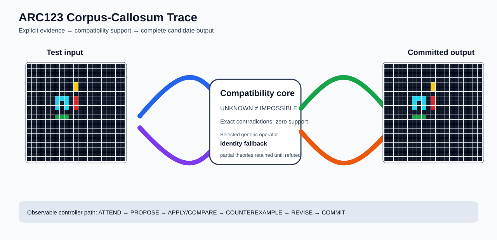

# ARC1 `045e512c` P0007 Brain Surgery Report

## Outcome: NO — TEST CELLS DO NOT ALL MATCH

- **Compared positions:** 441
- **Mismatched cells:** 43
- **Training compatibility:** `False`
- **Fallback used:** `True`
- **Causal trace acceptance:** `NO`
- **Selected hypothesis:** `fallback_identity_complete_grid`
- **Source commit:** `085f6dbe39050afac3d1d743f840bac95b1a8d1c`

## Causal Ablations

| Configuration | Exact all-cell result | Training exact | Fallback | Selected hypothesis |
| --- | --- | --- | --- | --- |
| `no_revision` | `False` | `False` | `True` | `fallback_identity_complete_grid` |
| `no_new_residual_family` | `False` | `False` | `True` | `fallback_identity_complete_grid` |

## Live-Agent Boundary

The controller receives only visible training input/output examples and test inputs. It receives no task ID, offline audit label, GT feature record, GT solver, historical decomposition, or held-out output before committing a complete grid. The expected output appears only in the post-answer V&V section.

## Corpus-Callosum Visualization



- Full explicit event record: [`learning_trace.json`](learning_trace.json)
- Full three-configuration record: [`ablations.json`](ablations.json)

## Causal Trace Check

- **Counterexample observed:** `True`
- **Additional visible demonstration selected:** `True`
- **Composition recorded:** `True`
- **Parameter or multi-rule revision:** `False`
- **Generic families in selected theory:** `none`

## Post-Answer V&V

### Test case 1
- **All cells match:** `False`
- **Mismatched cells:** `43`
- **Prediction:**
```json
[[0, 0, 0, 0, 0, 0, 0, 0, 0, 0, 0, 0, 0, 0, 0, 0, 0, 0, 0, 0, 0], [0, 0, 0, 0, 0, 0, 0, 0, 0, 0, 0, 0, 0, 0, 0, 0, 0, 0, 0, 0, 0], [0, 0, 0, 0, 0, 0, 0, 0, 0, 0, 0, 0, 0, 0, 0, 0, 0, 0, 0, 0, 0], [0, 0, 0, 0, 0, 0, 0, 0, 0, 0, 0, 0, 0, 0, 0, 0, 0, 0, 0, 0, 0], [0, 0, 0, 0, 0, 0, 0, 0, 0, 0, 4, 0, 0, 0, 0, 0, 0, 0, 0, 0, 0], [0, 0, 0, 0, 0, 0, 0, 0, 0, 0, 4, 0, 0, 0, 0, 0, 0, 0, 0, 0, 0], [0, 0, 0, 0, 0, 0, 0, 0, 0, 0, 0, 0, 0, 0, 0, 0, 0, 0, 0, 0, 0], [0, 0, 0, 0, 0, 0, 8, 8, 8, 0, 2, 0, 0, 0, 0, 0, 0, 0, 0, 0, 0], [0, 0, 0, 0, 0, 0, 8, 0, 8, 0, 2, 0, 0, 0, 0, 0, 0, 0, 0, 0, 0], [0, 0, 0, 0, 0, 0, 8, 0, 8, 0, 2, 0, 0, 0, 0, 0, 0, 0, 0, 0, 0], [0, 0, 0, 0, 0, 0, 0, 0, 0, 0, 0, 0, 0, 0, 0, 0, 0, 0, 0, 0, 0], [0, 0, 0, 0, 0, 0, 3, 3, 3, 0, 0, 0, 0, 0, 0, 0, 0, 0, 0, 0, 0], [0, 0, 0, 0, 0, 0, 0, 0, 0, 0, 0, 0, 0, 0, 0, 0, 0, 0, 0, 0, 0], [0, 0, 0, 0, 0, 0, 0, 0, 0, 0, 0, 0, 0, 0, 0, 0, 0, 0, 0, 0, 0], [0, 0, 0, 0, 0, 0, 0, 0, 0, 0, 0, 0, 0, 0, 0, 0, 0, 0, 0, 0, 0], [0, 0, 0, 0, 0, 0, 0, 0, 0, 0, 0, 0, 0, 0, 0, 0, 0, 0, 0, 0, 0], [0, 0, 0, 0, 0, 0, 0, 0, 0, 0, 0, 0, 0, 0, 0, 0, 0, 0, 0, 0, 0], [0, 0, 0, 0, 0, 0, 0, 0, 0, 0, 0, 0, 0, 0, 0, 0, 0, 0, 0, 0, 0], [0, 0, 0, 0, 0, 0, 0, 0, 0, 0, 0, 0, 0, 0, 0, 0, 0, 0, 0, 0, 0], [0, 0, 0, 0, 0, 0, 0, 0, 0, 0, 0, 0, 0, 0, 0, 0, 0, 0, 0, 0, 0], [0, 0, 0, 0, 0, 0, 0, 0, 0, 0, 0, 0, 0, 0, 0, 0, 0, 0, 0, 0, 0]]
```
- **Expected output (post-answer only):**
```json
[[0, 0, 0, 0, 0, 0, 0, 0, 0, 0, 0, 0, 0, 0, 4, 0, 4, 0, 0, 0, 0], [0, 0, 0, 0, 0, 0, 0, 0, 0, 0, 0, 0, 0, 0, 4, 0, 4, 0, 0, 0, 0], [0, 0, 0, 0, 0, 0, 0, 0, 0, 0, 0, 0, 0, 0, 0, 0, 0, 0, 0, 0, 0], [0, 0, 0, 0, 0, 0, 0, 0, 0, 0, 4, 4, 4, 0, 0, 0, 0, 0, 0, 0, 0], [0, 0, 0, 0, 0, 0, 0, 0, 0, 0, 4, 0, 4, 0, 0, 0, 0, 0, 0, 0, 0], [0, 0, 0, 0, 0, 0, 0, 0, 0, 0, 4, 0, 4, 0, 0, 0, 0, 0, 0, 0, 0], [0, 0, 0, 0, 0, 0, 0, 0, 0, 0, 0, 0, 0, 0, 0, 0, 0, 0, 0, 0, 0], [0, 0, 0, 0, 0, 0, 8, 8, 8, 0, 2, 2, 2, 0, 2, 2, 2, 0, 2, 2, 2], [0, 0, 0, 0, 0, 0, 8, 0, 8, 0, 2, 0, 2, 0, 2, 0, 2, 0, 2, 0, 2], [0, 0, 0, 0, 0, 0, 8, 0, 8, 0, 2, 0, 2, 0, 2, 0, 2, 0, 2, 0, 2], [0, 0, 0, 0, 0, 0, 0, 0, 0, 0, 0, 0, 0, 0, 0, 0, 0, 0, 0, 0, 0], [0, 0, 0, 0, 0, 0, 3, 3, 3, 0, 0, 0, 0, 0, 0, 0, 0, 0, 0, 0, 0], [0, 0, 0, 0, 0, 0, 3, 0, 3, 0, 0, 0, 0, 0, 0, 0, 0, 0, 0, 0, 0], [0, 0, 0, 0, 0, 0, 3, 0, 3, 0, 0, 0, 0, 0, 0, 0, 0, 0, 0, 0, 0], [0, 0, 0, 0, 0, 0, 0, 0, 0, 0, 0, 0, 0, 0, 0, 0, 0, 0, 0, 0, 0], [0, 0, 0, 0, 0, 0, 3, 3, 3, 0, 0, 0, 0, 0, 0, 0, 0, 0, 0, 0, 0], [0, 0, 0, 0, 0, 0, 3, 0, 3, 0, 0, 0, 0, 0, 0, 0, 0, 0, 0, 0, 0], [0, 0, 0, 0, 0, 0, 3, 0, 3, 0, 0, 0, 0, 0, 0, 0, 0, 0, 0, 0, 0], [0, 0, 0, 0, 0, 0, 0, 0, 0, 0, 0, 0, 0, 0, 0, 0, 0, 0, 0, 0, 0], [0, 0, 0, 0, 0, 0, 3, 3, 3, 0, 0, 0, 0, 0, 0, 0, 0, 0, 0, 0, 0], [0, 0, 0, 0, 0, 0, 3, 0, 3, 0, 0, 0, 0, 0, 0, 0, 0, 0, 0, 0, 0]]
```

## Observable IHL Walkthrough

The record contains explicit actions, predictions, feedback, and revisions; it does not claim or store hidden model reasoning.

### Action totals

- `APPLY_HYPOTHESIS`: 248
- `ATTEND`: 248
- `CHOOSE_NEXT_DEMO`: 248
- `COMMIT`: 1
- `COMPARE`: 248
- `COMPOSE_RULE`: 3
- `EXPLAIN_RESIDUAL`: 3
- `FIND_COUNTEREXAMPLE`: 8
- `PROPOSE`: 1
- `SPECIALIZE`: 82

### Decision milestones

- `0` `PROPOSE` — `{"parent_theory_id":"T0000","rule":{"description_length":1,"name":"identity","operation":"identity","parameters":{},"rule_id":"identity","scope":{"kind":"all","value":null}},"stage":"initial_generic_theories","theory_id":"T0001"}`
- `2` `ATTEND` — `{"reason":"initial_highest_observed_change_and_color_discrimination","selected_demo":0,"selected_region":{"column":11,"row":6},"theory_id":"T0001"}`
- `6` `ATTEND` — `{"reason":"counterexample_requires_visible_conditional_evidence:unseen_demo_selected_for_residual_version_space_discrimination","selected_demo":1,"selected_region":{"column":11,"row":0},"theory_id":"T0001"}`
- `10` `ATTEND` — `{"reason":"counterexample_requires_visible_conditional_evidence:unseen_demo_selected_for_residual_version_space_discrimination","selected_demo":2,"selected_region":{"column":14,"row":0},"theory_id":"T0001"}`
- `16` `SPECIALIZE` — `{"added_rule":{"description_length":4,"name":"line_extend(direction=right,fill_color=3,seed_color=3)","operation":"full_operator","parameters":{"direction":"right","fill_color":3,"operator":"line_extend","seed_color":3},"rule_id":"structural-line_extend","scope":{"kind":"all","value":null}},"parent_theory_id":"T0001","reason":"unexplained_residual_proposed_generic_structural_rule","theory_id":"T0003"}`
- `17` `SPECIALIZE` — `{"added_rule":{"description_length":4,"name":"line_extend(direction=right,fill_color=3,seed_color=8)","operation":"full_operator","parameters":{"direction":"right","fill_color":3,"operator":"line_extend","seed_color":8},"rule_id":"structural-line_extend","scope":{"kind":"all","value":null}},"parent_theory_id":"T0001","reason":"unexplained_residual_proposed_generic_structural_rule","theory_id":"T0004"}`
- `18` `SPECIALIZE` — `{"added_rule":{"description_length":4,"name":"line_extend(direction=down,fill_color=2,seed_color=8)","operation":"full_operator","parameters":{"direction":"down","fill_color":2,"operator":"line_extend","seed_color":8},"rule_id":"structural-line_extend","scope":{"kind":"all","value":null}},"parent_theory_id":"T0001","reason":"unexplained_residual_proposed_generic_structural_rule","theory_id":"T0005"}`
- `19` `SPECIALIZE` — `{"added_rule":{"description_length":4,"name":"row_span_fill(fill_color=8,seed_color=6)","operation":"full_operator","parameters":{"fill_color":8,"operator":"row_span_fill","seed_color":6},"rule_id":"structural-row_span_fill","scope":{"kind":"all","value":null}},"parent_theory_id":"T0001","reason":"unexplained_residual_proposed_generic_structural_rule","theory_id":"T0006"}`
- `20` `SPECIALIZE` — `{"added_rule":{"description_length":4,"name":"row_span_fill(fill_color=8,seed_color=4)","operation":"full_operator","parameters":{"fill_color":8,"operator":"row_span_fill","seed_color":4},"rule_id":"structural-row_span_fill","scope":{"kind":"all","value":null}},"parent_theory_id":"T0001","reason":"unexplained_residual_proposed_generic_structural_rule","theory_id":"T0007"}`
- `21` `SPECIALIZE` — `{"added_rule":{"description_length":4,"name":"row_span_fill(fill_color=8,seed_color=3)","operation":"full_operator","parameters":{"fill_color":8,"operator":"row_span_fill","seed_color":3},"rule_id":"structural-row_span_fill","scope":{"kind":"all","value":null}},"parent_theory_id":"T0001","reason":"unexplained_residual_proposed_generic_structural_rule","theory_id":"T0008"}`
- `22` `SPECIALIZE` — `{"added_rule":{"description_length":4,"name":"row_span_fill(fill_color=8,seed_color=2)","operation":"full_operator","parameters":{"fill_color":8,"operator":"row_span_fill","seed_color":2},"rule_id":"structural-row_span_fill","scope":{"kind":"all","value":null}},"parent_theory_id":"T0001","reason":"unexplained_residual_proposed_generic_structural_rule","theory_id":"T0009"}`
- `23` `SPECIALIZE` — `{"added_rule":{"description_length":4,"name":"row_span_fill(fill_color=8,seed_color=1)","operation":"full_operator","parameters":{"fill_color":8,"operator":"row_span_fill","seed_color":1},"rule_id":"structural-row_span_fill","scope":{"kind":"all","value":null}},"parent_theory_id":"T0001","reason":"unexplained_residual_proposed_generic_structural_rule","theory_id":"T0010"}`
- `24` `SPECIALIZE` — `{"added_rule":{"description_length":4,"name":"row_span_fill(fill_color=6,seed_color=6)","operation":"full_operator","parameters":{"fill_color":6,"operator":"row_span_fill","seed_color":6},"rule_id":"structural-row_span_fill","scope":{"kind":"all","value":null}},"parent_theory_id":"T0001","reason":"unexplained_residual_proposed_generic_structural_rule","theory_id":"T0011"}`
- `25` `SPECIALIZE` — `{"added_rule":{"description_length":4,"name":"row_span_fill(fill_color=6,seed_color=4)","operation":"full_operator","parameters":{"fill_color":6,"operator":"row_span_fill","seed_color":4},"rule_id":"structural-row_span_fill","scope":{"kind":"all","value":null}},"parent_theory_id":"T0001","reason":"unexplained_residual_proposed_generic_structural_rule","theory_id":"T0012"}`
- `26` `SPECIALIZE` — `{"added_rule":{"description_length":4,"name":"row_span_fill(fill_color=6,seed_color=3)","operation":"full_operator","parameters":{"fill_color":6,"operator":"row_span_fill","seed_color":3},"rule_id":"structural-row_span_fill","scope":{"kind":"all","value":null}},"parent_theory_id":"T0001","reason":"unexplained_residual_proposed_generic_structural_rule","theory_id":"T0013"}`
- `27` `SPECIALIZE` — `{"added_rule":{"description_length":4,"name":"row_span_fill(fill_color=6,seed_color=2)","operation":"full_operator","parameters":{"fill_color":6,"operator":"row_span_fill","seed_color":2},"rule_id":"structural-row_span_fill","scope":{"kind":"all","value":null}},"parent_theory_id":"T0001","reason":"unexplained_residual_proposed_generic_structural_rule","theory_id":"T0014"}`
- `29` `ATTEND` — `{"reason":"initial_highest_observed_change_and_color_discrimination","selected_demo":0,"selected_region":{"column":0,"row":0},"theory_id":"T0002"}`
- `33` `ATTEND` — `{"reason":"initial_highest_observed_change_and_color_discrimination","selected_demo":0,"selected_region":{"column":13,"row":6},"theory_id":"T0003"}`
- `37` `ATTEND` — `{"reason":"initial_highest_observed_change_and_color_discrimination","selected_demo":0,"selected_region":{"column":9,"row":6},"theory_id":"T0004"}`
- `41` `ATTEND` — `{"reason":"initial_highest_observed_change_and_color_discrimination","selected_demo":0,"selected_region":{"column":11,"row":6},"theory_id":"T0005"}`
- `45` `ATTEND` — `{"reason":"initial_highest_observed_change_and_color_discrimination","selected_demo":0,"selected_region":{"column":11,"row":6},"theory_id":"T0006"}`
- `49` `ATTEND` — `{"reason":"initial_highest_observed_change_and_color_discrimination","selected_demo":0,"selected_region":{"column":11,"row":6},"theory_id":"T0007"}`
- `53` `ATTEND` — `{"reason":"initial_highest_observed_change_and_color_discrimination","selected_demo":0,"selected_region":{"column":11,"row":6},"theory_id":"T0008"}`
- `57` `ATTEND` — `{"reason":"initial_highest_observed_change_and_color_discrimination","selected_demo":0,"selected_region":{"column":11,"row":6},"theory_id":"T0009"}`
- `61` `ATTEND` — `{"reason":"initial_highest_observed_change_and_color_discrimination","selected_demo":0,"selected_region":{"column":11,"row":6},"theory_id":"T0010"}`
- `65` `ATTEND` — `{"reason":"initial_highest_observed_change_and_color_discrimination","selected_demo":0,"selected_region":{"column":11,"row":6},"theory_id":"T0011"}`
- `69` `ATTEND` — `{"reason":"initial_highest_observed_change_and_color_discrimination","selected_demo":0,"selected_region":{"column":11,"row":6},"theory_id":"T0012"}`
- `73` `ATTEND` — `{"reason":"initial_highest_observed_change_and_color_discrimination","selected_demo":0,"selected_region":{"column":11,"row":6},"theory_id":"T0013"}`
- `77` `ATTEND` — `{"reason":"counterexample_requires_visible_conditional_evidence:unseen_demo_selected_for_residual_version_space_discrimination","selected_demo":1,"selected_region":{"column":11,"row":0},"theory_id":"T0003"}`
- `81` `ATTEND` — `{"reason":"counterexample_requires_visible_conditional_evidence:unseen_demo_selected_for_residual_version_space_discrimination","selected_demo":1,"selected_region":{"column":11,"row":0},"theory_id":"T0004"}`
- `85` `ATTEND` — `{"reason":"counterexample_requires_visible_conditional_evidence:unseen_demo_selected_for_residual_version_space_discrimination","selected_demo":1,"selected_region":{"column":11,"row":0},"theory_id":"T0005"}`
- `89` `ATTEND` — `{"reason":"counterexample_requires_visible_conditional_evidence:unseen_demo_selected_for_residual_version_space_discrimination","selected_demo":1,"selected_region":{"column":11,"row":0},"theory_id":"T0006"}`
- `93` `ATTEND` — `{"reason":"counterexample_requires_visible_conditional_evidence:unseen_demo_selected_for_residual_version_space_discrimination","selected_demo":1,"selected_region":{"column":11,"row":0},"theory_id":"T0007"}`
- `97` `ATTEND` — `{"reason":"counterexample_requires_visible_conditional_evidence:unseen_demo_selected_for_residual_version_space_discrimination","selected_demo":1,"selected_region":{"column":11,"row":0},"theory_id":"T0008"}`
- `101` `ATTEND` — `{"reason":"counterexample_requires_visible_conditional_evidence:unseen_demo_selected_for_residual_version_space_discrimination","selected_demo":1,"selected_region":{"column":11,"row":0},"theory_id":"T0009"}`
- `105` `ATTEND` — `{"reason":"counterexample_requires_visible_conditional_evidence:unseen_demo_selected_for_residual_version_space_discrimination","selected_demo":1,"selected_region":{"column":11,"row":0},"theory_id":"T0010"}`
- `109` `ATTEND` — `{"reason":"counterexample_requires_visible_conditional_evidence:unseen_demo_selected_for_residual_version_space_discrimination","selected_demo":1,"selected_region":{"column":11,"row":0},"theory_id":"T0011"}`
- `113` `ATTEND` — `{"reason":"counterexample_requires_visible_conditional_evidence:unseen_demo_selected_for_residual_version_space_discrimination","selected_demo":1,"selected_region":{"column":11,"row":0},"theory_id":"T0012"}`
- `117` `ATTEND` — `{"reason":"counterexample_requires_visible_conditional_evidence:unseen_demo_selected_for_residual_version_space_discrimination","selected_demo":1,"selected_region":{"column":11,"row":0},"theory_id":"T0013"}`
- `121` `ATTEND` — `{"reason":"counterexample_requires_visible_conditional_evidence:unseen_demo_selected_for_residual_version_space_discrimination","selected_demo":2,"selected_region":{"column":14,"row":0},"theory_id":"T0003"}`
- `125` `ATTEND` — `{"reason":"counterexample_requires_visible_conditional_evidence:unseen_demo_selected_for_residual_version_space_discrimination","selected_demo":2,"selected_region":{"column":14,"row":0},"theory_id":"T0004"}`
- `129` `ATTEND` — `{"reason":"counterexample_requires_visible_conditional_evidence:unseen_demo_selected_for_residual_version_space_discrimination","selected_demo":2,"selected_region":{"column":14,"row":0},"theory_id":"T0005"}`
- `133` `ATTEND` — `{"reason":"counterexample_requires_visible_conditional_evidence:unseen_demo_selected_for_residual_version_space_discrimination","selected_demo":2,"selected_region":{"column":14,"row":0},"theory_id":"T0006"}`
- `137` `ATTEND` — `{"reason":"counterexample_requires_visible_conditional_evidence:unseen_demo_selected_for_residual_version_space_discrimination","selected_demo":2,"selected_region":{"column":14,"row":0},"theory_id":"T0007"}`
- `141` `ATTEND` — `{"reason":"counterexample_requires_visible_conditional_evidence:unseen_demo_selected_for_residual_version_space_discrimination","selected_demo":2,"selected_region":{"column":14,"row":0},"theory_id":"T0008"}`
- `145` `ATTEND` — `{"reason":"counterexample_requires_visible_conditional_evidence:unseen_demo_selected_for_residual_version_space_discrimination","selected_demo":2,"selected_region":{"column":14,"row":0},"theory_id":"T0009"}`
- `149` `ATTEND` — `{"reason":"counterexample_requires_visible_conditional_evidence:unseen_demo_selected_for_residual_version_space_discrimination","selected_demo":2,"selected_region":{"column":14,"row":0},"theory_id":"T0010"}`
- `153` `ATTEND` — `{"reason":"counterexample_requires_visible_conditional_evidence:unseen_demo_selected_for_residual_version_space_discrimination","selected_demo":2,"selected_region":{"column":14,"row":0},"theory_id":"T0011"}`
- `157` `ATTEND` — `{"reason":"counterexample_requires_visible_conditional_evidence:unseen_demo_selected_for_residual_version_space_discrimination","selected_demo":2,"selected_region":{"column":14,"row":0},"theory_id":"T0012"}`
- `161` `ATTEND` — `{"reason":"counterexample_requires_visible_conditional_evidence:unseen_demo_selected_for_residual_version_space_discrimination","selected_demo":2,"selected_region":{"column":14,"row":0},"theory_id":"T0013"}`
- `165` `SPECIALIZE` — `{"added_rule":{"description_length":4,"name":"line_extend(direction=right,fill_color=3,seed_color=8)","operation":"full_operator","parameters":{"direction":"right","fill_color":3,"operator":"line_extend","seed_color":8},"rule_id":"structural-line_extend","scope":{"kind":"all","value":null}},"parent_theory_id":"T0003","reason":"unexplained_residual_proposed_generic_structural_rule","theory_id":"T0015"}`
- `166` `SPECIALIZE` — `{"added_rule":{"description_length":4,"name":"line_extend(direction=down,fill_color=2,seed_color=8)","operation":"full_operator","parameters":{"direction":"down","fill_color":2,"operator":"line_extend","seed_color":8},"rule_id":"structural-line_extend","scope":{"kind":"all","value":null}},"parent_theory_id":"T0003","reason":"unexplained_residual_proposed_generic_structural_rule","theory_id":"T0016"}`
- `167` `SPECIALIZE` — `{"added_rule":{"description_length":4,"name":"row_span_fill(fill_color=8,seed_color=6)","operation":"full_operator","parameters":{"fill_color":8,"operator":"row_span_fill","seed_color":6},"rule_id":"structural-row_span_fill","scope":{"kind":"all","value":null}},"parent_theory_id":"T0003","reason":"unexplained_residual_proposed_generic_structural_rule","theory_id":"T0017"}`
- `168` `SPECIALIZE` — `{"added_rule":{"description_length":4,"name":"row_span_fill(fill_color=8,seed_color=4)","operation":"full_operator","parameters":{"fill_color":8,"operator":"row_span_fill","seed_color":4},"rule_id":"structural-row_span_fill","scope":{"kind":"all","value":null}},"parent_theory_id":"T0003","reason":"unexplained_residual_proposed_generic_structural_rule","theory_id":"T0018"}`
- `169` `SPECIALIZE` — `{"added_rule":{"description_length":4,"name":"row_span_fill(fill_color=8,seed_color=3)","operation":"full_operator","parameters":{"fill_color":8,"operator":"row_span_fill","seed_color":3},"rule_id":"structural-row_span_fill","scope":{"kind":"all","value":null}},"parent_theory_id":"T0003","reason":"unexplained_residual_proposed_generic_structural_rule","theory_id":"T0019"}`
- `170` `SPECIALIZE` — `{"added_rule":{"description_length":4,"name":"row_span_fill(fill_color=8,seed_color=2)","operation":"full_operator","parameters":{"fill_color":8,"operator":"row_span_fill","seed_color":2},"rule_id":"structural-row_span_fill","scope":{"kind":"all","value":null}},"parent_theory_id":"T0003","reason":"unexplained_residual_proposed_generic_structural_rule","theory_id":"T0020"}`
- `171` `SPECIALIZE` — `{"added_rule":{"description_length":4,"name":"row_span_fill(fill_color=8,seed_color=1)","operation":"full_operator","parameters":{"fill_color":8,"operator":"row_span_fill","seed_color":1},"rule_id":"structural-row_span_fill","scope":{"kind":"all","value":null}},"parent_theory_id":"T0003","reason":"unexplained_residual_proposed_generic_structural_rule","theory_id":"T0021"}`
- `172` `SPECIALIZE` — `{"added_rule":{"description_length":4,"name":"row_span_fill(fill_color=6,seed_color=6)","operation":"full_operator","parameters":{"fill_color":6,"operator":"row_span_fill","seed_color":6},"rule_id":"structural-row_span_fill","scope":{"kind":"all","value":null}},"parent_theory_id":"T0003","reason":"unexplained_residual_proposed_generic_structural_rule","theory_id":"T0022"}`
- `173` `SPECIALIZE` — `{"added_rule":{"description_length":4,"name":"row_span_fill(fill_color=6,seed_color=4)","operation":"full_operator","parameters":{"fill_color":6,"operator":"row_span_fill","seed_color":4},"rule_id":"structural-row_span_fill","scope":{"kind":"all","value":null}},"parent_theory_id":"T0003","reason":"unexplained_residual_proposed_generic_structural_rule","theory_id":"T0023"}`
- `174` `SPECIALIZE` — `{"added_rule":{"description_length":4,"name":"row_span_fill(fill_color=6,seed_color=3)","operation":"full_operator","parameters":{"fill_color":6,"operator":"row_span_fill","seed_color":3},"rule_id":"structural-row_span_fill","scope":{"kind":"all","value":null}},"parent_theory_id":"T0003","reason":"unexplained_residual_proposed_generic_structural_rule","theory_id":"T0024"}`
- `175` `SPECIALIZE` — `{"added_rule":{"description_length":4,"name":"row_span_fill(fill_color=6,seed_color=2)","operation":"full_operator","parameters":{"fill_color":6,"operator":"row_span_fill","seed_color":2},"rule_id":"structural-row_span_fill","scope":{"kind":"all","value":null}},"parent_theory_id":"T0003","reason":"unexplained_residual_proposed_generic_structural_rule","theory_id":"T0025"}`
- `177` `ATTEND` — `{"reason":"initial_highest_observed_change_and_color_discrimination","selected_demo":0,"selected_region":{"column":9,"row":6},"theory_id":"T0015"}`
- `181` `ATTEND` — `{"reason":"initial_highest_observed_change_and_color_discrimination","selected_demo":0,"selected_region":{"column":11,"row":6},"theory_id":"T0016"}`
- `185` `ATTEND` — `{"reason":"initial_highest_observed_change_and_color_discrimination","selected_demo":0,"selected_region":{"column":11,"row":6},"theory_id":"T0017"}`
- `189` `ATTEND` — `{"reason":"initial_highest_observed_change_and_color_discrimination","selected_demo":0,"selected_region":{"column":11,"row":6},"theory_id":"T0018"}`
- `193` `ATTEND` — `{"reason":"initial_highest_observed_change_and_color_discrimination","selected_demo":0,"selected_region":{"column":11,"row":6},"theory_id":"T0019"}`
- `197` `ATTEND` — `{"reason":"initial_highest_observed_change_and_color_discrimination","selected_demo":0,"selected_region":{"column":11,"row":6},"theory_id":"T0020"}`
- `201` `ATTEND` — `{"reason":"initial_highest_observed_change_and_color_discrimination","selected_demo":0,"selected_region":{"column":11,"row":6},"theory_id":"T0021"}`
- `205` `ATTEND` — `{"reason":"initial_highest_observed_change_and_color_discrimination","selected_demo":0,"selected_region":{"column":11,"row":6},"theory_id":"T0022"}`
- `209` `ATTEND` — `{"reason":"initial_highest_observed_change_and_color_discrimination","selected_demo":0,"selected_region":{"column":11,"row":6},"theory_id":"T0023"}`
- `213` `ATTEND` — `{"reason":"initial_highest_observed_change_and_color_discrimination","selected_demo":0,"selected_region":{"column":11,"row":6},"theory_id":"T0024"}`
- `217` `ATTEND` — `{"reason":"initial_highest_observed_change_and_color_discrimination","selected_demo":0,"selected_region":{"column":11,"row":6},"theory_id":"T0025"}`
- `221` `ATTEND` — `{"reason":"counterexample_requires_visible_conditional_evidence:unseen_demo_selected_for_residual_version_space_discrimination","selected_demo":1,"selected_region":{"column":11,"row":0},"theory_id":"T0015"}`
- `225` `ATTEND` — `{"reason":"counterexample_requires_visible_conditional_evidence:unseen_demo_selected_for_residual_version_space_discrimination","selected_demo":1,"selected_region":{"column":11,"row":0},"theory_id":"T0016"}`
- `229` `ATTEND` — `{"reason":"counterexample_requires_visible_conditional_evidence:unseen_demo_selected_for_residual_version_space_discrimination","selected_demo":1,"selected_region":{"column":11,"row":0},"theory_id":"T0017"}`
- `233` `ATTEND` — `{"reason":"counterexample_requires_visible_conditional_evidence:unseen_demo_selected_for_residual_version_space_discrimination","selected_demo":1,"selected_region":{"column":11,"row":0},"theory_id":"T0018"}`
- `237` `ATTEND` — `{"reason":"counterexample_requires_visible_conditional_evidence:unseen_demo_selected_for_residual_version_space_discrimination","selected_demo":1,"selected_region":{"column":11,"row":0},"theory_id":"T0019"}`
- `241` `ATTEND` — `{"reason":"counterexample_requires_visible_conditional_evidence:unseen_demo_selected_for_residual_version_space_discrimination","selected_demo":1,"selected_region":{"column":11,"row":0},"theory_id":"T0020"}`
- `245` `ATTEND` — `{"reason":"counterexample_requires_visible_conditional_evidence:unseen_demo_selected_for_residual_version_space_discrimination","selected_demo":1,"selected_region":{"column":11,"row":0},"theory_id":"T0021"}`
- `249` `ATTEND` — `{"reason":"counterexample_requires_visible_conditional_evidence:unseen_demo_selected_for_residual_version_space_discrimination","selected_demo":1,"selected_region":{"column":11,"row":0},"theory_id":"T0022"}`
- `253` `ATTEND` — `{"reason":"counterexample_requires_visible_conditional_evidence:unseen_demo_selected_for_residual_version_space_discrimination","selected_demo":1,"selected_region":{"column":11,"row":0},"theory_id":"T0023"}`
- `257` `ATTEND` — `{"reason":"counterexample_requires_visible_conditional_evidence:unseen_demo_selected_for_residual_version_space_discrimination","selected_demo":1,"selected_region":{"column":11,"row":0},"theory_id":"T0024"}`
- `261` `ATTEND` — `{"reason":"counterexample_requires_visible_conditional_evidence:unseen_demo_selected_for_residual_version_space_discrimination","selected_demo":1,"selected_region":{"column":11,"row":0},"theory_id":"T0025"}`
- `265` `ATTEND` — `{"reason":"counterexample_requires_visible_conditional_evidence:unseen_demo_selected_for_residual_version_space_discrimination","selected_demo":2,"selected_region":{"column":14,"row":0},"theory_id":"T0015"}`
- `269` `ATTEND` — `{"reason":"counterexample_requires_visible_conditional_evidence:unseen_demo_selected_for_residual_version_space_discrimination","selected_demo":2,"selected_region":{"column":14,"row":0},"theory_id":"T0016"}`
- `273` `ATTEND` — `{"reason":"counterexample_requires_visible_conditional_evidence:unseen_demo_selected_for_residual_version_space_discrimination","selected_demo":2,"selected_region":{"column":14,"row":0},"theory_id":"T0017"}`
- `277` `ATTEND` — `{"reason":"counterexample_requires_visible_conditional_evidence:unseen_demo_selected_for_residual_version_space_discrimination","selected_demo":2,"selected_region":{"column":14,"row":0},"theory_id":"T0018"}`
- `281` `ATTEND` — `{"reason":"counterexample_requires_visible_conditional_evidence:unseen_demo_selected_for_residual_version_space_discrimination","selected_demo":2,"selected_region":{"column":14,"row":0},"theory_id":"T0019"}`
- `285` `ATTEND` — `{"reason":"counterexample_requires_visible_conditional_evidence:unseen_demo_selected_for_residual_version_space_discrimination","selected_demo":2,"selected_region":{"column":14,"row":0},"theory_id":"T0020"}`
- `289` `ATTEND` — `{"reason":"counterexample_requires_visible_conditional_evidence:unseen_demo_selected_for_residual_version_space_discrimination","selected_demo":2,"selected_region":{"column":14,"row":0},"theory_id":"T0021"}`
- `293` `ATTEND` — `{"reason":"counterexample_requires_visible_conditional_evidence:unseen_demo_selected_for_residual_version_space_discrimination","selected_demo":2,"selected_region":{"column":14,"row":0},"theory_id":"T0022"}`
- `297` `ATTEND` — `{"reason":"counterexample_requires_visible_conditional_evidence:unseen_demo_selected_for_residual_version_space_discrimination","selected_demo":2,"selected_region":{"column":14,"row":0},"theory_id":"T0023"}`
- `301` `ATTEND` — `{"reason":"counterexample_requires_visible_conditional_evidence:unseen_demo_selected_for_residual_version_space_discrimination","selected_demo":2,"selected_region":{"column":14,"row":0},"theory_id":"T0024"}`
- `305` `ATTEND` — `{"reason":"counterexample_requires_visible_conditional_evidence:unseen_demo_selected_for_residual_version_space_discrimination","selected_demo":2,"selected_region":{"column":14,"row":0},"theory_id":"T0025"}`
- `309` `SPECIALIZE` — `{"added_rule":{"description_length":4,"name":"line_extend(direction=right,fill_color=3,seed_color=3)","operation":"full_operator","parameters":{"direction":"right","fill_color":3,"operator":"line_extend","seed_color":3},"rule_id":"structural-line_extend","scope":{"kind":"all","value":null}},"parent_theory_id":"T0004","reason":"unexplained_residual_proposed_generic_structural_rule","theory_id":"T0026"}`
- `310` `SPECIALIZE` — `{"added_rule":{"description_length":4,"name":"line_extend(direction=down,fill_color=2,seed_color=8)","operation":"full_operator","parameters":{"direction":"down","fill_color":2,"operator":"line_extend","seed_color":8},"rule_id":"structural-line_extend","scope":{"kind":"all","value":null}},"parent_theory_id":"T0004","reason":"unexplained_residual_proposed_generic_structural_rule","theory_id":"T0027"}`
- `311` `SPECIALIZE` — `{"added_rule":{"description_length":4,"name":"row_span_fill(fill_color=8,seed_color=6)","operation":"full_operator","parameters":{"fill_color":8,"operator":"row_span_fill","seed_color":6},"rule_id":"structural-row_span_fill","scope":{"kind":"all","value":null}},"parent_theory_id":"T0004","reason":"unexplained_residual_proposed_generic_structural_rule","theory_id":"T0028"}`
- `312` `SPECIALIZE` — `{"added_rule":{"description_length":4,"name":"row_span_fill(fill_color=8,seed_color=4)","operation":"full_operator","parameters":{"fill_color":8,"operator":"row_span_fill","seed_color":4},"rule_id":"structural-row_span_fill","scope":{"kind":"all","value":null}},"parent_theory_id":"T0004","reason":"unexplained_residual_proposed_generic_structural_rule","theory_id":"T0029"}`
- `313` `SPECIALIZE` — `{"added_rule":{"description_length":4,"name":"row_span_fill(fill_color=8,seed_color=3)","operation":"full_operator","parameters":{"fill_color":8,"operator":"row_span_fill","seed_color":3},"rule_id":"structural-row_span_fill","scope":{"kind":"all","value":null}},"parent_theory_id":"T0004","reason":"unexplained_residual_proposed_generic_structural_rule","theory_id":"T0030"}`
- `314` `SPECIALIZE` — `{"added_rule":{"description_length":4,"name":"row_span_fill(fill_color=8,seed_color=2)","operation":"full_operator","parameters":{"fill_color":8,"operator":"row_span_fill","seed_color":2},"rule_id":"structural-row_span_fill","scope":{"kind":"all","value":null}},"parent_theory_id":"T0004","reason":"unexplained_residual_proposed_generic_structural_rule","theory_id":"T0031"}`
- `315` `SPECIALIZE` — `{"added_rule":{"description_length":4,"name":"row_span_fill(fill_color=8,seed_color=1)","operation":"full_operator","parameters":{"fill_color":8,"operator":"row_span_fill","seed_color":1},"rule_id":"structural-row_span_fill","scope":{"kind":"all","value":null}},"parent_theory_id":"T0004","reason":"unexplained_residual_proposed_generic_structural_rule","theory_id":"T0032"}`
- `316` `SPECIALIZE` — `{"added_rule":{"description_length":4,"name":"row_span_fill(fill_color=6,seed_color=6)","operation":"full_operator","parameters":{"fill_color":6,"operator":"row_span_fill","seed_color":6},"rule_id":"structural-row_span_fill","scope":{"kind":"all","value":null}},"parent_theory_id":"T0004","reason":"unexplained_residual_proposed_generic_structural_rule","theory_id":"T0033"}`
- `317` `SPECIALIZE` — `{"added_rule":{"description_length":4,"name":"row_span_fill(fill_color=6,seed_color=4)","operation":"full_operator","parameters":{"fill_color":6,"operator":"row_span_fill","seed_color":4},"rule_id":"structural-row_span_fill","scope":{"kind":"all","value":null}},"parent_theory_id":"T0004","reason":"unexplained_residual_proposed_generic_structural_rule","theory_id":"T0034"}`
- `318` `SPECIALIZE` — `{"added_rule":{"description_length":4,"name":"row_span_fill(fill_color=6,seed_color=3)","operation":"full_operator","parameters":{"fill_color":6,"operator":"row_span_fill","seed_color":3},"rule_id":"structural-row_span_fill","scope":{"kind":"all","value":null}},"parent_theory_id":"T0004","reason":"unexplained_residual_proposed_generic_structural_rule","theory_id":"T0035"}`
- `319` `SPECIALIZE` — `{"added_rule":{"description_length":4,"name":"row_span_fill(fill_color=6,seed_color=2)","operation":"full_operator","parameters":{"fill_color":6,"operator":"row_span_fill","seed_color":2},"rule_id":"structural-row_span_fill","scope":{"kind":"all","value":null}},"parent_theory_id":"T0004","reason":"unexplained_residual_proposed_generic_structural_rule","theory_id":"T0036"}`
- `321` `ATTEND` — `{"reason":"initial_highest_observed_change_and_color_discrimination","selected_demo":0,"selected_region":{"column":13,"row":6},"theory_id":"T0026"}`
- `325` `ATTEND` — `{"reason":"initial_highest_observed_change_and_color_discrimination","selected_demo":0,"selected_region":{"column":11,"row":6},"theory_id":"T0027"}`
- `329` `ATTEND` — `{"reason":"initial_highest_observed_change_and_color_discrimination","selected_demo":0,"selected_region":{"column":11,"row":6},"theory_id":"T0028"}`
- `333` `ATTEND` — `{"reason":"initial_highest_observed_change_and_color_discrimination","selected_demo":0,"selected_region":{"column":11,"row":6},"theory_id":"T0029"}`
- `337` `ATTEND` — `{"reason":"initial_highest_observed_change_and_color_discrimination","selected_demo":0,"selected_region":{"column":11,"row":6},"theory_id":"T0030"}`
- `341` `ATTEND` — `{"reason":"initial_highest_observed_change_and_color_discrimination","selected_demo":0,"selected_region":{"column":11,"row":6},"theory_id":"T0031"}`
- `345` `ATTEND` — `{"reason":"initial_highest_observed_change_and_color_discrimination","selected_demo":0,"selected_region":{"column":11,"row":6},"theory_id":"T0032"}`
- `349` `ATTEND` — `{"reason":"initial_highest_observed_change_and_color_discrimination","selected_demo":0,"selected_region":{"column":11,"row":6},"theory_id":"T0033"}`
- `353` `ATTEND` — `{"reason":"initial_highest_observed_change_and_color_discrimination","selected_demo":0,"selected_region":{"column":11,"row":6},"theory_id":"T0034"}`
- `357` `ATTEND` — `{"reason":"initial_highest_observed_change_and_color_discrimination","selected_demo":0,"selected_region":{"column":11,"row":6},"theory_id":"T0035"}`
- `361` `ATTEND` — `{"reason":"initial_highest_observed_change_and_color_discrimination","selected_demo":0,"selected_region":{"column":11,"row":6},"theory_id":"T0036"}`
- `365` `ATTEND` — `{"reason":"counterexample_requires_visible_conditional_evidence:unseen_demo_selected_for_residual_version_space_discrimination","selected_demo":1,"selected_region":{"column":11,"row":0},"theory_id":"T0026"}`
- `369` `ATTEND` — `{"reason":"counterexample_requires_visible_conditional_evidence:unseen_demo_selected_for_residual_version_space_discrimination","selected_demo":1,"selected_region":{"column":11,"row":0},"theory_id":"T0027"}`
- `373` `ATTEND` — `{"reason":"counterexample_requires_visible_conditional_evidence:unseen_demo_selected_for_residual_version_space_discrimination","selected_demo":1,"selected_region":{"column":11,"row":0},"theory_id":"T0028"}`
- `377` `ATTEND` — `{"reason":"counterexample_requires_visible_conditional_evidence:unseen_demo_selected_for_residual_version_space_discrimination","selected_demo":1,"selected_region":{"column":11,"row":0},"theory_id":"T0029"}`
- `381` `ATTEND` — `{"reason":"counterexample_requires_visible_conditional_evidence:unseen_demo_selected_for_residual_version_space_discrimination","selected_demo":1,"selected_region":{"column":11,"row":0},"theory_id":"T0030"}`
- `385` `ATTEND` — `{"reason":"counterexample_requires_visible_conditional_evidence:unseen_demo_selected_for_residual_version_space_discrimination","selected_demo":1,"selected_region":{"column":11,"row":0},"theory_id":"T0031"}`
- `389` `ATTEND` — `{"reason":"counterexample_requires_visible_conditional_evidence:unseen_demo_selected_for_residual_version_space_discrimination","selected_demo":1,"selected_region":{"column":11,"row":0},"theory_id":"T0032"}`
- `393` `ATTEND` — `{"reason":"counterexample_requires_visible_conditional_evidence:unseen_demo_selected_for_residual_version_space_discrimination","selected_demo":1,"selected_region":{"column":11,"row":0},"theory_id":"T0033"}`
- `397` `ATTEND` — `{"reason":"counterexample_requires_visible_conditional_evidence:unseen_demo_selected_for_residual_version_space_discrimination","selected_demo":1,"selected_region":{"column":11,"row":0},"theory_id":"T0034"}`
- `401` `ATTEND` — `{"reason":"counterexample_requires_visible_conditional_evidence:unseen_demo_selected_for_residual_version_space_discrimination","selected_demo":1,"selected_region":{"column":11,"row":0},"theory_id":"T0035"}`
- `405` `ATTEND` — `{"reason":"counterexample_requires_visible_conditional_evidence:unseen_demo_selected_for_residual_version_space_discrimination","selected_demo":1,"selected_region":{"column":11,"row":0},"theory_id":"T0036"}`
- `409` `ATTEND` — `{"reason":"counterexample_requires_visible_conditional_evidence:unseen_demo_selected_for_residual_version_space_discrimination","selected_demo":2,"selected_region":{"column":14,"row":0},"theory_id":"T0026"}`
- `413` `ATTEND` — `{"reason":"counterexample_requires_visible_conditional_evidence:unseen_demo_selected_for_residual_version_space_discrimination","selected_demo":2,"selected_region":{"column":14,"row":0},"theory_id":"T0027"}`
- `417` `ATTEND` — `{"reason":"counterexample_requires_visible_conditional_evidence:unseen_demo_selected_for_residual_version_space_discrimination","selected_demo":2,"selected_region":{"column":14,"row":0},"theory_id":"T0028"}`
- `421` `ATTEND` — `{"reason":"counterexample_requires_visible_conditional_evidence:unseen_demo_selected_for_residual_version_space_discrimination","selected_demo":2,"selected_region":{"column":14,"row":0},"theory_id":"T0029"}`
- `425` `ATTEND` — `{"reason":"counterexample_requires_visible_conditional_evidence:unseen_demo_selected_for_residual_version_space_discrimination","selected_demo":2,"selected_region":{"column":14,"row":0},"theory_id":"T0030"}`
- `429` `ATTEND` — `{"reason":"counterexample_requires_visible_conditional_evidence:unseen_demo_selected_for_residual_version_space_discrimination","selected_demo":2,"selected_region":{"column":14,"row":0},"theory_id":"T0031"}`
- `433` `ATTEND` — `{"reason":"counterexample_requires_visible_conditional_evidence:unseen_demo_selected_for_residual_version_space_discrimination","selected_demo":2,"selected_region":{"column":14,"row":0},"theory_id":"T0032"}`
- `437` `ATTEND` — `{"reason":"counterexample_requires_visible_conditional_evidence:unseen_demo_selected_for_residual_version_space_discrimination","selected_demo":2,"selected_region":{"column":14,"row":0},"theory_id":"T0033"}`
- `441` `ATTEND` — `{"reason":"counterexample_requires_visible_conditional_evidence:unseen_demo_selected_for_residual_version_space_discrimination","selected_demo":2,"selected_region":{"column":14,"row":0},"theory_id":"T0034"}`
- `445` `ATTEND` — `{"reason":"counterexample_requires_visible_conditional_evidence:unseen_demo_selected_for_residual_version_space_discrimination","selected_demo":2,"selected_region":{"column":14,"row":0},"theory_id":"T0035"}`
- `449` `ATTEND` — `{"reason":"counterexample_requires_visible_conditional_evidence:unseen_demo_selected_for_residual_version_space_discrimination","selected_demo":2,"selected_region":{"column":14,"row":0},"theory_id":"T0036"}`
- `453` `SPECIALIZE` — `{"added_rule":{"description_length":4,"name":"line_extend(direction=down,fill_color=2,seed_color=8)","operation":"full_operator","parameters":{"direction":"down","fill_color":2,"operator":"line_extend","seed_color":8},"rule_id":"structural-line_extend","scope":{"kind":"all","value":null}},"parent_theory_id":"T0026","reason":"unexplained_residual_proposed_generic_structural_rule","theory_id":"T0037"}`
- `454` `SPECIALIZE` — `{"added_rule":{"description_length":4,"name":"row_span_fill(fill_color=8,seed_color=6)","operation":"full_operator","parameters":{"fill_color":8,"operator":"row_span_fill","seed_color":6},"rule_id":"structural-row_span_fill","scope":{"kind":"all","value":null}},"parent_theory_id":"T0026","reason":"unexplained_residual_proposed_generic_structural_rule","theory_id":"T0038"}`
- `455` `SPECIALIZE` — `{"added_rule":{"description_length":4,"name":"row_span_fill(fill_color=8,seed_color=4)","operation":"full_operator","parameters":{"fill_color":8,"operator":"row_span_fill","seed_color":4},"rule_id":"structural-row_span_fill","scope":{"kind":"all","value":null}},"parent_theory_id":"T0026","reason":"unexplained_residual_proposed_generic_structural_rule","theory_id":"T0039"}`
- `456` `SPECIALIZE` — `{"added_rule":{"description_length":4,"name":"row_span_fill(fill_color=8,seed_color=3)","operation":"full_operator","parameters":{"fill_color":8,"operator":"row_span_fill","seed_color":3},"rule_id":"structural-row_span_fill","scope":{"kind":"all","value":null}},"parent_theory_id":"T0026","reason":"unexplained_residual_proposed_generic_structural_rule","theory_id":"T0040"}`
- `457` `SPECIALIZE` — `{"added_rule":{"description_length":4,"name":"row_span_fill(fill_color=8,seed_color=2)","operation":"full_operator","parameters":{"fill_color":8,"operator":"row_span_fill","seed_color":2},"rule_id":"structural-row_span_fill","scope":{"kind":"all","value":null}},"parent_theory_id":"T0026","reason":"unexplained_residual_proposed_generic_structural_rule","theory_id":"T0041"}`
- `458` `SPECIALIZE` — `{"added_rule":{"description_length":4,"name":"row_span_fill(fill_color=8,seed_color=1)","operation":"full_operator","parameters":{"fill_color":8,"operator":"row_span_fill","seed_color":1},"rule_id":"structural-row_span_fill","scope":{"kind":"all","value":null}},"parent_theory_id":"T0026","reason":"unexplained_residual_proposed_generic_structural_rule","theory_id":"T0042"}`
- `459` `SPECIALIZE` — `{"added_rule":{"description_length":4,"name":"row_span_fill(fill_color=6,seed_color=6)","operation":"full_operator","parameters":{"fill_color":6,"operator":"row_span_fill","seed_color":6},"rule_id":"structural-row_span_fill","scope":{"kind":"all","value":null}},"parent_theory_id":"T0026","reason":"unexplained_residual_proposed_generic_structural_rule","theory_id":"T0043"}`
- `460` `SPECIALIZE` — `{"added_rule":{"description_length":4,"name":"row_span_fill(fill_color=6,seed_color=4)","operation":"full_operator","parameters":{"fill_color":6,"operator":"row_span_fill","seed_color":4},"rule_id":"structural-row_span_fill","scope":{"kind":"all","value":null}},"parent_theory_id":"T0026","reason":"unexplained_residual_proposed_generic_structural_rule","theory_id":"T0044"}`
- `461` `SPECIALIZE` — `{"added_rule":{"description_length":4,"name":"row_span_fill(fill_color=6,seed_color=3)","operation":"full_operator","parameters":{"fill_color":6,"operator":"row_span_fill","seed_color":3},"rule_id":"structural-row_span_fill","scope":{"kind":"all","value":null}},"parent_theory_id":"T0026","reason":"unexplained_residual_proposed_generic_structural_rule","theory_id":"T0045"}`
- `462` `SPECIALIZE` — `{"added_rule":{"description_length":4,"name":"row_span_fill(fill_color=6,seed_color=2)","operation":"full_operator","parameters":{"fill_color":6,"operator":"row_span_fill","seed_color":2},"rule_id":"structural-row_span_fill","scope":{"kind":"all","value":null}},"parent_theory_id":"T0026","reason":"unexplained_residual_proposed_generic_structural_rule","theory_id":"T0046"}`
- `464` `ATTEND` — `{"reason":"initial_highest_observed_change_and_color_discrimination","selected_demo":0,"selected_region":{"column":11,"row":6},"theory_id":"T0037"}`
- `468` `ATTEND` — `{"reason":"initial_highest_observed_change_and_color_discrimination","selected_demo":0,"selected_region":{"column":11,"row":6},"theory_id":"T0038"}`
- `472` `ATTEND` — `{"reason":"initial_highest_observed_change_and_color_discrimination","selected_demo":0,"selected_region":{"column":11,"row":6},"theory_id":"T0039"}`
- `476` `ATTEND` — `{"reason":"initial_highest_observed_change_and_color_discrimination","selected_demo":0,"selected_region":{"column":11,"row":6},"theory_id":"T0040"}`
- `480` `ATTEND` — `{"reason":"initial_highest_observed_change_and_color_discrimination","selected_demo":0,"selected_region":{"column":11,"row":6},"theory_id":"T0041"}`
- `484` `ATTEND` — `{"reason":"initial_highest_observed_change_and_color_discrimination","selected_demo":0,"selected_region":{"column":11,"row":6},"theory_id":"T0042"}`
- `488` `ATTEND` — `{"reason":"initial_highest_observed_change_and_color_discrimination","selected_demo":0,"selected_region":{"column":11,"row":6},"theory_id":"T0043"}`
- `492` `ATTEND` — `{"reason":"initial_highest_observed_change_and_color_discrimination","selected_demo":0,"selected_region":{"column":11,"row":6},"theory_id":"T0044"}`
- `496` `ATTEND` — `{"reason":"initial_highest_observed_change_and_color_discrimination","selected_demo":0,"selected_region":{"column":11,"row":6},"theory_id":"T0045"}`
- `500` `ATTEND` — `{"reason":"initial_highest_observed_change_and_color_discrimination","selected_demo":0,"selected_region":{"column":11,"row":6},"theory_id":"T0046"}`
- `504` `ATTEND` — `{"reason":"counterexample_requires_visible_conditional_evidence:unseen_demo_selected_for_residual_version_space_discrimination","selected_demo":1,"selected_region":{"column":11,"row":0},"theory_id":"T0037"}`
- `508` `ATTEND` — `{"reason":"counterexample_requires_visible_conditional_evidence:unseen_demo_selected_for_residual_version_space_discrimination","selected_demo":1,"selected_region":{"column":11,"row":0},"theory_id":"T0038"}`
- `512` `ATTEND` — `{"reason":"counterexample_requires_visible_conditional_evidence:unseen_demo_selected_for_residual_version_space_discrimination","selected_demo":1,"selected_region":{"column":11,"row":0},"theory_id":"T0039"}`
- `516` `ATTEND` — `{"reason":"counterexample_requires_visible_conditional_evidence:unseen_demo_selected_for_residual_version_space_discrimination","selected_demo":1,"selected_region":{"column":11,"row":0},"theory_id":"T0040"}`
- `520` `ATTEND` — `{"reason":"counterexample_requires_visible_conditional_evidence:unseen_demo_selected_for_residual_version_space_discrimination","selected_demo":1,"selected_region":{"column":11,"row":0},"theory_id":"T0041"}`
- `524` `ATTEND` — `{"reason":"counterexample_requires_visible_conditional_evidence:unseen_demo_selected_for_residual_version_space_discrimination","selected_demo":1,"selected_region":{"column":11,"row":0},"theory_id":"T0042"}`
- `528` `ATTEND` — `{"reason":"counterexample_requires_visible_conditional_evidence:unseen_demo_selected_for_residual_version_space_discrimination","selected_demo":1,"selected_region":{"column":11,"row":0},"theory_id":"T0043"}`
- `532` `ATTEND` — `{"reason":"counterexample_requires_visible_conditional_evidence:unseen_demo_selected_for_residual_version_space_discrimination","selected_demo":1,"selected_region":{"column":11,"row":0},"theory_id":"T0044"}`
- `536` `ATTEND` — `{"reason":"counterexample_requires_visible_conditional_evidence:unseen_demo_selected_for_residual_version_space_discrimination","selected_demo":1,"selected_region":{"column":11,"row":0},"theory_id":"T0045"}`
- `540` `ATTEND` — `{"reason":"counterexample_requires_visible_conditional_evidence:unseen_demo_selected_for_residual_version_space_discrimination","selected_demo":1,"selected_region":{"column":11,"row":0},"theory_id":"T0046"}`
- `544` `ATTEND` — `{"reason":"counterexample_requires_visible_conditional_evidence:unseen_demo_selected_for_residual_version_space_discrimination","selected_demo":2,"selected_region":{"column":14,"row":0},"theory_id":"T0037"}`
- `548` `ATTEND` — `{"reason":"counterexample_requires_visible_conditional_evidence:unseen_demo_selected_for_residual_version_space_discrimination","selected_demo":2,"selected_region":{"column":14,"row":0},"theory_id":"T0038"}`
- `552` `ATTEND` — `{"reason":"counterexample_requires_visible_conditional_evidence:unseen_demo_selected_for_residual_version_space_discrimination","selected_demo":2,"selected_region":{"column":14,"row":0},"theory_id":"T0039"}`
- `556` `ATTEND` — `{"reason":"counterexample_requires_visible_conditional_evidence:unseen_demo_selected_for_residual_version_space_discrimination","selected_demo":2,"selected_region":{"column":14,"row":0},"theory_id":"T0040"}`
- `560` `ATTEND` — `{"reason":"counterexample_requires_visible_conditional_evidence:unseen_demo_selected_for_residual_version_space_discrimination","selected_demo":2,"selected_region":{"column":14,"row":0},"theory_id":"T0041"}`
- `564` `ATTEND` — `{"reason":"counterexample_requires_visible_conditional_evidence:unseen_demo_selected_for_residual_version_space_discrimination","selected_demo":2,"selected_region":{"column":14,"row":0},"theory_id":"T0042"}`
- `568` `ATTEND` — `{"reason":"counterexample_requires_visible_conditional_evidence:unseen_demo_selected_for_residual_version_space_discrimination","selected_demo":2,"selected_region":{"column":14,"row":0},"theory_id":"T0043"}`
- `572` `ATTEND` — `{"reason":"counterexample_requires_visible_conditional_evidence:unseen_demo_selected_for_residual_version_space_discrimination","selected_demo":2,"selected_region":{"column":14,"row":0},"theory_id":"T0044"}`
- `576` `ATTEND` — `{"reason":"counterexample_requires_visible_conditional_evidence:unseen_demo_selected_for_residual_version_space_discrimination","selected_demo":2,"selected_region":{"column":14,"row":0},"theory_id":"T0045"}`
- `580` `ATTEND` — `{"reason":"counterexample_requires_visible_conditional_evidence:unseen_demo_selected_for_residual_version_space_discrimination","selected_demo":2,"selected_region":{"column":14,"row":0},"theory_id":"T0046"}`
- `584` `SPECIALIZE` — `{"added_rule":{"description_length":4,"name":"line_extend(direction=down,fill_color=2,seed_color=8)","operation":"full_operator","parameters":{"direction":"down","fill_color":2,"operator":"line_extend","seed_color":8},"rule_id":"structural-line_extend","scope":{"kind":"all","value":null}},"parent_theory_id":"T0015","reason":"unexplained_residual_proposed_generic_structural_rule","theory_id":"T0047"}`
- `585` `SPECIALIZE` — `{"added_rule":{"description_length":4,"name":"row_span_fill(fill_color=8,seed_color=6)","operation":"full_operator","parameters":{"fill_color":8,"operator":"row_span_fill","seed_color":6},"rule_id":"structural-row_span_fill","scope":{"kind":"all","value":null}},"parent_theory_id":"T0015","reason":"unexplained_residual_proposed_generic_structural_rule","theory_id":"T0048"}`
- `586` `SPECIALIZE` — `{"added_rule":{"description_length":4,"name":"row_span_fill(fill_color=8,seed_color=4)","operation":"full_operator","parameters":{"fill_color":8,"operator":"row_span_fill","seed_color":4},"rule_id":"structural-row_span_fill","scope":{"kind":"all","value":null}},"parent_theory_id":"T0015","reason":"unexplained_residual_proposed_generic_structural_rule","theory_id":"T0049"}`
- `587` `SPECIALIZE` — `{"added_rule":{"description_length":4,"name":"row_span_fill(fill_color=8,seed_color=3)","operation":"full_operator","parameters":{"fill_color":8,"operator":"row_span_fill","seed_color":3},"rule_id":"structural-row_span_fill","scope":{"kind":"all","value":null}},"parent_theory_id":"T0015","reason":"unexplained_residual_proposed_generic_structural_rule","theory_id":"T0050"}`
- `588` `SPECIALIZE` — `{"added_rule":{"description_length":4,"name":"row_span_fill(fill_color=8,seed_color=2)","operation":"full_operator","parameters":{"fill_color":8,"operator":"row_span_fill","seed_color":2},"rule_id":"structural-row_span_fill","scope":{"kind":"all","value":null}},"parent_theory_id":"T0015","reason":"unexplained_residual_proposed_generic_structural_rule","theory_id":"T0051"}`
- `589` `SPECIALIZE` — `{"added_rule":{"description_length":4,"name":"row_span_fill(fill_color=8,seed_color=1)","operation":"full_operator","parameters":{"fill_color":8,"operator":"row_span_fill","seed_color":1},"rule_id":"structural-row_span_fill","scope":{"kind":"all","value":null}},"parent_theory_id":"T0015","reason":"unexplained_residual_proposed_generic_structural_rule","theory_id":"T0052"}`
- `590` `SPECIALIZE` — `{"added_rule":{"description_length":4,"name":"row_span_fill(fill_color=6,seed_color=6)","operation":"full_operator","parameters":{"fill_color":6,"operator":"row_span_fill","seed_color":6},"rule_id":"structural-row_span_fill","scope":{"kind":"all","value":null}},"parent_theory_id":"T0015","reason":"unexplained_residual_proposed_generic_structural_rule","theory_id":"T0053"}`
- `591` `SPECIALIZE` — `{"added_rule":{"description_length":4,"name":"row_span_fill(fill_color=6,seed_color=4)","operation":"full_operator","parameters":{"fill_color":6,"operator":"row_span_fill","seed_color":4},"rule_id":"structural-row_span_fill","scope":{"kind":"all","value":null}},"parent_theory_id":"T0015","reason":"unexplained_residual_proposed_generic_structural_rule","theory_id":"T0054"}`
- `592` `SPECIALIZE` — `{"added_rule":{"description_length":4,"name":"row_span_fill(fill_color=6,seed_color=3)","operation":"full_operator","parameters":{"fill_color":6,"operator":"row_span_fill","seed_color":3},"rule_id":"structural-row_span_fill","scope":{"kind":"all","value":null}},"parent_theory_id":"T0015","reason":"unexplained_residual_proposed_generic_structural_rule","theory_id":"T0055"}`
- `593` `SPECIALIZE` — `{"added_rule":{"description_length":4,"name":"row_span_fill(fill_color=6,seed_color=2)","operation":"full_operator","parameters":{"fill_color":6,"operator":"row_span_fill","seed_color":2},"rule_id":"structural-row_span_fill","scope":{"kind":"all","value":null}},"parent_theory_id":"T0015","reason":"unexplained_residual_proposed_generic_structural_rule","theory_id":"T0056"}`
- `595` `ATTEND` — `{"reason":"initial_highest_observed_change_and_color_discrimination","selected_demo":0,"selected_region":{"column":11,"row":6},"theory_id":"T0047"}`
- `599` `ATTEND` — `{"reason":"initial_highest_observed_change_and_color_discrimination","selected_demo":0,"selected_region":{"column":11,"row":6},"theory_id":"T0048"}`
- `603` `ATTEND` — `{"reason":"initial_highest_observed_change_and_color_discrimination","selected_demo":0,"selected_region":{"column":11,"row":6},"theory_id":"T0049"}`
- `607` `ATTEND` — `{"reason":"initial_highest_observed_change_and_color_discrimination","selected_demo":0,"selected_region":{"column":11,"row":6},"theory_id":"T0050"}`
- `611` `ATTEND` — `{"reason":"initial_highest_observed_change_and_color_discrimination","selected_demo":0,"selected_region":{"column":11,"row":6},"theory_id":"T0051"}`
- `615` `ATTEND` — `{"reason":"initial_highest_observed_change_and_color_discrimination","selected_demo":0,"selected_region":{"column":11,"row":6},"theory_id":"T0052"}`
- `619` `ATTEND` — `{"reason":"initial_highest_observed_change_and_color_discrimination","selected_demo":0,"selected_region":{"column":11,"row":6},"theory_id":"T0053"}`
- `623` `ATTEND` — `{"reason":"initial_highest_observed_change_and_color_discrimination","selected_demo":0,"selected_region":{"column":11,"row":6},"theory_id":"T0054"}`
- `627` `ATTEND` — `{"reason":"initial_highest_observed_change_and_color_discrimination","selected_demo":0,"selected_region":{"column":11,"row":6},"theory_id":"T0055"}`
- `631` `ATTEND` — `{"reason":"initial_highest_observed_change_and_color_discrimination","selected_demo":0,"selected_region":{"column":11,"row":6},"theory_id":"T0056"}`
- `635` `ATTEND` — `{"reason":"counterexample_requires_visible_conditional_evidence:unseen_demo_selected_for_residual_version_space_discrimination","selected_demo":1,"selected_region":{"column":11,"row":0},"theory_id":"T0047"}`
- `639` `ATTEND` — `{"reason":"counterexample_requires_visible_conditional_evidence:unseen_demo_selected_for_residual_version_space_discrimination","selected_demo":1,"selected_region":{"column":11,"row":0},"theory_id":"T0048"}`
- `643` `ATTEND` — `{"reason":"counterexample_requires_visible_conditional_evidence:unseen_demo_selected_for_residual_version_space_discrimination","selected_demo":1,"selected_region":{"column":11,"row":0},"theory_id":"T0049"}`
- `647` `ATTEND` — `{"reason":"counterexample_requires_visible_conditional_evidence:unseen_demo_selected_for_residual_version_space_discrimination","selected_demo":1,"selected_region":{"column":11,"row":0},"theory_id":"T0050"}`
- `651` `ATTEND` — `{"reason":"counterexample_requires_visible_conditional_evidence:unseen_demo_selected_for_residual_version_space_discrimination","selected_demo":1,"selected_region":{"column":11,"row":0},"theory_id":"T0051"}`
- `655` `ATTEND` — `{"reason":"counterexample_requires_visible_conditional_evidence:unseen_demo_selected_for_residual_version_space_discrimination","selected_demo":1,"selected_region":{"column":11,"row":0},"theory_id":"T0052"}`
- `659` `ATTEND` — `{"reason":"counterexample_requires_visible_conditional_evidence:unseen_demo_selected_for_residual_version_space_discrimination","selected_demo":1,"selected_region":{"column":11,"row":0},"theory_id":"T0053"}`
- `663` `ATTEND` — `{"reason":"counterexample_requires_visible_conditional_evidence:unseen_demo_selected_for_residual_version_space_discrimination","selected_demo":1,"selected_region":{"column":11,"row":0},"theory_id":"T0054"}`
- `667` `ATTEND` — `{"reason":"counterexample_requires_visible_conditional_evidence:unseen_demo_selected_for_residual_version_space_discrimination","selected_demo":1,"selected_region":{"column":11,"row":0},"theory_id":"T0055"}`
- `671` `ATTEND` — `{"reason":"counterexample_requires_visible_conditional_evidence:unseen_demo_selected_for_residual_version_space_discrimination","selected_demo":1,"selected_region":{"column":11,"row":0},"theory_id":"T0056"}`
- `675` `ATTEND` — `{"reason":"counterexample_requires_visible_conditional_evidence:unseen_demo_selected_for_residual_version_space_discrimination","selected_demo":2,"selected_region":{"column":14,"row":0},"theory_id":"T0047"}`
- `679` `ATTEND` — `{"reason":"counterexample_requires_visible_conditional_evidence:unseen_demo_selected_for_residual_version_space_discrimination","selected_demo":2,"selected_region":{"column":14,"row":0},"theory_id":"T0048"}`
- `683` `ATTEND` — `{"reason":"counterexample_requires_visible_conditional_evidence:unseen_demo_selected_for_residual_version_space_discrimination","selected_demo":2,"selected_region":{"column":14,"row":0},"theory_id":"T0049"}`
- `687` `ATTEND` — `{"reason":"counterexample_requires_visible_conditional_evidence:unseen_demo_selected_for_residual_version_space_discrimination","selected_demo":2,"selected_region":{"column":14,"row":0},"theory_id":"T0050"}`
- `691` `ATTEND` — `{"reason":"counterexample_requires_visible_conditional_evidence:unseen_demo_selected_for_residual_version_space_discrimination","selected_demo":2,"selected_region":{"column":14,"row":0},"theory_id":"T0051"}`
- `695` `ATTEND` — `{"reason":"counterexample_requires_visible_conditional_evidence:unseen_demo_selected_for_residual_version_space_discrimination","selected_demo":2,"selected_region":{"column":14,"row":0},"theory_id":"T0052"}`
- `699` `ATTEND` — `{"reason":"counterexample_requires_visible_conditional_evidence:unseen_demo_selected_for_residual_version_space_discrimination","selected_demo":2,"selected_region":{"column":14,"row":0},"theory_id":"T0053"}`
- `703` `ATTEND` — `{"reason":"counterexample_requires_visible_conditional_evidence:unseen_demo_selected_for_residual_version_space_discrimination","selected_demo":2,"selected_region":{"column":14,"row":0},"theory_id":"T0054"}`
- `707` `ATTEND` — `{"reason":"counterexample_requires_visible_conditional_evidence:unseen_demo_selected_for_residual_version_space_discrimination","selected_demo":2,"selected_region":{"column":14,"row":0},"theory_id":"T0055"}`
- `711` `ATTEND` — `{"reason":"counterexample_requires_visible_conditional_evidence:unseen_demo_selected_for_residual_version_space_discrimination","selected_demo":2,"selected_region":{"column":14,"row":0},"theory_id":"T0056"}`
- `717` `SPECIALIZE` — `{"added_rule":{"description_length":4,"name":"line_extend(direction=right,fill_color=3,seed_color=3)","operation":"full_operator","parameters":{"direction":"right","fill_color":3,"operator":"line_extend","seed_color":3},"rule_id":"structural-line_extend","scope":{"kind":"all","value":null}},"parent_theory_id":"T0027","reason":"unexplained_residual_proposed_generic_structural_rule","theory_id":"T0058"}`
- `718` `SPECIALIZE` — `{"added_rule":{"description_length":4,"name":"row_span_fill(fill_color=8,seed_color=6)","operation":"full_operator","parameters":{"fill_color":8,"operator":"row_span_fill","seed_color":6},"rule_id":"structural-row_span_fill","scope":{"kind":"all","value":null}},"parent_theory_id":"T0027","reason":"unexplained_residual_proposed_generic_structural_rule","theory_id":"T0059"}`
- `719` `SPECIALIZE` — `{"added_rule":{"description_length":4,"name":"row_span_fill(fill_color=8,seed_color=4)","operation":"full_operator","parameters":{"fill_color":8,"operator":"row_span_fill","seed_color":4},"rule_id":"structural-row_span_fill","scope":{"kind":"all","value":null}},"parent_theory_id":"T0027","reason":"unexplained_residual_proposed_generic_structural_rule","theory_id":"T0060"}`
- `720` `SPECIALIZE` — `{"added_rule":{"description_length":4,"name":"row_span_fill(fill_color=8,seed_color=3)","operation":"full_operator","parameters":{"fill_color":8,"operator":"row_span_fill","seed_color":3},"rule_id":"structural-row_span_fill","scope":{"kind":"all","value":null}},"parent_theory_id":"T0027","reason":"unexplained_residual_proposed_generic_structural_rule","theory_id":"T0061"}`
- `721` `SPECIALIZE` — `{"added_rule":{"description_length":4,"name":"row_span_fill(fill_color=8,seed_color=2)","operation":"full_operator","parameters":{"fill_color":8,"operator":"row_span_fill","seed_color":2},"rule_id":"structural-row_span_fill","scope":{"kind":"all","value":null}},"parent_theory_id":"T0027","reason":"unexplained_residual_proposed_generic_structural_rule","theory_id":"T0062"}`
- `722` `SPECIALIZE` — `{"added_rule":{"description_length":4,"name":"row_span_fill(fill_color=8,seed_color=1)","operation":"full_operator","parameters":{"fill_color":8,"operator":"row_span_fill","seed_color":1},"rule_id":"structural-row_span_fill","scope":{"kind":"all","value":null}},"parent_theory_id":"T0027","reason":"unexplained_residual_proposed_generic_structural_rule","theory_id":"T0063"}`
- `723` `SPECIALIZE` — `{"added_rule":{"description_length":4,"name":"row_span_fill(fill_color=6,seed_color=6)","operation":"full_operator","parameters":{"fill_color":6,"operator":"row_span_fill","seed_color":6},"rule_id":"structural-row_span_fill","scope":{"kind":"all","value":null}},"parent_theory_id":"T0027","reason":"unexplained_residual_proposed_generic_structural_rule","theory_id":"T0064"}`
- `724` `SPECIALIZE` — `{"added_rule":{"description_length":4,"name":"row_span_fill(fill_color=6,seed_color=4)","operation":"full_operator","parameters":{"fill_color":6,"operator":"row_span_fill","seed_color":4},"rule_id":"structural-row_span_fill","scope":{"kind":"all","value":null}},"parent_theory_id":"T0027","reason":"unexplained_residual_proposed_generic_structural_rule","theory_id":"T0065"}`
- `725` `SPECIALIZE` — `{"added_rule":{"description_length":4,"name":"row_span_fill(fill_color=6,seed_color=3)","operation":"full_operator","parameters":{"fill_color":6,"operator":"row_span_fill","seed_color":3},"rule_id":"structural-row_span_fill","scope":{"kind":"all","value":null}},"parent_theory_id":"T0027","reason":"unexplained_residual_proposed_generic_structural_rule","theory_id":"T0066"}`
- `726` `SPECIALIZE` — `{"added_rule":{"description_length":4,"name":"row_span_fill(fill_color=6,seed_color=2)","operation":"full_operator","parameters":{"fill_color":6,"operator":"row_span_fill","seed_color":2},"rule_id":"structural-row_span_fill","scope":{"kind":"all","value":null}},"parent_theory_id":"T0027","reason":"unexplained_residual_proposed_generic_structural_rule","theory_id":"T0067"}`
- `728` `ATTEND` — `{"reason":"initial_highest_observed_change_and_color_discrimination","selected_demo":0,"selected_region":{"column":0,"row":0},"theory_id":"T0057"}`
- `732` `ATTEND` — `{"reason":"initial_highest_observed_change_and_color_discrimination","selected_demo":0,"selected_region":{"column":13,"row":6},"theory_id":"T0058"}`
- `736` `ATTEND` — `{"reason":"initial_highest_observed_change_and_color_discrimination","selected_demo":0,"selected_region":{"column":11,"row":6},"theory_id":"T0059"}`
- `740` `ATTEND` — `{"reason":"initial_highest_observed_change_and_color_discrimination","selected_demo":0,"selected_region":{"column":11,"row":6},"theory_id":"T0060"}`
- `744` `ATTEND` — `{"reason":"initial_highest_observed_change_and_color_discrimination","selected_demo":0,"selected_region":{"column":11,"row":6},"theory_id":"T0061"}`
- `748` `ATTEND` — `{"reason":"initial_highest_observed_change_and_color_discrimination","selected_demo":0,"selected_region":{"column":11,"row":6},"theory_id":"T0062"}`
- `752` `ATTEND` — `{"reason":"initial_highest_observed_change_and_color_discrimination","selected_demo":0,"selected_region":{"column":11,"row":6},"theory_id":"T0063"}`
- `756` `ATTEND` — `{"reason":"initial_highest_observed_change_and_color_discrimination","selected_demo":0,"selected_region":{"column":11,"row":6},"theory_id":"T0064"}`
- `760` `ATTEND` — `{"reason":"initial_highest_observed_change_and_color_discrimination","selected_demo":0,"selected_region":{"column":11,"row":6},"theory_id":"T0065"}`
- `764` `ATTEND` — `{"reason":"initial_highest_observed_change_and_color_discrimination","selected_demo":0,"selected_region":{"column":11,"row":6},"theory_id":"T0066"}`
- `768` `ATTEND` — `{"reason":"initial_highest_observed_change_and_color_discrimination","selected_demo":0,"selected_region":{"column":11,"row":6},"theory_id":"T0067"}`
- `772` `ATTEND` — `{"reason":"counterexample_requires_visible_conditional_evidence:unseen_demo_selected_for_residual_version_space_discrimination","selected_demo":1,"selected_region":{"column":11,"row":0},"theory_id":"T0058"}`
- `776` `ATTEND` — `{"reason":"counterexample_requires_visible_conditional_evidence:unseen_demo_selected_for_residual_version_space_discrimination","selected_demo":1,"selected_region":{"column":11,"row":0},"theory_id":"T0059"}`
- `780` `ATTEND` — `{"reason":"counterexample_requires_visible_conditional_evidence:unseen_demo_selected_for_residual_version_space_discrimination","selected_demo":1,"selected_region":{"column":11,"row":0},"theory_id":"T0060"}`
- `784` `ATTEND` — `{"reason":"counterexample_requires_visible_conditional_evidence:unseen_demo_selected_for_residual_version_space_discrimination","selected_demo":1,"selected_region":{"column":11,"row":0},"theory_id":"T0061"}`
- `788` `ATTEND` — `{"reason":"counterexample_requires_visible_conditional_evidence:unseen_demo_selected_for_residual_version_space_discrimination","selected_demo":1,"selected_region":{"column":11,"row":0},"theory_id":"T0062"}`
- `792` `ATTEND` — `{"reason":"counterexample_requires_visible_conditional_evidence:unseen_demo_selected_for_residual_version_space_discrimination","selected_demo":1,"selected_region":{"column":11,"row":0},"theory_id":"T0063"}`
- `796` `ATTEND` — `{"reason":"counterexample_requires_visible_conditional_evidence:unseen_demo_selected_for_residual_version_space_discrimination","selected_demo":1,"selected_region":{"column":11,"row":0},"theory_id":"T0064"}`
- `800` `ATTEND` — `{"reason":"counterexample_requires_visible_conditional_evidence:unseen_demo_selected_for_residual_version_space_discrimination","selected_demo":1,"selected_region":{"column":11,"row":0},"theory_id":"T0065"}`
- `804` `ATTEND` — `{"reason":"counterexample_requires_visible_conditional_evidence:unseen_demo_selected_for_residual_version_space_discrimination","selected_demo":1,"selected_region":{"column":11,"row":0},"theory_id":"T0066"}`
- `808` `ATTEND` — `{"reason":"counterexample_requires_visible_conditional_evidence:unseen_demo_selected_for_residual_version_space_discrimination","selected_demo":1,"selected_region":{"column":11,"row":0},"theory_id":"T0067"}`
- `812` `ATTEND` — `{"reason":"counterexample_requires_visible_conditional_evidence:unseen_demo_selected_for_residual_version_space_discrimination","selected_demo":2,"selected_region":{"column":14,"row":0},"theory_id":"T0058"}`
- `816` `ATTEND` — `{"reason":"counterexample_requires_visible_conditional_evidence:unseen_demo_selected_for_residual_version_space_discrimination","selected_demo":2,"selected_region":{"column":14,"row":0},"theory_id":"T0059"}`
- `820` `ATTEND` — `{"reason":"counterexample_requires_visible_conditional_evidence:unseen_demo_selected_for_residual_version_space_discrimination","selected_demo":2,"selected_region":{"column":14,"row":0},"theory_id":"T0060"}`
- `824` `ATTEND` — `{"reason":"counterexample_requires_visible_conditional_evidence:unseen_demo_selected_for_residual_version_space_discrimination","selected_demo":2,"selected_region":{"column":14,"row":0},"theory_id":"T0061"}`
- `828` `ATTEND` — `{"reason":"counterexample_requires_visible_conditional_evidence:unseen_demo_selected_for_residual_version_space_discrimination","selected_demo":2,"selected_region":{"column":14,"row":0},"theory_id":"T0062"}`
- `832` `ATTEND` — `{"reason":"counterexample_requires_visible_conditional_evidence:unseen_demo_selected_for_residual_version_space_discrimination","selected_demo":2,"selected_region":{"column":14,"row":0},"theory_id":"T0063"}`
- `836` `ATTEND` — `{"reason":"counterexample_requires_visible_conditional_evidence:unseen_demo_selected_for_residual_version_space_discrimination","selected_demo":2,"selected_region":{"column":14,"row":0},"theory_id":"T0064"}`
- `840` `ATTEND` — `{"reason":"counterexample_requires_visible_conditional_evidence:unseen_demo_selected_for_residual_version_space_discrimination","selected_demo":2,"selected_region":{"column":14,"row":0},"theory_id":"T0065"}`
- `844` `ATTEND` — `{"reason":"counterexample_requires_visible_conditional_evidence:unseen_demo_selected_for_residual_version_space_discrimination","selected_demo":2,"selected_region":{"column":14,"row":0},"theory_id":"T0066"}`
- `848` `ATTEND` — `{"reason":"counterexample_requires_visible_conditional_evidence:unseen_demo_selected_for_residual_version_space_discrimination","selected_demo":2,"selected_region":{"column":14,"row":0},"theory_id":"T0067"}`
- `852` `SPECIALIZE` — `{"added_rule":{"description_length":4,"name":"row_span_fill(fill_color=8,seed_color=6)","operation":"full_operator","parameters":{"fill_color":8,"operator":"row_span_fill","seed_color":6},"rule_id":"structural-row_span_fill","scope":{"kind":"all","value":null}},"parent_theory_id":"T0058","reason":"unexplained_residual_proposed_generic_structural_rule","theory_id":"T0068"}`
- `853` `SPECIALIZE` — `{"added_rule":{"description_length":4,"name":"row_span_fill(fill_color=8,seed_color=4)","operation":"full_operator","parameters":{"fill_color":8,"operator":"row_span_fill","seed_color":4},"rule_id":"structural-row_span_fill","scope":{"kind":"all","value":null}},"parent_theory_id":"T0058","reason":"unexplained_residual_proposed_generic_structural_rule","theory_id":"T0069"}`
- `854` `SPECIALIZE` — `{"added_rule":{"description_length":4,"name":"row_span_fill(fill_color=8,seed_color=3)","operation":"full_operator","parameters":{"fill_color":8,"operator":"row_span_fill","seed_color":3},"rule_id":"structural-row_span_fill","scope":{"kind":"all","value":null}},"parent_theory_id":"T0058","reason":"unexplained_residual_proposed_generic_structural_rule","theory_id":"T0070"}`
- `855` `SPECIALIZE` — `{"added_rule":{"description_length":4,"name":"row_span_fill(fill_color=8,seed_color=2)","operation":"full_operator","parameters":{"fill_color":8,"operator":"row_span_fill","seed_color":2},"rule_id":"structural-row_span_fill","scope":{"kind":"all","value":null}},"parent_theory_id":"T0058","reason":"unexplained_residual_proposed_generic_structural_rule","theory_id":"T0071"}`
- `856` `SPECIALIZE` — `{"added_rule":{"description_length":4,"name":"row_span_fill(fill_color=8,seed_color=1)","operation":"full_operator","parameters":{"fill_color":8,"operator":"row_span_fill","seed_color":1},"rule_id":"structural-row_span_fill","scope":{"kind":"all","value":null}},"parent_theory_id":"T0058","reason":"unexplained_residual_proposed_generic_structural_rule","theory_id":"T0072"}`
- `857` `SPECIALIZE` — `{"added_rule":{"description_length":4,"name":"row_span_fill(fill_color=6,seed_color=6)","operation":"full_operator","parameters":{"fill_color":6,"operator":"row_span_fill","seed_color":6},"rule_id":"structural-row_span_fill","scope":{"kind":"all","value":null}},"parent_theory_id":"T0058","reason":"unexplained_residual_proposed_generic_structural_rule","theory_id":"T0073"}`
- `858` `SPECIALIZE` — `{"added_rule":{"description_length":4,"name":"row_span_fill(fill_color=6,seed_color=4)","operation":"full_operator","parameters":{"fill_color":6,"operator":"row_span_fill","seed_color":4},"rule_id":"structural-row_span_fill","scope":{"kind":"all","value":null}},"parent_theory_id":"T0058","reason":"unexplained_residual_proposed_generic_structural_rule","theory_id":"T0074"}`
- `859` `SPECIALIZE` — `{"added_rule":{"description_length":4,"name":"row_span_fill(fill_color=6,seed_color=3)","operation":"full_operator","parameters":{"fill_color":6,"operator":"row_span_fill","seed_color":3},"rule_id":"structural-row_span_fill","scope":{"kind":"all","value":null}},"parent_theory_id":"T0058","reason":"unexplained_residual_proposed_generic_structural_rule","theory_id":"T0075"}`
- `860` `SPECIALIZE` — `{"added_rule":{"description_length":4,"name":"row_span_fill(fill_color=6,seed_color=2)","operation":"full_operator","parameters":{"fill_color":6,"operator":"row_span_fill","seed_color":2},"rule_id":"structural-row_span_fill","scope":{"kind":"all","value":null}},"parent_theory_id":"T0058","reason":"unexplained_residual_proposed_generic_structural_rule","theory_id":"T0076"}`
- `862` `ATTEND` — `{"reason":"initial_highest_observed_change_and_color_discrimination","selected_demo":0,"selected_region":{"column":11,"row":6},"theory_id":"T0068"}`
- `866` `ATTEND` — `{"reason":"initial_highest_observed_change_and_color_discrimination","selected_demo":0,"selected_region":{"column":11,"row":6},"theory_id":"T0069"}`
- `870` `ATTEND` — `{"reason":"initial_highest_observed_change_and_color_discrimination","selected_demo":0,"selected_region":{"column":11,"row":6},"theory_id":"T0070"}`
- `874` `ATTEND` — `{"reason":"initial_highest_observed_change_and_color_discrimination","selected_demo":0,"selected_region":{"column":11,"row":6},"theory_id":"T0071"}`
- `878` `ATTEND` — `{"reason":"initial_highest_observed_change_and_color_discrimination","selected_demo":0,"selected_region":{"column":11,"row":6},"theory_id":"T0072"}`
- `882` `ATTEND` — `{"reason":"initial_highest_observed_change_and_color_discrimination","selected_demo":0,"selected_region":{"column":11,"row":6},"theory_id":"T0073"}`
- `886` `ATTEND` — `{"reason":"initial_highest_observed_change_and_color_discrimination","selected_demo":0,"selected_region":{"column":11,"row":6},"theory_id":"T0074"}`
- `890` `ATTEND` — `{"reason":"initial_highest_observed_change_and_color_discrimination","selected_demo":0,"selected_region":{"column":11,"row":6},"theory_id":"T0075"}`
- `894` `ATTEND` — `{"reason":"initial_highest_observed_change_and_color_discrimination","selected_demo":0,"selected_region":{"column":11,"row":6},"theory_id":"T0076"}`
- `898` `ATTEND` — `{"reason":"counterexample_requires_visible_conditional_evidence:unseen_demo_selected_for_residual_version_space_discrimination","selected_demo":1,"selected_region":{"column":11,"row":0},"theory_id":"T0068"}`
- `902` `ATTEND` — `{"reason":"counterexample_requires_visible_conditional_evidence:unseen_demo_selected_for_residual_version_space_discrimination","selected_demo":1,"selected_region":{"column":11,"row":0},"theory_id":"T0069"}`
- `906` `ATTEND` — `{"reason":"counterexample_requires_visible_conditional_evidence:unseen_demo_selected_for_residual_version_space_discrimination","selected_demo":1,"selected_region":{"column":11,"row":0},"theory_id":"T0070"}`
- `910` `ATTEND` — `{"reason":"counterexample_requires_visible_conditional_evidence:unseen_demo_selected_for_residual_version_space_discrimination","selected_demo":1,"selected_region":{"column":11,"row":0},"theory_id":"T0071"}`
- `914` `ATTEND` — `{"reason":"counterexample_requires_visible_conditional_evidence:unseen_demo_selected_for_residual_version_space_discrimination","selected_demo":1,"selected_region":{"column":11,"row":0},"theory_id":"T0072"}`
- `918` `ATTEND` — `{"reason":"counterexample_requires_visible_conditional_evidence:unseen_demo_selected_for_residual_version_space_discrimination","selected_demo":1,"selected_region":{"column":11,"row":0},"theory_id":"T0073"}`
- `922` `ATTEND` — `{"reason":"counterexample_requires_visible_conditional_evidence:unseen_demo_selected_for_residual_version_space_discrimination","selected_demo":1,"selected_region":{"column":11,"row":0},"theory_id":"T0074"}`
- `926` `ATTEND` — `{"reason":"counterexample_requires_visible_conditional_evidence:unseen_demo_selected_for_residual_version_space_discrimination","selected_demo":1,"selected_region":{"column":11,"row":0},"theory_id":"T0075"}`
- `930` `ATTEND` — `{"reason":"counterexample_requires_visible_conditional_evidence:unseen_demo_selected_for_residual_version_space_discrimination","selected_demo":1,"selected_region":{"column":11,"row":0},"theory_id":"T0076"}`
- `934` `ATTEND` — `{"reason":"counterexample_requires_visible_conditional_evidence:unseen_demo_selected_for_residual_version_space_discrimination","selected_demo":2,"selected_region":{"column":14,"row":0},"theory_id":"T0068"}`
- `938` `ATTEND` — `{"reason":"counterexample_requires_visible_conditional_evidence:unseen_demo_selected_for_residual_version_space_discrimination","selected_demo":2,"selected_region":{"column":14,"row":0},"theory_id":"T0069"}`
- `942` `ATTEND` — `{"reason":"counterexample_requires_visible_conditional_evidence:unseen_demo_selected_for_residual_version_space_discrimination","selected_demo":2,"selected_region":{"column":14,"row":0},"theory_id":"T0070"}`
- `946` `ATTEND` — `{"reason":"counterexample_requires_visible_conditional_evidence:unseen_demo_selected_for_residual_version_space_discrimination","selected_demo":2,"selected_region":{"column":14,"row":0},"theory_id":"T0071"}`
- `950` `ATTEND` — `{"reason":"counterexample_requires_visible_conditional_evidence:unseen_demo_selected_for_residual_version_space_discrimination","selected_demo":2,"selected_region":{"column":14,"row":0},"theory_id":"T0072"}`
- `954` `ATTEND` — `{"reason":"counterexample_requires_visible_conditional_evidence:unseen_demo_selected_for_residual_version_space_discrimination","selected_demo":2,"selected_region":{"column":14,"row":0},"theory_id":"T0073"}`
- `958` `ATTEND` — `{"reason":"counterexample_requires_visible_conditional_evidence:unseen_demo_selected_for_residual_version_space_discrimination","selected_demo":2,"selected_region":{"column":14,"row":0},"theory_id":"T0074"}`
- `962` `ATTEND` — `{"reason":"counterexample_requires_visible_conditional_evidence:unseen_demo_selected_for_residual_version_space_discrimination","selected_demo":2,"selected_region":{"column":14,"row":0},"theory_id":"T0075"}`
- `966` `ATTEND` — `{"reason":"counterexample_requires_visible_conditional_evidence:unseen_demo_selected_for_residual_version_space_discrimination","selected_demo":2,"selected_region":{"column":14,"row":0},"theory_id":"T0076"}`
- `972` `SPECIALIZE` — `{"added_rule":{"description_length":4,"name":"row_span_fill(fill_color=8,seed_color=6)","operation":"full_operator","parameters":{"fill_color":8,"operator":"row_span_fill","seed_color":6},"rule_id":"structural-row_span_fill","scope":{"kind":"all","value":null}},"parent_theory_id":"T0037","reason":"unexplained_residual_proposed_generic_structural_rule","theory_id":"T0078"}`
- `973` `SPECIALIZE` — `{"added_rule":{"description_length":4,"name":"row_span_fill(fill_color=8,seed_color=4)","operation":"full_operator","parameters":{"fill_color":8,"operator":"row_span_fill","seed_color":4},"rule_id":"structural-row_span_fill","scope":{"kind":"all","value":null}},"parent_theory_id":"T0037","reason":"unexplained_residual_proposed_generic_structural_rule","theory_id":"T0079"}`
- `974` `SPECIALIZE` — `{"added_rule":{"description_length":4,"name":"row_span_fill(fill_color=8,seed_color=3)","operation":"full_operator","parameters":{"fill_color":8,"operator":"row_span_fill","seed_color":3},"rule_id":"structural-row_span_fill","scope":{"kind":"all","value":null}},"parent_theory_id":"T0037","reason":"unexplained_residual_proposed_generic_structural_rule","theory_id":"T0080"}`
- `975` `SPECIALIZE` — `{"added_rule":{"description_length":4,"name":"row_span_fill(fill_color=8,seed_color=2)","operation":"full_operator","parameters":{"fill_color":8,"operator":"row_span_fill","seed_color":2},"rule_id":"structural-row_span_fill","scope":{"kind":"all","value":null}},"parent_theory_id":"T0037","reason":"unexplained_residual_proposed_generic_structural_rule","theory_id":"T0081"}`
- `976` `SPECIALIZE` — `{"added_rule":{"description_length":4,"name":"row_span_fill(fill_color=8,seed_color=1)","operation":"full_operator","parameters":{"fill_color":8,"operator":"row_span_fill","seed_color":1},"rule_id":"structural-row_span_fill","scope":{"kind":"all","value":null}},"parent_theory_id":"T0037","reason":"unexplained_residual_proposed_generic_structural_rule","theory_id":"T0082"}`
- `977` `SPECIALIZE` — `{"added_rule":{"description_length":4,"name":"row_span_fill(fill_color=6,seed_color=6)","operation":"full_operator","parameters":{"fill_color":6,"operator":"row_span_fill","seed_color":6},"rule_id":"structural-row_span_fill","scope":{"kind":"all","value":null}},"parent_theory_id":"T0037","reason":"unexplained_residual_proposed_generic_structural_rule","theory_id":"T0083"}`
- `978` `SPECIALIZE` — `{"added_rule":{"description_length":4,"name":"row_span_fill(fill_color=6,seed_color=4)","operation":"full_operator","parameters":{"fill_color":6,"operator":"row_span_fill","seed_color":4},"rule_id":"structural-row_span_fill","scope":{"kind":"all","value":null}},"parent_theory_id":"T0037","reason":"unexplained_residual_proposed_generic_structural_rule","theory_id":"T0084"}`
- `979` `SPECIALIZE` — `{"added_rule":{"description_length":4,"name":"row_span_fill(fill_color=6,seed_color=3)","operation":"full_operator","parameters":{"fill_color":6,"operator":"row_span_fill","seed_color":3},"rule_id":"structural-row_span_fill","scope":{"kind":"all","value":null}},"parent_theory_id":"T0037","reason":"unexplained_residual_proposed_generic_structural_rule","theory_id":"T0085"}`
- `980` `SPECIALIZE` — `{"added_rule":{"description_length":4,"name":"row_span_fill(fill_color=6,seed_color=2)","operation":"full_operator","parameters":{"fill_color":6,"operator":"row_span_fill","seed_color":2},"rule_id":"structural-row_span_fill","scope":{"kind":"all","value":null}},"parent_theory_id":"T0037","reason":"unexplained_residual_proposed_generic_structural_rule","theory_id":"T0086"}`
- `982` `ATTEND` — `{"reason":"initial_highest_observed_change_and_color_discrimination","selected_demo":0,"selected_region":{"column":0,"row":0},"theory_id":"T0077"}`
- `986` `ATTEND` — `{"reason":"initial_highest_observed_change_and_color_discrimination","selected_demo":0,"selected_region":{"column":11,"row":6},"theory_id":"T0078"}`
- `990` `ATTEND` — `{"reason":"initial_highest_observed_change_and_color_discrimination","selected_demo":0,"selected_region":{"column":11,"row":6},"theory_id":"T0079"}`
- `994` `ATTEND` — `{"reason":"initial_highest_observed_change_and_color_discrimination","selected_demo":0,"selected_region":{"column":11,"row":6},"theory_id":"T0080"}`
- `998` `ATTEND` — `{"reason":"initial_highest_observed_change_and_color_discrimination","selected_demo":0,"selected_region":{"column":11,"row":6},"theory_id":"T0081"}`
- `1002` `ATTEND` — `{"reason":"initial_highest_observed_change_and_color_discrimination","selected_demo":0,"selected_region":{"column":11,"row":6},"theory_id":"T0082"}`
- `1006` `ATTEND` — `{"reason":"initial_highest_observed_change_and_color_discrimination","selected_demo":0,"selected_region":{"column":11,"row":6},"theory_id":"T0083"}`
- `1010` `ATTEND` — `{"reason":"initial_highest_observed_change_and_color_discrimination","selected_demo":0,"selected_region":{"column":11,"row":6},"theory_id":"T0084"}`
- `1014` `ATTEND` — `{"reason":"initial_highest_observed_change_and_color_discrimination","selected_demo":0,"selected_region":{"column":11,"row":6},"theory_id":"T0085"}`
- `1018` `ATTEND` — `{"reason":"initial_highest_observed_change_and_color_discrimination","selected_demo":0,"selected_region":{"column":11,"row":6},"theory_id":"T0086"}`
- `1022` `ATTEND` — `{"reason":"counterexample_requires_visible_conditional_evidence:unseen_demo_selected_for_residual_version_space_discrimination","selected_demo":1,"selected_region":{"column":11,"row":0},"theory_id":"T0078"}`
- `1026` `ATTEND` — `{"reason":"counterexample_requires_visible_conditional_evidence:unseen_demo_selected_for_residual_version_space_discrimination","selected_demo":1,"selected_region":{"column":11,"row":0},"theory_id":"T0079"}`
- `1030` `ATTEND` — `{"reason":"counterexample_requires_visible_conditional_evidence:unseen_demo_selected_for_residual_version_space_discrimination","selected_demo":1,"selected_region":{"column":11,"row":0},"theory_id":"T0080"}`
- `1034` `ATTEND` — `{"reason":"counterexample_requires_visible_conditional_evidence:unseen_demo_selected_for_residual_version_space_discrimination","selected_demo":1,"selected_region":{"column":11,"row":0},"theory_id":"T0081"}`
- `1038` `ATTEND` — `{"reason":"counterexample_requires_visible_conditional_evidence:unseen_demo_selected_for_residual_version_space_discrimination","selected_demo":1,"selected_region":{"column":11,"row":0},"theory_id":"T0082"}`
- `1042` `ATTEND` — `{"reason":"counterexample_requires_visible_conditional_evidence:unseen_demo_selected_for_residual_version_space_discrimination","selected_demo":1,"selected_region":{"column":11,"row":0},"theory_id":"T0083"}`
- `1046` `ATTEND` — `{"reason":"counterexample_requires_visible_conditional_evidence:unseen_demo_selected_for_residual_version_space_discrimination","selected_demo":1,"selected_region":{"column":11,"row":0},"theory_id":"T0084"}`
- `1050` `ATTEND` — `{"reason":"counterexample_requires_visible_conditional_evidence:unseen_demo_selected_for_residual_version_space_discrimination","selected_demo":1,"selected_region":{"column":11,"row":0},"theory_id":"T0085"}`
- `1054` `ATTEND` — `{"reason":"counterexample_requires_visible_conditional_evidence:unseen_demo_selected_for_residual_version_space_discrimination","selected_demo":1,"selected_region":{"column":11,"row":0},"theory_id":"T0086"}`
- `1058` `ATTEND` — `{"reason":"counterexample_requires_visible_conditional_evidence:unseen_demo_selected_for_residual_version_space_discrimination","selected_demo":2,"selected_region":{"column":14,"row":0},"theory_id":"T0078"}`
- `1062` `ATTEND` — `{"reason":"counterexample_requires_visible_conditional_evidence:unseen_demo_selected_for_residual_version_space_discrimination","selected_demo":2,"selected_region":{"column":14,"row":0},"theory_id":"T0079"}`
- `1066` `ATTEND` — `{"reason":"counterexample_requires_visible_conditional_evidence:unseen_demo_selected_for_residual_version_space_discrimination","selected_demo":2,"selected_region":{"column":14,"row":0},"theory_id":"T0080"}`
- `1070` `ATTEND` — `{"reason":"counterexample_requires_visible_conditional_evidence:unseen_demo_selected_for_residual_version_space_discrimination","selected_demo":2,"selected_region":{"column":14,"row":0},"theory_id":"T0081"}`
- `1074` `ATTEND` — `{"reason":"counterexample_requires_visible_conditional_evidence:unseen_demo_selected_for_residual_version_space_discrimination","selected_demo":2,"selected_region":{"column":14,"row":0},"theory_id":"T0082"}`
- `1078` `ATTEND` — `{"reason":"counterexample_requires_visible_conditional_evidence:unseen_demo_selected_for_residual_version_space_discrimination","selected_demo":2,"selected_region":{"column":14,"row":0},"theory_id":"T0083"}`
- `1082` `ATTEND` — `{"reason":"counterexample_requires_visible_conditional_evidence:unseen_demo_selected_for_residual_version_space_discrimination","selected_demo":2,"selected_region":{"column":14,"row":0},"theory_id":"T0084"}`
- `1086` `ATTEND` — `{"reason":"counterexample_requires_visible_conditional_evidence:unseen_demo_selected_for_residual_version_space_discrimination","selected_demo":2,"selected_region":{"column":14,"row":0},"theory_id":"T0085"}`
- `1089` `COMMIT` — `{"best_partial_theory":{"contradiction_count":0,"counterexamples":[],"description_length":1,"evaluated_demo_indices":[],"history":[{"kind":"ADD_RULE","parameters":{"initial_proposal":true,"operation":"identity"},"target":"identity"}],"matching_cell_count":0,"name":"identity","parameter_bindings":{},"parent_theory_id":"T0000","rules":[{"description_length":1,"name":"identity","operation":"identity","parameters":{},"rule_id":"identity","scope":{"kind":"all","value":null}}],"scope_predicates":[{"kind":"all","value":null}],"theory_id":"T0001","unknown_cell_count":0,"unresolved_unknown":[]},"complete_prediction_group_count":0,"fallback_reason":"no_complete_training_compatible_partial_theory","posterior_mass":0.0,"selected_hypothesis":"fallback_identity_complete_grid","training_exact":false}`

### First counterexamples

- `13` — `{"causal_next_operation":"scope_or_rule_revision","counterexample":{"column":11,"demo_index":0,"observed":3,"predicted":0,"row":6},"responsible_rule":{"description_length":1,"name":"identity","operation":"identity","parameters":{},"rule_id":"identity","scope":{"kind":"all","value":null}},"responsible_rule_id":"identity","theory_id":"T0001"}`
- `164` — `{"causal_next_operation":"scope_or_rule_revision","counterexample":{"column":13,"demo_index":0,"observed":0,"predicted":3,"row":6},"responsible_rule":{"description_length":4,"name":"line_extend(direction=right,fill_color=3,seed_color=3)","operation":"full_operator","parameters":{"direction":"right","fill_color":3,"operator":"line_extend","seed_color":3},"rule_id":"structural-line_extend","scope":{"kind":"all","value":null}},"responsible_rule_id":"structural-line_extend","theory_id":"T0003"}`
- `308` — `{"causal_next_operation":"scope_or_rule_revision","counterexample":{"column":9,"demo_index":0,"observed":0,"predicted":3,"row":6},"responsible_rule":{"description_length":4,"name":"line_extend(direction=right,fill_color=3,seed_color=8)","operation":"full_operator","parameters":{"direction":"right","fill_color":3,"operator":"line_extend","seed_color":8},"rule_id":"structural-line_extend","scope":{"kind":"all","value":null}},"responsible_rule_id":"structural-line_extend","theory_id":"T0004"}`
- `452` — `{"causal_next_operation":"scope_or_rule_revision","counterexample":{"column":13,"demo_index":0,"observed":0,"predicted":3,"row":6},"responsible_rule":{"description_length":4,"name":"line_extend(direction=right,fill_color=3,seed_color=8)","operation":"full_operator","parameters":{"direction":"right","fill_color":3,"operator":"line_extend","seed_color":8},"rule_id":"structural-line_extend","scope":{"kind":"all","value":null}},"responsible_rule_id":"structural-line_extend","theory_id":"T0026"}`
- `583` — `{"causal_next_operation":"scope_or_rule_revision","counterexample":{"column":9,"demo_index":0,"observed":0,"predicted":3,"row":6},"responsible_rule":{"description_length":4,"name":"line_extend(direction=right,fill_color=3,seed_color=3)","operation":"full_operator","parameters":{"direction":"right","fill_color":3,"operator":"line_extend","seed_color":3},"rule_id":"structural-line_extend","scope":{"kind":"all","value":null}},"responsible_rule_id":"structural-line_extend","theory_id":"T0015"}`
- `3` additional explicit counterexamples are retained in `learning_trace.json`.
