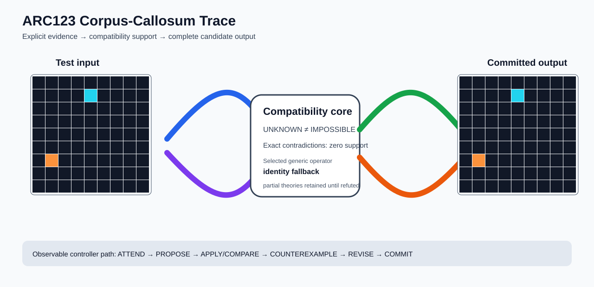

# ARC1 `23581191` P0007 Brain Surgery Report

## Outcome: NO — TEST CELLS DO NOT ALL MATCH

- **Compared positions:** 81
- **Mismatched cells:** 30
- **Training compatibility:** `False`
- **Fallback used:** `True`
- **Causal trace acceptance:** `NO`
- **Selected hypothesis:** `fallback_identity_complete_grid`
- **Source commit:** `085f6dbe39050afac3d1d743f840bac95b1a8d1c`

## Causal Ablations

| Configuration | Exact all-cell result | Training exact | Fallback | Selected hypothesis |
| --- | --- | --- | --- | --- |
| `no_revision` | `False` | `False` | `True` | `fallback_identity_complete_grid` |
| `no_new_residual_family` | `False` | `False` | `True` | `fallback_identity_complete_grid` |

## Live-Agent Boundary

The controller receives only visible training input/output examples and test inputs. It receives no task ID, offline audit label, GT feature record, GT solver, historical decomposition, or held-out output before committing a complete grid. The expected output appears only in the post-answer V&V section.

## Corpus-Callosum Visualization



- Full explicit event record: [`learning_trace.json`](learning_trace.json)
- Full three-configuration record: [`ablations.json`](ablations.json)

## Causal Trace Check

- **Counterexample observed:** `True`
- **Additional visible demonstration selected:** `True`
- **Composition recorded:** `True`
- **Parameter or multi-rule revision:** `False`
- **Generic families in selected theory:** `none`

## Post-Answer V&V

### Test case 1
- **All cells match:** `False`
- **Mismatched cells:** `30`
- **Prediction:**
```json
[[0, 0, 0, 0, 0, 0, 0, 0, 0], [0, 0, 0, 0, 8, 0, 0, 0, 0], [0, 0, 0, 0, 0, 0, 0, 0, 0], [0, 0, 0, 0, 0, 0, 0, 0, 0], [0, 0, 0, 0, 0, 0, 0, 0, 0], [0, 0, 0, 0, 0, 0, 0, 0, 0], [0, 7, 0, 0, 0, 0, 0, 0, 0], [0, 0, 0, 0, 0, 0, 0, 0, 0], [0, 0, 0, 0, 0, 0, 0, 0, 0]]
```
- **Expected output (post-answer only):**
```json
[[0, 7, 0, 0, 8, 0, 0, 0, 0], [8, 2, 8, 8, 8, 8, 8, 8, 8], [0, 7, 0, 0, 8, 0, 0, 0, 0], [0, 7, 0, 0, 8, 0, 0, 0, 0], [0, 7, 0, 0, 8, 0, 0, 0, 0], [0, 7, 0, 0, 8, 0, 0, 0, 0], [7, 7, 7, 7, 2, 7, 7, 7, 7], [0, 7, 0, 0, 8, 0, 0, 0, 0], [0, 7, 0, 0, 8, 0, 0, 0, 0]]
```

## Observable IHL Walkthrough

The record contains explicit actions, predictions, feedback, and revisions; it does not claim or store hidden model reasoning.

### Action totals

- `APPLY_HYPOTHESIS`: 243
- `ATTEND`: 243
- `CHOOSE_NEXT_DEMO`: 243
- `COMMIT`: 1
- `COMPARE`: 243
- `COMPOSE_RULE`: 13
- `EXPLAIN_RESIDUAL`: 13
- `FIND_COUNTEREXAMPLE`: 13
- `PROPOSE`: 1
- `SPECIALIZE`: 116

### Decision milestones

- `0` `PROPOSE` — `{"parent_theory_id":"T0000","rule":{"description_length":1,"name":"identity","operation":"identity","parameters":{},"rule_id":"identity","scope":{"kind":"all","value":null}},"stage":"initial_generic_theories","theory_id":"T0001"}`
- `2` `ATTEND` — `{"reason":"initial_highest_observed_change_and_color_discrimination","selected_demo":0,"selected_region":{"column":2,"row":0},"theory_id":"T0001"}`
- `6` `ATTEND` — `{"reason":"counterexample_requires_visible_conditional_evidence:unseen_demo_selected_for_residual_version_space_discrimination","selected_demo":1,"selected_region":{"column":3,"row":0},"theory_id":"T0001"}`
- `12` `SPECIALIZE` — `{"added_rule":{"description_length":4,"name":"line_extend(direction=up,fill_color=7,seed_color=7)","operation":"full_operator","parameters":{"direction":"up","fill_color":7,"operator":"line_extend","seed_color":7},"rule_id":"structural-line_extend","scope":{"kind":"all","value":null}},"parent_theory_id":"T0001","reason":"unexplained_residual_proposed_generic_structural_rule","theory_id":"T0003"}`
- `13` `SPECIALIZE` — `{"added_rule":{"description_length":4,"name":"line_extend(direction=down,fill_color=8,seed_color=8)","operation":"full_operator","parameters":{"direction":"down","fill_color":8,"operator":"line_extend","seed_color":8},"rule_id":"structural-line_extend","scope":{"kind":"all","value":null}},"parent_theory_id":"T0001","reason":"unexplained_residual_proposed_generic_structural_rule","theory_id":"T0004"}`
- `14` `SPECIALIZE` — `{"added_rule":{"description_length":4,"name":"line_extend(direction=left,fill_color=7,seed_color=7)","operation":"full_operator","parameters":{"direction":"left","fill_color":7,"operator":"line_extend","seed_color":7},"rule_id":"structural-line_extend","scope":{"kind":"all","value":null}},"parent_theory_id":"T0001","reason":"unexplained_residual_proposed_generic_structural_rule","theory_id":"T0005"}`
- `15` `SPECIALIZE` — `{"added_rule":{"description_length":4,"name":"line_extend(direction=right,fill_color=8,seed_color=8)","operation":"full_operator","parameters":{"direction":"right","fill_color":8,"operator":"line_extend","seed_color":8},"rule_id":"structural-line_extend","scope":{"kind":"all","value":null}},"parent_theory_id":"T0001","reason":"unexplained_residual_proposed_generic_structural_rule","theory_id":"T0006"}`
- `16` `SPECIALIZE` — `{"added_rule":{"description_length":4,"name":"line_extend(direction=left,fill_color=8,seed_color=8)","operation":"full_operator","parameters":{"direction":"left","fill_color":8,"operator":"line_extend","seed_color":8},"rule_id":"structural-line_extend","scope":{"kind":"all","value":null}},"parent_theory_id":"T0001","reason":"unexplained_residual_proposed_generic_structural_rule","theory_id":"T0007"}`
- `17` `SPECIALIZE` — `{"added_rule":{"description_length":4,"name":"line_extend(direction=right,fill_color=7,seed_color=7)","operation":"full_operator","parameters":{"direction":"right","fill_color":7,"operator":"line_extend","seed_color":7},"rule_id":"structural-line_extend","scope":{"kind":"all","value":null}},"parent_theory_id":"T0001","reason":"unexplained_residual_proposed_generic_structural_rule","theory_id":"T0008"}`
- `18` `SPECIALIZE` — `{"added_rule":{"description_length":4,"name":"line_extend(direction=up,fill_color=8,seed_color=8)","operation":"full_operator","parameters":{"direction":"up","fill_color":8,"operator":"line_extend","seed_color":8},"rule_id":"structural-line_extend","scope":{"kind":"all","value":null}},"parent_theory_id":"T0001","reason":"unexplained_residual_proposed_generic_structural_rule","theory_id":"T0009"}`
- `19` `SPECIALIZE` — `{"added_rule":{"description_length":4,"name":"line_extend(direction=down,fill_color=7,seed_color=7)","operation":"full_operator","parameters":{"direction":"down","fill_color":7,"operator":"line_extend","seed_color":7},"rule_id":"structural-line_extend","scope":{"kind":"all","value":null}},"parent_theory_id":"T0001","reason":"unexplained_residual_proposed_generic_structural_rule","theory_id":"T0010"}`
- `20` `SPECIALIZE` — `{"added_rule":{"description_length":4,"name":"line_extend(direction=up,fill_color=2,seed_color=7)","operation":"full_operator","parameters":{"direction":"up","fill_color":2,"operator":"line_extend","seed_color":7},"rule_id":"structural-line_extend","scope":{"kind":"all","value":null}},"parent_theory_id":"T0001","reason":"unexplained_residual_proposed_generic_structural_rule","theory_id":"T0011"}`
- `21` `SPECIALIZE` — `{"added_rule":{"description_length":4,"name":"line_extend(direction=right,fill_color=2,seed_color=8)","operation":"full_operator","parameters":{"direction":"right","fill_color":2,"operator":"line_extend","seed_color":8},"rule_id":"structural-line_extend","scope":{"kind":"all","value":null}},"parent_theory_id":"T0001","reason":"unexplained_residual_proposed_generic_structural_rule","theory_id":"T0012"}`
- `22` `SPECIALIZE` — `{"added_rule":{"description_length":4,"name":"line_extend(direction=left,fill_color=2,seed_color=7)","operation":"full_operator","parameters":{"direction":"left","fill_color":2,"operator":"line_extend","seed_color":7},"rule_id":"structural-line_extend","scope":{"kind":"all","value":null}},"parent_theory_id":"T0001","reason":"unexplained_residual_proposed_generic_structural_rule","theory_id":"T0013"}`
- `23` `SPECIALIZE` — `{"added_rule":{"description_length":4,"name":"line_extend(direction=down,fill_color=2,seed_color=8)","operation":"full_operator","parameters":{"direction":"down","fill_color":2,"operator":"line_extend","seed_color":8},"rule_id":"structural-line_extend","scope":{"kind":"all","value":null}},"parent_theory_id":"T0001","reason":"unexplained_residual_proposed_generic_structural_rule","theory_id":"T0014"}`
- `25` `ATTEND` — `{"reason":"initial_highest_observed_change_and_color_discrimination","selected_demo":0,"selected_region":{"column":0,"row":0},"theory_id":"T0002"}`
- `29` `ATTEND` — `{"reason":"initial_highest_observed_change_and_color_discrimination","selected_demo":0,"selected_region":{"column":2,"row":0},"theory_id":"T0003"}`
- `33` `ATTEND` — `{"reason":"initial_highest_observed_change_and_color_discrimination","selected_demo":0,"selected_region":{"column":2,"row":0},"theory_id":"T0004"}`
- `37` `ATTEND` — `{"reason":"initial_highest_observed_change_and_color_discrimination","selected_demo":0,"selected_region":{"column":2,"row":0},"theory_id":"T0005"}`
- `41` `ATTEND` — `{"reason":"initial_highest_observed_change_and_color_discrimination","selected_demo":0,"selected_region":{"column":2,"row":0},"theory_id":"T0006"}`
- `45` `ATTEND` — `{"reason":"initial_highest_observed_change_and_color_discrimination","selected_demo":0,"selected_region":{"column":2,"row":0},"theory_id":"T0007"}`
- `49` `ATTEND` — `{"reason":"initial_highest_observed_change_and_color_discrimination","selected_demo":0,"selected_region":{"column":2,"row":0},"theory_id":"T0008"}`
- `53` `ATTEND` — `{"reason":"initial_highest_observed_change_and_color_discrimination","selected_demo":0,"selected_region":{"column":6,"row":0},"theory_id":"T0009"}`
- `57` `ATTEND` — `{"reason":"initial_highest_observed_change_and_color_discrimination","selected_demo":0,"selected_region":{"column":2,"row":0},"theory_id":"T0010"}`
- `61` `ATTEND` — `{"reason":"initial_highest_observed_change_and_color_discrimination","selected_demo":0,"selected_region":{"column":2,"row":0},"theory_id":"T0011"}`
- `65` `ATTEND` — `{"reason":"initial_highest_observed_change_and_color_discrimination","selected_demo":0,"selected_region":{"column":2,"row":0},"theory_id":"T0012"}`
- `69` `ATTEND` — `{"reason":"initial_highest_observed_change_and_color_discrimination","selected_demo":0,"selected_region":{"column":2,"row":0},"theory_id":"T0013"}`
- `73` `ATTEND` — `{"reason":"counterexample_requires_visible_conditional_evidence:unseen_demo_selected_for_residual_version_space_discrimination","selected_demo":1,"selected_region":{"column":3,"row":0},"theory_id":"T0003"}`
- `77` `ATTEND` — `{"reason":"counterexample_requires_visible_conditional_evidence:unseen_demo_selected_for_residual_version_space_discrimination","selected_demo":1,"selected_region":{"column":3,"row":0},"theory_id":"T0004"}`
- `81` `ATTEND` — `{"reason":"counterexample_requires_visible_conditional_evidence:unseen_demo_selected_for_residual_version_space_discrimination","selected_demo":1,"selected_region":{"column":3,"row":0},"theory_id":"T0005"}`
- `85` `ATTEND` — `{"reason":"counterexample_requires_visible_conditional_evidence:unseen_demo_selected_for_residual_version_space_discrimination","selected_demo":1,"selected_region":{"column":3,"row":0},"theory_id":"T0006"}`
- `89` `ATTEND` — `{"reason":"counterexample_requires_visible_conditional_evidence:unseen_demo_selected_for_residual_version_space_discrimination","selected_demo":1,"selected_region":{"column":3,"row":0},"theory_id":"T0007"}`
- `93` `ATTEND` — `{"reason":"counterexample_requires_visible_conditional_evidence:unseen_demo_selected_for_residual_version_space_discrimination","selected_demo":1,"selected_region":{"column":3,"row":0},"theory_id":"T0008"}`
- `97` `ATTEND` — `{"reason":"counterexample_requires_visible_conditional_evidence:unseen_demo_selected_for_residual_version_space_discrimination","selected_demo":1,"selected_region":{"column":6,"row":0},"theory_id":"T0009"}`
- `101` `ATTEND` — `{"reason":"counterexample_requires_visible_conditional_evidence:unseen_demo_selected_for_residual_version_space_discrimination","selected_demo":1,"selected_region":{"column":3,"row":0},"theory_id":"T0010"}`
- `105` `ATTEND` — `{"reason":"counterexample_requires_visible_conditional_evidence:unseen_demo_selected_for_residual_version_space_discrimination","selected_demo":1,"selected_region":{"column":3,"row":0},"theory_id":"T0011"}`
- `109` `ATTEND` — `{"reason":"counterexample_requires_visible_conditional_evidence:unseen_demo_selected_for_residual_version_space_discrimination","selected_demo":1,"selected_region":{"column":3,"row":0},"theory_id":"T0012"}`
- `113` `ATTEND` — `{"reason":"counterexample_requires_visible_conditional_evidence:unseen_demo_selected_for_residual_version_space_discrimination","selected_demo":1,"selected_region":{"column":3,"row":0},"theory_id":"T0013"}`
- `119` `SPECIALIZE` — `{"added_rule":{"description_length":4,"name":"line_extend(direction=down,fill_color=8,seed_color=8)","operation":"full_operator","parameters":{"direction":"down","fill_color":8,"operator":"line_extend","seed_color":8},"rule_id":"structural-line_extend","scope":{"kind":"all","value":null}},"parent_theory_id":"T0003","reason":"unexplained_residual_proposed_generic_structural_rule","theory_id":"T0016"}`
- `120` `SPECIALIZE` — `{"added_rule":{"description_length":4,"name":"line_extend(direction=left,fill_color=7,seed_color=7)","operation":"full_operator","parameters":{"direction":"left","fill_color":7,"operator":"line_extend","seed_color":7},"rule_id":"structural-line_extend","scope":{"kind":"all","value":null}},"parent_theory_id":"T0003","reason":"unexplained_residual_proposed_generic_structural_rule","theory_id":"T0017"}`
- `121` `SPECIALIZE` — `{"added_rule":{"description_length":4,"name":"line_extend(direction=right,fill_color=8,seed_color=8)","operation":"full_operator","parameters":{"direction":"right","fill_color":8,"operator":"line_extend","seed_color":8},"rule_id":"structural-line_extend","scope":{"kind":"all","value":null}},"parent_theory_id":"T0003","reason":"unexplained_residual_proposed_generic_structural_rule","theory_id":"T0018"}`
- `122` `SPECIALIZE` — `{"added_rule":{"description_length":4,"name":"line_extend(direction=left,fill_color=8,seed_color=8)","operation":"full_operator","parameters":{"direction":"left","fill_color":8,"operator":"line_extend","seed_color":8},"rule_id":"structural-line_extend","scope":{"kind":"all","value":null}},"parent_theory_id":"T0003","reason":"unexplained_residual_proposed_generic_structural_rule","theory_id":"T0019"}`
- `123` `SPECIALIZE` — `{"added_rule":{"description_length":4,"name":"line_extend(direction=right,fill_color=7,seed_color=7)","operation":"full_operator","parameters":{"direction":"right","fill_color":7,"operator":"line_extend","seed_color":7},"rule_id":"structural-line_extend","scope":{"kind":"all","value":null}},"parent_theory_id":"T0003","reason":"unexplained_residual_proposed_generic_structural_rule","theory_id":"T0020"}`
- `124` `SPECIALIZE` — `{"added_rule":{"description_length":4,"name":"line_extend(direction=up,fill_color=8,seed_color=8)","operation":"full_operator","parameters":{"direction":"up","fill_color":8,"operator":"line_extend","seed_color":8},"rule_id":"structural-line_extend","scope":{"kind":"all","value":null}},"parent_theory_id":"T0003","reason":"unexplained_residual_proposed_generic_structural_rule","theory_id":"T0021"}`
- `125` `SPECIALIZE` — `{"added_rule":{"description_length":4,"name":"line_extend(direction=down,fill_color=7,seed_color=7)","operation":"full_operator","parameters":{"direction":"down","fill_color":7,"operator":"line_extend","seed_color":7},"rule_id":"structural-line_extend","scope":{"kind":"all","value":null}},"parent_theory_id":"T0003","reason":"unexplained_residual_proposed_generic_structural_rule","theory_id":"T0022"}`
- `126` `SPECIALIZE` — `{"added_rule":{"description_length":4,"name":"line_extend(direction=up,fill_color=2,seed_color=7)","operation":"full_operator","parameters":{"direction":"up","fill_color":2,"operator":"line_extend","seed_color":7},"rule_id":"structural-line_extend","scope":{"kind":"all","value":null}},"parent_theory_id":"T0003","reason":"unexplained_residual_proposed_generic_structural_rule","theory_id":"T0023"}`
- `127` `SPECIALIZE` — `{"added_rule":{"description_length":4,"name":"line_extend(direction=right,fill_color=2,seed_color=8)","operation":"full_operator","parameters":{"direction":"right","fill_color":2,"operator":"line_extend","seed_color":8},"rule_id":"structural-line_extend","scope":{"kind":"all","value":null}},"parent_theory_id":"T0003","reason":"unexplained_residual_proposed_generic_structural_rule","theory_id":"T0024"}`
- `128` `SPECIALIZE` — `{"added_rule":{"description_length":4,"name":"line_extend(direction=left,fill_color=2,seed_color=7)","operation":"full_operator","parameters":{"direction":"left","fill_color":2,"operator":"line_extend","seed_color":7},"rule_id":"structural-line_extend","scope":{"kind":"all","value":null}},"parent_theory_id":"T0003","reason":"unexplained_residual_proposed_generic_structural_rule","theory_id":"T0025"}`
- `129` `SPECIALIZE` — `{"added_rule":{"description_length":4,"name":"line_extend(direction=down,fill_color=2,seed_color=8)","operation":"full_operator","parameters":{"direction":"down","fill_color":2,"operator":"line_extend","seed_color":8},"rule_id":"structural-line_extend","scope":{"kind":"all","value":null}},"parent_theory_id":"T0003","reason":"unexplained_residual_proposed_generic_structural_rule","theory_id":"T0026"}`
- `131` `ATTEND` — `{"reason":"initial_highest_observed_change_and_color_discrimination","selected_demo":0,"selected_region":{"column":0,"row":0},"theory_id":"T0015"}`
- `135` `ATTEND` — `{"reason":"initial_highest_observed_change_and_color_discrimination","selected_demo":0,"selected_region":{"column":2,"row":0},"theory_id":"T0016"}`
- `139` `ATTEND` — `{"reason":"initial_highest_observed_change_and_color_discrimination","selected_demo":0,"selected_region":{"column":2,"row":0},"theory_id":"T0017"}`
- `143` `ATTEND` — `{"reason":"initial_highest_observed_change_and_color_discrimination","selected_demo":0,"selected_region":{"column":2,"row":0},"theory_id":"T0018"}`
- `147` `ATTEND` — `{"reason":"initial_highest_observed_change_and_color_discrimination","selected_demo":0,"selected_region":{"column":2,"row":0},"theory_id":"T0019"}`
- `151` `ATTEND` — `{"reason":"initial_highest_observed_change_and_color_discrimination","selected_demo":0,"selected_region":{"column":2,"row":0},"theory_id":"T0020"}`
- `155` `ATTEND` — `{"reason":"initial_highest_observed_change_and_color_discrimination","selected_demo":0,"selected_region":{"column":6,"row":0},"theory_id":"T0021"}`
- `159` `ATTEND` — `{"reason":"initial_highest_observed_change_and_color_discrimination","selected_demo":0,"selected_region":{"column":2,"row":0},"theory_id":"T0022"}`
- `163` `ATTEND` — `{"reason":"initial_highest_observed_change_and_color_discrimination","selected_demo":0,"selected_region":{"column":2,"row":0},"theory_id":"T0023"}`
- `167` `ATTEND` — `{"reason":"initial_highest_observed_change_and_color_discrimination","selected_demo":0,"selected_region":{"column":2,"row":0},"theory_id":"T0024"}`
- `171` `ATTEND` — `{"reason":"initial_highest_observed_change_and_color_discrimination","selected_demo":0,"selected_region":{"column":2,"row":0},"theory_id":"T0025"}`
- `175` `ATTEND` — `{"reason":"initial_highest_observed_change_and_color_discrimination","selected_demo":0,"selected_region":{"column":2,"row":0},"theory_id":"T0026"}`
- `179` `ATTEND` — `{"reason":"counterexample_requires_visible_conditional_evidence:unseen_demo_selected_for_residual_version_space_discrimination","selected_demo":1,"selected_region":{"column":3,"row":0},"theory_id":"T0016"}`
- `183` `ATTEND` — `{"reason":"counterexample_requires_visible_conditional_evidence:unseen_demo_selected_for_residual_version_space_discrimination","selected_demo":1,"selected_region":{"column":3,"row":0},"theory_id":"T0017"}`
- `187` `ATTEND` — `{"reason":"counterexample_requires_visible_conditional_evidence:unseen_demo_selected_for_residual_version_space_discrimination","selected_demo":1,"selected_region":{"column":3,"row":0},"theory_id":"T0018"}`
- `191` `ATTEND` — `{"reason":"counterexample_requires_visible_conditional_evidence:unseen_demo_selected_for_residual_version_space_discrimination","selected_demo":1,"selected_region":{"column":3,"row":0},"theory_id":"T0019"}`
- `195` `ATTEND` — `{"reason":"counterexample_requires_visible_conditional_evidence:unseen_demo_selected_for_residual_version_space_discrimination","selected_demo":1,"selected_region":{"column":3,"row":0},"theory_id":"T0020"}`
- `199` `ATTEND` — `{"reason":"counterexample_requires_visible_conditional_evidence:unseen_demo_selected_for_residual_version_space_discrimination","selected_demo":1,"selected_region":{"column":6,"row":0},"theory_id":"T0021"}`
- `203` `ATTEND` — `{"reason":"counterexample_requires_visible_conditional_evidence:unseen_demo_selected_for_residual_version_space_discrimination","selected_demo":1,"selected_region":{"column":3,"row":0},"theory_id":"T0022"}`
- `207` `ATTEND` — `{"reason":"counterexample_requires_visible_conditional_evidence:unseen_demo_selected_for_residual_version_space_discrimination","selected_demo":1,"selected_region":{"column":3,"row":0},"theory_id":"T0023"}`
- `211` `ATTEND` — `{"reason":"counterexample_requires_visible_conditional_evidence:unseen_demo_selected_for_residual_version_space_discrimination","selected_demo":1,"selected_region":{"column":3,"row":0},"theory_id":"T0024"}`
- `215` `ATTEND` — `{"reason":"counterexample_requires_visible_conditional_evidence:unseen_demo_selected_for_residual_version_space_discrimination","selected_demo":1,"selected_region":{"column":3,"row":0},"theory_id":"T0025"}`
- `219` `ATTEND` — `{"reason":"counterexample_requires_visible_conditional_evidence:unseen_demo_selected_for_residual_version_space_discrimination","selected_demo":1,"selected_region":{"column":3,"row":0},"theory_id":"T0026"}`
- `225` `SPECIALIZE` — `{"added_rule":{"description_length":4,"name":"line_extend(direction=left,fill_color=7,seed_color=7)","operation":"full_operator","parameters":{"direction":"left","fill_color":7,"operator":"line_extend","seed_color":7},"rule_id":"structural-line_extend","scope":{"kind":"all","value":null}},"parent_theory_id":"T0016","reason":"unexplained_residual_proposed_generic_structural_rule","theory_id":"T0028"}`
- `226` `SPECIALIZE` — `{"added_rule":{"description_length":4,"name":"line_extend(direction=right,fill_color=8,seed_color=8)","operation":"full_operator","parameters":{"direction":"right","fill_color":8,"operator":"line_extend","seed_color":8},"rule_id":"structural-line_extend","scope":{"kind":"all","value":null}},"parent_theory_id":"T0016","reason":"unexplained_residual_proposed_generic_structural_rule","theory_id":"T0029"}`
- `227` `SPECIALIZE` — `{"added_rule":{"description_length":4,"name":"line_extend(direction=left,fill_color=8,seed_color=8)","operation":"full_operator","parameters":{"direction":"left","fill_color":8,"operator":"line_extend","seed_color":8},"rule_id":"structural-line_extend","scope":{"kind":"all","value":null}},"parent_theory_id":"T0016","reason":"unexplained_residual_proposed_generic_structural_rule","theory_id":"T0030"}`
- `228` `SPECIALIZE` — `{"added_rule":{"description_length":4,"name":"line_extend(direction=right,fill_color=7,seed_color=7)","operation":"full_operator","parameters":{"direction":"right","fill_color":7,"operator":"line_extend","seed_color":7},"rule_id":"structural-line_extend","scope":{"kind":"all","value":null}},"parent_theory_id":"T0016","reason":"unexplained_residual_proposed_generic_structural_rule","theory_id":"T0031"}`
- `229` `SPECIALIZE` — `{"added_rule":{"description_length":4,"name":"line_extend(direction=up,fill_color=8,seed_color=8)","operation":"full_operator","parameters":{"direction":"up","fill_color":8,"operator":"line_extend","seed_color":8},"rule_id":"structural-line_extend","scope":{"kind":"all","value":null}},"parent_theory_id":"T0016","reason":"unexplained_residual_proposed_generic_structural_rule","theory_id":"T0032"}`
- `230` `SPECIALIZE` — `{"added_rule":{"description_length":4,"name":"line_extend(direction=down,fill_color=7,seed_color=7)","operation":"full_operator","parameters":{"direction":"down","fill_color":7,"operator":"line_extend","seed_color":7},"rule_id":"structural-line_extend","scope":{"kind":"all","value":null}},"parent_theory_id":"T0016","reason":"unexplained_residual_proposed_generic_structural_rule","theory_id":"T0033"}`
- `231` `SPECIALIZE` — `{"added_rule":{"description_length":4,"name":"line_extend(direction=up,fill_color=2,seed_color=7)","operation":"full_operator","parameters":{"direction":"up","fill_color":2,"operator":"line_extend","seed_color":7},"rule_id":"structural-line_extend","scope":{"kind":"all","value":null}},"parent_theory_id":"T0016","reason":"unexplained_residual_proposed_generic_structural_rule","theory_id":"T0034"}`
- `232` `SPECIALIZE` — `{"added_rule":{"description_length":4,"name":"line_extend(direction=right,fill_color=2,seed_color=8)","operation":"full_operator","parameters":{"direction":"right","fill_color":2,"operator":"line_extend","seed_color":8},"rule_id":"structural-line_extend","scope":{"kind":"all","value":null}},"parent_theory_id":"T0016","reason":"unexplained_residual_proposed_generic_structural_rule","theory_id":"T0035"}`
- `233` `SPECIALIZE` — `{"added_rule":{"description_length":4,"name":"line_extend(direction=left,fill_color=2,seed_color=7)","operation":"full_operator","parameters":{"direction":"left","fill_color":2,"operator":"line_extend","seed_color":7},"rule_id":"structural-line_extend","scope":{"kind":"all","value":null}},"parent_theory_id":"T0016","reason":"unexplained_residual_proposed_generic_structural_rule","theory_id":"T0036"}`
- `234` `SPECIALIZE` — `{"added_rule":{"description_length":4,"name":"line_extend(direction=down,fill_color=2,seed_color=8)","operation":"full_operator","parameters":{"direction":"down","fill_color":2,"operator":"line_extend","seed_color":8},"rule_id":"structural-line_extend","scope":{"kind":"all","value":null}},"parent_theory_id":"T0016","reason":"unexplained_residual_proposed_generic_structural_rule","theory_id":"T0037"}`
- `236` `ATTEND` — `{"reason":"initial_highest_observed_change_and_color_discrimination","selected_demo":0,"selected_region":{"column":0,"row":0},"theory_id":"T0027"}`
- `240` `ATTEND` — `{"reason":"initial_highest_observed_change_and_color_discrimination","selected_demo":0,"selected_region":{"column":2,"row":0},"theory_id":"T0028"}`
- `244` `ATTEND` — `{"reason":"initial_highest_observed_change_and_color_discrimination","selected_demo":0,"selected_region":{"column":2,"row":0},"theory_id":"T0029"}`
- `248` `ATTEND` — `{"reason":"initial_highest_observed_change_and_color_discrimination","selected_demo":0,"selected_region":{"column":2,"row":0},"theory_id":"T0030"}`
- `252` `ATTEND` — `{"reason":"initial_highest_observed_change_and_color_discrimination","selected_demo":0,"selected_region":{"column":2,"row":0},"theory_id":"T0031"}`
- `256` `ATTEND` — `{"reason":"initial_highest_observed_change_and_color_discrimination","selected_demo":0,"selected_region":{"column":6,"row":0},"theory_id":"T0032"}`
- `260` `ATTEND` — `{"reason":"initial_highest_observed_change_and_color_discrimination","selected_demo":0,"selected_region":{"column":2,"row":0},"theory_id":"T0033"}`
- `264` `ATTEND` — `{"reason":"initial_highest_observed_change_and_color_discrimination","selected_demo":0,"selected_region":{"column":2,"row":0},"theory_id":"T0034"}`
- `268` `ATTEND` — `{"reason":"initial_highest_observed_change_and_color_discrimination","selected_demo":0,"selected_region":{"column":2,"row":0},"theory_id":"T0035"}`
- `272` `ATTEND` — `{"reason":"initial_highest_observed_change_and_color_discrimination","selected_demo":0,"selected_region":{"column":2,"row":0},"theory_id":"T0036"}`
- `276` `ATTEND` — `{"reason":"initial_highest_observed_change_and_color_discrimination","selected_demo":0,"selected_region":{"column":2,"row":0},"theory_id":"T0037"}`
- `280` `ATTEND` — `{"reason":"counterexample_requires_visible_conditional_evidence:unseen_demo_selected_for_residual_version_space_discrimination","selected_demo":1,"selected_region":{"column":3,"row":0},"theory_id":"T0028"}`
- `284` `ATTEND` — `{"reason":"counterexample_requires_visible_conditional_evidence:unseen_demo_selected_for_residual_version_space_discrimination","selected_demo":1,"selected_region":{"column":3,"row":0},"theory_id":"T0029"}`
- `288` `ATTEND` — `{"reason":"counterexample_requires_visible_conditional_evidence:unseen_demo_selected_for_residual_version_space_discrimination","selected_demo":1,"selected_region":{"column":3,"row":0},"theory_id":"T0030"}`
- `292` `ATTEND` — `{"reason":"counterexample_requires_visible_conditional_evidence:unseen_demo_selected_for_residual_version_space_discrimination","selected_demo":1,"selected_region":{"column":3,"row":0},"theory_id":"T0031"}`
- `296` `ATTEND` — `{"reason":"counterexample_requires_visible_conditional_evidence:unseen_demo_selected_for_residual_version_space_discrimination","selected_demo":1,"selected_region":{"column":6,"row":0},"theory_id":"T0032"}`
- `300` `ATTEND` — `{"reason":"counterexample_requires_visible_conditional_evidence:unseen_demo_selected_for_residual_version_space_discrimination","selected_demo":1,"selected_region":{"column":3,"row":0},"theory_id":"T0033"}`
- `304` `ATTEND` — `{"reason":"counterexample_requires_visible_conditional_evidence:unseen_demo_selected_for_residual_version_space_discrimination","selected_demo":1,"selected_region":{"column":3,"row":0},"theory_id":"T0034"}`
- `308` `ATTEND` — `{"reason":"counterexample_requires_visible_conditional_evidence:unseen_demo_selected_for_residual_version_space_discrimination","selected_demo":1,"selected_region":{"column":3,"row":0},"theory_id":"T0035"}`
- `312` `ATTEND` — `{"reason":"counterexample_requires_visible_conditional_evidence:unseen_demo_selected_for_residual_version_space_discrimination","selected_demo":1,"selected_region":{"column":3,"row":0},"theory_id":"T0036"}`
- `316` `ATTEND` — `{"reason":"counterexample_requires_visible_conditional_evidence:unseen_demo_selected_for_residual_version_space_discrimination","selected_demo":1,"selected_region":{"column":3,"row":0},"theory_id":"T0037"}`
- `322` `SPECIALIZE` — `{"added_rule":{"description_length":4,"name":"line_extend(direction=down,fill_color=8,seed_color=8)","operation":"full_operator","parameters":{"direction":"down","fill_color":8,"operator":"line_extend","seed_color":8},"rule_id":"structural-line_extend","scope":{"kind":"all","value":null}},"parent_theory_id":"T0017","reason":"unexplained_residual_proposed_generic_structural_rule","theory_id":"T0039"}`
- `323` `SPECIALIZE` — `{"added_rule":{"description_length":4,"name":"line_extend(direction=right,fill_color=8,seed_color=8)","operation":"full_operator","parameters":{"direction":"right","fill_color":8,"operator":"line_extend","seed_color":8},"rule_id":"structural-line_extend","scope":{"kind":"all","value":null}},"parent_theory_id":"T0017","reason":"unexplained_residual_proposed_generic_structural_rule","theory_id":"T0040"}`
- `324` `SPECIALIZE` — `{"added_rule":{"description_length":4,"name":"line_extend(direction=left,fill_color=8,seed_color=8)","operation":"full_operator","parameters":{"direction":"left","fill_color":8,"operator":"line_extend","seed_color":8},"rule_id":"structural-line_extend","scope":{"kind":"all","value":null}},"parent_theory_id":"T0017","reason":"unexplained_residual_proposed_generic_structural_rule","theory_id":"T0041"}`
- `325` `SPECIALIZE` — `{"added_rule":{"description_length":4,"name":"line_extend(direction=right,fill_color=7,seed_color=7)","operation":"full_operator","parameters":{"direction":"right","fill_color":7,"operator":"line_extend","seed_color":7},"rule_id":"structural-line_extend","scope":{"kind":"all","value":null}},"parent_theory_id":"T0017","reason":"unexplained_residual_proposed_generic_structural_rule","theory_id":"T0042"}`
- `326` `SPECIALIZE` — `{"added_rule":{"description_length":4,"name":"line_extend(direction=up,fill_color=8,seed_color=8)","operation":"full_operator","parameters":{"direction":"up","fill_color":8,"operator":"line_extend","seed_color":8},"rule_id":"structural-line_extend","scope":{"kind":"all","value":null}},"parent_theory_id":"T0017","reason":"unexplained_residual_proposed_generic_structural_rule","theory_id":"T0043"}`
- `327` `SPECIALIZE` — `{"added_rule":{"description_length":4,"name":"line_extend(direction=down,fill_color=7,seed_color=7)","operation":"full_operator","parameters":{"direction":"down","fill_color":7,"operator":"line_extend","seed_color":7},"rule_id":"structural-line_extend","scope":{"kind":"all","value":null}},"parent_theory_id":"T0017","reason":"unexplained_residual_proposed_generic_structural_rule","theory_id":"T0044"}`
- `328` `SPECIALIZE` — `{"added_rule":{"description_length":4,"name":"line_extend(direction=up,fill_color=2,seed_color=7)","operation":"full_operator","parameters":{"direction":"up","fill_color":2,"operator":"line_extend","seed_color":7},"rule_id":"structural-line_extend","scope":{"kind":"all","value":null}},"parent_theory_id":"T0017","reason":"unexplained_residual_proposed_generic_structural_rule","theory_id":"T0045"}`
- `329` `SPECIALIZE` — `{"added_rule":{"description_length":4,"name":"line_extend(direction=right,fill_color=2,seed_color=8)","operation":"full_operator","parameters":{"direction":"right","fill_color":2,"operator":"line_extend","seed_color":8},"rule_id":"structural-line_extend","scope":{"kind":"all","value":null}},"parent_theory_id":"T0017","reason":"unexplained_residual_proposed_generic_structural_rule","theory_id":"T0046"}`
- `330` `SPECIALIZE` — `{"added_rule":{"description_length":4,"name":"line_extend(direction=left,fill_color=2,seed_color=7)","operation":"full_operator","parameters":{"direction":"left","fill_color":2,"operator":"line_extend","seed_color":7},"rule_id":"structural-line_extend","scope":{"kind":"all","value":null}},"parent_theory_id":"T0017","reason":"unexplained_residual_proposed_generic_structural_rule","theory_id":"T0047"}`
- `331` `SPECIALIZE` — `{"added_rule":{"description_length":4,"name":"line_extend(direction=down,fill_color=2,seed_color=8)","operation":"full_operator","parameters":{"direction":"down","fill_color":2,"operator":"line_extend","seed_color":8},"rule_id":"structural-line_extend","scope":{"kind":"all","value":null}},"parent_theory_id":"T0017","reason":"unexplained_residual_proposed_generic_structural_rule","theory_id":"T0048"}`
- `333` `ATTEND` — `{"reason":"initial_highest_observed_change_and_color_discrimination","selected_demo":0,"selected_region":{"column":0,"row":0},"theory_id":"T0038"}`
- `337` `ATTEND` — `{"reason":"initial_highest_observed_change_and_color_discrimination","selected_demo":0,"selected_region":{"column":2,"row":0},"theory_id":"T0039"}`
- `341` `ATTEND` — `{"reason":"initial_highest_observed_change_and_color_discrimination","selected_demo":0,"selected_region":{"column":2,"row":0},"theory_id":"T0040"}`
- `345` `ATTEND` — `{"reason":"initial_highest_observed_change_and_color_discrimination","selected_demo":0,"selected_region":{"column":2,"row":0},"theory_id":"T0041"}`
- `349` `ATTEND` — `{"reason":"initial_highest_observed_change_and_color_discrimination","selected_demo":0,"selected_region":{"column":2,"row":0},"theory_id":"T0042"}`
- `353` `ATTEND` — `{"reason":"initial_highest_observed_change_and_color_discrimination","selected_demo":0,"selected_region":{"column":6,"row":0},"theory_id":"T0043"}`
- `357` `ATTEND` — `{"reason":"initial_highest_observed_change_and_color_discrimination","selected_demo":0,"selected_region":{"column":2,"row":0},"theory_id":"T0044"}`
- `361` `ATTEND` — `{"reason":"initial_highest_observed_change_and_color_discrimination","selected_demo":0,"selected_region":{"column":2,"row":0},"theory_id":"T0045"}`
- `365` `ATTEND` — `{"reason":"initial_highest_observed_change_and_color_discrimination","selected_demo":0,"selected_region":{"column":2,"row":0},"theory_id":"T0046"}`
- `369` `ATTEND` — `{"reason":"initial_highest_observed_change_and_color_discrimination","selected_demo":0,"selected_region":{"column":2,"row":0},"theory_id":"T0047"}`
- `373` `ATTEND` — `{"reason":"initial_highest_observed_change_and_color_discrimination","selected_demo":0,"selected_region":{"column":2,"row":0},"theory_id":"T0048"}`
- `377` `ATTEND` — `{"reason":"counterexample_requires_visible_conditional_evidence:unseen_demo_selected_for_residual_version_space_discrimination","selected_demo":1,"selected_region":{"column":3,"row":0},"theory_id":"T0039"}`
- `381` `ATTEND` — `{"reason":"counterexample_requires_visible_conditional_evidence:unseen_demo_selected_for_residual_version_space_discrimination","selected_demo":1,"selected_region":{"column":3,"row":0},"theory_id":"T0040"}`
- `385` `ATTEND` — `{"reason":"counterexample_requires_visible_conditional_evidence:unseen_demo_selected_for_residual_version_space_discrimination","selected_demo":1,"selected_region":{"column":3,"row":0},"theory_id":"T0041"}`
- `389` `ATTEND` — `{"reason":"counterexample_requires_visible_conditional_evidence:unseen_demo_selected_for_residual_version_space_discrimination","selected_demo":1,"selected_region":{"column":3,"row":0},"theory_id":"T0042"}`
- `393` `ATTEND` — `{"reason":"counterexample_requires_visible_conditional_evidence:unseen_demo_selected_for_residual_version_space_discrimination","selected_demo":1,"selected_region":{"column":6,"row":0},"theory_id":"T0043"}`
- `397` `ATTEND` — `{"reason":"counterexample_requires_visible_conditional_evidence:unseen_demo_selected_for_residual_version_space_discrimination","selected_demo":1,"selected_region":{"column":3,"row":0},"theory_id":"T0044"}`
- `401` `ATTEND` — `{"reason":"counterexample_requires_visible_conditional_evidence:unseen_demo_selected_for_residual_version_space_discrimination","selected_demo":1,"selected_region":{"column":3,"row":0},"theory_id":"T0045"}`
- `405` `ATTEND` — `{"reason":"counterexample_requires_visible_conditional_evidence:unseen_demo_selected_for_residual_version_space_discrimination","selected_demo":1,"selected_region":{"column":3,"row":0},"theory_id":"T0046"}`
- `409` `ATTEND` — `{"reason":"counterexample_requires_visible_conditional_evidence:unseen_demo_selected_for_residual_version_space_discrimination","selected_demo":1,"selected_region":{"column":3,"row":0},"theory_id":"T0047"}`
- `413` `ATTEND` — `{"reason":"counterexample_requires_visible_conditional_evidence:unseen_demo_selected_for_residual_version_space_discrimination","selected_demo":1,"selected_region":{"column":3,"row":0},"theory_id":"T0048"}`
- `419` `SPECIALIZE` — `{"added_rule":{"description_length":4,"name":"line_extend(direction=right,fill_color=8,seed_color=8)","operation":"full_operator","parameters":{"direction":"right","fill_color":8,"operator":"line_extend","seed_color":8},"rule_id":"structural-line_extend","scope":{"kind":"all","value":null}},"parent_theory_id":"T0039","reason":"unexplained_residual_proposed_generic_structural_rule","theory_id":"T0050"}`
- `420` `SPECIALIZE` — `{"added_rule":{"description_length":4,"name":"line_extend(direction=left,fill_color=8,seed_color=8)","operation":"full_operator","parameters":{"direction":"left","fill_color":8,"operator":"line_extend","seed_color":8},"rule_id":"structural-line_extend","scope":{"kind":"all","value":null}},"parent_theory_id":"T0039","reason":"unexplained_residual_proposed_generic_structural_rule","theory_id":"T0051"}`
- `421` `SPECIALIZE` — `{"added_rule":{"description_length":4,"name":"line_extend(direction=right,fill_color=7,seed_color=7)","operation":"full_operator","parameters":{"direction":"right","fill_color":7,"operator":"line_extend","seed_color":7},"rule_id":"structural-line_extend","scope":{"kind":"all","value":null}},"parent_theory_id":"T0039","reason":"unexplained_residual_proposed_generic_structural_rule","theory_id":"T0052"}`
- `422` `SPECIALIZE` — `{"added_rule":{"description_length":4,"name":"line_extend(direction=up,fill_color=8,seed_color=8)","operation":"full_operator","parameters":{"direction":"up","fill_color":8,"operator":"line_extend","seed_color":8},"rule_id":"structural-line_extend","scope":{"kind":"all","value":null}},"parent_theory_id":"T0039","reason":"unexplained_residual_proposed_generic_structural_rule","theory_id":"T0053"}`
- `423` `SPECIALIZE` — `{"added_rule":{"description_length":4,"name":"line_extend(direction=down,fill_color=7,seed_color=7)","operation":"full_operator","parameters":{"direction":"down","fill_color":7,"operator":"line_extend","seed_color":7},"rule_id":"structural-line_extend","scope":{"kind":"all","value":null}},"parent_theory_id":"T0039","reason":"unexplained_residual_proposed_generic_structural_rule","theory_id":"T0054"}`
- `424` `SPECIALIZE` — `{"added_rule":{"description_length":4,"name":"line_extend(direction=up,fill_color=2,seed_color=7)","operation":"full_operator","parameters":{"direction":"up","fill_color":2,"operator":"line_extend","seed_color":7},"rule_id":"structural-line_extend","scope":{"kind":"all","value":null}},"parent_theory_id":"T0039","reason":"unexplained_residual_proposed_generic_structural_rule","theory_id":"T0055"}`
- `425` `SPECIALIZE` — `{"added_rule":{"description_length":4,"name":"line_extend(direction=right,fill_color=2,seed_color=8)","operation":"full_operator","parameters":{"direction":"right","fill_color":2,"operator":"line_extend","seed_color":8},"rule_id":"structural-line_extend","scope":{"kind":"all","value":null}},"parent_theory_id":"T0039","reason":"unexplained_residual_proposed_generic_structural_rule","theory_id":"T0056"}`
- `426` `SPECIALIZE` — `{"added_rule":{"description_length":4,"name":"line_extend(direction=left,fill_color=2,seed_color=7)","operation":"full_operator","parameters":{"direction":"left","fill_color":2,"operator":"line_extend","seed_color":7},"rule_id":"structural-line_extend","scope":{"kind":"all","value":null}},"parent_theory_id":"T0039","reason":"unexplained_residual_proposed_generic_structural_rule","theory_id":"T0057"}`
- `427` `SPECIALIZE` — `{"added_rule":{"description_length":4,"name":"line_extend(direction=down,fill_color=2,seed_color=8)","operation":"full_operator","parameters":{"direction":"down","fill_color":2,"operator":"line_extend","seed_color":8},"rule_id":"structural-line_extend","scope":{"kind":"all","value":null}},"parent_theory_id":"T0039","reason":"unexplained_residual_proposed_generic_structural_rule","theory_id":"T0058"}`
- `429` `ATTEND` — `{"reason":"initial_highest_observed_change_and_color_discrimination","selected_demo":0,"selected_region":{"column":0,"row":0},"theory_id":"T0049"}`
- `433` `ATTEND` — `{"reason":"initial_highest_observed_change_and_color_discrimination","selected_demo":0,"selected_region":{"column":2,"row":0},"theory_id":"T0050"}`
- `437` `ATTEND` — `{"reason":"initial_highest_observed_change_and_color_discrimination","selected_demo":0,"selected_region":{"column":2,"row":0},"theory_id":"T0051"}`
- `441` `ATTEND` — `{"reason":"initial_highest_observed_change_and_color_discrimination","selected_demo":0,"selected_region":{"column":2,"row":0},"theory_id":"T0052"}`
- `445` `ATTEND` — `{"reason":"initial_highest_observed_change_and_color_discrimination","selected_demo":0,"selected_region":{"column":6,"row":0},"theory_id":"T0053"}`
- `449` `ATTEND` — `{"reason":"initial_highest_observed_change_and_color_discrimination","selected_demo":0,"selected_region":{"column":2,"row":0},"theory_id":"T0054"}`
- `453` `ATTEND` — `{"reason":"initial_highest_observed_change_and_color_discrimination","selected_demo":0,"selected_region":{"column":2,"row":0},"theory_id":"T0055"}`
- `457` `ATTEND` — `{"reason":"initial_highest_observed_change_and_color_discrimination","selected_demo":0,"selected_region":{"column":2,"row":0},"theory_id":"T0056"}`
- `461` `ATTEND` — `{"reason":"initial_highest_observed_change_and_color_discrimination","selected_demo":0,"selected_region":{"column":2,"row":0},"theory_id":"T0057"}`
- `465` `ATTEND` — `{"reason":"initial_highest_observed_change_and_color_discrimination","selected_demo":0,"selected_region":{"column":2,"row":0},"theory_id":"T0058"}`
- `469` `ATTEND` — `{"reason":"counterexample_requires_visible_conditional_evidence:unseen_demo_selected_for_residual_version_space_discrimination","selected_demo":1,"selected_region":{"column":3,"row":0},"theory_id":"T0050"}`
- `473` `ATTEND` — `{"reason":"counterexample_requires_visible_conditional_evidence:unseen_demo_selected_for_residual_version_space_discrimination","selected_demo":1,"selected_region":{"column":3,"row":0},"theory_id":"T0051"}`
- `477` `ATTEND` — `{"reason":"counterexample_requires_visible_conditional_evidence:unseen_demo_selected_for_residual_version_space_discrimination","selected_demo":1,"selected_region":{"column":3,"row":0},"theory_id":"T0052"}`
- `481` `ATTEND` — `{"reason":"counterexample_requires_visible_conditional_evidence:unseen_demo_selected_for_residual_version_space_discrimination","selected_demo":1,"selected_region":{"column":6,"row":0},"theory_id":"T0053"}`
- `485` `ATTEND` — `{"reason":"counterexample_requires_visible_conditional_evidence:unseen_demo_selected_for_residual_version_space_discrimination","selected_demo":1,"selected_region":{"column":3,"row":0},"theory_id":"T0054"}`
- `489` `ATTEND` — `{"reason":"counterexample_requires_visible_conditional_evidence:unseen_demo_selected_for_residual_version_space_discrimination","selected_demo":1,"selected_region":{"column":3,"row":0},"theory_id":"T0055"}`
- `493` `ATTEND` — `{"reason":"counterexample_requires_visible_conditional_evidence:unseen_demo_selected_for_residual_version_space_discrimination","selected_demo":1,"selected_region":{"column":3,"row":0},"theory_id":"T0056"}`
- `497` `ATTEND` — `{"reason":"counterexample_requires_visible_conditional_evidence:unseen_demo_selected_for_residual_version_space_discrimination","selected_demo":1,"selected_region":{"column":3,"row":0},"theory_id":"T0057"}`
- `501` `ATTEND` — `{"reason":"counterexample_requires_visible_conditional_evidence:unseen_demo_selected_for_residual_version_space_discrimination","selected_demo":1,"selected_region":{"column":3,"row":0},"theory_id":"T0058"}`
- `507` `SPECIALIZE` — `{"added_rule":{"description_length":4,"name":"line_extend(direction=right,fill_color=8,seed_color=8)","operation":"full_operator","parameters":{"direction":"right","fill_color":8,"operator":"line_extend","seed_color":8},"rule_id":"structural-line_extend","scope":{"kind":"all","value":null}},"parent_theory_id":"T0028","reason":"unexplained_residual_proposed_generic_structural_rule","theory_id":"T0060"}`
- `508` `SPECIALIZE` — `{"added_rule":{"description_length":4,"name":"line_extend(direction=left,fill_color=8,seed_color=8)","operation":"full_operator","parameters":{"direction":"left","fill_color":8,"operator":"line_extend","seed_color":8},"rule_id":"structural-line_extend","scope":{"kind":"all","value":null}},"parent_theory_id":"T0028","reason":"unexplained_residual_proposed_generic_structural_rule","theory_id":"T0061"}`
- `509` `SPECIALIZE` — `{"added_rule":{"description_length":4,"name":"line_extend(direction=right,fill_color=7,seed_color=7)","operation":"full_operator","parameters":{"direction":"right","fill_color":7,"operator":"line_extend","seed_color":7},"rule_id":"structural-line_extend","scope":{"kind":"all","value":null}},"parent_theory_id":"T0028","reason":"unexplained_residual_proposed_generic_structural_rule","theory_id":"T0062"}`
- `510` `SPECIALIZE` — `{"added_rule":{"description_length":4,"name":"line_extend(direction=up,fill_color=8,seed_color=8)","operation":"full_operator","parameters":{"direction":"up","fill_color":8,"operator":"line_extend","seed_color":8},"rule_id":"structural-line_extend","scope":{"kind":"all","value":null}},"parent_theory_id":"T0028","reason":"unexplained_residual_proposed_generic_structural_rule","theory_id":"T0063"}`
- `511` `SPECIALIZE` — `{"added_rule":{"description_length":4,"name":"line_extend(direction=down,fill_color=7,seed_color=7)","operation":"full_operator","parameters":{"direction":"down","fill_color":7,"operator":"line_extend","seed_color":7},"rule_id":"structural-line_extend","scope":{"kind":"all","value":null}},"parent_theory_id":"T0028","reason":"unexplained_residual_proposed_generic_structural_rule","theory_id":"T0064"}`
- `512` `SPECIALIZE` — `{"added_rule":{"description_length":4,"name":"line_extend(direction=up,fill_color=2,seed_color=7)","operation":"full_operator","parameters":{"direction":"up","fill_color":2,"operator":"line_extend","seed_color":7},"rule_id":"structural-line_extend","scope":{"kind":"all","value":null}},"parent_theory_id":"T0028","reason":"unexplained_residual_proposed_generic_structural_rule","theory_id":"T0065"}`
- `513` `SPECIALIZE` — `{"added_rule":{"description_length":4,"name":"line_extend(direction=right,fill_color=2,seed_color=8)","operation":"full_operator","parameters":{"direction":"right","fill_color":2,"operator":"line_extend","seed_color":8},"rule_id":"structural-line_extend","scope":{"kind":"all","value":null}},"parent_theory_id":"T0028","reason":"unexplained_residual_proposed_generic_structural_rule","theory_id":"T0066"}`
- `514` `SPECIALIZE` — `{"added_rule":{"description_length":4,"name":"line_extend(direction=left,fill_color=2,seed_color=7)","operation":"full_operator","parameters":{"direction":"left","fill_color":2,"operator":"line_extend","seed_color":7},"rule_id":"structural-line_extend","scope":{"kind":"all","value":null}},"parent_theory_id":"T0028","reason":"unexplained_residual_proposed_generic_structural_rule","theory_id":"T0067"}`
- `515` `SPECIALIZE` — `{"added_rule":{"description_length":4,"name":"line_extend(direction=down,fill_color=2,seed_color=8)","operation":"full_operator","parameters":{"direction":"down","fill_color":2,"operator":"line_extend","seed_color":8},"rule_id":"structural-line_extend","scope":{"kind":"all","value":null}},"parent_theory_id":"T0028","reason":"unexplained_residual_proposed_generic_structural_rule","theory_id":"T0068"}`
- `517` `ATTEND` — `{"reason":"initial_highest_observed_change_and_color_discrimination","selected_demo":0,"selected_region":{"column":0,"row":0},"theory_id":"T0059"}`
- `521` `ATTEND` — `{"reason":"initial_highest_observed_change_and_color_discrimination","selected_demo":0,"selected_region":{"column":2,"row":0},"theory_id":"T0060"}`
- `525` `ATTEND` — `{"reason":"initial_highest_observed_change_and_color_discrimination","selected_demo":0,"selected_region":{"column":2,"row":0},"theory_id":"T0061"}`
- `529` `ATTEND` — `{"reason":"initial_highest_observed_change_and_color_discrimination","selected_demo":0,"selected_region":{"column":2,"row":0},"theory_id":"T0062"}`
- `533` `ATTEND` — `{"reason":"initial_highest_observed_change_and_color_discrimination","selected_demo":0,"selected_region":{"column":6,"row":0},"theory_id":"T0063"}`
- `537` `ATTEND` — `{"reason":"initial_highest_observed_change_and_color_discrimination","selected_demo":0,"selected_region":{"column":2,"row":0},"theory_id":"T0064"}`
- `541` `ATTEND` — `{"reason":"initial_highest_observed_change_and_color_discrimination","selected_demo":0,"selected_region":{"column":2,"row":0},"theory_id":"T0065"}`
- `545` `ATTEND` — `{"reason":"initial_highest_observed_change_and_color_discrimination","selected_demo":0,"selected_region":{"column":2,"row":0},"theory_id":"T0066"}`
- `549` `ATTEND` — `{"reason":"initial_highest_observed_change_and_color_discrimination","selected_demo":0,"selected_region":{"column":2,"row":0},"theory_id":"T0067"}`
- `553` `ATTEND` — `{"reason":"initial_highest_observed_change_and_color_discrimination","selected_demo":0,"selected_region":{"column":2,"row":0},"theory_id":"T0068"}`
- `557` `ATTEND` — `{"reason":"counterexample_requires_visible_conditional_evidence:unseen_demo_selected_for_residual_version_space_discrimination","selected_demo":1,"selected_region":{"column":3,"row":0},"theory_id":"T0060"}`
- `561` `ATTEND` — `{"reason":"counterexample_requires_visible_conditional_evidence:unseen_demo_selected_for_residual_version_space_discrimination","selected_demo":1,"selected_region":{"column":3,"row":0},"theory_id":"T0061"}`
- `565` `ATTEND` — `{"reason":"counterexample_requires_visible_conditional_evidence:unseen_demo_selected_for_residual_version_space_discrimination","selected_demo":1,"selected_region":{"column":3,"row":0},"theory_id":"T0062"}`
- `569` `ATTEND` — `{"reason":"counterexample_requires_visible_conditional_evidence:unseen_demo_selected_for_residual_version_space_discrimination","selected_demo":1,"selected_region":{"column":6,"row":0},"theory_id":"T0063"}`
- `573` `ATTEND` — `{"reason":"counterexample_requires_visible_conditional_evidence:unseen_demo_selected_for_residual_version_space_discrimination","selected_demo":1,"selected_region":{"column":3,"row":0},"theory_id":"T0064"}`
- `577` `ATTEND` — `{"reason":"counterexample_requires_visible_conditional_evidence:unseen_demo_selected_for_residual_version_space_discrimination","selected_demo":1,"selected_region":{"column":3,"row":0},"theory_id":"T0065"}`
- `581` `ATTEND` — `{"reason":"counterexample_requires_visible_conditional_evidence:unseen_demo_selected_for_residual_version_space_discrimination","selected_demo":1,"selected_region":{"column":3,"row":0},"theory_id":"T0066"}`
- `585` `ATTEND` — `{"reason":"counterexample_requires_visible_conditional_evidence:unseen_demo_selected_for_residual_version_space_discrimination","selected_demo":1,"selected_region":{"column":3,"row":0},"theory_id":"T0067"}`
- `589` `ATTEND` — `{"reason":"counterexample_requires_visible_conditional_evidence:unseen_demo_selected_for_residual_version_space_discrimination","selected_demo":1,"selected_region":{"column":3,"row":0},"theory_id":"T0068"}`
- `595` `SPECIALIZE` — `{"added_rule":{"description_length":4,"name":"line_extend(direction=down,fill_color=8,seed_color=8)","operation":"full_operator","parameters":{"direction":"down","fill_color":8,"operator":"line_extend","seed_color":8},"rule_id":"structural-line_extend","scope":{"kind":"all","value":null}},"parent_theory_id":"T0040","reason":"unexplained_residual_proposed_generic_structural_rule","theory_id":"T0070"}`
- `596` `SPECIALIZE` — `{"added_rule":{"description_length":4,"name":"line_extend(direction=left,fill_color=8,seed_color=8)","operation":"full_operator","parameters":{"direction":"left","fill_color":8,"operator":"line_extend","seed_color":8},"rule_id":"structural-line_extend","scope":{"kind":"all","value":null}},"parent_theory_id":"T0040","reason":"unexplained_residual_proposed_generic_structural_rule","theory_id":"T0071"}`
- `597` `SPECIALIZE` — `{"added_rule":{"description_length":4,"name":"line_extend(direction=right,fill_color=7,seed_color=7)","operation":"full_operator","parameters":{"direction":"right","fill_color":7,"operator":"line_extend","seed_color":7},"rule_id":"structural-line_extend","scope":{"kind":"all","value":null}},"parent_theory_id":"T0040","reason":"unexplained_residual_proposed_generic_structural_rule","theory_id":"T0072"}`
- `598` `SPECIALIZE` — `{"added_rule":{"description_length":4,"name":"line_extend(direction=up,fill_color=8,seed_color=8)","operation":"full_operator","parameters":{"direction":"up","fill_color":8,"operator":"line_extend","seed_color":8},"rule_id":"structural-line_extend","scope":{"kind":"all","value":null}},"parent_theory_id":"T0040","reason":"unexplained_residual_proposed_generic_structural_rule","theory_id":"T0073"}`
- `599` `SPECIALIZE` — `{"added_rule":{"description_length":4,"name":"line_extend(direction=down,fill_color=7,seed_color=7)","operation":"full_operator","parameters":{"direction":"down","fill_color":7,"operator":"line_extend","seed_color":7},"rule_id":"structural-line_extend","scope":{"kind":"all","value":null}},"parent_theory_id":"T0040","reason":"unexplained_residual_proposed_generic_structural_rule","theory_id":"T0074"}`
- `600` `SPECIALIZE` — `{"added_rule":{"description_length":4,"name":"line_extend(direction=up,fill_color=2,seed_color=7)","operation":"full_operator","parameters":{"direction":"up","fill_color":2,"operator":"line_extend","seed_color":7},"rule_id":"structural-line_extend","scope":{"kind":"all","value":null}},"parent_theory_id":"T0040","reason":"unexplained_residual_proposed_generic_structural_rule","theory_id":"T0075"}`
- `601` `SPECIALIZE` — `{"added_rule":{"description_length":4,"name":"line_extend(direction=right,fill_color=2,seed_color=8)","operation":"full_operator","parameters":{"direction":"right","fill_color":2,"operator":"line_extend","seed_color":8},"rule_id":"structural-line_extend","scope":{"kind":"all","value":null}},"parent_theory_id":"T0040","reason":"unexplained_residual_proposed_generic_structural_rule","theory_id":"T0076"}`
- `602` `SPECIALIZE` — `{"added_rule":{"description_length":4,"name":"line_extend(direction=left,fill_color=2,seed_color=7)","operation":"full_operator","parameters":{"direction":"left","fill_color":2,"operator":"line_extend","seed_color":7},"rule_id":"structural-line_extend","scope":{"kind":"all","value":null}},"parent_theory_id":"T0040","reason":"unexplained_residual_proposed_generic_structural_rule","theory_id":"T0077"}`
- `603` `SPECIALIZE` — `{"added_rule":{"description_length":4,"name":"line_extend(direction=down,fill_color=2,seed_color=8)","operation":"full_operator","parameters":{"direction":"down","fill_color":2,"operator":"line_extend","seed_color":8},"rule_id":"structural-line_extend","scope":{"kind":"all","value":null}},"parent_theory_id":"T0040","reason":"unexplained_residual_proposed_generic_structural_rule","theory_id":"T0078"}`
- `605` `ATTEND` — `{"reason":"initial_highest_observed_change_and_color_discrimination","selected_demo":0,"selected_region":{"column":0,"row":0},"theory_id":"T0069"}`
- `609` `ATTEND` — `{"reason":"initial_highest_observed_change_and_color_discrimination","selected_demo":0,"selected_region":{"column":2,"row":0},"theory_id":"T0070"}`
- `613` `ATTEND` — `{"reason":"initial_highest_observed_change_and_color_discrimination","selected_demo":0,"selected_region":{"column":2,"row":0},"theory_id":"T0071"}`
- `617` `ATTEND` — `{"reason":"initial_highest_observed_change_and_color_discrimination","selected_demo":0,"selected_region":{"column":2,"row":0},"theory_id":"T0072"}`
- `621` `ATTEND` — `{"reason":"initial_highest_observed_change_and_color_discrimination","selected_demo":0,"selected_region":{"column":6,"row":0},"theory_id":"T0073"}`
- `625` `ATTEND` — `{"reason":"initial_highest_observed_change_and_color_discrimination","selected_demo":0,"selected_region":{"column":2,"row":0},"theory_id":"T0074"}`
- `629` `ATTEND` — `{"reason":"initial_highest_observed_change_and_color_discrimination","selected_demo":0,"selected_region":{"column":2,"row":0},"theory_id":"T0075"}`
- `633` `ATTEND` — `{"reason":"initial_highest_observed_change_and_color_discrimination","selected_demo":0,"selected_region":{"column":2,"row":0},"theory_id":"T0076"}`
- `637` `ATTEND` — `{"reason":"initial_highest_observed_change_and_color_discrimination","selected_demo":0,"selected_region":{"column":2,"row":0},"theory_id":"T0077"}`
- `641` `ATTEND` — `{"reason":"initial_highest_observed_change_and_color_discrimination","selected_demo":0,"selected_region":{"column":2,"row":0},"theory_id":"T0078"}`
- `645` `ATTEND` — `{"reason":"counterexample_requires_visible_conditional_evidence:unseen_demo_selected_for_residual_version_space_discrimination","selected_demo":1,"selected_region":{"column":3,"row":0},"theory_id":"T0070"}`
- `649` `ATTEND` — `{"reason":"counterexample_requires_visible_conditional_evidence:unseen_demo_selected_for_residual_version_space_discrimination","selected_demo":1,"selected_region":{"column":3,"row":0},"theory_id":"T0071"}`
- `653` `ATTEND` — `{"reason":"counterexample_requires_visible_conditional_evidence:unseen_demo_selected_for_residual_version_space_discrimination","selected_demo":1,"selected_region":{"column":3,"row":0},"theory_id":"T0072"}`
- `657` `ATTEND` — `{"reason":"counterexample_requires_visible_conditional_evidence:unseen_demo_selected_for_residual_version_space_discrimination","selected_demo":1,"selected_region":{"column":6,"row":0},"theory_id":"T0073"}`
- `661` `ATTEND` — `{"reason":"counterexample_requires_visible_conditional_evidence:unseen_demo_selected_for_residual_version_space_discrimination","selected_demo":1,"selected_region":{"column":3,"row":0},"theory_id":"T0074"}`
- `665` `ATTEND` — `{"reason":"counterexample_requires_visible_conditional_evidence:unseen_demo_selected_for_residual_version_space_discrimination","selected_demo":1,"selected_region":{"column":3,"row":0},"theory_id":"T0075"}`
- `669` `ATTEND` — `{"reason":"counterexample_requires_visible_conditional_evidence:unseen_demo_selected_for_residual_version_space_discrimination","selected_demo":1,"selected_region":{"column":3,"row":0},"theory_id":"T0076"}`
- `673` `ATTEND` — `{"reason":"counterexample_requires_visible_conditional_evidence:unseen_demo_selected_for_residual_version_space_discrimination","selected_demo":1,"selected_region":{"column":3,"row":0},"theory_id":"T0077"}`
- `677` `ATTEND` — `{"reason":"counterexample_requires_visible_conditional_evidence:unseen_demo_selected_for_residual_version_space_discrimination","selected_demo":1,"selected_region":{"column":3,"row":0},"theory_id":"T0078"}`
- `683` `SPECIALIZE` — `{"added_rule":{"description_length":4,"name":"line_extend(direction=left,fill_color=8,seed_color=8)","operation":"full_operator","parameters":{"direction":"left","fill_color":8,"operator":"line_extend","seed_color":8},"rule_id":"structural-line_extend","scope":{"kind":"all","value":null}},"parent_theory_id":"T0070","reason":"unexplained_residual_proposed_generic_structural_rule","theory_id":"T0080"}`
- `684` `SPECIALIZE` — `{"added_rule":{"description_length":4,"name":"line_extend(direction=right,fill_color=7,seed_color=7)","operation":"full_operator","parameters":{"direction":"right","fill_color":7,"operator":"line_extend","seed_color":7},"rule_id":"structural-line_extend","scope":{"kind":"all","value":null}},"parent_theory_id":"T0070","reason":"unexplained_residual_proposed_generic_structural_rule","theory_id":"T0081"}`
- `685` `SPECIALIZE` — `{"added_rule":{"description_length":4,"name":"line_extend(direction=up,fill_color=8,seed_color=8)","operation":"full_operator","parameters":{"direction":"up","fill_color":8,"operator":"line_extend","seed_color":8},"rule_id":"structural-line_extend","scope":{"kind":"all","value":null}},"parent_theory_id":"T0070","reason":"unexplained_residual_proposed_generic_structural_rule","theory_id":"T0082"}`
- `686` `SPECIALIZE` — `{"added_rule":{"description_length":4,"name":"line_extend(direction=down,fill_color=7,seed_color=7)","operation":"full_operator","parameters":{"direction":"down","fill_color":7,"operator":"line_extend","seed_color":7},"rule_id":"structural-line_extend","scope":{"kind":"all","value":null}},"parent_theory_id":"T0070","reason":"unexplained_residual_proposed_generic_structural_rule","theory_id":"T0083"}`
- `687` `SPECIALIZE` — `{"added_rule":{"description_length":4,"name":"line_extend(direction=up,fill_color=2,seed_color=7)","operation":"full_operator","parameters":{"direction":"up","fill_color":2,"operator":"line_extend","seed_color":7},"rule_id":"structural-line_extend","scope":{"kind":"all","value":null}},"parent_theory_id":"T0070","reason":"unexplained_residual_proposed_generic_structural_rule","theory_id":"T0084"}`
- `688` `SPECIALIZE` — `{"added_rule":{"description_length":4,"name":"line_extend(direction=right,fill_color=2,seed_color=8)","operation":"full_operator","parameters":{"direction":"right","fill_color":2,"operator":"line_extend","seed_color":8},"rule_id":"structural-line_extend","scope":{"kind":"all","value":null}},"parent_theory_id":"T0070","reason":"unexplained_residual_proposed_generic_structural_rule","theory_id":"T0085"}`
- `689` `SPECIALIZE` — `{"added_rule":{"description_length":4,"name":"line_extend(direction=left,fill_color=2,seed_color=7)","operation":"full_operator","parameters":{"direction":"left","fill_color":2,"operator":"line_extend","seed_color":7},"rule_id":"structural-line_extend","scope":{"kind":"all","value":null}},"parent_theory_id":"T0070","reason":"unexplained_residual_proposed_generic_structural_rule","theory_id":"T0086"}`
- `690` `SPECIALIZE` — `{"added_rule":{"description_length":4,"name":"line_extend(direction=down,fill_color=2,seed_color=8)","operation":"full_operator","parameters":{"direction":"down","fill_color":2,"operator":"line_extend","seed_color":8},"rule_id":"structural-line_extend","scope":{"kind":"all","value":null}},"parent_theory_id":"T0070","reason":"unexplained_residual_proposed_generic_structural_rule","theory_id":"T0087"}`
- `692` `ATTEND` — `{"reason":"initial_highest_observed_change_and_color_discrimination","selected_demo":0,"selected_region":{"column":0,"row":0},"theory_id":"T0079"}`
- `696` `ATTEND` — `{"reason":"initial_highest_observed_change_and_color_discrimination","selected_demo":0,"selected_region":{"column":2,"row":0},"theory_id":"T0080"}`
- `700` `ATTEND` — `{"reason":"initial_highest_observed_change_and_color_discrimination","selected_demo":0,"selected_region":{"column":2,"row":0},"theory_id":"T0081"}`
- `704` `ATTEND` — `{"reason":"initial_highest_observed_change_and_color_discrimination","selected_demo":0,"selected_region":{"column":6,"row":0},"theory_id":"T0082"}`
- `708` `ATTEND` — `{"reason":"initial_highest_observed_change_and_color_discrimination","selected_demo":0,"selected_region":{"column":2,"row":0},"theory_id":"T0083"}`
- `712` `ATTEND` — `{"reason":"initial_highest_observed_change_and_color_discrimination","selected_demo":0,"selected_region":{"column":2,"row":0},"theory_id":"T0084"}`
- `716` `ATTEND` — `{"reason":"initial_highest_observed_change_and_color_discrimination","selected_demo":0,"selected_region":{"column":2,"row":0},"theory_id":"T0085"}`
- `720` `ATTEND` — `{"reason":"initial_highest_observed_change_and_color_discrimination","selected_demo":0,"selected_region":{"column":2,"row":0},"theory_id":"T0086"}`
- `724` `ATTEND` — `{"reason":"initial_highest_observed_change_and_color_discrimination","selected_demo":0,"selected_region":{"column":2,"row":0},"theory_id":"T0087"}`
- `728` `ATTEND` — `{"reason":"counterexample_requires_visible_conditional_evidence:unseen_demo_selected_for_residual_version_space_discrimination","selected_demo":1,"selected_region":{"column":3,"row":0},"theory_id":"T0080"}`
- `732` `ATTEND` — `{"reason":"counterexample_requires_visible_conditional_evidence:unseen_demo_selected_for_residual_version_space_discrimination","selected_demo":1,"selected_region":{"column":3,"row":0},"theory_id":"T0081"}`
- `736` `ATTEND` — `{"reason":"counterexample_requires_visible_conditional_evidence:unseen_demo_selected_for_residual_version_space_discrimination","selected_demo":1,"selected_region":{"column":6,"row":0},"theory_id":"T0082"}`
- `740` `ATTEND` — `{"reason":"counterexample_requires_visible_conditional_evidence:unseen_demo_selected_for_residual_version_space_discrimination","selected_demo":1,"selected_region":{"column":3,"row":0},"theory_id":"T0083"}`
- `744` `ATTEND` — `{"reason":"counterexample_requires_visible_conditional_evidence:unseen_demo_selected_for_residual_version_space_discrimination","selected_demo":1,"selected_region":{"column":3,"row":0},"theory_id":"T0084"}`
- `748` `ATTEND` — `{"reason":"counterexample_requires_visible_conditional_evidence:unseen_demo_selected_for_residual_version_space_discrimination","selected_demo":1,"selected_region":{"column":3,"row":0},"theory_id":"T0085"}`
- `752` `ATTEND` — `{"reason":"counterexample_requires_visible_conditional_evidence:unseen_demo_selected_for_residual_version_space_discrimination","selected_demo":1,"selected_region":{"column":3,"row":0},"theory_id":"T0086"}`
- `756` `ATTEND` — `{"reason":"counterexample_requires_visible_conditional_evidence:unseen_demo_selected_for_residual_version_space_discrimination","selected_demo":1,"selected_region":{"column":3,"row":0},"theory_id":"T0087"}`
- `762` `SPECIALIZE` — `{"added_rule":{"description_length":4,"name":"line_extend(direction=left,fill_color=8,seed_color=8)","operation":"full_operator","parameters":{"direction":"left","fill_color":8,"operator":"line_extend","seed_color":8},"rule_id":"structural-line_extend","scope":{"kind":"all","value":null}},"parent_theory_id":"T0050","reason":"unexplained_residual_proposed_generic_structural_rule","theory_id":"T0089"}`
- `763` `SPECIALIZE` — `{"added_rule":{"description_length":4,"name":"line_extend(direction=right,fill_color=7,seed_color=7)","operation":"full_operator","parameters":{"direction":"right","fill_color":7,"operator":"line_extend","seed_color":7},"rule_id":"structural-line_extend","scope":{"kind":"all","value":null}},"parent_theory_id":"T0050","reason":"unexplained_residual_proposed_generic_structural_rule","theory_id":"T0090"}`
- `764` `SPECIALIZE` — `{"added_rule":{"description_length":4,"name":"line_extend(direction=up,fill_color=8,seed_color=8)","operation":"full_operator","parameters":{"direction":"up","fill_color":8,"operator":"line_extend","seed_color":8},"rule_id":"structural-line_extend","scope":{"kind":"all","value":null}},"parent_theory_id":"T0050","reason":"unexplained_residual_proposed_generic_structural_rule","theory_id":"T0091"}`
- `765` `SPECIALIZE` — `{"added_rule":{"description_length":4,"name":"line_extend(direction=down,fill_color=7,seed_color=7)","operation":"full_operator","parameters":{"direction":"down","fill_color":7,"operator":"line_extend","seed_color":7},"rule_id":"structural-line_extend","scope":{"kind":"all","value":null}},"parent_theory_id":"T0050","reason":"unexplained_residual_proposed_generic_structural_rule","theory_id":"T0092"}`
- `766` `SPECIALIZE` — `{"added_rule":{"description_length":4,"name":"line_extend(direction=up,fill_color=2,seed_color=7)","operation":"full_operator","parameters":{"direction":"up","fill_color":2,"operator":"line_extend","seed_color":7},"rule_id":"structural-line_extend","scope":{"kind":"all","value":null}},"parent_theory_id":"T0050","reason":"unexplained_residual_proposed_generic_structural_rule","theory_id":"T0093"}`
- `767` `SPECIALIZE` — `{"added_rule":{"description_length":4,"name":"line_extend(direction=right,fill_color=2,seed_color=8)","operation":"full_operator","parameters":{"direction":"right","fill_color":2,"operator":"line_extend","seed_color":8},"rule_id":"structural-line_extend","scope":{"kind":"all","value":null}},"parent_theory_id":"T0050","reason":"unexplained_residual_proposed_generic_structural_rule","theory_id":"T0094"}`
- `768` `SPECIALIZE` — `{"added_rule":{"description_length":4,"name":"line_extend(direction=left,fill_color=2,seed_color=7)","operation":"full_operator","parameters":{"direction":"left","fill_color":2,"operator":"line_extend","seed_color":7},"rule_id":"structural-line_extend","scope":{"kind":"all","value":null}},"parent_theory_id":"T0050","reason":"unexplained_residual_proposed_generic_structural_rule","theory_id":"T0095"}`
- `769` `SPECIALIZE` — `{"added_rule":{"description_length":4,"name":"line_extend(direction=down,fill_color=2,seed_color=8)","operation":"full_operator","parameters":{"direction":"down","fill_color":2,"operator":"line_extend","seed_color":8},"rule_id":"structural-line_extend","scope":{"kind":"all","value":null}},"parent_theory_id":"T0050","reason":"unexplained_residual_proposed_generic_structural_rule","theory_id":"T0096"}`
- `771` `ATTEND` — `{"reason":"initial_highest_observed_change_and_color_discrimination","selected_demo":0,"selected_region":{"column":0,"row":0},"theory_id":"T0088"}`
- `775` `ATTEND` — `{"reason":"initial_highest_observed_change_and_color_discrimination","selected_demo":0,"selected_region":{"column":2,"row":0},"theory_id":"T0089"}`
- `779` `ATTEND` — `{"reason":"initial_highest_observed_change_and_color_discrimination","selected_demo":0,"selected_region":{"column":2,"row":0},"theory_id":"T0090"}`
- `783` `ATTEND` — `{"reason":"initial_highest_observed_change_and_color_discrimination","selected_demo":0,"selected_region":{"column":6,"row":0},"theory_id":"T0091"}`
- `787` `ATTEND` — `{"reason":"initial_highest_observed_change_and_color_discrimination","selected_demo":0,"selected_region":{"column":2,"row":0},"theory_id":"T0092"}`
- `791` `ATTEND` — `{"reason":"initial_highest_observed_change_and_color_discrimination","selected_demo":0,"selected_region":{"column":2,"row":0},"theory_id":"T0093"}`
- `795` `ATTEND` — `{"reason":"initial_highest_observed_change_and_color_discrimination","selected_demo":0,"selected_region":{"column":2,"row":0},"theory_id":"T0094"}`
- `799` `ATTEND` — `{"reason":"initial_highest_observed_change_and_color_discrimination","selected_demo":0,"selected_region":{"column":2,"row":0},"theory_id":"T0095"}`
- `803` `ATTEND` — `{"reason":"initial_highest_observed_change_and_color_discrimination","selected_demo":0,"selected_region":{"column":2,"row":0},"theory_id":"T0096"}`
- `807` `ATTEND` — `{"reason":"counterexample_requires_visible_conditional_evidence:unseen_demo_selected_for_residual_version_space_discrimination","selected_demo":1,"selected_region":{"column":3,"row":0},"theory_id":"T0089"}`
- `811` `ATTEND` — `{"reason":"counterexample_requires_visible_conditional_evidence:unseen_demo_selected_for_residual_version_space_discrimination","selected_demo":1,"selected_region":{"column":3,"row":0},"theory_id":"T0090"}`
- `815` `ATTEND` — `{"reason":"counterexample_requires_visible_conditional_evidence:unseen_demo_selected_for_residual_version_space_discrimination","selected_demo":1,"selected_region":{"column":6,"row":0},"theory_id":"T0091"}`
- `819` `ATTEND` — `{"reason":"counterexample_requires_visible_conditional_evidence:unseen_demo_selected_for_residual_version_space_discrimination","selected_demo":1,"selected_region":{"column":3,"row":0},"theory_id":"T0092"}`
- `823` `ATTEND` — `{"reason":"counterexample_requires_visible_conditional_evidence:unseen_demo_selected_for_residual_version_space_discrimination","selected_demo":1,"selected_region":{"column":3,"row":0},"theory_id":"T0093"}`
- `827` `ATTEND` — `{"reason":"counterexample_requires_visible_conditional_evidence:unseen_demo_selected_for_residual_version_space_discrimination","selected_demo":1,"selected_region":{"column":3,"row":0},"theory_id":"T0094"}`
- `831` `ATTEND` — `{"reason":"counterexample_requires_visible_conditional_evidence:unseen_demo_selected_for_residual_version_space_discrimination","selected_demo":1,"selected_region":{"column":3,"row":0},"theory_id":"T0095"}`
- `835` `ATTEND` — `{"reason":"counterexample_requires_visible_conditional_evidence:unseen_demo_selected_for_residual_version_space_discrimination","selected_demo":1,"selected_region":{"column":3,"row":0},"theory_id":"T0096"}`
- `841` `SPECIALIZE` — `{"added_rule":{"description_length":4,"name":"line_extend(direction=left,fill_color=8,seed_color=8)","operation":"full_operator","parameters":{"direction":"left","fill_color":8,"operator":"line_extend","seed_color":8},"rule_id":"structural-line_extend","scope":{"kind":"all","value":null}},"parent_theory_id":"T0060","reason":"unexplained_residual_proposed_generic_structural_rule","theory_id":"T0098"}`
- `842` `SPECIALIZE` — `{"added_rule":{"description_length":4,"name":"line_extend(direction=right,fill_color=7,seed_color=7)","operation":"full_operator","parameters":{"direction":"right","fill_color":7,"operator":"line_extend","seed_color":7},"rule_id":"structural-line_extend","scope":{"kind":"all","value":null}},"parent_theory_id":"T0060","reason":"unexplained_residual_proposed_generic_structural_rule","theory_id":"T0099"}`
- `843` `SPECIALIZE` — `{"added_rule":{"description_length":4,"name":"line_extend(direction=up,fill_color=8,seed_color=8)","operation":"full_operator","parameters":{"direction":"up","fill_color":8,"operator":"line_extend","seed_color":8},"rule_id":"structural-line_extend","scope":{"kind":"all","value":null}},"parent_theory_id":"T0060","reason":"unexplained_residual_proposed_generic_structural_rule","theory_id":"T0100"}`
- `844` `SPECIALIZE` — `{"added_rule":{"description_length":4,"name":"line_extend(direction=down,fill_color=7,seed_color=7)","operation":"full_operator","parameters":{"direction":"down","fill_color":7,"operator":"line_extend","seed_color":7},"rule_id":"structural-line_extend","scope":{"kind":"all","value":null}},"parent_theory_id":"T0060","reason":"unexplained_residual_proposed_generic_structural_rule","theory_id":"T0101"}`
- `845` `SPECIALIZE` — `{"added_rule":{"description_length":4,"name":"line_extend(direction=up,fill_color=2,seed_color=7)","operation":"full_operator","parameters":{"direction":"up","fill_color":2,"operator":"line_extend","seed_color":7},"rule_id":"structural-line_extend","scope":{"kind":"all","value":null}},"parent_theory_id":"T0060","reason":"unexplained_residual_proposed_generic_structural_rule","theory_id":"T0102"}`
- `846` `SPECIALIZE` — `{"added_rule":{"description_length":4,"name":"line_extend(direction=right,fill_color=2,seed_color=8)","operation":"full_operator","parameters":{"direction":"right","fill_color":2,"operator":"line_extend","seed_color":8},"rule_id":"structural-line_extend","scope":{"kind":"all","value":null}},"parent_theory_id":"T0060","reason":"unexplained_residual_proposed_generic_structural_rule","theory_id":"T0103"}`
- `847` `SPECIALIZE` — `{"added_rule":{"description_length":4,"name":"line_extend(direction=left,fill_color=2,seed_color=7)","operation":"full_operator","parameters":{"direction":"left","fill_color":2,"operator":"line_extend","seed_color":7},"rule_id":"structural-line_extend","scope":{"kind":"all","value":null}},"parent_theory_id":"T0060","reason":"unexplained_residual_proposed_generic_structural_rule","theory_id":"T0104"}`
- `848` `SPECIALIZE` — `{"added_rule":{"description_length":4,"name":"line_extend(direction=down,fill_color=2,seed_color=8)","operation":"full_operator","parameters":{"direction":"down","fill_color":2,"operator":"line_extend","seed_color":8},"rule_id":"structural-line_extend","scope":{"kind":"all","value":null}},"parent_theory_id":"T0060","reason":"unexplained_residual_proposed_generic_structural_rule","theory_id":"T0105"}`
- `850` `ATTEND` — `{"reason":"initial_highest_observed_change_and_color_discrimination","selected_demo":0,"selected_region":{"column":0,"row":0},"theory_id":"T0097"}`
- `854` `ATTEND` — `{"reason":"initial_highest_observed_change_and_color_discrimination","selected_demo":0,"selected_region":{"column":2,"row":0},"theory_id":"T0098"}`
- `858` `ATTEND` — `{"reason":"initial_highest_observed_change_and_color_discrimination","selected_demo":0,"selected_region":{"column":2,"row":0},"theory_id":"T0099"}`
- `862` `ATTEND` — `{"reason":"initial_highest_observed_change_and_color_discrimination","selected_demo":0,"selected_region":{"column":6,"row":0},"theory_id":"T0100"}`
- `866` `ATTEND` — `{"reason":"initial_highest_observed_change_and_color_discrimination","selected_demo":0,"selected_region":{"column":2,"row":0},"theory_id":"T0101"}`
- `870` `ATTEND` — `{"reason":"initial_highest_observed_change_and_color_discrimination","selected_demo":0,"selected_region":{"column":2,"row":0},"theory_id":"T0102"}`
- `874` `ATTEND` — `{"reason":"initial_highest_observed_change_and_color_discrimination","selected_demo":0,"selected_region":{"column":2,"row":0},"theory_id":"T0103"}`
- `878` `ATTEND` — `{"reason":"initial_highest_observed_change_and_color_discrimination","selected_demo":0,"selected_region":{"column":2,"row":0},"theory_id":"T0104"}`
- `882` `ATTEND` — `{"reason":"initial_highest_observed_change_and_color_discrimination","selected_demo":0,"selected_region":{"column":2,"row":0},"theory_id":"T0105"}`
- `886` `ATTEND` — `{"reason":"counterexample_requires_visible_conditional_evidence:unseen_demo_selected_for_residual_version_space_discrimination","selected_demo":1,"selected_region":{"column":3,"row":0},"theory_id":"T0098"}`
- `890` `ATTEND` — `{"reason":"counterexample_requires_visible_conditional_evidence:unseen_demo_selected_for_residual_version_space_discrimination","selected_demo":1,"selected_region":{"column":3,"row":0},"theory_id":"T0099"}`
- `894` `ATTEND` — `{"reason":"counterexample_requires_visible_conditional_evidence:unseen_demo_selected_for_residual_version_space_discrimination","selected_demo":1,"selected_region":{"column":6,"row":0},"theory_id":"T0100"}`
- `898` `ATTEND` — `{"reason":"counterexample_requires_visible_conditional_evidence:unseen_demo_selected_for_residual_version_space_discrimination","selected_demo":1,"selected_region":{"column":3,"row":0},"theory_id":"T0101"}`
- `902` `ATTEND` — `{"reason":"counterexample_requires_visible_conditional_evidence:unseen_demo_selected_for_residual_version_space_discrimination","selected_demo":1,"selected_region":{"column":3,"row":0},"theory_id":"T0102"}`
- `906` `ATTEND` — `{"reason":"counterexample_requires_visible_conditional_evidence:unseen_demo_selected_for_residual_version_space_discrimination","selected_demo":1,"selected_region":{"column":3,"row":0},"theory_id":"T0103"}`
- `910` `ATTEND` — `{"reason":"counterexample_requires_visible_conditional_evidence:unseen_demo_selected_for_residual_version_space_discrimination","selected_demo":1,"selected_region":{"column":3,"row":0},"theory_id":"T0104"}`
- `914` `ATTEND` — `{"reason":"counterexample_requires_visible_conditional_evidence:unseen_demo_selected_for_residual_version_space_discrimination","selected_demo":1,"selected_region":{"column":3,"row":0},"theory_id":"T0105"}`
- `920` `SPECIALIZE` — `{"added_rule":{"description_length":4,"name":"line_extend(direction=down,fill_color=8,seed_color=8)","operation":"full_operator","parameters":{"direction":"down","fill_color":8,"operator":"line_extend","seed_color":8},"rule_id":"structural-line_extend","scope":{"kind":"all","value":null}},"parent_theory_id":"T0071","reason":"unexplained_residual_proposed_generic_structural_rule","theory_id":"T0107"}`
- `921` `SPECIALIZE` — `{"added_rule":{"description_length":4,"name":"line_extend(direction=right,fill_color=7,seed_color=7)","operation":"full_operator","parameters":{"direction":"right","fill_color":7,"operator":"line_extend","seed_color":7},"rule_id":"structural-line_extend","scope":{"kind":"all","value":null}},"parent_theory_id":"T0071","reason":"unexplained_residual_proposed_generic_structural_rule","theory_id":"T0108"}`
- `922` `SPECIALIZE` — `{"added_rule":{"description_length":4,"name":"line_extend(direction=up,fill_color=8,seed_color=8)","operation":"full_operator","parameters":{"direction":"up","fill_color":8,"operator":"line_extend","seed_color":8},"rule_id":"structural-line_extend","scope":{"kind":"all","value":null}},"parent_theory_id":"T0071","reason":"unexplained_residual_proposed_generic_structural_rule","theory_id":"T0109"}`
- `923` `SPECIALIZE` — `{"added_rule":{"description_length":4,"name":"line_extend(direction=down,fill_color=7,seed_color=7)","operation":"full_operator","parameters":{"direction":"down","fill_color":7,"operator":"line_extend","seed_color":7},"rule_id":"structural-line_extend","scope":{"kind":"all","value":null}},"parent_theory_id":"T0071","reason":"unexplained_residual_proposed_generic_structural_rule","theory_id":"T0110"}`
- `924` `SPECIALIZE` — `{"added_rule":{"description_length":4,"name":"line_extend(direction=up,fill_color=2,seed_color=7)","operation":"full_operator","parameters":{"direction":"up","fill_color":2,"operator":"line_extend","seed_color":7},"rule_id":"structural-line_extend","scope":{"kind":"all","value":null}},"parent_theory_id":"T0071","reason":"unexplained_residual_proposed_generic_structural_rule","theory_id":"T0111"}`
- `925` `SPECIALIZE` — `{"added_rule":{"description_length":4,"name":"line_extend(direction=right,fill_color=2,seed_color=8)","operation":"full_operator","parameters":{"direction":"right","fill_color":2,"operator":"line_extend","seed_color":8},"rule_id":"structural-line_extend","scope":{"kind":"all","value":null}},"parent_theory_id":"T0071","reason":"unexplained_residual_proposed_generic_structural_rule","theory_id":"T0112"}`
- `926` `SPECIALIZE` — `{"added_rule":{"description_length":4,"name":"line_extend(direction=left,fill_color=2,seed_color=7)","operation":"full_operator","parameters":{"direction":"left","fill_color":2,"operator":"line_extend","seed_color":7},"rule_id":"structural-line_extend","scope":{"kind":"all","value":null}},"parent_theory_id":"T0071","reason":"unexplained_residual_proposed_generic_structural_rule","theory_id":"T0113"}`
- `927` `SPECIALIZE` — `{"added_rule":{"description_length":4,"name":"line_extend(direction=down,fill_color=2,seed_color=8)","operation":"full_operator","parameters":{"direction":"down","fill_color":2,"operator":"line_extend","seed_color":8},"rule_id":"structural-line_extend","scope":{"kind":"all","value":null}},"parent_theory_id":"T0071","reason":"unexplained_residual_proposed_generic_structural_rule","theory_id":"T0114"}`
- `929` `ATTEND` — `{"reason":"initial_highest_observed_change_and_color_discrimination","selected_demo":0,"selected_region":{"column":0,"row":0},"theory_id":"T0106"}`
- `933` `ATTEND` — `{"reason":"initial_highest_observed_change_and_color_discrimination","selected_demo":0,"selected_region":{"column":2,"row":0},"theory_id":"T0107"}`
- `937` `ATTEND` — `{"reason":"initial_highest_observed_change_and_color_discrimination","selected_demo":0,"selected_region":{"column":2,"row":0},"theory_id":"T0108"}`
- `941` `ATTEND` — `{"reason":"initial_highest_observed_change_and_color_discrimination","selected_demo":0,"selected_region":{"column":6,"row":0},"theory_id":"T0109"}`
- `945` `ATTEND` — `{"reason":"initial_highest_observed_change_and_color_discrimination","selected_demo":0,"selected_region":{"column":2,"row":0},"theory_id":"T0110"}`
- `949` `ATTEND` — `{"reason":"initial_highest_observed_change_and_color_discrimination","selected_demo":0,"selected_region":{"column":2,"row":0},"theory_id":"T0111"}`
- `953` `ATTEND` — `{"reason":"initial_highest_observed_change_and_color_discrimination","selected_demo":0,"selected_region":{"column":2,"row":0},"theory_id":"T0112"}`
- `957` `ATTEND` — `{"reason":"initial_highest_observed_change_and_color_discrimination","selected_demo":0,"selected_region":{"column":2,"row":0},"theory_id":"T0113"}`
- `961` `ATTEND` — `{"reason":"initial_highest_observed_change_and_color_discrimination","selected_demo":0,"selected_region":{"column":2,"row":0},"theory_id":"T0114"}`
- `965` `ATTEND` — `{"reason":"counterexample_requires_visible_conditional_evidence:unseen_demo_selected_for_residual_version_space_discrimination","selected_demo":1,"selected_region":{"column":3,"row":0},"theory_id":"T0107"}`
- `969` `ATTEND` — `{"reason":"counterexample_requires_visible_conditional_evidence:unseen_demo_selected_for_residual_version_space_discrimination","selected_demo":1,"selected_region":{"column":3,"row":0},"theory_id":"T0108"}`
- `973` `ATTEND` — `{"reason":"counterexample_requires_visible_conditional_evidence:unseen_demo_selected_for_residual_version_space_discrimination","selected_demo":1,"selected_region":{"column":6,"row":0},"theory_id":"T0109"}`
- `977` `ATTEND` — `{"reason":"counterexample_requires_visible_conditional_evidence:unseen_demo_selected_for_residual_version_space_discrimination","selected_demo":1,"selected_region":{"column":3,"row":0},"theory_id":"T0110"}`
- `981` `ATTEND` — `{"reason":"counterexample_requires_visible_conditional_evidence:unseen_demo_selected_for_residual_version_space_discrimination","selected_demo":1,"selected_region":{"column":3,"row":0},"theory_id":"T0111"}`
- `985` `ATTEND` — `{"reason":"counterexample_requires_visible_conditional_evidence:unseen_demo_selected_for_residual_version_space_discrimination","selected_demo":1,"selected_region":{"column":3,"row":0},"theory_id":"T0112"}`
- `989` `ATTEND` — `{"reason":"counterexample_requires_visible_conditional_evidence:unseen_demo_selected_for_residual_version_space_discrimination","selected_demo":1,"selected_region":{"column":3,"row":0},"theory_id":"T0113"}`
- `993` `ATTEND` — `{"reason":"counterexample_requires_visible_conditional_evidence:unseen_demo_selected_for_residual_version_space_discrimination","selected_demo":1,"selected_region":{"column":3,"row":0},"theory_id":"T0114"}`
- `999` `SPECIALIZE` — `{"added_rule":{"description_length":4,"name":"line_extend(direction=right,fill_color=7,seed_color=7)","operation":"full_operator","parameters":{"direction":"right","fill_color":7,"operator":"line_extend","seed_color":7},"rule_id":"structural-line_extend","scope":{"kind":"all","value":null}},"parent_theory_id":"T0107","reason":"unexplained_residual_proposed_generic_structural_rule","theory_id":"T0116"}`
- `1000` `SPECIALIZE` — `{"added_rule":{"description_length":4,"name":"line_extend(direction=up,fill_color=8,seed_color=8)","operation":"full_operator","parameters":{"direction":"up","fill_color":8,"operator":"line_extend","seed_color":8},"rule_id":"structural-line_extend","scope":{"kind":"all","value":null}},"parent_theory_id":"T0107","reason":"unexplained_residual_proposed_generic_structural_rule","theory_id":"T0117"}`
- `1001` `SPECIALIZE` — `{"added_rule":{"description_length":4,"name":"line_extend(direction=down,fill_color=7,seed_color=7)","operation":"full_operator","parameters":{"direction":"down","fill_color":7,"operator":"line_extend","seed_color":7},"rule_id":"structural-line_extend","scope":{"kind":"all","value":null}},"parent_theory_id":"T0107","reason":"unexplained_residual_proposed_generic_structural_rule","theory_id":"T0118"}`
- `1002` `SPECIALIZE` — `{"added_rule":{"description_length":4,"name":"line_extend(direction=up,fill_color=2,seed_color=7)","operation":"full_operator","parameters":{"direction":"up","fill_color":2,"operator":"line_extend","seed_color":7},"rule_id":"structural-line_extend","scope":{"kind":"all","value":null}},"parent_theory_id":"T0107","reason":"unexplained_residual_proposed_generic_structural_rule","theory_id":"T0119"}`
- `1003` `SPECIALIZE` — `{"added_rule":{"description_length":4,"name":"line_extend(direction=right,fill_color=2,seed_color=8)","operation":"full_operator","parameters":{"direction":"right","fill_color":2,"operator":"line_extend","seed_color":8},"rule_id":"structural-line_extend","scope":{"kind":"all","value":null}},"parent_theory_id":"T0107","reason":"unexplained_residual_proposed_generic_structural_rule","theory_id":"T0120"}`
- `1004` `SPECIALIZE` — `{"added_rule":{"description_length":4,"name":"line_extend(direction=left,fill_color=2,seed_color=7)","operation":"full_operator","parameters":{"direction":"left","fill_color":2,"operator":"line_extend","seed_color":7},"rule_id":"structural-line_extend","scope":{"kind":"all","value":null}},"parent_theory_id":"T0107","reason":"unexplained_residual_proposed_generic_structural_rule","theory_id":"T0121"}`
- `1005` `SPECIALIZE` — `{"added_rule":{"description_length":4,"name":"line_extend(direction=down,fill_color=2,seed_color=8)","operation":"full_operator","parameters":{"direction":"down","fill_color":2,"operator":"line_extend","seed_color":8},"rule_id":"structural-line_extend","scope":{"kind":"all","value":null}},"parent_theory_id":"T0107","reason":"unexplained_residual_proposed_generic_structural_rule","theory_id":"T0122"}`
- `1007` `ATTEND` — `{"reason":"initial_highest_observed_change_and_color_discrimination","selected_demo":0,"selected_region":{"column":0,"row":0},"theory_id":"T0115"}`
- `1011` `ATTEND` — `{"reason":"initial_highest_observed_change_and_color_discrimination","selected_demo":0,"selected_region":{"column":2,"row":0},"theory_id":"T0116"}`
- `1015` `ATTEND` — `{"reason":"initial_highest_observed_change_and_color_discrimination","selected_demo":0,"selected_region":{"column":6,"row":0},"theory_id":"T0117"}`
- `1019` `ATTEND` — `{"reason":"initial_highest_observed_change_and_color_discrimination","selected_demo":0,"selected_region":{"column":2,"row":0},"theory_id":"T0118"}`
- `1023` `ATTEND` — `{"reason":"initial_highest_observed_change_and_color_discrimination","selected_demo":0,"selected_region":{"column":2,"row":0},"theory_id":"T0119"}`
- `1027` `ATTEND` — `{"reason":"initial_highest_observed_change_and_color_discrimination","selected_demo":0,"selected_region":{"column":2,"row":0},"theory_id":"T0120"}`
- `1031` `ATTEND` — `{"reason":"initial_highest_observed_change_and_color_discrimination","selected_demo":0,"selected_region":{"column":2,"row":0},"theory_id":"T0121"}`
- `1035` `ATTEND` — `{"reason":"initial_highest_observed_change_and_color_discrimination","selected_demo":0,"selected_region":{"column":2,"row":0},"theory_id":"T0122"}`
- `1039` `ATTEND` — `{"reason":"counterexample_requires_visible_conditional_evidence:unseen_demo_selected_for_residual_version_space_discrimination","selected_demo":1,"selected_region":{"column":3,"row":0},"theory_id":"T0116"}`
- `1043` `ATTEND` — `{"reason":"counterexample_requires_visible_conditional_evidence:unseen_demo_selected_for_residual_version_space_discrimination","selected_demo":1,"selected_region":{"column":6,"row":0},"theory_id":"T0117"}`
- `1047` `ATTEND` — `{"reason":"counterexample_requires_visible_conditional_evidence:unseen_demo_selected_for_residual_version_space_discrimination","selected_demo":1,"selected_region":{"column":3,"row":0},"theory_id":"T0118"}`
- `1051` `ATTEND` — `{"reason":"counterexample_requires_visible_conditional_evidence:unseen_demo_selected_for_residual_version_space_discrimination","selected_demo":1,"selected_region":{"column":3,"row":0},"theory_id":"T0119"}`
- `1055` `ATTEND` — `{"reason":"counterexample_requires_visible_conditional_evidence:unseen_demo_selected_for_residual_version_space_discrimination","selected_demo":1,"selected_region":{"column":3,"row":0},"theory_id":"T0120"}`
- `1059` `ATTEND` — `{"reason":"counterexample_requires_visible_conditional_evidence:unseen_demo_selected_for_residual_version_space_discrimination","selected_demo":1,"selected_region":{"column":3,"row":0},"theory_id":"T0121"}`
- `1063` `ATTEND` — `{"reason":"counterexample_requires_visible_conditional_evidence:unseen_demo_selected_for_residual_version_space_discrimination","selected_demo":1,"selected_region":{"column":3,"row":0},"theory_id":"T0122"}`
- `1069` `SPECIALIZE` — `{"added_rule":{"description_length":4,"name":"line_extend(direction=right,fill_color=7,seed_color=7)","operation":"full_operator","parameters":{"direction":"right","fill_color":7,"operator":"line_extend","seed_color":7},"rule_id":"structural-line_extend","scope":{"kind":"all","value":null}},"parent_theory_id":"T0080","reason":"unexplained_residual_proposed_generic_structural_rule","theory_id":"T0124"}`
- `1070` `SPECIALIZE` — `{"added_rule":{"description_length":4,"name":"line_extend(direction=up,fill_color=8,seed_color=8)","operation":"full_operator","parameters":{"direction":"up","fill_color":8,"operator":"line_extend","seed_color":8},"rule_id":"structural-line_extend","scope":{"kind":"all","value":null}},"parent_theory_id":"T0080","reason":"unexplained_residual_proposed_generic_structural_rule","theory_id":"T0125"}`
- `1071` `SPECIALIZE` — `{"added_rule":{"description_length":4,"name":"line_extend(direction=down,fill_color=7,seed_color=7)","operation":"full_operator","parameters":{"direction":"down","fill_color":7,"operator":"line_extend","seed_color":7},"rule_id":"structural-line_extend","scope":{"kind":"all","value":null}},"parent_theory_id":"T0080","reason":"unexplained_residual_proposed_generic_structural_rule","theory_id":"T0126"}`
- `1072` `SPECIALIZE` — `{"added_rule":{"description_length":4,"name":"line_extend(direction=up,fill_color=2,seed_color=7)","operation":"full_operator","parameters":{"direction":"up","fill_color":2,"operator":"line_extend","seed_color":7},"rule_id":"structural-line_extend","scope":{"kind":"all","value":null}},"parent_theory_id":"T0080","reason":"unexplained_residual_proposed_generic_structural_rule","theory_id":"T0127"}`
- `1073` `SPECIALIZE` — `{"added_rule":{"description_length":4,"name":"line_extend(direction=right,fill_color=2,seed_color=8)","operation":"full_operator","parameters":{"direction":"right","fill_color":2,"operator":"line_extend","seed_color":8},"rule_id":"structural-line_extend","scope":{"kind":"all","value":null}},"parent_theory_id":"T0080","reason":"unexplained_residual_proposed_generic_structural_rule","theory_id":"T0128"}`
- `1074` `SPECIALIZE` — `{"added_rule":{"description_length":4,"name":"line_extend(direction=left,fill_color=2,seed_color=7)","operation":"full_operator","parameters":{"direction":"left","fill_color":2,"operator":"line_extend","seed_color":7},"rule_id":"structural-line_extend","scope":{"kind":"all","value":null}},"parent_theory_id":"T0080","reason":"unexplained_residual_proposed_generic_structural_rule","theory_id":"T0129"}`
- `1075` `SPECIALIZE` — `{"added_rule":{"description_length":4,"name":"line_extend(direction=down,fill_color=2,seed_color=8)","operation":"full_operator","parameters":{"direction":"down","fill_color":2,"operator":"line_extend","seed_color":8},"rule_id":"structural-line_extend","scope":{"kind":"all","value":null}},"parent_theory_id":"T0080","reason":"unexplained_residual_proposed_generic_structural_rule","theory_id":"T0130"}`
- `1077` `ATTEND` — `{"reason":"initial_highest_observed_change_and_color_discrimination","selected_demo":0,"selected_region":{"column":0,"row":0},"theory_id":"T0123"}`
- `1081` `ATTEND` — `{"reason":"initial_highest_observed_change_and_color_discrimination","selected_demo":0,"selected_region":{"column":2,"row":0},"theory_id":"T0124"}`
- `1085` `ATTEND` — `{"reason":"initial_highest_observed_change_and_color_discrimination","selected_demo":0,"selected_region":{"column":6,"row":0},"theory_id":"T0125"}`
- `1089` `ATTEND` — `{"reason":"initial_highest_observed_change_and_color_discrimination","selected_demo":0,"selected_region":{"column":2,"row":0},"theory_id":"T0126"}`
- `1093` `ATTEND` — `{"reason":"initial_highest_observed_change_and_color_discrimination","selected_demo":0,"selected_region":{"column":2,"row":0},"theory_id":"T0127"}`
- `1097` `ATTEND` — `{"reason":"initial_highest_observed_change_and_color_discrimination","selected_demo":0,"selected_region":{"column":2,"row":0},"theory_id":"T0128"}`
- `1101` `ATTEND` — `{"reason":"initial_highest_observed_change_and_color_discrimination","selected_demo":0,"selected_region":{"column":2,"row":0},"theory_id":"T0129"}`
- `1105` `ATTEND` — `{"reason":"initial_highest_observed_change_and_color_discrimination","selected_demo":0,"selected_region":{"column":2,"row":0},"theory_id":"T0130"}`
- `1109` `ATTEND` — `{"reason":"counterexample_requires_visible_conditional_evidence:unseen_demo_selected_for_residual_version_space_discrimination","selected_demo":1,"selected_region":{"column":3,"row":0},"theory_id":"T0124"}`
- `1113` `ATTEND` — `{"reason":"counterexample_requires_visible_conditional_evidence:unseen_demo_selected_for_residual_version_space_discrimination","selected_demo":1,"selected_region":{"column":6,"row":0},"theory_id":"T0125"}`
- `1117` `ATTEND` — `{"reason":"counterexample_requires_visible_conditional_evidence:unseen_demo_selected_for_residual_version_space_discrimination","selected_demo":1,"selected_region":{"column":3,"row":0},"theory_id":"T0126"}`
- `1121` `ATTEND` — `{"reason":"counterexample_requires_visible_conditional_evidence:unseen_demo_selected_for_residual_version_space_discrimination","selected_demo":1,"selected_region":{"column":3,"row":0},"theory_id":"T0127"}`
- `1125` `ATTEND` — `{"reason":"counterexample_requires_visible_conditional_evidence:unseen_demo_selected_for_residual_version_space_discrimination","selected_demo":1,"selected_region":{"column":3,"row":0},"theory_id":"T0128"}`
- `1128` `COMMIT` — `{"best_partial_theory":{"contradiction_count":0,"counterexamples":[],"description_length":1,"evaluated_demo_indices":[],"history":[{"kind":"ADD_RULE","parameters":{"initial_proposal":true,"operation":"identity"},"target":"identity"}],"matching_cell_count":0,"name":"identity","parameter_bindings":{},"parent_theory_id":"T0000","rules":[{"description_length":1,"name":"identity","operation":"identity","parameters":{},"rule_id":"identity","scope":{"kind":"all","value":null}}],"scope_predicates":[{"kind":"all","value":null}],"theory_id":"T0001","unknown_cell_count":0,"unresolved_unknown":[]},"complete_prediction_group_count":0,"fallback_reason":"no_complete_training_compatible_partial_theory","posterior_mass":0.0,"selected_hypothesis":"fallback_identity_complete_grid","training_exact":false}`

### First counterexamples

- `9` — `{"causal_next_operation":"scope_or_rule_revision","counterexample":{"column":2,"demo_index":0,"observed":8,"predicted":0,"row":0},"responsible_rule":{"description_length":1,"name":"identity","operation":"identity","parameters":{},"rule_id":"identity","scope":{"kind":"all","value":null}},"responsible_rule_id":"identity","theory_id":"T0001"}`
- `116` — `{"causal_next_operation":"scope_or_rule_revision","counterexample":{"column":2,"demo_index":0,"observed":8,"predicted":0,"row":0},"responsible_rule":{"description_length":4,"name":"line_extend(direction=up,fill_color=7,seed_color=7)","operation":"full_operator","parameters":{"direction":"up","fill_color":7,"operator":"line_extend","seed_color":7},"rule_id":"structural-line_extend","scope":{"kind":"all","value":null}},"responsible_rule_id":"structural-line_extend","theory_id":"T0003"}`
- `222` — `{"causal_next_operation":"scope_or_rule_revision","counterexample":{"column":2,"demo_index":0,"observed":8,"predicted":0,"row":0},"responsible_rule":{"description_length":4,"name":"line_extend(direction=up,fill_color=7,seed_color=7)","operation":"full_operator","parameters":{"direction":"up","fill_color":7,"operator":"line_extend","seed_color":7},"rule_id":"structural-line_extend","scope":{"kind":"all","value":null}},"responsible_rule_id":"structural-line_extend","theory_id":"T0016"}`
- `319` — `{"causal_next_operation":"scope_or_rule_revision","counterexample":{"column":2,"demo_index":0,"observed":8,"predicted":0,"row":0},"responsible_rule":{"description_length":4,"name":"line_extend(direction=up,fill_color=7,seed_color=7)","operation":"full_operator","parameters":{"direction":"up","fill_color":7,"operator":"line_extend","seed_color":7},"rule_id":"structural-line_extend","scope":{"kind":"all","value":null}},"responsible_rule_id":"structural-line_extend","theory_id":"T0017"}`
- `416` — `{"causal_next_operation":"scope_or_rule_revision","counterexample":{"column":2,"demo_index":0,"observed":8,"predicted":0,"row":0},"responsible_rule":{"description_length":4,"name":"line_extend(direction=up,fill_color=7,seed_color=7)","operation":"full_operator","parameters":{"direction":"up","fill_color":7,"operator":"line_extend","seed_color":7},"rule_id":"structural-line_extend","scope":{"kind":"all","value":null}},"responsible_rule_id":"structural-line_extend","theory_id":"T0039"}`
- `8` additional explicit counterexamples are retained in `learning_trace.json`.
