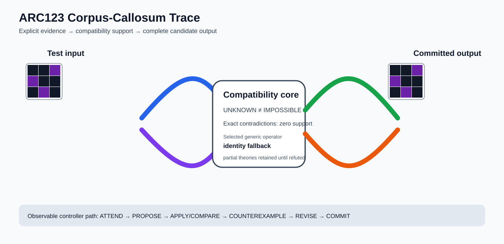

# ARC1 `a85d4709` P0007 Brain Surgery Report

## Outcome: NO — TEST CELLS DO NOT ALL MATCH

- **Compared positions:** 9
- **Mismatched cells:** 9
- **Training compatibility:** `False`
- **Fallback used:** `True`
- **Causal trace acceptance:** `NO`
- **Selected hypothesis:** `fallback_identity_complete_grid`
- **Source commit:** `085f6dbe39050afac3d1d743f840bac95b1a8d1c`

## Causal Ablations

| Configuration | Exact all-cell result | Training exact | Fallback | Selected hypothesis |
| --- | --- | --- | --- | --- |
| `no_revision` | `False` | `False` | `True` | `fallback_identity_complete_grid` |
| `no_new_residual_family` | `False` | `False` | `True` | `fallback_identity_complete_grid` |

## Live-Agent Boundary

The controller receives only visible training input/output examples and test inputs. It receives no task ID, offline audit label, GT feature record, GT solver, historical decomposition, or held-out output before committing a complete grid. The expected output appears only in the post-answer V&V section.

## Corpus-Callosum Visualization



- Full explicit event record: [`learning_trace.json`](learning_trace.json)
- Full three-configuration record: [`ablations.json`](ablations.json)

## Causal Trace Check

- **Counterexample observed:** `True`
- **Additional visible demonstration selected:** `True`
- **Composition recorded:** `True`
- **Parameter or multi-rule revision:** `False`
- **Generic families in selected theory:** `none`

## Post-Answer V&V

### Test case 1
- **All cells match:** `False`
- **Mismatched cells:** `9`
- **Prediction:**
```json
[[0, 0, 5], [5, 0, 0], [0, 5, 0]]
```
- **Expected output (post-answer only):**
```json
[[3, 3, 3], [2, 2, 2], [4, 4, 4]]
```

## Observable IHL Walkthrough

The record contains explicit actions, predictions, feedback, and revisions; it does not claim or store hidden model reasoning.

### Action totals

- `APPLY_HYPOTHESIS`: 249
- `ATTEND`: 249
- `CHOOSE_NEXT_DEMO`: 249
- `COMMIT`: 1
- `COMPARE`: 249
- `COMPOSE_RULE`: 7
- `EXPLAIN_RESIDUAL`: 7
- `FIND_COUNTEREXAMPLE`: 7
- `PROPOSE`: 1
- `SPECIALIZE`: 84

### Decision milestones

- `0` `PROPOSE` — `{"parent_theory_id":"T0000","rule":{"description_length":1,"name":"identity","operation":"identity","parameters":{},"rule_id":"identity","scope":{"kind":"all","value":null}},"stage":"initial_generic_theories","theory_id":"T0001"}`
- `2` `ATTEND` — `{"reason":"initial_highest_observed_change_and_color_discrimination","selected_demo":0,"selected_region":{"column":0,"row":0},"theory_id":"T0001"}`
- `6` `ATTEND` — `{"reason":"counterexample_requires_visible_conditional_evidence:unseen_demo_selected_for_residual_version_space_discrimination","selected_demo":2,"selected_region":{"column":0,"row":0},"theory_id":"T0001"}`
- `10` `ATTEND` — `{"reason":"counterexample_requires_visible_conditional_evidence:unseen_demo_selected_for_residual_version_space_discrimination","selected_demo":3,"selected_region":{"column":0,"row":0},"theory_id":"T0001"}`
- `14` `ATTEND` — `{"reason":"counterexample_requires_visible_conditional_evidence:unseen_demo_selected_for_residual_version_space_discrimination","selected_demo":1,"selected_region":{"column":0,"row":0},"theory_id":"T0001"}`
- `20` `SPECIALIZE` — `{"added_rule":{"description_length":4,"name":"line_extend(direction=left,fill_color=3,seed_color=5)","operation":"full_operator","parameters":{"direction":"left","fill_color":3,"operator":"line_extend","seed_color":5},"rule_id":"structural-line_extend","scope":{"kind":"all","value":null}},"parent_theory_id":"T0001","reason":"unexplained_residual_proposed_generic_structural_rule","theory_id":"T0003"}`
- `21` `SPECIALIZE` — `{"added_rule":{"description_length":4,"name":"line_extend(direction=right,fill_color=2,seed_color=5)","operation":"full_operator","parameters":{"direction":"right","fill_color":2,"operator":"line_extend","seed_color":5},"rule_id":"structural-line_extend","scope":{"kind":"all","value":null}},"parent_theory_id":"T0001","reason":"unexplained_residual_proposed_generic_structural_rule","theory_id":"T0004"}`
- `22` `SPECIALIZE` — `{"added_rule":{"description_length":4,"name":"line_extend(direction=right,fill_color=4,seed_color=5)","operation":"full_operator","parameters":{"direction":"right","fill_color":4,"operator":"line_extend","seed_color":5},"rule_id":"structural-line_extend","scope":{"kind":"all","value":null}},"parent_theory_id":"T0001","reason":"unexplained_residual_proposed_generic_structural_rule","theory_id":"T0005"}`
- `23` `SPECIALIZE` — `{"added_rule":{"description_length":4,"name":"line_extend(direction=left,fill_color=4,seed_color=5)","operation":"full_operator","parameters":{"direction":"left","fill_color":4,"operator":"line_extend","seed_color":5},"rule_id":"structural-line_extend","scope":{"kind":"all","value":null}},"parent_theory_id":"T0001","reason":"unexplained_residual_proposed_generic_structural_rule","theory_id":"T0006"}`
- `24` `SPECIALIZE` — `{"added_rule":{"description_length":4,"name":"line_extend(direction=up,fill_color=4,seed_color=5)","operation":"full_operator","parameters":{"direction":"up","fill_color":4,"operator":"line_extend","seed_color":5},"rule_id":"structural-line_extend","scope":{"kind":"all","value":null}},"parent_theory_id":"T0001","reason":"unexplained_residual_proposed_generic_structural_rule","theory_id":"T0007"}`
- `25` `SPECIALIZE` — `{"added_rule":{"description_length":4,"name":"line_extend(direction=up,fill_color=3,seed_color=5)","operation":"full_operator","parameters":{"direction":"up","fill_color":3,"operator":"line_extend","seed_color":5},"rule_id":"structural-line_extend","scope":{"kind":"all","value":null}},"parent_theory_id":"T0001","reason":"unexplained_residual_proposed_generic_structural_rule","theory_id":"T0008"}`
- `26` `SPECIALIZE` — `{"added_rule":{"description_length":4,"name":"line_extend(direction=down,fill_color=4,seed_color=5)","operation":"full_operator","parameters":{"direction":"down","fill_color":4,"operator":"line_extend","seed_color":5},"rule_id":"structural-line_extend","scope":{"kind":"all","value":null}},"parent_theory_id":"T0001","reason":"unexplained_residual_proposed_generic_structural_rule","theory_id":"T0009"}`
- `27` `SPECIALIZE` — `{"added_rule":{"description_length":4,"name":"line_extend(direction=down,fill_color=2,seed_color=5)","operation":"full_operator","parameters":{"direction":"down","fill_color":2,"operator":"line_extend","seed_color":5},"rule_id":"structural-line_extend","scope":{"kind":"all","value":null}},"parent_theory_id":"T0001","reason":"unexplained_residual_proposed_generic_structural_rule","theory_id":"T0010"}`
- `28` `SPECIALIZE` — `{"added_rule":{"description_length":4,"name":"line_extend(direction=up,fill_color=2,seed_color=5)","operation":"full_operator","parameters":{"direction":"up","fill_color":2,"operator":"line_extend","seed_color":5},"rule_id":"structural-line_extend","scope":{"kind":"all","value":null}},"parent_theory_id":"T0001","reason":"unexplained_residual_proposed_generic_structural_rule","theory_id":"T0011"}`
- `29` `SPECIALIZE` — `{"added_rule":{"description_length":4,"name":"line_extend(direction=down,fill_color=3,seed_color=5)","operation":"full_operator","parameters":{"direction":"down","fill_color":3,"operator":"line_extend","seed_color":5},"rule_id":"structural-line_extend","scope":{"kind":"all","value":null}},"parent_theory_id":"T0001","reason":"unexplained_residual_proposed_generic_structural_rule","theory_id":"T0012"}`
- `30` `SPECIALIZE` — `{"added_rule":{"description_length":4,"name":"row_span_fill(fill_color=5,seed_color=5)","operation":"full_operator","parameters":{"fill_color":5,"operator":"row_span_fill","seed_color":5},"rule_id":"structural-row_span_fill","scope":{"kind":"all","value":null}},"parent_theory_id":"T0001","reason":"unexplained_residual_proposed_generic_structural_rule","theory_id":"T0013"}`
- `31` `SPECIALIZE` — `{"added_rule":{"description_length":4,"name":"row_span_fill(fill_color=5,seed_color=4)","operation":"full_operator","parameters":{"fill_color":5,"operator":"row_span_fill","seed_color":4},"rule_id":"structural-row_span_fill","scope":{"kind":"all","value":null}},"parent_theory_id":"T0001","reason":"unexplained_residual_proposed_generic_structural_rule","theory_id":"T0014"}`
- `33` `ATTEND` — `{"reason":"initial_highest_observed_change_and_color_discrimination","selected_demo":0,"selected_region":{"column":2,"row":0},"theory_id":"T0002"}`
- `37` `ATTEND` — `{"reason":"initial_highest_observed_change_and_color_discrimination","selected_demo":0,"selected_region":{"column":2,"row":0},"theory_id":"T0003"}`
- `41` `ATTEND` — `{"reason":"initial_highest_observed_change_and_color_discrimination","selected_demo":0,"selected_region":{"column":0,"row":0},"theory_id":"T0004"}`
- `45` `ATTEND` — `{"reason":"initial_highest_observed_change_and_color_discrimination","selected_demo":0,"selected_region":{"column":0,"row":0},"theory_id":"T0005"}`
- `49` `ATTEND` — `{"reason":"initial_highest_observed_change_and_color_discrimination","selected_demo":0,"selected_region":{"column":0,"row":0},"theory_id":"T0006"}`
- `53` `ATTEND` — `{"reason":"initial_highest_observed_change_and_color_discrimination","selected_demo":0,"selected_region":{"column":0,"row":0},"theory_id":"T0007"}`
- `57` `ATTEND` — `{"reason":"initial_highest_observed_change_and_color_discrimination","selected_demo":0,"selected_region":{"column":2,"row":0},"theory_id":"T0008"}`
- `61` `ATTEND` — `{"reason":"initial_highest_observed_change_and_color_discrimination","selected_demo":0,"selected_region":{"column":0,"row":0},"theory_id":"T0009"}`
- `65` `ATTEND` — `{"reason":"initial_highest_observed_change_and_color_discrimination","selected_demo":0,"selected_region":{"column":0,"row":0},"theory_id":"T0010"}`
- `69` `ATTEND` — `{"reason":"initial_highest_observed_change_and_color_discrimination","selected_demo":0,"selected_region":{"column":0,"row":0},"theory_id":"T0011"}`
- `73` `ATTEND` — `{"reason":"initial_highest_observed_change_and_color_discrimination","selected_demo":0,"selected_region":{"column":0,"row":0},"theory_id":"T0012"}`
- `77` `ATTEND` — `{"reason":"initial_highest_observed_change_and_color_discrimination","selected_demo":0,"selected_region":{"column":0,"row":0},"theory_id":"T0013"}`
- `81` `ATTEND` — `{"reason":"counterexample_requires_visible_conditional_evidence:unseen_demo_selected_for_residual_version_space_discrimination","selected_demo":2,"selected_region":{"column":0,"row":0},"theory_id":"T0002"}`
- `85` `ATTEND` — `{"reason":"counterexample_requires_visible_conditional_evidence:unseen_demo_selected_for_residual_version_space_discrimination","selected_demo":2,"selected_region":{"column":0,"row":0},"theory_id":"T0003"}`
- `89` `ATTEND` — `{"reason":"counterexample_requires_visible_conditional_evidence:unseen_demo_selected_for_residual_version_space_discrimination","selected_demo":2,"selected_region":{"column":0,"row":0},"theory_id":"T0004"}`
- `93` `ATTEND` — `{"reason":"counterexample_requires_visible_conditional_evidence:unseen_demo_selected_for_residual_version_space_discrimination","selected_demo":2,"selected_region":{"column":0,"row":0},"theory_id":"T0008"}`
- `97` `ATTEND` — `{"reason":"counterexample_requires_visible_conditional_evidence:unseen_demo_selected_for_residual_version_space_discrimination","selected_demo":2,"selected_region":{"column":0,"row":0},"theory_id":"T0010"}`
- `101` `ATTEND` — `{"reason":"counterexample_requires_visible_conditional_evidence:unseen_demo_selected_for_residual_version_space_discrimination","selected_demo":2,"selected_region":{"column":0,"row":0},"theory_id":"T0005"}`
- `105` `ATTEND` — `{"reason":"counterexample_requires_visible_conditional_evidence:unseen_demo_selected_for_residual_version_space_discrimination","selected_demo":2,"selected_region":{"column":0,"row":0},"theory_id":"T0006"}`
- `109` `ATTEND` — `{"reason":"counterexample_requires_visible_conditional_evidence:unseen_demo_selected_for_residual_version_space_discrimination","selected_demo":2,"selected_region":{"column":0,"row":0},"theory_id":"T0007"}`
- `113` `ATTEND` — `{"reason":"counterexample_requires_visible_conditional_evidence:unseen_demo_selected_for_residual_version_space_discrimination","selected_demo":2,"selected_region":{"column":0,"row":0},"theory_id":"T0009"}`
- `117` `ATTEND` — `{"reason":"counterexample_requires_visible_conditional_evidence:unseen_demo_selected_for_residual_version_space_discrimination","selected_demo":2,"selected_region":{"column":0,"row":0},"theory_id":"T0011"}`
- `121` `ATTEND` — `{"reason":"counterexample_requires_visible_conditional_evidence:unseen_demo_selected_for_residual_version_space_discrimination","selected_demo":2,"selected_region":{"column":0,"row":0},"theory_id":"T0012"}`
- `125` `ATTEND` — `{"reason":"counterexample_requires_visible_conditional_evidence:unseen_demo_selected_for_residual_version_space_discrimination","selected_demo":2,"selected_region":{"column":0,"row":0},"theory_id":"T0013"}`
- `129` `ATTEND` — `{"reason":"counterexample_requires_visible_conditional_evidence:unseen_demo_selected_for_residual_version_space_discrimination","selected_demo":3,"selected_region":{"column":0,"row":0},"theory_id":"T0004"}`
- `133` `ATTEND` — `{"reason":"counterexample_requires_visible_conditional_evidence:unseen_demo_selected_for_residual_version_space_discrimination","selected_demo":3,"selected_region":{"column":0,"row":0},"theory_id":"T0010"}`
- `137` `ATTEND` — `{"reason":"counterexample_requires_visible_conditional_evidence:unseen_demo_selected_for_residual_version_space_discrimination","selected_demo":3,"selected_region":{"column":0,"row":0},"theory_id":"T0002"}`
- `141` `ATTEND` — `{"reason":"counterexample_requires_visible_conditional_evidence:unseen_demo_selected_for_residual_version_space_discrimination","selected_demo":3,"selected_region":{"column":0,"row":0},"theory_id":"T0003"}`
- `145` `ATTEND` — `{"reason":"counterexample_requires_visible_conditional_evidence:unseen_demo_selected_for_residual_version_space_discrimination","selected_demo":3,"selected_region":{"column":0,"row":0},"theory_id":"T0005"}`
- `149` `ATTEND` — `{"reason":"counterexample_requires_visible_conditional_evidence:unseen_demo_selected_for_residual_version_space_discrimination","selected_demo":3,"selected_region":{"column":1,"row":0},"theory_id":"T0006"}`
- `153` `ATTEND` — `{"reason":"counterexample_requires_visible_conditional_evidence:unseen_demo_selected_for_residual_version_space_discrimination","selected_demo":3,"selected_region":{"column":0,"row":0},"theory_id":"T0007"}`
- `157` `ATTEND` — `{"reason":"counterexample_requires_visible_conditional_evidence:unseen_demo_selected_for_residual_version_space_discrimination","selected_demo":3,"selected_region":{"column":0,"row":0},"theory_id":"T0008"}`
- `161` `ATTEND` — `{"reason":"counterexample_requires_visible_conditional_evidence:unseen_demo_selected_for_residual_version_space_discrimination","selected_demo":3,"selected_region":{"column":0,"row":0},"theory_id":"T0009"}`
- `165` `ATTEND` — `{"reason":"counterexample_requires_visible_conditional_evidence:unseen_demo_selected_for_residual_version_space_discrimination","selected_demo":3,"selected_region":{"column":0,"row":0},"theory_id":"T0011"}`
- `169` `ATTEND` — `{"reason":"counterexample_requires_visible_conditional_evidence:unseen_demo_selected_for_residual_version_space_discrimination","selected_demo":3,"selected_region":{"column":0,"row":0},"theory_id":"T0012"}`
- `173` `ATTEND` — `{"reason":"counterexample_requires_visible_conditional_evidence:unseen_demo_selected_for_residual_version_space_discrimination","selected_demo":3,"selected_region":{"column":0,"row":0},"theory_id":"T0013"}`
- `177` `ATTEND` — `{"reason":"counterexample_requires_visible_conditional_evidence:unseen_demo_selected_for_residual_version_space_discrimination","selected_demo":1,"selected_region":{"column":0,"row":0},"theory_id":"T0004"}`
- `181` `ATTEND` — `{"reason":"counterexample_requires_visible_conditional_evidence:unseen_demo_selected_for_residual_version_space_discrimination","selected_demo":1,"selected_region":{"column":2,"row":0},"theory_id":"T0002"}`
- `185` `ATTEND` — `{"reason":"counterexample_requires_visible_conditional_evidence:unseen_demo_selected_for_residual_version_space_discrimination","selected_demo":1,"selected_region":{"column":2,"row":0},"theory_id":"T0003"}`
- `189` `ATTEND` — `{"reason":"counterexample_requires_visible_conditional_evidence:unseen_demo_selected_for_residual_version_space_discrimination","selected_demo":1,"selected_region":{"column":0,"row":0},"theory_id":"T0005"}`
- `193` `ATTEND` — `{"reason":"counterexample_requires_visible_conditional_evidence:unseen_demo_selected_for_residual_version_space_discrimination","selected_demo":1,"selected_region":{"column":0,"row":0},"theory_id":"T0006"}`
- `197` `ATTEND` — `{"reason":"counterexample_requires_visible_conditional_evidence:unseen_demo_selected_for_residual_version_space_discrimination","selected_demo":1,"selected_region":{"column":0,"row":0},"theory_id":"T0007"}`
- `201` `ATTEND` — `{"reason":"counterexample_requires_visible_conditional_evidence:unseen_demo_selected_for_residual_version_space_discrimination","selected_demo":1,"selected_region":{"column":0,"row":0},"theory_id":"T0008"}`
- `205` `ATTEND` — `{"reason":"counterexample_requires_visible_conditional_evidence:unseen_demo_selected_for_residual_version_space_discrimination","selected_demo":1,"selected_region":{"column":0,"row":0},"theory_id":"T0009"}`
- `209` `ATTEND` — `{"reason":"counterexample_requires_visible_conditional_evidence:unseen_demo_selected_for_residual_version_space_discrimination","selected_demo":1,"selected_region":{"column":0,"row":0},"theory_id":"T0010"}`
- `215` `SPECIALIZE` — `{"added_rule":{"description_length":4,"name":"line_extend(direction=left,fill_color=3,seed_color=5)","operation":"full_operator","parameters":{"direction":"left","fill_color":3,"operator":"line_extend","seed_color":5},"rule_id":"structural-line_extend","scope":{"kind":"all","value":null}},"parent_theory_id":"T0002","reason":"unexplained_residual_proposed_generic_structural_rule","theory_id":"T0016"}`
- `216` `SPECIALIZE` — `{"added_rule":{"description_length":4,"name":"line_extend(direction=right,fill_color=2,seed_color=5)","operation":"full_operator","parameters":{"direction":"right","fill_color":2,"operator":"line_extend","seed_color":5},"rule_id":"structural-line_extend","scope":{"kind":"all","value":null}},"parent_theory_id":"T0002","reason":"unexplained_residual_proposed_generic_structural_rule","theory_id":"T0017"}`
- `217` `SPECIALIZE` — `{"added_rule":{"description_length":4,"name":"line_extend(direction=right,fill_color=4,seed_color=5)","operation":"full_operator","parameters":{"direction":"right","fill_color":4,"operator":"line_extend","seed_color":5},"rule_id":"structural-line_extend","scope":{"kind":"all","value":null}},"parent_theory_id":"T0002","reason":"unexplained_residual_proposed_generic_structural_rule","theory_id":"T0018"}`
- `218` `SPECIALIZE` — `{"added_rule":{"description_length":4,"name":"line_extend(direction=left,fill_color=4,seed_color=5)","operation":"full_operator","parameters":{"direction":"left","fill_color":4,"operator":"line_extend","seed_color":5},"rule_id":"structural-line_extend","scope":{"kind":"all","value":null}},"parent_theory_id":"T0002","reason":"unexplained_residual_proposed_generic_structural_rule","theory_id":"T0019"}`
- `219` `SPECIALIZE` — `{"added_rule":{"description_length":4,"name":"line_extend(direction=up,fill_color=4,seed_color=5)","operation":"full_operator","parameters":{"direction":"up","fill_color":4,"operator":"line_extend","seed_color":5},"rule_id":"structural-line_extend","scope":{"kind":"all","value":null}},"parent_theory_id":"T0002","reason":"unexplained_residual_proposed_generic_structural_rule","theory_id":"T0020"}`
- `220` `SPECIALIZE` — `{"added_rule":{"description_length":4,"name":"line_extend(direction=up,fill_color=3,seed_color=5)","operation":"full_operator","parameters":{"direction":"up","fill_color":3,"operator":"line_extend","seed_color":5},"rule_id":"structural-line_extend","scope":{"kind":"all","value":null}},"parent_theory_id":"T0002","reason":"unexplained_residual_proposed_generic_structural_rule","theory_id":"T0021"}`
- `221` `SPECIALIZE` — `{"added_rule":{"description_length":4,"name":"line_extend(direction=down,fill_color=4,seed_color=5)","operation":"full_operator","parameters":{"direction":"down","fill_color":4,"operator":"line_extend","seed_color":5},"rule_id":"structural-line_extend","scope":{"kind":"all","value":null}},"parent_theory_id":"T0002","reason":"unexplained_residual_proposed_generic_structural_rule","theory_id":"T0022"}`
- `222` `SPECIALIZE` — `{"added_rule":{"description_length":4,"name":"line_extend(direction=down,fill_color=2,seed_color=5)","operation":"full_operator","parameters":{"direction":"down","fill_color":2,"operator":"line_extend","seed_color":5},"rule_id":"structural-line_extend","scope":{"kind":"all","value":null}},"parent_theory_id":"T0002","reason":"unexplained_residual_proposed_generic_structural_rule","theory_id":"T0023"}`
- `223` `SPECIALIZE` — `{"added_rule":{"description_length":4,"name":"line_extend(direction=up,fill_color=2,seed_color=5)","operation":"full_operator","parameters":{"direction":"up","fill_color":2,"operator":"line_extend","seed_color":5},"rule_id":"structural-line_extend","scope":{"kind":"all","value":null}},"parent_theory_id":"T0002","reason":"unexplained_residual_proposed_generic_structural_rule","theory_id":"T0024"}`
- `224` `SPECIALIZE` — `{"added_rule":{"description_length":4,"name":"line_extend(direction=down,fill_color=3,seed_color=5)","operation":"full_operator","parameters":{"direction":"down","fill_color":3,"operator":"line_extend","seed_color":5},"rule_id":"structural-line_extend","scope":{"kind":"all","value":null}},"parent_theory_id":"T0002","reason":"unexplained_residual_proposed_generic_structural_rule","theory_id":"T0025"}`
- `225` `SPECIALIZE` — `{"added_rule":{"description_length":4,"name":"row_span_fill(fill_color=5,seed_color=5)","operation":"full_operator","parameters":{"fill_color":5,"operator":"row_span_fill","seed_color":5},"rule_id":"structural-row_span_fill","scope":{"kind":"all","value":null}},"parent_theory_id":"T0002","reason":"unexplained_residual_proposed_generic_structural_rule","theory_id":"T0026"}`
- `226` `SPECIALIZE` — `{"added_rule":{"description_length":4,"name":"row_span_fill(fill_color=5,seed_color=4)","operation":"full_operator","parameters":{"fill_color":5,"operator":"row_span_fill","seed_color":4},"rule_id":"structural-row_span_fill","scope":{"kind":"all","value":null}},"parent_theory_id":"T0002","reason":"unexplained_residual_proposed_generic_structural_rule","theory_id":"T0027"}`
- `228` `ATTEND` — `{"reason":"initial_highest_observed_change_and_color_discrimination","selected_demo":0,"selected_region":{"column":0,"row":1},"theory_id":"T0015"}`
- `232` `ATTEND` — `{"reason":"initial_highest_observed_change_and_color_discrimination","selected_demo":0,"selected_region":{"column":2,"row":0},"theory_id":"T0016"}`
- `236` `ATTEND` — `{"reason":"initial_highest_observed_change_and_color_discrimination","selected_demo":0,"selected_region":{"column":0,"row":0},"theory_id":"T0017"}`
- `240` `ATTEND` — `{"reason":"initial_highest_observed_change_and_color_discrimination","selected_demo":0,"selected_region":{"column":0,"row":0},"theory_id":"T0018"}`
- `244` `ATTEND` — `{"reason":"initial_highest_observed_change_and_color_discrimination","selected_demo":0,"selected_region":{"column":0,"row":0},"theory_id":"T0019"}`
- `248` `ATTEND` — `{"reason":"initial_highest_observed_change_and_color_discrimination","selected_demo":0,"selected_region":{"column":0,"row":0},"theory_id":"T0020"}`
- `252` `ATTEND` — `{"reason":"initial_highest_observed_change_and_color_discrimination","selected_demo":0,"selected_region":{"column":2,"row":0},"theory_id":"T0021"}`
- `256` `ATTEND` — `{"reason":"initial_highest_observed_change_and_color_discrimination","selected_demo":0,"selected_region":{"column":0,"row":0},"theory_id":"T0022"}`
- `260` `ATTEND` — `{"reason":"initial_highest_observed_change_and_color_discrimination","selected_demo":0,"selected_region":{"column":0,"row":0},"theory_id":"T0023"}`
- `264` `ATTEND` — `{"reason":"initial_highest_observed_change_and_color_discrimination","selected_demo":0,"selected_region":{"column":0,"row":0},"theory_id":"T0024"}`
- `268` `ATTEND` — `{"reason":"initial_highest_observed_change_and_color_discrimination","selected_demo":0,"selected_region":{"column":0,"row":0},"theory_id":"T0025"}`
- `272` `ATTEND` — `{"reason":"initial_highest_observed_change_and_color_discrimination","selected_demo":0,"selected_region":{"column":0,"row":0},"theory_id":"T0026"}`
- `276` `ATTEND` — `{"reason":"counterexample_requires_visible_conditional_evidence:unseen_demo_selected_for_residual_version_space_discrimination","selected_demo":2,"selected_region":{"column":0,"row":0},"theory_id":"T0015"}`
- `280` `ATTEND` — `{"reason":"counterexample_requires_visible_conditional_evidence:unseen_demo_selected_for_residual_version_space_discrimination","selected_demo":2,"selected_region":{"column":0,"row":0},"theory_id":"T0016"}`
- `284` `ATTEND` — `{"reason":"counterexample_requires_visible_conditional_evidence:unseen_demo_selected_for_residual_version_space_discrimination","selected_demo":2,"selected_region":{"column":0,"row":0},"theory_id":"T0017"}`
- `288` `ATTEND` — `{"reason":"counterexample_requires_visible_conditional_evidence:unseen_demo_selected_for_residual_version_space_discrimination","selected_demo":2,"selected_region":{"column":0,"row":0},"theory_id":"T0021"}`
- `292` `ATTEND` — `{"reason":"counterexample_requires_visible_conditional_evidence:unseen_demo_selected_for_residual_version_space_discrimination","selected_demo":2,"selected_region":{"column":0,"row":0},"theory_id":"T0023"}`
- `296` `ATTEND` — `{"reason":"counterexample_requires_visible_conditional_evidence:unseen_demo_selected_for_residual_version_space_discrimination","selected_demo":2,"selected_region":{"column":0,"row":0},"theory_id":"T0018"}`
- `300` `ATTEND` — `{"reason":"counterexample_requires_visible_conditional_evidence:unseen_demo_selected_for_residual_version_space_discrimination","selected_demo":2,"selected_region":{"column":0,"row":0},"theory_id":"T0019"}`
- `304` `ATTEND` — `{"reason":"counterexample_requires_visible_conditional_evidence:unseen_demo_selected_for_residual_version_space_discrimination","selected_demo":2,"selected_region":{"column":0,"row":0},"theory_id":"T0020"}`
- `308` `ATTEND` — `{"reason":"counterexample_requires_visible_conditional_evidence:unseen_demo_selected_for_residual_version_space_discrimination","selected_demo":2,"selected_region":{"column":0,"row":0},"theory_id":"T0022"}`
- `312` `ATTEND` — `{"reason":"counterexample_requires_visible_conditional_evidence:unseen_demo_selected_for_residual_version_space_discrimination","selected_demo":2,"selected_region":{"column":0,"row":0},"theory_id":"T0024"}`
- `316` `ATTEND` — `{"reason":"counterexample_requires_visible_conditional_evidence:unseen_demo_selected_for_residual_version_space_discrimination","selected_demo":2,"selected_region":{"column":0,"row":0},"theory_id":"T0025"}`
- `320` `ATTEND` — `{"reason":"counterexample_requires_visible_conditional_evidence:unseen_demo_selected_for_residual_version_space_discrimination","selected_demo":2,"selected_region":{"column":0,"row":0},"theory_id":"T0026"}`
- `324` `ATTEND` — `{"reason":"counterexample_requires_visible_conditional_evidence:unseen_demo_selected_for_residual_version_space_discrimination","selected_demo":3,"selected_region":{"column":0,"row":0},"theory_id":"T0017"}`
- `328` `ATTEND` — `{"reason":"counterexample_requires_visible_conditional_evidence:unseen_demo_selected_for_residual_version_space_discrimination","selected_demo":3,"selected_region":{"column":0,"row":0},"theory_id":"T0015"}`
- `332` `ATTEND` — `{"reason":"counterexample_requires_visible_conditional_evidence:unseen_demo_selected_for_residual_version_space_discrimination","selected_demo":3,"selected_region":{"column":0,"row":0},"theory_id":"T0023"}`
- `336` `ATTEND` — `{"reason":"counterexample_requires_visible_conditional_evidence:unseen_demo_selected_for_residual_version_space_discrimination","selected_demo":3,"selected_region":{"column":0,"row":0},"theory_id":"T0016"}`
- `340` `ATTEND` — `{"reason":"counterexample_requires_visible_conditional_evidence:unseen_demo_selected_for_residual_version_space_discrimination","selected_demo":3,"selected_region":{"column":0,"row":0},"theory_id":"T0018"}`
- `344` `ATTEND` — `{"reason":"counterexample_requires_visible_conditional_evidence:unseen_demo_selected_for_residual_version_space_discrimination","selected_demo":3,"selected_region":{"column":1,"row":0},"theory_id":"T0019"}`
- `348` `ATTEND` — `{"reason":"counterexample_requires_visible_conditional_evidence:unseen_demo_selected_for_residual_version_space_discrimination","selected_demo":3,"selected_region":{"column":0,"row":0},"theory_id":"T0020"}`
- `352` `ATTEND` — `{"reason":"counterexample_requires_visible_conditional_evidence:unseen_demo_selected_for_residual_version_space_discrimination","selected_demo":3,"selected_region":{"column":0,"row":0},"theory_id":"T0021"}`
- `356` `ATTEND` — `{"reason":"counterexample_requires_visible_conditional_evidence:unseen_demo_selected_for_residual_version_space_discrimination","selected_demo":3,"selected_region":{"column":0,"row":0},"theory_id":"T0022"}`
- `360` `ATTEND` — `{"reason":"counterexample_requires_visible_conditional_evidence:unseen_demo_selected_for_residual_version_space_discrimination","selected_demo":3,"selected_region":{"column":0,"row":0},"theory_id":"T0024"}`
- `364` `ATTEND` — `{"reason":"counterexample_requires_visible_conditional_evidence:unseen_demo_selected_for_residual_version_space_discrimination","selected_demo":3,"selected_region":{"column":0,"row":0},"theory_id":"T0025"}`
- `368` `ATTEND` — `{"reason":"counterexample_requires_visible_conditional_evidence:unseen_demo_selected_for_residual_version_space_discrimination","selected_demo":3,"selected_region":{"column":0,"row":0},"theory_id":"T0026"}`
- `372` `ATTEND` — `{"reason":"counterexample_requires_visible_conditional_evidence:unseen_demo_selected_for_residual_version_space_discrimination","selected_demo":1,"selected_region":{"region":"whole_demo"},"theory_id":"T0015"}`
- `378` `SPECIALIZE` — `{"added_rule":{"description_length":4,"name":"line_extend(direction=left,fill_color=3,seed_color=5)","operation":"full_operator","parameters":{"direction":"left","fill_color":3,"operator":"line_extend","seed_color":5},"rule_id":"structural-line_extend","scope":{"kind":"all","value":null}},"parent_theory_id":"T0015","reason":"unexplained_residual_proposed_generic_structural_rule","theory_id":"T0029"}`
- `379` `SPECIALIZE` — `{"added_rule":{"description_length":4,"name":"line_extend(direction=right,fill_color=2,seed_color=5)","operation":"full_operator","parameters":{"direction":"right","fill_color":2,"operator":"line_extend","seed_color":5},"rule_id":"structural-line_extend","scope":{"kind":"all","value":null}},"parent_theory_id":"T0015","reason":"unexplained_residual_proposed_generic_structural_rule","theory_id":"T0030"}`
- `380` `SPECIALIZE` — `{"added_rule":{"description_length":4,"name":"line_extend(direction=right,fill_color=4,seed_color=5)","operation":"full_operator","parameters":{"direction":"right","fill_color":4,"operator":"line_extend","seed_color":5},"rule_id":"structural-line_extend","scope":{"kind":"all","value":null}},"parent_theory_id":"T0015","reason":"unexplained_residual_proposed_generic_structural_rule","theory_id":"T0031"}`
- `381` `SPECIALIZE` — `{"added_rule":{"description_length":4,"name":"line_extend(direction=left,fill_color=4,seed_color=5)","operation":"full_operator","parameters":{"direction":"left","fill_color":4,"operator":"line_extend","seed_color":5},"rule_id":"structural-line_extend","scope":{"kind":"all","value":null}},"parent_theory_id":"T0015","reason":"unexplained_residual_proposed_generic_structural_rule","theory_id":"T0032"}`
- `382` `SPECIALIZE` — `{"added_rule":{"description_length":4,"name":"line_extend(direction=up,fill_color=4,seed_color=5)","operation":"full_operator","parameters":{"direction":"up","fill_color":4,"operator":"line_extend","seed_color":5},"rule_id":"structural-line_extend","scope":{"kind":"all","value":null}},"parent_theory_id":"T0015","reason":"unexplained_residual_proposed_generic_structural_rule","theory_id":"T0033"}`
- `383` `SPECIALIZE` — `{"added_rule":{"description_length":4,"name":"line_extend(direction=up,fill_color=3,seed_color=5)","operation":"full_operator","parameters":{"direction":"up","fill_color":3,"operator":"line_extend","seed_color":5},"rule_id":"structural-line_extend","scope":{"kind":"all","value":null}},"parent_theory_id":"T0015","reason":"unexplained_residual_proposed_generic_structural_rule","theory_id":"T0034"}`
- `384` `SPECIALIZE` — `{"added_rule":{"description_length":4,"name":"line_extend(direction=down,fill_color=4,seed_color=5)","operation":"full_operator","parameters":{"direction":"down","fill_color":4,"operator":"line_extend","seed_color":5},"rule_id":"structural-line_extend","scope":{"kind":"all","value":null}},"parent_theory_id":"T0015","reason":"unexplained_residual_proposed_generic_structural_rule","theory_id":"T0035"}`
- `385` `SPECIALIZE` — `{"added_rule":{"description_length":4,"name":"line_extend(direction=down,fill_color=2,seed_color=5)","operation":"full_operator","parameters":{"direction":"down","fill_color":2,"operator":"line_extend","seed_color":5},"rule_id":"structural-line_extend","scope":{"kind":"all","value":null}},"parent_theory_id":"T0015","reason":"unexplained_residual_proposed_generic_structural_rule","theory_id":"T0036"}`
- `386` `SPECIALIZE` — `{"added_rule":{"description_length":4,"name":"line_extend(direction=up,fill_color=2,seed_color=5)","operation":"full_operator","parameters":{"direction":"up","fill_color":2,"operator":"line_extend","seed_color":5},"rule_id":"structural-line_extend","scope":{"kind":"all","value":null}},"parent_theory_id":"T0015","reason":"unexplained_residual_proposed_generic_structural_rule","theory_id":"T0037"}`
- `387` `SPECIALIZE` — `{"added_rule":{"description_length":4,"name":"line_extend(direction=down,fill_color=3,seed_color=5)","operation":"full_operator","parameters":{"direction":"down","fill_color":3,"operator":"line_extend","seed_color":5},"rule_id":"structural-line_extend","scope":{"kind":"all","value":null}},"parent_theory_id":"T0015","reason":"unexplained_residual_proposed_generic_structural_rule","theory_id":"T0038"}`
- `388` `SPECIALIZE` — `{"added_rule":{"description_length":4,"name":"row_span_fill(fill_color=5,seed_color=5)","operation":"full_operator","parameters":{"fill_color":5,"operator":"row_span_fill","seed_color":5},"rule_id":"structural-row_span_fill","scope":{"kind":"all","value":null}},"parent_theory_id":"T0015","reason":"unexplained_residual_proposed_generic_structural_rule","theory_id":"T0039"}`
- `389` `SPECIALIZE` — `{"added_rule":{"description_length":4,"name":"row_span_fill(fill_color=5,seed_color=4)","operation":"full_operator","parameters":{"fill_color":5,"operator":"row_span_fill","seed_color":4},"rule_id":"structural-row_span_fill","scope":{"kind":"all","value":null}},"parent_theory_id":"T0015","reason":"unexplained_residual_proposed_generic_structural_rule","theory_id":"T0040"}`
- `391` `ATTEND` — `{"reason":"initial_highest_observed_change_and_color_discrimination","selected_demo":0,"selected_region":{"column":0,"row":0},"theory_id":"T0028"}`
- `395` `ATTEND` — `{"reason":"initial_highest_observed_change_and_color_discrimination","selected_demo":0,"selected_region":{"column":2,"row":0},"theory_id":"T0029"}`
- `399` `ATTEND` — `{"reason":"initial_highest_observed_change_and_color_discrimination","selected_demo":0,"selected_region":{"column":0,"row":0},"theory_id":"T0030"}`
- `403` `ATTEND` — `{"reason":"initial_highest_observed_change_and_color_discrimination","selected_demo":0,"selected_region":{"column":0,"row":0},"theory_id":"T0031"}`
- `407` `ATTEND` — `{"reason":"initial_highest_observed_change_and_color_discrimination","selected_demo":0,"selected_region":{"column":0,"row":0},"theory_id":"T0032"}`
- `411` `ATTEND` — `{"reason":"initial_highest_observed_change_and_color_discrimination","selected_demo":0,"selected_region":{"column":0,"row":0},"theory_id":"T0033"}`
- `415` `ATTEND` — `{"reason":"initial_highest_observed_change_and_color_discrimination","selected_demo":0,"selected_region":{"column":2,"row":0},"theory_id":"T0034"}`
- `419` `ATTEND` — `{"reason":"initial_highest_observed_change_and_color_discrimination","selected_demo":0,"selected_region":{"column":0,"row":0},"theory_id":"T0035"}`
- `423` `ATTEND` — `{"reason":"initial_highest_observed_change_and_color_discrimination","selected_demo":0,"selected_region":{"column":0,"row":0},"theory_id":"T0036"}`
- `427` `ATTEND` — `{"reason":"initial_highest_observed_change_and_color_discrimination","selected_demo":0,"selected_region":{"column":0,"row":0},"theory_id":"T0037"}`
- `431` `ATTEND` — `{"reason":"initial_highest_observed_change_and_color_discrimination","selected_demo":0,"selected_region":{"column":0,"row":0},"theory_id":"T0038"}`
- `435` `ATTEND` — `{"reason":"initial_highest_observed_change_and_color_discrimination","selected_demo":0,"selected_region":{"column":0,"row":0},"theory_id":"T0039"}`
- `439` `ATTEND` — `{"reason":"counterexample_requires_visible_conditional_evidence:unseen_demo_selected_for_residual_version_space_discrimination","selected_demo":2,"selected_region":{"column":0,"row":0},"theory_id":"T0028"}`
- `443` `ATTEND` — `{"reason":"counterexample_requires_visible_conditional_evidence:unseen_demo_selected_for_residual_version_space_discrimination","selected_demo":2,"selected_region":{"column":0,"row":0},"theory_id":"T0029"}`
- `447` `ATTEND` — `{"reason":"counterexample_requires_visible_conditional_evidence:unseen_demo_selected_for_residual_version_space_discrimination","selected_demo":2,"selected_region":{"column":0,"row":0},"theory_id":"T0030"}`
- `451` `ATTEND` — `{"reason":"counterexample_requires_visible_conditional_evidence:unseen_demo_selected_for_residual_version_space_discrimination","selected_demo":2,"selected_region":{"column":0,"row":0},"theory_id":"T0034"}`
- `455` `ATTEND` — `{"reason":"counterexample_requires_visible_conditional_evidence:unseen_demo_selected_for_residual_version_space_discrimination","selected_demo":2,"selected_region":{"column":0,"row":0},"theory_id":"T0036"}`
- `459` `ATTEND` — `{"reason":"counterexample_requires_visible_conditional_evidence:unseen_demo_selected_for_residual_version_space_discrimination","selected_demo":2,"selected_region":{"column":0,"row":0},"theory_id":"T0031"}`
- `463` `ATTEND` — `{"reason":"counterexample_requires_visible_conditional_evidence:unseen_demo_selected_for_residual_version_space_discrimination","selected_demo":2,"selected_region":{"column":0,"row":0},"theory_id":"T0032"}`
- `467` `ATTEND` — `{"reason":"counterexample_requires_visible_conditional_evidence:unseen_demo_selected_for_residual_version_space_discrimination","selected_demo":2,"selected_region":{"column":0,"row":0},"theory_id":"T0033"}`
- `471` `ATTEND` — `{"reason":"counterexample_requires_visible_conditional_evidence:unseen_demo_selected_for_residual_version_space_discrimination","selected_demo":2,"selected_region":{"column":0,"row":0},"theory_id":"T0035"}`
- `475` `ATTEND` — `{"reason":"counterexample_requires_visible_conditional_evidence:unseen_demo_selected_for_residual_version_space_discrimination","selected_demo":2,"selected_region":{"column":0,"row":0},"theory_id":"T0037"}`
- `479` `ATTEND` — `{"reason":"counterexample_requires_visible_conditional_evidence:unseen_demo_selected_for_residual_version_space_discrimination","selected_demo":2,"selected_region":{"column":0,"row":0},"theory_id":"T0038"}`
- `483` `ATTEND` — `{"reason":"counterexample_requires_visible_conditional_evidence:unseen_demo_selected_for_residual_version_space_discrimination","selected_demo":2,"selected_region":{"column":0,"row":0},"theory_id":"T0039"}`
- `487` `ATTEND` — `{"reason":"counterexample_requires_visible_conditional_evidence:unseen_demo_selected_for_residual_version_space_discrimination","selected_demo":3,"selected_region":{"column":0,"row":0},"theory_id":"T0030"}`
- `491` `ATTEND` — `{"reason":"counterexample_requires_visible_conditional_evidence:unseen_demo_selected_for_residual_version_space_discrimination","selected_demo":3,"selected_region":{"column":1,"row":0},"theory_id":"T0028"}`
- `495` `ATTEND` — `{"reason":"counterexample_requires_visible_conditional_evidence:unseen_demo_selected_for_residual_version_space_discrimination","selected_demo":3,"selected_region":{"column":0,"row":0},"theory_id":"T0036"}`
- `499` `ATTEND` — `{"reason":"counterexample_requires_visible_conditional_evidence:unseen_demo_selected_for_residual_version_space_discrimination","selected_demo":3,"selected_region":{"column":0,"row":0},"theory_id":"T0029"}`
- `503` `ATTEND` — `{"reason":"counterexample_requires_visible_conditional_evidence:unseen_demo_selected_for_residual_version_space_discrimination","selected_demo":3,"selected_region":{"column":0,"row":0},"theory_id":"T0031"}`
- `507` `ATTEND` — `{"reason":"counterexample_requires_visible_conditional_evidence:unseen_demo_selected_for_residual_version_space_discrimination","selected_demo":3,"selected_region":{"column":1,"row":0},"theory_id":"T0032"}`
- `511` `ATTEND` — `{"reason":"counterexample_requires_visible_conditional_evidence:unseen_demo_selected_for_residual_version_space_discrimination","selected_demo":3,"selected_region":{"column":0,"row":0},"theory_id":"T0033"}`
- `515` `ATTEND` — `{"reason":"counterexample_requires_visible_conditional_evidence:unseen_demo_selected_for_residual_version_space_discrimination","selected_demo":3,"selected_region":{"column":0,"row":0},"theory_id":"T0034"}`
- `519` `ATTEND` — `{"reason":"counterexample_requires_visible_conditional_evidence:unseen_demo_selected_for_residual_version_space_discrimination","selected_demo":3,"selected_region":{"column":0,"row":0},"theory_id":"T0035"}`
- `523` `ATTEND` — `{"reason":"counterexample_requires_visible_conditional_evidence:unseen_demo_selected_for_residual_version_space_discrimination","selected_demo":1,"selected_region":{"column":0,"row":0},"theory_id":"T0028"}`
- `527` `ATTEND` — `{"reason":"counterexample_requires_visible_conditional_evidence:unseen_demo_selected_for_residual_version_space_discrimination","selected_demo":3,"selected_region":{"column":0,"row":0},"theory_id":"T0037"}`
- `531` `ATTEND` — `{"reason":"counterexample_requires_visible_conditional_evidence:unseen_demo_selected_for_residual_version_space_discrimination","selected_demo":3,"selected_region":{"column":0,"row":0},"theory_id":"T0038"}`
- `535` `ATTEND` — `{"reason":"counterexample_requires_visible_conditional_evidence:unseen_demo_selected_for_residual_version_space_discrimination","selected_demo":3,"selected_region":{"column":0,"row":0},"theory_id":"T0039"}`
- `539` `ATTEND` — `{"reason":"counterexample_requires_visible_conditional_evidence:unseen_demo_selected_for_residual_version_space_discrimination","selected_demo":1,"selected_region":{"column":0,"row":0},"theory_id":"T0030"}`
- `545` `SPECIALIZE` — `{"added_rule":{"description_length":4,"name":"line_extend(direction=left,fill_color=3,seed_color=5)","operation":"full_operator","parameters":{"direction":"left","fill_color":3,"operator":"line_extend","seed_color":5},"rule_id":"structural-line_extend","scope":{"kind":"all","value":null}},"parent_theory_id":"T0028","reason":"unexplained_residual_proposed_generic_structural_rule","theory_id":"T0042"}`
- `546` `SPECIALIZE` — `{"added_rule":{"description_length":4,"name":"line_extend(direction=right,fill_color=2,seed_color=5)","operation":"full_operator","parameters":{"direction":"right","fill_color":2,"operator":"line_extend","seed_color":5},"rule_id":"structural-line_extend","scope":{"kind":"all","value":null}},"parent_theory_id":"T0028","reason":"unexplained_residual_proposed_generic_structural_rule","theory_id":"T0043"}`
- `547` `SPECIALIZE` — `{"added_rule":{"description_length":4,"name":"line_extend(direction=right,fill_color=4,seed_color=5)","operation":"full_operator","parameters":{"direction":"right","fill_color":4,"operator":"line_extend","seed_color":5},"rule_id":"structural-line_extend","scope":{"kind":"all","value":null}},"parent_theory_id":"T0028","reason":"unexplained_residual_proposed_generic_structural_rule","theory_id":"T0044"}`
- `548` `SPECIALIZE` — `{"added_rule":{"description_length":4,"name":"line_extend(direction=left,fill_color=4,seed_color=5)","operation":"full_operator","parameters":{"direction":"left","fill_color":4,"operator":"line_extend","seed_color":5},"rule_id":"structural-line_extend","scope":{"kind":"all","value":null}},"parent_theory_id":"T0028","reason":"unexplained_residual_proposed_generic_structural_rule","theory_id":"T0045"}`
- `549` `SPECIALIZE` — `{"added_rule":{"description_length":4,"name":"line_extend(direction=up,fill_color=4,seed_color=5)","operation":"full_operator","parameters":{"direction":"up","fill_color":4,"operator":"line_extend","seed_color":5},"rule_id":"structural-line_extend","scope":{"kind":"all","value":null}},"parent_theory_id":"T0028","reason":"unexplained_residual_proposed_generic_structural_rule","theory_id":"T0046"}`
- `550` `SPECIALIZE` — `{"added_rule":{"description_length":4,"name":"line_extend(direction=up,fill_color=3,seed_color=5)","operation":"full_operator","parameters":{"direction":"up","fill_color":3,"operator":"line_extend","seed_color":5},"rule_id":"structural-line_extend","scope":{"kind":"all","value":null}},"parent_theory_id":"T0028","reason":"unexplained_residual_proposed_generic_structural_rule","theory_id":"T0047"}`
- `551` `SPECIALIZE` — `{"added_rule":{"description_length":4,"name":"line_extend(direction=down,fill_color=4,seed_color=5)","operation":"full_operator","parameters":{"direction":"down","fill_color":4,"operator":"line_extend","seed_color":5},"rule_id":"structural-line_extend","scope":{"kind":"all","value":null}},"parent_theory_id":"T0028","reason":"unexplained_residual_proposed_generic_structural_rule","theory_id":"T0048"}`
- `552` `SPECIALIZE` — `{"added_rule":{"description_length":4,"name":"line_extend(direction=down,fill_color=2,seed_color=5)","operation":"full_operator","parameters":{"direction":"down","fill_color":2,"operator":"line_extend","seed_color":5},"rule_id":"structural-line_extend","scope":{"kind":"all","value":null}},"parent_theory_id":"T0028","reason":"unexplained_residual_proposed_generic_structural_rule","theory_id":"T0049"}`
- `553` `SPECIALIZE` — `{"added_rule":{"description_length":4,"name":"line_extend(direction=up,fill_color=2,seed_color=5)","operation":"full_operator","parameters":{"direction":"up","fill_color":2,"operator":"line_extend","seed_color":5},"rule_id":"structural-line_extend","scope":{"kind":"all","value":null}},"parent_theory_id":"T0028","reason":"unexplained_residual_proposed_generic_structural_rule","theory_id":"T0050"}`
- `554` `SPECIALIZE` — `{"added_rule":{"description_length":4,"name":"line_extend(direction=down,fill_color=3,seed_color=5)","operation":"full_operator","parameters":{"direction":"down","fill_color":3,"operator":"line_extend","seed_color":5},"rule_id":"structural-line_extend","scope":{"kind":"all","value":null}},"parent_theory_id":"T0028","reason":"unexplained_residual_proposed_generic_structural_rule","theory_id":"T0051"}`
- `555` `SPECIALIZE` — `{"added_rule":{"description_length":4,"name":"row_span_fill(fill_color=5,seed_color=5)","operation":"full_operator","parameters":{"fill_color":5,"operator":"row_span_fill","seed_color":5},"rule_id":"structural-row_span_fill","scope":{"kind":"all","value":null}},"parent_theory_id":"T0028","reason":"unexplained_residual_proposed_generic_structural_rule","theory_id":"T0052"}`
- `556` `SPECIALIZE` — `{"added_rule":{"description_length":4,"name":"row_span_fill(fill_color=5,seed_color=4)","operation":"full_operator","parameters":{"fill_color":5,"operator":"row_span_fill","seed_color":4},"rule_id":"structural-row_span_fill","scope":{"kind":"all","value":null}},"parent_theory_id":"T0028","reason":"unexplained_residual_proposed_generic_structural_rule","theory_id":"T0053"}`
- `558` `ATTEND` — `{"reason":"initial_highest_observed_change_and_color_discrimination","selected_demo":0,"selected_region":{"column":0,"row":1},"theory_id":"T0041"}`
- `562` `ATTEND` — `{"reason":"initial_highest_observed_change_and_color_discrimination","selected_demo":0,"selected_region":{"column":2,"row":0},"theory_id":"T0042"}`
- `566` `ATTEND` — `{"reason":"initial_highest_observed_change_and_color_discrimination","selected_demo":0,"selected_region":{"column":0,"row":0},"theory_id":"T0043"}`
- `570` `ATTEND` — `{"reason":"initial_highest_observed_change_and_color_discrimination","selected_demo":0,"selected_region":{"column":0,"row":0},"theory_id":"T0044"}`
- `574` `ATTEND` — `{"reason":"initial_highest_observed_change_and_color_discrimination","selected_demo":0,"selected_region":{"column":0,"row":0},"theory_id":"T0045"}`
- `578` `ATTEND` — `{"reason":"initial_highest_observed_change_and_color_discrimination","selected_demo":0,"selected_region":{"column":0,"row":0},"theory_id":"T0046"}`
- `582` `ATTEND` — `{"reason":"initial_highest_observed_change_and_color_discrimination","selected_demo":0,"selected_region":{"column":2,"row":0},"theory_id":"T0047"}`
- `586` `ATTEND` — `{"reason":"initial_highest_observed_change_and_color_discrimination","selected_demo":0,"selected_region":{"column":0,"row":0},"theory_id":"T0048"}`
- `590` `ATTEND` — `{"reason":"initial_highest_observed_change_and_color_discrimination","selected_demo":0,"selected_region":{"column":0,"row":0},"theory_id":"T0049"}`
- `594` `ATTEND` — `{"reason":"initial_highest_observed_change_and_color_discrimination","selected_demo":0,"selected_region":{"column":0,"row":0},"theory_id":"T0050"}`
- `598` `ATTEND` — `{"reason":"initial_highest_observed_change_and_color_discrimination","selected_demo":0,"selected_region":{"column":0,"row":0},"theory_id":"T0051"}`
- `602` `ATTEND` — `{"reason":"initial_highest_observed_change_and_color_discrimination","selected_demo":0,"selected_region":{"column":0,"row":0},"theory_id":"T0052"}`
- `606` `ATTEND` — `{"reason":"counterexample_requires_visible_conditional_evidence:unseen_demo_selected_for_residual_version_space_discrimination","selected_demo":2,"selected_region":{"column":0,"row":0},"theory_id":"T0041"}`
- `610` `ATTEND` — `{"reason":"counterexample_requires_visible_conditional_evidence:unseen_demo_selected_for_residual_version_space_discrimination","selected_demo":2,"selected_region":{"column":0,"row":0},"theory_id":"T0042"}`
- `614` `ATTEND` — `{"reason":"counterexample_requires_visible_conditional_evidence:unseen_demo_selected_for_residual_version_space_discrimination","selected_demo":2,"selected_region":{"column":0,"row":0},"theory_id":"T0043"}`
- `618` `ATTEND` — `{"reason":"counterexample_requires_visible_conditional_evidence:unseen_demo_selected_for_residual_version_space_discrimination","selected_demo":2,"selected_region":{"column":0,"row":0},"theory_id":"T0047"}`
- `622` `ATTEND` — `{"reason":"counterexample_requires_visible_conditional_evidence:unseen_demo_selected_for_residual_version_space_discrimination","selected_demo":2,"selected_region":{"column":0,"row":0},"theory_id":"T0049"}`
- `626` `ATTEND` — `{"reason":"counterexample_requires_visible_conditional_evidence:unseen_demo_selected_for_residual_version_space_discrimination","selected_demo":2,"selected_region":{"column":0,"row":0},"theory_id":"T0044"}`
- `630` `ATTEND` — `{"reason":"counterexample_requires_visible_conditional_evidence:unseen_demo_selected_for_residual_version_space_discrimination","selected_demo":2,"selected_region":{"column":0,"row":0},"theory_id":"T0045"}`
- `634` `ATTEND` — `{"reason":"counterexample_requires_visible_conditional_evidence:unseen_demo_selected_for_residual_version_space_discrimination","selected_demo":2,"selected_region":{"column":0,"row":0},"theory_id":"T0046"}`
- `638` `ATTEND` — `{"reason":"counterexample_requires_visible_conditional_evidence:unseen_demo_selected_for_residual_version_space_discrimination","selected_demo":2,"selected_region":{"column":0,"row":0},"theory_id":"T0048"}`
- `642` `ATTEND` — `{"reason":"counterexample_requires_visible_conditional_evidence:unseen_demo_selected_for_residual_version_space_discrimination","selected_demo":2,"selected_region":{"column":0,"row":0},"theory_id":"T0050"}`
- `646` `ATTEND` — `{"reason":"counterexample_requires_visible_conditional_evidence:unseen_demo_selected_for_residual_version_space_discrimination","selected_demo":2,"selected_region":{"column":0,"row":0},"theory_id":"T0051"}`
- `650` `ATTEND` — `{"reason":"counterexample_requires_visible_conditional_evidence:unseen_demo_selected_for_residual_version_space_discrimination","selected_demo":2,"selected_region":{"column":0,"row":0},"theory_id":"T0052"}`
- `654` `ATTEND` — `{"reason":"counterexample_requires_visible_conditional_evidence:unseen_demo_selected_for_residual_version_space_discrimination","selected_demo":3,"selected_region":{"column":0,"row":0},"theory_id":"T0043"}`
- `658` `ATTEND` — `{"reason":"counterexample_requires_visible_conditional_evidence:unseen_demo_selected_for_residual_version_space_discrimination","selected_demo":3,"selected_region":{"column":0,"row":0},"theory_id":"T0041"}`
- `662` `ATTEND` — `{"reason":"counterexample_requires_visible_conditional_evidence:unseen_demo_selected_for_residual_version_space_discrimination","selected_demo":3,"selected_region":{"column":0,"row":0},"theory_id":"T0049"}`
- `666` `ATTEND` — `{"reason":"counterexample_requires_visible_conditional_evidence:unseen_demo_selected_for_residual_version_space_discrimination","selected_demo":3,"selected_region":{"column":0,"row":0},"theory_id":"T0042"}`
- `670` `ATTEND` — `{"reason":"counterexample_requires_visible_conditional_evidence:unseen_demo_selected_for_residual_version_space_discrimination","selected_demo":3,"selected_region":{"column":0,"row":0},"theory_id":"T0044"}`
- `674` `ATTEND` — `{"reason":"counterexample_requires_visible_conditional_evidence:unseen_demo_selected_for_residual_version_space_discrimination","selected_demo":3,"selected_region":{"column":1,"row":0},"theory_id":"T0045"}`
- `678` `ATTEND` — `{"reason":"counterexample_requires_visible_conditional_evidence:unseen_demo_selected_for_residual_version_space_discrimination","selected_demo":3,"selected_region":{"column":0,"row":0},"theory_id":"T0046"}`
- `682` `ATTEND` — `{"reason":"counterexample_requires_visible_conditional_evidence:unseen_demo_selected_for_residual_version_space_discrimination","selected_demo":3,"selected_region":{"column":0,"row":0},"theory_id":"T0047"}`
- `686` `ATTEND` — `{"reason":"counterexample_requires_visible_conditional_evidence:unseen_demo_selected_for_residual_version_space_discrimination","selected_demo":3,"selected_region":{"column":0,"row":0},"theory_id":"T0048"}`
- `690` `ATTEND` — `{"reason":"counterexample_requires_visible_conditional_evidence:unseen_demo_selected_for_residual_version_space_discrimination","selected_demo":3,"selected_region":{"column":0,"row":0},"theory_id":"T0050"}`
- `694` `ATTEND` — `{"reason":"counterexample_requires_visible_conditional_evidence:unseen_demo_selected_for_residual_version_space_discrimination","selected_demo":3,"selected_region":{"column":0,"row":0},"theory_id":"T0051"}`
- `698` `ATTEND` — `{"reason":"counterexample_requires_visible_conditional_evidence:unseen_demo_selected_for_residual_version_space_discrimination","selected_demo":3,"selected_region":{"column":0,"row":0},"theory_id":"T0052"}`
- `702` `ATTEND` — `{"reason":"counterexample_requires_visible_conditional_evidence:unseen_demo_selected_for_residual_version_space_discrimination","selected_demo":1,"selected_region":{"region":"whole_demo"},"theory_id":"T0041"}`
- `708` `SPECIALIZE` — `{"added_rule":{"description_length":4,"name":"line_extend(direction=left,fill_color=3,seed_color=5)","operation":"full_operator","parameters":{"direction":"left","fill_color":3,"operator":"line_extend","seed_color":5},"rule_id":"structural-line_extend","scope":{"kind":"all","value":null}},"parent_theory_id":"T0041","reason":"unexplained_residual_proposed_generic_structural_rule","theory_id":"T0055"}`
- `709` `SPECIALIZE` — `{"added_rule":{"description_length":4,"name":"line_extend(direction=right,fill_color=2,seed_color=5)","operation":"full_operator","parameters":{"direction":"right","fill_color":2,"operator":"line_extend","seed_color":5},"rule_id":"structural-line_extend","scope":{"kind":"all","value":null}},"parent_theory_id":"T0041","reason":"unexplained_residual_proposed_generic_structural_rule","theory_id":"T0056"}`
- `710` `SPECIALIZE` — `{"added_rule":{"description_length":4,"name":"line_extend(direction=right,fill_color=4,seed_color=5)","operation":"full_operator","parameters":{"direction":"right","fill_color":4,"operator":"line_extend","seed_color":5},"rule_id":"structural-line_extend","scope":{"kind":"all","value":null}},"parent_theory_id":"T0041","reason":"unexplained_residual_proposed_generic_structural_rule","theory_id":"T0057"}`
- `711` `SPECIALIZE` — `{"added_rule":{"description_length":4,"name":"line_extend(direction=left,fill_color=4,seed_color=5)","operation":"full_operator","parameters":{"direction":"left","fill_color":4,"operator":"line_extend","seed_color":5},"rule_id":"structural-line_extend","scope":{"kind":"all","value":null}},"parent_theory_id":"T0041","reason":"unexplained_residual_proposed_generic_structural_rule","theory_id":"T0058"}`
- `712` `SPECIALIZE` — `{"added_rule":{"description_length":4,"name":"line_extend(direction=up,fill_color=4,seed_color=5)","operation":"full_operator","parameters":{"direction":"up","fill_color":4,"operator":"line_extend","seed_color":5},"rule_id":"structural-line_extend","scope":{"kind":"all","value":null}},"parent_theory_id":"T0041","reason":"unexplained_residual_proposed_generic_structural_rule","theory_id":"T0059"}`
- `713` `SPECIALIZE` — `{"added_rule":{"description_length":4,"name":"line_extend(direction=up,fill_color=3,seed_color=5)","operation":"full_operator","parameters":{"direction":"up","fill_color":3,"operator":"line_extend","seed_color":5},"rule_id":"structural-line_extend","scope":{"kind":"all","value":null}},"parent_theory_id":"T0041","reason":"unexplained_residual_proposed_generic_structural_rule","theory_id":"T0060"}`
- `714` `SPECIALIZE` — `{"added_rule":{"description_length":4,"name":"line_extend(direction=down,fill_color=4,seed_color=5)","operation":"full_operator","parameters":{"direction":"down","fill_color":4,"operator":"line_extend","seed_color":5},"rule_id":"structural-line_extend","scope":{"kind":"all","value":null}},"parent_theory_id":"T0041","reason":"unexplained_residual_proposed_generic_structural_rule","theory_id":"T0061"}`
- `715` `SPECIALIZE` — `{"added_rule":{"description_length":4,"name":"line_extend(direction=down,fill_color=2,seed_color=5)","operation":"full_operator","parameters":{"direction":"down","fill_color":2,"operator":"line_extend","seed_color":5},"rule_id":"structural-line_extend","scope":{"kind":"all","value":null}},"parent_theory_id":"T0041","reason":"unexplained_residual_proposed_generic_structural_rule","theory_id":"T0062"}`
- `716` `SPECIALIZE` — `{"added_rule":{"description_length":4,"name":"line_extend(direction=up,fill_color=2,seed_color=5)","operation":"full_operator","parameters":{"direction":"up","fill_color":2,"operator":"line_extend","seed_color":5},"rule_id":"structural-line_extend","scope":{"kind":"all","value":null}},"parent_theory_id":"T0041","reason":"unexplained_residual_proposed_generic_structural_rule","theory_id":"T0063"}`
- `717` `SPECIALIZE` — `{"added_rule":{"description_length":4,"name":"line_extend(direction=down,fill_color=3,seed_color=5)","operation":"full_operator","parameters":{"direction":"down","fill_color":3,"operator":"line_extend","seed_color":5},"rule_id":"structural-line_extend","scope":{"kind":"all","value":null}},"parent_theory_id":"T0041","reason":"unexplained_residual_proposed_generic_structural_rule","theory_id":"T0064"}`
- `718` `SPECIALIZE` — `{"added_rule":{"description_length":4,"name":"row_span_fill(fill_color=5,seed_color=5)","operation":"full_operator","parameters":{"fill_color":5,"operator":"row_span_fill","seed_color":5},"rule_id":"structural-row_span_fill","scope":{"kind":"all","value":null}},"parent_theory_id":"T0041","reason":"unexplained_residual_proposed_generic_structural_rule","theory_id":"T0065"}`
- `719` `SPECIALIZE` — `{"added_rule":{"description_length":4,"name":"row_span_fill(fill_color=5,seed_color=4)","operation":"full_operator","parameters":{"fill_color":5,"operator":"row_span_fill","seed_color":4},"rule_id":"structural-row_span_fill","scope":{"kind":"all","value":null}},"parent_theory_id":"T0041","reason":"unexplained_residual_proposed_generic_structural_rule","theory_id":"T0066"}`
- `721` `ATTEND` — `{"reason":"initial_highest_observed_change_and_color_discrimination","selected_demo":0,"selected_region":{"column":0,"row":0},"theory_id":"T0054"}`
- `725` `ATTEND` — `{"reason":"initial_highest_observed_change_and_color_discrimination","selected_demo":0,"selected_region":{"column":2,"row":0},"theory_id":"T0055"}`
- `729` `ATTEND` — `{"reason":"initial_highest_observed_change_and_color_discrimination","selected_demo":0,"selected_region":{"column":0,"row":0},"theory_id":"T0056"}`
- `733` `ATTEND` — `{"reason":"initial_highest_observed_change_and_color_discrimination","selected_demo":0,"selected_region":{"column":0,"row":0},"theory_id":"T0057"}`
- `737` `ATTEND` — `{"reason":"initial_highest_observed_change_and_color_discrimination","selected_demo":0,"selected_region":{"column":0,"row":0},"theory_id":"T0058"}`
- `741` `ATTEND` — `{"reason":"initial_highest_observed_change_and_color_discrimination","selected_demo":0,"selected_region":{"column":0,"row":0},"theory_id":"T0059"}`
- `745` `ATTEND` — `{"reason":"initial_highest_observed_change_and_color_discrimination","selected_demo":0,"selected_region":{"column":2,"row":0},"theory_id":"T0060"}`
- `749` `ATTEND` — `{"reason":"initial_highest_observed_change_and_color_discrimination","selected_demo":0,"selected_region":{"column":0,"row":0},"theory_id":"T0061"}`
- `753` `ATTEND` — `{"reason":"initial_highest_observed_change_and_color_discrimination","selected_demo":0,"selected_region":{"column":0,"row":0},"theory_id":"T0062"}`
- `757` `ATTEND` — `{"reason":"initial_highest_observed_change_and_color_discrimination","selected_demo":0,"selected_region":{"column":0,"row":0},"theory_id":"T0063"}`
- `761` `ATTEND` — `{"reason":"initial_highest_observed_change_and_color_discrimination","selected_demo":0,"selected_region":{"column":0,"row":0},"theory_id":"T0064"}`
- `765` `ATTEND` — `{"reason":"initial_highest_observed_change_and_color_discrimination","selected_demo":0,"selected_region":{"column":0,"row":0},"theory_id":"T0065"}`
- `769` `ATTEND` — `{"reason":"counterexample_requires_visible_conditional_evidence:unseen_demo_selected_for_residual_version_space_discrimination","selected_demo":2,"selected_region":{"column":0,"row":0},"theory_id":"T0054"}`
- `773` `ATTEND` — `{"reason":"counterexample_requires_visible_conditional_evidence:unseen_demo_selected_for_residual_version_space_discrimination","selected_demo":2,"selected_region":{"column":0,"row":0},"theory_id":"T0055"}`
- `777` `ATTEND` — `{"reason":"counterexample_requires_visible_conditional_evidence:unseen_demo_selected_for_residual_version_space_discrimination","selected_demo":2,"selected_region":{"column":0,"row":0},"theory_id":"T0056"}`
- `781` `ATTEND` — `{"reason":"counterexample_requires_visible_conditional_evidence:unseen_demo_selected_for_residual_version_space_discrimination","selected_demo":2,"selected_region":{"column":0,"row":0},"theory_id":"T0060"}`
- `785` `ATTEND` — `{"reason":"counterexample_requires_visible_conditional_evidence:unseen_demo_selected_for_residual_version_space_discrimination","selected_demo":2,"selected_region":{"column":0,"row":0},"theory_id":"T0062"}`
- `789` `ATTEND` — `{"reason":"counterexample_requires_visible_conditional_evidence:unseen_demo_selected_for_residual_version_space_discrimination","selected_demo":2,"selected_region":{"column":0,"row":0},"theory_id":"T0057"}`
- `793` `ATTEND` — `{"reason":"counterexample_requires_visible_conditional_evidence:unseen_demo_selected_for_residual_version_space_discrimination","selected_demo":2,"selected_region":{"column":0,"row":0},"theory_id":"T0058"}`
- `797` `ATTEND` — `{"reason":"counterexample_requires_visible_conditional_evidence:unseen_demo_selected_for_residual_version_space_discrimination","selected_demo":2,"selected_region":{"column":0,"row":0},"theory_id":"T0059"}`
- `801` `ATTEND` — `{"reason":"counterexample_requires_visible_conditional_evidence:unseen_demo_selected_for_residual_version_space_discrimination","selected_demo":2,"selected_region":{"column":0,"row":0},"theory_id":"T0061"}`
- `805` `ATTEND` — `{"reason":"counterexample_requires_visible_conditional_evidence:unseen_demo_selected_for_residual_version_space_discrimination","selected_demo":2,"selected_region":{"column":0,"row":0},"theory_id":"T0063"}`
- `809` `ATTEND` — `{"reason":"counterexample_requires_visible_conditional_evidence:unseen_demo_selected_for_residual_version_space_discrimination","selected_demo":2,"selected_region":{"column":0,"row":0},"theory_id":"T0064"}`
- `813` `ATTEND` — `{"reason":"counterexample_requires_visible_conditional_evidence:unseen_demo_selected_for_residual_version_space_discrimination","selected_demo":2,"selected_region":{"column":0,"row":0},"theory_id":"T0065"}`
- `817` `ATTEND` — `{"reason":"counterexample_requires_visible_conditional_evidence:unseen_demo_selected_for_residual_version_space_discrimination","selected_demo":3,"selected_region":{"column":0,"row":0},"theory_id":"T0056"}`
- `821` `ATTEND` — `{"reason":"counterexample_requires_visible_conditional_evidence:unseen_demo_selected_for_residual_version_space_discrimination","selected_demo":3,"selected_region":{"column":1,"row":0},"theory_id":"T0054"}`
- `825` `ATTEND` — `{"reason":"counterexample_requires_visible_conditional_evidence:unseen_demo_selected_for_residual_version_space_discrimination","selected_demo":3,"selected_region":{"column":0,"row":0},"theory_id":"T0062"}`
- `829` `ATTEND` — `{"reason":"counterexample_requires_visible_conditional_evidence:unseen_demo_selected_for_residual_version_space_discrimination","selected_demo":3,"selected_region":{"column":0,"row":0},"theory_id":"T0055"}`
- `833` `ATTEND` — `{"reason":"counterexample_requires_visible_conditional_evidence:unseen_demo_selected_for_residual_version_space_discrimination","selected_demo":3,"selected_region":{"column":0,"row":0},"theory_id":"T0057"}`
- `837` `ATTEND` — `{"reason":"counterexample_requires_visible_conditional_evidence:unseen_demo_selected_for_residual_version_space_discrimination","selected_demo":3,"selected_region":{"column":1,"row":0},"theory_id":"T0058"}`
- `841` `ATTEND` — `{"reason":"counterexample_requires_visible_conditional_evidence:unseen_demo_selected_for_residual_version_space_discrimination","selected_demo":3,"selected_region":{"column":0,"row":0},"theory_id":"T0059"}`
- `845` `ATTEND` — `{"reason":"counterexample_requires_visible_conditional_evidence:unseen_demo_selected_for_residual_version_space_discrimination","selected_demo":3,"selected_region":{"column":0,"row":0},"theory_id":"T0060"}`
- `849` `ATTEND` — `{"reason":"counterexample_requires_visible_conditional_evidence:unseen_demo_selected_for_residual_version_space_discrimination","selected_demo":3,"selected_region":{"column":0,"row":0},"theory_id":"T0061"}`
- `853` `ATTEND` — `{"reason":"counterexample_requires_visible_conditional_evidence:unseen_demo_selected_for_residual_version_space_discrimination","selected_demo":1,"selected_region":{"column":0,"row":0},"theory_id":"T0054"}`
- `857` `ATTEND` — `{"reason":"counterexample_requires_visible_conditional_evidence:unseen_demo_selected_for_residual_version_space_discrimination","selected_demo":3,"selected_region":{"column":0,"row":0},"theory_id":"T0063"}`
- `861` `ATTEND` — `{"reason":"counterexample_requires_visible_conditional_evidence:unseen_demo_selected_for_residual_version_space_discrimination","selected_demo":3,"selected_region":{"column":0,"row":0},"theory_id":"T0064"}`
- `865` `ATTEND` — `{"reason":"counterexample_requires_visible_conditional_evidence:unseen_demo_selected_for_residual_version_space_discrimination","selected_demo":3,"selected_region":{"column":0,"row":0},"theory_id":"T0065"}`
- `869` `ATTEND` — `{"reason":"counterexample_requires_visible_conditional_evidence:unseen_demo_selected_for_residual_version_space_discrimination","selected_demo":1,"selected_region":{"column":0,"row":0},"theory_id":"T0056"}`
- `875` `SPECIALIZE` — `{"added_rule":{"description_length":4,"name":"line_extend(direction=left,fill_color=3,seed_color=5)","operation":"full_operator","parameters":{"direction":"left","fill_color":3,"operator":"line_extend","seed_color":5},"rule_id":"structural-line_extend","scope":{"kind":"all","value":null}},"parent_theory_id":"T0054","reason":"unexplained_residual_proposed_generic_structural_rule","theory_id":"T0068"}`
- `876` `SPECIALIZE` — `{"added_rule":{"description_length":4,"name":"line_extend(direction=right,fill_color=2,seed_color=5)","operation":"full_operator","parameters":{"direction":"right","fill_color":2,"operator":"line_extend","seed_color":5},"rule_id":"structural-line_extend","scope":{"kind":"all","value":null}},"parent_theory_id":"T0054","reason":"unexplained_residual_proposed_generic_structural_rule","theory_id":"T0069"}`
- `877` `SPECIALIZE` — `{"added_rule":{"description_length":4,"name":"line_extend(direction=right,fill_color=4,seed_color=5)","operation":"full_operator","parameters":{"direction":"right","fill_color":4,"operator":"line_extend","seed_color":5},"rule_id":"structural-line_extend","scope":{"kind":"all","value":null}},"parent_theory_id":"T0054","reason":"unexplained_residual_proposed_generic_structural_rule","theory_id":"T0070"}`
- `878` `SPECIALIZE` — `{"added_rule":{"description_length":4,"name":"line_extend(direction=left,fill_color=4,seed_color=5)","operation":"full_operator","parameters":{"direction":"left","fill_color":4,"operator":"line_extend","seed_color":5},"rule_id":"structural-line_extend","scope":{"kind":"all","value":null}},"parent_theory_id":"T0054","reason":"unexplained_residual_proposed_generic_structural_rule","theory_id":"T0071"}`
- `879` `SPECIALIZE` — `{"added_rule":{"description_length":4,"name":"line_extend(direction=up,fill_color=4,seed_color=5)","operation":"full_operator","parameters":{"direction":"up","fill_color":4,"operator":"line_extend","seed_color":5},"rule_id":"structural-line_extend","scope":{"kind":"all","value":null}},"parent_theory_id":"T0054","reason":"unexplained_residual_proposed_generic_structural_rule","theory_id":"T0072"}`
- `880` `SPECIALIZE` — `{"added_rule":{"description_length":4,"name":"line_extend(direction=up,fill_color=3,seed_color=5)","operation":"full_operator","parameters":{"direction":"up","fill_color":3,"operator":"line_extend","seed_color":5},"rule_id":"structural-line_extend","scope":{"kind":"all","value":null}},"parent_theory_id":"T0054","reason":"unexplained_residual_proposed_generic_structural_rule","theory_id":"T0073"}`
- `881` `SPECIALIZE` — `{"added_rule":{"description_length":4,"name":"line_extend(direction=down,fill_color=4,seed_color=5)","operation":"full_operator","parameters":{"direction":"down","fill_color":4,"operator":"line_extend","seed_color":5},"rule_id":"structural-line_extend","scope":{"kind":"all","value":null}},"parent_theory_id":"T0054","reason":"unexplained_residual_proposed_generic_structural_rule","theory_id":"T0074"}`
- `882` `SPECIALIZE` — `{"added_rule":{"description_length":4,"name":"line_extend(direction=down,fill_color=2,seed_color=5)","operation":"full_operator","parameters":{"direction":"down","fill_color":2,"operator":"line_extend","seed_color":5},"rule_id":"structural-line_extend","scope":{"kind":"all","value":null}},"parent_theory_id":"T0054","reason":"unexplained_residual_proposed_generic_structural_rule","theory_id":"T0075"}`
- `883` `SPECIALIZE` — `{"added_rule":{"description_length":4,"name":"line_extend(direction=up,fill_color=2,seed_color=5)","operation":"full_operator","parameters":{"direction":"up","fill_color":2,"operator":"line_extend","seed_color":5},"rule_id":"structural-line_extend","scope":{"kind":"all","value":null}},"parent_theory_id":"T0054","reason":"unexplained_residual_proposed_generic_structural_rule","theory_id":"T0076"}`
- `884` `SPECIALIZE` — `{"added_rule":{"description_length":4,"name":"line_extend(direction=down,fill_color=3,seed_color=5)","operation":"full_operator","parameters":{"direction":"down","fill_color":3,"operator":"line_extend","seed_color":5},"rule_id":"structural-line_extend","scope":{"kind":"all","value":null}},"parent_theory_id":"T0054","reason":"unexplained_residual_proposed_generic_structural_rule","theory_id":"T0077"}`
- `885` `SPECIALIZE` — `{"added_rule":{"description_length":4,"name":"row_span_fill(fill_color=5,seed_color=5)","operation":"full_operator","parameters":{"fill_color":5,"operator":"row_span_fill","seed_color":5},"rule_id":"structural-row_span_fill","scope":{"kind":"all","value":null}},"parent_theory_id":"T0054","reason":"unexplained_residual_proposed_generic_structural_rule","theory_id":"T0078"}`
- `886` `SPECIALIZE` — `{"added_rule":{"description_length":4,"name":"row_span_fill(fill_color=5,seed_color=4)","operation":"full_operator","parameters":{"fill_color":5,"operator":"row_span_fill","seed_color":4},"rule_id":"structural-row_span_fill","scope":{"kind":"all","value":null}},"parent_theory_id":"T0054","reason":"unexplained_residual_proposed_generic_structural_rule","theory_id":"T0079"}`
- `888` `ATTEND` — `{"reason":"initial_highest_observed_change_and_color_discrimination","selected_demo":0,"selected_region":{"column":0,"row":1},"theory_id":"T0067"}`
- `892` `ATTEND` — `{"reason":"initial_highest_observed_change_and_color_discrimination","selected_demo":0,"selected_region":{"column":2,"row":0},"theory_id":"T0068"}`
- `896` `ATTEND` — `{"reason":"initial_highest_observed_change_and_color_discrimination","selected_demo":0,"selected_region":{"column":0,"row":0},"theory_id":"T0069"}`
- `900` `ATTEND` — `{"reason":"initial_highest_observed_change_and_color_discrimination","selected_demo":0,"selected_region":{"column":0,"row":0},"theory_id":"T0070"}`
- `904` `ATTEND` — `{"reason":"initial_highest_observed_change_and_color_discrimination","selected_demo":0,"selected_region":{"column":0,"row":0},"theory_id":"T0071"}`
- `908` `ATTEND` — `{"reason":"initial_highest_observed_change_and_color_discrimination","selected_demo":0,"selected_region":{"column":0,"row":0},"theory_id":"T0072"}`
- `912` `ATTEND` — `{"reason":"initial_highest_observed_change_and_color_discrimination","selected_demo":0,"selected_region":{"column":2,"row":0},"theory_id":"T0073"}`
- `916` `ATTEND` — `{"reason":"initial_highest_observed_change_and_color_discrimination","selected_demo":0,"selected_region":{"column":0,"row":0},"theory_id":"T0074"}`
- `920` `ATTEND` — `{"reason":"initial_highest_observed_change_and_color_discrimination","selected_demo":0,"selected_region":{"column":0,"row":0},"theory_id":"T0075"}`
- `924` `ATTEND` — `{"reason":"initial_highest_observed_change_and_color_discrimination","selected_demo":0,"selected_region":{"column":0,"row":0},"theory_id":"T0076"}`
- `928` `ATTEND` — `{"reason":"initial_highest_observed_change_and_color_discrimination","selected_demo":0,"selected_region":{"column":0,"row":0},"theory_id":"T0077"}`
- `932` `ATTEND` — `{"reason":"initial_highest_observed_change_and_color_discrimination","selected_demo":0,"selected_region":{"column":0,"row":0},"theory_id":"T0078"}`
- `936` `ATTEND` — `{"reason":"counterexample_requires_visible_conditional_evidence:unseen_demo_selected_for_residual_version_space_discrimination","selected_demo":2,"selected_region":{"column":0,"row":0},"theory_id":"T0067"}`
- `940` `ATTEND` — `{"reason":"counterexample_requires_visible_conditional_evidence:unseen_demo_selected_for_residual_version_space_discrimination","selected_demo":2,"selected_region":{"column":0,"row":0},"theory_id":"T0068"}`
- `944` `ATTEND` — `{"reason":"counterexample_requires_visible_conditional_evidence:unseen_demo_selected_for_residual_version_space_discrimination","selected_demo":2,"selected_region":{"column":0,"row":0},"theory_id":"T0069"}`
- `948` `ATTEND` — `{"reason":"counterexample_requires_visible_conditional_evidence:unseen_demo_selected_for_residual_version_space_discrimination","selected_demo":2,"selected_region":{"column":0,"row":0},"theory_id":"T0073"}`
- `952` `ATTEND` — `{"reason":"counterexample_requires_visible_conditional_evidence:unseen_demo_selected_for_residual_version_space_discrimination","selected_demo":2,"selected_region":{"column":0,"row":0},"theory_id":"T0075"}`
- `956` `ATTEND` — `{"reason":"counterexample_requires_visible_conditional_evidence:unseen_demo_selected_for_residual_version_space_discrimination","selected_demo":2,"selected_region":{"column":0,"row":0},"theory_id":"T0070"}`
- `960` `ATTEND` — `{"reason":"counterexample_requires_visible_conditional_evidence:unseen_demo_selected_for_residual_version_space_discrimination","selected_demo":2,"selected_region":{"column":0,"row":0},"theory_id":"T0071"}`
- `964` `ATTEND` — `{"reason":"counterexample_requires_visible_conditional_evidence:unseen_demo_selected_for_residual_version_space_discrimination","selected_demo":2,"selected_region":{"column":0,"row":0},"theory_id":"T0072"}`
- `968` `ATTEND` — `{"reason":"counterexample_requires_visible_conditional_evidence:unseen_demo_selected_for_residual_version_space_discrimination","selected_demo":2,"selected_region":{"column":0,"row":0},"theory_id":"T0074"}`
- `972` `ATTEND` — `{"reason":"counterexample_requires_visible_conditional_evidence:unseen_demo_selected_for_residual_version_space_discrimination","selected_demo":2,"selected_region":{"column":0,"row":0},"theory_id":"T0076"}`
- `976` `ATTEND` — `{"reason":"counterexample_requires_visible_conditional_evidence:unseen_demo_selected_for_residual_version_space_discrimination","selected_demo":2,"selected_region":{"column":0,"row":0},"theory_id":"T0077"}`
- `980` `ATTEND` — `{"reason":"counterexample_requires_visible_conditional_evidence:unseen_demo_selected_for_residual_version_space_discrimination","selected_demo":2,"selected_region":{"column":0,"row":0},"theory_id":"T0078"}`
- `984` `ATTEND` — `{"reason":"counterexample_requires_visible_conditional_evidence:unseen_demo_selected_for_residual_version_space_discrimination","selected_demo":3,"selected_region":{"column":0,"row":0},"theory_id":"T0069"}`
- `988` `ATTEND` — `{"reason":"counterexample_requires_visible_conditional_evidence:unseen_demo_selected_for_residual_version_space_discrimination","selected_demo":3,"selected_region":{"column":0,"row":0},"theory_id":"T0067"}`
- `992` `ATTEND` — `{"reason":"counterexample_requires_visible_conditional_evidence:unseen_demo_selected_for_residual_version_space_discrimination","selected_demo":3,"selected_region":{"column":0,"row":0},"theory_id":"T0075"}`
- `996` `ATTEND` — `{"reason":"counterexample_requires_visible_conditional_evidence:unseen_demo_selected_for_residual_version_space_discrimination","selected_demo":3,"selected_region":{"column":0,"row":0},"theory_id":"T0068"}`
- `1000` `ATTEND` — `{"reason":"counterexample_requires_visible_conditional_evidence:unseen_demo_selected_for_residual_version_space_discrimination","selected_demo":3,"selected_region":{"column":0,"row":0},"theory_id":"T0070"}`
- `1004` `ATTEND` — `{"reason":"counterexample_requires_visible_conditional_evidence:unseen_demo_selected_for_residual_version_space_discrimination","selected_demo":3,"selected_region":{"column":1,"row":0},"theory_id":"T0071"}`
- `1008` `ATTEND` — `{"reason":"counterexample_requires_visible_conditional_evidence:unseen_demo_selected_for_residual_version_space_discrimination","selected_demo":3,"selected_region":{"column":0,"row":0},"theory_id":"T0072"}`
- `1012` `ATTEND` — `{"reason":"counterexample_requires_visible_conditional_evidence:unseen_demo_selected_for_residual_version_space_discrimination","selected_demo":3,"selected_region":{"column":0,"row":0},"theory_id":"T0073"}`
- `1016` `ATTEND` — `{"reason":"counterexample_requires_visible_conditional_evidence:unseen_demo_selected_for_residual_version_space_discrimination","selected_demo":3,"selected_region":{"column":0,"row":0},"theory_id":"T0074"}`
- `1020` `ATTEND` — `{"reason":"counterexample_requires_visible_conditional_evidence:unseen_demo_selected_for_residual_version_space_discrimination","selected_demo":3,"selected_region":{"column":0,"row":0},"theory_id":"T0076"}`
- `1024` `ATTEND` — `{"reason":"counterexample_requires_visible_conditional_evidence:unseen_demo_selected_for_residual_version_space_discrimination","selected_demo":3,"selected_region":{"column":0,"row":0},"theory_id":"T0077"}`
- `1028` `ATTEND` — `{"reason":"counterexample_requires_visible_conditional_evidence:unseen_demo_selected_for_residual_version_space_discrimination","selected_demo":3,"selected_region":{"column":0,"row":0},"theory_id":"T0078"}`
- `1032` `ATTEND` — `{"reason":"counterexample_requires_visible_conditional_evidence:unseen_demo_selected_for_residual_version_space_discrimination","selected_demo":1,"selected_region":{"region":"whole_demo"},"theory_id":"T0067"}`
- `1038` `SPECIALIZE` — `{"added_rule":{"description_length":4,"name":"line_extend(direction=left,fill_color=3,seed_color=5)","operation":"full_operator","parameters":{"direction":"left","fill_color":3,"operator":"line_extend","seed_color":5},"rule_id":"structural-line_extend","scope":{"kind":"all","value":null}},"parent_theory_id":"T0067","reason":"unexplained_residual_proposed_generic_structural_rule","theory_id":"T0081"}`
- `1039` `SPECIALIZE` — `{"added_rule":{"description_length":4,"name":"line_extend(direction=right,fill_color=2,seed_color=5)","operation":"full_operator","parameters":{"direction":"right","fill_color":2,"operator":"line_extend","seed_color":5},"rule_id":"structural-line_extend","scope":{"kind":"all","value":null}},"parent_theory_id":"T0067","reason":"unexplained_residual_proposed_generic_structural_rule","theory_id":"T0082"}`
- `1040` `SPECIALIZE` — `{"added_rule":{"description_length":4,"name":"line_extend(direction=right,fill_color=4,seed_color=5)","operation":"full_operator","parameters":{"direction":"right","fill_color":4,"operator":"line_extend","seed_color":5},"rule_id":"structural-line_extend","scope":{"kind":"all","value":null}},"parent_theory_id":"T0067","reason":"unexplained_residual_proposed_generic_structural_rule","theory_id":"T0083"}`
- `1041` `SPECIALIZE` — `{"added_rule":{"description_length":4,"name":"line_extend(direction=left,fill_color=4,seed_color=5)","operation":"full_operator","parameters":{"direction":"left","fill_color":4,"operator":"line_extend","seed_color":5},"rule_id":"structural-line_extend","scope":{"kind":"all","value":null}},"parent_theory_id":"T0067","reason":"unexplained_residual_proposed_generic_structural_rule","theory_id":"T0084"}`
- `1042` `SPECIALIZE` — `{"added_rule":{"description_length":4,"name":"line_extend(direction=up,fill_color=4,seed_color=5)","operation":"full_operator","parameters":{"direction":"up","fill_color":4,"operator":"line_extend","seed_color":5},"rule_id":"structural-line_extend","scope":{"kind":"all","value":null}},"parent_theory_id":"T0067","reason":"unexplained_residual_proposed_generic_structural_rule","theory_id":"T0085"}`
- `1043` `SPECIALIZE` — `{"added_rule":{"description_length":4,"name":"line_extend(direction=up,fill_color=3,seed_color=5)","operation":"full_operator","parameters":{"direction":"up","fill_color":3,"operator":"line_extend","seed_color":5},"rule_id":"structural-line_extend","scope":{"kind":"all","value":null}},"parent_theory_id":"T0067","reason":"unexplained_residual_proposed_generic_structural_rule","theory_id":"T0086"}`
- `1044` `SPECIALIZE` — `{"added_rule":{"description_length":4,"name":"line_extend(direction=down,fill_color=4,seed_color=5)","operation":"full_operator","parameters":{"direction":"down","fill_color":4,"operator":"line_extend","seed_color":5},"rule_id":"structural-line_extend","scope":{"kind":"all","value":null}},"parent_theory_id":"T0067","reason":"unexplained_residual_proposed_generic_structural_rule","theory_id":"T0087"}`
- `1045` `SPECIALIZE` — `{"added_rule":{"description_length":4,"name":"line_extend(direction=down,fill_color=2,seed_color=5)","operation":"full_operator","parameters":{"direction":"down","fill_color":2,"operator":"line_extend","seed_color":5},"rule_id":"structural-line_extend","scope":{"kind":"all","value":null}},"parent_theory_id":"T0067","reason":"unexplained_residual_proposed_generic_structural_rule","theory_id":"T0088"}`
- `1046` `SPECIALIZE` — `{"added_rule":{"description_length":4,"name":"line_extend(direction=up,fill_color=2,seed_color=5)","operation":"full_operator","parameters":{"direction":"up","fill_color":2,"operator":"line_extend","seed_color":5},"rule_id":"structural-line_extend","scope":{"kind":"all","value":null}},"parent_theory_id":"T0067","reason":"unexplained_residual_proposed_generic_structural_rule","theory_id":"T0089"}`
- `1047` `SPECIALIZE` — `{"added_rule":{"description_length":4,"name":"line_extend(direction=down,fill_color=3,seed_color=5)","operation":"full_operator","parameters":{"direction":"down","fill_color":3,"operator":"line_extend","seed_color":5},"rule_id":"structural-line_extend","scope":{"kind":"all","value":null}},"parent_theory_id":"T0067","reason":"unexplained_residual_proposed_generic_structural_rule","theory_id":"T0090"}`
- `1048` `SPECIALIZE` — `{"added_rule":{"description_length":4,"name":"row_span_fill(fill_color=5,seed_color=5)","operation":"full_operator","parameters":{"fill_color":5,"operator":"row_span_fill","seed_color":5},"rule_id":"structural-row_span_fill","scope":{"kind":"all","value":null}},"parent_theory_id":"T0067","reason":"unexplained_residual_proposed_generic_structural_rule","theory_id":"T0091"}`
- `1049` `SPECIALIZE` — `{"added_rule":{"description_length":4,"name":"row_span_fill(fill_color=5,seed_color=4)","operation":"full_operator","parameters":{"fill_color":5,"operator":"row_span_fill","seed_color":4},"rule_id":"structural-row_span_fill","scope":{"kind":"all","value":null}},"parent_theory_id":"T0067","reason":"unexplained_residual_proposed_generic_structural_rule","theory_id":"T0092"}`
- `1051` `ATTEND` — `{"reason":"initial_highest_observed_change_and_color_discrimination","selected_demo":0,"selected_region":{"column":0,"row":0},"theory_id":"T0080"}`
- `1055` `ATTEND` — `{"reason":"initial_highest_observed_change_and_color_discrimination","selected_demo":0,"selected_region":{"column":2,"row":0},"theory_id":"T0081"}`
- `1059` `ATTEND` — `{"reason":"initial_highest_observed_change_and_color_discrimination","selected_demo":0,"selected_region":{"column":0,"row":0},"theory_id":"T0082"}`
- `1063` `ATTEND` — `{"reason":"initial_highest_observed_change_and_color_discrimination","selected_demo":0,"selected_region":{"column":0,"row":0},"theory_id":"T0083"}`
- `1067` `ATTEND` — `{"reason":"initial_highest_observed_change_and_color_discrimination","selected_demo":0,"selected_region":{"column":0,"row":0},"theory_id":"T0084"}`
- `1071` `ATTEND` — `{"reason":"initial_highest_observed_change_and_color_discrimination","selected_demo":0,"selected_region":{"column":0,"row":0},"theory_id":"T0085"}`
- `1075` `ATTEND` — `{"reason":"initial_highest_observed_change_and_color_discrimination","selected_demo":0,"selected_region":{"column":2,"row":0},"theory_id":"T0086"}`
- `1079` `ATTEND` — `{"reason":"initial_highest_observed_change_and_color_discrimination","selected_demo":0,"selected_region":{"column":0,"row":0},"theory_id":"T0087"}`
- `1083` `ATTEND` — `{"reason":"initial_highest_observed_change_and_color_discrimination","selected_demo":0,"selected_region":{"column":0,"row":0},"theory_id":"T0088"}`
- `1087` `ATTEND` — `{"reason":"initial_highest_observed_change_and_color_discrimination","selected_demo":0,"selected_region":{"column":0,"row":0},"theory_id":"T0089"}`
- `1091` `ATTEND` — `{"reason":"initial_highest_observed_change_and_color_discrimination","selected_demo":0,"selected_region":{"column":0,"row":0},"theory_id":"T0090"}`
- `1095` `ATTEND` — `{"reason":"initial_highest_observed_change_and_color_discrimination","selected_demo":0,"selected_region":{"column":0,"row":0},"theory_id":"T0091"}`
- `1099` `ATTEND` — `{"reason":"counterexample_requires_visible_conditional_evidence:unseen_demo_selected_for_residual_version_space_discrimination","selected_demo":2,"selected_region":{"column":0,"row":0},"theory_id":"T0080"}`
- `1102` `COMMIT` — `{"best_partial_theory":{"contradiction_count":0,"counterexamples":[],"description_length":1,"evaluated_demo_indices":[],"history":[{"kind":"ADD_RULE","parameters":{"initial_proposal":true,"operation":"identity"},"target":"identity"}],"matching_cell_count":0,"name":"identity","parameter_bindings":{},"parent_theory_id":"T0000","rules":[{"description_length":1,"name":"identity","operation":"identity","parameters":{},"rule_id":"identity","scope":{"kind":"all","value":null}}],"scope_predicates":[{"kind":"all","value":null}],"theory_id":"T0001","unknown_cell_count":0,"unresolved_unknown":[]},"complete_prediction_group_count":0,"fallback_reason":"no_complete_training_compatible_partial_theory","posterior_mass":0.0,"selected_hypothesis":"fallback_identity_complete_grid","training_exact":false}`

### First counterexamples

- `17` — `{"causal_next_operation":"scope_or_rule_revision","counterexample":{"column":0,"demo_index":0,"observed":3,"predicted":0,"row":0},"responsible_rule":{"description_length":1,"name":"identity","operation":"identity","parameters":{},"rule_id":"identity","scope":{"kind":"all","value":null}},"responsible_rule_id":"identity","theory_id":"T0001"}`
- `212` — `{"causal_next_operation":"scope_or_rule_revision","counterexample":{"column":2,"demo_index":0,"observed":3,"predicted":5,"row":0},"responsible_rule":{"description_length":1,"name":"identity","operation":"identity","parameters":{},"rule_id":"identity","scope":{"kind":"all","value":null}},"responsible_rule_id":"identity","theory_id":"T0002"}`
- `375` — `{"causal_next_operation":"scope_or_rule_revision","counterexample":{"column":0,"demo_index":0,"observed":4,"predicted":3,"row":1},"responsible_rule":{"description_length":2,"name":"recolor(to=3,scope=color==0)","operation":"recolor_scoped","parameters":{"to_color":3},"rule_id":"recolor-color-0-to-3","scope":{"kind":"color_equals","value":0}},"responsible_rule_id":"recolor-color-0-to-3","theory_id":"T0015"}`
- `542` — `{"causal_next_operation":"scope_or_rule_revision","counterexample":{"column":0,"demo_index":0,"observed":3,"predicted":4,"row":0},"responsible_rule":{"description_length":2,"name":"recolor(to=4,scope=color==0)","operation":"recolor_scoped","parameters":{"to_color":4},"rule_id":"recolor-color-0-to-4","scope":{"kind":"color_equals","value":0}},"responsible_rule_id":"recolor-color-0-to-4","theory_id":"T0028"}`
- `705` — `{"causal_next_operation":"scope_or_rule_revision","counterexample":{"column":0,"demo_index":0,"observed":4,"predicted":3,"row":1},"responsible_rule":{"description_length":2,"name":"recolor(to=3,scope=color==0)","operation":"recolor_scoped","parameters":{"to_color":3},"rule_id":"recolor-color-0-to-3","scope":{"kind":"color_equals","value":0}},"responsible_rule_id":"recolor-color-0-to-3","theory_id":"T0041"}`
- `2` additional explicit counterexamples are retained in `learning_trace.json`.
