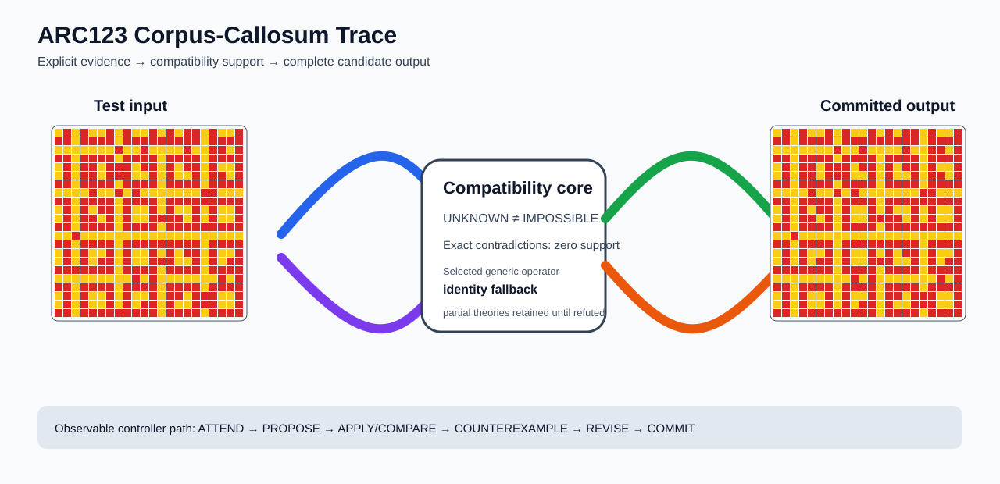

# ARC2 `1818057f` P0007 Brain Surgery Report

## Outcome: NO — TEST CELLS DO NOT ALL MATCH

- **Compared positions:** 484
- **Mismatched cells:** 30
- **Training compatibility:** `False`
- **Fallback used:** `True`
- **Causal trace acceptance:** `NO`
- **Selected hypothesis:** `fallback_identity_complete_grid`
- **Source commit:** `71f86ff4c5304e452e0659131171f0519b50e21c`

## Causal Ablations

| Configuration | Exact all-cell result | Training exact | Fallback | Selected hypothesis |
| --- | --- | --- | --- | --- |
| `no_revision` | `False` | `False` | `True` | `fallback_identity_complete_grid` |
| `no_new_residual_family` | `False` | `False` | `True` | `fallback_identity_complete_grid` |

## Live-Agent Boundary

The controller receives only visible training input/output examples and test inputs. It receives no task ID, offline audit label, GT feature record, GT solver, historical decomposition, or held-out output before committing a complete grid. The expected output appears only in the post-answer V&V section.

## Corpus-Callosum Visualization



- Full explicit event record: [`learning_trace.json`](learning_trace.json)
- Full three-configuration record: [`ablations.json`](ablations.json)

## Causal Trace Check

- **Counterexample observed:** `True`
- **Additional visible demonstration selected:** `True`
- **Composition recorded:** `True`
- **Parameter or multi-rule revision:** `True`
- **Generic families in selected theory:** `none`

## Post-Answer V&V

### Test case 1
- **All cells match:** `False`
- **Mismatched cells:** `30`
- **Prediction:**
```json
[[4, 2, 4, 2, 4, 4, 2, 4, 2, 4, 4, 2, 4, 2, 4, 2, 2, 4, 2, 4, 4, 2], [2, 2, 4, 2, 2, 2, 2, 4, 2, 2, 2, 2, 2, 2, 2, 2, 2, 4, 2, 2, 2, 2], [4, 4, 4, 4, 4, 4, 4, 2, 4, 4, 2, 4, 4, 4, 4, 2, 4, 4, 2, 2, 4, 2], [2, 2, 4, 2, 2, 2, 2, 4, 2, 2, 2, 2, 4, 2, 2, 2, 2, 4, 2, 2, 2, 2], [4, 2, 4, 2, 2, 4, 2, 2, 2, 4, 2, 2, 4, 2, 4, 2, 2, 4, 2, 4, 4, 2], [4, 2, 4, 2, 2, 4, 2, 2, 2, 4, 4, 2, 4, 2, 4, 4, 2, 4, 2, 2, 4, 2], [2, 2, 4, 2, 2, 2, 2, 4, 2, 2, 2, 2, 4, 2, 2, 2, 2, 4, 2, 2, 2, 2], [4, 4, 4, 4, 2, 4, 4, 2, 4, 2, 4, 4, 4, 4, 4, 4, 4, 2, 2, 4, 4, 4], [2, 2, 4, 2, 2, 2, 2, 4, 2, 2, 2, 2, 4, 2, 2, 2, 2, 2, 2, 2, 2, 2], [4, 2, 4, 2, 4, 2, 2, 4, 2, 4, 4, 2, 4, 2, 4, 4, 2, 4, 2, 4, 4, 2], [4, 2, 4, 2, 2, 4, 2, 4, 2, 4, 4, 2, 2, 2, 2, 4, 2, 4, 2, 4, 4, 2], [2, 2, 4, 2, 2, 2, 2, 4, 2, 2, 2, 2, 4, 2, 2, 2, 2, 2, 2, 2, 2, 2], [4, 4, 2, 4, 4, 4, 4, 4, 4, 4, 4, 4, 4, 4, 4, 4, 4, 4, 4, 4, 4, 4], [2, 2, 4, 2, 2, 2, 2, 4, 2, 2, 2, 2, 2, 2, 2, 2, 2, 4, 2, 2, 2, 2], [4, 2, 4, 2, 4, 4, 2, 4, 2, 4, 4, 2, 4, 2, 4, 2, 2, 4, 2, 4, 4, 2], [4, 2, 4, 2, 4, 2, 2, 4, 2, 4, 4, 2, 2, 2, 4, 4, 2, 4, 2, 4, 2, 2], [2, 2, 2, 2, 2, 2, 2, 4, 2, 2, 2, 2, 4, 2, 2, 2, 2, 4, 2, 2, 2, 2], [4, 4, 4, 4, 4, 4, 4, 4, 4, 2, 4, 2, 4, 4, 4, 4, 4, 4, 4, 2, 4, 2], [2, 2, 4, 2, 2, 2, 2, 4, 2, 2, 2, 2, 4, 2, 2, 2, 2, 4, 2, 2, 2, 2], [4, 2, 4, 2, 4, 4, 2, 4, 2, 4, 4, 2, 4, 2, 2, 4, 2, 2, 2, 4, 4, 2], [4, 2, 4, 2, 4, 4, 2, 4, 2, 4, 2, 2, 4, 2, 4, 4, 2, 2, 2, 4, 4, 2], [2, 2, 4, 2, 2, 2, 2, 2, 2, 2, 2, 2, 4, 2, 2, 2, 2, 4, 2, 2, 2, 2]]
```
- **Expected output (post-answer only):**
```json
[[4, 2, 4, 2, 4, 4, 2, 4, 2, 4, 4, 2, 4, 2, 4, 2, 2, 4, 2, 4, 4, 2], [2, 2, 8, 2, 2, 2, 2, 4, 2, 2, 2, 2, 2, 2, 2, 2, 2, 4, 2, 2, 2, 2], [4, 8, 8, 8, 4, 4, 4, 2, 4, 4, 2, 4, 4, 4, 4, 2, 4, 4, 2, 2, 4, 2], [2, 2, 8, 2, 2, 2, 2, 4, 2, 2, 2, 2, 4, 2, 2, 2, 2, 4, 2, 2, 2, 2], [4, 2, 4, 2, 2, 4, 2, 2, 2, 4, 2, 2, 4, 2, 4, 2, 2, 4, 2, 4, 4, 2], [4, 2, 4, 2, 2, 4, 2, 2, 2, 4, 4, 2, 4, 2, 4, 4, 2, 4, 2, 2, 4, 2], [2, 2, 8, 2, 2, 2, 2, 4, 2, 2, 2, 2, 8, 2, 2, 2, 2, 4, 2, 2, 2, 2], [4, 8, 8, 8, 2, 4, 4, 2, 4, 2, 4, 8, 8, 8, 4, 4, 4, 2, 2, 4, 4, 4], [2, 2, 8, 2, 2, 2, 2, 4, 2, 2, 2, 2, 8, 2, 2, 2, 2, 2, 2, 2, 2, 2], [4, 2, 4, 2, 4, 2, 2, 4, 2, 4, 4, 2, 4, 2, 4, 4, 2, 4, 2, 4, 4, 2], [4, 2, 4, 2, 2, 4, 2, 4, 2, 4, 4, 2, 2, 2, 2, 4, 2, 4, 2, 4, 4, 2], [2, 2, 4, 2, 2, 2, 2, 8, 2, 2, 2, 2, 4, 2, 2, 2, 2, 2, 2, 2, 2, 2], [4, 4, 2, 4, 4, 4, 8, 8, 8, 4, 4, 4, 4, 4, 4, 4, 4, 4, 4, 4, 4, 4], [2, 2, 4, 2, 2, 2, 2, 8, 2, 2, 2, 2, 2, 2, 2, 2, 2, 4, 2, 2, 2, 2], [4, 2, 4, 2, 4, 4, 2, 4, 2, 4, 4, 2, 4, 2, 4, 2, 2, 4, 2, 4, 4, 2], [4, 2, 4, 2, 4, 2, 2, 4, 2, 4, 4, 2, 2, 2, 4, 4, 2, 4, 2, 4, 2, 2], [2, 2, 2, 2, 2, 2, 2, 8, 2, 2, 2, 2, 4, 2, 2, 2, 2, 8, 2, 2, 2, 2], [4, 4, 4, 4, 4, 4, 8, 8, 8, 2, 4, 2, 4, 4, 4, 4, 8, 8, 8, 2, 4, 2], [2, 2, 4, 2, 2, 2, 2, 8, 2, 2, 2, 2, 4, 2, 2, 2, 2, 8, 2, 2, 2, 2], [4, 2, 4, 2, 4, 4, 2, 4, 2, 4, 4, 2, 4, 2, 2, 4, 2, 2, 2, 4, 4, 2], [4, 2, 4, 2, 4, 4, 2, 4, 2, 4, 2, 2, 4, 2, 4, 4, 2, 2, 2, 4, 4, 2], [2, 2, 4, 2, 2, 2, 2, 2, 2, 2, 2, 2, 4, 2, 2, 2, 2, 4, 2, 2, 2, 2]]
```

## Observable IHL Walkthrough

The record contains explicit actions, predictions, feedback, and revisions; it does not claim or store hidden model reasoning.

### Action totals

- `ADD_CONDITION`: 1
- `APPLY_HYPOTHESIS`: 247
- `ATTEND`: 247
- `BIND_PARAMETER`: 1
- `CHOOSE_NEXT_DEMO`: 247
- `COMMIT`: 1
- `COMPARE`: 247
- `COMPOSE_RULE`: 8
- `EXPLAIN_RESIDUAL`: 8
- `FIND_COUNTEREXAMPLE`: 9
- `PROPOSE`: 1
- `SPECIALIZE`: 93

### Decision milestones

- `0` `PROPOSE` — `{"parent_theory_id":"T0000","rule":{"description_length":1,"name":"identity","operation":"identity","parameters":{},"rule_id":"identity","scope":{"kind":"all","value":null}},"stage":"initial_generic_theories","theory_id":"T0001"}`
- `2` `ATTEND` — `{"reason":"initial_highest_observed_change_and_color_discrimination","selected_demo":1,"selected_region":{"column":3,"row":2},"theory_id":"T0001"}`
- `6` `ATTEND` — `{"reason":"counterexample_requires_visible_conditional_evidence:unseen_demo_selected_for_residual_version_space_discrimination","selected_demo":2,"selected_region":{"column":6,"row":4},"theory_id":"T0001"}`
- `10` `ATTEND` — `{"reason":"counterexample_requires_visible_conditional_evidence:unseen_demo_selected_for_residual_version_space_discrimination","selected_demo":0,"selected_region":{"column":9,"row":4},"theory_id":"T0001"}`
- `16` `SPECIALIZE` — `{"added_rule":{"description_length":4,"name":"row_span_fill(fill_color=8,seed_color=8)","operation":"full_operator","parameters":{"fill_color":8,"operator":"row_span_fill","seed_color":8},"rule_id":"structural-row_span_fill","scope":{"kind":"all","value":null}},"parent_theory_id":"T0001","reason":"unexplained_residual_proposed_generic_structural_rule","theory_id":"T0003"}`
- `17` `SPECIALIZE` — `{"added_rule":{"description_length":4,"name":"row_span_fill(fill_color=4,seed_color=8)","operation":"full_operator","parameters":{"fill_color":4,"operator":"row_span_fill","seed_color":8},"rule_id":"structural-row_span_fill","scope":{"kind":"all","value":null}},"parent_theory_id":"T0001","reason":"unexplained_residual_proposed_generic_structural_rule","theory_id":"T0004"}`
- `18` `SPECIALIZE` — `{"added_rule":{"description_length":4,"name":"line_extend(direction=up,fill_color=8,seed_color=8)","operation":"full_operator","parameters":{"direction":"up","fill_color":8,"operator":"line_extend","seed_color":8},"rule_id":"structural-line_extend","scope":{"kind":"all","value":null}},"parent_theory_id":"T0001","reason":"unexplained_residual_proposed_generic_structural_rule","theory_id":"T0005"}`
- `19` `SPECIALIZE` — `{"added_rule":{"description_length":4,"name":"line_extend(direction=up,fill_color=4,seed_color=8)","operation":"full_operator","parameters":{"direction":"up","fill_color":4,"operator":"line_extend","seed_color":8},"rule_id":"structural-line_extend","scope":{"kind":"all","value":null}},"parent_theory_id":"T0001","reason":"unexplained_residual_proposed_generic_structural_rule","theory_id":"T0006"}`
- `20` `SPECIALIZE` — `{"added_rule":{"description_length":4,"name":"line_extend(direction=right,fill_color=8,seed_color=8)","operation":"full_operator","parameters":{"direction":"right","fill_color":8,"operator":"line_extend","seed_color":8},"rule_id":"structural-line_extend","scope":{"kind":"all","value":null}},"parent_theory_id":"T0001","reason":"unexplained_residual_proposed_generic_structural_rule","theory_id":"T0007"}`
- `21` `SPECIALIZE` — `{"added_rule":{"description_length":4,"name":"line_extend(direction=right,fill_color=4,seed_color=8)","operation":"full_operator","parameters":{"direction":"right","fill_color":4,"operator":"line_extend","seed_color":8},"rule_id":"structural-line_extend","scope":{"kind":"all","value":null}},"parent_theory_id":"T0001","reason":"unexplained_residual_proposed_generic_structural_rule","theory_id":"T0008"}`
- `22` `SPECIALIZE` — `{"added_rule":{"description_length":4,"name":"line_extend(direction=left,fill_color=8,seed_color=8)","operation":"full_operator","parameters":{"direction":"left","fill_color":8,"operator":"line_extend","seed_color":8},"rule_id":"structural-line_extend","scope":{"kind":"all","value":null}},"parent_theory_id":"T0001","reason":"unexplained_residual_proposed_generic_structural_rule","theory_id":"T0009"}`
- `23` `SPECIALIZE` — `{"added_rule":{"description_length":4,"name":"line_extend(direction=left,fill_color=4,seed_color=8)","operation":"full_operator","parameters":{"direction":"left","fill_color":4,"operator":"line_extend","seed_color":8},"rule_id":"structural-line_extend","scope":{"kind":"all","value":null}},"parent_theory_id":"T0001","reason":"unexplained_residual_proposed_generic_structural_rule","theory_id":"T0010"}`
- `24` `SPECIALIZE` — `{"added_rule":{"description_length":4,"name":"line_extend(direction=down,fill_color=8,seed_color=8)","operation":"full_operator","parameters":{"direction":"down","fill_color":8,"operator":"line_extend","seed_color":8},"rule_id":"structural-line_extend","scope":{"kind":"all","value":null}},"parent_theory_id":"T0001","reason":"unexplained_residual_proposed_generic_structural_rule","theory_id":"T0011"}`
- `25` `SPECIALIZE` — `{"added_rule":{"description_length":4,"name":"line_extend(direction=down,fill_color=4,seed_color=8)","operation":"full_operator","parameters":{"direction":"down","fill_color":4,"operator":"line_extend","seed_color":8},"rule_id":"structural-line_extend","scope":{"kind":"all","value":null}},"parent_theory_id":"T0001","reason":"unexplained_residual_proposed_generic_structural_rule","theory_id":"T0012"}`
- `26` `SPECIALIZE` — `{"added_rule":{"description_length":4,"name":"row_span_fill(fill_color=8,seed_color=4)","operation":"full_operator","parameters":{"fill_color":8,"operator":"row_span_fill","seed_color":4},"rule_id":"structural-row_span_fill","scope":{"kind":"all","value":null}},"parent_theory_id":"T0001","reason":"unexplained_residual_proposed_generic_structural_rule","theory_id":"T0013"}`
- `27` `SPECIALIZE` — `{"added_rule":{"description_length":4,"name":"row_span_fill(fill_color=4,seed_color=4)","operation":"full_operator","parameters":{"fill_color":4,"operator":"row_span_fill","seed_color":4},"rule_id":"structural-row_span_fill","scope":{"kind":"all","value":null}},"parent_theory_id":"T0001","reason":"unexplained_residual_proposed_generic_structural_rule","theory_id":"T0014"}`
- `29` `ATTEND` — `{"reason":"initial_highest_observed_change_and_color_discrimination","selected_demo":1,"selected_region":{"column":0,"row":0},"theory_id":"T0002"}`
- `33` `ATTEND` — `{"reason":"initial_highest_observed_change_and_color_discrimination","selected_demo":1,"selected_region":{"column":3,"row":2},"theory_id":"T0003"}`
- `37` `ATTEND` — `{"reason":"initial_highest_observed_change_and_color_discrimination","selected_demo":1,"selected_region":{"column":3,"row":2},"theory_id":"T0004"}`
- `41` `ATTEND` — `{"reason":"initial_highest_observed_change_and_color_discrimination","selected_demo":1,"selected_region":{"column":3,"row":2},"theory_id":"T0005"}`
- `45` `ATTEND` — `{"reason":"initial_highest_observed_change_and_color_discrimination","selected_demo":1,"selected_region":{"column":3,"row":2},"theory_id":"T0006"}`
- `49` `ATTEND` — `{"reason":"initial_highest_observed_change_and_color_discrimination","selected_demo":1,"selected_region":{"column":3,"row":2},"theory_id":"T0007"}`
- `53` `ATTEND` — `{"reason":"initial_highest_observed_change_and_color_discrimination","selected_demo":1,"selected_region":{"column":3,"row":2},"theory_id":"T0008"}`
- `57` `ATTEND` — `{"reason":"initial_highest_observed_change_and_color_discrimination","selected_demo":1,"selected_region":{"column":3,"row":2},"theory_id":"T0009"}`
- `61` `ATTEND` — `{"reason":"initial_highest_observed_change_and_color_discrimination","selected_demo":1,"selected_region":{"column":3,"row":2},"theory_id":"T0010"}`
- `65` `ATTEND` — `{"reason":"initial_highest_observed_change_and_color_discrimination","selected_demo":1,"selected_region":{"column":3,"row":2},"theory_id":"T0011"}`
- `69` `ATTEND` — `{"reason":"initial_highest_observed_change_and_color_discrimination","selected_demo":1,"selected_region":{"column":3,"row":2},"theory_id":"T0012"}`
- `73` `ATTEND` — `{"reason":"initial_highest_observed_change_and_color_discrimination","selected_demo":1,"selected_region":{"column":2,"row":0},"theory_id":"T0013"}`
- `77` `ATTEND` — `{"reason":"counterexample_requires_visible_conditional_evidence:unseen_demo_selected_for_residual_version_space_discrimination","selected_demo":2,"selected_region":{"column":6,"row":4},"theory_id":"T0003"}`
- `81` `ATTEND` — `{"reason":"counterexample_requires_visible_conditional_evidence:unseen_demo_selected_for_residual_version_space_discrimination","selected_demo":2,"selected_region":{"column":6,"row":4},"theory_id":"T0004"}`
- `85` `ATTEND` — `{"reason":"counterexample_requires_visible_conditional_evidence:unseen_demo_selected_for_residual_version_space_discrimination","selected_demo":2,"selected_region":{"column":6,"row":4},"theory_id":"T0005"}`
- `89` `ATTEND` — `{"reason":"counterexample_requires_visible_conditional_evidence:unseen_demo_selected_for_residual_version_space_discrimination","selected_demo":2,"selected_region":{"column":6,"row":4},"theory_id":"T0006"}`
- `93` `ATTEND` — `{"reason":"counterexample_requires_visible_conditional_evidence:unseen_demo_selected_for_residual_version_space_discrimination","selected_demo":2,"selected_region":{"column":6,"row":4},"theory_id":"T0007"}`
- `97` `ATTEND` — `{"reason":"counterexample_requires_visible_conditional_evidence:unseen_demo_selected_for_residual_version_space_discrimination","selected_demo":2,"selected_region":{"column":6,"row":4},"theory_id":"T0008"}`
- `101` `ATTEND` — `{"reason":"counterexample_requires_visible_conditional_evidence:unseen_demo_selected_for_residual_version_space_discrimination","selected_demo":2,"selected_region":{"column":6,"row":4},"theory_id":"T0009"}`
- `105` `ATTEND` — `{"reason":"counterexample_requires_visible_conditional_evidence:unseen_demo_selected_for_residual_version_space_discrimination","selected_demo":2,"selected_region":{"column":6,"row":4},"theory_id":"T0010"}`
- `109` `ATTEND` — `{"reason":"counterexample_requires_visible_conditional_evidence:unseen_demo_selected_for_residual_version_space_discrimination","selected_demo":2,"selected_region":{"column":6,"row":4},"theory_id":"T0011"}`
- `113` `ATTEND` — `{"reason":"counterexample_requires_visible_conditional_evidence:unseen_demo_selected_for_residual_version_space_discrimination","selected_demo":2,"selected_region":{"column":6,"row":4},"theory_id":"T0012"}`
- `117` `ATTEND` — `{"reason":"counterexample_requires_visible_conditional_evidence:unseen_demo_selected_for_residual_version_space_discrimination","selected_demo":2,"selected_region":{"column":5,"row":0},"theory_id":"T0002"}`
- `121` `ATTEND` — `{"reason":"counterexample_requires_visible_conditional_evidence:unseen_demo_selected_for_residual_version_space_discrimination","selected_demo":0,"selected_region":{"column":9,"row":4},"theory_id":"T0003"}`
- `125` `ATTEND` — `{"reason":"counterexample_requires_visible_conditional_evidence:unseen_demo_selected_for_residual_version_space_discrimination","selected_demo":0,"selected_region":{"column":9,"row":4},"theory_id":"T0004"}`
- `129` `ATTEND` — `{"reason":"counterexample_requires_visible_conditional_evidence:unseen_demo_selected_for_residual_version_space_discrimination","selected_demo":0,"selected_region":{"column":9,"row":4},"theory_id":"T0005"}`
- `133` `ATTEND` — `{"reason":"counterexample_requires_visible_conditional_evidence:unseen_demo_selected_for_residual_version_space_discrimination","selected_demo":0,"selected_region":{"column":9,"row":4},"theory_id":"T0006"}`
- `137` `ATTEND` — `{"reason":"counterexample_requires_visible_conditional_evidence:unseen_demo_selected_for_residual_version_space_discrimination","selected_demo":0,"selected_region":{"column":9,"row":4},"theory_id":"T0007"}`
- `141` `ATTEND` — `{"reason":"counterexample_requires_visible_conditional_evidence:unseen_demo_selected_for_residual_version_space_discrimination","selected_demo":0,"selected_region":{"column":9,"row":4},"theory_id":"T0008"}`
- `145` `ATTEND` — `{"reason":"counterexample_requires_visible_conditional_evidence:unseen_demo_selected_for_residual_version_space_discrimination","selected_demo":0,"selected_region":{"column":9,"row":4},"theory_id":"T0009"}`
- `149` `ATTEND` — `{"reason":"counterexample_requires_visible_conditional_evidence:unseen_demo_selected_for_residual_version_space_discrimination","selected_demo":0,"selected_region":{"column":9,"row":4},"theory_id":"T0010"}`
- `153` `ATTEND` — `{"reason":"counterexample_requires_visible_conditional_evidence:unseen_demo_selected_for_residual_version_space_discrimination","selected_demo":0,"selected_region":{"column":9,"row":4},"theory_id":"T0011"}`
- `157` `ATTEND` — `{"reason":"counterexample_requires_visible_conditional_evidence:unseen_demo_selected_for_residual_version_space_discrimination","selected_demo":0,"selected_region":{"column":9,"row":4},"theory_id":"T0012"}`
- `163` `SPECIALIZE` — `{"added_rule":{"description_length":4,"name":"row_span_fill(fill_color=4,seed_color=8)","operation":"full_operator","parameters":{"fill_color":4,"operator":"row_span_fill","seed_color":8},"rule_id":"structural-row_span_fill","scope":{"kind":"all","value":null}},"parent_theory_id":"T0003","reason":"unexplained_residual_proposed_generic_structural_rule","theory_id":"T0016"}`
- `164` `SPECIALIZE` — `{"added_rule":{"description_length":4,"name":"line_extend(direction=up,fill_color=8,seed_color=8)","operation":"full_operator","parameters":{"direction":"up","fill_color":8,"operator":"line_extend","seed_color":8},"rule_id":"structural-line_extend","scope":{"kind":"all","value":null}},"parent_theory_id":"T0003","reason":"unexplained_residual_proposed_generic_structural_rule","theory_id":"T0017"}`
- `165` `SPECIALIZE` — `{"added_rule":{"description_length":4,"name":"line_extend(direction=up,fill_color=4,seed_color=8)","operation":"full_operator","parameters":{"direction":"up","fill_color":4,"operator":"line_extend","seed_color":8},"rule_id":"structural-line_extend","scope":{"kind":"all","value":null}},"parent_theory_id":"T0003","reason":"unexplained_residual_proposed_generic_structural_rule","theory_id":"T0018"}`
- `166` `SPECIALIZE` — `{"added_rule":{"description_length":4,"name":"line_extend(direction=right,fill_color=8,seed_color=8)","operation":"full_operator","parameters":{"direction":"right","fill_color":8,"operator":"line_extend","seed_color":8},"rule_id":"structural-line_extend","scope":{"kind":"all","value":null}},"parent_theory_id":"T0003","reason":"unexplained_residual_proposed_generic_structural_rule","theory_id":"T0019"}`
- `167` `SPECIALIZE` — `{"added_rule":{"description_length":4,"name":"line_extend(direction=right,fill_color=4,seed_color=8)","operation":"full_operator","parameters":{"direction":"right","fill_color":4,"operator":"line_extend","seed_color":8},"rule_id":"structural-line_extend","scope":{"kind":"all","value":null}},"parent_theory_id":"T0003","reason":"unexplained_residual_proposed_generic_structural_rule","theory_id":"T0020"}`
- `168` `SPECIALIZE` — `{"added_rule":{"description_length":4,"name":"line_extend(direction=left,fill_color=8,seed_color=8)","operation":"full_operator","parameters":{"direction":"left","fill_color":8,"operator":"line_extend","seed_color":8},"rule_id":"structural-line_extend","scope":{"kind":"all","value":null}},"parent_theory_id":"T0003","reason":"unexplained_residual_proposed_generic_structural_rule","theory_id":"T0021"}`
- `169` `SPECIALIZE` — `{"added_rule":{"description_length":4,"name":"line_extend(direction=left,fill_color=4,seed_color=8)","operation":"full_operator","parameters":{"direction":"left","fill_color":4,"operator":"line_extend","seed_color":8},"rule_id":"structural-line_extend","scope":{"kind":"all","value":null}},"parent_theory_id":"T0003","reason":"unexplained_residual_proposed_generic_structural_rule","theory_id":"T0022"}`
- `170` `SPECIALIZE` — `{"added_rule":{"description_length":4,"name":"line_extend(direction=down,fill_color=8,seed_color=8)","operation":"full_operator","parameters":{"direction":"down","fill_color":8,"operator":"line_extend","seed_color":8},"rule_id":"structural-line_extend","scope":{"kind":"all","value":null}},"parent_theory_id":"T0003","reason":"unexplained_residual_proposed_generic_structural_rule","theory_id":"T0023"}`
- `171` `SPECIALIZE` — `{"added_rule":{"description_length":4,"name":"line_extend(direction=down,fill_color=4,seed_color=8)","operation":"full_operator","parameters":{"direction":"down","fill_color":4,"operator":"line_extend","seed_color":8},"rule_id":"structural-line_extend","scope":{"kind":"all","value":null}},"parent_theory_id":"T0003","reason":"unexplained_residual_proposed_generic_structural_rule","theory_id":"T0024"}`
- `172` `SPECIALIZE` — `{"added_rule":{"description_length":4,"name":"row_span_fill(fill_color=8,seed_color=4)","operation":"full_operator","parameters":{"fill_color":8,"operator":"row_span_fill","seed_color":4},"rule_id":"structural-row_span_fill","scope":{"kind":"all","value":null}},"parent_theory_id":"T0003","reason":"unexplained_residual_proposed_generic_structural_rule","theory_id":"T0025"}`
- `173` `SPECIALIZE` — `{"added_rule":{"description_length":4,"name":"row_span_fill(fill_color=4,seed_color=4)","operation":"full_operator","parameters":{"fill_color":4,"operator":"row_span_fill","seed_color":4},"rule_id":"structural-row_span_fill","scope":{"kind":"all","value":null}},"parent_theory_id":"T0003","reason":"unexplained_residual_proposed_generic_structural_rule","theory_id":"T0026"}`
- `175` `ATTEND` — `{"reason":"initial_highest_observed_change_and_color_discrimination","selected_demo":1,"selected_region":{"column":3,"row":2},"theory_id":"T0015"}`
- `179` `ATTEND` — `{"reason":"initial_highest_observed_change_and_color_discrimination","selected_demo":1,"selected_region":{"column":3,"row":2},"theory_id":"T0016"}`
- `183` `ATTEND` — `{"reason":"initial_highest_observed_change_and_color_discrimination","selected_demo":1,"selected_region":{"column":3,"row":2},"theory_id":"T0017"}`
- `187` `ATTEND` — `{"reason":"initial_highest_observed_change_and_color_discrimination","selected_demo":1,"selected_region":{"column":3,"row":2},"theory_id":"T0018"}`
- `191` `ATTEND` — `{"reason":"initial_highest_observed_change_and_color_discrimination","selected_demo":1,"selected_region":{"column":3,"row":2},"theory_id":"T0019"}`
- `195` `ATTEND` — `{"reason":"initial_highest_observed_change_and_color_discrimination","selected_demo":1,"selected_region":{"column":3,"row":2},"theory_id":"T0020"}`
- `199` `ATTEND` — `{"reason":"initial_highest_observed_change_and_color_discrimination","selected_demo":1,"selected_region":{"column":3,"row":2},"theory_id":"T0021"}`
- `203` `ATTEND` — `{"reason":"initial_highest_observed_change_and_color_discrimination","selected_demo":1,"selected_region":{"column":3,"row":2},"theory_id":"T0022"}`
- `207` `ATTEND` — `{"reason":"initial_highest_observed_change_and_color_discrimination","selected_demo":1,"selected_region":{"column":3,"row":2},"theory_id":"T0023"}`
- `211` `ATTEND` — `{"reason":"initial_highest_observed_change_and_color_discrimination","selected_demo":1,"selected_region":{"column":3,"row":2},"theory_id":"T0024"}`
- `215` `ATTEND` — `{"reason":"initial_highest_observed_change_and_color_discrimination","selected_demo":1,"selected_region":{"column":2,"row":0},"theory_id":"T0025"}`
- `219` `ATTEND` — `{"reason":"initial_highest_observed_change_and_color_discrimination","selected_demo":1,"selected_region":{"column":2,"row":0},"theory_id":"T0026"}`
- `223` `ATTEND` — `{"reason":"counterexample_requires_visible_conditional_evidence:unseen_demo_selected_for_residual_version_space_discrimination","selected_demo":2,"selected_region":{"column":6,"row":4},"theory_id":"T0015"}`
- `227` `ATTEND` — `{"reason":"counterexample_requires_visible_conditional_evidence:unseen_demo_selected_for_residual_version_space_discrimination","selected_demo":2,"selected_region":{"column":6,"row":4},"theory_id":"T0016"}`
- `231` `ATTEND` — `{"reason":"counterexample_requires_visible_conditional_evidence:unseen_demo_selected_for_residual_version_space_discrimination","selected_demo":2,"selected_region":{"column":6,"row":4},"theory_id":"T0017"}`
- `235` `ATTEND` — `{"reason":"counterexample_requires_visible_conditional_evidence:unseen_demo_selected_for_residual_version_space_discrimination","selected_demo":2,"selected_region":{"column":6,"row":4},"theory_id":"T0018"}`
- `239` `ATTEND` — `{"reason":"counterexample_requires_visible_conditional_evidence:unseen_demo_selected_for_residual_version_space_discrimination","selected_demo":2,"selected_region":{"column":6,"row":4},"theory_id":"T0019"}`
- `243` `ATTEND` — `{"reason":"counterexample_requires_visible_conditional_evidence:unseen_demo_selected_for_residual_version_space_discrimination","selected_demo":2,"selected_region":{"column":6,"row":4},"theory_id":"T0020"}`
- `247` `ATTEND` — `{"reason":"counterexample_requires_visible_conditional_evidence:unseen_demo_selected_for_residual_version_space_discrimination","selected_demo":2,"selected_region":{"column":6,"row":4},"theory_id":"T0021"}`
- `251` `ATTEND` — `{"reason":"counterexample_requires_visible_conditional_evidence:unseen_demo_selected_for_residual_version_space_discrimination","selected_demo":2,"selected_region":{"column":6,"row":4},"theory_id":"T0022"}`
- `255` `ATTEND` — `{"reason":"counterexample_requires_visible_conditional_evidence:unseen_demo_selected_for_residual_version_space_discrimination","selected_demo":2,"selected_region":{"column":6,"row":4},"theory_id":"T0023"}`
- `259` `ATTEND` — `{"reason":"counterexample_requires_visible_conditional_evidence:unseen_demo_selected_for_residual_version_space_discrimination","selected_demo":2,"selected_region":{"column":6,"row":4},"theory_id":"T0024"}`
- `263` `ATTEND` — `{"reason":"counterexample_requires_visible_conditional_evidence:unseen_demo_selected_for_residual_version_space_discrimination","selected_demo":0,"selected_region":{"column":9,"row":4},"theory_id":"T0015"}`
- `267` `ATTEND` — `{"reason":"counterexample_requires_visible_conditional_evidence:unseen_demo_selected_for_residual_version_space_discrimination","selected_demo":0,"selected_region":{"column":9,"row":4},"theory_id":"T0016"}`
- `271` `ATTEND` — `{"reason":"counterexample_requires_visible_conditional_evidence:unseen_demo_selected_for_residual_version_space_discrimination","selected_demo":0,"selected_region":{"column":9,"row":4},"theory_id":"T0017"}`
- `275` `ATTEND` — `{"reason":"counterexample_requires_visible_conditional_evidence:unseen_demo_selected_for_residual_version_space_discrimination","selected_demo":0,"selected_region":{"column":9,"row":4},"theory_id":"T0018"}`
- `279` `ATTEND` — `{"reason":"counterexample_requires_visible_conditional_evidence:unseen_demo_selected_for_residual_version_space_discrimination","selected_demo":0,"selected_region":{"column":9,"row":4},"theory_id":"T0019"}`
- `283` `ATTEND` — `{"reason":"counterexample_requires_visible_conditional_evidence:unseen_demo_selected_for_residual_version_space_discrimination","selected_demo":0,"selected_region":{"column":9,"row":4},"theory_id":"T0020"}`
- `287` `ATTEND` — `{"reason":"counterexample_requires_visible_conditional_evidence:unseen_demo_selected_for_residual_version_space_discrimination","selected_demo":0,"selected_region":{"column":9,"row":4},"theory_id":"T0021"}`
- `291` `ATTEND` — `{"reason":"counterexample_requires_visible_conditional_evidence:unseen_demo_selected_for_residual_version_space_discrimination","selected_demo":0,"selected_region":{"column":9,"row":4},"theory_id":"T0022"}`
- `295` `ATTEND` — `{"reason":"counterexample_requires_visible_conditional_evidence:unseen_demo_selected_for_residual_version_space_discrimination","selected_demo":0,"selected_region":{"column":9,"row":4},"theory_id":"T0023"}`
- `299` `ATTEND` — `{"reason":"counterexample_requires_visible_conditional_evidence:unseen_demo_selected_for_residual_version_space_discrimination","selected_demo":0,"selected_region":{"column":9,"row":4},"theory_id":"T0024"}`
- `305` `SPECIALIZE` — `{"added_rule":{"description_length":4,"name":"row_span_fill(fill_color=8,seed_color=8)","operation":"full_operator","parameters":{"fill_color":8,"operator":"row_span_fill","seed_color":8},"rule_id":"structural-row_span_fill","scope":{"kind":"all","value":null}},"parent_theory_id":"T0015","reason":"unexplained_residual_proposed_generic_structural_rule","theory_id":"T0028"}`
- `306` `SPECIALIZE` — `{"added_rule":{"description_length":4,"name":"row_span_fill(fill_color=4,seed_color=8)","operation":"full_operator","parameters":{"fill_color":4,"operator":"row_span_fill","seed_color":8},"rule_id":"structural-row_span_fill","scope":{"kind":"all","value":null}},"parent_theory_id":"T0015","reason":"unexplained_residual_proposed_generic_structural_rule","theory_id":"T0029"}`
- `307` `SPECIALIZE` — `{"added_rule":{"description_length":4,"name":"line_extend(direction=up,fill_color=8,seed_color=8)","operation":"full_operator","parameters":{"direction":"up","fill_color":8,"operator":"line_extend","seed_color":8},"rule_id":"structural-line_extend","scope":{"kind":"all","value":null}},"parent_theory_id":"T0015","reason":"unexplained_residual_proposed_generic_structural_rule","theory_id":"T0030"}`
- `308` `SPECIALIZE` — `{"added_rule":{"description_length":4,"name":"line_extend(direction=up,fill_color=4,seed_color=8)","operation":"full_operator","parameters":{"direction":"up","fill_color":4,"operator":"line_extend","seed_color":8},"rule_id":"structural-line_extend","scope":{"kind":"all","value":null}},"parent_theory_id":"T0015","reason":"unexplained_residual_proposed_generic_structural_rule","theory_id":"T0031"}`
- `309` `SPECIALIZE` — `{"added_rule":{"description_length":4,"name":"line_extend(direction=right,fill_color=8,seed_color=8)","operation":"full_operator","parameters":{"direction":"right","fill_color":8,"operator":"line_extend","seed_color":8},"rule_id":"structural-line_extend","scope":{"kind":"all","value":null}},"parent_theory_id":"T0015","reason":"unexplained_residual_proposed_generic_structural_rule","theory_id":"T0032"}`
- `310` `SPECIALIZE` — `{"added_rule":{"description_length":4,"name":"line_extend(direction=right,fill_color=4,seed_color=8)","operation":"full_operator","parameters":{"direction":"right","fill_color":4,"operator":"line_extend","seed_color":8},"rule_id":"structural-line_extend","scope":{"kind":"all","value":null}},"parent_theory_id":"T0015","reason":"unexplained_residual_proposed_generic_structural_rule","theory_id":"T0033"}`
- `311` `SPECIALIZE` — `{"added_rule":{"description_length":4,"name":"line_extend(direction=left,fill_color=8,seed_color=8)","operation":"full_operator","parameters":{"direction":"left","fill_color":8,"operator":"line_extend","seed_color":8},"rule_id":"structural-line_extend","scope":{"kind":"all","value":null}},"parent_theory_id":"T0015","reason":"unexplained_residual_proposed_generic_structural_rule","theory_id":"T0034"}`
- `312` `SPECIALIZE` — `{"added_rule":{"description_length":4,"name":"line_extend(direction=left,fill_color=4,seed_color=8)","operation":"full_operator","parameters":{"direction":"left","fill_color":4,"operator":"line_extend","seed_color":8},"rule_id":"structural-line_extend","scope":{"kind":"all","value":null}},"parent_theory_id":"T0015","reason":"unexplained_residual_proposed_generic_structural_rule","theory_id":"T0035"}`
- `313` `SPECIALIZE` — `{"added_rule":{"description_length":4,"name":"line_extend(direction=down,fill_color=8,seed_color=8)","operation":"full_operator","parameters":{"direction":"down","fill_color":8,"operator":"line_extend","seed_color":8},"rule_id":"structural-line_extend","scope":{"kind":"all","value":null}},"parent_theory_id":"T0015","reason":"unexplained_residual_proposed_generic_structural_rule","theory_id":"T0036"}`
- `314` `SPECIALIZE` — `{"added_rule":{"description_length":4,"name":"line_extend(direction=down,fill_color=4,seed_color=8)","operation":"full_operator","parameters":{"direction":"down","fill_color":4,"operator":"line_extend","seed_color":8},"rule_id":"structural-line_extend","scope":{"kind":"all","value":null}},"parent_theory_id":"T0015","reason":"unexplained_residual_proposed_generic_structural_rule","theory_id":"T0037"}`
- `315` `SPECIALIZE` — `{"added_rule":{"description_length":4,"name":"row_span_fill(fill_color=8,seed_color=4)","operation":"full_operator","parameters":{"fill_color":8,"operator":"row_span_fill","seed_color":4},"rule_id":"structural-row_span_fill","scope":{"kind":"all","value":null}},"parent_theory_id":"T0015","reason":"unexplained_residual_proposed_generic_structural_rule","theory_id":"T0038"}`
- `316` `SPECIALIZE` — `{"added_rule":{"description_length":4,"name":"row_span_fill(fill_color=4,seed_color=4)","operation":"full_operator","parameters":{"fill_color":4,"operator":"row_span_fill","seed_color":4},"rule_id":"structural-row_span_fill","scope":{"kind":"all","value":null}},"parent_theory_id":"T0015","reason":"unexplained_residual_proposed_generic_structural_rule","theory_id":"T0039"}`
- `318` `ATTEND` — `{"reason":"initial_highest_observed_change_and_color_discrimination","selected_demo":1,"selected_region":{"column":0,"row":0},"theory_id":"T0027"}`
- `322` `ATTEND` — `{"reason":"initial_highest_observed_change_and_color_discrimination","selected_demo":1,"selected_region":{"column":3,"row":2},"theory_id":"T0028"}`
- `326` `ATTEND` — `{"reason":"initial_highest_observed_change_and_color_discrimination","selected_demo":1,"selected_region":{"column":3,"row":2},"theory_id":"T0029"}`
- `330` `ATTEND` — `{"reason":"initial_highest_observed_change_and_color_discrimination","selected_demo":1,"selected_region":{"column":3,"row":2},"theory_id":"T0030"}`
- `334` `ATTEND` — `{"reason":"initial_highest_observed_change_and_color_discrimination","selected_demo":1,"selected_region":{"column":3,"row":2},"theory_id":"T0031"}`
- `338` `ATTEND` — `{"reason":"initial_highest_observed_change_and_color_discrimination","selected_demo":1,"selected_region":{"column":3,"row":2},"theory_id":"T0032"}`
- `342` `ATTEND` — `{"reason":"initial_highest_observed_change_and_color_discrimination","selected_demo":1,"selected_region":{"column":3,"row":2},"theory_id":"T0033"}`
- `346` `ATTEND` — `{"reason":"initial_highest_observed_change_and_color_discrimination","selected_demo":1,"selected_region":{"column":3,"row":2},"theory_id":"T0034"}`
- `350` `ATTEND` — `{"reason":"initial_highest_observed_change_and_color_discrimination","selected_demo":1,"selected_region":{"column":3,"row":2},"theory_id":"T0035"}`
- `354` `ATTEND` — `{"reason":"initial_highest_observed_change_and_color_discrimination","selected_demo":1,"selected_region":{"column":3,"row":2},"theory_id":"T0036"}`
- `358` `ATTEND` — `{"reason":"initial_highest_observed_change_and_color_discrimination","selected_demo":1,"selected_region":{"column":3,"row":2},"theory_id":"T0037"}`
- `362` `ATTEND` — `{"reason":"initial_highest_observed_change_and_color_discrimination","selected_demo":1,"selected_region":{"column":2,"row":0},"theory_id":"T0038"}`
- `366` `ATTEND` — `{"reason":"counterexample_requires_visible_conditional_evidence:unseen_demo_selected_for_residual_version_space_discrimination","selected_demo":2,"selected_region":{"column":6,"row":4},"theory_id":"T0028"}`
- `370` `ATTEND` — `{"reason":"counterexample_requires_visible_conditional_evidence:unseen_demo_selected_for_residual_version_space_discrimination","selected_demo":2,"selected_region":{"column":6,"row":4},"theory_id":"T0029"}`
- `374` `ATTEND` — `{"reason":"counterexample_requires_visible_conditional_evidence:unseen_demo_selected_for_residual_version_space_discrimination","selected_demo":2,"selected_region":{"column":6,"row":4},"theory_id":"T0030"}`
- `378` `ATTEND` — `{"reason":"counterexample_requires_visible_conditional_evidence:unseen_demo_selected_for_residual_version_space_discrimination","selected_demo":2,"selected_region":{"column":6,"row":4},"theory_id":"T0031"}`
- `382` `ATTEND` — `{"reason":"counterexample_requires_visible_conditional_evidence:unseen_demo_selected_for_residual_version_space_discrimination","selected_demo":2,"selected_region":{"column":6,"row":4},"theory_id":"T0032"}`
- `386` `ATTEND` — `{"reason":"counterexample_requires_visible_conditional_evidence:unseen_demo_selected_for_residual_version_space_discrimination","selected_demo":2,"selected_region":{"column":6,"row":4},"theory_id":"T0033"}`
- `390` `ATTEND` — `{"reason":"counterexample_requires_visible_conditional_evidence:unseen_demo_selected_for_residual_version_space_discrimination","selected_demo":2,"selected_region":{"column":6,"row":4},"theory_id":"T0034"}`
- `394` `ATTEND` — `{"reason":"counterexample_requires_visible_conditional_evidence:unseen_demo_selected_for_residual_version_space_discrimination","selected_demo":2,"selected_region":{"column":6,"row":4},"theory_id":"T0035"}`
- `398` `ATTEND` — `{"reason":"counterexample_requires_visible_conditional_evidence:unseen_demo_selected_for_residual_version_space_discrimination","selected_demo":2,"selected_region":{"column":6,"row":4},"theory_id":"T0036"}`
- `402` `ATTEND` — `{"reason":"counterexample_requires_visible_conditional_evidence:unseen_demo_selected_for_residual_version_space_discrimination","selected_demo":2,"selected_region":{"column":6,"row":4},"theory_id":"T0037"}`
- `406` `ATTEND` — `{"reason":"counterexample_requires_visible_conditional_evidence:unseen_demo_selected_for_residual_version_space_discrimination","selected_demo":2,"selected_region":{"column":5,"row":0},"theory_id":"T0027"}`
- `410` `ATTEND` — `{"reason":"counterexample_requires_visible_conditional_evidence:unseen_demo_selected_for_residual_version_space_discrimination","selected_demo":0,"selected_region":{"column":9,"row":4},"theory_id":"T0028"}`
- `414` `ATTEND` — `{"reason":"counterexample_requires_visible_conditional_evidence:unseen_demo_selected_for_residual_version_space_discrimination","selected_demo":0,"selected_region":{"column":9,"row":4},"theory_id":"T0029"}`
- `418` `ATTEND` — `{"reason":"counterexample_requires_visible_conditional_evidence:unseen_demo_selected_for_residual_version_space_discrimination","selected_demo":0,"selected_region":{"column":9,"row":4},"theory_id":"T0030"}`
- `422` `ATTEND` — `{"reason":"counterexample_requires_visible_conditional_evidence:unseen_demo_selected_for_residual_version_space_discrimination","selected_demo":0,"selected_region":{"column":9,"row":4},"theory_id":"T0031"}`
- `426` `ATTEND` — `{"reason":"counterexample_requires_visible_conditional_evidence:unseen_demo_selected_for_residual_version_space_discrimination","selected_demo":0,"selected_region":{"column":9,"row":4},"theory_id":"T0032"}`
- `430` `ATTEND` — `{"reason":"counterexample_requires_visible_conditional_evidence:unseen_demo_selected_for_residual_version_space_discrimination","selected_demo":0,"selected_region":{"column":9,"row":4},"theory_id":"T0033"}`
- `434` `ATTEND` — `{"reason":"counterexample_requires_visible_conditional_evidence:unseen_demo_selected_for_residual_version_space_discrimination","selected_demo":0,"selected_region":{"column":9,"row":4},"theory_id":"T0034"}`
- `438` `ATTEND` — `{"reason":"counterexample_requires_visible_conditional_evidence:unseen_demo_selected_for_residual_version_space_discrimination","selected_demo":0,"selected_region":{"column":9,"row":4},"theory_id":"T0035"}`
- `442` `ATTEND` — `{"reason":"counterexample_requires_visible_conditional_evidence:unseen_demo_selected_for_residual_version_space_discrimination","selected_demo":0,"selected_region":{"column":9,"row":4},"theory_id":"T0036"}`
- `446` `ATTEND` — `{"reason":"counterexample_requires_visible_conditional_evidence:unseen_demo_selected_for_residual_version_space_discrimination","selected_demo":0,"selected_region":{"column":9,"row":4},"theory_id":"T0037"}`
- `452` `SPECIALIZE` — `{"added_rule":{"description_length":4,"name":"row_span_fill(fill_color=4,seed_color=8)","operation":"full_operator","parameters":{"fill_color":4,"operator":"row_span_fill","seed_color":8},"rule_id":"structural-row_span_fill","scope":{"kind":"all","value":null}},"parent_theory_id":"T0028","reason":"unexplained_residual_proposed_generic_structural_rule","theory_id":"T0041"}`
- `453` `SPECIALIZE` — `{"added_rule":{"description_length":4,"name":"line_extend(direction=up,fill_color=8,seed_color=8)","operation":"full_operator","parameters":{"direction":"up","fill_color":8,"operator":"line_extend","seed_color":8},"rule_id":"structural-line_extend","scope":{"kind":"all","value":null}},"parent_theory_id":"T0028","reason":"unexplained_residual_proposed_generic_structural_rule","theory_id":"T0042"}`
- `454` `SPECIALIZE` — `{"added_rule":{"description_length":4,"name":"line_extend(direction=up,fill_color=4,seed_color=8)","operation":"full_operator","parameters":{"direction":"up","fill_color":4,"operator":"line_extend","seed_color":8},"rule_id":"structural-line_extend","scope":{"kind":"all","value":null}},"parent_theory_id":"T0028","reason":"unexplained_residual_proposed_generic_structural_rule","theory_id":"T0043"}`
- `455` `SPECIALIZE` — `{"added_rule":{"description_length":4,"name":"line_extend(direction=right,fill_color=8,seed_color=8)","operation":"full_operator","parameters":{"direction":"right","fill_color":8,"operator":"line_extend","seed_color":8},"rule_id":"structural-line_extend","scope":{"kind":"all","value":null}},"parent_theory_id":"T0028","reason":"unexplained_residual_proposed_generic_structural_rule","theory_id":"T0044"}`
- `456` `SPECIALIZE` — `{"added_rule":{"description_length":4,"name":"line_extend(direction=right,fill_color=4,seed_color=8)","operation":"full_operator","parameters":{"direction":"right","fill_color":4,"operator":"line_extend","seed_color":8},"rule_id":"structural-line_extend","scope":{"kind":"all","value":null}},"parent_theory_id":"T0028","reason":"unexplained_residual_proposed_generic_structural_rule","theory_id":"T0045"}`
- `457` `SPECIALIZE` — `{"added_rule":{"description_length":4,"name":"line_extend(direction=left,fill_color=8,seed_color=8)","operation":"full_operator","parameters":{"direction":"left","fill_color":8,"operator":"line_extend","seed_color":8},"rule_id":"structural-line_extend","scope":{"kind":"all","value":null}},"parent_theory_id":"T0028","reason":"unexplained_residual_proposed_generic_structural_rule","theory_id":"T0046"}`
- `458` `SPECIALIZE` — `{"added_rule":{"description_length":4,"name":"line_extend(direction=left,fill_color=4,seed_color=8)","operation":"full_operator","parameters":{"direction":"left","fill_color":4,"operator":"line_extend","seed_color":8},"rule_id":"structural-line_extend","scope":{"kind":"all","value":null}},"parent_theory_id":"T0028","reason":"unexplained_residual_proposed_generic_structural_rule","theory_id":"T0047"}`
- `459` `SPECIALIZE` — `{"added_rule":{"description_length":4,"name":"line_extend(direction=down,fill_color=8,seed_color=8)","operation":"full_operator","parameters":{"direction":"down","fill_color":8,"operator":"line_extend","seed_color":8},"rule_id":"structural-line_extend","scope":{"kind":"all","value":null}},"parent_theory_id":"T0028","reason":"unexplained_residual_proposed_generic_structural_rule","theory_id":"T0048"}`
- `460` `SPECIALIZE` — `{"added_rule":{"description_length":4,"name":"line_extend(direction=down,fill_color=4,seed_color=8)","operation":"full_operator","parameters":{"direction":"down","fill_color":4,"operator":"line_extend","seed_color":8},"rule_id":"structural-line_extend","scope":{"kind":"all","value":null}},"parent_theory_id":"T0028","reason":"unexplained_residual_proposed_generic_structural_rule","theory_id":"T0049"}`
- `461` `SPECIALIZE` — `{"added_rule":{"description_length":4,"name":"row_span_fill(fill_color=8,seed_color=4)","operation":"full_operator","parameters":{"fill_color":8,"operator":"row_span_fill","seed_color":4},"rule_id":"structural-row_span_fill","scope":{"kind":"all","value":null}},"parent_theory_id":"T0028","reason":"unexplained_residual_proposed_generic_structural_rule","theory_id":"T0050"}`
- `462` `SPECIALIZE` — `{"added_rule":{"description_length":4,"name":"row_span_fill(fill_color=4,seed_color=4)","operation":"full_operator","parameters":{"fill_color":4,"operator":"row_span_fill","seed_color":4},"rule_id":"structural-row_span_fill","scope":{"kind":"all","value":null}},"parent_theory_id":"T0028","reason":"unexplained_residual_proposed_generic_structural_rule","theory_id":"T0051"}`
- `464` `ATTEND` — `{"reason":"initial_highest_observed_change_and_color_discrimination","selected_demo":1,"selected_region":{"column":0,"row":0},"theory_id":"T0040"}`
- `468` `ATTEND` — `{"reason":"initial_highest_observed_change_and_color_discrimination","selected_demo":1,"selected_region":{"column":3,"row":2},"theory_id":"T0041"}`
- `472` `ATTEND` — `{"reason":"initial_highest_observed_change_and_color_discrimination","selected_demo":1,"selected_region":{"column":3,"row":2},"theory_id":"T0042"}`
- `476` `ATTEND` — `{"reason":"initial_highest_observed_change_and_color_discrimination","selected_demo":1,"selected_region":{"column":3,"row":2},"theory_id":"T0043"}`
- `480` `ATTEND` — `{"reason":"initial_highest_observed_change_and_color_discrimination","selected_demo":1,"selected_region":{"column":3,"row":2},"theory_id":"T0044"}`
- `484` `ATTEND` — `{"reason":"initial_highest_observed_change_and_color_discrimination","selected_demo":1,"selected_region":{"column":3,"row":2},"theory_id":"T0045"}`
- `488` `ATTEND` — `{"reason":"initial_highest_observed_change_and_color_discrimination","selected_demo":1,"selected_region":{"column":3,"row":2},"theory_id":"T0046"}`
- `492` `ATTEND` — `{"reason":"initial_highest_observed_change_and_color_discrimination","selected_demo":1,"selected_region":{"column":3,"row":2},"theory_id":"T0047"}`
- `496` `ATTEND` — `{"reason":"initial_highest_observed_change_and_color_discrimination","selected_demo":1,"selected_region":{"column":3,"row":2},"theory_id":"T0048"}`
- `500` `ATTEND` — `{"reason":"initial_highest_observed_change_and_color_discrimination","selected_demo":1,"selected_region":{"column":3,"row":2},"theory_id":"T0049"}`
- `504` `ATTEND` — `{"reason":"initial_highest_observed_change_and_color_discrimination","selected_demo":1,"selected_region":{"column":2,"row":0},"theory_id":"T0050"}`
- `508` `ATTEND` — `{"reason":"initial_highest_observed_change_and_color_discrimination","selected_demo":1,"selected_region":{"column":2,"row":0},"theory_id":"T0051"}`
- `512` `ATTEND` — `{"reason":"counterexample_requires_visible_conditional_evidence:unseen_demo_selected_for_residual_version_space_discrimination","selected_demo":2,"selected_region":{"column":6,"row":4},"theory_id":"T0041"}`
- `516` `ATTEND` — `{"reason":"counterexample_requires_visible_conditional_evidence:unseen_demo_selected_for_residual_version_space_discrimination","selected_demo":2,"selected_region":{"column":6,"row":4},"theory_id":"T0042"}`
- `520` `ATTEND` — `{"reason":"counterexample_requires_visible_conditional_evidence:unseen_demo_selected_for_residual_version_space_discrimination","selected_demo":2,"selected_region":{"column":6,"row":4},"theory_id":"T0043"}`
- `524` `ATTEND` — `{"reason":"counterexample_requires_visible_conditional_evidence:unseen_demo_selected_for_residual_version_space_discrimination","selected_demo":2,"selected_region":{"column":6,"row":4},"theory_id":"T0044"}`
- `528` `ATTEND` — `{"reason":"counterexample_requires_visible_conditional_evidence:unseen_demo_selected_for_residual_version_space_discrimination","selected_demo":2,"selected_region":{"column":6,"row":4},"theory_id":"T0045"}`
- `532` `ATTEND` — `{"reason":"counterexample_requires_visible_conditional_evidence:unseen_demo_selected_for_residual_version_space_discrimination","selected_demo":2,"selected_region":{"column":6,"row":4},"theory_id":"T0046"}`
- `536` `ATTEND` — `{"reason":"counterexample_requires_visible_conditional_evidence:unseen_demo_selected_for_residual_version_space_discrimination","selected_demo":2,"selected_region":{"column":6,"row":4},"theory_id":"T0047"}`
- `540` `ATTEND` — `{"reason":"counterexample_requires_visible_conditional_evidence:unseen_demo_selected_for_residual_version_space_discrimination","selected_demo":2,"selected_region":{"column":6,"row":4},"theory_id":"T0048"}`
- `544` `ATTEND` — `{"reason":"counterexample_requires_visible_conditional_evidence:unseen_demo_selected_for_residual_version_space_discrimination","selected_demo":2,"selected_region":{"column":6,"row":4},"theory_id":"T0049"}`
- `548` `ATTEND` — `{"reason":"counterexample_requires_visible_conditional_evidence:unseen_demo_selected_for_residual_version_space_discrimination","selected_demo":2,"selected_region":{"column":5,"row":0},"theory_id":"T0040"}`
- `552` `ATTEND` — `{"reason":"counterexample_requires_visible_conditional_evidence:unseen_demo_selected_for_residual_version_space_discrimination","selected_demo":0,"selected_region":{"column":9,"row":4},"theory_id":"T0041"}`
- `556` `ATTEND` — `{"reason":"counterexample_requires_visible_conditional_evidence:unseen_demo_selected_for_residual_version_space_discrimination","selected_demo":0,"selected_region":{"column":9,"row":4},"theory_id":"T0042"}`
- `560` `ATTEND` — `{"reason":"counterexample_requires_visible_conditional_evidence:unseen_demo_selected_for_residual_version_space_discrimination","selected_demo":0,"selected_region":{"column":9,"row":4},"theory_id":"T0043"}`
- `564` `ATTEND` — `{"reason":"counterexample_requires_visible_conditional_evidence:unseen_demo_selected_for_residual_version_space_discrimination","selected_demo":0,"selected_region":{"column":9,"row":4},"theory_id":"T0044"}`
- `568` `ATTEND` — `{"reason":"counterexample_requires_visible_conditional_evidence:unseen_demo_selected_for_residual_version_space_discrimination","selected_demo":0,"selected_region":{"column":9,"row":4},"theory_id":"T0045"}`
- `572` `ATTEND` — `{"reason":"counterexample_requires_visible_conditional_evidence:unseen_demo_selected_for_residual_version_space_discrimination","selected_demo":0,"selected_region":{"column":9,"row":4},"theory_id":"T0046"}`
- `576` `ATTEND` — `{"reason":"counterexample_requires_visible_conditional_evidence:unseen_demo_selected_for_residual_version_space_discrimination","selected_demo":0,"selected_region":{"column":9,"row":4},"theory_id":"T0047"}`
- `580` `ATTEND` — `{"reason":"counterexample_requires_visible_conditional_evidence:unseen_demo_selected_for_residual_version_space_discrimination","selected_demo":0,"selected_region":{"column":9,"row":4},"theory_id":"T0048"}`
- `584` `ATTEND` — `{"reason":"counterexample_requires_visible_conditional_evidence:unseen_demo_selected_for_residual_version_space_discrimination","selected_demo":0,"selected_region":{"column":9,"row":4},"theory_id":"T0049"}`
- `590` `SPECIALIZE` — `{"added_rule":{"description_length":4,"name":"line_extend(direction=up,fill_color=8,seed_color=8)","operation":"full_operator","parameters":{"direction":"up","fill_color":8,"operator":"line_extend","seed_color":8},"rule_id":"structural-line_extend","scope":{"kind":"all","value":null}},"parent_theory_id":"T0041","reason":"unexplained_residual_proposed_generic_structural_rule","theory_id":"T0053"}`
- `591` `SPECIALIZE` — `{"added_rule":{"description_length":4,"name":"line_extend(direction=up,fill_color=4,seed_color=8)","operation":"full_operator","parameters":{"direction":"up","fill_color":4,"operator":"line_extend","seed_color":8},"rule_id":"structural-line_extend","scope":{"kind":"all","value":null}},"parent_theory_id":"T0041","reason":"unexplained_residual_proposed_generic_structural_rule","theory_id":"T0054"}`
- `592` `SPECIALIZE` — `{"added_rule":{"description_length":4,"name":"line_extend(direction=right,fill_color=8,seed_color=8)","operation":"full_operator","parameters":{"direction":"right","fill_color":8,"operator":"line_extend","seed_color":8},"rule_id":"structural-line_extend","scope":{"kind":"all","value":null}},"parent_theory_id":"T0041","reason":"unexplained_residual_proposed_generic_structural_rule","theory_id":"T0055"}`
- `593` `SPECIALIZE` — `{"added_rule":{"description_length":4,"name":"line_extend(direction=right,fill_color=4,seed_color=8)","operation":"full_operator","parameters":{"direction":"right","fill_color":4,"operator":"line_extend","seed_color":8},"rule_id":"structural-line_extend","scope":{"kind":"all","value":null}},"parent_theory_id":"T0041","reason":"unexplained_residual_proposed_generic_structural_rule","theory_id":"T0056"}`
- `594` `SPECIALIZE` — `{"added_rule":{"description_length":4,"name":"line_extend(direction=left,fill_color=8,seed_color=8)","operation":"full_operator","parameters":{"direction":"left","fill_color":8,"operator":"line_extend","seed_color":8},"rule_id":"structural-line_extend","scope":{"kind":"all","value":null}},"parent_theory_id":"T0041","reason":"unexplained_residual_proposed_generic_structural_rule","theory_id":"T0057"}`
- `595` `SPECIALIZE` — `{"added_rule":{"description_length":4,"name":"line_extend(direction=left,fill_color=4,seed_color=8)","operation":"full_operator","parameters":{"direction":"left","fill_color":4,"operator":"line_extend","seed_color":8},"rule_id":"structural-line_extend","scope":{"kind":"all","value":null}},"parent_theory_id":"T0041","reason":"unexplained_residual_proposed_generic_structural_rule","theory_id":"T0058"}`
- `596` `SPECIALIZE` — `{"added_rule":{"description_length":4,"name":"line_extend(direction=down,fill_color=8,seed_color=8)","operation":"full_operator","parameters":{"direction":"down","fill_color":8,"operator":"line_extend","seed_color":8},"rule_id":"structural-line_extend","scope":{"kind":"all","value":null}},"parent_theory_id":"T0041","reason":"unexplained_residual_proposed_generic_structural_rule","theory_id":"T0059"}`
- `597` `SPECIALIZE` — `{"added_rule":{"description_length":4,"name":"line_extend(direction=down,fill_color=4,seed_color=8)","operation":"full_operator","parameters":{"direction":"down","fill_color":4,"operator":"line_extend","seed_color":8},"rule_id":"structural-line_extend","scope":{"kind":"all","value":null}},"parent_theory_id":"T0041","reason":"unexplained_residual_proposed_generic_structural_rule","theory_id":"T0060"}`
- `598` `SPECIALIZE` — `{"added_rule":{"description_length":4,"name":"row_span_fill(fill_color=8,seed_color=4)","operation":"full_operator","parameters":{"fill_color":8,"operator":"row_span_fill","seed_color":4},"rule_id":"structural-row_span_fill","scope":{"kind":"all","value":null}},"parent_theory_id":"T0041","reason":"unexplained_residual_proposed_generic_structural_rule","theory_id":"T0061"}`
- `599` `SPECIALIZE` — `{"added_rule":{"description_length":4,"name":"row_span_fill(fill_color=4,seed_color=4)","operation":"full_operator","parameters":{"fill_color":4,"operator":"row_span_fill","seed_color":4},"rule_id":"structural-row_span_fill","scope":{"kind":"all","value":null}},"parent_theory_id":"T0041","reason":"unexplained_residual_proposed_generic_structural_rule","theory_id":"T0062"}`
- `601` `ATTEND` — `{"reason":"initial_highest_observed_change_and_color_discrimination","selected_demo":1,"selected_region":{"column":0,"row":0},"theory_id":"T0052"}`
- `605` `ATTEND` — `{"reason":"initial_highest_observed_change_and_color_discrimination","selected_demo":1,"selected_region":{"column":3,"row":2},"theory_id":"T0053"}`
- `609` `ATTEND` — `{"reason":"initial_highest_observed_change_and_color_discrimination","selected_demo":1,"selected_region":{"column":3,"row":2},"theory_id":"T0054"}`
- `613` `ATTEND` — `{"reason":"initial_highest_observed_change_and_color_discrimination","selected_demo":1,"selected_region":{"column":3,"row":2},"theory_id":"T0055"}`
- `617` `ATTEND` — `{"reason":"initial_highest_observed_change_and_color_discrimination","selected_demo":1,"selected_region":{"column":3,"row":2},"theory_id":"T0056"}`
- `621` `ATTEND` — `{"reason":"initial_highest_observed_change_and_color_discrimination","selected_demo":1,"selected_region":{"column":3,"row":2},"theory_id":"T0057"}`
- `625` `ATTEND` — `{"reason":"initial_highest_observed_change_and_color_discrimination","selected_demo":1,"selected_region":{"column":3,"row":2},"theory_id":"T0058"}`
- `629` `ATTEND` — `{"reason":"initial_highest_observed_change_and_color_discrimination","selected_demo":1,"selected_region":{"column":3,"row":2},"theory_id":"T0059"}`
- `633` `ATTEND` — `{"reason":"initial_highest_observed_change_and_color_discrimination","selected_demo":1,"selected_region":{"column":3,"row":2},"theory_id":"T0060"}`
- `637` `ATTEND` — `{"reason":"initial_highest_observed_change_and_color_discrimination","selected_demo":1,"selected_region":{"column":2,"row":0},"theory_id":"T0061"}`
- `641` `ATTEND` — `{"reason":"initial_highest_observed_change_and_color_discrimination","selected_demo":1,"selected_region":{"column":2,"row":0},"theory_id":"T0062"}`
- `645` `ATTEND` — `{"reason":"counterexample_requires_visible_conditional_evidence:unseen_demo_selected_for_residual_version_space_discrimination","selected_demo":2,"selected_region":{"column":6,"row":4},"theory_id":"T0053"}`
- `649` `ATTEND` — `{"reason":"counterexample_requires_visible_conditional_evidence:unseen_demo_selected_for_residual_version_space_discrimination","selected_demo":2,"selected_region":{"column":6,"row":4},"theory_id":"T0054"}`
- `653` `ATTEND` — `{"reason":"counterexample_requires_visible_conditional_evidence:unseen_demo_selected_for_residual_version_space_discrimination","selected_demo":2,"selected_region":{"column":6,"row":4},"theory_id":"T0055"}`
- `657` `ATTEND` — `{"reason":"counterexample_requires_visible_conditional_evidence:unseen_demo_selected_for_residual_version_space_discrimination","selected_demo":2,"selected_region":{"column":6,"row":4},"theory_id":"T0056"}`
- `661` `ATTEND` — `{"reason":"counterexample_requires_visible_conditional_evidence:unseen_demo_selected_for_residual_version_space_discrimination","selected_demo":2,"selected_region":{"column":6,"row":4},"theory_id":"T0057"}`
- `665` `ATTEND` — `{"reason":"counterexample_requires_visible_conditional_evidence:unseen_demo_selected_for_residual_version_space_discrimination","selected_demo":2,"selected_region":{"column":6,"row":4},"theory_id":"T0058"}`
- `669` `ATTEND` — `{"reason":"counterexample_requires_visible_conditional_evidence:unseen_demo_selected_for_residual_version_space_discrimination","selected_demo":2,"selected_region":{"column":6,"row":4},"theory_id":"T0059"}`
- `673` `ATTEND` — `{"reason":"counterexample_requires_visible_conditional_evidence:unseen_demo_selected_for_residual_version_space_discrimination","selected_demo":2,"selected_region":{"column":6,"row":4},"theory_id":"T0060"}`
- `677` `ATTEND` — `{"reason":"counterexample_requires_visible_conditional_evidence:unseen_demo_selected_for_residual_version_space_discrimination","selected_demo":2,"selected_region":{"column":5,"row":0},"theory_id":"T0052"}`
- `681` `ATTEND` — `{"reason":"counterexample_requires_visible_conditional_evidence:unseen_demo_selected_for_residual_version_space_discrimination","selected_demo":0,"selected_region":{"column":9,"row":4},"theory_id":"T0053"}`
- `685` `ATTEND` — `{"reason":"counterexample_requires_visible_conditional_evidence:unseen_demo_selected_for_residual_version_space_discrimination","selected_demo":0,"selected_region":{"column":9,"row":4},"theory_id":"T0054"}`
- `689` `ATTEND` — `{"reason":"counterexample_requires_visible_conditional_evidence:unseen_demo_selected_for_residual_version_space_discrimination","selected_demo":0,"selected_region":{"column":9,"row":4},"theory_id":"T0055"}`
- `693` `ATTEND` — `{"reason":"counterexample_requires_visible_conditional_evidence:unseen_demo_selected_for_residual_version_space_discrimination","selected_demo":0,"selected_region":{"column":9,"row":4},"theory_id":"T0056"}`
- `697` `ATTEND` — `{"reason":"counterexample_requires_visible_conditional_evidence:unseen_demo_selected_for_residual_version_space_discrimination","selected_demo":0,"selected_region":{"column":9,"row":4},"theory_id":"T0057"}`
- `701` `ATTEND` — `{"reason":"counterexample_requires_visible_conditional_evidence:unseen_demo_selected_for_residual_version_space_discrimination","selected_demo":0,"selected_region":{"column":9,"row":4},"theory_id":"T0058"}`
- `705` `ATTEND` — `{"reason":"counterexample_requires_visible_conditional_evidence:unseen_demo_selected_for_residual_version_space_discrimination","selected_demo":0,"selected_region":{"column":9,"row":4},"theory_id":"T0059"}`
- `709` `ATTEND` — `{"reason":"counterexample_requires_visible_conditional_evidence:unseen_demo_selected_for_residual_version_space_discrimination","selected_demo":0,"selected_region":{"column":9,"row":4},"theory_id":"T0060"}`
- `715` `SPECIALIZE` — `{"added_rule":{"description_length":4,"name":"row_span_fill(fill_color=4,seed_color=8)","operation":"full_operator","parameters":{"fill_color":4,"operator":"row_span_fill","seed_color":8},"rule_id":"structural-row_span_fill","scope":{"kind":"all","value":null}},"parent_theory_id":"T0042","reason":"unexplained_residual_proposed_generic_structural_rule","theory_id":"T0064"}`
- `716` `SPECIALIZE` — `{"added_rule":{"description_length":4,"name":"line_extend(direction=up,fill_color=4,seed_color=8)","operation":"full_operator","parameters":{"direction":"up","fill_color":4,"operator":"line_extend","seed_color":8},"rule_id":"structural-line_extend","scope":{"kind":"all","value":null}},"parent_theory_id":"T0042","reason":"unexplained_residual_proposed_generic_structural_rule","theory_id":"T0065"}`
- `717` `SPECIALIZE` — `{"added_rule":{"description_length":4,"name":"line_extend(direction=right,fill_color=8,seed_color=8)","operation":"full_operator","parameters":{"direction":"right","fill_color":8,"operator":"line_extend","seed_color":8},"rule_id":"structural-line_extend","scope":{"kind":"all","value":null}},"parent_theory_id":"T0042","reason":"unexplained_residual_proposed_generic_structural_rule","theory_id":"T0066"}`
- `718` `SPECIALIZE` — `{"added_rule":{"description_length":4,"name":"line_extend(direction=right,fill_color=4,seed_color=8)","operation":"full_operator","parameters":{"direction":"right","fill_color":4,"operator":"line_extend","seed_color":8},"rule_id":"structural-line_extend","scope":{"kind":"all","value":null}},"parent_theory_id":"T0042","reason":"unexplained_residual_proposed_generic_structural_rule","theory_id":"T0067"}`
- `719` `SPECIALIZE` — `{"added_rule":{"description_length":4,"name":"line_extend(direction=left,fill_color=8,seed_color=8)","operation":"full_operator","parameters":{"direction":"left","fill_color":8,"operator":"line_extend","seed_color":8},"rule_id":"structural-line_extend","scope":{"kind":"all","value":null}},"parent_theory_id":"T0042","reason":"unexplained_residual_proposed_generic_structural_rule","theory_id":"T0068"}`
- `720` `SPECIALIZE` — `{"added_rule":{"description_length":4,"name":"line_extend(direction=left,fill_color=4,seed_color=8)","operation":"full_operator","parameters":{"direction":"left","fill_color":4,"operator":"line_extend","seed_color":8},"rule_id":"structural-line_extend","scope":{"kind":"all","value":null}},"parent_theory_id":"T0042","reason":"unexplained_residual_proposed_generic_structural_rule","theory_id":"T0069"}`
- `721` `SPECIALIZE` — `{"added_rule":{"description_length":4,"name":"line_extend(direction=down,fill_color=8,seed_color=8)","operation":"full_operator","parameters":{"direction":"down","fill_color":8,"operator":"line_extend","seed_color":8},"rule_id":"structural-line_extend","scope":{"kind":"all","value":null}},"parent_theory_id":"T0042","reason":"unexplained_residual_proposed_generic_structural_rule","theory_id":"T0070"}`
- `722` `SPECIALIZE` — `{"added_rule":{"description_length":4,"name":"line_extend(direction=down,fill_color=4,seed_color=8)","operation":"full_operator","parameters":{"direction":"down","fill_color":4,"operator":"line_extend","seed_color":8},"rule_id":"structural-line_extend","scope":{"kind":"all","value":null}},"parent_theory_id":"T0042","reason":"unexplained_residual_proposed_generic_structural_rule","theory_id":"T0071"}`
- `723` `SPECIALIZE` — `{"added_rule":{"description_length":4,"name":"row_span_fill(fill_color=8,seed_color=4)","operation":"full_operator","parameters":{"fill_color":8,"operator":"row_span_fill","seed_color":4},"rule_id":"structural-row_span_fill","scope":{"kind":"all","value":null}},"parent_theory_id":"T0042","reason":"unexplained_residual_proposed_generic_structural_rule","theory_id":"T0072"}`
- `724` `SPECIALIZE` — `{"added_rule":{"description_length":4,"name":"row_span_fill(fill_color=4,seed_color=4)","operation":"full_operator","parameters":{"fill_color":4,"operator":"row_span_fill","seed_color":4},"rule_id":"structural-row_span_fill","scope":{"kind":"all","value":null}},"parent_theory_id":"T0042","reason":"unexplained_residual_proposed_generic_structural_rule","theory_id":"T0073"}`
- `726` `ATTEND` — `{"reason":"initial_highest_observed_change_and_color_discrimination","selected_demo":1,"selected_region":{"column":0,"row":0},"theory_id":"T0063"}`
- `730` `ATTEND` — `{"reason":"initial_highest_observed_change_and_color_discrimination","selected_demo":1,"selected_region":{"column":3,"row":2},"theory_id":"T0064"}`
- `734` `ATTEND` — `{"reason":"initial_highest_observed_change_and_color_discrimination","selected_demo":1,"selected_region":{"column":3,"row":2},"theory_id":"T0065"}`
- `738` `ATTEND` — `{"reason":"initial_highest_observed_change_and_color_discrimination","selected_demo":1,"selected_region":{"column":3,"row":2},"theory_id":"T0066"}`
- `742` `ATTEND` — `{"reason":"initial_highest_observed_change_and_color_discrimination","selected_demo":1,"selected_region":{"column":3,"row":2},"theory_id":"T0067"}`
- `746` `ATTEND` — `{"reason":"initial_highest_observed_change_and_color_discrimination","selected_demo":1,"selected_region":{"column":3,"row":2},"theory_id":"T0068"}`
- `750` `ATTEND` — `{"reason":"initial_highest_observed_change_and_color_discrimination","selected_demo":1,"selected_region":{"column":3,"row":2},"theory_id":"T0069"}`
- `754` `ATTEND` — `{"reason":"initial_highest_observed_change_and_color_discrimination","selected_demo":1,"selected_region":{"column":3,"row":2},"theory_id":"T0070"}`
- `758` `ATTEND` — `{"reason":"initial_highest_observed_change_and_color_discrimination","selected_demo":1,"selected_region":{"column":3,"row":2},"theory_id":"T0071"}`
- `762` `ATTEND` — `{"reason":"initial_highest_observed_change_and_color_discrimination","selected_demo":1,"selected_region":{"column":2,"row":0},"theory_id":"T0072"}`
- `766` `ATTEND` — `{"reason":"initial_highest_observed_change_and_color_discrimination","selected_demo":1,"selected_region":{"column":2,"row":0},"theory_id":"T0073"}`
- `770` `ATTEND` — `{"reason":"counterexample_requires_visible_conditional_evidence:unseen_demo_selected_for_residual_version_space_discrimination","selected_demo":2,"selected_region":{"column":6,"row":4},"theory_id":"T0064"}`
- `774` `ATTEND` — `{"reason":"counterexample_requires_visible_conditional_evidence:unseen_demo_selected_for_residual_version_space_discrimination","selected_demo":2,"selected_region":{"column":6,"row":4},"theory_id":"T0065"}`
- `778` `ATTEND` — `{"reason":"counterexample_requires_visible_conditional_evidence:unseen_demo_selected_for_residual_version_space_discrimination","selected_demo":2,"selected_region":{"column":6,"row":4},"theory_id":"T0066"}`
- `782` `ATTEND` — `{"reason":"counterexample_requires_visible_conditional_evidence:unseen_demo_selected_for_residual_version_space_discrimination","selected_demo":2,"selected_region":{"column":6,"row":4},"theory_id":"T0067"}`
- `786` `ATTEND` — `{"reason":"counterexample_requires_visible_conditional_evidence:unseen_demo_selected_for_residual_version_space_discrimination","selected_demo":2,"selected_region":{"column":6,"row":4},"theory_id":"T0068"}`
- `790` `ATTEND` — `{"reason":"counterexample_requires_visible_conditional_evidence:unseen_demo_selected_for_residual_version_space_discrimination","selected_demo":2,"selected_region":{"column":6,"row":4},"theory_id":"T0069"}`
- `794` `ATTEND` — `{"reason":"counterexample_requires_visible_conditional_evidence:unseen_demo_selected_for_residual_version_space_discrimination","selected_demo":2,"selected_region":{"column":6,"row":4},"theory_id":"T0070"}`
- `798` `ATTEND` — `{"reason":"counterexample_requires_visible_conditional_evidence:unseen_demo_selected_for_residual_version_space_discrimination","selected_demo":2,"selected_region":{"column":6,"row":4},"theory_id":"T0071"}`
- `802` `ATTEND` — `{"reason":"counterexample_requires_visible_conditional_evidence:unseen_demo_selected_for_residual_version_space_discrimination","selected_demo":2,"selected_region":{"column":5,"row":0},"theory_id":"T0063"}`
- `806` `ATTEND` — `{"reason":"counterexample_requires_visible_conditional_evidence:unseen_demo_selected_for_residual_version_space_discrimination","selected_demo":0,"selected_region":{"column":9,"row":4},"theory_id":"T0064"}`
- `810` `ATTEND` — `{"reason":"counterexample_requires_visible_conditional_evidence:unseen_demo_selected_for_residual_version_space_discrimination","selected_demo":0,"selected_region":{"column":9,"row":4},"theory_id":"T0065"}`
- `814` `ATTEND` — `{"reason":"counterexample_requires_visible_conditional_evidence:unseen_demo_selected_for_residual_version_space_discrimination","selected_demo":0,"selected_region":{"column":9,"row":4},"theory_id":"T0066"}`
- `818` `ATTEND` — `{"reason":"counterexample_requires_visible_conditional_evidence:unseen_demo_selected_for_residual_version_space_discrimination","selected_demo":0,"selected_region":{"column":9,"row":4},"theory_id":"T0067"}`
- `822` `ATTEND` — `{"reason":"counterexample_requires_visible_conditional_evidence:unseen_demo_selected_for_residual_version_space_discrimination","selected_demo":0,"selected_region":{"column":9,"row":4},"theory_id":"T0068"}`
- `826` `ATTEND` — `{"reason":"counterexample_requires_visible_conditional_evidence:unseen_demo_selected_for_residual_version_space_discrimination","selected_demo":0,"selected_region":{"column":9,"row":4},"theory_id":"T0069"}`
- `830` `ATTEND` — `{"reason":"counterexample_requires_visible_conditional_evidence:unseen_demo_selected_for_residual_version_space_discrimination","selected_demo":0,"selected_region":{"column":9,"row":4},"theory_id":"T0070"}`
- `834` `ATTEND` — `{"reason":"counterexample_requires_visible_conditional_evidence:unseen_demo_selected_for_residual_version_space_discrimination","selected_demo":0,"selected_region":{"column":9,"row":4},"theory_id":"T0071"}`
- `840` `SPECIALIZE` — `{"added_rule":{"description_length":4,"name":"line_extend(direction=up,fill_color=4,seed_color=8)","operation":"full_operator","parameters":{"direction":"up","fill_color":4,"operator":"line_extend","seed_color":8},"rule_id":"structural-line_extend","scope":{"kind":"all","value":null}},"parent_theory_id":"T0053","reason":"unexplained_residual_proposed_generic_structural_rule","theory_id":"T0075"}`
- `841` `SPECIALIZE` — `{"added_rule":{"description_length":4,"name":"line_extend(direction=right,fill_color=8,seed_color=8)","operation":"full_operator","parameters":{"direction":"right","fill_color":8,"operator":"line_extend","seed_color":8},"rule_id":"structural-line_extend","scope":{"kind":"all","value":null}},"parent_theory_id":"T0053","reason":"unexplained_residual_proposed_generic_structural_rule","theory_id":"T0076"}`
- `842` `SPECIALIZE` — `{"added_rule":{"description_length":4,"name":"line_extend(direction=right,fill_color=4,seed_color=8)","operation":"full_operator","parameters":{"direction":"right","fill_color":4,"operator":"line_extend","seed_color":8},"rule_id":"structural-line_extend","scope":{"kind":"all","value":null}},"parent_theory_id":"T0053","reason":"unexplained_residual_proposed_generic_structural_rule","theory_id":"T0077"}`
- `843` `SPECIALIZE` — `{"added_rule":{"description_length":4,"name":"line_extend(direction=left,fill_color=8,seed_color=8)","operation":"full_operator","parameters":{"direction":"left","fill_color":8,"operator":"line_extend","seed_color":8},"rule_id":"structural-line_extend","scope":{"kind":"all","value":null}},"parent_theory_id":"T0053","reason":"unexplained_residual_proposed_generic_structural_rule","theory_id":"T0078"}`
- `844` `SPECIALIZE` — `{"added_rule":{"description_length":4,"name":"line_extend(direction=left,fill_color=4,seed_color=8)","operation":"full_operator","parameters":{"direction":"left","fill_color":4,"operator":"line_extend","seed_color":8},"rule_id":"structural-line_extend","scope":{"kind":"all","value":null}},"parent_theory_id":"T0053","reason":"unexplained_residual_proposed_generic_structural_rule","theory_id":"T0079"}`
- `845` `SPECIALIZE` — `{"added_rule":{"description_length":4,"name":"line_extend(direction=down,fill_color=8,seed_color=8)","operation":"full_operator","parameters":{"direction":"down","fill_color":8,"operator":"line_extend","seed_color":8},"rule_id":"structural-line_extend","scope":{"kind":"all","value":null}},"parent_theory_id":"T0053","reason":"unexplained_residual_proposed_generic_structural_rule","theory_id":"T0080"}`
- `846` `SPECIALIZE` — `{"added_rule":{"description_length":4,"name":"line_extend(direction=down,fill_color=4,seed_color=8)","operation":"full_operator","parameters":{"direction":"down","fill_color":4,"operator":"line_extend","seed_color":8},"rule_id":"structural-line_extend","scope":{"kind":"all","value":null}},"parent_theory_id":"T0053","reason":"unexplained_residual_proposed_generic_structural_rule","theory_id":"T0081"}`
- `847` `SPECIALIZE` — `{"added_rule":{"description_length":4,"name":"row_span_fill(fill_color=8,seed_color=4)","operation":"full_operator","parameters":{"fill_color":8,"operator":"row_span_fill","seed_color":4},"rule_id":"structural-row_span_fill","scope":{"kind":"all","value":null}},"parent_theory_id":"T0053","reason":"unexplained_residual_proposed_generic_structural_rule","theory_id":"T0082"}`
- `848` `SPECIALIZE` — `{"added_rule":{"description_length":4,"name":"row_span_fill(fill_color=4,seed_color=4)","operation":"full_operator","parameters":{"fill_color":4,"operator":"row_span_fill","seed_color":4},"rule_id":"structural-row_span_fill","scope":{"kind":"all","value":null}},"parent_theory_id":"T0053","reason":"unexplained_residual_proposed_generic_structural_rule","theory_id":"T0083"}`
- `850` `ATTEND` — `{"reason":"initial_highest_observed_change_and_color_discrimination","selected_demo":1,"selected_region":{"column":0,"row":0},"theory_id":"T0074"}`
- `854` `ATTEND` — `{"reason":"initial_highest_observed_change_and_color_discrimination","selected_demo":1,"selected_region":{"column":3,"row":2},"theory_id":"T0075"}`
- `858` `ATTEND` — `{"reason":"initial_highest_observed_change_and_color_discrimination","selected_demo":1,"selected_region":{"column":3,"row":2},"theory_id":"T0076"}`
- `862` `ATTEND` — `{"reason":"initial_highest_observed_change_and_color_discrimination","selected_demo":1,"selected_region":{"column":3,"row":2},"theory_id":"T0077"}`
- `866` `ATTEND` — `{"reason":"initial_highest_observed_change_and_color_discrimination","selected_demo":1,"selected_region":{"column":3,"row":2},"theory_id":"T0078"}`
- `870` `ATTEND` — `{"reason":"initial_highest_observed_change_and_color_discrimination","selected_demo":1,"selected_region":{"column":3,"row":2},"theory_id":"T0079"}`
- `874` `ATTEND` — `{"reason":"initial_highest_observed_change_and_color_discrimination","selected_demo":1,"selected_region":{"column":3,"row":2},"theory_id":"T0080"}`
- `878` `ATTEND` — `{"reason":"initial_highest_observed_change_and_color_discrimination","selected_demo":1,"selected_region":{"column":3,"row":2},"theory_id":"T0081"}`
- `882` `ATTEND` — `{"reason":"initial_highest_observed_change_and_color_discrimination","selected_demo":1,"selected_region":{"column":2,"row":0},"theory_id":"T0082"}`
- `886` `ATTEND` — `{"reason":"initial_highest_observed_change_and_color_discrimination","selected_demo":1,"selected_region":{"column":2,"row":0},"theory_id":"T0083"}`
- `890` `ATTEND` — `{"reason":"counterexample_requires_visible_conditional_evidence:unseen_demo_selected_for_residual_version_space_discrimination","selected_demo":2,"selected_region":{"column":6,"row":4},"theory_id":"T0075"}`
- `894` `ATTEND` — `{"reason":"counterexample_requires_visible_conditional_evidence:unseen_demo_selected_for_residual_version_space_discrimination","selected_demo":2,"selected_region":{"column":6,"row":4},"theory_id":"T0076"}`
- `898` `ATTEND` — `{"reason":"counterexample_requires_visible_conditional_evidence:unseen_demo_selected_for_residual_version_space_discrimination","selected_demo":2,"selected_region":{"column":6,"row":4},"theory_id":"T0077"}`
- `902` `ATTEND` — `{"reason":"counterexample_requires_visible_conditional_evidence:unseen_demo_selected_for_residual_version_space_discrimination","selected_demo":2,"selected_region":{"column":6,"row":4},"theory_id":"T0078"}`
- `906` `ATTEND` — `{"reason":"counterexample_requires_visible_conditional_evidence:unseen_demo_selected_for_residual_version_space_discrimination","selected_demo":2,"selected_region":{"column":6,"row":4},"theory_id":"T0079"}`
- `910` `ATTEND` — `{"reason":"counterexample_requires_visible_conditional_evidence:unseen_demo_selected_for_residual_version_space_discrimination","selected_demo":2,"selected_region":{"column":6,"row":4},"theory_id":"T0080"}`
- `914` `ATTEND` — `{"reason":"counterexample_requires_visible_conditional_evidence:unseen_demo_selected_for_residual_version_space_discrimination","selected_demo":2,"selected_region":{"column":6,"row":4},"theory_id":"T0081"}`
- `918` `ATTEND` — `{"reason":"counterexample_requires_visible_conditional_evidence:unseen_demo_selected_for_residual_version_space_discrimination","selected_demo":2,"selected_region":{"column":5,"row":0},"theory_id":"T0074"}`
- `922` `ATTEND` — `{"reason":"counterexample_requires_visible_conditional_evidence:unseen_demo_selected_for_residual_version_space_discrimination","selected_demo":0,"selected_region":{"column":9,"row":4},"theory_id":"T0075"}`
- `926` `ATTEND` — `{"reason":"counterexample_requires_visible_conditional_evidence:unseen_demo_selected_for_residual_version_space_discrimination","selected_demo":0,"selected_region":{"column":9,"row":4},"theory_id":"T0076"}`
- `930` `ATTEND` — `{"reason":"counterexample_requires_visible_conditional_evidence:unseen_demo_selected_for_residual_version_space_discrimination","selected_demo":0,"selected_region":{"column":9,"row":4},"theory_id":"T0077"}`
- `934` `ATTEND` — `{"reason":"counterexample_requires_visible_conditional_evidence:unseen_demo_selected_for_residual_version_space_discrimination","selected_demo":0,"selected_region":{"column":9,"row":4},"theory_id":"T0078"}`
- `938` `ATTEND` — `{"reason":"counterexample_requires_visible_conditional_evidence:unseen_demo_selected_for_residual_version_space_discrimination","selected_demo":0,"selected_region":{"column":9,"row":4},"theory_id":"T0079"}`
- `942` `ATTEND` — `{"reason":"counterexample_requires_visible_conditional_evidence:unseen_demo_selected_for_residual_version_space_discrimination","selected_demo":0,"selected_region":{"column":9,"row":4},"theory_id":"T0080"}`
- `946` `ATTEND` — `{"reason":"counterexample_requires_visible_conditional_evidence:unseen_demo_selected_for_residual_version_space_discrimination","selected_demo":0,"selected_region":{"column":9,"row":4},"theory_id":"T0081"}`
- `952` `SPECIALIZE` — `{"added_rule":{"description_length":4,"name":"line_extend(direction=up,fill_color=4,seed_color=8)","operation":"full_operator","parameters":{"direction":"up","fill_color":4,"operator":"line_extend","seed_color":8},"rule_id":"structural-line_extend","scope":{"kind":"all","value":null}},"parent_theory_id":"T0064","reason":"unexplained_residual_proposed_generic_structural_rule","theory_id":"T0085"}`
- `953` `SPECIALIZE` — `{"added_rule":{"description_length":4,"name":"line_extend(direction=right,fill_color=8,seed_color=8)","operation":"full_operator","parameters":{"direction":"right","fill_color":8,"operator":"line_extend","seed_color":8},"rule_id":"structural-line_extend","scope":{"kind":"all","value":null}},"parent_theory_id":"T0064","reason":"unexplained_residual_proposed_generic_structural_rule","theory_id":"T0086"}`
- `954` `SPECIALIZE` — `{"added_rule":{"description_length":4,"name":"line_extend(direction=right,fill_color=4,seed_color=8)","operation":"full_operator","parameters":{"direction":"right","fill_color":4,"operator":"line_extend","seed_color":8},"rule_id":"structural-line_extend","scope":{"kind":"all","value":null}},"parent_theory_id":"T0064","reason":"unexplained_residual_proposed_generic_structural_rule","theory_id":"T0087"}`
- `955` `SPECIALIZE` — `{"added_rule":{"description_length":4,"name":"line_extend(direction=left,fill_color=8,seed_color=8)","operation":"full_operator","parameters":{"direction":"left","fill_color":8,"operator":"line_extend","seed_color":8},"rule_id":"structural-line_extend","scope":{"kind":"all","value":null}},"parent_theory_id":"T0064","reason":"unexplained_residual_proposed_generic_structural_rule","theory_id":"T0088"}`
- `956` `SPECIALIZE` — `{"added_rule":{"description_length":4,"name":"line_extend(direction=left,fill_color=4,seed_color=8)","operation":"full_operator","parameters":{"direction":"left","fill_color":4,"operator":"line_extend","seed_color":8},"rule_id":"structural-line_extend","scope":{"kind":"all","value":null}},"parent_theory_id":"T0064","reason":"unexplained_residual_proposed_generic_structural_rule","theory_id":"T0089"}`
- `957` `SPECIALIZE` — `{"added_rule":{"description_length":4,"name":"line_extend(direction=down,fill_color=8,seed_color=8)","operation":"full_operator","parameters":{"direction":"down","fill_color":8,"operator":"line_extend","seed_color":8},"rule_id":"structural-line_extend","scope":{"kind":"all","value":null}},"parent_theory_id":"T0064","reason":"unexplained_residual_proposed_generic_structural_rule","theory_id":"T0090"}`
- `958` `SPECIALIZE` — `{"added_rule":{"description_length":4,"name":"line_extend(direction=down,fill_color=4,seed_color=8)","operation":"full_operator","parameters":{"direction":"down","fill_color":4,"operator":"line_extend","seed_color":8},"rule_id":"structural-line_extend","scope":{"kind":"all","value":null}},"parent_theory_id":"T0064","reason":"unexplained_residual_proposed_generic_structural_rule","theory_id":"T0091"}`
- `959` `SPECIALIZE` — `{"added_rule":{"description_length":4,"name":"row_span_fill(fill_color=8,seed_color=4)","operation":"full_operator","parameters":{"fill_color":8,"operator":"row_span_fill","seed_color":4},"rule_id":"structural-row_span_fill","scope":{"kind":"all","value":null}},"parent_theory_id":"T0064","reason":"unexplained_residual_proposed_generic_structural_rule","theory_id":"T0092"}`
- `960` `SPECIALIZE` — `{"added_rule":{"description_length":4,"name":"row_span_fill(fill_color=4,seed_color=4)","operation":"full_operator","parameters":{"fill_color":4,"operator":"row_span_fill","seed_color":4},"rule_id":"structural-row_span_fill","scope":{"kind":"all","value":null}},"parent_theory_id":"T0064","reason":"unexplained_residual_proposed_generic_structural_rule","theory_id":"T0093"}`
- `962` `ATTEND` — `{"reason":"initial_highest_observed_change_and_color_discrimination","selected_demo":1,"selected_region":{"column":0,"row":0},"theory_id":"T0084"}`
- `966` `ATTEND` — `{"reason":"initial_highest_observed_change_and_color_discrimination","selected_demo":1,"selected_region":{"column":3,"row":2},"theory_id":"T0085"}`
- `970` `ATTEND` — `{"reason":"initial_highest_observed_change_and_color_discrimination","selected_demo":1,"selected_region":{"column":3,"row":2},"theory_id":"T0086"}`
- `974` `ATTEND` — `{"reason":"initial_highest_observed_change_and_color_discrimination","selected_demo":1,"selected_region":{"column":3,"row":2},"theory_id":"T0087"}`
- `978` `ATTEND` — `{"reason":"initial_highest_observed_change_and_color_discrimination","selected_demo":1,"selected_region":{"column":3,"row":2},"theory_id":"T0088"}`
- `982` `ATTEND` — `{"reason":"initial_highest_observed_change_and_color_discrimination","selected_demo":1,"selected_region":{"column":3,"row":2},"theory_id":"T0089"}`
- `986` `ATTEND` — `{"reason":"initial_highest_observed_change_and_color_discrimination","selected_demo":1,"selected_region":{"column":3,"row":2},"theory_id":"T0090"}`
- `990` `ATTEND` — `{"reason":"initial_highest_observed_change_and_color_discrimination","selected_demo":1,"selected_region":{"column":3,"row":2},"theory_id":"T0091"}`
- `994` `ATTEND` — `{"reason":"initial_highest_observed_change_and_color_discrimination","selected_demo":1,"selected_region":{"column":2,"row":0},"theory_id":"T0092"}`
- `998` `ATTEND` — `{"reason":"initial_highest_observed_change_and_color_discrimination","selected_demo":1,"selected_region":{"column":2,"row":0},"theory_id":"T0093"}`
- `1002` `ATTEND` — `{"reason":"counterexample_requires_visible_conditional_evidence:unseen_demo_selected_for_residual_version_space_discrimination","selected_demo":2,"selected_region":{"column":6,"row":4},"theory_id":"T0085"}`
- `1006` `ATTEND` — `{"reason":"counterexample_requires_visible_conditional_evidence:unseen_demo_selected_for_residual_version_space_discrimination","selected_demo":2,"selected_region":{"column":6,"row":4},"theory_id":"T0086"}`
- `1010` `ATTEND` — `{"reason":"counterexample_requires_visible_conditional_evidence:unseen_demo_selected_for_residual_version_space_discrimination","selected_demo":2,"selected_region":{"column":6,"row":4},"theory_id":"T0087"}`
- `1014` `ATTEND` — `{"reason":"counterexample_requires_visible_conditional_evidence:unseen_demo_selected_for_residual_version_space_discrimination","selected_demo":2,"selected_region":{"column":6,"row":4},"theory_id":"T0088"}`
- `1018` `ATTEND` — `{"reason":"counterexample_requires_visible_conditional_evidence:unseen_demo_selected_for_residual_version_space_discrimination","selected_demo":2,"selected_region":{"column":6,"row":4},"theory_id":"T0089"}`
- `1022` `ATTEND` — `{"reason":"counterexample_requires_visible_conditional_evidence:unseen_demo_selected_for_residual_version_space_discrimination","selected_demo":2,"selected_region":{"column":6,"row":4},"theory_id":"T0090"}`
- `1026` `ATTEND` — `{"reason":"counterexample_requires_visible_conditional_evidence:unseen_demo_selected_for_residual_version_space_discrimination","selected_demo":2,"selected_region":{"column":6,"row":4},"theory_id":"T0091"}`
- `1030` `ATTEND` — `{"reason":"counterexample_requires_visible_conditional_evidence:unseen_demo_selected_for_residual_version_space_discrimination","selected_demo":2,"selected_region":{"column":5,"row":0},"theory_id":"T0084"}`
- `1034` `ATTEND` — `{"reason":"counterexample_requires_visible_conditional_evidence:unseen_demo_selected_for_residual_version_space_discrimination","selected_demo":0,"selected_region":{"column":9,"row":4},"theory_id":"T0085"}`
- `1038` `ATTEND` — `{"reason":"counterexample_requires_visible_conditional_evidence:unseen_demo_selected_for_residual_version_space_discrimination","selected_demo":0,"selected_region":{"column":9,"row":4},"theory_id":"T0086"}`
- `1042` `ATTEND` — `{"reason":"counterexample_requires_visible_conditional_evidence:unseen_demo_selected_for_residual_version_space_discrimination","selected_demo":0,"selected_region":{"column":9,"row":4},"theory_id":"T0087"}`
- `1046` `ATTEND` — `{"reason":"counterexample_requires_visible_conditional_evidence:unseen_demo_selected_for_residual_version_space_discrimination","selected_demo":0,"selected_region":{"column":9,"row":4},"theory_id":"T0088"}`
- `1050` `ATTEND` — `{"reason":"counterexample_requires_visible_conditional_evidence:unseen_demo_selected_for_residual_version_space_discrimination","selected_demo":0,"selected_region":{"column":9,"row":4},"theory_id":"T0089"}`
- `1054` `ATTEND` — `{"reason":"counterexample_requires_visible_conditional_evidence:unseen_demo_selected_for_residual_version_space_discrimination","selected_demo":0,"selected_region":{"column":9,"row":4},"theory_id":"T0090"}`
- `1058` `ATTEND` — `{"reason":"counterexample_requires_visible_conditional_evidence:unseen_demo_selected_for_residual_version_space_discrimination","selected_demo":0,"selected_region":{"column":9,"row":4},"theory_id":"T0091"}`
- `1064` `SPECIALIZE` — `{"added_rule":{"description_length":4,"name":"row_span_fill(fill_color=4,seed_color=8)","operation":"full_operator","parameters":{"fill_color":4,"operator":"row_span_fill","seed_color":8},"rule_id":"structural-row_span_fill","scope":{"kind":"all","value":null}},"parent_theory_id":"T0065","reason":"unexplained_residual_proposed_generic_structural_rule","theory_id":"T0095"}`
- `1065` `SPECIALIZE` — `{"added_rule":{"description_length":4,"name":"line_extend(direction=right,fill_color=8,seed_color=8)","operation":"full_operator","parameters":{"direction":"right","fill_color":8,"operator":"line_extend","seed_color":8},"rule_id":"structural-line_extend","scope":{"kind":"all","value":null}},"parent_theory_id":"T0065","reason":"unexplained_residual_proposed_generic_structural_rule","theory_id":"T0096"}`
- `1066` `SPECIALIZE` — `{"added_rule":{"description_length":4,"name":"line_extend(direction=right,fill_color=4,seed_color=8)","operation":"full_operator","parameters":{"direction":"right","fill_color":4,"operator":"line_extend","seed_color":8},"rule_id":"structural-line_extend","scope":{"kind":"all","value":null}},"parent_theory_id":"T0065","reason":"unexplained_residual_proposed_generic_structural_rule","theory_id":"T0097"}`
- `1067` `SPECIALIZE` — `{"added_rule":{"description_length":4,"name":"line_extend(direction=left,fill_color=8,seed_color=8)","operation":"full_operator","parameters":{"direction":"left","fill_color":8,"operator":"line_extend","seed_color":8},"rule_id":"structural-line_extend","scope":{"kind":"all","value":null}},"parent_theory_id":"T0065","reason":"unexplained_residual_proposed_generic_structural_rule","theory_id":"T0098"}`
- `1068` `SPECIALIZE` — `{"added_rule":{"description_length":4,"name":"line_extend(direction=left,fill_color=4,seed_color=8)","operation":"full_operator","parameters":{"direction":"left","fill_color":4,"operator":"line_extend","seed_color":8},"rule_id":"structural-line_extend","scope":{"kind":"all","value":null}},"parent_theory_id":"T0065","reason":"unexplained_residual_proposed_generic_structural_rule","theory_id":"T0099"}`
- `1069` `SPECIALIZE` — `{"added_rule":{"description_length":4,"name":"line_extend(direction=down,fill_color=8,seed_color=8)","operation":"full_operator","parameters":{"direction":"down","fill_color":8,"operator":"line_extend","seed_color":8},"rule_id":"structural-line_extend","scope":{"kind":"all","value":null}},"parent_theory_id":"T0065","reason":"unexplained_residual_proposed_generic_structural_rule","theory_id":"T0100"}`
- `1070` `SPECIALIZE` — `{"added_rule":{"description_length":4,"name":"line_extend(direction=down,fill_color=4,seed_color=8)","operation":"full_operator","parameters":{"direction":"down","fill_color":4,"operator":"line_extend","seed_color":8},"rule_id":"structural-line_extend","scope":{"kind":"all","value":null}},"parent_theory_id":"T0065","reason":"unexplained_residual_proposed_generic_structural_rule","theory_id":"T0101"}`
- `1071` `SPECIALIZE` — `{"added_rule":{"description_length":4,"name":"row_span_fill(fill_color=8,seed_color=4)","operation":"full_operator","parameters":{"fill_color":8,"operator":"row_span_fill","seed_color":4},"rule_id":"structural-row_span_fill","scope":{"kind":"all","value":null}},"parent_theory_id":"T0065","reason":"unexplained_residual_proposed_generic_structural_rule","theory_id":"T0102"}`
- `1072` `SPECIALIZE` — `{"added_rule":{"description_length":4,"name":"row_span_fill(fill_color=4,seed_color=4)","operation":"full_operator","parameters":{"fill_color":4,"operator":"row_span_fill","seed_color":4},"rule_id":"structural-row_span_fill","scope":{"kind":"all","value":null}},"parent_theory_id":"T0065","reason":"unexplained_residual_proposed_generic_structural_rule","theory_id":"T0103"}`
- `1074` `ATTEND` — `{"reason":"initial_highest_observed_change_and_color_discrimination","selected_demo":1,"selected_region":{"column":0,"row":0},"theory_id":"T0094"}`
- `1078` `ATTEND` — `{"reason":"initial_highest_observed_change_and_color_discrimination","selected_demo":1,"selected_region":{"column":3,"row":2},"theory_id":"T0095"}`
- `1082` `ATTEND` — `{"reason":"initial_highest_observed_change_and_color_discrimination","selected_demo":1,"selected_region":{"column":3,"row":2},"theory_id":"T0096"}`
- `1086` `ATTEND` — `{"reason":"initial_highest_observed_change_and_color_discrimination","selected_demo":1,"selected_region":{"column":3,"row":2},"theory_id":"T0097"}`
- `1090` `ATTEND` — `{"reason":"initial_highest_observed_change_and_color_discrimination","selected_demo":1,"selected_region":{"column":3,"row":2},"theory_id":"T0098"}`
- `1094` `ATTEND` — `{"reason":"initial_highest_observed_change_and_color_discrimination","selected_demo":1,"selected_region":{"column":3,"row":2},"theory_id":"T0099"}`
- `1098` `ATTEND` — `{"reason":"initial_highest_observed_change_and_color_discrimination","selected_demo":1,"selected_region":{"column":3,"row":2},"theory_id":"T0100"}`
- `1102` `ATTEND` — `{"reason":"initial_highest_observed_change_and_color_discrimination","selected_demo":1,"selected_region":{"column":3,"row":2},"theory_id":"T0101"}`
- `1106` `ATTEND` — `{"reason":"initial_highest_observed_change_and_color_discrimination","selected_demo":1,"selected_region":{"column":2,"row":0},"theory_id":"T0102"}`
- `1109` `COMMIT` — `{"best_partial_theory":{"contradiction_count":0,"counterexamples":[],"description_length":1,"evaluated_demo_indices":[],"history":[{"kind":"ADD_RULE","parameters":{"initial_proposal":true,"operation":"identity"},"target":"identity"}],"matching_cell_count":0,"name":"identity","parameter_bindings":{},"parent_theory_id":"T0000","rules":[{"description_length":1,"name":"identity","operation":"identity","parameters":{},"rule_id":"identity","scope":{"kind":"all","value":null}}],"scope_predicates":[{"kind":"all","value":null}],"theory_id":"T0001","unknown_cell_count":0,"unresolved_unknown":[]},"complete_prediction_group_count":0,"fallback_reason":"no_complete_training_compatible_partial_theory","posterior_mass":0.0,"selected_hypothesis":"fallback_identity_complete_grid","training_exact":false}`

### First counterexamples

- `13` — `{"causal_next_operation":"scope_or_rule_revision","counterexample":{"column":9,"demo_index":0,"observed":8,"predicted":4,"row":4},"responsible_rule":{"description_length":1,"name":"identity","operation":"identity","parameters":{},"rule_id":"identity","scope":{"kind":"all","value":null}},"responsible_rule_id":"identity","theory_id":"T0001"}`
- `160` — `{"causal_next_operation":"scope_or_rule_revision","counterexample":{"column":9,"demo_index":0,"observed":8,"predicted":4,"row":4},"responsible_rule":{"description_length":4,"name":"row_span_fill(fill_color=8,seed_color=8)","operation":"full_operator","parameters":{"fill_color":8,"operator":"row_span_fill","seed_color":8},"rule_id":"structural-row_span_fill","scope":{"kind":"all","value":null}},"responsible_rule_id":"structural-row_span_fill","theory_id":"T0003"}`
- `302` — `{"causal_next_operation":"scope_or_rule_revision","counterexample":{"column":9,"demo_index":0,"observed":8,"predicted":4,"row":4},"responsible_rule":{"description_length":5,"name":"row_span_fill(fill_color=8,seed_color=8,selection=global_minimum)","operation":"full_operator","parameters":{"fill_color":8,"operator":"row_span_fill","seed_color":8,"selection":"global_minimum"},"rule_id":"structural-row_span_fill","scope":{"kind":"all","value":null}},"responsible_rule_id":"structural-row_span_fill","theory_id":"T0015"}`
- `449` — `{"causal_next_operation":"scope_or_rule_revision","counterexample":{"column":9,"demo_index":0,"observed":8,"predicted":4,"row":4},"responsible_rule":{"description_length":5,"name":"row_span_fill(fill_color=8,seed_color=8,selection=global_minimum)","operation":"full_operator","parameters":{"fill_color":8,"operator":"row_span_fill","seed_color":8,"selection":"global_minimum"},"rule_id":"structural-row_span_fill","scope":{"kind":"all","value":null}},"responsible_rule_id":"structural-row_span_fill","theory_id":"T0028"}`
- `587` — `{"causal_next_operation":"scope_or_rule_revision","counterexample":{"column":9,"demo_index":0,"observed":8,"predicted":4,"row":4},"responsible_rule":{"description_length":5,"name":"row_span_fill(fill_color=8,seed_color=8,selection=global_minimum)","operation":"full_operator","parameters":{"fill_color":8,"operator":"row_span_fill","seed_color":8,"selection":"global_minimum"},"rule_id":"structural-row_span_fill","scope":{"kind":"all","value":null}},"responsible_rule_id":"structural-row_span_fill","theory_id":"T0041"}`
- `4` additional explicit counterexamples are retained in `learning_trace.json`.
