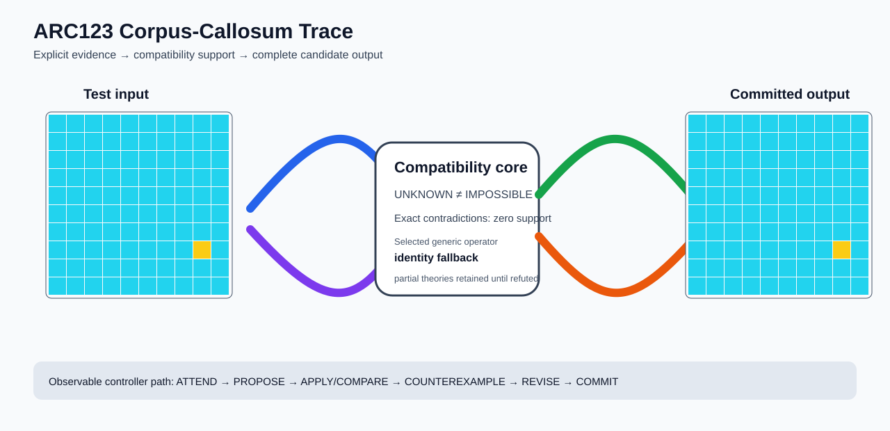

# ARC2 `4a1cacc2` P0007 Brain Surgery Report

## Outcome: NO — TEST CELLS DO NOT ALL MATCH

- **Compared positions:** 100
- **Mismatched cells:** 5
- **Training compatibility:** `False`
- **Fallback used:** `True`
- **Causal trace acceptance:** `NO`
- **Selected hypothesis:** `fallback_identity_complete_grid`
- **Source commit:** `71f86ff4c5304e452e0659131171f0519b50e21c`

## Causal Ablations

| Configuration | Exact all-cell result | Training exact | Fallback | Selected hypothesis |
| --- | --- | --- | --- | --- |
| `no_revision` | `False` | `False` | `True` | `fallback_identity_complete_grid` |
| `no_new_residual_family` | `False` | `False` | `True` | `fallback_identity_complete_grid` |

## Live-Agent Boundary

The controller receives only visible training input/output examples and test inputs. It receives no task ID, offline audit label, GT feature record, GT solver, historical decomposition, or held-out output before committing a complete grid. The expected output appears only in the post-answer V&V section.

## Corpus-Callosum Visualization



- Full explicit event record: [`learning_trace.json`](learning_trace.json)
- Full three-configuration record: [`ablations.json`](ablations.json)

## Causal Trace Check

- **Counterexample observed:** `True`
- **Additional visible demonstration selected:** `True`
- **Composition recorded:** `True`
- **Parameter or multi-rule revision:** `False`
- **Generic families in selected theory:** `none`

## Post-Answer V&V

### Test case 1
- **All cells match:** `False`
- **Mismatched cells:** `5`
- **Prediction:**
```json
[[8, 8, 8, 8, 8, 8, 8, 8, 8, 8], [8, 8, 8, 8, 8, 8, 8, 8, 8, 8], [8, 8, 8, 8, 8, 8, 8, 8, 8, 8], [8, 8, 8, 8, 8, 8, 8, 8, 8, 8], [8, 8, 8, 8, 8, 8, 8, 8, 8, 8], [8, 8, 8, 8, 8, 8, 8, 8, 8, 8], [8, 8, 8, 8, 8, 8, 8, 8, 8, 8], [8, 8, 8, 8, 8, 8, 8, 8, 4, 8], [8, 8, 8, 8, 8, 8, 8, 8, 8, 8], [8, 8, 8, 8, 8, 8, 8, 8, 8, 8]]
```
- **Expected output (post-answer only):**
```json
[[8, 8, 8, 8, 8, 8, 8, 8, 8, 8], [8, 8, 8, 8, 8, 8, 8, 8, 8, 8], [8, 8, 8, 8, 8, 8, 8, 8, 8, 8], [8, 8, 8, 8, 8, 8, 8, 8, 8, 8], [8, 8, 8, 8, 8, 8, 8, 8, 8, 8], [8, 8, 8, 8, 8, 8, 8, 8, 8, 8], [8, 8, 8, 8, 8, 8, 8, 8, 8, 8], [8, 8, 8, 8, 8, 8, 8, 8, 4, 4], [8, 8, 8, 8, 8, 8, 8, 8, 4, 4], [8, 8, 8, 8, 8, 8, 8, 8, 4, 4]]
```

## Observable IHL Walkthrough

The record contains explicit actions, predictions, feedback, and revisions; it does not claim or store hidden model reasoning.

### Action totals

- `APPLY_HYPOTHESIS`: 248
- `ATTEND`: 248
- `CHOOSE_NEXT_DEMO`: 248
- `COMMIT`: 1
- `COMPARE`: 248
- `COMPOSE_RULE`: 8
- `EXPLAIN_RESIDUAL`: 8
- `FIND_COUNTEREXAMPLE`: 8
- `PROPOSE`: 1
- `SPECIALIZE`: 78

### Decision milestones

- `0` `PROPOSE` — `{"parent_theory_id":"T0000","rule":{"description_length":1,"name":"identity","operation":"identity","parameters":{},"rule_id":"identity","scope":{"kind":"all","value":null}},"stage":"initial_generic_theories","theory_id":"T0001"}`
- `2` `ATTEND` — `{"reason":"initial_highest_observed_change_and_color_discrimination","selected_demo":2,"selected_region":{"column":0,"row":0},"theory_id":"T0001"}`
- `6` `ATTEND` — `{"reason":"counterexample_requires_visible_conditional_evidence:unseen_demo_selected_for_residual_version_space_discrimination","selected_demo":0,"selected_region":{"column":0,"row":3},"theory_id":"T0001"}`
- `10` `ATTEND` — `{"reason":"counterexample_requires_visible_conditional_evidence:unseen_demo_selected_for_residual_version_space_discrimination","selected_demo":1,"selected_region":{"column":4,"row":0},"theory_id":"T0001"}`
- `14` `ATTEND` — `{"reason":"counterexample_requires_visible_conditional_evidence:unseen_demo_selected_for_residual_version_space_discrimination","selected_demo":3,"selected_region":{"column":3,"row":0},"theory_id":"T0001"}`
- `20` `SPECIALIZE` — `{"added_rule":{"description_length":4,"name":"line_extend(direction=up,fill_color=6,seed_color=6)","operation":"full_operator","parameters":{"direction":"up","fill_color":6,"operator":"line_extend","seed_color":6},"rule_id":"structural-line_extend","scope":{"kind":"all","value":null}},"parent_theory_id":"T0001","reason":"unexplained_residual_proposed_generic_structural_rule","theory_id":"T0003"}`
- `21` `SPECIALIZE` — `{"added_rule":{"description_length":4,"name":"line_extend(direction=up,fill_color=9,seed_color=9)","operation":"full_operator","parameters":{"direction":"up","fill_color":9,"operator":"line_extend","seed_color":9},"rule_id":"structural-line_extend","scope":{"kind":"all","value":null}},"parent_theory_id":"T0001","reason":"unexplained_residual_proposed_generic_structural_rule","theory_id":"T0004"}`
- `22` `SPECIALIZE` — `{"added_rule":{"description_length":4,"name":"line_extend(direction=left,fill_color=4,seed_color=4)","operation":"full_operator","parameters":{"direction":"left","fill_color":4,"operator":"line_extend","seed_color":4},"rule_id":"structural-line_extend","scope":{"kind":"all","value":null}},"parent_theory_id":"T0001","reason":"unexplained_residual_proposed_generic_structural_rule","theory_id":"T0005"}`
- `23` `SPECIALIZE` — `{"added_rule":{"description_length":4,"name":"line_extend(direction=down,fill_color=4,seed_color=4)","operation":"full_operator","parameters":{"direction":"down","fill_color":4,"operator":"line_extend","seed_color":4},"rule_id":"structural-line_extend","scope":{"kind":"all","value":null}},"parent_theory_id":"T0001","reason":"unexplained_residual_proposed_generic_structural_rule","theory_id":"T0006"}`
- `24` `SPECIALIZE` — `{"added_rule":{"description_length":4,"name":"line_extend(direction=right,fill_color=9,seed_color=9)","operation":"full_operator","parameters":{"direction":"right","fill_color":9,"operator":"line_extend","seed_color":9},"rule_id":"structural-line_extend","scope":{"kind":"all","value":null}},"parent_theory_id":"T0001","reason":"unexplained_residual_proposed_generic_structural_rule","theory_id":"T0007"}`
- `25` `SPECIALIZE` — `{"added_rule":{"description_length":4,"name":"row_span_fill(fill_color=9,seed_color=9)","operation":"full_operator","parameters":{"fill_color":9,"operator":"row_span_fill","seed_color":9},"rule_id":"structural-row_span_fill","scope":{"kind":"all","value":null}},"parent_theory_id":"T0001","reason":"unexplained_residual_proposed_generic_structural_rule","theory_id":"T0008"}`
- `26` `SPECIALIZE` — `{"added_rule":{"description_length":4,"name":"row_span_fill(fill_color=9,seed_color=6)","operation":"full_operator","parameters":{"fill_color":9,"operator":"row_span_fill","seed_color":6},"rule_id":"structural-row_span_fill","scope":{"kind":"all","value":null}},"parent_theory_id":"T0001","reason":"unexplained_residual_proposed_generic_structural_rule","theory_id":"T0009"}`
- `27` `SPECIALIZE` — `{"added_rule":{"description_length":4,"name":"row_span_fill(fill_color=9,seed_color=4)","operation":"full_operator","parameters":{"fill_color":9,"operator":"row_span_fill","seed_color":4},"rule_id":"structural-row_span_fill","scope":{"kind":"all","value":null}},"parent_theory_id":"T0001","reason":"unexplained_residual_proposed_generic_structural_rule","theory_id":"T0010"}`
- `28` `SPECIALIZE` — `{"added_rule":{"description_length":4,"name":"row_span_fill(fill_color=6,seed_color=9)","operation":"full_operator","parameters":{"fill_color":6,"operator":"row_span_fill","seed_color":9},"rule_id":"structural-row_span_fill","scope":{"kind":"all","value":null}},"parent_theory_id":"T0001","reason":"unexplained_residual_proposed_generic_structural_rule","theory_id":"T0011"}`
- `29` `SPECIALIZE` — `{"added_rule":{"description_length":4,"name":"row_span_fill(fill_color=6,seed_color=6)","operation":"full_operator","parameters":{"fill_color":6,"operator":"row_span_fill","seed_color":6},"rule_id":"structural-row_span_fill","scope":{"kind":"all","value":null}},"parent_theory_id":"T0001","reason":"unexplained_residual_proposed_generic_structural_rule","theory_id":"T0012"}`
- `30` `SPECIALIZE` — `{"added_rule":{"description_length":4,"name":"row_span_fill(fill_color=6,seed_color=4)","operation":"full_operator","parameters":{"fill_color":6,"operator":"row_span_fill","seed_color":4},"rule_id":"structural-row_span_fill","scope":{"kind":"all","value":null}},"parent_theory_id":"T0001","reason":"unexplained_residual_proposed_generic_structural_rule","theory_id":"T0013"}`
- `31` `SPECIALIZE` — `{"added_rule":{"description_length":4,"name":"row_span_fill(fill_color=4,seed_color=9)","operation":"full_operator","parameters":{"fill_color":4,"operator":"row_span_fill","seed_color":9},"rule_id":"structural-row_span_fill","scope":{"kind":"all","value":null}},"parent_theory_id":"T0001","reason":"unexplained_residual_proposed_generic_structural_rule","theory_id":"T0014"}`
- `33` `ATTEND` — `{"reason":"initial_highest_observed_change_and_color_discrimination","selected_demo":2,"selected_region":{"column":0,"row":0},"theory_id":"T0002"}`
- `37` `ATTEND` — `{"reason":"initial_highest_observed_change_and_color_discrimination","selected_demo":2,"selected_region":{"column":0,"row":0},"theory_id":"T0003"}`
- `41` `ATTEND` — `{"reason":"initial_highest_observed_change_and_color_discrimination","selected_demo":2,"selected_region":{"column":0,"row":0},"theory_id":"T0004"}`
- `45` `ATTEND` — `{"reason":"initial_highest_observed_change_and_color_discrimination","selected_demo":2,"selected_region":{"column":0,"row":0},"theory_id":"T0005"}`
- `49` `ATTEND` — `{"reason":"initial_highest_observed_change_and_color_discrimination","selected_demo":2,"selected_region":{"column":0,"row":0},"theory_id":"T0006"}`
- `53` `ATTEND` — `{"reason":"initial_highest_observed_change_and_color_discrimination","selected_demo":2,"selected_region":{"column":0,"row":0},"theory_id":"T0007"}`
- `57` `ATTEND` — `{"reason":"initial_highest_observed_change_and_color_discrimination","selected_demo":2,"selected_region":{"column":0,"row":0},"theory_id":"T0008"}`
- `61` `ATTEND` — `{"reason":"initial_highest_observed_change_and_color_discrimination","selected_demo":2,"selected_region":{"column":0,"row":0},"theory_id":"T0009"}`
- `65` `ATTEND` — `{"reason":"initial_highest_observed_change_and_color_discrimination","selected_demo":2,"selected_region":{"column":0,"row":0},"theory_id":"T0010"}`
- `69` `ATTEND` — `{"reason":"initial_highest_observed_change_and_color_discrimination","selected_demo":2,"selected_region":{"column":0,"row":0},"theory_id":"T0011"}`
- `73` `ATTEND` — `{"reason":"initial_highest_observed_change_and_color_discrimination","selected_demo":2,"selected_region":{"column":0,"row":0},"theory_id":"T0012"}`
- `77` `ATTEND` — `{"reason":"initial_highest_observed_change_and_color_discrimination","selected_demo":2,"selected_region":{"column":0,"row":0},"theory_id":"T0013"}`
- `81` `ATTEND` — `{"reason":"counterexample_requires_visible_conditional_evidence:unseen_demo_selected_for_residual_version_space_discrimination","selected_demo":0,"selected_region":{"column":0,"row":3},"theory_id":"T0003"}`
- `85` `ATTEND` — `{"reason":"counterexample_requires_visible_conditional_evidence:unseen_demo_selected_for_residual_version_space_discrimination","selected_demo":0,"selected_region":{"column":0,"row":3},"theory_id":"T0004"}`
- `89` `ATTEND` — `{"reason":"counterexample_requires_visible_conditional_evidence:unseen_demo_selected_for_residual_version_space_discrimination","selected_demo":0,"selected_region":{"column":0,"row":4},"theory_id":"T0005"}`
- `93` `ATTEND` — `{"reason":"counterexample_requires_visible_conditional_evidence:unseen_demo_selected_for_residual_version_space_discrimination","selected_demo":0,"selected_region":{"column":0,"row":3},"theory_id":"T0006"}`
- `97` `ATTEND` — `{"reason":"counterexample_requires_visible_conditional_evidence:unseen_demo_selected_for_residual_version_space_discrimination","selected_demo":0,"selected_region":{"column":0,"row":3},"theory_id":"T0007"}`
- `101` `ATTEND` — `{"reason":"counterexample_requires_visible_conditional_evidence:unseen_demo_selected_for_residual_version_space_discrimination","selected_demo":0,"selected_region":{"column":0,"row":3},"theory_id":"T0008"}`
- `105` `ATTEND` — `{"reason":"counterexample_requires_visible_conditional_evidence:unseen_demo_selected_for_residual_version_space_discrimination","selected_demo":0,"selected_region":{"column":0,"row":3},"theory_id":"T0009"}`
- `109` `ATTEND` — `{"reason":"counterexample_requires_visible_conditional_evidence:unseen_demo_selected_for_residual_version_space_discrimination","selected_demo":0,"selected_region":{"column":0,"row":3},"theory_id":"T0010"}`
- `113` `ATTEND` — `{"reason":"counterexample_requires_visible_conditional_evidence:unseen_demo_selected_for_residual_version_space_discrimination","selected_demo":0,"selected_region":{"column":0,"row":3},"theory_id":"T0011"}`
- `117` `ATTEND` — `{"reason":"counterexample_requires_visible_conditional_evidence:unseen_demo_selected_for_residual_version_space_discrimination","selected_demo":0,"selected_region":{"column":0,"row":3},"theory_id":"T0012"}`
- `121` `ATTEND` — `{"reason":"counterexample_requires_visible_conditional_evidence:unseen_demo_selected_for_residual_version_space_discrimination","selected_demo":0,"selected_region":{"column":0,"row":3},"theory_id":"T0013"}`
- `125` `ATTEND` — `{"reason":"counterexample_requires_visible_conditional_evidence:unseen_demo_selected_for_residual_version_space_discrimination","selected_demo":1,"selected_region":{"column":4,"row":0},"theory_id":"T0003"}`
- `129` `ATTEND` — `{"reason":"counterexample_requires_visible_conditional_evidence:unseen_demo_selected_for_residual_version_space_discrimination","selected_demo":1,"selected_region":{"column":4,"row":0},"theory_id":"T0005"}`
- `133` `ATTEND` — `{"reason":"counterexample_requires_visible_conditional_evidence:unseen_demo_selected_for_residual_version_space_discrimination","selected_demo":1,"selected_region":{"column":4,"row":0},"theory_id":"T0006"}`
- `137` `ATTEND` — `{"reason":"counterexample_requires_visible_conditional_evidence:unseen_demo_selected_for_residual_version_space_discrimination","selected_demo":1,"selected_region":{"column":5,"row":0},"theory_id":"T0004"}`
- `141` `ATTEND` — `{"reason":"counterexample_requires_visible_conditional_evidence:unseen_demo_selected_for_residual_version_space_discrimination","selected_demo":1,"selected_region":{"column":4,"row":0},"theory_id":"T0007"}`
- `145` `ATTEND` — `{"reason":"counterexample_requires_visible_conditional_evidence:unseen_demo_selected_for_residual_version_space_discrimination","selected_demo":1,"selected_region":{"column":4,"row":0},"theory_id":"T0008"}`
- `149` `ATTEND` — `{"reason":"counterexample_requires_visible_conditional_evidence:unseen_demo_selected_for_residual_version_space_discrimination","selected_demo":1,"selected_region":{"column":4,"row":0},"theory_id":"T0009"}`
- `153` `ATTEND` — `{"reason":"counterexample_requires_visible_conditional_evidence:unseen_demo_selected_for_residual_version_space_discrimination","selected_demo":1,"selected_region":{"column":4,"row":0},"theory_id":"T0010"}`
- `157` `ATTEND` — `{"reason":"counterexample_requires_visible_conditional_evidence:unseen_demo_selected_for_residual_version_space_discrimination","selected_demo":1,"selected_region":{"column":4,"row":0},"theory_id":"T0011"}`
- `161` `ATTEND` — `{"reason":"counterexample_requires_visible_conditional_evidence:unseen_demo_selected_for_residual_version_space_discrimination","selected_demo":1,"selected_region":{"column":4,"row":0},"theory_id":"T0012"}`
- `165` `ATTEND` — `{"reason":"counterexample_requires_visible_conditional_evidence:unseen_demo_selected_for_residual_version_space_discrimination","selected_demo":1,"selected_region":{"column":4,"row":0},"theory_id":"T0013"}`
- `169` `ATTEND` — `{"reason":"counterexample_requires_visible_conditional_evidence:unseen_demo_selected_for_residual_version_space_discrimination","selected_demo":3,"selected_region":{"column":3,"row":0},"theory_id":"T0003"}`
- `175` `SPECIALIZE` — `{"added_rule":{"description_length":4,"name":"line_extend(direction=up,fill_color=9,seed_color=9)","operation":"full_operator","parameters":{"direction":"up","fill_color":9,"operator":"line_extend","seed_color":9},"rule_id":"structural-line_extend","scope":{"kind":"all","value":null}},"parent_theory_id":"T0003","reason":"unexplained_residual_proposed_generic_structural_rule","theory_id":"T0016"}`
- `176` `SPECIALIZE` — `{"added_rule":{"description_length":4,"name":"line_extend(direction=left,fill_color=4,seed_color=4)","operation":"full_operator","parameters":{"direction":"left","fill_color":4,"operator":"line_extend","seed_color":4},"rule_id":"structural-line_extend","scope":{"kind":"all","value":null}},"parent_theory_id":"T0003","reason":"unexplained_residual_proposed_generic_structural_rule","theory_id":"T0017"}`
- `177` `SPECIALIZE` — `{"added_rule":{"description_length":4,"name":"line_extend(direction=down,fill_color=4,seed_color=4)","operation":"full_operator","parameters":{"direction":"down","fill_color":4,"operator":"line_extend","seed_color":4},"rule_id":"structural-line_extend","scope":{"kind":"all","value":null}},"parent_theory_id":"T0003","reason":"unexplained_residual_proposed_generic_structural_rule","theory_id":"T0018"}`
- `178` `SPECIALIZE` — `{"added_rule":{"description_length":4,"name":"line_extend(direction=right,fill_color=9,seed_color=9)","operation":"full_operator","parameters":{"direction":"right","fill_color":9,"operator":"line_extend","seed_color":9},"rule_id":"structural-line_extend","scope":{"kind":"all","value":null}},"parent_theory_id":"T0003","reason":"unexplained_residual_proposed_generic_structural_rule","theory_id":"T0019"}`
- `179` `SPECIALIZE` — `{"added_rule":{"description_length":4,"name":"row_span_fill(fill_color=9,seed_color=9)","operation":"full_operator","parameters":{"fill_color":9,"operator":"row_span_fill","seed_color":9},"rule_id":"structural-row_span_fill","scope":{"kind":"all","value":null}},"parent_theory_id":"T0003","reason":"unexplained_residual_proposed_generic_structural_rule","theory_id":"T0020"}`
- `180` `SPECIALIZE` — `{"added_rule":{"description_length":4,"name":"row_span_fill(fill_color=9,seed_color=6)","operation":"full_operator","parameters":{"fill_color":9,"operator":"row_span_fill","seed_color":6},"rule_id":"structural-row_span_fill","scope":{"kind":"all","value":null}},"parent_theory_id":"T0003","reason":"unexplained_residual_proposed_generic_structural_rule","theory_id":"T0021"}`
- `181` `SPECIALIZE` — `{"added_rule":{"description_length":4,"name":"row_span_fill(fill_color=9,seed_color=4)","operation":"full_operator","parameters":{"fill_color":9,"operator":"row_span_fill","seed_color":4},"rule_id":"structural-row_span_fill","scope":{"kind":"all","value":null}},"parent_theory_id":"T0003","reason":"unexplained_residual_proposed_generic_structural_rule","theory_id":"T0022"}`
- `182` `SPECIALIZE` — `{"added_rule":{"description_length":4,"name":"row_span_fill(fill_color=6,seed_color=9)","operation":"full_operator","parameters":{"fill_color":6,"operator":"row_span_fill","seed_color":9},"rule_id":"structural-row_span_fill","scope":{"kind":"all","value":null}},"parent_theory_id":"T0003","reason":"unexplained_residual_proposed_generic_structural_rule","theory_id":"T0023"}`
- `183` `SPECIALIZE` — `{"added_rule":{"description_length":4,"name":"row_span_fill(fill_color=6,seed_color=6)","operation":"full_operator","parameters":{"fill_color":6,"operator":"row_span_fill","seed_color":6},"rule_id":"structural-row_span_fill","scope":{"kind":"all","value":null}},"parent_theory_id":"T0003","reason":"unexplained_residual_proposed_generic_structural_rule","theory_id":"T0024"}`
- `184` `SPECIALIZE` — `{"added_rule":{"description_length":4,"name":"row_span_fill(fill_color=6,seed_color=4)","operation":"full_operator","parameters":{"fill_color":6,"operator":"row_span_fill","seed_color":4},"rule_id":"structural-row_span_fill","scope":{"kind":"all","value":null}},"parent_theory_id":"T0003","reason":"unexplained_residual_proposed_generic_structural_rule","theory_id":"T0025"}`
- `185` `SPECIALIZE` — `{"added_rule":{"description_length":4,"name":"row_span_fill(fill_color=4,seed_color=9)","operation":"full_operator","parameters":{"fill_color":4,"operator":"row_span_fill","seed_color":9},"rule_id":"structural-row_span_fill","scope":{"kind":"all","value":null}},"parent_theory_id":"T0003","reason":"unexplained_residual_proposed_generic_structural_rule","theory_id":"T0026"}`
- `187` `ATTEND` — `{"reason":"initial_highest_observed_change_and_color_discrimination","selected_demo":2,"selected_region":{"column":0,"row":0},"theory_id":"T0015"}`
- `191` `ATTEND` — `{"reason":"initial_highest_observed_change_and_color_discrimination","selected_demo":2,"selected_region":{"column":0,"row":0},"theory_id":"T0016"}`
- `195` `ATTEND` — `{"reason":"initial_highest_observed_change_and_color_discrimination","selected_demo":2,"selected_region":{"column":0,"row":0},"theory_id":"T0017"}`
- `199` `ATTEND` — `{"reason":"initial_highest_observed_change_and_color_discrimination","selected_demo":2,"selected_region":{"column":0,"row":0},"theory_id":"T0018"}`
- `203` `ATTEND` — `{"reason":"initial_highest_observed_change_and_color_discrimination","selected_demo":2,"selected_region":{"column":0,"row":0},"theory_id":"T0019"}`
- `207` `ATTEND` — `{"reason":"initial_highest_observed_change_and_color_discrimination","selected_demo":2,"selected_region":{"column":0,"row":0},"theory_id":"T0020"}`
- `211` `ATTEND` — `{"reason":"initial_highest_observed_change_and_color_discrimination","selected_demo":2,"selected_region":{"column":0,"row":0},"theory_id":"T0021"}`
- `215` `ATTEND` — `{"reason":"initial_highest_observed_change_and_color_discrimination","selected_demo":2,"selected_region":{"column":0,"row":0},"theory_id":"T0022"}`
- `219` `ATTEND` — `{"reason":"initial_highest_observed_change_and_color_discrimination","selected_demo":2,"selected_region":{"column":0,"row":0},"theory_id":"T0023"}`
- `223` `ATTEND` — `{"reason":"initial_highest_observed_change_and_color_discrimination","selected_demo":2,"selected_region":{"column":0,"row":0},"theory_id":"T0024"}`
- `227` `ATTEND` — `{"reason":"initial_highest_observed_change_and_color_discrimination","selected_demo":2,"selected_region":{"column":0,"row":0},"theory_id":"T0025"}`
- `231` `ATTEND` — `{"reason":"initial_highest_observed_change_and_color_discrimination","selected_demo":2,"selected_region":{"column":0,"row":0},"theory_id":"T0026"}`
- `235` `ATTEND` — `{"reason":"counterexample_requires_visible_conditional_evidence:unseen_demo_selected_for_residual_version_space_discrimination","selected_demo":0,"selected_region":{"column":0,"row":3},"theory_id":"T0016"}`
- `239` `ATTEND` — `{"reason":"counterexample_requires_visible_conditional_evidence:unseen_demo_selected_for_residual_version_space_discrimination","selected_demo":0,"selected_region":{"column":0,"row":4},"theory_id":"T0017"}`
- `243` `ATTEND` — `{"reason":"counterexample_requires_visible_conditional_evidence:unseen_demo_selected_for_residual_version_space_discrimination","selected_demo":0,"selected_region":{"column":0,"row":3},"theory_id":"T0018"}`
- `247` `ATTEND` — `{"reason":"counterexample_requires_visible_conditional_evidence:unseen_demo_selected_for_residual_version_space_discrimination","selected_demo":0,"selected_region":{"column":0,"row":3},"theory_id":"T0019"}`
- `251` `ATTEND` — `{"reason":"counterexample_requires_visible_conditional_evidence:unseen_demo_selected_for_residual_version_space_discrimination","selected_demo":0,"selected_region":{"column":0,"row":3},"theory_id":"T0020"}`
- `255` `ATTEND` — `{"reason":"counterexample_requires_visible_conditional_evidence:unseen_demo_selected_for_residual_version_space_discrimination","selected_demo":0,"selected_region":{"column":0,"row":3},"theory_id":"T0021"}`
- `259` `ATTEND` — `{"reason":"counterexample_requires_visible_conditional_evidence:unseen_demo_selected_for_residual_version_space_discrimination","selected_demo":0,"selected_region":{"column":0,"row":3},"theory_id":"T0022"}`
- `263` `ATTEND` — `{"reason":"counterexample_requires_visible_conditional_evidence:unseen_demo_selected_for_residual_version_space_discrimination","selected_demo":0,"selected_region":{"column":0,"row":3},"theory_id":"T0023"}`
- `267` `ATTEND` — `{"reason":"counterexample_requires_visible_conditional_evidence:unseen_demo_selected_for_residual_version_space_discrimination","selected_demo":0,"selected_region":{"column":0,"row":3},"theory_id":"T0024"}`
- `271` `ATTEND` — `{"reason":"counterexample_requires_visible_conditional_evidence:unseen_demo_selected_for_residual_version_space_discrimination","selected_demo":0,"selected_region":{"column":0,"row":3},"theory_id":"T0025"}`
- `275` `ATTEND` — `{"reason":"counterexample_requires_visible_conditional_evidence:unseen_demo_selected_for_residual_version_space_discrimination","selected_demo":0,"selected_region":{"column":0,"row":3},"theory_id":"T0026"}`
- `279` `ATTEND` — `{"reason":"counterexample_requires_visible_conditional_evidence:unseen_demo_selected_for_residual_version_space_discrimination","selected_demo":1,"selected_region":{"column":4,"row":0},"theory_id":"T0017"}`
- `283` `ATTEND` — `{"reason":"counterexample_requires_visible_conditional_evidence:unseen_demo_selected_for_residual_version_space_discrimination","selected_demo":1,"selected_region":{"column":4,"row":0},"theory_id":"T0018"}`
- `287` `ATTEND` — `{"reason":"counterexample_requires_visible_conditional_evidence:unseen_demo_selected_for_residual_version_space_discrimination","selected_demo":1,"selected_region":{"column":5,"row":0},"theory_id":"T0016"}`
- `291` `ATTEND` — `{"reason":"counterexample_requires_visible_conditional_evidence:unseen_demo_selected_for_residual_version_space_discrimination","selected_demo":1,"selected_region":{"column":4,"row":0},"theory_id":"T0019"}`
- `295` `ATTEND` — `{"reason":"counterexample_requires_visible_conditional_evidence:unseen_demo_selected_for_residual_version_space_discrimination","selected_demo":1,"selected_region":{"column":4,"row":0},"theory_id":"T0020"}`
- `299` `ATTEND` — `{"reason":"counterexample_requires_visible_conditional_evidence:unseen_demo_selected_for_residual_version_space_discrimination","selected_demo":1,"selected_region":{"column":4,"row":0},"theory_id":"T0021"}`
- `303` `ATTEND` — `{"reason":"counterexample_requires_visible_conditional_evidence:unseen_demo_selected_for_residual_version_space_discrimination","selected_demo":1,"selected_region":{"column":4,"row":0},"theory_id":"T0022"}`
- `307` `ATTEND` — `{"reason":"counterexample_requires_visible_conditional_evidence:unseen_demo_selected_for_residual_version_space_discrimination","selected_demo":1,"selected_region":{"column":4,"row":0},"theory_id":"T0023"}`
- `311` `ATTEND` — `{"reason":"counterexample_requires_visible_conditional_evidence:unseen_demo_selected_for_residual_version_space_discrimination","selected_demo":1,"selected_region":{"column":4,"row":0},"theory_id":"T0024"}`
- `315` `ATTEND` — `{"reason":"counterexample_requires_visible_conditional_evidence:unseen_demo_selected_for_residual_version_space_discrimination","selected_demo":1,"selected_region":{"column":4,"row":0},"theory_id":"T0025"}`
- `319` `ATTEND` — `{"reason":"counterexample_requires_visible_conditional_evidence:unseen_demo_selected_for_residual_version_space_discrimination","selected_demo":1,"selected_region":{"column":4,"row":0},"theory_id":"T0026"}`
- `323` `ATTEND` — `{"reason":"counterexample_requires_visible_conditional_evidence:unseen_demo_selected_for_residual_version_space_discrimination","selected_demo":3,"selected_region":{"column":3,"row":0},"theory_id":"T0016"}`
- `327` `ATTEND` — `{"reason":"counterexample_requires_visible_conditional_evidence:unseen_demo_selected_for_residual_version_space_discrimination","selected_demo":3,"selected_region":{"column":3,"row":0},"theory_id":"T0017"}`
- `331` `ATTEND` — `{"reason":"counterexample_requires_visible_conditional_evidence:unseen_demo_selected_for_residual_version_space_discrimination","selected_demo":3,"selected_region":{"column":3,"row":0},"theory_id":"T0018"}`
- `337` `SPECIALIZE` — `{"added_rule":{"description_length":4,"name":"line_extend(direction=left,fill_color=4,seed_color=4)","operation":"full_operator","parameters":{"direction":"left","fill_color":4,"operator":"line_extend","seed_color":4},"rule_id":"structural-line_extend","scope":{"kind":"all","value":null}},"parent_theory_id":"T0016","reason":"unexplained_residual_proposed_generic_structural_rule","theory_id":"T0028"}`
- `338` `SPECIALIZE` — `{"added_rule":{"description_length":4,"name":"line_extend(direction=down,fill_color=4,seed_color=4)","operation":"full_operator","parameters":{"direction":"down","fill_color":4,"operator":"line_extend","seed_color":4},"rule_id":"structural-line_extend","scope":{"kind":"all","value":null}},"parent_theory_id":"T0016","reason":"unexplained_residual_proposed_generic_structural_rule","theory_id":"T0029"}`
- `339` `SPECIALIZE` — `{"added_rule":{"description_length":4,"name":"line_extend(direction=right,fill_color=9,seed_color=9)","operation":"full_operator","parameters":{"direction":"right","fill_color":9,"operator":"line_extend","seed_color":9},"rule_id":"structural-line_extend","scope":{"kind":"all","value":null}},"parent_theory_id":"T0016","reason":"unexplained_residual_proposed_generic_structural_rule","theory_id":"T0030"}`
- `340` `SPECIALIZE` — `{"added_rule":{"description_length":4,"name":"row_span_fill(fill_color=9,seed_color=9)","operation":"full_operator","parameters":{"fill_color":9,"operator":"row_span_fill","seed_color":9},"rule_id":"structural-row_span_fill","scope":{"kind":"all","value":null}},"parent_theory_id":"T0016","reason":"unexplained_residual_proposed_generic_structural_rule","theory_id":"T0031"}`
- `341` `SPECIALIZE` — `{"added_rule":{"description_length":4,"name":"row_span_fill(fill_color=9,seed_color=6)","operation":"full_operator","parameters":{"fill_color":9,"operator":"row_span_fill","seed_color":6},"rule_id":"structural-row_span_fill","scope":{"kind":"all","value":null}},"parent_theory_id":"T0016","reason":"unexplained_residual_proposed_generic_structural_rule","theory_id":"T0032"}`
- `342` `SPECIALIZE` — `{"added_rule":{"description_length":4,"name":"row_span_fill(fill_color=9,seed_color=4)","operation":"full_operator","parameters":{"fill_color":9,"operator":"row_span_fill","seed_color":4},"rule_id":"structural-row_span_fill","scope":{"kind":"all","value":null}},"parent_theory_id":"T0016","reason":"unexplained_residual_proposed_generic_structural_rule","theory_id":"T0033"}`
- `343` `SPECIALIZE` — `{"added_rule":{"description_length":4,"name":"row_span_fill(fill_color=6,seed_color=9)","operation":"full_operator","parameters":{"fill_color":6,"operator":"row_span_fill","seed_color":9},"rule_id":"structural-row_span_fill","scope":{"kind":"all","value":null}},"parent_theory_id":"T0016","reason":"unexplained_residual_proposed_generic_structural_rule","theory_id":"T0034"}`
- `344` `SPECIALIZE` — `{"added_rule":{"description_length":4,"name":"row_span_fill(fill_color=6,seed_color=6)","operation":"full_operator","parameters":{"fill_color":6,"operator":"row_span_fill","seed_color":6},"rule_id":"structural-row_span_fill","scope":{"kind":"all","value":null}},"parent_theory_id":"T0016","reason":"unexplained_residual_proposed_generic_structural_rule","theory_id":"T0035"}`
- `345` `SPECIALIZE` — `{"added_rule":{"description_length":4,"name":"row_span_fill(fill_color=6,seed_color=4)","operation":"full_operator","parameters":{"fill_color":6,"operator":"row_span_fill","seed_color":4},"rule_id":"structural-row_span_fill","scope":{"kind":"all","value":null}},"parent_theory_id":"T0016","reason":"unexplained_residual_proposed_generic_structural_rule","theory_id":"T0036"}`
- `346` `SPECIALIZE` — `{"added_rule":{"description_length":4,"name":"row_span_fill(fill_color=4,seed_color=9)","operation":"full_operator","parameters":{"fill_color":4,"operator":"row_span_fill","seed_color":9},"rule_id":"structural-row_span_fill","scope":{"kind":"all","value":null}},"parent_theory_id":"T0016","reason":"unexplained_residual_proposed_generic_structural_rule","theory_id":"T0037"}`
- `348` `ATTEND` — `{"reason":"initial_highest_observed_change_and_color_discrimination","selected_demo":2,"selected_region":{"column":0,"row":0},"theory_id":"T0027"}`
- `352` `ATTEND` — `{"reason":"initial_highest_observed_change_and_color_discrimination","selected_demo":2,"selected_region":{"column":0,"row":0},"theory_id":"T0028"}`
- `356` `ATTEND` — `{"reason":"initial_highest_observed_change_and_color_discrimination","selected_demo":2,"selected_region":{"column":0,"row":0},"theory_id":"T0029"}`
- `360` `ATTEND` — `{"reason":"initial_highest_observed_change_and_color_discrimination","selected_demo":2,"selected_region":{"column":0,"row":0},"theory_id":"T0030"}`
- `364` `ATTEND` — `{"reason":"initial_highest_observed_change_and_color_discrimination","selected_demo":2,"selected_region":{"column":0,"row":0},"theory_id":"T0031"}`
- `368` `ATTEND` — `{"reason":"initial_highest_observed_change_and_color_discrimination","selected_demo":2,"selected_region":{"column":0,"row":0},"theory_id":"T0032"}`
- `372` `ATTEND` — `{"reason":"initial_highest_observed_change_and_color_discrimination","selected_demo":2,"selected_region":{"column":0,"row":0},"theory_id":"T0033"}`
- `376` `ATTEND` — `{"reason":"initial_highest_observed_change_and_color_discrimination","selected_demo":2,"selected_region":{"column":0,"row":0},"theory_id":"T0034"}`
- `380` `ATTEND` — `{"reason":"initial_highest_observed_change_and_color_discrimination","selected_demo":2,"selected_region":{"column":0,"row":0},"theory_id":"T0035"}`
- `384` `ATTEND` — `{"reason":"initial_highest_observed_change_and_color_discrimination","selected_demo":2,"selected_region":{"column":0,"row":0},"theory_id":"T0036"}`
- `388` `ATTEND` — `{"reason":"initial_highest_observed_change_and_color_discrimination","selected_demo":2,"selected_region":{"column":0,"row":0},"theory_id":"T0037"}`
- `392` `ATTEND` — `{"reason":"counterexample_requires_visible_conditional_evidence:unseen_demo_selected_for_residual_version_space_discrimination","selected_demo":0,"selected_region":{"column":0,"row":4},"theory_id":"T0028"}`
- `396` `ATTEND` — `{"reason":"counterexample_requires_visible_conditional_evidence:unseen_demo_selected_for_residual_version_space_discrimination","selected_demo":0,"selected_region":{"column":0,"row":3},"theory_id":"T0029"}`
- `400` `ATTEND` — `{"reason":"counterexample_requires_visible_conditional_evidence:unseen_demo_selected_for_residual_version_space_discrimination","selected_demo":0,"selected_region":{"column":0,"row":3},"theory_id":"T0030"}`
- `404` `ATTEND` — `{"reason":"counterexample_requires_visible_conditional_evidence:unseen_demo_selected_for_residual_version_space_discrimination","selected_demo":0,"selected_region":{"column":0,"row":3},"theory_id":"T0031"}`
- `408` `ATTEND` — `{"reason":"counterexample_requires_visible_conditional_evidence:unseen_demo_selected_for_residual_version_space_discrimination","selected_demo":0,"selected_region":{"column":0,"row":3},"theory_id":"T0032"}`
- `412` `ATTEND` — `{"reason":"counterexample_requires_visible_conditional_evidence:unseen_demo_selected_for_residual_version_space_discrimination","selected_demo":0,"selected_region":{"column":0,"row":3},"theory_id":"T0033"}`
- `416` `ATTEND` — `{"reason":"counterexample_requires_visible_conditional_evidence:unseen_demo_selected_for_residual_version_space_discrimination","selected_demo":0,"selected_region":{"column":0,"row":3},"theory_id":"T0034"}`
- `420` `ATTEND` — `{"reason":"counterexample_requires_visible_conditional_evidence:unseen_demo_selected_for_residual_version_space_discrimination","selected_demo":0,"selected_region":{"column":0,"row":3},"theory_id":"T0035"}`
- `424` `ATTEND` — `{"reason":"counterexample_requires_visible_conditional_evidence:unseen_demo_selected_for_residual_version_space_discrimination","selected_demo":0,"selected_region":{"column":0,"row":3},"theory_id":"T0036"}`
- `428` `ATTEND` — `{"reason":"counterexample_requires_visible_conditional_evidence:unseen_demo_selected_for_residual_version_space_discrimination","selected_demo":0,"selected_region":{"column":0,"row":3},"theory_id":"T0037"}`
- `432` `ATTEND` — `{"reason":"counterexample_requires_visible_conditional_evidence:unseen_demo_selected_for_residual_version_space_discrimination","selected_demo":1,"selected_region":{"column":4,"row":0},"theory_id":"T0028"}`
- `436` `ATTEND` — `{"reason":"counterexample_requires_visible_conditional_evidence:unseen_demo_selected_for_residual_version_space_discrimination","selected_demo":1,"selected_region":{"column":4,"row":0},"theory_id":"T0029"}`
- `440` `ATTEND` — `{"reason":"counterexample_requires_visible_conditional_evidence:unseen_demo_selected_for_residual_version_space_discrimination","selected_demo":1,"selected_region":{"column":4,"row":0},"theory_id":"T0030"}`
- `444` `ATTEND` — `{"reason":"counterexample_requires_visible_conditional_evidence:unseen_demo_selected_for_residual_version_space_discrimination","selected_demo":1,"selected_region":{"column":4,"row":0},"theory_id":"T0031"}`
- `448` `ATTEND` — `{"reason":"counterexample_requires_visible_conditional_evidence:unseen_demo_selected_for_residual_version_space_discrimination","selected_demo":1,"selected_region":{"column":4,"row":0},"theory_id":"T0032"}`
- `452` `ATTEND` — `{"reason":"counterexample_requires_visible_conditional_evidence:unseen_demo_selected_for_residual_version_space_discrimination","selected_demo":1,"selected_region":{"column":4,"row":0},"theory_id":"T0033"}`
- `456` `ATTEND` — `{"reason":"counterexample_requires_visible_conditional_evidence:unseen_demo_selected_for_residual_version_space_discrimination","selected_demo":1,"selected_region":{"column":4,"row":0},"theory_id":"T0034"}`
- `460` `ATTEND` — `{"reason":"counterexample_requires_visible_conditional_evidence:unseen_demo_selected_for_residual_version_space_discrimination","selected_demo":1,"selected_region":{"column":4,"row":0},"theory_id":"T0035"}`
- `464` `ATTEND` — `{"reason":"counterexample_requires_visible_conditional_evidence:unseen_demo_selected_for_residual_version_space_discrimination","selected_demo":1,"selected_region":{"column":4,"row":0},"theory_id":"T0036"}`
- `468` `ATTEND` — `{"reason":"counterexample_requires_visible_conditional_evidence:unseen_demo_selected_for_residual_version_space_discrimination","selected_demo":1,"selected_region":{"column":4,"row":0},"theory_id":"T0037"}`
- `472` `ATTEND` — `{"reason":"counterexample_requires_visible_conditional_evidence:unseen_demo_selected_for_residual_version_space_discrimination","selected_demo":3,"selected_region":{"column":3,"row":0},"theory_id":"T0028"}`
- `476` `ATTEND` — `{"reason":"counterexample_requires_visible_conditional_evidence:unseen_demo_selected_for_residual_version_space_discrimination","selected_demo":3,"selected_region":{"column":3,"row":0},"theory_id":"T0029"}`
- `482` `SPECIALIZE` — `{"added_rule":{"description_length":4,"name":"line_extend(direction=up,fill_color=9,seed_color=9)","operation":"full_operator","parameters":{"direction":"up","fill_color":9,"operator":"line_extend","seed_color":9},"rule_id":"structural-line_extend","scope":{"kind":"all","value":null}},"parent_theory_id":"T0017","reason":"unexplained_residual_proposed_generic_structural_rule","theory_id":"T0039"}`
- `483` `SPECIALIZE` — `{"added_rule":{"description_length":4,"name":"line_extend(direction=down,fill_color=4,seed_color=4)","operation":"full_operator","parameters":{"direction":"down","fill_color":4,"operator":"line_extend","seed_color":4},"rule_id":"structural-line_extend","scope":{"kind":"all","value":null}},"parent_theory_id":"T0017","reason":"unexplained_residual_proposed_generic_structural_rule","theory_id":"T0040"}`
- `484` `SPECIALIZE` — `{"added_rule":{"description_length":4,"name":"line_extend(direction=right,fill_color=9,seed_color=9)","operation":"full_operator","parameters":{"direction":"right","fill_color":9,"operator":"line_extend","seed_color":9},"rule_id":"structural-line_extend","scope":{"kind":"all","value":null}},"parent_theory_id":"T0017","reason":"unexplained_residual_proposed_generic_structural_rule","theory_id":"T0041"}`
- `485` `SPECIALIZE` — `{"added_rule":{"description_length":4,"name":"row_span_fill(fill_color=9,seed_color=9)","operation":"full_operator","parameters":{"fill_color":9,"operator":"row_span_fill","seed_color":9},"rule_id":"structural-row_span_fill","scope":{"kind":"all","value":null}},"parent_theory_id":"T0017","reason":"unexplained_residual_proposed_generic_structural_rule","theory_id":"T0042"}`
- `486` `SPECIALIZE` — `{"added_rule":{"description_length":4,"name":"row_span_fill(fill_color=9,seed_color=6)","operation":"full_operator","parameters":{"fill_color":9,"operator":"row_span_fill","seed_color":6},"rule_id":"structural-row_span_fill","scope":{"kind":"all","value":null}},"parent_theory_id":"T0017","reason":"unexplained_residual_proposed_generic_structural_rule","theory_id":"T0043"}`
- `487` `SPECIALIZE` — `{"added_rule":{"description_length":4,"name":"row_span_fill(fill_color=9,seed_color=4)","operation":"full_operator","parameters":{"fill_color":9,"operator":"row_span_fill","seed_color":4},"rule_id":"structural-row_span_fill","scope":{"kind":"all","value":null}},"parent_theory_id":"T0017","reason":"unexplained_residual_proposed_generic_structural_rule","theory_id":"T0044"}`
- `488` `SPECIALIZE` — `{"added_rule":{"description_length":4,"name":"row_span_fill(fill_color=6,seed_color=9)","operation":"full_operator","parameters":{"fill_color":6,"operator":"row_span_fill","seed_color":9},"rule_id":"structural-row_span_fill","scope":{"kind":"all","value":null}},"parent_theory_id":"T0017","reason":"unexplained_residual_proposed_generic_structural_rule","theory_id":"T0045"}`
- `489` `SPECIALIZE` — `{"added_rule":{"description_length":4,"name":"row_span_fill(fill_color=6,seed_color=6)","operation":"full_operator","parameters":{"fill_color":6,"operator":"row_span_fill","seed_color":6},"rule_id":"structural-row_span_fill","scope":{"kind":"all","value":null}},"parent_theory_id":"T0017","reason":"unexplained_residual_proposed_generic_structural_rule","theory_id":"T0046"}`
- `490` `SPECIALIZE` — `{"added_rule":{"description_length":4,"name":"row_span_fill(fill_color=6,seed_color=4)","operation":"full_operator","parameters":{"fill_color":6,"operator":"row_span_fill","seed_color":4},"rule_id":"structural-row_span_fill","scope":{"kind":"all","value":null}},"parent_theory_id":"T0017","reason":"unexplained_residual_proposed_generic_structural_rule","theory_id":"T0047"}`
- `491` `SPECIALIZE` — `{"added_rule":{"description_length":4,"name":"row_span_fill(fill_color=4,seed_color=9)","operation":"full_operator","parameters":{"fill_color":4,"operator":"row_span_fill","seed_color":9},"rule_id":"structural-row_span_fill","scope":{"kind":"all","value":null}},"parent_theory_id":"T0017","reason":"unexplained_residual_proposed_generic_structural_rule","theory_id":"T0048"}`
- `493` `ATTEND` — `{"reason":"initial_highest_observed_change_and_color_discrimination","selected_demo":2,"selected_region":{"column":0,"row":0},"theory_id":"T0038"}`
- `497` `ATTEND` — `{"reason":"initial_highest_observed_change_and_color_discrimination","selected_demo":2,"selected_region":{"column":0,"row":0},"theory_id":"T0039"}`
- `501` `ATTEND` — `{"reason":"initial_highest_observed_change_and_color_discrimination","selected_demo":2,"selected_region":{"column":0,"row":0},"theory_id":"T0040"}`
- `505` `ATTEND` — `{"reason":"initial_highest_observed_change_and_color_discrimination","selected_demo":2,"selected_region":{"column":0,"row":0},"theory_id":"T0041"}`
- `509` `ATTEND` — `{"reason":"initial_highest_observed_change_and_color_discrimination","selected_demo":2,"selected_region":{"column":0,"row":0},"theory_id":"T0042"}`
- `513` `ATTEND` — `{"reason":"initial_highest_observed_change_and_color_discrimination","selected_demo":2,"selected_region":{"column":0,"row":0},"theory_id":"T0043"}`
- `517` `ATTEND` — `{"reason":"initial_highest_observed_change_and_color_discrimination","selected_demo":2,"selected_region":{"column":0,"row":0},"theory_id":"T0044"}`
- `521` `ATTEND` — `{"reason":"initial_highest_observed_change_and_color_discrimination","selected_demo":2,"selected_region":{"column":0,"row":0},"theory_id":"T0045"}`
- `525` `ATTEND` — `{"reason":"initial_highest_observed_change_and_color_discrimination","selected_demo":2,"selected_region":{"column":0,"row":0},"theory_id":"T0046"}`
- `529` `ATTEND` — `{"reason":"initial_highest_observed_change_and_color_discrimination","selected_demo":2,"selected_region":{"column":0,"row":0},"theory_id":"T0047"}`
- `533` `ATTEND` — `{"reason":"initial_highest_observed_change_and_color_discrimination","selected_demo":2,"selected_region":{"column":0,"row":0},"theory_id":"T0048"}`
- `537` `ATTEND` — `{"reason":"counterexample_requires_visible_conditional_evidence:unseen_demo_selected_for_residual_version_space_discrimination","selected_demo":0,"selected_region":{"column":0,"row":3},"theory_id":"T0039"}`
- `541` `ATTEND` — `{"reason":"counterexample_requires_visible_conditional_evidence:unseen_demo_selected_for_residual_version_space_discrimination","selected_demo":0,"selected_region":{"column":0,"row":3},"theory_id":"T0040"}`
- `545` `ATTEND` — `{"reason":"counterexample_requires_visible_conditional_evidence:unseen_demo_selected_for_residual_version_space_discrimination","selected_demo":0,"selected_region":{"column":0,"row":3},"theory_id":"T0041"}`
- `549` `ATTEND` — `{"reason":"counterexample_requires_visible_conditional_evidence:unseen_demo_selected_for_residual_version_space_discrimination","selected_demo":0,"selected_region":{"column":0,"row":3},"theory_id":"T0042"}`
- `553` `ATTEND` — `{"reason":"counterexample_requires_visible_conditional_evidence:unseen_demo_selected_for_residual_version_space_discrimination","selected_demo":0,"selected_region":{"column":0,"row":3},"theory_id":"T0043"}`
- `557` `ATTEND` — `{"reason":"counterexample_requires_visible_conditional_evidence:unseen_demo_selected_for_residual_version_space_discrimination","selected_demo":0,"selected_region":{"column":0,"row":3},"theory_id":"T0044"}`
- `561` `ATTEND` — `{"reason":"counterexample_requires_visible_conditional_evidence:unseen_demo_selected_for_residual_version_space_discrimination","selected_demo":0,"selected_region":{"column":0,"row":3},"theory_id":"T0045"}`
- `565` `ATTEND` — `{"reason":"counterexample_requires_visible_conditional_evidence:unseen_demo_selected_for_residual_version_space_discrimination","selected_demo":0,"selected_region":{"column":0,"row":3},"theory_id":"T0046"}`
- `569` `ATTEND` — `{"reason":"counterexample_requires_visible_conditional_evidence:unseen_demo_selected_for_residual_version_space_discrimination","selected_demo":0,"selected_region":{"column":0,"row":3},"theory_id":"T0047"}`
- `573` `ATTEND` — `{"reason":"counterexample_requires_visible_conditional_evidence:unseen_demo_selected_for_residual_version_space_discrimination","selected_demo":0,"selected_region":{"column":0,"row":3},"theory_id":"T0048"}`
- `577` `ATTEND` — `{"reason":"counterexample_requires_visible_conditional_evidence:unseen_demo_selected_for_residual_version_space_discrimination","selected_demo":1,"selected_region":{"column":4,"row":0},"theory_id":"T0040"}`
- `581` `ATTEND` — `{"reason":"counterexample_requires_visible_conditional_evidence:unseen_demo_selected_for_residual_version_space_discrimination","selected_demo":1,"selected_region":{"column":5,"row":0},"theory_id":"T0039"}`
- `585` `ATTEND` — `{"reason":"counterexample_requires_visible_conditional_evidence:unseen_demo_selected_for_residual_version_space_discrimination","selected_demo":1,"selected_region":{"column":4,"row":0},"theory_id":"T0041"}`
- `589` `ATTEND` — `{"reason":"counterexample_requires_visible_conditional_evidence:unseen_demo_selected_for_residual_version_space_discrimination","selected_demo":1,"selected_region":{"column":4,"row":0},"theory_id":"T0042"}`
- `593` `ATTEND` — `{"reason":"counterexample_requires_visible_conditional_evidence:unseen_demo_selected_for_residual_version_space_discrimination","selected_demo":1,"selected_region":{"column":4,"row":0},"theory_id":"T0043"}`
- `597` `ATTEND` — `{"reason":"counterexample_requires_visible_conditional_evidence:unseen_demo_selected_for_residual_version_space_discrimination","selected_demo":1,"selected_region":{"column":4,"row":0},"theory_id":"T0044"}`
- `601` `ATTEND` — `{"reason":"counterexample_requires_visible_conditional_evidence:unseen_demo_selected_for_residual_version_space_discrimination","selected_demo":1,"selected_region":{"column":4,"row":0},"theory_id":"T0045"}`
- `605` `ATTEND` — `{"reason":"counterexample_requires_visible_conditional_evidence:unseen_demo_selected_for_residual_version_space_discrimination","selected_demo":1,"selected_region":{"column":4,"row":0},"theory_id":"T0046"}`
- `609` `ATTEND` — `{"reason":"counterexample_requires_visible_conditional_evidence:unseen_demo_selected_for_residual_version_space_discrimination","selected_demo":1,"selected_region":{"column":4,"row":0},"theory_id":"T0047"}`
- `613` `ATTEND` — `{"reason":"counterexample_requires_visible_conditional_evidence:unseen_demo_selected_for_residual_version_space_discrimination","selected_demo":1,"selected_region":{"column":4,"row":0},"theory_id":"T0048"}`
- `617` `ATTEND` — `{"reason":"counterexample_requires_visible_conditional_evidence:unseen_demo_selected_for_residual_version_space_discrimination","selected_demo":3,"selected_region":{"column":3,"row":0},"theory_id":"T0039"}`
- `621` `ATTEND` — `{"reason":"counterexample_requires_visible_conditional_evidence:unseen_demo_selected_for_residual_version_space_discrimination","selected_demo":3,"selected_region":{"column":3,"row":0},"theory_id":"T0040"}`
- `627` `SPECIALIZE` — `{"added_rule":{"description_length":4,"name":"line_extend(direction=down,fill_color=4,seed_color=4)","operation":"full_operator","parameters":{"direction":"down","fill_color":4,"operator":"line_extend","seed_color":4},"rule_id":"structural-line_extend","scope":{"kind":"all","value":null}},"parent_theory_id":"T0028","reason":"unexplained_residual_proposed_generic_structural_rule","theory_id":"T0050"}`
- `628` `SPECIALIZE` — `{"added_rule":{"description_length":4,"name":"line_extend(direction=right,fill_color=9,seed_color=9)","operation":"full_operator","parameters":{"direction":"right","fill_color":9,"operator":"line_extend","seed_color":9},"rule_id":"structural-line_extend","scope":{"kind":"all","value":null}},"parent_theory_id":"T0028","reason":"unexplained_residual_proposed_generic_structural_rule","theory_id":"T0051"}`
- `629` `SPECIALIZE` — `{"added_rule":{"description_length":4,"name":"row_span_fill(fill_color=9,seed_color=9)","operation":"full_operator","parameters":{"fill_color":9,"operator":"row_span_fill","seed_color":9},"rule_id":"structural-row_span_fill","scope":{"kind":"all","value":null}},"parent_theory_id":"T0028","reason":"unexplained_residual_proposed_generic_structural_rule","theory_id":"T0052"}`
- `630` `SPECIALIZE` — `{"added_rule":{"description_length":4,"name":"row_span_fill(fill_color=9,seed_color=6)","operation":"full_operator","parameters":{"fill_color":9,"operator":"row_span_fill","seed_color":6},"rule_id":"structural-row_span_fill","scope":{"kind":"all","value":null}},"parent_theory_id":"T0028","reason":"unexplained_residual_proposed_generic_structural_rule","theory_id":"T0053"}`
- `631` `SPECIALIZE` — `{"added_rule":{"description_length":4,"name":"row_span_fill(fill_color=9,seed_color=4)","operation":"full_operator","parameters":{"fill_color":9,"operator":"row_span_fill","seed_color":4},"rule_id":"structural-row_span_fill","scope":{"kind":"all","value":null}},"parent_theory_id":"T0028","reason":"unexplained_residual_proposed_generic_structural_rule","theory_id":"T0054"}`
- `632` `SPECIALIZE` — `{"added_rule":{"description_length":4,"name":"row_span_fill(fill_color=6,seed_color=9)","operation":"full_operator","parameters":{"fill_color":6,"operator":"row_span_fill","seed_color":9},"rule_id":"structural-row_span_fill","scope":{"kind":"all","value":null}},"parent_theory_id":"T0028","reason":"unexplained_residual_proposed_generic_structural_rule","theory_id":"T0055"}`
- `633` `SPECIALIZE` — `{"added_rule":{"description_length":4,"name":"row_span_fill(fill_color=6,seed_color=6)","operation":"full_operator","parameters":{"fill_color":6,"operator":"row_span_fill","seed_color":6},"rule_id":"structural-row_span_fill","scope":{"kind":"all","value":null}},"parent_theory_id":"T0028","reason":"unexplained_residual_proposed_generic_structural_rule","theory_id":"T0056"}`
- `634` `SPECIALIZE` — `{"added_rule":{"description_length":4,"name":"row_span_fill(fill_color=6,seed_color=4)","operation":"full_operator","parameters":{"fill_color":6,"operator":"row_span_fill","seed_color":4},"rule_id":"structural-row_span_fill","scope":{"kind":"all","value":null}},"parent_theory_id":"T0028","reason":"unexplained_residual_proposed_generic_structural_rule","theory_id":"T0057"}`
- `635` `SPECIALIZE` — `{"added_rule":{"description_length":4,"name":"row_span_fill(fill_color=4,seed_color=9)","operation":"full_operator","parameters":{"fill_color":4,"operator":"row_span_fill","seed_color":9},"rule_id":"structural-row_span_fill","scope":{"kind":"all","value":null}},"parent_theory_id":"T0028","reason":"unexplained_residual_proposed_generic_structural_rule","theory_id":"T0058"}`
- `637` `ATTEND` — `{"reason":"initial_highest_observed_change_and_color_discrimination","selected_demo":2,"selected_region":{"column":0,"row":0},"theory_id":"T0049"}`
- `641` `ATTEND` — `{"reason":"initial_highest_observed_change_and_color_discrimination","selected_demo":2,"selected_region":{"column":0,"row":0},"theory_id":"T0050"}`
- `645` `ATTEND` — `{"reason":"initial_highest_observed_change_and_color_discrimination","selected_demo":2,"selected_region":{"column":0,"row":0},"theory_id":"T0051"}`
- `649` `ATTEND` — `{"reason":"initial_highest_observed_change_and_color_discrimination","selected_demo":2,"selected_region":{"column":0,"row":0},"theory_id":"T0052"}`
- `653` `ATTEND` — `{"reason":"initial_highest_observed_change_and_color_discrimination","selected_demo":2,"selected_region":{"column":0,"row":0},"theory_id":"T0053"}`
- `657` `ATTEND` — `{"reason":"initial_highest_observed_change_and_color_discrimination","selected_demo":2,"selected_region":{"column":0,"row":0},"theory_id":"T0054"}`
- `661` `ATTEND` — `{"reason":"initial_highest_observed_change_and_color_discrimination","selected_demo":2,"selected_region":{"column":0,"row":0},"theory_id":"T0055"}`
- `665` `ATTEND` — `{"reason":"initial_highest_observed_change_and_color_discrimination","selected_demo":2,"selected_region":{"column":0,"row":0},"theory_id":"T0056"}`
- `669` `ATTEND` — `{"reason":"initial_highest_observed_change_and_color_discrimination","selected_demo":2,"selected_region":{"column":0,"row":0},"theory_id":"T0057"}`
- `673` `ATTEND` — `{"reason":"initial_highest_observed_change_and_color_discrimination","selected_demo":2,"selected_region":{"column":0,"row":0},"theory_id":"T0058"}`
- `677` `ATTEND` — `{"reason":"counterexample_requires_visible_conditional_evidence:unseen_demo_selected_for_residual_version_space_discrimination","selected_demo":0,"selected_region":{"column":0,"row":3},"theory_id":"T0050"}`
- `681` `ATTEND` — `{"reason":"counterexample_requires_visible_conditional_evidence:unseen_demo_selected_for_residual_version_space_discrimination","selected_demo":0,"selected_region":{"column":0,"row":3},"theory_id":"T0051"}`
- `685` `ATTEND` — `{"reason":"counterexample_requires_visible_conditional_evidence:unseen_demo_selected_for_residual_version_space_discrimination","selected_demo":0,"selected_region":{"column":0,"row":3},"theory_id":"T0052"}`
- `689` `ATTEND` — `{"reason":"counterexample_requires_visible_conditional_evidence:unseen_demo_selected_for_residual_version_space_discrimination","selected_demo":0,"selected_region":{"column":0,"row":3},"theory_id":"T0053"}`
- `693` `ATTEND` — `{"reason":"counterexample_requires_visible_conditional_evidence:unseen_demo_selected_for_residual_version_space_discrimination","selected_demo":0,"selected_region":{"column":0,"row":3},"theory_id":"T0054"}`
- `697` `ATTEND` — `{"reason":"counterexample_requires_visible_conditional_evidence:unseen_demo_selected_for_residual_version_space_discrimination","selected_demo":0,"selected_region":{"column":0,"row":3},"theory_id":"T0055"}`
- `701` `ATTEND` — `{"reason":"counterexample_requires_visible_conditional_evidence:unseen_demo_selected_for_residual_version_space_discrimination","selected_demo":0,"selected_region":{"column":0,"row":3},"theory_id":"T0056"}`
- `705` `ATTEND` — `{"reason":"counterexample_requires_visible_conditional_evidence:unseen_demo_selected_for_residual_version_space_discrimination","selected_demo":0,"selected_region":{"column":0,"row":3},"theory_id":"T0057"}`
- `709` `ATTEND` — `{"reason":"counterexample_requires_visible_conditional_evidence:unseen_demo_selected_for_residual_version_space_discrimination","selected_demo":0,"selected_region":{"column":0,"row":3},"theory_id":"T0058"}`
- `713` `ATTEND` — `{"reason":"counterexample_requires_visible_conditional_evidence:unseen_demo_selected_for_residual_version_space_discrimination","selected_demo":1,"selected_region":{"column":4,"row":0},"theory_id":"T0050"}`
- `717` `ATTEND` — `{"reason":"counterexample_requires_visible_conditional_evidence:unseen_demo_selected_for_residual_version_space_discrimination","selected_demo":1,"selected_region":{"column":4,"row":0},"theory_id":"T0051"}`
- `721` `ATTEND` — `{"reason":"counterexample_requires_visible_conditional_evidence:unseen_demo_selected_for_residual_version_space_discrimination","selected_demo":1,"selected_region":{"column":4,"row":0},"theory_id":"T0052"}`
- `725` `ATTEND` — `{"reason":"counterexample_requires_visible_conditional_evidence:unseen_demo_selected_for_residual_version_space_discrimination","selected_demo":1,"selected_region":{"column":4,"row":0},"theory_id":"T0053"}`
- `729` `ATTEND` — `{"reason":"counterexample_requires_visible_conditional_evidence:unseen_demo_selected_for_residual_version_space_discrimination","selected_demo":1,"selected_region":{"column":4,"row":0},"theory_id":"T0054"}`
- `733` `ATTEND` — `{"reason":"counterexample_requires_visible_conditional_evidence:unseen_demo_selected_for_residual_version_space_discrimination","selected_demo":1,"selected_region":{"column":4,"row":0},"theory_id":"T0055"}`
- `737` `ATTEND` — `{"reason":"counterexample_requires_visible_conditional_evidence:unseen_demo_selected_for_residual_version_space_discrimination","selected_demo":1,"selected_region":{"column":4,"row":0},"theory_id":"T0056"}`
- `741` `ATTEND` — `{"reason":"counterexample_requires_visible_conditional_evidence:unseen_demo_selected_for_residual_version_space_discrimination","selected_demo":1,"selected_region":{"column":4,"row":0},"theory_id":"T0057"}`
- `745` `ATTEND` — `{"reason":"counterexample_requires_visible_conditional_evidence:unseen_demo_selected_for_residual_version_space_discrimination","selected_demo":1,"selected_region":{"column":4,"row":0},"theory_id":"T0058"}`
- `749` `ATTEND` — `{"reason":"counterexample_requires_visible_conditional_evidence:unseen_demo_selected_for_residual_version_space_discrimination","selected_demo":3,"selected_region":{"column":3,"row":0},"theory_id":"T0050"}`
- `755` `SPECIALIZE` — `{"added_rule":{"description_length":4,"name":"line_extend(direction=down,fill_color=4,seed_color=4)","operation":"full_operator","parameters":{"direction":"down","fill_color":4,"operator":"line_extend","seed_color":4},"rule_id":"structural-line_extend","scope":{"kind":"all","value":null}},"parent_theory_id":"T0039","reason":"unexplained_residual_proposed_generic_structural_rule","theory_id":"T0060"}`
- `756` `SPECIALIZE` — `{"added_rule":{"description_length":4,"name":"line_extend(direction=right,fill_color=9,seed_color=9)","operation":"full_operator","parameters":{"direction":"right","fill_color":9,"operator":"line_extend","seed_color":9},"rule_id":"structural-line_extend","scope":{"kind":"all","value":null}},"parent_theory_id":"T0039","reason":"unexplained_residual_proposed_generic_structural_rule","theory_id":"T0061"}`
- `757` `SPECIALIZE` — `{"added_rule":{"description_length":4,"name":"row_span_fill(fill_color=9,seed_color=9)","operation":"full_operator","parameters":{"fill_color":9,"operator":"row_span_fill","seed_color":9},"rule_id":"structural-row_span_fill","scope":{"kind":"all","value":null}},"parent_theory_id":"T0039","reason":"unexplained_residual_proposed_generic_structural_rule","theory_id":"T0062"}`
- `758` `SPECIALIZE` — `{"added_rule":{"description_length":4,"name":"row_span_fill(fill_color=9,seed_color=6)","operation":"full_operator","parameters":{"fill_color":9,"operator":"row_span_fill","seed_color":6},"rule_id":"structural-row_span_fill","scope":{"kind":"all","value":null}},"parent_theory_id":"T0039","reason":"unexplained_residual_proposed_generic_structural_rule","theory_id":"T0063"}`
- `759` `SPECIALIZE` — `{"added_rule":{"description_length":4,"name":"row_span_fill(fill_color=9,seed_color=4)","operation":"full_operator","parameters":{"fill_color":9,"operator":"row_span_fill","seed_color":4},"rule_id":"structural-row_span_fill","scope":{"kind":"all","value":null}},"parent_theory_id":"T0039","reason":"unexplained_residual_proposed_generic_structural_rule","theory_id":"T0064"}`
- `760` `SPECIALIZE` — `{"added_rule":{"description_length":4,"name":"row_span_fill(fill_color=6,seed_color=9)","operation":"full_operator","parameters":{"fill_color":6,"operator":"row_span_fill","seed_color":9},"rule_id":"structural-row_span_fill","scope":{"kind":"all","value":null}},"parent_theory_id":"T0039","reason":"unexplained_residual_proposed_generic_structural_rule","theory_id":"T0065"}`
- `761` `SPECIALIZE` — `{"added_rule":{"description_length":4,"name":"row_span_fill(fill_color=6,seed_color=6)","operation":"full_operator","parameters":{"fill_color":6,"operator":"row_span_fill","seed_color":6},"rule_id":"structural-row_span_fill","scope":{"kind":"all","value":null}},"parent_theory_id":"T0039","reason":"unexplained_residual_proposed_generic_structural_rule","theory_id":"T0066"}`
- `762` `SPECIALIZE` — `{"added_rule":{"description_length":4,"name":"row_span_fill(fill_color=6,seed_color=4)","operation":"full_operator","parameters":{"fill_color":6,"operator":"row_span_fill","seed_color":4},"rule_id":"structural-row_span_fill","scope":{"kind":"all","value":null}},"parent_theory_id":"T0039","reason":"unexplained_residual_proposed_generic_structural_rule","theory_id":"T0067"}`
- `763` `SPECIALIZE` — `{"added_rule":{"description_length":4,"name":"row_span_fill(fill_color=4,seed_color=9)","operation":"full_operator","parameters":{"fill_color":4,"operator":"row_span_fill","seed_color":9},"rule_id":"structural-row_span_fill","scope":{"kind":"all","value":null}},"parent_theory_id":"T0039","reason":"unexplained_residual_proposed_generic_structural_rule","theory_id":"T0068"}`
- `765` `ATTEND` — `{"reason":"initial_highest_observed_change_and_color_discrimination","selected_demo":2,"selected_region":{"column":0,"row":0},"theory_id":"T0059"}`
- `769` `ATTEND` — `{"reason":"initial_highest_observed_change_and_color_discrimination","selected_demo":2,"selected_region":{"column":0,"row":0},"theory_id":"T0060"}`
- `773` `ATTEND` — `{"reason":"initial_highest_observed_change_and_color_discrimination","selected_demo":2,"selected_region":{"column":0,"row":0},"theory_id":"T0061"}`
- `777` `ATTEND` — `{"reason":"initial_highest_observed_change_and_color_discrimination","selected_demo":2,"selected_region":{"column":0,"row":0},"theory_id":"T0062"}`
- `781` `ATTEND` — `{"reason":"initial_highest_observed_change_and_color_discrimination","selected_demo":2,"selected_region":{"column":0,"row":0},"theory_id":"T0063"}`
- `785` `ATTEND` — `{"reason":"initial_highest_observed_change_and_color_discrimination","selected_demo":2,"selected_region":{"column":0,"row":0},"theory_id":"T0064"}`
- `789` `ATTEND` — `{"reason":"initial_highest_observed_change_and_color_discrimination","selected_demo":2,"selected_region":{"column":0,"row":0},"theory_id":"T0065"}`
- `793` `ATTEND` — `{"reason":"initial_highest_observed_change_and_color_discrimination","selected_demo":2,"selected_region":{"column":0,"row":0},"theory_id":"T0066"}`
- `797` `ATTEND` — `{"reason":"initial_highest_observed_change_and_color_discrimination","selected_demo":2,"selected_region":{"column":0,"row":0},"theory_id":"T0067"}`
- `801` `ATTEND` — `{"reason":"initial_highest_observed_change_and_color_discrimination","selected_demo":2,"selected_region":{"column":0,"row":0},"theory_id":"T0068"}`
- `805` `ATTEND` — `{"reason":"counterexample_requires_visible_conditional_evidence:unseen_demo_selected_for_residual_version_space_discrimination","selected_demo":0,"selected_region":{"column":0,"row":3},"theory_id":"T0060"}`
- `809` `ATTEND` — `{"reason":"counterexample_requires_visible_conditional_evidence:unseen_demo_selected_for_residual_version_space_discrimination","selected_demo":0,"selected_region":{"column":0,"row":3},"theory_id":"T0061"}`
- `813` `ATTEND` — `{"reason":"counterexample_requires_visible_conditional_evidence:unseen_demo_selected_for_residual_version_space_discrimination","selected_demo":0,"selected_region":{"column":0,"row":3},"theory_id":"T0062"}`
- `817` `ATTEND` — `{"reason":"counterexample_requires_visible_conditional_evidence:unseen_demo_selected_for_residual_version_space_discrimination","selected_demo":0,"selected_region":{"column":0,"row":3},"theory_id":"T0063"}`
- `821` `ATTEND` — `{"reason":"counterexample_requires_visible_conditional_evidence:unseen_demo_selected_for_residual_version_space_discrimination","selected_demo":0,"selected_region":{"column":0,"row":3},"theory_id":"T0064"}`
- `825` `ATTEND` — `{"reason":"counterexample_requires_visible_conditional_evidence:unseen_demo_selected_for_residual_version_space_discrimination","selected_demo":0,"selected_region":{"column":0,"row":3},"theory_id":"T0065"}`
- `829` `ATTEND` — `{"reason":"counterexample_requires_visible_conditional_evidence:unseen_demo_selected_for_residual_version_space_discrimination","selected_demo":0,"selected_region":{"column":0,"row":3},"theory_id":"T0066"}`
- `833` `ATTEND` — `{"reason":"counterexample_requires_visible_conditional_evidence:unseen_demo_selected_for_residual_version_space_discrimination","selected_demo":0,"selected_region":{"column":0,"row":3},"theory_id":"T0067"}`
- `837` `ATTEND` — `{"reason":"counterexample_requires_visible_conditional_evidence:unseen_demo_selected_for_residual_version_space_discrimination","selected_demo":0,"selected_region":{"column":0,"row":3},"theory_id":"T0068"}`
- `841` `ATTEND` — `{"reason":"counterexample_requires_visible_conditional_evidence:unseen_demo_selected_for_residual_version_space_discrimination","selected_demo":1,"selected_region":{"column":4,"row":0},"theory_id":"T0060"}`
- `845` `ATTEND` — `{"reason":"counterexample_requires_visible_conditional_evidence:unseen_demo_selected_for_residual_version_space_discrimination","selected_demo":1,"selected_region":{"column":4,"row":0},"theory_id":"T0061"}`
- `849` `ATTEND` — `{"reason":"counterexample_requires_visible_conditional_evidence:unseen_demo_selected_for_residual_version_space_discrimination","selected_demo":1,"selected_region":{"column":4,"row":0},"theory_id":"T0062"}`
- `853` `ATTEND` — `{"reason":"counterexample_requires_visible_conditional_evidence:unseen_demo_selected_for_residual_version_space_discrimination","selected_demo":1,"selected_region":{"column":4,"row":0},"theory_id":"T0063"}`
- `857` `ATTEND` — `{"reason":"counterexample_requires_visible_conditional_evidence:unseen_demo_selected_for_residual_version_space_discrimination","selected_demo":1,"selected_region":{"column":4,"row":0},"theory_id":"T0064"}`
- `861` `ATTEND` — `{"reason":"counterexample_requires_visible_conditional_evidence:unseen_demo_selected_for_residual_version_space_discrimination","selected_demo":1,"selected_region":{"column":4,"row":0},"theory_id":"T0065"}`
- `865` `ATTEND` — `{"reason":"counterexample_requires_visible_conditional_evidence:unseen_demo_selected_for_residual_version_space_discrimination","selected_demo":1,"selected_region":{"column":4,"row":0},"theory_id":"T0066"}`
- `869` `ATTEND` — `{"reason":"counterexample_requires_visible_conditional_evidence:unseen_demo_selected_for_residual_version_space_discrimination","selected_demo":1,"selected_region":{"column":4,"row":0},"theory_id":"T0067"}`
- `873` `ATTEND` — `{"reason":"counterexample_requires_visible_conditional_evidence:unseen_demo_selected_for_residual_version_space_discrimination","selected_demo":1,"selected_region":{"column":4,"row":0},"theory_id":"T0068"}`
- `877` `ATTEND` — `{"reason":"counterexample_requires_visible_conditional_evidence:unseen_demo_selected_for_residual_version_space_discrimination","selected_demo":3,"selected_region":{"column":3,"row":0},"theory_id":"T0060"}`
- `883` `SPECIALIZE` — `{"added_rule":{"description_length":4,"name":"line_extend(direction=up,fill_color=9,seed_color=9)","operation":"full_operator","parameters":{"direction":"up","fill_color":9,"operator":"line_extend","seed_color":9},"rule_id":"structural-line_extend","scope":{"kind":"all","value":null}},"parent_theory_id":"T0040","reason":"unexplained_residual_proposed_generic_structural_rule","theory_id":"T0070"}`
- `884` `SPECIALIZE` — `{"added_rule":{"description_length":4,"name":"line_extend(direction=right,fill_color=9,seed_color=9)","operation":"full_operator","parameters":{"direction":"right","fill_color":9,"operator":"line_extend","seed_color":9},"rule_id":"structural-line_extend","scope":{"kind":"all","value":null}},"parent_theory_id":"T0040","reason":"unexplained_residual_proposed_generic_structural_rule","theory_id":"T0071"}`
- `885` `SPECIALIZE` — `{"added_rule":{"description_length":4,"name":"row_span_fill(fill_color=9,seed_color=9)","operation":"full_operator","parameters":{"fill_color":9,"operator":"row_span_fill","seed_color":9},"rule_id":"structural-row_span_fill","scope":{"kind":"all","value":null}},"parent_theory_id":"T0040","reason":"unexplained_residual_proposed_generic_structural_rule","theory_id":"T0072"}`
- `886` `SPECIALIZE` — `{"added_rule":{"description_length":4,"name":"row_span_fill(fill_color=9,seed_color=6)","operation":"full_operator","parameters":{"fill_color":9,"operator":"row_span_fill","seed_color":6},"rule_id":"structural-row_span_fill","scope":{"kind":"all","value":null}},"parent_theory_id":"T0040","reason":"unexplained_residual_proposed_generic_structural_rule","theory_id":"T0073"}`
- `887` `SPECIALIZE` — `{"added_rule":{"description_length":4,"name":"row_span_fill(fill_color=9,seed_color=4)","operation":"full_operator","parameters":{"fill_color":9,"operator":"row_span_fill","seed_color":4},"rule_id":"structural-row_span_fill","scope":{"kind":"all","value":null}},"parent_theory_id":"T0040","reason":"unexplained_residual_proposed_generic_structural_rule","theory_id":"T0074"}`
- `888` `SPECIALIZE` — `{"added_rule":{"description_length":4,"name":"row_span_fill(fill_color=6,seed_color=9)","operation":"full_operator","parameters":{"fill_color":6,"operator":"row_span_fill","seed_color":9},"rule_id":"structural-row_span_fill","scope":{"kind":"all","value":null}},"parent_theory_id":"T0040","reason":"unexplained_residual_proposed_generic_structural_rule","theory_id":"T0075"}`
- `889` `SPECIALIZE` — `{"added_rule":{"description_length":4,"name":"row_span_fill(fill_color=6,seed_color=6)","operation":"full_operator","parameters":{"fill_color":6,"operator":"row_span_fill","seed_color":6},"rule_id":"structural-row_span_fill","scope":{"kind":"all","value":null}},"parent_theory_id":"T0040","reason":"unexplained_residual_proposed_generic_structural_rule","theory_id":"T0076"}`
- `890` `SPECIALIZE` — `{"added_rule":{"description_length":4,"name":"row_span_fill(fill_color=6,seed_color=4)","operation":"full_operator","parameters":{"fill_color":6,"operator":"row_span_fill","seed_color":4},"rule_id":"structural-row_span_fill","scope":{"kind":"all","value":null}},"parent_theory_id":"T0040","reason":"unexplained_residual_proposed_generic_structural_rule","theory_id":"T0077"}`
- `891` `SPECIALIZE` — `{"added_rule":{"description_length":4,"name":"row_span_fill(fill_color=4,seed_color=9)","operation":"full_operator","parameters":{"fill_color":4,"operator":"row_span_fill","seed_color":9},"rule_id":"structural-row_span_fill","scope":{"kind":"all","value":null}},"parent_theory_id":"T0040","reason":"unexplained_residual_proposed_generic_structural_rule","theory_id":"T0078"}`
- `893` `ATTEND` — `{"reason":"initial_highest_observed_change_and_color_discrimination","selected_demo":2,"selected_region":{"column":0,"row":0},"theory_id":"T0069"}`
- `897` `ATTEND` — `{"reason":"initial_highest_observed_change_and_color_discrimination","selected_demo":2,"selected_region":{"column":0,"row":0},"theory_id":"T0070"}`
- `901` `ATTEND` — `{"reason":"initial_highest_observed_change_and_color_discrimination","selected_demo":2,"selected_region":{"column":0,"row":0},"theory_id":"T0071"}`
- `905` `ATTEND` — `{"reason":"initial_highest_observed_change_and_color_discrimination","selected_demo":2,"selected_region":{"column":0,"row":0},"theory_id":"T0072"}`
- `909` `ATTEND` — `{"reason":"initial_highest_observed_change_and_color_discrimination","selected_demo":2,"selected_region":{"column":0,"row":0},"theory_id":"T0073"}`
- `913` `ATTEND` — `{"reason":"initial_highest_observed_change_and_color_discrimination","selected_demo":2,"selected_region":{"column":0,"row":0},"theory_id":"T0074"}`
- `917` `ATTEND` — `{"reason":"initial_highest_observed_change_and_color_discrimination","selected_demo":2,"selected_region":{"column":0,"row":0},"theory_id":"T0075"}`
- `921` `ATTEND` — `{"reason":"initial_highest_observed_change_and_color_discrimination","selected_demo":2,"selected_region":{"column":0,"row":0},"theory_id":"T0076"}`
- `925` `ATTEND` — `{"reason":"initial_highest_observed_change_and_color_discrimination","selected_demo":2,"selected_region":{"column":0,"row":0},"theory_id":"T0077"}`
- `929` `ATTEND` — `{"reason":"initial_highest_observed_change_and_color_discrimination","selected_demo":2,"selected_region":{"column":0,"row":0},"theory_id":"T0078"}`
- `933` `ATTEND` — `{"reason":"counterexample_requires_visible_conditional_evidence:unseen_demo_selected_for_residual_version_space_discrimination","selected_demo":0,"selected_region":{"column":0,"row":3},"theory_id":"T0070"}`
- `937` `ATTEND` — `{"reason":"counterexample_requires_visible_conditional_evidence:unseen_demo_selected_for_residual_version_space_discrimination","selected_demo":0,"selected_region":{"column":0,"row":3},"theory_id":"T0071"}`
- `941` `ATTEND` — `{"reason":"counterexample_requires_visible_conditional_evidence:unseen_demo_selected_for_residual_version_space_discrimination","selected_demo":0,"selected_region":{"column":0,"row":3},"theory_id":"T0072"}`
- `945` `ATTEND` — `{"reason":"counterexample_requires_visible_conditional_evidence:unseen_demo_selected_for_residual_version_space_discrimination","selected_demo":0,"selected_region":{"column":0,"row":3},"theory_id":"T0073"}`
- `949` `ATTEND` — `{"reason":"counterexample_requires_visible_conditional_evidence:unseen_demo_selected_for_residual_version_space_discrimination","selected_demo":0,"selected_region":{"column":0,"row":3},"theory_id":"T0074"}`
- `953` `ATTEND` — `{"reason":"counterexample_requires_visible_conditional_evidence:unseen_demo_selected_for_residual_version_space_discrimination","selected_demo":0,"selected_region":{"column":0,"row":3},"theory_id":"T0075"}`
- `957` `ATTEND` — `{"reason":"counterexample_requires_visible_conditional_evidence:unseen_demo_selected_for_residual_version_space_discrimination","selected_demo":0,"selected_region":{"column":0,"row":3},"theory_id":"T0076"}`
- `961` `ATTEND` — `{"reason":"counterexample_requires_visible_conditional_evidence:unseen_demo_selected_for_residual_version_space_discrimination","selected_demo":0,"selected_region":{"column":0,"row":3},"theory_id":"T0077"}`
- `965` `ATTEND` — `{"reason":"counterexample_requires_visible_conditional_evidence:unseen_demo_selected_for_residual_version_space_discrimination","selected_demo":0,"selected_region":{"column":0,"row":3},"theory_id":"T0078"}`
- `969` `ATTEND` — `{"reason":"counterexample_requires_visible_conditional_evidence:unseen_demo_selected_for_residual_version_space_discrimination","selected_demo":1,"selected_region":{"column":5,"row":0},"theory_id":"T0070"}`
- `973` `ATTEND` — `{"reason":"counterexample_requires_visible_conditional_evidence:unseen_demo_selected_for_residual_version_space_discrimination","selected_demo":1,"selected_region":{"column":4,"row":0},"theory_id":"T0071"}`
- `977` `ATTEND` — `{"reason":"counterexample_requires_visible_conditional_evidence:unseen_demo_selected_for_residual_version_space_discrimination","selected_demo":1,"selected_region":{"column":4,"row":0},"theory_id":"T0072"}`
- `981` `ATTEND` — `{"reason":"counterexample_requires_visible_conditional_evidence:unseen_demo_selected_for_residual_version_space_discrimination","selected_demo":1,"selected_region":{"column":4,"row":0},"theory_id":"T0073"}`
- `985` `ATTEND` — `{"reason":"counterexample_requires_visible_conditional_evidence:unseen_demo_selected_for_residual_version_space_discrimination","selected_demo":1,"selected_region":{"column":4,"row":0},"theory_id":"T0074"}`
- `989` `ATTEND` — `{"reason":"counterexample_requires_visible_conditional_evidence:unseen_demo_selected_for_residual_version_space_discrimination","selected_demo":1,"selected_region":{"column":4,"row":0},"theory_id":"T0075"}`
- `993` `ATTEND` — `{"reason":"counterexample_requires_visible_conditional_evidence:unseen_demo_selected_for_residual_version_space_discrimination","selected_demo":1,"selected_region":{"column":4,"row":0},"theory_id":"T0076"}`
- `997` `ATTEND` — `{"reason":"counterexample_requires_visible_conditional_evidence:unseen_demo_selected_for_residual_version_space_discrimination","selected_demo":1,"selected_region":{"column":4,"row":0},"theory_id":"T0077"}`
- `1001` `ATTEND` — `{"reason":"counterexample_requires_visible_conditional_evidence:unseen_demo_selected_for_residual_version_space_discrimination","selected_demo":1,"selected_region":{"column":4,"row":0},"theory_id":"T0078"}`
- `1005` `ATTEND` — `{"reason":"counterexample_requires_visible_conditional_evidence:unseen_demo_selected_for_residual_version_space_discrimination","selected_demo":3,"selected_region":{"column":3,"row":0},"theory_id":"T0070"}`
- `1011` `SPECIALIZE` — `{"added_rule":{"description_length":4,"name":"line_extend(direction=right,fill_color=9,seed_color=9)","operation":"full_operator","parameters":{"direction":"right","fill_color":9,"operator":"line_extend","seed_color":9},"rule_id":"structural-line_extend","scope":{"kind":"all","value":null}},"parent_theory_id":"T0050","reason":"unexplained_residual_proposed_generic_structural_rule","theory_id":"T0080"}`
- `1012` `SPECIALIZE` — `{"added_rule":{"description_length":4,"name":"row_span_fill(fill_color=9,seed_color=9)","operation":"full_operator","parameters":{"fill_color":9,"operator":"row_span_fill","seed_color":9},"rule_id":"structural-row_span_fill","scope":{"kind":"all","value":null}},"parent_theory_id":"T0050","reason":"unexplained_residual_proposed_generic_structural_rule","theory_id":"T0081"}`
- `1013` `SPECIALIZE` — `{"added_rule":{"description_length":4,"name":"row_span_fill(fill_color=9,seed_color=6)","operation":"full_operator","parameters":{"fill_color":9,"operator":"row_span_fill","seed_color":6},"rule_id":"structural-row_span_fill","scope":{"kind":"all","value":null}},"parent_theory_id":"T0050","reason":"unexplained_residual_proposed_generic_structural_rule","theory_id":"T0082"}`
- `1014` `SPECIALIZE` — `{"added_rule":{"description_length":4,"name":"row_span_fill(fill_color=9,seed_color=4)","operation":"full_operator","parameters":{"fill_color":9,"operator":"row_span_fill","seed_color":4},"rule_id":"structural-row_span_fill","scope":{"kind":"all","value":null}},"parent_theory_id":"T0050","reason":"unexplained_residual_proposed_generic_structural_rule","theory_id":"T0083"}`
- `1015` `SPECIALIZE` — `{"added_rule":{"description_length":4,"name":"row_span_fill(fill_color=6,seed_color=9)","operation":"full_operator","parameters":{"fill_color":6,"operator":"row_span_fill","seed_color":9},"rule_id":"structural-row_span_fill","scope":{"kind":"all","value":null}},"parent_theory_id":"T0050","reason":"unexplained_residual_proposed_generic_structural_rule","theory_id":"T0084"}`
- `1016` `SPECIALIZE` — `{"added_rule":{"description_length":4,"name":"row_span_fill(fill_color=6,seed_color=6)","operation":"full_operator","parameters":{"fill_color":6,"operator":"row_span_fill","seed_color":6},"rule_id":"structural-row_span_fill","scope":{"kind":"all","value":null}},"parent_theory_id":"T0050","reason":"unexplained_residual_proposed_generic_structural_rule","theory_id":"T0085"}`
- `1017` `SPECIALIZE` — `{"added_rule":{"description_length":4,"name":"row_span_fill(fill_color=6,seed_color=4)","operation":"full_operator","parameters":{"fill_color":6,"operator":"row_span_fill","seed_color":4},"rule_id":"structural-row_span_fill","scope":{"kind":"all","value":null}},"parent_theory_id":"T0050","reason":"unexplained_residual_proposed_generic_structural_rule","theory_id":"T0086"}`
- `1018` `SPECIALIZE` — `{"added_rule":{"description_length":4,"name":"row_span_fill(fill_color=4,seed_color=9)","operation":"full_operator","parameters":{"fill_color":4,"operator":"row_span_fill","seed_color":9},"rule_id":"structural-row_span_fill","scope":{"kind":"all","value":null}},"parent_theory_id":"T0050","reason":"unexplained_residual_proposed_generic_structural_rule","theory_id":"T0087"}`
- `1020` `ATTEND` — `{"reason":"initial_highest_observed_change_and_color_discrimination","selected_demo":2,"selected_region":{"column":0,"row":0},"theory_id":"T0079"}`
- `1024` `ATTEND` — `{"reason":"initial_highest_observed_change_and_color_discrimination","selected_demo":2,"selected_region":{"column":0,"row":0},"theory_id":"T0080"}`
- `1028` `ATTEND` — `{"reason":"initial_highest_observed_change_and_color_discrimination","selected_demo":2,"selected_region":{"column":0,"row":0},"theory_id":"T0081"}`
- `1032` `ATTEND` — `{"reason":"initial_highest_observed_change_and_color_discrimination","selected_demo":2,"selected_region":{"column":0,"row":0},"theory_id":"T0082"}`
- `1036` `ATTEND` — `{"reason":"initial_highest_observed_change_and_color_discrimination","selected_demo":2,"selected_region":{"column":0,"row":0},"theory_id":"T0083"}`
- `1040` `ATTEND` — `{"reason":"initial_highest_observed_change_and_color_discrimination","selected_demo":2,"selected_region":{"column":0,"row":0},"theory_id":"T0084"}`
- `1044` `ATTEND` — `{"reason":"initial_highest_observed_change_and_color_discrimination","selected_demo":2,"selected_region":{"column":0,"row":0},"theory_id":"T0085"}`
- `1048` `ATTEND` — `{"reason":"initial_highest_observed_change_and_color_discrimination","selected_demo":2,"selected_region":{"column":0,"row":0},"theory_id":"T0086"}`
- `1052` `ATTEND` — `{"reason":"initial_highest_observed_change_and_color_discrimination","selected_demo":2,"selected_region":{"column":0,"row":0},"theory_id":"T0087"}`
- `1056` `ATTEND` — `{"reason":"counterexample_requires_visible_conditional_evidence:unseen_demo_selected_for_residual_version_space_discrimination","selected_demo":0,"selected_region":{"column":0,"row":3},"theory_id":"T0080"}`
- `1060` `ATTEND` — `{"reason":"counterexample_requires_visible_conditional_evidence:unseen_demo_selected_for_residual_version_space_discrimination","selected_demo":0,"selected_region":{"column":0,"row":3},"theory_id":"T0081"}`
- `1064` `ATTEND` — `{"reason":"counterexample_requires_visible_conditional_evidence:unseen_demo_selected_for_residual_version_space_discrimination","selected_demo":0,"selected_region":{"column":0,"row":3},"theory_id":"T0082"}`
- `1068` `ATTEND` — `{"reason":"counterexample_requires_visible_conditional_evidence:unseen_demo_selected_for_residual_version_space_discrimination","selected_demo":0,"selected_region":{"column":0,"row":3},"theory_id":"T0083"}`
- `1072` `ATTEND` — `{"reason":"counterexample_requires_visible_conditional_evidence:unseen_demo_selected_for_residual_version_space_discrimination","selected_demo":0,"selected_region":{"column":0,"row":3},"theory_id":"T0084"}`
- `1076` `ATTEND` — `{"reason":"counterexample_requires_visible_conditional_evidence:unseen_demo_selected_for_residual_version_space_discrimination","selected_demo":0,"selected_region":{"column":0,"row":3},"theory_id":"T0085"}`
- `1080` `ATTEND` — `{"reason":"counterexample_requires_visible_conditional_evidence:unseen_demo_selected_for_residual_version_space_discrimination","selected_demo":0,"selected_region":{"column":0,"row":3},"theory_id":"T0086"}`
- `1084` `ATTEND` — `{"reason":"counterexample_requires_visible_conditional_evidence:unseen_demo_selected_for_residual_version_space_discrimination","selected_demo":0,"selected_region":{"column":0,"row":3},"theory_id":"T0087"}`
- `1088` `ATTEND` — `{"reason":"counterexample_requires_visible_conditional_evidence:unseen_demo_selected_for_residual_version_space_discrimination","selected_demo":1,"selected_region":{"column":4,"row":0},"theory_id":"T0080"}`
- `1092` `ATTEND` — `{"reason":"counterexample_requires_visible_conditional_evidence:unseen_demo_selected_for_residual_version_space_discrimination","selected_demo":1,"selected_region":{"column":4,"row":0},"theory_id":"T0081"}`
- `1095` `COMMIT` — `{"best_partial_theory":{"contradiction_count":0,"counterexamples":[],"description_length":1,"evaluated_demo_indices":[],"history":[{"kind":"ADD_RULE","parameters":{"initial_proposal":true,"operation":"identity"},"target":"identity"}],"matching_cell_count":0,"name":"identity","parameter_bindings":{},"parent_theory_id":"T0000","rules":[{"description_length":1,"name":"identity","operation":"identity","parameters":{},"rule_id":"identity","scope":{"kind":"all","value":null}}],"scope_predicates":[{"kind":"all","value":null}],"theory_id":"T0001","unknown_cell_count":0,"unresolved_unknown":[]},"complete_prediction_group_count":0,"fallback_reason":"no_complete_training_compatible_partial_theory","posterior_mass":0.0,"selected_hypothesis":"fallback_identity_complete_grid","training_exact":false}`

### First counterexamples

- `17` — `{"causal_next_operation":"scope_or_rule_revision","counterexample":{"column":0,"demo_index":0,"observed":4,"predicted":8,"row":3},"responsible_rule":{"description_length":1,"name":"identity","operation":"identity","parameters":{},"rule_id":"identity","scope":{"kind":"all","value":null}},"responsible_rule_id":"identity","theory_id":"T0001"}`
- `172` — `{"causal_next_operation":"scope_or_rule_revision","counterexample":{"column":0,"demo_index":0,"observed":4,"predicted":8,"row":3},"responsible_rule":{"description_length":4,"name":"line_extend(direction=up,fill_color=6,seed_color=6)","operation":"full_operator","parameters":{"direction":"up","fill_color":6,"operator":"line_extend","seed_color":6},"rule_id":"structural-line_extend","scope":{"kind":"all","value":null}},"responsible_rule_id":"structural-line_extend","theory_id":"T0003"}`
- `334` — `{"causal_next_operation":"scope_or_rule_revision","counterexample":{"column":0,"demo_index":0,"observed":4,"predicted":8,"row":3},"responsible_rule":{"description_length":4,"name":"line_extend(direction=up,fill_color=6,seed_color=6)","operation":"full_operator","parameters":{"direction":"up","fill_color":6,"operator":"line_extend","seed_color":6},"rule_id":"structural-line_extend","scope":{"kind":"all","value":null}},"responsible_rule_id":"structural-line_extend","theory_id":"T0016"}`
- `479` — `{"causal_next_operation":"scope_or_rule_revision","counterexample":{"column":0,"demo_index":0,"observed":4,"predicted":8,"row":4},"responsible_rule":{"description_length":4,"name":"line_extend(direction=up,fill_color=6,seed_color=6)","operation":"full_operator","parameters":{"direction":"up","fill_color":6,"operator":"line_extend","seed_color":6},"rule_id":"structural-line_extend","scope":{"kind":"all","value":null}},"responsible_rule_id":"structural-line_extend","theory_id":"T0017"}`
- `624` — `{"causal_next_operation":"scope_or_rule_revision","counterexample":{"column":0,"demo_index":0,"observed":4,"predicted":8,"row":4},"responsible_rule":{"description_length":4,"name":"line_extend(direction=up,fill_color=6,seed_color=6)","operation":"full_operator","parameters":{"direction":"up","fill_color":6,"operator":"line_extend","seed_color":6},"rule_id":"structural-line_extend","scope":{"kind":"all","value":null}},"responsible_rule_id":"structural-line_extend","theory_id":"T0028"}`
- `3` additional explicit counterexamples are retained in `learning_trace.json`.
