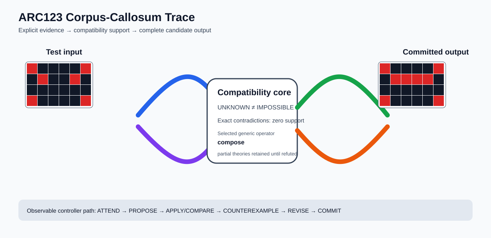

# ARC2 `5ad8a7c0` P0007 Brain Surgery Report

## Outcome: YES — ALL TEST CELLS MATCH

- **Compared positions:** 24
- **Mismatched cells:** 0
- **Training compatibility:** `True`
- **Fallback used:** `False`
- **Causal trace acceptance:** `YES`
- **Selected hypothesis:** `compose(identity,row_span_fill(fill_color=2,seed_color=2,selection=global_minimum))`
- **Source commit:** `71f86ff4c5304e452e0659131171f0519b50e21c`

## Causal Ablations

| Configuration | Exact all-cell result | Training exact | Fallback | Selected hypothesis |
| --- | --- | --- | --- | --- |
| `no_revision` | `False` | `False` | `True` | `fallback_identity_complete_grid` |
| `no_new_residual_family` | `False` | `False` | `True` | `fallback_identity_complete_grid` |

## Live-Agent Boundary

The controller receives only visible training input/output examples and test inputs. It receives no task ID, offline audit label, GT feature record, GT solver, historical decomposition, or held-out output before committing a complete grid. The expected output appears only in the post-answer V&V section.

## Corpus-Callosum Visualization



- Full explicit event record: [`learning_trace.json`](learning_trace.json)
- Full three-configuration record: [`ablations.json`](ablations.json)

## Causal Trace Check

- **Counterexample observed:** `True`
- **Additional visible demonstration selected:** `True`
- **Composition recorded:** `True`
- **Parameter or multi-rule revision:** `True`
- **Generic families in selected theory:** `row_span_minimum`

## Post-Answer V&V

### Test case 1
- **All cells match:** `True`
- **Mismatched cells:** `0`
- **Prediction:**
```json
[[2, 0, 0, 0, 0, 2], [0, 2, 2, 2, 2, 0], [0, 0, 0, 0, 0, 0], [2, 0, 0, 0, 0, 2]]
```
- **Expected output (post-answer only):**
```json
[[2, 0, 0, 0, 0, 2], [0, 2, 2, 2, 2, 0], [0, 0, 0, 0, 0, 0], [2, 0, 0, 0, 0, 2]]
```

## Observable IHL Walkthrough

The record contains explicit actions, predictions, feedback, and revisions; it does not claim or store hidden model reasoning.

### Action totals

- `ADD_CONDITION`: 5
- `APPLY_HYPOTHESIS`: 235
- `ATTEND`: 235
- `BIND_PARAMETER`: 5
- `CHOOSE_NEXT_DEMO`: 235
- `COMMIT`: 1
- `COMPARE`: 235
- `COMPOSE_RULE`: 1
- `EXPLAIN_RESIDUAL`: 1
- `FIND_COUNTEREXAMPLE`: 16
- `MERGE_RULES`: 1
- `PROMOTE_CONSTRAINT`: 5
- `PROPOSE`: 1
- `SPECIALIZE`: 47

### Decision milestones

- `0` `PROPOSE` — `{"parent_theory_id":"T0000","rule":{"description_length":1,"name":"identity","operation":"identity","parameters":{},"rule_id":"identity","scope":{"kind":"all","value":null}},"stage":"initial_generic_theories","theory_id":"T0001"}`
- `2` `ATTEND` — `{"reason":"initial_highest_observed_change_and_color_discrimination","selected_demo":0,"selected_region":{"column":1,"row":0},"theory_id":"T0001"}`
- `6` `ATTEND` — `{"reason":"counterexample_requires_visible_conditional_evidence:unseen_demo_selected_for_residual_version_space_discrimination","selected_demo":2,"selected_region":{"column":2,"row":1},"theory_id":"T0001"}`
- `10` `ATTEND` — `{"reason":"counterexample_requires_visible_conditional_evidence:unseen_demo_selected_for_residual_version_space_discrimination","selected_demo":4,"selected_region":{"column":2,"row":1},"theory_id":"T0001"}`
- `14` `ATTEND` — `{"reason":"counterexample_requires_visible_conditional_evidence:unseen_demo_selected_for_residual_version_space_discrimination","selected_demo":1,"selected_region":{"region":"whole_demo"},"theory_id":"T0001"}`
- `18` `ATTEND` — `{"reason":"counterexample_requires_visible_conditional_evidence:unseen_demo_selected_for_residual_version_space_discrimination","selected_demo":3,"selected_region":{"region":"whole_demo"},"theory_id":"T0001"}`
- `24` `SPECIALIZE` — `{"added_rule":{"description_length":4,"name":"row_span_fill(fill_color=2,seed_color=2)","operation":"full_operator","parameters":{"fill_color":2,"operator":"row_span_fill","seed_color":2},"rule_id":"structural-row_span_fill","scope":{"kind":"all","value":null}},"parent_theory_id":"T0001","reason":"unexplained_residual_proposed_generic_structural_rule","theory_id":"T0003"}`
- `25` `SPECIALIZE` — `{"added_rule":{"description_length":4,"name":"line_extend(direction=right,fill_color=2,seed_color=2)","operation":"full_operator","parameters":{"direction":"right","fill_color":2,"operator":"line_extend","seed_color":2},"rule_id":"structural-line_extend","scope":{"kind":"all","value":null}},"parent_theory_id":"T0001","reason":"unexplained_residual_proposed_generic_structural_rule","theory_id":"T0004"}`
- `26` `SPECIALIZE` — `{"added_rule":{"description_length":4,"name":"line_extend(direction=left,fill_color=2,seed_color=2)","operation":"full_operator","parameters":{"direction":"left","fill_color":2,"operator":"line_extend","seed_color":2},"rule_id":"structural-line_extend","scope":{"kind":"all","value":null}},"parent_theory_id":"T0001","reason":"unexplained_residual_proposed_generic_structural_rule","theory_id":"T0005"}`
- `27` `SPECIALIZE` — `{"added_rule":{"description_length":4,"name":"line_extend(direction=up,fill_color=2,seed_color=2)","operation":"full_operator","parameters":{"direction":"up","fill_color":2,"operator":"line_extend","seed_color":2},"rule_id":"structural-line_extend","scope":{"kind":"all","value":null}},"parent_theory_id":"T0001","reason":"unexplained_residual_proposed_generic_structural_rule","theory_id":"T0006"}`
- `28` `SPECIALIZE` — `{"added_rule":{"description_length":4,"name":"line_extend(direction=down,fill_color=2,seed_color=2)","operation":"full_operator","parameters":{"direction":"down","fill_color":2,"operator":"line_extend","seed_color":2},"rule_id":"structural-line_extend","scope":{"kind":"all","value":null}},"parent_theory_id":"T0001","reason":"unexplained_residual_proposed_generic_structural_rule","theory_id":"T0007"}`
- `30` `ATTEND` — `{"reason":"initial_highest_observed_change_and_color_discrimination","selected_demo":0,"selected_region":{"column":0,"row":1},"theory_id":"T0002"}`
- `34` `ATTEND` — `{"reason":"initial_highest_observed_change_and_color_discrimination","selected_demo":0,"selected_region":{"region":"whole_demo"},"theory_id":"T0003"}`
- `38` `ATTEND` — `{"reason":"unseen_demo_selected_for_residual_version_space_discrimination","selected_demo":2,"selected_region":{"column":1,"row":2},"theory_id":"T0003"}`
- `42` `ATTEND` — `{"reason":"initial_highest_observed_change_and_color_discrimination","selected_demo":0,"selected_region":{"region":"whole_demo"},"theory_id":"T0004"}`
- `46` `ATTEND` — `{"reason":"unseen_demo_selected_for_residual_version_space_discrimination","selected_demo":2,"selected_region":{"column":5,"row":1},"theory_id":"T0004"}`
- `50` `ATTEND` — `{"reason":"initial_highest_observed_change_and_color_discrimination","selected_demo":0,"selected_region":{"region":"whole_demo"},"theory_id":"T0005"}`
- `54` `ATTEND` — `{"reason":"unseen_demo_selected_for_residual_version_space_discrimination","selected_demo":2,"selected_region":{"column":0,"row":1},"theory_id":"T0005"}`
- `58` `ATTEND` — `{"reason":"initial_highest_observed_change_and_color_discrimination","selected_demo":0,"selected_region":{"column":1,"row":0},"theory_id":"T0006"}`
- `62` `ATTEND` — `{"reason":"initial_highest_observed_change_and_color_discrimination","selected_demo":0,"selected_region":{"column":1,"row":0},"theory_id":"T0007"}`
- `66` `ATTEND` — `{"reason":"counterexample_requires_visible_conditional_evidence:unseen_demo_selected_for_residual_version_space_discrimination","selected_demo":4,"selected_region":{"column":1,"row":0},"theory_id":"T0003"}`
- `70` `ATTEND` — `{"reason":"counterexample_requires_visible_conditional_evidence:unseen_demo_selected_for_residual_version_space_discrimination","selected_demo":4,"selected_region":{"column":1,"row":0},"theory_id":"T0004"}`
- `74` `ATTEND` — `{"reason":"counterexample_requires_visible_conditional_evidence:unseen_demo_selected_for_residual_version_space_discrimination","selected_demo":4,"selected_region":{"column":1,"row":0},"theory_id":"T0005"}`
- `78` `ATTEND` — `{"reason":"counterexample_requires_visible_conditional_evidence:unseen_demo_selected_for_residual_version_space_discrimination","selected_demo":1,"selected_region":{"column":1,"row":0},"theory_id":"T0003"}`
- `82` `ATTEND` — `{"reason":"counterexample_requires_visible_conditional_evidence:unseen_demo_selected_for_residual_version_space_discrimination","selected_demo":2,"selected_region":{"column":0,"row":0},"theory_id":"T0002"}`
- `86` `ATTEND` — `{"reason":"counterexample_requires_visible_conditional_evidence:unseen_demo_selected_for_residual_version_space_discrimination","selected_demo":2,"selected_region":{"column":0,"row":0},"theory_id":"T0006"}`
- `90` `ATTEND` — `{"reason":"counterexample_requires_visible_conditional_evidence:unseen_demo_selected_for_residual_version_space_discrimination","selected_demo":2,"selected_region":{"column":2,"row":1},"theory_id":"T0007"}`
- `94` `ATTEND` — `{"reason":"counterexample_requires_visible_conditional_evidence:unseen_demo_selected_for_residual_version_space_discrimination","selected_demo":1,"selected_region":{"column":1,"row":0},"theory_id":"T0004"}`
- `98` `ATTEND` — `{"reason":"counterexample_requires_visible_conditional_evidence:unseen_demo_selected_for_residual_version_space_discrimination","selected_demo":1,"selected_region":{"column":1,"row":0},"theory_id":"T0005"}`
- `102` `ATTEND` — `{"reason":"counterexample_requires_visible_conditional_evidence:unseen_demo_selected_for_residual_version_space_discrimination","selected_demo":3,"selected_region":{"column":2,"row":1},"theory_id":"T0003"}`
- `106` `ATTEND` — `{"reason":"counterexample_requires_visible_conditional_evidence:unseen_demo_selected_for_residual_version_space_discrimination","selected_demo":4,"selected_region":{"column":0,"row":1},"theory_id":"T0007"}`
- `110` `ATTEND` — `{"reason":"counterexample_requires_visible_conditional_evidence:unseen_demo_selected_for_residual_version_space_discrimination","selected_demo":4,"selected_region":{"column":1,"row":0},"theory_id":"T0006"}`
- `114` `ATTEND` — `{"reason":"counterexample_requires_visible_conditional_evidence:unseen_demo_selected_for_residual_version_space_discrimination","selected_demo":4,"selected_region":{"column":1,"row":0},"theory_id":"T0002"}`
- `120` `SPECIALIZE` — `{"added_rule":{"description_length":4,"name":"line_extend(direction=right,fill_color=2,seed_color=2)","operation":"full_operator","parameters":{"direction":"right","fill_color":2,"operator":"line_extend","seed_color":2},"rule_id":"structural-line_extend","scope":{"kind":"all","value":null}},"parent_theory_id":"T0003","reason":"unexplained_residual_proposed_generic_structural_rule","theory_id":"T0009"}`
- `121` `SPECIALIZE` — `{"added_rule":{"description_length":4,"name":"line_extend(direction=left,fill_color=2,seed_color=2)","operation":"full_operator","parameters":{"direction":"left","fill_color":2,"operator":"line_extend","seed_color":2},"rule_id":"structural-line_extend","scope":{"kind":"all","value":null}},"parent_theory_id":"T0003","reason":"unexplained_residual_proposed_generic_structural_rule","theory_id":"T0010"}`
- `122` `SPECIALIZE` — `{"added_rule":{"description_length":4,"name":"line_extend(direction=up,fill_color=2,seed_color=2)","operation":"full_operator","parameters":{"direction":"up","fill_color":2,"operator":"line_extend","seed_color":2},"rule_id":"structural-line_extend","scope":{"kind":"all","value":null}},"parent_theory_id":"T0003","reason":"unexplained_residual_proposed_generic_structural_rule","theory_id":"T0011"}`
- `123` `SPECIALIZE` — `{"added_rule":{"description_length":4,"name":"line_extend(direction=down,fill_color=2,seed_color=2)","operation":"full_operator","parameters":{"direction":"down","fill_color":2,"operator":"line_extend","seed_color":2},"rule_id":"structural-line_extend","scope":{"kind":"all","value":null}},"parent_theory_id":"T0003","reason":"unexplained_residual_proposed_generic_structural_rule","theory_id":"T0012"}`
- `125` `ATTEND` — `{"reason":"initial_highest_observed_change_and_color_discrimination","selected_demo":0,"selected_region":{"region":"whole_demo"},"theory_id":"T0008"}`
- `129` `ATTEND` — `{"reason":"unseen_demo_selected_for_residual_version_space_discrimination","selected_demo":2,"selected_region":{"region":"whole_demo"},"theory_id":"T0008"}`
- `133` `ATTEND` — `{"reason":"unseen_demo_selected_for_residual_version_space_discrimination","selected_demo":4,"selected_region":{"region":"whole_demo"},"theory_id":"T0008"}`
- `137` `ATTEND` — `{"reason":"unseen_demo_selected_for_residual_version_space_discrimination","selected_demo":1,"selected_region":{"region":"whole_demo"},"theory_id":"T0008"}`
- `141` `ATTEND` — `{"reason":"unseen_demo_selected_for_residual_version_space_discrimination","selected_demo":3,"selected_region":{"region":"whole_demo"},"theory_id":"T0008"}`
- `144` `PROMOTE_CONSTRAINT` — `{"evaluated_demo_count":5,"rule_count":2,"status":"complete_training_compatibility_after_revision","theory_id":"T0008"}`
- `146` `ATTEND` — `{"reason":"initial_highest_observed_change_and_color_discrimination","selected_demo":0,"selected_region":{"region":"whole_demo"},"theory_id":"T0009"}`
- `150` `ATTEND` — `{"reason":"unseen_demo_selected_for_residual_version_space_discrimination","selected_demo":2,"selected_region":{"column":5,"row":1},"theory_id":"T0009"}`
- `154` `ATTEND` — `{"reason":"initial_highest_observed_change_and_color_discrimination","selected_demo":0,"selected_region":{"region":"whole_demo"},"theory_id":"T0010"}`
- `158` `ATTEND` — `{"reason":"unseen_demo_selected_for_residual_version_space_discrimination","selected_demo":2,"selected_region":{"column":0,"row":1},"theory_id":"T0010"}`
- `162` `ATTEND` — `{"reason":"initial_highest_observed_change_and_color_discrimination","selected_demo":0,"selected_region":{"column":1,"row":0},"theory_id":"T0011"}`
- `166` `ATTEND` — `{"reason":"initial_highest_observed_change_and_color_discrimination","selected_demo":0,"selected_region":{"column":1,"row":0},"theory_id":"T0012"}`
- `170` `ATTEND` — `{"reason":"counterexample_requires_visible_conditional_evidence:unseen_demo_selected_for_residual_version_space_discrimination","selected_demo":4,"selected_region":{"column":1,"row":0},"theory_id":"T0009"}`
- `174` `ATTEND` — `{"reason":"counterexample_requires_visible_conditional_evidence:unseen_demo_selected_for_residual_version_space_discrimination","selected_demo":4,"selected_region":{"column":1,"row":0},"theory_id":"T0010"}`
- `178` `ATTEND` — `{"reason":"counterexample_requires_visible_conditional_evidence:unseen_demo_selected_for_residual_version_space_discrimination","selected_demo":2,"selected_region":{"column":0,"row":0},"theory_id":"T0011"}`
- `182` `ATTEND` — `{"reason":"counterexample_requires_visible_conditional_evidence:unseen_demo_selected_for_residual_version_space_discrimination","selected_demo":2,"selected_region":{"column":2,"row":1},"theory_id":"T0012"}`
- `186` `ATTEND` — `{"reason":"counterexample_requires_visible_conditional_evidence:unseen_demo_selected_for_residual_version_space_discrimination","selected_demo":1,"selected_region":{"column":1,"row":0},"theory_id":"T0009"}`
- `190` `ATTEND` — `{"reason":"counterexample_requires_visible_conditional_evidence:unseen_demo_selected_for_residual_version_space_discrimination","selected_demo":1,"selected_region":{"column":1,"row":0},"theory_id":"T0010"}`
- `194` `ATTEND` — `{"reason":"counterexample_requires_visible_conditional_evidence:unseen_demo_selected_for_residual_version_space_discrimination","selected_demo":4,"selected_region":{"column":0,"row":1},"theory_id":"T0012"}`
- `198` `ATTEND` — `{"reason":"counterexample_requires_visible_conditional_evidence:unseen_demo_selected_for_residual_version_space_discrimination","selected_demo":4,"selected_region":{"column":1,"row":0},"theory_id":"T0011"}`
- `202` `ATTEND` — `{"reason":"counterexample_requires_visible_conditional_evidence:unseen_demo_selected_for_residual_version_space_discrimination","selected_demo":3,"selected_region":{"column":4,"row":0},"theory_id":"T0004"}`
- `206` `ATTEND` — `{"reason":"counterexample_requires_visible_conditional_evidence:unseen_demo_selected_for_residual_version_space_discrimination","selected_demo":3,"selected_region":{"column":0,"row":0},"theory_id":"T0005"}`
- `210` `ATTEND` — `{"reason":"counterexample_requires_visible_conditional_evidence:unseen_demo_selected_for_residual_version_space_discrimination","selected_demo":3,"selected_region":{"column":4,"row":0},"theory_id":"T0009"}`
- `214` `ATTEND` — `{"reason":"counterexample_requires_visible_conditional_evidence:unseen_demo_selected_for_residual_version_space_discrimination","selected_demo":3,"selected_region":{"column":0,"row":0},"theory_id":"T0010"}`
- `218` `ATTEND` — `{"reason":"counterexample_requires_visible_conditional_evidence:unseen_demo_selected_for_residual_version_space_discrimination","selected_demo":1,"selected_region":{"column":0,"row":1},"theory_id":"T0007"}`
- `222` `ATTEND` — `{"reason":"counterexample_requires_visible_conditional_evidence:unseen_demo_selected_for_residual_version_space_discrimination","selected_demo":1,"selected_region":{"column":0,"row":1},"theory_id":"T0012"}`
- `226` `ATTEND` — `{"reason":"counterexample_requires_visible_conditional_evidence:unseen_demo_selected_for_residual_version_space_discrimination","selected_demo":1,"selected_region":{"column":1,"row":0},"theory_id":"T0006"}`
- `230` `ATTEND` — `{"reason":"counterexample_requires_visible_conditional_evidence:unseen_demo_selected_for_residual_version_space_discrimination","selected_demo":1,"selected_region":{"column":1,"row":0},"theory_id":"T0011"}`
- `234` `ATTEND` — `{"reason":"counterexample_requires_visible_conditional_evidence:unseen_demo_selected_for_residual_version_space_discrimination","selected_demo":1,"selected_region":{"column":1,"row":0},"theory_id":"T0002"}`
- `238` `SPECIALIZE` — `{"added_rule":{"description_length":4,"name":"row_span_fill(fill_color=2,seed_color=2)","operation":"full_operator","parameters":{"fill_color":2,"operator":"row_span_fill","seed_color":2},"rule_id":"structural-row_span_fill","scope":{"kind":"all","value":null}},"parent_theory_id":"T0004","reason":"unexplained_residual_proposed_generic_structural_rule","theory_id":"T0013"}`
- `239` `SPECIALIZE` — `{"added_rule":{"description_length":4,"name":"line_extend(direction=left,fill_color=2,seed_color=2)","operation":"full_operator","parameters":{"direction":"left","fill_color":2,"operator":"line_extend","seed_color":2},"rule_id":"structural-line_extend","scope":{"kind":"all","value":null}},"parent_theory_id":"T0004","reason":"unexplained_residual_proposed_generic_structural_rule","theory_id":"T0014"}`
- `240` `SPECIALIZE` — `{"added_rule":{"description_length":4,"name":"line_extend(direction=up,fill_color=2,seed_color=2)","operation":"full_operator","parameters":{"direction":"up","fill_color":2,"operator":"line_extend","seed_color":2},"rule_id":"structural-line_extend","scope":{"kind":"all","value":null}},"parent_theory_id":"T0004","reason":"unexplained_residual_proposed_generic_structural_rule","theory_id":"T0015"}`
- `241` `SPECIALIZE` — `{"added_rule":{"description_length":4,"name":"line_extend(direction=down,fill_color=2,seed_color=2)","operation":"full_operator","parameters":{"direction":"down","fill_color":2,"operator":"line_extend","seed_color":2},"rule_id":"structural-line_extend","scope":{"kind":"all","value":null}},"parent_theory_id":"T0004","reason":"unexplained_residual_proposed_generic_structural_rule","theory_id":"T0016"}`
- `243` `ATTEND` — `{"reason":"initial_highest_observed_change_and_color_discrimination","selected_demo":0,"selected_region":{"region":"whole_demo"},"theory_id":"T0013"}`
- `247` `ATTEND` — `{"reason":"unseen_demo_selected_for_residual_version_space_discrimination","selected_demo":2,"selected_region":{"column":1,"row":2},"theory_id":"T0013"}`
- `251` `ATTEND` — `{"reason":"initial_highest_observed_change_and_color_discrimination","selected_demo":0,"selected_region":{"region":"whole_demo"},"theory_id":"T0014"}`
- `255` `ATTEND` — `{"reason":"unseen_demo_selected_for_residual_version_space_discrimination","selected_demo":2,"selected_region":{"column":0,"row":1},"theory_id":"T0014"}`
- `259` `ATTEND` — `{"reason":"initial_highest_observed_change_and_color_discrimination","selected_demo":0,"selected_region":{"column":1,"row":0},"theory_id":"T0015"}`
- `263` `ATTEND` — `{"reason":"initial_highest_observed_change_and_color_discrimination","selected_demo":0,"selected_region":{"column":1,"row":0},"theory_id":"T0016"}`
- `267` `ATTEND` — `{"reason":"counterexample_requires_visible_conditional_evidence:unseen_demo_selected_for_residual_version_space_discrimination","selected_demo":4,"selected_region":{"column":1,"row":0},"theory_id":"T0013"}`
- `271` `ATTEND` — `{"reason":"counterexample_requires_visible_conditional_evidence:unseen_demo_selected_for_residual_version_space_discrimination","selected_demo":4,"selected_region":{"column":1,"row":0},"theory_id":"T0014"}`
- `275` `ATTEND` — `{"reason":"counterexample_requires_visible_conditional_evidence:unseen_demo_selected_for_residual_version_space_discrimination","selected_demo":1,"selected_region":{"column":1,"row":0},"theory_id":"T0013"}`
- `279` `ATTEND` — `{"reason":"counterexample_requires_visible_conditional_evidence:unseen_demo_selected_for_residual_version_space_discrimination","selected_demo":2,"selected_region":{"column":0,"row":0},"theory_id":"T0015"}`
- `283` `ATTEND` — `{"reason":"counterexample_requires_visible_conditional_evidence:unseen_demo_selected_for_residual_version_space_discrimination","selected_demo":2,"selected_region":{"column":2,"row":1},"theory_id":"T0016"}`
- `287` `ATTEND` — `{"reason":"counterexample_requires_visible_conditional_evidence:unseen_demo_selected_for_residual_version_space_discrimination","selected_demo":1,"selected_region":{"column":1,"row":0},"theory_id":"T0014"}`
- `291` `ATTEND` — `{"reason":"counterexample_requires_visible_conditional_evidence:unseen_demo_selected_for_residual_version_space_discrimination","selected_demo":3,"selected_region":{"column":2,"row":1},"theory_id":"T0013"}`
- `295` `ATTEND` — `{"reason":"counterexample_requires_visible_conditional_evidence:unseen_demo_selected_for_residual_version_space_discrimination","selected_demo":4,"selected_region":{"column":0,"row":1},"theory_id":"T0016"}`
- `299` `ATTEND` — `{"reason":"counterexample_requires_visible_conditional_evidence:unseen_demo_selected_for_residual_version_space_discrimination","selected_demo":4,"selected_region":{"column":1,"row":0},"theory_id":"T0015"}`
- `305` `SPECIALIZE` — `{"added_rule":{"description_length":4,"name":"line_extend(direction=left,fill_color=2,seed_color=2)","operation":"full_operator","parameters":{"direction":"left","fill_color":2,"operator":"line_extend","seed_color":2},"rule_id":"structural-line_extend","scope":{"kind":"all","value":null}},"parent_theory_id":"T0013","reason":"unexplained_residual_proposed_generic_structural_rule","theory_id":"T0018"}`
- `306` `SPECIALIZE` — `{"added_rule":{"description_length":4,"name":"line_extend(direction=up,fill_color=2,seed_color=2)","operation":"full_operator","parameters":{"direction":"up","fill_color":2,"operator":"line_extend","seed_color":2},"rule_id":"structural-line_extend","scope":{"kind":"all","value":null}},"parent_theory_id":"T0013","reason":"unexplained_residual_proposed_generic_structural_rule","theory_id":"T0019"}`
- `307` `SPECIALIZE` — `{"added_rule":{"description_length":4,"name":"line_extend(direction=down,fill_color=2,seed_color=2)","operation":"full_operator","parameters":{"direction":"down","fill_color":2,"operator":"line_extend","seed_color":2},"rule_id":"structural-line_extend","scope":{"kind":"all","value":null}},"parent_theory_id":"T0013","reason":"unexplained_residual_proposed_generic_structural_rule","theory_id":"T0020"}`
- `309` `ATTEND` — `{"reason":"initial_highest_observed_change_and_color_discrimination","selected_demo":0,"selected_region":{"region":"whole_demo"},"theory_id":"T0017"}`
- `313` `ATTEND` — `{"reason":"unseen_demo_selected_for_residual_version_space_discrimination","selected_demo":2,"selected_region":{"region":"whole_demo"},"theory_id":"T0017"}`
- `317` `ATTEND` — `{"reason":"unseen_demo_selected_for_residual_version_space_discrimination","selected_demo":4,"selected_region":{"region":"whole_demo"},"theory_id":"T0017"}`
- `321` `ATTEND` — `{"reason":"unseen_demo_selected_for_residual_version_space_discrimination","selected_demo":1,"selected_region":{"region":"whole_demo"},"theory_id":"T0017"}`
- `325` `ATTEND` — `{"reason":"unseen_demo_selected_for_residual_version_space_discrimination","selected_demo":3,"selected_region":{"region":"whole_demo"},"theory_id":"T0017"}`
- `328` `PROMOTE_CONSTRAINT` — `{"evaluated_demo_count":5,"rule_count":3,"status":"complete_training_compatibility_after_revision","theory_id":"T0017"}`
- `330` `ATTEND` — `{"reason":"initial_highest_observed_change_and_color_discrimination","selected_demo":0,"selected_region":{"region":"whole_demo"},"theory_id":"T0018"}`
- `334` `ATTEND` — `{"reason":"unseen_demo_selected_for_residual_version_space_discrimination","selected_demo":2,"selected_region":{"column":0,"row":1},"theory_id":"T0018"}`
- `338` `ATTEND` — `{"reason":"initial_highest_observed_change_and_color_discrimination","selected_demo":0,"selected_region":{"column":1,"row":0},"theory_id":"T0019"}`
- `342` `ATTEND` — `{"reason":"initial_highest_observed_change_and_color_discrimination","selected_demo":0,"selected_region":{"column":1,"row":0},"theory_id":"T0020"}`
- `346` `ATTEND` — `{"reason":"counterexample_requires_visible_conditional_evidence:unseen_demo_selected_for_residual_version_space_discrimination","selected_demo":4,"selected_region":{"column":1,"row":0},"theory_id":"T0018"}`
- `350` `ATTEND` — `{"reason":"counterexample_requires_visible_conditional_evidence:unseen_demo_selected_for_residual_version_space_discrimination","selected_demo":2,"selected_region":{"column":0,"row":0},"theory_id":"T0019"}`
- `354` `ATTEND` — `{"reason":"counterexample_requires_visible_conditional_evidence:unseen_demo_selected_for_residual_version_space_discrimination","selected_demo":2,"selected_region":{"column":2,"row":1},"theory_id":"T0020"}`
- `358` `ATTEND` — `{"reason":"counterexample_requires_visible_conditional_evidence:unseen_demo_selected_for_residual_version_space_discrimination","selected_demo":1,"selected_region":{"column":1,"row":0},"theory_id":"T0018"}`
- `362` `ATTEND` — `{"reason":"counterexample_requires_visible_conditional_evidence:unseen_demo_selected_for_residual_version_space_discrimination","selected_demo":4,"selected_region":{"column":0,"row":1},"theory_id":"T0020"}`
- `366` `ATTEND` — `{"reason":"counterexample_requires_visible_conditional_evidence:unseen_demo_selected_for_residual_version_space_discrimination","selected_demo":4,"selected_region":{"column":1,"row":0},"theory_id":"T0019"}`
- `370` `ATTEND` — `{"reason":"counterexample_requires_visible_conditional_evidence:unseen_demo_selected_for_residual_version_space_discrimination","selected_demo":3,"selected_region":{"column":0,"row":0},"theory_id":"T0014"}`
- `374` `ATTEND` — `{"reason":"counterexample_requires_visible_conditional_evidence:unseen_demo_selected_for_residual_version_space_discrimination","selected_demo":3,"selected_region":{"column":0,"row":0},"theory_id":"T0018"}`
- `378` `ATTEND` — `{"reason":"counterexample_requires_visible_conditional_evidence:unseen_demo_selected_for_residual_version_space_discrimination","selected_demo":1,"selected_region":{"column":0,"row":1},"theory_id":"T0016"}`
- `382` `ATTEND` — `{"reason":"counterexample_requires_visible_conditional_evidence:unseen_demo_selected_for_residual_version_space_discrimination","selected_demo":1,"selected_region":{"column":0,"row":1},"theory_id":"T0020"}`
- `386` `ATTEND` — `{"reason":"counterexample_requires_visible_conditional_evidence:unseen_demo_selected_for_residual_version_space_discrimination","selected_demo":1,"selected_region":{"column":1,"row":0},"theory_id":"T0015"}`
- `390` `ATTEND` — `{"reason":"counterexample_requires_visible_conditional_evidence:unseen_demo_selected_for_residual_version_space_discrimination","selected_demo":1,"selected_region":{"column":1,"row":0},"theory_id":"T0019"}`
- `394` `SPECIALIZE` — `{"added_rule":{"description_length":4,"name":"row_span_fill(fill_color=2,seed_color=2)","operation":"full_operator","parameters":{"fill_color":2,"operator":"row_span_fill","seed_color":2},"rule_id":"structural-row_span_fill","scope":{"kind":"all","value":null}},"parent_theory_id":"T0005","reason":"unexplained_residual_proposed_generic_structural_rule","theory_id":"T0021"}`
- `395` `SPECIALIZE` — `{"added_rule":{"description_length":4,"name":"line_extend(direction=right,fill_color=2,seed_color=2)","operation":"full_operator","parameters":{"direction":"right","fill_color":2,"operator":"line_extend","seed_color":2},"rule_id":"structural-line_extend","scope":{"kind":"all","value":null}},"parent_theory_id":"T0005","reason":"unexplained_residual_proposed_generic_structural_rule","theory_id":"T0022"}`
- `396` `SPECIALIZE` — `{"added_rule":{"description_length":4,"name":"line_extend(direction=up,fill_color=2,seed_color=2)","operation":"full_operator","parameters":{"direction":"up","fill_color":2,"operator":"line_extend","seed_color":2},"rule_id":"structural-line_extend","scope":{"kind":"all","value":null}},"parent_theory_id":"T0005","reason":"unexplained_residual_proposed_generic_structural_rule","theory_id":"T0023"}`
- `397` `SPECIALIZE` — `{"added_rule":{"description_length":4,"name":"line_extend(direction=down,fill_color=2,seed_color=2)","operation":"full_operator","parameters":{"direction":"down","fill_color":2,"operator":"line_extend","seed_color":2},"rule_id":"structural-line_extend","scope":{"kind":"all","value":null}},"parent_theory_id":"T0005","reason":"unexplained_residual_proposed_generic_structural_rule","theory_id":"T0024"}`
- `399` `ATTEND` — `{"reason":"initial_highest_observed_change_and_color_discrimination","selected_demo":0,"selected_region":{"region":"whole_demo"},"theory_id":"T0021"}`
- `403` `ATTEND` — `{"reason":"unseen_demo_selected_for_residual_version_space_discrimination","selected_demo":2,"selected_region":{"column":1,"row":2},"theory_id":"T0021"}`
- `407` `ATTEND` — `{"reason":"initial_highest_observed_change_and_color_discrimination","selected_demo":0,"selected_region":{"region":"whole_demo"},"theory_id":"T0022"}`
- `411` `ATTEND` — `{"reason":"unseen_demo_selected_for_residual_version_space_discrimination","selected_demo":2,"selected_region":{"column":5,"row":1},"theory_id":"T0022"}`
- `415` `ATTEND` — `{"reason":"initial_highest_observed_change_and_color_discrimination","selected_demo":0,"selected_region":{"column":1,"row":0},"theory_id":"T0023"}`
- `419` `ATTEND` — `{"reason":"initial_highest_observed_change_and_color_discrimination","selected_demo":0,"selected_region":{"column":1,"row":0},"theory_id":"T0024"}`
- `423` `ATTEND` — `{"reason":"counterexample_requires_visible_conditional_evidence:unseen_demo_selected_for_residual_version_space_discrimination","selected_demo":4,"selected_region":{"column":1,"row":0},"theory_id":"T0021"}`
- `427` `ATTEND` — `{"reason":"counterexample_requires_visible_conditional_evidence:unseen_demo_selected_for_residual_version_space_discrimination","selected_demo":4,"selected_region":{"column":1,"row":0},"theory_id":"T0022"}`
- `431` `ATTEND` — `{"reason":"counterexample_requires_visible_conditional_evidence:unseen_demo_selected_for_residual_version_space_discrimination","selected_demo":1,"selected_region":{"column":1,"row":0},"theory_id":"T0021"}`
- `435` `ATTEND` — `{"reason":"counterexample_requires_visible_conditional_evidence:unseen_demo_selected_for_residual_version_space_discrimination","selected_demo":2,"selected_region":{"column":0,"row":0},"theory_id":"T0023"}`
- `439` `ATTEND` — `{"reason":"counterexample_requires_visible_conditional_evidence:unseen_demo_selected_for_residual_version_space_discrimination","selected_demo":2,"selected_region":{"column":2,"row":1},"theory_id":"T0024"}`
- `443` `ATTEND` — `{"reason":"counterexample_requires_visible_conditional_evidence:unseen_demo_selected_for_residual_version_space_discrimination","selected_demo":1,"selected_region":{"column":1,"row":0},"theory_id":"T0022"}`
- `447` `ATTEND` — `{"reason":"counterexample_requires_visible_conditional_evidence:unseen_demo_selected_for_residual_version_space_discrimination","selected_demo":3,"selected_region":{"column":2,"row":1},"theory_id":"T0021"}`
- `451` `ATTEND` — `{"reason":"counterexample_requires_visible_conditional_evidence:unseen_demo_selected_for_residual_version_space_discrimination","selected_demo":4,"selected_region":{"column":0,"row":1},"theory_id":"T0024"}`
- `455` `ATTEND` — `{"reason":"counterexample_requires_visible_conditional_evidence:unseen_demo_selected_for_residual_version_space_discrimination","selected_demo":4,"selected_region":{"column":1,"row":0},"theory_id":"T0023"}`
- `461` `SPECIALIZE` — `{"added_rule":{"description_length":4,"name":"line_extend(direction=right,fill_color=2,seed_color=2)","operation":"full_operator","parameters":{"direction":"right","fill_color":2,"operator":"line_extend","seed_color":2},"rule_id":"structural-line_extend","scope":{"kind":"all","value":null}},"parent_theory_id":"T0021","reason":"unexplained_residual_proposed_generic_structural_rule","theory_id":"T0026"}`
- `462` `SPECIALIZE` — `{"added_rule":{"description_length":4,"name":"line_extend(direction=up,fill_color=2,seed_color=2)","operation":"full_operator","parameters":{"direction":"up","fill_color":2,"operator":"line_extend","seed_color":2},"rule_id":"structural-line_extend","scope":{"kind":"all","value":null}},"parent_theory_id":"T0021","reason":"unexplained_residual_proposed_generic_structural_rule","theory_id":"T0027"}`
- `463` `SPECIALIZE` — `{"added_rule":{"description_length":4,"name":"line_extend(direction=down,fill_color=2,seed_color=2)","operation":"full_operator","parameters":{"direction":"down","fill_color":2,"operator":"line_extend","seed_color":2},"rule_id":"structural-line_extend","scope":{"kind":"all","value":null}},"parent_theory_id":"T0021","reason":"unexplained_residual_proposed_generic_structural_rule","theory_id":"T0028"}`
- `465` `ATTEND` — `{"reason":"initial_highest_observed_change_and_color_discrimination","selected_demo":0,"selected_region":{"region":"whole_demo"},"theory_id":"T0025"}`
- `469` `ATTEND` — `{"reason":"unseen_demo_selected_for_residual_version_space_discrimination","selected_demo":2,"selected_region":{"region":"whole_demo"},"theory_id":"T0025"}`
- `473` `ATTEND` — `{"reason":"unseen_demo_selected_for_residual_version_space_discrimination","selected_demo":4,"selected_region":{"region":"whole_demo"},"theory_id":"T0025"}`
- `477` `ATTEND` — `{"reason":"unseen_demo_selected_for_residual_version_space_discrimination","selected_demo":1,"selected_region":{"region":"whole_demo"},"theory_id":"T0025"}`
- `481` `ATTEND` — `{"reason":"unseen_demo_selected_for_residual_version_space_discrimination","selected_demo":3,"selected_region":{"region":"whole_demo"},"theory_id":"T0025"}`
- `484` `PROMOTE_CONSTRAINT` — `{"evaluated_demo_count":5,"rule_count":3,"status":"complete_training_compatibility_after_revision","theory_id":"T0025"}`
- `486` `ATTEND` — `{"reason":"initial_highest_observed_change_and_color_discrimination","selected_demo":0,"selected_region":{"region":"whole_demo"},"theory_id":"T0026"}`
- `490` `ATTEND` — `{"reason":"unseen_demo_selected_for_residual_version_space_discrimination","selected_demo":2,"selected_region":{"column":5,"row":1},"theory_id":"T0026"}`
- `494` `ATTEND` — `{"reason":"initial_highest_observed_change_and_color_discrimination","selected_demo":0,"selected_region":{"column":1,"row":0},"theory_id":"T0027"}`
- `498` `ATTEND` — `{"reason":"initial_highest_observed_change_and_color_discrimination","selected_demo":0,"selected_region":{"column":1,"row":0},"theory_id":"T0028"}`
- `502` `ATTEND` — `{"reason":"counterexample_requires_visible_conditional_evidence:unseen_demo_selected_for_residual_version_space_discrimination","selected_demo":4,"selected_region":{"column":1,"row":0},"theory_id":"T0026"}`
- `506` `ATTEND` — `{"reason":"counterexample_requires_visible_conditional_evidence:unseen_demo_selected_for_residual_version_space_discrimination","selected_demo":2,"selected_region":{"column":0,"row":0},"theory_id":"T0027"}`
- `510` `ATTEND` — `{"reason":"counterexample_requires_visible_conditional_evidence:unseen_demo_selected_for_residual_version_space_discrimination","selected_demo":2,"selected_region":{"column":2,"row":1},"theory_id":"T0028"}`
- `514` `ATTEND` — `{"reason":"counterexample_requires_visible_conditional_evidence:unseen_demo_selected_for_residual_version_space_discrimination","selected_demo":1,"selected_region":{"column":1,"row":0},"theory_id":"T0026"}`
- `518` `ATTEND` — `{"reason":"counterexample_requires_visible_conditional_evidence:unseen_demo_selected_for_residual_version_space_discrimination","selected_demo":4,"selected_region":{"column":0,"row":1},"theory_id":"T0028"}`
- `522` `ATTEND` — `{"reason":"counterexample_requires_visible_conditional_evidence:unseen_demo_selected_for_residual_version_space_discrimination","selected_demo":4,"selected_region":{"column":1,"row":0},"theory_id":"T0027"}`
- `526` `ATTEND` — `{"reason":"counterexample_requires_visible_conditional_evidence:unseen_demo_selected_for_residual_version_space_discrimination","selected_demo":3,"selected_region":{"column":4,"row":0},"theory_id":"T0022"}`
- `530` `ATTEND` — `{"reason":"counterexample_requires_visible_conditional_evidence:unseen_demo_selected_for_residual_version_space_discrimination","selected_demo":3,"selected_region":{"column":4,"row":0},"theory_id":"T0026"}`
- `534` `ATTEND` — `{"reason":"counterexample_requires_visible_conditional_evidence:unseen_demo_selected_for_residual_version_space_discrimination","selected_demo":1,"selected_region":{"column":0,"row":1},"theory_id":"T0024"}`
- `538` `ATTEND` — `{"reason":"counterexample_requires_visible_conditional_evidence:unseen_demo_selected_for_residual_version_space_discrimination","selected_demo":1,"selected_region":{"column":0,"row":1},"theory_id":"T0028"}`
- `542` `ATTEND` — `{"reason":"counterexample_requires_visible_conditional_evidence:unseen_demo_selected_for_residual_version_space_discrimination","selected_demo":1,"selected_region":{"column":1,"row":0},"theory_id":"T0023"}`
- `546` `ATTEND` — `{"reason":"counterexample_requires_visible_conditional_evidence:unseen_demo_selected_for_residual_version_space_discrimination","selected_demo":1,"selected_region":{"column":1,"row":0},"theory_id":"T0027"}`
- `550` `SPECIALIZE` — `{"added_rule":{"description_length":4,"name":"line_extend(direction=left,fill_color=2,seed_color=2)","operation":"full_operator","parameters":{"direction":"left","fill_color":2,"operator":"line_extend","seed_color":2},"rule_id":"structural-line_extend","scope":{"kind":"all","value":null}},"parent_theory_id":"T0009","reason":"unexplained_residual_proposed_generic_structural_rule","theory_id":"T0029"}`
- `551` `SPECIALIZE` — `{"added_rule":{"description_length":4,"name":"line_extend(direction=up,fill_color=2,seed_color=2)","operation":"full_operator","parameters":{"direction":"up","fill_color":2,"operator":"line_extend","seed_color":2},"rule_id":"structural-line_extend","scope":{"kind":"all","value":null}},"parent_theory_id":"T0009","reason":"unexplained_residual_proposed_generic_structural_rule","theory_id":"T0030"}`
- `552` `SPECIALIZE` — `{"added_rule":{"description_length":4,"name":"line_extend(direction=down,fill_color=2,seed_color=2)","operation":"full_operator","parameters":{"direction":"down","fill_color":2,"operator":"line_extend","seed_color":2},"rule_id":"structural-line_extend","scope":{"kind":"all","value":null}},"parent_theory_id":"T0009","reason":"unexplained_residual_proposed_generic_structural_rule","theory_id":"T0031"}`
- `554` `ATTEND` — `{"reason":"initial_highest_observed_change_and_color_discrimination","selected_demo":0,"selected_region":{"region":"whole_demo"},"theory_id":"T0029"}`
- `558` `ATTEND` — `{"reason":"unseen_demo_selected_for_residual_version_space_discrimination","selected_demo":2,"selected_region":{"column":0,"row":1},"theory_id":"T0029"}`
- `562` `ATTEND` — `{"reason":"initial_highest_observed_change_and_color_discrimination","selected_demo":0,"selected_region":{"column":1,"row":0},"theory_id":"T0030"}`
- `566` `ATTEND` — `{"reason":"initial_highest_observed_change_and_color_discrimination","selected_demo":0,"selected_region":{"column":1,"row":0},"theory_id":"T0031"}`
- `570` `ATTEND` — `{"reason":"counterexample_requires_visible_conditional_evidence:unseen_demo_selected_for_residual_version_space_discrimination","selected_demo":4,"selected_region":{"column":1,"row":0},"theory_id":"T0029"}`
- `574` `ATTEND` — `{"reason":"counterexample_requires_visible_conditional_evidence:unseen_demo_selected_for_residual_version_space_discrimination","selected_demo":2,"selected_region":{"column":0,"row":0},"theory_id":"T0030"}`
- `578` `ATTEND` — `{"reason":"counterexample_requires_visible_conditional_evidence:unseen_demo_selected_for_residual_version_space_discrimination","selected_demo":2,"selected_region":{"column":2,"row":1},"theory_id":"T0031"}`
- `582` `ATTEND` — `{"reason":"counterexample_requires_visible_conditional_evidence:unseen_demo_selected_for_residual_version_space_discrimination","selected_demo":1,"selected_region":{"column":1,"row":0},"theory_id":"T0029"}`
- `586` `ATTEND` — `{"reason":"counterexample_requires_visible_conditional_evidence:unseen_demo_selected_for_residual_version_space_discrimination","selected_demo":4,"selected_region":{"column":0,"row":1},"theory_id":"T0031"}`
- `590` `ATTEND` — `{"reason":"counterexample_requires_visible_conditional_evidence:unseen_demo_selected_for_residual_version_space_discrimination","selected_demo":4,"selected_region":{"column":1,"row":0},"theory_id":"T0030"}`
- `594` `ATTEND` — `{"reason":"counterexample_requires_visible_conditional_evidence:unseen_demo_selected_for_residual_version_space_discrimination","selected_demo":3,"selected_region":{"column":0,"row":0},"theory_id":"T0029"}`
- `598` `ATTEND` — `{"reason":"counterexample_requires_visible_conditional_evidence:unseen_demo_selected_for_residual_version_space_discrimination","selected_demo":1,"selected_region":{"column":0,"row":1},"theory_id":"T0031"}`
- `602` `ATTEND` — `{"reason":"counterexample_requires_visible_conditional_evidence:unseen_demo_selected_for_residual_version_space_discrimination","selected_demo":1,"selected_region":{"column":1,"row":0},"theory_id":"T0030"}`
- `606` `SPECIALIZE` — `{"added_rule":{"description_length":4,"name":"line_extend(direction=right,fill_color=2,seed_color=2)","operation":"full_operator","parameters":{"direction":"right","fill_color":2,"operator":"line_extend","seed_color":2},"rule_id":"structural-line_extend","scope":{"kind":"all","value":null}},"parent_theory_id":"T0010","reason":"unexplained_residual_proposed_generic_structural_rule","theory_id":"T0032"}`
- `607` `SPECIALIZE` — `{"added_rule":{"description_length":4,"name":"line_extend(direction=up,fill_color=2,seed_color=2)","operation":"full_operator","parameters":{"direction":"up","fill_color":2,"operator":"line_extend","seed_color":2},"rule_id":"structural-line_extend","scope":{"kind":"all","value":null}},"parent_theory_id":"T0010","reason":"unexplained_residual_proposed_generic_structural_rule","theory_id":"T0033"}`
- `608` `SPECIALIZE` — `{"added_rule":{"description_length":4,"name":"line_extend(direction=down,fill_color=2,seed_color=2)","operation":"full_operator","parameters":{"direction":"down","fill_color":2,"operator":"line_extend","seed_color":2},"rule_id":"structural-line_extend","scope":{"kind":"all","value":null}},"parent_theory_id":"T0010","reason":"unexplained_residual_proposed_generic_structural_rule","theory_id":"T0034"}`
- `610` `ATTEND` — `{"reason":"initial_highest_observed_change_and_color_discrimination","selected_demo":0,"selected_region":{"region":"whole_demo"},"theory_id":"T0032"}`
- `614` `ATTEND` — `{"reason":"unseen_demo_selected_for_residual_version_space_discrimination","selected_demo":2,"selected_region":{"column":5,"row":1},"theory_id":"T0032"}`
- `618` `ATTEND` — `{"reason":"initial_highest_observed_change_and_color_discrimination","selected_demo":0,"selected_region":{"column":1,"row":0},"theory_id":"T0033"}`
- `622` `ATTEND` — `{"reason":"initial_highest_observed_change_and_color_discrimination","selected_demo":0,"selected_region":{"column":1,"row":0},"theory_id":"T0034"}`
- `626` `ATTEND` — `{"reason":"counterexample_requires_visible_conditional_evidence:unseen_demo_selected_for_residual_version_space_discrimination","selected_demo":4,"selected_region":{"column":1,"row":0},"theory_id":"T0032"}`
- `630` `ATTEND` — `{"reason":"counterexample_requires_visible_conditional_evidence:unseen_demo_selected_for_residual_version_space_discrimination","selected_demo":2,"selected_region":{"column":0,"row":0},"theory_id":"T0033"}`
- `634` `ATTEND` — `{"reason":"counterexample_requires_visible_conditional_evidence:unseen_demo_selected_for_residual_version_space_discrimination","selected_demo":2,"selected_region":{"column":2,"row":1},"theory_id":"T0034"}`
- `638` `ATTEND` — `{"reason":"counterexample_requires_visible_conditional_evidence:unseen_demo_selected_for_residual_version_space_discrimination","selected_demo":1,"selected_region":{"column":1,"row":0},"theory_id":"T0032"}`
- `642` `ATTEND` — `{"reason":"counterexample_requires_visible_conditional_evidence:unseen_demo_selected_for_residual_version_space_discrimination","selected_demo":4,"selected_region":{"column":0,"row":1},"theory_id":"T0034"}`
- `646` `ATTEND` — `{"reason":"counterexample_requires_visible_conditional_evidence:unseen_demo_selected_for_residual_version_space_discrimination","selected_demo":4,"selected_region":{"column":1,"row":0},"theory_id":"T0033"}`
- `650` `ATTEND` — `{"reason":"counterexample_requires_visible_conditional_evidence:unseen_demo_selected_for_residual_version_space_discrimination","selected_demo":3,"selected_region":{"column":4,"row":0},"theory_id":"T0032"}`
- `654` `ATTEND` — `{"reason":"counterexample_requires_visible_conditional_evidence:unseen_demo_selected_for_residual_version_space_discrimination","selected_demo":1,"selected_region":{"column":0,"row":1},"theory_id":"T0034"}`
- `658` `ATTEND` — `{"reason":"counterexample_requires_visible_conditional_evidence:unseen_demo_selected_for_residual_version_space_discrimination","selected_demo":1,"selected_region":{"column":1,"row":0},"theory_id":"T0033"}`
- `662` `SPECIALIZE` — `{"added_rule":{"description_length":4,"name":"row_span_fill(fill_color=2,seed_color=2)","operation":"full_operator","parameters":{"fill_color":2,"operator":"row_span_fill","seed_color":2},"rule_id":"structural-row_span_fill","scope":{"kind":"all","value":null}},"parent_theory_id":"T0014","reason":"unexplained_residual_proposed_generic_structural_rule","theory_id":"T0035"}`
- `663` `SPECIALIZE` — `{"added_rule":{"description_length":4,"name":"line_extend(direction=up,fill_color=2,seed_color=2)","operation":"full_operator","parameters":{"direction":"up","fill_color":2,"operator":"line_extend","seed_color":2},"rule_id":"structural-line_extend","scope":{"kind":"all","value":null}},"parent_theory_id":"T0014","reason":"unexplained_residual_proposed_generic_structural_rule","theory_id":"T0036"}`
- `664` `SPECIALIZE` — `{"added_rule":{"description_length":4,"name":"line_extend(direction=down,fill_color=2,seed_color=2)","operation":"full_operator","parameters":{"direction":"down","fill_color":2,"operator":"line_extend","seed_color":2},"rule_id":"structural-line_extend","scope":{"kind":"all","value":null}},"parent_theory_id":"T0014","reason":"unexplained_residual_proposed_generic_structural_rule","theory_id":"T0037"}`
- `666` `ATTEND` — `{"reason":"initial_highest_observed_change_and_color_discrimination","selected_demo":0,"selected_region":{"region":"whole_demo"},"theory_id":"T0035"}`
- `670` `ATTEND` — `{"reason":"unseen_demo_selected_for_residual_version_space_discrimination","selected_demo":2,"selected_region":{"column":1,"row":2},"theory_id":"T0035"}`
- `674` `ATTEND` — `{"reason":"initial_highest_observed_change_and_color_discrimination","selected_demo":0,"selected_region":{"column":1,"row":0},"theory_id":"T0036"}`
- `678` `ATTEND` — `{"reason":"initial_highest_observed_change_and_color_discrimination","selected_demo":0,"selected_region":{"column":1,"row":0},"theory_id":"T0037"}`
- `682` `ATTEND` — `{"reason":"counterexample_requires_visible_conditional_evidence:unseen_demo_selected_for_residual_version_space_discrimination","selected_demo":4,"selected_region":{"column":1,"row":0},"theory_id":"T0035"}`
- `686` `ATTEND` — `{"reason":"counterexample_requires_visible_conditional_evidence:unseen_demo_selected_for_residual_version_space_discrimination","selected_demo":1,"selected_region":{"column":1,"row":0},"theory_id":"T0035"}`
- `690` `ATTEND` — `{"reason":"counterexample_requires_visible_conditional_evidence:unseen_demo_selected_for_residual_version_space_discrimination","selected_demo":2,"selected_region":{"column":0,"row":0},"theory_id":"T0036"}`
- `694` `ATTEND` — `{"reason":"counterexample_requires_visible_conditional_evidence:unseen_demo_selected_for_residual_version_space_discrimination","selected_demo":2,"selected_region":{"column":2,"row":1},"theory_id":"T0037"}`
- `698` `ATTEND` — `{"reason":"counterexample_requires_visible_conditional_evidence:unseen_demo_selected_for_residual_version_space_discrimination","selected_demo":3,"selected_region":{"column":2,"row":1},"theory_id":"T0035"}`
- `702` `ATTEND` — `{"reason":"counterexample_requires_visible_conditional_evidence:unseen_demo_selected_for_residual_version_space_discrimination","selected_demo":4,"selected_region":{"column":0,"row":1},"theory_id":"T0037"}`
- `706` `ATTEND` — `{"reason":"counterexample_requires_visible_conditional_evidence:unseen_demo_selected_for_residual_version_space_discrimination","selected_demo":4,"selected_region":{"column":1,"row":0},"theory_id":"T0036"}`
- `712` `SPECIALIZE` — `{"added_rule":{"description_length":4,"name":"line_extend(direction=up,fill_color=2,seed_color=2)","operation":"full_operator","parameters":{"direction":"up","fill_color":2,"operator":"line_extend","seed_color":2},"rule_id":"structural-line_extend","scope":{"kind":"all","value":null}},"parent_theory_id":"T0035","reason":"unexplained_residual_proposed_generic_structural_rule","theory_id":"T0039"}`
- `713` `SPECIALIZE` — `{"added_rule":{"description_length":4,"name":"line_extend(direction=down,fill_color=2,seed_color=2)","operation":"full_operator","parameters":{"direction":"down","fill_color":2,"operator":"line_extend","seed_color":2},"rule_id":"structural-line_extend","scope":{"kind":"all","value":null}},"parent_theory_id":"T0035","reason":"unexplained_residual_proposed_generic_structural_rule","theory_id":"T0040"}`
- `715` `ATTEND` — `{"reason":"initial_highest_observed_change_and_color_discrimination","selected_demo":0,"selected_region":{"region":"whole_demo"},"theory_id":"T0038"}`
- `719` `ATTEND` — `{"reason":"unseen_demo_selected_for_residual_version_space_discrimination","selected_demo":2,"selected_region":{"region":"whole_demo"},"theory_id":"T0038"}`
- `723` `ATTEND` — `{"reason":"unseen_demo_selected_for_residual_version_space_discrimination","selected_demo":4,"selected_region":{"region":"whole_demo"},"theory_id":"T0038"}`
- `727` `ATTEND` — `{"reason":"unseen_demo_selected_for_residual_version_space_discrimination","selected_demo":1,"selected_region":{"region":"whole_demo"},"theory_id":"T0038"}`
- `731` `ATTEND` — `{"reason":"unseen_demo_selected_for_residual_version_space_discrimination","selected_demo":3,"selected_region":{"region":"whole_demo"},"theory_id":"T0038"}`
- `734` `PROMOTE_CONSTRAINT` — `{"evaluated_demo_count":5,"rule_count":4,"status":"complete_training_compatibility_after_revision","theory_id":"T0038"}`
- `736` `ATTEND` — `{"reason":"initial_highest_observed_change_and_color_discrimination","selected_demo":0,"selected_region":{"column":1,"row":0},"theory_id":"T0039"}`
- `740` `ATTEND` — `{"reason":"initial_highest_observed_change_and_color_discrimination","selected_demo":0,"selected_region":{"column":1,"row":0},"theory_id":"T0040"}`
- `744` `ATTEND` — `{"reason":"counterexample_requires_visible_conditional_evidence:unseen_demo_selected_for_residual_version_space_discrimination","selected_demo":2,"selected_region":{"column":0,"row":0},"theory_id":"T0039"}`
- `748` `ATTEND` — `{"reason":"counterexample_requires_visible_conditional_evidence:unseen_demo_selected_for_residual_version_space_discrimination","selected_demo":2,"selected_region":{"column":2,"row":1},"theory_id":"T0040"}`
- `752` `ATTEND` — `{"reason":"counterexample_requires_visible_conditional_evidence:unseen_demo_selected_for_residual_version_space_discrimination","selected_demo":4,"selected_region":{"column":0,"row":1},"theory_id":"T0040"}`
- `756` `ATTEND` — `{"reason":"counterexample_requires_visible_conditional_evidence:unseen_demo_selected_for_residual_version_space_discrimination","selected_demo":4,"selected_region":{"column":1,"row":0},"theory_id":"T0039"}`
- `760` `ATTEND` — `{"reason":"counterexample_requires_visible_conditional_evidence:unseen_demo_selected_for_residual_version_space_discrimination","selected_demo":1,"selected_region":{"column":0,"row":1},"theory_id":"T0037"}`
- `764` `ATTEND` — `{"reason":"counterexample_requires_visible_conditional_evidence:unseen_demo_selected_for_residual_version_space_discrimination","selected_demo":1,"selected_region":{"column":0,"row":1},"theory_id":"T0040"}`
- `768` `ATTEND` — `{"reason":"counterexample_requires_visible_conditional_evidence:unseen_demo_selected_for_residual_version_space_discrimination","selected_demo":1,"selected_region":{"column":1,"row":0},"theory_id":"T0036"}`
- `772` `ATTEND` — `{"reason":"counterexample_requires_visible_conditional_evidence:unseen_demo_selected_for_residual_version_space_discrimination","selected_demo":1,"selected_region":{"column":1,"row":0},"theory_id":"T0039"}`
- `776` `SPECIALIZE` — `{"added_rule":{"description_length":4,"name":"row_span_fill(fill_color=2,seed_color=2)","operation":"full_operator","parameters":{"fill_color":2,"operator":"row_span_fill","seed_color":2},"rule_id":"structural-row_span_fill","scope":{"kind":"all","value":null}},"parent_theory_id":"T0022","reason":"unexplained_residual_proposed_generic_structural_rule","theory_id":"T0041"}`
- `777` `SPECIALIZE` — `{"added_rule":{"description_length":4,"name":"line_extend(direction=up,fill_color=2,seed_color=2)","operation":"full_operator","parameters":{"direction":"up","fill_color":2,"operator":"line_extend","seed_color":2},"rule_id":"structural-line_extend","scope":{"kind":"all","value":null}},"parent_theory_id":"T0022","reason":"unexplained_residual_proposed_generic_structural_rule","theory_id":"T0042"}`
- `778` `SPECIALIZE` — `{"added_rule":{"description_length":4,"name":"line_extend(direction=down,fill_color=2,seed_color=2)","operation":"full_operator","parameters":{"direction":"down","fill_color":2,"operator":"line_extend","seed_color":2},"rule_id":"structural-line_extend","scope":{"kind":"all","value":null}},"parent_theory_id":"T0022","reason":"unexplained_residual_proposed_generic_structural_rule","theory_id":"T0043"}`
- `780` `ATTEND` — `{"reason":"initial_highest_observed_change_and_color_discrimination","selected_demo":0,"selected_region":{"region":"whole_demo"},"theory_id":"T0041"}`
- `784` `ATTEND` — `{"reason":"unseen_demo_selected_for_residual_version_space_discrimination","selected_demo":2,"selected_region":{"column":1,"row":2},"theory_id":"T0041"}`
- `788` `ATTEND` — `{"reason":"initial_highest_observed_change_and_color_discrimination","selected_demo":0,"selected_region":{"column":1,"row":0},"theory_id":"T0042"}`
- `792` `ATTEND` — `{"reason":"initial_highest_observed_change_and_color_discrimination","selected_demo":0,"selected_region":{"column":1,"row":0},"theory_id":"T0043"}`
- `796` `ATTEND` — `{"reason":"counterexample_requires_visible_conditional_evidence:unseen_demo_selected_for_residual_version_space_discrimination","selected_demo":4,"selected_region":{"column":1,"row":0},"theory_id":"T0041"}`
- `800` `ATTEND` — `{"reason":"counterexample_requires_visible_conditional_evidence:unseen_demo_selected_for_residual_version_space_discrimination","selected_demo":1,"selected_region":{"column":1,"row":0},"theory_id":"T0041"}`
- `804` `ATTEND` — `{"reason":"counterexample_requires_visible_conditional_evidence:unseen_demo_selected_for_residual_version_space_discrimination","selected_demo":2,"selected_region":{"column":0,"row":0},"theory_id":"T0042"}`
- `808` `ATTEND` — `{"reason":"counterexample_requires_visible_conditional_evidence:unseen_demo_selected_for_residual_version_space_discrimination","selected_demo":2,"selected_region":{"column":2,"row":1},"theory_id":"T0043"}`
- `812` `ATTEND` — `{"reason":"counterexample_requires_visible_conditional_evidence:unseen_demo_selected_for_residual_version_space_discrimination","selected_demo":3,"selected_region":{"column":2,"row":1},"theory_id":"T0041"}`
- `816` `ATTEND` — `{"reason":"counterexample_requires_visible_conditional_evidence:unseen_demo_selected_for_residual_version_space_discrimination","selected_demo":4,"selected_region":{"column":0,"row":1},"theory_id":"T0043"}`
- `820` `ATTEND` — `{"reason":"counterexample_requires_visible_conditional_evidence:unseen_demo_selected_for_residual_version_space_discrimination","selected_demo":4,"selected_region":{"column":1,"row":0},"theory_id":"T0042"}`
- `826` `SPECIALIZE` — `{"added_rule":{"description_length":4,"name":"line_extend(direction=up,fill_color=2,seed_color=2)","operation":"full_operator","parameters":{"direction":"up","fill_color":2,"operator":"line_extend","seed_color":2},"rule_id":"structural-line_extend","scope":{"kind":"all","value":null}},"parent_theory_id":"T0041","reason":"unexplained_residual_proposed_generic_structural_rule","theory_id":"T0045"}`
- `827` `SPECIALIZE` — `{"added_rule":{"description_length":4,"name":"line_extend(direction=down,fill_color=2,seed_color=2)","operation":"full_operator","parameters":{"direction":"down","fill_color":2,"operator":"line_extend","seed_color":2},"rule_id":"structural-line_extend","scope":{"kind":"all","value":null}},"parent_theory_id":"T0041","reason":"unexplained_residual_proposed_generic_structural_rule","theory_id":"T0046"}`
- `829` `ATTEND` — `{"reason":"initial_highest_observed_change_and_color_discrimination","selected_demo":0,"selected_region":{"region":"whole_demo"},"theory_id":"T0044"}`
- `833` `ATTEND` — `{"reason":"unseen_demo_selected_for_residual_version_space_discrimination","selected_demo":2,"selected_region":{"region":"whole_demo"},"theory_id":"T0044"}`
- `837` `ATTEND` — `{"reason":"unseen_demo_selected_for_residual_version_space_discrimination","selected_demo":4,"selected_region":{"region":"whole_demo"},"theory_id":"T0044"}`
- `841` `ATTEND` — `{"reason":"unseen_demo_selected_for_residual_version_space_discrimination","selected_demo":1,"selected_region":{"region":"whole_demo"},"theory_id":"T0044"}`
- `845` `ATTEND` — `{"reason":"unseen_demo_selected_for_residual_version_space_discrimination","selected_demo":3,"selected_region":{"region":"whole_demo"},"theory_id":"T0044"}`
- `848` `PROMOTE_CONSTRAINT` — `{"evaluated_demo_count":5,"rule_count":4,"status":"complete_training_compatibility_after_revision","theory_id":"T0044"}`
- `850` `ATTEND` — `{"reason":"initial_highest_observed_change_and_color_discrimination","selected_demo":0,"selected_region":{"column":1,"row":0},"theory_id":"T0045"}`
- `854` `ATTEND` — `{"reason":"initial_highest_observed_change_and_color_discrimination","selected_demo":0,"selected_region":{"column":1,"row":0},"theory_id":"T0046"}`
- `858` `ATTEND` — `{"reason":"counterexample_requires_visible_conditional_evidence:unseen_demo_selected_for_residual_version_space_discrimination","selected_demo":2,"selected_region":{"column":0,"row":0},"theory_id":"T0045"}`
- `862` `ATTEND` — `{"reason":"counterexample_requires_visible_conditional_evidence:unseen_demo_selected_for_residual_version_space_discrimination","selected_demo":2,"selected_region":{"column":2,"row":1},"theory_id":"T0046"}`
- `866` `ATTEND` — `{"reason":"counterexample_requires_visible_conditional_evidence:unseen_demo_selected_for_residual_version_space_discrimination","selected_demo":4,"selected_region":{"column":0,"row":1},"theory_id":"T0046"}`
- `870` `ATTEND` — `{"reason":"counterexample_requires_visible_conditional_evidence:unseen_demo_selected_for_residual_version_space_discrimination","selected_demo":4,"selected_region":{"column":1,"row":0},"theory_id":"T0045"}`
- `874` `ATTEND` — `{"reason":"counterexample_requires_visible_conditional_evidence:unseen_demo_selected_for_residual_version_space_discrimination","selected_demo":1,"selected_region":{"column":0,"row":1},"theory_id":"T0043"}`
- `878` `ATTEND` — `{"reason":"counterexample_requires_visible_conditional_evidence:unseen_demo_selected_for_residual_version_space_discrimination","selected_demo":1,"selected_region":{"column":0,"row":1},"theory_id":"T0046"}`
- `882` `ATTEND` — `{"reason":"counterexample_requires_visible_conditional_evidence:unseen_demo_selected_for_residual_version_space_discrimination","selected_demo":1,"selected_region":{"column":1,"row":0},"theory_id":"T0042"}`
- `886` `ATTEND` — `{"reason":"counterexample_requires_visible_conditional_evidence:unseen_demo_selected_for_residual_version_space_discrimination","selected_demo":1,"selected_region":{"column":1,"row":0},"theory_id":"T0045"}`
- `890` `SPECIALIZE` — `{"added_rule":{"description_length":4,"name":"line_extend(direction=up,fill_color=2,seed_color=2)","operation":"full_operator","parameters":{"direction":"up","fill_color":2,"operator":"line_extend","seed_color":2},"rule_id":"structural-line_extend","scope":{"kind":"all","value":null}},"parent_theory_id":"T0018","reason":"unexplained_residual_proposed_generic_structural_rule","theory_id":"T0047"}`
- `891` `SPECIALIZE` — `{"added_rule":{"description_length":4,"name":"line_extend(direction=down,fill_color=2,seed_color=2)","operation":"full_operator","parameters":{"direction":"down","fill_color":2,"operator":"line_extend","seed_color":2},"rule_id":"structural-line_extend","scope":{"kind":"all","value":null}},"parent_theory_id":"T0018","reason":"unexplained_residual_proposed_generic_structural_rule","theory_id":"T0048"}`
- `893` `ATTEND` — `{"reason":"initial_highest_observed_change_and_color_discrimination","selected_demo":0,"selected_region":{"column":1,"row":0},"theory_id":"T0047"}`
- `897` `ATTEND` — `{"reason":"initial_highest_observed_change_and_color_discrimination","selected_demo":0,"selected_region":{"column":1,"row":0},"theory_id":"T0048"}`
- `901` `ATTEND` — `{"reason":"counterexample_requires_visible_conditional_evidence:unseen_demo_selected_for_residual_version_space_discrimination","selected_demo":2,"selected_region":{"column":0,"row":0},"theory_id":"T0047"}`
- `905` `ATTEND` — `{"reason":"counterexample_requires_visible_conditional_evidence:unseen_demo_selected_for_residual_version_space_discrimination","selected_demo":2,"selected_region":{"column":2,"row":1},"theory_id":"T0048"}`
- `909` `ATTEND` — `{"reason":"counterexample_requires_visible_conditional_evidence:unseen_demo_selected_for_residual_version_space_discrimination","selected_demo":4,"selected_region":{"column":0,"row":1},"theory_id":"T0048"}`
- `913` `ATTEND` — `{"reason":"counterexample_requires_visible_conditional_evidence:unseen_demo_selected_for_residual_version_space_discrimination","selected_demo":4,"selected_region":{"column":1,"row":0},"theory_id":"T0047"}`
- `917` `ATTEND` — `{"reason":"counterexample_requires_visible_conditional_evidence:unseen_demo_selected_for_residual_version_space_discrimination","selected_demo":1,"selected_region":{"column":0,"row":1},"theory_id":"T0048"}`
- `921` `ATTEND` — `{"reason":"counterexample_requires_visible_conditional_evidence:unseen_demo_selected_for_residual_version_space_discrimination","selected_demo":1,"selected_region":{"column":1,"row":0},"theory_id":"T0047"}`
- `925` `SPECIALIZE` — `{"added_rule":{"description_length":4,"name":"line_extend(direction=up,fill_color=2,seed_color=2)","operation":"full_operator","parameters":{"direction":"up","fill_color":2,"operator":"line_extend","seed_color":2},"rule_id":"structural-line_extend","scope":{"kind":"all","value":null}},"parent_theory_id":"T0026","reason":"unexplained_residual_proposed_generic_structural_rule","theory_id":"T0049"}`
- `926` `SPECIALIZE` — `{"added_rule":{"description_length":4,"name":"line_extend(direction=down,fill_color=2,seed_color=2)","operation":"full_operator","parameters":{"direction":"down","fill_color":2,"operator":"line_extend","seed_color":2},"rule_id":"structural-line_extend","scope":{"kind":"all","value":null}},"parent_theory_id":"T0026","reason":"unexplained_residual_proposed_generic_structural_rule","theory_id":"T0050"}`
- `928` `ATTEND` — `{"reason":"initial_highest_observed_change_and_color_discrimination","selected_demo":0,"selected_region":{"column":1,"row":0},"theory_id":"T0049"}`
- `932` `ATTEND` — `{"reason":"initial_highest_observed_change_and_color_discrimination","selected_demo":0,"selected_region":{"column":1,"row":0},"theory_id":"T0050"}`
- `936` `ATTEND` — `{"reason":"counterexample_requires_visible_conditional_evidence:unseen_demo_selected_for_residual_version_space_discrimination","selected_demo":2,"selected_region":{"column":0,"row":0},"theory_id":"T0049"}`
- `940` `ATTEND` — `{"reason":"counterexample_requires_visible_conditional_evidence:unseen_demo_selected_for_residual_version_space_discrimination","selected_demo":2,"selected_region":{"column":2,"row":1},"theory_id":"T0050"}`
- `944` `ATTEND` — `{"reason":"counterexample_requires_visible_conditional_evidence:unseen_demo_selected_for_residual_version_space_discrimination","selected_demo":4,"selected_region":{"column":0,"row":1},"theory_id":"T0050"}`
- `948` `ATTEND` — `{"reason":"counterexample_requires_visible_conditional_evidence:unseen_demo_selected_for_residual_version_space_discrimination","selected_demo":4,"selected_region":{"column":1,"row":0},"theory_id":"T0049"}`
- `952` `ATTEND` — `{"reason":"counterexample_requires_visible_conditional_evidence:unseen_demo_selected_for_residual_version_space_discrimination","selected_demo":1,"selected_region":{"column":0,"row":1},"theory_id":"T0050"}`
- `956` `ATTEND` — `{"reason":"counterexample_requires_visible_conditional_evidence:unseen_demo_selected_for_residual_version_space_discrimination","selected_demo":1,"selected_region":{"column":1,"row":0},"theory_id":"T0049"}`
- `960` `SPECIALIZE` — `{"added_rule":{"description_length":4,"name":"line_extend(direction=up,fill_color=2,seed_color=2)","operation":"full_operator","parameters":{"direction":"up","fill_color":2,"operator":"line_extend","seed_color":2},"rule_id":"structural-line_extend","scope":{"kind":"all","value":null}},"parent_theory_id":"T0029","reason":"unexplained_residual_proposed_generic_structural_rule","theory_id":"T0051"}`
- `961` `SPECIALIZE` — `{"added_rule":{"description_length":4,"name":"line_extend(direction=down,fill_color=2,seed_color=2)","operation":"full_operator","parameters":{"direction":"down","fill_color":2,"operator":"line_extend","seed_color":2},"rule_id":"structural-line_extend","scope":{"kind":"all","value":null}},"parent_theory_id":"T0029","reason":"unexplained_residual_proposed_generic_structural_rule","theory_id":"T0052"}`
- `963` `ATTEND` — `{"reason":"initial_highest_observed_change_and_color_discrimination","selected_demo":0,"selected_region":{"column":1,"row":0},"theory_id":"T0051"}`
- `967` `ATTEND` — `{"reason":"initial_highest_observed_change_and_color_discrimination","selected_demo":0,"selected_region":{"column":1,"row":0},"theory_id":"T0052"}`
- `971` `ATTEND` — `{"reason":"counterexample_requires_visible_conditional_evidence:unseen_demo_selected_for_residual_version_space_discrimination","selected_demo":2,"selected_region":{"column":0,"row":0},"theory_id":"T0051"}`
- `975` `ATTEND` — `{"reason":"counterexample_requires_visible_conditional_evidence:unseen_demo_selected_for_residual_version_space_discrimination","selected_demo":2,"selected_region":{"column":2,"row":1},"theory_id":"T0052"}`
- `979` `ATTEND` — `{"reason":"counterexample_requires_visible_conditional_evidence:unseen_demo_selected_for_residual_version_space_discrimination","selected_demo":4,"selected_region":{"column":0,"row":1},"theory_id":"T0052"}`
- `983` `ATTEND` — `{"reason":"counterexample_requires_visible_conditional_evidence:unseen_demo_selected_for_residual_version_space_discrimination","selected_demo":4,"selected_region":{"column":1,"row":0},"theory_id":"T0051"}`
- `987` `ATTEND` — `{"reason":"counterexample_requires_visible_conditional_evidence:unseen_demo_selected_for_residual_version_space_discrimination","selected_demo":1,"selected_region":{"column":0,"row":1},"theory_id":"T0052"}`
- `991` `ATTEND` — `{"reason":"counterexample_requires_visible_conditional_evidence:unseen_demo_selected_for_residual_version_space_discrimination","selected_demo":1,"selected_region":{"column":1,"row":0},"theory_id":"T0051"}`
- `995` `SPECIALIZE` — `{"added_rule":{"description_length":4,"name":"line_extend(direction=up,fill_color=2,seed_color=2)","operation":"full_operator","parameters":{"direction":"up","fill_color":2,"operator":"line_extend","seed_color":2},"rule_id":"structural-line_extend","scope":{"kind":"all","value":null}},"parent_theory_id":"T0032","reason":"unexplained_residual_proposed_generic_structural_rule","theory_id":"T0053"}`
- `996` `SPECIALIZE` — `{"added_rule":{"description_length":4,"name":"line_extend(direction=down,fill_color=2,seed_color=2)","operation":"full_operator","parameters":{"direction":"down","fill_color":2,"operator":"line_extend","seed_color":2},"rule_id":"structural-line_extend","scope":{"kind":"all","value":null}},"parent_theory_id":"T0032","reason":"unexplained_residual_proposed_generic_structural_rule","theory_id":"T0054"}`
- `998` `ATTEND` — `{"reason":"initial_highest_observed_change_and_color_discrimination","selected_demo":0,"selected_region":{"column":1,"row":0},"theory_id":"T0053"}`
- `1002` `ATTEND` — `{"reason":"initial_highest_observed_change_and_color_discrimination","selected_demo":0,"selected_region":{"column":1,"row":0},"theory_id":"T0054"}`
- `1006` `ATTEND` — `{"reason":"counterexample_requires_visible_conditional_evidence:unseen_demo_selected_for_residual_version_space_discrimination","selected_demo":2,"selected_region":{"column":0,"row":0},"theory_id":"T0053"}`
- `1010` `ATTEND` — `{"reason":"counterexample_requires_visible_conditional_evidence:unseen_demo_selected_for_residual_version_space_discrimination","selected_demo":2,"selected_region":{"column":2,"row":1},"theory_id":"T0054"}`
- `1014` `ATTEND` — `{"reason":"counterexample_requires_visible_conditional_evidence:unseen_demo_selected_for_residual_version_space_discrimination","selected_demo":4,"selected_region":{"column":0,"row":1},"theory_id":"T0054"}`
- `1018` `ATTEND` — `{"reason":"counterexample_requires_visible_conditional_evidence:unseen_demo_selected_for_residual_version_space_discrimination","selected_demo":4,"selected_region":{"column":1,"row":0},"theory_id":"T0053"}`
- `1021` `MERGE_RULES` — `{"compatible_theory_ids":["T0008","T0017","T0025","T0038","T0044"],"complete_prediction_group_size":5}`
- `1022` `COMMIT` — `{"complete_prediction_group_count":1,"final_theory":{"contradiction_count":0,"counterexamples":[],"description_length":6,"evaluated_demo_indices":[0,1,2,3,4],"history":[{"kind":"ADD_RULE","parameters":{"initial_proposal":true,"operation":"identity"},"target":"identity"},{"kind":"ATTEND","parameters":{"information_score":[8,0,2],"reason":"initial_highest_observed_change_and_color_discrimination"},"target":"demo:0"},{"kind":"ATTEND","parameters":{"information_score":[4,0,2],"reason":"counterexample_requires_visible_conditional_evidence:unseen_demo_selected_for_residual_version_space_discrimination"},"target":"demo:2"},{"kind":"ATTEND","parameters":{"information_score":[4,0,2],"reason":"counterexample_requires_visible_conditional_evidence:unseen_demo_selected_for_residual_version_space_discrimination"},"target":"demo:4"},{"kind":"ATTEND","parameters":{"information_score":[0,0,2],"reason":"counterexample_requires_visible_conditional_evidence:unseen_demo_selected_for_residual_version_space_discrimination"},"target":"demo:1"},{"kind":"ATTEND","parameters":{"information_score":[0,0,2],"reason":"counterexample_requires_visible_conditional_evidence:unseen_demo_selected_for_residual_version_space_discrimination"},"target":"demo:3"},{"kind":"ADD_RULE","parameters":{"observed_residual_ranking":{"contradiction_count":28,"matching_cell_count":92,"unknown_cell_count":0},"operator":"row_span_fill","proposal_family":"structural_residual"},"target":"structural-row_span_fill"},{"kind":"ATTEND","parameters":{"information_score":[8,0,2],"reason":"initial_highest_observed_change_and_color_discrimination"},"target":"demo:0"},{"kind":"ATTEND","parameters":{"information_score":[4,0,2],"reason":"unseen_demo_selected_for_residual_version_space_discrimination"},"target":"demo:2"},{"kind":"ATTEND","parameters":{"information_score":[4,0,2],"reason":"counterexample_requires_visible_conditional_evidence:unseen_demo_selected_for_residual_version_space_discrimination"},"target":"demo:4"},{"kind":"ATTEND","parameters":{"information_score":[0,0,2],"reason":"counterexample_requires_visible_conditional_evidence:unseen_demo_selected_for_residual_version_space_discrimination"},"target":"demo:1"},{"kind":"ATTEND","parameters":{"information_score":[0,0,2],"reason":"counterexample_requires_visible_conditional_evidence:unseen_demo_selected_for_residual_version_space_discrimination"},"target":"demo:3"},{"kind":"SPECIALIZE","parameters":{"counterexample":{"column":1,"demo_index":1,"observed":0,"predicted":2,"row":0},"from_value":"all","parameter":"selection","retained_rule_id":"structural-row_span_fill","to_value":"global_minimum"},"target":"structural-row_span_fill"},{"kind":"ATTEND","parameters":{"information_score":[8,0,2],"reason":"initial_highest_observed_change_and_color_discrimination"},"target":"demo:0"},{"kind":"ATTEND","parameters":{"information_score":[4,0,2],"reason":"unseen_demo_selected_for_residual_version_space_discrimination"},"target":"demo:2"},{"kind":"ATTEND","parameters":{"information_score":[4,0,2],"reason":"unseen_demo_selected_for_residual_version_space_discrimination"},"target":"demo:4"},{"kind":"ATTEND","parameters":{"information_score":[0,0,2],"reason":"unseen_demo_selected_for_residual_version_space_discrimination"},"target":"demo:1"},{"kind":"ATTEND","parameters":{"information_score":[0,0,2],"reason":"unseen_demo_selected_for_residual_version_space_discrimination"},"target":"demo:3"}],"matching_cell_count":120,"name":"compose(identity,row_span_fill(fill_color=2,seed_color=2,selection=global_minimum))","parameter_bindings":{},"parent_theory_id":"T0003","rules":[{"description_length":1,"name":"identity","operation":"identity","parameters":{},"rule_id":"identity","scope":{"kind":"all","value":null}},{"description_length":5,"name":"row_span_fill(fill_color=2,seed_color=2,selection=global_minimum)","operation":"full_operator","parameters":{"fill_color":2,"operator":"row_span_fill","seed_color":2,"selection":"global_minimum"},"rule_id":"structural-row_span_fill","scope":{"kind":"all","value":null}}],"scope_predicates":[{"kind":"all","value":null},{"kind":"all","value":null}],"theory_id":"T0008","unknown_cell_count":0,"unresolved_unknown":[]},"posterior_mass":1.0,"selected_hypothesis":"compose(identity,row_span_fill(fill_color=2,seed_color=2,selection=global_minimum))","theory_id":"T0008","training_exact":true}`

### First counterexamples

- `21` — `{"causal_next_operation":"scope_or_rule_revision","counterexample":{"column":1,"demo_index":0,"observed":2,"predicted":0,"row":0},"responsible_rule":{"description_length":1,"name":"identity","operation":"identity","parameters":{},"rule_id":"identity","scope":{"kind":"all","value":null}},"responsible_rule_id":"identity","theory_id":"T0001"}`
- `117` — `{"causal_next_operation":"scope_or_rule_revision","counterexample":{"column":1,"demo_index":1,"observed":0,"predicted":2,"row":0},"responsible_rule":{"description_length":4,"name":"row_span_fill(fill_color=2,seed_color=2)","operation":"full_operator","parameters":{"fill_color":2,"operator":"row_span_fill","seed_color":2},"rule_id":"structural-row_span_fill","scope":{"kind":"all","value":null}},"responsible_rule_id":"structural-row_span_fill","theory_id":"T0003"}`
- `237` — `{"causal_next_operation":"scope_or_rule_revision","counterexample":{"column":1,"demo_index":1,"observed":0,"predicted":2,"row":0},"responsible_rule":{"description_length":4,"name":"line_extend(direction=right,fill_color=2,seed_color=2)","operation":"full_operator","parameters":{"direction":"right","fill_color":2,"operator":"line_extend","seed_color":2},"rule_id":"structural-line_extend","scope":{"kind":"all","value":null}},"responsible_rule_id":"structural-line_extend","theory_id":"T0004"}`
- `302` — `{"causal_next_operation":"scope_or_rule_revision","counterexample":{"column":1,"demo_index":1,"observed":0,"predicted":2,"row":0},"responsible_rule":{"description_length":4,"name":"row_span_fill(fill_color=2,seed_color=2)","operation":"full_operator","parameters":{"fill_color":2,"operator":"row_span_fill","seed_color":2},"rule_id":"structural-row_span_fill","scope":{"kind":"all","value":null}},"responsible_rule_id":"structural-row_span_fill","theory_id":"T0013"}`
- `393` — `{"causal_next_operation":"scope_or_rule_revision","counterexample":{"column":1,"demo_index":1,"observed":0,"predicted":2,"row":0},"responsible_rule":{"description_length":4,"name":"line_extend(direction=left,fill_color=2,seed_color=2)","operation":"full_operator","parameters":{"direction":"left","fill_color":2,"operator":"line_extend","seed_color":2},"rule_id":"structural-line_extend","scope":{"kind":"all","value":null}},"responsible_rule_id":"structural-line_extend","theory_id":"T0005"}`
- `11` additional explicit counterexamples are retained in `learning_trace.json`.
