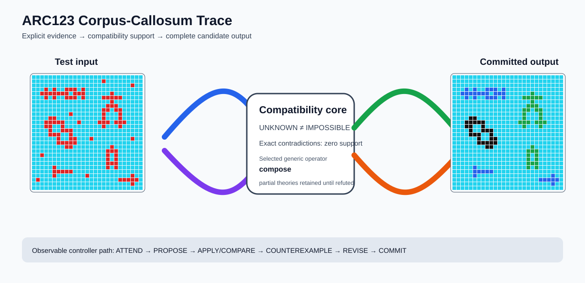

# ARC2 `a09f6c25` P0007 Brain Surgery Report

## Outcome: YES — ALL TEST CELLS MATCH

- **Compared positions:** 1458
- **Mismatched cells:** 0
- **Training compatibility:** `True`
- **Fallback used:** `False`
- **Causal trace acceptance:** `YES`
- **Selected hypothesis:** `compose(identity,component_recolor(property=symmetry,mapping_count=3),component_erase(property=shape,value_count=1))`
- **Source commit:** `71f86ff4c5304e452e0659131171f0519b50e21c`

## Causal Ablations

| Configuration | Exact all-cell result | Training exact | Fallback | Selected hypothesis |
| --- | --- | --- | --- | --- |
| `no_revision` | `False` | `False` | `True` | `fallback_identity_complete_grid` |
| `no_new_residual_family` | `False` | `False` | `True` | `fallback_identity_complete_grid` |

## Live-Agent Boundary

The controller receives only visible training input/output examples and test inputs. It receives no task ID, offline audit label, GT feature record, GT solver, historical decomposition, or held-out output before committing a complete grid. The expected output appears only in the post-answer V&V section.

## Corpus-Callosum Visualization



- Full explicit event record: [`learning_trace.json`](learning_trace.json)
- Full three-configuration record: [`ablations.json`](ablations.json)

## Causal Trace Check

- **Counterexample observed:** `True`
- **Additional visible demonstration selected:** `True`
- **Composition recorded:** `True`
- **Parameter or multi-rule revision:** `True`
- **Generic families in selected theory:** `component_property_recolor, component_property_erase`

## Post-Answer V&V

### Test case 1
- **All cells match:** `True`
- **Mismatched cells:** `0`
- **Prediction:**
```json
[[8, 8, 8, 8, 8, 8, 8, 8, 8, 8, 8, 8, 8, 8, 8, 8, 8, 8, 8, 8, 8, 8, 8, 8, 8, 8, 8], [8, 8, 8, 8, 8, 8, 8, 8, 8, 8, 8, 8, 8, 8, 8, 8, 8, 8, 8, 8, 8, 8, 8, 8, 8, 8, 8], [8, 8, 8, 8, 8, 8, 8, 8, 8, 8, 8, 8, 8, 8, 8, 8, 8, 8, 8, 8, 8, 8, 8, 8, 8, 8, 8], [8, 8, 8, 1, 8, 1, 8, 8, 1, 1, 1, 8, 1, 8, 8, 8, 8, 8, 8, 8, 8, 8, 8, 8, 8, 8, 8], [8, 8, 1, 1, 1, 1, 1, 1, 1, 8, 1, 1, 1, 8, 8, 8, 8, 8, 8, 3, 8, 8, 8, 8, 8, 8, 8], [8, 8, 8, 1, 8, 1, 8, 8, 1, 1, 1, 8, 1, 8, 8, 8, 8, 3, 3, 3, 3, 3, 8, 8, 8, 8, 8], [8, 8, 8, 8, 8, 8, 8, 8, 8, 8, 8, 8, 8, 8, 8, 8, 8, 8, 8, 3, 8, 8, 8, 8, 8, 8, 8], [8, 8, 8, 8, 8, 8, 8, 8, 8, 8, 8, 8, 8, 8, 8, 8, 8, 8, 3, 3, 3, 8, 8, 8, 8, 8, 8], [8, 8, 8, 8, 8, 8, 8, 8, 8, 8, 8, 8, 8, 8, 8, 8, 8, 3, 3, 8, 3, 3, 8, 8, 8, 8, 8], [8, 8, 8, 8, 8, 8, 8, 8, 8, 8, 8, 8, 8, 8, 8, 8, 8, 3, 8, 8, 8, 3, 8, 8, 8, 8, 8], [8, 8, 8, 8, 6, 6, 8, 8, 8, 8, 8, 8, 8, 8, 8, 8, 8, 3, 8, 8, 8, 3, 8, 8, 8, 8, 8], [8, 8, 8, 6, 6, 6, 6, 6, 8, 8, 8, 8, 8, 8, 8, 8, 3, 3, 3, 8, 3, 3, 3, 8, 8, 8, 8], [8, 8, 8, 6, 6, 8, 8, 6, 8, 8, 8, 8, 8, 8, 8, 8, 8, 3, 8, 8, 8, 3, 8, 8, 8, 8, 8], [8, 8, 8, 8, 6, 8, 8, 6, 6, 6, 8, 8, 8, 8, 8, 8, 8, 8, 8, 8, 8, 8, 8, 8, 8, 8, 8], [8, 8, 8, 8, 6, 6, 6, 8, 8, 6, 8, 8, 8, 8, 8, 8, 8, 8, 8, 8, 8, 8, 8, 8, 8, 8, 8], [8, 8, 8, 8, 8, 8, 6, 8, 8, 6, 6, 8, 8, 8, 8, 8, 8, 8, 8, 8, 8, 8, 8, 8, 8, 8, 8], [8, 8, 8, 8, 8, 8, 6, 6, 6, 6, 6, 8, 8, 8, 8, 8, 8, 8, 8, 8, 8, 8, 8, 8, 8, 8, 8], [8, 8, 8, 8, 8, 8, 8, 8, 6, 6, 8, 8, 8, 8, 8, 8, 8, 8, 8, 3, 8, 8, 8, 8, 8, 8, 8], [8, 8, 8, 8, 8, 8, 8, 8, 8, 8, 8, 8, 8, 8, 8, 8, 8, 8, 3, 3, 3, 8, 8, 8, 8, 8, 8], [8, 8, 8, 8, 8, 8, 8, 8, 8, 8, 8, 8, 8, 8, 8, 8, 8, 8, 3, 8, 3, 8, 8, 8, 8, 8, 8], [8, 8, 8, 8, 8, 8, 8, 8, 8, 8, 8, 8, 8, 8, 8, 8, 8, 8, 3, 8, 3, 8, 8, 8, 8, 8, 8], [8, 8, 8, 8, 8, 8, 8, 8, 8, 8, 8, 8, 8, 8, 8, 8, 8, 8, 3, 3, 3, 8, 8, 8, 8, 8, 8], [8, 8, 8, 8, 8, 1, 8, 8, 8, 8, 8, 8, 8, 8, 8, 8, 8, 8, 3, 8, 3, 8, 8, 8, 8, 8, 8], [8, 8, 8, 8, 8, 1, 1, 1, 1, 1, 8, 8, 8, 8, 8, 8, 8, 8, 8, 8, 8, 8, 8, 8, 8, 8, 8], [8, 8, 8, 8, 8, 1, 8, 8, 8, 8, 8, 8, 8, 8, 8, 8, 8, 8, 8, 8, 8, 8, 8, 8, 1, 8, 8], [8, 8, 8, 8, 8, 8, 8, 8, 8, 8, 8, 8, 8, 8, 8, 8, 8, 8, 8, 8, 8, 1, 1, 1, 1, 1, 8], [8, 8, 8, 8, 8, 8, 8, 8, 8, 8, 8, 8, 8, 8, 8, 8, 8, 8, 8, 8, 8, 8, 8, 8, 1, 8, 8], [8, 8, 8, 8, 8, 8, 8, 8, 8, 8, 8, 8, 8, 8, 8, 8, 8, 8, 8, 8, 8, 8, 8, 8, 8, 8, 8]]
```
- **Expected output (post-answer only):**
```json
[[8, 8, 8, 8, 8, 8, 8, 8, 8, 8, 8, 8, 8, 8, 8, 8, 8, 8, 8, 8, 8, 8, 8, 8, 8, 8, 8], [8, 8, 8, 8, 8, 8, 8, 8, 8, 8, 8, 8, 8, 8, 8, 8, 8, 8, 8, 8, 8, 8, 8, 8, 8, 8, 8], [8, 8, 8, 8, 8, 8, 8, 8, 8, 8, 8, 8, 8, 8, 8, 8, 8, 8, 8, 8, 8, 8, 8, 8, 8, 8, 8], [8, 8, 8, 1, 8, 1, 8, 8, 1, 1, 1, 8, 1, 8, 8, 8, 8, 8, 8, 8, 8, 8, 8, 8, 8, 8, 8], [8, 8, 1, 1, 1, 1, 1, 1, 1, 8, 1, 1, 1, 8, 8, 8, 8, 8, 8, 3, 8, 8, 8, 8, 8, 8, 8], [8, 8, 8, 1, 8, 1, 8, 8, 1, 1, 1, 8, 1, 8, 8, 8, 8, 3, 3, 3, 3, 3, 8, 8, 8, 8, 8], [8, 8, 8, 8, 8, 8, 8, 8, 8, 8, 8, 8, 8, 8, 8, 8, 8, 8, 8, 3, 8, 8, 8, 8, 8, 8, 8], [8, 8, 8, 8, 8, 8, 8, 8, 8, 8, 8, 8, 8, 8, 8, 8, 8, 8, 3, 3, 3, 8, 8, 8, 8, 8, 8], [8, 8, 8, 8, 8, 8, 8, 8, 8, 8, 8, 8, 8, 8, 8, 8, 8, 3, 3, 8, 3, 3, 8, 8, 8, 8, 8], [8, 8, 8, 8, 8, 8, 8, 8, 8, 8, 8, 8, 8, 8, 8, 8, 8, 3, 8, 8, 8, 3, 8, 8, 8, 8, 8], [8, 8, 8, 8, 6, 6, 8, 8, 8, 8, 8, 8, 8, 8, 8, 8, 8, 3, 8, 8, 8, 3, 8, 8, 8, 8, 8], [8, 8, 8, 6, 6, 6, 6, 6, 8, 8, 8, 8, 8, 8, 8, 8, 3, 3, 3, 8, 3, 3, 3, 8, 8, 8, 8], [8, 8, 8, 6, 6, 8, 8, 6, 8, 8, 8, 8, 8, 8, 8, 8, 8, 3, 8, 8, 8, 3, 8, 8, 8, 8, 8], [8, 8, 8, 8, 6, 8, 8, 6, 6, 6, 8, 8, 8, 8, 8, 8, 8, 8, 8, 8, 8, 8, 8, 8, 8, 8, 8], [8, 8, 8, 8, 6, 6, 6, 8, 8, 6, 8, 8, 8, 8, 8, 8, 8, 8, 8, 8, 8, 8, 8, 8, 8, 8, 8], [8, 8, 8, 8, 8, 8, 6, 8, 8, 6, 6, 8, 8, 8, 8, 8, 8, 8, 8, 8, 8, 8, 8, 8, 8, 8, 8], [8, 8, 8, 8, 8, 8, 6, 6, 6, 6, 6, 8, 8, 8, 8, 8, 8, 8, 8, 8, 8, 8, 8, 8, 8, 8, 8], [8, 8, 8, 8, 8, 8, 8, 8, 6, 6, 8, 8, 8, 8, 8, 8, 8, 8, 8, 3, 8, 8, 8, 8, 8, 8, 8], [8, 8, 8, 8, 8, 8, 8, 8, 8, 8, 8, 8, 8, 8, 8, 8, 8, 8, 3, 3, 3, 8, 8, 8, 8, 8, 8], [8, 8, 8, 8, 8, 8, 8, 8, 8, 8, 8, 8, 8, 8, 8, 8, 8, 8, 3, 8, 3, 8, 8, 8, 8, 8, 8], [8, 8, 8, 8, 8, 8, 8, 8, 8, 8, 8, 8, 8, 8, 8, 8, 8, 8, 3, 8, 3, 8, 8, 8, 8, 8, 8], [8, 8, 8, 8, 8, 8, 8, 8, 8, 8, 8, 8, 8, 8, 8, 8, 8, 8, 3, 3, 3, 8, 8, 8, 8, 8, 8], [8, 8, 8, 8, 8, 1, 8, 8, 8, 8, 8, 8, 8, 8, 8, 8, 8, 8, 3, 8, 3, 8, 8, 8, 8, 8, 8], [8, 8, 8, 8, 8, 1, 1, 1, 1, 1, 8, 8, 8, 8, 8, 8, 8, 8, 8, 8, 8, 8, 8, 8, 8, 8, 8], [8, 8, 8, 8, 8, 1, 8, 8, 8, 8, 8, 8, 8, 8, 8, 8, 8, 8, 8, 8, 8, 8, 8, 8, 1, 8, 8], [8, 8, 8, 8, 8, 8, 8, 8, 8, 8, 8, 8, 8, 8, 8, 8, 8, 8, 8, 8, 8, 1, 1, 1, 1, 1, 8], [8, 8, 8, 8, 8, 8, 8, 8, 8, 8, 8, 8, 8, 8, 8, 8, 8, 8, 8, 8, 8, 8, 8, 8, 1, 8, 8], [8, 8, 8, 8, 8, 8, 8, 8, 8, 8, 8, 8, 8, 8, 8, 8, 8, 8, 8, 8, 8, 8, 8, 8, 8, 8, 8]]
```

### Test case 2
- **All cells match:** `True`
- **Mismatched cells:** `0`
- **Prediction:**
```json
[[4, 4, 4, 4, 4, 4, 4, 4, 1, 4, 4, 4, 4, 4, 4, 4, 4, 4, 4, 4, 4, 4, 4, 4, 4, 4, 4], [4, 4, 1, 4, 1, 4, 4, 1, 1, 1, 4, 4, 4, 4, 4, 4, 4, 4, 4, 4, 4, 4, 4, 4, 4, 4, 4], [4, 4, 1, 1, 1, 1, 1, 1, 4, 1, 4, 4, 4, 4, 4, 1, 1, 1, 4, 4, 4, 4, 4, 4, 4, 4, 4], [4, 4, 1, 4, 1, 4, 4, 1, 1, 1, 4, 4, 4, 4, 4, 1, 4, 1, 1, 1, 4, 4, 1, 4, 4, 4, 4], [4, 4, 4, 4, 4, 4, 4, 4, 1, 4, 4, 4, 4, 4, 1, 1, 4, 1, 4, 1, 1, 1, 1, 4, 4, 4, 4], [4, 4, 4, 4, 4, 4, 4, 4, 4, 4, 4, 4, 4, 4, 4, 1, 4, 1, 1, 1, 4, 4, 1, 4, 4, 4, 4], [4, 4, 4, 4, 4, 4, 4, 4, 4, 4, 4, 4, 4, 4, 4, 1, 1, 1, 4, 4, 4, 4, 4, 4, 4, 4, 4], [4, 4, 4, 4, 4, 4, 4, 4, 4, 4, 4, 4, 4, 4, 4, 4, 4, 4, 4, 4, 4, 4, 4, 4, 4, 4, 4], [4, 4, 4, 4, 4, 4, 4, 4, 4, 6, 6, 6, 4, 4, 4, 4, 4, 4, 4, 4, 4, 4, 4, 4, 4, 4, 4], [4, 4, 4, 4, 4, 4, 4, 4, 4, 6, 4, 6, 4, 4, 4, 4, 4, 4, 4, 4, 4, 4, 4, 4, 4, 4, 4], [4, 4, 3, 4, 3, 4, 4, 4, 4, 6, 6, 6, 6, 6, 4, 4, 4, 4, 4, 4, 4, 4, 4, 4, 4, 4, 4], [4, 3, 3, 3, 3, 3, 4, 4, 4, 4, 4, 6, 4, 6, 4, 4, 4, 4, 4, 4, 4, 4, 4, 4, 4, 4, 4], [4, 4, 4, 3, 4, 4, 4, 4, 4, 4, 4, 6, 6, 6, 4, 4, 4, 4, 3, 4, 3, 4, 3, 4, 4, 4, 4], [4, 4, 3, 3, 3, 4, 4, 4, 4, 4, 4, 4, 4, 4, 4, 4, 4, 4, 3, 3, 3, 3, 3, 4, 4, 4, 4], [4, 3, 3, 3, 3, 3, 4, 4, 4, 4, 4, 4, 4, 4, 4, 4, 4, 4, 4, 3, 4, 3, 4, 4, 4, 4, 4], [4, 4, 4, 3, 4, 4, 4, 4, 4, 4, 4, 4, 4, 4, 4, 4, 4, 4, 4, 3, 3, 3, 4, 4, 4, 4, 4], [4, 4, 4, 3, 4, 4, 4, 4, 4, 4, 4, 4, 4, 4, 4, 4, 4, 4, 3, 3, 3, 3, 3, 4, 4, 4, 4], [4, 4, 3, 3, 3, 4, 4, 4, 4, 4, 4, 4, 4, 4, 4, 4, 4, 4, 4, 3, 4, 3, 4, 4, 4, 4, 4], [4, 4, 3, 4, 3, 4, 4, 4, 4, 4, 4, 4, 4, 4, 4, 4, 4, 4, 4, 3, 3, 3, 4, 4, 4, 4, 4], [4, 4, 3, 4, 3, 4, 4, 4, 4, 4, 4, 4, 4, 4, 4, 4, 4, 4, 4, 4, 4, 4, 4, 4, 4, 6, 6], [4, 4, 4, 4, 4, 4, 4, 4, 4, 4, 4, 4, 4, 4, 4, 4, 4, 4, 4, 4, 4, 4, 4, 6, 6, 6, 6], [4, 4, 4, 4, 4, 4, 4, 4, 1, 1, 1, 4, 4, 1, 1, 1, 1, 4, 4, 4, 4, 4, 4, 6, 4, 6, 4], [4, 4, 4, 4, 4, 4, 4, 4, 1, 4, 1, 1, 1, 1, 4, 1, 1, 1, 4, 4, 4, 4, 6, 6, 6, 6, 4], [4, 4, 4, 4, 4, 4, 4, 4, 1, 1, 1, 4, 4, 1, 1, 1, 1, 4, 4, 4, 4, 4, 6, 6, 4, 4, 4], [4, 4, 4, 4, 4, 4, 4, 4, 4, 4, 4, 4, 4, 4, 4, 4, 4, 4, 4, 4, 4, 4, 4, 4, 4, 4, 4], [4, 4, 4, 4, 4, 4, 4, 4, 4, 4, 4, 4, 4, 4, 4, 4, 4, 4, 4, 4, 4, 4, 4, 4, 4, 4, 4]]
```
- **Expected output (post-answer only):**
```json
[[4, 4, 4, 4, 4, 4, 4, 4, 1, 4, 4, 4, 4, 4, 4, 4, 4, 4, 4, 4, 4, 4, 4, 4, 4, 4, 4], [4, 4, 1, 4, 1, 4, 4, 1, 1, 1, 4, 4, 4, 4, 4, 4, 4, 4, 4, 4, 4, 4, 4, 4, 4, 4, 4], [4, 4, 1, 1, 1, 1, 1, 1, 4, 1, 4, 4, 4, 4, 4, 1, 1, 1, 4, 4, 4, 4, 4, 4, 4, 4, 4], [4, 4, 1, 4, 1, 4, 4, 1, 1, 1, 4, 4, 4, 4, 4, 1, 4, 1, 1, 1, 4, 4, 1, 4, 4, 4, 4], [4, 4, 4, 4, 4, 4, 4, 4, 1, 4, 4, 4, 4, 4, 1, 1, 4, 1, 4, 1, 1, 1, 1, 4, 4, 4, 4], [4, 4, 4, 4, 4, 4, 4, 4, 4, 4, 4, 4, 4, 4, 4, 1, 4, 1, 1, 1, 4, 4, 1, 4, 4, 4, 4], [4, 4, 4, 4, 4, 4, 4, 4, 4, 4, 4, 4, 4, 4, 4, 1, 1, 1, 4, 4, 4, 4, 4, 4, 4, 4, 4], [4, 4, 4, 4, 4, 4, 4, 4, 4, 4, 4, 4, 4, 4, 4, 4, 4, 4, 4, 4, 4, 4, 4, 4, 4, 4, 4], [4, 4, 4, 4, 4, 4, 4, 4, 4, 6, 6, 6, 4, 4, 4, 4, 4, 4, 4, 4, 4, 4, 4, 4, 4, 4, 4], [4, 4, 4, 4, 4, 4, 4, 4, 4, 6, 4, 6, 4, 4, 4, 4, 4, 4, 4, 4, 4, 4, 4, 4, 4, 4, 4], [4, 4, 3, 4, 3, 4, 4, 4, 4, 6, 6, 6, 6, 6, 4, 4, 4, 4, 4, 4, 4, 4, 4, 4, 4, 4, 4], [4, 3, 3, 3, 3, 3, 4, 4, 4, 4, 4, 6, 4, 6, 4, 4, 4, 4, 4, 4, 4, 4, 4, 4, 4, 4, 4], [4, 4, 4, 3, 4, 4, 4, 4, 4, 4, 4, 6, 6, 6, 4, 4, 4, 4, 3, 4, 3, 4, 3, 4, 4, 4, 4], [4, 4, 3, 3, 3, 4, 4, 4, 4, 4, 4, 4, 4, 4, 4, 4, 4, 4, 3, 3, 3, 3, 3, 4, 4, 4, 4], [4, 3, 3, 3, 3, 3, 4, 4, 4, 4, 4, 4, 4, 4, 4, 4, 4, 4, 4, 3, 4, 3, 4, 4, 4, 4, 4], [4, 4, 4, 3, 4, 4, 4, 4, 4, 4, 4, 4, 4, 4, 4, 4, 4, 4, 4, 3, 3, 3, 4, 4, 4, 4, 4], [4, 4, 4, 3, 4, 4, 4, 4, 4, 4, 4, 4, 4, 4, 4, 4, 4, 4, 3, 3, 3, 3, 3, 4, 4, 4, 4], [4, 4, 3, 3, 3, 4, 4, 4, 4, 4, 4, 4, 4, 4, 4, 4, 4, 4, 4, 3, 4, 3, 4, 4, 4, 4, 4], [4, 4, 3, 4, 3, 4, 4, 4, 4, 4, 4, 4, 4, 4, 4, 4, 4, 4, 4, 3, 3, 3, 4, 4, 4, 4, 4], [4, 4, 3, 4, 3, 4, 4, 4, 4, 4, 4, 4, 4, 4, 4, 4, 4, 4, 4, 4, 4, 4, 4, 4, 4, 6, 6], [4, 4, 4, 4, 4, 4, 4, 4, 4, 4, 4, 4, 4, 4, 4, 4, 4, 4, 4, 4, 4, 4, 4, 6, 6, 6, 6], [4, 4, 4, 4, 4, 4, 4, 4, 1, 1, 1, 4, 4, 1, 1, 1, 1, 4, 4, 4, 4, 4, 4, 6, 4, 6, 4], [4, 4, 4, 4, 4, 4, 4, 4, 1, 4, 1, 1, 1, 1, 4, 1, 1, 1, 4, 4, 4, 4, 6, 6, 6, 6, 4], [4, 4, 4, 4, 4, 4, 4, 4, 1, 1, 1, 4, 4, 1, 1, 1, 1, 4, 4, 4, 4, 4, 6, 6, 4, 4, 4], [4, 4, 4, 4, 4, 4, 4, 4, 4, 4, 4, 4, 4, 4, 4, 4, 4, 4, 4, 4, 4, 4, 4, 4, 4, 4, 4], [4, 4, 4, 4, 4, 4, 4, 4, 4, 4, 4, 4, 4, 4, 4, 4, 4, 4, 4, 4, 4, 4, 4, 4, 4, 4, 4]]
```

## Observable IHL Walkthrough

The record contains explicit actions, predictions, feedback, and revisions; it does not claim or store hidden model reasoning.

### Action totals

- `ADD_RULE`: 44
- `APPLY_HYPOTHESIS`: 192
- `ATTEND`: 192
- `CHOOSE_NEXT_DEMO`: 192
- `COMMIT`: 1
- `COMPARE`: 192
- `COMPOSE_RULE`: 66
- `EXPLAIN_RESIDUAL`: 110
- `FIND_COUNTEREXAMPLE`: 22
- `MERGE_RULES`: 1
- `PROMOTE_CONSTRAINT`: 42
- `PROPOSE`: 1

### Decision milestones

- `0` `PROPOSE` — `{"parent_theory_id":"T0000","rule":{"description_length":1,"name":"identity","operation":"identity","parameters":{},"rule_id":"identity","scope":{"kind":"all","value":null}},"stage":"initial_generic_theories","theory_id":"T0001"}`
- `2` `ATTEND` — `{"reason":"initial_highest_observed_change_and_color_discrimination","selected_demo":0,"selected_region":{"column":3,"row":0},"theory_id":"T0001"}`
- `6` `ATTEND` — `{"reason":"counterexample_requires_visible_conditional_evidence:unseen_demo_selected_for_residual_version_space_discrimination","selected_demo":1,"selected_region":{"column":7,"row":2},"theory_id":"T0001"}`
- `10` `ATTEND` — `{"reason":"counterexample_requires_visible_conditional_evidence:unseen_demo_selected_for_residual_version_space_discrimination","selected_demo":2,"selected_region":{"column":5,"row":1},"theory_id":"T0001"}`
- `25` `ATTEND` — `{"reason":"initial_highest_observed_change_and_color_discrimination","selected_demo":0,"selected_region":{"column":15,"row":1},"theory_id":"T0002"}`
- `29` `ATTEND` — `{"reason":"initial_highest_observed_change_and_color_discrimination","selected_demo":0,"selected_region":{"region":"whole_demo"},"theory_id":"T0004"}`
- `33` `ATTEND` — `{"reason":"unseen_demo_selected_for_residual_version_space_discrimination","selected_demo":1,"selected_region":{"region":"whole_demo"},"theory_id":"T0004"}`
- `37` `ATTEND` — `{"reason":"unseen_demo_selected_for_residual_version_space_discrimination","selected_demo":2,"selected_region":{"region":"whole_demo"},"theory_id":"T0004"}`
- `40` `PROMOTE_CONSTRAINT` — `{"evaluated_demo_count":3,"rule_count":3,"status":"complete_training_compatibility_after_revision","theory_id":"T0004"}`
- `42` `ATTEND` — `{"reason":"initial_highest_observed_change_and_color_discrimination","selected_demo":0,"selected_region":{"region":"whole_demo"},"theory_id":"T0003"}`
- `46` `ATTEND` — `{"reason":"unseen_demo_selected_for_residual_version_space_discrimination","selected_demo":1,"selected_region":{"region":"whole_demo"},"theory_id":"T0003"}`
- `50` `ATTEND` — `{"reason":"unseen_demo_selected_for_residual_version_space_discrimination","selected_demo":2,"selected_region":{"region":"whole_demo"},"theory_id":"T0003"}`
- `53` `PROMOTE_CONSTRAINT` — `{"evaluated_demo_count":3,"rule_count":3,"status":"complete_training_compatibility_after_revision","theory_id":"T0003"}`
- `55` `ATTEND` — `{"reason":"counterexample_requires_visible_conditional_evidence:unseen_demo_selected_for_residual_version_space_discrimination","selected_demo":1,"selected_region":{"column":7,"row":2},"theory_id":"T0002"}`
- `59` `ATTEND` — `{"reason":"counterexample_requires_visible_conditional_evidence:unseen_demo_selected_for_residual_version_space_discrimination","selected_demo":2,"selected_region":{"column":5,"row":1},"theory_id":"T0002"}`
- `74` `ATTEND` — `{"reason":"initial_highest_observed_change_and_color_discrimination","selected_demo":0,"selected_region":{"column":3,"row":0},"theory_id":"T0005"}`
- `78` `ATTEND` — `{"reason":"initial_highest_observed_change_and_color_discrimination","selected_demo":0,"selected_region":{"region":"whole_demo"},"theory_id":"T0007"}`
- `82` `ATTEND` — `{"reason":"unseen_demo_selected_for_residual_version_space_discrimination","selected_demo":1,"selected_region":{"region":"whole_demo"},"theory_id":"T0007"}`
- `86` `ATTEND` — `{"reason":"unseen_demo_selected_for_residual_version_space_discrimination","selected_demo":2,"selected_region":{"region":"whole_demo"},"theory_id":"T0007"}`
- `89` `PROMOTE_CONSTRAINT` — `{"evaluated_demo_count":3,"rule_count":4,"status":"complete_training_compatibility_after_revision","theory_id":"T0007"}`
- `91` `ATTEND` — `{"reason":"initial_highest_observed_change_and_color_discrimination","selected_demo":0,"selected_region":{"region":"whole_demo"},"theory_id":"T0006"}`
- `95` `ATTEND` — `{"reason":"unseen_demo_selected_for_residual_version_space_discrimination","selected_demo":1,"selected_region":{"region":"whole_demo"},"theory_id":"T0006"}`
- `99` `ATTEND` — `{"reason":"unseen_demo_selected_for_residual_version_space_discrimination","selected_demo":2,"selected_region":{"region":"whole_demo"},"theory_id":"T0006"}`
- `102` `PROMOTE_CONSTRAINT` — `{"evaluated_demo_count":3,"rule_count":4,"status":"complete_training_compatibility_after_revision","theory_id":"T0006"}`
- `104` `ATTEND` — `{"reason":"counterexample_requires_visible_conditional_evidence:unseen_demo_selected_for_residual_version_space_discrimination","selected_demo":1,"selected_region":{"column":7,"row":2},"theory_id":"T0005"}`
- `108` `ATTEND` — `{"reason":"counterexample_requires_visible_conditional_evidence:unseen_demo_selected_for_residual_version_space_discrimination","selected_demo":2,"selected_region":{"column":5,"row":1},"theory_id":"T0005"}`
- `123` `ATTEND` — `{"reason":"initial_highest_observed_change_and_color_discrimination","selected_demo":0,"selected_region":{"column":15,"row":1},"theory_id":"T0008"}`
- `127` `ATTEND` — `{"reason":"initial_highest_observed_change_and_color_discrimination","selected_demo":0,"selected_region":{"region":"whole_demo"},"theory_id":"T0010"}`
- `131` `ATTEND` — `{"reason":"unseen_demo_selected_for_residual_version_space_discrimination","selected_demo":1,"selected_region":{"region":"whole_demo"},"theory_id":"T0010"}`
- `135` `ATTEND` — `{"reason":"unseen_demo_selected_for_residual_version_space_discrimination","selected_demo":2,"selected_region":{"region":"whole_demo"},"theory_id":"T0010"}`
- `138` `PROMOTE_CONSTRAINT` — `{"evaluated_demo_count":3,"rule_count":5,"status":"complete_training_compatibility_after_revision","theory_id":"T0010"}`
- `140` `ATTEND` — `{"reason":"initial_highest_observed_change_and_color_discrimination","selected_demo":0,"selected_region":{"region":"whole_demo"},"theory_id":"T0009"}`
- `144` `ATTEND` — `{"reason":"unseen_demo_selected_for_residual_version_space_discrimination","selected_demo":1,"selected_region":{"region":"whole_demo"},"theory_id":"T0009"}`
- `148` `ATTEND` — `{"reason":"unseen_demo_selected_for_residual_version_space_discrimination","selected_demo":2,"selected_region":{"region":"whole_demo"},"theory_id":"T0009"}`
- `151` `PROMOTE_CONSTRAINT` — `{"evaluated_demo_count":3,"rule_count":5,"status":"complete_training_compatibility_after_revision","theory_id":"T0009"}`
- `153` `ATTEND` — `{"reason":"counterexample_requires_visible_conditional_evidence:unseen_demo_selected_for_residual_version_space_discrimination","selected_demo":1,"selected_region":{"column":7,"row":2},"theory_id":"T0008"}`
- `157` `ATTEND` — `{"reason":"counterexample_requires_visible_conditional_evidence:unseen_demo_selected_for_residual_version_space_discrimination","selected_demo":2,"selected_region":{"column":5,"row":1},"theory_id":"T0008"}`
- `172` `ATTEND` — `{"reason":"initial_highest_observed_change_and_color_discrimination","selected_demo":0,"selected_region":{"column":3,"row":0},"theory_id":"T0011"}`
- `176` `ATTEND` — `{"reason":"initial_highest_observed_change_and_color_discrimination","selected_demo":0,"selected_region":{"region":"whole_demo"},"theory_id":"T0013"}`
- `180` `ATTEND` — `{"reason":"unseen_demo_selected_for_residual_version_space_discrimination","selected_demo":1,"selected_region":{"region":"whole_demo"},"theory_id":"T0013"}`
- `184` `ATTEND` — `{"reason":"unseen_demo_selected_for_residual_version_space_discrimination","selected_demo":2,"selected_region":{"region":"whole_demo"},"theory_id":"T0013"}`
- `187` `PROMOTE_CONSTRAINT` — `{"evaluated_demo_count":3,"rule_count":6,"status":"complete_training_compatibility_after_revision","theory_id":"T0013"}`
- `189` `ATTEND` — `{"reason":"initial_highest_observed_change_and_color_discrimination","selected_demo":0,"selected_region":{"region":"whole_demo"},"theory_id":"T0012"}`
- `193` `ATTEND` — `{"reason":"unseen_demo_selected_for_residual_version_space_discrimination","selected_demo":1,"selected_region":{"region":"whole_demo"},"theory_id":"T0012"}`
- `197` `ATTEND` — `{"reason":"unseen_demo_selected_for_residual_version_space_discrimination","selected_demo":2,"selected_region":{"region":"whole_demo"},"theory_id":"T0012"}`
- `200` `PROMOTE_CONSTRAINT` — `{"evaluated_demo_count":3,"rule_count":6,"status":"complete_training_compatibility_after_revision","theory_id":"T0012"}`
- `202` `ATTEND` — `{"reason":"counterexample_requires_visible_conditional_evidence:unseen_demo_selected_for_residual_version_space_discrimination","selected_demo":1,"selected_region":{"column":7,"row":2},"theory_id":"T0011"}`
- `206` `ATTEND` — `{"reason":"counterexample_requires_visible_conditional_evidence:unseen_demo_selected_for_residual_version_space_discrimination","selected_demo":2,"selected_region":{"column":5,"row":1},"theory_id":"T0011"}`
- `221` `ATTEND` — `{"reason":"initial_highest_observed_change_and_color_discrimination","selected_demo":0,"selected_region":{"column":15,"row":1},"theory_id":"T0014"}`
- `225` `ATTEND` — `{"reason":"initial_highest_observed_change_and_color_discrimination","selected_demo":0,"selected_region":{"region":"whole_demo"},"theory_id":"T0016"}`
- `229` `ATTEND` — `{"reason":"unseen_demo_selected_for_residual_version_space_discrimination","selected_demo":1,"selected_region":{"region":"whole_demo"},"theory_id":"T0016"}`
- `233` `ATTEND` — `{"reason":"unseen_demo_selected_for_residual_version_space_discrimination","selected_demo":2,"selected_region":{"region":"whole_demo"},"theory_id":"T0016"}`
- `236` `PROMOTE_CONSTRAINT` — `{"evaluated_demo_count":3,"rule_count":7,"status":"complete_training_compatibility_after_revision","theory_id":"T0016"}`
- `238` `ATTEND` — `{"reason":"initial_highest_observed_change_and_color_discrimination","selected_demo":0,"selected_region":{"region":"whole_demo"},"theory_id":"T0015"}`
- `242` `ATTEND` — `{"reason":"unseen_demo_selected_for_residual_version_space_discrimination","selected_demo":1,"selected_region":{"region":"whole_demo"},"theory_id":"T0015"}`
- `246` `ATTEND` — `{"reason":"unseen_demo_selected_for_residual_version_space_discrimination","selected_demo":2,"selected_region":{"region":"whole_demo"},"theory_id":"T0015"}`
- `249` `PROMOTE_CONSTRAINT` — `{"evaluated_demo_count":3,"rule_count":7,"status":"complete_training_compatibility_after_revision","theory_id":"T0015"}`
- `251` `ATTEND` — `{"reason":"counterexample_requires_visible_conditional_evidence:unseen_demo_selected_for_residual_version_space_discrimination","selected_demo":1,"selected_region":{"column":7,"row":2},"theory_id":"T0014"}`
- `255` `ATTEND` — `{"reason":"counterexample_requires_visible_conditional_evidence:unseen_demo_selected_for_residual_version_space_discrimination","selected_demo":2,"selected_region":{"column":5,"row":1},"theory_id":"T0014"}`
- `270` `ATTEND` — `{"reason":"initial_highest_observed_change_and_color_discrimination","selected_demo":0,"selected_region":{"column":3,"row":0},"theory_id":"T0017"}`
- `274` `ATTEND` — `{"reason":"initial_highest_observed_change_and_color_discrimination","selected_demo":0,"selected_region":{"region":"whole_demo"},"theory_id":"T0019"}`
- `278` `ATTEND` — `{"reason":"unseen_demo_selected_for_residual_version_space_discrimination","selected_demo":1,"selected_region":{"region":"whole_demo"},"theory_id":"T0019"}`
- `282` `ATTEND` — `{"reason":"unseen_demo_selected_for_residual_version_space_discrimination","selected_demo":2,"selected_region":{"region":"whole_demo"},"theory_id":"T0019"}`
- `285` `PROMOTE_CONSTRAINT` — `{"evaluated_demo_count":3,"rule_count":8,"status":"complete_training_compatibility_after_revision","theory_id":"T0019"}`
- `287` `ATTEND` — `{"reason":"initial_highest_observed_change_and_color_discrimination","selected_demo":0,"selected_region":{"region":"whole_demo"},"theory_id":"T0018"}`
- `291` `ATTEND` — `{"reason":"unseen_demo_selected_for_residual_version_space_discrimination","selected_demo":1,"selected_region":{"region":"whole_demo"},"theory_id":"T0018"}`
- `295` `ATTEND` — `{"reason":"unseen_demo_selected_for_residual_version_space_discrimination","selected_demo":2,"selected_region":{"region":"whole_demo"},"theory_id":"T0018"}`
- `298` `PROMOTE_CONSTRAINT` — `{"evaluated_demo_count":3,"rule_count":8,"status":"complete_training_compatibility_after_revision","theory_id":"T0018"}`
- `300` `ATTEND` — `{"reason":"counterexample_requires_visible_conditional_evidence:unseen_demo_selected_for_residual_version_space_discrimination","selected_demo":1,"selected_region":{"column":7,"row":2},"theory_id":"T0017"}`
- `304` `ATTEND` — `{"reason":"counterexample_requires_visible_conditional_evidence:unseen_demo_selected_for_residual_version_space_discrimination","selected_demo":2,"selected_region":{"column":5,"row":1},"theory_id":"T0017"}`
- `319` `ATTEND` — `{"reason":"initial_highest_observed_change_and_color_discrimination","selected_demo":0,"selected_region":{"column":15,"row":1},"theory_id":"T0020"}`
- `323` `ATTEND` — `{"reason":"initial_highest_observed_change_and_color_discrimination","selected_demo":0,"selected_region":{"region":"whole_demo"},"theory_id":"T0022"}`
- `327` `ATTEND` — `{"reason":"unseen_demo_selected_for_residual_version_space_discrimination","selected_demo":1,"selected_region":{"region":"whole_demo"},"theory_id":"T0022"}`
- `331` `ATTEND` — `{"reason":"unseen_demo_selected_for_residual_version_space_discrimination","selected_demo":2,"selected_region":{"region":"whole_demo"},"theory_id":"T0022"}`
- `334` `PROMOTE_CONSTRAINT` — `{"evaluated_demo_count":3,"rule_count":9,"status":"complete_training_compatibility_after_revision","theory_id":"T0022"}`
- `336` `ATTEND` — `{"reason":"initial_highest_observed_change_and_color_discrimination","selected_demo":0,"selected_region":{"region":"whole_demo"},"theory_id":"T0021"}`
- `340` `ATTEND` — `{"reason":"unseen_demo_selected_for_residual_version_space_discrimination","selected_demo":1,"selected_region":{"region":"whole_demo"},"theory_id":"T0021"}`
- `344` `ATTEND` — `{"reason":"unseen_demo_selected_for_residual_version_space_discrimination","selected_demo":2,"selected_region":{"region":"whole_demo"},"theory_id":"T0021"}`
- `347` `PROMOTE_CONSTRAINT` — `{"evaluated_demo_count":3,"rule_count":9,"status":"complete_training_compatibility_after_revision","theory_id":"T0021"}`
- `349` `ATTEND` — `{"reason":"counterexample_requires_visible_conditional_evidence:unseen_demo_selected_for_residual_version_space_discrimination","selected_demo":1,"selected_region":{"column":7,"row":2},"theory_id":"T0020"}`
- `353` `ATTEND` — `{"reason":"counterexample_requires_visible_conditional_evidence:unseen_demo_selected_for_residual_version_space_discrimination","selected_demo":2,"selected_region":{"column":5,"row":1},"theory_id":"T0020"}`
- `368` `ATTEND` — `{"reason":"initial_highest_observed_change_and_color_discrimination","selected_demo":0,"selected_region":{"column":3,"row":0},"theory_id":"T0023"}`
- `372` `ATTEND` — `{"reason":"initial_highest_observed_change_and_color_discrimination","selected_demo":0,"selected_region":{"region":"whole_demo"},"theory_id":"T0025"}`
- `376` `ATTEND` — `{"reason":"unseen_demo_selected_for_residual_version_space_discrimination","selected_demo":1,"selected_region":{"region":"whole_demo"},"theory_id":"T0025"}`
- `380` `ATTEND` — `{"reason":"unseen_demo_selected_for_residual_version_space_discrimination","selected_demo":2,"selected_region":{"region":"whole_demo"},"theory_id":"T0025"}`
- `383` `PROMOTE_CONSTRAINT` — `{"evaluated_demo_count":3,"rule_count":10,"status":"complete_training_compatibility_after_revision","theory_id":"T0025"}`
- `385` `ATTEND` — `{"reason":"initial_highest_observed_change_and_color_discrimination","selected_demo":0,"selected_region":{"region":"whole_demo"},"theory_id":"T0024"}`
- `389` `ATTEND` — `{"reason":"unseen_demo_selected_for_residual_version_space_discrimination","selected_demo":1,"selected_region":{"region":"whole_demo"},"theory_id":"T0024"}`
- `393` `ATTEND` — `{"reason":"unseen_demo_selected_for_residual_version_space_discrimination","selected_demo":2,"selected_region":{"region":"whole_demo"},"theory_id":"T0024"}`
- `396` `PROMOTE_CONSTRAINT` — `{"evaluated_demo_count":3,"rule_count":10,"status":"complete_training_compatibility_after_revision","theory_id":"T0024"}`
- `398` `ATTEND` — `{"reason":"counterexample_requires_visible_conditional_evidence:unseen_demo_selected_for_residual_version_space_discrimination","selected_demo":1,"selected_region":{"column":7,"row":2},"theory_id":"T0023"}`
- `402` `ATTEND` — `{"reason":"counterexample_requires_visible_conditional_evidence:unseen_demo_selected_for_residual_version_space_discrimination","selected_demo":2,"selected_region":{"column":5,"row":1},"theory_id":"T0023"}`
- `417` `ATTEND` — `{"reason":"initial_highest_observed_change_and_color_discrimination","selected_demo":0,"selected_region":{"column":15,"row":1},"theory_id":"T0026"}`
- `421` `ATTEND` — `{"reason":"initial_highest_observed_change_and_color_discrimination","selected_demo":0,"selected_region":{"region":"whole_demo"},"theory_id":"T0028"}`
- `425` `ATTEND` — `{"reason":"unseen_demo_selected_for_residual_version_space_discrimination","selected_demo":1,"selected_region":{"region":"whole_demo"},"theory_id":"T0028"}`
- `429` `ATTEND` — `{"reason":"unseen_demo_selected_for_residual_version_space_discrimination","selected_demo":2,"selected_region":{"region":"whole_demo"},"theory_id":"T0028"}`
- `432` `PROMOTE_CONSTRAINT` — `{"evaluated_demo_count":3,"rule_count":11,"status":"complete_training_compatibility_after_revision","theory_id":"T0028"}`
- `434` `ATTEND` — `{"reason":"initial_highest_observed_change_and_color_discrimination","selected_demo":0,"selected_region":{"region":"whole_demo"},"theory_id":"T0027"}`
- `438` `ATTEND` — `{"reason":"unseen_demo_selected_for_residual_version_space_discrimination","selected_demo":1,"selected_region":{"region":"whole_demo"},"theory_id":"T0027"}`
- `442` `ATTEND` — `{"reason":"unseen_demo_selected_for_residual_version_space_discrimination","selected_demo":2,"selected_region":{"region":"whole_demo"},"theory_id":"T0027"}`
- `445` `PROMOTE_CONSTRAINT` — `{"evaluated_demo_count":3,"rule_count":11,"status":"complete_training_compatibility_after_revision","theory_id":"T0027"}`
- `447` `ATTEND` — `{"reason":"counterexample_requires_visible_conditional_evidence:unseen_demo_selected_for_residual_version_space_discrimination","selected_demo":1,"selected_region":{"column":7,"row":2},"theory_id":"T0026"}`
- `451` `ATTEND` — `{"reason":"counterexample_requires_visible_conditional_evidence:unseen_demo_selected_for_residual_version_space_discrimination","selected_demo":2,"selected_region":{"column":5,"row":1},"theory_id":"T0026"}`
- `466` `ATTEND` — `{"reason":"initial_highest_observed_change_and_color_discrimination","selected_demo":0,"selected_region":{"column":3,"row":0},"theory_id":"T0029"}`
- `470` `ATTEND` — `{"reason":"initial_highest_observed_change_and_color_discrimination","selected_demo":0,"selected_region":{"region":"whole_demo"},"theory_id":"T0031"}`
- `474` `ATTEND` — `{"reason":"unseen_demo_selected_for_residual_version_space_discrimination","selected_demo":1,"selected_region":{"region":"whole_demo"},"theory_id":"T0031"}`
- `478` `ATTEND` — `{"reason":"unseen_demo_selected_for_residual_version_space_discrimination","selected_demo":2,"selected_region":{"region":"whole_demo"},"theory_id":"T0031"}`
- `481` `PROMOTE_CONSTRAINT` — `{"evaluated_demo_count":3,"rule_count":12,"status":"complete_training_compatibility_after_revision","theory_id":"T0031"}`
- `483` `ATTEND` — `{"reason":"initial_highest_observed_change_and_color_discrimination","selected_demo":0,"selected_region":{"region":"whole_demo"},"theory_id":"T0030"}`
- `487` `ATTEND` — `{"reason":"unseen_demo_selected_for_residual_version_space_discrimination","selected_demo":1,"selected_region":{"region":"whole_demo"},"theory_id":"T0030"}`
- `491` `ATTEND` — `{"reason":"unseen_demo_selected_for_residual_version_space_discrimination","selected_demo":2,"selected_region":{"region":"whole_demo"},"theory_id":"T0030"}`
- `494` `PROMOTE_CONSTRAINT` — `{"evaluated_demo_count":3,"rule_count":12,"status":"complete_training_compatibility_after_revision","theory_id":"T0030"}`
- `496` `ATTEND` — `{"reason":"counterexample_requires_visible_conditional_evidence:unseen_demo_selected_for_residual_version_space_discrimination","selected_demo":1,"selected_region":{"column":7,"row":2},"theory_id":"T0029"}`
- `500` `ATTEND` — `{"reason":"counterexample_requires_visible_conditional_evidence:unseen_demo_selected_for_residual_version_space_discrimination","selected_demo":2,"selected_region":{"column":5,"row":1},"theory_id":"T0029"}`
- `515` `ATTEND` — `{"reason":"initial_highest_observed_change_and_color_discrimination","selected_demo":0,"selected_region":{"column":15,"row":1},"theory_id":"T0032"}`
- `519` `ATTEND` — `{"reason":"initial_highest_observed_change_and_color_discrimination","selected_demo":0,"selected_region":{"region":"whole_demo"},"theory_id":"T0034"}`
- `523` `ATTEND` — `{"reason":"unseen_demo_selected_for_residual_version_space_discrimination","selected_demo":1,"selected_region":{"region":"whole_demo"},"theory_id":"T0034"}`
- `527` `ATTEND` — `{"reason":"unseen_demo_selected_for_residual_version_space_discrimination","selected_demo":2,"selected_region":{"region":"whole_demo"},"theory_id":"T0034"}`
- `530` `PROMOTE_CONSTRAINT` — `{"evaluated_demo_count":3,"rule_count":13,"status":"complete_training_compatibility_after_revision","theory_id":"T0034"}`
- `532` `ATTEND` — `{"reason":"initial_highest_observed_change_and_color_discrimination","selected_demo":0,"selected_region":{"region":"whole_demo"},"theory_id":"T0033"}`
- `536` `ATTEND` — `{"reason":"unseen_demo_selected_for_residual_version_space_discrimination","selected_demo":1,"selected_region":{"region":"whole_demo"},"theory_id":"T0033"}`
- `540` `ATTEND` — `{"reason":"unseen_demo_selected_for_residual_version_space_discrimination","selected_demo":2,"selected_region":{"region":"whole_demo"},"theory_id":"T0033"}`
- `543` `PROMOTE_CONSTRAINT` — `{"evaluated_demo_count":3,"rule_count":13,"status":"complete_training_compatibility_after_revision","theory_id":"T0033"}`
- `545` `ATTEND` — `{"reason":"counterexample_requires_visible_conditional_evidence:unseen_demo_selected_for_residual_version_space_discrimination","selected_demo":1,"selected_region":{"column":7,"row":2},"theory_id":"T0032"}`
- `549` `ATTEND` — `{"reason":"counterexample_requires_visible_conditional_evidence:unseen_demo_selected_for_residual_version_space_discrimination","selected_demo":2,"selected_region":{"column":5,"row":1},"theory_id":"T0032"}`
- `564` `ATTEND` — `{"reason":"initial_highest_observed_change_and_color_discrimination","selected_demo":0,"selected_region":{"column":3,"row":0},"theory_id":"T0035"}`
- `568` `ATTEND` — `{"reason":"initial_highest_observed_change_and_color_discrimination","selected_demo":0,"selected_region":{"region":"whole_demo"},"theory_id":"T0037"}`
- `572` `ATTEND` — `{"reason":"unseen_demo_selected_for_residual_version_space_discrimination","selected_demo":1,"selected_region":{"region":"whole_demo"},"theory_id":"T0037"}`
- `576` `ATTEND` — `{"reason":"unseen_demo_selected_for_residual_version_space_discrimination","selected_demo":2,"selected_region":{"region":"whole_demo"},"theory_id":"T0037"}`
- `579` `PROMOTE_CONSTRAINT` — `{"evaluated_demo_count":3,"rule_count":14,"status":"complete_training_compatibility_after_revision","theory_id":"T0037"}`
- `581` `ATTEND` — `{"reason":"initial_highest_observed_change_and_color_discrimination","selected_demo":0,"selected_region":{"region":"whole_demo"},"theory_id":"T0036"}`
- `585` `ATTEND` — `{"reason":"unseen_demo_selected_for_residual_version_space_discrimination","selected_demo":1,"selected_region":{"region":"whole_demo"},"theory_id":"T0036"}`
- `589` `ATTEND` — `{"reason":"unseen_demo_selected_for_residual_version_space_discrimination","selected_demo":2,"selected_region":{"region":"whole_demo"},"theory_id":"T0036"}`
- `592` `PROMOTE_CONSTRAINT` — `{"evaluated_demo_count":3,"rule_count":14,"status":"complete_training_compatibility_after_revision","theory_id":"T0036"}`
- `594` `ATTEND` — `{"reason":"counterexample_requires_visible_conditional_evidence:unseen_demo_selected_for_residual_version_space_discrimination","selected_demo":1,"selected_region":{"column":7,"row":2},"theory_id":"T0035"}`
- `598` `ATTEND` — `{"reason":"counterexample_requires_visible_conditional_evidence:unseen_demo_selected_for_residual_version_space_discrimination","selected_demo":2,"selected_region":{"column":5,"row":1},"theory_id":"T0035"}`
- `613` `ATTEND` — `{"reason":"initial_highest_observed_change_and_color_discrimination","selected_demo":0,"selected_region":{"column":15,"row":1},"theory_id":"T0038"}`
- `617` `ATTEND` — `{"reason":"initial_highest_observed_change_and_color_discrimination","selected_demo":0,"selected_region":{"region":"whole_demo"},"theory_id":"T0040"}`
- `621` `ATTEND` — `{"reason":"unseen_demo_selected_for_residual_version_space_discrimination","selected_demo":1,"selected_region":{"region":"whole_demo"},"theory_id":"T0040"}`
- `625` `ATTEND` — `{"reason":"unseen_demo_selected_for_residual_version_space_discrimination","selected_demo":2,"selected_region":{"region":"whole_demo"},"theory_id":"T0040"}`
- `628` `PROMOTE_CONSTRAINT` — `{"evaluated_demo_count":3,"rule_count":15,"status":"complete_training_compatibility_after_revision","theory_id":"T0040"}`
- `630` `ATTEND` — `{"reason":"initial_highest_observed_change_and_color_discrimination","selected_demo":0,"selected_region":{"region":"whole_demo"},"theory_id":"T0039"}`
- `634` `ATTEND` — `{"reason":"unseen_demo_selected_for_residual_version_space_discrimination","selected_demo":1,"selected_region":{"region":"whole_demo"},"theory_id":"T0039"}`
- `638` `ATTEND` — `{"reason":"unseen_demo_selected_for_residual_version_space_discrimination","selected_demo":2,"selected_region":{"region":"whole_demo"},"theory_id":"T0039"}`
- `641` `PROMOTE_CONSTRAINT` — `{"evaluated_demo_count":3,"rule_count":15,"status":"complete_training_compatibility_after_revision","theory_id":"T0039"}`
- `643` `ATTEND` — `{"reason":"counterexample_requires_visible_conditional_evidence:unseen_demo_selected_for_residual_version_space_discrimination","selected_demo":1,"selected_region":{"column":7,"row":2},"theory_id":"T0038"}`
- `647` `ATTEND` — `{"reason":"counterexample_requires_visible_conditional_evidence:unseen_demo_selected_for_residual_version_space_discrimination","selected_demo":2,"selected_region":{"column":5,"row":1},"theory_id":"T0038"}`
- `662` `ATTEND` — `{"reason":"initial_highest_observed_change_and_color_discrimination","selected_demo":0,"selected_region":{"column":3,"row":0},"theory_id":"T0041"}`
- `666` `ATTEND` — `{"reason":"initial_highest_observed_change_and_color_discrimination","selected_demo":0,"selected_region":{"region":"whole_demo"},"theory_id":"T0043"}`
- `670` `ATTEND` — `{"reason":"unseen_demo_selected_for_residual_version_space_discrimination","selected_demo":1,"selected_region":{"region":"whole_demo"},"theory_id":"T0043"}`
- `674` `ATTEND` — `{"reason":"unseen_demo_selected_for_residual_version_space_discrimination","selected_demo":2,"selected_region":{"region":"whole_demo"},"theory_id":"T0043"}`
- `677` `PROMOTE_CONSTRAINT` — `{"evaluated_demo_count":3,"rule_count":16,"status":"complete_training_compatibility_after_revision","theory_id":"T0043"}`
- `679` `ATTEND` — `{"reason":"initial_highest_observed_change_and_color_discrimination","selected_demo":0,"selected_region":{"region":"whole_demo"},"theory_id":"T0042"}`
- `683` `ATTEND` — `{"reason":"unseen_demo_selected_for_residual_version_space_discrimination","selected_demo":1,"selected_region":{"region":"whole_demo"},"theory_id":"T0042"}`
- `687` `ATTEND` — `{"reason":"unseen_demo_selected_for_residual_version_space_discrimination","selected_demo":2,"selected_region":{"region":"whole_demo"},"theory_id":"T0042"}`
- `690` `PROMOTE_CONSTRAINT` — `{"evaluated_demo_count":3,"rule_count":16,"status":"complete_training_compatibility_after_revision","theory_id":"T0042"}`
- `692` `ATTEND` — `{"reason":"counterexample_requires_visible_conditional_evidence:unseen_demo_selected_for_residual_version_space_discrimination","selected_demo":1,"selected_region":{"column":7,"row":2},"theory_id":"T0041"}`
- `696` `ATTEND` — `{"reason":"counterexample_requires_visible_conditional_evidence:unseen_demo_selected_for_residual_version_space_discrimination","selected_demo":2,"selected_region":{"column":5,"row":1},"theory_id":"T0041"}`
- `711` `ATTEND` — `{"reason":"initial_highest_observed_change_and_color_discrimination","selected_demo":0,"selected_region":{"column":15,"row":1},"theory_id":"T0044"}`
- `715` `ATTEND` — `{"reason":"initial_highest_observed_change_and_color_discrimination","selected_demo":0,"selected_region":{"region":"whole_demo"},"theory_id":"T0046"}`
- `719` `ATTEND` — `{"reason":"unseen_demo_selected_for_residual_version_space_discrimination","selected_demo":1,"selected_region":{"region":"whole_demo"},"theory_id":"T0046"}`
- `723` `ATTEND` — `{"reason":"unseen_demo_selected_for_residual_version_space_discrimination","selected_demo":2,"selected_region":{"region":"whole_demo"},"theory_id":"T0046"}`
- `726` `PROMOTE_CONSTRAINT` — `{"evaluated_demo_count":3,"rule_count":17,"status":"complete_training_compatibility_after_revision","theory_id":"T0046"}`
- `728` `ATTEND` — `{"reason":"initial_highest_observed_change_and_color_discrimination","selected_demo":0,"selected_region":{"region":"whole_demo"},"theory_id":"T0045"}`
- `732` `ATTEND` — `{"reason":"unseen_demo_selected_for_residual_version_space_discrimination","selected_demo":1,"selected_region":{"region":"whole_demo"},"theory_id":"T0045"}`
- `736` `ATTEND` — `{"reason":"unseen_demo_selected_for_residual_version_space_discrimination","selected_demo":2,"selected_region":{"region":"whole_demo"},"theory_id":"T0045"}`
- `739` `PROMOTE_CONSTRAINT` — `{"evaluated_demo_count":3,"rule_count":17,"status":"complete_training_compatibility_after_revision","theory_id":"T0045"}`
- `741` `ATTEND` — `{"reason":"counterexample_requires_visible_conditional_evidence:unseen_demo_selected_for_residual_version_space_discrimination","selected_demo":1,"selected_region":{"column":7,"row":2},"theory_id":"T0044"}`
- `745` `ATTEND` — `{"reason":"counterexample_requires_visible_conditional_evidence:unseen_demo_selected_for_residual_version_space_discrimination","selected_demo":2,"selected_region":{"column":5,"row":1},"theory_id":"T0044"}`
- `760` `ATTEND` — `{"reason":"initial_highest_observed_change_and_color_discrimination","selected_demo":0,"selected_region":{"column":3,"row":0},"theory_id":"T0047"}`
- `764` `ATTEND` — `{"reason":"initial_highest_observed_change_and_color_discrimination","selected_demo":0,"selected_region":{"region":"whole_demo"},"theory_id":"T0049"}`
- `768` `ATTEND` — `{"reason":"unseen_demo_selected_for_residual_version_space_discrimination","selected_demo":1,"selected_region":{"region":"whole_demo"},"theory_id":"T0049"}`
- `772` `ATTEND` — `{"reason":"unseen_demo_selected_for_residual_version_space_discrimination","selected_demo":2,"selected_region":{"region":"whole_demo"},"theory_id":"T0049"}`
- `775` `PROMOTE_CONSTRAINT` — `{"evaluated_demo_count":3,"rule_count":18,"status":"complete_training_compatibility_after_revision","theory_id":"T0049"}`
- `777` `ATTEND` — `{"reason":"initial_highest_observed_change_and_color_discrimination","selected_demo":0,"selected_region":{"region":"whole_demo"},"theory_id":"T0048"}`
- `781` `ATTEND` — `{"reason":"unseen_demo_selected_for_residual_version_space_discrimination","selected_demo":1,"selected_region":{"region":"whole_demo"},"theory_id":"T0048"}`
- `785` `ATTEND` — `{"reason":"unseen_demo_selected_for_residual_version_space_discrimination","selected_demo":2,"selected_region":{"region":"whole_demo"},"theory_id":"T0048"}`
- `788` `PROMOTE_CONSTRAINT` — `{"evaluated_demo_count":3,"rule_count":18,"status":"complete_training_compatibility_after_revision","theory_id":"T0048"}`
- `790` `ATTEND` — `{"reason":"counterexample_requires_visible_conditional_evidence:unseen_demo_selected_for_residual_version_space_discrimination","selected_demo":1,"selected_region":{"column":7,"row":2},"theory_id":"T0047"}`
- `794` `ATTEND` — `{"reason":"counterexample_requires_visible_conditional_evidence:unseen_demo_selected_for_residual_version_space_discrimination","selected_demo":2,"selected_region":{"column":5,"row":1},"theory_id":"T0047"}`
- `809` `ATTEND` — `{"reason":"initial_highest_observed_change_and_color_discrimination","selected_demo":0,"selected_region":{"column":15,"row":1},"theory_id":"T0050"}`
- `813` `ATTEND` — `{"reason":"initial_highest_observed_change_and_color_discrimination","selected_demo":0,"selected_region":{"region":"whole_demo"},"theory_id":"T0052"}`
- `817` `ATTEND` — `{"reason":"unseen_demo_selected_for_residual_version_space_discrimination","selected_demo":1,"selected_region":{"region":"whole_demo"},"theory_id":"T0052"}`
- `821` `ATTEND` — `{"reason":"unseen_demo_selected_for_residual_version_space_discrimination","selected_demo":2,"selected_region":{"region":"whole_demo"},"theory_id":"T0052"}`
- `824` `PROMOTE_CONSTRAINT` — `{"evaluated_demo_count":3,"rule_count":19,"status":"complete_training_compatibility_after_revision","theory_id":"T0052"}`
- `826` `ATTEND` — `{"reason":"initial_highest_observed_change_and_color_discrimination","selected_demo":0,"selected_region":{"region":"whole_demo"},"theory_id":"T0051"}`
- `830` `ATTEND` — `{"reason":"unseen_demo_selected_for_residual_version_space_discrimination","selected_demo":1,"selected_region":{"region":"whole_demo"},"theory_id":"T0051"}`
- `834` `ATTEND` — `{"reason":"unseen_demo_selected_for_residual_version_space_discrimination","selected_demo":2,"selected_region":{"region":"whole_demo"},"theory_id":"T0051"}`
- `837` `PROMOTE_CONSTRAINT` — `{"evaluated_demo_count":3,"rule_count":19,"status":"complete_training_compatibility_after_revision","theory_id":"T0051"}`
- `839` `ATTEND` — `{"reason":"counterexample_requires_visible_conditional_evidence:unseen_demo_selected_for_residual_version_space_discrimination","selected_demo":1,"selected_region":{"column":7,"row":2},"theory_id":"T0050"}`
- `843` `ATTEND` — `{"reason":"counterexample_requires_visible_conditional_evidence:unseen_demo_selected_for_residual_version_space_discrimination","selected_demo":2,"selected_region":{"column":5,"row":1},"theory_id":"T0050"}`
- `858` `ATTEND` — `{"reason":"initial_highest_observed_change_and_color_discrimination","selected_demo":0,"selected_region":{"column":3,"row":0},"theory_id":"T0053"}`
- `862` `ATTEND` — `{"reason":"initial_highest_observed_change_and_color_discrimination","selected_demo":0,"selected_region":{"region":"whole_demo"},"theory_id":"T0055"}`
- `866` `ATTEND` — `{"reason":"unseen_demo_selected_for_residual_version_space_discrimination","selected_demo":1,"selected_region":{"region":"whole_demo"},"theory_id":"T0055"}`
- `870` `ATTEND` — `{"reason":"unseen_demo_selected_for_residual_version_space_discrimination","selected_demo":2,"selected_region":{"region":"whole_demo"},"theory_id":"T0055"}`
- `873` `PROMOTE_CONSTRAINT` — `{"evaluated_demo_count":3,"rule_count":20,"status":"complete_training_compatibility_after_revision","theory_id":"T0055"}`
- `875` `ATTEND` — `{"reason":"initial_highest_observed_change_and_color_discrimination","selected_demo":0,"selected_region":{"region":"whole_demo"},"theory_id":"T0054"}`
- `879` `ATTEND` — `{"reason":"unseen_demo_selected_for_residual_version_space_discrimination","selected_demo":1,"selected_region":{"region":"whole_demo"},"theory_id":"T0054"}`
- `883` `ATTEND` — `{"reason":"unseen_demo_selected_for_residual_version_space_discrimination","selected_demo":2,"selected_region":{"region":"whole_demo"},"theory_id":"T0054"}`
- `886` `PROMOTE_CONSTRAINT` — `{"evaluated_demo_count":3,"rule_count":20,"status":"complete_training_compatibility_after_revision","theory_id":"T0054"}`
- `888` `ATTEND` — `{"reason":"counterexample_requires_visible_conditional_evidence:unseen_demo_selected_for_residual_version_space_discrimination","selected_demo":1,"selected_region":{"column":7,"row":2},"theory_id":"T0053"}`
- `892` `ATTEND` — `{"reason":"counterexample_requires_visible_conditional_evidence:unseen_demo_selected_for_residual_version_space_discrimination","selected_demo":2,"selected_region":{"column":5,"row":1},"theory_id":"T0053"}`
- `907` `ATTEND` — `{"reason":"initial_highest_observed_change_and_color_discrimination","selected_demo":0,"selected_region":{"column":15,"row":1},"theory_id":"T0056"}`
- `911` `ATTEND` — `{"reason":"initial_highest_observed_change_and_color_discrimination","selected_demo":0,"selected_region":{"region":"whole_demo"},"theory_id":"T0058"}`
- `915` `ATTEND` — `{"reason":"unseen_demo_selected_for_residual_version_space_discrimination","selected_demo":1,"selected_region":{"region":"whole_demo"},"theory_id":"T0058"}`
- `919` `ATTEND` — `{"reason":"unseen_demo_selected_for_residual_version_space_discrimination","selected_demo":2,"selected_region":{"region":"whole_demo"},"theory_id":"T0058"}`
- `922` `PROMOTE_CONSTRAINT` — `{"evaluated_demo_count":3,"rule_count":21,"status":"complete_training_compatibility_after_revision","theory_id":"T0058"}`
- `924` `ATTEND` — `{"reason":"initial_highest_observed_change_and_color_discrimination","selected_demo":0,"selected_region":{"region":"whole_demo"},"theory_id":"T0057"}`
- `928` `ATTEND` — `{"reason":"unseen_demo_selected_for_residual_version_space_discrimination","selected_demo":1,"selected_region":{"region":"whole_demo"},"theory_id":"T0057"}`
- `932` `ATTEND` — `{"reason":"unseen_demo_selected_for_residual_version_space_discrimination","selected_demo":2,"selected_region":{"region":"whole_demo"},"theory_id":"T0057"}`
- `935` `PROMOTE_CONSTRAINT` — `{"evaluated_demo_count":3,"rule_count":21,"status":"complete_training_compatibility_after_revision","theory_id":"T0057"}`
- `937` `ATTEND` — `{"reason":"counterexample_requires_visible_conditional_evidence:unseen_demo_selected_for_residual_version_space_discrimination","selected_demo":1,"selected_region":{"column":7,"row":2},"theory_id":"T0056"}`
- `941` `ATTEND` — `{"reason":"counterexample_requires_visible_conditional_evidence:unseen_demo_selected_for_residual_version_space_discrimination","selected_demo":2,"selected_region":{"column":5,"row":1},"theory_id":"T0056"}`
- `956` `ATTEND` — `{"reason":"initial_highest_observed_change_and_color_discrimination","selected_demo":0,"selected_region":{"column":3,"row":0},"theory_id":"T0059"}`
- `960` `ATTEND` — `{"reason":"initial_highest_observed_change_and_color_discrimination","selected_demo":0,"selected_region":{"region":"whole_demo"},"theory_id":"T0061"}`
- `964` `ATTEND` — `{"reason":"unseen_demo_selected_for_residual_version_space_discrimination","selected_demo":1,"selected_region":{"region":"whole_demo"},"theory_id":"T0061"}`
- `968` `ATTEND` — `{"reason":"unseen_demo_selected_for_residual_version_space_discrimination","selected_demo":2,"selected_region":{"region":"whole_demo"},"theory_id":"T0061"}`
- `971` `PROMOTE_CONSTRAINT` — `{"evaluated_demo_count":3,"rule_count":22,"status":"complete_training_compatibility_after_revision","theory_id":"T0061"}`
- `973` `ATTEND` — `{"reason":"initial_highest_observed_change_and_color_discrimination","selected_demo":0,"selected_region":{"region":"whole_demo"},"theory_id":"T0060"}`
- `977` `ATTEND` — `{"reason":"unseen_demo_selected_for_residual_version_space_discrimination","selected_demo":1,"selected_region":{"region":"whole_demo"},"theory_id":"T0060"}`
- `981` `ATTEND` — `{"reason":"unseen_demo_selected_for_residual_version_space_discrimination","selected_demo":2,"selected_region":{"region":"whole_demo"},"theory_id":"T0060"}`
- `984` `PROMOTE_CONSTRAINT` — `{"evaluated_demo_count":3,"rule_count":22,"status":"complete_training_compatibility_after_revision","theory_id":"T0060"}`
- `986` `ATTEND` — `{"reason":"counterexample_requires_visible_conditional_evidence:unseen_demo_selected_for_residual_version_space_discrimination","selected_demo":1,"selected_region":{"column":7,"row":2},"theory_id":"T0059"}`
- `990` `ATTEND` — `{"reason":"counterexample_requires_visible_conditional_evidence:unseen_demo_selected_for_residual_version_space_discrimination","selected_demo":2,"selected_region":{"column":5,"row":1},"theory_id":"T0059"}`
- `1005` `ATTEND` — `{"reason":"initial_highest_observed_change_and_color_discrimination","selected_demo":0,"selected_region":{"column":15,"row":1},"theory_id":"T0062"}`
- `1009` `ATTEND` — `{"reason":"initial_highest_observed_change_and_color_discrimination","selected_demo":0,"selected_region":{"region":"whole_demo"},"theory_id":"T0064"}`
- `1013` `ATTEND` — `{"reason":"unseen_demo_selected_for_residual_version_space_discrimination","selected_demo":1,"selected_region":{"region":"whole_demo"},"theory_id":"T0064"}`
- `1017` `ATTEND` — `{"reason":"unseen_demo_selected_for_residual_version_space_discrimination","selected_demo":2,"selected_region":{"region":"whole_demo"},"theory_id":"T0064"}`
- `1020` `PROMOTE_CONSTRAINT` — `{"evaluated_demo_count":3,"rule_count":23,"status":"complete_training_compatibility_after_revision","theory_id":"T0064"}`
- `1022` `ATTEND` — `{"reason":"initial_highest_observed_change_and_color_discrimination","selected_demo":0,"selected_region":{"region":"whole_demo"},"theory_id":"T0063"}`
- `1026` `ATTEND` — `{"reason":"unseen_demo_selected_for_residual_version_space_discrimination","selected_demo":1,"selected_region":{"region":"whole_demo"},"theory_id":"T0063"}`
- `1030` `ATTEND` — `{"reason":"unseen_demo_selected_for_residual_version_space_discrimination","selected_demo":2,"selected_region":{"region":"whole_demo"},"theory_id":"T0063"}`
- `1033` `PROMOTE_CONSTRAINT` — `{"evaluated_demo_count":3,"rule_count":23,"status":"complete_training_compatibility_after_revision","theory_id":"T0063"}`
- `1035` `ATTEND` — `{"reason":"counterexample_requires_visible_conditional_evidence:unseen_demo_selected_for_residual_version_space_discrimination","selected_demo":1,"selected_region":{"column":7,"row":2},"theory_id":"T0062"}`
- `1039` `ATTEND` — `{"reason":"counterexample_requires_visible_conditional_evidence:unseen_demo_selected_for_residual_version_space_discrimination","selected_demo":2,"selected_region":{"column":5,"row":1},"theory_id":"T0062"}`
- `1053` `MERGE_RULES` — `{"compatible_theory_ids":["T0004","T0007","T0010","T0013","T0016","T0019","T0022","T0025","T0028","T0031","T0034","T0037","T0040","T0043","T0046","T0049","T0052","T0055","T0058","T0061","T0064"],"complete_prediction_group_size":21}`
- `1054` `COMMIT` — `{"complete_prediction_group_count":5,"final_theory":{"contradiction_count":0,"counterexamples":[],"description_length":10,"evaluated_demo_indices":[0,1,2],"history":[{"kind":"ADD_RULE","parameters":{"initial_proposal":true,"operation":"identity"},"target":"identity"},{"kind":"ATTEND","parameters":{"information_score":[63,4,5],"reason":"initial_highest_observed_change_and_color_discrimination"},"target":"demo:0"},{"kind":"ATTEND","parameters":{"information_score":[49,3,4],"reason":"counterexample_requires_visible_conditional_evidence:unseen_demo_selected_for_residual_version_space_discrimination"},"target":"demo:1"},{"kind":"ATTEND","parameters":{"information_score":[45,3,4],"reason":"counterexample_requires_visible_conditional_evidence:unseen_demo_selected_for_residual_version_space_discrimination"},"target":"demo:2"},{"kind":"ADD_RULE","parameters":{"mapping_count":3,"observed_demo_count":3,"property":"symmetry","proposal_family":"component_property_residual"},"target":"component-property-symmetry-1"},{"kind":"ATTEND","parameters":{"information_score":[63,4,5],"reason":"initial_highest_observed_change_and_color_discrimination"},"target":"demo:0"},{"kind":"ATTEND","parameters":{"information_score":[49,3,4],"reason":"unseen_demo_selected_for_residual_version_space_discrimination"},"target":"demo:1"},{"kind":"ATTEND","parameters":{"information_score":[45,3,4],"reason":"unseen_demo_selected_for_residual_version_space_discrimination"},"target":"demo:2"}],"matching_cell_count":1045,"name":"compose(identity,component_recolor(property=symmetry,mapping_count=3),component_erase(property=shape,value_count=1))","parameter_bindings":{},"parent_theory_id":"T0001","rules":[{"description_length":1,"name":"identity","operation":"identity","parameters":{},"rule_id":"identity","scope":{"kind":"all","value":null}},{"description_length":6,"name":"component_recolor(property=symmetry,mapping_count=3)","operation":"component_property_recolor","parameters":{"mapping":"[[\"horizontal\",3],[\"none\",6],[\"vertical\",1]]","property":"symmetry"},"rule_id":"component-property-symmetry-1","scope":{"kind":"all","value":null}},{"description_length":3,"name":"component_erase(property=shape,value_count=1)","operation":"component_property_erase","parameters":{"mapping":"[[\"0,0\",0]]","property":"shape"},"rule_id":"component-erase-shape-0","scope":{"kind":"all","value":null}}],"scope_predicates":[{"kind":"all","value":null},{"kind":"all","value":null},{"kind":"all","value":null}],"theory_id":"T0004","unknown_cell_count":0,"unresolved_unknown":[]},"posterior_mass":0.9998766054240138,"selected_hypothesis":"compose(identity,component_recolor(property=symmetry,mapping_count=3),component_erase(property=shape,value_count=1))","theory_id":"T0004","training_exact":true}`

### First counterexamples

- `13` — `{"causal_next_operation":"scope_or_rule_revision","counterexample":{"column":3,"demo_index":0,"observed":6,"predicted":2,"row":0},"responsible_rule":{"description_length":1,"name":"identity","operation":"identity","parameters":{},"rule_id":"identity","scope":{"kind":"all","value":null}},"responsible_rule_id":"identity","theory_id":"T0001"}`
- `62` — `{"causal_next_operation":"scope_or_rule_revision","counterexample":{"column":15,"demo_index":0,"observed":7,"predicted":6,"row":1},"responsible_rule":{"description_length":2,"name":"recolor(to=6,scope=color==2)","operation":"recolor_scoped","parameters":{"to_color":6},"rule_id":"recolor-color-2-to-6","scope":{"kind":"color_equals","value":2}},"responsible_rule_id":"recolor-color-2-to-6","theory_id":"T0002"}`
- `111` — `{"causal_next_operation":"scope_or_rule_revision","counterexample":{"column":3,"demo_index":0,"observed":6,"predicted":7,"row":0},"responsible_rule":{"description_length":2,"name":"erase(color=2,to=input_background)","operation":"erase_color_to_background","parameters":{"source_color":2},"rule_id":"erase-color-2","scope":{"kind":"all","value":null}},"responsible_rule_id":"erase-color-2","theory_id":"T0005"}`
- `160` — `{"causal_next_operation":"scope_or_rule_revision","counterexample":{"column":15,"demo_index":0,"observed":7,"predicted":6,"row":1},"responsible_rule":{"description_length":2,"name":"recolor(to=6,scope=color==2)","operation":"recolor_scoped","parameters":{"to_color":6},"rule_id":"recolor-color-2-to-6","scope":{"kind":"color_equals","value":2}},"responsible_rule_id":"recolor-color-2-to-6","theory_id":"T0008"}`
- `209` — `{"causal_next_operation":"scope_or_rule_revision","counterexample":{"column":3,"demo_index":0,"observed":6,"predicted":7,"row":0},"responsible_rule":{"description_length":2,"name":"recolor(to=7,scope=color==2)","operation":"recolor_scoped","parameters":{"to_color":7},"rule_id":"recolor-color-2-to-7","scope":{"kind":"color_equals","value":2}},"responsible_rule_id":"recolor-color-2-to-7","theory_id":"T0011"}`
- `17` additional explicit counterexamples are retained in `learning_trace.json`.
