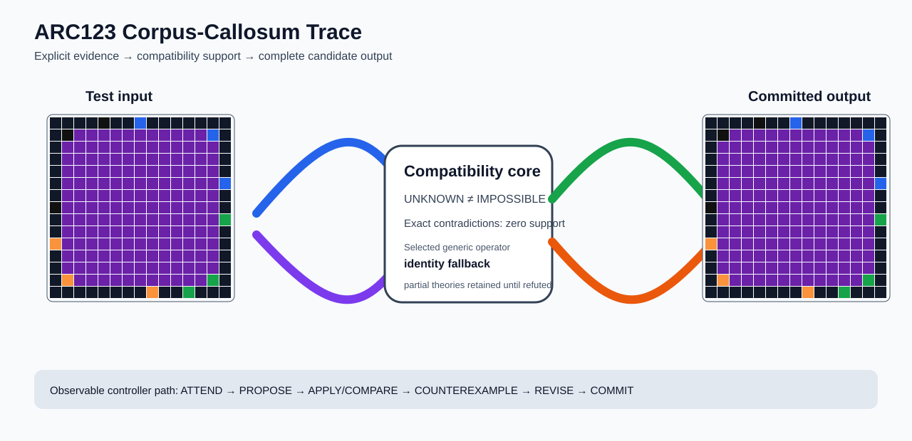

# ARC1 `1c02dbbe` P0008 Brain Surgery Report

## Outcome: NO — TEST CELLS DO NOT ALL MATCH

- **Compared positions:** 225
- **Mismatched cells:** 117
- **Training compatibility:** `False`
- **Fallback used:** `True`
- **Selected hypothesis:** `fallback_identity_complete_grid`
- **Source commit:** `085f6dbe39050afac3d1d743f840bac95b1a8d1c`
- **Frozen controller commit:** `4bed6c917523bc2baa05eec69f67303805d88dae`

## Live-Agent Boundary

The controller receives only visible training input/output examples and test inputs. It receives no task ID, imported cohort label, GT feature record, GT solver, historical decomposition, or held-out output before committing a complete grid. The expected output appears only in the post-answer V&V section.

## Corpus-Callosum Visualization



- Full explicit event record: [`learning_trace.json`](learning_trace.json)

## Frozen Measurement

This task was evaluated with the controller and operator configuration pinned before the frozen cohort was run. A result in this packet cannot alter that controller configuration.

## Post-Answer V&V

### Test case 1
- **All cells match:** `False`
- **Mismatched cells:** `117`
- **Prediction:
```json
[[0, 0, 0, 0, 6, 0, 0, 1, 0, 0, 0, 0, 0, 0, 0], [0, 6, 5, 5, 5, 5, 5, 5, 5, 5, 5, 5, 5, 1, 0], [0, 5, 5, 5, 5, 5, 5, 5, 5, 5, 5, 5, 5, 5, 0], [0, 5, 5, 5, 5, 5, 5, 5, 5, 5, 5, 5, 5, 5, 0], [0, 5, 5, 5, 5, 5, 5, 5, 5, 5, 5, 5, 5, 5, 0], [0, 5, 5, 5, 5, 5, 5, 5, 5, 5, 5, 5, 5, 5, 1], [0, 5, 5, 5, 5, 5, 5, 5, 5, 5, 5, 5, 5, 5, 0], [6, 5, 5, 5, 5, 5, 5, 5, 5, 5, 5, 5, 5, 5, 0], [0, 5, 5, 5, 5, 5, 5, 5, 5, 5, 5, 5, 5, 5, 3], [0, 5, 5, 5, 5, 5, 5, 5, 5, 5, 5, 5, 5, 5, 0], [7, 5, 5, 5, 5, 5, 5, 5, 5, 5, 5, 5, 5, 5, 0], [0, 5, 5, 5, 5, 5, 5, 5, 5, 5, 5, 5, 5, 5, 0], [0, 5, 5, 5, 5, 5, 5, 5, 5, 5, 5, 5, 5, 5, 0], [0, 7, 5, 5, 5, 5, 5, 5, 5, 5, 5, 5, 5, 3, 0], [0, 0, 0, 0, 0, 0, 0, 0, 7, 0, 0, 3, 0, 0, 0]]
```
- **Expected output (post-answer only):**
```json
[[0, 0, 0, 0, 0, 0, 0, 0, 0, 0, 0, 0, 0, 0, 0], [0, 6, 6, 6, 6, 5, 5, 1, 1, 1, 1, 1, 1, 1, 0], [0, 6, 6, 6, 6, 5, 5, 1, 1, 1, 1, 1, 1, 1, 0], [0, 6, 6, 6, 6, 5, 5, 1, 1, 1, 1, 1, 1, 1, 0], [0, 6, 6, 6, 6, 5, 5, 1, 1, 1, 1, 1, 1, 1, 0], [0, 6, 6, 6, 6, 5, 5, 1, 1, 1, 1, 1, 1, 1, 0], [0, 6, 6, 6, 6, 5, 5, 5, 5, 5, 5, 5, 5, 5, 0], [0, 6, 6, 6, 6, 5, 5, 5, 5, 5, 5, 5, 5, 5, 0], [0, 5, 5, 5, 5, 5, 5, 5, 5, 5, 5, 3, 3, 3, 0], [0, 5, 5, 5, 5, 5, 5, 5, 5, 5, 5, 3, 3, 3, 0], [0, 7, 7, 7, 7, 7, 7, 7, 7, 5, 5, 3, 3, 3, 0], [0, 7, 7, 7, 7, 7, 7, 7, 7, 5, 5, 3, 3, 3, 0], [0, 7, 7, 7, 7, 7, 7, 7, 7, 5, 5, 3, 3, 3, 0], [0, 7, 7, 7, 7, 7, 7, 7, 7, 5, 5, 3, 3, 3, 0], [0, 0, 0, 0, 0, 0, 0, 0, 0, 0, 0, 0, 0, 0, 0]]
```

## Observable IHL Walkthrough

The record contains explicit actions, predictions, feedback, and revisions; it does not claim or store hidden model reasoning.

### Action totals

- `APPLY_HYPOTHESIS`: 248
- `ATTEND`: 248
- `CHOOSE_NEXT_DEMO`: 248
- `COMMIT`: 1
- `COMPARE`: 248
- `COMPOSE_RULE`: 5
- `EXPLAIN_RESIDUAL`: 5
- `FIND_COUNTEREXAMPLE`: 8
- `PROPOSE`: 1
- `SPECIALIZE`: 83

### Decision milestones

- `0` `PROPOSE` — `{"parent_theory_id":"T0000","rule":{"description_length":1,"name":"identity","operation":"identity","parameters":{},"rule_id":"identity","scope":{"kind":"all","value":null}},"stage":"initial_generic_theories","theory_id":"T0001"}`
- `2` `ATTEND` — `{"reason":"initial_highest_observed_change_and_color_discrimination","selected_demo":2,"selected_region":{"column":6,"row":0},"theory_id":"T0001"}`
- `6` `ATTEND` — `{"reason":"counterexample_requires_visible_conditional_evidence:unseen_demo_selected_for_residual_version_space_discrimination","selected_demo":1,"selected_region":{"column":8,"row":1},"theory_id":"T0001"}`
- `10` `ATTEND` — `{"reason":"counterexample_requires_visible_conditional_evidence:unseen_demo_selected_for_residual_version_space_discrimination","selected_demo":0,"selected_region":{"column":8,"row":2},"theory_id":"T0001"}`
- `16` `SPECIALIZE` — `{"added_rule":{"description_length":4,"name":"line_extend(direction=up,fill_color=4,seed_color=4)","operation":"full_operator","parameters":{"direction":"up","fill_color":4,"operator":"line_extend","seed_color":4},"rule_id":"structural-line_extend","scope":{"kind":"all","value":null}},"parent_theory_id":"T0001","reason":"unexplained_residual_proposed_generic_structural_rule","theory_id":"T0003"}`
- `17` `SPECIALIZE` — `{"added_rule":{"description_length":4,"name":"line_extend(direction=up,fill_color=6,seed_color=6)","operation":"full_operator","parameters":{"direction":"up","fill_color":6,"operator":"line_extend","seed_color":6},"rule_id":"structural-line_extend","scope":{"kind":"all","value":null}},"parent_theory_id":"T0001","reason":"unexplained_residual_proposed_generic_structural_rule","theory_id":"T0004"}`
- `18` `SPECIALIZE` — `{"added_rule":{"description_length":4,"name":"line_extend(direction=right,fill_color=3,seed_color=3)","operation":"full_operator","parameters":{"direction":"right","fill_color":3,"operator":"line_extend","seed_color":3},"rule_id":"structural-line_extend","scope":{"kind":"all","value":null}},"parent_theory_id":"T0001","reason":"unexplained_residual_proposed_generic_structural_rule","theory_id":"T0005"}`
- `19` `SPECIALIZE` — `{"added_rule":{"description_length":4,"name":"line_extend(direction=right,fill_color=1,seed_color=1)","operation":"full_operator","parameters":{"direction":"right","fill_color":1,"operator":"line_extend","seed_color":1},"rule_id":"structural-line_extend","scope":{"kind":"all","value":null}},"parent_theory_id":"T0001","reason":"unexplained_residual_proposed_generic_structural_rule","theory_id":"T0006"}`
- `20` `SPECIALIZE` — `{"added_rule":{"description_length":4,"name":"line_extend(direction=down,fill_color=3,seed_color=3)","operation":"full_operator","parameters":{"direction":"down","fill_color":3,"operator":"line_extend","seed_color":3},"rule_id":"structural-line_extend","scope":{"kind":"all","value":null}},"parent_theory_id":"T0001","reason":"unexplained_residual_proposed_generic_structural_rule","theory_id":"T0007"}`
- `21` `SPECIALIZE` — `{"added_rule":{"description_length":4,"name":"line_extend(direction=up,fill_color=1,seed_color=6)","operation":"full_operator","parameters":{"direction":"up","fill_color":1,"operator":"line_extend","seed_color":6},"rule_id":"structural-line_extend","scope":{"kind":"all","value":null}},"parent_theory_id":"T0001","reason":"unexplained_residual_proposed_generic_structural_rule","theory_id":"T0008"}`
- `22` `SPECIALIZE` — `{"added_rule":{"description_length":4,"name":"line_extend(direction=right,fill_color=4,seed_color=1)","operation":"full_operator","parameters":{"direction":"right","fill_color":4,"operator":"line_extend","seed_color":1},"rule_id":"structural-line_extend","scope":{"kind":"all","value":null}},"parent_theory_id":"T0001","reason":"unexplained_residual_proposed_generic_structural_rule","theory_id":"T0009"}`
- `23` `SPECIALIZE` — `{"added_rule":{"description_length":4,"name":"line_extend(direction=down,fill_color=4,seed_color=4)","operation":"full_operator","parameters":{"direction":"down","fill_color":4,"operator":"line_extend","seed_color":4},"rule_id":"structural-line_extend","scope":{"kind":"all","value":null}},"parent_theory_id":"T0001","reason":"unexplained_residual_proposed_generic_structural_rule","theory_id":"T0010"}`
- `24` `SPECIALIZE` — `{"added_rule":{"description_length":4,"name":"row_span_fill(fill_color=6,seed_color=6)","operation":"full_operator","parameters":{"fill_color":6,"operator":"row_span_fill","seed_color":6},"rule_id":"structural-row_span_fill","scope":{"kind":"all","value":null}},"parent_theory_id":"T0001","reason":"unexplained_residual_proposed_generic_structural_rule","theory_id":"T0011"}`
- `25` `SPECIALIZE` — `{"added_rule":{"description_length":4,"name":"row_span_fill(fill_color=6,seed_color=4)","operation":"full_operator","parameters":{"fill_color":6,"operator":"row_span_fill","seed_color":4},"rule_id":"structural-row_span_fill","scope":{"kind":"all","value":null}},"parent_theory_id":"T0001","reason":"unexplained_residual_proposed_generic_structural_rule","theory_id":"T0012"}`
- `26` `SPECIALIZE` — `{"added_rule":{"description_length":4,"name":"row_span_fill(fill_color=6,seed_color=3)","operation":"full_operator","parameters":{"fill_color":6,"operator":"row_span_fill","seed_color":3},"rule_id":"structural-row_span_fill","scope":{"kind":"all","value":null}},"parent_theory_id":"T0001","reason":"unexplained_residual_proposed_generic_structural_rule","theory_id":"T0013"}`
- `27` `SPECIALIZE` — `{"added_rule":{"description_length":4,"name":"row_span_fill(fill_color=6,seed_color=2)","operation":"full_operator","parameters":{"fill_color":6,"operator":"row_span_fill","seed_color":2},"rule_id":"structural-row_span_fill","scope":{"kind":"all","value":null}},"parent_theory_id":"T0001","reason":"unexplained_residual_proposed_generic_structural_rule","theory_id":"T0014"}`
- `29` `ATTEND` — `{"reason":"initial_highest_observed_change_and_color_discrimination","selected_demo":2,"selected_region":{"column":6,"row":0},"theory_id":"T0002"}`
- `33` `ATTEND` — `{"reason":"initial_highest_observed_change_and_color_discrimination","selected_demo":2,"selected_region":{"column":6,"row":0},"theory_id":"T0003"}`
- `37` `ATTEND` — `{"reason":"initial_highest_observed_change_and_color_discrimination","selected_demo":2,"selected_region":{"column":6,"row":0},"theory_id":"T0004"}`
- `41` `ATTEND` — `{"reason":"initial_highest_observed_change_and_color_discrimination","selected_demo":2,"selected_region":{"column":6,"row":0},"theory_id":"T0005"}`
- `45` `ATTEND` — `{"reason":"initial_highest_observed_change_and_color_discrimination","selected_demo":2,"selected_region":{"column":6,"row":0},"theory_id":"T0006"}`
- `49` `ATTEND` — `{"reason":"initial_highest_observed_change_and_color_discrimination","selected_demo":2,"selected_region":{"column":6,"row":0},"theory_id":"T0007"}`
- `53` `ATTEND` — `{"reason":"initial_highest_observed_change_and_color_discrimination","selected_demo":2,"selected_region":{"column":6,"row":0},"theory_id":"T0008"}`
- `57` `ATTEND` — `{"reason":"initial_highest_observed_change_and_color_discrimination","selected_demo":2,"selected_region":{"column":6,"row":0},"theory_id":"T0009"}`
- `61` `ATTEND` — `{"reason":"initial_highest_observed_change_and_color_discrimination","selected_demo":2,"selected_region":{"column":6,"row":0},"theory_id":"T0010"}`
- `65` `ATTEND` — `{"reason":"initial_highest_observed_change_and_color_discrimination","selected_demo":2,"selected_region":{"column":6,"row":0},"theory_id":"T0011"}`
- `69` `ATTEND` — `{"reason":"initial_highest_observed_change_and_color_discrimination","selected_demo":2,"selected_region":{"column":6,"row":0},"theory_id":"T0012"}`
- `73` `ATTEND` — `{"reason":"initial_highest_observed_change_and_color_discrimination","selected_demo":2,"selected_region":{"column":6,"row":0},"theory_id":"T0013"}`
- `77` `ATTEND` — `{"reason":"counterexample_requires_visible_conditional_evidence:unseen_demo_selected_for_residual_version_space_discrimination","selected_demo":1,"selected_region":{"column":8,"row":1},"theory_id":"T0004"}`
- `81` `ATTEND` — `{"reason":"counterexample_requires_visible_conditional_evidence:unseen_demo_selected_for_residual_version_space_discrimination","selected_demo":1,"selected_region":{"column":8,"row":1},"theory_id":"T0006"}`
- `85` `ATTEND` — `{"reason":"counterexample_requires_visible_conditional_evidence:unseen_demo_selected_for_residual_version_space_discrimination","selected_demo":1,"selected_region":{"column":8,"row":1},"theory_id":"T0008"}`
- `89` `ATTEND` — `{"reason":"counterexample_requires_visible_conditional_evidence:unseen_demo_selected_for_residual_version_space_discrimination","selected_demo":1,"selected_region":{"column":8,"row":1},"theory_id":"T0009"}`
- `93` `ATTEND` — `{"reason":"counterexample_requires_visible_conditional_evidence:unseen_demo_selected_for_residual_version_space_discrimination","selected_demo":1,"selected_region":{"column":8,"row":1},"theory_id":"T0010"}`
- `97` `ATTEND` — `{"reason":"counterexample_requires_visible_conditional_evidence:unseen_demo_selected_for_residual_version_space_discrimination","selected_demo":1,"selected_region":{"column":8,"row":1},"theory_id":"T0002"}`
- `101` `ATTEND` — `{"reason":"counterexample_requires_visible_conditional_evidence:unseen_demo_selected_for_residual_version_space_discrimination","selected_demo":1,"selected_region":{"column":8,"row":1},"theory_id":"T0003"}`
- `105` `ATTEND` — `{"reason":"counterexample_requires_visible_conditional_evidence:unseen_demo_selected_for_residual_version_space_discrimination","selected_demo":1,"selected_region":{"column":8,"row":1},"theory_id":"T0005"}`
- `109` `ATTEND` — `{"reason":"counterexample_requires_visible_conditional_evidence:unseen_demo_selected_for_residual_version_space_discrimination","selected_demo":1,"selected_region":{"column":8,"row":1},"theory_id":"T0007"}`
- `113` `ATTEND` — `{"reason":"counterexample_requires_visible_conditional_evidence:unseen_demo_selected_for_residual_version_space_discrimination","selected_demo":1,"selected_region":{"column":8,"row":1},"theory_id":"T0011"}`
- `117` `ATTEND` — `{"reason":"counterexample_requires_visible_conditional_evidence:unseen_demo_selected_for_residual_version_space_discrimination","selected_demo":1,"selected_region":{"column":8,"row":1},"theory_id":"T0012"}`
- `121` `ATTEND` — `{"reason":"counterexample_requires_visible_conditional_evidence:unseen_demo_selected_for_residual_version_space_discrimination","selected_demo":1,"selected_region":{"column":8,"row":1},"theory_id":"T0013"}`
- `125` `ATTEND` — `{"reason":"counterexample_requires_visible_conditional_evidence:unseen_demo_selected_for_residual_version_space_discrimination","selected_demo":0,"selected_region":{"column":8,"row":2},"theory_id":"T0003"}`
- `129` `ATTEND` — `{"reason":"counterexample_requires_visible_conditional_evidence:unseen_demo_selected_for_residual_version_space_discrimination","selected_demo":0,"selected_region":{"column":8,"row":2},"theory_id":"T0004"}`
- `133` `ATTEND` — `{"reason":"counterexample_requires_visible_conditional_evidence:unseen_demo_selected_for_residual_version_space_discrimination","selected_demo":0,"selected_region":{"column":8,"row":2},"theory_id":"T0005"}`
- `137` `ATTEND` — `{"reason":"counterexample_requires_visible_conditional_evidence:unseen_demo_selected_for_residual_version_space_discrimination","selected_demo":0,"selected_region":{"column":8,"row":2},"theory_id":"T0006"}`
- `141` `ATTEND` — `{"reason":"counterexample_requires_visible_conditional_evidence:unseen_demo_selected_for_residual_version_space_discrimination","selected_demo":0,"selected_region":{"column":8,"row":2},"theory_id":"T0007"}`
- `145` `ATTEND` — `{"reason":"counterexample_requires_visible_conditional_evidence:unseen_demo_selected_for_residual_version_space_discrimination","selected_demo":0,"selected_region":{"column":8,"row":2},"theory_id":"T0008"}`
- `149` `ATTEND` — `{"reason":"counterexample_requires_visible_conditional_evidence:unseen_demo_selected_for_residual_version_space_discrimination","selected_demo":0,"selected_region":{"column":8,"row":2},"theory_id":"T0009"}`
- `153` `ATTEND` — `{"reason":"counterexample_requires_visible_conditional_evidence:unseen_demo_selected_for_residual_version_space_discrimination","selected_demo":0,"selected_region":{"column":8,"row":2},"theory_id":"T0010"}`
- `157` `ATTEND` — `{"reason":"counterexample_requires_visible_conditional_evidence:unseen_demo_selected_for_residual_version_space_discrimination","selected_demo":0,"selected_region":{"column":3,"row":3},"theory_id":"T0002"}`
- `161` `ATTEND` — `{"reason":"counterexample_requires_visible_conditional_evidence:unseen_demo_selected_for_residual_version_space_discrimination","selected_demo":0,"selected_region":{"column":8,"row":2},"theory_id":"T0011"}`
- `165` `ATTEND` — `{"reason":"counterexample_requires_visible_conditional_evidence:unseen_demo_selected_for_residual_version_space_discrimination","selected_demo":0,"selected_region":{"column":8,"row":2},"theory_id":"T0012"}`
- `169` `ATTEND` — `{"reason":"counterexample_requires_visible_conditional_evidence:unseen_demo_selected_for_residual_version_space_discrimination","selected_demo":0,"selected_region":{"column":8,"row":2},"theory_id":"T0013"}`
- `175` `SPECIALIZE` — `{"added_rule":{"description_length":4,"name":"line_extend(direction=up,fill_color=6,seed_color=6)","operation":"full_operator","parameters":{"direction":"up","fill_color":6,"operator":"line_extend","seed_color":6},"rule_id":"structural-line_extend","scope":{"kind":"all","value":null}},"parent_theory_id":"T0003","reason":"unexplained_residual_proposed_generic_structural_rule","theory_id":"T0016"}`
- `176` `SPECIALIZE` — `{"added_rule":{"description_length":4,"name":"line_extend(direction=right,fill_color=3,seed_color=3)","operation":"full_operator","parameters":{"direction":"right","fill_color":3,"operator":"line_extend","seed_color":3},"rule_id":"structural-line_extend","scope":{"kind":"all","value":null}},"parent_theory_id":"T0003","reason":"unexplained_residual_proposed_generic_structural_rule","theory_id":"T0017"}`
- `177` `SPECIALIZE` — `{"added_rule":{"description_length":4,"name":"line_extend(direction=right,fill_color=1,seed_color=1)","operation":"full_operator","parameters":{"direction":"right","fill_color":1,"operator":"line_extend","seed_color":1},"rule_id":"structural-line_extend","scope":{"kind":"all","value":null}},"parent_theory_id":"T0003","reason":"unexplained_residual_proposed_generic_structural_rule","theory_id":"T0018"}`
- `178` `SPECIALIZE` — `{"added_rule":{"description_length":4,"name":"line_extend(direction=down,fill_color=3,seed_color=3)","operation":"full_operator","parameters":{"direction":"down","fill_color":3,"operator":"line_extend","seed_color":3},"rule_id":"structural-line_extend","scope":{"kind":"all","value":null}},"parent_theory_id":"T0003","reason":"unexplained_residual_proposed_generic_structural_rule","theory_id":"T0019"}`
- `179` `SPECIALIZE` — `{"added_rule":{"description_length":4,"name":"line_extend(direction=up,fill_color=1,seed_color=6)","operation":"full_operator","parameters":{"direction":"up","fill_color":1,"operator":"line_extend","seed_color":6},"rule_id":"structural-line_extend","scope":{"kind":"all","value":null}},"parent_theory_id":"T0003","reason":"unexplained_residual_proposed_generic_structural_rule","theory_id":"T0020"}`
- `180` `SPECIALIZE` — `{"added_rule":{"description_length":4,"name":"line_extend(direction=right,fill_color=4,seed_color=1)","operation":"full_operator","parameters":{"direction":"right","fill_color":4,"operator":"line_extend","seed_color":1},"rule_id":"structural-line_extend","scope":{"kind":"all","value":null}},"parent_theory_id":"T0003","reason":"unexplained_residual_proposed_generic_structural_rule","theory_id":"T0021"}`
- `181` `SPECIALIZE` — `{"added_rule":{"description_length":4,"name":"line_extend(direction=down,fill_color=4,seed_color=4)","operation":"full_operator","parameters":{"direction":"down","fill_color":4,"operator":"line_extend","seed_color":4},"rule_id":"structural-line_extend","scope":{"kind":"all","value":null}},"parent_theory_id":"T0003","reason":"unexplained_residual_proposed_generic_structural_rule","theory_id":"T0022"}`
- `182` `SPECIALIZE` — `{"added_rule":{"description_length":4,"name":"row_span_fill(fill_color=6,seed_color=6)","operation":"full_operator","parameters":{"fill_color":6,"operator":"row_span_fill","seed_color":6},"rule_id":"structural-row_span_fill","scope":{"kind":"all","value":null}},"parent_theory_id":"T0003","reason":"unexplained_residual_proposed_generic_structural_rule","theory_id":"T0023"}`
- `183` `SPECIALIZE` — `{"added_rule":{"description_length":4,"name":"row_span_fill(fill_color=6,seed_color=4)","operation":"full_operator","parameters":{"fill_color":6,"operator":"row_span_fill","seed_color":4},"rule_id":"structural-row_span_fill","scope":{"kind":"all","value":null}},"parent_theory_id":"T0003","reason":"unexplained_residual_proposed_generic_structural_rule","theory_id":"T0024"}`
- `184` `SPECIALIZE` — `{"added_rule":{"description_length":4,"name":"row_span_fill(fill_color=6,seed_color=3)","operation":"full_operator","parameters":{"fill_color":6,"operator":"row_span_fill","seed_color":3},"rule_id":"structural-row_span_fill","scope":{"kind":"all","value":null}},"parent_theory_id":"T0003","reason":"unexplained_residual_proposed_generic_structural_rule","theory_id":"T0025"}`
- `185` `SPECIALIZE` — `{"added_rule":{"description_length":4,"name":"row_span_fill(fill_color=6,seed_color=2)","operation":"full_operator","parameters":{"fill_color":6,"operator":"row_span_fill","seed_color":2},"rule_id":"structural-row_span_fill","scope":{"kind":"all","value":null}},"parent_theory_id":"T0003","reason":"unexplained_residual_proposed_generic_structural_rule","theory_id":"T0026"}`
- `187` `ATTEND` — `{"reason":"initial_highest_observed_change_and_color_discrimination","selected_demo":2,"selected_region":{"column":6,"row":0},"theory_id":"T0015"}`
- `191` `ATTEND` — `{"reason":"initial_highest_observed_change_and_color_discrimination","selected_demo":2,"selected_region":{"column":6,"row":0},"theory_id":"T0016"}`
- `195` `ATTEND` — `{"reason":"initial_highest_observed_change_and_color_discrimination","selected_demo":2,"selected_region":{"column":6,"row":0},"theory_id":"T0017"}`
- `199` `ATTEND` — `{"reason":"initial_highest_observed_change_and_color_discrimination","selected_demo":2,"selected_region":{"column":6,"row":0},"theory_id":"T0018"}`
- `203` `ATTEND` — `{"reason":"initial_highest_observed_change_and_color_discrimination","selected_demo":2,"selected_region":{"column":6,"row":0},"theory_id":"T0019"}`
- `207` `ATTEND` — `{"reason":"initial_highest_observed_change_and_color_discrimination","selected_demo":2,"selected_region":{"column":6,"row":0},"theory_id":"T0020"}`
- `211` `ATTEND` — `{"reason":"initial_highest_observed_change_and_color_discrimination","selected_demo":2,"selected_region":{"column":6,"row":0},"theory_id":"T0021"}`
- `215` `ATTEND` — `{"reason":"initial_highest_observed_change_and_color_discrimination","selected_demo":2,"selected_region":{"column":6,"row":0},"theory_id":"T0022"}`
- `219` `ATTEND` — `{"reason":"initial_highest_observed_change_and_color_discrimination","selected_demo":2,"selected_region":{"column":6,"row":0},"theory_id":"T0023"}`
- `223` `ATTEND` — `{"reason":"initial_highest_observed_change_and_color_discrimination","selected_demo":2,"selected_region":{"column":6,"row":0},"theory_id":"T0024"}`
- `227` `ATTEND` — `{"reason":"initial_highest_observed_change_and_color_discrimination","selected_demo":2,"selected_region":{"column":6,"row":0},"theory_id":"T0025"}`
- `231` `ATTEND` — `{"reason":"initial_highest_observed_change_and_color_discrimination","selected_demo":2,"selected_region":{"column":6,"row":0},"theory_id":"T0026"}`
- `235` `ATTEND` — `{"reason":"counterexample_requires_visible_conditional_evidence:unseen_demo_selected_for_residual_version_space_discrimination","selected_demo":1,"selected_region":{"column":8,"row":1},"theory_id":"T0016"}`
- `239` `ATTEND` — `{"reason":"counterexample_requires_visible_conditional_evidence:unseen_demo_selected_for_residual_version_space_discrimination","selected_demo":1,"selected_region":{"column":8,"row":1},"theory_id":"T0018"}`
- `243` `ATTEND` — `{"reason":"counterexample_requires_visible_conditional_evidence:unseen_demo_selected_for_residual_version_space_discrimination","selected_demo":1,"selected_region":{"column":8,"row":1},"theory_id":"T0020"}`
- `247` `ATTEND` — `{"reason":"counterexample_requires_visible_conditional_evidence:unseen_demo_selected_for_residual_version_space_discrimination","selected_demo":1,"selected_region":{"column":8,"row":1},"theory_id":"T0021"}`
- `251` `ATTEND` — `{"reason":"counterexample_requires_visible_conditional_evidence:unseen_demo_selected_for_residual_version_space_discrimination","selected_demo":1,"selected_region":{"column":8,"row":1},"theory_id":"T0022"}`
- `255` `ATTEND` — `{"reason":"counterexample_requires_visible_conditional_evidence:unseen_demo_selected_for_residual_version_space_discrimination","selected_demo":1,"selected_region":{"column":8,"row":1},"theory_id":"T0015"}`
- `259` `ATTEND` — `{"reason":"counterexample_requires_visible_conditional_evidence:unseen_demo_selected_for_residual_version_space_discrimination","selected_demo":1,"selected_region":{"column":8,"row":1},"theory_id":"T0017"}`
- `263` `ATTEND` — `{"reason":"counterexample_requires_visible_conditional_evidence:unseen_demo_selected_for_residual_version_space_discrimination","selected_demo":1,"selected_region":{"column":8,"row":1},"theory_id":"T0019"}`
- `267` `ATTEND` — `{"reason":"counterexample_requires_visible_conditional_evidence:unseen_demo_selected_for_residual_version_space_discrimination","selected_demo":1,"selected_region":{"column":8,"row":1},"theory_id":"T0023"}`
- `271` `ATTEND` — `{"reason":"counterexample_requires_visible_conditional_evidence:unseen_demo_selected_for_residual_version_space_discrimination","selected_demo":1,"selected_region":{"column":8,"row":1},"theory_id":"T0024"}`
- `275` `ATTEND` — `{"reason":"counterexample_requires_visible_conditional_evidence:unseen_demo_selected_for_residual_version_space_discrimination","selected_demo":1,"selected_region":{"column":8,"row":1},"theory_id":"T0025"}`
- `279` `ATTEND` — `{"reason":"counterexample_requires_visible_conditional_evidence:unseen_demo_selected_for_residual_version_space_discrimination","selected_demo":1,"selected_region":{"column":8,"row":1},"theory_id":"T0026"}`
- `283` `ATTEND` — `{"reason":"counterexample_requires_visible_conditional_evidence:unseen_demo_selected_for_residual_version_space_discrimination","selected_demo":0,"selected_region":{"column":3,"row":3},"theory_id":"T0015"}`
- `287` `ATTEND` — `{"reason":"counterexample_requires_visible_conditional_evidence:unseen_demo_selected_for_residual_version_space_discrimination","selected_demo":0,"selected_region":{"column":8,"row":2},"theory_id":"T0016"}`
- `291` `ATTEND` — `{"reason":"counterexample_requires_visible_conditional_evidence:unseen_demo_selected_for_residual_version_space_discrimination","selected_demo":0,"selected_region":{"column":8,"row":2},"theory_id":"T0017"}`
- `295` `ATTEND` — `{"reason":"counterexample_requires_visible_conditional_evidence:unseen_demo_selected_for_residual_version_space_discrimination","selected_demo":0,"selected_region":{"column":8,"row":2},"theory_id":"T0018"}`
- `299` `ATTEND` — `{"reason":"counterexample_requires_visible_conditional_evidence:unseen_demo_selected_for_residual_version_space_discrimination","selected_demo":0,"selected_region":{"column":8,"row":2},"theory_id":"T0019"}`
- `303` `ATTEND` — `{"reason":"counterexample_requires_visible_conditional_evidence:unseen_demo_selected_for_residual_version_space_discrimination","selected_demo":0,"selected_region":{"column":8,"row":2},"theory_id":"T0020"}`
- `307` `ATTEND` — `{"reason":"counterexample_requires_visible_conditional_evidence:unseen_demo_selected_for_residual_version_space_discrimination","selected_demo":0,"selected_region":{"column":8,"row":2},"theory_id":"T0021"}`
- `311` `ATTEND` — `{"reason":"counterexample_requires_visible_conditional_evidence:unseen_demo_selected_for_residual_version_space_discrimination","selected_demo":0,"selected_region":{"column":8,"row":2},"theory_id":"T0022"}`
- `315` `ATTEND` — `{"reason":"counterexample_requires_visible_conditional_evidence:unseen_demo_selected_for_residual_version_space_discrimination","selected_demo":0,"selected_region":{"column":8,"row":2},"theory_id":"T0023"}`
- `319` `ATTEND` — `{"reason":"counterexample_requires_visible_conditional_evidence:unseen_demo_selected_for_residual_version_space_discrimination","selected_demo":0,"selected_region":{"column":8,"row":2},"theory_id":"T0024"}`
- `323` `ATTEND` — `{"reason":"counterexample_requires_visible_conditional_evidence:unseen_demo_selected_for_residual_version_space_discrimination","selected_demo":0,"selected_region":{"column":8,"row":2},"theory_id":"T0025"}`
- `327` `ATTEND` — `{"reason":"counterexample_requires_visible_conditional_evidence:unseen_demo_selected_for_residual_version_space_discrimination","selected_demo":0,"selected_region":{"column":8,"row":2},"theory_id":"T0026"}`
- `331` `SPECIALIZE` — `{"added_rule":{"description_length":4,"name":"line_extend(direction=up,fill_color=6,seed_color=6)","operation":"full_operator","parameters":{"direction":"up","fill_color":6,"operator":"line_extend","seed_color":6},"rule_id":"structural-line_extend","scope":{"kind":"all","value":null}},"parent_theory_id":"T0015","reason":"unexplained_residual_proposed_generic_structural_rule","theory_id":"T0027"}`
- `332` `SPECIALIZE` — `{"added_rule":{"description_length":4,"name":"line_extend(direction=right,fill_color=3,seed_color=3)","operation":"full_operator","parameters":{"direction":"right","fill_color":3,"operator":"line_extend","seed_color":3},"rule_id":"structural-line_extend","scope":{"kind":"all","value":null}},"parent_theory_id":"T0015","reason":"unexplained_residual_proposed_generic_structural_rule","theory_id":"T0028"}`
- `333` `SPECIALIZE` — `{"added_rule":{"description_length":4,"name":"line_extend(direction=right,fill_color=1,seed_color=1)","operation":"full_operator","parameters":{"direction":"right","fill_color":1,"operator":"line_extend","seed_color":1},"rule_id":"structural-line_extend","scope":{"kind":"all","value":null}},"parent_theory_id":"T0015","reason":"unexplained_residual_proposed_generic_structural_rule","theory_id":"T0029"}`
- `334` `SPECIALIZE` — `{"added_rule":{"description_length":4,"name":"line_extend(direction=down,fill_color=3,seed_color=3)","operation":"full_operator","parameters":{"direction":"down","fill_color":3,"operator":"line_extend","seed_color":3},"rule_id":"structural-line_extend","scope":{"kind":"all","value":null}},"parent_theory_id":"T0015","reason":"unexplained_residual_proposed_generic_structural_rule","theory_id":"T0030"}`
- `335` `SPECIALIZE` — `{"added_rule":{"description_length":4,"name":"line_extend(direction=up,fill_color=1,seed_color=6)","operation":"full_operator","parameters":{"direction":"up","fill_color":1,"operator":"line_extend","seed_color":6},"rule_id":"structural-line_extend","scope":{"kind":"all","value":null}},"parent_theory_id":"T0015","reason":"unexplained_residual_proposed_generic_structural_rule","theory_id":"T0031"}`
- `336` `SPECIALIZE` — `{"added_rule":{"description_length":4,"name":"line_extend(direction=right,fill_color=4,seed_color=1)","operation":"full_operator","parameters":{"direction":"right","fill_color":4,"operator":"line_extend","seed_color":1},"rule_id":"structural-line_extend","scope":{"kind":"all","value":null}},"parent_theory_id":"T0015","reason":"unexplained_residual_proposed_generic_structural_rule","theory_id":"T0032"}`
- `337` `SPECIALIZE` — `{"added_rule":{"description_length":4,"name":"line_extend(direction=down,fill_color=4,seed_color=4)","operation":"full_operator","parameters":{"direction":"down","fill_color":4,"operator":"line_extend","seed_color":4},"rule_id":"structural-line_extend","scope":{"kind":"all","value":null}},"parent_theory_id":"T0015","reason":"unexplained_residual_proposed_generic_structural_rule","theory_id":"T0033"}`
- `338` `SPECIALIZE` — `{"added_rule":{"description_length":4,"name":"row_span_fill(fill_color=6,seed_color=6)","operation":"full_operator","parameters":{"fill_color":6,"operator":"row_span_fill","seed_color":6},"rule_id":"structural-row_span_fill","scope":{"kind":"all","value":null}},"parent_theory_id":"T0015","reason":"unexplained_residual_proposed_generic_structural_rule","theory_id":"T0034"}`
- `339` `SPECIALIZE` — `{"added_rule":{"description_length":4,"name":"row_span_fill(fill_color=6,seed_color=4)","operation":"full_operator","parameters":{"fill_color":6,"operator":"row_span_fill","seed_color":4},"rule_id":"structural-row_span_fill","scope":{"kind":"all","value":null}},"parent_theory_id":"T0015","reason":"unexplained_residual_proposed_generic_structural_rule","theory_id":"T0035"}`
- `340` `SPECIALIZE` — `{"added_rule":{"description_length":4,"name":"row_span_fill(fill_color=6,seed_color=3)","operation":"full_operator","parameters":{"fill_color":6,"operator":"row_span_fill","seed_color":3},"rule_id":"structural-row_span_fill","scope":{"kind":"all","value":null}},"parent_theory_id":"T0015","reason":"unexplained_residual_proposed_generic_structural_rule","theory_id":"T0036"}`
- `341` `SPECIALIZE` — `{"added_rule":{"description_length":4,"name":"row_span_fill(fill_color=6,seed_color=2)","operation":"full_operator","parameters":{"fill_color":6,"operator":"row_span_fill","seed_color":2},"rule_id":"structural-row_span_fill","scope":{"kind":"all","value":null}},"parent_theory_id":"T0015","reason":"unexplained_residual_proposed_generic_structural_rule","theory_id":"T0037"}`
- `343` `ATTEND` — `{"reason":"initial_highest_observed_change_and_color_discrimination","selected_demo":2,"selected_region":{"column":6,"row":0},"theory_id":"T0027"}`
- `347` `ATTEND` — `{"reason":"initial_highest_observed_change_and_color_discrimination","selected_demo":2,"selected_region":{"column":6,"row":0},"theory_id":"T0028"}`
- `351` `ATTEND` — `{"reason":"initial_highest_observed_change_and_color_discrimination","selected_demo":2,"selected_region":{"column":6,"row":0},"theory_id":"T0029"}`
- `355` `ATTEND` — `{"reason":"initial_highest_observed_change_and_color_discrimination","selected_demo":2,"selected_region":{"column":6,"row":0},"theory_id":"T0030"}`
- `359` `ATTEND` — `{"reason":"initial_highest_observed_change_and_color_discrimination","selected_demo":2,"selected_region":{"column":6,"row":0},"theory_id":"T0031"}`
- `363` `ATTEND` — `{"reason":"initial_highest_observed_change_and_color_discrimination","selected_demo":2,"selected_region":{"column":6,"row":0},"theory_id":"T0032"}`
- `367` `ATTEND` — `{"reason":"initial_highest_observed_change_and_color_discrimination","selected_demo":2,"selected_region":{"column":6,"row":0},"theory_id":"T0033"}`
- `371` `ATTEND` — `{"reason":"initial_highest_observed_change_and_color_discrimination","selected_demo":2,"selected_region":{"column":6,"row":0},"theory_id":"T0034"}`
- `375` `ATTEND` — `{"reason":"initial_highest_observed_change_and_color_discrimination","selected_demo":2,"selected_region":{"column":6,"row":0},"theory_id":"T0035"}`
- `379` `ATTEND` — `{"reason":"initial_highest_observed_change_and_color_discrimination","selected_demo":2,"selected_region":{"column":6,"row":0},"theory_id":"T0036"}`
- `383` `ATTEND` — `{"reason":"initial_highest_observed_change_and_color_discrimination","selected_demo":2,"selected_region":{"column":6,"row":0},"theory_id":"T0037"}`
- `387` `ATTEND` — `{"reason":"counterexample_requires_visible_conditional_evidence:unseen_demo_selected_for_residual_version_space_discrimination","selected_demo":1,"selected_region":{"column":8,"row":1},"theory_id":"T0027"}`
- `391` `ATTEND` — `{"reason":"counterexample_requires_visible_conditional_evidence:unseen_demo_selected_for_residual_version_space_discrimination","selected_demo":1,"selected_region":{"column":8,"row":1},"theory_id":"T0029"}`
- `395` `ATTEND` — `{"reason":"counterexample_requires_visible_conditional_evidence:unseen_demo_selected_for_residual_version_space_discrimination","selected_demo":1,"selected_region":{"column":8,"row":1},"theory_id":"T0031"}`
- `399` `ATTEND` — `{"reason":"counterexample_requires_visible_conditional_evidence:unseen_demo_selected_for_residual_version_space_discrimination","selected_demo":1,"selected_region":{"column":8,"row":1},"theory_id":"T0032"}`
- `403` `ATTEND` — `{"reason":"counterexample_requires_visible_conditional_evidence:unseen_demo_selected_for_residual_version_space_discrimination","selected_demo":1,"selected_region":{"column":8,"row":1},"theory_id":"T0033"}`
- `407` `ATTEND` — `{"reason":"counterexample_requires_visible_conditional_evidence:unseen_demo_selected_for_residual_version_space_discrimination","selected_demo":1,"selected_region":{"column":8,"row":1},"theory_id":"T0028"}`
- `411` `ATTEND` — `{"reason":"counterexample_requires_visible_conditional_evidence:unseen_demo_selected_for_residual_version_space_discrimination","selected_demo":1,"selected_region":{"column":8,"row":1},"theory_id":"T0030"}`
- `415` `ATTEND` — `{"reason":"counterexample_requires_visible_conditional_evidence:unseen_demo_selected_for_residual_version_space_discrimination","selected_demo":1,"selected_region":{"column":8,"row":1},"theory_id":"T0034"}`
- `419` `ATTEND` — `{"reason":"counterexample_requires_visible_conditional_evidence:unseen_demo_selected_for_residual_version_space_discrimination","selected_demo":1,"selected_region":{"column":8,"row":1},"theory_id":"T0035"}`
- `423` `ATTEND` — `{"reason":"counterexample_requires_visible_conditional_evidence:unseen_demo_selected_for_residual_version_space_discrimination","selected_demo":1,"selected_region":{"column":8,"row":1},"theory_id":"T0036"}`
- `427` `ATTEND` — `{"reason":"counterexample_requires_visible_conditional_evidence:unseen_demo_selected_for_residual_version_space_discrimination","selected_demo":1,"selected_region":{"column":8,"row":1},"theory_id":"T0037"}`
- `431` `ATTEND` — `{"reason":"counterexample_requires_visible_conditional_evidence:unseen_demo_selected_for_residual_version_space_discrimination","selected_demo":0,"selected_region":{"column":8,"row":2},"theory_id":"T0027"}`
- `435` `ATTEND` — `{"reason":"counterexample_requires_visible_conditional_evidence:unseen_demo_selected_for_residual_version_space_discrimination","selected_demo":0,"selected_region":{"column":8,"row":2},"theory_id":"T0028"}`
- `439` `ATTEND` — `{"reason":"counterexample_requires_visible_conditional_evidence:unseen_demo_selected_for_residual_version_space_discrimination","selected_demo":0,"selected_region":{"column":8,"row":2},"theory_id":"T0029"}`
- `443` `ATTEND` — `{"reason":"counterexample_requires_visible_conditional_evidence:unseen_demo_selected_for_residual_version_space_discrimination","selected_demo":0,"selected_region":{"column":8,"row":2},"theory_id":"T0030"}`
- `447` `ATTEND` — `{"reason":"counterexample_requires_visible_conditional_evidence:unseen_demo_selected_for_residual_version_space_discrimination","selected_demo":0,"selected_region":{"column":8,"row":2},"theory_id":"T0031"}`
- `451` `ATTEND` — `{"reason":"counterexample_requires_visible_conditional_evidence:unseen_demo_selected_for_residual_version_space_discrimination","selected_demo":0,"selected_region":{"column":8,"row":2},"theory_id":"T0032"}`
- `455` `ATTEND` — `{"reason":"counterexample_requires_visible_conditional_evidence:unseen_demo_selected_for_residual_version_space_discrimination","selected_demo":0,"selected_region":{"column":8,"row":2},"theory_id":"T0033"}`
- `459` `ATTEND` — `{"reason":"counterexample_requires_visible_conditional_evidence:unseen_demo_selected_for_residual_version_space_discrimination","selected_demo":0,"selected_region":{"column":8,"row":2},"theory_id":"T0034"}`
- `463` `ATTEND` — `{"reason":"counterexample_requires_visible_conditional_evidence:unseen_demo_selected_for_residual_version_space_discrimination","selected_demo":0,"selected_region":{"column":8,"row":2},"theory_id":"T0035"}`
- `467` `ATTEND` — `{"reason":"counterexample_requires_visible_conditional_evidence:unseen_demo_selected_for_residual_version_space_discrimination","selected_demo":0,"selected_region":{"column":8,"row":2},"theory_id":"T0036"}`
- `471` `ATTEND` — `{"reason":"counterexample_requires_visible_conditional_evidence:unseen_demo_selected_for_residual_version_space_discrimination","selected_demo":0,"selected_region":{"column":8,"row":2},"theory_id":"T0037"}`
- `477` `SPECIALIZE` — `{"added_rule":{"description_length":4,"name":"line_extend(direction=right,fill_color=3,seed_color=3)","operation":"full_operator","parameters":{"direction":"right","fill_color":3,"operator":"line_extend","seed_color":3},"rule_id":"structural-line_extend","scope":{"kind":"all","value":null}},"parent_theory_id":"T0016","reason":"unexplained_residual_proposed_generic_structural_rule","theory_id":"T0039"}`
- `478` `SPECIALIZE` — `{"added_rule":{"description_length":4,"name":"line_extend(direction=right,fill_color=1,seed_color=1)","operation":"full_operator","parameters":{"direction":"right","fill_color":1,"operator":"line_extend","seed_color":1},"rule_id":"structural-line_extend","scope":{"kind":"all","value":null}},"parent_theory_id":"T0016","reason":"unexplained_residual_proposed_generic_structural_rule","theory_id":"T0040"}`
- `479` `SPECIALIZE` — `{"added_rule":{"description_length":4,"name":"line_extend(direction=down,fill_color=3,seed_color=3)","operation":"full_operator","parameters":{"direction":"down","fill_color":3,"operator":"line_extend","seed_color":3},"rule_id":"structural-line_extend","scope":{"kind":"all","value":null}},"parent_theory_id":"T0016","reason":"unexplained_residual_proposed_generic_structural_rule","theory_id":"T0041"}`
- `480` `SPECIALIZE` — `{"added_rule":{"description_length":4,"name":"line_extend(direction=up,fill_color=1,seed_color=6)","operation":"full_operator","parameters":{"direction":"up","fill_color":1,"operator":"line_extend","seed_color":6},"rule_id":"structural-line_extend","scope":{"kind":"all","value":null}},"parent_theory_id":"T0016","reason":"unexplained_residual_proposed_generic_structural_rule","theory_id":"T0042"}`
- `481` `SPECIALIZE` — `{"added_rule":{"description_length":4,"name":"line_extend(direction=right,fill_color=4,seed_color=1)","operation":"full_operator","parameters":{"direction":"right","fill_color":4,"operator":"line_extend","seed_color":1},"rule_id":"structural-line_extend","scope":{"kind":"all","value":null}},"parent_theory_id":"T0016","reason":"unexplained_residual_proposed_generic_structural_rule","theory_id":"T0043"}`
- `482` `SPECIALIZE` — `{"added_rule":{"description_length":4,"name":"line_extend(direction=down,fill_color=4,seed_color=4)","operation":"full_operator","parameters":{"direction":"down","fill_color":4,"operator":"line_extend","seed_color":4},"rule_id":"structural-line_extend","scope":{"kind":"all","value":null}},"parent_theory_id":"T0016","reason":"unexplained_residual_proposed_generic_structural_rule","theory_id":"T0044"}`
- `483` `SPECIALIZE` — `{"added_rule":{"description_length":4,"name":"row_span_fill(fill_color=6,seed_color=6)","operation":"full_operator","parameters":{"fill_color":6,"operator":"row_span_fill","seed_color":6},"rule_id":"structural-row_span_fill","scope":{"kind":"all","value":null}},"parent_theory_id":"T0016","reason":"unexplained_residual_proposed_generic_structural_rule","theory_id":"T0045"}`
- `484` `SPECIALIZE` — `{"added_rule":{"description_length":4,"name":"row_span_fill(fill_color=6,seed_color=4)","operation":"full_operator","parameters":{"fill_color":6,"operator":"row_span_fill","seed_color":4},"rule_id":"structural-row_span_fill","scope":{"kind":"all","value":null}},"parent_theory_id":"T0016","reason":"unexplained_residual_proposed_generic_structural_rule","theory_id":"T0046"}`
- `485` `SPECIALIZE` — `{"added_rule":{"description_length":4,"name":"row_span_fill(fill_color=6,seed_color=3)","operation":"full_operator","parameters":{"fill_color":6,"operator":"row_span_fill","seed_color":3},"rule_id":"structural-row_span_fill","scope":{"kind":"all","value":null}},"parent_theory_id":"T0016","reason":"unexplained_residual_proposed_generic_structural_rule","theory_id":"T0047"}`
- `486` `SPECIALIZE` — `{"added_rule":{"description_length":4,"name":"row_span_fill(fill_color=6,seed_color=2)","operation":"full_operator","parameters":{"fill_color":6,"operator":"row_span_fill","seed_color":2},"rule_id":"structural-row_span_fill","scope":{"kind":"all","value":null}},"parent_theory_id":"T0016","reason":"unexplained_residual_proposed_generic_structural_rule","theory_id":"T0048"}`
- `488` `ATTEND` — `{"reason":"initial_highest_observed_change_and_color_discrimination","selected_demo":2,"selected_region":{"column":6,"row":0},"theory_id":"T0038"}`
- `492` `ATTEND` — `{"reason":"initial_highest_observed_change_and_color_discrimination","selected_demo":2,"selected_region":{"column":6,"row":0},"theory_id":"T0039"}`
- `496` `ATTEND` — `{"reason":"initial_highest_observed_change_and_color_discrimination","selected_demo":2,"selected_region":{"column":6,"row":0},"theory_id":"T0040"}`
- `500` `ATTEND` — `{"reason":"initial_highest_observed_change_and_color_discrimination","selected_demo":2,"selected_region":{"column":6,"row":0},"theory_id":"T0041"}`
- `504` `ATTEND` — `{"reason":"initial_highest_observed_change_and_color_discrimination","selected_demo":2,"selected_region":{"column":6,"row":0},"theory_id":"T0042"}`
- `508` `ATTEND` — `{"reason":"initial_highest_observed_change_and_color_discrimination","selected_demo":2,"selected_region":{"column":6,"row":0},"theory_id":"T0043"}`
- `512` `ATTEND` — `{"reason":"initial_highest_observed_change_and_color_discrimination","selected_demo":2,"selected_region":{"column":6,"row":0},"theory_id":"T0044"}`
- `516` `ATTEND` — `{"reason":"initial_highest_observed_change_and_color_discrimination","selected_demo":2,"selected_region":{"column":6,"row":0},"theory_id":"T0045"}`
- `520` `ATTEND` — `{"reason":"initial_highest_observed_change_and_color_discrimination","selected_demo":2,"selected_region":{"column":6,"row":0},"theory_id":"T0046"}`
- `524` `ATTEND` — `{"reason":"initial_highest_observed_change_and_color_discrimination","selected_demo":2,"selected_region":{"column":6,"row":0},"theory_id":"T0047"}`
- `528` `ATTEND` — `{"reason":"initial_highest_observed_change_and_color_discrimination","selected_demo":2,"selected_region":{"column":6,"row":0},"theory_id":"T0048"}`
- `532` `ATTEND` — `{"reason":"counterexample_requires_visible_conditional_evidence:unseen_demo_selected_for_residual_version_space_discrimination","selected_demo":1,"selected_region":{"column":8,"row":1},"theory_id":"T0038"}`
- `536` `ATTEND` — `{"reason":"counterexample_requires_visible_conditional_evidence:unseen_demo_selected_for_residual_version_space_discrimination","selected_demo":1,"selected_region":{"column":8,"row":1},"theory_id":"T0040"}`
- `540` `ATTEND` — `{"reason":"counterexample_requires_visible_conditional_evidence:unseen_demo_selected_for_residual_version_space_discrimination","selected_demo":1,"selected_region":{"column":8,"row":1},"theory_id":"T0042"}`
- `544` `ATTEND` — `{"reason":"counterexample_requires_visible_conditional_evidence:unseen_demo_selected_for_residual_version_space_discrimination","selected_demo":1,"selected_region":{"column":8,"row":1},"theory_id":"T0043"}`
- `548` `ATTEND` — `{"reason":"counterexample_requires_visible_conditional_evidence:unseen_demo_selected_for_residual_version_space_discrimination","selected_demo":1,"selected_region":{"column":8,"row":1},"theory_id":"T0044"}`
- `552` `ATTEND` — `{"reason":"counterexample_requires_visible_conditional_evidence:unseen_demo_selected_for_residual_version_space_discrimination","selected_demo":1,"selected_region":{"column":8,"row":1},"theory_id":"T0039"}`
- `556` `ATTEND` — `{"reason":"counterexample_requires_visible_conditional_evidence:unseen_demo_selected_for_residual_version_space_discrimination","selected_demo":1,"selected_region":{"column":8,"row":1},"theory_id":"T0041"}`
- `560` `ATTEND` — `{"reason":"counterexample_requires_visible_conditional_evidence:unseen_demo_selected_for_residual_version_space_discrimination","selected_demo":1,"selected_region":{"column":8,"row":1},"theory_id":"T0045"}`
- `564` `ATTEND` — `{"reason":"counterexample_requires_visible_conditional_evidence:unseen_demo_selected_for_residual_version_space_discrimination","selected_demo":1,"selected_region":{"column":8,"row":1},"theory_id":"T0046"}`
- `568` `ATTEND` — `{"reason":"counterexample_requires_visible_conditional_evidence:unseen_demo_selected_for_residual_version_space_discrimination","selected_demo":1,"selected_region":{"column":8,"row":1},"theory_id":"T0047"}`
- `572` `ATTEND` — `{"reason":"counterexample_requires_visible_conditional_evidence:unseen_demo_selected_for_residual_version_space_discrimination","selected_demo":1,"selected_region":{"column":8,"row":1},"theory_id":"T0048"}`
- `576` `ATTEND` — `{"reason":"counterexample_requires_visible_conditional_evidence:unseen_demo_selected_for_residual_version_space_discrimination","selected_demo":0,"selected_region":{"column":3,"row":3},"theory_id":"T0038"}`
- `580` `ATTEND` — `{"reason":"counterexample_requires_visible_conditional_evidence:unseen_demo_selected_for_residual_version_space_discrimination","selected_demo":0,"selected_region":{"column":8,"row":2},"theory_id":"T0039"}`
- `584` `ATTEND` — `{"reason":"counterexample_requires_visible_conditional_evidence:unseen_demo_selected_for_residual_version_space_discrimination","selected_demo":0,"selected_region":{"column":8,"row":2},"theory_id":"T0040"}`
- `588` `ATTEND` — `{"reason":"counterexample_requires_visible_conditional_evidence:unseen_demo_selected_for_residual_version_space_discrimination","selected_demo":0,"selected_region":{"column":8,"row":2},"theory_id":"T0041"}`
- `592` `ATTEND` — `{"reason":"counterexample_requires_visible_conditional_evidence:unseen_demo_selected_for_residual_version_space_discrimination","selected_demo":0,"selected_region":{"column":8,"row":2},"theory_id":"T0042"}`
- `596` `ATTEND` — `{"reason":"counterexample_requires_visible_conditional_evidence:unseen_demo_selected_for_residual_version_space_discrimination","selected_demo":0,"selected_region":{"column":8,"row":2},"theory_id":"T0043"}`
- `600` `ATTEND` — `{"reason":"counterexample_requires_visible_conditional_evidence:unseen_demo_selected_for_residual_version_space_discrimination","selected_demo":0,"selected_region":{"column":8,"row":2},"theory_id":"T0044"}`
- `604` `ATTEND` — `{"reason":"counterexample_requires_visible_conditional_evidence:unseen_demo_selected_for_residual_version_space_discrimination","selected_demo":0,"selected_region":{"column":8,"row":2},"theory_id":"T0045"}`
- `608` `ATTEND` — `{"reason":"counterexample_requires_visible_conditional_evidence:unseen_demo_selected_for_residual_version_space_discrimination","selected_demo":0,"selected_region":{"column":8,"row":2},"theory_id":"T0046"}`
- `612` `ATTEND` — `{"reason":"counterexample_requires_visible_conditional_evidence:unseen_demo_selected_for_residual_version_space_discrimination","selected_demo":0,"selected_region":{"column":8,"row":2},"theory_id":"T0047"}`
- `616` `ATTEND` — `{"reason":"counterexample_requires_visible_conditional_evidence:unseen_demo_selected_for_residual_version_space_discrimination","selected_demo":0,"selected_region":{"column":8,"row":2},"theory_id":"T0048"}`
- `620` `SPECIALIZE` — `{"added_rule":{"description_length":4,"name":"line_extend(direction=right,fill_color=3,seed_color=3)","operation":"full_operator","parameters":{"direction":"right","fill_color":3,"operator":"line_extend","seed_color":3},"rule_id":"structural-line_extend","scope":{"kind":"all","value":null}},"parent_theory_id":"T0038","reason":"unexplained_residual_proposed_generic_structural_rule","theory_id":"T0049"}`
- `621` `SPECIALIZE` — `{"added_rule":{"description_length":4,"name":"line_extend(direction=right,fill_color=1,seed_color=1)","operation":"full_operator","parameters":{"direction":"right","fill_color":1,"operator":"line_extend","seed_color":1},"rule_id":"structural-line_extend","scope":{"kind":"all","value":null}},"parent_theory_id":"T0038","reason":"unexplained_residual_proposed_generic_structural_rule","theory_id":"T0050"}`
- `622` `SPECIALIZE` — `{"added_rule":{"description_length":4,"name":"line_extend(direction=down,fill_color=3,seed_color=3)","operation":"full_operator","parameters":{"direction":"down","fill_color":3,"operator":"line_extend","seed_color":3},"rule_id":"structural-line_extend","scope":{"kind":"all","value":null}},"parent_theory_id":"T0038","reason":"unexplained_residual_proposed_generic_structural_rule","theory_id":"T0051"}`
- `623` `SPECIALIZE` — `{"added_rule":{"description_length":4,"name":"line_extend(direction=up,fill_color=1,seed_color=6)","operation":"full_operator","parameters":{"direction":"up","fill_color":1,"operator":"line_extend","seed_color":6},"rule_id":"structural-line_extend","scope":{"kind":"all","value":null}},"parent_theory_id":"T0038","reason":"unexplained_residual_proposed_generic_structural_rule","theory_id":"T0052"}`
- `624` `SPECIALIZE` — `{"added_rule":{"description_length":4,"name":"line_extend(direction=right,fill_color=4,seed_color=1)","operation":"full_operator","parameters":{"direction":"right","fill_color":4,"operator":"line_extend","seed_color":1},"rule_id":"structural-line_extend","scope":{"kind":"all","value":null}},"parent_theory_id":"T0038","reason":"unexplained_residual_proposed_generic_structural_rule","theory_id":"T0053"}`
- `625` `SPECIALIZE` — `{"added_rule":{"description_length":4,"name":"line_extend(direction=down,fill_color=4,seed_color=4)","operation":"full_operator","parameters":{"direction":"down","fill_color":4,"operator":"line_extend","seed_color":4},"rule_id":"structural-line_extend","scope":{"kind":"all","value":null}},"parent_theory_id":"T0038","reason":"unexplained_residual_proposed_generic_structural_rule","theory_id":"T0054"}`
- `626` `SPECIALIZE` — `{"added_rule":{"description_length":4,"name":"row_span_fill(fill_color=6,seed_color=6)","operation":"full_operator","parameters":{"fill_color":6,"operator":"row_span_fill","seed_color":6},"rule_id":"structural-row_span_fill","scope":{"kind":"all","value":null}},"parent_theory_id":"T0038","reason":"unexplained_residual_proposed_generic_structural_rule","theory_id":"T0055"}`
- `627` `SPECIALIZE` — `{"added_rule":{"description_length":4,"name":"row_span_fill(fill_color=6,seed_color=4)","operation":"full_operator","parameters":{"fill_color":6,"operator":"row_span_fill","seed_color":4},"rule_id":"structural-row_span_fill","scope":{"kind":"all","value":null}},"parent_theory_id":"T0038","reason":"unexplained_residual_proposed_generic_structural_rule","theory_id":"T0056"}`
- `628` `SPECIALIZE` — `{"added_rule":{"description_length":4,"name":"row_span_fill(fill_color=6,seed_color=3)","operation":"full_operator","parameters":{"fill_color":6,"operator":"row_span_fill","seed_color":3},"rule_id":"structural-row_span_fill","scope":{"kind":"all","value":null}},"parent_theory_id":"T0038","reason":"unexplained_residual_proposed_generic_structural_rule","theory_id":"T0057"}`
- `629` `SPECIALIZE` — `{"added_rule":{"description_length":4,"name":"row_span_fill(fill_color=6,seed_color=2)","operation":"full_operator","parameters":{"fill_color":6,"operator":"row_span_fill","seed_color":2},"rule_id":"structural-row_span_fill","scope":{"kind":"all","value":null}},"parent_theory_id":"T0038","reason":"unexplained_residual_proposed_generic_structural_rule","theory_id":"T0058"}`
- `631` `ATTEND` — `{"reason":"initial_highest_observed_change_and_color_discrimination","selected_demo":2,"selected_region":{"column":6,"row":0},"theory_id":"T0049"}`
- `635` `ATTEND` — `{"reason":"initial_highest_observed_change_and_color_discrimination","selected_demo":2,"selected_region":{"column":6,"row":0},"theory_id":"T0050"}`
- `639` `ATTEND` — `{"reason":"initial_highest_observed_change_and_color_discrimination","selected_demo":2,"selected_region":{"column":6,"row":0},"theory_id":"T0051"}`
- `643` `ATTEND` — `{"reason":"initial_highest_observed_change_and_color_discrimination","selected_demo":2,"selected_region":{"column":6,"row":0},"theory_id":"T0052"}`
- `647` `ATTEND` — `{"reason":"initial_highest_observed_change_and_color_discrimination","selected_demo":2,"selected_region":{"column":6,"row":0},"theory_id":"T0053"}`
- `651` `ATTEND` — `{"reason":"initial_highest_observed_change_and_color_discrimination","selected_demo":2,"selected_region":{"column":6,"row":0},"theory_id":"T0054"}`
- `655` `ATTEND` — `{"reason":"initial_highest_observed_change_and_color_discrimination","selected_demo":2,"selected_region":{"column":6,"row":0},"theory_id":"T0055"}`
- `659` `ATTEND` — `{"reason":"initial_highest_observed_change_and_color_discrimination","selected_demo":2,"selected_region":{"column":6,"row":0},"theory_id":"T0056"}`
- `663` `ATTEND` — `{"reason":"initial_highest_observed_change_and_color_discrimination","selected_demo":2,"selected_region":{"column":6,"row":0},"theory_id":"T0057"}`
- `667` `ATTEND` — `{"reason":"initial_highest_observed_change_and_color_discrimination","selected_demo":2,"selected_region":{"column":6,"row":0},"theory_id":"T0058"}`
- `671` `ATTEND` — `{"reason":"counterexample_requires_visible_conditional_evidence:unseen_demo_selected_for_residual_version_space_discrimination","selected_demo":1,"selected_region":{"column":8,"row":1},"theory_id":"T0050"}`
- `675` `ATTEND` — `{"reason":"counterexample_requires_visible_conditional_evidence:unseen_demo_selected_for_residual_version_space_discrimination","selected_demo":1,"selected_region":{"column":8,"row":1},"theory_id":"T0052"}`
- `679` `ATTEND` — `{"reason":"counterexample_requires_visible_conditional_evidence:unseen_demo_selected_for_residual_version_space_discrimination","selected_demo":1,"selected_region":{"column":8,"row":1},"theory_id":"T0053"}`
- `683` `ATTEND` — `{"reason":"counterexample_requires_visible_conditional_evidence:unseen_demo_selected_for_residual_version_space_discrimination","selected_demo":1,"selected_region":{"column":8,"row":1},"theory_id":"T0054"}`
- `687` `ATTEND` — `{"reason":"counterexample_requires_visible_conditional_evidence:unseen_demo_selected_for_residual_version_space_discrimination","selected_demo":1,"selected_region":{"column":8,"row":1},"theory_id":"T0049"}`
- `691` `ATTEND` — `{"reason":"counterexample_requires_visible_conditional_evidence:unseen_demo_selected_for_residual_version_space_discrimination","selected_demo":1,"selected_region":{"column":8,"row":1},"theory_id":"T0051"}`
- `695` `ATTEND` — `{"reason":"counterexample_requires_visible_conditional_evidence:unseen_demo_selected_for_residual_version_space_discrimination","selected_demo":1,"selected_region":{"column":8,"row":1},"theory_id":"T0055"}`
- `699` `ATTEND` — `{"reason":"counterexample_requires_visible_conditional_evidence:unseen_demo_selected_for_residual_version_space_discrimination","selected_demo":1,"selected_region":{"column":8,"row":1},"theory_id":"T0056"}`
- `703` `ATTEND` — `{"reason":"counterexample_requires_visible_conditional_evidence:unseen_demo_selected_for_residual_version_space_discrimination","selected_demo":1,"selected_region":{"column":8,"row":1},"theory_id":"T0057"}`
- `707` `ATTEND` — `{"reason":"counterexample_requires_visible_conditional_evidence:unseen_demo_selected_for_residual_version_space_discrimination","selected_demo":1,"selected_region":{"column":8,"row":1},"theory_id":"T0058"}`
- `711` `ATTEND` — `{"reason":"counterexample_requires_visible_conditional_evidence:unseen_demo_selected_for_residual_version_space_discrimination","selected_demo":0,"selected_region":{"column":8,"row":2},"theory_id":"T0049"}`
- `715` `ATTEND` — `{"reason":"counterexample_requires_visible_conditional_evidence:unseen_demo_selected_for_residual_version_space_discrimination","selected_demo":0,"selected_region":{"column":8,"row":2},"theory_id":"T0050"}`
- `719` `ATTEND` — `{"reason":"counterexample_requires_visible_conditional_evidence:unseen_demo_selected_for_residual_version_space_discrimination","selected_demo":0,"selected_region":{"column":8,"row":2},"theory_id":"T0051"}`
- `723` `ATTEND` — `{"reason":"counterexample_requires_visible_conditional_evidence:unseen_demo_selected_for_residual_version_space_discrimination","selected_demo":0,"selected_region":{"column":8,"row":2},"theory_id":"T0052"}`
- `727` `ATTEND` — `{"reason":"counterexample_requires_visible_conditional_evidence:unseen_demo_selected_for_residual_version_space_discrimination","selected_demo":0,"selected_region":{"column":8,"row":2},"theory_id":"T0053"}`
- `731` `ATTEND` — `{"reason":"counterexample_requires_visible_conditional_evidence:unseen_demo_selected_for_residual_version_space_discrimination","selected_demo":0,"selected_region":{"column":8,"row":2},"theory_id":"T0054"}`
- `735` `ATTEND` — `{"reason":"counterexample_requires_visible_conditional_evidence:unseen_demo_selected_for_residual_version_space_discrimination","selected_demo":0,"selected_region":{"column":8,"row":2},"theory_id":"T0055"}`
- `739` `ATTEND` — `{"reason":"counterexample_requires_visible_conditional_evidence:unseen_demo_selected_for_residual_version_space_discrimination","selected_demo":0,"selected_region":{"column":8,"row":2},"theory_id":"T0056"}`
- `743` `ATTEND` — `{"reason":"counterexample_requires_visible_conditional_evidence:unseen_demo_selected_for_residual_version_space_discrimination","selected_demo":0,"selected_region":{"column":8,"row":2},"theory_id":"T0057"}`
- `747` `ATTEND` — `{"reason":"counterexample_requires_visible_conditional_evidence:unseen_demo_selected_for_residual_version_space_discrimination","selected_demo":0,"selected_region":{"column":8,"row":2},"theory_id":"T0058"}`
- `753` `SPECIALIZE` — `{"added_rule":{"description_length":4,"name":"line_extend(direction=right,fill_color=3,seed_color=3)","operation":"full_operator","parameters":{"direction":"right","fill_color":3,"operator":"line_extend","seed_color":3},"rule_id":"structural-line_extend","scope":{"kind":"all","value":null}},"parent_theory_id":"T0027","reason":"unexplained_residual_proposed_generic_structural_rule","theory_id":"T0060"}`
- `754` `SPECIALIZE` — `{"added_rule":{"description_length":4,"name":"line_extend(direction=right,fill_color=1,seed_color=1)","operation":"full_operator","parameters":{"direction":"right","fill_color":1,"operator":"line_extend","seed_color":1},"rule_id":"structural-line_extend","scope":{"kind":"all","value":null}},"parent_theory_id":"T0027","reason":"unexplained_residual_proposed_generic_structural_rule","theory_id":"T0061"}`
- `755` `SPECIALIZE` — `{"added_rule":{"description_length":4,"name":"line_extend(direction=down,fill_color=3,seed_color=3)","operation":"full_operator","parameters":{"direction":"down","fill_color":3,"operator":"line_extend","seed_color":3},"rule_id":"structural-line_extend","scope":{"kind":"all","value":null}},"parent_theory_id":"T0027","reason":"unexplained_residual_proposed_generic_structural_rule","theory_id":"T0062"}`
- `756` `SPECIALIZE` — `{"added_rule":{"description_length":4,"name":"line_extend(direction=up,fill_color=1,seed_color=6)","operation":"full_operator","parameters":{"direction":"up","fill_color":1,"operator":"line_extend","seed_color":6},"rule_id":"structural-line_extend","scope":{"kind":"all","value":null}},"parent_theory_id":"T0027","reason":"unexplained_residual_proposed_generic_structural_rule","theory_id":"T0063"}`
- `757` `SPECIALIZE` — `{"added_rule":{"description_length":4,"name":"line_extend(direction=right,fill_color=4,seed_color=1)","operation":"full_operator","parameters":{"direction":"right","fill_color":4,"operator":"line_extend","seed_color":1},"rule_id":"structural-line_extend","scope":{"kind":"all","value":null}},"parent_theory_id":"T0027","reason":"unexplained_residual_proposed_generic_structural_rule","theory_id":"T0064"}`
- `758` `SPECIALIZE` — `{"added_rule":{"description_length":4,"name":"line_extend(direction=down,fill_color=4,seed_color=4)","operation":"full_operator","parameters":{"direction":"down","fill_color":4,"operator":"line_extend","seed_color":4},"rule_id":"structural-line_extend","scope":{"kind":"all","value":null}},"parent_theory_id":"T0027","reason":"unexplained_residual_proposed_generic_structural_rule","theory_id":"T0065"}`
- `759` `SPECIALIZE` — `{"added_rule":{"description_length":4,"name":"row_span_fill(fill_color=6,seed_color=6)","operation":"full_operator","parameters":{"fill_color":6,"operator":"row_span_fill","seed_color":6},"rule_id":"structural-row_span_fill","scope":{"kind":"all","value":null}},"parent_theory_id":"T0027","reason":"unexplained_residual_proposed_generic_structural_rule","theory_id":"T0066"}`
- `760` `SPECIALIZE` — `{"added_rule":{"description_length":4,"name":"row_span_fill(fill_color=6,seed_color=4)","operation":"full_operator","parameters":{"fill_color":6,"operator":"row_span_fill","seed_color":4},"rule_id":"structural-row_span_fill","scope":{"kind":"all","value":null}},"parent_theory_id":"T0027","reason":"unexplained_residual_proposed_generic_structural_rule","theory_id":"T0067"}`
- `761` `SPECIALIZE` — `{"added_rule":{"description_length":4,"name":"row_span_fill(fill_color=6,seed_color=3)","operation":"full_operator","parameters":{"fill_color":6,"operator":"row_span_fill","seed_color":3},"rule_id":"structural-row_span_fill","scope":{"kind":"all","value":null}},"parent_theory_id":"T0027","reason":"unexplained_residual_proposed_generic_structural_rule","theory_id":"T0068"}`
- `762` `SPECIALIZE` — `{"added_rule":{"description_length":4,"name":"row_span_fill(fill_color=6,seed_color=2)","operation":"full_operator","parameters":{"fill_color":6,"operator":"row_span_fill","seed_color":2},"rule_id":"structural-row_span_fill","scope":{"kind":"all","value":null}},"parent_theory_id":"T0027","reason":"unexplained_residual_proposed_generic_structural_rule","theory_id":"T0069"}`
- `764` `ATTEND` — `{"reason":"initial_highest_observed_change_and_color_discrimination","selected_demo":2,"selected_region":{"column":6,"row":0},"theory_id":"T0059"}`
- `768` `ATTEND` — `{"reason":"initial_highest_observed_change_and_color_discrimination","selected_demo":2,"selected_region":{"column":6,"row":0},"theory_id":"T0060"}`
- `772` `ATTEND` — `{"reason":"initial_highest_observed_change_and_color_discrimination","selected_demo":2,"selected_region":{"column":6,"row":0},"theory_id":"T0061"}`
- `776` `ATTEND` — `{"reason":"initial_highest_observed_change_and_color_discrimination","selected_demo":2,"selected_region":{"column":6,"row":0},"theory_id":"T0062"}`
- `780` `ATTEND` — `{"reason":"initial_highest_observed_change_and_color_discrimination","selected_demo":2,"selected_region":{"column":6,"row":0},"theory_id":"T0063"}`
- `784` `ATTEND` — `{"reason":"initial_highest_observed_change_and_color_discrimination","selected_demo":2,"selected_region":{"column":6,"row":0},"theory_id":"T0064"}`
- `788` `ATTEND` — `{"reason":"initial_highest_observed_change_and_color_discrimination","selected_demo":2,"selected_region":{"column":6,"row":0},"theory_id":"T0065"}`
- `792` `ATTEND` — `{"reason":"initial_highest_observed_change_and_color_discrimination","selected_demo":2,"selected_region":{"column":6,"row":0},"theory_id":"T0066"}`
- `796` `ATTEND` — `{"reason":"initial_highest_observed_change_and_color_discrimination","selected_demo":2,"selected_region":{"column":6,"row":0},"theory_id":"T0067"}`
- `800` `ATTEND` — `{"reason":"initial_highest_observed_change_and_color_discrimination","selected_demo":2,"selected_region":{"column":6,"row":0},"theory_id":"T0068"}`
- `804` `ATTEND` — `{"reason":"initial_highest_observed_change_and_color_discrimination","selected_demo":2,"selected_region":{"column":6,"row":0},"theory_id":"T0069"}`
- `808` `ATTEND` — `{"reason":"counterexample_requires_visible_conditional_evidence:unseen_demo_selected_for_residual_version_space_discrimination","selected_demo":1,"selected_region":{"column":8,"row":1},"theory_id":"T0059"}`
- `812` `ATTEND` — `{"reason":"counterexample_requires_visible_conditional_evidence:unseen_demo_selected_for_residual_version_space_discrimination","selected_demo":1,"selected_region":{"column":8,"row":1},"theory_id":"T0061"}`
- `816` `ATTEND` — `{"reason":"counterexample_requires_visible_conditional_evidence:unseen_demo_selected_for_residual_version_space_discrimination","selected_demo":1,"selected_region":{"column":8,"row":1},"theory_id":"T0063"}`
- `820` `ATTEND` — `{"reason":"counterexample_requires_visible_conditional_evidence:unseen_demo_selected_for_residual_version_space_discrimination","selected_demo":1,"selected_region":{"column":8,"row":1},"theory_id":"T0064"}`
- `824` `ATTEND` — `{"reason":"counterexample_requires_visible_conditional_evidence:unseen_demo_selected_for_residual_version_space_discrimination","selected_demo":1,"selected_region":{"column":8,"row":1},"theory_id":"T0065"}`
- `828` `ATTEND` — `{"reason":"counterexample_requires_visible_conditional_evidence:unseen_demo_selected_for_residual_version_space_discrimination","selected_demo":1,"selected_region":{"column":8,"row":1},"theory_id":"T0060"}`
- `832` `ATTEND` — `{"reason":"counterexample_requires_visible_conditional_evidence:unseen_demo_selected_for_residual_version_space_discrimination","selected_demo":1,"selected_region":{"column":8,"row":1},"theory_id":"T0062"}`
- `836` `ATTEND` — `{"reason":"counterexample_requires_visible_conditional_evidence:unseen_demo_selected_for_residual_version_space_discrimination","selected_demo":1,"selected_region":{"column":8,"row":1},"theory_id":"T0066"}`
- `840` `ATTEND` — `{"reason":"counterexample_requires_visible_conditional_evidence:unseen_demo_selected_for_residual_version_space_discrimination","selected_demo":1,"selected_region":{"column":8,"row":1},"theory_id":"T0067"}`
- `844` `ATTEND` — `{"reason":"counterexample_requires_visible_conditional_evidence:unseen_demo_selected_for_residual_version_space_discrimination","selected_demo":1,"selected_region":{"column":8,"row":1},"theory_id":"T0068"}`
- `848` `ATTEND` — `{"reason":"counterexample_requires_visible_conditional_evidence:unseen_demo_selected_for_residual_version_space_discrimination","selected_demo":1,"selected_region":{"column":8,"row":1},"theory_id":"T0069"}`
- `852` `ATTEND` — `{"reason":"counterexample_requires_visible_conditional_evidence:unseen_demo_selected_for_residual_version_space_discrimination","selected_demo":0,"selected_region":{"column":3,"row":3},"theory_id":"T0059"}`
- `856` `ATTEND` — `{"reason":"counterexample_requires_visible_conditional_evidence:unseen_demo_selected_for_residual_version_space_discrimination","selected_demo":0,"selected_region":{"column":8,"row":2},"theory_id":"T0060"}`
- `860` `ATTEND` — `{"reason":"counterexample_requires_visible_conditional_evidence:unseen_demo_selected_for_residual_version_space_discrimination","selected_demo":0,"selected_region":{"column":8,"row":2},"theory_id":"T0061"}`
- `864` `ATTEND` — `{"reason":"counterexample_requires_visible_conditional_evidence:unseen_demo_selected_for_residual_version_space_discrimination","selected_demo":0,"selected_region":{"column":8,"row":2},"theory_id":"T0062"}`
- `868` `ATTEND` — `{"reason":"counterexample_requires_visible_conditional_evidence:unseen_demo_selected_for_residual_version_space_discrimination","selected_demo":0,"selected_region":{"column":8,"row":2},"theory_id":"T0063"}`
- `872` `ATTEND` — `{"reason":"counterexample_requires_visible_conditional_evidence:unseen_demo_selected_for_residual_version_space_discrimination","selected_demo":0,"selected_region":{"column":8,"row":2},"theory_id":"T0064"}`
- `876` `ATTEND` — `{"reason":"counterexample_requires_visible_conditional_evidence:unseen_demo_selected_for_residual_version_space_discrimination","selected_demo":0,"selected_region":{"column":8,"row":2},"theory_id":"T0065"}`
- `880` `ATTEND` — `{"reason":"counterexample_requires_visible_conditional_evidence:unseen_demo_selected_for_residual_version_space_discrimination","selected_demo":0,"selected_region":{"column":8,"row":2},"theory_id":"T0066"}`
- `884` `ATTEND` — `{"reason":"counterexample_requires_visible_conditional_evidence:unseen_demo_selected_for_residual_version_space_discrimination","selected_demo":0,"selected_region":{"column":8,"row":2},"theory_id":"T0067"}`
- `888` `ATTEND` — `{"reason":"counterexample_requires_visible_conditional_evidence:unseen_demo_selected_for_residual_version_space_discrimination","selected_demo":0,"selected_region":{"column":8,"row":2},"theory_id":"T0068"}`
- `892` `ATTEND` — `{"reason":"counterexample_requires_visible_conditional_evidence:unseen_demo_selected_for_residual_version_space_discrimination","selected_demo":0,"selected_region":{"column":8,"row":2},"theory_id":"T0069"}`
- `896` `SPECIALIZE` — `{"added_rule":{"description_length":4,"name":"line_extend(direction=right,fill_color=3,seed_color=3)","operation":"full_operator","parameters":{"direction":"right","fill_color":3,"operator":"line_extend","seed_color":3},"rule_id":"structural-line_extend","scope":{"kind":"all","value":null}},"parent_theory_id":"T0059","reason":"unexplained_residual_proposed_generic_structural_rule","theory_id":"T0070"}`
- `897` `SPECIALIZE` — `{"added_rule":{"description_length":4,"name":"line_extend(direction=right,fill_color=1,seed_color=1)","operation":"full_operator","parameters":{"direction":"right","fill_color":1,"operator":"line_extend","seed_color":1},"rule_id":"structural-line_extend","scope":{"kind":"all","value":null}},"parent_theory_id":"T0059","reason":"unexplained_residual_proposed_generic_structural_rule","theory_id":"T0071"}`
- `898` `SPECIALIZE` — `{"added_rule":{"description_length":4,"name":"line_extend(direction=down,fill_color=3,seed_color=3)","operation":"full_operator","parameters":{"direction":"down","fill_color":3,"operator":"line_extend","seed_color":3},"rule_id":"structural-line_extend","scope":{"kind":"all","value":null}},"parent_theory_id":"T0059","reason":"unexplained_residual_proposed_generic_structural_rule","theory_id":"T0072"}`
- `899` `SPECIALIZE` — `{"added_rule":{"description_length":4,"name":"line_extend(direction=up,fill_color=1,seed_color=6)","operation":"full_operator","parameters":{"direction":"up","fill_color":1,"operator":"line_extend","seed_color":6},"rule_id":"structural-line_extend","scope":{"kind":"all","value":null}},"parent_theory_id":"T0059","reason":"unexplained_residual_proposed_generic_structural_rule","theory_id":"T0073"}`
- `900` `SPECIALIZE` — `{"added_rule":{"description_length":4,"name":"line_extend(direction=right,fill_color=4,seed_color=1)","operation":"full_operator","parameters":{"direction":"right","fill_color":4,"operator":"line_extend","seed_color":1},"rule_id":"structural-line_extend","scope":{"kind":"all","value":null}},"parent_theory_id":"T0059","reason":"unexplained_residual_proposed_generic_structural_rule","theory_id":"T0074"}`
- `901` `SPECIALIZE` — `{"added_rule":{"description_length":4,"name":"line_extend(direction=down,fill_color=4,seed_color=4)","operation":"full_operator","parameters":{"direction":"down","fill_color":4,"operator":"line_extend","seed_color":4},"rule_id":"structural-line_extend","scope":{"kind":"all","value":null}},"parent_theory_id":"T0059","reason":"unexplained_residual_proposed_generic_structural_rule","theory_id":"T0075"}`
- `902` `SPECIALIZE` — `{"added_rule":{"description_length":4,"name":"row_span_fill(fill_color=6,seed_color=6)","operation":"full_operator","parameters":{"fill_color":6,"operator":"row_span_fill","seed_color":6},"rule_id":"structural-row_span_fill","scope":{"kind":"all","value":null}},"parent_theory_id":"T0059","reason":"unexplained_residual_proposed_generic_structural_rule","theory_id":"T0076"}`
- `903` `SPECIALIZE` — `{"added_rule":{"description_length":4,"name":"row_span_fill(fill_color=6,seed_color=4)","operation":"full_operator","parameters":{"fill_color":6,"operator":"row_span_fill","seed_color":4},"rule_id":"structural-row_span_fill","scope":{"kind":"all","value":null}},"parent_theory_id":"T0059","reason":"unexplained_residual_proposed_generic_structural_rule","theory_id":"T0077"}`
- `904` `SPECIALIZE` — `{"added_rule":{"description_length":4,"name":"row_span_fill(fill_color=6,seed_color=3)","operation":"full_operator","parameters":{"fill_color":6,"operator":"row_span_fill","seed_color":3},"rule_id":"structural-row_span_fill","scope":{"kind":"all","value":null}},"parent_theory_id":"T0059","reason":"unexplained_residual_proposed_generic_structural_rule","theory_id":"T0078"}`
- `905` `SPECIALIZE` — `{"added_rule":{"description_length":4,"name":"row_span_fill(fill_color=6,seed_color=2)","operation":"full_operator","parameters":{"fill_color":6,"operator":"row_span_fill","seed_color":2},"rule_id":"structural-row_span_fill","scope":{"kind":"all","value":null}},"parent_theory_id":"T0059","reason":"unexplained_residual_proposed_generic_structural_rule","theory_id":"T0079"}`
- `907` `ATTEND` — `{"reason":"initial_highest_observed_change_and_color_discrimination","selected_demo":2,"selected_region":{"column":6,"row":0},"theory_id":"T0070"}`
- `911` `ATTEND` — `{"reason":"initial_highest_observed_change_and_color_discrimination","selected_demo":2,"selected_region":{"column":6,"row":0},"theory_id":"T0071"}`
- `915` `ATTEND` — `{"reason":"initial_highest_observed_change_and_color_discrimination","selected_demo":2,"selected_region":{"column":6,"row":0},"theory_id":"T0072"}`
- `919` `ATTEND` — `{"reason":"initial_highest_observed_change_and_color_discrimination","selected_demo":2,"selected_region":{"column":6,"row":0},"theory_id":"T0073"}`
- `923` `ATTEND` — `{"reason":"initial_highest_observed_change_and_color_discrimination","selected_demo":2,"selected_region":{"column":6,"row":0},"theory_id":"T0074"}`
- `927` `ATTEND` — `{"reason":"initial_highest_observed_change_and_color_discrimination","selected_demo":2,"selected_region":{"column":6,"row":0},"theory_id":"T0075"}`
- `931` `ATTEND` — `{"reason":"initial_highest_observed_change_and_color_discrimination","selected_demo":2,"selected_region":{"column":6,"row":0},"theory_id":"T0076"}`
- `935` `ATTEND` — `{"reason":"initial_highest_observed_change_and_color_discrimination","selected_demo":2,"selected_region":{"column":6,"row":0},"theory_id":"T0077"}`
- `939` `ATTEND` — `{"reason":"initial_highest_observed_change_and_color_discrimination","selected_demo":2,"selected_region":{"column":6,"row":0},"theory_id":"T0078"}`
- `943` `ATTEND` — `{"reason":"initial_highest_observed_change_and_color_discrimination","selected_demo":2,"selected_region":{"column":6,"row":0},"theory_id":"T0079"}`
- `947` `ATTEND` — `{"reason":"counterexample_requires_visible_conditional_evidence:unseen_demo_selected_for_residual_version_space_discrimination","selected_demo":1,"selected_region":{"column":8,"row":1},"theory_id":"T0071"}`
- `951` `ATTEND` — `{"reason":"counterexample_requires_visible_conditional_evidence:unseen_demo_selected_for_residual_version_space_discrimination","selected_demo":1,"selected_region":{"column":8,"row":1},"theory_id":"T0073"}`
- `955` `ATTEND` — `{"reason":"counterexample_requires_visible_conditional_evidence:unseen_demo_selected_for_residual_version_space_discrimination","selected_demo":1,"selected_region":{"column":8,"row":1},"theory_id":"T0074"}`
- `959` `ATTEND` — `{"reason":"counterexample_requires_visible_conditional_evidence:unseen_demo_selected_for_residual_version_space_discrimination","selected_demo":1,"selected_region":{"column":8,"row":1},"theory_id":"T0075"}`
- `963` `ATTEND` — `{"reason":"counterexample_requires_visible_conditional_evidence:unseen_demo_selected_for_residual_version_space_discrimination","selected_demo":1,"selected_region":{"column":8,"row":1},"theory_id":"T0070"}`
- `967` `ATTEND` — `{"reason":"counterexample_requires_visible_conditional_evidence:unseen_demo_selected_for_residual_version_space_discrimination","selected_demo":1,"selected_region":{"column":8,"row":1},"theory_id":"T0072"}`
- `971` `ATTEND` — `{"reason":"counterexample_requires_visible_conditional_evidence:unseen_demo_selected_for_residual_version_space_discrimination","selected_demo":1,"selected_region":{"column":8,"row":1},"theory_id":"T0076"}`
- `975` `ATTEND` — `{"reason":"counterexample_requires_visible_conditional_evidence:unseen_demo_selected_for_residual_version_space_discrimination","selected_demo":1,"selected_region":{"column":8,"row":1},"theory_id":"T0077"}`
- `979` `ATTEND` — `{"reason":"counterexample_requires_visible_conditional_evidence:unseen_demo_selected_for_residual_version_space_discrimination","selected_demo":1,"selected_region":{"column":8,"row":1},"theory_id":"T0078"}`
- `983` `ATTEND` — `{"reason":"counterexample_requires_visible_conditional_evidence:unseen_demo_selected_for_residual_version_space_discrimination","selected_demo":1,"selected_region":{"column":8,"row":1},"theory_id":"T0079"}`
- `987` `ATTEND` — `{"reason":"counterexample_requires_visible_conditional_evidence:unseen_demo_selected_for_residual_version_space_discrimination","selected_demo":0,"selected_region":{"column":8,"row":2},"theory_id":"T0070"}`
- `991` `ATTEND` — `{"reason":"counterexample_requires_visible_conditional_evidence:unseen_demo_selected_for_residual_version_space_discrimination","selected_demo":0,"selected_region":{"column":8,"row":2},"theory_id":"T0071"}`
- `995` `ATTEND` — `{"reason":"counterexample_requires_visible_conditional_evidence:unseen_demo_selected_for_residual_version_space_discrimination","selected_demo":0,"selected_region":{"column":8,"row":2},"theory_id":"T0072"}`
- `999` `ATTEND` — `{"reason":"counterexample_requires_visible_conditional_evidence:unseen_demo_selected_for_residual_version_space_discrimination","selected_demo":0,"selected_region":{"column":8,"row":2},"theory_id":"T0073"}`
- `1003` `ATTEND` — `{"reason":"counterexample_requires_visible_conditional_evidence:unseen_demo_selected_for_residual_version_space_discrimination","selected_demo":0,"selected_region":{"column":8,"row":2},"theory_id":"T0074"}`
- `1007` `ATTEND` — `{"reason":"counterexample_requires_visible_conditional_evidence:unseen_demo_selected_for_residual_version_space_discrimination","selected_demo":0,"selected_region":{"column":8,"row":2},"theory_id":"T0075"}`
- `1011` `ATTEND` — `{"reason":"counterexample_requires_visible_conditional_evidence:unseen_demo_selected_for_residual_version_space_discrimination","selected_demo":0,"selected_region":{"column":8,"row":2},"theory_id":"T0076"}`
- `1015` `ATTEND` — `{"reason":"counterexample_requires_visible_conditional_evidence:unseen_demo_selected_for_residual_version_space_discrimination","selected_demo":0,"selected_region":{"column":8,"row":2},"theory_id":"T0077"}`
- `1019` `ATTEND` — `{"reason":"counterexample_requires_visible_conditional_evidence:unseen_demo_selected_for_residual_version_space_discrimination","selected_demo":0,"selected_region":{"column":8,"row":2},"theory_id":"T0078"}`
- `1023` `ATTEND` — `{"reason":"counterexample_requires_visible_conditional_evidence:unseen_demo_selected_for_residual_version_space_discrimination","selected_demo":0,"selected_region":{"column":8,"row":2},"theory_id":"T0079"}`
- `1029` `SPECIALIZE` — `{"added_rule":{"description_length":4,"name":"line_extend(direction=right,fill_color=1,seed_color=1)","operation":"full_operator","parameters":{"direction":"right","fill_color":1,"operator":"line_extend","seed_color":1},"rule_id":"structural-line_extend","scope":{"kind":"all","value":null}},"parent_theory_id":"T0039","reason":"unexplained_residual_proposed_generic_structural_rule","theory_id":"T0081"}`
- `1030` `SPECIALIZE` — `{"added_rule":{"description_length":4,"name":"line_extend(direction=down,fill_color=3,seed_color=3)","operation":"full_operator","parameters":{"direction":"down","fill_color":3,"operator":"line_extend","seed_color":3},"rule_id":"structural-line_extend","scope":{"kind":"all","value":null}},"parent_theory_id":"T0039","reason":"unexplained_residual_proposed_generic_structural_rule","theory_id":"T0082"}`
- `1031` `SPECIALIZE` — `{"added_rule":{"description_length":4,"name":"line_extend(direction=up,fill_color=1,seed_color=6)","operation":"full_operator","parameters":{"direction":"up","fill_color":1,"operator":"line_extend","seed_color":6},"rule_id":"structural-line_extend","scope":{"kind":"all","value":null}},"parent_theory_id":"T0039","reason":"unexplained_residual_proposed_generic_structural_rule","theory_id":"T0083"}`
- `1032` `SPECIALIZE` — `{"added_rule":{"description_length":4,"name":"line_extend(direction=right,fill_color=4,seed_color=1)","operation":"full_operator","parameters":{"direction":"right","fill_color":4,"operator":"line_extend","seed_color":1},"rule_id":"structural-line_extend","scope":{"kind":"all","value":null}},"parent_theory_id":"T0039","reason":"unexplained_residual_proposed_generic_structural_rule","theory_id":"T0084"}`
- `1033` `SPECIALIZE` — `{"added_rule":{"description_length":4,"name":"line_extend(direction=down,fill_color=4,seed_color=4)","operation":"full_operator","parameters":{"direction":"down","fill_color":4,"operator":"line_extend","seed_color":4},"rule_id":"structural-line_extend","scope":{"kind":"all","value":null}},"parent_theory_id":"T0039","reason":"unexplained_residual_proposed_generic_structural_rule","theory_id":"T0085"}`
- `1034` `SPECIALIZE` — `{"added_rule":{"description_length":4,"name":"row_span_fill(fill_color=6,seed_color=6)","operation":"full_operator","parameters":{"fill_color":6,"operator":"row_span_fill","seed_color":6},"rule_id":"structural-row_span_fill","scope":{"kind":"all","value":null}},"parent_theory_id":"T0039","reason":"unexplained_residual_proposed_generic_structural_rule","theory_id":"T0086"}`
- `1035` `SPECIALIZE` — `{"added_rule":{"description_length":4,"name":"row_span_fill(fill_color=6,seed_color=4)","operation":"full_operator","parameters":{"fill_color":6,"operator":"row_span_fill","seed_color":4},"rule_id":"structural-row_span_fill","scope":{"kind":"all","value":null}},"parent_theory_id":"T0039","reason":"unexplained_residual_proposed_generic_structural_rule","theory_id":"T0087"}`
- `1036` `SPECIALIZE` — `{"added_rule":{"description_length":4,"name":"row_span_fill(fill_color=6,seed_color=3)","operation":"full_operator","parameters":{"fill_color":6,"operator":"row_span_fill","seed_color":3},"rule_id":"structural-row_span_fill","scope":{"kind":"all","value":null}},"parent_theory_id":"T0039","reason":"unexplained_residual_proposed_generic_structural_rule","theory_id":"T0088"}`
- `1037` `SPECIALIZE` — `{"added_rule":{"description_length":4,"name":"row_span_fill(fill_color=6,seed_color=2)","operation":"full_operator","parameters":{"fill_color":6,"operator":"row_span_fill","seed_color":2},"rule_id":"structural-row_span_fill","scope":{"kind":"all","value":null}},"parent_theory_id":"T0039","reason":"unexplained_residual_proposed_generic_structural_rule","theory_id":"T0089"}`
- `1039` `ATTEND` — `{"reason":"initial_highest_observed_change_and_color_discrimination","selected_demo":2,"selected_region":{"column":6,"row":0},"theory_id":"T0080"}`
- `1043` `ATTEND` — `{"reason":"initial_highest_observed_change_and_color_discrimination","selected_demo":2,"selected_region":{"column":6,"row":0},"theory_id":"T0081"}`
- `1047` `ATTEND` — `{"reason":"initial_highest_observed_change_and_color_discrimination","selected_demo":2,"selected_region":{"column":6,"row":0},"theory_id":"T0082"}`
- `1051` `ATTEND` — `{"reason":"initial_highest_observed_change_and_color_discrimination","selected_demo":2,"selected_region":{"column":6,"row":0},"theory_id":"T0083"}`
- `1055` `ATTEND` — `{"reason":"initial_highest_observed_change_and_color_discrimination","selected_demo":2,"selected_region":{"column":6,"row":0},"theory_id":"T0084"}`
- `1059` `ATTEND` — `{"reason":"initial_highest_observed_change_and_color_discrimination","selected_demo":2,"selected_region":{"column":6,"row":0},"theory_id":"T0085"}`
- `1063` `ATTEND` — `{"reason":"initial_highest_observed_change_and_color_discrimination","selected_demo":2,"selected_region":{"column":6,"row":0},"theory_id":"T0086"}`
- `1067` `ATTEND` — `{"reason":"initial_highest_observed_change_and_color_discrimination","selected_demo":2,"selected_region":{"column":6,"row":0},"theory_id":"T0087"}`
- `1071` `ATTEND` — `{"reason":"initial_highest_observed_change_and_color_discrimination","selected_demo":2,"selected_region":{"column":6,"row":0},"theory_id":"T0088"}`
- `1075` `ATTEND` — `{"reason":"initial_highest_observed_change_and_color_discrimination","selected_demo":2,"selected_region":{"column":6,"row":0},"theory_id":"T0089"}`
- `1079` `ATTEND` — `{"reason":"counterexample_requires_visible_conditional_evidence:unseen_demo_selected_for_residual_version_space_discrimination","selected_demo":1,"selected_region":{"column":8,"row":1},"theory_id":"T0081"}`
- `1083` `ATTEND` — `{"reason":"counterexample_requires_visible_conditional_evidence:unseen_demo_selected_for_residual_version_space_discrimination","selected_demo":1,"selected_region":{"column":8,"row":1},"theory_id":"T0083"}`
- `1087` `ATTEND` — `{"reason":"counterexample_requires_visible_conditional_evidence:unseen_demo_selected_for_residual_version_space_discrimination","selected_demo":1,"selected_region":{"column":8,"row":1},"theory_id":"T0084"}`
- `1091` `ATTEND` — `{"reason":"counterexample_requires_visible_conditional_evidence:unseen_demo_selected_for_residual_version_space_discrimination","selected_demo":1,"selected_region":{"column":8,"row":1},"theory_id":"T0085"}`
- `1094` `COMMIT` — `{"best_partial_theory":{"contradiction_count":0,"counterexamples":[],"description_length":1,"evaluated_demo_indices":[],"history":[{"kind":"ADD_RULE","parameters":{"initial_proposal":true,"operation":"identity"},"target":"identity"}],"matching_cell_count":0,"name":"identity","parameter_bindings":{},"parent_theory_id":"T0000","rules":[{"description_length":1,"name":"identity","operation":"identity","parameters":{},"rule_id":"identity","scope":{"kind":"all","value":null}}],"scope_predicates":[{"kind":"all","value":null}],"theory_id":"T0001","unknown_cell_count":0,"unresolved_unknown":[]},"complete_prediction_group_count":0,"fallback_reason":"no_complete_training_compatible_partial_theory","posterior_mass":0.0,"selected_hypothesis":"fallback_identity_complete_grid","training_exact":false}`

### First counterexamples

- `13` — `{"causal_next_operation":"scope_or_rule_revision","counterexample":{"column":8,"demo_index":0,"observed":0,"predicted":2,"row":2},"responsible_rule":{"description_length":1,"name":"identity","operation":"identity","parameters":{},"rule_id":"identity","scope":{"kind":"all","value":null}},"responsible_rule_id":"identity","theory_id":"T0001"}`
- `172` — `{"causal_next_operation":"scope_or_rule_revision","counterexample":{"column":8,"demo_index":0,"observed":0,"predicted":2,"row":2},"responsible_rule":{"description_length":4,"name":"line_extend(direction=up,fill_color=4,seed_color=4)","operation":"full_operator","parameters":{"direction":"up","fill_color":4,"operator":"line_extend","seed_color":4},"rule_id":"structural-line_extend","scope":{"kind":"all","value":null}},"responsible_rule_id":"structural-line_extend","theory_id":"T0003"}`
- `330` — `{"causal_next_operation":"scope_or_rule_revision","counterexample":{"column":3,"demo_index":0,"observed":2,"predicted":0,"row":3},"responsible_rule":{"description_length":2,"name":"erase(color=2,to=input_background)","operation":"erase_color_to_background","parameters":{"source_color":2},"rule_id":"erase-color-2","scope":{"kind":"all","value":null}},"responsible_rule_id":"erase-color-2","theory_id":"T0015"}`
- `474` — `{"causal_next_operation":"scope_or_rule_revision","counterexample":{"column":8,"demo_index":0,"observed":0,"predicted":2,"row":2},"responsible_rule":{"description_length":4,"name":"line_extend(direction=up,fill_color=4,seed_color=4)","operation":"full_operator","parameters":{"direction":"up","fill_color":4,"operator":"line_extend","seed_color":4},"rule_id":"structural-line_extend","scope":{"kind":"all","value":null}},"responsible_rule_id":"structural-line_extend","theory_id":"T0016"}`
- `619` — `{"causal_next_operation":"scope_or_rule_revision","counterexample":{"column":3,"demo_index":0,"observed":2,"predicted":0,"row":3},"responsible_rule":{"description_length":2,"name":"erase(color=2,to=input_background)","operation":"erase_color_to_background","parameters":{"source_color":2},"rule_id":"erase-color-2","scope":{"kind":"all","value":null}},"responsible_rule_id":"erase-color-2","theory_id":"T0038"}`
- `3` additional explicit counterexamples are retained in `learning_trace.json`.
