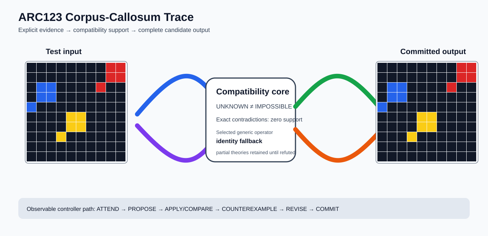

# ARC1 `1caeab9d` P0008 Brain Surgery Report

## Outcome: NO — TEST CELLS DO NOT ALL MATCH

- **Compared positions:** 100
- **Mismatched cells:** 20
- **Training compatibility:** `False`
- **Fallback used:** `True`
- **Selected hypothesis:** `fallback_identity_complete_grid`
- **Source commit:** `085f6dbe39050afac3d1d743f840bac95b1a8d1c`
- **Frozen controller commit:** `4bed6c917523bc2baa05eec69f67303805d88dae`

## Live-Agent Boundary

The controller receives only visible training input/output examples and test inputs. It receives no task ID, imported cohort label, GT feature record, GT solver, historical decomposition, or held-out output before committing a complete grid. The expected output appears only in the post-answer V&V section.

## Corpus-Callosum Visualization



- Full explicit event record: [`learning_trace.json`](learning_trace.json)

## Frozen Measurement

This task was evaluated with the controller and operator configuration pinned before the frozen cohort was run. A result in this packet cannot alter that controller configuration.

## Post-Answer V&V

### Test case 1
- **All cells match:** `False`
- **Mismatched cells:** `20`
- **Prediction:
```json
[[0, 0, 0, 0, 0, 0, 0, 0, 2, 2], [0, 0, 0, 0, 0, 0, 0, 0, 2, 2], [0, 1, 1, 0, 0, 0, 0, 2, 0, 0], [0, 1, 1, 0, 0, 0, 0, 0, 0, 0], [1, 0, 0, 0, 0, 0, 0, 0, 0, 0], [0, 0, 0, 0, 4, 4, 0, 0, 0, 0], [0, 0, 0, 0, 4, 4, 0, 0, 0, 0], [0, 0, 0, 4, 0, 0, 0, 0, 0, 0], [0, 0, 0, 0, 0, 0, 0, 0, 0, 0], [0, 0, 0, 0, 0, 0, 0, 0, 0, 0]]
```
- **Expected output (post-answer only):**
```json
[[0, 0, 0, 0, 0, 0, 0, 0, 0, 0], [0, 0, 0, 0, 0, 0, 0, 0, 0, 0], [0, 1, 1, 0, 4, 4, 0, 0, 2, 2], [0, 1, 1, 0, 4, 4, 0, 0, 2, 2], [1, 0, 0, 4, 0, 0, 0, 2, 0, 0], [0, 0, 0, 0, 0, 0, 0, 0, 0, 0], [0, 0, 0, 0, 0, 0, 0, 0, 0, 0], [0, 0, 0, 0, 0, 0, 0, 0, 0, 0], [0, 0, 0, 0, 0, 0, 0, 0, 0, 0], [0, 0, 0, 0, 0, 0, 0, 0, 0, 0]]
```

## Observable IHL Walkthrough

The record contains explicit actions, predictions, feedback, and revisions; it does not claim or store hidden model reasoning.

### Action totals

- `ADD_CONDITION`: 1
- `APPLY_HYPOTHESIS`: 247
- `ATTEND`: 247
- `BIND_PARAMETER`: 1
- `CHOOSE_NEXT_DEMO`: 247
- `COMMIT`: 1
- `COMPARE`: 247
- `COMPOSE_RULE`: 4
- `EXPLAIN_RESIDUAL`: 4
- `FIND_COUNTEREXAMPLE`: 9
- `PROPOSE`: 1
- `SPECIALIZE`: 101

### Decision milestones

- `0` `PROPOSE` — `{"parent_theory_id":"T0000","rule":{"description_length":1,"name":"identity","operation":"identity","parameters":{},"rule_id":"identity","scope":{"kind":"all","value":null}},"stage":"initial_generic_theories","theory_id":"T0001"}`
- `2` `ATTEND` — `{"reason":"initial_highest_observed_change_and_color_discrimination","selected_demo":1,"selected_region":{"column":7,"row":0},"theory_id":"T0001"}`
- `6` `ATTEND` — `{"reason":"counterexample_requires_visible_conditional_evidence:unseen_demo_selected_for_residual_version_space_discrimination","selected_demo":0,"selected_region":{"column":1,"row":0},"theory_id":"T0001"}`
- `10` `ATTEND` — `{"reason":"counterexample_requires_visible_conditional_evidence:unseen_demo_selected_for_residual_version_space_discrimination","selected_demo":2,"selected_region":{"column":3,"row":1},"theory_id":"T0001"}`
- `16` `SPECIALIZE` — `{"added_rule":{"description_length":4,"name":"row_span_fill(fill_color=4,seed_color=4)","operation":"full_operator","parameters":{"fill_color":4,"operator":"row_span_fill","seed_color":4},"rule_id":"structural-row_span_fill","scope":{"kind":"all","value":null}},"parent_theory_id":"T0001","reason":"unexplained_residual_proposed_generic_structural_rule","theory_id":"T0003"}`
- `17` `SPECIALIZE` — `{"added_rule":{"description_length":4,"name":"row_span_fill(fill_color=4,seed_color=2)","operation":"full_operator","parameters":{"fill_color":4,"operator":"row_span_fill","seed_color":2},"rule_id":"structural-row_span_fill","scope":{"kind":"all","value":null}},"parent_theory_id":"T0001","reason":"unexplained_residual_proposed_generic_structural_rule","theory_id":"T0004"}`
- `18` `SPECIALIZE` — `{"added_rule":{"description_length":4,"name":"row_span_fill(fill_color=4,seed_color=1)","operation":"full_operator","parameters":{"fill_color":4,"operator":"row_span_fill","seed_color":1},"rule_id":"structural-row_span_fill","scope":{"kind":"all","value":null}},"parent_theory_id":"T0001","reason":"unexplained_residual_proposed_generic_structural_rule","theory_id":"T0005"}`
- `19` `SPECIALIZE` — `{"added_rule":{"description_length":4,"name":"row_span_fill(fill_color=2,seed_color=4)","operation":"full_operator","parameters":{"fill_color":2,"operator":"row_span_fill","seed_color":4},"rule_id":"structural-row_span_fill","scope":{"kind":"all","value":null}},"parent_theory_id":"T0001","reason":"unexplained_residual_proposed_generic_structural_rule","theory_id":"T0006"}`
- `20` `SPECIALIZE` — `{"added_rule":{"description_length":4,"name":"row_span_fill(fill_color=2,seed_color=2)","operation":"full_operator","parameters":{"fill_color":2,"operator":"row_span_fill","seed_color":2},"rule_id":"structural-row_span_fill","scope":{"kind":"all","value":null}},"parent_theory_id":"T0001","reason":"unexplained_residual_proposed_generic_structural_rule","theory_id":"T0007"}`
- `21` `SPECIALIZE` — `{"added_rule":{"description_length":4,"name":"row_span_fill(fill_color=2,seed_color=1)","operation":"full_operator","parameters":{"fill_color":2,"operator":"row_span_fill","seed_color":1},"rule_id":"structural-row_span_fill","scope":{"kind":"all","value":null}},"parent_theory_id":"T0001","reason":"unexplained_residual_proposed_generic_structural_rule","theory_id":"T0008"}`
- `22` `SPECIALIZE` — `{"added_rule":{"description_length":4,"name":"row_span_fill(fill_color=1,seed_color=4)","operation":"full_operator","parameters":{"fill_color":1,"operator":"row_span_fill","seed_color":4},"rule_id":"structural-row_span_fill","scope":{"kind":"all","value":null}},"parent_theory_id":"T0001","reason":"unexplained_residual_proposed_generic_structural_rule","theory_id":"T0009"}`
- `23` `SPECIALIZE` — `{"added_rule":{"description_length":4,"name":"row_span_fill(fill_color=1,seed_color=2)","operation":"full_operator","parameters":{"fill_color":1,"operator":"row_span_fill","seed_color":2},"rule_id":"structural-row_span_fill","scope":{"kind":"all","value":null}},"parent_theory_id":"T0001","reason":"unexplained_residual_proposed_generic_structural_rule","theory_id":"T0010"}`
- `24` `SPECIALIZE` — `{"added_rule":{"description_length":4,"name":"row_span_fill(fill_color=1,seed_color=1)","operation":"full_operator","parameters":{"fill_color":1,"operator":"row_span_fill","seed_color":1},"rule_id":"structural-row_span_fill","scope":{"kind":"all","value":null}},"parent_theory_id":"T0001","reason":"unexplained_residual_proposed_generic_structural_rule","theory_id":"T0011"}`
- `25` `SPECIALIZE` — `{"added_rule":{"description_length":4,"name":"line_extend(direction=up,fill_color=4,seed_color=4)","operation":"full_operator","parameters":{"direction":"up","fill_color":4,"operator":"line_extend","seed_color":4},"rule_id":"structural-line_extend","scope":{"kind":"all","value":null}},"parent_theory_id":"T0001","reason":"unexplained_residual_proposed_generic_structural_rule","theory_id":"T0012"}`
- `26` `SPECIALIZE` — `{"added_rule":{"description_length":4,"name":"line_extend(direction=left,fill_color=2,seed_color=1)","operation":"full_operator","parameters":{"direction":"left","fill_color":2,"operator":"line_extend","seed_color":1},"rule_id":"structural-line_extend","scope":{"kind":"all","value":null}},"parent_theory_id":"T0001","reason":"unexplained_residual_proposed_generic_structural_rule","theory_id":"T0013"}`
- `27` `SPECIALIZE` — `{"added_rule":{"description_length":4,"name":"line_extend(direction=up,fill_color=2,seed_color=4)","operation":"full_operator","parameters":{"direction":"up","fill_color":2,"operator":"line_extend","seed_color":4},"rule_id":"structural-line_extend","scope":{"kind":"all","value":null}},"parent_theory_id":"T0001","reason":"unexplained_residual_proposed_generic_structural_rule","theory_id":"T0014"}`
- `29` `ATTEND` — `{"reason":"initial_highest_observed_change_and_color_discrimination","selected_demo":1,"selected_region":{"column":7,"row":0},"theory_id":"T0002"}`
- `33` `ATTEND` — `{"reason":"initial_highest_observed_change_and_color_discrimination","selected_demo":1,"selected_region":{"column":7,"row":0},"theory_id":"T0003"}`
- `37` `ATTEND` — `{"reason":"initial_highest_observed_change_and_color_discrimination","selected_demo":1,"selected_region":{"column":7,"row":0},"theory_id":"T0004"}`
- `41` `ATTEND` — `{"reason":"initial_highest_observed_change_and_color_discrimination","selected_demo":1,"selected_region":{"column":7,"row":0},"theory_id":"T0005"}`
- `45` `ATTEND` — `{"reason":"initial_highest_observed_change_and_color_discrimination","selected_demo":1,"selected_region":{"column":7,"row":0},"theory_id":"T0006"}`
- `49` `ATTEND` — `{"reason":"initial_highest_observed_change_and_color_discrimination","selected_demo":1,"selected_region":{"column":7,"row":0},"theory_id":"T0007"}`
- `53` `ATTEND` — `{"reason":"initial_highest_observed_change_and_color_discrimination","selected_demo":1,"selected_region":{"column":7,"row":0},"theory_id":"T0008"}`
- `57` `ATTEND` — `{"reason":"initial_highest_observed_change_and_color_discrimination","selected_demo":1,"selected_region":{"column":7,"row":0},"theory_id":"T0009"}`
- `61` `ATTEND` — `{"reason":"initial_highest_observed_change_and_color_discrimination","selected_demo":1,"selected_region":{"column":7,"row":0},"theory_id":"T0010"}`
- `65` `ATTEND` — `{"reason":"initial_highest_observed_change_and_color_discrimination","selected_demo":1,"selected_region":{"column":7,"row":0},"theory_id":"T0011"}`
- `69` `ATTEND` — `{"reason":"initial_highest_observed_change_and_color_discrimination","selected_demo":1,"selected_region":{"column":7,"row":0},"theory_id":"T0012"}`
- `73` `ATTEND` — `{"reason":"initial_highest_observed_change_and_color_discrimination","selected_demo":1,"selected_region":{"column":7,"row":0},"theory_id":"T0013"}`
- `77` `ATTEND` — `{"reason":"counterexample_requires_visible_conditional_evidence:unseen_demo_selected_for_residual_version_space_discrimination","selected_demo":0,"selected_region":{"column":1,"row":1},"theory_id":"T0002"}`
- `81` `ATTEND` — `{"reason":"counterexample_requires_visible_conditional_evidence:unseen_demo_selected_for_residual_version_space_discrimination","selected_demo":0,"selected_region":{"column":1,"row":0},"theory_id":"T0013"}`
- `85` `ATTEND` — `{"reason":"counterexample_requires_visible_conditional_evidence:unseen_demo_selected_for_residual_version_space_discrimination","selected_demo":0,"selected_region":{"column":1,"row":0},"theory_id":"T0003"}`
- `89` `ATTEND` — `{"reason":"counterexample_requires_visible_conditional_evidence:unseen_demo_selected_for_residual_version_space_discrimination","selected_demo":0,"selected_region":{"column":1,"row":0},"theory_id":"T0004"}`
- `93` `ATTEND` — `{"reason":"counterexample_requires_visible_conditional_evidence:unseen_demo_selected_for_residual_version_space_discrimination","selected_demo":0,"selected_region":{"column":1,"row":0},"theory_id":"T0005"}`
- `97` `ATTEND` — `{"reason":"counterexample_requires_visible_conditional_evidence:unseen_demo_selected_for_residual_version_space_discrimination","selected_demo":0,"selected_region":{"column":1,"row":0},"theory_id":"T0006"}`
- `101` `ATTEND` — `{"reason":"counterexample_requires_visible_conditional_evidence:unseen_demo_selected_for_residual_version_space_discrimination","selected_demo":0,"selected_region":{"column":1,"row":0},"theory_id":"T0007"}`
- `105` `ATTEND` — `{"reason":"counterexample_requires_visible_conditional_evidence:unseen_demo_selected_for_residual_version_space_discrimination","selected_demo":0,"selected_region":{"column":1,"row":0},"theory_id":"T0008"}`
- `109` `ATTEND` — `{"reason":"counterexample_requires_visible_conditional_evidence:unseen_demo_selected_for_residual_version_space_discrimination","selected_demo":0,"selected_region":{"column":1,"row":0},"theory_id":"T0009"}`
- `113` `ATTEND` — `{"reason":"counterexample_requires_visible_conditional_evidence:unseen_demo_selected_for_residual_version_space_discrimination","selected_demo":0,"selected_region":{"column":1,"row":0},"theory_id":"T0010"}`
- `117` `ATTEND` — `{"reason":"counterexample_requires_visible_conditional_evidence:unseen_demo_selected_for_residual_version_space_discrimination","selected_demo":0,"selected_region":{"column":1,"row":0},"theory_id":"T0011"}`
- `121` `ATTEND` — `{"reason":"counterexample_requires_visible_conditional_evidence:unseen_demo_selected_for_residual_version_space_discrimination","selected_demo":0,"selected_region":{"column":1,"row":0},"theory_id":"T0012"}`
- `125` `ATTEND` — `{"reason":"counterexample_requires_visible_conditional_evidence:unseen_demo_selected_for_residual_version_space_discrimination","selected_demo":2,"selected_region":{"column":3,"row":2},"theory_id":"T0002"}`
- `129` `SPECIALIZE` — `{"added_rule":{"description_length":4,"name":"row_span_fill(fill_color=4,seed_color=4)","operation":"full_operator","parameters":{"fill_color":4,"operator":"row_span_fill","seed_color":4},"rule_id":"structural-row_span_fill","scope":{"kind":"all","value":null}},"parent_theory_id":"T0002","reason":"unexplained_residual_proposed_generic_structural_rule","theory_id":"T0015"}`
- `130` `SPECIALIZE` — `{"added_rule":{"description_length":4,"name":"row_span_fill(fill_color=4,seed_color=2)","operation":"full_operator","parameters":{"fill_color":4,"operator":"row_span_fill","seed_color":2},"rule_id":"structural-row_span_fill","scope":{"kind":"all","value":null}},"parent_theory_id":"T0002","reason":"unexplained_residual_proposed_generic_structural_rule","theory_id":"T0016"}`
- `131` `SPECIALIZE` — `{"added_rule":{"description_length":4,"name":"row_span_fill(fill_color=4,seed_color=1)","operation":"full_operator","parameters":{"fill_color":4,"operator":"row_span_fill","seed_color":1},"rule_id":"structural-row_span_fill","scope":{"kind":"all","value":null}},"parent_theory_id":"T0002","reason":"unexplained_residual_proposed_generic_structural_rule","theory_id":"T0017"}`
- `132` `SPECIALIZE` — `{"added_rule":{"description_length":4,"name":"row_span_fill(fill_color=2,seed_color=4)","operation":"full_operator","parameters":{"fill_color":2,"operator":"row_span_fill","seed_color":4},"rule_id":"structural-row_span_fill","scope":{"kind":"all","value":null}},"parent_theory_id":"T0002","reason":"unexplained_residual_proposed_generic_structural_rule","theory_id":"T0018"}`
- `133` `SPECIALIZE` — `{"added_rule":{"description_length":4,"name":"row_span_fill(fill_color=2,seed_color=2)","operation":"full_operator","parameters":{"fill_color":2,"operator":"row_span_fill","seed_color":2},"rule_id":"structural-row_span_fill","scope":{"kind":"all","value":null}},"parent_theory_id":"T0002","reason":"unexplained_residual_proposed_generic_structural_rule","theory_id":"T0019"}`
- `134` `SPECIALIZE` — `{"added_rule":{"description_length":4,"name":"row_span_fill(fill_color=2,seed_color=1)","operation":"full_operator","parameters":{"fill_color":2,"operator":"row_span_fill","seed_color":1},"rule_id":"structural-row_span_fill","scope":{"kind":"all","value":null}},"parent_theory_id":"T0002","reason":"unexplained_residual_proposed_generic_structural_rule","theory_id":"T0020"}`
- `135` `SPECIALIZE` — `{"added_rule":{"description_length":4,"name":"row_span_fill(fill_color=1,seed_color=4)","operation":"full_operator","parameters":{"fill_color":1,"operator":"row_span_fill","seed_color":4},"rule_id":"structural-row_span_fill","scope":{"kind":"all","value":null}},"parent_theory_id":"T0002","reason":"unexplained_residual_proposed_generic_structural_rule","theory_id":"T0021"}`
- `136` `SPECIALIZE` — `{"added_rule":{"description_length":4,"name":"row_span_fill(fill_color=1,seed_color=2)","operation":"full_operator","parameters":{"fill_color":1,"operator":"row_span_fill","seed_color":2},"rule_id":"structural-row_span_fill","scope":{"kind":"all","value":null}},"parent_theory_id":"T0002","reason":"unexplained_residual_proposed_generic_structural_rule","theory_id":"T0022"}`
- `137` `SPECIALIZE` — `{"added_rule":{"description_length":4,"name":"row_span_fill(fill_color=1,seed_color=1)","operation":"full_operator","parameters":{"fill_color":1,"operator":"row_span_fill","seed_color":1},"rule_id":"structural-row_span_fill","scope":{"kind":"all","value":null}},"parent_theory_id":"T0002","reason":"unexplained_residual_proposed_generic_structural_rule","theory_id":"T0023"}`
- `138` `SPECIALIZE` — `{"added_rule":{"description_length":4,"name":"line_extend(direction=up,fill_color=4,seed_color=4)","operation":"full_operator","parameters":{"direction":"up","fill_color":4,"operator":"line_extend","seed_color":4},"rule_id":"structural-line_extend","scope":{"kind":"all","value":null}},"parent_theory_id":"T0002","reason":"unexplained_residual_proposed_generic_structural_rule","theory_id":"T0024"}`
- `139` `SPECIALIZE` — `{"added_rule":{"description_length":4,"name":"line_extend(direction=left,fill_color=2,seed_color=1)","operation":"full_operator","parameters":{"direction":"left","fill_color":2,"operator":"line_extend","seed_color":1},"rule_id":"structural-line_extend","scope":{"kind":"all","value":null}},"parent_theory_id":"T0002","reason":"unexplained_residual_proposed_generic_structural_rule","theory_id":"T0025"}`
- `140` `SPECIALIZE` — `{"added_rule":{"description_length":4,"name":"line_extend(direction=up,fill_color=2,seed_color=4)","operation":"full_operator","parameters":{"direction":"up","fill_color":2,"operator":"line_extend","seed_color":4},"rule_id":"structural-line_extend","scope":{"kind":"all","value":null}},"parent_theory_id":"T0002","reason":"unexplained_residual_proposed_generic_structural_rule","theory_id":"T0026"}`
- `142` `ATTEND` — `{"reason":"initial_highest_observed_change_and_color_discrimination","selected_demo":1,"selected_region":{"column":7,"row":0},"theory_id":"T0015"}`
- `146` `ATTEND` — `{"reason":"initial_highest_observed_change_and_color_discrimination","selected_demo":1,"selected_region":{"column":7,"row":0},"theory_id":"T0016"}`
- `150` `ATTEND` — `{"reason":"initial_highest_observed_change_and_color_discrimination","selected_demo":1,"selected_region":{"column":7,"row":0},"theory_id":"T0017"}`
- `154` `ATTEND` — `{"reason":"initial_highest_observed_change_and_color_discrimination","selected_demo":1,"selected_region":{"column":7,"row":0},"theory_id":"T0018"}`
- `158` `ATTEND` — `{"reason":"initial_highest_observed_change_and_color_discrimination","selected_demo":1,"selected_region":{"column":7,"row":0},"theory_id":"T0019"}`
- `162` `ATTEND` — `{"reason":"initial_highest_observed_change_and_color_discrimination","selected_demo":1,"selected_region":{"column":7,"row":0},"theory_id":"T0020"}`
- `166` `ATTEND` — `{"reason":"initial_highest_observed_change_and_color_discrimination","selected_demo":1,"selected_region":{"column":7,"row":0},"theory_id":"T0021"}`
- `170` `ATTEND` — `{"reason":"initial_highest_observed_change_and_color_discrimination","selected_demo":1,"selected_region":{"column":7,"row":0},"theory_id":"T0022"}`
- `174` `ATTEND` — `{"reason":"initial_highest_observed_change_and_color_discrimination","selected_demo":1,"selected_region":{"column":7,"row":0},"theory_id":"T0023"}`
- `178` `ATTEND` — `{"reason":"initial_highest_observed_change_and_color_discrimination","selected_demo":1,"selected_region":{"column":7,"row":0},"theory_id":"T0024"}`
- `182` `ATTEND` — `{"reason":"initial_highest_observed_change_and_color_discrimination","selected_demo":1,"selected_region":{"column":7,"row":0},"theory_id":"T0025"}`
- `186` `ATTEND` — `{"reason":"initial_highest_observed_change_and_color_discrimination","selected_demo":1,"selected_region":{"column":7,"row":0},"theory_id":"T0026"}`
- `190` `ATTEND` — `{"reason":"counterexample_requires_visible_conditional_evidence:unseen_demo_selected_for_residual_version_space_discrimination","selected_demo":0,"selected_region":{"column":1,"row":0},"theory_id":"T0025"}`
- `194` `ATTEND` — `{"reason":"counterexample_requires_visible_conditional_evidence:unseen_demo_selected_for_residual_version_space_discrimination","selected_demo":0,"selected_region":{"column":1,"row":0},"theory_id":"T0015"}`
- `198` `ATTEND` — `{"reason":"counterexample_requires_visible_conditional_evidence:unseen_demo_selected_for_residual_version_space_discrimination","selected_demo":0,"selected_region":{"column":1,"row":0},"theory_id":"T0016"}`
- `202` `ATTEND` — `{"reason":"counterexample_requires_visible_conditional_evidence:unseen_demo_selected_for_residual_version_space_discrimination","selected_demo":0,"selected_region":{"column":1,"row":0},"theory_id":"T0017"}`
- `206` `ATTEND` — `{"reason":"counterexample_requires_visible_conditional_evidence:unseen_demo_selected_for_residual_version_space_discrimination","selected_demo":0,"selected_region":{"column":1,"row":0},"theory_id":"T0018"}`
- `210` `ATTEND` — `{"reason":"counterexample_requires_visible_conditional_evidence:unseen_demo_selected_for_residual_version_space_discrimination","selected_demo":0,"selected_region":{"column":1,"row":0},"theory_id":"T0019"}`
- `214` `ATTEND` — `{"reason":"counterexample_requires_visible_conditional_evidence:unseen_demo_selected_for_residual_version_space_discrimination","selected_demo":0,"selected_region":{"column":1,"row":0},"theory_id":"T0020"}`
- `218` `ATTEND` — `{"reason":"counterexample_requires_visible_conditional_evidence:unseen_demo_selected_for_residual_version_space_discrimination","selected_demo":0,"selected_region":{"column":1,"row":0},"theory_id":"T0021"}`
- `222` `ATTEND` — `{"reason":"counterexample_requires_visible_conditional_evidence:unseen_demo_selected_for_residual_version_space_discrimination","selected_demo":0,"selected_region":{"column":1,"row":0},"theory_id":"T0022"}`
- `226` `ATTEND` — `{"reason":"counterexample_requires_visible_conditional_evidence:unseen_demo_selected_for_residual_version_space_discrimination","selected_demo":0,"selected_region":{"column":1,"row":0},"theory_id":"T0023"}`
- `230` `ATTEND` — `{"reason":"counterexample_requires_visible_conditional_evidence:unseen_demo_selected_for_residual_version_space_discrimination","selected_demo":0,"selected_region":{"column":1,"row":0},"theory_id":"T0024"}`
- `234` `ATTEND` — `{"reason":"counterexample_requires_visible_conditional_evidence:unseen_demo_selected_for_residual_version_space_discrimination","selected_demo":0,"selected_region":{"column":1,"row":0},"theory_id":"T0026"}`
- `238` `ATTEND` — `{"reason":"counterexample_requires_visible_conditional_evidence:unseen_demo_selected_for_residual_version_space_discrimination","selected_demo":2,"selected_region":{"column":3,"row":1},"theory_id":"T0015"}`
- `242` `ATTEND` — `{"reason":"counterexample_requires_visible_conditional_evidence:unseen_demo_selected_for_residual_version_space_discrimination","selected_demo":2,"selected_region":{"column":3,"row":1},"theory_id":"T0016"}`
- `246` `ATTEND` — `{"reason":"counterexample_requires_visible_conditional_evidence:unseen_demo_selected_for_residual_version_space_discrimination","selected_demo":2,"selected_region":{"column":3,"row":1},"theory_id":"T0017"}`
- `250` `ATTEND` — `{"reason":"counterexample_requires_visible_conditional_evidence:unseen_demo_selected_for_residual_version_space_discrimination","selected_demo":2,"selected_region":{"column":3,"row":1},"theory_id":"T0018"}`
- `254` `ATTEND` — `{"reason":"counterexample_requires_visible_conditional_evidence:unseen_demo_selected_for_residual_version_space_discrimination","selected_demo":2,"selected_region":{"column":3,"row":1},"theory_id":"T0019"}`
- `258` `ATTEND` — `{"reason":"counterexample_requires_visible_conditional_evidence:unseen_demo_selected_for_residual_version_space_discrimination","selected_demo":2,"selected_region":{"column":3,"row":1},"theory_id":"T0020"}`
- `262` `ATTEND` — `{"reason":"counterexample_requires_visible_conditional_evidence:unseen_demo_selected_for_residual_version_space_discrimination","selected_demo":2,"selected_region":{"column":3,"row":1},"theory_id":"T0021"}`
- `266` `ATTEND` — `{"reason":"counterexample_requires_visible_conditional_evidence:unseen_demo_selected_for_residual_version_space_discrimination","selected_demo":2,"selected_region":{"column":3,"row":1},"theory_id":"T0022"}`
- `270` `ATTEND` — `{"reason":"counterexample_requires_visible_conditional_evidence:unseen_demo_selected_for_residual_version_space_discrimination","selected_demo":2,"selected_region":{"column":3,"row":1},"theory_id":"T0023"}`
- `274` `ATTEND` — `{"reason":"counterexample_requires_visible_conditional_evidence:unseen_demo_selected_for_residual_version_space_discrimination","selected_demo":2,"selected_region":{"column":6,"row":0},"theory_id":"T0024"}`
- `278` `ATTEND` — `{"reason":"counterexample_requires_visible_conditional_evidence:unseen_demo_selected_for_residual_version_space_discrimination","selected_demo":2,"selected_region":{"column":3,"row":1},"theory_id":"T0025"}`
- `282` `ATTEND` — `{"reason":"counterexample_requires_visible_conditional_evidence:unseen_demo_selected_for_residual_version_space_discrimination","selected_demo":2,"selected_region":{"column":6,"row":0},"theory_id":"T0026"}`
- `288` `SPECIALIZE` — `{"added_rule":{"description_length":4,"name":"row_span_fill(fill_color=4,seed_color=2)","operation":"full_operator","parameters":{"fill_color":4,"operator":"row_span_fill","seed_color":2},"rule_id":"structural-row_span_fill","scope":{"kind":"all","value":null}},"parent_theory_id":"T0015","reason":"unexplained_residual_proposed_generic_structural_rule","theory_id":"T0028"}`
- `289` `SPECIALIZE` — `{"added_rule":{"description_length":4,"name":"row_span_fill(fill_color=4,seed_color=1)","operation":"full_operator","parameters":{"fill_color":4,"operator":"row_span_fill","seed_color":1},"rule_id":"structural-row_span_fill","scope":{"kind":"all","value":null}},"parent_theory_id":"T0015","reason":"unexplained_residual_proposed_generic_structural_rule","theory_id":"T0029"}`
- `290` `SPECIALIZE` — `{"added_rule":{"description_length":4,"name":"row_span_fill(fill_color=2,seed_color=4)","operation":"full_operator","parameters":{"fill_color":2,"operator":"row_span_fill","seed_color":4},"rule_id":"structural-row_span_fill","scope":{"kind":"all","value":null}},"parent_theory_id":"T0015","reason":"unexplained_residual_proposed_generic_structural_rule","theory_id":"T0030"}`
- `291` `SPECIALIZE` — `{"added_rule":{"description_length":4,"name":"row_span_fill(fill_color=2,seed_color=2)","operation":"full_operator","parameters":{"fill_color":2,"operator":"row_span_fill","seed_color":2},"rule_id":"structural-row_span_fill","scope":{"kind":"all","value":null}},"parent_theory_id":"T0015","reason":"unexplained_residual_proposed_generic_structural_rule","theory_id":"T0031"}`
- `292` `SPECIALIZE` — `{"added_rule":{"description_length":4,"name":"row_span_fill(fill_color=2,seed_color=1)","operation":"full_operator","parameters":{"fill_color":2,"operator":"row_span_fill","seed_color":1},"rule_id":"structural-row_span_fill","scope":{"kind":"all","value":null}},"parent_theory_id":"T0015","reason":"unexplained_residual_proposed_generic_structural_rule","theory_id":"T0032"}`
- `293` `SPECIALIZE` — `{"added_rule":{"description_length":4,"name":"row_span_fill(fill_color=1,seed_color=4)","operation":"full_operator","parameters":{"fill_color":1,"operator":"row_span_fill","seed_color":4},"rule_id":"structural-row_span_fill","scope":{"kind":"all","value":null}},"parent_theory_id":"T0015","reason":"unexplained_residual_proposed_generic_structural_rule","theory_id":"T0033"}`
- `294` `SPECIALIZE` — `{"added_rule":{"description_length":4,"name":"row_span_fill(fill_color=1,seed_color=2)","operation":"full_operator","parameters":{"fill_color":1,"operator":"row_span_fill","seed_color":2},"rule_id":"structural-row_span_fill","scope":{"kind":"all","value":null}},"parent_theory_id":"T0015","reason":"unexplained_residual_proposed_generic_structural_rule","theory_id":"T0034"}`
- `295` `SPECIALIZE` — `{"added_rule":{"description_length":4,"name":"row_span_fill(fill_color=1,seed_color=1)","operation":"full_operator","parameters":{"fill_color":1,"operator":"row_span_fill","seed_color":1},"rule_id":"structural-row_span_fill","scope":{"kind":"all","value":null}},"parent_theory_id":"T0015","reason":"unexplained_residual_proposed_generic_structural_rule","theory_id":"T0035"}`
- `296` `SPECIALIZE` — `{"added_rule":{"description_length":4,"name":"line_extend(direction=up,fill_color=4,seed_color=4)","operation":"full_operator","parameters":{"direction":"up","fill_color":4,"operator":"line_extend","seed_color":4},"rule_id":"structural-line_extend","scope":{"kind":"all","value":null}},"parent_theory_id":"T0015","reason":"unexplained_residual_proposed_generic_structural_rule","theory_id":"T0036"}`
- `297` `SPECIALIZE` — `{"added_rule":{"description_length":4,"name":"line_extend(direction=left,fill_color=2,seed_color=1)","operation":"full_operator","parameters":{"direction":"left","fill_color":2,"operator":"line_extend","seed_color":1},"rule_id":"structural-line_extend","scope":{"kind":"all","value":null}},"parent_theory_id":"T0015","reason":"unexplained_residual_proposed_generic_structural_rule","theory_id":"T0037"}`
- `298` `SPECIALIZE` — `{"added_rule":{"description_length":4,"name":"line_extend(direction=up,fill_color=2,seed_color=4)","operation":"full_operator","parameters":{"direction":"up","fill_color":2,"operator":"line_extend","seed_color":4},"rule_id":"structural-line_extend","scope":{"kind":"all","value":null}},"parent_theory_id":"T0015","reason":"unexplained_residual_proposed_generic_structural_rule","theory_id":"T0038"}`
- `300` `ATTEND` — `{"reason":"initial_highest_observed_change_and_color_discrimination","selected_demo":1,"selected_region":{"column":7,"row":0},"theory_id":"T0027"}`
- `304` `ATTEND` — `{"reason":"initial_highest_observed_change_and_color_discrimination","selected_demo":1,"selected_region":{"column":7,"row":0},"theory_id":"T0028"}`
- `308` `ATTEND` — `{"reason":"initial_highest_observed_change_and_color_discrimination","selected_demo":1,"selected_region":{"column":7,"row":0},"theory_id":"T0029"}`
- `312` `ATTEND` — `{"reason":"initial_highest_observed_change_and_color_discrimination","selected_demo":1,"selected_region":{"column":7,"row":0},"theory_id":"T0030"}`
- `316` `ATTEND` — `{"reason":"initial_highest_observed_change_and_color_discrimination","selected_demo":1,"selected_region":{"column":7,"row":0},"theory_id":"T0031"}`
- `320` `ATTEND` — `{"reason":"initial_highest_observed_change_and_color_discrimination","selected_demo":1,"selected_region":{"column":7,"row":0},"theory_id":"T0032"}`
- `324` `ATTEND` — `{"reason":"initial_highest_observed_change_and_color_discrimination","selected_demo":1,"selected_region":{"column":7,"row":0},"theory_id":"T0033"}`
- `328` `ATTEND` — `{"reason":"initial_highest_observed_change_and_color_discrimination","selected_demo":1,"selected_region":{"column":7,"row":0},"theory_id":"T0034"}`
- `332` `ATTEND` — `{"reason":"initial_highest_observed_change_and_color_discrimination","selected_demo":1,"selected_region":{"column":7,"row":0},"theory_id":"T0035"}`
- `336` `ATTEND` — `{"reason":"initial_highest_observed_change_and_color_discrimination","selected_demo":1,"selected_region":{"column":7,"row":0},"theory_id":"T0036"}`
- `340` `ATTEND` — `{"reason":"initial_highest_observed_change_and_color_discrimination","selected_demo":1,"selected_region":{"column":7,"row":0},"theory_id":"T0037"}`
- `344` `ATTEND` — `{"reason":"initial_highest_observed_change_and_color_discrimination","selected_demo":1,"selected_region":{"column":7,"row":0},"theory_id":"T0038"}`
- `348` `ATTEND` — `{"reason":"counterexample_requires_visible_conditional_evidence:unseen_demo_selected_for_residual_version_space_discrimination","selected_demo":0,"selected_region":{"column":1,"row":0},"theory_id":"T0037"}`
- `352` `ATTEND` — `{"reason":"counterexample_requires_visible_conditional_evidence:unseen_demo_selected_for_residual_version_space_discrimination","selected_demo":0,"selected_region":{"column":1,"row":0},"theory_id":"T0027"}`
- `356` `ATTEND` — `{"reason":"counterexample_requires_visible_conditional_evidence:unseen_demo_selected_for_residual_version_space_discrimination","selected_demo":0,"selected_region":{"column":1,"row":0},"theory_id":"T0028"}`
- `360` `ATTEND` — `{"reason":"counterexample_requires_visible_conditional_evidence:unseen_demo_selected_for_residual_version_space_discrimination","selected_demo":0,"selected_region":{"column":1,"row":0},"theory_id":"T0029"}`
- `364` `ATTEND` — `{"reason":"counterexample_requires_visible_conditional_evidence:unseen_demo_selected_for_residual_version_space_discrimination","selected_demo":0,"selected_region":{"column":1,"row":0},"theory_id":"T0030"}`
- `368` `ATTEND` — `{"reason":"counterexample_requires_visible_conditional_evidence:unseen_demo_selected_for_residual_version_space_discrimination","selected_demo":0,"selected_region":{"column":1,"row":0},"theory_id":"T0031"}`
- `372` `ATTEND` — `{"reason":"counterexample_requires_visible_conditional_evidence:unseen_demo_selected_for_residual_version_space_discrimination","selected_demo":0,"selected_region":{"column":1,"row":0},"theory_id":"T0032"}`
- `376` `ATTEND` — `{"reason":"counterexample_requires_visible_conditional_evidence:unseen_demo_selected_for_residual_version_space_discrimination","selected_demo":0,"selected_region":{"column":1,"row":0},"theory_id":"T0033"}`
- `380` `ATTEND` — `{"reason":"counterexample_requires_visible_conditional_evidence:unseen_demo_selected_for_residual_version_space_discrimination","selected_demo":0,"selected_region":{"column":1,"row":0},"theory_id":"T0034"}`
- `384` `ATTEND` — `{"reason":"counterexample_requires_visible_conditional_evidence:unseen_demo_selected_for_residual_version_space_discrimination","selected_demo":0,"selected_region":{"column":1,"row":0},"theory_id":"T0035"}`
- `388` `ATTEND` — `{"reason":"counterexample_requires_visible_conditional_evidence:unseen_demo_selected_for_residual_version_space_discrimination","selected_demo":0,"selected_region":{"column":1,"row":0},"theory_id":"T0036"}`
- `392` `ATTEND` — `{"reason":"counterexample_requires_visible_conditional_evidence:unseen_demo_selected_for_residual_version_space_discrimination","selected_demo":0,"selected_region":{"column":1,"row":0},"theory_id":"T0038"}`
- `396` `ATTEND` — `{"reason":"counterexample_requires_visible_conditional_evidence:unseen_demo_selected_for_residual_version_space_discrimination","selected_demo":2,"selected_region":{"column":3,"row":1},"theory_id":"T0027"}`
- `400` `ATTEND` — `{"reason":"counterexample_requires_visible_conditional_evidence:unseen_demo_selected_for_residual_version_space_discrimination","selected_demo":2,"selected_region":{"column":3,"row":1},"theory_id":"T0028"}`
- `404` `ATTEND` — `{"reason":"counterexample_requires_visible_conditional_evidence:unseen_demo_selected_for_residual_version_space_discrimination","selected_demo":2,"selected_region":{"column":3,"row":1},"theory_id":"T0029"}`
- `408` `ATTEND` — `{"reason":"counterexample_requires_visible_conditional_evidence:unseen_demo_selected_for_residual_version_space_discrimination","selected_demo":2,"selected_region":{"column":3,"row":1},"theory_id":"T0030"}`
- `412` `ATTEND` — `{"reason":"counterexample_requires_visible_conditional_evidence:unseen_demo_selected_for_residual_version_space_discrimination","selected_demo":2,"selected_region":{"column":3,"row":1},"theory_id":"T0031"}`
- `416` `ATTEND` — `{"reason":"counterexample_requires_visible_conditional_evidence:unseen_demo_selected_for_residual_version_space_discrimination","selected_demo":2,"selected_region":{"column":3,"row":1},"theory_id":"T0032"}`
- `420` `ATTEND` — `{"reason":"counterexample_requires_visible_conditional_evidence:unseen_demo_selected_for_residual_version_space_discrimination","selected_demo":2,"selected_region":{"column":3,"row":1},"theory_id":"T0033"}`
- `424` `ATTEND` — `{"reason":"counterexample_requires_visible_conditional_evidence:unseen_demo_selected_for_residual_version_space_discrimination","selected_demo":2,"selected_region":{"column":3,"row":1},"theory_id":"T0034"}`
- `428` `ATTEND` — `{"reason":"counterexample_requires_visible_conditional_evidence:unseen_demo_selected_for_residual_version_space_discrimination","selected_demo":2,"selected_region":{"column":3,"row":1},"theory_id":"T0035"}`
- `432` `ATTEND` — `{"reason":"counterexample_requires_visible_conditional_evidence:unseen_demo_selected_for_residual_version_space_discrimination","selected_demo":2,"selected_region":{"column":6,"row":0},"theory_id":"T0036"}`
- `436` `ATTEND` — `{"reason":"counterexample_requires_visible_conditional_evidence:unseen_demo_selected_for_residual_version_space_discrimination","selected_demo":2,"selected_region":{"column":3,"row":1},"theory_id":"T0037"}`
- `440` `ATTEND` — `{"reason":"counterexample_requires_visible_conditional_evidence:unseen_demo_selected_for_residual_version_space_discrimination","selected_demo":2,"selected_region":{"column":6,"row":0},"theory_id":"T0038"}`
- `446` `SPECIALIZE` — `{"added_rule":{"description_length":4,"name":"row_span_fill(fill_color=4,seed_color=4)","operation":"full_operator","parameters":{"fill_color":4,"operator":"row_span_fill","seed_color":4},"rule_id":"structural-row_span_fill","scope":{"kind":"all","value":null}},"parent_theory_id":"T0027","reason":"unexplained_residual_proposed_generic_structural_rule","theory_id":"T0040"}`
- `447` `SPECIALIZE` — `{"added_rule":{"description_length":4,"name":"row_span_fill(fill_color=4,seed_color=2)","operation":"full_operator","parameters":{"fill_color":4,"operator":"row_span_fill","seed_color":2},"rule_id":"structural-row_span_fill","scope":{"kind":"all","value":null}},"parent_theory_id":"T0027","reason":"unexplained_residual_proposed_generic_structural_rule","theory_id":"T0041"}`
- `448` `SPECIALIZE` — `{"added_rule":{"description_length":4,"name":"row_span_fill(fill_color=4,seed_color=1)","operation":"full_operator","parameters":{"fill_color":4,"operator":"row_span_fill","seed_color":1},"rule_id":"structural-row_span_fill","scope":{"kind":"all","value":null}},"parent_theory_id":"T0027","reason":"unexplained_residual_proposed_generic_structural_rule","theory_id":"T0042"}`
- `449` `SPECIALIZE` — `{"added_rule":{"description_length":4,"name":"row_span_fill(fill_color=2,seed_color=4)","operation":"full_operator","parameters":{"fill_color":2,"operator":"row_span_fill","seed_color":4},"rule_id":"structural-row_span_fill","scope":{"kind":"all","value":null}},"parent_theory_id":"T0027","reason":"unexplained_residual_proposed_generic_structural_rule","theory_id":"T0043"}`
- `450` `SPECIALIZE` — `{"added_rule":{"description_length":4,"name":"row_span_fill(fill_color=2,seed_color=2)","operation":"full_operator","parameters":{"fill_color":2,"operator":"row_span_fill","seed_color":2},"rule_id":"structural-row_span_fill","scope":{"kind":"all","value":null}},"parent_theory_id":"T0027","reason":"unexplained_residual_proposed_generic_structural_rule","theory_id":"T0044"}`
- `451` `SPECIALIZE` — `{"added_rule":{"description_length":4,"name":"row_span_fill(fill_color=2,seed_color=1)","operation":"full_operator","parameters":{"fill_color":2,"operator":"row_span_fill","seed_color":1},"rule_id":"structural-row_span_fill","scope":{"kind":"all","value":null}},"parent_theory_id":"T0027","reason":"unexplained_residual_proposed_generic_structural_rule","theory_id":"T0045"}`
- `452` `SPECIALIZE` — `{"added_rule":{"description_length":4,"name":"row_span_fill(fill_color=1,seed_color=4)","operation":"full_operator","parameters":{"fill_color":1,"operator":"row_span_fill","seed_color":4},"rule_id":"structural-row_span_fill","scope":{"kind":"all","value":null}},"parent_theory_id":"T0027","reason":"unexplained_residual_proposed_generic_structural_rule","theory_id":"T0046"}`
- `453` `SPECIALIZE` — `{"added_rule":{"description_length":4,"name":"row_span_fill(fill_color=1,seed_color=2)","operation":"full_operator","parameters":{"fill_color":1,"operator":"row_span_fill","seed_color":2},"rule_id":"structural-row_span_fill","scope":{"kind":"all","value":null}},"parent_theory_id":"T0027","reason":"unexplained_residual_proposed_generic_structural_rule","theory_id":"T0047"}`
- `454` `SPECIALIZE` — `{"added_rule":{"description_length":4,"name":"row_span_fill(fill_color=1,seed_color=1)","operation":"full_operator","parameters":{"fill_color":1,"operator":"row_span_fill","seed_color":1},"rule_id":"structural-row_span_fill","scope":{"kind":"all","value":null}},"parent_theory_id":"T0027","reason":"unexplained_residual_proposed_generic_structural_rule","theory_id":"T0048"}`
- `455` `SPECIALIZE` — `{"added_rule":{"description_length":4,"name":"line_extend(direction=up,fill_color=4,seed_color=4)","operation":"full_operator","parameters":{"direction":"up","fill_color":4,"operator":"line_extend","seed_color":4},"rule_id":"structural-line_extend","scope":{"kind":"all","value":null}},"parent_theory_id":"T0027","reason":"unexplained_residual_proposed_generic_structural_rule","theory_id":"T0049"}`
- `456` `SPECIALIZE` — `{"added_rule":{"description_length":4,"name":"line_extend(direction=left,fill_color=2,seed_color=1)","operation":"full_operator","parameters":{"direction":"left","fill_color":2,"operator":"line_extend","seed_color":1},"rule_id":"structural-line_extend","scope":{"kind":"all","value":null}},"parent_theory_id":"T0027","reason":"unexplained_residual_proposed_generic_structural_rule","theory_id":"T0050"}`
- `457` `SPECIALIZE` — `{"added_rule":{"description_length":4,"name":"line_extend(direction=up,fill_color=2,seed_color=4)","operation":"full_operator","parameters":{"direction":"up","fill_color":2,"operator":"line_extend","seed_color":4},"rule_id":"structural-line_extend","scope":{"kind":"all","value":null}},"parent_theory_id":"T0027","reason":"unexplained_residual_proposed_generic_structural_rule","theory_id":"T0051"}`
- `459` `ATTEND` — `{"reason":"initial_highest_observed_change_and_color_discrimination","selected_demo":1,"selected_region":{"column":7,"row":0},"theory_id":"T0039"}`
- `463` `ATTEND` — `{"reason":"initial_highest_observed_change_and_color_discrimination","selected_demo":1,"selected_region":{"column":7,"row":0},"theory_id":"T0040"}`
- `467` `ATTEND` — `{"reason":"initial_highest_observed_change_and_color_discrimination","selected_demo":1,"selected_region":{"column":7,"row":0},"theory_id":"T0041"}`
- `471` `ATTEND` — `{"reason":"initial_highest_observed_change_and_color_discrimination","selected_demo":1,"selected_region":{"column":7,"row":0},"theory_id":"T0042"}`
- `475` `ATTEND` — `{"reason":"initial_highest_observed_change_and_color_discrimination","selected_demo":1,"selected_region":{"column":7,"row":0},"theory_id":"T0043"}`
- `479` `ATTEND` — `{"reason":"initial_highest_observed_change_and_color_discrimination","selected_demo":1,"selected_region":{"column":7,"row":0},"theory_id":"T0044"}`
- `483` `ATTEND` — `{"reason":"initial_highest_observed_change_and_color_discrimination","selected_demo":1,"selected_region":{"column":7,"row":0},"theory_id":"T0045"}`
- `487` `ATTEND` — `{"reason":"initial_highest_observed_change_and_color_discrimination","selected_demo":1,"selected_region":{"column":7,"row":0},"theory_id":"T0046"}`
- `491` `ATTEND` — `{"reason":"initial_highest_observed_change_and_color_discrimination","selected_demo":1,"selected_region":{"column":7,"row":0},"theory_id":"T0047"}`
- `495` `ATTEND` — `{"reason":"initial_highest_observed_change_and_color_discrimination","selected_demo":1,"selected_region":{"column":7,"row":0},"theory_id":"T0048"}`
- `499` `ATTEND` — `{"reason":"initial_highest_observed_change_and_color_discrimination","selected_demo":1,"selected_region":{"column":7,"row":0},"theory_id":"T0049"}`
- `503` `ATTEND` — `{"reason":"initial_highest_observed_change_and_color_discrimination","selected_demo":1,"selected_region":{"column":7,"row":0},"theory_id":"T0050"}`
- `507` `ATTEND` — `{"reason":"counterexample_requires_visible_conditional_evidence:unseen_demo_selected_for_residual_version_space_discrimination","selected_demo":0,"selected_region":{"column":1,"row":1},"theory_id":"T0039"}`
- `511` `ATTEND` — `{"reason":"counterexample_requires_visible_conditional_evidence:unseen_demo_selected_for_residual_version_space_discrimination","selected_demo":0,"selected_region":{"column":1,"row":0},"theory_id":"T0050"}`
- `515` `ATTEND` — `{"reason":"counterexample_requires_visible_conditional_evidence:unseen_demo_selected_for_residual_version_space_discrimination","selected_demo":0,"selected_region":{"column":1,"row":0},"theory_id":"T0040"}`
- `519` `ATTEND` — `{"reason":"counterexample_requires_visible_conditional_evidence:unseen_demo_selected_for_residual_version_space_discrimination","selected_demo":0,"selected_region":{"column":1,"row":0},"theory_id":"T0041"}`
- `523` `ATTEND` — `{"reason":"counterexample_requires_visible_conditional_evidence:unseen_demo_selected_for_residual_version_space_discrimination","selected_demo":0,"selected_region":{"column":1,"row":0},"theory_id":"T0042"}`
- `527` `ATTEND` — `{"reason":"counterexample_requires_visible_conditional_evidence:unseen_demo_selected_for_residual_version_space_discrimination","selected_demo":0,"selected_region":{"column":1,"row":0},"theory_id":"T0043"}`
- `531` `ATTEND` — `{"reason":"counterexample_requires_visible_conditional_evidence:unseen_demo_selected_for_residual_version_space_discrimination","selected_demo":0,"selected_region":{"column":1,"row":0},"theory_id":"T0044"}`
- `535` `ATTEND` — `{"reason":"counterexample_requires_visible_conditional_evidence:unseen_demo_selected_for_residual_version_space_discrimination","selected_demo":0,"selected_region":{"column":1,"row":0},"theory_id":"T0045"}`
- `539` `ATTEND` — `{"reason":"counterexample_requires_visible_conditional_evidence:unseen_demo_selected_for_residual_version_space_discrimination","selected_demo":0,"selected_region":{"column":1,"row":0},"theory_id":"T0046"}`
- `543` `ATTEND` — `{"reason":"counterexample_requires_visible_conditional_evidence:unseen_demo_selected_for_residual_version_space_discrimination","selected_demo":0,"selected_region":{"column":1,"row":0},"theory_id":"T0047"}`
- `547` `ATTEND` — `{"reason":"counterexample_requires_visible_conditional_evidence:unseen_demo_selected_for_residual_version_space_discrimination","selected_demo":0,"selected_region":{"column":1,"row":0},"theory_id":"T0048"}`
- `551` `ATTEND` — `{"reason":"counterexample_requires_visible_conditional_evidence:unseen_demo_selected_for_residual_version_space_discrimination","selected_demo":0,"selected_region":{"column":1,"row":0},"theory_id":"T0049"}`
- `555` `ATTEND` — `{"reason":"counterexample_requires_visible_conditional_evidence:unseen_demo_selected_for_residual_version_space_discrimination","selected_demo":2,"selected_region":{"column":3,"row":2},"theory_id":"T0039"}`
- `559` `SPECIALIZE` — `{"added_rule":{"description_length":4,"name":"row_span_fill(fill_color=4,seed_color=4)","operation":"full_operator","parameters":{"fill_color":4,"operator":"row_span_fill","seed_color":4},"rule_id":"structural-row_span_fill","scope":{"kind":"all","value":null}},"parent_theory_id":"T0039","reason":"unexplained_residual_proposed_generic_structural_rule","theory_id":"T0052"}`
- `560` `SPECIALIZE` — `{"added_rule":{"description_length":4,"name":"row_span_fill(fill_color=4,seed_color=2)","operation":"full_operator","parameters":{"fill_color":4,"operator":"row_span_fill","seed_color":2},"rule_id":"structural-row_span_fill","scope":{"kind":"all","value":null}},"parent_theory_id":"T0039","reason":"unexplained_residual_proposed_generic_structural_rule","theory_id":"T0053"}`
- `561` `SPECIALIZE` — `{"added_rule":{"description_length":4,"name":"row_span_fill(fill_color=4,seed_color=1)","operation":"full_operator","parameters":{"fill_color":4,"operator":"row_span_fill","seed_color":1},"rule_id":"structural-row_span_fill","scope":{"kind":"all","value":null}},"parent_theory_id":"T0039","reason":"unexplained_residual_proposed_generic_structural_rule","theory_id":"T0054"}`
- `562` `SPECIALIZE` — `{"added_rule":{"description_length":4,"name":"row_span_fill(fill_color=2,seed_color=4)","operation":"full_operator","parameters":{"fill_color":2,"operator":"row_span_fill","seed_color":4},"rule_id":"structural-row_span_fill","scope":{"kind":"all","value":null}},"parent_theory_id":"T0039","reason":"unexplained_residual_proposed_generic_structural_rule","theory_id":"T0055"}`
- `563` `SPECIALIZE` — `{"added_rule":{"description_length":4,"name":"row_span_fill(fill_color=2,seed_color=2)","operation":"full_operator","parameters":{"fill_color":2,"operator":"row_span_fill","seed_color":2},"rule_id":"structural-row_span_fill","scope":{"kind":"all","value":null}},"parent_theory_id":"T0039","reason":"unexplained_residual_proposed_generic_structural_rule","theory_id":"T0056"}`
- `564` `SPECIALIZE` — `{"added_rule":{"description_length":4,"name":"row_span_fill(fill_color=2,seed_color=1)","operation":"full_operator","parameters":{"fill_color":2,"operator":"row_span_fill","seed_color":1},"rule_id":"structural-row_span_fill","scope":{"kind":"all","value":null}},"parent_theory_id":"T0039","reason":"unexplained_residual_proposed_generic_structural_rule","theory_id":"T0057"}`
- `565` `SPECIALIZE` — `{"added_rule":{"description_length":4,"name":"row_span_fill(fill_color=1,seed_color=4)","operation":"full_operator","parameters":{"fill_color":1,"operator":"row_span_fill","seed_color":4},"rule_id":"structural-row_span_fill","scope":{"kind":"all","value":null}},"parent_theory_id":"T0039","reason":"unexplained_residual_proposed_generic_structural_rule","theory_id":"T0058"}`
- `566` `SPECIALIZE` — `{"added_rule":{"description_length":4,"name":"row_span_fill(fill_color=1,seed_color=2)","operation":"full_operator","parameters":{"fill_color":1,"operator":"row_span_fill","seed_color":2},"rule_id":"structural-row_span_fill","scope":{"kind":"all","value":null}},"parent_theory_id":"T0039","reason":"unexplained_residual_proposed_generic_structural_rule","theory_id":"T0059"}`
- `567` `SPECIALIZE` — `{"added_rule":{"description_length":4,"name":"row_span_fill(fill_color=1,seed_color=1)","operation":"full_operator","parameters":{"fill_color":1,"operator":"row_span_fill","seed_color":1},"rule_id":"structural-row_span_fill","scope":{"kind":"all","value":null}},"parent_theory_id":"T0039","reason":"unexplained_residual_proposed_generic_structural_rule","theory_id":"T0060"}`
- `568` `SPECIALIZE` — `{"added_rule":{"description_length":4,"name":"line_extend(direction=up,fill_color=4,seed_color=4)","operation":"full_operator","parameters":{"direction":"up","fill_color":4,"operator":"line_extend","seed_color":4},"rule_id":"structural-line_extend","scope":{"kind":"all","value":null}},"parent_theory_id":"T0039","reason":"unexplained_residual_proposed_generic_structural_rule","theory_id":"T0061"}`
- `569` `SPECIALIZE` — `{"added_rule":{"description_length":4,"name":"line_extend(direction=left,fill_color=2,seed_color=1)","operation":"full_operator","parameters":{"direction":"left","fill_color":2,"operator":"line_extend","seed_color":1},"rule_id":"structural-line_extend","scope":{"kind":"all","value":null}},"parent_theory_id":"T0039","reason":"unexplained_residual_proposed_generic_structural_rule","theory_id":"T0062"}`
- `570` `SPECIALIZE` — `{"added_rule":{"description_length":4,"name":"line_extend(direction=up,fill_color=2,seed_color=4)","operation":"full_operator","parameters":{"direction":"up","fill_color":2,"operator":"line_extend","seed_color":4},"rule_id":"structural-line_extend","scope":{"kind":"all","value":null}},"parent_theory_id":"T0039","reason":"unexplained_residual_proposed_generic_structural_rule","theory_id":"T0063"}`
- `572` `ATTEND` — `{"reason":"initial_highest_observed_change_and_color_discrimination","selected_demo":1,"selected_region":{"column":7,"row":0},"theory_id":"T0052"}`
- `576` `ATTEND` — `{"reason":"initial_highest_observed_change_and_color_discrimination","selected_demo":1,"selected_region":{"column":7,"row":0},"theory_id":"T0053"}`
- `580` `ATTEND` — `{"reason":"initial_highest_observed_change_and_color_discrimination","selected_demo":1,"selected_region":{"column":7,"row":0},"theory_id":"T0054"}`
- `584` `ATTEND` — `{"reason":"initial_highest_observed_change_and_color_discrimination","selected_demo":1,"selected_region":{"column":7,"row":0},"theory_id":"T0055"}`
- `588` `ATTEND` — `{"reason":"initial_highest_observed_change_and_color_discrimination","selected_demo":1,"selected_region":{"column":7,"row":0},"theory_id":"T0056"}`
- `592` `ATTEND` — `{"reason":"initial_highest_observed_change_and_color_discrimination","selected_demo":1,"selected_region":{"column":7,"row":0},"theory_id":"T0057"}`
- `596` `ATTEND` — `{"reason":"initial_highest_observed_change_and_color_discrimination","selected_demo":1,"selected_region":{"column":7,"row":0},"theory_id":"T0058"}`
- `600` `ATTEND` — `{"reason":"initial_highest_observed_change_and_color_discrimination","selected_demo":1,"selected_region":{"column":7,"row":0},"theory_id":"T0059"}`
- `604` `ATTEND` — `{"reason":"initial_highest_observed_change_and_color_discrimination","selected_demo":1,"selected_region":{"column":7,"row":0},"theory_id":"T0060"}`
- `608` `ATTEND` — `{"reason":"initial_highest_observed_change_and_color_discrimination","selected_demo":1,"selected_region":{"column":7,"row":0},"theory_id":"T0061"}`
- `612` `ATTEND` — `{"reason":"initial_highest_observed_change_and_color_discrimination","selected_demo":1,"selected_region":{"column":7,"row":0},"theory_id":"T0062"}`
- `616` `ATTEND` — `{"reason":"initial_highest_observed_change_and_color_discrimination","selected_demo":1,"selected_region":{"column":7,"row":0},"theory_id":"T0063"}`
- `620` `ATTEND` — `{"reason":"counterexample_requires_visible_conditional_evidence:unseen_demo_selected_for_residual_version_space_discrimination","selected_demo":0,"selected_region":{"column":1,"row":0},"theory_id":"T0062"}`
- `624` `ATTEND` — `{"reason":"counterexample_requires_visible_conditional_evidence:unseen_demo_selected_for_residual_version_space_discrimination","selected_demo":0,"selected_region":{"column":1,"row":0},"theory_id":"T0052"}`
- `628` `ATTEND` — `{"reason":"counterexample_requires_visible_conditional_evidence:unseen_demo_selected_for_residual_version_space_discrimination","selected_demo":0,"selected_region":{"column":1,"row":0},"theory_id":"T0053"}`
- `632` `ATTEND` — `{"reason":"counterexample_requires_visible_conditional_evidence:unseen_demo_selected_for_residual_version_space_discrimination","selected_demo":0,"selected_region":{"column":1,"row":0},"theory_id":"T0054"}`
- `636` `ATTEND` — `{"reason":"counterexample_requires_visible_conditional_evidence:unseen_demo_selected_for_residual_version_space_discrimination","selected_demo":0,"selected_region":{"column":1,"row":0},"theory_id":"T0055"}`
- `640` `ATTEND` — `{"reason":"counterexample_requires_visible_conditional_evidence:unseen_demo_selected_for_residual_version_space_discrimination","selected_demo":0,"selected_region":{"column":1,"row":0},"theory_id":"T0056"}`
- `644` `ATTEND` — `{"reason":"counterexample_requires_visible_conditional_evidence:unseen_demo_selected_for_residual_version_space_discrimination","selected_demo":0,"selected_region":{"column":1,"row":0},"theory_id":"T0057"}`
- `648` `ATTEND` — `{"reason":"counterexample_requires_visible_conditional_evidence:unseen_demo_selected_for_residual_version_space_discrimination","selected_demo":0,"selected_region":{"column":1,"row":0},"theory_id":"T0058"}`
- `652` `ATTEND` — `{"reason":"counterexample_requires_visible_conditional_evidence:unseen_demo_selected_for_residual_version_space_discrimination","selected_demo":0,"selected_region":{"column":1,"row":0},"theory_id":"T0059"}`
- `656` `ATTEND` — `{"reason":"counterexample_requires_visible_conditional_evidence:unseen_demo_selected_for_residual_version_space_discrimination","selected_demo":0,"selected_region":{"column":1,"row":0},"theory_id":"T0060"}`
- `660` `ATTEND` — `{"reason":"counterexample_requires_visible_conditional_evidence:unseen_demo_selected_for_residual_version_space_discrimination","selected_demo":0,"selected_region":{"column":1,"row":0},"theory_id":"T0061"}`
- `664` `ATTEND` — `{"reason":"counterexample_requires_visible_conditional_evidence:unseen_demo_selected_for_residual_version_space_discrimination","selected_demo":0,"selected_region":{"column":1,"row":0},"theory_id":"T0063"}`
- `668` `ATTEND` — `{"reason":"counterexample_requires_visible_conditional_evidence:unseen_demo_selected_for_residual_version_space_discrimination","selected_demo":2,"selected_region":{"column":3,"row":1},"theory_id":"T0052"}`
- `672` `ATTEND` — `{"reason":"counterexample_requires_visible_conditional_evidence:unseen_demo_selected_for_residual_version_space_discrimination","selected_demo":2,"selected_region":{"column":3,"row":1},"theory_id":"T0053"}`
- `676` `ATTEND` — `{"reason":"counterexample_requires_visible_conditional_evidence:unseen_demo_selected_for_residual_version_space_discrimination","selected_demo":2,"selected_region":{"column":3,"row":1},"theory_id":"T0054"}`
- `680` `ATTEND` — `{"reason":"counterexample_requires_visible_conditional_evidence:unseen_demo_selected_for_residual_version_space_discrimination","selected_demo":2,"selected_region":{"column":3,"row":1},"theory_id":"T0055"}`
- `684` `ATTEND` — `{"reason":"counterexample_requires_visible_conditional_evidence:unseen_demo_selected_for_residual_version_space_discrimination","selected_demo":2,"selected_region":{"column":3,"row":1},"theory_id":"T0056"}`
- `688` `ATTEND` — `{"reason":"counterexample_requires_visible_conditional_evidence:unseen_demo_selected_for_residual_version_space_discrimination","selected_demo":2,"selected_region":{"column":3,"row":1},"theory_id":"T0057"}`
- `692` `ATTEND` — `{"reason":"counterexample_requires_visible_conditional_evidence:unseen_demo_selected_for_residual_version_space_discrimination","selected_demo":2,"selected_region":{"column":3,"row":1},"theory_id":"T0058"}`
- `696` `ATTEND` — `{"reason":"counterexample_requires_visible_conditional_evidence:unseen_demo_selected_for_residual_version_space_discrimination","selected_demo":2,"selected_region":{"column":3,"row":1},"theory_id":"T0059"}`
- `700` `ATTEND` — `{"reason":"counterexample_requires_visible_conditional_evidence:unseen_demo_selected_for_residual_version_space_discrimination","selected_demo":2,"selected_region":{"column":3,"row":1},"theory_id":"T0060"}`
- `704` `ATTEND` — `{"reason":"counterexample_requires_visible_conditional_evidence:unseen_demo_selected_for_residual_version_space_discrimination","selected_demo":2,"selected_region":{"column":6,"row":0},"theory_id":"T0061"}`
- `708` `ATTEND` — `{"reason":"counterexample_requires_visible_conditional_evidence:unseen_demo_selected_for_residual_version_space_discrimination","selected_demo":2,"selected_region":{"column":3,"row":1},"theory_id":"T0062"}`
- `712` `ATTEND` — `{"reason":"counterexample_requires_visible_conditional_evidence:unseen_demo_selected_for_residual_version_space_discrimination","selected_demo":2,"selected_region":{"column":6,"row":0},"theory_id":"T0063"}`
- `718` `SPECIALIZE` — `{"added_rule":{"description_length":4,"name":"row_span_fill(fill_color=4,seed_color=2)","operation":"full_operator","parameters":{"fill_color":4,"operator":"row_span_fill","seed_color":2},"rule_id":"structural-row_span_fill","scope":{"kind":"all","value":null}},"parent_theory_id":"T0052","reason":"unexplained_residual_proposed_generic_structural_rule","theory_id":"T0065"}`
- `719` `SPECIALIZE` — `{"added_rule":{"description_length":4,"name":"row_span_fill(fill_color=4,seed_color=1)","operation":"full_operator","parameters":{"fill_color":4,"operator":"row_span_fill","seed_color":1},"rule_id":"structural-row_span_fill","scope":{"kind":"all","value":null}},"parent_theory_id":"T0052","reason":"unexplained_residual_proposed_generic_structural_rule","theory_id":"T0066"}`
- `720` `SPECIALIZE` — `{"added_rule":{"description_length":4,"name":"row_span_fill(fill_color=2,seed_color=4)","operation":"full_operator","parameters":{"fill_color":2,"operator":"row_span_fill","seed_color":4},"rule_id":"structural-row_span_fill","scope":{"kind":"all","value":null}},"parent_theory_id":"T0052","reason":"unexplained_residual_proposed_generic_structural_rule","theory_id":"T0067"}`
- `721` `SPECIALIZE` — `{"added_rule":{"description_length":4,"name":"row_span_fill(fill_color=2,seed_color=2)","operation":"full_operator","parameters":{"fill_color":2,"operator":"row_span_fill","seed_color":2},"rule_id":"structural-row_span_fill","scope":{"kind":"all","value":null}},"parent_theory_id":"T0052","reason":"unexplained_residual_proposed_generic_structural_rule","theory_id":"T0068"}`
- `722` `SPECIALIZE` — `{"added_rule":{"description_length":4,"name":"row_span_fill(fill_color=2,seed_color=1)","operation":"full_operator","parameters":{"fill_color":2,"operator":"row_span_fill","seed_color":1},"rule_id":"structural-row_span_fill","scope":{"kind":"all","value":null}},"parent_theory_id":"T0052","reason":"unexplained_residual_proposed_generic_structural_rule","theory_id":"T0069"}`
- `723` `SPECIALIZE` — `{"added_rule":{"description_length":4,"name":"row_span_fill(fill_color=1,seed_color=4)","operation":"full_operator","parameters":{"fill_color":1,"operator":"row_span_fill","seed_color":4},"rule_id":"structural-row_span_fill","scope":{"kind":"all","value":null}},"parent_theory_id":"T0052","reason":"unexplained_residual_proposed_generic_structural_rule","theory_id":"T0070"}`
- `724` `SPECIALIZE` — `{"added_rule":{"description_length":4,"name":"row_span_fill(fill_color=1,seed_color=2)","operation":"full_operator","parameters":{"fill_color":1,"operator":"row_span_fill","seed_color":2},"rule_id":"structural-row_span_fill","scope":{"kind":"all","value":null}},"parent_theory_id":"T0052","reason":"unexplained_residual_proposed_generic_structural_rule","theory_id":"T0071"}`
- `725` `SPECIALIZE` — `{"added_rule":{"description_length":4,"name":"row_span_fill(fill_color=1,seed_color=1)","operation":"full_operator","parameters":{"fill_color":1,"operator":"row_span_fill","seed_color":1},"rule_id":"structural-row_span_fill","scope":{"kind":"all","value":null}},"parent_theory_id":"T0052","reason":"unexplained_residual_proposed_generic_structural_rule","theory_id":"T0072"}`
- `726` `SPECIALIZE` — `{"added_rule":{"description_length":4,"name":"line_extend(direction=up,fill_color=4,seed_color=4)","operation":"full_operator","parameters":{"direction":"up","fill_color":4,"operator":"line_extend","seed_color":4},"rule_id":"structural-line_extend","scope":{"kind":"all","value":null}},"parent_theory_id":"T0052","reason":"unexplained_residual_proposed_generic_structural_rule","theory_id":"T0073"}`
- `727` `SPECIALIZE` — `{"added_rule":{"description_length":4,"name":"line_extend(direction=left,fill_color=2,seed_color=1)","operation":"full_operator","parameters":{"direction":"left","fill_color":2,"operator":"line_extend","seed_color":1},"rule_id":"structural-line_extend","scope":{"kind":"all","value":null}},"parent_theory_id":"T0052","reason":"unexplained_residual_proposed_generic_structural_rule","theory_id":"T0074"}`
- `728` `SPECIALIZE` — `{"added_rule":{"description_length":4,"name":"line_extend(direction=up,fill_color=2,seed_color=4)","operation":"full_operator","parameters":{"direction":"up","fill_color":2,"operator":"line_extend","seed_color":4},"rule_id":"structural-line_extend","scope":{"kind":"all","value":null}},"parent_theory_id":"T0052","reason":"unexplained_residual_proposed_generic_structural_rule","theory_id":"T0075"}`
- `730` `ATTEND` — `{"reason":"initial_highest_observed_change_and_color_discrimination","selected_demo":1,"selected_region":{"column":7,"row":0},"theory_id":"T0064"}`
- `734` `ATTEND` — `{"reason":"initial_highest_observed_change_and_color_discrimination","selected_demo":1,"selected_region":{"column":7,"row":0},"theory_id":"T0065"}`
- `738` `ATTEND` — `{"reason":"initial_highest_observed_change_and_color_discrimination","selected_demo":1,"selected_region":{"column":7,"row":0},"theory_id":"T0066"}`
- `742` `ATTEND` — `{"reason":"initial_highest_observed_change_and_color_discrimination","selected_demo":1,"selected_region":{"column":7,"row":0},"theory_id":"T0067"}`
- `746` `ATTEND` — `{"reason":"initial_highest_observed_change_and_color_discrimination","selected_demo":1,"selected_region":{"column":7,"row":0},"theory_id":"T0068"}`
- `750` `ATTEND` — `{"reason":"initial_highest_observed_change_and_color_discrimination","selected_demo":1,"selected_region":{"column":7,"row":0},"theory_id":"T0069"}`
- `754` `ATTEND` — `{"reason":"initial_highest_observed_change_and_color_discrimination","selected_demo":1,"selected_region":{"column":7,"row":0},"theory_id":"T0070"}`
- `758` `ATTEND` — `{"reason":"initial_highest_observed_change_and_color_discrimination","selected_demo":1,"selected_region":{"column":7,"row":0},"theory_id":"T0071"}`
- `762` `ATTEND` — `{"reason":"initial_highest_observed_change_and_color_discrimination","selected_demo":1,"selected_region":{"column":7,"row":0},"theory_id":"T0072"}`
- `766` `ATTEND` — `{"reason":"initial_highest_observed_change_and_color_discrimination","selected_demo":1,"selected_region":{"column":7,"row":0},"theory_id":"T0073"}`
- `770` `ATTEND` — `{"reason":"initial_highest_observed_change_and_color_discrimination","selected_demo":1,"selected_region":{"column":7,"row":0},"theory_id":"T0074"}`
- `774` `ATTEND` — `{"reason":"initial_highest_observed_change_and_color_discrimination","selected_demo":1,"selected_region":{"column":7,"row":0},"theory_id":"T0075"}`
- `778` `ATTEND` — `{"reason":"counterexample_requires_visible_conditional_evidence:unseen_demo_selected_for_residual_version_space_discrimination","selected_demo":0,"selected_region":{"column":1,"row":1},"theory_id":"T0064"}`
- `782` `ATTEND` — `{"reason":"counterexample_requires_visible_conditional_evidence:unseen_demo_selected_for_residual_version_space_discrimination","selected_demo":0,"selected_region":{"column":1,"row":0},"theory_id":"T0074"}`
- `786` `ATTEND` — `{"reason":"counterexample_requires_visible_conditional_evidence:unseen_demo_selected_for_residual_version_space_discrimination","selected_demo":0,"selected_region":{"column":1,"row":0},"theory_id":"T0065"}`
- `790` `ATTEND` — `{"reason":"counterexample_requires_visible_conditional_evidence:unseen_demo_selected_for_residual_version_space_discrimination","selected_demo":0,"selected_region":{"column":1,"row":0},"theory_id":"T0066"}`
- `794` `ATTEND` — `{"reason":"counterexample_requires_visible_conditional_evidence:unseen_demo_selected_for_residual_version_space_discrimination","selected_demo":0,"selected_region":{"column":1,"row":0},"theory_id":"T0067"}`
- `798` `ATTEND` — `{"reason":"counterexample_requires_visible_conditional_evidence:unseen_demo_selected_for_residual_version_space_discrimination","selected_demo":0,"selected_region":{"column":1,"row":0},"theory_id":"T0068"}`
- `802` `ATTEND` — `{"reason":"counterexample_requires_visible_conditional_evidence:unseen_demo_selected_for_residual_version_space_discrimination","selected_demo":0,"selected_region":{"column":1,"row":0},"theory_id":"T0069"}`
- `806` `ATTEND` — `{"reason":"counterexample_requires_visible_conditional_evidence:unseen_demo_selected_for_residual_version_space_discrimination","selected_demo":0,"selected_region":{"column":1,"row":0},"theory_id":"T0070"}`
- `810` `ATTEND` — `{"reason":"counterexample_requires_visible_conditional_evidence:unseen_demo_selected_for_residual_version_space_discrimination","selected_demo":0,"selected_region":{"column":1,"row":0},"theory_id":"T0071"}`
- `814` `ATTEND` — `{"reason":"counterexample_requires_visible_conditional_evidence:unseen_demo_selected_for_residual_version_space_discrimination","selected_demo":0,"selected_region":{"column":1,"row":0},"theory_id":"T0072"}`
- `818` `ATTEND` — `{"reason":"counterexample_requires_visible_conditional_evidence:unseen_demo_selected_for_residual_version_space_discrimination","selected_demo":0,"selected_region":{"column":1,"row":0},"theory_id":"T0073"}`
- `822` `ATTEND` — `{"reason":"counterexample_requires_visible_conditional_evidence:unseen_demo_selected_for_residual_version_space_discrimination","selected_demo":0,"selected_region":{"column":1,"row":0},"theory_id":"T0075"}`
- `826` `ATTEND` — `{"reason":"counterexample_requires_visible_conditional_evidence:unseen_demo_selected_for_residual_version_space_discrimination","selected_demo":2,"selected_region":{"column":3,"row":2},"theory_id":"T0064"}`
- `830` `SPECIALIZE` — `{"added_rule":{"description_length":4,"name":"row_span_fill(fill_color=4,seed_color=2)","operation":"full_operator","parameters":{"fill_color":4,"operator":"row_span_fill","seed_color":2},"rule_id":"structural-row_span_fill","scope":{"kind":"all","value":null}},"parent_theory_id":"T0064","reason":"unexplained_residual_proposed_generic_structural_rule","theory_id":"T0076"}`
- `831` `SPECIALIZE` — `{"added_rule":{"description_length":4,"name":"row_span_fill(fill_color=4,seed_color=1)","operation":"full_operator","parameters":{"fill_color":4,"operator":"row_span_fill","seed_color":1},"rule_id":"structural-row_span_fill","scope":{"kind":"all","value":null}},"parent_theory_id":"T0064","reason":"unexplained_residual_proposed_generic_structural_rule","theory_id":"T0077"}`
- `832` `SPECIALIZE` — `{"added_rule":{"description_length":4,"name":"row_span_fill(fill_color=2,seed_color=4)","operation":"full_operator","parameters":{"fill_color":2,"operator":"row_span_fill","seed_color":4},"rule_id":"structural-row_span_fill","scope":{"kind":"all","value":null}},"parent_theory_id":"T0064","reason":"unexplained_residual_proposed_generic_structural_rule","theory_id":"T0078"}`
- `833` `SPECIALIZE` — `{"added_rule":{"description_length":4,"name":"row_span_fill(fill_color=2,seed_color=2)","operation":"full_operator","parameters":{"fill_color":2,"operator":"row_span_fill","seed_color":2},"rule_id":"structural-row_span_fill","scope":{"kind":"all","value":null}},"parent_theory_id":"T0064","reason":"unexplained_residual_proposed_generic_structural_rule","theory_id":"T0079"}`
- `834` `SPECIALIZE` — `{"added_rule":{"description_length":4,"name":"row_span_fill(fill_color=2,seed_color=1)","operation":"full_operator","parameters":{"fill_color":2,"operator":"row_span_fill","seed_color":1},"rule_id":"structural-row_span_fill","scope":{"kind":"all","value":null}},"parent_theory_id":"T0064","reason":"unexplained_residual_proposed_generic_structural_rule","theory_id":"T0080"}`
- `835` `SPECIALIZE` — `{"added_rule":{"description_length":4,"name":"row_span_fill(fill_color=1,seed_color=4)","operation":"full_operator","parameters":{"fill_color":1,"operator":"row_span_fill","seed_color":4},"rule_id":"structural-row_span_fill","scope":{"kind":"all","value":null}},"parent_theory_id":"T0064","reason":"unexplained_residual_proposed_generic_structural_rule","theory_id":"T0081"}`
- `836` `SPECIALIZE` — `{"added_rule":{"description_length":4,"name":"row_span_fill(fill_color=1,seed_color=2)","operation":"full_operator","parameters":{"fill_color":1,"operator":"row_span_fill","seed_color":2},"rule_id":"structural-row_span_fill","scope":{"kind":"all","value":null}},"parent_theory_id":"T0064","reason":"unexplained_residual_proposed_generic_structural_rule","theory_id":"T0082"}`
- `837` `SPECIALIZE` — `{"added_rule":{"description_length":4,"name":"row_span_fill(fill_color=1,seed_color=1)","operation":"full_operator","parameters":{"fill_color":1,"operator":"row_span_fill","seed_color":1},"rule_id":"structural-row_span_fill","scope":{"kind":"all","value":null}},"parent_theory_id":"T0064","reason":"unexplained_residual_proposed_generic_structural_rule","theory_id":"T0083"}`
- `838` `SPECIALIZE` — `{"added_rule":{"description_length":4,"name":"line_extend(direction=up,fill_color=4,seed_color=4)","operation":"full_operator","parameters":{"direction":"up","fill_color":4,"operator":"line_extend","seed_color":4},"rule_id":"structural-line_extend","scope":{"kind":"all","value":null}},"parent_theory_id":"T0064","reason":"unexplained_residual_proposed_generic_structural_rule","theory_id":"T0084"}`
- `839` `SPECIALIZE` — `{"added_rule":{"description_length":4,"name":"line_extend(direction=left,fill_color=2,seed_color=1)","operation":"full_operator","parameters":{"direction":"left","fill_color":2,"operator":"line_extend","seed_color":1},"rule_id":"structural-line_extend","scope":{"kind":"all","value":null}},"parent_theory_id":"T0064","reason":"unexplained_residual_proposed_generic_structural_rule","theory_id":"T0085"}`
- `840` `SPECIALIZE` — `{"added_rule":{"description_length":4,"name":"line_extend(direction=up,fill_color=2,seed_color=4)","operation":"full_operator","parameters":{"direction":"up","fill_color":2,"operator":"line_extend","seed_color":4},"rule_id":"structural-line_extend","scope":{"kind":"all","value":null}},"parent_theory_id":"T0064","reason":"unexplained_residual_proposed_generic_structural_rule","theory_id":"T0086"}`
- `842` `ATTEND` — `{"reason":"initial_highest_observed_change_and_color_discrimination","selected_demo":1,"selected_region":{"column":7,"row":0},"theory_id":"T0076"}`
- `846` `ATTEND` — `{"reason":"initial_highest_observed_change_and_color_discrimination","selected_demo":1,"selected_region":{"column":7,"row":0},"theory_id":"T0077"}`
- `850` `ATTEND` — `{"reason":"initial_highest_observed_change_and_color_discrimination","selected_demo":1,"selected_region":{"column":7,"row":0},"theory_id":"T0078"}`
- `854` `ATTEND` — `{"reason":"initial_highest_observed_change_and_color_discrimination","selected_demo":1,"selected_region":{"column":7,"row":0},"theory_id":"T0079"}`
- `858` `ATTEND` — `{"reason":"initial_highest_observed_change_and_color_discrimination","selected_demo":1,"selected_region":{"column":7,"row":0},"theory_id":"T0080"}`
- `862` `ATTEND` — `{"reason":"initial_highest_observed_change_and_color_discrimination","selected_demo":1,"selected_region":{"column":7,"row":0},"theory_id":"T0081"}`
- `866` `ATTEND` — `{"reason":"initial_highest_observed_change_and_color_discrimination","selected_demo":1,"selected_region":{"column":7,"row":0},"theory_id":"T0082"}`
- `870` `ATTEND` — `{"reason":"initial_highest_observed_change_and_color_discrimination","selected_demo":1,"selected_region":{"column":7,"row":0},"theory_id":"T0083"}`
- `874` `ATTEND` — `{"reason":"initial_highest_observed_change_and_color_discrimination","selected_demo":1,"selected_region":{"column":7,"row":0},"theory_id":"T0084"}`
- `878` `ATTEND` — `{"reason":"initial_highest_observed_change_and_color_discrimination","selected_demo":1,"selected_region":{"column":7,"row":0},"theory_id":"T0085"}`
- `882` `ATTEND` — `{"reason":"initial_highest_observed_change_and_color_discrimination","selected_demo":1,"selected_region":{"column":7,"row":0},"theory_id":"T0086"}`
- `886` `ATTEND` — `{"reason":"counterexample_requires_visible_conditional_evidence:unseen_demo_selected_for_residual_version_space_discrimination","selected_demo":0,"selected_region":{"column":1,"row":0},"theory_id":"T0085"}`
- `890` `ATTEND` — `{"reason":"counterexample_requires_visible_conditional_evidence:unseen_demo_selected_for_residual_version_space_discrimination","selected_demo":0,"selected_region":{"column":1,"row":0},"theory_id":"T0076"}`
- `894` `ATTEND` — `{"reason":"counterexample_requires_visible_conditional_evidence:unseen_demo_selected_for_residual_version_space_discrimination","selected_demo":0,"selected_region":{"column":1,"row":0},"theory_id":"T0077"}`
- `898` `ATTEND` — `{"reason":"counterexample_requires_visible_conditional_evidence:unseen_demo_selected_for_residual_version_space_discrimination","selected_demo":0,"selected_region":{"column":1,"row":0},"theory_id":"T0078"}`
- `902` `ATTEND` — `{"reason":"counterexample_requires_visible_conditional_evidence:unseen_demo_selected_for_residual_version_space_discrimination","selected_demo":0,"selected_region":{"column":1,"row":0},"theory_id":"T0079"}`
- `906` `ATTEND` — `{"reason":"counterexample_requires_visible_conditional_evidence:unseen_demo_selected_for_residual_version_space_discrimination","selected_demo":0,"selected_region":{"column":1,"row":0},"theory_id":"T0080"}`
- `910` `ATTEND` — `{"reason":"counterexample_requires_visible_conditional_evidence:unseen_demo_selected_for_residual_version_space_discrimination","selected_demo":0,"selected_region":{"column":1,"row":0},"theory_id":"T0081"}`
- `914` `ATTEND` — `{"reason":"counterexample_requires_visible_conditional_evidence:unseen_demo_selected_for_residual_version_space_discrimination","selected_demo":0,"selected_region":{"column":1,"row":0},"theory_id":"T0082"}`
- `918` `ATTEND` — `{"reason":"counterexample_requires_visible_conditional_evidence:unseen_demo_selected_for_residual_version_space_discrimination","selected_demo":0,"selected_region":{"column":1,"row":0},"theory_id":"T0083"}`
- `922` `ATTEND` — `{"reason":"counterexample_requires_visible_conditional_evidence:unseen_demo_selected_for_residual_version_space_discrimination","selected_demo":0,"selected_region":{"column":1,"row":0},"theory_id":"T0084"}`
- `926` `ATTEND` — `{"reason":"counterexample_requires_visible_conditional_evidence:unseen_demo_selected_for_residual_version_space_discrimination","selected_demo":0,"selected_region":{"column":1,"row":0},"theory_id":"T0086"}`
- `930` `ATTEND` — `{"reason":"counterexample_requires_visible_conditional_evidence:unseen_demo_selected_for_residual_version_space_discrimination","selected_demo":2,"selected_region":{"column":3,"row":1},"theory_id":"T0065"}`
- `934` `ATTEND` — `{"reason":"counterexample_requires_visible_conditional_evidence:unseen_demo_selected_for_residual_version_space_discrimination","selected_demo":2,"selected_region":{"column":3,"row":1},"theory_id":"T0076"}`
- `938` `ATTEND` — `{"reason":"counterexample_requires_visible_conditional_evidence:unseen_demo_selected_for_residual_version_space_discrimination","selected_demo":2,"selected_region":{"column":3,"row":1},"theory_id":"T0077"}`
- `942` `ATTEND` — `{"reason":"counterexample_requires_visible_conditional_evidence:unseen_demo_selected_for_residual_version_space_discrimination","selected_demo":2,"selected_region":{"column":3,"row":1},"theory_id":"T0078"}`
- `946` `ATTEND` — `{"reason":"counterexample_requires_visible_conditional_evidence:unseen_demo_selected_for_residual_version_space_discrimination","selected_demo":2,"selected_region":{"column":3,"row":1},"theory_id":"T0079"}`
- `950` `ATTEND` — `{"reason":"counterexample_requires_visible_conditional_evidence:unseen_demo_selected_for_residual_version_space_discrimination","selected_demo":2,"selected_region":{"column":3,"row":1},"theory_id":"T0080"}`
- `954` `ATTEND` — `{"reason":"counterexample_requires_visible_conditional_evidence:unseen_demo_selected_for_residual_version_space_discrimination","selected_demo":2,"selected_region":{"column":3,"row":1},"theory_id":"T0081"}`
- `958` `ATTEND` — `{"reason":"counterexample_requires_visible_conditional_evidence:unseen_demo_selected_for_residual_version_space_discrimination","selected_demo":2,"selected_region":{"column":3,"row":1},"theory_id":"T0082"}`
- `962` `ATTEND` — `{"reason":"counterexample_requires_visible_conditional_evidence:unseen_demo_selected_for_residual_version_space_discrimination","selected_demo":2,"selected_region":{"column":3,"row":1},"theory_id":"T0083"}`
- `966` `ATTEND` — `{"reason":"counterexample_requires_visible_conditional_evidence:unseen_demo_selected_for_residual_version_space_discrimination","selected_demo":2,"selected_region":{"column":6,"row":0},"theory_id":"T0084"}`
- `970` `ATTEND` — `{"reason":"counterexample_requires_visible_conditional_evidence:unseen_demo_selected_for_residual_version_space_discrimination","selected_demo":2,"selected_region":{"column":3,"row":1},"theory_id":"T0085"}`
- `974` `ATTEND` — `{"reason":"counterexample_requires_visible_conditional_evidence:unseen_demo_selected_for_residual_version_space_discrimination","selected_demo":2,"selected_region":{"column":6,"row":0},"theory_id":"T0086"}`
- `980` `SPECIALIZE` — `{"added_rule":{"description_length":4,"name":"row_span_fill(fill_color=4,seed_color=1)","operation":"full_operator","parameters":{"fill_color":4,"operator":"row_span_fill","seed_color":1},"rule_id":"structural-row_span_fill","scope":{"kind":"all","value":null}},"parent_theory_id":"T0065","reason":"unexplained_residual_proposed_generic_structural_rule","theory_id":"T0088"}`
- `981` `SPECIALIZE` — `{"added_rule":{"description_length":4,"name":"row_span_fill(fill_color=2,seed_color=4)","operation":"full_operator","parameters":{"fill_color":2,"operator":"row_span_fill","seed_color":4},"rule_id":"structural-row_span_fill","scope":{"kind":"all","value":null}},"parent_theory_id":"T0065","reason":"unexplained_residual_proposed_generic_structural_rule","theory_id":"T0089"}`
- `982` `SPECIALIZE` — `{"added_rule":{"description_length":4,"name":"row_span_fill(fill_color=2,seed_color=2)","operation":"full_operator","parameters":{"fill_color":2,"operator":"row_span_fill","seed_color":2},"rule_id":"structural-row_span_fill","scope":{"kind":"all","value":null}},"parent_theory_id":"T0065","reason":"unexplained_residual_proposed_generic_structural_rule","theory_id":"T0090"}`
- `983` `SPECIALIZE` — `{"added_rule":{"description_length":4,"name":"row_span_fill(fill_color=2,seed_color=1)","operation":"full_operator","parameters":{"fill_color":2,"operator":"row_span_fill","seed_color":1},"rule_id":"structural-row_span_fill","scope":{"kind":"all","value":null}},"parent_theory_id":"T0065","reason":"unexplained_residual_proposed_generic_structural_rule","theory_id":"T0091"}`
- `984` `SPECIALIZE` — `{"added_rule":{"description_length":4,"name":"row_span_fill(fill_color=1,seed_color=4)","operation":"full_operator","parameters":{"fill_color":1,"operator":"row_span_fill","seed_color":4},"rule_id":"structural-row_span_fill","scope":{"kind":"all","value":null}},"parent_theory_id":"T0065","reason":"unexplained_residual_proposed_generic_structural_rule","theory_id":"T0092"}`
- `985` `SPECIALIZE` — `{"added_rule":{"description_length":4,"name":"row_span_fill(fill_color=1,seed_color=2)","operation":"full_operator","parameters":{"fill_color":1,"operator":"row_span_fill","seed_color":2},"rule_id":"structural-row_span_fill","scope":{"kind":"all","value":null}},"parent_theory_id":"T0065","reason":"unexplained_residual_proposed_generic_structural_rule","theory_id":"T0093"}`
- `986` `SPECIALIZE` — `{"added_rule":{"description_length":4,"name":"row_span_fill(fill_color=1,seed_color=1)","operation":"full_operator","parameters":{"fill_color":1,"operator":"row_span_fill","seed_color":1},"rule_id":"structural-row_span_fill","scope":{"kind":"all","value":null}},"parent_theory_id":"T0065","reason":"unexplained_residual_proposed_generic_structural_rule","theory_id":"T0094"}`
- `987` `SPECIALIZE` — `{"added_rule":{"description_length":4,"name":"line_extend(direction=up,fill_color=4,seed_color=4)","operation":"full_operator","parameters":{"direction":"up","fill_color":4,"operator":"line_extend","seed_color":4},"rule_id":"structural-line_extend","scope":{"kind":"all","value":null}},"parent_theory_id":"T0065","reason":"unexplained_residual_proposed_generic_structural_rule","theory_id":"T0095"}`
- `988` `SPECIALIZE` — `{"added_rule":{"description_length":4,"name":"line_extend(direction=left,fill_color=2,seed_color=1)","operation":"full_operator","parameters":{"direction":"left","fill_color":2,"operator":"line_extend","seed_color":1},"rule_id":"structural-line_extend","scope":{"kind":"all","value":null}},"parent_theory_id":"T0065","reason":"unexplained_residual_proposed_generic_structural_rule","theory_id":"T0096"}`
- `989` `SPECIALIZE` — `{"added_rule":{"description_length":4,"name":"line_extend(direction=up,fill_color=2,seed_color=4)","operation":"full_operator","parameters":{"direction":"up","fill_color":2,"operator":"line_extend","seed_color":4},"rule_id":"structural-line_extend","scope":{"kind":"all","value":null}},"parent_theory_id":"T0065","reason":"unexplained_residual_proposed_generic_structural_rule","theory_id":"T0097"}`
- `991` `ATTEND` — `{"reason":"initial_highest_observed_change_and_color_discrimination","selected_demo":1,"selected_region":{"column":7,"row":0},"theory_id":"T0087"}`
- `995` `ATTEND` — `{"reason":"initial_highest_observed_change_and_color_discrimination","selected_demo":1,"selected_region":{"column":7,"row":0},"theory_id":"T0088"}`
- `999` `ATTEND` — `{"reason":"initial_highest_observed_change_and_color_discrimination","selected_demo":1,"selected_region":{"column":7,"row":0},"theory_id":"T0089"}`
- `1003` `ATTEND` — `{"reason":"initial_highest_observed_change_and_color_discrimination","selected_demo":1,"selected_region":{"column":7,"row":0},"theory_id":"T0090"}`
- `1007` `ATTEND` — `{"reason":"initial_highest_observed_change_and_color_discrimination","selected_demo":1,"selected_region":{"column":7,"row":0},"theory_id":"T0091"}`
- `1011` `ATTEND` — `{"reason":"initial_highest_observed_change_and_color_discrimination","selected_demo":1,"selected_region":{"column":7,"row":0},"theory_id":"T0092"}`
- `1015` `ATTEND` — `{"reason":"initial_highest_observed_change_and_color_discrimination","selected_demo":1,"selected_region":{"column":7,"row":0},"theory_id":"T0093"}`
- `1019` `ATTEND` — `{"reason":"initial_highest_observed_change_and_color_discrimination","selected_demo":1,"selected_region":{"column":7,"row":0},"theory_id":"T0094"}`
- `1023` `ATTEND` — `{"reason":"initial_highest_observed_change_and_color_discrimination","selected_demo":1,"selected_region":{"column":7,"row":0},"theory_id":"T0095"}`
- `1027` `ATTEND` — `{"reason":"initial_highest_observed_change_and_color_discrimination","selected_demo":1,"selected_region":{"column":7,"row":0},"theory_id":"T0096"}`
- `1031` `ATTEND` — `{"reason":"initial_highest_observed_change_and_color_discrimination","selected_demo":1,"selected_region":{"column":7,"row":0},"theory_id":"T0097"}`
- `1035` `ATTEND` — `{"reason":"counterexample_requires_visible_conditional_evidence:unseen_demo_selected_for_residual_version_space_discrimination","selected_demo":0,"selected_region":{"column":1,"row":1},"theory_id":"T0087"}`
- `1039` `ATTEND` — `{"reason":"counterexample_requires_visible_conditional_evidence:unseen_demo_selected_for_residual_version_space_discrimination","selected_demo":0,"selected_region":{"column":1,"row":0},"theory_id":"T0096"}`
- `1043` `ATTEND` — `{"reason":"counterexample_requires_visible_conditional_evidence:unseen_demo_selected_for_residual_version_space_discrimination","selected_demo":0,"selected_region":{"column":1,"row":0},"theory_id":"T0088"}`
- `1047` `ATTEND` — `{"reason":"counterexample_requires_visible_conditional_evidence:unseen_demo_selected_for_residual_version_space_discrimination","selected_demo":0,"selected_region":{"column":1,"row":0},"theory_id":"T0089"}`
- `1051` `ATTEND` — `{"reason":"counterexample_requires_visible_conditional_evidence:unseen_demo_selected_for_residual_version_space_discrimination","selected_demo":0,"selected_region":{"column":1,"row":0},"theory_id":"T0090"}`
- `1055` `ATTEND` — `{"reason":"counterexample_requires_visible_conditional_evidence:unseen_demo_selected_for_residual_version_space_discrimination","selected_demo":0,"selected_region":{"column":1,"row":0},"theory_id":"T0091"}`
- `1059` `ATTEND` — `{"reason":"counterexample_requires_visible_conditional_evidence:unseen_demo_selected_for_residual_version_space_discrimination","selected_demo":0,"selected_region":{"column":1,"row":0},"theory_id":"T0092"}`
- `1063` `ATTEND` — `{"reason":"counterexample_requires_visible_conditional_evidence:unseen_demo_selected_for_residual_version_space_discrimination","selected_demo":0,"selected_region":{"column":1,"row":0},"theory_id":"T0093"}`
- `1067` `ATTEND` — `{"reason":"counterexample_requires_visible_conditional_evidence:unseen_demo_selected_for_residual_version_space_discrimination","selected_demo":0,"selected_region":{"column":1,"row":0},"theory_id":"T0094"}`
- `1071` `ATTEND` — `{"reason":"counterexample_requires_visible_conditional_evidence:unseen_demo_selected_for_residual_version_space_discrimination","selected_demo":0,"selected_region":{"column":1,"row":0},"theory_id":"T0095"}`
- `1075` `ATTEND` — `{"reason":"counterexample_requires_visible_conditional_evidence:unseen_demo_selected_for_residual_version_space_discrimination","selected_demo":0,"selected_region":{"column":1,"row":0},"theory_id":"T0097"}`
- `1079` `ATTEND` — `{"reason":"counterexample_requires_visible_conditional_evidence:unseen_demo_selected_for_residual_version_space_discrimination","selected_demo":2,"selected_region":{"column":3,"row":2},"theory_id":"T0087"}`
- `1083` `SPECIALIZE` — `{"added_rule":{"description_length":4,"name":"row_span_fill(fill_color=4,seed_color=1)","operation":"full_operator","parameters":{"fill_color":4,"operator":"row_span_fill","seed_color":1},"rule_id":"structural-row_span_fill","scope":{"kind":"all","value":null}},"parent_theory_id":"T0087","reason":"unexplained_residual_proposed_generic_structural_rule","theory_id":"T0098"}`
- `1084` `SPECIALIZE` — `{"added_rule":{"description_length":4,"name":"row_span_fill(fill_color=2,seed_color=4)","operation":"full_operator","parameters":{"fill_color":2,"operator":"row_span_fill","seed_color":4},"rule_id":"structural-row_span_fill","scope":{"kind":"all","value":null}},"parent_theory_id":"T0087","reason":"unexplained_residual_proposed_generic_structural_rule","theory_id":"T0099"}`
- `1085` `SPECIALIZE` — `{"added_rule":{"description_length":4,"name":"row_span_fill(fill_color=2,seed_color=2)","operation":"full_operator","parameters":{"fill_color":2,"operator":"row_span_fill","seed_color":2},"rule_id":"structural-row_span_fill","scope":{"kind":"all","value":null}},"parent_theory_id":"T0087","reason":"unexplained_residual_proposed_generic_structural_rule","theory_id":"T0100"}`
- `1086` `SPECIALIZE` — `{"added_rule":{"description_length":4,"name":"row_span_fill(fill_color=2,seed_color=1)","operation":"full_operator","parameters":{"fill_color":2,"operator":"row_span_fill","seed_color":1},"rule_id":"structural-row_span_fill","scope":{"kind":"all","value":null}},"parent_theory_id":"T0087","reason":"unexplained_residual_proposed_generic_structural_rule","theory_id":"T0101"}`
- `1087` `SPECIALIZE` — `{"added_rule":{"description_length":4,"name":"row_span_fill(fill_color=1,seed_color=4)","operation":"full_operator","parameters":{"fill_color":1,"operator":"row_span_fill","seed_color":4},"rule_id":"structural-row_span_fill","scope":{"kind":"all","value":null}},"parent_theory_id":"T0087","reason":"unexplained_residual_proposed_generic_structural_rule","theory_id":"T0102"}`
- `1088` `SPECIALIZE` — `{"added_rule":{"description_length":4,"name":"row_span_fill(fill_color=1,seed_color=2)","operation":"full_operator","parameters":{"fill_color":1,"operator":"row_span_fill","seed_color":2},"rule_id":"structural-row_span_fill","scope":{"kind":"all","value":null}},"parent_theory_id":"T0087","reason":"unexplained_residual_proposed_generic_structural_rule","theory_id":"T0103"}`
- `1089` `SPECIALIZE` — `{"added_rule":{"description_length":4,"name":"row_span_fill(fill_color=1,seed_color=1)","operation":"full_operator","parameters":{"fill_color":1,"operator":"row_span_fill","seed_color":1},"rule_id":"structural-row_span_fill","scope":{"kind":"all","value":null}},"parent_theory_id":"T0087","reason":"unexplained_residual_proposed_generic_structural_rule","theory_id":"T0104"}`
- `1090` `SPECIALIZE` — `{"added_rule":{"description_length":4,"name":"line_extend(direction=up,fill_color=4,seed_color=4)","operation":"full_operator","parameters":{"direction":"up","fill_color":4,"operator":"line_extend","seed_color":4},"rule_id":"structural-line_extend","scope":{"kind":"all","value":null}},"parent_theory_id":"T0087","reason":"unexplained_residual_proposed_generic_structural_rule","theory_id":"T0105"}`
- `1091` `SPECIALIZE` — `{"added_rule":{"description_length":4,"name":"line_extend(direction=left,fill_color=2,seed_color=1)","operation":"full_operator","parameters":{"direction":"left","fill_color":2,"operator":"line_extend","seed_color":1},"rule_id":"structural-line_extend","scope":{"kind":"all","value":null}},"parent_theory_id":"T0087","reason":"unexplained_residual_proposed_generic_structural_rule","theory_id":"T0106"}`
- `1092` `SPECIALIZE` — `{"added_rule":{"description_length":4,"name":"line_extend(direction=up,fill_color=2,seed_color=4)","operation":"full_operator","parameters":{"direction":"up","fill_color":2,"operator":"line_extend","seed_color":4},"rule_id":"structural-line_extend","scope":{"kind":"all","value":null}},"parent_theory_id":"T0087","reason":"unexplained_residual_proposed_generic_structural_rule","theory_id":"T0107"}`
- `1094` `ATTEND` — `{"reason":"initial_highest_observed_change_and_color_discrimination","selected_demo":1,"selected_region":{"column":7,"row":0},"theory_id":"T0098"}`
- `1098` `ATTEND` — `{"reason":"initial_highest_observed_change_and_color_discrimination","selected_demo":1,"selected_region":{"column":7,"row":0},"theory_id":"T0099"}`
- `1102` `ATTEND` — `{"reason":"initial_highest_observed_change_and_color_discrimination","selected_demo":1,"selected_region":{"column":7,"row":0},"theory_id":"T0100"}`
- `1106` `ATTEND` — `{"reason":"initial_highest_observed_change_and_color_discrimination","selected_demo":1,"selected_region":{"column":7,"row":0},"theory_id":"T0101"}`
- `1109` `COMMIT` — `{"best_partial_theory":{"contradiction_count":0,"counterexamples":[],"description_length":1,"evaluated_demo_indices":[],"history":[{"kind":"ADD_RULE","parameters":{"initial_proposal":true,"operation":"identity"},"target":"identity"}],"matching_cell_count":0,"name":"identity","parameter_bindings":{},"parent_theory_id":"T0000","rules":[{"description_length":1,"name":"identity","operation":"identity","parameters":{},"rule_id":"identity","scope":{"kind":"all","value":null}}],"scope_predicates":[{"kind":"all","value":null}],"theory_id":"T0001","unknown_cell_count":0,"unresolved_unknown":[]},"complete_prediction_group_count":0,"fallback_reason":"no_complete_training_compatible_partial_theory","posterior_mass":0.0,"selected_hypothesis":"fallback_identity_complete_grid","training_exact":false}`

### First counterexamples

- `13` — `{"causal_next_operation":"scope_or_rule_revision","counterexample":{"column":1,"demo_index":0,"observed":0,"predicted":2,"row":0},"responsible_rule":{"description_length":1,"name":"identity","operation":"identity","parameters":{},"rule_id":"identity","scope":{"kind":"all","value":null}},"responsible_rule_id":"identity","theory_id":"T0001"}`
- `128` — `{"causal_next_operation":"scope_or_rule_revision","counterexample":{"column":1,"demo_index":0,"observed":2,"predicted":0,"row":1},"responsible_rule":{"description_length":2,"name":"erase(color=2,to=input_background)","operation":"erase_color_to_background","parameters":{"source_color":2},"rule_id":"erase-color-2","scope":{"kind":"all","value":null}},"responsible_rule_id":"erase-color-2","theory_id":"T0002"}`
- `285` — `{"causal_next_operation":"scope_or_rule_revision","counterexample":{"column":1,"demo_index":0,"observed":0,"predicted":2,"row":0},"responsible_rule":{"description_length":4,"name":"row_span_fill(fill_color=4,seed_color=4)","operation":"full_operator","parameters":{"fill_color":4,"operator":"row_span_fill","seed_color":4},"rule_id":"structural-row_span_fill","scope":{"kind":"all","value":null}},"responsible_rule_id":"structural-row_span_fill","theory_id":"T0015"}`
- `443` — `{"causal_next_operation":"scope_or_rule_revision","counterexample":{"column":1,"demo_index":0,"observed":0,"predicted":2,"row":0},"responsible_rule":{"description_length":5,"name":"row_span_fill(fill_color=4,seed_color=4,selection=global_minimum)","operation":"full_operator","parameters":{"fill_color":4,"operator":"row_span_fill","seed_color":4,"selection":"global_minimum"},"rule_id":"structural-row_span_fill","scope":{"kind":"all","value":null}},"responsible_rule_id":"structural-row_span_fill","theory_id":"T0027"}`
- `558` — `{"causal_next_operation":"scope_or_rule_revision","counterexample":{"column":1,"demo_index":0,"observed":2,"predicted":0,"row":1},"responsible_rule":{"description_length":2,"name":"recolor(to=0,scope=color==2)","operation":"recolor_scoped","parameters":{"to_color":0},"rule_id":"recolor-color-2-to-0","scope":{"kind":"color_equals","value":2}},"responsible_rule_id":"recolor-color-2-to-0","theory_id":"T0039"}`
- `4` additional explicit counterexamples are retained in `learning_trace.json`.
