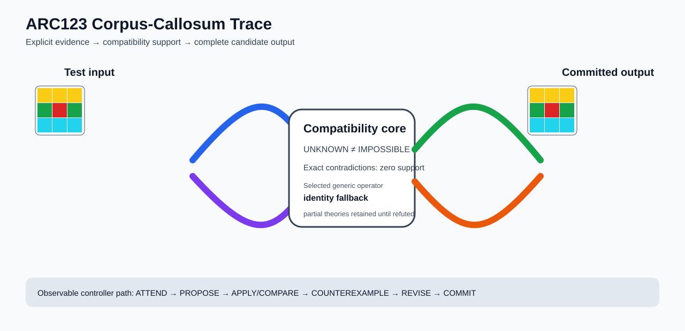

# ARC1 `25d8a9c8` P0008 Brain Surgery Report

## Outcome: NO — TEST CELLS DO NOT ALL MATCH

- **Compared positions:** 9
- **Mismatched cells:** 9
- **Training compatibility:** `False`
- **Fallback used:** `True`
- **Selected hypothesis:** `fallback_identity_complete_grid`
- **Source commit:** `085f6dbe39050afac3d1d743f840bac95b1a8d1c`
- **Frozen controller commit:** `4bed6c917523bc2baa05eec69f67303805d88dae`

## Live-Agent Boundary

The controller receives only visible training input/output examples and test inputs. It receives no task ID, imported cohort label, GT feature record, GT solver, historical decomposition, or held-out output before committing a complete grid. The expected output appears only in the post-answer V&V section.

## Corpus-Callosum Visualization



- Full explicit event record: [`learning_trace.json`](learning_trace.json)

## Frozen Measurement

This task was evaluated with the controller and operator configuration pinned before the frozen cohort was run. A result in this packet cannot alter that controller configuration.

## Post-Answer V&V

### Test case 1
- **All cells match:** `False`
- **Mismatched cells:** `9`
- **Prediction:
```json
[[4, 4, 4], [3, 2, 3], [8, 8, 8]]
```
- **Expected output (post-answer only):**
```json
[[5, 5, 5], [0, 0, 0], [5, 5, 5]]
```

## Observable IHL Walkthrough

The record contains explicit actions, predictions, feedback, and revisions; it does not claim or store hidden model reasoning.

### Action totals

- `APPLY_HYPOTHESIS`: 206
- `ATTEND`: 206
- `CHOOSE_NEXT_DEMO`: 206
- `COMMIT`: 1
- `COMPARE`: 206
- `COMPOSE_RULE`: 51
- `EXPLAIN_RESIDUAL`: 51
- `FIND_COUNTEREXAMPLE`: 50
- `PROPOSE`: 1

### Decision milestones

- `0` `PROPOSE` — `{"parent_theory_id":"T0000","rule":{"description_length":1,"name":"identity","operation":"identity","parameters":{},"rule_id":"identity","scope":{"kind":"all","value":null}},"stage":"initial_generic_theories","theory_id":"T0001"}`
- `2` `ATTEND` — `{"reason":"initial_highest_observed_change_and_color_discrimination","selected_demo":0,"selected_region":{"column":0,"row":0},"theory_id":"T0001"}`
- `6` `ATTEND` — `{"reason":"counterexample_requires_visible_conditional_evidence:unseen_demo_selected_for_residual_version_space_discrimination","selected_demo":1,"selected_region":{"column":0,"row":0},"theory_id":"T0001"}`
- `10` `ATTEND` — `{"reason":"counterexample_requires_visible_conditional_evidence:unseen_demo_selected_for_residual_version_space_discrimination","selected_demo":2,"selected_region":{"column":0,"row":0},"theory_id":"T0001"}`
- `14` `ATTEND` — `{"reason":"counterexample_requires_visible_conditional_evidence:unseen_demo_selected_for_residual_version_space_discrimination","selected_demo":3,"selected_region":{"column":0,"row":0},"theory_id":"T0001"}`
- `23` `ATTEND` — `{"reason":"initial_highest_observed_change_and_color_discrimination","selected_demo":0,"selected_region":{"column":0,"row":1},"theory_id":"T0002"}`
- `27` `ATTEND` — `{"reason":"initial_highest_observed_change_and_color_discrimination","selected_demo":0,"selected_region":{"column":0,"row":1},"theory_id":"T0003"}`
- `31` `ATTEND` — `{"reason":"counterexample_requires_visible_conditional_evidence:unseen_demo_selected_for_residual_version_space_discrimination","selected_demo":1,"selected_region":{"column":1,"row":0},"theory_id":"T0003"}`
- `35` `ATTEND` — `{"reason":"counterexample_requires_visible_conditional_evidence:unseen_demo_selected_for_residual_version_space_discrimination","selected_demo":2,"selected_region":{"column":1,"row":0},"theory_id":"T0003"}`
- `39` `ATTEND` — `{"reason":"counterexample_requires_visible_conditional_evidence:unseen_demo_selected_for_residual_version_space_discrimination","selected_demo":1,"selected_region":{"column":0,"row":0},"theory_id":"T0002"}`
- `43` `ATTEND` — `{"reason":"counterexample_requires_visible_conditional_evidence:unseen_demo_selected_for_residual_version_space_discrimination","selected_demo":3,"selected_region":{"column":0,"row":0},"theory_id":"T0003"}`
- `50` `ATTEND` — `{"reason":"initial_highest_observed_change_and_color_discrimination","selected_demo":0,"selected_region":{"region":"whole_demo"},"theory_id":"T0004"}`
- `54` `ATTEND` — `{"reason":"unseen_demo_selected_for_residual_version_space_discrimination","selected_demo":1,"selected_region":{"column":1,"row":0},"theory_id":"T0004"}`
- `58` `ATTEND` — `{"reason":"counterexample_requires_visible_conditional_evidence:unseen_demo_selected_for_residual_version_space_discrimination","selected_demo":2,"selected_region":{"column":1,"row":0},"theory_id":"T0004"}`
- `62` `ATTEND` — `{"reason":"counterexample_requires_visible_conditional_evidence:unseen_demo_selected_for_residual_version_space_discrimination","selected_demo":3,"selected_region":{"region":"whole_demo"},"theory_id":"T0004"}`
- `69` `ATTEND` — `{"reason":"initial_highest_observed_change_and_color_discrimination","selected_demo":0,"selected_region":{"region":"whole_demo"},"theory_id":"T0005"}`
- `73` `ATTEND` — `{"reason":"unseen_demo_selected_for_residual_version_space_discrimination","selected_demo":1,"selected_region":{"region":"whole_demo"},"theory_id":"T0005"}`
- `77` `ATTEND` — `{"reason":"unseen_demo_selected_for_residual_version_space_discrimination","selected_demo":2,"selected_region":{"column":1,"row":0},"theory_id":"T0005"}`
- `81` `ATTEND` — `{"reason":"counterexample_requires_visible_conditional_evidence:unseen_demo_selected_for_residual_version_space_discrimination","selected_demo":3,"selected_region":{"region":"whole_demo"},"theory_id":"T0005"}`
- `88` `ATTEND` — `{"reason":"initial_highest_observed_change_and_color_discrimination","selected_demo":0,"selected_region":{"region":"whole_demo"},"theory_id":"T0006"}`
- `92` `ATTEND` — `{"reason":"unseen_demo_selected_for_residual_version_space_discrimination","selected_demo":1,"selected_region":{"region":"whole_demo"},"theory_id":"T0006"}`
- `96` `ATTEND` — `{"reason":"unseen_demo_selected_for_residual_version_space_discrimination","selected_demo":2,"selected_region":{"column":0,"row":2},"theory_id":"T0006"}`
- `100` `ATTEND` — `{"reason":"counterexample_requires_visible_conditional_evidence:unseen_demo_selected_for_residual_version_space_discrimination","selected_demo":3,"selected_region":{"region":"whole_demo"},"theory_id":"T0006"}`
- `107` `ATTEND` — `{"reason":"initial_highest_observed_change_and_color_discrimination","selected_demo":0,"selected_region":{"region":"whole_demo"},"theory_id":"T0007"}`
- `111` `ATTEND` — `{"reason":"unseen_demo_selected_for_residual_version_space_discrimination","selected_demo":1,"selected_region":{"region":"whole_demo"},"theory_id":"T0007"}`
- `115` `ATTEND` — `{"reason":"unseen_demo_selected_for_residual_version_space_discrimination","selected_demo":2,"selected_region":{"column":1,"row":0},"theory_id":"T0007"}`
- `119` `ATTEND` — `{"reason":"counterexample_requires_visible_conditional_evidence:unseen_demo_selected_for_residual_version_space_discrimination","selected_demo":3,"selected_region":{"region":"whole_demo"},"theory_id":"T0007"}`
- `126` `ATTEND` — `{"reason":"initial_highest_observed_change_and_color_discrimination","selected_demo":0,"selected_region":{"region":"whole_demo"},"theory_id":"T0008"}`
- `130` `ATTEND` — `{"reason":"unseen_demo_selected_for_residual_version_space_discrimination","selected_demo":1,"selected_region":{"region":"whole_demo"},"theory_id":"T0008"}`
- `134` `ATTEND` — `{"reason":"unseen_demo_selected_for_residual_version_space_discrimination","selected_demo":2,"selected_region":{"column":0,"row":2},"theory_id":"T0008"}`
- `138` `ATTEND` — `{"reason":"counterexample_requires_visible_conditional_evidence:unseen_demo_selected_for_residual_version_space_discrimination","selected_demo":3,"selected_region":{"region":"whole_demo"},"theory_id":"T0008"}`
- `145` `ATTEND` — `{"reason":"initial_highest_observed_change_and_color_discrimination","selected_demo":0,"selected_region":{"region":"whole_demo"},"theory_id":"T0009"}`
- `149` `ATTEND` — `{"reason":"unseen_demo_selected_for_residual_version_space_discrimination","selected_demo":1,"selected_region":{"region":"whole_demo"},"theory_id":"T0009"}`
- `153` `ATTEND` — `{"reason":"unseen_demo_selected_for_residual_version_space_discrimination","selected_demo":2,"selected_region":{"column":1,"row":0},"theory_id":"T0009"}`
- `157` `ATTEND` — `{"reason":"counterexample_requires_visible_conditional_evidence:unseen_demo_selected_for_residual_version_space_discrimination","selected_demo":3,"selected_region":{"region":"whole_demo"},"theory_id":"T0009"}`
- `164` `ATTEND` — `{"reason":"initial_highest_observed_change_and_color_discrimination","selected_demo":0,"selected_region":{"region":"whole_demo"},"theory_id":"T0010"}`
- `168` `ATTEND` — `{"reason":"unseen_demo_selected_for_residual_version_space_discrimination","selected_demo":1,"selected_region":{"region":"whole_demo"},"theory_id":"T0010"}`
- `172` `ATTEND` — `{"reason":"unseen_demo_selected_for_residual_version_space_discrimination","selected_demo":2,"selected_region":{"column":0,"row":2},"theory_id":"T0010"}`
- `176` `ATTEND` — `{"reason":"counterexample_requires_visible_conditional_evidence:unseen_demo_selected_for_residual_version_space_discrimination","selected_demo":3,"selected_region":{"region":"whole_demo"},"theory_id":"T0010"}`
- `183` `ATTEND` — `{"reason":"initial_highest_observed_change_and_color_discrimination","selected_demo":0,"selected_region":{"region":"whole_demo"},"theory_id":"T0011"}`
- `187` `ATTEND` — `{"reason":"unseen_demo_selected_for_residual_version_space_discrimination","selected_demo":1,"selected_region":{"region":"whole_demo"},"theory_id":"T0011"}`
- `191` `ATTEND` — `{"reason":"unseen_demo_selected_for_residual_version_space_discrimination","selected_demo":2,"selected_region":{"column":1,"row":0},"theory_id":"T0011"}`
- `195` `ATTEND` — `{"reason":"counterexample_requires_visible_conditional_evidence:unseen_demo_selected_for_residual_version_space_discrimination","selected_demo":3,"selected_region":{"region":"whole_demo"},"theory_id":"T0011"}`
- `202` `ATTEND` — `{"reason":"initial_highest_observed_change_and_color_discrimination","selected_demo":0,"selected_region":{"region":"whole_demo"},"theory_id":"T0012"}`
- `206` `ATTEND` — `{"reason":"unseen_demo_selected_for_residual_version_space_discrimination","selected_demo":1,"selected_region":{"region":"whole_demo"},"theory_id":"T0012"}`
- `210` `ATTEND` — `{"reason":"unseen_demo_selected_for_residual_version_space_discrimination","selected_demo":2,"selected_region":{"column":0,"row":2},"theory_id":"T0012"}`
- `214` `ATTEND` — `{"reason":"counterexample_requires_visible_conditional_evidence:unseen_demo_selected_for_residual_version_space_discrimination","selected_demo":3,"selected_region":{"region":"whole_demo"},"theory_id":"T0012"}`
- `221` `ATTEND` — `{"reason":"initial_highest_observed_change_and_color_discrimination","selected_demo":0,"selected_region":{"region":"whole_demo"},"theory_id":"T0013"}`
- `225` `ATTEND` — `{"reason":"unseen_demo_selected_for_residual_version_space_discrimination","selected_demo":1,"selected_region":{"region":"whole_demo"},"theory_id":"T0013"}`
- `229` `ATTEND` — `{"reason":"unseen_demo_selected_for_residual_version_space_discrimination","selected_demo":2,"selected_region":{"column":1,"row":0},"theory_id":"T0013"}`
- `233` `ATTEND` — `{"reason":"counterexample_requires_visible_conditional_evidence:unseen_demo_selected_for_residual_version_space_discrimination","selected_demo":3,"selected_region":{"region":"whole_demo"},"theory_id":"T0013"}`
- `240` `ATTEND` — `{"reason":"initial_highest_observed_change_and_color_discrimination","selected_demo":0,"selected_region":{"region":"whole_demo"},"theory_id":"T0014"}`
- `244` `ATTEND` — `{"reason":"unseen_demo_selected_for_residual_version_space_discrimination","selected_demo":1,"selected_region":{"region":"whole_demo"},"theory_id":"T0014"}`
- `248` `ATTEND` — `{"reason":"unseen_demo_selected_for_residual_version_space_discrimination","selected_demo":2,"selected_region":{"column":0,"row":2},"theory_id":"T0014"}`
- `252` `ATTEND` — `{"reason":"counterexample_requires_visible_conditional_evidence:unseen_demo_selected_for_residual_version_space_discrimination","selected_demo":3,"selected_region":{"region":"whole_demo"},"theory_id":"T0014"}`
- `259` `ATTEND` — `{"reason":"initial_highest_observed_change_and_color_discrimination","selected_demo":0,"selected_region":{"region":"whole_demo"},"theory_id":"T0015"}`
- `263` `ATTEND` — `{"reason":"unseen_demo_selected_for_residual_version_space_discrimination","selected_demo":1,"selected_region":{"region":"whole_demo"},"theory_id":"T0015"}`
- `267` `ATTEND` — `{"reason":"unseen_demo_selected_for_residual_version_space_discrimination","selected_demo":2,"selected_region":{"column":1,"row":0},"theory_id":"T0015"}`
- `271` `ATTEND` — `{"reason":"counterexample_requires_visible_conditional_evidence:unseen_demo_selected_for_residual_version_space_discrimination","selected_demo":3,"selected_region":{"region":"whole_demo"},"theory_id":"T0015"}`
- `278` `ATTEND` — `{"reason":"initial_highest_observed_change_and_color_discrimination","selected_demo":0,"selected_region":{"region":"whole_demo"},"theory_id":"T0016"}`
- `282` `ATTEND` — `{"reason":"unseen_demo_selected_for_residual_version_space_discrimination","selected_demo":1,"selected_region":{"region":"whole_demo"},"theory_id":"T0016"}`
- `286` `ATTEND` — `{"reason":"unseen_demo_selected_for_residual_version_space_discrimination","selected_demo":2,"selected_region":{"column":0,"row":2},"theory_id":"T0016"}`
- `290` `ATTEND` — `{"reason":"counterexample_requires_visible_conditional_evidence:unseen_demo_selected_for_residual_version_space_discrimination","selected_demo":3,"selected_region":{"region":"whole_demo"},"theory_id":"T0016"}`
- `297` `ATTEND` — `{"reason":"initial_highest_observed_change_and_color_discrimination","selected_demo":0,"selected_region":{"region":"whole_demo"},"theory_id":"T0017"}`
- `301` `ATTEND` — `{"reason":"unseen_demo_selected_for_residual_version_space_discrimination","selected_demo":1,"selected_region":{"region":"whole_demo"},"theory_id":"T0017"}`
- `305` `ATTEND` — `{"reason":"unseen_demo_selected_for_residual_version_space_discrimination","selected_demo":2,"selected_region":{"column":1,"row":0},"theory_id":"T0017"}`
- `309` `ATTEND` — `{"reason":"counterexample_requires_visible_conditional_evidence:unseen_demo_selected_for_residual_version_space_discrimination","selected_demo":3,"selected_region":{"region":"whole_demo"},"theory_id":"T0017"}`
- `316` `ATTEND` — `{"reason":"initial_highest_observed_change_and_color_discrimination","selected_demo":0,"selected_region":{"region":"whole_demo"},"theory_id":"T0018"}`
- `320` `ATTEND` — `{"reason":"unseen_demo_selected_for_residual_version_space_discrimination","selected_demo":1,"selected_region":{"region":"whole_demo"},"theory_id":"T0018"}`
- `324` `ATTEND` — `{"reason":"unseen_demo_selected_for_residual_version_space_discrimination","selected_demo":2,"selected_region":{"column":0,"row":2},"theory_id":"T0018"}`
- `328` `ATTEND` — `{"reason":"counterexample_requires_visible_conditional_evidence:unseen_demo_selected_for_residual_version_space_discrimination","selected_demo":3,"selected_region":{"region":"whole_demo"},"theory_id":"T0018"}`
- `335` `ATTEND` — `{"reason":"initial_highest_observed_change_and_color_discrimination","selected_demo":0,"selected_region":{"region":"whole_demo"},"theory_id":"T0019"}`
- `339` `ATTEND` — `{"reason":"unseen_demo_selected_for_residual_version_space_discrimination","selected_demo":1,"selected_region":{"region":"whole_demo"},"theory_id":"T0019"}`
- `343` `ATTEND` — `{"reason":"unseen_demo_selected_for_residual_version_space_discrimination","selected_demo":2,"selected_region":{"column":1,"row":0},"theory_id":"T0019"}`
- `347` `ATTEND` — `{"reason":"counterexample_requires_visible_conditional_evidence:unseen_demo_selected_for_residual_version_space_discrimination","selected_demo":3,"selected_region":{"region":"whole_demo"},"theory_id":"T0019"}`
- `354` `ATTEND` — `{"reason":"initial_highest_observed_change_and_color_discrimination","selected_demo":0,"selected_region":{"region":"whole_demo"},"theory_id":"T0020"}`
- `358` `ATTEND` — `{"reason":"unseen_demo_selected_for_residual_version_space_discrimination","selected_demo":1,"selected_region":{"region":"whole_demo"},"theory_id":"T0020"}`
- `362` `ATTEND` — `{"reason":"unseen_demo_selected_for_residual_version_space_discrimination","selected_demo":2,"selected_region":{"column":0,"row":2},"theory_id":"T0020"}`
- `366` `ATTEND` — `{"reason":"counterexample_requires_visible_conditional_evidence:unseen_demo_selected_for_residual_version_space_discrimination","selected_demo":3,"selected_region":{"region":"whole_demo"},"theory_id":"T0020"}`
- `373` `ATTEND` — `{"reason":"initial_highest_observed_change_and_color_discrimination","selected_demo":0,"selected_region":{"region":"whole_demo"},"theory_id":"T0021"}`
- `377` `ATTEND` — `{"reason":"unseen_demo_selected_for_residual_version_space_discrimination","selected_demo":1,"selected_region":{"region":"whole_demo"},"theory_id":"T0021"}`
- `381` `ATTEND` — `{"reason":"unseen_demo_selected_for_residual_version_space_discrimination","selected_demo":2,"selected_region":{"column":1,"row":0},"theory_id":"T0021"}`
- `385` `ATTEND` — `{"reason":"counterexample_requires_visible_conditional_evidence:unseen_demo_selected_for_residual_version_space_discrimination","selected_demo":3,"selected_region":{"region":"whole_demo"},"theory_id":"T0021"}`
- `392` `ATTEND` — `{"reason":"initial_highest_observed_change_and_color_discrimination","selected_demo":0,"selected_region":{"region":"whole_demo"},"theory_id":"T0022"}`
- `396` `ATTEND` — `{"reason":"unseen_demo_selected_for_residual_version_space_discrimination","selected_demo":1,"selected_region":{"region":"whole_demo"},"theory_id":"T0022"}`
- `400` `ATTEND` — `{"reason":"unseen_demo_selected_for_residual_version_space_discrimination","selected_demo":2,"selected_region":{"column":0,"row":2},"theory_id":"T0022"}`
- `404` `ATTEND` — `{"reason":"counterexample_requires_visible_conditional_evidence:unseen_demo_selected_for_residual_version_space_discrimination","selected_demo":3,"selected_region":{"region":"whole_demo"},"theory_id":"T0022"}`
- `411` `ATTEND` — `{"reason":"initial_highest_observed_change_and_color_discrimination","selected_demo":0,"selected_region":{"region":"whole_demo"},"theory_id":"T0023"}`
- `415` `ATTEND` — `{"reason":"unseen_demo_selected_for_residual_version_space_discrimination","selected_demo":1,"selected_region":{"region":"whole_demo"},"theory_id":"T0023"}`
- `419` `ATTEND` — `{"reason":"unseen_demo_selected_for_residual_version_space_discrimination","selected_demo":2,"selected_region":{"column":1,"row":0},"theory_id":"T0023"}`
- `423` `ATTEND` — `{"reason":"counterexample_requires_visible_conditional_evidence:unseen_demo_selected_for_residual_version_space_discrimination","selected_demo":3,"selected_region":{"region":"whole_demo"},"theory_id":"T0023"}`
- `430` `ATTEND` — `{"reason":"initial_highest_observed_change_and_color_discrimination","selected_demo":0,"selected_region":{"region":"whole_demo"},"theory_id":"T0024"}`
- `434` `ATTEND` — `{"reason":"unseen_demo_selected_for_residual_version_space_discrimination","selected_demo":1,"selected_region":{"region":"whole_demo"},"theory_id":"T0024"}`
- `438` `ATTEND` — `{"reason":"unseen_demo_selected_for_residual_version_space_discrimination","selected_demo":2,"selected_region":{"column":0,"row":2},"theory_id":"T0024"}`
- `442` `ATTEND` — `{"reason":"counterexample_requires_visible_conditional_evidence:unseen_demo_selected_for_residual_version_space_discrimination","selected_demo":3,"selected_region":{"region":"whole_demo"},"theory_id":"T0024"}`
- `449` `ATTEND` — `{"reason":"initial_highest_observed_change_and_color_discrimination","selected_demo":0,"selected_region":{"region":"whole_demo"},"theory_id":"T0025"}`
- `453` `ATTEND` — `{"reason":"unseen_demo_selected_for_residual_version_space_discrimination","selected_demo":1,"selected_region":{"region":"whole_demo"},"theory_id":"T0025"}`
- `457` `ATTEND` — `{"reason":"unseen_demo_selected_for_residual_version_space_discrimination","selected_demo":2,"selected_region":{"column":1,"row":0},"theory_id":"T0025"}`
- `461` `ATTEND` — `{"reason":"counterexample_requires_visible_conditional_evidence:unseen_demo_selected_for_residual_version_space_discrimination","selected_demo":3,"selected_region":{"region":"whole_demo"},"theory_id":"T0025"}`
- `468` `ATTEND` — `{"reason":"initial_highest_observed_change_and_color_discrimination","selected_demo":0,"selected_region":{"region":"whole_demo"},"theory_id":"T0026"}`
- `472` `ATTEND` — `{"reason":"unseen_demo_selected_for_residual_version_space_discrimination","selected_demo":1,"selected_region":{"region":"whole_demo"},"theory_id":"T0026"}`
- `476` `ATTEND` — `{"reason":"unseen_demo_selected_for_residual_version_space_discrimination","selected_demo":2,"selected_region":{"column":0,"row":2},"theory_id":"T0026"}`
- `480` `ATTEND` — `{"reason":"counterexample_requires_visible_conditional_evidence:unseen_demo_selected_for_residual_version_space_discrimination","selected_demo":3,"selected_region":{"region":"whole_demo"},"theory_id":"T0026"}`
- `487` `ATTEND` — `{"reason":"initial_highest_observed_change_and_color_discrimination","selected_demo":0,"selected_region":{"region":"whole_demo"},"theory_id":"T0027"}`
- `491` `ATTEND` — `{"reason":"unseen_demo_selected_for_residual_version_space_discrimination","selected_demo":1,"selected_region":{"region":"whole_demo"},"theory_id":"T0027"}`
- `495` `ATTEND` — `{"reason":"unseen_demo_selected_for_residual_version_space_discrimination","selected_demo":2,"selected_region":{"column":1,"row":0},"theory_id":"T0027"}`
- `499` `ATTEND` — `{"reason":"counterexample_requires_visible_conditional_evidence:unseen_demo_selected_for_residual_version_space_discrimination","selected_demo":3,"selected_region":{"region":"whole_demo"},"theory_id":"T0027"}`
- `506` `ATTEND` — `{"reason":"initial_highest_observed_change_and_color_discrimination","selected_demo":0,"selected_region":{"region":"whole_demo"},"theory_id":"T0028"}`
- `510` `ATTEND` — `{"reason":"unseen_demo_selected_for_residual_version_space_discrimination","selected_demo":1,"selected_region":{"region":"whole_demo"},"theory_id":"T0028"}`
- `514` `ATTEND` — `{"reason":"unseen_demo_selected_for_residual_version_space_discrimination","selected_demo":2,"selected_region":{"column":0,"row":2},"theory_id":"T0028"}`
- `518` `ATTEND` — `{"reason":"counterexample_requires_visible_conditional_evidence:unseen_demo_selected_for_residual_version_space_discrimination","selected_demo":3,"selected_region":{"region":"whole_demo"},"theory_id":"T0028"}`
- `525` `ATTEND` — `{"reason":"initial_highest_observed_change_and_color_discrimination","selected_demo":0,"selected_region":{"region":"whole_demo"},"theory_id":"T0029"}`
- `529` `ATTEND` — `{"reason":"unseen_demo_selected_for_residual_version_space_discrimination","selected_demo":1,"selected_region":{"region":"whole_demo"},"theory_id":"T0029"}`
- `533` `ATTEND` — `{"reason":"unseen_demo_selected_for_residual_version_space_discrimination","selected_demo":2,"selected_region":{"column":1,"row":0},"theory_id":"T0029"}`
- `537` `ATTEND` — `{"reason":"counterexample_requires_visible_conditional_evidence:unseen_demo_selected_for_residual_version_space_discrimination","selected_demo":3,"selected_region":{"region":"whole_demo"},"theory_id":"T0029"}`
- `544` `ATTEND` — `{"reason":"initial_highest_observed_change_and_color_discrimination","selected_demo":0,"selected_region":{"region":"whole_demo"},"theory_id":"T0030"}`
- `548` `ATTEND` — `{"reason":"unseen_demo_selected_for_residual_version_space_discrimination","selected_demo":1,"selected_region":{"region":"whole_demo"},"theory_id":"T0030"}`
- `552` `ATTEND` — `{"reason":"unseen_demo_selected_for_residual_version_space_discrimination","selected_demo":2,"selected_region":{"column":0,"row":2},"theory_id":"T0030"}`
- `556` `ATTEND` — `{"reason":"counterexample_requires_visible_conditional_evidence:unseen_demo_selected_for_residual_version_space_discrimination","selected_demo":3,"selected_region":{"region":"whole_demo"},"theory_id":"T0030"}`
- `563` `ATTEND` — `{"reason":"initial_highest_observed_change_and_color_discrimination","selected_demo":0,"selected_region":{"region":"whole_demo"},"theory_id":"T0031"}`
- `567` `ATTEND` — `{"reason":"unseen_demo_selected_for_residual_version_space_discrimination","selected_demo":1,"selected_region":{"region":"whole_demo"},"theory_id":"T0031"}`
- `571` `ATTEND` — `{"reason":"unseen_demo_selected_for_residual_version_space_discrimination","selected_demo":2,"selected_region":{"column":1,"row":0},"theory_id":"T0031"}`
- `575` `ATTEND` — `{"reason":"counterexample_requires_visible_conditional_evidence:unseen_demo_selected_for_residual_version_space_discrimination","selected_demo":3,"selected_region":{"region":"whole_demo"},"theory_id":"T0031"}`
- `582` `ATTEND` — `{"reason":"initial_highest_observed_change_and_color_discrimination","selected_demo":0,"selected_region":{"region":"whole_demo"},"theory_id":"T0032"}`
- `586` `ATTEND` — `{"reason":"unseen_demo_selected_for_residual_version_space_discrimination","selected_demo":1,"selected_region":{"region":"whole_demo"},"theory_id":"T0032"}`
- `590` `ATTEND` — `{"reason":"unseen_demo_selected_for_residual_version_space_discrimination","selected_demo":2,"selected_region":{"column":0,"row":2},"theory_id":"T0032"}`
- `594` `ATTEND` — `{"reason":"counterexample_requires_visible_conditional_evidence:unseen_demo_selected_for_residual_version_space_discrimination","selected_demo":3,"selected_region":{"region":"whole_demo"},"theory_id":"T0032"}`
- `601` `ATTEND` — `{"reason":"initial_highest_observed_change_and_color_discrimination","selected_demo":0,"selected_region":{"region":"whole_demo"},"theory_id":"T0033"}`
- `605` `ATTEND` — `{"reason":"unseen_demo_selected_for_residual_version_space_discrimination","selected_demo":1,"selected_region":{"region":"whole_demo"},"theory_id":"T0033"}`
- `609` `ATTEND` — `{"reason":"unseen_demo_selected_for_residual_version_space_discrimination","selected_demo":2,"selected_region":{"column":1,"row":0},"theory_id":"T0033"}`
- `613` `ATTEND` — `{"reason":"counterexample_requires_visible_conditional_evidence:unseen_demo_selected_for_residual_version_space_discrimination","selected_demo":3,"selected_region":{"region":"whole_demo"},"theory_id":"T0033"}`
- `620` `ATTEND` — `{"reason":"initial_highest_observed_change_and_color_discrimination","selected_demo":0,"selected_region":{"region":"whole_demo"},"theory_id":"T0034"}`
- `624` `ATTEND` — `{"reason":"unseen_demo_selected_for_residual_version_space_discrimination","selected_demo":1,"selected_region":{"region":"whole_demo"},"theory_id":"T0034"}`
- `628` `ATTEND` — `{"reason":"unseen_demo_selected_for_residual_version_space_discrimination","selected_demo":2,"selected_region":{"column":0,"row":2},"theory_id":"T0034"}`
- `632` `ATTEND` — `{"reason":"counterexample_requires_visible_conditional_evidence:unseen_demo_selected_for_residual_version_space_discrimination","selected_demo":3,"selected_region":{"region":"whole_demo"},"theory_id":"T0034"}`
- `639` `ATTEND` — `{"reason":"initial_highest_observed_change_and_color_discrimination","selected_demo":0,"selected_region":{"region":"whole_demo"},"theory_id":"T0035"}`
- `643` `ATTEND` — `{"reason":"unseen_demo_selected_for_residual_version_space_discrimination","selected_demo":1,"selected_region":{"region":"whole_demo"},"theory_id":"T0035"}`
- `647` `ATTEND` — `{"reason":"unseen_demo_selected_for_residual_version_space_discrimination","selected_demo":2,"selected_region":{"column":1,"row":0},"theory_id":"T0035"}`
- `651` `ATTEND` — `{"reason":"counterexample_requires_visible_conditional_evidence:unseen_demo_selected_for_residual_version_space_discrimination","selected_demo":3,"selected_region":{"region":"whole_demo"},"theory_id":"T0035"}`
- `658` `ATTEND` — `{"reason":"initial_highest_observed_change_and_color_discrimination","selected_demo":0,"selected_region":{"region":"whole_demo"},"theory_id":"T0036"}`
- `662` `ATTEND` — `{"reason":"unseen_demo_selected_for_residual_version_space_discrimination","selected_demo":1,"selected_region":{"region":"whole_demo"},"theory_id":"T0036"}`
- `666` `ATTEND` — `{"reason":"unseen_demo_selected_for_residual_version_space_discrimination","selected_demo":2,"selected_region":{"column":0,"row":2},"theory_id":"T0036"}`
- `670` `ATTEND` — `{"reason":"counterexample_requires_visible_conditional_evidence:unseen_demo_selected_for_residual_version_space_discrimination","selected_demo":3,"selected_region":{"region":"whole_demo"},"theory_id":"T0036"}`
- `677` `ATTEND` — `{"reason":"initial_highest_observed_change_and_color_discrimination","selected_demo":0,"selected_region":{"region":"whole_demo"},"theory_id":"T0037"}`
- `681` `ATTEND` — `{"reason":"unseen_demo_selected_for_residual_version_space_discrimination","selected_demo":1,"selected_region":{"region":"whole_demo"},"theory_id":"T0037"}`
- `685` `ATTEND` — `{"reason":"unseen_demo_selected_for_residual_version_space_discrimination","selected_demo":2,"selected_region":{"column":1,"row":0},"theory_id":"T0037"}`
- `689` `ATTEND` — `{"reason":"counterexample_requires_visible_conditional_evidence:unseen_demo_selected_for_residual_version_space_discrimination","selected_demo":3,"selected_region":{"region":"whole_demo"},"theory_id":"T0037"}`
- `696` `ATTEND` — `{"reason":"initial_highest_observed_change_and_color_discrimination","selected_demo":0,"selected_region":{"region":"whole_demo"},"theory_id":"T0038"}`
- `700` `ATTEND` — `{"reason":"unseen_demo_selected_for_residual_version_space_discrimination","selected_demo":1,"selected_region":{"region":"whole_demo"},"theory_id":"T0038"}`
- `704` `ATTEND` — `{"reason":"unseen_demo_selected_for_residual_version_space_discrimination","selected_demo":2,"selected_region":{"column":0,"row":2},"theory_id":"T0038"}`
- `708` `ATTEND` — `{"reason":"counterexample_requires_visible_conditional_evidence:unseen_demo_selected_for_residual_version_space_discrimination","selected_demo":3,"selected_region":{"region":"whole_demo"},"theory_id":"T0038"}`
- `715` `ATTEND` — `{"reason":"initial_highest_observed_change_and_color_discrimination","selected_demo":0,"selected_region":{"region":"whole_demo"},"theory_id":"T0039"}`
- `719` `ATTEND` — `{"reason":"unseen_demo_selected_for_residual_version_space_discrimination","selected_demo":1,"selected_region":{"region":"whole_demo"},"theory_id":"T0039"}`
- `723` `ATTEND` — `{"reason":"unseen_demo_selected_for_residual_version_space_discrimination","selected_demo":2,"selected_region":{"column":1,"row":0},"theory_id":"T0039"}`
- `727` `ATTEND` — `{"reason":"counterexample_requires_visible_conditional_evidence:unseen_demo_selected_for_residual_version_space_discrimination","selected_demo":3,"selected_region":{"region":"whole_demo"},"theory_id":"T0039"}`
- `734` `ATTEND` — `{"reason":"initial_highest_observed_change_and_color_discrimination","selected_demo":0,"selected_region":{"region":"whole_demo"},"theory_id":"T0040"}`
- `738` `ATTEND` — `{"reason":"unseen_demo_selected_for_residual_version_space_discrimination","selected_demo":1,"selected_region":{"region":"whole_demo"},"theory_id":"T0040"}`
- `742` `ATTEND` — `{"reason":"unseen_demo_selected_for_residual_version_space_discrimination","selected_demo":2,"selected_region":{"column":0,"row":2},"theory_id":"T0040"}`
- `746` `ATTEND` — `{"reason":"counterexample_requires_visible_conditional_evidence:unseen_demo_selected_for_residual_version_space_discrimination","selected_demo":3,"selected_region":{"region":"whole_demo"},"theory_id":"T0040"}`
- `753` `ATTEND` — `{"reason":"initial_highest_observed_change_and_color_discrimination","selected_demo":0,"selected_region":{"region":"whole_demo"},"theory_id":"T0041"}`
- `757` `ATTEND` — `{"reason":"unseen_demo_selected_for_residual_version_space_discrimination","selected_demo":1,"selected_region":{"region":"whole_demo"},"theory_id":"T0041"}`
- `761` `ATTEND` — `{"reason":"unseen_demo_selected_for_residual_version_space_discrimination","selected_demo":2,"selected_region":{"column":1,"row":0},"theory_id":"T0041"}`
- `765` `ATTEND` — `{"reason":"counterexample_requires_visible_conditional_evidence:unseen_demo_selected_for_residual_version_space_discrimination","selected_demo":3,"selected_region":{"region":"whole_demo"},"theory_id":"T0041"}`
- `772` `ATTEND` — `{"reason":"initial_highest_observed_change_and_color_discrimination","selected_demo":0,"selected_region":{"region":"whole_demo"},"theory_id":"T0042"}`
- `776` `ATTEND` — `{"reason":"unseen_demo_selected_for_residual_version_space_discrimination","selected_demo":1,"selected_region":{"region":"whole_demo"},"theory_id":"T0042"}`
- `780` `ATTEND` — `{"reason":"unseen_demo_selected_for_residual_version_space_discrimination","selected_demo":2,"selected_region":{"column":0,"row":2},"theory_id":"T0042"}`
- `784` `ATTEND` — `{"reason":"counterexample_requires_visible_conditional_evidence:unseen_demo_selected_for_residual_version_space_discrimination","selected_demo":3,"selected_region":{"region":"whole_demo"},"theory_id":"T0042"}`
- `791` `ATTEND` — `{"reason":"initial_highest_observed_change_and_color_discrimination","selected_demo":0,"selected_region":{"region":"whole_demo"},"theory_id":"T0043"}`
- `795` `ATTEND` — `{"reason":"unseen_demo_selected_for_residual_version_space_discrimination","selected_demo":1,"selected_region":{"region":"whole_demo"},"theory_id":"T0043"}`
- `799` `ATTEND` — `{"reason":"unseen_demo_selected_for_residual_version_space_discrimination","selected_demo":2,"selected_region":{"column":1,"row":0},"theory_id":"T0043"}`
- `803` `ATTEND` — `{"reason":"counterexample_requires_visible_conditional_evidence:unseen_demo_selected_for_residual_version_space_discrimination","selected_demo":3,"selected_region":{"region":"whole_demo"},"theory_id":"T0043"}`
- `810` `ATTEND` — `{"reason":"initial_highest_observed_change_and_color_discrimination","selected_demo":0,"selected_region":{"region":"whole_demo"},"theory_id":"T0044"}`
- `814` `ATTEND` — `{"reason":"unseen_demo_selected_for_residual_version_space_discrimination","selected_demo":1,"selected_region":{"region":"whole_demo"},"theory_id":"T0044"}`
- `818` `ATTEND` — `{"reason":"unseen_demo_selected_for_residual_version_space_discrimination","selected_demo":2,"selected_region":{"column":0,"row":2},"theory_id":"T0044"}`
- `822` `ATTEND` — `{"reason":"counterexample_requires_visible_conditional_evidence:unseen_demo_selected_for_residual_version_space_discrimination","selected_demo":3,"selected_region":{"region":"whole_demo"},"theory_id":"T0044"}`
- `829` `ATTEND` — `{"reason":"initial_highest_observed_change_and_color_discrimination","selected_demo":0,"selected_region":{"region":"whole_demo"},"theory_id":"T0045"}`
- `833` `ATTEND` — `{"reason":"unseen_demo_selected_for_residual_version_space_discrimination","selected_demo":1,"selected_region":{"region":"whole_demo"},"theory_id":"T0045"}`
- `837` `ATTEND` — `{"reason":"unseen_demo_selected_for_residual_version_space_discrimination","selected_demo":2,"selected_region":{"column":1,"row":0},"theory_id":"T0045"}`
- `841` `ATTEND` — `{"reason":"counterexample_requires_visible_conditional_evidence:unseen_demo_selected_for_residual_version_space_discrimination","selected_demo":3,"selected_region":{"region":"whole_demo"},"theory_id":"T0045"}`
- `848` `ATTEND` — `{"reason":"initial_highest_observed_change_and_color_discrimination","selected_demo":0,"selected_region":{"region":"whole_demo"},"theory_id":"T0046"}`
- `852` `ATTEND` — `{"reason":"unseen_demo_selected_for_residual_version_space_discrimination","selected_demo":1,"selected_region":{"region":"whole_demo"},"theory_id":"T0046"}`
- `856` `ATTEND` — `{"reason":"unseen_demo_selected_for_residual_version_space_discrimination","selected_demo":2,"selected_region":{"column":0,"row":2},"theory_id":"T0046"}`
- `860` `ATTEND` — `{"reason":"counterexample_requires_visible_conditional_evidence:unseen_demo_selected_for_residual_version_space_discrimination","selected_demo":3,"selected_region":{"region":"whole_demo"},"theory_id":"T0046"}`
- `867` `ATTEND` — `{"reason":"initial_highest_observed_change_and_color_discrimination","selected_demo":0,"selected_region":{"region":"whole_demo"},"theory_id":"T0047"}`
- `871` `ATTEND` — `{"reason":"unseen_demo_selected_for_residual_version_space_discrimination","selected_demo":1,"selected_region":{"region":"whole_demo"},"theory_id":"T0047"}`
- `875` `ATTEND` — `{"reason":"unseen_demo_selected_for_residual_version_space_discrimination","selected_demo":2,"selected_region":{"column":1,"row":0},"theory_id":"T0047"}`
- `879` `ATTEND` — `{"reason":"counterexample_requires_visible_conditional_evidence:unseen_demo_selected_for_residual_version_space_discrimination","selected_demo":3,"selected_region":{"region":"whole_demo"},"theory_id":"T0047"}`
- `886` `ATTEND` — `{"reason":"initial_highest_observed_change_and_color_discrimination","selected_demo":0,"selected_region":{"region":"whole_demo"},"theory_id":"T0048"}`
- `890` `ATTEND` — `{"reason":"unseen_demo_selected_for_residual_version_space_discrimination","selected_demo":1,"selected_region":{"region":"whole_demo"},"theory_id":"T0048"}`
- `894` `ATTEND` — `{"reason":"unseen_demo_selected_for_residual_version_space_discrimination","selected_demo":2,"selected_region":{"column":0,"row":2},"theory_id":"T0048"}`
- `898` `ATTEND` — `{"reason":"counterexample_requires_visible_conditional_evidence:unseen_demo_selected_for_residual_version_space_discrimination","selected_demo":3,"selected_region":{"region":"whole_demo"},"theory_id":"T0048"}`
- `905` `ATTEND` — `{"reason":"initial_highest_observed_change_and_color_discrimination","selected_demo":0,"selected_region":{"region":"whole_demo"},"theory_id":"T0049"}`
- `909` `ATTEND` — `{"reason":"unseen_demo_selected_for_residual_version_space_discrimination","selected_demo":1,"selected_region":{"region":"whole_demo"},"theory_id":"T0049"}`
- `913` `ATTEND` — `{"reason":"unseen_demo_selected_for_residual_version_space_discrimination","selected_demo":2,"selected_region":{"column":1,"row":0},"theory_id":"T0049"}`
- `917` `ATTEND` — `{"reason":"counterexample_requires_visible_conditional_evidence:unseen_demo_selected_for_residual_version_space_discrimination","selected_demo":3,"selected_region":{"region":"whole_demo"},"theory_id":"T0049"}`
- `924` `ATTEND` — `{"reason":"initial_highest_observed_change_and_color_discrimination","selected_demo":0,"selected_region":{"region":"whole_demo"},"theory_id":"T0050"}`
- `928` `ATTEND` — `{"reason":"unseen_demo_selected_for_residual_version_space_discrimination","selected_demo":1,"selected_region":{"region":"whole_demo"},"theory_id":"T0050"}`
- `932` `ATTEND` — `{"reason":"unseen_demo_selected_for_residual_version_space_discrimination","selected_demo":2,"selected_region":{"column":0,"row":2},"theory_id":"T0050"}`
- `936` `ATTEND` — `{"reason":"counterexample_requires_visible_conditional_evidence:unseen_demo_selected_for_residual_version_space_discrimination","selected_demo":3,"selected_region":{"region":"whole_demo"},"theory_id":"T0050"}`
- `943` `ATTEND` — `{"reason":"initial_highest_observed_change_and_color_discrimination","selected_demo":0,"selected_region":{"region":"whole_demo"},"theory_id":"T0051"}`
- `947` `ATTEND` — `{"reason":"unseen_demo_selected_for_residual_version_space_discrimination","selected_demo":1,"selected_region":{"region":"whole_demo"},"theory_id":"T0051"}`
- `951` `ATTEND` — `{"reason":"unseen_demo_selected_for_residual_version_space_discrimination","selected_demo":2,"selected_region":{"column":1,"row":0},"theory_id":"T0051"}`
- `955` `ATTEND` — `{"reason":"counterexample_requires_visible_conditional_evidence:unseen_demo_selected_for_residual_version_space_discrimination","selected_demo":3,"selected_region":{"region":"whole_demo"},"theory_id":"T0051"}`
- `962` `ATTEND` — `{"reason":"initial_highest_observed_change_and_color_discrimination","selected_demo":0,"selected_region":{"region":"whole_demo"},"theory_id":"T0052"}`
- `966` `ATTEND` — `{"reason":"unseen_demo_selected_for_residual_version_space_discrimination","selected_demo":1,"selected_region":{"region":"whole_demo"},"theory_id":"T0052"}`
- `970` `ATTEND` — `{"reason":"unseen_demo_selected_for_residual_version_space_discrimination","selected_demo":2,"selected_region":{"column":0,"row":2},"theory_id":"T0052"}`
- `974` `ATTEND` — `{"reason":"counterexample_requires_visible_conditional_evidence:unseen_demo_selected_for_residual_version_space_discrimination","selected_demo":3,"selected_region":{"region":"whole_demo"},"theory_id":"T0052"}`
- `977` `COMMIT` — `{"best_partial_theory":{"contradiction_count":0,"counterexamples":[],"description_length":13,"evaluated_demo_indices":[0,1],"history":[{"kind":"ADD_RULE","parameters":{"initial_proposal":true,"operation":"identity"},"target":"identity"},{"kind":"ATTEND","parameters":{"information_score":[9,5,5],"reason":"initial_highest_observed_change_and_color_discrimination"},"target":"demo:0"},{"kind":"ATTEND","parameters":{"information_score":[9,5,5],"reason":"counterexample_requires_visible_conditional_evidence:unseen_demo_selected_for_residual_version_space_discrimination"},"target":"demo:1"},{"kind":"ATTEND","parameters":{"information_score":[9,5,5],"reason":"counterexample_requires_visible_conditional_evidence:unseen_demo_selected_for_residual_version_space_discrimination"},"target":"demo:2"},{"kind":"ATTEND","parameters":{"information_score":[9,5,5],"reason":"counterexample_requires_visible_conditional_evidence:unseen_demo_selected_for_residual_version_space_discrimination"},"target":"demo:3"},{"kind":"ADD_RULE","parameters":{"mapping_count":5,"observed_demo_count":4,"property":"shape","proposal_family":"component_property_residual"},"target":"component-property-shape-0"},{"kind":"ATTEND","parameters":{"information_score":[9,5,5],"reason":"initial_highest_observed_change_and_color_discrimination"},"target":"demo:0"},{"kind":"ATTEND","parameters":{"information_score":[9,5,5],"reason":"counterexample_requires_visible_conditional_evidence:unseen_demo_selected_for_residual_version_space_discrimination"},"target":"demo:1"},{"kind":"ATTEND","parameters":{"information_score":[9,5,5],"reason":"counterexample_requires_visible_conditional_evidence:unseen_demo_selected_for_residual_version_space_discrimination"},"target":"demo:2"},{"kind":"ATTEND","parameters":{"information_score":[9,5,5],"reason":"counterexample_requires_visible_conditional_evidence:unseen_demo_selected_for_residual_version_space_discrimination"},"target":"demo:3"},{"kind":"ADD_RULE","parameters":{"counterexample":{"column":0,"demo_index":0,"observed":0,"predicted":2,"row":1},"source_color":2,"target_color":0},"target":"recolor-color-2-to-0"},{"kind":"ATTEND","parameters":{"information_score":[9,5,5],"reason":"initial_highest_observed_change_and_color_discrimination"},"target":"demo:0"},{"kind":"ATTEND","parameters":{"information_score":[9,5,5],"reason":"unseen_demo_selected_for_residual_version_space_discrimination"},"target":"demo:1"},{"kind":"ATTEND","parameters":{"information_score":[9,5,5],"reason":"counterexample_requires_visible_conditional_evidence:unseen_demo_selected_for_residual_version_space_discrimination"},"target":"demo:2"},{"kind":"ATTEND","parameters":{"information_score":[9,5,5],"reason":"counterexample_requires_visible_conditional_evidence:unseen_demo_selected_for_residual_version_space_discrimination"},"target":"demo:3"},{"kind":"ADD_RULE","parameters":{"counterexample":{"column":1,"demo_index":1,"observed":0,"predicted":3,"row":0},"source_color":3,"target_color":0},"target":"recolor-color-3-to-0"},{"kind":"ATTEND","parameters":{"information_score":[9,5,5],"reason":"initial_highest_observed_change_and_color_discrimination"},"target":"demo:0"},{"kind":"ATTEND","parameters":{"information_score":[9,5,5],"reason":"unseen_demo_selected_for_residual_version_space_discrimination"},"target":"demo:1"}],"matching_cell_count":18,"name":"compose(identity,component_recolor(property=shape,mapping_count=5),recolor(to=0,scope=color==2),recolor(to=0,scope=color==3))","parameter_bindings":{},"parent_theory_id":"T0004","rules":[{"description_length":1,"name":"identity","operation":"identity","parameters":{},"rule_id":"identity","scope":{"kind":"all","value":null}},{"description_length":8,"name":"component_recolor(property=shape,mapping_count=5)","operation":"component_property_recolor","parameters":{"mapping":"[[\"0,0\",0],[\"0,0;0,1\",0],[\"0,0;0,1;0,2\",5],[\"0,0;1,0\",0],[\"0,0;1,0;1,1\",0]]","property":"shape"},"rule_id":"component-property-shape-0","scope":{"kind":"all","value":null}},{"description_length":2,"name":"recolor(to=0,scope=color==2)","operation":"recolor_scoped","parameters":{"to_color":0},"rule_id":"recolor-color-2-to-0","scope":{"kind":"color_equals","value":2}},{"description_length":2,"name":"recolor(to=0,scope=color==3)","operation":"recolor_scoped","parameters":{"to_color":0},"rule_id":"recolor-color-3-to-0","scope":{"kind":"color_equals","value":3}}],"scope_predicates":[{"kind":"all","value":null},{"kind":"all","value":null},{"kind":"color_equals","value":2},{"kind":"color_equals","value":3}],"theory_id":"T0005","unknown_cell_count":0,"unresolved_unknown":[]},"complete_prediction_group_count":0,"fallback_reason":"no_complete_training_compatible_partial_theory","posterior_mass":0.0,"selected_hypothesis":"fallback_identity_complete_grid","training_exact":false}`

### First counterexamples

- `17` — `{"causal_next_operation":"scope_or_rule_revision","counterexample":{"column":0,"demo_index":0,"observed":5,"predicted":4,"row":0},"responsible_rule":{"description_length":1,"name":"identity","operation":"identity","parameters":{},"rule_id":"identity","scope":{"kind":"all","value":null}},"responsible_rule_id":"identity","theory_id":"T0001"}`
- `46` — `{"causal_next_operation":"scope_or_rule_revision","counterexample":{"column":0,"demo_index":0,"observed":0,"predicted":2,"row":1},"responsible_rule":{"description_length":1,"name":"identity","operation":"identity","parameters":{},"rule_id":"identity","scope":{"kind":"all","value":null}},"responsible_rule_id":"identity","theory_id":"T0003"}`
- `65` — `{"causal_next_operation":"scope_or_rule_revision","counterexample":{"column":1,"demo_index":1,"observed":0,"predicted":3,"row":0},"responsible_rule":{"description_length":1,"name":"identity","operation":"identity","parameters":{},"rule_id":"identity","scope":{"kind":"all","value":null}},"responsible_rule_id":"identity","theory_id":"T0004"}`
- `84` — `{"causal_next_operation":"scope_or_rule_revision","counterexample":{"column":1,"demo_index":2,"observed":0,"predicted":9,"row":0},"responsible_rule":{"description_length":1,"name":"identity","operation":"identity","parameters":{},"rule_id":"identity","scope":{"kind":"all","value":null}},"responsible_rule_id":"identity","theory_id":"T0005"}`
- `103` — `{"causal_next_operation":"scope_or_rule_revision","counterexample":{"column":0,"demo_index":2,"observed":5,"predicted":0,"row":2},"responsible_rule":{"description_length":2,"name":"recolor(to=0,scope=color==9)","operation":"recolor_scoped","parameters":{"to_color":0},"rule_id":"recolor-color-9-to-0","scope":{"kind":"color_equals","value":9}},"responsible_rule_id":"recolor-color-9-to-0","theory_id":"T0006"}`
- `45` additional explicit counterexamples are retained in `learning_trace.json`.
