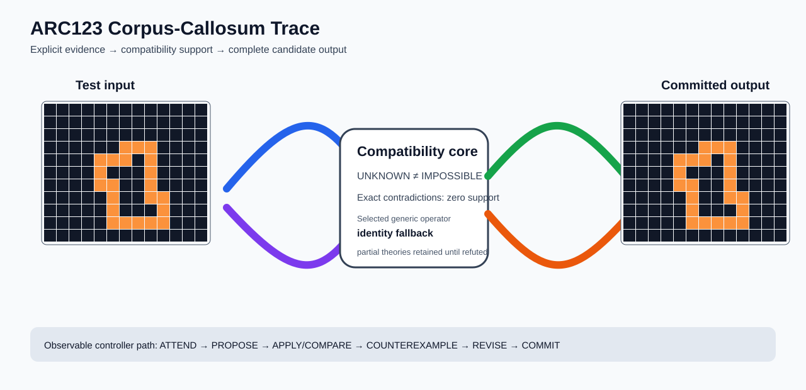

# ARC1 `423a55dc` P0008 Brain Surgery Report

## Outcome: NO — TEST CELLS DO NOT ALL MATCH

- **Compared positions:** 143
- **Mismatched cells:** 29
- **Training compatibility:** `False`
- **Fallback used:** `True`
- **Selected hypothesis:** `fallback_identity_complete_grid`
- **Source commit:** `085f6dbe39050afac3d1d743f840bac95b1a8d1c`
- **Frozen controller commit:** `4bed6c917523bc2baa05eec69f67303805d88dae`

## Live-Agent Boundary

The controller receives only visible training input/output examples and test inputs. It receives no task ID, imported cohort label, GT feature record, GT solver, historical decomposition, or held-out output before committing a complete grid. The expected output appears only in the post-answer V&V section.

## Corpus-Callosum Visualization



- Full explicit event record: [`learning_trace.json`](learning_trace.json)

## Frozen Measurement

This task was evaluated with the controller and operator configuration pinned before the frozen cohort was run. A result in this packet cannot alter that controller configuration.

## Post-Answer V&V

### Test case 1
- **All cells match:** `False`
- **Mismatched cells:** `29`
- **Prediction:
```json
[[0, 0, 0, 0, 0, 0, 0, 0, 0, 0, 0, 0, 0], [0, 0, 0, 0, 0, 0, 0, 0, 0, 0, 0, 0, 0], [0, 0, 0, 0, 0, 0, 0, 0, 0, 0, 0, 0, 0], [0, 0, 0, 0, 0, 0, 7, 7, 7, 0, 0, 0, 0], [0, 0, 0, 0, 7, 7, 7, 0, 7, 0, 0, 0, 0], [0, 0, 0, 0, 7, 0, 0, 0, 7, 0, 0, 0, 0], [0, 0, 0, 0, 7, 7, 0, 0, 7, 0, 0, 0, 0], [0, 0, 0, 0, 0, 7, 0, 0, 7, 7, 0, 0, 0], [0, 0, 0, 0, 0, 7, 0, 0, 0, 7, 0, 0, 0], [0, 0, 0, 0, 0, 7, 7, 7, 7, 7, 0, 0, 0], [0, 0, 0, 0, 0, 0, 0, 0, 0, 0, 0, 0, 0]]
```
- **Expected output (post-answer only):**
```json
[[0, 0, 0, 0, 0, 0, 0, 0, 0, 0, 0, 0, 0], [0, 0, 0, 0, 0, 0, 0, 0, 0, 0, 0, 0, 0], [0, 0, 0, 0, 0, 0, 0, 0, 0, 0, 0, 0, 0], [7, 7, 7, 0, 0, 0, 0, 0, 0, 0, 0, 0, 0], [7, 7, 0, 7, 0, 0, 0, 0, 0, 0, 0, 0, 0], [7, 0, 0, 0, 7, 0, 0, 0, 0, 0, 0, 0, 0], [0, 7, 7, 0, 0, 7, 0, 0, 0, 0, 0, 0, 0], [0, 0, 0, 7, 0, 0, 7, 7, 0, 0, 0, 0, 0], [0, 0, 0, 0, 7, 0, 0, 0, 7, 0, 0, 0, 0], [0, 0, 0, 0, 0, 7, 7, 7, 7, 7, 0, 0, 0], [0, 0, 0, 0, 0, 0, 0, 0, 0, 0, 0, 0, 0]]
```

## Observable IHL Walkthrough

The record contains explicit actions, predictions, feedback, and revisions; it does not claim or store hidden model reasoning.

### Action totals

- `ADD_CONDITION`: 1
- `APPLY_HYPOTHESIS`: 251
- `ATTEND`: 251
- `BIND_PARAMETER`: 1
- `CHOOSE_NEXT_DEMO`: 251
- `COMMIT`: 1
- `COMPARE`: 251
- `COMPOSE_RULE`: 4
- `EXPLAIN_RESIDUAL`: 4
- `FIND_COUNTEREXAMPLE`: 5
- `PROPOSE`: 1
- `SPECIALIZE`: 56

### Decision milestones

- `0` `PROPOSE` — `{"parent_theory_id":"T0000","rule":{"description_length":1,"name":"identity","operation":"identity","parameters":{},"rule_id":"identity","scope":{"kind":"all","value":null}},"stage":"initial_generic_theories","theory_id":"T0001"}`
- `2` `ATTEND` — `{"reason":"initial_highest_observed_change_and_color_discrimination","selected_demo":3,"selected_region":{"column":0,"row":3},"theory_id":"T0001"}`
- `6` `ATTEND` — `{"reason":"counterexample_requires_visible_conditional_evidence:unseen_demo_selected_for_residual_version_space_discrimination","selected_demo":2,"selected_region":{"column":3,"row":3},"theory_id":"T0001"}`
- `10` `ATTEND` — `{"reason":"counterexample_requires_visible_conditional_evidence:unseen_demo_selected_for_residual_version_space_discrimination","selected_demo":0,"selected_region":{"column":0,"row":2},"theory_id":"T0001"}`
- `14` `ATTEND` — `{"reason":"counterexample_requires_visible_conditional_evidence:unseen_demo_selected_for_residual_version_space_discrimination","selected_demo":1,"selected_region":{"column":0,"row":3},"theory_id":"T0001"}`
- `18` `ATTEND` — `{"reason":"counterexample_requires_visible_conditional_evidence:unseen_demo_selected_for_residual_version_space_discrimination","selected_demo":4,"selected_region":{"column":0,"row":1},"theory_id":"T0001"}`
- `24` `SPECIALIZE` — `{"added_rule":{"description_length":4,"name":"row_span_fill(fill_color=6,seed_color=6)","operation":"full_operator","parameters":{"fill_color":6,"operator":"row_span_fill","seed_color":6},"rule_id":"structural-row_span_fill","scope":{"kind":"all","value":null}},"parent_theory_id":"T0001","reason":"unexplained_residual_proposed_generic_structural_rule","theory_id":"T0003"}`
- `25` `SPECIALIZE` — `{"added_rule":{"description_length":4,"name":"row_span_fill(fill_color=3,seed_color=3)","operation":"full_operator","parameters":{"fill_color":3,"operator":"row_span_fill","seed_color":3},"rule_id":"structural-row_span_fill","scope":{"kind":"all","value":null}},"parent_theory_id":"T0001","reason":"unexplained_residual_proposed_generic_structural_rule","theory_id":"T0004"}`
- `26` `SPECIALIZE` — `{"added_rule":{"description_length":4,"name":"row_span_fill(fill_color=8,seed_color=6)","operation":"full_operator","parameters":{"fill_color":8,"operator":"row_span_fill","seed_color":6},"rule_id":"structural-row_span_fill","scope":{"kind":"all","value":null}},"parent_theory_id":"T0001","reason":"unexplained_residual_proposed_generic_structural_rule","theory_id":"T0005"}`
- `27` `SPECIALIZE` — `{"added_rule":{"description_length":4,"name":"row_span_fill(fill_color=3,seed_color=6)","operation":"full_operator","parameters":{"fill_color":3,"operator":"row_span_fill","seed_color":6},"rule_id":"structural-row_span_fill","scope":{"kind":"all","value":null}},"parent_theory_id":"T0001","reason":"unexplained_residual_proposed_generic_structural_rule","theory_id":"T0006"}`
- `28` `SPECIALIZE` — `{"added_rule":{"description_length":4,"name":"row_span_fill(fill_color=2,seed_color=6)","operation":"full_operator","parameters":{"fill_color":2,"operator":"row_span_fill","seed_color":6},"rule_id":"structural-row_span_fill","scope":{"kind":"all","value":null}},"parent_theory_id":"T0001","reason":"unexplained_residual_proposed_generic_structural_rule","theory_id":"T0007"}`
- `29` `SPECIALIZE` — `{"added_rule":{"description_length":4,"name":"row_span_fill(fill_color=8,seed_color=8)","operation":"full_operator","parameters":{"fill_color":8,"operator":"row_span_fill","seed_color":8},"rule_id":"structural-row_span_fill","scope":{"kind":"all","value":null}},"parent_theory_id":"T0001","reason":"unexplained_residual_proposed_generic_structural_rule","theory_id":"T0008"}`
- `30` `SPECIALIZE` — `{"added_rule":{"description_length":4,"name":"row_span_fill(fill_color=8,seed_color=3)","operation":"full_operator","parameters":{"fill_color":8,"operator":"row_span_fill","seed_color":3},"rule_id":"structural-row_span_fill","scope":{"kind":"all","value":null}},"parent_theory_id":"T0001","reason":"unexplained_residual_proposed_generic_structural_rule","theory_id":"T0009"}`
- `31` `SPECIALIZE` — `{"added_rule":{"description_length":4,"name":"row_span_fill(fill_color=6,seed_color=3)","operation":"full_operator","parameters":{"fill_color":6,"operator":"row_span_fill","seed_color":3},"rule_id":"structural-row_span_fill","scope":{"kind":"all","value":null}},"parent_theory_id":"T0001","reason":"unexplained_residual_proposed_generic_structural_rule","theory_id":"T0010"}`
- `32` `SPECIALIZE` — `{"added_rule":{"description_length":4,"name":"row_span_fill(fill_color=2,seed_color=3)","operation":"full_operator","parameters":{"fill_color":2,"operator":"row_span_fill","seed_color":3},"rule_id":"structural-row_span_fill","scope":{"kind":"all","value":null}},"parent_theory_id":"T0001","reason":"unexplained_residual_proposed_generic_structural_rule","theory_id":"T0011"}`
- `33` `SPECIALIZE` — `{"added_rule":{"description_length":4,"name":"row_span_fill(fill_color=2,seed_color=2)","operation":"full_operator","parameters":{"fill_color":2,"operator":"row_span_fill","seed_color":2},"rule_id":"structural-row_span_fill","scope":{"kind":"all","value":null}},"parent_theory_id":"T0001","reason":"unexplained_residual_proposed_generic_structural_rule","theory_id":"T0012"}`
- `34` `SPECIALIZE` — `{"added_rule":{"description_length":4,"name":"line_extend(direction=left,fill_color=8,seed_color=8)","operation":"full_operator","parameters":{"direction":"left","fill_color":8,"operator":"line_extend","seed_color":8},"rule_id":"structural-line_extend","scope":{"kind":"all","value":null}},"parent_theory_id":"T0001","reason":"unexplained_residual_proposed_generic_structural_rule","theory_id":"T0013"}`
- `35` `SPECIALIZE` — `{"added_rule":{"description_length":4,"name":"row_span_fill(fill_color=6,seed_color=8)","operation":"full_operator","parameters":{"fill_color":6,"operator":"row_span_fill","seed_color":8},"rule_id":"structural-row_span_fill","scope":{"kind":"all","value":null}},"parent_theory_id":"T0001","reason":"unexplained_residual_proposed_generic_structural_rule","theory_id":"T0014"}`
- `37` `ATTEND` — `{"reason":"initial_highest_observed_change_and_color_discrimination","selected_demo":3,"selected_region":{"column":0,"row":0},"theory_id":"T0002"}`
- `41` `ATTEND` — `{"reason":"initial_highest_observed_change_and_color_discrimination","selected_demo":3,"selected_region":{"column":0,"row":3},"theory_id":"T0003"}`
- `45` `ATTEND` — `{"reason":"initial_highest_observed_change_and_color_discrimination","selected_demo":3,"selected_region":{"column":0,"row":3},"theory_id":"T0004"}`
- `49` `ATTEND` — `{"reason":"initial_highest_observed_change_and_color_discrimination","selected_demo":3,"selected_region":{"column":0,"row":3},"theory_id":"T0005"}`
- `53` `ATTEND` — `{"reason":"initial_highest_observed_change_and_color_discrimination","selected_demo":3,"selected_region":{"column":0,"row":3},"theory_id":"T0006"}`
- `57` `ATTEND` — `{"reason":"initial_highest_observed_change_and_color_discrimination","selected_demo":3,"selected_region":{"column":0,"row":3},"theory_id":"T0007"}`
- `61` `ATTEND` — `{"reason":"initial_highest_observed_change_and_color_discrimination","selected_demo":3,"selected_region":{"column":0,"row":3},"theory_id":"T0008"}`
- `65` `ATTEND` — `{"reason":"initial_highest_observed_change_and_color_discrimination","selected_demo":3,"selected_region":{"column":0,"row":3},"theory_id":"T0009"}`
- `69` `ATTEND` — `{"reason":"initial_highest_observed_change_and_color_discrimination","selected_demo":3,"selected_region":{"column":0,"row":3},"theory_id":"T0010"}`
- `73` `ATTEND` — `{"reason":"initial_highest_observed_change_and_color_discrimination","selected_demo":3,"selected_region":{"column":0,"row":3},"theory_id":"T0011"}`
- `77` `ATTEND` — `{"reason":"initial_highest_observed_change_and_color_discrimination","selected_demo":3,"selected_region":{"column":0,"row":3},"theory_id":"T0012"}`
- `81` `ATTEND` — `{"reason":"initial_highest_observed_change_and_color_discrimination","selected_demo":3,"selected_region":{"column":0,"row":3},"theory_id":"T0013"}`
- `85` `ATTEND` — `{"reason":"counterexample_requires_visible_conditional_evidence:unseen_demo_selected_for_residual_version_space_discrimination","selected_demo":2,"selected_region":{"column":3,"row":3},"theory_id":"T0003"}`
- `89` `ATTEND` — `{"reason":"counterexample_requires_visible_conditional_evidence:unseen_demo_selected_for_residual_version_space_discrimination","selected_demo":2,"selected_region":{"column":3,"row":3},"theory_id":"T0004"}`
- `93` `ATTEND` — `{"reason":"counterexample_requires_visible_conditional_evidence:unseen_demo_selected_for_residual_version_space_discrimination","selected_demo":2,"selected_region":{"column":3,"row":3},"theory_id":"T0005"}`
- `97` `ATTEND` — `{"reason":"counterexample_requires_visible_conditional_evidence:unseen_demo_selected_for_residual_version_space_discrimination","selected_demo":2,"selected_region":{"column":3,"row":3},"theory_id":"T0006"}`
- `101` `ATTEND` — `{"reason":"counterexample_requires_visible_conditional_evidence:unseen_demo_selected_for_residual_version_space_discrimination","selected_demo":2,"selected_region":{"column":3,"row":3},"theory_id":"T0007"}`
- `105` `ATTEND` — `{"reason":"counterexample_requires_visible_conditional_evidence:unseen_demo_selected_for_residual_version_space_discrimination","selected_demo":2,"selected_region":{"column":3,"row":3},"theory_id":"T0008"}`
- `109` `ATTEND` — `{"reason":"counterexample_requires_visible_conditional_evidence:unseen_demo_selected_for_residual_version_space_discrimination","selected_demo":2,"selected_region":{"column":3,"row":3},"theory_id":"T0009"}`
- `113` `ATTEND` — `{"reason":"counterexample_requires_visible_conditional_evidence:unseen_demo_selected_for_residual_version_space_discrimination","selected_demo":2,"selected_region":{"column":3,"row":3},"theory_id":"T0010"}`
- `117` `ATTEND` — `{"reason":"counterexample_requires_visible_conditional_evidence:unseen_demo_selected_for_residual_version_space_discrimination","selected_demo":2,"selected_region":{"column":3,"row":3},"theory_id":"T0011"}`
- `121` `ATTEND` — `{"reason":"counterexample_requires_visible_conditional_evidence:unseen_demo_selected_for_residual_version_space_discrimination","selected_demo":2,"selected_region":{"column":3,"row":3},"theory_id":"T0013"}`
- `125` `ATTEND` — `{"reason":"counterexample_requires_visible_conditional_evidence:unseen_demo_selected_for_residual_version_space_discrimination","selected_demo":2,"selected_region":{"column":3,"row":3},"theory_id":"T0012"}`
- `129` `ATTEND` — `{"reason":"counterexample_requires_visible_conditional_evidence:unseen_demo_selected_for_residual_version_space_discrimination","selected_demo":0,"selected_region":{"column":0,"row":2},"theory_id":"T0003"}`
- `133` `ATTEND` — `{"reason":"counterexample_requires_visible_conditional_evidence:unseen_demo_selected_for_residual_version_space_discrimination","selected_demo":0,"selected_region":{"column":0,"row":2},"theory_id":"T0005"}`
- `137` `ATTEND` — `{"reason":"counterexample_requires_visible_conditional_evidence:unseen_demo_selected_for_residual_version_space_discrimination","selected_demo":0,"selected_region":{"column":0,"row":2},"theory_id":"T0006"}`
- `141` `ATTEND` — `{"reason":"counterexample_requires_visible_conditional_evidence:unseen_demo_selected_for_residual_version_space_discrimination","selected_demo":0,"selected_region":{"column":0,"row":2},"theory_id":"T0007"}`
- `145` `ATTEND` — `{"reason":"counterexample_requires_visible_conditional_evidence:unseen_demo_selected_for_residual_version_space_discrimination","selected_demo":0,"selected_region":{"column":0,"row":2},"theory_id":"T0008"}`
- `149` `ATTEND` — `{"reason":"counterexample_requires_visible_conditional_evidence:unseen_demo_selected_for_residual_version_space_discrimination","selected_demo":0,"selected_region":{"column":3,"row":2},"theory_id":"T0013"}`
- `153` `ATTEND` — `{"reason":"counterexample_requires_visible_conditional_evidence:unseen_demo_selected_for_residual_version_space_discrimination","selected_demo":0,"selected_region":{"column":0,"row":2},"theory_id":"T0004"}`
- `157` `ATTEND` — `{"reason":"counterexample_requires_visible_conditional_evidence:unseen_demo_selected_for_residual_version_space_discrimination","selected_demo":0,"selected_region":{"column":0,"row":2},"theory_id":"T0009"}`
- `161` `ATTEND` — `{"reason":"counterexample_requires_visible_conditional_evidence:unseen_demo_selected_for_residual_version_space_discrimination","selected_demo":0,"selected_region":{"column":0,"row":2},"theory_id":"T0010"}`
- `165` `ATTEND` — `{"reason":"counterexample_requires_visible_conditional_evidence:unseen_demo_selected_for_residual_version_space_discrimination","selected_demo":0,"selected_region":{"column":0,"row":2},"theory_id":"T0011"}`
- `169` `ATTEND` — `{"reason":"counterexample_requires_visible_conditional_evidence:unseen_demo_selected_for_residual_version_space_discrimination","selected_demo":0,"selected_region":{"column":0,"row":2},"theory_id":"T0012"}`
- `173` `ATTEND` — `{"reason":"counterexample_requires_visible_conditional_evidence:unseen_demo_selected_for_residual_version_space_discrimination","selected_demo":1,"selected_region":{"column":0,"row":3},"theory_id":"T0003"}`
- `177` `ATTEND` — `{"reason":"counterexample_requires_visible_conditional_evidence:unseen_demo_selected_for_residual_version_space_discrimination","selected_demo":1,"selected_region":{"column":0,"row":3},"theory_id":"T0005"}`
- `181` `ATTEND` — `{"reason":"counterexample_requires_visible_conditional_evidence:unseen_demo_selected_for_residual_version_space_discrimination","selected_demo":1,"selected_region":{"column":0,"row":3},"theory_id":"T0006"}`
- `185` `ATTEND` — `{"reason":"counterexample_requires_visible_conditional_evidence:unseen_demo_selected_for_residual_version_space_discrimination","selected_demo":1,"selected_region":{"column":0,"row":3},"theory_id":"T0007"}`
- `189` `ATTEND` — `{"reason":"counterexample_requires_visible_conditional_evidence:unseen_demo_selected_for_residual_version_space_discrimination","selected_demo":1,"selected_region":{"column":0,"row":3},"theory_id":"T0004"}`
- `193` `ATTEND` — `{"reason":"counterexample_requires_visible_conditional_evidence:unseen_demo_selected_for_residual_version_space_discrimination","selected_demo":1,"selected_region":{"column":0,"row":3},"theory_id":"T0008"}`
- `197` `ATTEND` — `{"reason":"counterexample_requires_visible_conditional_evidence:unseen_demo_selected_for_residual_version_space_discrimination","selected_demo":1,"selected_region":{"column":0,"row":3},"theory_id":"T0009"}`
- `201` `ATTEND` — `{"reason":"counterexample_requires_visible_conditional_evidence:unseen_demo_selected_for_residual_version_space_discrimination","selected_demo":1,"selected_region":{"column":0,"row":3},"theory_id":"T0010"}`
- `205` `ATTEND` — `{"reason":"counterexample_requires_visible_conditional_evidence:unseen_demo_selected_for_residual_version_space_discrimination","selected_demo":1,"selected_region":{"column":0,"row":3},"theory_id":"T0011"}`
- `209` `ATTEND` — `{"reason":"counterexample_requires_visible_conditional_evidence:unseen_demo_selected_for_residual_version_space_discrimination","selected_demo":1,"selected_region":{"column":0,"row":3},"theory_id":"T0012"}`
- `213` `ATTEND` — `{"reason":"counterexample_requires_visible_conditional_evidence:unseen_demo_selected_for_residual_version_space_discrimination","selected_demo":1,"selected_region":{"column":0,"row":3},"theory_id":"T0013"}`
- `217` `ATTEND` — `{"reason":"counterexample_requires_visible_conditional_evidence:unseen_demo_selected_for_residual_version_space_discrimination","selected_demo":4,"selected_region":{"column":0,"row":1},"theory_id":"T0003"}`
- `221` `ATTEND` — `{"reason":"counterexample_requires_visible_conditional_evidence:unseen_demo_selected_for_residual_version_space_discrimination","selected_demo":4,"selected_region":{"column":0,"row":1},"theory_id":"T0004"}`
- `225` `ATTEND` — `{"reason":"counterexample_requires_visible_conditional_evidence:unseen_demo_selected_for_residual_version_space_discrimination","selected_demo":4,"selected_region":{"column":0,"row":1},"theory_id":"T0005"}`
- `229` `ATTEND` — `{"reason":"counterexample_requires_visible_conditional_evidence:unseen_demo_selected_for_residual_version_space_discrimination","selected_demo":4,"selected_region":{"column":0,"row":1},"theory_id":"T0006"}`
- `233` `ATTEND` — `{"reason":"counterexample_requires_visible_conditional_evidence:unseen_demo_selected_for_residual_version_space_discrimination","selected_demo":4,"selected_region":{"column":0,"row":1},"theory_id":"T0007"}`
- `239` `SPECIALIZE` — `{"added_rule":{"description_length":4,"name":"row_span_fill(fill_color=3,seed_color=3)","operation":"full_operator","parameters":{"fill_color":3,"operator":"row_span_fill","seed_color":3},"rule_id":"structural-row_span_fill","scope":{"kind":"all","value":null}},"parent_theory_id":"T0003","reason":"unexplained_residual_proposed_generic_structural_rule","theory_id":"T0016"}`
- `240` `SPECIALIZE` — `{"added_rule":{"description_length":4,"name":"row_span_fill(fill_color=8,seed_color=6)","operation":"full_operator","parameters":{"fill_color":8,"operator":"row_span_fill","seed_color":6},"rule_id":"structural-row_span_fill","scope":{"kind":"all","value":null}},"parent_theory_id":"T0003","reason":"unexplained_residual_proposed_generic_structural_rule","theory_id":"T0017"}`
- `241` `SPECIALIZE` — `{"added_rule":{"description_length":4,"name":"row_span_fill(fill_color=3,seed_color=6)","operation":"full_operator","parameters":{"fill_color":3,"operator":"row_span_fill","seed_color":6},"rule_id":"structural-row_span_fill","scope":{"kind":"all","value":null}},"parent_theory_id":"T0003","reason":"unexplained_residual_proposed_generic_structural_rule","theory_id":"T0018"}`
- `242` `SPECIALIZE` — `{"added_rule":{"description_length":4,"name":"row_span_fill(fill_color=2,seed_color=6)","operation":"full_operator","parameters":{"fill_color":2,"operator":"row_span_fill","seed_color":6},"rule_id":"structural-row_span_fill","scope":{"kind":"all","value":null}},"parent_theory_id":"T0003","reason":"unexplained_residual_proposed_generic_structural_rule","theory_id":"T0019"}`
- `243` `SPECIALIZE` — `{"added_rule":{"description_length":4,"name":"row_span_fill(fill_color=8,seed_color=8)","operation":"full_operator","parameters":{"fill_color":8,"operator":"row_span_fill","seed_color":8},"rule_id":"structural-row_span_fill","scope":{"kind":"all","value":null}},"parent_theory_id":"T0003","reason":"unexplained_residual_proposed_generic_structural_rule","theory_id":"T0020"}`
- `244` `SPECIALIZE` — `{"added_rule":{"description_length":4,"name":"row_span_fill(fill_color=8,seed_color=3)","operation":"full_operator","parameters":{"fill_color":8,"operator":"row_span_fill","seed_color":3},"rule_id":"structural-row_span_fill","scope":{"kind":"all","value":null}},"parent_theory_id":"T0003","reason":"unexplained_residual_proposed_generic_structural_rule","theory_id":"T0021"}`
- `245` `SPECIALIZE` — `{"added_rule":{"description_length":4,"name":"row_span_fill(fill_color=6,seed_color=3)","operation":"full_operator","parameters":{"fill_color":6,"operator":"row_span_fill","seed_color":3},"rule_id":"structural-row_span_fill","scope":{"kind":"all","value":null}},"parent_theory_id":"T0003","reason":"unexplained_residual_proposed_generic_structural_rule","theory_id":"T0022"}`
- `246` `SPECIALIZE` — `{"added_rule":{"description_length":4,"name":"row_span_fill(fill_color=2,seed_color=3)","operation":"full_operator","parameters":{"fill_color":2,"operator":"row_span_fill","seed_color":3},"rule_id":"structural-row_span_fill","scope":{"kind":"all","value":null}},"parent_theory_id":"T0003","reason":"unexplained_residual_proposed_generic_structural_rule","theory_id":"T0023"}`
- `247` `SPECIALIZE` — `{"added_rule":{"description_length":4,"name":"row_span_fill(fill_color=2,seed_color=2)","operation":"full_operator","parameters":{"fill_color":2,"operator":"row_span_fill","seed_color":2},"rule_id":"structural-row_span_fill","scope":{"kind":"all","value":null}},"parent_theory_id":"T0003","reason":"unexplained_residual_proposed_generic_structural_rule","theory_id":"T0024"}`
- `248` `SPECIALIZE` — `{"added_rule":{"description_length":4,"name":"line_extend(direction=left,fill_color=8,seed_color=8)","operation":"full_operator","parameters":{"direction":"left","fill_color":8,"operator":"line_extend","seed_color":8},"rule_id":"structural-line_extend","scope":{"kind":"all","value":null}},"parent_theory_id":"T0003","reason":"unexplained_residual_proposed_generic_structural_rule","theory_id":"T0025"}`
- `249` `SPECIALIZE` — `{"added_rule":{"description_length":4,"name":"row_span_fill(fill_color=6,seed_color=8)","operation":"full_operator","parameters":{"fill_color":6,"operator":"row_span_fill","seed_color":8},"rule_id":"structural-row_span_fill","scope":{"kind":"all","value":null}},"parent_theory_id":"T0003","reason":"unexplained_residual_proposed_generic_structural_rule","theory_id":"T0026"}`
- `251` `ATTEND` — `{"reason":"initial_highest_observed_change_and_color_discrimination","selected_demo":3,"selected_region":{"column":0,"row":3},"theory_id":"T0015"}`
- `255` `ATTEND` — `{"reason":"initial_highest_observed_change_and_color_discrimination","selected_demo":3,"selected_region":{"column":0,"row":3},"theory_id":"T0016"}`
- `259` `ATTEND` — `{"reason":"initial_highest_observed_change_and_color_discrimination","selected_demo":3,"selected_region":{"column":0,"row":3},"theory_id":"T0017"}`
- `263` `ATTEND` — `{"reason":"initial_highest_observed_change_and_color_discrimination","selected_demo":3,"selected_region":{"column":0,"row":3},"theory_id":"T0018"}`
- `267` `ATTEND` — `{"reason":"initial_highest_observed_change_and_color_discrimination","selected_demo":3,"selected_region":{"column":0,"row":3},"theory_id":"T0019"}`
- `271` `ATTEND` — `{"reason":"initial_highest_observed_change_and_color_discrimination","selected_demo":3,"selected_region":{"column":0,"row":3},"theory_id":"T0020"}`
- `275` `ATTEND` — `{"reason":"initial_highest_observed_change_and_color_discrimination","selected_demo":3,"selected_region":{"column":0,"row":3},"theory_id":"T0021"}`
- `279` `ATTEND` — `{"reason":"initial_highest_observed_change_and_color_discrimination","selected_demo":3,"selected_region":{"column":0,"row":3},"theory_id":"T0022"}`
- `283` `ATTEND` — `{"reason":"initial_highest_observed_change_and_color_discrimination","selected_demo":3,"selected_region":{"column":0,"row":3},"theory_id":"T0023"}`
- `287` `ATTEND` — `{"reason":"initial_highest_observed_change_and_color_discrimination","selected_demo":3,"selected_region":{"column":0,"row":3},"theory_id":"T0024"}`
- `291` `ATTEND` — `{"reason":"initial_highest_observed_change_and_color_discrimination","selected_demo":3,"selected_region":{"column":0,"row":3},"theory_id":"T0025"}`
- `295` `ATTEND` — `{"reason":"initial_highest_observed_change_and_color_discrimination","selected_demo":3,"selected_region":{"column":0,"row":3},"theory_id":"T0026"}`
- `299` `ATTEND` — `{"reason":"counterexample_requires_visible_conditional_evidence:unseen_demo_selected_for_residual_version_space_discrimination","selected_demo":2,"selected_region":{"column":3,"row":3},"theory_id":"T0015"}`
- `303` `ATTEND` — `{"reason":"counterexample_requires_visible_conditional_evidence:unseen_demo_selected_for_residual_version_space_discrimination","selected_demo":2,"selected_region":{"column":3,"row":3},"theory_id":"T0016"}`
- `307` `ATTEND` — `{"reason":"counterexample_requires_visible_conditional_evidence:unseen_demo_selected_for_residual_version_space_discrimination","selected_demo":2,"selected_region":{"column":3,"row":3},"theory_id":"T0017"}`
- `311` `ATTEND` — `{"reason":"counterexample_requires_visible_conditional_evidence:unseen_demo_selected_for_residual_version_space_discrimination","selected_demo":2,"selected_region":{"column":3,"row":3},"theory_id":"T0018"}`
- `315` `ATTEND` — `{"reason":"counterexample_requires_visible_conditional_evidence:unseen_demo_selected_for_residual_version_space_discrimination","selected_demo":2,"selected_region":{"column":3,"row":3},"theory_id":"T0019"}`
- `319` `ATTEND` — `{"reason":"counterexample_requires_visible_conditional_evidence:unseen_demo_selected_for_residual_version_space_discrimination","selected_demo":2,"selected_region":{"column":3,"row":3},"theory_id":"T0020"}`
- `323` `ATTEND` — `{"reason":"counterexample_requires_visible_conditional_evidence:unseen_demo_selected_for_residual_version_space_discrimination","selected_demo":2,"selected_region":{"column":3,"row":3},"theory_id":"T0021"}`
- `327` `ATTEND` — `{"reason":"counterexample_requires_visible_conditional_evidence:unseen_demo_selected_for_residual_version_space_discrimination","selected_demo":2,"selected_region":{"column":3,"row":3},"theory_id":"T0022"}`
- `331` `ATTEND` — `{"reason":"counterexample_requires_visible_conditional_evidence:unseen_demo_selected_for_residual_version_space_discrimination","selected_demo":2,"selected_region":{"column":3,"row":3},"theory_id":"T0023"}`
- `335` `ATTEND` — `{"reason":"counterexample_requires_visible_conditional_evidence:unseen_demo_selected_for_residual_version_space_discrimination","selected_demo":2,"selected_region":{"column":3,"row":3},"theory_id":"T0025"}`
- `339` `ATTEND` — `{"reason":"counterexample_requires_visible_conditional_evidence:unseen_demo_selected_for_residual_version_space_discrimination","selected_demo":2,"selected_region":{"column":3,"row":3},"theory_id":"T0026"}`
- `343` `ATTEND` — `{"reason":"counterexample_requires_visible_conditional_evidence:unseen_demo_selected_for_residual_version_space_discrimination","selected_demo":2,"selected_region":{"column":3,"row":3},"theory_id":"T0024"}`
- `347` `ATTEND` — `{"reason":"counterexample_requires_visible_conditional_evidence:unseen_demo_selected_for_residual_version_space_discrimination","selected_demo":0,"selected_region":{"column":0,"row":2},"theory_id":"T0015"}`
- `351` `ATTEND` — `{"reason":"counterexample_requires_visible_conditional_evidence:unseen_demo_selected_for_residual_version_space_discrimination","selected_demo":0,"selected_region":{"column":0,"row":2},"theory_id":"T0017"}`
- `355` `ATTEND` — `{"reason":"counterexample_requires_visible_conditional_evidence:unseen_demo_selected_for_residual_version_space_discrimination","selected_demo":0,"selected_region":{"column":0,"row":2},"theory_id":"T0018"}`
- `359` `ATTEND` — `{"reason":"counterexample_requires_visible_conditional_evidence:unseen_demo_selected_for_residual_version_space_discrimination","selected_demo":0,"selected_region":{"column":0,"row":2},"theory_id":"T0019"}`
- `363` `ATTEND` — `{"reason":"counterexample_requires_visible_conditional_evidence:unseen_demo_selected_for_residual_version_space_discrimination","selected_demo":0,"selected_region":{"column":0,"row":2},"theory_id":"T0020"}`
- `367` `ATTEND` — `{"reason":"counterexample_requires_visible_conditional_evidence:unseen_demo_selected_for_residual_version_space_discrimination","selected_demo":0,"selected_region":{"column":3,"row":2},"theory_id":"T0025"}`
- `371` `ATTEND` — `{"reason":"counterexample_requires_visible_conditional_evidence:unseen_demo_selected_for_residual_version_space_discrimination","selected_demo":0,"selected_region":{"column":0,"row":2},"theory_id":"T0026"}`
- `375` `ATTEND` — `{"reason":"counterexample_requires_visible_conditional_evidence:unseen_demo_selected_for_residual_version_space_discrimination","selected_demo":0,"selected_region":{"column":0,"row":2},"theory_id":"T0016"}`
- `379` `ATTEND` — `{"reason":"counterexample_requires_visible_conditional_evidence:unseen_demo_selected_for_residual_version_space_discrimination","selected_demo":0,"selected_region":{"column":0,"row":2},"theory_id":"T0021"}`
- `383` `ATTEND` — `{"reason":"counterexample_requires_visible_conditional_evidence:unseen_demo_selected_for_residual_version_space_discrimination","selected_demo":0,"selected_region":{"column":0,"row":2},"theory_id":"T0022"}`
- `387` `ATTEND` — `{"reason":"counterexample_requires_visible_conditional_evidence:unseen_demo_selected_for_residual_version_space_discrimination","selected_demo":0,"selected_region":{"column":0,"row":2},"theory_id":"T0023"}`
- `391` `ATTEND` — `{"reason":"counterexample_requires_visible_conditional_evidence:unseen_demo_selected_for_residual_version_space_discrimination","selected_demo":0,"selected_region":{"column":0,"row":2},"theory_id":"T0024"}`
- `395` `ATTEND` — `{"reason":"counterexample_requires_visible_conditional_evidence:unseen_demo_selected_for_residual_version_space_discrimination","selected_demo":1,"selected_region":{"column":0,"row":3},"theory_id":"T0015"}`
- `399` `ATTEND` — `{"reason":"counterexample_requires_visible_conditional_evidence:unseen_demo_selected_for_residual_version_space_discrimination","selected_demo":1,"selected_region":{"column":0,"row":3},"theory_id":"T0017"}`
- `403` `ATTEND` — `{"reason":"counterexample_requires_visible_conditional_evidence:unseen_demo_selected_for_residual_version_space_discrimination","selected_demo":1,"selected_region":{"column":0,"row":3},"theory_id":"T0018"}`
- `407` `ATTEND` — `{"reason":"counterexample_requires_visible_conditional_evidence:unseen_demo_selected_for_residual_version_space_discrimination","selected_demo":1,"selected_region":{"column":0,"row":3},"theory_id":"T0019"}`
- `411` `ATTEND` — `{"reason":"counterexample_requires_visible_conditional_evidence:unseen_demo_selected_for_residual_version_space_discrimination","selected_demo":1,"selected_region":{"column":0,"row":3},"theory_id":"T0016"}`
- `415` `ATTEND` — `{"reason":"counterexample_requires_visible_conditional_evidence:unseen_demo_selected_for_residual_version_space_discrimination","selected_demo":1,"selected_region":{"column":0,"row":3},"theory_id":"T0020"}`
- `419` `ATTEND` — `{"reason":"counterexample_requires_visible_conditional_evidence:unseen_demo_selected_for_residual_version_space_discrimination","selected_demo":1,"selected_region":{"column":0,"row":3},"theory_id":"T0021"}`
- `423` `ATTEND` — `{"reason":"counterexample_requires_visible_conditional_evidence:unseen_demo_selected_for_residual_version_space_discrimination","selected_demo":1,"selected_region":{"column":0,"row":3},"theory_id":"T0022"}`
- `427` `ATTEND` — `{"reason":"counterexample_requires_visible_conditional_evidence:unseen_demo_selected_for_residual_version_space_discrimination","selected_demo":1,"selected_region":{"column":0,"row":3},"theory_id":"T0023"}`
- `431` `ATTEND` — `{"reason":"counterexample_requires_visible_conditional_evidence:unseen_demo_selected_for_residual_version_space_discrimination","selected_demo":1,"selected_region":{"column":0,"row":3},"theory_id":"T0024"}`
- `435` `ATTEND` — `{"reason":"counterexample_requires_visible_conditional_evidence:unseen_demo_selected_for_residual_version_space_discrimination","selected_demo":1,"selected_region":{"column":0,"row":3},"theory_id":"T0025"}`
- `439` `ATTEND` — `{"reason":"counterexample_requires_visible_conditional_evidence:unseen_demo_selected_for_residual_version_space_discrimination","selected_demo":1,"selected_region":{"column":0,"row":3},"theory_id":"T0026"}`
- `443` `ATTEND` — `{"reason":"counterexample_requires_visible_conditional_evidence:unseen_demo_selected_for_residual_version_space_discrimination","selected_demo":4,"selected_region":{"column":0,"row":1},"theory_id":"T0015"}`
- `447` `ATTEND` — `{"reason":"counterexample_requires_visible_conditional_evidence:unseen_demo_selected_for_residual_version_space_discrimination","selected_demo":4,"selected_region":{"column":0,"row":1},"theory_id":"T0016"}`
- `451` `ATTEND` — `{"reason":"counterexample_requires_visible_conditional_evidence:unseen_demo_selected_for_residual_version_space_discrimination","selected_demo":4,"selected_region":{"column":0,"row":1},"theory_id":"T0017"}`
- `455` `ATTEND` — `{"reason":"counterexample_requires_visible_conditional_evidence:unseen_demo_selected_for_residual_version_space_discrimination","selected_demo":4,"selected_region":{"column":0,"row":1},"theory_id":"T0018"}`
- `459` `ATTEND` — `{"reason":"counterexample_requires_visible_conditional_evidence:unseen_demo_selected_for_residual_version_space_discrimination","selected_demo":4,"selected_region":{"column":0,"row":1},"theory_id":"T0019"}`
- `465` `SPECIALIZE` — `{"added_rule":{"description_length":4,"name":"row_span_fill(fill_color=6,seed_color=6)","operation":"full_operator","parameters":{"fill_color":6,"operator":"row_span_fill","seed_color":6},"rule_id":"structural-row_span_fill","scope":{"kind":"all","value":null}},"parent_theory_id":"T0015","reason":"unexplained_residual_proposed_generic_structural_rule","theory_id":"T0028"}`
- `466` `SPECIALIZE` — `{"added_rule":{"description_length":4,"name":"row_span_fill(fill_color=3,seed_color=3)","operation":"full_operator","parameters":{"fill_color":3,"operator":"row_span_fill","seed_color":3},"rule_id":"structural-row_span_fill","scope":{"kind":"all","value":null}},"parent_theory_id":"T0015","reason":"unexplained_residual_proposed_generic_structural_rule","theory_id":"T0029"}`
- `467` `SPECIALIZE` — `{"added_rule":{"description_length":4,"name":"row_span_fill(fill_color=8,seed_color=6)","operation":"full_operator","parameters":{"fill_color":8,"operator":"row_span_fill","seed_color":6},"rule_id":"structural-row_span_fill","scope":{"kind":"all","value":null}},"parent_theory_id":"T0015","reason":"unexplained_residual_proposed_generic_structural_rule","theory_id":"T0030"}`
- `468` `SPECIALIZE` — `{"added_rule":{"description_length":4,"name":"row_span_fill(fill_color=3,seed_color=6)","operation":"full_operator","parameters":{"fill_color":3,"operator":"row_span_fill","seed_color":6},"rule_id":"structural-row_span_fill","scope":{"kind":"all","value":null}},"parent_theory_id":"T0015","reason":"unexplained_residual_proposed_generic_structural_rule","theory_id":"T0031"}`
- `469` `SPECIALIZE` — `{"added_rule":{"description_length":4,"name":"row_span_fill(fill_color=2,seed_color=6)","operation":"full_operator","parameters":{"fill_color":2,"operator":"row_span_fill","seed_color":6},"rule_id":"structural-row_span_fill","scope":{"kind":"all","value":null}},"parent_theory_id":"T0015","reason":"unexplained_residual_proposed_generic_structural_rule","theory_id":"T0032"}`
- `470` `SPECIALIZE` — `{"added_rule":{"description_length":4,"name":"row_span_fill(fill_color=8,seed_color=8)","operation":"full_operator","parameters":{"fill_color":8,"operator":"row_span_fill","seed_color":8},"rule_id":"structural-row_span_fill","scope":{"kind":"all","value":null}},"parent_theory_id":"T0015","reason":"unexplained_residual_proposed_generic_structural_rule","theory_id":"T0033"}`
- `471` `SPECIALIZE` — `{"added_rule":{"description_length":4,"name":"row_span_fill(fill_color=8,seed_color=3)","operation":"full_operator","parameters":{"fill_color":8,"operator":"row_span_fill","seed_color":3},"rule_id":"structural-row_span_fill","scope":{"kind":"all","value":null}},"parent_theory_id":"T0015","reason":"unexplained_residual_proposed_generic_structural_rule","theory_id":"T0034"}`
- `472` `SPECIALIZE` — `{"added_rule":{"description_length":4,"name":"row_span_fill(fill_color=6,seed_color=3)","operation":"full_operator","parameters":{"fill_color":6,"operator":"row_span_fill","seed_color":3},"rule_id":"structural-row_span_fill","scope":{"kind":"all","value":null}},"parent_theory_id":"T0015","reason":"unexplained_residual_proposed_generic_structural_rule","theory_id":"T0035"}`
- `473` `SPECIALIZE` — `{"added_rule":{"description_length":4,"name":"row_span_fill(fill_color=2,seed_color=3)","operation":"full_operator","parameters":{"fill_color":2,"operator":"row_span_fill","seed_color":3},"rule_id":"structural-row_span_fill","scope":{"kind":"all","value":null}},"parent_theory_id":"T0015","reason":"unexplained_residual_proposed_generic_structural_rule","theory_id":"T0036"}`
- `474` `SPECIALIZE` — `{"added_rule":{"description_length":4,"name":"row_span_fill(fill_color=2,seed_color=2)","operation":"full_operator","parameters":{"fill_color":2,"operator":"row_span_fill","seed_color":2},"rule_id":"structural-row_span_fill","scope":{"kind":"all","value":null}},"parent_theory_id":"T0015","reason":"unexplained_residual_proposed_generic_structural_rule","theory_id":"T0037"}`
- `475` `SPECIALIZE` — `{"added_rule":{"description_length":4,"name":"line_extend(direction=left,fill_color=8,seed_color=8)","operation":"full_operator","parameters":{"direction":"left","fill_color":8,"operator":"line_extend","seed_color":8},"rule_id":"structural-line_extend","scope":{"kind":"all","value":null}},"parent_theory_id":"T0015","reason":"unexplained_residual_proposed_generic_structural_rule","theory_id":"T0038"}`
- `476` `SPECIALIZE` — `{"added_rule":{"description_length":4,"name":"row_span_fill(fill_color=6,seed_color=8)","operation":"full_operator","parameters":{"fill_color":6,"operator":"row_span_fill","seed_color":8},"rule_id":"structural-row_span_fill","scope":{"kind":"all","value":null}},"parent_theory_id":"T0015","reason":"unexplained_residual_proposed_generic_structural_rule","theory_id":"T0039"}`
- `478` `ATTEND` — `{"reason":"initial_highest_observed_change_and_color_discrimination","selected_demo":3,"selected_region":{"column":0,"row":0},"theory_id":"T0027"}`
- `482` `ATTEND` — `{"reason":"initial_highest_observed_change_and_color_discrimination","selected_demo":3,"selected_region":{"column":0,"row":3},"theory_id":"T0028"}`
- `486` `ATTEND` — `{"reason":"initial_highest_observed_change_and_color_discrimination","selected_demo":3,"selected_region":{"column":0,"row":3},"theory_id":"T0029"}`
- `490` `ATTEND` — `{"reason":"initial_highest_observed_change_and_color_discrimination","selected_demo":3,"selected_region":{"column":0,"row":3},"theory_id":"T0030"}`
- `494` `ATTEND` — `{"reason":"initial_highest_observed_change_and_color_discrimination","selected_demo":3,"selected_region":{"column":0,"row":3},"theory_id":"T0031"}`
- `498` `ATTEND` — `{"reason":"initial_highest_observed_change_and_color_discrimination","selected_demo":3,"selected_region":{"column":0,"row":3},"theory_id":"T0032"}`
- `502` `ATTEND` — `{"reason":"initial_highest_observed_change_and_color_discrimination","selected_demo":3,"selected_region":{"column":0,"row":3},"theory_id":"T0033"}`
- `506` `ATTEND` — `{"reason":"initial_highest_observed_change_and_color_discrimination","selected_demo":3,"selected_region":{"column":0,"row":3},"theory_id":"T0034"}`
- `510` `ATTEND` — `{"reason":"initial_highest_observed_change_and_color_discrimination","selected_demo":3,"selected_region":{"column":0,"row":3},"theory_id":"T0035"}`
- `514` `ATTEND` — `{"reason":"initial_highest_observed_change_and_color_discrimination","selected_demo":3,"selected_region":{"column":0,"row":3},"theory_id":"T0036"}`
- `518` `ATTEND` — `{"reason":"initial_highest_observed_change_and_color_discrimination","selected_demo":3,"selected_region":{"column":0,"row":3},"theory_id":"T0037"}`
- `522` `ATTEND` — `{"reason":"initial_highest_observed_change_and_color_discrimination","selected_demo":3,"selected_region":{"column":0,"row":3},"theory_id":"T0038"}`
- `526` `ATTEND` — `{"reason":"counterexample_requires_visible_conditional_evidence:unseen_demo_selected_for_residual_version_space_discrimination","selected_demo":2,"selected_region":{"column":3,"row":3},"theory_id":"T0028"}`
- `530` `ATTEND` — `{"reason":"counterexample_requires_visible_conditional_evidence:unseen_demo_selected_for_residual_version_space_discrimination","selected_demo":2,"selected_region":{"column":3,"row":3},"theory_id":"T0029"}`
- `534` `ATTEND` — `{"reason":"counterexample_requires_visible_conditional_evidence:unseen_demo_selected_for_residual_version_space_discrimination","selected_demo":2,"selected_region":{"column":3,"row":3},"theory_id":"T0030"}`
- `538` `ATTEND` — `{"reason":"counterexample_requires_visible_conditional_evidence:unseen_demo_selected_for_residual_version_space_discrimination","selected_demo":2,"selected_region":{"column":3,"row":3},"theory_id":"T0031"}`
- `542` `ATTEND` — `{"reason":"counterexample_requires_visible_conditional_evidence:unseen_demo_selected_for_residual_version_space_discrimination","selected_demo":2,"selected_region":{"column":3,"row":3},"theory_id":"T0032"}`
- `546` `ATTEND` — `{"reason":"counterexample_requires_visible_conditional_evidence:unseen_demo_selected_for_residual_version_space_discrimination","selected_demo":2,"selected_region":{"column":3,"row":3},"theory_id":"T0033"}`
- `550` `ATTEND` — `{"reason":"counterexample_requires_visible_conditional_evidence:unseen_demo_selected_for_residual_version_space_discrimination","selected_demo":2,"selected_region":{"column":3,"row":3},"theory_id":"T0034"}`
- `554` `ATTEND` — `{"reason":"counterexample_requires_visible_conditional_evidence:unseen_demo_selected_for_residual_version_space_discrimination","selected_demo":2,"selected_region":{"column":3,"row":3},"theory_id":"T0035"}`
- `558` `ATTEND` — `{"reason":"counterexample_requires_visible_conditional_evidence:unseen_demo_selected_for_residual_version_space_discrimination","selected_demo":2,"selected_region":{"column":3,"row":3},"theory_id":"T0036"}`
- `562` `ATTEND` — `{"reason":"counterexample_requires_visible_conditional_evidence:unseen_demo_selected_for_residual_version_space_discrimination","selected_demo":2,"selected_region":{"column":3,"row":3},"theory_id":"T0038"}`
- `566` `ATTEND` — `{"reason":"counterexample_requires_visible_conditional_evidence:unseen_demo_selected_for_residual_version_space_discrimination","selected_demo":2,"selected_region":{"column":3,"row":3},"theory_id":"T0037"}`
- `570` `ATTEND` — `{"reason":"counterexample_requires_visible_conditional_evidence:unseen_demo_selected_for_residual_version_space_discrimination","selected_demo":0,"selected_region":{"column":0,"row":2},"theory_id":"T0028"}`
- `574` `ATTEND` — `{"reason":"counterexample_requires_visible_conditional_evidence:unseen_demo_selected_for_residual_version_space_discrimination","selected_demo":0,"selected_region":{"column":0,"row":2},"theory_id":"T0030"}`
- `578` `ATTEND` — `{"reason":"counterexample_requires_visible_conditional_evidence:unseen_demo_selected_for_residual_version_space_discrimination","selected_demo":0,"selected_region":{"column":0,"row":2},"theory_id":"T0031"}`
- `582` `ATTEND` — `{"reason":"counterexample_requires_visible_conditional_evidence:unseen_demo_selected_for_residual_version_space_discrimination","selected_demo":0,"selected_region":{"column":0,"row":2},"theory_id":"T0032"}`
- `586` `ATTEND` — `{"reason":"counterexample_requires_visible_conditional_evidence:unseen_demo_selected_for_residual_version_space_discrimination","selected_demo":0,"selected_region":{"column":0,"row":2},"theory_id":"T0033"}`
- `590` `ATTEND` — `{"reason":"counterexample_requires_visible_conditional_evidence:unseen_demo_selected_for_residual_version_space_discrimination","selected_demo":0,"selected_region":{"column":3,"row":2},"theory_id":"T0038"}`
- `594` `ATTEND` — `{"reason":"counterexample_requires_visible_conditional_evidence:unseen_demo_selected_for_residual_version_space_discrimination","selected_demo":0,"selected_region":{"column":0,"row":2},"theory_id":"T0029"}`
- `598` `ATTEND` — `{"reason":"counterexample_requires_visible_conditional_evidence:unseen_demo_selected_for_residual_version_space_discrimination","selected_demo":0,"selected_region":{"column":0,"row":2},"theory_id":"T0034"}`
- `602` `ATTEND` — `{"reason":"counterexample_requires_visible_conditional_evidence:unseen_demo_selected_for_residual_version_space_discrimination","selected_demo":0,"selected_region":{"column":0,"row":2},"theory_id":"T0035"}`
- `606` `ATTEND` — `{"reason":"counterexample_requires_visible_conditional_evidence:unseen_demo_selected_for_residual_version_space_discrimination","selected_demo":0,"selected_region":{"column":0,"row":2},"theory_id":"T0036"}`
- `610` `ATTEND` — `{"reason":"counterexample_requires_visible_conditional_evidence:unseen_demo_selected_for_residual_version_space_discrimination","selected_demo":0,"selected_region":{"column":0,"row":2},"theory_id":"T0037"}`
- `614` `ATTEND` — `{"reason":"counterexample_requires_visible_conditional_evidence:unseen_demo_selected_for_residual_version_space_discrimination","selected_demo":1,"selected_region":{"column":0,"row":3},"theory_id":"T0028"}`
- `618` `ATTEND` — `{"reason":"counterexample_requires_visible_conditional_evidence:unseen_demo_selected_for_residual_version_space_discrimination","selected_demo":1,"selected_region":{"column":0,"row":3},"theory_id":"T0030"}`
- `622` `ATTEND` — `{"reason":"counterexample_requires_visible_conditional_evidence:unseen_demo_selected_for_residual_version_space_discrimination","selected_demo":1,"selected_region":{"column":0,"row":3},"theory_id":"T0031"}`
- `626` `ATTEND` — `{"reason":"counterexample_requires_visible_conditional_evidence:unseen_demo_selected_for_residual_version_space_discrimination","selected_demo":1,"selected_region":{"column":0,"row":3},"theory_id":"T0032"}`
- `630` `ATTEND` — `{"reason":"counterexample_requires_visible_conditional_evidence:unseen_demo_selected_for_residual_version_space_discrimination","selected_demo":1,"selected_region":{"column":0,"row":3},"theory_id":"T0029"}`
- `634` `ATTEND` — `{"reason":"counterexample_requires_visible_conditional_evidence:unseen_demo_selected_for_residual_version_space_discrimination","selected_demo":1,"selected_region":{"column":0,"row":3},"theory_id":"T0033"}`
- `638` `ATTEND` — `{"reason":"counterexample_requires_visible_conditional_evidence:unseen_demo_selected_for_residual_version_space_discrimination","selected_demo":1,"selected_region":{"column":0,"row":3},"theory_id":"T0034"}`
- `642` `ATTEND` — `{"reason":"counterexample_requires_visible_conditional_evidence:unseen_demo_selected_for_residual_version_space_discrimination","selected_demo":1,"selected_region":{"column":0,"row":3},"theory_id":"T0035"}`
- `646` `ATTEND` — `{"reason":"counterexample_requires_visible_conditional_evidence:unseen_demo_selected_for_residual_version_space_discrimination","selected_demo":1,"selected_region":{"column":0,"row":3},"theory_id":"T0036"}`
- `650` `ATTEND` — `{"reason":"counterexample_requires_visible_conditional_evidence:unseen_demo_selected_for_residual_version_space_discrimination","selected_demo":1,"selected_region":{"column":0,"row":3},"theory_id":"T0037"}`
- `654` `ATTEND` — `{"reason":"counterexample_requires_visible_conditional_evidence:unseen_demo_selected_for_residual_version_space_discrimination","selected_demo":1,"selected_region":{"column":0,"row":3},"theory_id":"T0038"}`
- `658` `ATTEND` — `{"reason":"counterexample_requires_visible_conditional_evidence:unseen_demo_selected_for_residual_version_space_discrimination","selected_demo":4,"selected_region":{"column":0,"row":1},"theory_id":"T0028"}`
- `662` `ATTEND` — `{"reason":"counterexample_requires_visible_conditional_evidence:unseen_demo_selected_for_residual_version_space_discrimination","selected_demo":4,"selected_region":{"column":0,"row":1},"theory_id":"T0029"}`
- `666` `ATTEND` — `{"reason":"counterexample_requires_visible_conditional_evidence:unseen_demo_selected_for_residual_version_space_discrimination","selected_demo":4,"selected_region":{"column":0,"row":1},"theory_id":"T0030"}`
- `670` `ATTEND` — `{"reason":"counterexample_requires_visible_conditional_evidence:unseen_demo_selected_for_residual_version_space_discrimination","selected_demo":4,"selected_region":{"column":0,"row":1},"theory_id":"T0031"}`
- `674` `ATTEND` — `{"reason":"counterexample_requires_visible_conditional_evidence:unseen_demo_selected_for_residual_version_space_discrimination","selected_demo":4,"selected_region":{"column":0,"row":1},"theory_id":"T0032"}`
- `680` `SPECIALIZE` — `{"added_rule":{"description_length":4,"name":"row_span_fill(fill_color=3,seed_color=3)","operation":"full_operator","parameters":{"fill_color":3,"operator":"row_span_fill","seed_color":3},"rule_id":"structural-row_span_fill","scope":{"kind":"all","value":null}},"parent_theory_id":"T0028","reason":"unexplained_residual_proposed_generic_structural_rule","theory_id":"T0041"}`
- `681` `SPECIALIZE` — `{"added_rule":{"description_length":4,"name":"row_span_fill(fill_color=8,seed_color=6)","operation":"full_operator","parameters":{"fill_color":8,"operator":"row_span_fill","seed_color":6},"rule_id":"structural-row_span_fill","scope":{"kind":"all","value":null}},"parent_theory_id":"T0028","reason":"unexplained_residual_proposed_generic_structural_rule","theory_id":"T0042"}`
- `682` `SPECIALIZE` — `{"added_rule":{"description_length":4,"name":"row_span_fill(fill_color=3,seed_color=6)","operation":"full_operator","parameters":{"fill_color":3,"operator":"row_span_fill","seed_color":6},"rule_id":"structural-row_span_fill","scope":{"kind":"all","value":null}},"parent_theory_id":"T0028","reason":"unexplained_residual_proposed_generic_structural_rule","theory_id":"T0043"}`
- `683` `SPECIALIZE` — `{"added_rule":{"description_length":4,"name":"row_span_fill(fill_color=2,seed_color=6)","operation":"full_operator","parameters":{"fill_color":2,"operator":"row_span_fill","seed_color":6},"rule_id":"structural-row_span_fill","scope":{"kind":"all","value":null}},"parent_theory_id":"T0028","reason":"unexplained_residual_proposed_generic_structural_rule","theory_id":"T0044"}`
- `684` `SPECIALIZE` — `{"added_rule":{"description_length":4,"name":"row_span_fill(fill_color=8,seed_color=8)","operation":"full_operator","parameters":{"fill_color":8,"operator":"row_span_fill","seed_color":8},"rule_id":"structural-row_span_fill","scope":{"kind":"all","value":null}},"parent_theory_id":"T0028","reason":"unexplained_residual_proposed_generic_structural_rule","theory_id":"T0045"}`
- `685` `SPECIALIZE` — `{"added_rule":{"description_length":4,"name":"row_span_fill(fill_color=8,seed_color=3)","operation":"full_operator","parameters":{"fill_color":8,"operator":"row_span_fill","seed_color":3},"rule_id":"structural-row_span_fill","scope":{"kind":"all","value":null}},"parent_theory_id":"T0028","reason":"unexplained_residual_proposed_generic_structural_rule","theory_id":"T0046"}`
- `686` `SPECIALIZE` — `{"added_rule":{"description_length":4,"name":"row_span_fill(fill_color=6,seed_color=3)","operation":"full_operator","parameters":{"fill_color":6,"operator":"row_span_fill","seed_color":3},"rule_id":"structural-row_span_fill","scope":{"kind":"all","value":null}},"parent_theory_id":"T0028","reason":"unexplained_residual_proposed_generic_structural_rule","theory_id":"T0047"}`
- `687` `SPECIALIZE` — `{"added_rule":{"description_length":4,"name":"row_span_fill(fill_color=2,seed_color=3)","operation":"full_operator","parameters":{"fill_color":2,"operator":"row_span_fill","seed_color":3},"rule_id":"structural-row_span_fill","scope":{"kind":"all","value":null}},"parent_theory_id":"T0028","reason":"unexplained_residual_proposed_generic_structural_rule","theory_id":"T0048"}`
- `688` `SPECIALIZE` — `{"added_rule":{"description_length":4,"name":"row_span_fill(fill_color=2,seed_color=2)","operation":"full_operator","parameters":{"fill_color":2,"operator":"row_span_fill","seed_color":2},"rule_id":"structural-row_span_fill","scope":{"kind":"all","value":null}},"parent_theory_id":"T0028","reason":"unexplained_residual_proposed_generic_structural_rule","theory_id":"T0049"}`
- `689` `SPECIALIZE` — `{"added_rule":{"description_length":4,"name":"line_extend(direction=left,fill_color=8,seed_color=8)","operation":"full_operator","parameters":{"direction":"left","fill_color":8,"operator":"line_extend","seed_color":8},"rule_id":"structural-line_extend","scope":{"kind":"all","value":null}},"parent_theory_id":"T0028","reason":"unexplained_residual_proposed_generic_structural_rule","theory_id":"T0050"}`
- `690` `SPECIALIZE` — `{"added_rule":{"description_length":4,"name":"row_span_fill(fill_color=6,seed_color=8)","operation":"full_operator","parameters":{"fill_color":6,"operator":"row_span_fill","seed_color":8},"rule_id":"structural-row_span_fill","scope":{"kind":"all","value":null}},"parent_theory_id":"T0028","reason":"unexplained_residual_proposed_generic_structural_rule","theory_id":"T0051"}`
- `692` `ATTEND` — `{"reason":"initial_highest_observed_change_and_color_discrimination","selected_demo":3,"selected_region":{"column":0,"row":0},"theory_id":"T0040"}`
- `696` `ATTEND` — `{"reason":"initial_highest_observed_change_and_color_discrimination","selected_demo":3,"selected_region":{"column":0,"row":3},"theory_id":"T0041"}`
- `700` `ATTEND` — `{"reason":"initial_highest_observed_change_and_color_discrimination","selected_demo":3,"selected_region":{"column":0,"row":3},"theory_id":"T0042"}`
- `704` `ATTEND` — `{"reason":"initial_highest_observed_change_and_color_discrimination","selected_demo":3,"selected_region":{"column":0,"row":3},"theory_id":"T0043"}`
- `708` `ATTEND` — `{"reason":"initial_highest_observed_change_and_color_discrimination","selected_demo":3,"selected_region":{"column":0,"row":3},"theory_id":"T0044"}`
- `712` `ATTEND` — `{"reason":"initial_highest_observed_change_and_color_discrimination","selected_demo":3,"selected_region":{"column":0,"row":3},"theory_id":"T0045"}`
- `716` `ATTEND` — `{"reason":"initial_highest_observed_change_and_color_discrimination","selected_demo":3,"selected_region":{"column":0,"row":3},"theory_id":"T0046"}`
- `720` `ATTEND` — `{"reason":"initial_highest_observed_change_and_color_discrimination","selected_demo":3,"selected_region":{"column":0,"row":3},"theory_id":"T0047"}`
- `724` `ATTEND` — `{"reason":"initial_highest_observed_change_and_color_discrimination","selected_demo":3,"selected_region":{"column":0,"row":3},"theory_id":"T0048"}`
- `728` `ATTEND` — `{"reason":"initial_highest_observed_change_and_color_discrimination","selected_demo":3,"selected_region":{"column":0,"row":3},"theory_id":"T0049"}`
- `732` `ATTEND` — `{"reason":"initial_highest_observed_change_and_color_discrimination","selected_demo":3,"selected_region":{"column":0,"row":3},"theory_id":"T0050"}`
- `736` `ATTEND` — `{"reason":"initial_highest_observed_change_and_color_discrimination","selected_demo":3,"selected_region":{"column":0,"row":3},"theory_id":"T0051"}`
- `740` `ATTEND` — `{"reason":"counterexample_requires_visible_conditional_evidence:unseen_demo_selected_for_residual_version_space_discrimination","selected_demo":2,"selected_region":{"column":3,"row":3},"theory_id":"T0041"}`
- `744` `ATTEND` — `{"reason":"counterexample_requires_visible_conditional_evidence:unseen_demo_selected_for_residual_version_space_discrimination","selected_demo":2,"selected_region":{"column":3,"row":3},"theory_id":"T0042"}`
- `748` `ATTEND` — `{"reason":"counterexample_requires_visible_conditional_evidence:unseen_demo_selected_for_residual_version_space_discrimination","selected_demo":2,"selected_region":{"column":3,"row":3},"theory_id":"T0043"}`
- `752` `ATTEND` — `{"reason":"counterexample_requires_visible_conditional_evidence:unseen_demo_selected_for_residual_version_space_discrimination","selected_demo":2,"selected_region":{"column":3,"row":3},"theory_id":"T0044"}`
- `756` `ATTEND` — `{"reason":"counterexample_requires_visible_conditional_evidence:unseen_demo_selected_for_residual_version_space_discrimination","selected_demo":2,"selected_region":{"column":3,"row":3},"theory_id":"T0045"}`
- `760` `ATTEND` — `{"reason":"counterexample_requires_visible_conditional_evidence:unseen_demo_selected_for_residual_version_space_discrimination","selected_demo":2,"selected_region":{"column":3,"row":3},"theory_id":"T0046"}`
- `764` `ATTEND` — `{"reason":"counterexample_requires_visible_conditional_evidence:unseen_demo_selected_for_residual_version_space_discrimination","selected_demo":2,"selected_region":{"column":3,"row":3},"theory_id":"T0047"}`
- `768` `ATTEND` — `{"reason":"counterexample_requires_visible_conditional_evidence:unseen_demo_selected_for_residual_version_space_discrimination","selected_demo":2,"selected_region":{"column":3,"row":3},"theory_id":"T0048"}`
- `772` `ATTEND` — `{"reason":"counterexample_requires_visible_conditional_evidence:unseen_demo_selected_for_residual_version_space_discrimination","selected_demo":2,"selected_region":{"column":3,"row":3},"theory_id":"T0050"}`
- `776` `ATTEND` — `{"reason":"counterexample_requires_visible_conditional_evidence:unseen_demo_selected_for_residual_version_space_discrimination","selected_demo":2,"selected_region":{"column":3,"row":3},"theory_id":"T0051"}`
- `780` `ATTEND` — `{"reason":"counterexample_requires_visible_conditional_evidence:unseen_demo_selected_for_residual_version_space_discrimination","selected_demo":2,"selected_region":{"column":3,"row":3},"theory_id":"T0049"}`
- `784` `ATTEND` — `{"reason":"counterexample_requires_visible_conditional_evidence:unseen_demo_selected_for_residual_version_space_discrimination","selected_demo":0,"selected_region":{"column":0,"row":2},"theory_id":"T0042"}`
- `788` `ATTEND` — `{"reason":"counterexample_requires_visible_conditional_evidence:unseen_demo_selected_for_residual_version_space_discrimination","selected_demo":0,"selected_region":{"column":0,"row":2},"theory_id":"T0043"}`
- `792` `ATTEND` — `{"reason":"counterexample_requires_visible_conditional_evidence:unseen_demo_selected_for_residual_version_space_discrimination","selected_demo":0,"selected_region":{"column":0,"row":2},"theory_id":"T0044"}`
- `796` `ATTEND` — `{"reason":"counterexample_requires_visible_conditional_evidence:unseen_demo_selected_for_residual_version_space_discrimination","selected_demo":0,"selected_region":{"column":0,"row":2},"theory_id":"T0045"}`
- `800` `ATTEND` — `{"reason":"counterexample_requires_visible_conditional_evidence:unseen_demo_selected_for_residual_version_space_discrimination","selected_demo":0,"selected_region":{"column":3,"row":2},"theory_id":"T0050"}`
- `804` `ATTEND` — `{"reason":"counterexample_requires_visible_conditional_evidence:unseen_demo_selected_for_residual_version_space_discrimination","selected_demo":0,"selected_region":{"column":0,"row":2},"theory_id":"T0051"}`
- `808` `ATTEND` — `{"reason":"counterexample_requires_visible_conditional_evidence:unseen_demo_selected_for_residual_version_space_discrimination","selected_demo":0,"selected_region":{"column":0,"row":2},"theory_id":"T0041"}`
- `812` `ATTEND` — `{"reason":"counterexample_requires_visible_conditional_evidence:unseen_demo_selected_for_residual_version_space_discrimination","selected_demo":0,"selected_region":{"column":0,"row":2},"theory_id":"T0046"}`
- `816` `ATTEND` — `{"reason":"counterexample_requires_visible_conditional_evidence:unseen_demo_selected_for_residual_version_space_discrimination","selected_demo":0,"selected_region":{"column":0,"row":2},"theory_id":"T0047"}`
- `820` `ATTEND` — `{"reason":"counterexample_requires_visible_conditional_evidence:unseen_demo_selected_for_residual_version_space_discrimination","selected_demo":0,"selected_region":{"column":0,"row":2},"theory_id":"T0048"}`
- `824` `ATTEND` — `{"reason":"counterexample_requires_visible_conditional_evidence:unseen_demo_selected_for_residual_version_space_discrimination","selected_demo":0,"selected_region":{"column":0,"row":2},"theory_id":"T0049"}`
- `828` `ATTEND` — `{"reason":"counterexample_requires_visible_conditional_evidence:unseen_demo_selected_for_residual_version_space_discrimination","selected_demo":1,"selected_region":{"column":0,"row":3},"theory_id":"T0042"}`
- `832` `ATTEND` — `{"reason":"counterexample_requires_visible_conditional_evidence:unseen_demo_selected_for_residual_version_space_discrimination","selected_demo":1,"selected_region":{"column":0,"row":3},"theory_id":"T0043"}`
- `836` `ATTEND` — `{"reason":"counterexample_requires_visible_conditional_evidence:unseen_demo_selected_for_residual_version_space_discrimination","selected_demo":1,"selected_region":{"column":0,"row":3},"theory_id":"T0044"}`
- `840` `ATTEND` — `{"reason":"counterexample_requires_visible_conditional_evidence:unseen_demo_selected_for_residual_version_space_discrimination","selected_demo":1,"selected_region":{"column":0,"row":3},"theory_id":"T0041"}`
- `844` `ATTEND` — `{"reason":"counterexample_requires_visible_conditional_evidence:unseen_demo_selected_for_residual_version_space_discrimination","selected_demo":1,"selected_region":{"column":0,"row":3},"theory_id":"T0045"}`
- `848` `ATTEND` — `{"reason":"counterexample_requires_visible_conditional_evidence:unseen_demo_selected_for_residual_version_space_discrimination","selected_demo":1,"selected_region":{"column":0,"row":3},"theory_id":"T0046"}`
- `852` `ATTEND` — `{"reason":"counterexample_requires_visible_conditional_evidence:unseen_demo_selected_for_residual_version_space_discrimination","selected_demo":1,"selected_region":{"column":0,"row":3},"theory_id":"T0047"}`
- `856` `ATTEND` — `{"reason":"counterexample_requires_visible_conditional_evidence:unseen_demo_selected_for_residual_version_space_discrimination","selected_demo":1,"selected_region":{"column":0,"row":3},"theory_id":"T0048"}`
- `860` `ATTEND` — `{"reason":"counterexample_requires_visible_conditional_evidence:unseen_demo_selected_for_residual_version_space_discrimination","selected_demo":1,"selected_region":{"column":0,"row":3},"theory_id":"T0049"}`
- `864` `ATTEND` — `{"reason":"counterexample_requires_visible_conditional_evidence:unseen_demo_selected_for_residual_version_space_discrimination","selected_demo":1,"selected_region":{"column":0,"row":3},"theory_id":"T0050"}`
- `868` `ATTEND` — `{"reason":"counterexample_requires_visible_conditional_evidence:unseen_demo_selected_for_residual_version_space_discrimination","selected_demo":1,"selected_region":{"column":0,"row":3},"theory_id":"T0051"}`
- `872` `ATTEND` — `{"reason":"counterexample_requires_visible_conditional_evidence:unseen_demo_selected_for_residual_version_space_discrimination","selected_demo":4,"selected_region":{"column":0,"row":1},"theory_id":"T0041"}`
- `876` `ATTEND` — `{"reason":"counterexample_requires_visible_conditional_evidence:unseen_demo_selected_for_residual_version_space_discrimination","selected_demo":4,"selected_region":{"column":0,"row":1},"theory_id":"T0042"}`
- `880` `ATTEND` — `{"reason":"counterexample_requires_visible_conditional_evidence:unseen_demo_selected_for_residual_version_space_discrimination","selected_demo":4,"selected_region":{"column":0,"row":1},"theory_id":"T0043"}`
- `884` `ATTEND` — `{"reason":"counterexample_requires_visible_conditional_evidence:unseen_demo_selected_for_residual_version_space_discrimination","selected_demo":4,"selected_region":{"column":0,"row":1},"theory_id":"T0044"}`
- `890` `SPECIALIZE` — `{"added_rule":{"description_length":4,"name":"row_span_fill(fill_color=8,seed_color=6)","operation":"full_operator","parameters":{"fill_color":8,"operator":"row_span_fill","seed_color":6},"rule_id":"structural-row_span_fill","scope":{"kind":"all","value":null}},"parent_theory_id":"T0041","reason":"unexplained_residual_proposed_generic_structural_rule","theory_id":"T0053"}`
- `891` `SPECIALIZE` — `{"added_rule":{"description_length":4,"name":"row_span_fill(fill_color=3,seed_color=6)","operation":"full_operator","parameters":{"fill_color":3,"operator":"row_span_fill","seed_color":6},"rule_id":"structural-row_span_fill","scope":{"kind":"all","value":null}},"parent_theory_id":"T0041","reason":"unexplained_residual_proposed_generic_structural_rule","theory_id":"T0054"}`
- `892` `SPECIALIZE` — `{"added_rule":{"description_length":4,"name":"row_span_fill(fill_color=2,seed_color=6)","operation":"full_operator","parameters":{"fill_color":2,"operator":"row_span_fill","seed_color":6},"rule_id":"structural-row_span_fill","scope":{"kind":"all","value":null}},"parent_theory_id":"T0041","reason":"unexplained_residual_proposed_generic_structural_rule","theory_id":"T0055"}`
- `893` `SPECIALIZE` — `{"added_rule":{"description_length":4,"name":"row_span_fill(fill_color=8,seed_color=8)","operation":"full_operator","parameters":{"fill_color":8,"operator":"row_span_fill","seed_color":8},"rule_id":"structural-row_span_fill","scope":{"kind":"all","value":null}},"parent_theory_id":"T0041","reason":"unexplained_residual_proposed_generic_structural_rule","theory_id":"T0056"}`
- `894` `SPECIALIZE` — `{"added_rule":{"description_length":4,"name":"row_span_fill(fill_color=8,seed_color=3)","operation":"full_operator","parameters":{"fill_color":8,"operator":"row_span_fill","seed_color":3},"rule_id":"structural-row_span_fill","scope":{"kind":"all","value":null}},"parent_theory_id":"T0041","reason":"unexplained_residual_proposed_generic_structural_rule","theory_id":"T0057"}`
- `895` `SPECIALIZE` — `{"added_rule":{"description_length":4,"name":"row_span_fill(fill_color=6,seed_color=3)","operation":"full_operator","parameters":{"fill_color":6,"operator":"row_span_fill","seed_color":3},"rule_id":"structural-row_span_fill","scope":{"kind":"all","value":null}},"parent_theory_id":"T0041","reason":"unexplained_residual_proposed_generic_structural_rule","theory_id":"T0058"}`
- `896` `SPECIALIZE` — `{"added_rule":{"description_length":4,"name":"row_span_fill(fill_color=2,seed_color=3)","operation":"full_operator","parameters":{"fill_color":2,"operator":"row_span_fill","seed_color":3},"rule_id":"structural-row_span_fill","scope":{"kind":"all","value":null}},"parent_theory_id":"T0041","reason":"unexplained_residual_proposed_generic_structural_rule","theory_id":"T0059"}`
- `897` `SPECIALIZE` — `{"added_rule":{"description_length":4,"name":"row_span_fill(fill_color=2,seed_color=2)","operation":"full_operator","parameters":{"fill_color":2,"operator":"row_span_fill","seed_color":2},"rule_id":"structural-row_span_fill","scope":{"kind":"all","value":null}},"parent_theory_id":"T0041","reason":"unexplained_residual_proposed_generic_structural_rule","theory_id":"T0060"}`
- `898` `SPECIALIZE` — `{"added_rule":{"description_length":4,"name":"line_extend(direction=left,fill_color=8,seed_color=8)","operation":"full_operator","parameters":{"direction":"left","fill_color":8,"operator":"line_extend","seed_color":8},"rule_id":"structural-line_extend","scope":{"kind":"all","value":null}},"parent_theory_id":"T0041","reason":"unexplained_residual_proposed_generic_structural_rule","theory_id":"T0061"}`
- `899` `SPECIALIZE` — `{"added_rule":{"description_length":4,"name":"row_span_fill(fill_color=6,seed_color=8)","operation":"full_operator","parameters":{"fill_color":6,"operator":"row_span_fill","seed_color":8},"rule_id":"structural-row_span_fill","scope":{"kind":"all","value":null}},"parent_theory_id":"T0041","reason":"unexplained_residual_proposed_generic_structural_rule","theory_id":"T0062"}`
- `901` `ATTEND` — `{"reason":"initial_highest_observed_change_and_color_discrimination","selected_demo":3,"selected_region":{"column":0,"row":0},"theory_id":"T0052"}`
- `905` `ATTEND` — `{"reason":"initial_highest_observed_change_and_color_discrimination","selected_demo":3,"selected_region":{"column":0,"row":3},"theory_id":"T0053"}`
- `909` `ATTEND` — `{"reason":"initial_highest_observed_change_and_color_discrimination","selected_demo":3,"selected_region":{"column":0,"row":3},"theory_id":"T0054"}`
- `913` `ATTEND` — `{"reason":"initial_highest_observed_change_and_color_discrimination","selected_demo":3,"selected_region":{"column":0,"row":3},"theory_id":"T0055"}`
- `917` `ATTEND` — `{"reason":"initial_highest_observed_change_and_color_discrimination","selected_demo":3,"selected_region":{"column":0,"row":3},"theory_id":"T0056"}`
- `921` `ATTEND` — `{"reason":"initial_highest_observed_change_and_color_discrimination","selected_demo":3,"selected_region":{"column":0,"row":3},"theory_id":"T0057"}`
- `925` `ATTEND` — `{"reason":"initial_highest_observed_change_and_color_discrimination","selected_demo":3,"selected_region":{"column":0,"row":3},"theory_id":"T0058"}`
- `929` `ATTEND` — `{"reason":"initial_highest_observed_change_and_color_discrimination","selected_demo":3,"selected_region":{"column":0,"row":3},"theory_id":"T0059"}`
- `933` `ATTEND` — `{"reason":"initial_highest_observed_change_and_color_discrimination","selected_demo":3,"selected_region":{"column":0,"row":3},"theory_id":"T0060"}`
- `937` `ATTEND` — `{"reason":"initial_highest_observed_change_and_color_discrimination","selected_demo":3,"selected_region":{"column":0,"row":3},"theory_id":"T0061"}`
- `941` `ATTEND` — `{"reason":"initial_highest_observed_change_and_color_discrimination","selected_demo":3,"selected_region":{"column":0,"row":3},"theory_id":"T0062"}`
- `945` `ATTEND` — `{"reason":"counterexample_requires_visible_conditional_evidence:unseen_demo_selected_for_residual_version_space_discrimination","selected_demo":2,"selected_region":{"column":3,"row":3},"theory_id":"T0053"}`
- `949` `ATTEND` — `{"reason":"counterexample_requires_visible_conditional_evidence:unseen_demo_selected_for_residual_version_space_discrimination","selected_demo":2,"selected_region":{"column":3,"row":3},"theory_id":"T0054"}`
- `953` `ATTEND` — `{"reason":"counterexample_requires_visible_conditional_evidence:unseen_demo_selected_for_residual_version_space_discrimination","selected_demo":2,"selected_region":{"column":3,"row":3},"theory_id":"T0055"}`
- `957` `ATTEND` — `{"reason":"counterexample_requires_visible_conditional_evidence:unseen_demo_selected_for_residual_version_space_discrimination","selected_demo":2,"selected_region":{"column":3,"row":3},"theory_id":"T0056"}`
- `961` `ATTEND` — `{"reason":"counterexample_requires_visible_conditional_evidence:unseen_demo_selected_for_residual_version_space_discrimination","selected_demo":2,"selected_region":{"column":3,"row":3},"theory_id":"T0057"}`
- `965` `ATTEND` — `{"reason":"counterexample_requires_visible_conditional_evidence:unseen_demo_selected_for_residual_version_space_discrimination","selected_demo":2,"selected_region":{"column":3,"row":3},"theory_id":"T0058"}`
- `969` `ATTEND` — `{"reason":"counterexample_requires_visible_conditional_evidence:unseen_demo_selected_for_residual_version_space_discrimination","selected_demo":2,"selected_region":{"column":3,"row":3},"theory_id":"T0059"}`
- `973` `ATTEND` — `{"reason":"counterexample_requires_visible_conditional_evidence:unseen_demo_selected_for_residual_version_space_discrimination","selected_demo":2,"selected_region":{"column":3,"row":3},"theory_id":"T0061"}`
- `977` `ATTEND` — `{"reason":"counterexample_requires_visible_conditional_evidence:unseen_demo_selected_for_residual_version_space_discrimination","selected_demo":2,"selected_region":{"column":3,"row":3},"theory_id":"T0062"}`
- `981` `ATTEND` — `{"reason":"counterexample_requires_visible_conditional_evidence:unseen_demo_selected_for_residual_version_space_discrimination","selected_demo":2,"selected_region":{"column":3,"row":3},"theory_id":"T0060"}`
- `985` `ATTEND` — `{"reason":"counterexample_requires_visible_conditional_evidence:unseen_demo_selected_for_residual_version_space_discrimination","selected_demo":0,"selected_region":{"column":0,"row":2},"theory_id":"T0053"}`
- `989` `ATTEND` — `{"reason":"counterexample_requires_visible_conditional_evidence:unseen_demo_selected_for_residual_version_space_discrimination","selected_demo":0,"selected_region":{"column":0,"row":2},"theory_id":"T0054"}`
- `993` `ATTEND` — `{"reason":"counterexample_requires_visible_conditional_evidence:unseen_demo_selected_for_residual_version_space_discrimination","selected_demo":0,"selected_region":{"column":0,"row":2},"theory_id":"T0055"}`
- `997` `ATTEND` — `{"reason":"counterexample_requires_visible_conditional_evidence:unseen_demo_selected_for_residual_version_space_discrimination","selected_demo":0,"selected_region":{"column":0,"row":2},"theory_id":"T0056"}`
- `1001` `ATTEND` — `{"reason":"counterexample_requires_visible_conditional_evidence:unseen_demo_selected_for_residual_version_space_discrimination","selected_demo":0,"selected_region":{"column":3,"row":2},"theory_id":"T0061"}`
- `1005` `ATTEND` — `{"reason":"counterexample_requires_visible_conditional_evidence:unseen_demo_selected_for_residual_version_space_discrimination","selected_demo":0,"selected_region":{"column":0,"row":2},"theory_id":"T0062"}`
- `1009` `ATTEND` — `{"reason":"counterexample_requires_visible_conditional_evidence:unseen_demo_selected_for_residual_version_space_discrimination","selected_demo":0,"selected_region":{"column":0,"row":2},"theory_id":"T0057"}`
- `1013` `ATTEND` — `{"reason":"counterexample_requires_visible_conditional_evidence:unseen_demo_selected_for_residual_version_space_discrimination","selected_demo":0,"selected_region":{"column":0,"row":2},"theory_id":"T0058"}`
- `1017` `ATTEND` — `{"reason":"counterexample_requires_visible_conditional_evidence:unseen_demo_selected_for_residual_version_space_discrimination","selected_demo":0,"selected_region":{"column":0,"row":2},"theory_id":"T0059"}`
- `1021` `ATTEND` — `{"reason":"counterexample_requires_visible_conditional_evidence:unseen_demo_selected_for_residual_version_space_discrimination","selected_demo":0,"selected_region":{"column":0,"row":2},"theory_id":"T0060"}`
- `1025` `ATTEND` — `{"reason":"counterexample_requires_visible_conditional_evidence:unseen_demo_selected_for_residual_version_space_discrimination","selected_demo":1,"selected_region":{"column":0,"row":3},"theory_id":"T0053"}`
- `1029` `ATTEND` — `{"reason":"counterexample_requires_visible_conditional_evidence:unseen_demo_selected_for_residual_version_space_discrimination","selected_demo":1,"selected_region":{"column":0,"row":3},"theory_id":"T0054"}`
- `1033` `ATTEND` — `{"reason":"counterexample_requires_visible_conditional_evidence:unseen_demo_selected_for_residual_version_space_discrimination","selected_demo":1,"selected_region":{"column":0,"row":3},"theory_id":"T0055"}`
- `1037` `ATTEND` — `{"reason":"counterexample_requires_visible_conditional_evidence:unseen_demo_selected_for_residual_version_space_discrimination","selected_demo":1,"selected_region":{"column":0,"row":3},"theory_id":"T0056"}`
- `1041` `ATTEND` — `{"reason":"counterexample_requires_visible_conditional_evidence:unseen_demo_selected_for_residual_version_space_discrimination","selected_demo":1,"selected_region":{"column":0,"row":3},"theory_id":"T0057"}`
- `1045` `ATTEND` — `{"reason":"counterexample_requires_visible_conditional_evidence:unseen_demo_selected_for_residual_version_space_discrimination","selected_demo":1,"selected_region":{"column":0,"row":3},"theory_id":"T0058"}`
- `1049` `ATTEND` — `{"reason":"counterexample_requires_visible_conditional_evidence:unseen_demo_selected_for_residual_version_space_discrimination","selected_demo":1,"selected_region":{"column":0,"row":3},"theory_id":"T0059"}`
- `1053` `ATTEND` — `{"reason":"counterexample_requires_visible_conditional_evidence:unseen_demo_selected_for_residual_version_space_discrimination","selected_demo":1,"selected_region":{"column":0,"row":3},"theory_id":"T0060"}`
- `1057` `ATTEND` — `{"reason":"counterexample_requires_visible_conditional_evidence:unseen_demo_selected_for_residual_version_space_discrimination","selected_demo":1,"selected_region":{"column":0,"row":3},"theory_id":"T0061"}`
- `1061` `ATTEND` — `{"reason":"counterexample_requires_visible_conditional_evidence:unseen_demo_selected_for_residual_version_space_discrimination","selected_demo":1,"selected_region":{"column":0,"row":3},"theory_id":"T0062"}`
- `1065` `ATTEND` — `{"reason":"counterexample_requires_visible_conditional_evidence:unseen_demo_selected_for_residual_version_space_discrimination","selected_demo":4,"selected_region":{"column":0,"row":1},"theory_id":"T0053"}`
- `1069` `ATTEND` — `{"reason":"counterexample_requires_visible_conditional_evidence:unseen_demo_selected_for_residual_version_space_discrimination","selected_demo":4,"selected_region":{"column":0,"row":1},"theory_id":"T0054"}`
- `1073` `ATTEND` — `{"reason":"counterexample_requires_visible_conditional_evidence:unseen_demo_selected_for_residual_version_space_discrimination","selected_demo":4,"selected_region":{"column":0,"row":1},"theory_id":"T0055"}`
- `1076` `COMMIT` — `{"best_partial_theory":{"contradiction_count":0,"counterexamples":[],"description_length":1,"evaluated_demo_indices":[],"history":[{"kind":"ADD_RULE","parameters":{"initial_proposal":true,"operation":"identity"},"target":"identity"}],"matching_cell_count":0,"name":"identity","parameter_bindings":{},"parent_theory_id":"T0000","rules":[{"description_length":1,"name":"identity","operation":"identity","parameters":{},"rule_id":"identity","scope":{"kind":"all","value":null}}],"scope_predicates":[{"kind":"all","value":null}],"theory_id":"T0001","unknown_cell_count":0,"unresolved_unknown":[]},"complete_prediction_group_count":0,"fallback_reason":"no_complete_training_compatible_partial_theory","posterior_mass":0.0,"selected_hypothesis":"fallback_identity_complete_grid","training_exact":false}`

### First counterexamples

- `21` — `{"causal_next_operation":"scope_or_rule_revision","counterexample":{"column":0,"demo_index":0,"observed":8,"predicted":0,"row":2},"responsible_rule":{"description_length":1,"name":"identity","operation":"identity","parameters":{},"rule_id":"identity","scope":{"kind":"all","value":null}},"responsible_rule_id":"identity","theory_id":"T0001"}`
- `236` — `{"causal_next_operation":"scope_or_rule_revision","counterexample":{"column":0,"demo_index":0,"observed":8,"predicted":0,"row":2},"responsible_rule":{"description_length":4,"name":"row_span_fill(fill_color=6,seed_color=6)","operation":"full_operator","parameters":{"fill_color":6,"operator":"row_span_fill","seed_color":6},"rule_id":"structural-row_span_fill","scope":{"kind":"all","value":null}},"responsible_rule_id":"structural-row_span_fill","theory_id":"T0003"}`
- `462` — `{"causal_next_operation":"scope_or_rule_revision","counterexample":{"column":0,"demo_index":0,"observed":8,"predicted":0,"row":2},"responsible_rule":{"description_length":5,"name":"row_span_fill(fill_color=6,seed_color=6,selection=global_minimum)","operation":"full_operator","parameters":{"fill_color":6,"operator":"row_span_fill","seed_color":6,"selection":"global_minimum"},"rule_id":"structural-row_span_fill","scope":{"kind":"all","value":null}},"responsible_rule_id":"structural-row_span_fill","theory_id":"T0015"}`
- `677` — `{"causal_next_operation":"scope_or_rule_revision","counterexample":{"column":0,"demo_index":0,"observed":8,"predicted":0,"row":2},"responsible_rule":{"description_length":5,"name":"row_span_fill(fill_color=6,seed_color=6,selection=global_minimum)","operation":"full_operator","parameters":{"fill_color":6,"operator":"row_span_fill","seed_color":6,"selection":"global_minimum"},"rule_id":"structural-row_span_fill","scope":{"kind":"all","value":null}},"responsible_rule_id":"structural-row_span_fill","theory_id":"T0028"}`
- `887` — `{"causal_next_operation":"scope_or_rule_revision","counterexample":{"column":0,"demo_index":0,"observed":8,"predicted":0,"row":2},"responsible_rule":{"description_length":5,"name":"row_span_fill(fill_color=6,seed_color=6,selection=global_minimum)","operation":"full_operator","parameters":{"fill_color":6,"operator":"row_span_fill","seed_color":6,"selection":"global_minimum"},"rule_id":"structural-row_span_fill","scope":{"kind":"all","value":null}},"responsible_rule_id":"structural-row_span_fill","theory_id":"T0041"}`
