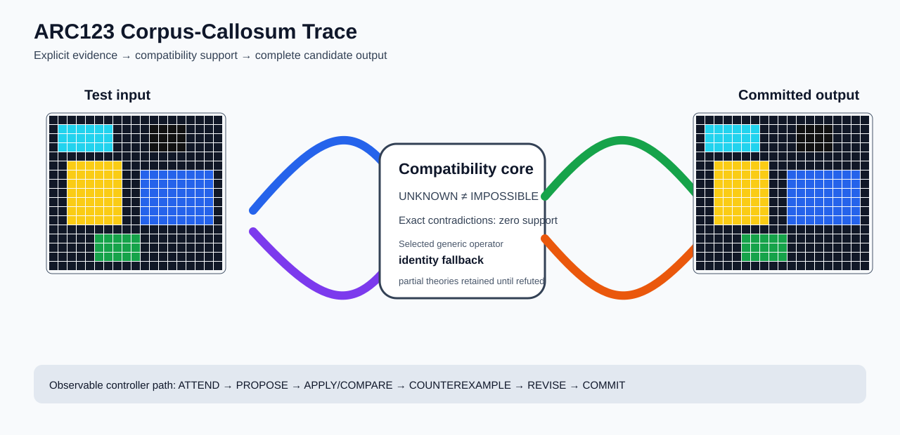

# ARC1 `4347f46a` P0008 Brain Surgery Report

## Outcome: NO — TEST CELLS DO NOT ALL MATCH

- **Compared positions:** 323
- **Mismatched cells:** 53
- **Training compatibility:** `False`
- **Fallback used:** `True`
- **Selected hypothesis:** `fallback_identity_complete_grid`
- **Source commit:** `085f6dbe39050afac3d1d743f840bac95b1a8d1c`
- **Frozen controller commit:** `4bed6c917523bc2baa05eec69f67303805d88dae`

## Live-Agent Boundary

The controller receives only visible training input/output examples and test inputs. It receives no task ID, imported cohort label, GT feature record, GT solver, historical decomposition, or held-out output before committing a complete grid. The expected output appears only in the post-answer V&V section.

## Corpus-Callosum Visualization



- Full explicit event record: [`learning_trace.json`](learning_trace.json)

## Frozen Measurement

This task was evaluated with the controller and operator configuration pinned before the frozen cohort was run. A result in this packet cannot alter that controller configuration.

## Post-Answer V&V

### Test case 1
- **All cells match:** `False`
- **Mismatched cells:** `53`
- **Prediction:
```json
[[0, 0, 0, 0, 0, 0, 0, 0, 0, 0, 0, 0, 0, 0, 0, 0, 0, 0, 0], [0, 8, 8, 8, 8, 8, 8, 0, 0, 0, 0, 6, 6, 6, 6, 0, 0, 0, 0], [0, 8, 8, 8, 8, 8, 8, 0, 0, 0, 0, 6, 6, 6, 6, 0, 0, 0, 0], [0, 8, 8, 8, 8, 8, 8, 0, 0, 0, 0, 6, 6, 6, 6, 0, 0, 0, 0], [0, 0, 0, 0, 0, 0, 0, 0, 0, 0, 0, 0, 0, 0, 0, 0, 0, 0, 0], [0, 0, 4, 4, 4, 4, 4, 4, 0, 0, 0, 0, 0, 0, 0, 0, 0, 0, 0], [0, 0, 4, 4, 4, 4, 4, 4, 0, 0, 1, 1, 1, 1, 1, 1, 1, 1, 0], [0, 0, 4, 4, 4, 4, 4, 4, 0, 0, 1, 1, 1, 1, 1, 1, 1, 1, 0], [0, 0, 4, 4, 4, 4, 4, 4, 0, 0, 1, 1, 1, 1, 1, 1, 1, 1, 0], [0, 0, 4, 4, 4, 4, 4, 4, 0, 0, 1, 1, 1, 1, 1, 1, 1, 1, 0], [0, 0, 4, 4, 4, 4, 4, 4, 0, 0, 1, 1, 1, 1, 1, 1, 1, 1, 0], [0, 0, 4, 4, 4, 4, 4, 4, 0, 0, 1, 1, 1, 1, 1, 1, 1, 1, 0], [0, 0, 0, 0, 0, 0, 0, 0, 0, 0, 0, 0, 0, 0, 0, 0, 0, 0, 0], [0, 0, 0, 0, 0, 3, 3, 3, 3, 3, 0, 0, 0, 0, 0, 0, 0, 0, 0], [0, 0, 0, 0, 0, 3, 3, 3, 3, 3, 0, 0, 0, 0, 0, 0, 0, 0, 0], [0, 0, 0, 0, 0, 3, 3, 3, 3, 3, 0, 0, 0, 0, 0, 0, 0, 0, 0], [0, 0, 0, 0, 0, 0, 0, 0, 0, 0, 0, 0, 0, 0, 0, 0, 0, 0, 0]]
```
- **Expected output (post-answer only):**
```json
[[0, 0, 0, 0, 0, 0, 0, 0, 0, 0, 0, 0, 0, 0, 0, 0, 0, 0, 0], [0, 8, 8, 8, 8, 8, 8, 0, 0, 0, 0, 6, 6, 6, 6, 0, 0, 0, 0], [0, 8, 0, 0, 0, 0, 8, 0, 0, 0, 0, 6, 0, 0, 6, 0, 0, 0, 0], [0, 8, 8, 8, 8, 8, 8, 0, 0, 0, 0, 6, 6, 6, 6, 0, 0, 0, 0], [0, 0, 0, 0, 0, 0, 0, 0, 0, 0, 0, 0, 0, 0, 0, 0, 0, 0, 0], [0, 0, 4, 4, 4, 4, 4, 4, 0, 0, 0, 0, 0, 0, 0, 0, 0, 0, 0], [0, 0, 4, 0, 0, 0, 0, 4, 0, 0, 1, 1, 1, 1, 1, 1, 1, 1, 0], [0, 0, 4, 0, 0, 0, 0, 4, 0, 0, 1, 0, 0, 0, 0, 0, 0, 1, 0], [0, 0, 4, 0, 0, 0, 0, 4, 0, 0, 1, 0, 0, 0, 0, 0, 0, 1, 0], [0, 0, 4, 0, 0, 0, 0, 4, 0, 0, 1, 0, 0, 0, 0, 0, 0, 1, 0], [0, 0, 4, 0, 0, 0, 0, 4, 0, 0, 1, 0, 0, 0, 0, 0, 0, 1, 0], [0, 0, 4, 4, 4, 4, 4, 4, 0, 0, 1, 1, 1, 1, 1, 1, 1, 1, 0], [0, 0, 0, 0, 0, 0, 0, 0, 0, 0, 0, 0, 0, 0, 0, 0, 0, 0, 0], [0, 0, 0, 0, 0, 3, 3, 3, 3, 3, 0, 0, 0, 0, 0, 0, 0, 0, 0], [0, 0, 0, 0, 0, 3, 0, 0, 0, 3, 0, 0, 0, 0, 0, 0, 0, 0, 0], [0, 0, 0, 0, 0, 3, 3, 3, 3, 3, 0, 0, 0, 0, 0, 0, 0, 0, 0], [0, 0, 0, 0, 0, 0, 0, 0, 0, 0, 0, 0, 0, 0, 0, 0, 0, 0, 0]]
```

## Observable IHL Walkthrough

The record contains explicit actions, predictions, feedback, and revisions; it does not claim or store hidden model reasoning.

### Action totals

- `ADD_CONDITION`: 1
- `APPLY_HYPOTHESIS`: 248
- `ATTEND`: 248
- `BIND_PARAMETER`: 1
- `CHOOSE_NEXT_DEMO`: 248
- `COMMIT`: 1
- `COMPARE`: 248
- `COMPOSE_RULE`: 7
- `EXPLAIN_RESIDUAL`: 7
- `FIND_COUNTEREXAMPLE`: 8
- `PROPOSE`: 1
- `SPECIALIZE`: 84

### Decision milestones

- `0` `PROPOSE` — `{"parent_theory_id":"T0000","rule":{"description_length":1,"name":"identity","operation":"identity","parameters":{},"rule_id":"identity","scope":{"kind":"all","value":null}},"stage":"initial_generic_theories","theory_id":"T0001"}`
- `2` `ATTEND` — `{"reason":"initial_highest_observed_change_and_color_discrimination","selected_demo":0,"selected_region":{"column":2,"row":2},"theory_id":"T0001"}`
- `6` `ATTEND` — `{"reason":"counterexample_requires_visible_conditional_evidence:unseen_demo_selected_for_residual_version_space_discrimination","selected_demo":2,"selected_region":{"column":3,"row":2},"theory_id":"T0001"}`
- `10` `ATTEND` — `{"reason":"counterexample_requires_visible_conditional_evidence:unseen_demo_selected_for_residual_version_space_discrimination","selected_demo":1,"selected_region":{"column":2,"row":2},"theory_id":"T0001"}`
- `16` `SPECIALIZE` — `{"added_rule":{"description_length":4,"name":"row_span_fill(fill_color=8,seed_color=8)","operation":"full_operator","parameters":{"fill_color":8,"operator":"row_span_fill","seed_color":8},"rule_id":"structural-row_span_fill","scope":{"kind":"all","value":null}},"parent_theory_id":"T0001","reason":"unexplained_residual_proposed_generic_structural_rule","theory_id":"T0003"}`
- `17` `SPECIALIZE` — `{"added_rule":{"description_length":4,"name":"row_span_fill(fill_color=8,seed_color=7)","operation":"full_operator","parameters":{"fill_color":8,"operator":"row_span_fill","seed_color":7},"rule_id":"structural-row_span_fill","scope":{"kind":"all","value":null}},"parent_theory_id":"T0001","reason":"unexplained_residual_proposed_generic_structural_rule","theory_id":"T0004"}`
- `18` `SPECIALIZE` — `{"added_rule":{"description_length":4,"name":"row_span_fill(fill_color=8,seed_color=6)","operation":"full_operator","parameters":{"fill_color":8,"operator":"row_span_fill","seed_color":6},"rule_id":"structural-row_span_fill","scope":{"kind":"all","value":null}},"parent_theory_id":"T0001","reason":"unexplained_residual_proposed_generic_structural_rule","theory_id":"T0005"}`
- `19` `SPECIALIZE` — `{"added_rule":{"description_length":4,"name":"row_span_fill(fill_color=8,seed_color=5)","operation":"full_operator","parameters":{"fill_color":8,"operator":"row_span_fill","seed_color":5},"rule_id":"structural-row_span_fill","scope":{"kind":"all","value":null}},"parent_theory_id":"T0001","reason":"unexplained_residual_proposed_generic_structural_rule","theory_id":"T0006"}`
- `20` `SPECIALIZE` — `{"added_rule":{"description_length":4,"name":"row_span_fill(fill_color=8,seed_color=4)","operation":"full_operator","parameters":{"fill_color":8,"operator":"row_span_fill","seed_color":4},"rule_id":"structural-row_span_fill","scope":{"kind":"all","value":null}},"parent_theory_id":"T0001","reason":"unexplained_residual_proposed_generic_structural_rule","theory_id":"T0007"}`
- `21` `SPECIALIZE` — `{"added_rule":{"description_length":4,"name":"row_span_fill(fill_color=8,seed_color=3)","operation":"full_operator","parameters":{"fill_color":8,"operator":"row_span_fill","seed_color":3},"rule_id":"structural-row_span_fill","scope":{"kind":"all","value":null}},"parent_theory_id":"T0001","reason":"unexplained_residual_proposed_generic_structural_rule","theory_id":"T0008"}`
- `22` `SPECIALIZE` — `{"added_rule":{"description_length":4,"name":"row_span_fill(fill_color=8,seed_color=2)","operation":"full_operator","parameters":{"fill_color":8,"operator":"row_span_fill","seed_color":2},"rule_id":"structural-row_span_fill","scope":{"kind":"all","value":null}},"parent_theory_id":"T0001","reason":"unexplained_residual_proposed_generic_structural_rule","theory_id":"T0009"}`
- `23` `SPECIALIZE` — `{"added_rule":{"description_length":4,"name":"row_span_fill(fill_color=7,seed_color=8)","operation":"full_operator","parameters":{"fill_color":7,"operator":"row_span_fill","seed_color":8},"rule_id":"structural-row_span_fill","scope":{"kind":"all","value":null}},"parent_theory_id":"T0001","reason":"unexplained_residual_proposed_generic_structural_rule","theory_id":"T0010"}`
- `24` `SPECIALIZE` — `{"added_rule":{"description_length":4,"name":"row_span_fill(fill_color=7,seed_color=7)","operation":"full_operator","parameters":{"fill_color":7,"operator":"row_span_fill","seed_color":7},"rule_id":"structural-row_span_fill","scope":{"kind":"all","value":null}},"parent_theory_id":"T0001","reason":"unexplained_residual_proposed_generic_structural_rule","theory_id":"T0011"}`
- `25` `SPECIALIZE` — `{"added_rule":{"description_length":4,"name":"row_span_fill(fill_color=7,seed_color=6)","operation":"full_operator","parameters":{"fill_color":7,"operator":"row_span_fill","seed_color":6},"rule_id":"structural-row_span_fill","scope":{"kind":"all","value":null}},"parent_theory_id":"T0001","reason":"unexplained_residual_proposed_generic_structural_rule","theory_id":"T0012"}`
- `26` `SPECIALIZE` — `{"added_rule":{"description_length":4,"name":"row_span_fill(fill_color=7,seed_color=5)","operation":"full_operator","parameters":{"fill_color":7,"operator":"row_span_fill","seed_color":5},"rule_id":"structural-row_span_fill","scope":{"kind":"all","value":null}},"parent_theory_id":"T0001","reason":"unexplained_residual_proposed_generic_structural_rule","theory_id":"T0013"}`
- `27` `SPECIALIZE` — `{"added_rule":{"description_length":4,"name":"row_span_fill(fill_color=7,seed_color=4)","operation":"full_operator","parameters":{"fill_color":7,"operator":"row_span_fill","seed_color":4},"rule_id":"structural-row_span_fill","scope":{"kind":"all","value":null}},"parent_theory_id":"T0001","reason":"unexplained_residual_proposed_generic_structural_rule","theory_id":"T0014"}`
- `29` `ATTEND` — `{"reason":"initial_highest_observed_change_and_color_discrimination","selected_demo":0,"selected_region":{"column":1,"row":1},"theory_id":"T0002"}`
- `33` `ATTEND` — `{"reason":"initial_highest_observed_change_and_color_discrimination","selected_demo":0,"selected_region":{"column":2,"row":2},"theory_id":"T0003"}`
- `37` `ATTEND` — `{"reason":"initial_highest_observed_change_and_color_discrimination","selected_demo":0,"selected_region":{"column":2,"row":2},"theory_id":"T0004"}`
- `41` `ATTEND` — `{"reason":"initial_highest_observed_change_and_color_discrimination","selected_demo":0,"selected_region":{"column":2,"row":2},"theory_id":"T0005"}`
- `45` `ATTEND` — `{"reason":"initial_highest_observed_change_and_color_discrimination","selected_demo":0,"selected_region":{"column":2,"row":2},"theory_id":"T0006"}`
- `49` `ATTEND` — `{"reason":"initial_highest_observed_change_and_color_discrimination","selected_demo":0,"selected_region":{"column":2,"row":2},"theory_id":"T0007"}`
- `53` `ATTEND` — `{"reason":"initial_highest_observed_change_and_color_discrimination","selected_demo":0,"selected_region":{"column":2,"row":2},"theory_id":"T0008"}`
- `57` `ATTEND` — `{"reason":"initial_highest_observed_change_and_color_discrimination","selected_demo":0,"selected_region":{"column":2,"row":2},"theory_id":"T0009"}`
- `61` `ATTEND` — `{"reason":"initial_highest_observed_change_and_color_discrimination","selected_demo":0,"selected_region":{"column":2,"row":2},"theory_id":"T0010"}`
- `65` `ATTEND` — `{"reason":"initial_highest_observed_change_and_color_discrimination","selected_demo":0,"selected_region":{"column":2,"row":2},"theory_id":"T0011"}`
- `69` `ATTEND` — `{"reason":"initial_highest_observed_change_and_color_discrimination","selected_demo":0,"selected_region":{"column":2,"row":2},"theory_id":"T0012"}`
- `73` `ATTEND` — `{"reason":"initial_highest_observed_change_and_color_discrimination","selected_demo":0,"selected_region":{"column":2,"row":2},"theory_id":"T0013"}`
- `77` `ATTEND` — `{"reason":"counterexample_requires_visible_conditional_evidence:unseen_demo_selected_for_residual_version_space_discrimination","selected_demo":2,"selected_region":{"column":3,"row":2},"theory_id":"T0003"}`
- `81` `ATTEND` — `{"reason":"counterexample_requires_visible_conditional_evidence:unseen_demo_selected_for_residual_version_space_discrimination","selected_demo":2,"selected_region":{"column":3,"row":2},"theory_id":"T0004"}`
- `85` `ATTEND` — `{"reason":"counterexample_requires_visible_conditional_evidence:unseen_demo_selected_for_residual_version_space_discrimination","selected_demo":2,"selected_region":{"column":3,"row":2},"theory_id":"T0005"}`
- `89` `ATTEND` — `{"reason":"counterexample_requires_visible_conditional_evidence:unseen_demo_selected_for_residual_version_space_discrimination","selected_demo":2,"selected_region":{"column":3,"row":2},"theory_id":"T0006"}`
- `93` `ATTEND` — `{"reason":"counterexample_requires_visible_conditional_evidence:unseen_demo_selected_for_residual_version_space_discrimination","selected_demo":2,"selected_region":{"column":3,"row":2},"theory_id":"T0007"}`
- `97` `ATTEND` — `{"reason":"counterexample_requires_visible_conditional_evidence:unseen_demo_selected_for_residual_version_space_discrimination","selected_demo":2,"selected_region":{"column":3,"row":2},"theory_id":"T0008"}`
- `101` `ATTEND` — `{"reason":"counterexample_requires_visible_conditional_evidence:unseen_demo_selected_for_residual_version_space_discrimination","selected_demo":2,"selected_region":{"column":3,"row":2},"theory_id":"T0009"}`
- `105` `ATTEND` — `{"reason":"counterexample_requires_visible_conditional_evidence:unseen_demo_selected_for_residual_version_space_discrimination","selected_demo":2,"selected_region":{"column":3,"row":2},"theory_id":"T0010"}`
- `109` `ATTEND` — `{"reason":"counterexample_requires_visible_conditional_evidence:unseen_demo_selected_for_residual_version_space_discrimination","selected_demo":2,"selected_region":{"column":3,"row":2},"theory_id":"T0011"}`
- `113` `ATTEND` — `{"reason":"counterexample_requires_visible_conditional_evidence:unseen_demo_selected_for_residual_version_space_discrimination","selected_demo":2,"selected_region":{"column":3,"row":2},"theory_id":"T0012"}`
- `117` `ATTEND` — `{"reason":"counterexample_requires_visible_conditional_evidence:unseen_demo_selected_for_residual_version_space_discrimination","selected_demo":2,"selected_region":{"column":3,"row":2},"theory_id":"T0013"}`
- `121` `ATTEND` — `{"reason":"counterexample_requires_visible_conditional_evidence:unseen_demo_selected_for_residual_version_space_discrimination","selected_demo":2,"selected_region":{"column":3,"row":2},"theory_id":"T0002"}`
- `125` `ATTEND` — `{"reason":"counterexample_requires_visible_conditional_evidence:unseen_demo_selected_for_residual_version_space_discrimination","selected_demo":1,"selected_region":{"column":2,"row":2},"theory_id":"T0003"}`
- `129` `ATTEND` — `{"reason":"counterexample_requires_visible_conditional_evidence:unseen_demo_selected_for_residual_version_space_discrimination","selected_demo":1,"selected_region":{"column":2,"row":2},"theory_id":"T0004"}`
- `133` `ATTEND` — `{"reason":"counterexample_requires_visible_conditional_evidence:unseen_demo_selected_for_residual_version_space_discrimination","selected_demo":1,"selected_region":{"column":2,"row":2},"theory_id":"T0005"}`
- `137` `ATTEND` — `{"reason":"counterexample_requires_visible_conditional_evidence:unseen_demo_selected_for_residual_version_space_discrimination","selected_demo":1,"selected_region":{"column":2,"row":2},"theory_id":"T0006"}`
- `141` `ATTEND` — `{"reason":"counterexample_requires_visible_conditional_evidence:unseen_demo_selected_for_residual_version_space_discrimination","selected_demo":1,"selected_region":{"column":2,"row":2},"theory_id":"T0007"}`
- `145` `ATTEND` — `{"reason":"counterexample_requires_visible_conditional_evidence:unseen_demo_selected_for_residual_version_space_discrimination","selected_demo":1,"selected_region":{"column":2,"row":2},"theory_id":"T0008"}`
- `149` `ATTEND` — `{"reason":"counterexample_requires_visible_conditional_evidence:unseen_demo_selected_for_residual_version_space_discrimination","selected_demo":1,"selected_region":{"column":2,"row":2},"theory_id":"T0009"}`
- `153` `ATTEND` — `{"reason":"counterexample_requires_visible_conditional_evidence:unseen_demo_selected_for_residual_version_space_discrimination","selected_demo":1,"selected_region":{"column":2,"row":2},"theory_id":"T0010"}`
- `157` `ATTEND` — `{"reason":"counterexample_requires_visible_conditional_evidence:unseen_demo_selected_for_residual_version_space_discrimination","selected_demo":1,"selected_region":{"column":2,"row":2},"theory_id":"T0011"}`
- `161` `ATTEND` — `{"reason":"counterexample_requires_visible_conditional_evidence:unseen_demo_selected_for_residual_version_space_discrimination","selected_demo":1,"selected_region":{"column":2,"row":2},"theory_id":"T0012"}`
- `165` `ATTEND` — `{"reason":"counterexample_requires_visible_conditional_evidence:unseen_demo_selected_for_residual_version_space_discrimination","selected_demo":1,"selected_region":{"column":2,"row":2},"theory_id":"T0013"}`
- `171` `SPECIALIZE` — `{"added_rule":{"description_length":4,"name":"row_span_fill(fill_color=8,seed_color=7)","operation":"full_operator","parameters":{"fill_color":8,"operator":"row_span_fill","seed_color":7},"rule_id":"structural-row_span_fill","scope":{"kind":"all","value":null}},"parent_theory_id":"T0003","reason":"unexplained_residual_proposed_generic_structural_rule","theory_id":"T0016"}`
- `172` `SPECIALIZE` — `{"added_rule":{"description_length":4,"name":"row_span_fill(fill_color=8,seed_color=6)","operation":"full_operator","parameters":{"fill_color":8,"operator":"row_span_fill","seed_color":6},"rule_id":"structural-row_span_fill","scope":{"kind":"all","value":null}},"parent_theory_id":"T0003","reason":"unexplained_residual_proposed_generic_structural_rule","theory_id":"T0017"}`
- `173` `SPECIALIZE` — `{"added_rule":{"description_length":4,"name":"row_span_fill(fill_color=8,seed_color=5)","operation":"full_operator","parameters":{"fill_color":8,"operator":"row_span_fill","seed_color":5},"rule_id":"structural-row_span_fill","scope":{"kind":"all","value":null}},"parent_theory_id":"T0003","reason":"unexplained_residual_proposed_generic_structural_rule","theory_id":"T0018"}`
- `174` `SPECIALIZE` — `{"added_rule":{"description_length":4,"name":"row_span_fill(fill_color=8,seed_color=4)","operation":"full_operator","parameters":{"fill_color":8,"operator":"row_span_fill","seed_color":4},"rule_id":"structural-row_span_fill","scope":{"kind":"all","value":null}},"parent_theory_id":"T0003","reason":"unexplained_residual_proposed_generic_structural_rule","theory_id":"T0019"}`
- `175` `SPECIALIZE` — `{"added_rule":{"description_length":4,"name":"row_span_fill(fill_color=8,seed_color=3)","operation":"full_operator","parameters":{"fill_color":8,"operator":"row_span_fill","seed_color":3},"rule_id":"structural-row_span_fill","scope":{"kind":"all","value":null}},"parent_theory_id":"T0003","reason":"unexplained_residual_proposed_generic_structural_rule","theory_id":"T0020"}`
- `176` `SPECIALIZE` — `{"added_rule":{"description_length":4,"name":"row_span_fill(fill_color=8,seed_color=2)","operation":"full_operator","parameters":{"fill_color":8,"operator":"row_span_fill","seed_color":2},"rule_id":"structural-row_span_fill","scope":{"kind":"all","value":null}},"parent_theory_id":"T0003","reason":"unexplained_residual_proposed_generic_structural_rule","theory_id":"T0021"}`
- `177` `SPECIALIZE` — `{"added_rule":{"description_length":4,"name":"row_span_fill(fill_color=7,seed_color=8)","operation":"full_operator","parameters":{"fill_color":7,"operator":"row_span_fill","seed_color":8},"rule_id":"structural-row_span_fill","scope":{"kind":"all","value":null}},"parent_theory_id":"T0003","reason":"unexplained_residual_proposed_generic_structural_rule","theory_id":"T0022"}`
- `178` `SPECIALIZE` — `{"added_rule":{"description_length":4,"name":"row_span_fill(fill_color=7,seed_color=7)","operation":"full_operator","parameters":{"fill_color":7,"operator":"row_span_fill","seed_color":7},"rule_id":"structural-row_span_fill","scope":{"kind":"all","value":null}},"parent_theory_id":"T0003","reason":"unexplained_residual_proposed_generic_structural_rule","theory_id":"T0023"}`
- `179` `SPECIALIZE` — `{"added_rule":{"description_length":4,"name":"row_span_fill(fill_color=7,seed_color=6)","operation":"full_operator","parameters":{"fill_color":7,"operator":"row_span_fill","seed_color":6},"rule_id":"structural-row_span_fill","scope":{"kind":"all","value":null}},"parent_theory_id":"T0003","reason":"unexplained_residual_proposed_generic_structural_rule","theory_id":"T0024"}`
- `180` `SPECIALIZE` — `{"added_rule":{"description_length":4,"name":"row_span_fill(fill_color=7,seed_color=5)","operation":"full_operator","parameters":{"fill_color":7,"operator":"row_span_fill","seed_color":5},"rule_id":"structural-row_span_fill","scope":{"kind":"all","value":null}},"parent_theory_id":"T0003","reason":"unexplained_residual_proposed_generic_structural_rule","theory_id":"T0025"}`
- `181` `SPECIALIZE` — `{"added_rule":{"description_length":4,"name":"row_span_fill(fill_color=7,seed_color=4)","operation":"full_operator","parameters":{"fill_color":7,"operator":"row_span_fill","seed_color":4},"rule_id":"structural-row_span_fill","scope":{"kind":"all","value":null}},"parent_theory_id":"T0003","reason":"unexplained_residual_proposed_generic_structural_rule","theory_id":"T0026"}`
- `183` `ATTEND` — `{"reason":"initial_highest_observed_change_and_color_discrimination","selected_demo":0,"selected_region":{"column":2,"row":2},"theory_id":"T0015"}`
- `187` `ATTEND` — `{"reason":"initial_highest_observed_change_and_color_discrimination","selected_demo":0,"selected_region":{"column":2,"row":2},"theory_id":"T0016"}`
- `191` `ATTEND` — `{"reason":"initial_highest_observed_change_and_color_discrimination","selected_demo":0,"selected_region":{"column":2,"row":2},"theory_id":"T0017"}`
- `195` `ATTEND` — `{"reason":"initial_highest_observed_change_and_color_discrimination","selected_demo":0,"selected_region":{"column":2,"row":2},"theory_id":"T0018"}`
- `199` `ATTEND` — `{"reason":"initial_highest_observed_change_and_color_discrimination","selected_demo":0,"selected_region":{"column":2,"row":2},"theory_id":"T0019"}`
- `203` `ATTEND` — `{"reason":"initial_highest_observed_change_and_color_discrimination","selected_demo":0,"selected_region":{"column":2,"row":2},"theory_id":"T0020"}`
- `207` `ATTEND` — `{"reason":"initial_highest_observed_change_and_color_discrimination","selected_demo":0,"selected_region":{"column":2,"row":2},"theory_id":"T0021"}`
- `211` `ATTEND` — `{"reason":"initial_highest_observed_change_and_color_discrimination","selected_demo":0,"selected_region":{"column":2,"row":2},"theory_id":"T0022"}`
- `215` `ATTEND` — `{"reason":"initial_highest_observed_change_and_color_discrimination","selected_demo":0,"selected_region":{"column":2,"row":2},"theory_id":"T0023"}`
- `219` `ATTEND` — `{"reason":"initial_highest_observed_change_and_color_discrimination","selected_demo":0,"selected_region":{"column":2,"row":2},"theory_id":"T0024"}`
- `223` `ATTEND` — `{"reason":"initial_highest_observed_change_and_color_discrimination","selected_demo":0,"selected_region":{"column":2,"row":2},"theory_id":"T0025"}`
- `227` `ATTEND` — `{"reason":"initial_highest_observed_change_and_color_discrimination","selected_demo":0,"selected_region":{"column":2,"row":2},"theory_id":"T0026"}`
- `231` `ATTEND` — `{"reason":"counterexample_requires_visible_conditional_evidence:unseen_demo_selected_for_residual_version_space_discrimination","selected_demo":2,"selected_region":{"column":3,"row":2},"theory_id":"T0015"}`
- `235` `ATTEND` — `{"reason":"counterexample_requires_visible_conditional_evidence:unseen_demo_selected_for_residual_version_space_discrimination","selected_demo":2,"selected_region":{"column":3,"row":2},"theory_id":"T0016"}`
- `239` `ATTEND` — `{"reason":"counterexample_requires_visible_conditional_evidence:unseen_demo_selected_for_residual_version_space_discrimination","selected_demo":2,"selected_region":{"column":3,"row":2},"theory_id":"T0017"}`
- `243` `ATTEND` — `{"reason":"counterexample_requires_visible_conditional_evidence:unseen_demo_selected_for_residual_version_space_discrimination","selected_demo":2,"selected_region":{"column":3,"row":2},"theory_id":"T0018"}`
- `247` `ATTEND` — `{"reason":"counterexample_requires_visible_conditional_evidence:unseen_demo_selected_for_residual_version_space_discrimination","selected_demo":2,"selected_region":{"column":3,"row":2},"theory_id":"T0019"}`
- `251` `ATTEND` — `{"reason":"counterexample_requires_visible_conditional_evidence:unseen_demo_selected_for_residual_version_space_discrimination","selected_demo":2,"selected_region":{"column":3,"row":2},"theory_id":"T0020"}`
- `255` `ATTEND` — `{"reason":"counterexample_requires_visible_conditional_evidence:unseen_demo_selected_for_residual_version_space_discrimination","selected_demo":2,"selected_region":{"column":3,"row":2},"theory_id":"T0021"}`
- `259` `ATTEND` — `{"reason":"counterexample_requires_visible_conditional_evidence:unseen_demo_selected_for_residual_version_space_discrimination","selected_demo":2,"selected_region":{"column":3,"row":2},"theory_id":"T0022"}`
- `263` `ATTEND` — `{"reason":"counterexample_requires_visible_conditional_evidence:unseen_demo_selected_for_residual_version_space_discrimination","selected_demo":2,"selected_region":{"column":3,"row":2},"theory_id":"T0023"}`
- `267` `ATTEND` — `{"reason":"counterexample_requires_visible_conditional_evidence:unseen_demo_selected_for_residual_version_space_discrimination","selected_demo":2,"selected_region":{"column":3,"row":2},"theory_id":"T0024"}`
- `271` `ATTEND` — `{"reason":"counterexample_requires_visible_conditional_evidence:unseen_demo_selected_for_residual_version_space_discrimination","selected_demo":2,"selected_region":{"column":3,"row":2},"theory_id":"T0025"}`
- `275` `ATTEND` — `{"reason":"counterexample_requires_visible_conditional_evidence:unseen_demo_selected_for_residual_version_space_discrimination","selected_demo":2,"selected_region":{"column":3,"row":2},"theory_id":"T0026"}`
- `279` `ATTEND` — `{"reason":"counterexample_requires_visible_conditional_evidence:unseen_demo_selected_for_residual_version_space_discrimination","selected_demo":1,"selected_region":{"column":2,"row":2},"theory_id":"T0015"}`
- `283` `ATTEND` — `{"reason":"counterexample_requires_visible_conditional_evidence:unseen_demo_selected_for_residual_version_space_discrimination","selected_demo":1,"selected_region":{"column":2,"row":2},"theory_id":"T0016"}`
- `287` `ATTEND` — `{"reason":"counterexample_requires_visible_conditional_evidence:unseen_demo_selected_for_residual_version_space_discrimination","selected_demo":1,"selected_region":{"column":2,"row":2},"theory_id":"T0017"}`
- `291` `ATTEND` — `{"reason":"counterexample_requires_visible_conditional_evidence:unseen_demo_selected_for_residual_version_space_discrimination","selected_demo":1,"selected_region":{"column":2,"row":2},"theory_id":"T0018"}`
- `295` `ATTEND` — `{"reason":"counterexample_requires_visible_conditional_evidence:unseen_demo_selected_for_residual_version_space_discrimination","selected_demo":1,"selected_region":{"column":2,"row":2},"theory_id":"T0019"}`
- `299` `ATTEND` — `{"reason":"counterexample_requires_visible_conditional_evidence:unseen_demo_selected_for_residual_version_space_discrimination","selected_demo":1,"selected_region":{"column":2,"row":2},"theory_id":"T0020"}`
- `303` `ATTEND` — `{"reason":"counterexample_requires_visible_conditional_evidence:unseen_demo_selected_for_residual_version_space_discrimination","selected_demo":1,"selected_region":{"column":2,"row":2},"theory_id":"T0021"}`
- `307` `ATTEND` — `{"reason":"counterexample_requires_visible_conditional_evidence:unseen_demo_selected_for_residual_version_space_discrimination","selected_demo":1,"selected_region":{"column":2,"row":2},"theory_id":"T0022"}`
- `311` `ATTEND` — `{"reason":"counterexample_requires_visible_conditional_evidence:unseen_demo_selected_for_residual_version_space_discrimination","selected_demo":1,"selected_region":{"column":2,"row":2},"theory_id":"T0023"}`
- `315` `ATTEND` — `{"reason":"counterexample_requires_visible_conditional_evidence:unseen_demo_selected_for_residual_version_space_discrimination","selected_demo":1,"selected_region":{"column":2,"row":2},"theory_id":"T0024"}`
- `319` `ATTEND` — `{"reason":"counterexample_requires_visible_conditional_evidence:unseen_demo_selected_for_residual_version_space_discrimination","selected_demo":1,"selected_region":{"column":2,"row":2},"theory_id":"T0025"}`
- `323` `ATTEND` — `{"reason":"counterexample_requires_visible_conditional_evidence:unseen_demo_selected_for_residual_version_space_discrimination","selected_demo":1,"selected_region":{"column":2,"row":2},"theory_id":"T0026"}`
- `329` `SPECIALIZE` — `{"added_rule":{"description_length":4,"name":"row_span_fill(fill_color=8,seed_color=8)","operation":"full_operator","parameters":{"fill_color":8,"operator":"row_span_fill","seed_color":8},"rule_id":"structural-row_span_fill","scope":{"kind":"all","value":null}},"parent_theory_id":"T0015","reason":"unexplained_residual_proposed_generic_structural_rule","theory_id":"T0028"}`
- `330` `SPECIALIZE` — `{"added_rule":{"description_length":4,"name":"row_span_fill(fill_color=8,seed_color=7)","operation":"full_operator","parameters":{"fill_color":8,"operator":"row_span_fill","seed_color":7},"rule_id":"structural-row_span_fill","scope":{"kind":"all","value":null}},"parent_theory_id":"T0015","reason":"unexplained_residual_proposed_generic_structural_rule","theory_id":"T0029"}`
- `331` `SPECIALIZE` — `{"added_rule":{"description_length":4,"name":"row_span_fill(fill_color=8,seed_color=6)","operation":"full_operator","parameters":{"fill_color":8,"operator":"row_span_fill","seed_color":6},"rule_id":"structural-row_span_fill","scope":{"kind":"all","value":null}},"parent_theory_id":"T0015","reason":"unexplained_residual_proposed_generic_structural_rule","theory_id":"T0030"}`
- `332` `SPECIALIZE` — `{"added_rule":{"description_length":4,"name":"row_span_fill(fill_color=8,seed_color=5)","operation":"full_operator","parameters":{"fill_color":8,"operator":"row_span_fill","seed_color":5},"rule_id":"structural-row_span_fill","scope":{"kind":"all","value":null}},"parent_theory_id":"T0015","reason":"unexplained_residual_proposed_generic_structural_rule","theory_id":"T0031"}`
- `333` `SPECIALIZE` — `{"added_rule":{"description_length":4,"name":"row_span_fill(fill_color=8,seed_color=4)","operation":"full_operator","parameters":{"fill_color":8,"operator":"row_span_fill","seed_color":4},"rule_id":"structural-row_span_fill","scope":{"kind":"all","value":null}},"parent_theory_id":"T0015","reason":"unexplained_residual_proposed_generic_structural_rule","theory_id":"T0032"}`
- `334` `SPECIALIZE` — `{"added_rule":{"description_length":4,"name":"row_span_fill(fill_color=8,seed_color=3)","operation":"full_operator","parameters":{"fill_color":8,"operator":"row_span_fill","seed_color":3},"rule_id":"structural-row_span_fill","scope":{"kind":"all","value":null}},"parent_theory_id":"T0015","reason":"unexplained_residual_proposed_generic_structural_rule","theory_id":"T0033"}`
- `335` `SPECIALIZE` — `{"added_rule":{"description_length":4,"name":"row_span_fill(fill_color=8,seed_color=2)","operation":"full_operator","parameters":{"fill_color":8,"operator":"row_span_fill","seed_color":2},"rule_id":"structural-row_span_fill","scope":{"kind":"all","value":null}},"parent_theory_id":"T0015","reason":"unexplained_residual_proposed_generic_structural_rule","theory_id":"T0034"}`
- `336` `SPECIALIZE` — `{"added_rule":{"description_length":4,"name":"row_span_fill(fill_color=7,seed_color=8)","operation":"full_operator","parameters":{"fill_color":7,"operator":"row_span_fill","seed_color":8},"rule_id":"structural-row_span_fill","scope":{"kind":"all","value":null}},"parent_theory_id":"T0015","reason":"unexplained_residual_proposed_generic_structural_rule","theory_id":"T0035"}`
- `337` `SPECIALIZE` — `{"added_rule":{"description_length":4,"name":"row_span_fill(fill_color=7,seed_color=7)","operation":"full_operator","parameters":{"fill_color":7,"operator":"row_span_fill","seed_color":7},"rule_id":"structural-row_span_fill","scope":{"kind":"all","value":null}},"parent_theory_id":"T0015","reason":"unexplained_residual_proposed_generic_structural_rule","theory_id":"T0036"}`
- `338` `SPECIALIZE` — `{"added_rule":{"description_length":4,"name":"row_span_fill(fill_color=7,seed_color=6)","operation":"full_operator","parameters":{"fill_color":7,"operator":"row_span_fill","seed_color":6},"rule_id":"structural-row_span_fill","scope":{"kind":"all","value":null}},"parent_theory_id":"T0015","reason":"unexplained_residual_proposed_generic_structural_rule","theory_id":"T0037"}`
- `339` `SPECIALIZE` — `{"added_rule":{"description_length":4,"name":"row_span_fill(fill_color=7,seed_color=5)","operation":"full_operator","parameters":{"fill_color":7,"operator":"row_span_fill","seed_color":5},"rule_id":"structural-row_span_fill","scope":{"kind":"all","value":null}},"parent_theory_id":"T0015","reason":"unexplained_residual_proposed_generic_structural_rule","theory_id":"T0038"}`
- `340` `SPECIALIZE` — `{"added_rule":{"description_length":4,"name":"row_span_fill(fill_color=7,seed_color=4)","operation":"full_operator","parameters":{"fill_color":7,"operator":"row_span_fill","seed_color":4},"rule_id":"structural-row_span_fill","scope":{"kind":"all","value":null}},"parent_theory_id":"T0015","reason":"unexplained_residual_proposed_generic_structural_rule","theory_id":"T0039"}`
- `342` `ATTEND` — `{"reason":"initial_highest_observed_change_and_color_discrimination","selected_demo":0,"selected_region":{"column":1,"row":1},"theory_id":"T0027"}`
- `346` `ATTEND` — `{"reason":"initial_highest_observed_change_and_color_discrimination","selected_demo":0,"selected_region":{"column":2,"row":2},"theory_id":"T0028"}`
- `350` `ATTEND` — `{"reason":"initial_highest_observed_change_and_color_discrimination","selected_demo":0,"selected_region":{"column":2,"row":2},"theory_id":"T0029"}`
- `354` `ATTEND` — `{"reason":"initial_highest_observed_change_and_color_discrimination","selected_demo":0,"selected_region":{"column":2,"row":2},"theory_id":"T0030"}`
- `358` `ATTEND` — `{"reason":"initial_highest_observed_change_and_color_discrimination","selected_demo":0,"selected_region":{"column":2,"row":2},"theory_id":"T0031"}`
- `362` `ATTEND` — `{"reason":"initial_highest_observed_change_and_color_discrimination","selected_demo":0,"selected_region":{"column":2,"row":2},"theory_id":"T0032"}`
- `366` `ATTEND` — `{"reason":"initial_highest_observed_change_and_color_discrimination","selected_demo":0,"selected_region":{"column":2,"row":2},"theory_id":"T0033"}`
- `370` `ATTEND` — `{"reason":"initial_highest_observed_change_and_color_discrimination","selected_demo":0,"selected_region":{"column":2,"row":2},"theory_id":"T0034"}`
- `374` `ATTEND` — `{"reason":"initial_highest_observed_change_and_color_discrimination","selected_demo":0,"selected_region":{"column":2,"row":2},"theory_id":"T0035"}`
- `378` `ATTEND` — `{"reason":"initial_highest_observed_change_and_color_discrimination","selected_demo":0,"selected_region":{"column":2,"row":2},"theory_id":"T0036"}`
- `382` `ATTEND` — `{"reason":"initial_highest_observed_change_and_color_discrimination","selected_demo":0,"selected_region":{"column":2,"row":2},"theory_id":"T0037"}`
- `386` `ATTEND` — `{"reason":"initial_highest_observed_change_and_color_discrimination","selected_demo":0,"selected_region":{"column":2,"row":2},"theory_id":"T0038"}`
- `390` `ATTEND` — `{"reason":"counterexample_requires_visible_conditional_evidence:unseen_demo_selected_for_residual_version_space_discrimination","selected_demo":2,"selected_region":{"column":3,"row":2},"theory_id":"T0028"}`
- `394` `ATTEND` — `{"reason":"counterexample_requires_visible_conditional_evidence:unseen_demo_selected_for_residual_version_space_discrimination","selected_demo":2,"selected_region":{"column":3,"row":2},"theory_id":"T0029"}`
- `398` `ATTEND` — `{"reason":"counterexample_requires_visible_conditional_evidence:unseen_demo_selected_for_residual_version_space_discrimination","selected_demo":2,"selected_region":{"column":3,"row":2},"theory_id":"T0030"}`
- `402` `ATTEND` — `{"reason":"counterexample_requires_visible_conditional_evidence:unseen_demo_selected_for_residual_version_space_discrimination","selected_demo":2,"selected_region":{"column":3,"row":2},"theory_id":"T0031"}`
- `406` `ATTEND` — `{"reason":"counterexample_requires_visible_conditional_evidence:unseen_demo_selected_for_residual_version_space_discrimination","selected_demo":2,"selected_region":{"column":3,"row":2},"theory_id":"T0032"}`
- `410` `ATTEND` — `{"reason":"counterexample_requires_visible_conditional_evidence:unseen_demo_selected_for_residual_version_space_discrimination","selected_demo":2,"selected_region":{"column":3,"row":2},"theory_id":"T0033"}`
- `414` `ATTEND` — `{"reason":"counterexample_requires_visible_conditional_evidence:unseen_demo_selected_for_residual_version_space_discrimination","selected_demo":2,"selected_region":{"column":3,"row":2},"theory_id":"T0034"}`
- `418` `ATTEND` — `{"reason":"counterexample_requires_visible_conditional_evidence:unseen_demo_selected_for_residual_version_space_discrimination","selected_demo":2,"selected_region":{"column":3,"row":2},"theory_id":"T0035"}`
- `422` `ATTEND` — `{"reason":"counterexample_requires_visible_conditional_evidence:unseen_demo_selected_for_residual_version_space_discrimination","selected_demo":2,"selected_region":{"column":3,"row":2},"theory_id":"T0036"}`
- `426` `ATTEND` — `{"reason":"counterexample_requires_visible_conditional_evidence:unseen_demo_selected_for_residual_version_space_discrimination","selected_demo":2,"selected_region":{"column":3,"row":2},"theory_id":"T0037"}`
- `430` `ATTEND` — `{"reason":"counterexample_requires_visible_conditional_evidence:unseen_demo_selected_for_residual_version_space_discrimination","selected_demo":2,"selected_region":{"column":3,"row":2},"theory_id":"T0038"}`
- `434` `ATTEND` — `{"reason":"counterexample_requires_visible_conditional_evidence:unseen_demo_selected_for_residual_version_space_discrimination","selected_demo":2,"selected_region":{"column":3,"row":2},"theory_id":"T0027"}`
- `438` `ATTEND` — `{"reason":"counterexample_requires_visible_conditional_evidence:unseen_demo_selected_for_residual_version_space_discrimination","selected_demo":1,"selected_region":{"column":2,"row":2},"theory_id":"T0028"}`
- `442` `ATTEND` — `{"reason":"counterexample_requires_visible_conditional_evidence:unseen_demo_selected_for_residual_version_space_discrimination","selected_demo":1,"selected_region":{"column":2,"row":2},"theory_id":"T0029"}`
- `446` `ATTEND` — `{"reason":"counterexample_requires_visible_conditional_evidence:unseen_demo_selected_for_residual_version_space_discrimination","selected_demo":1,"selected_region":{"column":2,"row":2},"theory_id":"T0030"}`
- `450` `ATTEND` — `{"reason":"counterexample_requires_visible_conditional_evidence:unseen_demo_selected_for_residual_version_space_discrimination","selected_demo":1,"selected_region":{"column":2,"row":2},"theory_id":"T0031"}`
- `454` `ATTEND` — `{"reason":"counterexample_requires_visible_conditional_evidence:unseen_demo_selected_for_residual_version_space_discrimination","selected_demo":1,"selected_region":{"column":2,"row":2},"theory_id":"T0032"}`
- `458` `ATTEND` — `{"reason":"counterexample_requires_visible_conditional_evidence:unseen_demo_selected_for_residual_version_space_discrimination","selected_demo":1,"selected_region":{"column":2,"row":2},"theory_id":"T0033"}`
- `462` `ATTEND` — `{"reason":"counterexample_requires_visible_conditional_evidence:unseen_demo_selected_for_residual_version_space_discrimination","selected_demo":1,"selected_region":{"column":2,"row":2},"theory_id":"T0034"}`
- `466` `ATTEND` — `{"reason":"counterexample_requires_visible_conditional_evidence:unseen_demo_selected_for_residual_version_space_discrimination","selected_demo":1,"selected_region":{"column":2,"row":2},"theory_id":"T0035"}`
- `470` `ATTEND` — `{"reason":"counterexample_requires_visible_conditional_evidence:unseen_demo_selected_for_residual_version_space_discrimination","selected_demo":1,"selected_region":{"column":2,"row":2},"theory_id":"T0036"}`
- `474` `ATTEND` — `{"reason":"counterexample_requires_visible_conditional_evidence:unseen_demo_selected_for_residual_version_space_discrimination","selected_demo":1,"selected_region":{"column":2,"row":2},"theory_id":"T0037"}`
- `478` `ATTEND` — `{"reason":"counterexample_requires_visible_conditional_evidence:unseen_demo_selected_for_residual_version_space_discrimination","selected_demo":1,"selected_region":{"column":2,"row":2},"theory_id":"T0038"}`
- `484` `SPECIALIZE` — `{"added_rule":{"description_length":4,"name":"row_span_fill(fill_color=8,seed_color=7)","operation":"full_operator","parameters":{"fill_color":8,"operator":"row_span_fill","seed_color":7},"rule_id":"structural-row_span_fill","scope":{"kind":"all","value":null}},"parent_theory_id":"T0028","reason":"unexplained_residual_proposed_generic_structural_rule","theory_id":"T0041"}`
- `485` `SPECIALIZE` — `{"added_rule":{"description_length":4,"name":"row_span_fill(fill_color=8,seed_color=6)","operation":"full_operator","parameters":{"fill_color":8,"operator":"row_span_fill","seed_color":6},"rule_id":"structural-row_span_fill","scope":{"kind":"all","value":null}},"parent_theory_id":"T0028","reason":"unexplained_residual_proposed_generic_structural_rule","theory_id":"T0042"}`
- `486` `SPECIALIZE` — `{"added_rule":{"description_length":4,"name":"row_span_fill(fill_color=8,seed_color=5)","operation":"full_operator","parameters":{"fill_color":8,"operator":"row_span_fill","seed_color":5},"rule_id":"structural-row_span_fill","scope":{"kind":"all","value":null}},"parent_theory_id":"T0028","reason":"unexplained_residual_proposed_generic_structural_rule","theory_id":"T0043"}`
- `487` `SPECIALIZE` — `{"added_rule":{"description_length":4,"name":"row_span_fill(fill_color=8,seed_color=4)","operation":"full_operator","parameters":{"fill_color":8,"operator":"row_span_fill","seed_color":4},"rule_id":"structural-row_span_fill","scope":{"kind":"all","value":null}},"parent_theory_id":"T0028","reason":"unexplained_residual_proposed_generic_structural_rule","theory_id":"T0044"}`
- `488` `SPECIALIZE` — `{"added_rule":{"description_length":4,"name":"row_span_fill(fill_color=8,seed_color=3)","operation":"full_operator","parameters":{"fill_color":8,"operator":"row_span_fill","seed_color":3},"rule_id":"structural-row_span_fill","scope":{"kind":"all","value":null}},"parent_theory_id":"T0028","reason":"unexplained_residual_proposed_generic_structural_rule","theory_id":"T0045"}`
- `489` `SPECIALIZE` — `{"added_rule":{"description_length":4,"name":"row_span_fill(fill_color=8,seed_color=2)","operation":"full_operator","parameters":{"fill_color":8,"operator":"row_span_fill","seed_color":2},"rule_id":"structural-row_span_fill","scope":{"kind":"all","value":null}},"parent_theory_id":"T0028","reason":"unexplained_residual_proposed_generic_structural_rule","theory_id":"T0046"}`
- `490` `SPECIALIZE` — `{"added_rule":{"description_length":4,"name":"row_span_fill(fill_color=7,seed_color=8)","operation":"full_operator","parameters":{"fill_color":7,"operator":"row_span_fill","seed_color":8},"rule_id":"structural-row_span_fill","scope":{"kind":"all","value":null}},"parent_theory_id":"T0028","reason":"unexplained_residual_proposed_generic_structural_rule","theory_id":"T0047"}`
- `491` `SPECIALIZE` — `{"added_rule":{"description_length":4,"name":"row_span_fill(fill_color=7,seed_color=7)","operation":"full_operator","parameters":{"fill_color":7,"operator":"row_span_fill","seed_color":7},"rule_id":"structural-row_span_fill","scope":{"kind":"all","value":null}},"parent_theory_id":"T0028","reason":"unexplained_residual_proposed_generic_structural_rule","theory_id":"T0048"}`
- `492` `SPECIALIZE` — `{"added_rule":{"description_length":4,"name":"row_span_fill(fill_color=7,seed_color=6)","operation":"full_operator","parameters":{"fill_color":7,"operator":"row_span_fill","seed_color":6},"rule_id":"structural-row_span_fill","scope":{"kind":"all","value":null}},"parent_theory_id":"T0028","reason":"unexplained_residual_proposed_generic_structural_rule","theory_id":"T0049"}`
- `493` `SPECIALIZE` — `{"added_rule":{"description_length":4,"name":"row_span_fill(fill_color=7,seed_color=5)","operation":"full_operator","parameters":{"fill_color":7,"operator":"row_span_fill","seed_color":5},"rule_id":"structural-row_span_fill","scope":{"kind":"all","value":null}},"parent_theory_id":"T0028","reason":"unexplained_residual_proposed_generic_structural_rule","theory_id":"T0050"}`
- `494` `SPECIALIZE` — `{"added_rule":{"description_length":4,"name":"row_span_fill(fill_color=7,seed_color=4)","operation":"full_operator","parameters":{"fill_color":7,"operator":"row_span_fill","seed_color":4},"rule_id":"structural-row_span_fill","scope":{"kind":"all","value":null}},"parent_theory_id":"T0028","reason":"unexplained_residual_proposed_generic_structural_rule","theory_id":"T0051"}`
- `496` `ATTEND` — `{"reason":"initial_highest_observed_change_and_color_discrimination","selected_demo":0,"selected_region":{"column":1,"row":1},"theory_id":"T0040"}`
- `500` `ATTEND` — `{"reason":"initial_highest_observed_change_and_color_discrimination","selected_demo":0,"selected_region":{"column":2,"row":2},"theory_id":"T0041"}`
- `504` `ATTEND` — `{"reason":"initial_highest_observed_change_and_color_discrimination","selected_demo":0,"selected_region":{"column":2,"row":2},"theory_id":"T0042"}`
- `508` `ATTEND` — `{"reason":"initial_highest_observed_change_and_color_discrimination","selected_demo":0,"selected_region":{"column":2,"row":2},"theory_id":"T0043"}`
- `512` `ATTEND` — `{"reason":"initial_highest_observed_change_and_color_discrimination","selected_demo":0,"selected_region":{"column":2,"row":2},"theory_id":"T0044"}`
- `516` `ATTEND` — `{"reason":"initial_highest_observed_change_and_color_discrimination","selected_demo":0,"selected_region":{"column":2,"row":2},"theory_id":"T0045"}`
- `520` `ATTEND` — `{"reason":"initial_highest_observed_change_and_color_discrimination","selected_demo":0,"selected_region":{"column":2,"row":2},"theory_id":"T0046"}`
- `524` `ATTEND` — `{"reason":"initial_highest_observed_change_and_color_discrimination","selected_demo":0,"selected_region":{"column":2,"row":2},"theory_id":"T0047"}`
- `528` `ATTEND` — `{"reason":"initial_highest_observed_change_and_color_discrimination","selected_demo":0,"selected_region":{"column":2,"row":2},"theory_id":"T0048"}`
- `532` `ATTEND` — `{"reason":"initial_highest_observed_change_and_color_discrimination","selected_demo":0,"selected_region":{"column":2,"row":2},"theory_id":"T0049"}`
- `536` `ATTEND` — `{"reason":"initial_highest_observed_change_and_color_discrimination","selected_demo":0,"selected_region":{"column":2,"row":2},"theory_id":"T0050"}`
- `540` `ATTEND` — `{"reason":"initial_highest_observed_change_and_color_discrimination","selected_demo":0,"selected_region":{"column":2,"row":2},"theory_id":"T0051"}`
- `544` `ATTEND` — `{"reason":"counterexample_requires_visible_conditional_evidence:unseen_demo_selected_for_residual_version_space_discrimination","selected_demo":2,"selected_region":{"column":3,"row":2},"theory_id":"T0041"}`
- `548` `ATTEND` — `{"reason":"counterexample_requires_visible_conditional_evidence:unseen_demo_selected_for_residual_version_space_discrimination","selected_demo":2,"selected_region":{"column":3,"row":2},"theory_id":"T0042"}`
- `552` `ATTEND` — `{"reason":"counterexample_requires_visible_conditional_evidence:unseen_demo_selected_for_residual_version_space_discrimination","selected_demo":2,"selected_region":{"column":3,"row":2},"theory_id":"T0043"}`
- `556` `ATTEND` — `{"reason":"counterexample_requires_visible_conditional_evidence:unseen_demo_selected_for_residual_version_space_discrimination","selected_demo":2,"selected_region":{"column":3,"row":2},"theory_id":"T0044"}`
- `560` `ATTEND` — `{"reason":"counterexample_requires_visible_conditional_evidence:unseen_demo_selected_for_residual_version_space_discrimination","selected_demo":2,"selected_region":{"column":3,"row":2},"theory_id":"T0045"}`
- `564` `ATTEND` — `{"reason":"counterexample_requires_visible_conditional_evidence:unseen_demo_selected_for_residual_version_space_discrimination","selected_demo":2,"selected_region":{"column":3,"row":2},"theory_id":"T0046"}`
- `568` `ATTEND` — `{"reason":"counterexample_requires_visible_conditional_evidence:unseen_demo_selected_for_residual_version_space_discrimination","selected_demo":2,"selected_region":{"column":3,"row":2},"theory_id":"T0047"}`
- `572` `ATTEND` — `{"reason":"counterexample_requires_visible_conditional_evidence:unseen_demo_selected_for_residual_version_space_discrimination","selected_demo":2,"selected_region":{"column":3,"row":2},"theory_id":"T0048"}`
- `576` `ATTEND` — `{"reason":"counterexample_requires_visible_conditional_evidence:unseen_demo_selected_for_residual_version_space_discrimination","selected_demo":2,"selected_region":{"column":3,"row":2},"theory_id":"T0049"}`
- `580` `ATTEND` — `{"reason":"counterexample_requires_visible_conditional_evidence:unseen_demo_selected_for_residual_version_space_discrimination","selected_demo":2,"selected_region":{"column":3,"row":2},"theory_id":"T0050"}`
- `584` `ATTEND` — `{"reason":"counterexample_requires_visible_conditional_evidence:unseen_demo_selected_for_residual_version_space_discrimination","selected_demo":2,"selected_region":{"column":3,"row":2},"theory_id":"T0051"}`
- `588` `ATTEND` — `{"reason":"counterexample_requires_visible_conditional_evidence:unseen_demo_selected_for_residual_version_space_discrimination","selected_demo":2,"selected_region":{"column":3,"row":2},"theory_id":"T0040"}`
- `592` `ATTEND` — `{"reason":"counterexample_requires_visible_conditional_evidence:unseen_demo_selected_for_residual_version_space_discrimination","selected_demo":1,"selected_region":{"column":2,"row":2},"theory_id":"T0041"}`
- `596` `ATTEND` — `{"reason":"counterexample_requires_visible_conditional_evidence:unseen_demo_selected_for_residual_version_space_discrimination","selected_demo":1,"selected_region":{"column":2,"row":2},"theory_id":"T0042"}`
- `600` `ATTEND` — `{"reason":"counterexample_requires_visible_conditional_evidence:unseen_demo_selected_for_residual_version_space_discrimination","selected_demo":1,"selected_region":{"column":2,"row":2},"theory_id":"T0043"}`
- `604` `ATTEND` — `{"reason":"counterexample_requires_visible_conditional_evidence:unseen_demo_selected_for_residual_version_space_discrimination","selected_demo":1,"selected_region":{"column":2,"row":2},"theory_id":"T0044"}`
- `608` `ATTEND` — `{"reason":"counterexample_requires_visible_conditional_evidence:unseen_demo_selected_for_residual_version_space_discrimination","selected_demo":1,"selected_region":{"column":2,"row":2},"theory_id":"T0045"}`
- `612` `ATTEND` — `{"reason":"counterexample_requires_visible_conditional_evidence:unseen_demo_selected_for_residual_version_space_discrimination","selected_demo":1,"selected_region":{"column":2,"row":2},"theory_id":"T0046"}`
- `616` `ATTEND` — `{"reason":"counterexample_requires_visible_conditional_evidence:unseen_demo_selected_for_residual_version_space_discrimination","selected_demo":1,"selected_region":{"column":2,"row":2},"theory_id":"T0047"}`
- `620` `ATTEND` — `{"reason":"counterexample_requires_visible_conditional_evidence:unseen_demo_selected_for_residual_version_space_discrimination","selected_demo":1,"selected_region":{"column":2,"row":2},"theory_id":"T0048"}`
- `624` `ATTEND` — `{"reason":"counterexample_requires_visible_conditional_evidence:unseen_demo_selected_for_residual_version_space_discrimination","selected_demo":1,"selected_region":{"column":2,"row":2},"theory_id":"T0049"}`
- `628` `ATTEND` — `{"reason":"counterexample_requires_visible_conditional_evidence:unseen_demo_selected_for_residual_version_space_discrimination","selected_demo":1,"selected_region":{"column":2,"row":2},"theory_id":"T0050"}`
- `632` `ATTEND` — `{"reason":"counterexample_requires_visible_conditional_evidence:unseen_demo_selected_for_residual_version_space_discrimination","selected_demo":1,"selected_region":{"column":2,"row":2},"theory_id":"T0051"}`
- `638` `SPECIALIZE` — `{"added_rule":{"description_length":4,"name":"row_span_fill(fill_color=8,seed_color=6)","operation":"full_operator","parameters":{"fill_color":8,"operator":"row_span_fill","seed_color":6},"rule_id":"structural-row_span_fill","scope":{"kind":"all","value":null}},"parent_theory_id":"T0041","reason":"unexplained_residual_proposed_generic_structural_rule","theory_id":"T0053"}`
- `639` `SPECIALIZE` — `{"added_rule":{"description_length":4,"name":"row_span_fill(fill_color=8,seed_color=5)","operation":"full_operator","parameters":{"fill_color":8,"operator":"row_span_fill","seed_color":5},"rule_id":"structural-row_span_fill","scope":{"kind":"all","value":null}},"parent_theory_id":"T0041","reason":"unexplained_residual_proposed_generic_structural_rule","theory_id":"T0054"}`
- `640` `SPECIALIZE` — `{"added_rule":{"description_length":4,"name":"row_span_fill(fill_color=8,seed_color=4)","operation":"full_operator","parameters":{"fill_color":8,"operator":"row_span_fill","seed_color":4},"rule_id":"structural-row_span_fill","scope":{"kind":"all","value":null}},"parent_theory_id":"T0041","reason":"unexplained_residual_proposed_generic_structural_rule","theory_id":"T0055"}`
- `641` `SPECIALIZE` — `{"added_rule":{"description_length":4,"name":"row_span_fill(fill_color=8,seed_color=3)","operation":"full_operator","parameters":{"fill_color":8,"operator":"row_span_fill","seed_color":3},"rule_id":"structural-row_span_fill","scope":{"kind":"all","value":null}},"parent_theory_id":"T0041","reason":"unexplained_residual_proposed_generic_structural_rule","theory_id":"T0056"}`
- `642` `SPECIALIZE` — `{"added_rule":{"description_length":4,"name":"row_span_fill(fill_color=8,seed_color=2)","operation":"full_operator","parameters":{"fill_color":8,"operator":"row_span_fill","seed_color":2},"rule_id":"structural-row_span_fill","scope":{"kind":"all","value":null}},"parent_theory_id":"T0041","reason":"unexplained_residual_proposed_generic_structural_rule","theory_id":"T0057"}`
- `643` `SPECIALIZE` — `{"added_rule":{"description_length":4,"name":"row_span_fill(fill_color=7,seed_color=8)","operation":"full_operator","parameters":{"fill_color":7,"operator":"row_span_fill","seed_color":8},"rule_id":"structural-row_span_fill","scope":{"kind":"all","value":null}},"parent_theory_id":"T0041","reason":"unexplained_residual_proposed_generic_structural_rule","theory_id":"T0058"}`
- `644` `SPECIALIZE` — `{"added_rule":{"description_length":4,"name":"row_span_fill(fill_color=7,seed_color=7)","operation":"full_operator","parameters":{"fill_color":7,"operator":"row_span_fill","seed_color":7},"rule_id":"structural-row_span_fill","scope":{"kind":"all","value":null}},"parent_theory_id":"T0041","reason":"unexplained_residual_proposed_generic_structural_rule","theory_id":"T0059"}`
- `645` `SPECIALIZE` — `{"added_rule":{"description_length":4,"name":"row_span_fill(fill_color=7,seed_color=6)","operation":"full_operator","parameters":{"fill_color":7,"operator":"row_span_fill","seed_color":6},"rule_id":"structural-row_span_fill","scope":{"kind":"all","value":null}},"parent_theory_id":"T0041","reason":"unexplained_residual_proposed_generic_structural_rule","theory_id":"T0060"}`
- `646` `SPECIALIZE` — `{"added_rule":{"description_length":4,"name":"row_span_fill(fill_color=7,seed_color=5)","operation":"full_operator","parameters":{"fill_color":7,"operator":"row_span_fill","seed_color":5},"rule_id":"structural-row_span_fill","scope":{"kind":"all","value":null}},"parent_theory_id":"T0041","reason":"unexplained_residual_proposed_generic_structural_rule","theory_id":"T0061"}`
- `647` `SPECIALIZE` — `{"added_rule":{"description_length":4,"name":"row_span_fill(fill_color=7,seed_color=4)","operation":"full_operator","parameters":{"fill_color":7,"operator":"row_span_fill","seed_color":4},"rule_id":"structural-row_span_fill","scope":{"kind":"all","value":null}},"parent_theory_id":"T0041","reason":"unexplained_residual_proposed_generic_structural_rule","theory_id":"T0062"}`
- `649` `ATTEND` — `{"reason":"initial_highest_observed_change_and_color_discrimination","selected_demo":0,"selected_region":{"column":1,"row":1},"theory_id":"T0052"}`
- `653` `ATTEND` — `{"reason":"initial_highest_observed_change_and_color_discrimination","selected_demo":0,"selected_region":{"column":2,"row":2},"theory_id":"T0053"}`
- `657` `ATTEND` — `{"reason":"initial_highest_observed_change_and_color_discrimination","selected_demo":0,"selected_region":{"column":2,"row":2},"theory_id":"T0054"}`
- `661` `ATTEND` — `{"reason":"initial_highest_observed_change_and_color_discrimination","selected_demo":0,"selected_region":{"column":2,"row":2},"theory_id":"T0055"}`
- `665` `ATTEND` — `{"reason":"initial_highest_observed_change_and_color_discrimination","selected_demo":0,"selected_region":{"column":2,"row":2},"theory_id":"T0056"}`
- `669` `ATTEND` — `{"reason":"initial_highest_observed_change_and_color_discrimination","selected_demo":0,"selected_region":{"column":2,"row":2},"theory_id":"T0057"}`
- `673` `ATTEND` — `{"reason":"initial_highest_observed_change_and_color_discrimination","selected_demo":0,"selected_region":{"column":2,"row":2},"theory_id":"T0058"}`
- `677` `ATTEND` — `{"reason":"initial_highest_observed_change_and_color_discrimination","selected_demo":0,"selected_region":{"column":2,"row":2},"theory_id":"T0059"}`
- `681` `ATTEND` — `{"reason":"initial_highest_observed_change_and_color_discrimination","selected_demo":0,"selected_region":{"column":2,"row":2},"theory_id":"T0060"}`
- `685` `ATTEND` — `{"reason":"initial_highest_observed_change_and_color_discrimination","selected_demo":0,"selected_region":{"column":2,"row":2},"theory_id":"T0061"}`
- `689` `ATTEND` — `{"reason":"initial_highest_observed_change_and_color_discrimination","selected_demo":0,"selected_region":{"column":2,"row":2},"theory_id":"T0062"}`
- `693` `ATTEND` — `{"reason":"counterexample_requires_visible_conditional_evidence:unseen_demo_selected_for_residual_version_space_discrimination","selected_demo":2,"selected_region":{"column":3,"row":2},"theory_id":"T0053"}`
- `697` `ATTEND` — `{"reason":"counterexample_requires_visible_conditional_evidence:unseen_demo_selected_for_residual_version_space_discrimination","selected_demo":2,"selected_region":{"column":3,"row":2},"theory_id":"T0054"}`
- `701` `ATTEND` — `{"reason":"counterexample_requires_visible_conditional_evidence:unseen_demo_selected_for_residual_version_space_discrimination","selected_demo":2,"selected_region":{"column":3,"row":2},"theory_id":"T0055"}`
- `705` `ATTEND` — `{"reason":"counterexample_requires_visible_conditional_evidence:unseen_demo_selected_for_residual_version_space_discrimination","selected_demo":2,"selected_region":{"column":3,"row":2},"theory_id":"T0056"}`
- `709` `ATTEND` — `{"reason":"counterexample_requires_visible_conditional_evidence:unseen_demo_selected_for_residual_version_space_discrimination","selected_demo":2,"selected_region":{"column":3,"row":2},"theory_id":"T0057"}`
- `713` `ATTEND` — `{"reason":"counterexample_requires_visible_conditional_evidence:unseen_demo_selected_for_residual_version_space_discrimination","selected_demo":2,"selected_region":{"column":3,"row":2},"theory_id":"T0058"}`
- `717` `ATTEND` — `{"reason":"counterexample_requires_visible_conditional_evidence:unseen_demo_selected_for_residual_version_space_discrimination","selected_demo":2,"selected_region":{"column":3,"row":2},"theory_id":"T0059"}`
- `721` `ATTEND` — `{"reason":"counterexample_requires_visible_conditional_evidence:unseen_demo_selected_for_residual_version_space_discrimination","selected_demo":2,"selected_region":{"column":3,"row":2},"theory_id":"T0060"}`
- `725` `ATTEND` — `{"reason":"counterexample_requires_visible_conditional_evidence:unseen_demo_selected_for_residual_version_space_discrimination","selected_demo":2,"selected_region":{"column":3,"row":2},"theory_id":"T0061"}`
- `729` `ATTEND` — `{"reason":"counterexample_requires_visible_conditional_evidence:unseen_demo_selected_for_residual_version_space_discrimination","selected_demo":2,"selected_region":{"column":3,"row":2},"theory_id":"T0062"}`
- `733` `ATTEND` — `{"reason":"counterexample_requires_visible_conditional_evidence:unseen_demo_selected_for_residual_version_space_discrimination","selected_demo":2,"selected_region":{"column":3,"row":2},"theory_id":"T0052"}`
- `737` `ATTEND` — `{"reason":"counterexample_requires_visible_conditional_evidence:unseen_demo_selected_for_residual_version_space_discrimination","selected_demo":1,"selected_region":{"column":2,"row":2},"theory_id":"T0053"}`
- `741` `ATTEND` — `{"reason":"counterexample_requires_visible_conditional_evidence:unseen_demo_selected_for_residual_version_space_discrimination","selected_demo":1,"selected_region":{"column":2,"row":2},"theory_id":"T0054"}`
- `745` `ATTEND` — `{"reason":"counterexample_requires_visible_conditional_evidence:unseen_demo_selected_for_residual_version_space_discrimination","selected_demo":1,"selected_region":{"column":2,"row":2},"theory_id":"T0055"}`
- `749` `ATTEND` — `{"reason":"counterexample_requires_visible_conditional_evidence:unseen_demo_selected_for_residual_version_space_discrimination","selected_demo":1,"selected_region":{"column":2,"row":2},"theory_id":"T0056"}`
- `753` `ATTEND` — `{"reason":"counterexample_requires_visible_conditional_evidence:unseen_demo_selected_for_residual_version_space_discrimination","selected_demo":1,"selected_region":{"column":2,"row":2},"theory_id":"T0057"}`
- `757` `ATTEND` — `{"reason":"counterexample_requires_visible_conditional_evidence:unseen_demo_selected_for_residual_version_space_discrimination","selected_demo":1,"selected_region":{"column":2,"row":2},"theory_id":"T0058"}`
- `761` `ATTEND` — `{"reason":"counterexample_requires_visible_conditional_evidence:unseen_demo_selected_for_residual_version_space_discrimination","selected_demo":1,"selected_region":{"column":2,"row":2},"theory_id":"T0059"}`
- `765` `ATTEND` — `{"reason":"counterexample_requires_visible_conditional_evidence:unseen_demo_selected_for_residual_version_space_discrimination","selected_demo":1,"selected_region":{"column":2,"row":2},"theory_id":"T0060"}`
- `769` `ATTEND` — `{"reason":"counterexample_requires_visible_conditional_evidence:unseen_demo_selected_for_residual_version_space_discrimination","selected_demo":1,"selected_region":{"column":2,"row":2},"theory_id":"T0061"}`
- `773` `ATTEND` — `{"reason":"counterexample_requires_visible_conditional_evidence:unseen_demo_selected_for_residual_version_space_discrimination","selected_demo":1,"selected_region":{"column":2,"row":2},"theory_id":"T0062"}`
- `779` `SPECIALIZE` — `{"added_rule":{"description_length":4,"name":"row_span_fill(fill_color=8,seed_color=7)","operation":"full_operator","parameters":{"fill_color":8,"operator":"row_span_fill","seed_color":7},"rule_id":"structural-row_span_fill","scope":{"kind":"all","value":null}},"parent_theory_id":"T0042","reason":"unexplained_residual_proposed_generic_structural_rule","theory_id":"T0064"}`
- `780` `SPECIALIZE` — `{"added_rule":{"description_length":4,"name":"row_span_fill(fill_color=8,seed_color=5)","operation":"full_operator","parameters":{"fill_color":8,"operator":"row_span_fill","seed_color":5},"rule_id":"structural-row_span_fill","scope":{"kind":"all","value":null}},"parent_theory_id":"T0042","reason":"unexplained_residual_proposed_generic_structural_rule","theory_id":"T0065"}`
- `781` `SPECIALIZE` — `{"added_rule":{"description_length":4,"name":"row_span_fill(fill_color=8,seed_color=4)","operation":"full_operator","parameters":{"fill_color":8,"operator":"row_span_fill","seed_color":4},"rule_id":"structural-row_span_fill","scope":{"kind":"all","value":null}},"parent_theory_id":"T0042","reason":"unexplained_residual_proposed_generic_structural_rule","theory_id":"T0066"}`
- `782` `SPECIALIZE` — `{"added_rule":{"description_length":4,"name":"row_span_fill(fill_color=8,seed_color=3)","operation":"full_operator","parameters":{"fill_color":8,"operator":"row_span_fill","seed_color":3},"rule_id":"structural-row_span_fill","scope":{"kind":"all","value":null}},"parent_theory_id":"T0042","reason":"unexplained_residual_proposed_generic_structural_rule","theory_id":"T0067"}`
- `783` `SPECIALIZE` — `{"added_rule":{"description_length":4,"name":"row_span_fill(fill_color=8,seed_color=2)","operation":"full_operator","parameters":{"fill_color":8,"operator":"row_span_fill","seed_color":2},"rule_id":"structural-row_span_fill","scope":{"kind":"all","value":null}},"parent_theory_id":"T0042","reason":"unexplained_residual_proposed_generic_structural_rule","theory_id":"T0068"}`
- `784` `SPECIALIZE` — `{"added_rule":{"description_length":4,"name":"row_span_fill(fill_color=7,seed_color=8)","operation":"full_operator","parameters":{"fill_color":7,"operator":"row_span_fill","seed_color":8},"rule_id":"structural-row_span_fill","scope":{"kind":"all","value":null}},"parent_theory_id":"T0042","reason":"unexplained_residual_proposed_generic_structural_rule","theory_id":"T0069"}`
- `785` `SPECIALIZE` — `{"added_rule":{"description_length":4,"name":"row_span_fill(fill_color=7,seed_color=7)","operation":"full_operator","parameters":{"fill_color":7,"operator":"row_span_fill","seed_color":7},"rule_id":"structural-row_span_fill","scope":{"kind":"all","value":null}},"parent_theory_id":"T0042","reason":"unexplained_residual_proposed_generic_structural_rule","theory_id":"T0070"}`
- `786` `SPECIALIZE` — `{"added_rule":{"description_length":4,"name":"row_span_fill(fill_color=7,seed_color=6)","operation":"full_operator","parameters":{"fill_color":7,"operator":"row_span_fill","seed_color":6},"rule_id":"structural-row_span_fill","scope":{"kind":"all","value":null}},"parent_theory_id":"T0042","reason":"unexplained_residual_proposed_generic_structural_rule","theory_id":"T0071"}`
- `787` `SPECIALIZE` — `{"added_rule":{"description_length":4,"name":"row_span_fill(fill_color=7,seed_color=5)","operation":"full_operator","parameters":{"fill_color":7,"operator":"row_span_fill","seed_color":5},"rule_id":"structural-row_span_fill","scope":{"kind":"all","value":null}},"parent_theory_id":"T0042","reason":"unexplained_residual_proposed_generic_structural_rule","theory_id":"T0072"}`
- `788` `SPECIALIZE` — `{"added_rule":{"description_length":4,"name":"row_span_fill(fill_color=7,seed_color=4)","operation":"full_operator","parameters":{"fill_color":7,"operator":"row_span_fill","seed_color":4},"rule_id":"structural-row_span_fill","scope":{"kind":"all","value":null}},"parent_theory_id":"T0042","reason":"unexplained_residual_proposed_generic_structural_rule","theory_id":"T0073"}`
- `790` `ATTEND` — `{"reason":"initial_highest_observed_change_and_color_discrimination","selected_demo":0,"selected_region":{"column":1,"row":1},"theory_id":"T0063"}`
- `794` `ATTEND` — `{"reason":"initial_highest_observed_change_and_color_discrimination","selected_demo":0,"selected_region":{"column":2,"row":2},"theory_id":"T0064"}`
- `798` `ATTEND` — `{"reason":"initial_highest_observed_change_and_color_discrimination","selected_demo":0,"selected_region":{"column":2,"row":2},"theory_id":"T0065"}`
- `802` `ATTEND` — `{"reason":"initial_highest_observed_change_and_color_discrimination","selected_demo":0,"selected_region":{"column":2,"row":2},"theory_id":"T0066"}`
- `806` `ATTEND` — `{"reason":"initial_highest_observed_change_and_color_discrimination","selected_demo":0,"selected_region":{"column":2,"row":2},"theory_id":"T0067"}`
- `810` `ATTEND` — `{"reason":"initial_highest_observed_change_and_color_discrimination","selected_demo":0,"selected_region":{"column":2,"row":2},"theory_id":"T0068"}`
- `814` `ATTEND` — `{"reason":"initial_highest_observed_change_and_color_discrimination","selected_demo":0,"selected_region":{"column":2,"row":2},"theory_id":"T0069"}`
- `818` `ATTEND` — `{"reason":"initial_highest_observed_change_and_color_discrimination","selected_demo":0,"selected_region":{"column":2,"row":2},"theory_id":"T0070"}`
- `822` `ATTEND` — `{"reason":"initial_highest_observed_change_and_color_discrimination","selected_demo":0,"selected_region":{"column":2,"row":2},"theory_id":"T0071"}`
- `826` `ATTEND` — `{"reason":"initial_highest_observed_change_and_color_discrimination","selected_demo":0,"selected_region":{"column":2,"row":2},"theory_id":"T0072"}`
- `830` `ATTEND` — `{"reason":"initial_highest_observed_change_and_color_discrimination","selected_demo":0,"selected_region":{"column":2,"row":2},"theory_id":"T0073"}`
- `834` `ATTEND` — `{"reason":"counterexample_requires_visible_conditional_evidence:unseen_demo_selected_for_residual_version_space_discrimination","selected_demo":2,"selected_region":{"column":3,"row":2},"theory_id":"T0064"}`
- `838` `ATTEND` — `{"reason":"counterexample_requires_visible_conditional_evidence:unseen_demo_selected_for_residual_version_space_discrimination","selected_demo":2,"selected_region":{"column":3,"row":2},"theory_id":"T0065"}`
- `842` `ATTEND` — `{"reason":"counterexample_requires_visible_conditional_evidence:unseen_demo_selected_for_residual_version_space_discrimination","selected_demo":2,"selected_region":{"column":3,"row":2},"theory_id":"T0066"}`
- `846` `ATTEND` — `{"reason":"counterexample_requires_visible_conditional_evidence:unseen_demo_selected_for_residual_version_space_discrimination","selected_demo":2,"selected_region":{"column":3,"row":2},"theory_id":"T0067"}`
- `850` `ATTEND` — `{"reason":"counterexample_requires_visible_conditional_evidence:unseen_demo_selected_for_residual_version_space_discrimination","selected_demo":2,"selected_region":{"column":3,"row":2},"theory_id":"T0068"}`
- `854` `ATTEND` — `{"reason":"counterexample_requires_visible_conditional_evidence:unseen_demo_selected_for_residual_version_space_discrimination","selected_demo":2,"selected_region":{"column":3,"row":2},"theory_id":"T0069"}`
- `858` `ATTEND` — `{"reason":"counterexample_requires_visible_conditional_evidence:unseen_demo_selected_for_residual_version_space_discrimination","selected_demo":2,"selected_region":{"column":3,"row":2},"theory_id":"T0070"}`
- `862` `ATTEND` — `{"reason":"counterexample_requires_visible_conditional_evidence:unseen_demo_selected_for_residual_version_space_discrimination","selected_demo":2,"selected_region":{"column":3,"row":2},"theory_id":"T0071"}`
- `866` `ATTEND` — `{"reason":"counterexample_requires_visible_conditional_evidence:unseen_demo_selected_for_residual_version_space_discrimination","selected_demo":2,"selected_region":{"column":3,"row":2},"theory_id":"T0072"}`
- `870` `ATTEND` — `{"reason":"counterexample_requires_visible_conditional_evidence:unseen_demo_selected_for_residual_version_space_discrimination","selected_demo":2,"selected_region":{"column":3,"row":2},"theory_id":"T0073"}`
- `874` `ATTEND` — `{"reason":"counterexample_requires_visible_conditional_evidence:unseen_demo_selected_for_residual_version_space_discrimination","selected_demo":2,"selected_region":{"column":3,"row":2},"theory_id":"T0063"}`
- `878` `ATTEND` — `{"reason":"counterexample_requires_visible_conditional_evidence:unseen_demo_selected_for_residual_version_space_discrimination","selected_demo":1,"selected_region":{"column":2,"row":2},"theory_id":"T0064"}`
- `882` `ATTEND` — `{"reason":"counterexample_requires_visible_conditional_evidence:unseen_demo_selected_for_residual_version_space_discrimination","selected_demo":1,"selected_region":{"column":2,"row":2},"theory_id":"T0065"}`
- `886` `ATTEND` — `{"reason":"counterexample_requires_visible_conditional_evidence:unseen_demo_selected_for_residual_version_space_discrimination","selected_demo":1,"selected_region":{"column":2,"row":2},"theory_id":"T0066"}`
- `890` `ATTEND` — `{"reason":"counterexample_requires_visible_conditional_evidence:unseen_demo_selected_for_residual_version_space_discrimination","selected_demo":1,"selected_region":{"column":2,"row":2},"theory_id":"T0067"}`
- `894` `ATTEND` — `{"reason":"counterexample_requires_visible_conditional_evidence:unseen_demo_selected_for_residual_version_space_discrimination","selected_demo":1,"selected_region":{"column":2,"row":2},"theory_id":"T0068"}`
- `898` `ATTEND` — `{"reason":"counterexample_requires_visible_conditional_evidence:unseen_demo_selected_for_residual_version_space_discrimination","selected_demo":1,"selected_region":{"column":2,"row":2},"theory_id":"T0069"}`
- `902` `ATTEND` — `{"reason":"counterexample_requires_visible_conditional_evidence:unseen_demo_selected_for_residual_version_space_discrimination","selected_demo":1,"selected_region":{"column":2,"row":2},"theory_id":"T0070"}`
- `906` `ATTEND` — `{"reason":"counterexample_requires_visible_conditional_evidence:unseen_demo_selected_for_residual_version_space_discrimination","selected_demo":1,"selected_region":{"column":2,"row":2},"theory_id":"T0071"}`
- `910` `ATTEND` — `{"reason":"counterexample_requires_visible_conditional_evidence:unseen_demo_selected_for_residual_version_space_discrimination","selected_demo":1,"selected_region":{"column":2,"row":2},"theory_id":"T0072"}`
- `914` `ATTEND` — `{"reason":"counterexample_requires_visible_conditional_evidence:unseen_demo_selected_for_residual_version_space_discrimination","selected_demo":1,"selected_region":{"column":2,"row":2},"theory_id":"T0073"}`
- `920` `SPECIALIZE` — `{"added_rule":{"description_length":4,"name":"row_span_fill(fill_color=8,seed_color=5)","operation":"full_operator","parameters":{"fill_color":8,"operator":"row_span_fill","seed_color":5},"rule_id":"structural-row_span_fill","scope":{"kind":"all","value":null}},"parent_theory_id":"T0053","reason":"unexplained_residual_proposed_generic_structural_rule","theory_id":"T0075"}`
- `921` `SPECIALIZE` — `{"added_rule":{"description_length":4,"name":"row_span_fill(fill_color=8,seed_color=4)","operation":"full_operator","parameters":{"fill_color":8,"operator":"row_span_fill","seed_color":4},"rule_id":"structural-row_span_fill","scope":{"kind":"all","value":null}},"parent_theory_id":"T0053","reason":"unexplained_residual_proposed_generic_structural_rule","theory_id":"T0076"}`
- `922` `SPECIALIZE` — `{"added_rule":{"description_length":4,"name":"row_span_fill(fill_color=8,seed_color=3)","operation":"full_operator","parameters":{"fill_color":8,"operator":"row_span_fill","seed_color":3},"rule_id":"structural-row_span_fill","scope":{"kind":"all","value":null}},"parent_theory_id":"T0053","reason":"unexplained_residual_proposed_generic_structural_rule","theory_id":"T0077"}`
- `923` `SPECIALIZE` — `{"added_rule":{"description_length":4,"name":"row_span_fill(fill_color=8,seed_color=2)","operation":"full_operator","parameters":{"fill_color":8,"operator":"row_span_fill","seed_color":2},"rule_id":"structural-row_span_fill","scope":{"kind":"all","value":null}},"parent_theory_id":"T0053","reason":"unexplained_residual_proposed_generic_structural_rule","theory_id":"T0078"}`
- `924` `SPECIALIZE` — `{"added_rule":{"description_length":4,"name":"row_span_fill(fill_color=7,seed_color=8)","operation":"full_operator","parameters":{"fill_color":7,"operator":"row_span_fill","seed_color":8},"rule_id":"structural-row_span_fill","scope":{"kind":"all","value":null}},"parent_theory_id":"T0053","reason":"unexplained_residual_proposed_generic_structural_rule","theory_id":"T0079"}`
- `925` `SPECIALIZE` — `{"added_rule":{"description_length":4,"name":"row_span_fill(fill_color=7,seed_color=7)","operation":"full_operator","parameters":{"fill_color":7,"operator":"row_span_fill","seed_color":7},"rule_id":"structural-row_span_fill","scope":{"kind":"all","value":null}},"parent_theory_id":"T0053","reason":"unexplained_residual_proposed_generic_structural_rule","theory_id":"T0080"}`
- `926` `SPECIALIZE` — `{"added_rule":{"description_length":4,"name":"row_span_fill(fill_color=7,seed_color=6)","operation":"full_operator","parameters":{"fill_color":7,"operator":"row_span_fill","seed_color":6},"rule_id":"structural-row_span_fill","scope":{"kind":"all","value":null}},"parent_theory_id":"T0053","reason":"unexplained_residual_proposed_generic_structural_rule","theory_id":"T0081"}`
- `927` `SPECIALIZE` — `{"added_rule":{"description_length":4,"name":"row_span_fill(fill_color=7,seed_color=5)","operation":"full_operator","parameters":{"fill_color":7,"operator":"row_span_fill","seed_color":5},"rule_id":"structural-row_span_fill","scope":{"kind":"all","value":null}},"parent_theory_id":"T0053","reason":"unexplained_residual_proposed_generic_structural_rule","theory_id":"T0082"}`
- `928` `SPECIALIZE` — `{"added_rule":{"description_length":4,"name":"row_span_fill(fill_color=7,seed_color=4)","operation":"full_operator","parameters":{"fill_color":7,"operator":"row_span_fill","seed_color":4},"rule_id":"structural-row_span_fill","scope":{"kind":"all","value":null}},"parent_theory_id":"T0053","reason":"unexplained_residual_proposed_generic_structural_rule","theory_id":"T0083"}`
- `930` `ATTEND` — `{"reason":"initial_highest_observed_change_and_color_discrimination","selected_demo":0,"selected_region":{"column":1,"row":1},"theory_id":"T0074"}`
- `934` `ATTEND` — `{"reason":"initial_highest_observed_change_and_color_discrimination","selected_demo":0,"selected_region":{"column":2,"row":2},"theory_id":"T0075"}`
- `938` `ATTEND` — `{"reason":"initial_highest_observed_change_and_color_discrimination","selected_demo":0,"selected_region":{"column":2,"row":2},"theory_id":"T0076"}`
- `942` `ATTEND` — `{"reason":"initial_highest_observed_change_and_color_discrimination","selected_demo":0,"selected_region":{"column":2,"row":2},"theory_id":"T0077"}`
- `946` `ATTEND` — `{"reason":"initial_highest_observed_change_and_color_discrimination","selected_demo":0,"selected_region":{"column":2,"row":2},"theory_id":"T0078"}`
- `950` `ATTEND` — `{"reason":"initial_highest_observed_change_and_color_discrimination","selected_demo":0,"selected_region":{"column":2,"row":2},"theory_id":"T0079"}`
- `954` `ATTEND` — `{"reason":"initial_highest_observed_change_and_color_discrimination","selected_demo":0,"selected_region":{"column":2,"row":2},"theory_id":"T0080"}`
- `958` `ATTEND` — `{"reason":"initial_highest_observed_change_and_color_discrimination","selected_demo":0,"selected_region":{"column":2,"row":2},"theory_id":"T0081"}`
- `962` `ATTEND` — `{"reason":"initial_highest_observed_change_and_color_discrimination","selected_demo":0,"selected_region":{"column":2,"row":2},"theory_id":"T0082"}`
- `966` `ATTEND` — `{"reason":"initial_highest_observed_change_and_color_discrimination","selected_demo":0,"selected_region":{"column":2,"row":2},"theory_id":"T0083"}`
- `970` `ATTEND` — `{"reason":"counterexample_requires_visible_conditional_evidence:unseen_demo_selected_for_residual_version_space_discrimination","selected_demo":2,"selected_region":{"column":3,"row":2},"theory_id":"T0075"}`
- `974` `ATTEND` — `{"reason":"counterexample_requires_visible_conditional_evidence:unseen_demo_selected_for_residual_version_space_discrimination","selected_demo":2,"selected_region":{"column":3,"row":2},"theory_id":"T0076"}`
- `978` `ATTEND` — `{"reason":"counterexample_requires_visible_conditional_evidence:unseen_demo_selected_for_residual_version_space_discrimination","selected_demo":2,"selected_region":{"column":3,"row":2},"theory_id":"T0077"}`
- `982` `ATTEND` — `{"reason":"counterexample_requires_visible_conditional_evidence:unseen_demo_selected_for_residual_version_space_discrimination","selected_demo":2,"selected_region":{"column":3,"row":2},"theory_id":"T0078"}`
- `986` `ATTEND` — `{"reason":"counterexample_requires_visible_conditional_evidence:unseen_demo_selected_for_residual_version_space_discrimination","selected_demo":2,"selected_region":{"column":3,"row":2},"theory_id":"T0079"}`
- `990` `ATTEND` — `{"reason":"counterexample_requires_visible_conditional_evidence:unseen_demo_selected_for_residual_version_space_discrimination","selected_demo":2,"selected_region":{"column":3,"row":2},"theory_id":"T0080"}`
- `994` `ATTEND` — `{"reason":"counterexample_requires_visible_conditional_evidence:unseen_demo_selected_for_residual_version_space_discrimination","selected_demo":2,"selected_region":{"column":3,"row":2},"theory_id":"T0081"}`
- `998` `ATTEND` — `{"reason":"counterexample_requires_visible_conditional_evidence:unseen_demo_selected_for_residual_version_space_discrimination","selected_demo":2,"selected_region":{"column":3,"row":2},"theory_id":"T0082"}`
- `1002` `ATTEND` — `{"reason":"counterexample_requires_visible_conditional_evidence:unseen_demo_selected_for_residual_version_space_discrimination","selected_demo":2,"selected_region":{"column":3,"row":2},"theory_id":"T0083"}`
- `1006` `ATTEND` — `{"reason":"counterexample_requires_visible_conditional_evidence:unseen_demo_selected_for_residual_version_space_discrimination","selected_demo":2,"selected_region":{"column":3,"row":2},"theory_id":"T0074"}`
- `1010` `ATTEND` — `{"reason":"counterexample_requires_visible_conditional_evidence:unseen_demo_selected_for_residual_version_space_discrimination","selected_demo":1,"selected_region":{"column":2,"row":2},"theory_id":"T0075"}`
- `1014` `ATTEND` — `{"reason":"counterexample_requires_visible_conditional_evidence:unseen_demo_selected_for_residual_version_space_discrimination","selected_demo":1,"selected_region":{"column":2,"row":2},"theory_id":"T0076"}`
- `1018` `ATTEND` — `{"reason":"counterexample_requires_visible_conditional_evidence:unseen_demo_selected_for_residual_version_space_discrimination","selected_demo":1,"selected_region":{"column":2,"row":2},"theory_id":"T0077"}`
- `1022` `ATTEND` — `{"reason":"counterexample_requires_visible_conditional_evidence:unseen_demo_selected_for_residual_version_space_discrimination","selected_demo":1,"selected_region":{"column":2,"row":2},"theory_id":"T0078"}`
- `1026` `ATTEND` — `{"reason":"counterexample_requires_visible_conditional_evidence:unseen_demo_selected_for_residual_version_space_discrimination","selected_demo":1,"selected_region":{"column":2,"row":2},"theory_id":"T0079"}`
- `1030` `ATTEND` — `{"reason":"counterexample_requires_visible_conditional_evidence:unseen_demo_selected_for_residual_version_space_discrimination","selected_demo":1,"selected_region":{"column":2,"row":2},"theory_id":"T0080"}`
- `1034` `ATTEND` — `{"reason":"counterexample_requires_visible_conditional_evidence:unseen_demo_selected_for_residual_version_space_discrimination","selected_demo":1,"selected_region":{"column":2,"row":2},"theory_id":"T0081"}`
- `1038` `ATTEND` — `{"reason":"counterexample_requires_visible_conditional_evidence:unseen_demo_selected_for_residual_version_space_discrimination","selected_demo":1,"selected_region":{"column":2,"row":2},"theory_id":"T0082"}`
- `1042` `ATTEND` — `{"reason":"counterexample_requires_visible_conditional_evidence:unseen_demo_selected_for_residual_version_space_discrimination","selected_demo":1,"selected_region":{"column":2,"row":2},"theory_id":"T0083"}`
- `1048` `SPECIALIZE` — `{"added_rule":{"description_length":4,"name":"row_span_fill(fill_color=8,seed_color=5)","operation":"full_operator","parameters":{"fill_color":8,"operator":"row_span_fill","seed_color":5},"rule_id":"structural-row_span_fill","scope":{"kind":"all","value":null}},"parent_theory_id":"T0064","reason":"unexplained_residual_proposed_generic_structural_rule","theory_id":"T0085"}`
- `1049` `SPECIALIZE` — `{"added_rule":{"description_length":4,"name":"row_span_fill(fill_color=8,seed_color=4)","operation":"full_operator","parameters":{"fill_color":8,"operator":"row_span_fill","seed_color":4},"rule_id":"structural-row_span_fill","scope":{"kind":"all","value":null}},"parent_theory_id":"T0064","reason":"unexplained_residual_proposed_generic_structural_rule","theory_id":"T0086"}`
- `1050` `SPECIALIZE` — `{"added_rule":{"description_length":4,"name":"row_span_fill(fill_color=8,seed_color=3)","operation":"full_operator","parameters":{"fill_color":8,"operator":"row_span_fill","seed_color":3},"rule_id":"structural-row_span_fill","scope":{"kind":"all","value":null}},"parent_theory_id":"T0064","reason":"unexplained_residual_proposed_generic_structural_rule","theory_id":"T0087"}`
- `1051` `SPECIALIZE` — `{"added_rule":{"description_length":4,"name":"row_span_fill(fill_color=8,seed_color=2)","operation":"full_operator","parameters":{"fill_color":8,"operator":"row_span_fill","seed_color":2},"rule_id":"structural-row_span_fill","scope":{"kind":"all","value":null}},"parent_theory_id":"T0064","reason":"unexplained_residual_proposed_generic_structural_rule","theory_id":"T0088"}`
- `1052` `SPECIALIZE` — `{"added_rule":{"description_length":4,"name":"row_span_fill(fill_color=7,seed_color=8)","operation":"full_operator","parameters":{"fill_color":7,"operator":"row_span_fill","seed_color":8},"rule_id":"structural-row_span_fill","scope":{"kind":"all","value":null}},"parent_theory_id":"T0064","reason":"unexplained_residual_proposed_generic_structural_rule","theory_id":"T0089"}`
- `1053` `SPECIALIZE` — `{"added_rule":{"description_length":4,"name":"row_span_fill(fill_color=7,seed_color=7)","operation":"full_operator","parameters":{"fill_color":7,"operator":"row_span_fill","seed_color":7},"rule_id":"structural-row_span_fill","scope":{"kind":"all","value":null}},"parent_theory_id":"T0064","reason":"unexplained_residual_proposed_generic_structural_rule","theory_id":"T0090"}`
- `1054` `SPECIALIZE` — `{"added_rule":{"description_length":4,"name":"row_span_fill(fill_color=7,seed_color=6)","operation":"full_operator","parameters":{"fill_color":7,"operator":"row_span_fill","seed_color":6},"rule_id":"structural-row_span_fill","scope":{"kind":"all","value":null}},"parent_theory_id":"T0064","reason":"unexplained_residual_proposed_generic_structural_rule","theory_id":"T0091"}`
- `1055` `SPECIALIZE` — `{"added_rule":{"description_length":4,"name":"row_span_fill(fill_color=7,seed_color=5)","operation":"full_operator","parameters":{"fill_color":7,"operator":"row_span_fill","seed_color":5},"rule_id":"structural-row_span_fill","scope":{"kind":"all","value":null}},"parent_theory_id":"T0064","reason":"unexplained_residual_proposed_generic_structural_rule","theory_id":"T0092"}`
- `1056` `SPECIALIZE` — `{"added_rule":{"description_length":4,"name":"row_span_fill(fill_color=7,seed_color=4)","operation":"full_operator","parameters":{"fill_color":7,"operator":"row_span_fill","seed_color":4},"rule_id":"structural-row_span_fill","scope":{"kind":"all","value":null}},"parent_theory_id":"T0064","reason":"unexplained_residual_proposed_generic_structural_rule","theory_id":"T0093"}`
- `1058` `ATTEND` — `{"reason":"initial_highest_observed_change_and_color_discrimination","selected_demo":0,"selected_region":{"column":1,"row":1},"theory_id":"T0084"}`
- `1062` `ATTEND` — `{"reason":"initial_highest_observed_change_and_color_discrimination","selected_demo":0,"selected_region":{"column":2,"row":2},"theory_id":"T0085"}`
- `1066` `ATTEND` — `{"reason":"initial_highest_observed_change_and_color_discrimination","selected_demo":0,"selected_region":{"column":2,"row":2},"theory_id":"T0086"}`
- `1070` `ATTEND` — `{"reason":"initial_highest_observed_change_and_color_discrimination","selected_demo":0,"selected_region":{"column":2,"row":2},"theory_id":"T0087"}`
- `1074` `ATTEND` — `{"reason":"initial_highest_observed_change_and_color_discrimination","selected_demo":0,"selected_region":{"column":2,"row":2},"theory_id":"T0088"}`
- `1078` `ATTEND` — `{"reason":"initial_highest_observed_change_and_color_discrimination","selected_demo":0,"selected_region":{"column":2,"row":2},"theory_id":"T0089"}`
- `1082` `ATTEND` — `{"reason":"initial_highest_observed_change_and_color_discrimination","selected_demo":0,"selected_region":{"column":2,"row":2},"theory_id":"T0090"}`
- `1086` `ATTEND` — `{"reason":"initial_highest_observed_change_and_color_discrimination","selected_demo":0,"selected_region":{"column":2,"row":2},"theory_id":"T0091"}`
- `1090` `ATTEND` — `{"reason":"initial_highest_observed_change_and_color_discrimination","selected_demo":0,"selected_region":{"column":2,"row":2},"theory_id":"T0092"}`
- `1094` `ATTEND` — `{"reason":"initial_highest_observed_change_and_color_discrimination","selected_demo":0,"selected_region":{"column":2,"row":2},"theory_id":"T0093"}`
- `1098` `ATTEND` — `{"reason":"counterexample_requires_visible_conditional_evidence:unseen_demo_selected_for_residual_version_space_discrimination","selected_demo":2,"selected_region":{"column":3,"row":2},"theory_id":"T0085"}`
- `1101` `COMMIT` — `{"best_partial_theory":{"contradiction_count":0,"counterexamples":[],"description_length":1,"evaluated_demo_indices":[],"history":[{"kind":"ADD_RULE","parameters":{"initial_proposal":true,"operation":"identity"},"target":"identity"}],"matching_cell_count":0,"name":"identity","parameter_bindings":{},"parent_theory_id":"T0000","rules":[{"description_length":1,"name":"identity","operation":"identity","parameters":{},"rule_id":"identity","scope":{"kind":"all","value":null}}],"scope_predicates":[{"kind":"all","value":null}],"theory_id":"T0001","unknown_cell_count":0,"unresolved_unknown":[]},"complete_prediction_group_count":0,"fallback_reason":"no_complete_training_compatible_partial_theory","posterior_mass":0.0,"selected_hypothesis":"fallback_identity_complete_grid","training_exact":false}`

### First counterexamples

- `13` — `{"causal_next_operation":"scope_or_rule_revision","counterexample":{"column":2,"demo_index":0,"observed":0,"predicted":8,"row":2},"responsible_rule":{"description_length":1,"name":"identity","operation":"identity","parameters":{},"rule_id":"identity","scope":{"kind":"all","value":null}},"responsible_rule_id":"identity","theory_id":"T0001"}`
- `168` — `{"causal_next_operation":"scope_or_rule_revision","counterexample":{"column":2,"demo_index":0,"observed":0,"predicted":8,"row":2},"responsible_rule":{"description_length":4,"name":"row_span_fill(fill_color=8,seed_color=8)","operation":"full_operator","parameters":{"fill_color":8,"operator":"row_span_fill","seed_color":8},"rule_id":"structural-row_span_fill","scope":{"kind":"all","value":null}},"responsible_rule_id":"structural-row_span_fill","theory_id":"T0003"}`
- `326` — `{"causal_next_operation":"scope_or_rule_revision","counterexample":{"column":2,"demo_index":0,"observed":0,"predicted":8,"row":2},"responsible_rule":{"description_length":5,"name":"row_span_fill(fill_color=8,seed_color=8,selection=global_minimum)","operation":"full_operator","parameters":{"fill_color":8,"operator":"row_span_fill","seed_color":8,"selection":"global_minimum"},"rule_id":"structural-row_span_fill","scope":{"kind":"all","value":null}},"responsible_rule_id":"structural-row_span_fill","theory_id":"T0015"}`
- `481` — `{"causal_next_operation":"scope_or_rule_revision","counterexample":{"column":2,"demo_index":0,"observed":0,"predicted":8,"row":2},"responsible_rule":{"description_length":5,"name":"row_span_fill(fill_color=8,seed_color=8,selection=global_minimum)","operation":"full_operator","parameters":{"fill_color":8,"operator":"row_span_fill","seed_color":8,"selection":"global_minimum"},"rule_id":"structural-row_span_fill","scope":{"kind":"all","value":null}},"responsible_rule_id":"structural-row_span_fill","theory_id":"T0028"}`
- `635` — `{"causal_next_operation":"scope_or_rule_revision","counterexample":{"column":2,"demo_index":0,"observed":0,"predicted":8,"row":2},"responsible_rule":{"description_length":5,"name":"row_span_fill(fill_color=8,seed_color=8,selection=global_minimum)","operation":"full_operator","parameters":{"fill_color":8,"operator":"row_span_fill","seed_color":8,"selection":"global_minimum"},"rule_id":"structural-row_span_fill","scope":{"kind":"all","value":null}},"responsible_rule_id":"structural-row_span_fill","theory_id":"T0041"}`
- `3` additional explicit counterexamples are retained in `learning_trace.json`.
