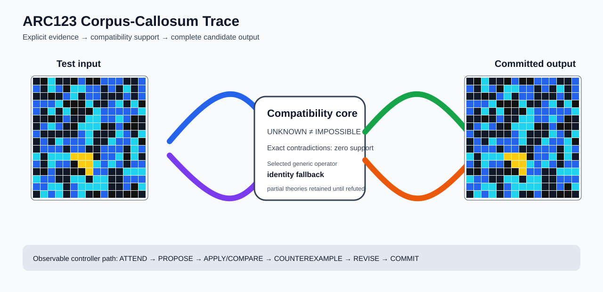

# ARC1 `79369cc6` P0008 Brain Surgery Report

## Outcome: NO — TEST CELLS DO NOT ALL MATCH

- **Compared positions:** 240
- **Mismatched cells:** 18
- **Training compatibility:** `False`
- **Fallback used:** `True`
- **Selected hypothesis:** `fallback_identity_complete_grid`
- **Source commit:** `085f6dbe39050afac3d1d743f840bac95b1a8d1c`
- **Frozen controller commit:** `4bed6c917523bc2baa05eec69f67303805d88dae`

## Live-Agent Boundary

The controller receives only visible training input/output examples and test inputs. It receives no task ID, imported cohort label, GT feature record, GT solver, historical decomposition, or held-out output before committing a complete grid. The expected output appears only in the post-answer V&V section.

## Corpus-Callosum Visualization



- Full explicit event record: [`learning_trace.json`](learning_trace.json)

## Frozen Measurement

This task was evaluated with the controller and operator configuration pinned before the frozen cohort was run. A result in this packet cannot alter that controller configuration.

## Post-Answer V&V

### Test case 1
- **All cells match:** `False`
- **Mismatched cells:** `18`
- **Prediction:
```json
[[0, 6, 8, 0, 0, 6, 1, 6, 6, 1, 1, 1, 0, 0, 1], [1, 0, 8, 1, 6, 8, 8, 1, 1, 0, 1, 0, 8, 0, 1], [0, 0, 6, 0, 1, 8, 0, 1, 1, 0, 0, 0, 1, 0, 1], [1, 1, 1, 8, 6, 6, 6, 8, 0, 0, 1, 8, 0, 8, 6], [1, 0, 8, 0, 8, 6, 0, 6, 8, 1, 1, 1, 1, 1, 8], [0, 0, 6, 0, 1, 0, 0, 8, 8, 1, 1, 8, 1, 6, 0], [0, 1, 8, 1, 0, 6, 8, 8, 8, 6, 0, 1, 6, 6, 0], [1, 0, 0, 0, 0, 0, 1, 8, 0, 0, 0, 8, 1, 0, 8], [0, 1, 0, 8, 1, 1, 1, 8, 0, 0, 8, 1, 1, 8, 6], [0, 1, 1, 1, 0, 1, 1, 0, 0, 1, 1, 1, 0, 8, 1], [8, 0, 8, 8, 8, 4, 4, 4, 6, 1, 1, 8, 6, 8, 0], [1, 0, 8, 1, 1, 6, 4, 4, 8, 1, 8, 1, 0, 1, 1], [0, 6, 1, 0, 0, 6, 6, 4, 1, 1, 0, 0, 8, 8, 8], [8, 1, 1, 0, 0, 8, 8, 0, 8, 8, 0, 0, 1, 1, 1], [1, 1, 8, 8, 0, 1, 8, 8, 8, 8, 0, 0, 1, 6, 8], [0, 8, 1, 8, 0, 1, 8, 0, 6, 1, 6, 0, 6, 6, 0]]
```
- **Expected output (post-answer only):**
```json
[[0, 6, 8, 0, 0, 6, 1, 6, 6, 1, 1, 1, 0, 0, 1], [1, 0, 8, 1, 6, 8, 8, 1, 1, 0, 1, 0, 8, 0, 1], [0, 0, 6, 0, 1, 8, 0, 1, 1, 0, 0, 0, 1, 0, 1], [1, 1, 1, 4, 6, 6, 6, 8, 0, 0, 1, 8, 0, 8, 6], [1, 0, 8, 4, 4, 6, 0, 6, 8, 1, 1, 4, 4, 4, 8], [0, 0, 6, 4, 4, 4, 0, 8, 8, 1, 1, 4, 4, 6, 0], [0, 1, 8, 1, 0, 6, 8, 8, 8, 6, 0, 4, 6, 6, 0], [1, 0, 0, 0, 0, 0, 1, 8, 0, 0, 0, 8, 1, 0, 8], [0, 1, 0, 8, 1, 1, 1, 8, 0, 0, 8, 1, 1, 8, 6], [0, 1, 1, 1, 0, 1, 1, 0, 0, 1, 1, 1, 0, 8, 1], [8, 0, 8, 8, 8, 4, 4, 4, 6, 1, 1, 8, 6, 8, 0], [1, 0, 8, 1, 1, 6, 4, 4, 8, 1, 8, 1, 0, 1, 1], [0, 6, 1, 0, 0, 6, 6, 4, 1, 1, 0, 0, 8, 8, 8], [8, 1, 1, 0, 0, 8, 8, 0, 8, 8, 0, 4, 4, 4, 1], [1, 1, 8, 8, 0, 1, 8, 8, 8, 8, 0, 4, 4, 6, 8], [0, 8, 1, 8, 0, 1, 8, 0, 6, 1, 6, 4, 6, 6, 0]]
```

## Observable IHL Walkthrough

The record contains explicit actions, predictions, feedback, and revisions; it does not claim or store hidden model reasoning.

### Action totals

- `ADD_CONDITION`: 1
- `APPLY_HYPOTHESIS`: 244
- `ATTEND`: 244
- `BIND_PARAMETER`: 1
- `CHOOSE_NEXT_DEMO`: 244
- `COMMIT`: 1
- `COMPARE`: 244
- `COMPOSE_RULE`: 11
- `EXPLAIN_RESIDUAL`: 11
- `FIND_COUNTEREXAMPLE`: 12
- `PROPOSE`: 1
- `SPECIALIZE`: 116

### Decision milestones

- `0` `PROPOSE` — `{"parent_theory_id":"T0000","rule":{"description_length":1,"name":"identity","operation":"identity","parameters":{},"rule_id":"identity","scope":{"kind":"all","value":null}},"stage":"initial_generic_theories","theory_id":"T0001"}`
- `2` `ATTEND` — `{"reason":"initial_highest_observed_change_and_color_discrimination","selected_demo":0,"selected_region":{"column":11,"row":1},"theory_id":"T0001"}`
- `6` `ATTEND` — `{"reason":"counterexample_requires_visible_conditional_evidence:unseen_demo_selected_for_residual_version_space_discrimination","selected_demo":1,"selected_region":{"column":8,"row":1},"theory_id":"T0001"}`
- `10` `ATTEND` — `{"reason":"counterexample_requires_visible_conditional_evidence:unseen_demo_selected_for_residual_version_space_discrimination","selected_demo":2,"selected_region":{"column":14,"row":15},"theory_id":"T0001"}`
- `16` `SPECIALIZE` — `{"added_rule":{"description_length":4,"name":"row_span_fill(fill_color=8,seed_color=4)","operation":"full_operator","parameters":{"fill_color":8,"operator":"row_span_fill","seed_color":4},"rule_id":"structural-row_span_fill","scope":{"kind":"all","value":null}},"parent_theory_id":"T0001","reason":"unexplained_residual_proposed_generic_structural_rule","theory_id":"T0003"}`
- `17` `SPECIALIZE` — `{"added_rule":{"description_length":4,"name":"row_span_fill(fill_color=6,seed_color=4)","operation":"full_operator","parameters":{"fill_color":6,"operator":"row_span_fill","seed_color":4},"rule_id":"structural-row_span_fill","scope":{"kind":"all","value":null}},"parent_theory_id":"T0001","reason":"unexplained_residual_proposed_generic_structural_rule","theory_id":"T0004"}`
- `18` `SPECIALIZE` — `{"added_rule":{"description_length":4,"name":"row_span_fill(fill_color=4,seed_color=4)","operation":"full_operator","parameters":{"fill_color":4,"operator":"row_span_fill","seed_color":4},"rule_id":"structural-row_span_fill","scope":{"kind":"all","value":null}},"parent_theory_id":"T0001","reason":"unexplained_residual_proposed_generic_structural_rule","theory_id":"T0005"}`
- `19` `SPECIALIZE` — `{"added_rule":{"description_length":4,"name":"line_extend(direction=left,fill_color=8,seed_color=4)","operation":"full_operator","parameters":{"direction":"left","fill_color":8,"operator":"line_extend","seed_color":4},"rule_id":"structural-line_extend","scope":{"kind":"all","value":null}},"parent_theory_id":"T0001","reason":"unexplained_residual_proposed_generic_structural_rule","theory_id":"T0006"}`
- `20` `SPECIALIZE` — `{"added_rule":{"description_length":4,"name":"line_extend(direction=left,fill_color=6,seed_color=4)","operation":"full_operator","parameters":{"direction":"left","fill_color":6,"operator":"line_extend","seed_color":4},"rule_id":"structural-line_extend","scope":{"kind":"all","value":null}},"parent_theory_id":"T0001","reason":"unexplained_residual_proposed_generic_structural_rule","theory_id":"T0007"}`
- `21` `SPECIALIZE` — `{"added_rule":{"description_length":4,"name":"line_extend(direction=left,fill_color=4,seed_color=4)","operation":"full_operator","parameters":{"direction":"left","fill_color":4,"operator":"line_extend","seed_color":4},"rule_id":"structural-line_extend","scope":{"kind":"all","value":null}},"parent_theory_id":"T0001","reason":"unexplained_residual_proposed_generic_structural_rule","theory_id":"T0008"}`
- `22` `SPECIALIZE` — `{"added_rule":{"description_length":4,"name":"line_extend(direction=up,fill_color=8,seed_color=4)","operation":"full_operator","parameters":{"direction":"up","fill_color":8,"operator":"line_extend","seed_color":4},"rule_id":"structural-line_extend","scope":{"kind":"all","value":null}},"parent_theory_id":"T0001","reason":"unexplained_residual_proposed_generic_structural_rule","theory_id":"T0009"}`
- `23` `SPECIALIZE` — `{"added_rule":{"description_length":4,"name":"line_extend(direction=up,fill_color=6,seed_color=4)","operation":"full_operator","parameters":{"direction":"up","fill_color":6,"operator":"line_extend","seed_color":4},"rule_id":"structural-line_extend","scope":{"kind":"all","value":null}},"parent_theory_id":"T0001","reason":"unexplained_residual_proposed_generic_structural_rule","theory_id":"T0010"}`
- `24` `SPECIALIZE` — `{"added_rule":{"description_length":4,"name":"line_extend(direction=up,fill_color=4,seed_color=4)","operation":"full_operator","parameters":{"direction":"up","fill_color":4,"operator":"line_extend","seed_color":4},"rule_id":"structural-line_extend","scope":{"kind":"all","value":null}},"parent_theory_id":"T0001","reason":"unexplained_residual_proposed_generic_structural_rule","theory_id":"T0011"}`
- `25` `SPECIALIZE` — `{"added_rule":{"description_length":4,"name":"line_extend(direction=right,fill_color=8,seed_color=4)","operation":"full_operator","parameters":{"direction":"right","fill_color":8,"operator":"line_extend","seed_color":4},"rule_id":"structural-line_extend","scope":{"kind":"all","value":null}},"parent_theory_id":"T0001","reason":"unexplained_residual_proposed_generic_structural_rule","theory_id":"T0012"}`
- `26` `SPECIALIZE` — `{"added_rule":{"description_length":4,"name":"line_extend(direction=right,fill_color=6,seed_color=4)","operation":"full_operator","parameters":{"direction":"right","fill_color":6,"operator":"line_extend","seed_color":4},"rule_id":"structural-line_extend","scope":{"kind":"all","value":null}},"parent_theory_id":"T0001","reason":"unexplained_residual_proposed_generic_structural_rule","theory_id":"T0013"}`
- `27` `SPECIALIZE` — `{"added_rule":{"description_length":4,"name":"line_extend(direction=right,fill_color=4,seed_color=4)","operation":"full_operator","parameters":{"direction":"right","fill_color":4,"operator":"line_extend","seed_color":4},"rule_id":"structural-line_extend","scope":{"kind":"all","value":null}},"parent_theory_id":"T0001","reason":"unexplained_residual_proposed_generic_structural_rule","theory_id":"T0014"}`
- `29` `ATTEND` — `{"reason":"initial_highest_observed_change_and_color_discrimination","selected_demo":0,"selected_region":{"column":0,"row":0},"theory_id":"T0002"}`
- `33` `ATTEND` — `{"reason":"initial_highest_observed_change_and_color_discrimination","selected_demo":0,"selected_region":{"column":11,"row":1},"theory_id":"T0003"}`
- `37` `ATTEND` — `{"reason":"initial_highest_observed_change_and_color_discrimination","selected_demo":0,"selected_region":{"column":11,"row":1},"theory_id":"T0004"}`
- `41` `ATTEND` — `{"reason":"initial_highest_observed_change_and_color_discrimination","selected_demo":0,"selected_region":{"column":11,"row":1},"theory_id":"T0005"}`
- `45` `ATTEND` — `{"reason":"initial_highest_observed_change_and_color_discrimination","selected_demo":0,"selected_region":{"column":11,"row":1},"theory_id":"T0006"}`
- `49` `ATTEND` — `{"reason":"initial_highest_observed_change_and_color_discrimination","selected_demo":0,"selected_region":{"column":11,"row":1},"theory_id":"T0007"}`
- `53` `ATTEND` — `{"reason":"initial_highest_observed_change_and_color_discrimination","selected_demo":0,"selected_region":{"column":11,"row":1},"theory_id":"T0008"}`
- `57` `ATTEND` — `{"reason":"initial_highest_observed_change_and_color_discrimination","selected_demo":0,"selected_region":{"column":1,"row":1},"theory_id":"T0009"}`
- `61` `ATTEND` — `{"reason":"initial_highest_observed_change_and_color_discrimination","selected_demo":0,"selected_region":{"column":1,"row":1},"theory_id":"T0010"}`
- `65` `ATTEND` — `{"reason":"initial_highest_observed_change_and_color_discrimination","selected_demo":0,"selected_region":{"column":1,"row":1},"theory_id":"T0011"}`
- `69` `ATTEND` — `{"reason":"initial_highest_observed_change_and_color_discrimination","selected_demo":0,"selected_region":{"column":11,"row":1},"theory_id":"T0012"}`
- `73` `ATTEND` — `{"reason":"initial_highest_observed_change_and_color_discrimination","selected_demo":0,"selected_region":{"column":11,"row":1},"theory_id":"T0013"}`
- `77` `ATTEND` — `{"reason":"counterexample_requires_visible_conditional_evidence:unseen_demo_selected_for_residual_version_space_discrimination","selected_demo":1,"selected_region":{"column":8,"row":1},"theory_id":"T0003"}`
- `81` `ATTEND` — `{"reason":"counterexample_requires_visible_conditional_evidence:unseen_demo_selected_for_residual_version_space_discrimination","selected_demo":1,"selected_region":{"column":8,"row":1},"theory_id":"T0004"}`
- `85` `ATTEND` — `{"reason":"counterexample_requires_visible_conditional_evidence:unseen_demo_selected_for_residual_version_space_discrimination","selected_demo":1,"selected_region":{"column":8,"row":1},"theory_id":"T0005"}`
- `89` `ATTEND` — `{"reason":"counterexample_requires_visible_conditional_evidence:unseen_demo_selected_for_residual_version_space_discrimination","selected_demo":1,"selected_region":{"column":8,"row":1},"theory_id":"T0006"}`
- `93` `ATTEND` — `{"reason":"counterexample_requires_visible_conditional_evidence:unseen_demo_selected_for_residual_version_space_discrimination","selected_demo":1,"selected_region":{"column":8,"row":1},"theory_id":"T0007"}`
- `97` `ATTEND` — `{"reason":"counterexample_requires_visible_conditional_evidence:unseen_demo_selected_for_residual_version_space_discrimination","selected_demo":1,"selected_region":{"column":8,"row":1},"theory_id":"T0008"}`
- `101` `ATTEND` — `{"reason":"counterexample_requires_visible_conditional_evidence:unseen_demo_selected_for_residual_version_space_discrimination","selected_demo":2,"selected_region":{"column":14,"row":15},"theory_id":"T0003"}`
- `105` `ATTEND` — `{"reason":"counterexample_requires_visible_conditional_evidence:unseen_demo_selected_for_residual_version_space_discrimination","selected_demo":2,"selected_region":{"column":14,"row":15},"theory_id":"T0004"}`
- `109` `ATTEND` — `{"reason":"counterexample_requires_visible_conditional_evidence:unseen_demo_selected_for_residual_version_space_discrimination","selected_demo":2,"selected_region":{"column":14,"row":15},"theory_id":"T0005"}`
- `113` `ATTEND` — `{"reason":"counterexample_requires_visible_conditional_evidence:unseen_demo_selected_for_residual_version_space_discrimination","selected_demo":1,"selected_region":{"column":4,"row":1},"theory_id":"T0009"}`
- `117` `ATTEND` — `{"reason":"counterexample_requires_visible_conditional_evidence:unseen_demo_selected_for_residual_version_space_discrimination","selected_demo":1,"selected_region":{"column":4,"row":1},"theory_id":"T0010"}`
- `121` `ATTEND` — `{"reason":"counterexample_requires_visible_conditional_evidence:unseen_demo_selected_for_residual_version_space_discrimination","selected_demo":1,"selected_region":{"column":4,"row":1},"theory_id":"T0011"}`
- `127` `SPECIALIZE` — `{"added_rule":{"description_length":4,"name":"row_span_fill(fill_color=6,seed_color=4)","operation":"full_operator","parameters":{"fill_color":6,"operator":"row_span_fill","seed_color":4},"rule_id":"structural-row_span_fill","scope":{"kind":"all","value":null}},"parent_theory_id":"T0003","reason":"unexplained_residual_proposed_generic_structural_rule","theory_id":"T0016"}`
- `128` `SPECIALIZE` — `{"added_rule":{"description_length":4,"name":"row_span_fill(fill_color=4,seed_color=4)","operation":"full_operator","parameters":{"fill_color":4,"operator":"row_span_fill","seed_color":4},"rule_id":"structural-row_span_fill","scope":{"kind":"all","value":null}},"parent_theory_id":"T0003","reason":"unexplained_residual_proposed_generic_structural_rule","theory_id":"T0017"}`
- `129` `SPECIALIZE` — `{"added_rule":{"description_length":4,"name":"line_extend(direction=left,fill_color=8,seed_color=4)","operation":"full_operator","parameters":{"direction":"left","fill_color":8,"operator":"line_extend","seed_color":4},"rule_id":"structural-line_extend","scope":{"kind":"all","value":null}},"parent_theory_id":"T0003","reason":"unexplained_residual_proposed_generic_structural_rule","theory_id":"T0018"}`
- `130` `SPECIALIZE` — `{"added_rule":{"description_length":4,"name":"line_extend(direction=left,fill_color=6,seed_color=4)","operation":"full_operator","parameters":{"direction":"left","fill_color":6,"operator":"line_extend","seed_color":4},"rule_id":"structural-line_extend","scope":{"kind":"all","value":null}},"parent_theory_id":"T0003","reason":"unexplained_residual_proposed_generic_structural_rule","theory_id":"T0019"}`
- `131` `SPECIALIZE` — `{"added_rule":{"description_length":4,"name":"line_extend(direction=left,fill_color=4,seed_color=4)","operation":"full_operator","parameters":{"direction":"left","fill_color":4,"operator":"line_extend","seed_color":4},"rule_id":"structural-line_extend","scope":{"kind":"all","value":null}},"parent_theory_id":"T0003","reason":"unexplained_residual_proposed_generic_structural_rule","theory_id":"T0020"}`
- `132` `SPECIALIZE` — `{"added_rule":{"description_length":4,"name":"line_extend(direction=up,fill_color=8,seed_color=4)","operation":"full_operator","parameters":{"direction":"up","fill_color":8,"operator":"line_extend","seed_color":4},"rule_id":"structural-line_extend","scope":{"kind":"all","value":null}},"parent_theory_id":"T0003","reason":"unexplained_residual_proposed_generic_structural_rule","theory_id":"T0021"}`
- `133` `SPECIALIZE` — `{"added_rule":{"description_length":4,"name":"line_extend(direction=up,fill_color=6,seed_color=4)","operation":"full_operator","parameters":{"direction":"up","fill_color":6,"operator":"line_extend","seed_color":4},"rule_id":"structural-line_extend","scope":{"kind":"all","value":null}},"parent_theory_id":"T0003","reason":"unexplained_residual_proposed_generic_structural_rule","theory_id":"T0022"}`
- `134` `SPECIALIZE` — `{"added_rule":{"description_length":4,"name":"line_extend(direction=up,fill_color=4,seed_color=4)","operation":"full_operator","parameters":{"direction":"up","fill_color":4,"operator":"line_extend","seed_color":4},"rule_id":"structural-line_extend","scope":{"kind":"all","value":null}},"parent_theory_id":"T0003","reason":"unexplained_residual_proposed_generic_structural_rule","theory_id":"T0023"}`
- `135` `SPECIALIZE` — `{"added_rule":{"description_length":4,"name":"line_extend(direction=right,fill_color=8,seed_color=4)","operation":"full_operator","parameters":{"direction":"right","fill_color":8,"operator":"line_extend","seed_color":4},"rule_id":"structural-line_extend","scope":{"kind":"all","value":null}},"parent_theory_id":"T0003","reason":"unexplained_residual_proposed_generic_structural_rule","theory_id":"T0024"}`
- `136` `SPECIALIZE` — `{"added_rule":{"description_length":4,"name":"line_extend(direction=right,fill_color=6,seed_color=4)","operation":"full_operator","parameters":{"direction":"right","fill_color":6,"operator":"line_extend","seed_color":4},"rule_id":"structural-line_extend","scope":{"kind":"all","value":null}},"parent_theory_id":"T0003","reason":"unexplained_residual_proposed_generic_structural_rule","theory_id":"T0025"}`
- `137` `SPECIALIZE` — `{"added_rule":{"description_length":4,"name":"line_extend(direction=right,fill_color=4,seed_color=4)","operation":"full_operator","parameters":{"direction":"right","fill_color":4,"operator":"line_extend","seed_color":4},"rule_id":"structural-line_extend","scope":{"kind":"all","value":null}},"parent_theory_id":"T0003","reason":"unexplained_residual_proposed_generic_structural_rule","theory_id":"T0026"}`
- `139` `ATTEND` — `{"reason":"initial_highest_observed_change_and_color_discrimination","selected_demo":0,"selected_region":{"column":11,"row":1},"theory_id":"T0015"}`
- `143` `ATTEND` — `{"reason":"initial_highest_observed_change_and_color_discrimination","selected_demo":0,"selected_region":{"column":11,"row":1},"theory_id":"T0016"}`
- `147` `ATTEND` — `{"reason":"initial_highest_observed_change_and_color_discrimination","selected_demo":0,"selected_region":{"column":11,"row":1},"theory_id":"T0017"}`
- `151` `ATTEND` — `{"reason":"initial_highest_observed_change_and_color_discrimination","selected_demo":0,"selected_region":{"column":11,"row":1},"theory_id":"T0018"}`
- `155` `ATTEND` — `{"reason":"initial_highest_observed_change_and_color_discrimination","selected_demo":0,"selected_region":{"column":11,"row":1},"theory_id":"T0019"}`
- `159` `ATTEND` — `{"reason":"initial_highest_observed_change_and_color_discrimination","selected_demo":0,"selected_region":{"column":11,"row":1},"theory_id":"T0020"}`
- `163` `ATTEND` — `{"reason":"initial_highest_observed_change_and_color_discrimination","selected_demo":0,"selected_region":{"column":1,"row":1},"theory_id":"T0021"}`
- `167` `ATTEND` — `{"reason":"initial_highest_observed_change_and_color_discrimination","selected_demo":0,"selected_region":{"column":1,"row":1},"theory_id":"T0022"}`
- `171` `ATTEND` — `{"reason":"initial_highest_observed_change_and_color_discrimination","selected_demo":0,"selected_region":{"column":1,"row":1},"theory_id":"T0023"}`
- `175` `ATTEND` — `{"reason":"initial_highest_observed_change_and_color_discrimination","selected_demo":0,"selected_region":{"column":11,"row":1},"theory_id":"T0024"}`
- `179` `ATTEND` — `{"reason":"initial_highest_observed_change_and_color_discrimination","selected_demo":0,"selected_region":{"column":11,"row":1},"theory_id":"T0025"}`
- `183` `ATTEND` — `{"reason":"initial_highest_observed_change_and_color_discrimination","selected_demo":0,"selected_region":{"column":11,"row":1},"theory_id":"T0026"}`
- `187` `ATTEND` — `{"reason":"counterexample_requires_visible_conditional_evidence:unseen_demo_selected_for_residual_version_space_discrimination","selected_demo":1,"selected_region":{"column":8,"row":1},"theory_id":"T0015"}`
- `191` `ATTEND` — `{"reason":"counterexample_requires_visible_conditional_evidence:unseen_demo_selected_for_residual_version_space_discrimination","selected_demo":1,"selected_region":{"column":8,"row":1},"theory_id":"T0016"}`
- `195` `ATTEND` — `{"reason":"counterexample_requires_visible_conditional_evidence:unseen_demo_selected_for_residual_version_space_discrimination","selected_demo":1,"selected_region":{"column":8,"row":1},"theory_id":"T0017"}`
- `199` `ATTEND` — `{"reason":"counterexample_requires_visible_conditional_evidence:unseen_demo_selected_for_residual_version_space_discrimination","selected_demo":1,"selected_region":{"column":8,"row":1},"theory_id":"T0018"}`
- `203` `ATTEND` — `{"reason":"counterexample_requires_visible_conditional_evidence:unseen_demo_selected_for_residual_version_space_discrimination","selected_demo":1,"selected_region":{"column":8,"row":1},"theory_id":"T0019"}`
- `207` `ATTEND` — `{"reason":"counterexample_requires_visible_conditional_evidence:unseen_demo_selected_for_residual_version_space_discrimination","selected_demo":1,"selected_region":{"column":8,"row":1},"theory_id":"T0020"}`
- `211` `ATTEND` — `{"reason":"counterexample_requires_visible_conditional_evidence:unseen_demo_selected_for_residual_version_space_discrimination","selected_demo":2,"selected_region":{"column":14,"row":15},"theory_id":"T0015"}`
- `215` `ATTEND` — `{"reason":"counterexample_requires_visible_conditional_evidence:unseen_demo_selected_for_residual_version_space_discrimination","selected_demo":2,"selected_region":{"column":14,"row":15},"theory_id":"T0016"}`
- `219` `ATTEND` — `{"reason":"counterexample_requires_visible_conditional_evidence:unseen_demo_selected_for_residual_version_space_discrimination","selected_demo":2,"selected_region":{"column":14,"row":15},"theory_id":"T0017"}`
- `223` `ATTEND` — `{"reason":"counterexample_requires_visible_conditional_evidence:unseen_demo_selected_for_residual_version_space_discrimination","selected_demo":1,"selected_region":{"column":4,"row":1},"theory_id":"T0021"}`
- `227` `ATTEND` — `{"reason":"counterexample_requires_visible_conditional_evidence:unseen_demo_selected_for_residual_version_space_discrimination","selected_demo":1,"selected_region":{"column":4,"row":1},"theory_id":"T0022"}`
- `231` `ATTEND` — `{"reason":"counterexample_requires_visible_conditional_evidence:unseen_demo_selected_for_residual_version_space_discrimination","selected_demo":1,"selected_region":{"column":4,"row":1},"theory_id":"T0023"}`
- `237` `SPECIALIZE` — `{"added_rule":{"description_length":4,"name":"row_span_fill(fill_color=8,seed_color=4)","operation":"full_operator","parameters":{"fill_color":8,"operator":"row_span_fill","seed_color":4},"rule_id":"structural-row_span_fill","scope":{"kind":"all","value":null}},"parent_theory_id":"T0015","reason":"unexplained_residual_proposed_generic_structural_rule","theory_id":"T0028"}`
- `238` `SPECIALIZE` — `{"added_rule":{"description_length":4,"name":"row_span_fill(fill_color=6,seed_color=4)","operation":"full_operator","parameters":{"fill_color":6,"operator":"row_span_fill","seed_color":4},"rule_id":"structural-row_span_fill","scope":{"kind":"all","value":null}},"parent_theory_id":"T0015","reason":"unexplained_residual_proposed_generic_structural_rule","theory_id":"T0029"}`
- `239` `SPECIALIZE` — `{"added_rule":{"description_length":4,"name":"row_span_fill(fill_color=4,seed_color=4)","operation":"full_operator","parameters":{"fill_color":4,"operator":"row_span_fill","seed_color":4},"rule_id":"structural-row_span_fill","scope":{"kind":"all","value":null}},"parent_theory_id":"T0015","reason":"unexplained_residual_proposed_generic_structural_rule","theory_id":"T0030"}`
- `240` `SPECIALIZE` — `{"added_rule":{"description_length":4,"name":"line_extend(direction=left,fill_color=8,seed_color=4)","operation":"full_operator","parameters":{"direction":"left","fill_color":8,"operator":"line_extend","seed_color":4},"rule_id":"structural-line_extend","scope":{"kind":"all","value":null}},"parent_theory_id":"T0015","reason":"unexplained_residual_proposed_generic_structural_rule","theory_id":"T0031"}`
- `241` `SPECIALIZE` — `{"added_rule":{"description_length":4,"name":"line_extend(direction=left,fill_color=6,seed_color=4)","operation":"full_operator","parameters":{"direction":"left","fill_color":6,"operator":"line_extend","seed_color":4},"rule_id":"structural-line_extend","scope":{"kind":"all","value":null}},"parent_theory_id":"T0015","reason":"unexplained_residual_proposed_generic_structural_rule","theory_id":"T0032"}`
- `242` `SPECIALIZE` — `{"added_rule":{"description_length":4,"name":"line_extend(direction=left,fill_color=4,seed_color=4)","operation":"full_operator","parameters":{"direction":"left","fill_color":4,"operator":"line_extend","seed_color":4},"rule_id":"structural-line_extend","scope":{"kind":"all","value":null}},"parent_theory_id":"T0015","reason":"unexplained_residual_proposed_generic_structural_rule","theory_id":"T0033"}`
- `243` `SPECIALIZE` — `{"added_rule":{"description_length":4,"name":"line_extend(direction=up,fill_color=8,seed_color=4)","operation":"full_operator","parameters":{"direction":"up","fill_color":8,"operator":"line_extend","seed_color":4},"rule_id":"structural-line_extend","scope":{"kind":"all","value":null}},"parent_theory_id":"T0015","reason":"unexplained_residual_proposed_generic_structural_rule","theory_id":"T0034"}`
- `244` `SPECIALIZE` — `{"added_rule":{"description_length":4,"name":"line_extend(direction=up,fill_color=6,seed_color=4)","operation":"full_operator","parameters":{"direction":"up","fill_color":6,"operator":"line_extend","seed_color":4},"rule_id":"structural-line_extend","scope":{"kind":"all","value":null}},"parent_theory_id":"T0015","reason":"unexplained_residual_proposed_generic_structural_rule","theory_id":"T0035"}`
- `245` `SPECIALIZE` — `{"added_rule":{"description_length":4,"name":"line_extend(direction=up,fill_color=4,seed_color=4)","operation":"full_operator","parameters":{"direction":"up","fill_color":4,"operator":"line_extend","seed_color":4},"rule_id":"structural-line_extend","scope":{"kind":"all","value":null}},"parent_theory_id":"T0015","reason":"unexplained_residual_proposed_generic_structural_rule","theory_id":"T0036"}`
- `246` `SPECIALIZE` — `{"added_rule":{"description_length":4,"name":"line_extend(direction=right,fill_color=8,seed_color=4)","operation":"full_operator","parameters":{"direction":"right","fill_color":8,"operator":"line_extend","seed_color":4},"rule_id":"structural-line_extend","scope":{"kind":"all","value":null}},"parent_theory_id":"T0015","reason":"unexplained_residual_proposed_generic_structural_rule","theory_id":"T0037"}`
- `247` `SPECIALIZE` — `{"added_rule":{"description_length":4,"name":"line_extend(direction=right,fill_color=6,seed_color=4)","operation":"full_operator","parameters":{"direction":"right","fill_color":6,"operator":"line_extend","seed_color":4},"rule_id":"structural-line_extend","scope":{"kind":"all","value":null}},"parent_theory_id":"T0015","reason":"unexplained_residual_proposed_generic_structural_rule","theory_id":"T0038"}`
- `248` `SPECIALIZE` — `{"added_rule":{"description_length":4,"name":"line_extend(direction=right,fill_color=4,seed_color=4)","operation":"full_operator","parameters":{"direction":"right","fill_color":4,"operator":"line_extend","seed_color":4},"rule_id":"structural-line_extend","scope":{"kind":"all","value":null}},"parent_theory_id":"T0015","reason":"unexplained_residual_proposed_generic_structural_rule","theory_id":"T0039"}`
- `250` `ATTEND` — `{"reason":"initial_highest_observed_change_and_color_discrimination","selected_demo":0,"selected_region":{"column":0,"row":0},"theory_id":"T0027"}`
- `254` `ATTEND` — `{"reason":"initial_highest_observed_change_and_color_discrimination","selected_demo":0,"selected_region":{"column":11,"row":1},"theory_id":"T0028"}`
- `258` `ATTEND` — `{"reason":"initial_highest_observed_change_and_color_discrimination","selected_demo":0,"selected_region":{"column":11,"row":1},"theory_id":"T0029"}`
- `262` `ATTEND` — `{"reason":"initial_highest_observed_change_and_color_discrimination","selected_demo":0,"selected_region":{"column":11,"row":1},"theory_id":"T0030"}`
- `266` `ATTEND` — `{"reason":"initial_highest_observed_change_and_color_discrimination","selected_demo":0,"selected_region":{"column":11,"row":1},"theory_id":"T0031"}`
- `270` `ATTEND` — `{"reason":"initial_highest_observed_change_and_color_discrimination","selected_demo":0,"selected_region":{"column":11,"row":1},"theory_id":"T0032"}`
- `274` `ATTEND` — `{"reason":"initial_highest_observed_change_and_color_discrimination","selected_demo":0,"selected_region":{"column":11,"row":1},"theory_id":"T0033"}`
- `278` `ATTEND` — `{"reason":"initial_highest_observed_change_and_color_discrimination","selected_demo":0,"selected_region":{"column":1,"row":1},"theory_id":"T0034"}`
- `282` `ATTEND` — `{"reason":"initial_highest_observed_change_and_color_discrimination","selected_demo":0,"selected_region":{"column":1,"row":1},"theory_id":"T0035"}`
- `286` `ATTEND` — `{"reason":"initial_highest_observed_change_and_color_discrimination","selected_demo":0,"selected_region":{"column":1,"row":1},"theory_id":"T0036"}`
- `290` `ATTEND` — `{"reason":"initial_highest_observed_change_and_color_discrimination","selected_demo":0,"selected_region":{"column":11,"row":1},"theory_id":"T0037"}`
- `294` `ATTEND` — `{"reason":"initial_highest_observed_change_and_color_discrimination","selected_demo":0,"selected_region":{"column":11,"row":1},"theory_id":"T0038"}`
- `298` `ATTEND` — `{"reason":"counterexample_requires_visible_conditional_evidence:unseen_demo_selected_for_residual_version_space_discrimination","selected_demo":1,"selected_region":{"column":8,"row":1},"theory_id":"T0028"}`
- `302` `ATTEND` — `{"reason":"counterexample_requires_visible_conditional_evidence:unseen_demo_selected_for_residual_version_space_discrimination","selected_demo":1,"selected_region":{"column":8,"row":1},"theory_id":"T0029"}`
- `306` `ATTEND` — `{"reason":"counterexample_requires_visible_conditional_evidence:unseen_demo_selected_for_residual_version_space_discrimination","selected_demo":1,"selected_region":{"column":8,"row":1},"theory_id":"T0030"}`
- `310` `ATTEND` — `{"reason":"counterexample_requires_visible_conditional_evidence:unseen_demo_selected_for_residual_version_space_discrimination","selected_demo":1,"selected_region":{"column":8,"row":1},"theory_id":"T0031"}`
- `314` `ATTEND` — `{"reason":"counterexample_requires_visible_conditional_evidence:unseen_demo_selected_for_residual_version_space_discrimination","selected_demo":1,"selected_region":{"column":8,"row":1},"theory_id":"T0032"}`
- `318` `ATTEND` — `{"reason":"counterexample_requires_visible_conditional_evidence:unseen_demo_selected_for_residual_version_space_discrimination","selected_demo":1,"selected_region":{"column":8,"row":1},"theory_id":"T0033"}`
- `322` `ATTEND` — `{"reason":"counterexample_requires_visible_conditional_evidence:unseen_demo_selected_for_residual_version_space_discrimination","selected_demo":2,"selected_region":{"column":14,"row":15},"theory_id":"T0028"}`
- `326` `ATTEND` — `{"reason":"counterexample_requires_visible_conditional_evidence:unseen_demo_selected_for_residual_version_space_discrimination","selected_demo":2,"selected_region":{"column":14,"row":15},"theory_id":"T0029"}`
- `330` `ATTEND` — `{"reason":"counterexample_requires_visible_conditional_evidence:unseen_demo_selected_for_residual_version_space_discrimination","selected_demo":2,"selected_region":{"column":14,"row":15},"theory_id":"T0030"}`
- `334` `ATTEND` — `{"reason":"counterexample_requires_visible_conditional_evidence:unseen_demo_selected_for_residual_version_space_discrimination","selected_demo":1,"selected_region":{"column":4,"row":1},"theory_id":"T0034"}`
- `338` `ATTEND` — `{"reason":"counterexample_requires_visible_conditional_evidence:unseen_demo_selected_for_residual_version_space_discrimination","selected_demo":1,"selected_region":{"column":4,"row":1},"theory_id":"T0035"}`
- `342` `ATTEND` — `{"reason":"counterexample_requires_visible_conditional_evidence:unseen_demo_selected_for_residual_version_space_discrimination","selected_demo":1,"selected_region":{"column":4,"row":1},"theory_id":"T0036"}`
- `348` `SPECIALIZE` — `{"added_rule":{"description_length":4,"name":"row_span_fill(fill_color=6,seed_color=4)","operation":"full_operator","parameters":{"fill_color":6,"operator":"row_span_fill","seed_color":4},"rule_id":"structural-row_span_fill","scope":{"kind":"all","value":null}},"parent_theory_id":"T0028","reason":"unexplained_residual_proposed_generic_structural_rule","theory_id":"T0041"}`
- `349` `SPECIALIZE` — `{"added_rule":{"description_length":4,"name":"row_span_fill(fill_color=4,seed_color=4)","operation":"full_operator","parameters":{"fill_color":4,"operator":"row_span_fill","seed_color":4},"rule_id":"structural-row_span_fill","scope":{"kind":"all","value":null}},"parent_theory_id":"T0028","reason":"unexplained_residual_proposed_generic_structural_rule","theory_id":"T0042"}`
- `350` `SPECIALIZE` — `{"added_rule":{"description_length":4,"name":"line_extend(direction=left,fill_color=8,seed_color=4)","operation":"full_operator","parameters":{"direction":"left","fill_color":8,"operator":"line_extend","seed_color":4},"rule_id":"structural-line_extend","scope":{"kind":"all","value":null}},"parent_theory_id":"T0028","reason":"unexplained_residual_proposed_generic_structural_rule","theory_id":"T0043"}`
- `351` `SPECIALIZE` — `{"added_rule":{"description_length":4,"name":"line_extend(direction=left,fill_color=6,seed_color=4)","operation":"full_operator","parameters":{"direction":"left","fill_color":6,"operator":"line_extend","seed_color":4},"rule_id":"structural-line_extend","scope":{"kind":"all","value":null}},"parent_theory_id":"T0028","reason":"unexplained_residual_proposed_generic_structural_rule","theory_id":"T0044"}`
- `352` `SPECIALIZE` — `{"added_rule":{"description_length":4,"name":"line_extend(direction=left,fill_color=4,seed_color=4)","operation":"full_operator","parameters":{"direction":"left","fill_color":4,"operator":"line_extend","seed_color":4},"rule_id":"structural-line_extend","scope":{"kind":"all","value":null}},"parent_theory_id":"T0028","reason":"unexplained_residual_proposed_generic_structural_rule","theory_id":"T0045"}`
- `353` `SPECIALIZE` — `{"added_rule":{"description_length":4,"name":"line_extend(direction=up,fill_color=8,seed_color=4)","operation":"full_operator","parameters":{"direction":"up","fill_color":8,"operator":"line_extend","seed_color":4},"rule_id":"structural-line_extend","scope":{"kind":"all","value":null}},"parent_theory_id":"T0028","reason":"unexplained_residual_proposed_generic_structural_rule","theory_id":"T0046"}`
- `354` `SPECIALIZE` — `{"added_rule":{"description_length":4,"name":"line_extend(direction=up,fill_color=6,seed_color=4)","operation":"full_operator","parameters":{"direction":"up","fill_color":6,"operator":"line_extend","seed_color":4},"rule_id":"structural-line_extend","scope":{"kind":"all","value":null}},"parent_theory_id":"T0028","reason":"unexplained_residual_proposed_generic_structural_rule","theory_id":"T0047"}`
- `355` `SPECIALIZE` — `{"added_rule":{"description_length":4,"name":"line_extend(direction=up,fill_color=4,seed_color=4)","operation":"full_operator","parameters":{"direction":"up","fill_color":4,"operator":"line_extend","seed_color":4},"rule_id":"structural-line_extend","scope":{"kind":"all","value":null}},"parent_theory_id":"T0028","reason":"unexplained_residual_proposed_generic_structural_rule","theory_id":"T0048"}`
- `356` `SPECIALIZE` — `{"added_rule":{"description_length":4,"name":"line_extend(direction=right,fill_color=8,seed_color=4)","operation":"full_operator","parameters":{"direction":"right","fill_color":8,"operator":"line_extend","seed_color":4},"rule_id":"structural-line_extend","scope":{"kind":"all","value":null}},"parent_theory_id":"T0028","reason":"unexplained_residual_proposed_generic_structural_rule","theory_id":"T0049"}`
- `357` `SPECIALIZE` — `{"added_rule":{"description_length":4,"name":"line_extend(direction=right,fill_color=6,seed_color=4)","operation":"full_operator","parameters":{"direction":"right","fill_color":6,"operator":"line_extend","seed_color":4},"rule_id":"structural-line_extend","scope":{"kind":"all","value":null}},"parent_theory_id":"T0028","reason":"unexplained_residual_proposed_generic_structural_rule","theory_id":"T0050"}`
- `358` `SPECIALIZE` — `{"added_rule":{"description_length":4,"name":"line_extend(direction=right,fill_color=4,seed_color=4)","operation":"full_operator","parameters":{"direction":"right","fill_color":4,"operator":"line_extend","seed_color":4},"rule_id":"structural-line_extend","scope":{"kind":"all","value":null}},"parent_theory_id":"T0028","reason":"unexplained_residual_proposed_generic_structural_rule","theory_id":"T0051"}`
- `360` `ATTEND` — `{"reason":"initial_highest_observed_change_and_color_discrimination","selected_demo":0,"selected_region":{"column":0,"row":0},"theory_id":"T0040"}`
- `364` `ATTEND` — `{"reason":"initial_highest_observed_change_and_color_discrimination","selected_demo":0,"selected_region":{"column":11,"row":1},"theory_id":"T0041"}`
- `368` `ATTEND` — `{"reason":"initial_highest_observed_change_and_color_discrimination","selected_demo":0,"selected_region":{"column":11,"row":1},"theory_id":"T0042"}`
- `372` `ATTEND` — `{"reason":"initial_highest_observed_change_and_color_discrimination","selected_demo":0,"selected_region":{"column":11,"row":1},"theory_id":"T0043"}`
- `376` `ATTEND` — `{"reason":"initial_highest_observed_change_and_color_discrimination","selected_demo":0,"selected_region":{"column":11,"row":1},"theory_id":"T0044"}`
- `380` `ATTEND` — `{"reason":"initial_highest_observed_change_and_color_discrimination","selected_demo":0,"selected_region":{"column":11,"row":1},"theory_id":"T0045"}`
- `384` `ATTEND` — `{"reason":"initial_highest_observed_change_and_color_discrimination","selected_demo":0,"selected_region":{"column":1,"row":1},"theory_id":"T0046"}`
- `388` `ATTEND` — `{"reason":"initial_highest_observed_change_and_color_discrimination","selected_demo":0,"selected_region":{"column":1,"row":1},"theory_id":"T0047"}`
- `392` `ATTEND` — `{"reason":"initial_highest_observed_change_and_color_discrimination","selected_demo":0,"selected_region":{"column":1,"row":1},"theory_id":"T0048"}`
- `396` `ATTEND` — `{"reason":"initial_highest_observed_change_and_color_discrimination","selected_demo":0,"selected_region":{"column":11,"row":1},"theory_id":"T0049"}`
- `400` `ATTEND` — `{"reason":"initial_highest_observed_change_and_color_discrimination","selected_demo":0,"selected_region":{"column":11,"row":1},"theory_id":"T0050"}`
- `404` `ATTEND` — `{"reason":"initial_highest_observed_change_and_color_discrimination","selected_demo":0,"selected_region":{"column":11,"row":1},"theory_id":"T0051"}`
- `408` `ATTEND` — `{"reason":"counterexample_requires_visible_conditional_evidence:unseen_demo_selected_for_residual_version_space_discrimination","selected_demo":1,"selected_region":{"column":8,"row":1},"theory_id":"T0041"}`
- `412` `ATTEND` — `{"reason":"counterexample_requires_visible_conditional_evidence:unseen_demo_selected_for_residual_version_space_discrimination","selected_demo":1,"selected_region":{"column":8,"row":1},"theory_id":"T0042"}`
- `416` `ATTEND` — `{"reason":"counterexample_requires_visible_conditional_evidence:unseen_demo_selected_for_residual_version_space_discrimination","selected_demo":1,"selected_region":{"column":8,"row":1},"theory_id":"T0043"}`
- `420` `ATTEND` — `{"reason":"counterexample_requires_visible_conditional_evidence:unseen_demo_selected_for_residual_version_space_discrimination","selected_demo":1,"selected_region":{"column":8,"row":1},"theory_id":"T0044"}`
- `424` `ATTEND` — `{"reason":"counterexample_requires_visible_conditional_evidence:unseen_demo_selected_for_residual_version_space_discrimination","selected_demo":1,"selected_region":{"column":8,"row":1},"theory_id":"T0045"}`
- `428` `ATTEND` — `{"reason":"counterexample_requires_visible_conditional_evidence:unseen_demo_selected_for_residual_version_space_discrimination","selected_demo":2,"selected_region":{"column":14,"row":15},"theory_id":"T0041"}`
- `432` `ATTEND` — `{"reason":"counterexample_requires_visible_conditional_evidence:unseen_demo_selected_for_residual_version_space_discrimination","selected_demo":2,"selected_region":{"column":14,"row":15},"theory_id":"T0042"}`
- `436` `ATTEND` — `{"reason":"counterexample_requires_visible_conditional_evidence:unseen_demo_selected_for_residual_version_space_discrimination","selected_demo":1,"selected_region":{"column":4,"row":1},"theory_id":"T0046"}`
- `440` `ATTEND` — `{"reason":"counterexample_requires_visible_conditional_evidence:unseen_demo_selected_for_residual_version_space_discrimination","selected_demo":1,"selected_region":{"column":4,"row":1},"theory_id":"T0047"}`
- `444` `ATTEND` — `{"reason":"counterexample_requires_visible_conditional_evidence:unseen_demo_selected_for_residual_version_space_discrimination","selected_demo":1,"selected_region":{"column":4,"row":1},"theory_id":"T0048"}`
- `450` `SPECIALIZE` — `{"added_rule":{"description_length":4,"name":"row_span_fill(fill_color=4,seed_color=4)","operation":"full_operator","parameters":{"fill_color":4,"operator":"row_span_fill","seed_color":4},"rule_id":"structural-row_span_fill","scope":{"kind":"all","value":null}},"parent_theory_id":"T0041","reason":"unexplained_residual_proposed_generic_structural_rule","theory_id":"T0053"}`
- `451` `SPECIALIZE` — `{"added_rule":{"description_length":4,"name":"line_extend(direction=left,fill_color=8,seed_color=4)","operation":"full_operator","parameters":{"direction":"left","fill_color":8,"operator":"line_extend","seed_color":4},"rule_id":"structural-line_extend","scope":{"kind":"all","value":null}},"parent_theory_id":"T0041","reason":"unexplained_residual_proposed_generic_structural_rule","theory_id":"T0054"}`
- `452` `SPECIALIZE` — `{"added_rule":{"description_length":4,"name":"line_extend(direction=left,fill_color=6,seed_color=4)","operation":"full_operator","parameters":{"direction":"left","fill_color":6,"operator":"line_extend","seed_color":4},"rule_id":"structural-line_extend","scope":{"kind":"all","value":null}},"parent_theory_id":"T0041","reason":"unexplained_residual_proposed_generic_structural_rule","theory_id":"T0055"}`
- `453` `SPECIALIZE` — `{"added_rule":{"description_length":4,"name":"line_extend(direction=left,fill_color=4,seed_color=4)","operation":"full_operator","parameters":{"direction":"left","fill_color":4,"operator":"line_extend","seed_color":4},"rule_id":"structural-line_extend","scope":{"kind":"all","value":null}},"parent_theory_id":"T0041","reason":"unexplained_residual_proposed_generic_structural_rule","theory_id":"T0056"}`
- `454` `SPECIALIZE` — `{"added_rule":{"description_length":4,"name":"line_extend(direction=up,fill_color=8,seed_color=4)","operation":"full_operator","parameters":{"direction":"up","fill_color":8,"operator":"line_extend","seed_color":4},"rule_id":"structural-line_extend","scope":{"kind":"all","value":null}},"parent_theory_id":"T0041","reason":"unexplained_residual_proposed_generic_structural_rule","theory_id":"T0057"}`
- `455` `SPECIALIZE` — `{"added_rule":{"description_length":4,"name":"line_extend(direction=up,fill_color=6,seed_color=4)","operation":"full_operator","parameters":{"direction":"up","fill_color":6,"operator":"line_extend","seed_color":4},"rule_id":"structural-line_extend","scope":{"kind":"all","value":null}},"parent_theory_id":"T0041","reason":"unexplained_residual_proposed_generic_structural_rule","theory_id":"T0058"}`
- `456` `SPECIALIZE` — `{"added_rule":{"description_length":4,"name":"line_extend(direction=up,fill_color=4,seed_color=4)","operation":"full_operator","parameters":{"direction":"up","fill_color":4,"operator":"line_extend","seed_color":4},"rule_id":"structural-line_extend","scope":{"kind":"all","value":null}},"parent_theory_id":"T0041","reason":"unexplained_residual_proposed_generic_structural_rule","theory_id":"T0059"}`
- `457` `SPECIALIZE` — `{"added_rule":{"description_length":4,"name":"line_extend(direction=right,fill_color=8,seed_color=4)","operation":"full_operator","parameters":{"direction":"right","fill_color":8,"operator":"line_extend","seed_color":4},"rule_id":"structural-line_extend","scope":{"kind":"all","value":null}},"parent_theory_id":"T0041","reason":"unexplained_residual_proposed_generic_structural_rule","theory_id":"T0060"}`
- `458` `SPECIALIZE` — `{"added_rule":{"description_length":4,"name":"line_extend(direction=right,fill_color=6,seed_color=4)","operation":"full_operator","parameters":{"direction":"right","fill_color":6,"operator":"line_extend","seed_color":4},"rule_id":"structural-line_extend","scope":{"kind":"all","value":null}},"parent_theory_id":"T0041","reason":"unexplained_residual_proposed_generic_structural_rule","theory_id":"T0061"}`
- `459` `SPECIALIZE` — `{"added_rule":{"description_length":4,"name":"line_extend(direction=right,fill_color=4,seed_color=4)","operation":"full_operator","parameters":{"direction":"right","fill_color":4,"operator":"line_extend","seed_color":4},"rule_id":"structural-line_extend","scope":{"kind":"all","value":null}},"parent_theory_id":"T0041","reason":"unexplained_residual_proposed_generic_structural_rule","theory_id":"T0062"}`
- `461` `ATTEND` — `{"reason":"initial_highest_observed_change_and_color_discrimination","selected_demo":0,"selected_region":{"column":0,"row":0},"theory_id":"T0052"}`
- `465` `ATTEND` — `{"reason":"initial_highest_observed_change_and_color_discrimination","selected_demo":0,"selected_region":{"column":11,"row":1},"theory_id":"T0053"}`
- `469` `ATTEND` — `{"reason":"initial_highest_observed_change_and_color_discrimination","selected_demo":0,"selected_region":{"column":11,"row":1},"theory_id":"T0054"}`
- `473` `ATTEND` — `{"reason":"initial_highest_observed_change_and_color_discrimination","selected_demo":0,"selected_region":{"column":11,"row":1},"theory_id":"T0055"}`
- `477` `ATTEND` — `{"reason":"initial_highest_observed_change_and_color_discrimination","selected_demo":0,"selected_region":{"column":11,"row":1},"theory_id":"T0056"}`
- `481` `ATTEND` — `{"reason":"initial_highest_observed_change_and_color_discrimination","selected_demo":0,"selected_region":{"column":1,"row":1},"theory_id":"T0057"}`
- `485` `ATTEND` — `{"reason":"initial_highest_observed_change_and_color_discrimination","selected_demo":0,"selected_region":{"column":1,"row":1},"theory_id":"T0058"}`
- `489` `ATTEND` — `{"reason":"initial_highest_observed_change_and_color_discrimination","selected_demo":0,"selected_region":{"column":1,"row":1},"theory_id":"T0059"}`
- `493` `ATTEND` — `{"reason":"initial_highest_observed_change_and_color_discrimination","selected_demo":0,"selected_region":{"column":11,"row":1},"theory_id":"T0060"}`
- `497` `ATTEND` — `{"reason":"initial_highest_observed_change_and_color_discrimination","selected_demo":0,"selected_region":{"column":11,"row":1},"theory_id":"T0061"}`
- `501` `ATTEND` — `{"reason":"initial_highest_observed_change_and_color_discrimination","selected_demo":0,"selected_region":{"column":11,"row":1},"theory_id":"T0062"}`
- `505` `ATTEND` — `{"reason":"counterexample_requires_visible_conditional_evidence:unseen_demo_selected_for_residual_version_space_discrimination","selected_demo":1,"selected_region":{"column":8,"row":1},"theory_id":"T0053"}`
- `509` `ATTEND` — `{"reason":"counterexample_requires_visible_conditional_evidence:unseen_demo_selected_for_residual_version_space_discrimination","selected_demo":1,"selected_region":{"column":8,"row":1},"theory_id":"T0054"}`
- `513` `ATTEND` — `{"reason":"counterexample_requires_visible_conditional_evidence:unseen_demo_selected_for_residual_version_space_discrimination","selected_demo":1,"selected_region":{"column":8,"row":1},"theory_id":"T0055"}`
- `517` `ATTEND` — `{"reason":"counterexample_requires_visible_conditional_evidence:unseen_demo_selected_for_residual_version_space_discrimination","selected_demo":1,"selected_region":{"column":8,"row":1},"theory_id":"T0056"}`
- `521` `ATTEND` — `{"reason":"counterexample_requires_visible_conditional_evidence:unseen_demo_selected_for_residual_version_space_discrimination","selected_demo":2,"selected_region":{"column":14,"row":15},"theory_id":"T0053"}`
- `525` `ATTEND` — `{"reason":"counterexample_requires_visible_conditional_evidence:unseen_demo_selected_for_residual_version_space_discrimination","selected_demo":1,"selected_region":{"column":4,"row":1},"theory_id":"T0057"}`
- `529` `ATTEND` — `{"reason":"counterexample_requires_visible_conditional_evidence:unseen_demo_selected_for_residual_version_space_discrimination","selected_demo":1,"selected_region":{"column":4,"row":1},"theory_id":"T0058"}`
- `533` `ATTEND` — `{"reason":"counterexample_requires_visible_conditional_evidence:unseen_demo_selected_for_residual_version_space_discrimination","selected_demo":1,"selected_region":{"column":4,"row":1},"theory_id":"T0059"}`
- `539` `SPECIALIZE` — `{"added_rule":{"description_length":4,"name":"row_span_fill(fill_color=6,seed_color=4)","operation":"full_operator","parameters":{"fill_color":6,"operator":"row_span_fill","seed_color":4},"rule_id":"structural-row_span_fill","scope":{"kind":"all","value":null}},"parent_theory_id":"T0042","reason":"unexplained_residual_proposed_generic_structural_rule","theory_id":"T0064"}`
- `540` `SPECIALIZE` — `{"added_rule":{"description_length":4,"name":"line_extend(direction=left,fill_color=8,seed_color=4)","operation":"full_operator","parameters":{"direction":"left","fill_color":8,"operator":"line_extend","seed_color":4},"rule_id":"structural-line_extend","scope":{"kind":"all","value":null}},"parent_theory_id":"T0042","reason":"unexplained_residual_proposed_generic_structural_rule","theory_id":"T0065"}`
- `541` `SPECIALIZE` — `{"added_rule":{"description_length":4,"name":"line_extend(direction=left,fill_color=6,seed_color=4)","operation":"full_operator","parameters":{"direction":"left","fill_color":6,"operator":"line_extend","seed_color":4},"rule_id":"structural-line_extend","scope":{"kind":"all","value":null}},"parent_theory_id":"T0042","reason":"unexplained_residual_proposed_generic_structural_rule","theory_id":"T0066"}`
- `542` `SPECIALIZE` — `{"added_rule":{"description_length":4,"name":"line_extend(direction=left,fill_color=4,seed_color=4)","operation":"full_operator","parameters":{"direction":"left","fill_color":4,"operator":"line_extend","seed_color":4},"rule_id":"structural-line_extend","scope":{"kind":"all","value":null}},"parent_theory_id":"T0042","reason":"unexplained_residual_proposed_generic_structural_rule","theory_id":"T0067"}`
- `543` `SPECIALIZE` — `{"added_rule":{"description_length":4,"name":"line_extend(direction=up,fill_color=8,seed_color=4)","operation":"full_operator","parameters":{"direction":"up","fill_color":8,"operator":"line_extend","seed_color":4},"rule_id":"structural-line_extend","scope":{"kind":"all","value":null}},"parent_theory_id":"T0042","reason":"unexplained_residual_proposed_generic_structural_rule","theory_id":"T0068"}`
- `544` `SPECIALIZE` — `{"added_rule":{"description_length":4,"name":"line_extend(direction=up,fill_color=6,seed_color=4)","operation":"full_operator","parameters":{"direction":"up","fill_color":6,"operator":"line_extend","seed_color":4},"rule_id":"structural-line_extend","scope":{"kind":"all","value":null}},"parent_theory_id":"T0042","reason":"unexplained_residual_proposed_generic_structural_rule","theory_id":"T0069"}`
- `545` `SPECIALIZE` — `{"added_rule":{"description_length":4,"name":"line_extend(direction=up,fill_color=4,seed_color=4)","operation":"full_operator","parameters":{"direction":"up","fill_color":4,"operator":"line_extend","seed_color":4},"rule_id":"structural-line_extend","scope":{"kind":"all","value":null}},"parent_theory_id":"T0042","reason":"unexplained_residual_proposed_generic_structural_rule","theory_id":"T0070"}`
- `546` `SPECIALIZE` — `{"added_rule":{"description_length":4,"name":"line_extend(direction=right,fill_color=8,seed_color=4)","operation":"full_operator","parameters":{"direction":"right","fill_color":8,"operator":"line_extend","seed_color":4},"rule_id":"structural-line_extend","scope":{"kind":"all","value":null}},"parent_theory_id":"T0042","reason":"unexplained_residual_proposed_generic_structural_rule","theory_id":"T0071"}`
- `547` `SPECIALIZE` — `{"added_rule":{"description_length":4,"name":"line_extend(direction=right,fill_color=6,seed_color=4)","operation":"full_operator","parameters":{"direction":"right","fill_color":6,"operator":"line_extend","seed_color":4},"rule_id":"structural-line_extend","scope":{"kind":"all","value":null}},"parent_theory_id":"T0042","reason":"unexplained_residual_proposed_generic_structural_rule","theory_id":"T0072"}`
- `548` `SPECIALIZE` — `{"added_rule":{"description_length":4,"name":"line_extend(direction=right,fill_color=4,seed_color=4)","operation":"full_operator","parameters":{"direction":"right","fill_color":4,"operator":"line_extend","seed_color":4},"rule_id":"structural-line_extend","scope":{"kind":"all","value":null}},"parent_theory_id":"T0042","reason":"unexplained_residual_proposed_generic_structural_rule","theory_id":"T0073"}`
- `550` `ATTEND` — `{"reason":"initial_highest_observed_change_and_color_discrimination","selected_demo":0,"selected_region":{"column":0,"row":0},"theory_id":"T0063"}`
- `554` `ATTEND` — `{"reason":"initial_highest_observed_change_and_color_discrimination","selected_demo":0,"selected_region":{"column":11,"row":1},"theory_id":"T0064"}`
- `558` `ATTEND` — `{"reason":"initial_highest_observed_change_and_color_discrimination","selected_demo":0,"selected_region":{"column":11,"row":1},"theory_id":"T0065"}`
- `562` `ATTEND` — `{"reason":"initial_highest_observed_change_and_color_discrimination","selected_demo":0,"selected_region":{"column":11,"row":1},"theory_id":"T0066"}`
- `566` `ATTEND` — `{"reason":"initial_highest_observed_change_and_color_discrimination","selected_demo":0,"selected_region":{"column":11,"row":1},"theory_id":"T0067"}`
- `570` `ATTEND` — `{"reason":"initial_highest_observed_change_and_color_discrimination","selected_demo":0,"selected_region":{"column":1,"row":1},"theory_id":"T0068"}`
- `574` `ATTEND` — `{"reason":"initial_highest_observed_change_and_color_discrimination","selected_demo":0,"selected_region":{"column":1,"row":1},"theory_id":"T0069"}`
- `578` `ATTEND` — `{"reason":"initial_highest_observed_change_and_color_discrimination","selected_demo":0,"selected_region":{"column":1,"row":1},"theory_id":"T0070"}`
- `582` `ATTEND` — `{"reason":"initial_highest_observed_change_and_color_discrimination","selected_demo":0,"selected_region":{"column":11,"row":1},"theory_id":"T0071"}`
- `586` `ATTEND` — `{"reason":"initial_highest_observed_change_and_color_discrimination","selected_demo":0,"selected_region":{"column":11,"row":1},"theory_id":"T0072"}`
- `590` `ATTEND` — `{"reason":"initial_highest_observed_change_and_color_discrimination","selected_demo":0,"selected_region":{"column":11,"row":1},"theory_id":"T0073"}`
- `594` `ATTEND` — `{"reason":"counterexample_requires_visible_conditional_evidence:unseen_demo_selected_for_residual_version_space_discrimination","selected_demo":1,"selected_region":{"column":8,"row":1},"theory_id":"T0064"}`
- `598` `ATTEND` — `{"reason":"counterexample_requires_visible_conditional_evidence:unseen_demo_selected_for_residual_version_space_discrimination","selected_demo":1,"selected_region":{"column":8,"row":1},"theory_id":"T0065"}`
- `602` `ATTEND` — `{"reason":"counterexample_requires_visible_conditional_evidence:unseen_demo_selected_for_residual_version_space_discrimination","selected_demo":1,"selected_region":{"column":8,"row":1},"theory_id":"T0066"}`
- `606` `ATTEND` — `{"reason":"counterexample_requires_visible_conditional_evidence:unseen_demo_selected_for_residual_version_space_discrimination","selected_demo":1,"selected_region":{"column":8,"row":1},"theory_id":"T0067"}`
- `610` `ATTEND` — `{"reason":"counterexample_requires_visible_conditional_evidence:unseen_demo_selected_for_residual_version_space_discrimination","selected_demo":2,"selected_region":{"column":14,"row":15},"theory_id":"T0064"}`
- `614` `ATTEND` — `{"reason":"counterexample_requires_visible_conditional_evidence:unseen_demo_selected_for_residual_version_space_discrimination","selected_demo":1,"selected_region":{"column":4,"row":1},"theory_id":"T0068"}`
- `618` `ATTEND` — `{"reason":"counterexample_requires_visible_conditional_evidence:unseen_demo_selected_for_residual_version_space_discrimination","selected_demo":1,"selected_region":{"column":4,"row":1},"theory_id":"T0069"}`
- `622` `ATTEND` — `{"reason":"counterexample_requires_visible_conditional_evidence:unseen_demo_selected_for_residual_version_space_discrimination","selected_demo":1,"selected_region":{"column":4,"row":1},"theory_id":"T0070"}`
- `628` `SPECIALIZE` — `{"added_rule":{"description_length":4,"name":"line_extend(direction=left,fill_color=8,seed_color=4)","operation":"full_operator","parameters":{"direction":"left","fill_color":8,"operator":"line_extend","seed_color":4},"rule_id":"structural-line_extend","scope":{"kind":"all","value":null}},"parent_theory_id":"T0053","reason":"unexplained_residual_proposed_generic_structural_rule","theory_id":"T0075"}`
- `629` `SPECIALIZE` — `{"added_rule":{"description_length":4,"name":"line_extend(direction=left,fill_color=6,seed_color=4)","operation":"full_operator","parameters":{"direction":"left","fill_color":6,"operator":"line_extend","seed_color":4},"rule_id":"structural-line_extend","scope":{"kind":"all","value":null}},"parent_theory_id":"T0053","reason":"unexplained_residual_proposed_generic_structural_rule","theory_id":"T0076"}`
- `630` `SPECIALIZE` — `{"added_rule":{"description_length":4,"name":"line_extend(direction=left,fill_color=4,seed_color=4)","operation":"full_operator","parameters":{"direction":"left","fill_color":4,"operator":"line_extend","seed_color":4},"rule_id":"structural-line_extend","scope":{"kind":"all","value":null}},"parent_theory_id":"T0053","reason":"unexplained_residual_proposed_generic_structural_rule","theory_id":"T0077"}`
- `631` `SPECIALIZE` — `{"added_rule":{"description_length":4,"name":"line_extend(direction=up,fill_color=8,seed_color=4)","operation":"full_operator","parameters":{"direction":"up","fill_color":8,"operator":"line_extend","seed_color":4},"rule_id":"structural-line_extend","scope":{"kind":"all","value":null}},"parent_theory_id":"T0053","reason":"unexplained_residual_proposed_generic_structural_rule","theory_id":"T0078"}`
- `632` `SPECIALIZE` — `{"added_rule":{"description_length":4,"name":"line_extend(direction=up,fill_color=6,seed_color=4)","operation":"full_operator","parameters":{"direction":"up","fill_color":6,"operator":"line_extend","seed_color":4},"rule_id":"structural-line_extend","scope":{"kind":"all","value":null}},"parent_theory_id":"T0053","reason":"unexplained_residual_proposed_generic_structural_rule","theory_id":"T0079"}`
- `633` `SPECIALIZE` — `{"added_rule":{"description_length":4,"name":"line_extend(direction=up,fill_color=4,seed_color=4)","operation":"full_operator","parameters":{"direction":"up","fill_color":4,"operator":"line_extend","seed_color":4},"rule_id":"structural-line_extend","scope":{"kind":"all","value":null}},"parent_theory_id":"T0053","reason":"unexplained_residual_proposed_generic_structural_rule","theory_id":"T0080"}`
- `634` `SPECIALIZE` — `{"added_rule":{"description_length":4,"name":"line_extend(direction=right,fill_color=8,seed_color=4)","operation":"full_operator","parameters":{"direction":"right","fill_color":8,"operator":"line_extend","seed_color":4},"rule_id":"structural-line_extend","scope":{"kind":"all","value":null}},"parent_theory_id":"T0053","reason":"unexplained_residual_proposed_generic_structural_rule","theory_id":"T0081"}`
- `635` `SPECIALIZE` — `{"added_rule":{"description_length":4,"name":"line_extend(direction=right,fill_color=6,seed_color=4)","operation":"full_operator","parameters":{"direction":"right","fill_color":6,"operator":"line_extend","seed_color":4},"rule_id":"structural-line_extend","scope":{"kind":"all","value":null}},"parent_theory_id":"T0053","reason":"unexplained_residual_proposed_generic_structural_rule","theory_id":"T0082"}`
- `636` `SPECIALIZE` — `{"added_rule":{"description_length":4,"name":"line_extend(direction=right,fill_color=4,seed_color=4)","operation":"full_operator","parameters":{"direction":"right","fill_color":4,"operator":"line_extend","seed_color":4},"rule_id":"structural-line_extend","scope":{"kind":"all","value":null}},"parent_theory_id":"T0053","reason":"unexplained_residual_proposed_generic_structural_rule","theory_id":"T0083"}`
- `638` `ATTEND` — `{"reason":"initial_highest_observed_change_and_color_discrimination","selected_demo":0,"selected_region":{"column":0,"row":0},"theory_id":"T0074"}`
- `642` `ATTEND` — `{"reason":"initial_highest_observed_change_and_color_discrimination","selected_demo":0,"selected_region":{"column":11,"row":1},"theory_id":"T0075"}`
- `646` `ATTEND` — `{"reason":"initial_highest_observed_change_and_color_discrimination","selected_demo":0,"selected_region":{"column":11,"row":1},"theory_id":"T0076"}`
- `650` `ATTEND` — `{"reason":"initial_highest_observed_change_and_color_discrimination","selected_demo":0,"selected_region":{"column":11,"row":1},"theory_id":"T0077"}`
- `654` `ATTEND` — `{"reason":"initial_highest_observed_change_and_color_discrimination","selected_demo":0,"selected_region":{"column":1,"row":1},"theory_id":"T0078"}`
- `658` `ATTEND` — `{"reason":"initial_highest_observed_change_and_color_discrimination","selected_demo":0,"selected_region":{"column":1,"row":1},"theory_id":"T0079"}`
- `662` `ATTEND` — `{"reason":"initial_highest_observed_change_and_color_discrimination","selected_demo":0,"selected_region":{"column":1,"row":1},"theory_id":"T0080"}`
- `666` `ATTEND` — `{"reason":"initial_highest_observed_change_and_color_discrimination","selected_demo":0,"selected_region":{"column":11,"row":1},"theory_id":"T0081"}`
- `670` `ATTEND` — `{"reason":"initial_highest_observed_change_and_color_discrimination","selected_demo":0,"selected_region":{"column":11,"row":1},"theory_id":"T0082"}`
- `674` `ATTEND` — `{"reason":"initial_highest_observed_change_and_color_discrimination","selected_demo":0,"selected_region":{"column":11,"row":1},"theory_id":"T0083"}`
- `678` `ATTEND` — `{"reason":"counterexample_requires_visible_conditional_evidence:unseen_demo_selected_for_residual_version_space_discrimination","selected_demo":1,"selected_region":{"column":8,"row":1},"theory_id":"T0075"}`
- `682` `ATTEND` — `{"reason":"counterexample_requires_visible_conditional_evidence:unseen_demo_selected_for_residual_version_space_discrimination","selected_demo":1,"selected_region":{"column":8,"row":1},"theory_id":"T0076"}`
- `686` `ATTEND` — `{"reason":"counterexample_requires_visible_conditional_evidence:unseen_demo_selected_for_residual_version_space_discrimination","selected_demo":1,"selected_region":{"column":8,"row":1},"theory_id":"T0077"}`
- `690` `ATTEND` — `{"reason":"counterexample_requires_visible_conditional_evidence:unseen_demo_selected_for_residual_version_space_discrimination","selected_demo":1,"selected_region":{"column":4,"row":1},"theory_id":"T0078"}`
- `694` `ATTEND` — `{"reason":"counterexample_requires_visible_conditional_evidence:unseen_demo_selected_for_residual_version_space_discrimination","selected_demo":1,"selected_region":{"column":4,"row":1},"theory_id":"T0079"}`
- `698` `ATTEND` — `{"reason":"counterexample_requires_visible_conditional_evidence:unseen_demo_selected_for_residual_version_space_discrimination","selected_demo":1,"selected_region":{"column":4,"row":1},"theory_id":"T0080"}`
- `704` `SPECIALIZE` — `{"added_rule":{"description_length":4,"name":"line_extend(direction=left,fill_color=8,seed_color=4)","operation":"full_operator","parameters":{"direction":"left","fill_color":8,"operator":"line_extend","seed_color":4},"rule_id":"structural-line_extend","scope":{"kind":"all","value":null}},"parent_theory_id":"T0064","reason":"unexplained_residual_proposed_generic_structural_rule","theory_id":"T0085"}`
- `705` `SPECIALIZE` — `{"added_rule":{"description_length":4,"name":"line_extend(direction=left,fill_color=6,seed_color=4)","operation":"full_operator","parameters":{"direction":"left","fill_color":6,"operator":"line_extend","seed_color":4},"rule_id":"structural-line_extend","scope":{"kind":"all","value":null}},"parent_theory_id":"T0064","reason":"unexplained_residual_proposed_generic_structural_rule","theory_id":"T0086"}`
- `706` `SPECIALIZE` — `{"added_rule":{"description_length":4,"name":"line_extend(direction=left,fill_color=4,seed_color=4)","operation":"full_operator","parameters":{"direction":"left","fill_color":4,"operator":"line_extend","seed_color":4},"rule_id":"structural-line_extend","scope":{"kind":"all","value":null}},"parent_theory_id":"T0064","reason":"unexplained_residual_proposed_generic_structural_rule","theory_id":"T0087"}`
- `707` `SPECIALIZE` — `{"added_rule":{"description_length":4,"name":"line_extend(direction=up,fill_color=8,seed_color=4)","operation":"full_operator","parameters":{"direction":"up","fill_color":8,"operator":"line_extend","seed_color":4},"rule_id":"structural-line_extend","scope":{"kind":"all","value":null}},"parent_theory_id":"T0064","reason":"unexplained_residual_proposed_generic_structural_rule","theory_id":"T0088"}`
- `708` `SPECIALIZE` — `{"added_rule":{"description_length":4,"name":"line_extend(direction=up,fill_color=6,seed_color=4)","operation":"full_operator","parameters":{"direction":"up","fill_color":6,"operator":"line_extend","seed_color":4},"rule_id":"structural-line_extend","scope":{"kind":"all","value":null}},"parent_theory_id":"T0064","reason":"unexplained_residual_proposed_generic_structural_rule","theory_id":"T0089"}`
- `709` `SPECIALIZE` — `{"added_rule":{"description_length":4,"name":"line_extend(direction=up,fill_color=4,seed_color=4)","operation":"full_operator","parameters":{"direction":"up","fill_color":4,"operator":"line_extend","seed_color":4},"rule_id":"structural-line_extend","scope":{"kind":"all","value":null}},"parent_theory_id":"T0064","reason":"unexplained_residual_proposed_generic_structural_rule","theory_id":"T0090"}`
- `710` `SPECIALIZE` — `{"added_rule":{"description_length":4,"name":"line_extend(direction=right,fill_color=8,seed_color=4)","operation":"full_operator","parameters":{"direction":"right","fill_color":8,"operator":"line_extend","seed_color":4},"rule_id":"structural-line_extend","scope":{"kind":"all","value":null}},"parent_theory_id":"T0064","reason":"unexplained_residual_proposed_generic_structural_rule","theory_id":"T0091"}`
- `711` `SPECIALIZE` — `{"added_rule":{"description_length":4,"name":"line_extend(direction=right,fill_color=6,seed_color=4)","operation":"full_operator","parameters":{"direction":"right","fill_color":6,"operator":"line_extend","seed_color":4},"rule_id":"structural-line_extend","scope":{"kind":"all","value":null}},"parent_theory_id":"T0064","reason":"unexplained_residual_proposed_generic_structural_rule","theory_id":"T0092"}`
- `712` `SPECIALIZE` — `{"added_rule":{"description_length":4,"name":"line_extend(direction=right,fill_color=4,seed_color=4)","operation":"full_operator","parameters":{"direction":"right","fill_color":4,"operator":"line_extend","seed_color":4},"rule_id":"structural-line_extend","scope":{"kind":"all","value":null}},"parent_theory_id":"T0064","reason":"unexplained_residual_proposed_generic_structural_rule","theory_id":"T0093"}`
- `714` `ATTEND` — `{"reason":"initial_highest_observed_change_and_color_discrimination","selected_demo":0,"selected_region":{"column":0,"row":0},"theory_id":"T0084"}`
- `718` `ATTEND` — `{"reason":"initial_highest_observed_change_and_color_discrimination","selected_demo":0,"selected_region":{"column":11,"row":1},"theory_id":"T0085"}`
- `722` `ATTEND` — `{"reason":"initial_highest_observed_change_and_color_discrimination","selected_demo":0,"selected_region":{"column":11,"row":1},"theory_id":"T0086"}`
- `726` `ATTEND` — `{"reason":"initial_highest_observed_change_and_color_discrimination","selected_demo":0,"selected_region":{"column":11,"row":1},"theory_id":"T0087"}`
- `730` `ATTEND` — `{"reason":"initial_highest_observed_change_and_color_discrimination","selected_demo":0,"selected_region":{"column":1,"row":1},"theory_id":"T0088"}`
- `734` `ATTEND` — `{"reason":"initial_highest_observed_change_and_color_discrimination","selected_demo":0,"selected_region":{"column":1,"row":1},"theory_id":"T0089"}`
- `738` `ATTEND` — `{"reason":"initial_highest_observed_change_and_color_discrimination","selected_demo":0,"selected_region":{"column":1,"row":1},"theory_id":"T0090"}`
- `742` `ATTEND` — `{"reason":"initial_highest_observed_change_and_color_discrimination","selected_demo":0,"selected_region":{"column":11,"row":1},"theory_id":"T0091"}`
- `746` `ATTEND` — `{"reason":"initial_highest_observed_change_and_color_discrimination","selected_demo":0,"selected_region":{"column":11,"row":1},"theory_id":"T0092"}`
- `750` `ATTEND` — `{"reason":"initial_highest_observed_change_and_color_discrimination","selected_demo":0,"selected_region":{"column":11,"row":1},"theory_id":"T0093"}`
- `754` `ATTEND` — `{"reason":"counterexample_requires_visible_conditional_evidence:unseen_demo_selected_for_residual_version_space_discrimination","selected_demo":1,"selected_region":{"column":8,"row":1},"theory_id":"T0085"}`
- `758` `ATTEND` — `{"reason":"counterexample_requires_visible_conditional_evidence:unseen_demo_selected_for_residual_version_space_discrimination","selected_demo":1,"selected_region":{"column":8,"row":1},"theory_id":"T0086"}`
- `762` `ATTEND` — `{"reason":"counterexample_requires_visible_conditional_evidence:unseen_demo_selected_for_residual_version_space_discrimination","selected_demo":1,"selected_region":{"column":8,"row":1},"theory_id":"T0087"}`
- `766` `ATTEND` — `{"reason":"counterexample_requires_visible_conditional_evidence:unseen_demo_selected_for_residual_version_space_discrimination","selected_demo":1,"selected_region":{"column":4,"row":1},"theory_id":"T0088"}`
- `770` `ATTEND` — `{"reason":"counterexample_requires_visible_conditional_evidence:unseen_demo_selected_for_residual_version_space_discrimination","selected_demo":1,"selected_region":{"column":4,"row":1},"theory_id":"T0089"}`
- `774` `ATTEND` — `{"reason":"counterexample_requires_visible_conditional_evidence:unseen_demo_selected_for_residual_version_space_discrimination","selected_demo":1,"selected_region":{"column":4,"row":1},"theory_id":"T0090"}`
- `778` `ATTEND` — `{"reason":"counterexample_requires_visible_conditional_evidence:unseen_demo_selected_for_residual_version_space_discrimination","selected_demo":2,"selected_region":{"column":3,"row":1},"theory_id":"T0065"}`
- `782` `ATTEND` — `{"reason":"counterexample_requires_visible_conditional_evidence:unseen_demo_selected_for_residual_version_space_discrimination","selected_demo":2,"selected_region":{"column":3,"row":1},"theory_id":"T0075"}`
- `786` `ATTEND` — `{"reason":"counterexample_requires_visible_conditional_evidence:unseen_demo_selected_for_residual_version_space_discrimination","selected_demo":2,"selected_region":{"column":3,"row":1},"theory_id":"T0085"}`
- `790` `ATTEND` — `{"reason":"counterexample_requires_visible_conditional_evidence:unseen_demo_selected_for_residual_version_space_discrimination","selected_demo":2,"selected_region":{"column":3,"row":1},"theory_id":"T0086"}`
- `794` `ATTEND` — `{"reason":"counterexample_requires_visible_conditional_evidence:unseen_demo_selected_for_residual_version_space_discrimination","selected_demo":2,"selected_region":{"column":3,"row":1},"theory_id":"T0087"}`
- `798` `ATTEND` — `{"reason":"counterexample_requires_visible_conditional_evidence:unseen_demo_selected_for_residual_version_space_discrimination","selected_demo":1,"selected_region":{"column":8,"row":1},"theory_id":"T0091"}`
- `802` `ATTEND` — `{"reason":"counterexample_requires_visible_conditional_evidence:unseen_demo_selected_for_residual_version_space_discrimination","selected_demo":1,"selected_region":{"column":8,"row":1},"theory_id":"T0092"}`
- `806` `ATTEND` — `{"reason":"counterexample_requires_visible_conditional_evidence:unseen_demo_selected_for_residual_version_space_discrimination","selected_demo":1,"selected_region":{"column":8,"row":1},"theory_id":"T0093"}`
- `810` `ATTEND` — `{"reason":"counterexample_requires_visible_conditional_evidence:unseen_demo_selected_for_residual_version_space_discrimination","selected_demo":2,"selected_region":{"column":8,"row":0},"theory_id":"T0088"}`
- `814` `ATTEND` — `{"reason":"counterexample_requires_visible_conditional_evidence:unseen_demo_selected_for_residual_version_space_discrimination","selected_demo":2,"selected_region":{"column":8,"row":0},"theory_id":"T0089"}`
- `818` `ATTEND` — `{"reason":"counterexample_requires_visible_conditional_evidence:unseen_demo_selected_for_residual_version_space_discrimination","selected_demo":2,"selected_region":{"column":8,"row":0},"theory_id":"T0090"}`
- `824` `SPECIALIZE` — `{"added_rule":{"description_length":4,"name":"row_span_fill(fill_color=6,seed_color=4)","operation":"full_operator","parameters":{"fill_color":6,"operator":"row_span_fill","seed_color":4},"rule_id":"structural-row_span_fill","scope":{"kind":"all","value":null}},"parent_theory_id":"T0065","reason":"unexplained_residual_proposed_generic_structural_rule","theory_id":"T0095"}`
- `825` `SPECIALIZE` — `{"added_rule":{"description_length":4,"name":"line_extend(direction=left,fill_color=6,seed_color=4)","operation":"full_operator","parameters":{"direction":"left","fill_color":6,"operator":"line_extend","seed_color":4},"rule_id":"structural-line_extend","scope":{"kind":"all","value":null}},"parent_theory_id":"T0065","reason":"unexplained_residual_proposed_generic_structural_rule","theory_id":"T0096"}`
- `826` `SPECIALIZE` — `{"added_rule":{"description_length":4,"name":"line_extend(direction=left,fill_color=4,seed_color=4)","operation":"full_operator","parameters":{"direction":"left","fill_color":4,"operator":"line_extend","seed_color":4},"rule_id":"structural-line_extend","scope":{"kind":"all","value":null}},"parent_theory_id":"T0065","reason":"unexplained_residual_proposed_generic_structural_rule","theory_id":"T0097"}`
- `827` `SPECIALIZE` — `{"added_rule":{"description_length":4,"name":"line_extend(direction=up,fill_color=8,seed_color=4)","operation":"full_operator","parameters":{"direction":"up","fill_color":8,"operator":"line_extend","seed_color":4},"rule_id":"structural-line_extend","scope":{"kind":"all","value":null}},"parent_theory_id":"T0065","reason":"unexplained_residual_proposed_generic_structural_rule","theory_id":"T0098"}`
- `828` `SPECIALIZE` — `{"added_rule":{"description_length":4,"name":"line_extend(direction=up,fill_color=6,seed_color=4)","operation":"full_operator","parameters":{"direction":"up","fill_color":6,"operator":"line_extend","seed_color":4},"rule_id":"structural-line_extend","scope":{"kind":"all","value":null}},"parent_theory_id":"T0065","reason":"unexplained_residual_proposed_generic_structural_rule","theory_id":"T0099"}`
- `829` `SPECIALIZE` — `{"added_rule":{"description_length":4,"name":"line_extend(direction=up,fill_color=4,seed_color=4)","operation":"full_operator","parameters":{"direction":"up","fill_color":4,"operator":"line_extend","seed_color":4},"rule_id":"structural-line_extend","scope":{"kind":"all","value":null}},"parent_theory_id":"T0065","reason":"unexplained_residual_proposed_generic_structural_rule","theory_id":"T0100"}`
- `830` `SPECIALIZE` — `{"added_rule":{"description_length":4,"name":"line_extend(direction=right,fill_color=8,seed_color=4)","operation":"full_operator","parameters":{"direction":"right","fill_color":8,"operator":"line_extend","seed_color":4},"rule_id":"structural-line_extend","scope":{"kind":"all","value":null}},"parent_theory_id":"T0065","reason":"unexplained_residual_proposed_generic_structural_rule","theory_id":"T0101"}`
- `831` `SPECIALIZE` — `{"added_rule":{"description_length":4,"name":"line_extend(direction=right,fill_color=6,seed_color=4)","operation":"full_operator","parameters":{"direction":"right","fill_color":6,"operator":"line_extend","seed_color":4},"rule_id":"structural-line_extend","scope":{"kind":"all","value":null}},"parent_theory_id":"T0065","reason":"unexplained_residual_proposed_generic_structural_rule","theory_id":"T0102"}`
- `832` `SPECIALIZE` — `{"added_rule":{"description_length":4,"name":"line_extend(direction=right,fill_color=4,seed_color=4)","operation":"full_operator","parameters":{"direction":"right","fill_color":4,"operator":"line_extend","seed_color":4},"rule_id":"structural-line_extend","scope":{"kind":"all","value":null}},"parent_theory_id":"T0065","reason":"unexplained_residual_proposed_generic_structural_rule","theory_id":"T0103"}`
- `834` `ATTEND` — `{"reason":"initial_highest_observed_change_and_color_discrimination","selected_demo":0,"selected_region":{"column":0,"row":0},"theory_id":"T0094"}`
- `838` `ATTEND` — `{"reason":"initial_highest_observed_change_and_color_discrimination","selected_demo":0,"selected_region":{"column":11,"row":1},"theory_id":"T0095"}`
- `842` `ATTEND` — `{"reason":"initial_highest_observed_change_and_color_discrimination","selected_demo":0,"selected_region":{"column":11,"row":1},"theory_id":"T0096"}`
- `846` `ATTEND` — `{"reason":"initial_highest_observed_change_and_color_discrimination","selected_demo":0,"selected_region":{"column":11,"row":1},"theory_id":"T0097"}`
- `850` `ATTEND` — `{"reason":"initial_highest_observed_change_and_color_discrimination","selected_demo":0,"selected_region":{"column":1,"row":1},"theory_id":"T0098"}`
- `854` `ATTEND` — `{"reason":"initial_highest_observed_change_and_color_discrimination","selected_demo":0,"selected_region":{"column":1,"row":1},"theory_id":"T0099"}`
- `858` `ATTEND` — `{"reason":"initial_highest_observed_change_and_color_discrimination","selected_demo":0,"selected_region":{"column":1,"row":1},"theory_id":"T0100"}`
- `862` `ATTEND` — `{"reason":"initial_highest_observed_change_and_color_discrimination","selected_demo":0,"selected_region":{"column":11,"row":1},"theory_id":"T0101"}`
- `866` `ATTEND` — `{"reason":"initial_highest_observed_change_and_color_discrimination","selected_demo":0,"selected_region":{"column":11,"row":1},"theory_id":"T0102"}`
- `870` `ATTEND` — `{"reason":"initial_highest_observed_change_and_color_discrimination","selected_demo":0,"selected_region":{"column":11,"row":1},"theory_id":"T0103"}`
- `874` `ATTEND` — `{"reason":"counterexample_requires_visible_conditional_evidence:unseen_demo_selected_for_residual_version_space_discrimination","selected_demo":1,"selected_region":{"column":8,"row":1},"theory_id":"T0095"}`
- `878` `ATTEND` — `{"reason":"counterexample_requires_visible_conditional_evidence:unseen_demo_selected_for_residual_version_space_discrimination","selected_demo":1,"selected_region":{"column":8,"row":1},"theory_id":"T0096"}`
- `882` `ATTEND` — `{"reason":"counterexample_requires_visible_conditional_evidence:unseen_demo_selected_for_residual_version_space_discrimination","selected_demo":1,"selected_region":{"column":8,"row":1},"theory_id":"T0097"}`
- `886` `ATTEND` — `{"reason":"counterexample_requires_visible_conditional_evidence:unseen_demo_selected_for_residual_version_space_discrimination","selected_demo":2,"selected_region":{"column":14,"row":15},"theory_id":"T0095"}`
- `890` `ATTEND` — `{"reason":"counterexample_requires_visible_conditional_evidence:unseen_demo_selected_for_residual_version_space_discrimination","selected_demo":1,"selected_region":{"column":4,"row":1},"theory_id":"T0098"}`
- `894` `ATTEND` — `{"reason":"counterexample_requires_visible_conditional_evidence:unseen_demo_selected_for_residual_version_space_discrimination","selected_demo":1,"selected_region":{"column":4,"row":1},"theory_id":"T0099"}`
- `898` `ATTEND` — `{"reason":"counterexample_requires_visible_conditional_evidence:unseen_demo_selected_for_residual_version_space_discrimination","selected_demo":1,"selected_region":{"column":4,"row":1},"theory_id":"T0100"}`
- `904` `SPECIALIZE` — `{"added_rule":{"description_length":4,"name":"line_extend(direction=left,fill_color=6,seed_color=4)","operation":"full_operator","parameters":{"direction":"left","fill_color":6,"operator":"line_extend","seed_color":4},"rule_id":"structural-line_extend","scope":{"kind":"all","value":null}},"parent_theory_id":"T0095","reason":"unexplained_residual_proposed_generic_structural_rule","theory_id":"T0105"}`
- `905` `SPECIALIZE` — `{"added_rule":{"description_length":4,"name":"line_extend(direction=left,fill_color=4,seed_color=4)","operation":"full_operator","parameters":{"direction":"left","fill_color":4,"operator":"line_extend","seed_color":4},"rule_id":"structural-line_extend","scope":{"kind":"all","value":null}},"parent_theory_id":"T0095","reason":"unexplained_residual_proposed_generic_structural_rule","theory_id":"T0106"}`
- `906` `SPECIALIZE` — `{"added_rule":{"description_length":4,"name":"line_extend(direction=up,fill_color=8,seed_color=4)","operation":"full_operator","parameters":{"direction":"up","fill_color":8,"operator":"line_extend","seed_color":4},"rule_id":"structural-line_extend","scope":{"kind":"all","value":null}},"parent_theory_id":"T0095","reason":"unexplained_residual_proposed_generic_structural_rule","theory_id":"T0107"}`
- `907` `SPECIALIZE` — `{"added_rule":{"description_length":4,"name":"line_extend(direction=up,fill_color=6,seed_color=4)","operation":"full_operator","parameters":{"direction":"up","fill_color":6,"operator":"line_extend","seed_color":4},"rule_id":"structural-line_extend","scope":{"kind":"all","value":null}},"parent_theory_id":"T0095","reason":"unexplained_residual_proposed_generic_structural_rule","theory_id":"T0108"}`
- `908` `SPECIALIZE` — `{"added_rule":{"description_length":4,"name":"line_extend(direction=up,fill_color=4,seed_color=4)","operation":"full_operator","parameters":{"direction":"up","fill_color":4,"operator":"line_extend","seed_color":4},"rule_id":"structural-line_extend","scope":{"kind":"all","value":null}},"parent_theory_id":"T0095","reason":"unexplained_residual_proposed_generic_structural_rule","theory_id":"T0109"}`
- `909` `SPECIALIZE` — `{"added_rule":{"description_length":4,"name":"line_extend(direction=right,fill_color=8,seed_color=4)","operation":"full_operator","parameters":{"direction":"right","fill_color":8,"operator":"line_extend","seed_color":4},"rule_id":"structural-line_extend","scope":{"kind":"all","value":null}},"parent_theory_id":"T0095","reason":"unexplained_residual_proposed_generic_structural_rule","theory_id":"T0110"}`
- `910` `SPECIALIZE` — `{"added_rule":{"description_length":4,"name":"line_extend(direction=right,fill_color=6,seed_color=4)","operation":"full_operator","parameters":{"direction":"right","fill_color":6,"operator":"line_extend","seed_color":4},"rule_id":"structural-line_extend","scope":{"kind":"all","value":null}},"parent_theory_id":"T0095","reason":"unexplained_residual_proposed_generic_structural_rule","theory_id":"T0111"}`
- `911` `SPECIALIZE` — `{"added_rule":{"description_length":4,"name":"line_extend(direction=right,fill_color=4,seed_color=4)","operation":"full_operator","parameters":{"direction":"right","fill_color":4,"operator":"line_extend","seed_color":4},"rule_id":"structural-line_extend","scope":{"kind":"all","value":null}},"parent_theory_id":"T0095","reason":"unexplained_residual_proposed_generic_structural_rule","theory_id":"T0112"}`
- `913` `ATTEND` — `{"reason":"initial_highest_observed_change_and_color_discrimination","selected_demo":0,"selected_region":{"column":0,"row":0},"theory_id":"T0104"}`
- `917` `ATTEND` — `{"reason":"initial_highest_observed_change_and_color_discrimination","selected_demo":0,"selected_region":{"column":11,"row":1},"theory_id":"T0105"}`
- `921` `ATTEND` — `{"reason":"initial_highest_observed_change_and_color_discrimination","selected_demo":0,"selected_region":{"column":11,"row":1},"theory_id":"T0106"}`
- `925` `ATTEND` — `{"reason":"initial_highest_observed_change_and_color_discrimination","selected_demo":0,"selected_region":{"column":1,"row":1},"theory_id":"T0107"}`
- `929` `ATTEND` — `{"reason":"initial_highest_observed_change_and_color_discrimination","selected_demo":0,"selected_region":{"column":1,"row":1},"theory_id":"T0108"}`
- `933` `ATTEND` — `{"reason":"initial_highest_observed_change_and_color_discrimination","selected_demo":0,"selected_region":{"column":1,"row":1},"theory_id":"T0109"}`
- `937` `ATTEND` — `{"reason":"initial_highest_observed_change_and_color_discrimination","selected_demo":0,"selected_region":{"column":11,"row":1},"theory_id":"T0110"}`
- `941` `ATTEND` — `{"reason":"initial_highest_observed_change_and_color_discrimination","selected_demo":0,"selected_region":{"column":11,"row":1},"theory_id":"T0111"}`
- `945` `ATTEND` — `{"reason":"initial_highest_observed_change_and_color_discrimination","selected_demo":0,"selected_region":{"column":11,"row":1},"theory_id":"T0112"}`
- `949` `ATTEND` — `{"reason":"counterexample_requires_visible_conditional_evidence:unseen_demo_selected_for_residual_version_space_discrimination","selected_demo":1,"selected_region":{"column":8,"row":1},"theory_id":"T0105"}`
- `953` `ATTEND` — `{"reason":"counterexample_requires_visible_conditional_evidence:unseen_demo_selected_for_residual_version_space_discrimination","selected_demo":1,"selected_region":{"column":8,"row":1},"theory_id":"T0106"}`
- `957` `ATTEND` — `{"reason":"counterexample_requires_visible_conditional_evidence:unseen_demo_selected_for_residual_version_space_discrimination","selected_demo":1,"selected_region":{"column":4,"row":1},"theory_id":"T0107"}`
- `961` `ATTEND` — `{"reason":"counterexample_requires_visible_conditional_evidence:unseen_demo_selected_for_residual_version_space_discrimination","selected_demo":1,"selected_region":{"column":4,"row":1},"theory_id":"T0108"}`
- `965` `ATTEND` — `{"reason":"counterexample_requires_visible_conditional_evidence:unseen_demo_selected_for_residual_version_space_discrimination","selected_demo":1,"selected_region":{"column":4,"row":1},"theory_id":"T0109"}`
- `969` `ATTEND` — `{"reason":"counterexample_requires_visible_conditional_evidence:unseen_demo_selected_for_residual_version_space_discrimination","selected_demo":2,"selected_region":{"column":3,"row":1},"theory_id":"T0096"}`
- `973` `ATTEND` — `{"reason":"counterexample_requires_visible_conditional_evidence:unseen_demo_selected_for_residual_version_space_discrimination","selected_demo":2,"selected_region":{"column":3,"row":1},"theory_id":"T0097"}`
- `977` `ATTEND` — `{"reason":"counterexample_requires_visible_conditional_evidence:unseen_demo_selected_for_residual_version_space_discrimination","selected_demo":2,"selected_region":{"column":3,"row":1},"theory_id":"T0105"}`
- `981` `ATTEND` — `{"reason":"counterexample_requires_visible_conditional_evidence:unseen_demo_selected_for_residual_version_space_discrimination","selected_demo":2,"selected_region":{"column":3,"row":1},"theory_id":"T0106"}`
- `985` `ATTEND` — `{"reason":"counterexample_requires_visible_conditional_evidence:unseen_demo_selected_for_residual_version_space_discrimination","selected_demo":1,"selected_region":{"column":8,"row":1},"theory_id":"T0101"}`
- `989` `ATTEND` — `{"reason":"counterexample_requires_visible_conditional_evidence:unseen_demo_selected_for_residual_version_space_discrimination","selected_demo":1,"selected_region":{"column":8,"row":1},"theory_id":"T0110"}`
- `993` `ATTEND` — `{"reason":"counterexample_requires_visible_conditional_evidence:unseen_demo_selected_for_residual_version_space_discrimination","selected_demo":1,"selected_region":{"column":8,"row":1},"theory_id":"T0111"}`
- `997` `ATTEND` — `{"reason":"counterexample_requires_visible_conditional_evidence:unseen_demo_selected_for_residual_version_space_discrimination","selected_demo":1,"selected_region":{"column":8,"row":1},"theory_id":"T0112"}`
- `1001` `ATTEND` — `{"reason":"counterexample_requires_visible_conditional_evidence:unseen_demo_selected_for_residual_version_space_discrimination","selected_demo":2,"selected_region":{"column":8,"row":0},"theory_id":"T0107"}`
- `1005` `ATTEND` — `{"reason":"counterexample_requires_visible_conditional_evidence:unseen_demo_selected_for_residual_version_space_discrimination","selected_demo":2,"selected_region":{"column":8,"row":0},"theory_id":"T0108"}`
- `1009` `ATTEND` — `{"reason":"counterexample_requires_visible_conditional_evidence:unseen_demo_selected_for_residual_version_space_discrimination","selected_demo":2,"selected_region":{"column":8,"row":0},"theory_id":"T0109"}`
- `1015` `SPECIALIZE` — `{"added_rule":{"description_length":4,"name":"row_span_fill(fill_color=6,seed_color=4)","operation":"full_operator","parameters":{"fill_color":6,"operator":"row_span_fill","seed_color":4},"rule_id":"structural-row_span_fill","scope":{"kind":"all","value":null}},"parent_theory_id":"T0096","reason":"unexplained_residual_proposed_generic_structural_rule","theory_id":"T0114"}`
- `1016` `SPECIALIZE` — `{"added_rule":{"description_length":4,"name":"line_extend(direction=left,fill_color=4,seed_color=4)","operation":"full_operator","parameters":{"direction":"left","fill_color":4,"operator":"line_extend","seed_color":4},"rule_id":"structural-line_extend","scope":{"kind":"all","value":null}},"parent_theory_id":"T0096","reason":"unexplained_residual_proposed_generic_structural_rule","theory_id":"T0115"}`
- `1017` `SPECIALIZE` — `{"added_rule":{"description_length":4,"name":"line_extend(direction=up,fill_color=8,seed_color=4)","operation":"full_operator","parameters":{"direction":"up","fill_color":8,"operator":"line_extend","seed_color":4},"rule_id":"structural-line_extend","scope":{"kind":"all","value":null}},"parent_theory_id":"T0096","reason":"unexplained_residual_proposed_generic_structural_rule","theory_id":"T0116"}`
- `1018` `SPECIALIZE` — `{"added_rule":{"description_length":4,"name":"line_extend(direction=up,fill_color=6,seed_color=4)","operation":"full_operator","parameters":{"direction":"up","fill_color":6,"operator":"line_extend","seed_color":4},"rule_id":"structural-line_extend","scope":{"kind":"all","value":null}},"parent_theory_id":"T0096","reason":"unexplained_residual_proposed_generic_structural_rule","theory_id":"T0117"}`
- `1019` `SPECIALIZE` — `{"added_rule":{"description_length":4,"name":"line_extend(direction=up,fill_color=4,seed_color=4)","operation":"full_operator","parameters":{"direction":"up","fill_color":4,"operator":"line_extend","seed_color":4},"rule_id":"structural-line_extend","scope":{"kind":"all","value":null}},"parent_theory_id":"T0096","reason":"unexplained_residual_proposed_generic_structural_rule","theory_id":"T0118"}`
- `1020` `SPECIALIZE` — `{"added_rule":{"description_length":4,"name":"line_extend(direction=right,fill_color=8,seed_color=4)","operation":"full_operator","parameters":{"direction":"right","fill_color":8,"operator":"line_extend","seed_color":4},"rule_id":"structural-line_extend","scope":{"kind":"all","value":null}},"parent_theory_id":"T0096","reason":"unexplained_residual_proposed_generic_structural_rule","theory_id":"T0119"}`
- `1021` `SPECIALIZE` — `{"added_rule":{"description_length":4,"name":"line_extend(direction=right,fill_color=6,seed_color=4)","operation":"full_operator","parameters":{"direction":"right","fill_color":6,"operator":"line_extend","seed_color":4},"rule_id":"structural-line_extend","scope":{"kind":"all","value":null}},"parent_theory_id":"T0096","reason":"unexplained_residual_proposed_generic_structural_rule","theory_id":"T0120"}`
- `1022` `SPECIALIZE` — `{"added_rule":{"description_length":4,"name":"line_extend(direction=right,fill_color=4,seed_color=4)","operation":"full_operator","parameters":{"direction":"right","fill_color":4,"operator":"line_extend","seed_color":4},"rule_id":"structural-line_extend","scope":{"kind":"all","value":null}},"parent_theory_id":"T0096","reason":"unexplained_residual_proposed_generic_structural_rule","theory_id":"T0121"}`
- `1024` `ATTEND` — `{"reason":"initial_highest_observed_change_and_color_discrimination","selected_demo":0,"selected_region":{"column":0,"row":0},"theory_id":"T0113"}`
- `1028` `ATTEND` — `{"reason":"initial_highest_observed_change_and_color_discrimination","selected_demo":0,"selected_region":{"column":11,"row":1},"theory_id":"T0114"}`
- `1032` `ATTEND` — `{"reason":"initial_highest_observed_change_and_color_discrimination","selected_demo":0,"selected_region":{"column":11,"row":1},"theory_id":"T0115"}`
- `1036` `ATTEND` — `{"reason":"initial_highest_observed_change_and_color_discrimination","selected_demo":0,"selected_region":{"column":1,"row":1},"theory_id":"T0116"}`
- `1040` `ATTEND` — `{"reason":"initial_highest_observed_change_and_color_discrimination","selected_demo":0,"selected_region":{"column":1,"row":1},"theory_id":"T0117"}`
- `1044` `ATTEND` — `{"reason":"initial_highest_observed_change_and_color_discrimination","selected_demo":0,"selected_region":{"column":1,"row":1},"theory_id":"T0118"}`
- `1048` `ATTEND` — `{"reason":"initial_highest_observed_change_and_color_discrimination","selected_demo":0,"selected_region":{"column":11,"row":1},"theory_id":"T0119"}`
- `1052` `ATTEND` — `{"reason":"initial_highest_observed_change_and_color_discrimination","selected_demo":0,"selected_region":{"column":11,"row":1},"theory_id":"T0120"}`
- `1056` `ATTEND` — `{"reason":"initial_highest_observed_change_and_color_discrimination","selected_demo":0,"selected_region":{"column":11,"row":1},"theory_id":"T0121"}`
- `1060` `ATTEND` — `{"reason":"counterexample_requires_visible_conditional_evidence:unseen_demo_selected_for_residual_version_space_discrimination","selected_demo":1,"selected_region":{"column":8,"row":1},"theory_id":"T0114"}`
- `1064` `ATTEND` — `{"reason":"counterexample_requires_visible_conditional_evidence:unseen_demo_selected_for_residual_version_space_discrimination","selected_demo":1,"selected_region":{"column":8,"row":1},"theory_id":"T0115"}`
- `1068` `ATTEND` — `{"reason":"counterexample_requires_visible_conditional_evidence:unseen_demo_selected_for_residual_version_space_discrimination","selected_demo":2,"selected_region":{"column":14,"row":15},"theory_id":"T0114"}`
- `1072` `ATTEND` — `{"reason":"counterexample_requires_visible_conditional_evidence:unseen_demo_selected_for_residual_version_space_discrimination","selected_demo":1,"selected_region":{"column":4,"row":1},"theory_id":"T0116"}`
- `1076` `ATTEND` — `{"reason":"counterexample_requires_visible_conditional_evidence:unseen_demo_selected_for_residual_version_space_discrimination","selected_demo":1,"selected_region":{"column":4,"row":1},"theory_id":"T0117"}`
- `1080` `ATTEND` — `{"reason":"counterexample_requires_visible_conditional_evidence:unseen_demo_selected_for_residual_version_space_discrimination","selected_demo":1,"selected_region":{"column":4,"row":1},"theory_id":"T0118"}`
- `1086` `SPECIALIZE` — `{"added_rule":{"description_length":4,"name":"line_extend(direction=left,fill_color=4,seed_color=4)","operation":"full_operator","parameters":{"direction":"left","fill_color":4,"operator":"line_extend","seed_color":4},"rule_id":"structural-line_extend","scope":{"kind":"all","value":null}},"parent_theory_id":"T0114","reason":"unexplained_residual_proposed_generic_structural_rule","theory_id":"T0123"}`
- `1087` `SPECIALIZE` — `{"added_rule":{"description_length":4,"name":"line_extend(direction=up,fill_color=8,seed_color=4)","operation":"full_operator","parameters":{"direction":"up","fill_color":8,"operator":"line_extend","seed_color":4},"rule_id":"structural-line_extend","scope":{"kind":"all","value":null}},"parent_theory_id":"T0114","reason":"unexplained_residual_proposed_generic_structural_rule","theory_id":"T0124"}`
- `1088` `SPECIALIZE` — `{"added_rule":{"description_length":4,"name":"line_extend(direction=up,fill_color=6,seed_color=4)","operation":"full_operator","parameters":{"direction":"up","fill_color":6,"operator":"line_extend","seed_color":4},"rule_id":"structural-line_extend","scope":{"kind":"all","value":null}},"parent_theory_id":"T0114","reason":"unexplained_residual_proposed_generic_structural_rule","theory_id":"T0125"}`
- `1089` `SPECIALIZE` — `{"added_rule":{"description_length":4,"name":"line_extend(direction=up,fill_color=4,seed_color=4)","operation":"full_operator","parameters":{"direction":"up","fill_color":4,"operator":"line_extend","seed_color":4},"rule_id":"structural-line_extend","scope":{"kind":"all","value":null}},"parent_theory_id":"T0114","reason":"unexplained_residual_proposed_generic_structural_rule","theory_id":"T0126"}`
- `1090` `SPECIALIZE` — `{"added_rule":{"description_length":4,"name":"line_extend(direction=right,fill_color=8,seed_color=4)","operation":"full_operator","parameters":{"direction":"right","fill_color":8,"operator":"line_extend","seed_color":4},"rule_id":"structural-line_extend","scope":{"kind":"all","value":null}},"parent_theory_id":"T0114","reason":"unexplained_residual_proposed_generic_structural_rule","theory_id":"T0127"}`
- `1091` `SPECIALIZE` — `{"added_rule":{"description_length":4,"name":"line_extend(direction=right,fill_color=6,seed_color=4)","operation":"full_operator","parameters":{"direction":"right","fill_color":6,"operator":"line_extend","seed_color":4},"rule_id":"structural-line_extend","scope":{"kind":"all","value":null}},"parent_theory_id":"T0114","reason":"unexplained_residual_proposed_generic_structural_rule","theory_id":"T0128"}`
- `1092` `SPECIALIZE` — `{"added_rule":{"description_length":4,"name":"line_extend(direction=right,fill_color=4,seed_color=4)","operation":"full_operator","parameters":{"direction":"right","fill_color":4,"operator":"line_extend","seed_color":4},"rule_id":"structural-line_extend","scope":{"kind":"all","value":null}},"parent_theory_id":"T0114","reason":"unexplained_residual_proposed_generic_structural_rule","theory_id":"T0129"}`
- `1094` `ATTEND` — `{"reason":"initial_highest_observed_change_and_color_discrimination","selected_demo":0,"selected_region":{"column":0,"row":0},"theory_id":"T0122"}`
- `1098` `ATTEND` — `{"reason":"initial_highest_observed_change_and_color_discrimination","selected_demo":0,"selected_region":{"column":11,"row":1},"theory_id":"T0123"}`
- `1102` `ATTEND` — `{"reason":"initial_highest_observed_change_and_color_discrimination","selected_demo":0,"selected_region":{"column":1,"row":1},"theory_id":"T0124"}`
- `1106` `ATTEND` — `{"reason":"initial_highest_observed_change_and_color_discrimination","selected_demo":0,"selected_region":{"column":1,"row":1},"theory_id":"T0125"}`
- `1110` `ATTEND` — `{"reason":"initial_highest_observed_change_and_color_discrimination","selected_demo":0,"selected_region":{"column":1,"row":1},"theory_id":"T0126"}`
- `1114` `ATTEND` — `{"reason":"initial_highest_observed_change_and_color_discrimination","selected_demo":0,"selected_region":{"column":11,"row":1},"theory_id":"T0127"}`
- `1118` `ATTEND` — `{"reason":"initial_highest_observed_change_and_color_discrimination","selected_demo":0,"selected_region":{"column":11,"row":1},"theory_id":"T0128"}`
- `1122` `ATTEND` — `{"reason":"initial_highest_observed_change_and_color_discrimination","selected_demo":0,"selected_region":{"column":11,"row":1},"theory_id":"T0129"}`
- `1126` `ATTEND` — `{"reason":"counterexample_requires_visible_conditional_evidence:unseen_demo_selected_for_residual_version_space_discrimination","selected_demo":1,"selected_region":{"column":8,"row":1},"theory_id":"T0123"}`
- `1129` `COMMIT` — `{"best_partial_theory":{"contradiction_count":0,"counterexamples":[],"description_length":1,"evaluated_demo_indices":[],"history":[{"kind":"ADD_RULE","parameters":{"initial_proposal":true,"operation":"identity"},"target":"identity"}],"matching_cell_count":0,"name":"identity","parameter_bindings":{},"parent_theory_id":"T0000","rules":[{"description_length":1,"name":"identity","operation":"identity","parameters":{},"rule_id":"identity","scope":{"kind":"all","value":null}}],"scope_predicates":[{"kind":"all","value":null}],"theory_id":"T0001","unknown_cell_count":0,"unresolved_unknown":[]},"complete_prediction_group_count":0,"fallback_reason":"no_complete_training_compatible_partial_theory","posterior_mass":0.0,"selected_hypothesis":"fallback_identity_complete_grid","training_exact":false}`

### First counterexamples

- `13` — `{"causal_next_operation":"scope_or_rule_revision","counterexample":{"column":11,"demo_index":0,"observed":4,"predicted":8,"row":1},"responsible_rule":{"description_length":1,"name":"identity","operation":"identity","parameters":{},"rule_id":"identity","scope":{"kind":"all","value":null}},"responsible_rule_id":"identity","theory_id":"T0001"}`
- `124` — `{"causal_next_operation":"scope_or_rule_revision","counterexample":{"column":11,"demo_index":0,"observed":4,"predicted":8,"row":1},"responsible_rule":{"description_length":4,"name":"row_span_fill(fill_color=8,seed_color=4)","operation":"full_operator","parameters":{"fill_color":8,"operator":"row_span_fill","seed_color":4},"rule_id":"structural-row_span_fill","scope":{"kind":"all","value":null}},"responsible_rule_id":"structural-row_span_fill","theory_id":"T0003"}`
- `234` — `{"causal_next_operation":"scope_or_rule_revision","counterexample":{"column":11,"demo_index":0,"observed":4,"predicted":8,"row":1},"responsible_rule":{"description_length":5,"name":"row_span_fill(fill_color=8,seed_color=4,selection=global_minimum)","operation":"full_operator","parameters":{"fill_color":8,"operator":"row_span_fill","seed_color":4,"selection":"global_minimum"},"rule_id":"structural-row_span_fill","scope":{"kind":"all","value":null}},"responsible_rule_id":"structural-row_span_fill","theory_id":"T0015"}`
- `345` — `{"causal_next_operation":"scope_or_rule_revision","counterexample":{"column":11,"demo_index":0,"observed":4,"predicted":8,"row":1},"responsible_rule":{"description_length":5,"name":"row_span_fill(fill_color=8,seed_color=4,selection=global_minimum)","operation":"full_operator","parameters":{"fill_color":8,"operator":"row_span_fill","seed_color":4,"selection":"global_minimum"},"rule_id":"structural-row_span_fill","scope":{"kind":"all","value":null}},"responsible_rule_id":"structural-row_span_fill","theory_id":"T0028"}`
- `447` — `{"causal_next_operation":"scope_or_rule_revision","counterexample":{"column":11,"demo_index":0,"observed":4,"predicted":8,"row":1},"responsible_rule":{"description_length":5,"name":"row_span_fill(fill_color=8,seed_color=4,selection=global_minimum)","operation":"full_operator","parameters":{"fill_color":8,"operator":"row_span_fill","seed_color":4,"selection":"global_minimum"},"rule_id":"structural-row_span_fill","scope":{"kind":"all","value":null}},"responsible_rule_id":"structural-row_span_fill","theory_id":"T0041"}`
- `7` additional explicit counterexamples are retained in `learning_trace.json`.
