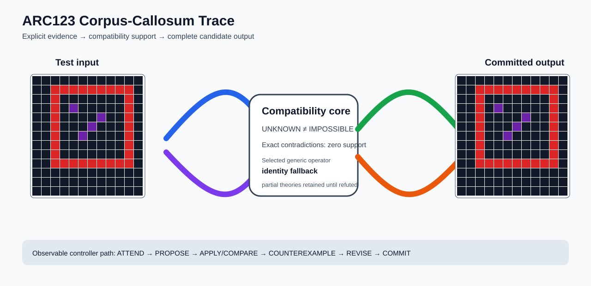

# ARC1 `d37a1ef5` P0008 Brain Surgery Report

## Outcome: NO — TEST CELLS DO NOT ALL MATCH

- **Compared positions:** 156
- **Mismatched cells:** 33
- **Training compatibility:** `False`
- **Fallback used:** `True`
- **Selected hypothesis:** `fallback_identity_complete_grid`
- **Source commit:** `085f6dbe39050afac3d1d743f840bac95b1a8d1c`
- **Frozen controller commit:** `4bed6c917523bc2baa05eec69f67303805d88dae`

## Live-Agent Boundary

The controller receives only visible training input/output examples and test inputs. It receives no task ID, imported cohort label, GT feature record, GT solver, historical decomposition, or held-out output before committing a complete grid. The expected output appears only in the post-answer V&V section.

## Corpus-Callosum Visualization



- Full explicit event record: [`learning_trace.json`](learning_trace.json)

## Frozen Measurement

This task was evaluated with the controller and operator configuration pinned before the frozen cohort was run. A result in this packet cannot alter that controller configuration.

## Post-Answer V&V

### Test case 1
- **All cells match:** `False`
- **Mismatched cells:** `33`
- **Prediction:
```json
[[0, 0, 0, 0, 0, 0, 0, 0, 0, 0, 0, 0], [0, 0, 2, 2, 2, 2, 2, 2, 2, 2, 2, 0], [0, 0, 2, 0, 0, 0, 0, 0, 0, 0, 2, 0], [0, 0, 2, 0, 5, 0, 0, 0, 0, 0, 2, 0], [0, 0, 2, 0, 0, 0, 0, 5, 0, 0, 2, 0], [0, 0, 2, 0, 0, 0, 5, 0, 0, 0, 2, 0], [0, 0, 2, 0, 0, 5, 0, 0, 0, 0, 2, 0], [0, 0, 2, 0, 0, 0, 0, 0, 0, 0, 2, 0], [0, 0, 2, 0, 0, 0, 0, 0, 0, 0, 2, 0], [0, 0, 2, 2, 2, 2, 2, 2, 2, 2, 2, 0], [0, 0, 0, 0, 0, 0, 0, 0, 0, 0, 0, 0], [0, 0, 0, 0, 0, 0, 0, 0, 0, 0, 0, 0], [0, 0, 0, 0, 0, 0, 0, 0, 0, 0, 0, 0]]
```
- **Expected output (post-answer only):**
```json
[[0, 0, 0, 0, 0, 0, 0, 0, 0, 0, 0, 0], [0, 0, 2, 2, 2, 2, 2, 2, 2, 2, 2, 0], [0, 0, 2, 2, 2, 2, 2, 2, 2, 2, 2, 0], [0, 0, 2, 2, 5, 0, 0, 0, 2, 2, 2, 0], [0, 0, 2, 2, 0, 0, 0, 5, 2, 2, 2, 0], [0, 0, 2, 2, 0, 0, 5, 0, 2, 2, 2, 0], [0, 0, 2, 2, 0, 5, 0, 0, 2, 2, 2, 0], [0, 0, 2, 2, 2, 2, 2, 2, 2, 2, 2, 0], [0, 0, 2, 2, 2, 2, 2, 2, 2, 2, 2, 0], [0, 0, 2, 2, 2, 2, 2, 2, 2, 2, 2, 0], [0, 0, 0, 0, 0, 0, 0, 0, 0, 0, 0, 0], [0, 0, 0, 0, 0, 0, 0, 0, 0, 0, 0, 0], [0, 0, 0, 0, 0, 0, 0, 0, 0, 0, 0, 0]]
```

## Observable IHL Walkthrough

The record contains explicit actions, predictions, feedback, and revisions; it does not claim or store hidden model reasoning.

### Action totals

- `ADD_CONDITION`: 1
- `APPLY_HYPOTHESIS`: 242
- `ATTEND`: 242
- `BIND_PARAMETER`: 1
- `CHOOSE_NEXT_DEMO`: 242
- `COMMIT`: 1
- `COMPARE`: 242
- `COMPOSE_RULE`: 1
- `EXPLAIN_RESIDUAL`: 1
- `FIND_COUNTEREXAMPLE`: 14
- `PROPOSE`: 1
- `SPECIALIZE`: 131

### Decision milestones

- `0` `PROPOSE` — `{"parent_theory_id":"T0000","rule":{"description_length":1,"name":"identity","operation":"identity","parameters":{},"rule_id":"identity","scope":{"kind":"all","value":null}},"stage":"initial_generic_theories","theory_id":"T0001"}`
- `2` `ATTEND` — `{"reason":"initial_highest_observed_change_and_color_discrimination","selected_demo":2,"selected_region":{"column":2,"row":2},"theory_id":"T0001"}`
- `6` `ATTEND` — `{"reason":"counterexample_requires_visible_conditional_evidence:unseen_demo_selected_for_residual_version_space_discrimination","selected_demo":1,"selected_region":{"column":2,"row":2},"theory_id":"T0001"}`
- `10` `ATTEND` — `{"reason":"counterexample_requires_visible_conditional_evidence:unseen_demo_selected_for_residual_version_space_discrimination","selected_demo":0,"selected_region":{"column":2,"row":2},"theory_id":"T0001"}`
- `16` `SPECIALIZE` — `{"added_rule":{"description_length":4,"name":"row_span_fill(fill_color=2,seed_color=2)","operation":"full_operator","parameters":{"fill_color":2,"operator":"row_span_fill","seed_color":2},"rule_id":"structural-row_span_fill","scope":{"kind":"all","value":null}},"parent_theory_id":"T0001","reason":"unexplained_residual_proposed_generic_structural_rule","theory_id":"T0003"}`
- `17` `SPECIALIZE` — `{"added_rule":{"description_length":4,"name":"line_extend(direction=left,fill_color=2,seed_color=2)","operation":"full_operator","parameters":{"direction":"left","fill_color":2,"operator":"line_extend","seed_color":2},"rule_id":"structural-line_extend","scope":{"kind":"all","value":null}},"parent_theory_id":"T0001","reason":"unexplained_residual_proposed_generic_structural_rule","theory_id":"T0004"}`
- `18` `SPECIALIZE` — `{"added_rule":{"description_length":4,"name":"line_extend(direction=up,fill_color=2,seed_color=2)","operation":"full_operator","parameters":{"direction":"up","fill_color":2,"operator":"line_extend","seed_color":2},"rule_id":"structural-line_extend","scope":{"kind":"all","value":null}},"parent_theory_id":"T0001","reason":"unexplained_residual_proposed_generic_structural_rule","theory_id":"T0005"}`
- `19` `SPECIALIZE` — `{"added_rule":{"description_length":4,"name":"line_extend(direction=right,fill_color=2,seed_color=2)","operation":"full_operator","parameters":{"direction":"right","fill_color":2,"operator":"line_extend","seed_color":2},"rule_id":"structural-line_extend","scope":{"kind":"all","value":null}},"parent_theory_id":"T0001","reason":"unexplained_residual_proposed_generic_structural_rule","theory_id":"T0006"}`
- `20` `SPECIALIZE` — `{"added_rule":{"description_length":4,"name":"line_extend(direction=down,fill_color=2,seed_color=2)","operation":"full_operator","parameters":{"direction":"down","fill_color":2,"operator":"line_extend","seed_color":2},"rule_id":"structural-line_extend","scope":{"kind":"all","value":null}},"parent_theory_id":"T0001","reason":"unexplained_residual_proposed_generic_structural_rule","theory_id":"T0007"}`
- `21` `SPECIALIZE` — `{"added_rule":{"description_length":4,"name":"line_extend(direction=up,fill_color=2,seed_color=5)","operation":"full_operator","parameters":{"direction":"up","fill_color":2,"operator":"line_extend","seed_color":5},"rule_id":"structural-line_extend","scope":{"kind":"all","value":null}},"parent_theory_id":"T0001","reason":"unexplained_residual_proposed_generic_structural_rule","theory_id":"T0008"}`
- `22` `SPECIALIZE` — `{"added_rule":{"description_length":4,"name":"row_span_fill(fill_color=5,seed_color=5)","operation":"full_operator","parameters":{"fill_color":5,"operator":"row_span_fill","seed_color":5},"rule_id":"structural-row_span_fill","scope":{"kind":"all","value":null}},"parent_theory_id":"T0001","reason":"unexplained_residual_proposed_generic_structural_rule","theory_id":"T0009"}`
- `23` `SPECIALIZE` — `{"added_rule":{"description_length":4,"name":"row_span_fill(fill_color=2,seed_color=5)","operation":"full_operator","parameters":{"fill_color":2,"operator":"row_span_fill","seed_color":5},"rule_id":"structural-row_span_fill","scope":{"kind":"all","value":null}},"parent_theory_id":"T0001","reason":"unexplained_residual_proposed_generic_structural_rule","theory_id":"T0010"}`
- `24` `SPECIALIZE` — `{"added_rule":{"description_length":4,"name":"line_extend(direction=left,fill_color=2,seed_color=5)","operation":"full_operator","parameters":{"direction":"left","fill_color":2,"operator":"line_extend","seed_color":5},"rule_id":"structural-line_extend","scope":{"kind":"all","value":null}},"parent_theory_id":"T0001","reason":"unexplained_residual_proposed_generic_structural_rule","theory_id":"T0011"}`
- `25` `SPECIALIZE` — `{"added_rule":{"description_length":4,"name":"line_extend(direction=right,fill_color=2,seed_color=5)","operation":"full_operator","parameters":{"direction":"right","fill_color":2,"operator":"line_extend","seed_color":5},"rule_id":"structural-line_extend","scope":{"kind":"all","value":null}},"parent_theory_id":"T0001","reason":"unexplained_residual_proposed_generic_structural_rule","theory_id":"T0012"}`
- `26` `SPECIALIZE` — `{"added_rule":{"description_length":4,"name":"line_extend(direction=down,fill_color=2,seed_color=5)","operation":"full_operator","parameters":{"direction":"down","fill_color":2,"operator":"line_extend","seed_color":5},"rule_id":"structural-line_extend","scope":{"kind":"all","value":null}},"parent_theory_id":"T0001","reason":"unexplained_residual_proposed_generic_structural_rule","theory_id":"T0013"}`
- `27` `SPECIALIZE` — `{"added_rule":{"description_length":4,"name":"line_extend(direction=up,fill_color=5,seed_color=5)","operation":"full_operator","parameters":{"direction":"up","fill_color":5,"operator":"line_extend","seed_color":5},"rule_id":"structural-line_extend","scope":{"kind":"all","value":null}},"parent_theory_id":"T0001","reason":"unexplained_residual_proposed_generic_structural_rule","theory_id":"T0014"}`
- `29` `ATTEND` — `{"reason":"initial_highest_observed_change_and_color_discrimination","selected_demo":2,"selected_region":{"column":0,"row":0},"theory_id":"T0002"}`
- `33` `ATTEND` — `{"reason":"initial_highest_observed_change_and_color_discrimination","selected_demo":2,"selected_region":{"column":5,"row":4},"theory_id":"T0003"}`
- `37` `ATTEND` — `{"reason":"initial_highest_observed_change_and_color_discrimination","selected_demo":2,"selected_region":{"column":0,"row":1},"theory_id":"T0004"}`
- `41` `ATTEND` — `{"reason":"initial_highest_observed_change_and_color_discrimination","selected_demo":2,"selected_region":{"column":1,"row":0},"theory_id":"T0005"}`
- `45` `ATTEND` — `{"reason":"initial_highest_observed_change_and_color_discrimination","selected_demo":2,"selected_region":{"column":11,"row":1},"theory_id":"T0006"}`
- `49` `ATTEND` — `{"reason":"initial_highest_observed_change_and_color_discrimination","selected_demo":2,"selected_region":{"column":5,"row":4},"theory_id":"T0007"}`
- `53` `ATTEND` — `{"reason":"initial_highest_observed_change_and_color_discrimination","selected_demo":2,"selected_region":{"column":4,"row":0},"theory_id":"T0008"}`
- `57` `ATTEND` — `{"reason":"initial_highest_observed_change_and_color_discrimination","selected_demo":2,"selected_region":{"column":2,"row":2},"theory_id":"T0009"}`
- `61` `ATTEND` — `{"reason":"initial_highest_observed_change_and_color_discrimination","selected_demo":2,"selected_region":{"column":2,"row":2},"theory_id":"T0010"}`
- `65` `ATTEND` — `{"reason":"initial_highest_observed_change_and_color_discrimination","selected_demo":2,"selected_region":{"column":2,"row":2},"theory_id":"T0011"}`
- `69` `ATTEND` — `{"reason":"initial_highest_observed_change_and_color_discrimination","selected_demo":2,"selected_region":{"column":2,"row":2},"theory_id":"T0012"}`
- `73` `ATTEND` — `{"reason":"initial_highest_observed_change_and_color_discrimination","selected_demo":2,"selected_region":{"column":2,"row":2},"theory_id":"T0013"}`
- `77` `ATTEND` — `{"reason":"counterexample_requires_visible_conditional_evidence:unseen_demo_selected_for_residual_version_space_discrimination","selected_demo":1,"selected_region":{"column":4,"row":4},"theory_id":"T0003"}`
- `81` `ATTEND` — `{"reason":"counterexample_requires_visible_conditional_evidence:unseen_demo_selected_for_residual_version_space_discrimination","selected_demo":0,"selected_region":{"column":4,"row":3},"theory_id":"T0003"}`
- `87` `SPECIALIZE` — `{"added_rule":{"description_length":4,"name":"line_extend(direction=left,fill_color=2,seed_color=2)","operation":"full_operator","parameters":{"direction":"left","fill_color":2,"operator":"line_extend","seed_color":2},"rule_id":"structural-line_extend","scope":{"kind":"all","value":null}},"parent_theory_id":"T0003","reason":"unexplained_residual_proposed_generic_structural_rule","theory_id":"T0016"}`
- `88` `SPECIALIZE` — `{"added_rule":{"description_length":4,"name":"line_extend(direction=up,fill_color=2,seed_color=2)","operation":"full_operator","parameters":{"direction":"up","fill_color":2,"operator":"line_extend","seed_color":2},"rule_id":"structural-line_extend","scope":{"kind":"all","value":null}},"parent_theory_id":"T0003","reason":"unexplained_residual_proposed_generic_structural_rule","theory_id":"T0017"}`
- `89` `SPECIALIZE` — `{"added_rule":{"description_length":4,"name":"line_extend(direction=right,fill_color=2,seed_color=2)","operation":"full_operator","parameters":{"direction":"right","fill_color":2,"operator":"line_extend","seed_color":2},"rule_id":"structural-line_extend","scope":{"kind":"all","value":null}},"parent_theory_id":"T0003","reason":"unexplained_residual_proposed_generic_structural_rule","theory_id":"T0018"}`
- `90` `SPECIALIZE` — `{"added_rule":{"description_length":4,"name":"line_extend(direction=down,fill_color=2,seed_color=2)","operation":"full_operator","parameters":{"direction":"down","fill_color":2,"operator":"line_extend","seed_color":2},"rule_id":"structural-line_extend","scope":{"kind":"all","value":null}},"parent_theory_id":"T0003","reason":"unexplained_residual_proposed_generic_structural_rule","theory_id":"T0019"}`
- `91` `SPECIALIZE` — `{"added_rule":{"description_length":4,"name":"line_extend(direction=up,fill_color=2,seed_color=5)","operation":"full_operator","parameters":{"direction":"up","fill_color":2,"operator":"line_extend","seed_color":5},"rule_id":"structural-line_extend","scope":{"kind":"all","value":null}},"parent_theory_id":"T0003","reason":"unexplained_residual_proposed_generic_structural_rule","theory_id":"T0020"}`
- `92` `SPECIALIZE` — `{"added_rule":{"description_length":4,"name":"row_span_fill(fill_color=5,seed_color=5)","operation":"full_operator","parameters":{"fill_color":5,"operator":"row_span_fill","seed_color":5},"rule_id":"structural-row_span_fill","scope":{"kind":"all","value":null}},"parent_theory_id":"T0003","reason":"unexplained_residual_proposed_generic_structural_rule","theory_id":"T0021"}`
- `93` `SPECIALIZE` — `{"added_rule":{"description_length":4,"name":"row_span_fill(fill_color=2,seed_color=5)","operation":"full_operator","parameters":{"fill_color":2,"operator":"row_span_fill","seed_color":5},"rule_id":"structural-row_span_fill","scope":{"kind":"all","value":null}},"parent_theory_id":"T0003","reason":"unexplained_residual_proposed_generic_structural_rule","theory_id":"T0022"}`
- `94` `SPECIALIZE` — `{"added_rule":{"description_length":4,"name":"line_extend(direction=left,fill_color=2,seed_color=5)","operation":"full_operator","parameters":{"direction":"left","fill_color":2,"operator":"line_extend","seed_color":5},"rule_id":"structural-line_extend","scope":{"kind":"all","value":null}},"parent_theory_id":"T0003","reason":"unexplained_residual_proposed_generic_structural_rule","theory_id":"T0023"}`
- `95` `SPECIALIZE` — `{"added_rule":{"description_length":4,"name":"line_extend(direction=right,fill_color=2,seed_color=5)","operation":"full_operator","parameters":{"direction":"right","fill_color":2,"operator":"line_extend","seed_color":5},"rule_id":"structural-line_extend","scope":{"kind":"all","value":null}},"parent_theory_id":"T0003","reason":"unexplained_residual_proposed_generic_structural_rule","theory_id":"T0024"}`
- `96` `SPECIALIZE` — `{"added_rule":{"description_length":4,"name":"line_extend(direction=down,fill_color=2,seed_color=5)","operation":"full_operator","parameters":{"direction":"down","fill_color":2,"operator":"line_extend","seed_color":5},"rule_id":"structural-line_extend","scope":{"kind":"all","value":null}},"parent_theory_id":"T0003","reason":"unexplained_residual_proposed_generic_structural_rule","theory_id":"T0025"}`
- `97` `SPECIALIZE` — `{"added_rule":{"description_length":4,"name":"line_extend(direction=up,fill_color=5,seed_color=5)","operation":"full_operator","parameters":{"direction":"up","fill_color":5,"operator":"line_extend","seed_color":5},"rule_id":"structural-line_extend","scope":{"kind":"all","value":null}},"parent_theory_id":"T0003","reason":"unexplained_residual_proposed_generic_structural_rule","theory_id":"T0026"}`
- `99` `ATTEND` — `{"reason":"initial_highest_observed_change_and_color_discrimination","selected_demo":2,"selected_region":{"column":5,"row":4},"theory_id":"T0015"}`
- `103` `ATTEND` — `{"reason":"initial_highest_observed_change_and_color_discrimination","selected_demo":2,"selected_region":{"column":0,"row":1},"theory_id":"T0016"}`
- `107` `ATTEND` — `{"reason":"initial_highest_observed_change_and_color_discrimination","selected_demo":2,"selected_region":{"column":1,"row":0},"theory_id":"T0017"}`
- `111` `ATTEND` — `{"reason":"initial_highest_observed_change_and_color_discrimination","selected_demo":2,"selected_region":{"column":11,"row":1},"theory_id":"T0018"}`
- `115` `ATTEND` — `{"reason":"initial_highest_observed_change_and_color_discrimination","selected_demo":2,"selected_region":{"column":5,"row":4},"theory_id":"T0019"}`
- `119` `ATTEND` — `{"reason":"initial_highest_observed_change_and_color_discrimination","selected_demo":2,"selected_region":{"column":4,"row":0},"theory_id":"T0020"}`
- `123` `ATTEND` — `{"reason":"initial_highest_observed_change_and_color_discrimination","selected_demo":2,"selected_region":{"column":2,"row":2},"theory_id":"T0021"}`
- `127` `ATTEND` — `{"reason":"initial_highest_observed_change_and_color_discrimination","selected_demo":2,"selected_region":{"column":2,"row":2},"theory_id":"T0022"}`
- `131` `ATTEND` — `{"reason":"initial_highest_observed_change_and_color_discrimination","selected_demo":2,"selected_region":{"column":2,"row":2},"theory_id":"T0023"}`
- `135` `ATTEND` — `{"reason":"initial_highest_observed_change_and_color_discrimination","selected_demo":2,"selected_region":{"column":2,"row":2},"theory_id":"T0024"}`
- `139` `ATTEND` — `{"reason":"initial_highest_observed_change_and_color_discrimination","selected_demo":2,"selected_region":{"column":2,"row":2},"theory_id":"T0025"}`
- `143` `ATTEND` — `{"reason":"initial_highest_observed_change_and_color_discrimination","selected_demo":2,"selected_region":{"column":4,"row":0},"theory_id":"T0026"}`
- `147` `ATTEND` — `{"reason":"counterexample_requires_visible_conditional_evidence:unseen_demo_selected_for_residual_version_space_discrimination","selected_demo":1,"selected_region":{"column":4,"row":4},"theory_id":"T0015"}`
- `151` `ATTEND` — `{"reason":"counterexample_requires_visible_conditional_evidence:unseen_demo_selected_for_residual_version_space_discrimination","selected_demo":0,"selected_region":{"column":4,"row":3},"theory_id":"T0015"}`
- `155` `SPECIALIZE` — `{"added_rule":{"description_length":4,"name":"row_span_fill(fill_color=2,seed_color=2)","operation":"full_operator","parameters":{"fill_color":2,"operator":"row_span_fill","seed_color":2},"rule_id":"structural-row_span_fill","scope":{"kind":"all","value":null}},"parent_theory_id":"T0015","reason":"unexplained_residual_proposed_generic_structural_rule","theory_id":"T0027"}`
- `156` `SPECIALIZE` — `{"added_rule":{"description_length":4,"name":"line_extend(direction=left,fill_color=2,seed_color=2)","operation":"full_operator","parameters":{"direction":"left","fill_color":2,"operator":"line_extend","seed_color":2},"rule_id":"structural-line_extend","scope":{"kind":"all","value":null}},"parent_theory_id":"T0015","reason":"unexplained_residual_proposed_generic_structural_rule","theory_id":"T0028"}`
- `157` `SPECIALIZE` — `{"added_rule":{"description_length":4,"name":"line_extend(direction=up,fill_color=2,seed_color=2)","operation":"full_operator","parameters":{"direction":"up","fill_color":2,"operator":"line_extend","seed_color":2},"rule_id":"structural-line_extend","scope":{"kind":"all","value":null}},"parent_theory_id":"T0015","reason":"unexplained_residual_proposed_generic_structural_rule","theory_id":"T0029"}`
- `158` `SPECIALIZE` — `{"added_rule":{"description_length":4,"name":"line_extend(direction=right,fill_color=2,seed_color=2)","operation":"full_operator","parameters":{"direction":"right","fill_color":2,"operator":"line_extend","seed_color":2},"rule_id":"structural-line_extend","scope":{"kind":"all","value":null}},"parent_theory_id":"T0015","reason":"unexplained_residual_proposed_generic_structural_rule","theory_id":"T0030"}`
- `159` `SPECIALIZE` — `{"added_rule":{"description_length":4,"name":"line_extend(direction=down,fill_color=2,seed_color=2)","operation":"full_operator","parameters":{"direction":"down","fill_color":2,"operator":"line_extend","seed_color":2},"rule_id":"structural-line_extend","scope":{"kind":"all","value":null}},"parent_theory_id":"T0015","reason":"unexplained_residual_proposed_generic_structural_rule","theory_id":"T0031"}`
- `160` `SPECIALIZE` — `{"added_rule":{"description_length":4,"name":"line_extend(direction=up,fill_color=2,seed_color=5)","operation":"full_operator","parameters":{"direction":"up","fill_color":2,"operator":"line_extend","seed_color":5},"rule_id":"structural-line_extend","scope":{"kind":"all","value":null}},"parent_theory_id":"T0015","reason":"unexplained_residual_proposed_generic_structural_rule","theory_id":"T0032"}`
- `161` `SPECIALIZE` — `{"added_rule":{"description_length":4,"name":"row_span_fill(fill_color=5,seed_color=5)","operation":"full_operator","parameters":{"fill_color":5,"operator":"row_span_fill","seed_color":5},"rule_id":"structural-row_span_fill","scope":{"kind":"all","value":null}},"parent_theory_id":"T0015","reason":"unexplained_residual_proposed_generic_structural_rule","theory_id":"T0033"}`
- `162` `SPECIALIZE` — `{"added_rule":{"description_length":4,"name":"row_span_fill(fill_color=2,seed_color=5)","operation":"full_operator","parameters":{"fill_color":2,"operator":"row_span_fill","seed_color":5},"rule_id":"structural-row_span_fill","scope":{"kind":"all","value":null}},"parent_theory_id":"T0015","reason":"unexplained_residual_proposed_generic_structural_rule","theory_id":"T0034"}`
- `163` `SPECIALIZE` — `{"added_rule":{"description_length":4,"name":"line_extend(direction=left,fill_color=2,seed_color=5)","operation":"full_operator","parameters":{"direction":"left","fill_color":2,"operator":"line_extend","seed_color":5},"rule_id":"structural-line_extend","scope":{"kind":"all","value":null}},"parent_theory_id":"T0015","reason":"unexplained_residual_proposed_generic_structural_rule","theory_id":"T0035"}`
- `164` `SPECIALIZE` — `{"added_rule":{"description_length":4,"name":"line_extend(direction=right,fill_color=2,seed_color=5)","operation":"full_operator","parameters":{"direction":"right","fill_color":2,"operator":"line_extend","seed_color":5},"rule_id":"structural-line_extend","scope":{"kind":"all","value":null}},"parent_theory_id":"T0015","reason":"unexplained_residual_proposed_generic_structural_rule","theory_id":"T0036"}`
- `165` `SPECIALIZE` — `{"added_rule":{"description_length":4,"name":"line_extend(direction=down,fill_color=2,seed_color=5)","operation":"full_operator","parameters":{"direction":"down","fill_color":2,"operator":"line_extend","seed_color":5},"rule_id":"structural-line_extend","scope":{"kind":"all","value":null}},"parent_theory_id":"T0015","reason":"unexplained_residual_proposed_generic_structural_rule","theory_id":"T0037"}`
- `166` `SPECIALIZE` — `{"added_rule":{"description_length":4,"name":"line_extend(direction=up,fill_color=5,seed_color=5)","operation":"full_operator","parameters":{"direction":"up","fill_color":5,"operator":"line_extend","seed_color":5},"rule_id":"structural-line_extend","scope":{"kind":"all","value":null}},"parent_theory_id":"T0015","reason":"unexplained_residual_proposed_generic_structural_rule","theory_id":"T0038"}`
- `168` `ATTEND` — `{"reason":"initial_highest_observed_change_and_color_discrimination","selected_demo":2,"selected_region":{"column":5,"row":4},"theory_id":"T0027"}`
- `172` `ATTEND` — `{"reason":"initial_highest_observed_change_and_color_discrimination","selected_demo":2,"selected_region":{"column":0,"row":1},"theory_id":"T0028"}`
- `176` `ATTEND` — `{"reason":"initial_highest_observed_change_and_color_discrimination","selected_demo":2,"selected_region":{"column":1,"row":0},"theory_id":"T0029"}`
- `180` `ATTEND` — `{"reason":"initial_highest_observed_change_and_color_discrimination","selected_demo":2,"selected_region":{"column":11,"row":1},"theory_id":"T0030"}`
- `184` `ATTEND` — `{"reason":"initial_highest_observed_change_and_color_discrimination","selected_demo":2,"selected_region":{"column":5,"row":4},"theory_id":"T0031"}`
- `188` `ATTEND` — `{"reason":"initial_highest_observed_change_and_color_discrimination","selected_demo":2,"selected_region":{"column":4,"row":0},"theory_id":"T0032"}`
- `192` `ATTEND` — `{"reason":"initial_highest_observed_change_and_color_discrimination","selected_demo":2,"selected_region":{"column":2,"row":2},"theory_id":"T0033"}`
- `196` `ATTEND` — `{"reason":"initial_highest_observed_change_and_color_discrimination","selected_demo":2,"selected_region":{"column":2,"row":2},"theory_id":"T0034"}`
- `200` `ATTEND` — `{"reason":"initial_highest_observed_change_and_color_discrimination","selected_demo":2,"selected_region":{"column":2,"row":2},"theory_id":"T0035"}`
- `204` `ATTEND` — `{"reason":"initial_highest_observed_change_and_color_discrimination","selected_demo":2,"selected_region":{"column":2,"row":2},"theory_id":"T0036"}`
- `208` `ATTEND` — `{"reason":"initial_highest_observed_change_and_color_discrimination","selected_demo":2,"selected_region":{"column":2,"row":2},"theory_id":"T0037"}`
- `212` `ATTEND` — `{"reason":"initial_highest_observed_change_and_color_discrimination","selected_demo":2,"selected_region":{"column":4,"row":0},"theory_id":"T0038"}`
- `216` `ATTEND` — `{"reason":"counterexample_requires_visible_conditional_evidence:unseen_demo_selected_for_residual_version_space_discrimination","selected_demo":1,"selected_region":{"column":4,"row":4},"theory_id":"T0027"}`
- `220` `ATTEND` — `{"reason":"counterexample_requires_visible_conditional_evidence:unseen_demo_selected_for_residual_version_space_discrimination","selected_demo":0,"selected_region":{"column":4,"row":3},"theory_id":"T0027"}`
- `224` `SPECIALIZE` — `{"added_rule":{"description_length":4,"name":"line_extend(direction=left,fill_color=2,seed_color=2)","operation":"full_operator","parameters":{"direction":"left","fill_color":2,"operator":"line_extend","seed_color":2},"rule_id":"structural-line_extend","scope":{"kind":"all","value":null}},"parent_theory_id":"T0027","reason":"unexplained_residual_proposed_generic_structural_rule","theory_id":"T0039"}`
- `225` `SPECIALIZE` — `{"added_rule":{"description_length":4,"name":"line_extend(direction=up,fill_color=2,seed_color=2)","operation":"full_operator","parameters":{"direction":"up","fill_color":2,"operator":"line_extend","seed_color":2},"rule_id":"structural-line_extend","scope":{"kind":"all","value":null}},"parent_theory_id":"T0027","reason":"unexplained_residual_proposed_generic_structural_rule","theory_id":"T0040"}`
- `226` `SPECIALIZE` — `{"added_rule":{"description_length":4,"name":"line_extend(direction=right,fill_color=2,seed_color=2)","operation":"full_operator","parameters":{"direction":"right","fill_color":2,"operator":"line_extend","seed_color":2},"rule_id":"structural-line_extend","scope":{"kind":"all","value":null}},"parent_theory_id":"T0027","reason":"unexplained_residual_proposed_generic_structural_rule","theory_id":"T0041"}`
- `227` `SPECIALIZE` — `{"added_rule":{"description_length":4,"name":"line_extend(direction=down,fill_color=2,seed_color=2)","operation":"full_operator","parameters":{"direction":"down","fill_color":2,"operator":"line_extend","seed_color":2},"rule_id":"structural-line_extend","scope":{"kind":"all","value":null}},"parent_theory_id":"T0027","reason":"unexplained_residual_proposed_generic_structural_rule","theory_id":"T0042"}`
- `228` `SPECIALIZE` — `{"added_rule":{"description_length":4,"name":"line_extend(direction=up,fill_color=2,seed_color=5)","operation":"full_operator","parameters":{"direction":"up","fill_color":2,"operator":"line_extend","seed_color":5},"rule_id":"structural-line_extend","scope":{"kind":"all","value":null}},"parent_theory_id":"T0027","reason":"unexplained_residual_proposed_generic_structural_rule","theory_id":"T0043"}`
- `229` `SPECIALIZE` — `{"added_rule":{"description_length":4,"name":"row_span_fill(fill_color=5,seed_color=5)","operation":"full_operator","parameters":{"fill_color":5,"operator":"row_span_fill","seed_color":5},"rule_id":"structural-row_span_fill","scope":{"kind":"all","value":null}},"parent_theory_id":"T0027","reason":"unexplained_residual_proposed_generic_structural_rule","theory_id":"T0044"}`
- `230` `SPECIALIZE` — `{"added_rule":{"description_length":4,"name":"row_span_fill(fill_color=2,seed_color=5)","operation":"full_operator","parameters":{"fill_color":2,"operator":"row_span_fill","seed_color":5},"rule_id":"structural-row_span_fill","scope":{"kind":"all","value":null}},"parent_theory_id":"T0027","reason":"unexplained_residual_proposed_generic_structural_rule","theory_id":"T0045"}`
- `231` `SPECIALIZE` — `{"added_rule":{"description_length":4,"name":"line_extend(direction=left,fill_color=2,seed_color=5)","operation":"full_operator","parameters":{"direction":"left","fill_color":2,"operator":"line_extend","seed_color":5},"rule_id":"structural-line_extend","scope":{"kind":"all","value":null}},"parent_theory_id":"T0027","reason":"unexplained_residual_proposed_generic_structural_rule","theory_id":"T0046"}`
- `232` `SPECIALIZE` — `{"added_rule":{"description_length":4,"name":"line_extend(direction=right,fill_color=2,seed_color=5)","operation":"full_operator","parameters":{"direction":"right","fill_color":2,"operator":"line_extend","seed_color":5},"rule_id":"structural-line_extend","scope":{"kind":"all","value":null}},"parent_theory_id":"T0027","reason":"unexplained_residual_proposed_generic_structural_rule","theory_id":"T0047"}`
- `233` `SPECIALIZE` — `{"added_rule":{"description_length":4,"name":"line_extend(direction=down,fill_color=2,seed_color=5)","operation":"full_operator","parameters":{"direction":"down","fill_color":2,"operator":"line_extend","seed_color":5},"rule_id":"structural-line_extend","scope":{"kind":"all","value":null}},"parent_theory_id":"T0027","reason":"unexplained_residual_proposed_generic_structural_rule","theory_id":"T0048"}`
- `234` `SPECIALIZE` — `{"added_rule":{"description_length":4,"name":"line_extend(direction=up,fill_color=5,seed_color=5)","operation":"full_operator","parameters":{"direction":"up","fill_color":5,"operator":"line_extend","seed_color":5},"rule_id":"structural-line_extend","scope":{"kind":"all","value":null}},"parent_theory_id":"T0027","reason":"unexplained_residual_proposed_generic_structural_rule","theory_id":"T0049"}`
- `236` `ATTEND` — `{"reason":"initial_highest_observed_change_and_color_discrimination","selected_demo":2,"selected_region":{"column":0,"row":1},"theory_id":"T0039"}`
- `240` `ATTEND` — `{"reason":"initial_highest_observed_change_and_color_discrimination","selected_demo":2,"selected_region":{"column":1,"row":0},"theory_id":"T0040"}`
- `244` `ATTEND` — `{"reason":"initial_highest_observed_change_and_color_discrimination","selected_demo":2,"selected_region":{"column":11,"row":1},"theory_id":"T0041"}`
- `248` `ATTEND` — `{"reason":"initial_highest_observed_change_and_color_discrimination","selected_demo":2,"selected_region":{"column":5,"row":4},"theory_id":"T0042"}`
- `252` `ATTEND` — `{"reason":"initial_highest_observed_change_and_color_discrimination","selected_demo":2,"selected_region":{"column":4,"row":0},"theory_id":"T0043"}`
- `256` `ATTEND` — `{"reason":"initial_highest_observed_change_and_color_discrimination","selected_demo":2,"selected_region":{"column":2,"row":2},"theory_id":"T0044"}`
- `260` `ATTEND` — `{"reason":"initial_highest_observed_change_and_color_discrimination","selected_demo":2,"selected_region":{"column":2,"row":2},"theory_id":"T0045"}`
- `264` `ATTEND` — `{"reason":"initial_highest_observed_change_and_color_discrimination","selected_demo":2,"selected_region":{"column":2,"row":2},"theory_id":"T0046"}`
- `268` `ATTEND` — `{"reason":"initial_highest_observed_change_and_color_discrimination","selected_demo":2,"selected_region":{"column":2,"row":2},"theory_id":"T0047"}`
- `272` `ATTEND` — `{"reason":"initial_highest_observed_change_and_color_discrimination","selected_demo":2,"selected_region":{"column":2,"row":2},"theory_id":"T0048"}`
- `276` `ATTEND` — `{"reason":"initial_highest_observed_change_and_color_discrimination","selected_demo":2,"selected_region":{"column":4,"row":0},"theory_id":"T0049"}`
- `280` `ATTEND` — `{"reason":"counterexample_requires_visible_conditional_evidence:unseen_demo_selected_for_residual_version_space_discrimination","selected_demo":1,"selected_region":{"column":0,"row":1},"theory_id":"T0028"}`
- `284` `ATTEND` — `{"reason":"counterexample_requires_visible_conditional_evidence:unseen_demo_selected_for_residual_version_space_discrimination","selected_demo":1,"selected_region":{"column":0,"row":1},"theory_id":"T0039"}`
- `288` `ATTEND` — `{"reason":"counterexample_requires_visible_conditional_evidence:unseen_demo_selected_for_residual_version_space_discrimination","selected_demo":1,"selected_region":{"column":9,"row":1},"theory_id":"T0041"}`
- `292` `ATTEND` — `{"reason":"counterexample_requires_visible_conditional_evidence:unseen_demo_selected_for_residual_version_space_discrimination","selected_demo":1,"selected_region":{"column":1,"row":0},"theory_id":"T0040"}`
- `296` `ATTEND` — `{"reason":"counterexample_requires_visible_conditional_evidence:unseen_demo_selected_for_residual_version_space_discrimination","selected_demo":0,"selected_region":{"column":0,"row":1},"theory_id":"T0028"}`
- `300` `ATTEND` — `{"reason":"counterexample_requires_visible_conditional_evidence:unseen_demo_selected_for_residual_version_space_discrimination","selected_demo":0,"selected_region":{"column":0,"row":1},"theory_id":"T0039"}`
- `304` `ATTEND` — `{"reason":"counterexample_requires_visible_conditional_evidence:unseen_demo_selected_for_residual_version_space_discrimination","selected_demo":0,"selected_region":{"column":1,"row":0},"theory_id":"T0040"}`
- `308` `ATTEND` — `{"reason":"counterexample_requires_visible_conditional_evidence:unseen_demo_selected_for_residual_version_space_discrimination","selected_demo":0,"selected_region":{"column":9,"row":1},"theory_id":"T0041"}`
- `312` `SPECIALIZE` — `{"added_rule":{"description_length":4,"name":"row_span_fill(fill_color=2,seed_color=2)","operation":"full_operator","parameters":{"fill_color":2,"operator":"row_span_fill","seed_color":2},"rule_id":"structural-row_span_fill","scope":{"kind":"all","value":null}},"parent_theory_id":"T0028","reason":"unexplained_residual_proposed_generic_structural_rule","theory_id":"T0050"}`
- `313` `SPECIALIZE` — `{"added_rule":{"description_length":4,"name":"line_extend(direction=up,fill_color=2,seed_color=2)","operation":"full_operator","parameters":{"direction":"up","fill_color":2,"operator":"line_extend","seed_color":2},"rule_id":"structural-line_extend","scope":{"kind":"all","value":null}},"parent_theory_id":"T0028","reason":"unexplained_residual_proposed_generic_structural_rule","theory_id":"T0051"}`
- `314` `SPECIALIZE` — `{"added_rule":{"description_length":4,"name":"line_extend(direction=right,fill_color=2,seed_color=2)","operation":"full_operator","parameters":{"direction":"right","fill_color":2,"operator":"line_extend","seed_color":2},"rule_id":"structural-line_extend","scope":{"kind":"all","value":null}},"parent_theory_id":"T0028","reason":"unexplained_residual_proposed_generic_structural_rule","theory_id":"T0052"}`
- `315` `SPECIALIZE` — `{"added_rule":{"description_length":4,"name":"line_extend(direction=down,fill_color=2,seed_color=2)","operation":"full_operator","parameters":{"direction":"down","fill_color":2,"operator":"line_extend","seed_color":2},"rule_id":"structural-line_extend","scope":{"kind":"all","value":null}},"parent_theory_id":"T0028","reason":"unexplained_residual_proposed_generic_structural_rule","theory_id":"T0053"}`
- `316` `SPECIALIZE` — `{"added_rule":{"description_length":4,"name":"line_extend(direction=up,fill_color=2,seed_color=5)","operation":"full_operator","parameters":{"direction":"up","fill_color":2,"operator":"line_extend","seed_color":5},"rule_id":"structural-line_extend","scope":{"kind":"all","value":null}},"parent_theory_id":"T0028","reason":"unexplained_residual_proposed_generic_structural_rule","theory_id":"T0054"}`
- `317` `SPECIALIZE` — `{"added_rule":{"description_length":4,"name":"row_span_fill(fill_color=5,seed_color=5)","operation":"full_operator","parameters":{"fill_color":5,"operator":"row_span_fill","seed_color":5},"rule_id":"structural-row_span_fill","scope":{"kind":"all","value":null}},"parent_theory_id":"T0028","reason":"unexplained_residual_proposed_generic_structural_rule","theory_id":"T0055"}`
- `318` `SPECIALIZE` — `{"added_rule":{"description_length":4,"name":"row_span_fill(fill_color=2,seed_color=5)","operation":"full_operator","parameters":{"fill_color":2,"operator":"row_span_fill","seed_color":5},"rule_id":"structural-row_span_fill","scope":{"kind":"all","value":null}},"parent_theory_id":"T0028","reason":"unexplained_residual_proposed_generic_structural_rule","theory_id":"T0056"}`
- `319` `SPECIALIZE` — `{"added_rule":{"description_length":4,"name":"line_extend(direction=left,fill_color=2,seed_color=5)","operation":"full_operator","parameters":{"direction":"left","fill_color":2,"operator":"line_extend","seed_color":5},"rule_id":"structural-line_extend","scope":{"kind":"all","value":null}},"parent_theory_id":"T0028","reason":"unexplained_residual_proposed_generic_structural_rule","theory_id":"T0057"}`
- `320` `SPECIALIZE` — `{"added_rule":{"description_length":4,"name":"line_extend(direction=right,fill_color=2,seed_color=5)","operation":"full_operator","parameters":{"direction":"right","fill_color":2,"operator":"line_extend","seed_color":5},"rule_id":"structural-line_extend","scope":{"kind":"all","value":null}},"parent_theory_id":"T0028","reason":"unexplained_residual_proposed_generic_structural_rule","theory_id":"T0058"}`
- `321` `SPECIALIZE` — `{"added_rule":{"description_length":4,"name":"line_extend(direction=down,fill_color=2,seed_color=5)","operation":"full_operator","parameters":{"direction":"down","fill_color":2,"operator":"line_extend","seed_color":5},"rule_id":"structural-line_extend","scope":{"kind":"all","value":null}},"parent_theory_id":"T0028","reason":"unexplained_residual_proposed_generic_structural_rule","theory_id":"T0059"}`
- `322` `SPECIALIZE` — `{"added_rule":{"description_length":4,"name":"line_extend(direction=up,fill_color=5,seed_color=5)","operation":"full_operator","parameters":{"direction":"up","fill_color":5,"operator":"line_extend","seed_color":5},"rule_id":"structural-line_extend","scope":{"kind":"all","value":null}},"parent_theory_id":"T0028","reason":"unexplained_residual_proposed_generic_structural_rule","theory_id":"T0060"}`
- `324` `ATTEND` — `{"reason":"initial_highest_observed_change_and_color_discrimination","selected_demo":2,"selected_region":{"column":5,"row":4},"theory_id":"T0050"}`
- `328` `ATTEND` — `{"reason":"initial_highest_observed_change_and_color_discrimination","selected_demo":2,"selected_region":{"column":1,"row":0},"theory_id":"T0051"}`
- `332` `ATTEND` — `{"reason":"initial_highest_observed_change_and_color_discrimination","selected_demo":2,"selected_region":{"column":11,"row":1},"theory_id":"T0052"}`
- `336` `ATTEND` — `{"reason":"initial_highest_observed_change_and_color_discrimination","selected_demo":2,"selected_region":{"column":5,"row":4},"theory_id":"T0053"}`
- `340` `ATTEND` — `{"reason":"initial_highest_observed_change_and_color_discrimination","selected_demo":2,"selected_region":{"column":4,"row":0},"theory_id":"T0054"}`
- `344` `ATTEND` — `{"reason":"initial_highest_observed_change_and_color_discrimination","selected_demo":2,"selected_region":{"column":2,"row":2},"theory_id":"T0055"}`
- `348` `ATTEND` — `{"reason":"initial_highest_observed_change_and_color_discrimination","selected_demo":2,"selected_region":{"column":2,"row":2},"theory_id":"T0056"}`
- `352` `ATTEND` — `{"reason":"initial_highest_observed_change_and_color_discrimination","selected_demo":2,"selected_region":{"column":2,"row":2},"theory_id":"T0057"}`
- `356` `ATTEND` — `{"reason":"initial_highest_observed_change_and_color_discrimination","selected_demo":2,"selected_region":{"column":2,"row":2},"theory_id":"T0058"}`
- `360` `ATTEND` — `{"reason":"initial_highest_observed_change_and_color_discrimination","selected_demo":2,"selected_region":{"column":2,"row":2},"theory_id":"T0059"}`
- `364` `ATTEND` — `{"reason":"initial_highest_observed_change_and_color_discrimination","selected_demo":2,"selected_region":{"column":4,"row":0},"theory_id":"T0060"}`
- `368` `ATTEND` — `{"reason":"counterexample_requires_visible_conditional_evidence:unseen_demo_selected_for_residual_version_space_discrimination","selected_demo":1,"selected_region":{"column":4,"row":4},"theory_id":"T0050"}`
- `372` `ATTEND` — `{"reason":"counterexample_requires_visible_conditional_evidence:unseen_demo_selected_for_residual_version_space_discrimination","selected_demo":0,"selected_region":{"column":4,"row":3},"theory_id":"T0050"}`
- `376` `SPECIALIZE` — `{"added_rule":{"description_length":4,"name":"line_extend(direction=up,fill_color=2,seed_color=2)","operation":"full_operator","parameters":{"direction":"up","fill_color":2,"operator":"line_extend","seed_color":2},"rule_id":"structural-line_extend","scope":{"kind":"all","value":null}},"parent_theory_id":"T0050","reason":"unexplained_residual_proposed_generic_structural_rule","theory_id":"T0061"}`
- `377` `SPECIALIZE` — `{"added_rule":{"description_length":4,"name":"line_extend(direction=right,fill_color=2,seed_color=2)","operation":"full_operator","parameters":{"direction":"right","fill_color":2,"operator":"line_extend","seed_color":2},"rule_id":"structural-line_extend","scope":{"kind":"all","value":null}},"parent_theory_id":"T0050","reason":"unexplained_residual_proposed_generic_structural_rule","theory_id":"T0062"}`
- `378` `SPECIALIZE` — `{"added_rule":{"description_length":4,"name":"line_extend(direction=down,fill_color=2,seed_color=2)","operation":"full_operator","parameters":{"direction":"down","fill_color":2,"operator":"line_extend","seed_color":2},"rule_id":"structural-line_extend","scope":{"kind":"all","value":null}},"parent_theory_id":"T0050","reason":"unexplained_residual_proposed_generic_structural_rule","theory_id":"T0063"}`
- `379` `SPECIALIZE` — `{"added_rule":{"description_length":4,"name":"line_extend(direction=up,fill_color=2,seed_color=5)","operation":"full_operator","parameters":{"direction":"up","fill_color":2,"operator":"line_extend","seed_color":5},"rule_id":"structural-line_extend","scope":{"kind":"all","value":null}},"parent_theory_id":"T0050","reason":"unexplained_residual_proposed_generic_structural_rule","theory_id":"T0064"}`
- `380` `SPECIALIZE` — `{"added_rule":{"description_length":4,"name":"row_span_fill(fill_color=5,seed_color=5)","operation":"full_operator","parameters":{"fill_color":5,"operator":"row_span_fill","seed_color":5},"rule_id":"structural-row_span_fill","scope":{"kind":"all","value":null}},"parent_theory_id":"T0050","reason":"unexplained_residual_proposed_generic_structural_rule","theory_id":"T0065"}`
- `381` `SPECIALIZE` — `{"added_rule":{"description_length":4,"name":"row_span_fill(fill_color=2,seed_color=5)","operation":"full_operator","parameters":{"fill_color":2,"operator":"row_span_fill","seed_color":5},"rule_id":"structural-row_span_fill","scope":{"kind":"all","value":null}},"parent_theory_id":"T0050","reason":"unexplained_residual_proposed_generic_structural_rule","theory_id":"T0066"}`
- `382` `SPECIALIZE` — `{"added_rule":{"description_length":4,"name":"line_extend(direction=left,fill_color=2,seed_color=5)","operation":"full_operator","parameters":{"direction":"left","fill_color":2,"operator":"line_extend","seed_color":5},"rule_id":"structural-line_extend","scope":{"kind":"all","value":null}},"parent_theory_id":"T0050","reason":"unexplained_residual_proposed_generic_structural_rule","theory_id":"T0067"}`
- `383` `SPECIALIZE` — `{"added_rule":{"description_length":4,"name":"line_extend(direction=right,fill_color=2,seed_color=5)","operation":"full_operator","parameters":{"direction":"right","fill_color":2,"operator":"line_extend","seed_color":5},"rule_id":"structural-line_extend","scope":{"kind":"all","value":null}},"parent_theory_id":"T0050","reason":"unexplained_residual_proposed_generic_structural_rule","theory_id":"T0068"}`
- `384` `SPECIALIZE` — `{"added_rule":{"description_length":4,"name":"line_extend(direction=down,fill_color=2,seed_color=5)","operation":"full_operator","parameters":{"direction":"down","fill_color":2,"operator":"line_extend","seed_color":5},"rule_id":"structural-line_extend","scope":{"kind":"all","value":null}},"parent_theory_id":"T0050","reason":"unexplained_residual_proposed_generic_structural_rule","theory_id":"T0069"}`
- `385` `SPECIALIZE` — `{"added_rule":{"description_length":4,"name":"line_extend(direction=up,fill_color=5,seed_color=5)","operation":"full_operator","parameters":{"direction":"up","fill_color":5,"operator":"line_extend","seed_color":5},"rule_id":"structural-line_extend","scope":{"kind":"all","value":null}},"parent_theory_id":"T0050","reason":"unexplained_residual_proposed_generic_structural_rule","theory_id":"T0070"}`
- `387` `ATTEND` — `{"reason":"initial_highest_observed_change_and_color_discrimination","selected_demo":2,"selected_region":{"column":1,"row":0},"theory_id":"T0061"}`
- `391` `ATTEND` — `{"reason":"initial_highest_observed_change_and_color_discrimination","selected_demo":2,"selected_region":{"column":11,"row":1},"theory_id":"T0062"}`
- `395` `ATTEND` — `{"reason":"initial_highest_observed_change_and_color_discrimination","selected_demo":2,"selected_region":{"column":5,"row":4},"theory_id":"T0063"}`
- `399` `ATTEND` — `{"reason":"initial_highest_observed_change_and_color_discrimination","selected_demo":2,"selected_region":{"column":4,"row":0},"theory_id":"T0064"}`
- `403` `ATTEND` — `{"reason":"initial_highest_observed_change_and_color_discrimination","selected_demo":2,"selected_region":{"column":2,"row":2},"theory_id":"T0065"}`
- `407` `ATTEND` — `{"reason":"initial_highest_observed_change_and_color_discrimination","selected_demo":2,"selected_region":{"column":2,"row":2},"theory_id":"T0066"}`
- `411` `ATTEND` — `{"reason":"initial_highest_observed_change_and_color_discrimination","selected_demo":2,"selected_region":{"column":2,"row":2},"theory_id":"T0067"}`
- `415` `ATTEND` — `{"reason":"initial_highest_observed_change_and_color_discrimination","selected_demo":2,"selected_region":{"column":2,"row":2},"theory_id":"T0068"}`
- `419` `ATTEND` — `{"reason":"initial_highest_observed_change_and_color_discrimination","selected_demo":2,"selected_region":{"column":2,"row":2},"theory_id":"T0069"}`
- `423` `ATTEND` — `{"reason":"initial_highest_observed_change_and_color_discrimination","selected_demo":2,"selected_region":{"column":4,"row":0},"theory_id":"T0070"}`
- `427` `ATTEND` — `{"reason":"counterexample_requires_visible_conditional_evidence:unseen_demo_selected_for_residual_version_space_discrimination","selected_demo":1,"selected_region":{"column":9,"row":1},"theory_id":"T0052"}`
- `431` `ATTEND` — `{"reason":"counterexample_requires_visible_conditional_evidence:unseen_demo_selected_for_residual_version_space_discrimination","selected_demo":1,"selected_region":{"column":9,"row":1},"theory_id":"T0062"}`
- `435` `ATTEND` — `{"reason":"counterexample_requires_visible_conditional_evidence:unseen_demo_selected_for_residual_version_space_discrimination","selected_demo":1,"selected_region":{"column":1,"row":0},"theory_id":"T0051"}`
- `439` `ATTEND` — `{"reason":"counterexample_requires_visible_conditional_evidence:unseen_demo_selected_for_residual_version_space_discrimination","selected_demo":1,"selected_region":{"column":1,"row":0},"theory_id":"T0061"}`
- `443` `ATTEND` — `{"reason":"counterexample_requires_visible_conditional_evidence:unseen_demo_selected_for_residual_version_space_discrimination","selected_demo":0,"selected_region":{"column":1,"row":0},"theory_id":"T0051"}`
- `447` `ATTEND` — `{"reason":"counterexample_requires_visible_conditional_evidence:unseen_demo_selected_for_residual_version_space_discrimination","selected_demo":0,"selected_region":{"column":1,"row":0},"theory_id":"T0061"}`
- `451` `ATTEND` — `{"reason":"counterexample_requires_visible_conditional_evidence:unseen_demo_selected_for_residual_version_space_discrimination","selected_demo":0,"selected_region":{"column":9,"row":1},"theory_id":"T0052"}`
- `455` `ATTEND` — `{"reason":"counterexample_requires_visible_conditional_evidence:unseen_demo_selected_for_residual_version_space_discrimination","selected_demo":0,"selected_region":{"column":9,"row":1},"theory_id":"T0062"}`
- `459` `ATTEND` — `{"reason":"counterexample_requires_visible_conditional_evidence:unseen_demo_selected_for_residual_version_space_discrimination","selected_demo":1,"selected_region":{"column":3,"row":0},"theory_id":"T0064"}`
- `463` `ATTEND` — `{"reason":"counterexample_requires_visible_conditional_evidence:unseen_demo_selected_for_residual_version_space_discrimination","selected_demo":1,"selected_region":{"column":2,"row":2},"theory_id":"T0067"}`
- `467` `ATTEND` — `{"reason":"counterexample_requires_visible_conditional_evidence:unseen_demo_selected_for_residual_version_space_discrimination","selected_demo":1,"selected_region":{"column":4,"row":4},"theory_id":"T0063"}`
- `471` `ATTEND` — `{"reason":"counterexample_requires_visible_conditional_evidence:unseen_demo_selected_for_residual_version_space_discrimination","selected_demo":1,"selected_region":{"column":2,"row":2},"theory_id":"T0065"}`
- `475` `ATTEND` — `{"reason":"counterexample_requires_visible_conditional_evidence:unseen_demo_selected_for_residual_version_space_discrimination","selected_demo":1,"selected_region":{"column":2,"row":2},"theory_id":"T0066"}`
- `479` `ATTEND` — `{"reason":"counterexample_requires_visible_conditional_evidence:unseen_demo_selected_for_residual_version_space_discrimination","selected_demo":1,"selected_region":{"column":2,"row":2},"theory_id":"T0068"}`
- `483` `SPECIALIZE` — `{"added_rule":{"description_length":4,"name":"row_span_fill(fill_color=2,seed_color=2)","operation":"full_operator","parameters":{"fill_color":2,"operator":"row_span_fill","seed_color":2},"rule_id":"structural-row_span_fill","scope":{"kind":"all","value":null}},"parent_theory_id":"T0051","reason":"unexplained_residual_proposed_generic_structural_rule","theory_id":"T0071"}`
- `484` `SPECIALIZE` — `{"added_rule":{"description_length":4,"name":"line_extend(direction=right,fill_color=2,seed_color=2)","operation":"full_operator","parameters":{"direction":"right","fill_color":2,"operator":"line_extend","seed_color":2},"rule_id":"structural-line_extend","scope":{"kind":"all","value":null}},"parent_theory_id":"T0051","reason":"unexplained_residual_proposed_generic_structural_rule","theory_id":"T0072"}`
- `485` `SPECIALIZE` — `{"added_rule":{"description_length":4,"name":"line_extend(direction=down,fill_color=2,seed_color=2)","operation":"full_operator","parameters":{"direction":"down","fill_color":2,"operator":"line_extend","seed_color":2},"rule_id":"structural-line_extend","scope":{"kind":"all","value":null}},"parent_theory_id":"T0051","reason":"unexplained_residual_proposed_generic_structural_rule","theory_id":"T0073"}`
- `486` `SPECIALIZE` — `{"added_rule":{"description_length":4,"name":"line_extend(direction=up,fill_color=2,seed_color=5)","operation":"full_operator","parameters":{"direction":"up","fill_color":2,"operator":"line_extend","seed_color":5},"rule_id":"structural-line_extend","scope":{"kind":"all","value":null}},"parent_theory_id":"T0051","reason":"unexplained_residual_proposed_generic_structural_rule","theory_id":"T0074"}`
- `487` `SPECIALIZE` — `{"added_rule":{"description_length":4,"name":"row_span_fill(fill_color=5,seed_color=5)","operation":"full_operator","parameters":{"fill_color":5,"operator":"row_span_fill","seed_color":5},"rule_id":"structural-row_span_fill","scope":{"kind":"all","value":null}},"parent_theory_id":"T0051","reason":"unexplained_residual_proposed_generic_structural_rule","theory_id":"T0075"}`
- `488` `SPECIALIZE` — `{"added_rule":{"description_length":4,"name":"row_span_fill(fill_color=2,seed_color=5)","operation":"full_operator","parameters":{"fill_color":2,"operator":"row_span_fill","seed_color":5},"rule_id":"structural-row_span_fill","scope":{"kind":"all","value":null}},"parent_theory_id":"T0051","reason":"unexplained_residual_proposed_generic_structural_rule","theory_id":"T0076"}`
- `489` `SPECIALIZE` — `{"added_rule":{"description_length":4,"name":"line_extend(direction=left,fill_color=2,seed_color=5)","operation":"full_operator","parameters":{"direction":"left","fill_color":2,"operator":"line_extend","seed_color":5},"rule_id":"structural-line_extend","scope":{"kind":"all","value":null}},"parent_theory_id":"T0051","reason":"unexplained_residual_proposed_generic_structural_rule","theory_id":"T0077"}`
- `490` `SPECIALIZE` — `{"added_rule":{"description_length":4,"name":"line_extend(direction=right,fill_color=2,seed_color=5)","operation":"full_operator","parameters":{"direction":"right","fill_color":2,"operator":"line_extend","seed_color":5},"rule_id":"structural-line_extend","scope":{"kind":"all","value":null}},"parent_theory_id":"T0051","reason":"unexplained_residual_proposed_generic_structural_rule","theory_id":"T0078"}`
- `491` `SPECIALIZE` — `{"added_rule":{"description_length":4,"name":"line_extend(direction=down,fill_color=2,seed_color=5)","operation":"full_operator","parameters":{"direction":"down","fill_color":2,"operator":"line_extend","seed_color":5},"rule_id":"structural-line_extend","scope":{"kind":"all","value":null}},"parent_theory_id":"T0051","reason":"unexplained_residual_proposed_generic_structural_rule","theory_id":"T0079"}`
- `492` `SPECIALIZE` — `{"added_rule":{"description_length":4,"name":"line_extend(direction=up,fill_color=5,seed_color=5)","operation":"full_operator","parameters":{"direction":"up","fill_color":5,"operator":"line_extend","seed_color":5},"rule_id":"structural-line_extend","scope":{"kind":"all","value":null}},"parent_theory_id":"T0051","reason":"unexplained_residual_proposed_generic_structural_rule","theory_id":"T0080"}`
- `494` `ATTEND` — `{"reason":"initial_highest_observed_change_and_color_discrimination","selected_demo":2,"selected_region":{"column":5,"row":4},"theory_id":"T0071"}`
- `498` `ATTEND` — `{"reason":"initial_highest_observed_change_and_color_discrimination","selected_demo":2,"selected_region":{"column":11,"row":1},"theory_id":"T0072"}`
- `502` `ATTEND` — `{"reason":"initial_highest_observed_change_and_color_discrimination","selected_demo":2,"selected_region":{"column":5,"row":4},"theory_id":"T0073"}`
- `506` `ATTEND` — `{"reason":"initial_highest_observed_change_and_color_discrimination","selected_demo":2,"selected_region":{"column":4,"row":0},"theory_id":"T0074"}`
- `510` `ATTEND` — `{"reason":"initial_highest_observed_change_and_color_discrimination","selected_demo":2,"selected_region":{"column":2,"row":2},"theory_id":"T0075"}`
- `514` `ATTEND` — `{"reason":"initial_highest_observed_change_and_color_discrimination","selected_demo":2,"selected_region":{"column":2,"row":2},"theory_id":"T0076"}`
- `518` `ATTEND` — `{"reason":"initial_highest_observed_change_and_color_discrimination","selected_demo":2,"selected_region":{"column":2,"row":2},"theory_id":"T0077"}`
- `522` `ATTEND` — `{"reason":"initial_highest_observed_change_and_color_discrimination","selected_demo":2,"selected_region":{"column":2,"row":2},"theory_id":"T0078"}`
- `526` `ATTEND` — `{"reason":"initial_highest_observed_change_and_color_discrimination","selected_demo":2,"selected_region":{"column":2,"row":2},"theory_id":"T0079"}`
- `530` `ATTEND` — `{"reason":"initial_highest_observed_change_and_color_discrimination","selected_demo":2,"selected_region":{"column":4,"row":0},"theory_id":"T0080"}`
- `534` `ATTEND` — `{"reason":"counterexample_requires_visible_conditional_evidence:unseen_demo_selected_for_residual_version_space_discrimination","selected_demo":1,"selected_region":{"column":4,"row":4},"theory_id":"T0071"}`
- `538` `ATTEND` — `{"reason":"counterexample_requires_visible_conditional_evidence:unseen_demo_selected_for_residual_version_space_discrimination","selected_demo":0,"selected_region":{"column":4,"row":3},"theory_id":"T0071"}`
- `542` `SPECIALIZE` — `{"added_rule":{"description_length":4,"name":"line_extend(direction=right,fill_color=2,seed_color=2)","operation":"full_operator","parameters":{"direction":"right","fill_color":2,"operator":"line_extend","seed_color":2},"rule_id":"structural-line_extend","scope":{"kind":"all","value":null}},"parent_theory_id":"T0071","reason":"unexplained_residual_proposed_generic_structural_rule","theory_id":"T0081"}`
- `543` `SPECIALIZE` — `{"added_rule":{"description_length":4,"name":"line_extend(direction=down,fill_color=2,seed_color=2)","operation":"full_operator","parameters":{"direction":"down","fill_color":2,"operator":"line_extend","seed_color":2},"rule_id":"structural-line_extend","scope":{"kind":"all","value":null}},"parent_theory_id":"T0071","reason":"unexplained_residual_proposed_generic_structural_rule","theory_id":"T0082"}`
- `544` `SPECIALIZE` — `{"added_rule":{"description_length":4,"name":"line_extend(direction=up,fill_color=2,seed_color=5)","operation":"full_operator","parameters":{"direction":"up","fill_color":2,"operator":"line_extend","seed_color":5},"rule_id":"structural-line_extend","scope":{"kind":"all","value":null}},"parent_theory_id":"T0071","reason":"unexplained_residual_proposed_generic_structural_rule","theory_id":"T0083"}`
- `545` `SPECIALIZE` — `{"added_rule":{"description_length":4,"name":"row_span_fill(fill_color=5,seed_color=5)","operation":"full_operator","parameters":{"fill_color":5,"operator":"row_span_fill","seed_color":5},"rule_id":"structural-row_span_fill","scope":{"kind":"all","value":null}},"parent_theory_id":"T0071","reason":"unexplained_residual_proposed_generic_structural_rule","theory_id":"T0084"}`
- `546` `SPECIALIZE` — `{"added_rule":{"description_length":4,"name":"row_span_fill(fill_color=2,seed_color=5)","operation":"full_operator","parameters":{"fill_color":2,"operator":"row_span_fill","seed_color":5},"rule_id":"structural-row_span_fill","scope":{"kind":"all","value":null}},"parent_theory_id":"T0071","reason":"unexplained_residual_proposed_generic_structural_rule","theory_id":"T0085"}`
- `547` `SPECIALIZE` — `{"added_rule":{"description_length":4,"name":"line_extend(direction=left,fill_color=2,seed_color=5)","operation":"full_operator","parameters":{"direction":"left","fill_color":2,"operator":"line_extend","seed_color":5},"rule_id":"structural-line_extend","scope":{"kind":"all","value":null}},"parent_theory_id":"T0071","reason":"unexplained_residual_proposed_generic_structural_rule","theory_id":"T0086"}`
- `548` `SPECIALIZE` — `{"added_rule":{"description_length":4,"name":"line_extend(direction=right,fill_color=2,seed_color=5)","operation":"full_operator","parameters":{"direction":"right","fill_color":2,"operator":"line_extend","seed_color":5},"rule_id":"structural-line_extend","scope":{"kind":"all","value":null}},"parent_theory_id":"T0071","reason":"unexplained_residual_proposed_generic_structural_rule","theory_id":"T0087"}`
- `549` `SPECIALIZE` — `{"added_rule":{"description_length":4,"name":"line_extend(direction=down,fill_color=2,seed_color=5)","operation":"full_operator","parameters":{"direction":"down","fill_color":2,"operator":"line_extend","seed_color":5},"rule_id":"structural-line_extend","scope":{"kind":"all","value":null}},"parent_theory_id":"T0071","reason":"unexplained_residual_proposed_generic_structural_rule","theory_id":"T0088"}`
- `550` `SPECIALIZE` — `{"added_rule":{"description_length":4,"name":"line_extend(direction=up,fill_color=5,seed_color=5)","operation":"full_operator","parameters":{"direction":"up","fill_color":5,"operator":"line_extend","seed_color":5},"rule_id":"structural-line_extend","scope":{"kind":"all","value":null}},"parent_theory_id":"T0071","reason":"unexplained_residual_proposed_generic_structural_rule","theory_id":"T0089"}`
- `552` `ATTEND` — `{"reason":"initial_highest_observed_change_and_color_discrimination","selected_demo":2,"selected_region":{"column":11,"row":1},"theory_id":"T0081"}`
- `556` `ATTEND` — `{"reason":"initial_highest_observed_change_and_color_discrimination","selected_demo":2,"selected_region":{"column":5,"row":4},"theory_id":"T0082"}`
- `560` `ATTEND` — `{"reason":"initial_highest_observed_change_and_color_discrimination","selected_demo":2,"selected_region":{"column":4,"row":0},"theory_id":"T0083"}`
- `564` `ATTEND` — `{"reason":"initial_highest_observed_change_and_color_discrimination","selected_demo":2,"selected_region":{"column":2,"row":2},"theory_id":"T0084"}`
- `568` `ATTEND` — `{"reason":"initial_highest_observed_change_and_color_discrimination","selected_demo":2,"selected_region":{"column":2,"row":2},"theory_id":"T0085"}`
- `572` `ATTEND` — `{"reason":"initial_highest_observed_change_and_color_discrimination","selected_demo":2,"selected_region":{"column":2,"row":2},"theory_id":"T0086"}`
- `576` `ATTEND` — `{"reason":"initial_highest_observed_change_and_color_discrimination","selected_demo":2,"selected_region":{"column":2,"row":2},"theory_id":"T0087"}`
- `580` `ATTEND` — `{"reason":"initial_highest_observed_change_and_color_discrimination","selected_demo":2,"selected_region":{"column":2,"row":2},"theory_id":"T0088"}`
- `584` `ATTEND` — `{"reason":"initial_highest_observed_change_and_color_discrimination","selected_demo":2,"selected_region":{"column":4,"row":0},"theory_id":"T0089"}`
- `588` `ATTEND` — `{"reason":"counterexample_requires_visible_conditional_evidence:unseen_demo_selected_for_residual_version_space_discrimination","selected_demo":1,"selected_region":{"column":9,"row":1},"theory_id":"T0072"}`
- `592` `ATTEND` — `{"reason":"counterexample_requires_visible_conditional_evidence:unseen_demo_selected_for_residual_version_space_discrimination","selected_demo":1,"selected_region":{"column":9,"row":1},"theory_id":"T0081"}`
- `596` `ATTEND` — `{"reason":"counterexample_requires_visible_conditional_evidence:unseen_demo_selected_for_residual_version_space_discrimination","selected_demo":0,"selected_region":{"column":9,"row":1},"theory_id":"T0072"}`
- `600` `ATTEND` — `{"reason":"counterexample_requires_visible_conditional_evidence:unseen_demo_selected_for_residual_version_space_discrimination","selected_demo":0,"selected_region":{"column":9,"row":1},"theory_id":"T0081"}`
- `604` `ATTEND` — `{"reason":"counterexample_requires_visible_conditional_evidence:unseen_demo_selected_for_residual_version_space_discrimination","selected_demo":1,"selected_region":{"column":3,"row":0},"theory_id":"T0074"}`
- `608` `ATTEND` — `{"reason":"counterexample_requires_visible_conditional_evidence:unseen_demo_selected_for_residual_version_space_discrimination","selected_demo":1,"selected_region":{"column":2,"row":2},"theory_id":"T0077"}`
- `612` `ATTEND` — `{"reason":"counterexample_requires_visible_conditional_evidence:unseen_demo_selected_for_residual_version_space_discrimination","selected_demo":1,"selected_region":{"column":3,"row":0},"theory_id":"T0083"}`
- `616` `ATTEND` — `{"reason":"counterexample_requires_visible_conditional_evidence:unseen_demo_selected_for_residual_version_space_discrimination","selected_demo":1,"selected_region":{"column":2,"row":2},"theory_id":"T0086"}`
- `620` `ATTEND` — `{"reason":"counterexample_requires_visible_conditional_evidence:unseen_demo_selected_for_residual_version_space_discrimination","selected_demo":1,"selected_region":{"column":4,"row":4},"theory_id":"T0082"}`
- `624` `ATTEND` — `{"reason":"counterexample_requires_visible_conditional_evidence:unseen_demo_selected_for_residual_version_space_discrimination","selected_demo":1,"selected_region":{"column":2,"row":2},"theory_id":"T0084"}`
- `628` `ATTEND` — `{"reason":"counterexample_requires_visible_conditional_evidence:unseen_demo_selected_for_residual_version_space_discrimination","selected_demo":1,"selected_region":{"column":2,"row":2},"theory_id":"T0085"}`
- `632` `ATTEND` — `{"reason":"counterexample_requires_visible_conditional_evidence:unseen_demo_selected_for_residual_version_space_discrimination","selected_demo":1,"selected_region":{"column":2,"row":2},"theory_id":"T0087"}`
- `636` `ATTEND` — `{"reason":"counterexample_requires_visible_conditional_evidence:unseen_demo_selected_for_residual_version_space_discrimination","selected_demo":1,"selected_region":{"column":3,"row":0},"theory_id":"T0089"}`
- `640` `ATTEND` — `{"reason":"counterexample_requires_visible_conditional_evidence:unseen_demo_selected_for_residual_version_space_discrimination","selected_demo":1,"selected_region":{"column":2,"row":2},"theory_id":"T0088"}`
- `644` `SPECIALIZE` — `{"added_rule":{"description_length":4,"name":"row_span_fill(fill_color=2,seed_color=2)","operation":"full_operator","parameters":{"fill_color":2,"operator":"row_span_fill","seed_color":2},"rule_id":"structural-row_span_fill","scope":{"kind":"all","value":null}},"parent_theory_id":"T0072","reason":"unexplained_residual_proposed_generic_structural_rule","theory_id":"T0090"}`
- `645` `SPECIALIZE` — `{"added_rule":{"description_length":4,"name":"line_extend(direction=down,fill_color=2,seed_color=2)","operation":"full_operator","parameters":{"direction":"down","fill_color":2,"operator":"line_extend","seed_color":2},"rule_id":"structural-line_extend","scope":{"kind":"all","value":null}},"parent_theory_id":"T0072","reason":"unexplained_residual_proposed_generic_structural_rule","theory_id":"T0091"}`
- `646` `SPECIALIZE` — `{"added_rule":{"description_length":4,"name":"line_extend(direction=up,fill_color=2,seed_color=5)","operation":"full_operator","parameters":{"direction":"up","fill_color":2,"operator":"line_extend","seed_color":5},"rule_id":"structural-line_extend","scope":{"kind":"all","value":null}},"parent_theory_id":"T0072","reason":"unexplained_residual_proposed_generic_structural_rule","theory_id":"T0092"}`
- `647` `SPECIALIZE` — `{"added_rule":{"description_length":4,"name":"row_span_fill(fill_color=5,seed_color=5)","operation":"full_operator","parameters":{"fill_color":5,"operator":"row_span_fill","seed_color":5},"rule_id":"structural-row_span_fill","scope":{"kind":"all","value":null}},"parent_theory_id":"T0072","reason":"unexplained_residual_proposed_generic_structural_rule","theory_id":"T0093"}`
- `648` `SPECIALIZE` — `{"added_rule":{"description_length":4,"name":"row_span_fill(fill_color=2,seed_color=5)","operation":"full_operator","parameters":{"fill_color":2,"operator":"row_span_fill","seed_color":5},"rule_id":"structural-row_span_fill","scope":{"kind":"all","value":null}},"parent_theory_id":"T0072","reason":"unexplained_residual_proposed_generic_structural_rule","theory_id":"T0094"}`
- `649` `SPECIALIZE` — `{"added_rule":{"description_length":4,"name":"line_extend(direction=left,fill_color=2,seed_color=5)","operation":"full_operator","parameters":{"direction":"left","fill_color":2,"operator":"line_extend","seed_color":5},"rule_id":"structural-line_extend","scope":{"kind":"all","value":null}},"parent_theory_id":"T0072","reason":"unexplained_residual_proposed_generic_structural_rule","theory_id":"T0095"}`
- `650` `SPECIALIZE` — `{"added_rule":{"description_length":4,"name":"line_extend(direction=right,fill_color=2,seed_color=5)","operation":"full_operator","parameters":{"direction":"right","fill_color":2,"operator":"line_extend","seed_color":5},"rule_id":"structural-line_extend","scope":{"kind":"all","value":null}},"parent_theory_id":"T0072","reason":"unexplained_residual_proposed_generic_structural_rule","theory_id":"T0096"}`
- `651` `SPECIALIZE` — `{"added_rule":{"description_length":4,"name":"line_extend(direction=down,fill_color=2,seed_color=5)","operation":"full_operator","parameters":{"direction":"down","fill_color":2,"operator":"line_extend","seed_color":5},"rule_id":"structural-line_extend","scope":{"kind":"all","value":null}},"parent_theory_id":"T0072","reason":"unexplained_residual_proposed_generic_structural_rule","theory_id":"T0097"}`
- `652` `SPECIALIZE` — `{"added_rule":{"description_length":4,"name":"line_extend(direction=up,fill_color=5,seed_color=5)","operation":"full_operator","parameters":{"direction":"up","fill_color":5,"operator":"line_extend","seed_color":5},"rule_id":"structural-line_extend","scope":{"kind":"all","value":null}},"parent_theory_id":"T0072","reason":"unexplained_residual_proposed_generic_structural_rule","theory_id":"T0098"}`
- `654` `ATTEND` — `{"reason":"initial_highest_observed_change_and_color_discrimination","selected_demo":2,"selected_region":{"column":5,"row":4},"theory_id":"T0090"}`
- `658` `ATTEND` — `{"reason":"initial_highest_observed_change_and_color_discrimination","selected_demo":2,"selected_region":{"column":5,"row":4},"theory_id":"T0091"}`
- `662` `ATTEND` — `{"reason":"initial_highest_observed_change_and_color_discrimination","selected_demo":2,"selected_region":{"column":4,"row":0},"theory_id":"T0092"}`
- `666` `ATTEND` — `{"reason":"initial_highest_observed_change_and_color_discrimination","selected_demo":2,"selected_region":{"column":2,"row":2},"theory_id":"T0093"}`
- `670` `ATTEND` — `{"reason":"initial_highest_observed_change_and_color_discrimination","selected_demo":2,"selected_region":{"column":2,"row":2},"theory_id":"T0094"}`
- `674` `ATTEND` — `{"reason":"initial_highest_observed_change_and_color_discrimination","selected_demo":2,"selected_region":{"column":2,"row":2},"theory_id":"T0095"}`
- `678` `ATTEND` — `{"reason":"initial_highest_observed_change_and_color_discrimination","selected_demo":2,"selected_region":{"column":2,"row":2},"theory_id":"T0096"}`
- `682` `ATTEND` — `{"reason":"initial_highest_observed_change_and_color_discrimination","selected_demo":2,"selected_region":{"column":2,"row":2},"theory_id":"T0097"}`
- `686` `ATTEND` — `{"reason":"initial_highest_observed_change_and_color_discrimination","selected_demo":2,"selected_region":{"column":4,"row":0},"theory_id":"T0098"}`
- `690` `ATTEND` — `{"reason":"counterexample_requires_visible_conditional_evidence:unseen_demo_selected_for_residual_version_space_discrimination","selected_demo":1,"selected_region":{"column":4,"row":4},"theory_id":"T0090"}`
- `694` `ATTEND` — `{"reason":"counterexample_requires_visible_conditional_evidence:unseen_demo_selected_for_residual_version_space_discrimination","selected_demo":0,"selected_region":{"column":4,"row":3},"theory_id":"T0090"}`
- `698` `SPECIALIZE` — `{"added_rule":{"description_length":4,"name":"line_extend(direction=down,fill_color=2,seed_color=2)","operation":"full_operator","parameters":{"direction":"down","fill_color":2,"operator":"line_extend","seed_color":2},"rule_id":"structural-line_extend","scope":{"kind":"all","value":null}},"parent_theory_id":"T0090","reason":"unexplained_residual_proposed_generic_structural_rule","theory_id":"T0099"}`
- `699` `SPECIALIZE` — `{"added_rule":{"description_length":4,"name":"line_extend(direction=up,fill_color=2,seed_color=5)","operation":"full_operator","parameters":{"direction":"up","fill_color":2,"operator":"line_extend","seed_color":5},"rule_id":"structural-line_extend","scope":{"kind":"all","value":null}},"parent_theory_id":"T0090","reason":"unexplained_residual_proposed_generic_structural_rule","theory_id":"T0100"}`
- `700` `SPECIALIZE` — `{"added_rule":{"description_length":4,"name":"row_span_fill(fill_color=5,seed_color=5)","operation":"full_operator","parameters":{"fill_color":5,"operator":"row_span_fill","seed_color":5},"rule_id":"structural-row_span_fill","scope":{"kind":"all","value":null}},"parent_theory_id":"T0090","reason":"unexplained_residual_proposed_generic_structural_rule","theory_id":"T0101"}`
- `701` `SPECIALIZE` — `{"added_rule":{"description_length":4,"name":"row_span_fill(fill_color=2,seed_color=5)","operation":"full_operator","parameters":{"fill_color":2,"operator":"row_span_fill","seed_color":5},"rule_id":"structural-row_span_fill","scope":{"kind":"all","value":null}},"parent_theory_id":"T0090","reason":"unexplained_residual_proposed_generic_structural_rule","theory_id":"T0102"}`
- `702` `SPECIALIZE` — `{"added_rule":{"description_length":4,"name":"line_extend(direction=left,fill_color=2,seed_color=5)","operation":"full_operator","parameters":{"direction":"left","fill_color":2,"operator":"line_extend","seed_color":5},"rule_id":"structural-line_extend","scope":{"kind":"all","value":null}},"parent_theory_id":"T0090","reason":"unexplained_residual_proposed_generic_structural_rule","theory_id":"T0103"}`
- `703` `SPECIALIZE` — `{"added_rule":{"description_length":4,"name":"line_extend(direction=right,fill_color=2,seed_color=5)","operation":"full_operator","parameters":{"direction":"right","fill_color":2,"operator":"line_extend","seed_color":5},"rule_id":"structural-line_extend","scope":{"kind":"all","value":null}},"parent_theory_id":"T0090","reason":"unexplained_residual_proposed_generic_structural_rule","theory_id":"T0104"}`
- `704` `SPECIALIZE` — `{"added_rule":{"description_length":4,"name":"line_extend(direction=down,fill_color=2,seed_color=5)","operation":"full_operator","parameters":{"direction":"down","fill_color":2,"operator":"line_extend","seed_color":5},"rule_id":"structural-line_extend","scope":{"kind":"all","value":null}},"parent_theory_id":"T0090","reason":"unexplained_residual_proposed_generic_structural_rule","theory_id":"T0105"}`
- `705` `SPECIALIZE` — `{"added_rule":{"description_length":4,"name":"line_extend(direction=up,fill_color=5,seed_color=5)","operation":"full_operator","parameters":{"direction":"up","fill_color":5,"operator":"line_extend","seed_color":5},"rule_id":"structural-line_extend","scope":{"kind":"all","value":null}},"parent_theory_id":"T0090","reason":"unexplained_residual_proposed_generic_structural_rule","theory_id":"T0106"}`
- `707` `ATTEND` — `{"reason":"initial_highest_observed_change_and_color_discrimination","selected_demo":2,"selected_region":{"column":5,"row":4},"theory_id":"T0099"}`
- `711` `ATTEND` — `{"reason":"initial_highest_observed_change_and_color_discrimination","selected_demo":2,"selected_region":{"column":4,"row":0},"theory_id":"T0100"}`
- `715` `ATTEND` — `{"reason":"initial_highest_observed_change_and_color_discrimination","selected_demo":2,"selected_region":{"column":2,"row":2},"theory_id":"T0101"}`
- `719` `ATTEND` — `{"reason":"initial_highest_observed_change_and_color_discrimination","selected_demo":2,"selected_region":{"column":2,"row":2},"theory_id":"T0102"}`
- `723` `ATTEND` — `{"reason":"initial_highest_observed_change_and_color_discrimination","selected_demo":2,"selected_region":{"column":2,"row":2},"theory_id":"T0103"}`
- `727` `ATTEND` — `{"reason":"initial_highest_observed_change_and_color_discrimination","selected_demo":2,"selected_region":{"column":2,"row":2},"theory_id":"T0104"}`
- `731` `ATTEND` — `{"reason":"initial_highest_observed_change_and_color_discrimination","selected_demo":2,"selected_region":{"column":2,"row":2},"theory_id":"T0105"}`
- `735` `ATTEND` — `{"reason":"initial_highest_observed_change_and_color_discrimination","selected_demo":2,"selected_region":{"column":4,"row":0},"theory_id":"T0106"}`
- `739` `ATTEND` — `{"reason":"counterexample_requires_visible_conditional_evidence:unseen_demo_selected_for_residual_version_space_discrimination","selected_demo":1,"selected_region":{"column":3,"row":0},"theory_id":"T0092"}`
- `743` `ATTEND` — `{"reason":"counterexample_requires_visible_conditional_evidence:unseen_demo_selected_for_residual_version_space_discrimination","selected_demo":1,"selected_region":{"column":2,"row":2},"theory_id":"T0095"}`
- `747` `ATTEND` — `{"reason":"counterexample_requires_visible_conditional_evidence:unseen_demo_selected_for_residual_version_space_discrimination","selected_demo":1,"selected_region":{"column":3,"row":0},"theory_id":"T0100"}`
- `751` `ATTEND` — `{"reason":"counterexample_requires_visible_conditional_evidence:unseen_demo_selected_for_residual_version_space_discrimination","selected_demo":1,"selected_region":{"column":2,"row":2},"theory_id":"T0103"}`
- `755` `ATTEND` — `{"reason":"counterexample_requires_visible_conditional_evidence:unseen_demo_selected_for_residual_version_space_discrimination","selected_demo":1,"selected_region":{"column":4,"row":4},"theory_id":"T0091"}`
- `759` `ATTEND` — `{"reason":"counterexample_requires_visible_conditional_evidence:unseen_demo_selected_for_residual_version_space_discrimination","selected_demo":1,"selected_region":{"column":2,"row":2},"theory_id":"T0093"}`
- `763` `ATTEND` — `{"reason":"counterexample_requires_visible_conditional_evidence:unseen_demo_selected_for_residual_version_space_discrimination","selected_demo":1,"selected_region":{"column":4,"row":4},"theory_id":"T0099"}`
- `767` `ATTEND` — `{"reason":"counterexample_requires_visible_conditional_evidence:unseen_demo_selected_for_residual_version_space_discrimination","selected_demo":1,"selected_region":{"column":2,"row":2},"theory_id":"T0101"}`
- `771` `ATTEND` — `{"reason":"counterexample_requires_visible_conditional_evidence:unseen_demo_selected_for_residual_version_space_discrimination","selected_demo":1,"selected_region":{"column":2,"row":2},"theory_id":"T0102"}`
- `775` `ATTEND` — `{"reason":"counterexample_requires_visible_conditional_evidence:unseen_demo_selected_for_residual_version_space_discrimination","selected_demo":1,"selected_region":{"column":2,"row":2},"theory_id":"T0104"}`
- `779` `ATTEND` — `{"reason":"counterexample_requires_visible_conditional_evidence:unseen_demo_selected_for_residual_version_space_discrimination","selected_demo":1,"selected_region":{"column":3,"row":0},"theory_id":"T0106"}`
- `783` `ATTEND` — `{"reason":"counterexample_requires_visible_conditional_evidence:unseen_demo_selected_for_residual_version_space_discrimination","selected_demo":1,"selected_region":{"column":2,"row":2},"theory_id":"T0105"}`
- `787` `ATTEND` — `{"reason":"counterexample_requires_visible_conditional_evidence:unseen_demo_selected_for_residual_version_space_discrimination","selected_demo":0,"selected_region":{"column":4,"row":3},"theory_id":"T0091"}`
- `791` `ATTEND` — `{"reason":"counterexample_requires_visible_conditional_evidence:unseen_demo_selected_for_residual_version_space_discrimination","selected_demo":0,"selected_region":{"column":4,"row":3},"theory_id":"T0099"}`
- `795` `ATTEND` — `{"reason":"counterexample_requires_visible_conditional_evidence:unseen_demo_selected_for_residual_version_space_discrimination","selected_demo":0,"selected_region":{"column":3,"row":0},"theory_id":"T0092"}`
- `799` `ATTEND` — `{"reason":"counterexample_requires_visible_conditional_evidence:unseen_demo_selected_for_residual_version_space_discrimination","selected_demo":0,"selected_region":{"column":3,"row":0},"theory_id":"T0100"}`
- `803` `ATTEND` — `{"reason":"counterexample_requires_visible_conditional_evidence:unseen_demo_selected_for_residual_version_space_discrimination","selected_demo":0,"selected_region":{"column":2,"row":2},"theory_id":"T0093"}`
- `807` `ATTEND` — `{"reason":"counterexample_requires_visible_conditional_evidence:unseen_demo_selected_for_residual_version_space_discrimination","selected_demo":0,"selected_region":{"column":2,"row":2},"theory_id":"T0095"}`
- `811` `ATTEND` — `{"reason":"counterexample_requires_visible_conditional_evidence:unseen_demo_selected_for_residual_version_space_discrimination","selected_demo":0,"selected_region":{"column":2,"row":2},"theory_id":"T0101"}`
- `815` `ATTEND` — `{"reason":"counterexample_requires_visible_conditional_evidence:unseen_demo_selected_for_residual_version_space_discrimination","selected_demo":0,"selected_region":{"column":2,"row":2},"theory_id":"T0102"}`
- `819` `ATTEND` — `{"reason":"counterexample_requires_visible_conditional_evidence:unseen_demo_selected_for_residual_version_space_discrimination","selected_demo":0,"selected_region":{"column":2,"row":2},"theory_id":"T0103"}`
- `823` `ATTEND` — `{"reason":"counterexample_requires_visible_conditional_evidence:unseen_demo_selected_for_residual_version_space_discrimination","selected_demo":0,"selected_region":{"column":2,"row":2},"theory_id":"T0104"}`
- `827` `SPECIALIZE` — `{"added_rule":{"description_length":4,"name":"row_span_fill(fill_color=2,seed_color=2)","operation":"full_operator","parameters":{"fill_color":2,"operator":"row_span_fill","seed_color":2},"rule_id":"structural-row_span_fill","scope":{"kind":"all","value":null}},"parent_theory_id":"T0091","reason":"unexplained_residual_proposed_generic_structural_rule","theory_id":"T0107"}`
- `828` `SPECIALIZE` — `{"added_rule":{"description_length":4,"name":"line_extend(direction=up,fill_color=2,seed_color=5)","operation":"full_operator","parameters":{"direction":"up","fill_color":2,"operator":"line_extend","seed_color":5},"rule_id":"structural-line_extend","scope":{"kind":"all","value":null}},"parent_theory_id":"T0091","reason":"unexplained_residual_proposed_generic_structural_rule","theory_id":"T0108"}`
- `829` `SPECIALIZE` — `{"added_rule":{"description_length":4,"name":"row_span_fill(fill_color=5,seed_color=5)","operation":"full_operator","parameters":{"fill_color":5,"operator":"row_span_fill","seed_color":5},"rule_id":"structural-row_span_fill","scope":{"kind":"all","value":null}},"parent_theory_id":"T0091","reason":"unexplained_residual_proposed_generic_structural_rule","theory_id":"T0109"}`
- `830` `SPECIALIZE` — `{"added_rule":{"description_length":4,"name":"row_span_fill(fill_color=2,seed_color=5)","operation":"full_operator","parameters":{"fill_color":2,"operator":"row_span_fill","seed_color":5},"rule_id":"structural-row_span_fill","scope":{"kind":"all","value":null}},"parent_theory_id":"T0091","reason":"unexplained_residual_proposed_generic_structural_rule","theory_id":"T0110"}`
- `831` `SPECIALIZE` — `{"added_rule":{"description_length":4,"name":"line_extend(direction=left,fill_color=2,seed_color=5)","operation":"full_operator","parameters":{"direction":"left","fill_color":2,"operator":"line_extend","seed_color":5},"rule_id":"structural-line_extend","scope":{"kind":"all","value":null}},"parent_theory_id":"T0091","reason":"unexplained_residual_proposed_generic_structural_rule","theory_id":"T0111"}`
- `832` `SPECIALIZE` — `{"added_rule":{"description_length":4,"name":"line_extend(direction=right,fill_color=2,seed_color=5)","operation":"full_operator","parameters":{"direction":"right","fill_color":2,"operator":"line_extend","seed_color":5},"rule_id":"structural-line_extend","scope":{"kind":"all","value":null}},"parent_theory_id":"T0091","reason":"unexplained_residual_proposed_generic_structural_rule","theory_id":"T0112"}`
- `833` `SPECIALIZE` — `{"added_rule":{"description_length":4,"name":"line_extend(direction=down,fill_color=2,seed_color=5)","operation":"full_operator","parameters":{"direction":"down","fill_color":2,"operator":"line_extend","seed_color":5},"rule_id":"structural-line_extend","scope":{"kind":"all","value":null}},"parent_theory_id":"T0091","reason":"unexplained_residual_proposed_generic_structural_rule","theory_id":"T0113"}`
- `834` `SPECIALIZE` — `{"added_rule":{"description_length":4,"name":"line_extend(direction=up,fill_color=5,seed_color=5)","operation":"full_operator","parameters":{"direction":"up","fill_color":5,"operator":"line_extend","seed_color":5},"rule_id":"structural-line_extend","scope":{"kind":"all","value":null}},"parent_theory_id":"T0091","reason":"unexplained_residual_proposed_generic_structural_rule","theory_id":"T0114"}`
- `836` `ATTEND` — `{"reason":"initial_highest_observed_change_and_color_discrimination","selected_demo":2,"selected_region":{"column":5,"row":4},"theory_id":"T0107"}`
- `840` `ATTEND` — `{"reason":"initial_highest_observed_change_and_color_discrimination","selected_demo":2,"selected_region":{"column":4,"row":0},"theory_id":"T0108"}`
- `844` `ATTEND` — `{"reason":"initial_highest_observed_change_and_color_discrimination","selected_demo":2,"selected_region":{"column":2,"row":2},"theory_id":"T0109"}`
- `848` `ATTEND` — `{"reason":"initial_highest_observed_change_and_color_discrimination","selected_demo":2,"selected_region":{"column":2,"row":2},"theory_id":"T0110"}`
- `852` `ATTEND` — `{"reason":"initial_highest_observed_change_and_color_discrimination","selected_demo":2,"selected_region":{"column":2,"row":2},"theory_id":"T0111"}`
- `856` `ATTEND` — `{"reason":"initial_highest_observed_change_and_color_discrimination","selected_demo":2,"selected_region":{"column":2,"row":2},"theory_id":"T0112"}`
- `860` `ATTEND` — `{"reason":"initial_highest_observed_change_and_color_discrimination","selected_demo":2,"selected_region":{"column":2,"row":2},"theory_id":"T0113"}`
- `864` `ATTEND` — `{"reason":"initial_highest_observed_change_and_color_discrimination","selected_demo":2,"selected_region":{"column":4,"row":0},"theory_id":"T0114"}`
- `868` `ATTEND` — `{"reason":"counterexample_requires_visible_conditional_evidence:unseen_demo_selected_for_residual_version_space_discrimination","selected_demo":1,"selected_region":{"column":4,"row":4},"theory_id":"T0107"}`
- `872` `ATTEND` — `{"reason":"counterexample_requires_visible_conditional_evidence:unseen_demo_selected_for_residual_version_space_discrimination","selected_demo":0,"selected_region":{"column":4,"row":3},"theory_id":"T0107"}`
- `876` `SPECIALIZE` — `{"added_rule":{"description_length":4,"name":"line_extend(direction=up,fill_color=2,seed_color=5)","operation":"full_operator","parameters":{"direction":"up","fill_color":2,"operator":"line_extend","seed_color":5},"rule_id":"structural-line_extend","scope":{"kind":"all","value":null}},"parent_theory_id":"T0107","reason":"unexplained_residual_proposed_generic_structural_rule","theory_id":"T0115"}`
- `877` `SPECIALIZE` — `{"added_rule":{"description_length":4,"name":"row_span_fill(fill_color=5,seed_color=5)","operation":"full_operator","parameters":{"fill_color":5,"operator":"row_span_fill","seed_color":5},"rule_id":"structural-row_span_fill","scope":{"kind":"all","value":null}},"parent_theory_id":"T0107","reason":"unexplained_residual_proposed_generic_structural_rule","theory_id":"T0116"}`
- `878` `SPECIALIZE` — `{"added_rule":{"description_length":4,"name":"row_span_fill(fill_color=2,seed_color=5)","operation":"full_operator","parameters":{"fill_color":2,"operator":"row_span_fill","seed_color":5},"rule_id":"structural-row_span_fill","scope":{"kind":"all","value":null}},"parent_theory_id":"T0107","reason":"unexplained_residual_proposed_generic_structural_rule","theory_id":"T0117"}`
- `879` `SPECIALIZE` — `{"added_rule":{"description_length":4,"name":"line_extend(direction=left,fill_color=2,seed_color=5)","operation":"full_operator","parameters":{"direction":"left","fill_color":2,"operator":"line_extend","seed_color":5},"rule_id":"structural-line_extend","scope":{"kind":"all","value":null}},"parent_theory_id":"T0107","reason":"unexplained_residual_proposed_generic_structural_rule","theory_id":"T0118"}`
- `880` `SPECIALIZE` — `{"added_rule":{"description_length":4,"name":"line_extend(direction=right,fill_color=2,seed_color=5)","operation":"full_operator","parameters":{"direction":"right","fill_color":2,"operator":"line_extend","seed_color":5},"rule_id":"structural-line_extend","scope":{"kind":"all","value":null}},"parent_theory_id":"T0107","reason":"unexplained_residual_proposed_generic_structural_rule","theory_id":"T0119"}`
- `881` `SPECIALIZE` — `{"added_rule":{"description_length":4,"name":"line_extend(direction=down,fill_color=2,seed_color=5)","operation":"full_operator","parameters":{"direction":"down","fill_color":2,"operator":"line_extend","seed_color":5},"rule_id":"structural-line_extend","scope":{"kind":"all","value":null}},"parent_theory_id":"T0107","reason":"unexplained_residual_proposed_generic_structural_rule","theory_id":"T0120"}`
- `882` `SPECIALIZE` — `{"added_rule":{"description_length":4,"name":"line_extend(direction=up,fill_color=5,seed_color=5)","operation":"full_operator","parameters":{"direction":"up","fill_color":5,"operator":"line_extend","seed_color":5},"rule_id":"structural-line_extend","scope":{"kind":"all","value":null}},"parent_theory_id":"T0107","reason":"unexplained_residual_proposed_generic_structural_rule","theory_id":"T0121"}`
- `884` `ATTEND` — `{"reason":"initial_highest_observed_change_and_color_discrimination","selected_demo":2,"selected_region":{"column":4,"row":0},"theory_id":"T0115"}`
- `888` `ATTEND` — `{"reason":"initial_highest_observed_change_and_color_discrimination","selected_demo":2,"selected_region":{"column":2,"row":2},"theory_id":"T0116"}`
- `892` `ATTEND` — `{"reason":"initial_highest_observed_change_and_color_discrimination","selected_demo":2,"selected_region":{"column":2,"row":2},"theory_id":"T0117"}`
- `896` `ATTEND` — `{"reason":"initial_highest_observed_change_and_color_discrimination","selected_demo":2,"selected_region":{"column":2,"row":2},"theory_id":"T0118"}`
- `900` `ATTEND` — `{"reason":"initial_highest_observed_change_and_color_discrimination","selected_demo":2,"selected_region":{"column":2,"row":2},"theory_id":"T0119"}`
- `904` `ATTEND` — `{"reason":"initial_highest_observed_change_and_color_discrimination","selected_demo":2,"selected_region":{"column":2,"row":2},"theory_id":"T0120"}`
- `908` `ATTEND` — `{"reason":"initial_highest_observed_change_and_color_discrimination","selected_demo":2,"selected_region":{"column":4,"row":0},"theory_id":"T0121"}`
- `912` `ATTEND` — `{"reason":"counterexample_requires_visible_conditional_evidence:unseen_demo_selected_for_residual_version_space_discrimination","selected_demo":1,"selected_region":{"column":3,"row":0},"theory_id":"T0108"}`
- `916` `ATTEND` — `{"reason":"counterexample_requires_visible_conditional_evidence:unseen_demo_selected_for_residual_version_space_discrimination","selected_demo":1,"selected_region":{"column":2,"row":2},"theory_id":"T0111"}`
- `920` `ATTEND` — `{"reason":"counterexample_requires_visible_conditional_evidence:unseen_demo_selected_for_residual_version_space_discrimination","selected_demo":1,"selected_region":{"column":3,"row":0},"theory_id":"T0115"}`
- `924` `ATTEND` — `{"reason":"counterexample_requires_visible_conditional_evidence:unseen_demo_selected_for_residual_version_space_discrimination","selected_demo":1,"selected_region":{"column":2,"row":2},"theory_id":"T0118"}`
- `928` `ATTEND` — `{"reason":"counterexample_requires_visible_conditional_evidence:unseen_demo_selected_for_residual_version_space_discrimination","selected_demo":1,"selected_region":{"column":2,"row":2},"theory_id":"T0109"}`
- `932` `ATTEND` — `{"reason":"counterexample_requires_visible_conditional_evidence:unseen_demo_selected_for_residual_version_space_discrimination","selected_demo":1,"selected_region":{"column":2,"row":2},"theory_id":"T0110"}`
- `936` `ATTEND` — `{"reason":"counterexample_requires_visible_conditional_evidence:unseen_demo_selected_for_residual_version_space_discrimination","selected_demo":1,"selected_region":{"column":2,"row":2},"theory_id":"T0116"}`
- `940` `ATTEND` — `{"reason":"counterexample_requires_visible_conditional_evidence:unseen_demo_selected_for_residual_version_space_discrimination","selected_demo":1,"selected_region":{"column":2,"row":2},"theory_id":"T0117"}`
- `944` `ATTEND` — `{"reason":"counterexample_requires_visible_conditional_evidence:unseen_demo_selected_for_residual_version_space_discrimination","selected_demo":1,"selected_region":{"column":2,"row":2},"theory_id":"T0112"}`
- `948` `ATTEND` — `{"reason":"counterexample_requires_visible_conditional_evidence:unseen_demo_selected_for_residual_version_space_discrimination","selected_demo":1,"selected_region":{"column":2,"row":2},"theory_id":"T0119"}`
- `952` `ATTEND` — `{"reason":"counterexample_requires_visible_conditional_evidence:unseen_demo_selected_for_residual_version_space_discrimination","selected_demo":1,"selected_region":{"column":3,"row":0},"theory_id":"T0121"}`
- `956` `ATTEND` — `{"reason":"counterexample_requires_visible_conditional_evidence:unseen_demo_selected_for_residual_version_space_discrimination","selected_demo":1,"selected_region":{"column":2,"row":2},"theory_id":"T0120"}`
- `960` `ATTEND` — `{"reason":"counterexample_requires_visible_conditional_evidence:unseen_demo_selected_for_residual_version_space_discrimination","selected_demo":0,"selected_region":{"column":3,"row":0},"theory_id":"T0108"}`
- `964` `ATTEND` — `{"reason":"counterexample_requires_visible_conditional_evidence:unseen_demo_selected_for_residual_version_space_discrimination","selected_demo":0,"selected_region":{"column":3,"row":0},"theory_id":"T0115"}`
- `968` `ATTEND` — `{"reason":"counterexample_requires_visible_conditional_evidence:unseen_demo_selected_for_residual_version_space_discrimination","selected_demo":0,"selected_region":{"column":2,"row":2},"theory_id":"T0109"}`
- `972` `ATTEND` — `{"reason":"counterexample_requires_visible_conditional_evidence:unseen_demo_selected_for_residual_version_space_discrimination","selected_demo":0,"selected_region":{"column":2,"row":2},"theory_id":"T0110"}`
- `976` `ATTEND` — `{"reason":"counterexample_requires_visible_conditional_evidence:unseen_demo_selected_for_residual_version_space_discrimination","selected_demo":0,"selected_region":{"column":2,"row":2},"theory_id":"T0111"}`
- `980` `ATTEND` — `{"reason":"counterexample_requires_visible_conditional_evidence:unseen_demo_selected_for_residual_version_space_discrimination","selected_demo":0,"selected_region":{"column":2,"row":2},"theory_id":"T0112"}`
- `984` `ATTEND` — `{"reason":"counterexample_requires_visible_conditional_evidence:unseen_demo_selected_for_residual_version_space_discrimination","selected_demo":0,"selected_region":{"column":2,"row":2},"theory_id":"T0116"}`
- `988` `ATTEND` — `{"reason":"counterexample_requires_visible_conditional_evidence:unseen_demo_selected_for_residual_version_space_discrimination","selected_demo":0,"selected_region":{"column":2,"row":2},"theory_id":"T0117"}`
- `992` `ATTEND` — `{"reason":"counterexample_requires_visible_conditional_evidence:unseen_demo_selected_for_residual_version_space_discrimination","selected_demo":0,"selected_region":{"column":2,"row":2},"theory_id":"T0118"}`
- `996` `ATTEND` — `{"reason":"counterexample_requires_visible_conditional_evidence:unseen_demo_selected_for_residual_version_space_discrimination","selected_demo":0,"selected_region":{"column":2,"row":2},"theory_id":"T0119"}`
- `1000` `ATTEND` — `{"reason":"counterexample_requires_visible_conditional_evidence:unseen_demo_selected_for_residual_version_space_discrimination","selected_demo":0,"selected_region":{"column":3,"row":0},"theory_id":"T0121"}`
- `1004` `ATTEND` — `{"reason":"counterexample_requires_visible_conditional_evidence:unseen_demo_selected_for_residual_version_space_discrimination","selected_demo":0,"selected_region":{"column":2,"row":2},"theory_id":"T0120"}`
- `1008` `SPECIALIZE` — `{"added_rule":{"description_length":4,"name":"row_span_fill(fill_color=2,seed_color=2)","operation":"full_operator","parameters":{"fill_color":2,"operator":"row_span_fill","seed_color":2},"rule_id":"structural-row_span_fill","scope":{"kind":"all","value":null}},"parent_theory_id":"T0108","reason":"unexplained_residual_proposed_generic_structural_rule","theory_id":"T0122"}`
- `1009` `SPECIALIZE` — `{"added_rule":{"description_length":4,"name":"row_span_fill(fill_color=5,seed_color=5)","operation":"full_operator","parameters":{"fill_color":5,"operator":"row_span_fill","seed_color":5},"rule_id":"structural-row_span_fill","scope":{"kind":"all","value":null}},"parent_theory_id":"T0108","reason":"unexplained_residual_proposed_generic_structural_rule","theory_id":"T0123"}`
- `1010` `SPECIALIZE` — `{"added_rule":{"description_length":4,"name":"row_span_fill(fill_color=2,seed_color=5)","operation":"full_operator","parameters":{"fill_color":2,"operator":"row_span_fill","seed_color":5},"rule_id":"structural-row_span_fill","scope":{"kind":"all","value":null}},"parent_theory_id":"T0108","reason":"unexplained_residual_proposed_generic_structural_rule","theory_id":"T0124"}`
- `1011` `SPECIALIZE` — `{"added_rule":{"description_length":4,"name":"line_extend(direction=left,fill_color=2,seed_color=5)","operation":"full_operator","parameters":{"direction":"left","fill_color":2,"operator":"line_extend","seed_color":5},"rule_id":"structural-line_extend","scope":{"kind":"all","value":null}},"parent_theory_id":"T0108","reason":"unexplained_residual_proposed_generic_structural_rule","theory_id":"T0125"}`
- `1012` `SPECIALIZE` — `{"added_rule":{"description_length":4,"name":"line_extend(direction=right,fill_color=2,seed_color=5)","operation":"full_operator","parameters":{"direction":"right","fill_color":2,"operator":"line_extend","seed_color":5},"rule_id":"structural-line_extend","scope":{"kind":"all","value":null}},"parent_theory_id":"T0108","reason":"unexplained_residual_proposed_generic_structural_rule","theory_id":"T0126"}`
- `1013` `SPECIALIZE` — `{"added_rule":{"description_length":4,"name":"line_extend(direction=down,fill_color=2,seed_color=5)","operation":"full_operator","parameters":{"direction":"down","fill_color":2,"operator":"line_extend","seed_color":5},"rule_id":"structural-line_extend","scope":{"kind":"all","value":null}},"parent_theory_id":"T0108","reason":"unexplained_residual_proposed_generic_structural_rule","theory_id":"T0127"}`
- `1014` `SPECIALIZE` — `{"added_rule":{"description_length":4,"name":"line_extend(direction=up,fill_color=5,seed_color=5)","operation":"full_operator","parameters":{"direction":"up","fill_color":5,"operator":"line_extend","seed_color":5},"rule_id":"structural-line_extend","scope":{"kind":"all","value":null}},"parent_theory_id":"T0108","reason":"unexplained_residual_proposed_generic_structural_rule","theory_id":"T0128"}`
- `1016` `ATTEND` — `{"reason":"initial_highest_observed_change_and_color_discrimination","selected_demo":2,"selected_region":{"column":5,"row":4},"theory_id":"T0122"}`
- `1020` `ATTEND` — `{"reason":"initial_highest_observed_change_and_color_discrimination","selected_demo":2,"selected_region":{"column":2,"row":2},"theory_id":"T0123"}`
- `1024` `ATTEND` — `{"reason":"initial_highest_observed_change_and_color_discrimination","selected_demo":2,"selected_region":{"column":2,"row":2},"theory_id":"T0124"}`
- `1028` `ATTEND` — `{"reason":"initial_highest_observed_change_and_color_discrimination","selected_demo":2,"selected_region":{"column":2,"row":2},"theory_id":"T0125"}`
- `1032` `ATTEND` — `{"reason":"initial_highest_observed_change_and_color_discrimination","selected_demo":2,"selected_region":{"column":2,"row":2},"theory_id":"T0126"}`
- `1036` `ATTEND` — `{"reason":"initial_highest_observed_change_and_color_discrimination","selected_demo":2,"selected_region":{"column":2,"row":2},"theory_id":"T0127"}`
- `1040` `ATTEND` — `{"reason":"initial_highest_observed_change_and_color_discrimination","selected_demo":2,"selected_region":{"column":4,"row":0},"theory_id":"T0128"}`
- `1044` `ATTEND` — `{"reason":"counterexample_requires_visible_conditional_evidence:unseen_demo_selected_for_residual_version_space_discrimination","selected_demo":1,"selected_region":{"column":4,"row":4},"theory_id":"T0122"}`
- `1048` `ATTEND` — `{"reason":"counterexample_requires_visible_conditional_evidence:unseen_demo_selected_for_residual_version_space_discrimination","selected_demo":0,"selected_region":{"column":4,"row":3},"theory_id":"T0122"}`
- `1052` `SPECIALIZE` — `{"added_rule":{"description_length":4,"name":"row_span_fill(fill_color=5,seed_color=5)","operation":"full_operator","parameters":{"fill_color":5,"operator":"row_span_fill","seed_color":5},"rule_id":"structural-row_span_fill","scope":{"kind":"all","value":null}},"parent_theory_id":"T0122","reason":"unexplained_residual_proposed_generic_structural_rule","theory_id":"T0129"}`
- `1053` `SPECIALIZE` — `{"added_rule":{"description_length":4,"name":"row_span_fill(fill_color=2,seed_color=5)","operation":"full_operator","parameters":{"fill_color":2,"operator":"row_span_fill","seed_color":5},"rule_id":"structural-row_span_fill","scope":{"kind":"all","value":null}},"parent_theory_id":"T0122","reason":"unexplained_residual_proposed_generic_structural_rule","theory_id":"T0130"}`
- `1054` `SPECIALIZE` — `{"added_rule":{"description_length":4,"name":"line_extend(direction=left,fill_color=2,seed_color=5)","operation":"full_operator","parameters":{"direction":"left","fill_color":2,"operator":"line_extend","seed_color":5},"rule_id":"structural-line_extend","scope":{"kind":"all","value":null}},"parent_theory_id":"T0122","reason":"unexplained_residual_proposed_generic_structural_rule","theory_id":"T0131"}`
- `1055` `SPECIALIZE` — `{"added_rule":{"description_length":4,"name":"line_extend(direction=right,fill_color=2,seed_color=5)","operation":"full_operator","parameters":{"direction":"right","fill_color":2,"operator":"line_extend","seed_color":5},"rule_id":"structural-line_extend","scope":{"kind":"all","value":null}},"parent_theory_id":"T0122","reason":"unexplained_residual_proposed_generic_structural_rule","theory_id":"T0132"}`
- `1056` `SPECIALIZE` — `{"added_rule":{"description_length":4,"name":"line_extend(direction=down,fill_color=2,seed_color=5)","operation":"full_operator","parameters":{"direction":"down","fill_color":2,"operator":"line_extend","seed_color":5},"rule_id":"structural-line_extend","scope":{"kind":"all","value":null}},"parent_theory_id":"T0122","reason":"unexplained_residual_proposed_generic_structural_rule","theory_id":"T0133"}`
- `1057` `SPECIALIZE` — `{"added_rule":{"description_length":4,"name":"line_extend(direction=up,fill_color=5,seed_color=5)","operation":"full_operator","parameters":{"direction":"up","fill_color":5,"operator":"line_extend","seed_color":5},"rule_id":"structural-line_extend","scope":{"kind":"all","value":null}},"parent_theory_id":"T0122","reason":"unexplained_residual_proposed_generic_structural_rule","theory_id":"T0134"}`
- `1059` `ATTEND` — `{"reason":"initial_highest_observed_change_and_color_discrimination","selected_demo":2,"selected_region":{"column":2,"row":2},"theory_id":"T0129"}`
- `1063` `ATTEND` — `{"reason":"initial_highest_observed_change_and_color_discrimination","selected_demo":2,"selected_region":{"column":2,"row":2},"theory_id":"T0130"}`
- `1067` `ATTEND` — `{"reason":"initial_highest_observed_change_and_color_discrimination","selected_demo":2,"selected_region":{"column":2,"row":2},"theory_id":"T0131"}`
- `1071` `ATTEND` — `{"reason":"initial_highest_observed_change_and_color_discrimination","selected_demo":2,"selected_region":{"column":2,"row":2},"theory_id":"T0132"}`
- `1075` `ATTEND` — `{"reason":"initial_highest_observed_change_and_color_discrimination","selected_demo":2,"selected_region":{"column":2,"row":2},"theory_id":"T0133"}`
- `1079` `ATTEND` — `{"reason":"initial_highest_observed_change_and_color_discrimination","selected_demo":2,"selected_region":{"column":4,"row":0},"theory_id":"T0134"}`
- `1083` `ATTEND` — `{"reason":"counterexample_requires_visible_conditional_evidence:unseen_demo_selected_for_residual_version_space_discrimination","selected_demo":1,"selected_region":{"column":2,"row":2},"theory_id":"T0125"}`
- `1087` `ATTEND` — `{"reason":"counterexample_requires_visible_conditional_evidence:unseen_demo_selected_for_residual_version_space_discrimination","selected_demo":1,"selected_region":{"column":2,"row":2},"theory_id":"T0131"}`
- `1091` `ATTEND` — `{"reason":"counterexample_requires_visible_conditional_evidence:unseen_demo_selected_for_residual_version_space_discrimination","selected_demo":1,"selected_region":{"column":2,"row":2},"theory_id":"T0123"}`
- `1095` `ATTEND` — `{"reason":"counterexample_requires_visible_conditional_evidence:unseen_demo_selected_for_residual_version_space_discrimination","selected_demo":1,"selected_region":{"column":2,"row":2},"theory_id":"T0124"}`
- `1099` `ATTEND` — `{"reason":"counterexample_requires_visible_conditional_evidence:unseen_demo_selected_for_residual_version_space_discrimination","selected_demo":1,"selected_region":{"column":2,"row":2},"theory_id":"T0129"}`
- `1103` `ATTEND` — `{"reason":"counterexample_requires_visible_conditional_evidence:unseen_demo_selected_for_residual_version_space_discrimination","selected_demo":1,"selected_region":{"column":2,"row":2},"theory_id":"T0130"}`
- `1107` `ATTEND` — `{"reason":"counterexample_requires_visible_conditional_evidence:unseen_demo_selected_for_residual_version_space_discrimination","selected_demo":1,"selected_region":{"column":2,"row":2},"theory_id":"T0126"}`
- `1111` `ATTEND` — `{"reason":"counterexample_requires_visible_conditional_evidence:unseen_demo_selected_for_residual_version_space_discrimination","selected_demo":1,"selected_region":{"column":2,"row":2},"theory_id":"T0132"}`
- `1115` `ATTEND` — `{"reason":"counterexample_requires_visible_conditional_evidence:unseen_demo_selected_for_residual_version_space_discrimination","selected_demo":1,"selected_region":{"column":3,"row":0},"theory_id":"T0128"}`
- `1118` `COMMIT` — `{"best_partial_theory":{"contradiction_count":0,"counterexamples":[],"description_length":1,"evaluated_demo_indices":[],"history":[{"kind":"ADD_RULE","parameters":{"initial_proposal":true,"operation":"identity"},"target":"identity"}],"matching_cell_count":0,"name":"identity","parameter_bindings":{},"parent_theory_id":"T0000","rules":[{"description_length":1,"name":"identity","operation":"identity","parameters":{},"rule_id":"identity","scope":{"kind":"all","value":null}}],"scope_predicates":[{"kind":"all","value":null}],"theory_id":"T0001","unknown_cell_count":0,"unresolved_unknown":[]},"complete_prediction_group_count":0,"fallback_reason":"no_complete_training_compatible_partial_theory","posterior_mass":0.0,"selected_hypothesis":"fallback_identity_complete_grid","training_exact":false}`

### First counterexamples

- `13` — `{"causal_next_operation":"scope_or_rule_revision","counterexample":{"column":2,"demo_index":0,"observed":2,"predicted":0,"row":2},"responsible_rule":{"description_length":1,"name":"identity","operation":"identity","parameters":{},"rule_id":"identity","scope":{"kind":"all","value":null}},"responsible_rule_id":"identity","theory_id":"T0001"}`
- `84` — `{"causal_next_operation":"scope_or_rule_revision","counterexample":{"column":4,"demo_index":0,"observed":0,"predicted":2,"row":3},"responsible_rule":{"description_length":4,"name":"row_span_fill(fill_color=2,seed_color=2)","operation":"full_operator","parameters":{"fill_color":2,"operator":"row_span_fill","seed_color":2},"rule_id":"structural-row_span_fill","scope":{"kind":"all","value":null}},"responsible_rule_id":"structural-row_span_fill","theory_id":"T0003"}`
- `154` — `{"causal_next_operation":"scope_or_rule_revision","counterexample":{"column":4,"demo_index":0,"observed":0,"predicted":2,"row":3},"responsible_rule":{"description_length":5,"name":"row_span_fill(fill_color=2,seed_color=2,selection=global_minimum)","operation":"full_operator","parameters":{"fill_color":2,"operator":"row_span_fill","seed_color":2,"selection":"global_minimum"},"rule_id":"structural-row_span_fill","scope":{"kind":"all","value":null}},"responsible_rule_id":"structural-row_span_fill","theory_id":"T0015"}`
- `223` — `{"causal_next_operation":"scope_or_rule_revision","counterexample":{"column":4,"demo_index":0,"observed":0,"predicted":2,"row":3},"responsible_rule":{"description_length":5,"name":"row_span_fill(fill_color=2,seed_color=2,selection=global_minimum)","operation":"full_operator","parameters":{"fill_color":2,"operator":"row_span_fill","seed_color":2,"selection":"global_minimum"},"rule_id":"structural-row_span_fill","scope":{"kind":"all","value":null}},"responsible_rule_id":"structural-row_span_fill","theory_id":"T0027"}`
- `311` — `{"causal_next_operation":"scope_or_rule_revision","counterexample":{"column":0,"demo_index":0,"observed":0,"predicted":2,"row":1},"responsible_rule":{"description_length":4,"name":"line_extend(direction=left,fill_color=2,seed_color=2)","operation":"full_operator","parameters":{"direction":"left","fill_color":2,"operator":"line_extend","seed_color":2},"rule_id":"structural-line_extend","scope":{"kind":"all","value":null}},"responsible_rule_id":"structural-line_extend","theory_id":"T0028"}`
- `9` additional explicit counterexamples are retained in `learning_trace.json`.
