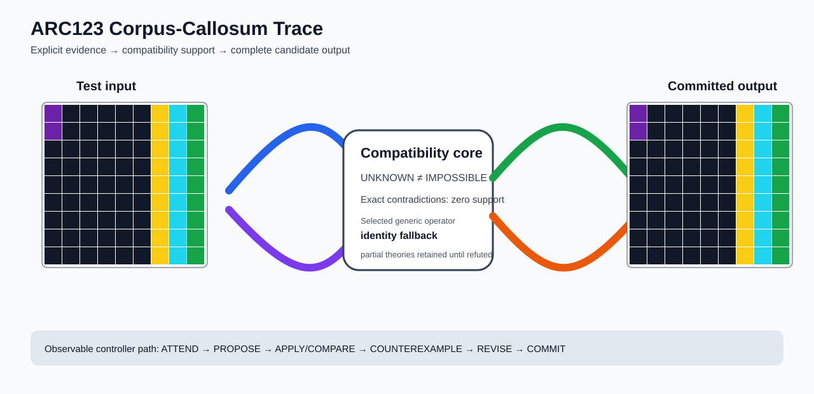

# ARC1 `e7b06bea` P0008 Brain Surgery Report

## Outcome: NO — TEST CELLS DO NOT ALL MATCH

- **Compared positions:** 81
- **Mismatched cells:** 36
- **Training compatibility:** `False`
- **Fallback used:** `True`
- **Selected hypothesis:** `fallback_identity_complete_grid`
- **Source commit:** `085f6dbe39050afac3d1d743f840bac95b1a8d1c`
- **Frozen controller commit:** `4bed6c917523bc2baa05eec69f67303805d88dae`

## Live-Agent Boundary

The controller receives only visible training input/output examples and test inputs. It receives no task ID, imported cohort label, GT feature record, GT solver, historical decomposition, or held-out output before committing a complete grid. The expected output appears only in the post-answer V&V section.

## Corpus-Callosum Visualization



- Full explicit event record: [`learning_trace.json`](learning_trace.json)

## Frozen Measurement

This task was evaluated with the controller and operator configuration pinned before the frozen cohort was run. A result in this packet cannot alter that controller configuration.

## Post-Answer V&V

### Test case 1
- **All cells match:** `False`
- **Mismatched cells:** `36`
- **Prediction:
```json
[[5, 0, 0, 0, 0, 0, 4, 8, 3], [5, 0, 0, 0, 0, 0, 4, 8, 3], [0, 0, 0, 0, 0, 0, 4, 8, 3], [0, 0, 0, 0, 0, 0, 4, 8, 3], [0, 0, 0, 0, 0, 0, 4, 8, 3], [0, 0, 0, 0, 0, 0, 4, 8, 3], [0, 0, 0, 0, 0, 0, 4, 8, 3], [0, 0, 0, 0, 0, 0, 4, 8, 3], [0, 0, 0, 0, 0, 0, 4, 8, 3]]
```
- **Expected output (post-answer only):**
```json
[[5, 0, 0, 0, 0, 4, 0, 0, 0], [5, 0, 0, 0, 0, 4, 0, 0, 0], [0, 0, 0, 0, 0, 8, 0, 0, 0], [0, 0, 0, 0, 0, 8, 0, 0, 0], [0, 0, 0, 0, 0, 3, 0, 0, 0], [0, 0, 0, 0, 0, 3, 0, 0, 0], [0, 0, 0, 0, 0, 4, 0, 0, 0], [0, 0, 0, 0, 0, 4, 0, 0, 0], [0, 0, 0, 0, 0, 8, 0, 0, 0]]
```

## Observable IHL Walkthrough

The record contains explicit actions, predictions, feedback, and revisions; it does not claim or store hidden model reasoning.

### Action totals

- `APPLY_HYPOTHESIS`: 25
- `ATTEND`: 25
- `CHOOSE_NEXT_DEMO`: 25
- `COMMIT`: 1
- `COMPARE`: 25
- `COMPOSE_RULE`: 4
- `EXPLAIN_RESIDUAL`: 4
- `FIND_COUNTEREXAMPLE`: 5
- `PROPOSE`: 1
- `REJECT_RULE`: 2

### Decision milestones

- `0` `PROPOSE` — `{"parent_theory_id":"T0000","rule":{"description_length":1,"name":"identity","operation":"identity","parameters":{},"rule_id":"identity","scope":{"kind":"all","value":null}},"stage":"initial_generic_theories","theory_id":"T0001"}`
- `2` `ATTEND` — `{"reason":"initial_highest_observed_change_and_color_discrimination","selected_demo":4,"selected_region":{"column":2,"row":0},"theory_id":"T0001"}`
- `6` `ATTEND` — `{"reason":"counterexample_requires_visible_conditional_evidence:unseen_demo_selected_for_residual_version_space_discrimination","selected_demo":2,"selected_region":{"column":3,"row":0},"theory_id":"T0001"}`
- `10` `ATTEND` — `{"reason":"counterexample_requires_visible_conditional_evidence:unseen_demo_selected_for_residual_version_space_discrimination","selected_demo":3,"selected_region":{"column":5,"row":0},"theory_id":"T0001"}`
- `14` `ATTEND` — `{"reason":"counterexample_requires_visible_conditional_evidence:unseen_demo_selected_for_residual_version_space_discrimination","selected_demo":1,"selected_region":{"column":4,"row":0},"theory_id":"T0001"}`
- `18` `ATTEND` — `{"reason":"counterexample_requires_visible_conditional_evidence:unseen_demo_selected_for_residual_version_space_discrimination","selected_demo":0,"selected_region":{"column":2,"row":0},"theory_id":"T0001"}`
- `27` `ATTEND` — `{"reason":"initial_highest_observed_change_and_color_discrimination","selected_demo":4,"selected_region":{"column":1,"row":0},"theory_id":"T0002"}`
- `31` `ATTEND` — `{"reason":"initial_highest_observed_change_and_color_discrimination","selected_demo":4,"selected_region":{"column":2,"row":0},"theory_id":"T0003"}`
- `35` `ATTEND` — `{"reason":"counterexample_requires_visible_conditional_evidence:unseen_demo_selected_for_residual_version_space_discrimination","selected_demo":2,"selected_region":{"column":3,"row":0},"theory_id":"T0003"}`
- `39` `ATTEND` — `{"reason":"counterexample_requires_visible_conditional_evidence:unseen_demo_selected_for_residual_version_space_discrimination","selected_demo":3,"selected_region":{"column":5,"row":0},"theory_id":"T0003"}`
- `43` `ATTEND` — `{"reason":"counterexample_requires_visible_conditional_evidence:unseen_demo_selected_for_residual_version_space_discrimination","selected_demo":1,"selected_region":{"column":4,"row":0},"theory_id":"T0003"}`
- `47` `ATTEND` — `{"reason":"counterexample_requires_visible_conditional_evidence:unseen_demo_selected_for_residual_version_space_discrimination","selected_demo":0,"selected_region":{"column":2,"row":0},"theory_id":"T0003"}`
- `54` `ATTEND` — `{"reason":"initial_highest_observed_change_and_color_discrimination","selected_demo":4,"selected_region":{"column":1,"row":0},"theory_id":"T0004"}`
- `58` `ATTEND` — `{"reason":"counterexample_requires_visible_conditional_evidence:unseen_demo_selected_for_residual_version_space_discrimination","selected_demo":2,"selected_region":{"column":1,"row":0},"theory_id":"T0004"}`
- `62` `ATTEND` — `{"reason":"counterexample_requires_visible_conditional_evidence:unseen_demo_selected_for_residual_version_space_discrimination","selected_demo":3,"selected_region":{"column":1,"row":0},"theory_id":"T0004"}`
- `66` `ATTEND` — `{"reason":"counterexample_requires_visible_conditional_evidence:unseen_demo_selected_for_residual_version_space_discrimination","selected_demo":2,"selected_region":{"column":1,"row":0},"theory_id":"T0002"}`
- `70` `ATTEND` — `{"reason":"counterexample_requires_visible_conditional_evidence:unseen_demo_selected_for_residual_version_space_discrimination","selected_demo":1,"selected_region":{"column":1,"row":0},"theory_id":"T0004"}`
- `74` `ATTEND` — `{"reason":"counterexample_requires_visible_conditional_evidence:unseen_demo_selected_for_residual_version_space_discrimination","selected_demo":3,"selected_region":{"column":1,"row":0},"theory_id":"T0002"}`
- `78` `ATTEND` — `{"reason":"counterexample_requires_visible_conditional_evidence:unseen_demo_selected_for_residual_version_space_discrimination","selected_demo":0,"selected_region":{"column":1,"row":0},"theory_id":"T0004"}`
- `84` `ATTEND` — `{"reason":"counterexample_requires_visible_conditional_evidence:unseen_demo_selected_for_residual_version_space_discrimination","selected_demo":1,"selected_region":{"column":1,"row":0},"theory_id":"T0002"}`
- `88` `ATTEND` — `{"reason":"counterexample_requires_visible_conditional_evidence:unseen_demo_selected_for_residual_version_space_discrimination","selected_demo":0,"selected_region":{"column":1,"row":0},"theory_id":"T0002"}`
- `95` `ATTEND` — `{"reason":"initial_highest_observed_change_and_color_discrimination","selected_demo":4,"selected_region":{"column":1,"row":0},"theory_id":"T0005"}`
- `99` `ATTEND` — `{"reason":"counterexample_requires_visible_conditional_evidence:unseen_demo_selected_for_residual_version_space_discrimination","selected_demo":2,"selected_region":{"column":1,"row":0},"theory_id":"T0005"}`
- `103` `ATTEND` — `{"reason":"counterexample_requires_visible_conditional_evidence:unseen_demo_selected_for_residual_version_space_discrimination","selected_demo":3,"selected_region":{"column":1,"row":0},"theory_id":"T0005"}`
- `107` `ATTEND` — `{"reason":"counterexample_requires_visible_conditional_evidence:unseen_demo_selected_for_residual_version_space_discrimination","selected_demo":1,"selected_region":{"column":1,"row":0},"theory_id":"T0005"}`
- `111` `ATTEND` — `{"reason":"counterexample_requires_visible_conditional_evidence:unseen_demo_selected_for_residual_version_space_discrimination","selected_demo":0,"selected_region":{"column":1,"row":0},"theory_id":"T0005"}`
- `116` `COMMIT` — `{"best_partial_theory":{"contradiction_count":0,"counterexamples":[],"description_length":1,"evaluated_demo_indices":[],"history":[{"kind":"ADD_RULE","parameters":{"initial_proposal":true,"operation":"identity"},"target":"identity"}],"matching_cell_count":0,"name":"identity","parameter_bindings":{},"parent_theory_id":"T0000","rules":[{"description_length":1,"name":"identity","operation":"identity","parameters":{},"rule_id":"identity","scope":{"kind":"all","value":null}}],"scope_predicates":[{"kind":"all","value":null}],"theory_id":"T0001","unknown_cell_count":0,"unresolved_unknown":[]},"complete_prediction_group_count":0,"fallback_reason":"no_complete_training_compatible_partial_theory","posterior_mass":0.0,"selected_hypothesis":"fallback_identity_complete_grid","training_exact":false}`

### First counterexamples

- `21` — `{"causal_next_operation":"scope_or_rule_revision","counterexample":{"column":2,"demo_index":0,"observed":3,"predicted":0,"row":0},"responsible_rule":{"description_length":1,"name":"identity","operation":"identity","parameters":{},"rule_id":"identity","scope":{"kind":"all","value":null}},"responsible_rule_id":"identity","theory_id":"T0001"}`
- `50` — `{"causal_next_operation":"scope_or_rule_revision","counterexample":{"column":2,"demo_index":0,"observed":3,"predicted":0,"row":0},"responsible_rule":{"description_length":1,"name":"identity","operation":"identity","parameters":{},"rule_id":"identity","scope":{"kind":"all","value":null}},"responsible_rule_id":"identity","theory_id":"T0003"}`
- `81` — `{"causal_next_operation":"scope_or_rule_revision","counterexample":{"column":1,"demo_index":0,"observed":0,"predicted":3,"row":0},"responsible_rule":{"description_length":2,"name":"recolor(to=3,scope=color==0)","operation":"recolor_scoped","parameters":{"to_color":3},"rule_id":"recolor-color-0-to-3","scope":{"kind":"color_equals","value":0}},"responsible_rule_id":"recolor-color-0-to-3","theory_id":"T0004"}`
- `91` — `{"causal_next_operation":"scope_or_rule_revision","counterexample":{"column":1,"demo_index":0,"observed":0,"predicted":3,"row":0},"responsible_rule":{"description_length":2,"name":"recolor(to=3,scope=color==0)","operation":"recolor_scoped","parameters":{"to_color":3},"rule_id":"recolor-color-0-to-3","scope":{"kind":"color_equals","value":0}},"responsible_rule_id":"recolor-color-0-to-3","theory_id":"T0002"}`
- `114` — `{"causal_next_operation":"scope_or_rule_revision","counterexample":{"column":1,"demo_index":0,"observed":0,"predicted":3,"row":0},"responsible_rule":{"description_length":2,"name":"recolor(to=3,scope=color==0)","operation":"recolor_scoped","parameters":{"to_color":3},"rule_id":"recolor-color-0-to-3","scope":{"kind":"color_equals","value":0}},"responsible_rule_id":"recolor-color-0-to-3","theory_id":"T0005"}`
