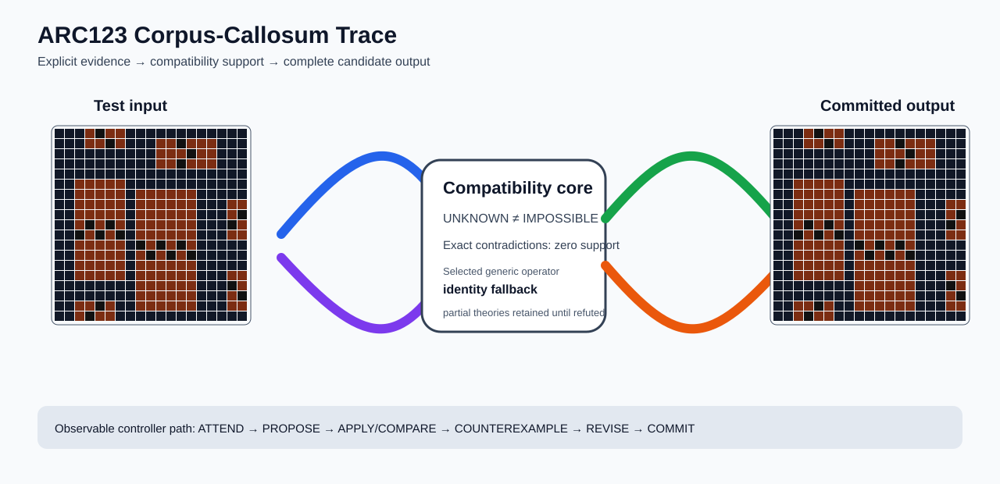

# ARC2 `2faf500b` P0008 Brain Surgery Report

## Outcome: NO — TEST CELLS DO NOT ALL MATCH

- **Compared positions:** 361
- **Mismatched cells:** 110
- **Training compatibility:** `False`
- **Fallback used:** `True`
- **Selected hypothesis:** `fallback_identity_complete_grid`
- **Source commit:** `71f86ff4c5304e452e0659131171f0519b50e21c`
- **Frozen controller commit:** `4bed6c917523bc2baa05eec69f67303805d88dae`

## Live-Agent Boundary

The controller receives only visible training input/output examples and test inputs. It receives no task ID, imported cohort label, GT feature record, GT solver, historical decomposition, or held-out output before committing a complete grid. The expected output appears only in the post-answer V&V section.

## Corpus-Callosum Visualization



- Full explicit event record: [`learning_trace.json`](learning_trace.json)

## Frozen Measurement

This task was evaluated with the controller and operator configuration pinned before the frozen cohort was run. A result in this packet cannot alter that controller configuration.

## Post-Answer V&V

### Test case 1
- **All cells match:** `False`
- **Mismatched cells:** `110`
- **Prediction:
```json
[[0, 0, 0, 9, 6, 9, 9, 0, 0, 0, 0, 0, 0, 0, 0, 0, 0, 0, 0], [0, 0, 0, 9, 9, 6, 9, 0, 0, 0, 9, 9, 6, 9, 9, 9, 0, 0, 0], [0, 0, 0, 0, 0, 0, 0, 0, 0, 0, 9, 9, 9, 6, 9, 9, 0, 0, 0], [0, 0, 0, 0, 0, 0, 0, 0, 0, 0, 9, 9, 6, 9, 9, 9, 0, 0, 0], [0, 0, 0, 0, 0, 0, 0, 0, 0, 0, 0, 0, 0, 0, 0, 0, 0, 0, 0], [0, 0, 9, 9, 9, 9, 9, 0, 0, 0, 0, 0, 0, 0, 0, 0, 0, 0, 0], [0, 0, 9, 9, 9, 9, 9, 0, 9, 9, 9, 9, 9, 9, 0, 0, 0, 0, 0], [0, 0, 9, 9, 9, 9, 9, 0, 9, 9, 9, 9, 9, 9, 0, 0, 0, 9, 9], [0, 0, 9, 9, 9, 9, 9, 0, 9, 9, 9, 9, 9, 9, 0, 0, 0, 9, 6], [0, 0, 9, 6, 9, 6, 9, 0, 9, 9, 9, 9, 9, 9, 0, 0, 0, 6, 9], [0, 0, 6, 9, 6, 9, 6, 0, 9, 9, 9, 9, 9, 9, 0, 0, 0, 9, 9], [0, 0, 9, 9, 9, 9, 9, 0, 6, 9, 6, 9, 6, 9, 0, 0, 0, 0, 0], [0, 0, 9, 9, 9, 9, 9, 0, 9, 6, 9, 6, 9, 6, 0, 0, 0, 0, 0], [0, 0, 9, 9, 9, 9, 9, 0, 9, 9, 9, 9, 9, 9, 0, 0, 0, 0, 0], [0, 0, 9, 9, 9, 9, 9, 0, 9, 9, 9, 9, 9, 9, 0, 0, 0, 9, 9], [0, 0, 0, 0, 0, 0, 0, 0, 9, 9, 9, 9, 9, 9, 0, 0, 0, 6, 9], [0, 0, 0, 0, 0, 0, 0, 0, 9, 9, 9, 9, 9, 9, 0, 0, 0, 9, 6], [0, 0, 9, 9, 6, 9, 0, 0, 9, 9, 9, 9, 9, 9, 0, 0, 0, 9, 9], [0, 0, 9, 6, 9, 9, 0, 0, 0, 0, 0, 0, 0, 0, 0, 0, 0, 0, 0]]
```
- **Expected output (post-answer only):**
```json
[[0, 0, 9, 0, 0, 0, 9, 9, 0, 0, 0, 0, 0, 0, 0, 0, 0, 0, 0], [0, 0, 9, 9, 0, 0, 0, 9, 0, 9, 9, 0, 0, 0, 9, 9, 9, 0, 0], [0, 0, 0, 0, 0, 0, 0, 0, 0, 9, 9, 9, 0, 0, 0, 9, 9, 0, 0], [0, 0, 0, 0, 0, 0, 0, 0, 0, 9, 9, 0, 0, 0, 9, 9, 9, 0, 0], [0, 0, 9, 9, 9, 9, 9, 0, 0, 0, 0, 0, 0, 0, 0, 0, 0, 0, 0], [0, 0, 9, 9, 9, 9, 9, 0, 9, 9, 9, 9, 9, 9, 0, 0, 0, 0, 0], [0, 0, 9, 9, 9, 9, 9, 0, 9, 9, 9, 9, 9, 9, 0, 0, 0, 9, 9], [0, 0, 9, 9, 9, 9, 9, 0, 9, 9, 9, 9, 9, 9, 0, 0, 0, 9, 0], [0, 0, 9, 0, 9, 0, 9, 0, 9, 9, 9, 9, 9, 9, 0, 0, 0, 0, 0], [0, 0, 0, 0, 0, 0, 0, 0, 9, 9, 9, 9, 9, 9, 0, 0, 0, 0, 0], [0, 0, 0, 0, 0, 0, 0, 0, 0, 9, 0, 9, 0, 9, 0, 0, 0, 0, 9], [0, 0, 0, 9, 0, 9, 0, 0, 0, 0, 0, 0, 0, 0, 0, 0, 0, 9, 9], [0, 0, 9, 9, 9, 9, 9, 0, 0, 0, 0, 0, 0, 0, 0, 0, 0, 0, 0], [0, 0, 9, 9, 9, 9, 9, 0, 9, 0, 9, 0, 9, 0, 0, 0, 0, 9, 9], [0, 0, 9, 9, 9, 9, 9, 0, 9, 9, 9, 9, 9, 9, 0, 0, 0, 0, 9], [0, 0, 9, 9, 9, 9, 9, 0, 9, 9, 9, 9, 9, 9, 0, 0, 0, 0, 0], [0, 0, 0, 0, 0, 0, 0, 0, 9, 9, 9, 9, 9, 9, 0, 0, 0, 0, 0], [0, 9, 9, 0, 0, 0, 9, 0, 9, 9, 9, 9, 9, 9, 0, 0, 0, 9, 0], [0, 9, 0, 0, 0, 9, 9, 0, 9, 9, 9, 9, 9, 9, 0, 0, 0, 9, 9]]
```

## Observable IHL Walkthrough

The record contains explicit actions, predictions, feedback, and revisions; it does not claim or store hidden model reasoning.

### Action totals

- `ADD_CONDITION`: 1
- `APPLY_HYPOTHESIS`: 246
- `ATTEND`: 246
- `BIND_PARAMETER`: 1
- `CHOOSE_NEXT_DEMO`: 246
- `COMMIT`: 1
- `COMPARE`: 246
- `COMPOSE_RULE`: 6
- `EXPLAIN_RESIDUAL`: 6
- `FIND_COUNTEREXAMPLE`: 10
- `PROPOSE`: 1
- `SPECIALIZE`: 100

### Decision milestones

- `0` `PROPOSE` — `{"parent_theory_id":"T0000","rule":{"description_length":1,"name":"identity","operation":"identity","parameters":{},"rule_id":"identity","scope":{"kind":"all","value":null}},"stage":"initial_generic_theories","theory_id":"T0001"}`
- `2` `ATTEND` — `{"reason":"initial_highest_observed_change_and_color_discrimination","selected_demo":2,"selected_region":{"column":12,"row":1},"theory_id":"T0001"}`
- `6` `ATTEND` — `{"reason":"counterexample_requires_visible_conditional_evidence:unseen_demo_selected_for_residual_version_space_discrimination","selected_demo":0,"selected_region":{"column":3,"row":2},"theory_id":"T0001"}`
- `10` `ATTEND` — `{"reason":"counterexample_requires_visible_conditional_evidence:unseen_demo_selected_for_residual_version_space_discrimination","selected_demo":1,"selected_region":{"column":1,"row":0},"theory_id":"T0001"}`
- `16` `SPECIALIZE` — `{"added_rule":{"description_length":4,"name":"row_span_fill(fill_color=9,seed_color=6)","operation":"full_operator","parameters":{"fill_color":9,"operator":"row_span_fill","seed_color":6},"rule_id":"structural-row_span_fill","scope":{"kind":"all","value":null}},"parent_theory_id":"T0001","reason":"unexplained_residual_proposed_generic_structural_rule","theory_id":"T0003"}`
- `17` `SPECIALIZE` — `{"added_rule":{"description_length":4,"name":"row_span_fill(fill_color=6,seed_color=6)","operation":"full_operator","parameters":{"fill_color":6,"operator":"row_span_fill","seed_color":6},"rule_id":"structural-row_span_fill","scope":{"kind":"all","value":null}},"parent_theory_id":"T0001","reason":"unexplained_residual_proposed_generic_structural_rule","theory_id":"T0004"}`
- `18` `SPECIALIZE` — `{"added_rule":{"description_length":4,"name":"line_extend(direction=left,fill_color=9,seed_color=6)","operation":"full_operator","parameters":{"direction":"left","fill_color":9,"operator":"line_extend","seed_color":6},"rule_id":"structural-line_extend","scope":{"kind":"all","value":null}},"parent_theory_id":"T0001","reason":"unexplained_residual_proposed_generic_structural_rule","theory_id":"T0005"}`
- `19` `SPECIALIZE` — `{"added_rule":{"description_length":4,"name":"line_extend(direction=up,fill_color=9,seed_color=6)","operation":"full_operator","parameters":{"direction":"up","fill_color":9,"operator":"line_extend","seed_color":6},"rule_id":"structural-line_extend","scope":{"kind":"all","value":null}},"parent_theory_id":"T0001","reason":"unexplained_residual_proposed_generic_structural_rule","theory_id":"T0006"}`
- `20` `SPECIALIZE` — `{"added_rule":{"description_length":4,"name":"row_span_fill(fill_color=9,seed_color=9)","operation":"full_operator","parameters":{"fill_color":9,"operator":"row_span_fill","seed_color":9},"rule_id":"structural-row_span_fill","scope":{"kind":"all","value":null}},"parent_theory_id":"T0001","reason":"unexplained_residual_proposed_generic_structural_rule","theory_id":"T0007"}`
- `21` `SPECIALIZE` — `{"added_rule":{"description_length":4,"name":"row_span_fill(fill_color=6,seed_color=9)","operation":"full_operator","parameters":{"fill_color":6,"operator":"row_span_fill","seed_color":9},"rule_id":"structural-row_span_fill","scope":{"kind":"all","value":null}},"parent_theory_id":"T0001","reason":"unexplained_residual_proposed_generic_structural_rule","theory_id":"T0008"}`
- `22` `SPECIALIZE` — `{"added_rule":{"description_length":4,"name":"line_extend(direction=down,fill_color=9,seed_color=6)","operation":"full_operator","parameters":{"direction":"down","fill_color":9,"operator":"line_extend","seed_color":6},"rule_id":"structural-line_extend","scope":{"kind":"all","value":null}},"parent_theory_id":"T0001","reason":"unexplained_residual_proposed_generic_structural_rule","theory_id":"T0009"}`
- `23` `SPECIALIZE` — `{"added_rule":{"description_length":4,"name":"line_extend(direction=right,fill_color=9,seed_color=6)","operation":"full_operator","parameters":{"direction":"right","fill_color":9,"operator":"line_extend","seed_color":6},"rule_id":"structural-line_extend","scope":{"kind":"all","value":null}},"parent_theory_id":"T0001","reason":"unexplained_residual_proposed_generic_structural_rule","theory_id":"T0010"}`
- `24` `SPECIALIZE` — `{"added_rule":{"description_length":4,"name":"line_extend(direction=left,fill_color=6,seed_color=6)","operation":"full_operator","parameters":{"direction":"left","fill_color":6,"operator":"line_extend","seed_color":6},"rule_id":"structural-line_extend","scope":{"kind":"all","value":null}},"parent_theory_id":"T0001","reason":"unexplained_residual_proposed_generic_structural_rule","theory_id":"T0011"}`
- `25` `SPECIALIZE` — `{"added_rule":{"description_length":4,"name":"line_extend(direction=up,fill_color=6,seed_color=6)","operation":"full_operator","parameters":{"direction":"up","fill_color":6,"operator":"line_extend","seed_color":6},"rule_id":"structural-line_extend","scope":{"kind":"all","value":null}},"parent_theory_id":"T0001","reason":"unexplained_residual_proposed_generic_structural_rule","theory_id":"T0012"}`
- `26` `SPECIALIZE` — `{"added_rule":{"description_length":4,"name":"line_extend(direction=right,fill_color=6,seed_color=6)","operation":"full_operator","parameters":{"direction":"right","fill_color":6,"operator":"line_extend","seed_color":6},"rule_id":"structural-line_extend","scope":{"kind":"all","value":null}},"parent_theory_id":"T0001","reason":"unexplained_residual_proposed_generic_structural_rule","theory_id":"T0013"}`
- `27` `SPECIALIZE` — `{"added_rule":{"description_length":4,"name":"line_extend(direction=down,fill_color=6,seed_color=6)","operation":"full_operator","parameters":{"direction":"down","fill_color":6,"operator":"line_extend","seed_color":6},"rule_id":"structural-line_extend","scope":{"kind":"all","value":null}},"parent_theory_id":"T0001","reason":"unexplained_residual_proposed_generic_structural_rule","theory_id":"T0014"}`
- `29` `ATTEND` — `{"reason":"initial_highest_observed_change_and_color_discrimination","selected_demo":2,"selected_region":{"column":0,"row":0},"theory_id":"T0002"}`
- `33` `ATTEND` — `{"reason":"initial_highest_observed_change_and_color_discrimination","selected_demo":2,"selected_region":{"column":12,"row":1},"theory_id":"T0003"}`
- `37` `ATTEND` — `{"reason":"initial_highest_observed_change_and_color_discrimination","selected_demo":2,"selected_region":{"column":12,"row":1},"theory_id":"T0004"}`
- `41` `ATTEND` — `{"reason":"initial_highest_observed_change_and_color_discrimination","selected_demo":2,"selected_region":{"column":12,"row":1},"theory_id":"T0005"}`
- `45` `ATTEND` — `{"reason":"initial_highest_observed_change_and_color_discrimination","selected_demo":2,"selected_region":{"column":2,"row":0},"theory_id":"T0006"}`
- `49` `ATTEND` — `{"reason":"initial_highest_observed_change_and_color_discrimination","selected_demo":2,"selected_region":{"column":12,"row":1},"theory_id":"T0007"}`
- `53` `ATTEND` — `{"reason":"initial_highest_observed_change_and_color_discrimination","selected_demo":2,"selected_region":{"column":12,"row":1},"theory_id":"T0008"}`
- `57` `ATTEND` — `{"reason":"initial_highest_observed_change_and_color_discrimination","selected_demo":2,"selected_region":{"column":12,"row":1},"theory_id":"T0009"}`
- `61` `ATTEND` — `{"reason":"initial_highest_observed_change_and_color_discrimination","selected_demo":2,"selected_region":{"column":12,"row":1},"theory_id":"T0010"}`
- `65` `ATTEND` — `{"reason":"initial_highest_observed_change_and_color_discrimination","selected_demo":2,"selected_region":{"column":12,"row":1},"theory_id":"T0011"}`
- `69` `ATTEND` — `{"reason":"initial_highest_observed_change_and_color_discrimination","selected_demo":2,"selected_region":{"column":2,"row":0},"theory_id":"T0012"}`
- `73` `ATTEND` — `{"reason":"initial_highest_observed_change_and_color_discrimination","selected_demo":2,"selected_region":{"column":12,"row":1},"theory_id":"T0013"}`
- `77` `ATTEND` — `{"reason":"counterexample_requires_visible_conditional_evidence:unseen_demo_selected_for_residual_version_space_discrimination","selected_demo":0,"selected_region":{"column":3,"row":2},"theory_id":"T0003"}`
- `81` `ATTEND` — `{"reason":"counterexample_requires_visible_conditional_evidence:unseen_demo_selected_for_residual_version_space_discrimination","selected_demo":0,"selected_region":{"column":3,"row":2},"theory_id":"T0004"}`
- `85` `ATTEND` — `{"reason":"counterexample_requires_visible_conditional_evidence:unseen_demo_selected_for_residual_version_space_discrimination","selected_demo":0,"selected_region":{"column":0,"row":2},"theory_id":"T0005"}`
- `89` `ATTEND` — `{"reason":"counterexample_requires_visible_conditional_evidence:unseen_demo_selected_for_residual_version_space_discrimination","selected_demo":0,"selected_region":{"column":3,"row":0},"theory_id":"T0006"}`
- `93` `ATTEND` — `{"reason":"counterexample_requires_visible_conditional_evidence:unseen_demo_selected_for_residual_version_space_discrimination","selected_demo":0,"selected_region":{"column":3,"row":2},"theory_id":"T0007"}`
- `97` `ATTEND` — `{"reason":"counterexample_requires_visible_conditional_evidence:unseen_demo_selected_for_residual_version_space_discrimination","selected_demo":0,"selected_region":{"column":3,"row":2},"theory_id":"T0010"}`
- `101` `ATTEND` — `{"reason":"counterexample_requires_visible_conditional_evidence:unseen_demo_selected_for_residual_version_space_discrimination","selected_demo":0,"selected_region":{"column":0,"row":2},"theory_id":"T0011"}`
- `105` `ATTEND` — `{"reason":"counterexample_requires_visible_conditional_evidence:unseen_demo_selected_for_residual_version_space_discrimination","selected_demo":0,"selected_region":{"column":3,"row":0},"theory_id":"T0012"}`
- `109` `ATTEND` — `{"reason":"counterexample_requires_visible_conditional_evidence:unseen_demo_selected_for_residual_version_space_discrimination","selected_demo":0,"selected_region":{"column":3,"row":2},"theory_id":"T0008"}`
- `113` `ATTEND` — `{"reason":"counterexample_requires_visible_conditional_evidence:unseen_demo_selected_for_residual_version_space_discrimination","selected_demo":0,"selected_region":{"column":3,"row":2},"theory_id":"T0009"}`
- `117` `ATTEND` — `{"reason":"counterexample_requires_visible_conditional_evidence:unseen_demo_selected_for_residual_version_space_discrimination","selected_demo":0,"selected_region":{"column":3,"row":2},"theory_id":"T0013"}`
- `121` `ATTEND` — `{"reason":"counterexample_requires_visible_conditional_evidence:unseen_demo_selected_for_residual_version_space_discrimination","selected_demo":1,"selected_region":{"column":1,"row":0},"theory_id":"T0003"}`
- `125` `ATTEND` — `{"reason":"counterexample_requires_visible_conditional_evidence:unseen_demo_selected_for_residual_version_space_discrimination","selected_demo":1,"selected_region":{"column":1,"row":0},"theory_id":"T0004"}`
- `129` `ATTEND` — `{"reason":"counterexample_requires_visible_conditional_evidence:unseen_demo_selected_for_residual_version_space_discrimination","selected_demo":1,"selected_region":{"column":1,"row":0},"theory_id":"T0005"}`
- `135` `SPECIALIZE` — `{"added_rule":{"description_length":4,"name":"row_span_fill(fill_color=6,seed_color=6)","operation":"full_operator","parameters":{"fill_color":6,"operator":"row_span_fill","seed_color":6},"rule_id":"structural-row_span_fill","scope":{"kind":"all","value":null}},"parent_theory_id":"T0003","reason":"unexplained_residual_proposed_generic_structural_rule","theory_id":"T0016"}`
- `136` `SPECIALIZE` — `{"added_rule":{"description_length":4,"name":"line_extend(direction=left,fill_color=9,seed_color=6)","operation":"full_operator","parameters":{"direction":"left","fill_color":9,"operator":"line_extend","seed_color":6},"rule_id":"structural-line_extend","scope":{"kind":"all","value":null}},"parent_theory_id":"T0003","reason":"unexplained_residual_proposed_generic_structural_rule","theory_id":"T0017"}`
- `137` `SPECIALIZE` — `{"added_rule":{"description_length":4,"name":"line_extend(direction=up,fill_color=9,seed_color=6)","operation":"full_operator","parameters":{"direction":"up","fill_color":9,"operator":"line_extend","seed_color":6},"rule_id":"structural-line_extend","scope":{"kind":"all","value":null}},"parent_theory_id":"T0003","reason":"unexplained_residual_proposed_generic_structural_rule","theory_id":"T0018"}`
- `138` `SPECIALIZE` — `{"added_rule":{"description_length":4,"name":"row_span_fill(fill_color=9,seed_color=9)","operation":"full_operator","parameters":{"fill_color":9,"operator":"row_span_fill","seed_color":9},"rule_id":"structural-row_span_fill","scope":{"kind":"all","value":null}},"parent_theory_id":"T0003","reason":"unexplained_residual_proposed_generic_structural_rule","theory_id":"T0019"}`
- `139` `SPECIALIZE` — `{"added_rule":{"description_length":4,"name":"row_span_fill(fill_color=6,seed_color=9)","operation":"full_operator","parameters":{"fill_color":6,"operator":"row_span_fill","seed_color":9},"rule_id":"structural-row_span_fill","scope":{"kind":"all","value":null}},"parent_theory_id":"T0003","reason":"unexplained_residual_proposed_generic_structural_rule","theory_id":"T0020"}`
- `140` `SPECIALIZE` — `{"added_rule":{"description_length":4,"name":"line_extend(direction=down,fill_color=9,seed_color=6)","operation":"full_operator","parameters":{"direction":"down","fill_color":9,"operator":"line_extend","seed_color":6},"rule_id":"structural-line_extend","scope":{"kind":"all","value":null}},"parent_theory_id":"T0003","reason":"unexplained_residual_proposed_generic_structural_rule","theory_id":"T0021"}`
- `141` `SPECIALIZE` — `{"added_rule":{"description_length":4,"name":"line_extend(direction=right,fill_color=9,seed_color=6)","operation":"full_operator","parameters":{"direction":"right","fill_color":9,"operator":"line_extend","seed_color":6},"rule_id":"structural-line_extend","scope":{"kind":"all","value":null}},"parent_theory_id":"T0003","reason":"unexplained_residual_proposed_generic_structural_rule","theory_id":"T0022"}`
- `142` `SPECIALIZE` — `{"added_rule":{"description_length":4,"name":"line_extend(direction=left,fill_color=6,seed_color=6)","operation":"full_operator","parameters":{"direction":"left","fill_color":6,"operator":"line_extend","seed_color":6},"rule_id":"structural-line_extend","scope":{"kind":"all","value":null}},"parent_theory_id":"T0003","reason":"unexplained_residual_proposed_generic_structural_rule","theory_id":"T0023"}`
- `143` `SPECIALIZE` — `{"added_rule":{"description_length":4,"name":"line_extend(direction=up,fill_color=6,seed_color=6)","operation":"full_operator","parameters":{"direction":"up","fill_color":6,"operator":"line_extend","seed_color":6},"rule_id":"structural-line_extend","scope":{"kind":"all","value":null}},"parent_theory_id":"T0003","reason":"unexplained_residual_proposed_generic_structural_rule","theory_id":"T0024"}`
- `144` `SPECIALIZE` — `{"added_rule":{"description_length":4,"name":"line_extend(direction=right,fill_color=6,seed_color=6)","operation":"full_operator","parameters":{"direction":"right","fill_color":6,"operator":"line_extend","seed_color":6},"rule_id":"structural-line_extend","scope":{"kind":"all","value":null}},"parent_theory_id":"T0003","reason":"unexplained_residual_proposed_generic_structural_rule","theory_id":"T0025"}`
- `145` `SPECIALIZE` — `{"added_rule":{"description_length":4,"name":"line_extend(direction=down,fill_color=6,seed_color=6)","operation":"full_operator","parameters":{"direction":"down","fill_color":6,"operator":"line_extend","seed_color":6},"rule_id":"structural-line_extend","scope":{"kind":"all","value":null}},"parent_theory_id":"T0003","reason":"unexplained_residual_proposed_generic_structural_rule","theory_id":"T0026"}`
- `147` `ATTEND` — `{"reason":"initial_highest_observed_change_and_color_discrimination","selected_demo":2,"selected_region":{"column":12,"row":1},"theory_id":"T0015"}`
- `151` `ATTEND` — `{"reason":"initial_highest_observed_change_and_color_discrimination","selected_demo":2,"selected_region":{"column":12,"row":1},"theory_id":"T0016"}`
- `155` `ATTEND` — `{"reason":"initial_highest_observed_change_and_color_discrimination","selected_demo":2,"selected_region":{"column":12,"row":1},"theory_id":"T0017"}`
- `159` `ATTEND` — `{"reason":"initial_highest_observed_change_and_color_discrimination","selected_demo":2,"selected_region":{"column":2,"row":0},"theory_id":"T0018"}`
- `163` `ATTEND` — `{"reason":"initial_highest_observed_change_and_color_discrimination","selected_demo":2,"selected_region":{"column":12,"row":1},"theory_id":"T0019"}`
- `167` `ATTEND` — `{"reason":"initial_highest_observed_change_and_color_discrimination","selected_demo":2,"selected_region":{"column":12,"row":1},"theory_id":"T0020"}`
- `171` `ATTEND` — `{"reason":"initial_highest_observed_change_and_color_discrimination","selected_demo":2,"selected_region":{"column":12,"row":1},"theory_id":"T0021"}`
- `175` `ATTEND` — `{"reason":"initial_highest_observed_change_and_color_discrimination","selected_demo":2,"selected_region":{"column":12,"row":1},"theory_id":"T0022"}`
- `179` `ATTEND` — `{"reason":"initial_highest_observed_change_and_color_discrimination","selected_demo":2,"selected_region":{"column":12,"row":1},"theory_id":"T0023"}`
- `183` `ATTEND` — `{"reason":"initial_highest_observed_change_and_color_discrimination","selected_demo":2,"selected_region":{"column":2,"row":0},"theory_id":"T0024"}`
- `187` `ATTEND` — `{"reason":"initial_highest_observed_change_and_color_discrimination","selected_demo":2,"selected_region":{"column":12,"row":1},"theory_id":"T0025"}`
- `191` `ATTEND` — `{"reason":"initial_highest_observed_change_and_color_discrimination","selected_demo":2,"selected_region":{"column":12,"row":1},"theory_id":"T0026"}`
- `195` `ATTEND` — `{"reason":"counterexample_requires_visible_conditional_evidence:unseen_demo_selected_for_residual_version_space_discrimination","selected_demo":0,"selected_region":{"column":3,"row":2},"theory_id":"T0015"}`
- `199` `ATTEND` — `{"reason":"counterexample_requires_visible_conditional_evidence:unseen_demo_selected_for_residual_version_space_discrimination","selected_demo":0,"selected_region":{"column":3,"row":2},"theory_id":"T0016"}`
- `203` `ATTEND` — `{"reason":"counterexample_requires_visible_conditional_evidence:unseen_demo_selected_for_residual_version_space_discrimination","selected_demo":0,"selected_region":{"column":0,"row":2},"theory_id":"T0017"}`
- `207` `ATTEND` — `{"reason":"counterexample_requires_visible_conditional_evidence:unseen_demo_selected_for_residual_version_space_discrimination","selected_demo":0,"selected_region":{"column":3,"row":0},"theory_id":"T0018"}`
- `211` `ATTEND` — `{"reason":"counterexample_requires_visible_conditional_evidence:unseen_demo_selected_for_residual_version_space_discrimination","selected_demo":0,"selected_region":{"column":3,"row":2},"theory_id":"T0019"}`
- `215` `ATTEND` — `{"reason":"counterexample_requires_visible_conditional_evidence:unseen_demo_selected_for_residual_version_space_discrimination","selected_demo":0,"selected_region":{"column":3,"row":2},"theory_id":"T0022"}`
- `219` `ATTEND` — `{"reason":"counterexample_requires_visible_conditional_evidence:unseen_demo_selected_for_residual_version_space_discrimination","selected_demo":0,"selected_region":{"column":0,"row":2},"theory_id":"T0023"}`
- `223` `ATTEND` — `{"reason":"counterexample_requires_visible_conditional_evidence:unseen_demo_selected_for_residual_version_space_discrimination","selected_demo":0,"selected_region":{"column":3,"row":0},"theory_id":"T0024"}`
- `227` `ATTEND` — `{"reason":"counterexample_requires_visible_conditional_evidence:unseen_demo_selected_for_residual_version_space_discrimination","selected_demo":0,"selected_region":{"column":3,"row":2},"theory_id":"T0020"}`
- `231` `ATTEND` — `{"reason":"counterexample_requires_visible_conditional_evidence:unseen_demo_selected_for_residual_version_space_discrimination","selected_demo":0,"selected_region":{"column":3,"row":2},"theory_id":"T0021"}`
- `235` `ATTEND` — `{"reason":"counterexample_requires_visible_conditional_evidence:unseen_demo_selected_for_residual_version_space_discrimination","selected_demo":0,"selected_region":{"column":3,"row":2},"theory_id":"T0025"}`
- `239` `ATTEND` — `{"reason":"counterexample_requires_visible_conditional_evidence:unseen_demo_selected_for_residual_version_space_discrimination","selected_demo":0,"selected_region":{"column":3,"row":2},"theory_id":"T0026"}`
- `243` `ATTEND` — `{"reason":"counterexample_requires_visible_conditional_evidence:unseen_demo_selected_for_residual_version_space_discrimination","selected_demo":1,"selected_region":{"column":1,"row":0},"theory_id":"T0015"}`
- `247` `ATTEND` — `{"reason":"counterexample_requires_visible_conditional_evidence:unseen_demo_selected_for_residual_version_space_discrimination","selected_demo":1,"selected_region":{"column":1,"row":0},"theory_id":"T0016"}`
- `253` `SPECIALIZE` — `{"added_rule":{"description_length":4,"name":"row_span_fill(fill_color=9,seed_color=6)","operation":"full_operator","parameters":{"fill_color":9,"operator":"row_span_fill","seed_color":6},"rule_id":"structural-row_span_fill","scope":{"kind":"all","value":null}},"parent_theory_id":"T0015","reason":"unexplained_residual_proposed_generic_structural_rule","theory_id":"T0028"}`
- `254` `SPECIALIZE` — `{"added_rule":{"description_length":4,"name":"row_span_fill(fill_color=6,seed_color=6)","operation":"full_operator","parameters":{"fill_color":6,"operator":"row_span_fill","seed_color":6},"rule_id":"structural-row_span_fill","scope":{"kind":"all","value":null}},"parent_theory_id":"T0015","reason":"unexplained_residual_proposed_generic_structural_rule","theory_id":"T0029"}`
- `255` `SPECIALIZE` — `{"added_rule":{"description_length":4,"name":"line_extend(direction=left,fill_color=9,seed_color=6)","operation":"full_operator","parameters":{"direction":"left","fill_color":9,"operator":"line_extend","seed_color":6},"rule_id":"structural-line_extend","scope":{"kind":"all","value":null}},"parent_theory_id":"T0015","reason":"unexplained_residual_proposed_generic_structural_rule","theory_id":"T0030"}`
- `256` `SPECIALIZE` — `{"added_rule":{"description_length":4,"name":"line_extend(direction=up,fill_color=9,seed_color=6)","operation":"full_operator","parameters":{"direction":"up","fill_color":9,"operator":"line_extend","seed_color":6},"rule_id":"structural-line_extend","scope":{"kind":"all","value":null}},"parent_theory_id":"T0015","reason":"unexplained_residual_proposed_generic_structural_rule","theory_id":"T0031"}`
- `257` `SPECIALIZE` — `{"added_rule":{"description_length":4,"name":"row_span_fill(fill_color=9,seed_color=9)","operation":"full_operator","parameters":{"fill_color":9,"operator":"row_span_fill","seed_color":9},"rule_id":"structural-row_span_fill","scope":{"kind":"all","value":null}},"parent_theory_id":"T0015","reason":"unexplained_residual_proposed_generic_structural_rule","theory_id":"T0032"}`
- `258` `SPECIALIZE` — `{"added_rule":{"description_length":4,"name":"row_span_fill(fill_color=6,seed_color=9)","operation":"full_operator","parameters":{"fill_color":6,"operator":"row_span_fill","seed_color":9},"rule_id":"structural-row_span_fill","scope":{"kind":"all","value":null}},"parent_theory_id":"T0015","reason":"unexplained_residual_proposed_generic_structural_rule","theory_id":"T0033"}`
- `259` `SPECIALIZE` — `{"added_rule":{"description_length":4,"name":"line_extend(direction=down,fill_color=9,seed_color=6)","operation":"full_operator","parameters":{"direction":"down","fill_color":9,"operator":"line_extend","seed_color":6},"rule_id":"structural-line_extend","scope":{"kind":"all","value":null}},"parent_theory_id":"T0015","reason":"unexplained_residual_proposed_generic_structural_rule","theory_id":"T0034"}`
- `260` `SPECIALIZE` — `{"added_rule":{"description_length":4,"name":"line_extend(direction=right,fill_color=9,seed_color=6)","operation":"full_operator","parameters":{"direction":"right","fill_color":9,"operator":"line_extend","seed_color":6},"rule_id":"structural-line_extend","scope":{"kind":"all","value":null}},"parent_theory_id":"T0015","reason":"unexplained_residual_proposed_generic_structural_rule","theory_id":"T0035"}`
- `261` `SPECIALIZE` — `{"added_rule":{"description_length":4,"name":"line_extend(direction=left,fill_color=6,seed_color=6)","operation":"full_operator","parameters":{"direction":"left","fill_color":6,"operator":"line_extend","seed_color":6},"rule_id":"structural-line_extend","scope":{"kind":"all","value":null}},"parent_theory_id":"T0015","reason":"unexplained_residual_proposed_generic_structural_rule","theory_id":"T0036"}`
- `262` `SPECIALIZE` — `{"added_rule":{"description_length":4,"name":"line_extend(direction=up,fill_color=6,seed_color=6)","operation":"full_operator","parameters":{"direction":"up","fill_color":6,"operator":"line_extend","seed_color":6},"rule_id":"structural-line_extend","scope":{"kind":"all","value":null}},"parent_theory_id":"T0015","reason":"unexplained_residual_proposed_generic_structural_rule","theory_id":"T0037"}`
- `263` `SPECIALIZE` — `{"added_rule":{"description_length":4,"name":"line_extend(direction=right,fill_color=6,seed_color=6)","operation":"full_operator","parameters":{"direction":"right","fill_color":6,"operator":"line_extend","seed_color":6},"rule_id":"structural-line_extend","scope":{"kind":"all","value":null}},"parent_theory_id":"T0015","reason":"unexplained_residual_proposed_generic_structural_rule","theory_id":"T0038"}`
- `264` `SPECIALIZE` — `{"added_rule":{"description_length":4,"name":"line_extend(direction=down,fill_color=6,seed_color=6)","operation":"full_operator","parameters":{"direction":"down","fill_color":6,"operator":"line_extend","seed_color":6},"rule_id":"structural-line_extend","scope":{"kind":"all","value":null}},"parent_theory_id":"T0015","reason":"unexplained_residual_proposed_generic_structural_rule","theory_id":"T0039"}`
- `266` `ATTEND` — `{"reason":"initial_highest_observed_change_and_color_discrimination","selected_demo":2,"selected_region":{"column":0,"row":0},"theory_id":"T0027"}`
- `270` `ATTEND` — `{"reason":"initial_highest_observed_change_and_color_discrimination","selected_demo":2,"selected_region":{"column":12,"row":1},"theory_id":"T0028"}`
- `274` `ATTEND` — `{"reason":"initial_highest_observed_change_and_color_discrimination","selected_demo":2,"selected_region":{"column":12,"row":1},"theory_id":"T0029"}`
- `278` `ATTEND` — `{"reason":"initial_highest_observed_change_and_color_discrimination","selected_demo":2,"selected_region":{"column":12,"row":1},"theory_id":"T0030"}`
- `282` `ATTEND` — `{"reason":"initial_highest_observed_change_and_color_discrimination","selected_demo":2,"selected_region":{"column":2,"row":0},"theory_id":"T0031"}`
- `286` `ATTEND` — `{"reason":"initial_highest_observed_change_and_color_discrimination","selected_demo":2,"selected_region":{"column":12,"row":1},"theory_id":"T0032"}`
- `290` `ATTEND` — `{"reason":"initial_highest_observed_change_and_color_discrimination","selected_demo":2,"selected_region":{"column":12,"row":1},"theory_id":"T0033"}`
- `294` `ATTEND` — `{"reason":"initial_highest_observed_change_and_color_discrimination","selected_demo":2,"selected_region":{"column":12,"row":1},"theory_id":"T0034"}`
- `298` `ATTEND` — `{"reason":"initial_highest_observed_change_and_color_discrimination","selected_demo":2,"selected_region":{"column":12,"row":1},"theory_id":"T0035"}`
- `302` `ATTEND` — `{"reason":"initial_highest_observed_change_and_color_discrimination","selected_demo":2,"selected_region":{"column":12,"row":1},"theory_id":"T0036"}`
- `306` `ATTEND` — `{"reason":"initial_highest_observed_change_and_color_discrimination","selected_demo":2,"selected_region":{"column":2,"row":0},"theory_id":"T0037"}`
- `310` `ATTEND` — `{"reason":"initial_highest_observed_change_and_color_discrimination","selected_demo":2,"selected_region":{"column":12,"row":1},"theory_id":"T0038"}`
- `314` `ATTEND` — `{"reason":"counterexample_requires_visible_conditional_evidence:unseen_demo_selected_for_residual_version_space_discrimination","selected_demo":0,"selected_region":{"column":3,"row":2},"theory_id":"T0028"}`
- `318` `ATTEND` — `{"reason":"counterexample_requires_visible_conditional_evidence:unseen_demo_selected_for_residual_version_space_discrimination","selected_demo":0,"selected_region":{"column":3,"row":2},"theory_id":"T0029"}`
- `322` `ATTEND` — `{"reason":"counterexample_requires_visible_conditional_evidence:unseen_demo_selected_for_residual_version_space_discrimination","selected_demo":0,"selected_region":{"column":0,"row":2},"theory_id":"T0030"}`
- `326` `ATTEND` — `{"reason":"counterexample_requires_visible_conditional_evidence:unseen_demo_selected_for_residual_version_space_discrimination","selected_demo":0,"selected_region":{"column":3,"row":0},"theory_id":"T0031"}`
- `330` `ATTEND` — `{"reason":"counterexample_requires_visible_conditional_evidence:unseen_demo_selected_for_residual_version_space_discrimination","selected_demo":0,"selected_region":{"column":3,"row":2},"theory_id":"T0032"}`
- `334` `ATTEND` — `{"reason":"counterexample_requires_visible_conditional_evidence:unseen_demo_selected_for_residual_version_space_discrimination","selected_demo":0,"selected_region":{"column":3,"row":2},"theory_id":"T0035"}`
- `338` `ATTEND` — `{"reason":"counterexample_requires_visible_conditional_evidence:unseen_demo_selected_for_residual_version_space_discrimination","selected_demo":0,"selected_region":{"column":0,"row":2},"theory_id":"T0036"}`
- `342` `ATTEND` — `{"reason":"counterexample_requires_visible_conditional_evidence:unseen_demo_selected_for_residual_version_space_discrimination","selected_demo":0,"selected_region":{"column":3,"row":0},"theory_id":"T0037"}`
- `346` `ATTEND` — `{"reason":"counterexample_requires_visible_conditional_evidence:unseen_demo_selected_for_residual_version_space_discrimination","selected_demo":0,"selected_region":{"column":3,"row":2},"theory_id":"T0033"}`
- `350` `ATTEND` — `{"reason":"counterexample_requires_visible_conditional_evidence:unseen_demo_selected_for_residual_version_space_discrimination","selected_demo":0,"selected_region":{"column":3,"row":2},"theory_id":"T0034"}`
- `354` `ATTEND` — `{"reason":"counterexample_requires_visible_conditional_evidence:unseen_demo_selected_for_residual_version_space_discrimination","selected_demo":0,"selected_region":{"column":3,"row":2},"theory_id":"T0038"}`
- `358` `ATTEND` — `{"reason":"counterexample_requires_visible_conditional_evidence:unseen_demo_selected_for_residual_version_space_discrimination","selected_demo":1,"selected_region":{"column":1,"row":0},"theory_id":"T0028"}`
- `362` `ATTEND` — `{"reason":"counterexample_requires_visible_conditional_evidence:unseen_demo_selected_for_residual_version_space_discrimination","selected_demo":1,"selected_region":{"column":1,"row":0},"theory_id":"T0029"}`
- `366` `ATTEND` — `{"reason":"counterexample_requires_visible_conditional_evidence:unseen_demo_selected_for_residual_version_space_discrimination","selected_demo":1,"selected_region":{"column":1,"row":0},"theory_id":"T0030"}`
- `372` `SPECIALIZE` — `{"added_rule":{"description_length":4,"name":"row_span_fill(fill_color=6,seed_color=6)","operation":"full_operator","parameters":{"fill_color":6,"operator":"row_span_fill","seed_color":6},"rule_id":"structural-row_span_fill","scope":{"kind":"all","value":null}},"parent_theory_id":"T0028","reason":"unexplained_residual_proposed_generic_structural_rule","theory_id":"T0041"}`
- `373` `SPECIALIZE` — `{"added_rule":{"description_length":4,"name":"line_extend(direction=left,fill_color=9,seed_color=6)","operation":"full_operator","parameters":{"direction":"left","fill_color":9,"operator":"line_extend","seed_color":6},"rule_id":"structural-line_extend","scope":{"kind":"all","value":null}},"parent_theory_id":"T0028","reason":"unexplained_residual_proposed_generic_structural_rule","theory_id":"T0042"}`
- `374` `SPECIALIZE` — `{"added_rule":{"description_length":4,"name":"line_extend(direction=up,fill_color=9,seed_color=6)","operation":"full_operator","parameters":{"direction":"up","fill_color":9,"operator":"line_extend","seed_color":6},"rule_id":"structural-line_extend","scope":{"kind":"all","value":null}},"parent_theory_id":"T0028","reason":"unexplained_residual_proposed_generic_structural_rule","theory_id":"T0043"}`
- `375` `SPECIALIZE` — `{"added_rule":{"description_length":4,"name":"row_span_fill(fill_color=9,seed_color=9)","operation":"full_operator","parameters":{"fill_color":9,"operator":"row_span_fill","seed_color":9},"rule_id":"structural-row_span_fill","scope":{"kind":"all","value":null}},"parent_theory_id":"T0028","reason":"unexplained_residual_proposed_generic_structural_rule","theory_id":"T0044"}`
- `376` `SPECIALIZE` — `{"added_rule":{"description_length":4,"name":"row_span_fill(fill_color=6,seed_color=9)","operation":"full_operator","parameters":{"fill_color":6,"operator":"row_span_fill","seed_color":9},"rule_id":"structural-row_span_fill","scope":{"kind":"all","value":null}},"parent_theory_id":"T0028","reason":"unexplained_residual_proposed_generic_structural_rule","theory_id":"T0045"}`
- `377` `SPECIALIZE` — `{"added_rule":{"description_length":4,"name":"line_extend(direction=down,fill_color=9,seed_color=6)","operation":"full_operator","parameters":{"direction":"down","fill_color":9,"operator":"line_extend","seed_color":6},"rule_id":"structural-line_extend","scope":{"kind":"all","value":null}},"parent_theory_id":"T0028","reason":"unexplained_residual_proposed_generic_structural_rule","theory_id":"T0046"}`
- `378` `SPECIALIZE` — `{"added_rule":{"description_length":4,"name":"line_extend(direction=right,fill_color=9,seed_color=6)","operation":"full_operator","parameters":{"direction":"right","fill_color":9,"operator":"line_extend","seed_color":6},"rule_id":"structural-line_extend","scope":{"kind":"all","value":null}},"parent_theory_id":"T0028","reason":"unexplained_residual_proposed_generic_structural_rule","theory_id":"T0047"}`
- `379` `SPECIALIZE` — `{"added_rule":{"description_length":4,"name":"line_extend(direction=left,fill_color=6,seed_color=6)","operation":"full_operator","parameters":{"direction":"left","fill_color":6,"operator":"line_extend","seed_color":6},"rule_id":"structural-line_extend","scope":{"kind":"all","value":null}},"parent_theory_id":"T0028","reason":"unexplained_residual_proposed_generic_structural_rule","theory_id":"T0048"}`
- `380` `SPECIALIZE` — `{"added_rule":{"description_length":4,"name":"line_extend(direction=up,fill_color=6,seed_color=6)","operation":"full_operator","parameters":{"direction":"up","fill_color":6,"operator":"line_extend","seed_color":6},"rule_id":"structural-line_extend","scope":{"kind":"all","value":null}},"parent_theory_id":"T0028","reason":"unexplained_residual_proposed_generic_structural_rule","theory_id":"T0049"}`
- `381` `SPECIALIZE` — `{"added_rule":{"description_length":4,"name":"line_extend(direction=right,fill_color=6,seed_color=6)","operation":"full_operator","parameters":{"direction":"right","fill_color":6,"operator":"line_extend","seed_color":6},"rule_id":"structural-line_extend","scope":{"kind":"all","value":null}},"parent_theory_id":"T0028","reason":"unexplained_residual_proposed_generic_structural_rule","theory_id":"T0050"}`
- `382` `SPECIALIZE` — `{"added_rule":{"description_length":4,"name":"line_extend(direction=down,fill_color=6,seed_color=6)","operation":"full_operator","parameters":{"direction":"down","fill_color":6,"operator":"line_extend","seed_color":6},"rule_id":"structural-line_extend","scope":{"kind":"all","value":null}},"parent_theory_id":"T0028","reason":"unexplained_residual_proposed_generic_structural_rule","theory_id":"T0051"}`
- `384` `ATTEND` — `{"reason":"initial_highest_observed_change_and_color_discrimination","selected_demo":2,"selected_region":{"column":0,"row":0},"theory_id":"T0040"}`
- `388` `ATTEND` — `{"reason":"initial_highest_observed_change_and_color_discrimination","selected_demo":2,"selected_region":{"column":12,"row":1},"theory_id":"T0041"}`
- `392` `ATTEND` — `{"reason":"initial_highest_observed_change_and_color_discrimination","selected_demo":2,"selected_region":{"column":12,"row":1},"theory_id":"T0042"}`
- `396` `ATTEND` — `{"reason":"initial_highest_observed_change_and_color_discrimination","selected_demo":2,"selected_region":{"column":2,"row":0},"theory_id":"T0043"}`
- `400` `ATTEND` — `{"reason":"initial_highest_observed_change_and_color_discrimination","selected_demo":2,"selected_region":{"column":12,"row":1},"theory_id":"T0044"}`
- `404` `ATTEND` — `{"reason":"initial_highest_observed_change_and_color_discrimination","selected_demo":2,"selected_region":{"column":12,"row":1},"theory_id":"T0045"}`
- `408` `ATTEND` — `{"reason":"initial_highest_observed_change_and_color_discrimination","selected_demo":2,"selected_region":{"column":12,"row":1},"theory_id":"T0046"}`
- `412` `ATTEND` — `{"reason":"initial_highest_observed_change_and_color_discrimination","selected_demo":2,"selected_region":{"column":12,"row":1},"theory_id":"T0047"}`
- `416` `ATTEND` — `{"reason":"initial_highest_observed_change_and_color_discrimination","selected_demo":2,"selected_region":{"column":12,"row":1},"theory_id":"T0048"}`
- `420` `ATTEND` — `{"reason":"initial_highest_observed_change_and_color_discrimination","selected_demo":2,"selected_region":{"column":2,"row":0},"theory_id":"T0049"}`
- `424` `ATTEND` — `{"reason":"initial_highest_observed_change_and_color_discrimination","selected_demo":2,"selected_region":{"column":12,"row":1},"theory_id":"T0050"}`
- `428` `ATTEND` — `{"reason":"initial_highest_observed_change_and_color_discrimination","selected_demo":2,"selected_region":{"column":12,"row":1},"theory_id":"T0051"}`
- `432` `ATTEND` — `{"reason":"counterexample_requires_visible_conditional_evidence:unseen_demo_selected_for_residual_version_space_discrimination","selected_demo":0,"selected_region":{"column":3,"row":2},"theory_id":"T0041"}`
- `436` `ATTEND` — `{"reason":"counterexample_requires_visible_conditional_evidence:unseen_demo_selected_for_residual_version_space_discrimination","selected_demo":0,"selected_region":{"column":0,"row":2},"theory_id":"T0042"}`
- `440` `ATTEND` — `{"reason":"counterexample_requires_visible_conditional_evidence:unseen_demo_selected_for_residual_version_space_discrimination","selected_demo":0,"selected_region":{"column":3,"row":0},"theory_id":"T0043"}`
- `444` `ATTEND` — `{"reason":"counterexample_requires_visible_conditional_evidence:unseen_demo_selected_for_residual_version_space_discrimination","selected_demo":0,"selected_region":{"column":3,"row":2},"theory_id":"T0044"}`
- `448` `ATTEND` — `{"reason":"counterexample_requires_visible_conditional_evidence:unseen_demo_selected_for_residual_version_space_discrimination","selected_demo":0,"selected_region":{"column":3,"row":2},"theory_id":"T0047"}`
- `452` `ATTEND` — `{"reason":"counterexample_requires_visible_conditional_evidence:unseen_demo_selected_for_residual_version_space_discrimination","selected_demo":0,"selected_region":{"column":0,"row":2},"theory_id":"T0048"}`
- `456` `ATTEND` — `{"reason":"counterexample_requires_visible_conditional_evidence:unseen_demo_selected_for_residual_version_space_discrimination","selected_demo":0,"selected_region":{"column":3,"row":0},"theory_id":"T0049"}`
- `460` `ATTEND` — `{"reason":"counterexample_requires_visible_conditional_evidence:unseen_demo_selected_for_residual_version_space_discrimination","selected_demo":0,"selected_region":{"column":3,"row":2},"theory_id":"T0045"}`
- `464` `ATTEND` — `{"reason":"counterexample_requires_visible_conditional_evidence:unseen_demo_selected_for_residual_version_space_discrimination","selected_demo":0,"selected_region":{"column":3,"row":2},"theory_id":"T0046"}`
- `468` `ATTEND` — `{"reason":"counterexample_requires_visible_conditional_evidence:unseen_demo_selected_for_residual_version_space_discrimination","selected_demo":0,"selected_region":{"column":3,"row":2},"theory_id":"T0050"}`
- `472` `ATTEND` — `{"reason":"counterexample_requires_visible_conditional_evidence:unseen_demo_selected_for_residual_version_space_discrimination","selected_demo":0,"selected_region":{"column":3,"row":2},"theory_id":"T0051"}`
- `476` `ATTEND` — `{"reason":"counterexample_requires_visible_conditional_evidence:unseen_demo_selected_for_residual_version_space_discrimination","selected_demo":1,"selected_region":{"column":1,"row":0},"theory_id":"T0041"}`
- `480` `ATTEND` — `{"reason":"counterexample_requires_visible_conditional_evidence:unseen_demo_selected_for_residual_version_space_discrimination","selected_demo":1,"selected_region":{"column":1,"row":0},"theory_id":"T0042"}`
- `484` `ATTEND` — `{"reason":"counterexample_requires_visible_conditional_evidence:unseen_demo_selected_for_residual_version_space_discrimination","selected_demo":1,"selected_region":{"column":1,"row":0},"theory_id":"T0044"}`
- `490` `SPECIALIZE` — `{"added_rule":{"description_length":4,"name":"line_extend(direction=left,fill_color=9,seed_color=6)","operation":"full_operator","parameters":{"direction":"left","fill_color":9,"operator":"line_extend","seed_color":6},"rule_id":"structural-line_extend","scope":{"kind":"all","value":null}},"parent_theory_id":"T0041","reason":"unexplained_residual_proposed_generic_structural_rule","theory_id":"T0053"}`
- `491` `SPECIALIZE` — `{"added_rule":{"description_length":4,"name":"line_extend(direction=up,fill_color=9,seed_color=6)","operation":"full_operator","parameters":{"direction":"up","fill_color":9,"operator":"line_extend","seed_color":6},"rule_id":"structural-line_extend","scope":{"kind":"all","value":null}},"parent_theory_id":"T0041","reason":"unexplained_residual_proposed_generic_structural_rule","theory_id":"T0054"}`
- `492` `SPECIALIZE` — `{"added_rule":{"description_length":4,"name":"row_span_fill(fill_color=9,seed_color=9)","operation":"full_operator","parameters":{"fill_color":9,"operator":"row_span_fill","seed_color":9},"rule_id":"structural-row_span_fill","scope":{"kind":"all","value":null}},"parent_theory_id":"T0041","reason":"unexplained_residual_proposed_generic_structural_rule","theory_id":"T0055"}`
- `493` `SPECIALIZE` — `{"added_rule":{"description_length":4,"name":"row_span_fill(fill_color=6,seed_color=9)","operation":"full_operator","parameters":{"fill_color":6,"operator":"row_span_fill","seed_color":9},"rule_id":"structural-row_span_fill","scope":{"kind":"all","value":null}},"parent_theory_id":"T0041","reason":"unexplained_residual_proposed_generic_structural_rule","theory_id":"T0056"}`
- `494` `SPECIALIZE` — `{"added_rule":{"description_length":4,"name":"line_extend(direction=down,fill_color=9,seed_color=6)","operation":"full_operator","parameters":{"direction":"down","fill_color":9,"operator":"line_extend","seed_color":6},"rule_id":"structural-line_extend","scope":{"kind":"all","value":null}},"parent_theory_id":"T0041","reason":"unexplained_residual_proposed_generic_structural_rule","theory_id":"T0057"}`
- `495` `SPECIALIZE` — `{"added_rule":{"description_length":4,"name":"line_extend(direction=right,fill_color=9,seed_color=6)","operation":"full_operator","parameters":{"direction":"right","fill_color":9,"operator":"line_extend","seed_color":6},"rule_id":"structural-line_extend","scope":{"kind":"all","value":null}},"parent_theory_id":"T0041","reason":"unexplained_residual_proposed_generic_structural_rule","theory_id":"T0058"}`
- `496` `SPECIALIZE` — `{"added_rule":{"description_length":4,"name":"line_extend(direction=left,fill_color=6,seed_color=6)","operation":"full_operator","parameters":{"direction":"left","fill_color":6,"operator":"line_extend","seed_color":6},"rule_id":"structural-line_extend","scope":{"kind":"all","value":null}},"parent_theory_id":"T0041","reason":"unexplained_residual_proposed_generic_structural_rule","theory_id":"T0059"}`
- `497` `SPECIALIZE` — `{"added_rule":{"description_length":4,"name":"line_extend(direction=up,fill_color=6,seed_color=6)","operation":"full_operator","parameters":{"direction":"up","fill_color":6,"operator":"line_extend","seed_color":6},"rule_id":"structural-line_extend","scope":{"kind":"all","value":null}},"parent_theory_id":"T0041","reason":"unexplained_residual_proposed_generic_structural_rule","theory_id":"T0060"}`
- `498` `SPECIALIZE` — `{"added_rule":{"description_length":4,"name":"line_extend(direction=right,fill_color=6,seed_color=6)","operation":"full_operator","parameters":{"direction":"right","fill_color":6,"operator":"line_extend","seed_color":6},"rule_id":"structural-line_extend","scope":{"kind":"all","value":null}},"parent_theory_id":"T0041","reason":"unexplained_residual_proposed_generic_structural_rule","theory_id":"T0061"}`
- `499` `SPECIALIZE` — `{"added_rule":{"description_length":4,"name":"line_extend(direction=down,fill_color=6,seed_color=6)","operation":"full_operator","parameters":{"direction":"down","fill_color":6,"operator":"line_extend","seed_color":6},"rule_id":"structural-line_extend","scope":{"kind":"all","value":null}},"parent_theory_id":"T0041","reason":"unexplained_residual_proposed_generic_structural_rule","theory_id":"T0062"}`
- `501` `ATTEND` — `{"reason":"initial_highest_observed_change_and_color_discrimination","selected_demo":2,"selected_region":{"column":0,"row":0},"theory_id":"T0052"}`
- `505` `ATTEND` — `{"reason":"initial_highest_observed_change_and_color_discrimination","selected_demo":2,"selected_region":{"column":12,"row":1},"theory_id":"T0053"}`
- `509` `ATTEND` — `{"reason":"initial_highest_observed_change_and_color_discrimination","selected_demo":2,"selected_region":{"column":2,"row":0},"theory_id":"T0054"}`
- `513` `ATTEND` — `{"reason":"initial_highest_observed_change_and_color_discrimination","selected_demo":2,"selected_region":{"column":12,"row":1},"theory_id":"T0055"}`
- `517` `ATTEND` — `{"reason":"initial_highest_observed_change_and_color_discrimination","selected_demo":2,"selected_region":{"column":12,"row":1},"theory_id":"T0056"}`
- `521` `ATTEND` — `{"reason":"initial_highest_observed_change_and_color_discrimination","selected_demo":2,"selected_region":{"column":12,"row":1},"theory_id":"T0057"}`
- `525` `ATTEND` — `{"reason":"initial_highest_observed_change_and_color_discrimination","selected_demo":2,"selected_region":{"column":12,"row":1},"theory_id":"T0058"}`
- `529` `ATTEND` — `{"reason":"initial_highest_observed_change_and_color_discrimination","selected_demo":2,"selected_region":{"column":12,"row":1},"theory_id":"T0059"}`
- `533` `ATTEND` — `{"reason":"initial_highest_observed_change_and_color_discrimination","selected_demo":2,"selected_region":{"column":2,"row":0},"theory_id":"T0060"}`
- `537` `ATTEND` — `{"reason":"initial_highest_observed_change_and_color_discrimination","selected_demo":2,"selected_region":{"column":12,"row":1},"theory_id":"T0061"}`
- `541` `ATTEND` — `{"reason":"initial_highest_observed_change_and_color_discrimination","selected_demo":2,"selected_region":{"column":12,"row":1},"theory_id":"T0062"}`
- `545` `ATTEND` — `{"reason":"counterexample_requires_visible_conditional_evidence:unseen_demo_selected_for_residual_version_space_discrimination","selected_demo":0,"selected_region":{"column":0,"row":2},"theory_id":"T0053"}`
- `549` `ATTEND` — `{"reason":"counterexample_requires_visible_conditional_evidence:unseen_demo_selected_for_residual_version_space_discrimination","selected_demo":0,"selected_region":{"column":3,"row":0},"theory_id":"T0054"}`
- `553` `ATTEND` — `{"reason":"counterexample_requires_visible_conditional_evidence:unseen_demo_selected_for_residual_version_space_discrimination","selected_demo":0,"selected_region":{"column":3,"row":2},"theory_id":"T0055"}`
- `557` `ATTEND` — `{"reason":"counterexample_requires_visible_conditional_evidence:unseen_demo_selected_for_residual_version_space_discrimination","selected_demo":0,"selected_region":{"column":3,"row":2},"theory_id":"T0058"}`
- `561` `ATTEND` — `{"reason":"counterexample_requires_visible_conditional_evidence:unseen_demo_selected_for_residual_version_space_discrimination","selected_demo":0,"selected_region":{"column":0,"row":2},"theory_id":"T0059"}`
- `565` `ATTEND` — `{"reason":"counterexample_requires_visible_conditional_evidence:unseen_demo_selected_for_residual_version_space_discrimination","selected_demo":0,"selected_region":{"column":3,"row":0},"theory_id":"T0060"}`
- `569` `ATTEND` — `{"reason":"counterexample_requires_visible_conditional_evidence:unseen_demo_selected_for_residual_version_space_discrimination","selected_demo":0,"selected_region":{"column":3,"row":2},"theory_id":"T0056"}`
- `573` `ATTEND` — `{"reason":"counterexample_requires_visible_conditional_evidence:unseen_demo_selected_for_residual_version_space_discrimination","selected_demo":0,"selected_region":{"column":3,"row":2},"theory_id":"T0057"}`
- `577` `ATTEND` — `{"reason":"counterexample_requires_visible_conditional_evidence:unseen_demo_selected_for_residual_version_space_discrimination","selected_demo":0,"selected_region":{"column":3,"row":2},"theory_id":"T0061"}`
- `581` `ATTEND` — `{"reason":"counterexample_requires_visible_conditional_evidence:unseen_demo_selected_for_residual_version_space_discrimination","selected_demo":0,"selected_region":{"column":3,"row":2},"theory_id":"T0062"}`
- `585` `ATTEND` — `{"reason":"counterexample_requires_visible_conditional_evidence:unseen_demo_selected_for_residual_version_space_discrimination","selected_demo":1,"selected_region":{"column":1,"row":0},"theory_id":"T0053"}`
- `589` `ATTEND` — `{"reason":"counterexample_requires_visible_conditional_evidence:unseen_demo_selected_for_residual_version_space_discrimination","selected_demo":1,"selected_region":{"column":1,"row":0},"theory_id":"T0055"}`
- `593` `ATTEND` — `{"reason":"counterexample_requires_visible_conditional_evidence:unseen_demo_selected_for_residual_version_space_discrimination","selected_demo":1,"selected_region":{"column":1,"row":2},"theory_id":"T0043"}`
- `597` `ATTEND` — `{"reason":"counterexample_requires_visible_conditional_evidence:unseen_demo_selected_for_residual_version_space_discrimination","selected_demo":1,"selected_region":{"column":1,"row":2},"theory_id":"T0054"}`
- `601` `ATTEND` — `{"reason":"counterexample_requires_visible_conditional_evidence:unseen_demo_selected_for_residual_version_space_discrimination","selected_demo":1,"selected_region":{"column":1,"row":0},"theory_id":"T0058"}`
- `605` `ATTEND` — `{"reason":"counterexample_requires_visible_conditional_evidence:unseen_demo_selected_for_residual_version_space_discrimination","selected_demo":1,"selected_region":{"column":1,"row":0},"theory_id":"T0056"}`
- `609` `ATTEND` — `{"reason":"counterexample_requires_visible_conditional_evidence:unseen_demo_selected_for_residual_version_space_discrimination","selected_demo":1,"selected_region":{"column":1,"row":0},"theory_id":"T0059"}`
- `613` `SPECIALIZE` — `{"added_rule":{"description_length":4,"name":"line_extend(direction=up,fill_color=9,seed_color=6)","operation":"full_operator","parameters":{"direction":"up","fill_color":9,"operator":"line_extend","seed_color":6},"rule_id":"structural-line_extend","scope":{"kind":"all","value":null}},"parent_theory_id":"T0053","reason":"unexplained_residual_proposed_generic_structural_rule","theory_id":"T0063"}`
- `614` `SPECIALIZE` — `{"added_rule":{"description_length":4,"name":"row_span_fill(fill_color=9,seed_color=9)","operation":"full_operator","parameters":{"fill_color":9,"operator":"row_span_fill","seed_color":9},"rule_id":"structural-row_span_fill","scope":{"kind":"all","value":null}},"parent_theory_id":"T0053","reason":"unexplained_residual_proposed_generic_structural_rule","theory_id":"T0064"}`
- `615` `SPECIALIZE` — `{"added_rule":{"description_length":4,"name":"row_span_fill(fill_color=6,seed_color=9)","operation":"full_operator","parameters":{"fill_color":6,"operator":"row_span_fill","seed_color":9},"rule_id":"structural-row_span_fill","scope":{"kind":"all","value":null}},"parent_theory_id":"T0053","reason":"unexplained_residual_proposed_generic_structural_rule","theory_id":"T0065"}`
- `616` `SPECIALIZE` — `{"added_rule":{"description_length":4,"name":"line_extend(direction=down,fill_color=9,seed_color=6)","operation":"full_operator","parameters":{"direction":"down","fill_color":9,"operator":"line_extend","seed_color":6},"rule_id":"structural-line_extend","scope":{"kind":"all","value":null}},"parent_theory_id":"T0053","reason":"unexplained_residual_proposed_generic_structural_rule","theory_id":"T0066"}`
- `617` `SPECIALIZE` — `{"added_rule":{"description_length":4,"name":"line_extend(direction=right,fill_color=9,seed_color=6)","operation":"full_operator","parameters":{"direction":"right","fill_color":9,"operator":"line_extend","seed_color":6},"rule_id":"structural-line_extend","scope":{"kind":"all","value":null}},"parent_theory_id":"T0053","reason":"unexplained_residual_proposed_generic_structural_rule","theory_id":"T0067"}`
- `618` `SPECIALIZE` — `{"added_rule":{"description_length":4,"name":"line_extend(direction=left,fill_color=6,seed_color=6)","operation":"full_operator","parameters":{"direction":"left","fill_color":6,"operator":"line_extend","seed_color":6},"rule_id":"structural-line_extend","scope":{"kind":"all","value":null}},"parent_theory_id":"T0053","reason":"unexplained_residual_proposed_generic_structural_rule","theory_id":"T0068"}`
- `619` `SPECIALIZE` — `{"added_rule":{"description_length":4,"name":"line_extend(direction=up,fill_color=6,seed_color=6)","operation":"full_operator","parameters":{"direction":"up","fill_color":6,"operator":"line_extend","seed_color":6},"rule_id":"structural-line_extend","scope":{"kind":"all","value":null}},"parent_theory_id":"T0053","reason":"unexplained_residual_proposed_generic_structural_rule","theory_id":"T0069"}`
- `620` `SPECIALIZE` — `{"added_rule":{"description_length":4,"name":"line_extend(direction=right,fill_color=6,seed_color=6)","operation":"full_operator","parameters":{"direction":"right","fill_color":6,"operator":"line_extend","seed_color":6},"rule_id":"structural-line_extend","scope":{"kind":"all","value":null}},"parent_theory_id":"T0053","reason":"unexplained_residual_proposed_generic_structural_rule","theory_id":"T0070"}`
- `621` `SPECIALIZE` — `{"added_rule":{"description_length":4,"name":"line_extend(direction=down,fill_color=6,seed_color=6)","operation":"full_operator","parameters":{"direction":"down","fill_color":6,"operator":"line_extend","seed_color":6},"rule_id":"structural-line_extend","scope":{"kind":"all","value":null}},"parent_theory_id":"T0053","reason":"unexplained_residual_proposed_generic_structural_rule","theory_id":"T0071"}`
- `623` `ATTEND` — `{"reason":"initial_highest_observed_change_and_color_discrimination","selected_demo":2,"selected_region":{"column":2,"row":0},"theory_id":"T0063"}`
- `627` `ATTEND` — `{"reason":"initial_highest_observed_change_and_color_discrimination","selected_demo":2,"selected_region":{"column":12,"row":1},"theory_id":"T0064"}`
- `631` `ATTEND` — `{"reason":"initial_highest_observed_change_and_color_discrimination","selected_demo":2,"selected_region":{"column":12,"row":1},"theory_id":"T0065"}`
- `635` `ATTEND` — `{"reason":"initial_highest_observed_change_and_color_discrimination","selected_demo":2,"selected_region":{"column":12,"row":1},"theory_id":"T0066"}`
- `639` `ATTEND` — `{"reason":"initial_highest_observed_change_and_color_discrimination","selected_demo":2,"selected_region":{"column":12,"row":1},"theory_id":"T0067"}`
- `643` `ATTEND` — `{"reason":"initial_highest_observed_change_and_color_discrimination","selected_demo":2,"selected_region":{"column":12,"row":1},"theory_id":"T0068"}`
- `647` `ATTEND` — `{"reason":"initial_highest_observed_change_and_color_discrimination","selected_demo":2,"selected_region":{"column":2,"row":0},"theory_id":"T0069"}`
- `651` `ATTEND` — `{"reason":"initial_highest_observed_change_and_color_discrimination","selected_demo":2,"selected_region":{"column":12,"row":1},"theory_id":"T0070"}`
- `655` `ATTEND` — `{"reason":"initial_highest_observed_change_and_color_discrimination","selected_demo":2,"selected_region":{"column":12,"row":1},"theory_id":"T0071"}`
- `659` `ATTEND` — `{"reason":"counterexample_requires_visible_conditional_evidence:unseen_demo_selected_for_residual_version_space_discrimination","selected_demo":0,"selected_region":{"column":3,"row":0},"theory_id":"T0063"}`
- `663` `ATTEND` — `{"reason":"counterexample_requires_visible_conditional_evidence:unseen_demo_selected_for_residual_version_space_discrimination","selected_demo":0,"selected_region":{"column":3,"row":2},"theory_id":"T0064"}`
- `667` `ATTEND` — `{"reason":"counterexample_requires_visible_conditional_evidence:unseen_demo_selected_for_residual_version_space_discrimination","selected_demo":0,"selected_region":{"column":3,"row":2},"theory_id":"T0067"}`
- `671` `ATTEND` — `{"reason":"counterexample_requires_visible_conditional_evidence:unseen_demo_selected_for_residual_version_space_discrimination","selected_demo":0,"selected_region":{"column":0,"row":2},"theory_id":"T0068"}`
- `675` `ATTEND` — `{"reason":"counterexample_requires_visible_conditional_evidence:unseen_demo_selected_for_residual_version_space_discrimination","selected_demo":0,"selected_region":{"column":3,"row":0},"theory_id":"T0069"}`
- `679` `ATTEND` — `{"reason":"counterexample_requires_visible_conditional_evidence:unseen_demo_selected_for_residual_version_space_discrimination","selected_demo":0,"selected_region":{"column":3,"row":2},"theory_id":"T0065"}`
- `683` `ATTEND` — `{"reason":"counterexample_requires_visible_conditional_evidence:unseen_demo_selected_for_residual_version_space_discrimination","selected_demo":0,"selected_region":{"column":3,"row":2},"theory_id":"T0066"}`
- `687` `ATTEND` — `{"reason":"counterexample_requires_visible_conditional_evidence:unseen_demo_selected_for_residual_version_space_discrimination","selected_demo":0,"selected_region":{"column":3,"row":2},"theory_id":"T0070"}`
- `691` `ATTEND` — `{"reason":"counterexample_requires_visible_conditional_evidence:unseen_demo_selected_for_residual_version_space_discrimination","selected_demo":0,"selected_region":{"column":3,"row":2},"theory_id":"T0071"}`
- `695` `ATTEND` — `{"reason":"counterexample_requires_visible_conditional_evidence:unseen_demo_selected_for_residual_version_space_discrimination","selected_demo":1,"selected_region":{"column":1,"row":0},"theory_id":"T0064"}`
- `699` `ATTEND` — `{"reason":"counterexample_requires_visible_conditional_evidence:unseen_demo_selected_for_residual_version_space_discrimination","selected_demo":1,"selected_region":{"column":1,"row":2},"theory_id":"T0063"}`
- `703` `ATTEND` — `{"reason":"counterexample_requires_visible_conditional_evidence:unseen_demo_selected_for_residual_version_space_discrimination","selected_demo":1,"selected_region":{"column":1,"row":0},"theory_id":"T0067"}`
- `707` `ATTEND` — `{"reason":"counterexample_requires_visible_conditional_evidence:unseen_demo_selected_for_residual_version_space_discrimination","selected_demo":1,"selected_region":{"column":1,"row":0},"theory_id":"T0065"}`
- `711` `ATTEND` — `{"reason":"counterexample_requires_visible_conditional_evidence:unseen_demo_selected_for_residual_version_space_discrimination","selected_demo":1,"selected_region":{"column":1,"row":0},"theory_id":"T0068"}`
- `715` `ATTEND` — `{"reason":"counterexample_requires_visible_conditional_evidence:unseen_demo_selected_for_residual_version_space_discrimination","selected_demo":1,"selected_region":{"column":1,"row":0},"theory_id":"T0057"}`
- `719` `ATTEND` — `{"reason":"counterexample_requires_visible_conditional_evidence:unseen_demo_selected_for_residual_version_space_discrimination","selected_demo":1,"selected_region":{"column":1,"row":0},"theory_id":"T0066"}`
- `723` `SPECIALIZE` — `{"added_rule":{"description_length":4,"name":"row_span_fill(fill_color=6,seed_color=6)","operation":"full_operator","parameters":{"fill_color":6,"operator":"row_span_fill","seed_color":6},"rule_id":"structural-row_span_fill","scope":{"kind":"all","value":null}},"parent_theory_id":"T0043","reason":"unexplained_residual_proposed_generic_structural_rule","theory_id":"T0072"}`
- `724` `SPECIALIZE` — `{"added_rule":{"description_length":4,"name":"line_extend(direction=left,fill_color=9,seed_color=6)","operation":"full_operator","parameters":{"direction":"left","fill_color":9,"operator":"line_extend","seed_color":6},"rule_id":"structural-line_extend","scope":{"kind":"all","value":null}},"parent_theory_id":"T0043","reason":"unexplained_residual_proposed_generic_structural_rule","theory_id":"T0073"}`
- `725` `SPECIALIZE` — `{"added_rule":{"description_length":4,"name":"row_span_fill(fill_color=9,seed_color=9)","operation":"full_operator","parameters":{"fill_color":9,"operator":"row_span_fill","seed_color":9},"rule_id":"structural-row_span_fill","scope":{"kind":"all","value":null}},"parent_theory_id":"T0043","reason":"unexplained_residual_proposed_generic_structural_rule","theory_id":"T0074"}`
- `726` `SPECIALIZE` — `{"added_rule":{"description_length":4,"name":"row_span_fill(fill_color=6,seed_color=9)","operation":"full_operator","parameters":{"fill_color":6,"operator":"row_span_fill","seed_color":9},"rule_id":"structural-row_span_fill","scope":{"kind":"all","value":null}},"parent_theory_id":"T0043","reason":"unexplained_residual_proposed_generic_structural_rule","theory_id":"T0075"}`
- `727` `SPECIALIZE` — `{"added_rule":{"description_length":4,"name":"line_extend(direction=down,fill_color=9,seed_color=6)","operation":"full_operator","parameters":{"direction":"down","fill_color":9,"operator":"line_extend","seed_color":6},"rule_id":"structural-line_extend","scope":{"kind":"all","value":null}},"parent_theory_id":"T0043","reason":"unexplained_residual_proposed_generic_structural_rule","theory_id":"T0076"}`
- `728` `SPECIALIZE` — `{"added_rule":{"description_length":4,"name":"line_extend(direction=right,fill_color=9,seed_color=6)","operation":"full_operator","parameters":{"direction":"right","fill_color":9,"operator":"line_extend","seed_color":6},"rule_id":"structural-line_extend","scope":{"kind":"all","value":null}},"parent_theory_id":"T0043","reason":"unexplained_residual_proposed_generic_structural_rule","theory_id":"T0077"}`
- `729` `SPECIALIZE` — `{"added_rule":{"description_length":4,"name":"line_extend(direction=left,fill_color=6,seed_color=6)","operation":"full_operator","parameters":{"direction":"left","fill_color":6,"operator":"line_extend","seed_color":6},"rule_id":"structural-line_extend","scope":{"kind":"all","value":null}},"parent_theory_id":"T0043","reason":"unexplained_residual_proposed_generic_structural_rule","theory_id":"T0078"}`
- `730` `SPECIALIZE` — `{"added_rule":{"description_length":4,"name":"line_extend(direction=up,fill_color=6,seed_color=6)","operation":"full_operator","parameters":{"direction":"up","fill_color":6,"operator":"line_extend","seed_color":6},"rule_id":"structural-line_extend","scope":{"kind":"all","value":null}},"parent_theory_id":"T0043","reason":"unexplained_residual_proposed_generic_structural_rule","theory_id":"T0079"}`
- `731` `SPECIALIZE` — `{"added_rule":{"description_length":4,"name":"line_extend(direction=right,fill_color=6,seed_color=6)","operation":"full_operator","parameters":{"direction":"right","fill_color":6,"operator":"line_extend","seed_color":6},"rule_id":"structural-line_extend","scope":{"kind":"all","value":null}},"parent_theory_id":"T0043","reason":"unexplained_residual_proposed_generic_structural_rule","theory_id":"T0080"}`
- `732` `SPECIALIZE` — `{"added_rule":{"description_length":4,"name":"line_extend(direction=down,fill_color=6,seed_color=6)","operation":"full_operator","parameters":{"direction":"down","fill_color":6,"operator":"line_extend","seed_color":6},"rule_id":"structural-line_extend","scope":{"kind":"all","value":null}},"parent_theory_id":"T0043","reason":"unexplained_residual_proposed_generic_structural_rule","theory_id":"T0081"}`
- `734` `ATTEND` — `{"reason":"initial_highest_observed_change_and_color_discrimination","selected_demo":2,"selected_region":{"column":12,"row":1},"theory_id":"T0072"}`
- `738` `ATTEND` — `{"reason":"initial_highest_observed_change_and_color_discrimination","selected_demo":2,"selected_region":{"column":12,"row":1},"theory_id":"T0073"}`
- `742` `ATTEND` — `{"reason":"initial_highest_observed_change_and_color_discrimination","selected_demo":2,"selected_region":{"column":12,"row":1},"theory_id":"T0074"}`
- `746` `ATTEND` — `{"reason":"initial_highest_observed_change_and_color_discrimination","selected_demo":2,"selected_region":{"column":12,"row":1},"theory_id":"T0075"}`
- `750` `ATTEND` — `{"reason":"initial_highest_observed_change_and_color_discrimination","selected_demo":2,"selected_region":{"column":12,"row":1},"theory_id":"T0076"}`
- `754` `ATTEND` — `{"reason":"initial_highest_observed_change_and_color_discrimination","selected_demo":2,"selected_region":{"column":12,"row":1},"theory_id":"T0077"}`
- `758` `ATTEND` — `{"reason":"initial_highest_observed_change_and_color_discrimination","selected_demo":2,"selected_region":{"column":12,"row":1},"theory_id":"T0078"}`
- `762` `ATTEND` — `{"reason":"initial_highest_observed_change_and_color_discrimination","selected_demo":2,"selected_region":{"column":2,"row":0},"theory_id":"T0079"}`
- `766` `ATTEND` — `{"reason":"initial_highest_observed_change_and_color_discrimination","selected_demo":2,"selected_region":{"column":12,"row":1},"theory_id":"T0080"}`
- `770` `ATTEND` — `{"reason":"initial_highest_observed_change_and_color_discrimination","selected_demo":2,"selected_region":{"column":12,"row":1},"theory_id":"T0081"}`
- `774` `ATTEND` — `{"reason":"counterexample_requires_visible_conditional_evidence:unseen_demo_selected_for_residual_version_space_discrimination","selected_demo":0,"selected_region":{"column":3,"row":2},"theory_id":"T0072"}`
- `778` `ATTEND` — `{"reason":"counterexample_requires_visible_conditional_evidence:unseen_demo_selected_for_residual_version_space_discrimination","selected_demo":0,"selected_region":{"column":0,"row":2},"theory_id":"T0073"}`
- `782` `ATTEND` — `{"reason":"counterexample_requires_visible_conditional_evidence:unseen_demo_selected_for_residual_version_space_discrimination","selected_demo":0,"selected_region":{"column":3,"row":2},"theory_id":"T0074"}`
- `786` `ATTEND` — `{"reason":"counterexample_requires_visible_conditional_evidence:unseen_demo_selected_for_residual_version_space_discrimination","selected_demo":0,"selected_region":{"column":3,"row":2},"theory_id":"T0077"}`
- `790` `ATTEND` — `{"reason":"counterexample_requires_visible_conditional_evidence:unseen_demo_selected_for_residual_version_space_discrimination","selected_demo":0,"selected_region":{"column":0,"row":2},"theory_id":"T0078"}`
- `794` `ATTEND` — `{"reason":"counterexample_requires_visible_conditional_evidence:unseen_demo_selected_for_residual_version_space_discrimination","selected_demo":0,"selected_region":{"column":3,"row":0},"theory_id":"T0079"}`
- `798` `ATTEND` — `{"reason":"counterexample_requires_visible_conditional_evidence:unseen_demo_selected_for_residual_version_space_discrimination","selected_demo":0,"selected_region":{"column":3,"row":2},"theory_id":"T0075"}`
- `802` `ATTEND` — `{"reason":"counterexample_requires_visible_conditional_evidence:unseen_demo_selected_for_residual_version_space_discrimination","selected_demo":0,"selected_region":{"column":3,"row":2},"theory_id":"T0076"}`
- `806` `ATTEND` — `{"reason":"counterexample_requires_visible_conditional_evidence:unseen_demo_selected_for_residual_version_space_discrimination","selected_demo":0,"selected_region":{"column":3,"row":2},"theory_id":"T0080"}`
- `810` `ATTEND` — `{"reason":"counterexample_requires_visible_conditional_evidence:unseen_demo_selected_for_residual_version_space_discrimination","selected_demo":0,"selected_region":{"column":3,"row":2},"theory_id":"T0081"}`
- `814` `ATTEND` — `{"reason":"counterexample_requires_visible_conditional_evidence:unseen_demo_selected_for_residual_version_space_discrimination","selected_demo":1,"selected_region":{"column":1,"row":0},"theory_id":"T0072"}`
- `818` `ATTEND` — `{"reason":"counterexample_requires_visible_conditional_evidence:unseen_demo_selected_for_residual_version_space_discrimination","selected_demo":1,"selected_region":{"column":1,"row":0},"theory_id":"T0073"}`
- `822` `ATTEND` — `{"reason":"counterexample_requires_visible_conditional_evidence:unseen_demo_selected_for_residual_version_space_discrimination","selected_demo":1,"selected_region":{"column":1,"row":0},"theory_id":"T0074"}`
- `828` `SPECIALIZE` — `{"added_rule":{"description_length":4,"name":"line_extend(direction=left,fill_color=9,seed_color=6)","operation":"full_operator","parameters":{"direction":"left","fill_color":9,"operator":"line_extend","seed_color":6},"rule_id":"structural-line_extend","scope":{"kind":"all","value":null}},"parent_theory_id":"T0072","reason":"unexplained_residual_proposed_generic_structural_rule","theory_id":"T0083"}`
- `829` `SPECIALIZE` — `{"added_rule":{"description_length":4,"name":"row_span_fill(fill_color=9,seed_color=9)","operation":"full_operator","parameters":{"fill_color":9,"operator":"row_span_fill","seed_color":9},"rule_id":"structural-row_span_fill","scope":{"kind":"all","value":null}},"parent_theory_id":"T0072","reason":"unexplained_residual_proposed_generic_structural_rule","theory_id":"T0084"}`
- `830` `SPECIALIZE` — `{"added_rule":{"description_length":4,"name":"row_span_fill(fill_color=6,seed_color=9)","operation":"full_operator","parameters":{"fill_color":6,"operator":"row_span_fill","seed_color":9},"rule_id":"structural-row_span_fill","scope":{"kind":"all","value":null}},"parent_theory_id":"T0072","reason":"unexplained_residual_proposed_generic_structural_rule","theory_id":"T0085"}`
- `831` `SPECIALIZE` — `{"added_rule":{"description_length":4,"name":"line_extend(direction=down,fill_color=9,seed_color=6)","operation":"full_operator","parameters":{"direction":"down","fill_color":9,"operator":"line_extend","seed_color":6},"rule_id":"structural-line_extend","scope":{"kind":"all","value":null}},"parent_theory_id":"T0072","reason":"unexplained_residual_proposed_generic_structural_rule","theory_id":"T0086"}`
- `832` `SPECIALIZE` — `{"added_rule":{"description_length":4,"name":"line_extend(direction=right,fill_color=9,seed_color=6)","operation":"full_operator","parameters":{"direction":"right","fill_color":9,"operator":"line_extend","seed_color":6},"rule_id":"structural-line_extend","scope":{"kind":"all","value":null}},"parent_theory_id":"T0072","reason":"unexplained_residual_proposed_generic_structural_rule","theory_id":"T0087"}`
- `833` `SPECIALIZE` — `{"added_rule":{"description_length":4,"name":"line_extend(direction=left,fill_color=6,seed_color=6)","operation":"full_operator","parameters":{"direction":"left","fill_color":6,"operator":"line_extend","seed_color":6},"rule_id":"structural-line_extend","scope":{"kind":"all","value":null}},"parent_theory_id":"T0072","reason":"unexplained_residual_proposed_generic_structural_rule","theory_id":"T0088"}`
- `834` `SPECIALIZE` — `{"added_rule":{"description_length":4,"name":"line_extend(direction=up,fill_color=6,seed_color=6)","operation":"full_operator","parameters":{"direction":"up","fill_color":6,"operator":"line_extend","seed_color":6},"rule_id":"structural-line_extend","scope":{"kind":"all","value":null}},"parent_theory_id":"T0072","reason":"unexplained_residual_proposed_generic_structural_rule","theory_id":"T0089"}`
- `835` `SPECIALIZE` — `{"added_rule":{"description_length":4,"name":"line_extend(direction=right,fill_color=6,seed_color=6)","operation":"full_operator","parameters":{"direction":"right","fill_color":6,"operator":"line_extend","seed_color":6},"rule_id":"structural-line_extend","scope":{"kind":"all","value":null}},"parent_theory_id":"T0072","reason":"unexplained_residual_proposed_generic_structural_rule","theory_id":"T0090"}`
- `836` `SPECIALIZE` — `{"added_rule":{"description_length":4,"name":"line_extend(direction=down,fill_color=6,seed_color=6)","operation":"full_operator","parameters":{"direction":"down","fill_color":6,"operator":"line_extend","seed_color":6},"rule_id":"structural-line_extend","scope":{"kind":"all","value":null}},"parent_theory_id":"T0072","reason":"unexplained_residual_proposed_generic_structural_rule","theory_id":"T0091"}`
- `838` `ATTEND` — `{"reason":"initial_highest_observed_change_and_color_discrimination","selected_demo":2,"selected_region":{"column":0,"row":0},"theory_id":"T0082"}`
- `842` `ATTEND` — `{"reason":"initial_highest_observed_change_and_color_discrimination","selected_demo":2,"selected_region":{"column":12,"row":1},"theory_id":"T0083"}`
- `846` `ATTEND` — `{"reason":"initial_highest_observed_change_and_color_discrimination","selected_demo":2,"selected_region":{"column":12,"row":1},"theory_id":"T0084"}`
- `850` `ATTEND` — `{"reason":"initial_highest_observed_change_and_color_discrimination","selected_demo":2,"selected_region":{"column":12,"row":1},"theory_id":"T0085"}`
- `854` `ATTEND` — `{"reason":"initial_highest_observed_change_and_color_discrimination","selected_demo":2,"selected_region":{"column":12,"row":1},"theory_id":"T0086"}`
- `858` `ATTEND` — `{"reason":"initial_highest_observed_change_and_color_discrimination","selected_demo":2,"selected_region":{"column":12,"row":1},"theory_id":"T0087"}`
- `862` `ATTEND` — `{"reason":"initial_highest_observed_change_and_color_discrimination","selected_demo":2,"selected_region":{"column":12,"row":1},"theory_id":"T0088"}`
- `866` `ATTEND` — `{"reason":"initial_highest_observed_change_and_color_discrimination","selected_demo":2,"selected_region":{"column":2,"row":0},"theory_id":"T0089"}`
- `870` `ATTEND` — `{"reason":"initial_highest_observed_change_and_color_discrimination","selected_demo":2,"selected_region":{"column":12,"row":1},"theory_id":"T0090"}`
- `874` `ATTEND` — `{"reason":"initial_highest_observed_change_and_color_discrimination","selected_demo":2,"selected_region":{"column":12,"row":1},"theory_id":"T0091"}`
- `878` `ATTEND` — `{"reason":"counterexample_requires_visible_conditional_evidence:unseen_demo_selected_for_residual_version_space_discrimination","selected_demo":0,"selected_region":{"column":0,"row":2},"theory_id":"T0083"}`
- `882` `ATTEND` — `{"reason":"counterexample_requires_visible_conditional_evidence:unseen_demo_selected_for_residual_version_space_discrimination","selected_demo":0,"selected_region":{"column":3,"row":2},"theory_id":"T0084"}`
- `886` `ATTEND` — `{"reason":"counterexample_requires_visible_conditional_evidence:unseen_demo_selected_for_residual_version_space_discrimination","selected_demo":0,"selected_region":{"column":3,"row":2},"theory_id":"T0087"}`
- `890` `ATTEND` — `{"reason":"counterexample_requires_visible_conditional_evidence:unseen_demo_selected_for_residual_version_space_discrimination","selected_demo":0,"selected_region":{"column":0,"row":2},"theory_id":"T0088"}`
- `894` `ATTEND` — `{"reason":"counterexample_requires_visible_conditional_evidence:unseen_demo_selected_for_residual_version_space_discrimination","selected_demo":0,"selected_region":{"column":3,"row":0},"theory_id":"T0089"}`
- `898` `ATTEND` — `{"reason":"counterexample_requires_visible_conditional_evidence:unseen_demo_selected_for_residual_version_space_discrimination","selected_demo":0,"selected_region":{"column":3,"row":2},"theory_id":"T0085"}`
- `902` `ATTEND` — `{"reason":"counterexample_requires_visible_conditional_evidence:unseen_demo_selected_for_residual_version_space_discrimination","selected_demo":0,"selected_region":{"column":3,"row":2},"theory_id":"T0086"}`
- `906` `ATTEND` — `{"reason":"counterexample_requires_visible_conditional_evidence:unseen_demo_selected_for_residual_version_space_discrimination","selected_demo":0,"selected_region":{"column":3,"row":2},"theory_id":"T0090"}`
- `910` `ATTEND` — `{"reason":"counterexample_requires_visible_conditional_evidence:unseen_demo_selected_for_residual_version_space_discrimination","selected_demo":0,"selected_region":{"column":3,"row":2},"theory_id":"T0091"}`
- `914` `ATTEND` — `{"reason":"counterexample_requires_visible_conditional_evidence:unseen_demo_selected_for_residual_version_space_discrimination","selected_demo":1,"selected_region":{"column":1,"row":0},"theory_id":"T0083"}`
- `918` `ATTEND` — `{"reason":"counterexample_requires_visible_conditional_evidence:unseen_demo_selected_for_residual_version_space_discrimination","selected_demo":1,"selected_region":{"column":1,"row":0},"theory_id":"T0084"}`
- `922` `ATTEND` — `{"reason":"counterexample_requires_visible_conditional_evidence:unseen_demo_selected_for_residual_version_space_discrimination","selected_demo":1,"selected_region":{"column":1,"row":0},"theory_id":"T0077"}`
- `926` `ATTEND` — `{"reason":"counterexample_requires_visible_conditional_evidence:unseen_demo_selected_for_residual_version_space_discrimination","selected_demo":1,"selected_region":{"column":1,"row":0},"theory_id":"T0087"}`
- `930` `ATTEND` — `{"reason":"counterexample_requires_visible_conditional_evidence:unseen_demo_selected_for_residual_version_space_discrimination","selected_demo":1,"selected_region":{"column":1,"row":0},"theory_id":"T0075"}`
- `934` `ATTEND` — `{"reason":"counterexample_requires_visible_conditional_evidence:unseen_demo_selected_for_residual_version_space_discrimination","selected_demo":1,"selected_region":{"column":1,"row":0},"theory_id":"T0085"}`
- `938` `ATTEND` — `{"reason":"counterexample_requires_visible_conditional_evidence:unseen_demo_selected_for_residual_version_space_discrimination","selected_demo":1,"selected_region":{"column":1,"row":0},"theory_id":"T0088"}`
- `942` `SPECIALIZE` — `{"added_rule":{"description_length":4,"name":"row_span_fill(fill_color=9,seed_color=9)","operation":"full_operator","parameters":{"fill_color":9,"operator":"row_span_fill","seed_color":9},"rule_id":"structural-row_span_fill","scope":{"kind":"all","value":null}},"parent_theory_id":"T0083","reason":"unexplained_residual_proposed_generic_structural_rule","theory_id":"T0092"}`
- `943` `SPECIALIZE` — `{"added_rule":{"description_length":4,"name":"row_span_fill(fill_color=6,seed_color=9)","operation":"full_operator","parameters":{"fill_color":6,"operator":"row_span_fill","seed_color":9},"rule_id":"structural-row_span_fill","scope":{"kind":"all","value":null}},"parent_theory_id":"T0083","reason":"unexplained_residual_proposed_generic_structural_rule","theory_id":"T0093"}`
- `944` `SPECIALIZE` — `{"added_rule":{"description_length":4,"name":"line_extend(direction=down,fill_color=9,seed_color=6)","operation":"full_operator","parameters":{"direction":"down","fill_color":9,"operator":"line_extend","seed_color":6},"rule_id":"structural-line_extend","scope":{"kind":"all","value":null}},"parent_theory_id":"T0083","reason":"unexplained_residual_proposed_generic_structural_rule","theory_id":"T0094"}`
- `945` `SPECIALIZE` — `{"added_rule":{"description_length":4,"name":"line_extend(direction=right,fill_color=9,seed_color=6)","operation":"full_operator","parameters":{"direction":"right","fill_color":9,"operator":"line_extend","seed_color":6},"rule_id":"structural-line_extend","scope":{"kind":"all","value":null}},"parent_theory_id":"T0083","reason":"unexplained_residual_proposed_generic_structural_rule","theory_id":"T0095"}`
- `946` `SPECIALIZE` — `{"added_rule":{"description_length":4,"name":"line_extend(direction=left,fill_color=6,seed_color=6)","operation":"full_operator","parameters":{"direction":"left","fill_color":6,"operator":"line_extend","seed_color":6},"rule_id":"structural-line_extend","scope":{"kind":"all","value":null}},"parent_theory_id":"T0083","reason":"unexplained_residual_proposed_generic_structural_rule","theory_id":"T0096"}`
- `947` `SPECIALIZE` — `{"added_rule":{"description_length":4,"name":"line_extend(direction=up,fill_color=6,seed_color=6)","operation":"full_operator","parameters":{"direction":"up","fill_color":6,"operator":"line_extend","seed_color":6},"rule_id":"structural-line_extend","scope":{"kind":"all","value":null}},"parent_theory_id":"T0083","reason":"unexplained_residual_proposed_generic_structural_rule","theory_id":"T0097"}`
- `948` `SPECIALIZE` — `{"added_rule":{"description_length":4,"name":"line_extend(direction=right,fill_color=6,seed_color=6)","operation":"full_operator","parameters":{"direction":"right","fill_color":6,"operator":"line_extend","seed_color":6},"rule_id":"structural-line_extend","scope":{"kind":"all","value":null}},"parent_theory_id":"T0083","reason":"unexplained_residual_proposed_generic_structural_rule","theory_id":"T0098"}`
- `949` `SPECIALIZE` — `{"added_rule":{"description_length":4,"name":"line_extend(direction=down,fill_color=6,seed_color=6)","operation":"full_operator","parameters":{"direction":"down","fill_color":6,"operator":"line_extend","seed_color":6},"rule_id":"structural-line_extend","scope":{"kind":"all","value":null}},"parent_theory_id":"T0083","reason":"unexplained_residual_proposed_generic_structural_rule","theory_id":"T0099"}`
- `951` `ATTEND` — `{"reason":"initial_highest_observed_change_and_color_discrimination","selected_demo":2,"selected_region":{"column":12,"row":1},"theory_id":"T0092"}`
- `955` `ATTEND` — `{"reason":"initial_highest_observed_change_and_color_discrimination","selected_demo":2,"selected_region":{"column":12,"row":1},"theory_id":"T0093"}`
- `959` `ATTEND` — `{"reason":"initial_highest_observed_change_and_color_discrimination","selected_demo":2,"selected_region":{"column":12,"row":1},"theory_id":"T0094"}`
- `963` `ATTEND` — `{"reason":"initial_highest_observed_change_and_color_discrimination","selected_demo":2,"selected_region":{"column":12,"row":1},"theory_id":"T0095"}`
- `967` `ATTEND` — `{"reason":"initial_highest_observed_change_and_color_discrimination","selected_demo":2,"selected_region":{"column":12,"row":1},"theory_id":"T0096"}`
- `971` `ATTEND` — `{"reason":"initial_highest_observed_change_and_color_discrimination","selected_demo":2,"selected_region":{"column":2,"row":0},"theory_id":"T0097"}`
- `975` `ATTEND` — `{"reason":"initial_highest_observed_change_and_color_discrimination","selected_demo":2,"selected_region":{"column":12,"row":1},"theory_id":"T0098"}`
- `979` `ATTEND` — `{"reason":"initial_highest_observed_change_and_color_discrimination","selected_demo":2,"selected_region":{"column":12,"row":1},"theory_id":"T0099"}`
- `983` `ATTEND` — `{"reason":"counterexample_requires_visible_conditional_evidence:unseen_demo_selected_for_residual_version_space_discrimination","selected_demo":0,"selected_region":{"column":3,"row":2},"theory_id":"T0092"}`
- `987` `ATTEND` — `{"reason":"counterexample_requires_visible_conditional_evidence:unseen_demo_selected_for_residual_version_space_discrimination","selected_demo":0,"selected_region":{"column":3,"row":2},"theory_id":"T0095"}`
- `991` `ATTEND` — `{"reason":"counterexample_requires_visible_conditional_evidence:unseen_demo_selected_for_residual_version_space_discrimination","selected_demo":0,"selected_region":{"column":0,"row":2},"theory_id":"T0096"}`
- `995` `ATTEND` — `{"reason":"counterexample_requires_visible_conditional_evidence:unseen_demo_selected_for_residual_version_space_discrimination","selected_demo":0,"selected_region":{"column":3,"row":0},"theory_id":"T0097"}`
- `999` `ATTEND` — `{"reason":"counterexample_requires_visible_conditional_evidence:unseen_demo_selected_for_residual_version_space_discrimination","selected_demo":0,"selected_region":{"column":3,"row":2},"theory_id":"T0093"}`
- `1003` `ATTEND` — `{"reason":"counterexample_requires_visible_conditional_evidence:unseen_demo_selected_for_residual_version_space_discrimination","selected_demo":0,"selected_region":{"column":3,"row":2},"theory_id":"T0094"}`
- `1007` `ATTEND` — `{"reason":"counterexample_requires_visible_conditional_evidence:unseen_demo_selected_for_residual_version_space_discrimination","selected_demo":0,"selected_region":{"column":3,"row":2},"theory_id":"T0098"}`
- `1011` `ATTEND` — `{"reason":"counterexample_requires_visible_conditional_evidence:unseen_demo_selected_for_residual_version_space_discrimination","selected_demo":0,"selected_region":{"column":3,"row":2},"theory_id":"T0099"}`
- `1015` `ATTEND` — `{"reason":"counterexample_requires_visible_conditional_evidence:unseen_demo_selected_for_residual_version_space_discrimination","selected_demo":1,"selected_region":{"column":1,"row":0},"theory_id":"T0092"}`
- `1019` `ATTEND` — `{"reason":"counterexample_requires_visible_conditional_evidence:unseen_demo_selected_for_residual_version_space_discrimination","selected_demo":1,"selected_region":{"column":1,"row":0},"theory_id":"T0095"}`
- `1023` `ATTEND` — `{"reason":"counterexample_requires_visible_conditional_evidence:unseen_demo_selected_for_residual_version_space_discrimination","selected_demo":1,"selected_region":{"column":1,"row":0},"theory_id":"T0093"}`
- `1027` `ATTEND` — `{"reason":"counterexample_requires_visible_conditional_evidence:unseen_demo_selected_for_residual_version_space_discrimination","selected_demo":1,"selected_region":{"column":1,"row":0},"theory_id":"T0096"}`
- `1031` `ATTEND` — `{"reason":"counterexample_requires_visible_conditional_evidence:unseen_demo_selected_for_residual_version_space_discrimination","selected_demo":1,"selected_region":{"column":1,"row":0},"theory_id":"T0086"}`
- `1035` `ATTEND` — `{"reason":"counterexample_requires_visible_conditional_evidence:unseen_demo_selected_for_residual_version_space_discrimination","selected_demo":1,"selected_region":{"column":1,"row":0},"theory_id":"T0094"}`
- `1041` `SPECIALIZE` — `{"added_rule":{"description_length":4,"name":"line_extend(direction=left,fill_color=9,seed_color=6)","operation":"full_operator","parameters":{"direction":"left","fill_color":9,"operator":"line_extend","seed_color":6},"rule_id":"structural-line_extend","scope":{"kind":"all","value":null}},"parent_theory_id":"T0084","reason":"unexplained_residual_proposed_generic_structural_rule","theory_id":"T0101"}`
- `1042` `SPECIALIZE` — `{"added_rule":{"description_length":4,"name":"row_span_fill(fill_color=6,seed_color=9)","operation":"full_operator","parameters":{"fill_color":6,"operator":"row_span_fill","seed_color":9},"rule_id":"structural-row_span_fill","scope":{"kind":"all","value":null}},"parent_theory_id":"T0084","reason":"unexplained_residual_proposed_generic_structural_rule","theory_id":"T0102"}`
- `1043` `SPECIALIZE` — `{"added_rule":{"description_length":4,"name":"line_extend(direction=down,fill_color=9,seed_color=6)","operation":"full_operator","parameters":{"direction":"down","fill_color":9,"operator":"line_extend","seed_color":6},"rule_id":"structural-line_extend","scope":{"kind":"all","value":null}},"parent_theory_id":"T0084","reason":"unexplained_residual_proposed_generic_structural_rule","theory_id":"T0103"}`
- `1044` `SPECIALIZE` — `{"added_rule":{"description_length":4,"name":"line_extend(direction=right,fill_color=9,seed_color=6)","operation":"full_operator","parameters":{"direction":"right","fill_color":9,"operator":"line_extend","seed_color":6},"rule_id":"structural-line_extend","scope":{"kind":"all","value":null}},"parent_theory_id":"T0084","reason":"unexplained_residual_proposed_generic_structural_rule","theory_id":"T0104"}`
- `1045` `SPECIALIZE` — `{"added_rule":{"description_length":4,"name":"line_extend(direction=left,fill_color=6,seed_color=6)","operation":"full_operator","parameters":{"direction":"left","fill_color":6,"operator":"line_extend","seed_color":6},"rule_id":"structural-line_extend","scope":{"kind":"all","value":null}},"parent_theory_id":"T0084","reason":"unexplained_residual_proposed_generic_structural_rule","theory_id":"T0105"}`
- `1046` `SPECIALIZE` — `{"added_rule":{"description_length":4,"name":"line_extend(direction=up,fill_color=6,seed_color=6)","operation":"full_operator","parameters":{"direction":"up","fill_color":6,"operator":"line_extend","seed_color":6},"rule_id":"structural-line_extend","scope":{"kind":"all","value":null}},"parent_theory_id":"T0084","reason":"unexplained_residual_proposed_generic_structural_rule","theory_id":"T0106"}`
- `1047` `SPECIALIZE` — `{"added_rule":{"description_length":4,"name":"line_extend(direction=right,fill_color=6,seed_color=6)","operation":"full_operator","parameters":{"direction":"right","fill_color":6,"operator":"line_extend","seed_color":6},"rule_id":"structural-line_extend","scope":{"kind":"all","value":null}},"parent_theory_id":"T0084","reason":"unexplained_residual_proposed_generic_structural_rule","theory_id":"T0107"}`
- `1048` `SPECIALIZE` — `{"added_rule":{"description_length":4,"name":"line_extend(direction=down,fill_color=6,seed_color=6)","operation":"full_operator","parameters":{"direction":"down","fill_color":6,"operator":"line_extend","seed_color":6},"rule_id":"structural-line_extend","scope":{"kind":"all","value":null}},"parent_theory_id":"T0084","reason":"unexplained_residual_proposed_generic_structural_rule","theory_id":"T0108"}`
- `1050` `ATTEND` — `{"reason":"initial_highest_observed_change_and_color_discrimination","selected_demo":2,"selected_region":{"column":0,"row":0},"theory_id":"T0100"}`
- `1054` `ATTEND` — `{"reason":"initial_highest_observed_change_and_color_discrimination","selected_demo":2,"selected_region":{"column":12,"row":1},"theory_id":"T0101"}`
- `1058` `ATTEND` — `{"reason":"initial_highest_observed_change_and_color_discrimination","selected_demo":2,"selected_region":{"column":12,"row":1},"theory_id":"T0102"}`
- `1062` `ATTEND` — `{"reason":"initial_highest_observed_change_and_color_discrimination","selected_demo":2,"selected_region":{"column":12,"row":1},"theory_id":"T0103"}`
- `1066` `ATTEND` — `{"reason":"initial_highest_observed_change_and_color_discrimination","selected_demo":2,"selected_region":{"column":12,"row":1},"theory_id":"T0104"}`
- `1070` `ATTEND` — `{"reason":"initial_highest_observed_change_and_color_discrimination","selected_demo":2,"selected_region":{"column":12,"row":1},"theory_id":"T0105"}`
- `1074` `ATTEND` — `{"reason":"initial_highest_observed_change_and_color_discrimination","selected_demo":2,"selected_region":{"column":2,"row":0},"theory_id":"T0106"}`
- `1078` `ATTEND` — `{"reason":"initial_highest_observed_change_and_color_discrimination","selected_demo":2,"selected_region":{"column":12,"row":1},"theory_id":"T0107"}`
- `1082` `ATTEND` — `{"reason":"initial_highest_observed_change_and_color_discrimination","selected_demo":2,"selected_region":{"column":12,"row":1},"theory_id":"T0108"}`
- `1086` `ATTEND` — `{"reason":"counterexample_requires_visible_conditional_evidence:unseen_demo_selected_for_residual_version_space_discrimination","selected_demo":0,"selected_region":{"column":0,"row":2},"theory_id":"T0101"}`
- `1090` `ATTEND` — `{"reason":"counterexample_requires_visible_conditional_evidence:unseen_demo_selected_for_residual_version_space_discrimination","selected_demo":0,"selected_region":{"column":3,"row":2},"theory_id":"T0104"}`
- `1094` `ATTEND` — `{"reason":"counterexample_requires_visible_conditional_evidence:unseen_demo_selected_for_residual_version_space_discrimination","selected_demo":0,"selected_region":{"column":0,"row":2},"theory_id":"T0105"}`
- `1098` `ATTEND` — `{"reason":"counterexample_requires_visible_conditional_evidence:unseen_demo_selected_for_residual_version_space_discrimination","selected_demo":0,"selected_region":{"column":3,"row":0},"theory_id":"T0106"}`
- `1102` `ATTEND` — `{"reason":"counterexample_requires_visible_conditional_evidence:unseen_demo_selected_for_residual_version_space_discrimination","selected_demo":0,"selected_region":{"column":3,"row":2},"theory_id":"T0102"}`
- `1106` `ATTEND` — `{"reason":"counterexample_requires_visible_conditional_evidence:unseen_demo_selected_for_residual_version_space_discrimination","selected_demo":0,"selected_region":{"column":3,"row":2},"theory_id":"T0103"}`
- `1109` `COMMIT` — `{"best_partial_theory":{"contradiction_count":0,"counterexamples":[],"description_length":1,"evaluated_demo_indices":[],"history":[{"kind":"ADD_RULE","parameters":{"initial_proposal":true,"operation":"identity"},"target":"identity"}],"matching_cell_count":0,"name":"identity","parameter_bindings":{},"parent_theory_id":"T0000","rules":[{"description_length":1,"name":"identity","operation":"identity","parameters":{},"rule_id":"identity","scope":{"kind":"all","value":null}}],"scope_predicates":[{"kind":"all","value":null}],"theory_id":"T0001","unknown_cell_count":0,"unresolved_unknown":[]},"complete_prediction_group_count":0,"fallback_reason":"no_complete_training_compatible_partial_theory","posterior_mass":0.0,"selected_hypothesis":"fallback_identity_complete_grid","training_exact":false}`

### First counterexamples

- `13` — `{"causal_next_operation":"scope_or_rule_revision","counterexample":{"column":3,"demo_index":0,"observed":9,"predicted":0,"row":2},"responsible_rule":{"description_length":1,"name":"identity","operation":"identity","parameters":{},"rule_id":"identity","scope":{"kind":"all","value":null}},"responsible_rule_id":"identity","theory_id":"T0001"}`
- `132` — `{"causal_next_operation":"scope_or_rule_revision","counterexample":{"column":3,"demo_index":0,"observed":9,"predicted":0,"row":2},"responsible_rule":{"description_length":4,"name":"row_span_fill(fill_color=9,seed_color=6)","operation":"full_operator","parameters":{"fill_color":9,"operator":"row_span_fill","seed_color":6},"rule_id":"structural-row_span_fill","scope":{"kind":"all","value":null}},"responsible_rule_id":"structural-row_span_fill","theory_id":"T0003"}`
- `250` — `{"causal_next_operation":"scope_or_rule_revision","counterexample":{"column":3,"demo_index":0,"observed":9,"predicted":0,"row":2},"responsible_rule":{"description_length":5,"name":"row_span_fill(fill_color=9,seed_color=6,selection=global_minimum)","operation":"full_operator","parameters":{"fill_color":9,"operator":"row_span_fill","seed_color":6,"selection":"global_minimum"},"rule_id":"structural-row_span_fill","scope":{"kind":"all","value":null}},"responsible_rule_id":"structural-row_span_fill","theory_id":"T0015"}`
- `369` — `{"causal_next_operation":"scope_or_rule_revision","counterexample":{"column":3,"demo_index":0,"observed":9,"predicted":0,"row":2},"responsible_rule":{"description_length":5,"name":"row_span_fill(fill_color=9,seed_color=6,selection=global_minimum)","operation":"full_operator","parameters":{"fill_color":9,"operator":"row_span_fill","seed_color":6,"selection":"global_minimum"},"rule_id":"structural-row_span_fill","scope":{"kind":"all","value":null}},"responsible_rule_id":"structural-row_span_fill","theory_id":"T0028"}`
- `487` — `{"causal_next_operation":"scope_or_rule_revision","counterexample":{"column":3,"demo_index":0,"observed":9,"predicted":0,"row":2},"responsible_rule":{"description_length":5,"name":"row_span_fill(fill_color=9,seed_color=6,selection=global_minimum)","operation":"full_operator","parameters":{"fill_color":9,"operator":"row_span_fill","seed_color":6,"selection":"global_minimum"},"rule_id":"structural-row_span_fill","scope":{"kind":"all","value":null}},"responsible_rule_id":"structural-row_span_fill","theory_id":"T0041"}`
- `5` additional explicit counterexamples are retained in `learning_trace.json`.
