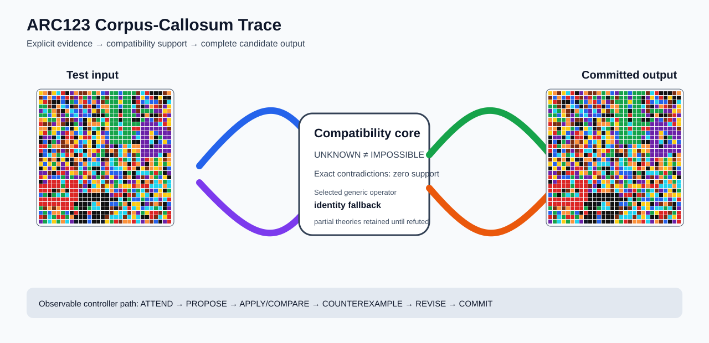

# ARC2 `c3fa4749` P0008 Brain Surgery Report

## Outcome: NO — TEST CELLS DO NOT ALL MATCH

- **Compared positions:** 1800
- **Mismatched cells:** 33
- **Training compatibility:** `False`
- **Fallback used:** `True`
- **Selected hypothesis:** `fallback_identity_complete_grid`
- **Source commit:** `71f86ff4c5304e452e0659131171f0519b50e21c`
- **Frozen controller commit:** `4bed6c917523bc2baa05eec69f67303805d88dae`

## Live-Agent Boundary

The controller receives only visible training input/output examples and test inputs. It receives no task ID, imported cohort label, GT feature record, GT solver, historical decomposition, or held-out output before committing a complete grid. The expected output appears only in the post-answer V&V section.

## Corpus-Callosum Visualization



- Full explicit event record: [`learning_trace.json`](learning_trace.json)

## Frozen Measurement

This task was evaluated with the controller and operator configuration pinned before the frozen cohort was run. A result in this packet cannot alter that controller configuration.

## Post-Answer V&V

### Test case 1
- **All cells match:** `False`
- **Mismatched cells:** `23`
- **Prediction:
```json
[[4, 7, 9, 4, 8, 2, 6, 5, 7, 9, 9, 7, 3, 7, 1, 5, 3, 3, 1, 3, 3, 3, 9, 8, 2, 6, 6, 6, 9, 7], [9, 1, 7, 1, 2, 1, 2, 9, 5, 2, 3, 5, 3, 0, 3, 9, 3, 3, 5, 3, 3, 6, 5, 4, 1, 2, 6, 4, 6, 6], [4, 2, 9, 6, 6, 1, 0, 3, 1, 7, 2, 1, 7, 5, 9, 3, 3, 3, 4, 3, 3, 6, 2, 1, 8, 1, 1, 9, 6, 8], [3, 3, 9, 0, 7, 8, 1, 6, 9, 1, 9, 2, 6, 1, 7, 7, 3, 3, 1, 3, 3, 8, 9, 0, 5, 7, 2, 9, 5, 4], [5, 8, 3, 7, 9, 6, 7, 8, 1, 5, 8, 5, 4, 9, 3, 7, 3, 3, 6, 3, 3, 5, 9, 3, 3, 3, 5, 5, 4, 7], [3, 3, 1, 4, 9, 5, 3, 1, 8, 5, 1, 1, 0, 6, 6, 3, 3, 3, 2, 3, 3, 3, 5, 6, 7, 6, 6, 9, 2, 5], [7, 4, 3, 3, 7, 5, 9, 9, 5, 1, 6, 4, 9, 3, 8, 2, 3, 3, 6, 3, 3, 6, 6, 3, 5, 1, 9, 2, 5, 4], [2, 9, 9, 5, 7, 9, 6, 6, 3, 5, 6, 7, 7, 7, 3, 4, 3, 3, 8, 3, 3, 3, 3, 5, 5, 5, 5, 8, 2, 4], [7, 7, 6, 4, 4, 3, 1, 6, 4, 8, 0, 9, 8, 3, 6, 7, 3, 3, 2, 3, 3, 2, 2, 5, 5, 5, 5, 5, 5, 9], [4, 2, 3, 4, 1, 5, 2, 7, 1, 8, 5, 4, 0, 4, 5, 1, 3, 3, 8, 3, 3, 3, 1, 5, 5, 4, 1, 5, 5, 5], [6, 5, 5, 0, 8, 6, 2, 2, 6, 4, 2, 2, 8, 4, 7, 1, 3, 3, 3, 3, 3, 5, 8, 5, 5, 7, 6, 3, 5, 5], [6, 1, 6, 3, 5, 9, 7, 9, 4, 1, 8, 4, 0, 4, 7, 5, 3, 3, 3, 3, 3, 6, 6, 5, 5, 8, 0, 1, 4, 1], [2, 2, 3, 7, 7, 9, 9, 7, 2, 1, 9, 4, 6, 8, 1, 9, 5, 6, 1, 7, 8, 7, 7, 5, 5, 0, 5, 5, 5, 5], [2, 1, 0, 1, 9, 5, 9, 2, 8, 8, 6, 7, 4, 2, 3, 9, 7, 9, 8, 4, 9, 4, 7, 5, 5, 5, 5, 5, 5, 5], [0, 1, 8, 7, 3, 8, 2, 7, 6, 2, 8, 7, 5, 3, 3, 0, 0, 9, 8, 7, 1, 9, 3, 5, 5, 5, 5, 8, 6, 7], [9, 4, 9, 7, 6, 4, 0, 0, 7, 7, 6, 1, 7, 1, 6, 9, 8, 3, 2, 3, 8, 9, 8, 5, 2, 7, 3, 4, 9, 7], [4, 1, 4, 3, 7, 5, 4, 6, 9, 1, 7, 8, 8, 8, 5, 7, 8, 3, 7, 7, 6, 2, 7, 5, 6, 7, 3, 4, 3, 4], [6, 4, 5, 4, 6, 5, 2, 2, 9, 8, 5, 3, 6, 6, 1, 2, 1, 8, 8, 4, 2, 7, 6, 4, 9, 7, 4, 7, 0, 1], [5, 5, 9, 0, 2, 2, 5, 4, 7, 3, 2, 7, 8, 6, 3, 7, 1, 1, 1, 6, 3, 6, 8, 8, 8, 3, 2, 3, 6, 5], [2, 4, 5, 1, 1, 3, 5, 3, 5, 5, 4, 9, 5, 3, 9, 5, 4, 5, 1, 9, 7, 6, 5, 9, 5, 7, 3, 1, 4, 6], [6, 5, 2, 2, 2, 8, 2, 2, 2, 8, 2, 1, 4, 7, 8, 9, 5, 3, 8, 6, 5, 5, 4, 6, 7, 9, 8, 7, 3, 8], [2, 2, 2, 2, 2, 3, 2, 2, 2, 9, 5, 6, 8, 4, 9, 4, 7, 3, 7, 4, 4, 2, 7, 2, 2, 8, 8, 8, 7, 8], [2, 2, 2, 6, 9, 7, 6, 2, 2, 5, 8, 2, 7, 7, 9, 8, 7, 1, 5, 2, 3, 1, 3, 8, 9, 5, 1, 4, 6, 3], [1, 3, 6, 3, 8, 3, 8, 2, 2, 6, 6, 6, 6, 6, 6, 6, 5, 2, 2, 6, 2, 9, 8, 4, 8, 6, 4, 7, 4, 4], [2, 2, 2, 2, 2, 2, 2, 2, 2, 6, 6, 6, 6, 6, 6, 6, 6, 6, 8, 6, 3, 1, 1, 3, 1, 1, 8, 5, 8, 2], [2, 2, 2, 2, 2, 2, 2, 2, 6, 6, 6, 0, 8, 7, 6, 6, 1, 1, 3, 7, 6, 4, 4, 6, 5, 9, 7, 9, 6, 1], [3, 9, 7, 9, 7, 2, 2, 2, 3, 6, 6, 3, 8, 8, 6, 6, 9, 0, 9, 8, 2, 8, 4, 1, 8, 8, 3, 8, 6, 5], [1, 3, 1, 7, 7, 3, 1, 6, 2, 6, 6, 2, 6, 6, 6, 6, 9, 4, 8, 8, 9, 7, 5, 3, 4, 2, 2, 9, 3, 2], [2, 9, 8, 3, 2, 2, 3, 7, 6, 6, 6, 1, 6, 6, 6, 9, 8, 8, 8, 9, 8, 4, 8, 6, 6, 2, 9, 8, 4, 2], [5, 3, 8, 4, 3, 7, 8, 5, 0, 6, 6, 1, 6, 6, 0, 4, 3, 2, 9, 7, 7, 2, 8, 5, 7, 9, 1, 6, 5, 2]]
```
- **Expected output (post-answer only):**
```json
[[4, 7, 9, 4, 8, 2, 6, 5, 7, 9, 9, 7, 3, 7, 1, 5, 3, 3, 1, 3, 3, 3, 9, 8, 2, 6, 6, 6, 9, 7], [9, 1, 7, 1, 2, 1, 2, 9, 5, 2, 3, 5, 3, 0, 3, 9, 3, 3, 1, 3, 3, 6, 5, 4, 1, 2, 6, 4, 6, 6], [4, 2, 9, 6, 6, 1, 0, 3, 1, 7, 2, 1, 7, 5, 9, 3, 3, 3, 1, 3, 3, 6, 2, 1, 8, 1, 1, 9, 6, 8], [3, 3, 9, 0, 7, 8, 1, 6, 9, 1, 9, 2, 6, 1, 7, 7, 3, 3, 1, 3, 3, 8, 9, 0, 5, 7, 2, 9, 5, 4], [5, 8, 3, 7, 9, 6, 7, 8, 1, 5, 8, 5, 4, 9, 3, 7, 3, 3, 1, 3, 3, 5, 9, 3, 3, 3, 5, 5, 4, 7], [3, 3, 1, 4, 9, 5, 3, 1, 8, 5, 1, 1, 0, 6, 6, 3, 3, 3, 1, 3, 3, 3, 5, 6, 7, 6, 6, 9, 2, 5], [7, 4, 3, 3, 7, 5, 9, 9, 5, 1, 6, 4, 9, 3, 8, 2, 3, 3, 1, 3, 3, 6, 6, 3, 5, 1, 9, 2, 5, 4], [2, 9, 9, 5, 7, 9, 6, 6, 3, 5, 6, 7, 7, 7, 3, 4, 3, 3, 1, 3, 3, 3, 3, 5, 5, 5, 5, 8, 2, 4], [7, 7, 6, 4, 4, 3, 1, 6, 4, 8, 0, 9, 8, 3, 6, 7, 3, 3, 1, 3, 3, 2, 2, 5, 5, 5, 5, 5, 5, 9], [4, 2, 3, 4, 1, 5, 2, 7, 1, 8, 5, 4, 0, 4, 5, 1, 3, 3, 1, 3, 3, 3, 1, 5, 5, 1, 1, 5, 5, 5], [6, 5, 5, 0, 8, 6, 2, 2, 6, 4, 2, 2, 8, 4, 7, 1, 3, 3, 3, 3, 3, 5, 8, 5, 5, 1, 1, 1, 5, 5], [6, 1, 6, 3, 5, 9, 7, 9, 4, 1, 8, 4, 0, 4, 7, 5, 3, 3, 3, 3, 3, 6, 6, 5, 5, 1, 1, 1, 1, 1], [2, 2, 3, 7, 7, 9, 9, 7, 2, 1, 9, 4, 6, 8, 1, 9, 5, 6, 1, 7, 8, 7, 7, 5, 5, 1, 5, 5, 5, 5], [2, 1, 0, 1, 9, 5, 9, 2, 8, 8, 6, 7, 4, 2, 3, 9, 7, 9, 8, 4, 9, 4, 7, 5, 5, 5, 5, 5, 5, 5], [0, 1, 8, 7, 3, 8, 2, 7, 6, 2, 8, 7, 5, 3, 3, 0, 0, 9, 8, 7, 1, 9, 3, 5, 5, 5, 5, 8, 6, 7], [9, 4, 9, 7, 6, 4, 0, 0, 7, 7, 6, 1, 7, 1, 6, 9, 8, 3, 2, 3, 8, 9, 8, 5, 2, 7, 3, 4, 9, 7], [4, 1, 4, 3, 7, 5, 4, 6, 9, 1, 7, 8, 8, 8, 5, 7, 8, 3, 7, 7, 6, 2, 7, 5, 6, 7, 3, 4, 3, 4], [6, 4, 5, 4, 6, 5, 2, 2, 9, 8, 5, 3, 6, 6, 1, 2, 1, 8, 8, 4, 2, 7, 6, 4, 9, 7, 4, 7, 0, 1], [5, 5, 9, 0, 2, 2, 5, 4, 7, 3, 2, 7, 8, 6, 3, 7, 1, 1, 1, 6, 3, 6, 8, 8, 8, 3, 2, 3, 6, 5], [2, 4, 5, 1, 1, 3, 5, 3, 5, 5, 4, 9, 5, 3, 9, 5, 4, 5, 1, 9, 7, 6, 5, 9, 5, 7, 3, 1, 4, 6], [6, 5, 2, 2, 2, 8, 2, 2, 2, 8, 2, 1, 4, 7, 8, 9, 5, 3, 8, 6, 5, 5, 4, 6, 7, 9, 8, 7, 3, 8], [2, 2, 2, 2, 2, 3, 2, 2, 2, 9, 5, 6, 8, 4, 9, 4, 7, 3, 7, 4, 4, 2, 7, 2, 2, 8, 8, 8, 7, 8], [2, 2, 2, 6, 9, 7, 6, 2, 2, 5, 8, 2, 7, 7, 9, 8, 7, 1, 5, 2, 3, 1, 3, 8, 9, 5, 1, 4, 6, 3], [1, 3, 6, 3, 8, 3, 8, 2, 2, 6, 6, 6, 6, 6, 6, 6, 5, 2, 2, 6, 2, 9, 8, 4, 8, 6, 4, 7, 4, 4], [2, 2, 2, 2, 2, 2, 2, 2, 2, 6, 6, 6, 6, 6, 6, 6, 6, 6, 8, 6, 3, 1, 1, 3, 1, 1, 8, 5, 8, 2], [2, 2, 2, 2, 2, 2, 2, 2, 6, 6, 6, 1, 1, 1, 6, 6, 1, 1, 3, 7, 6, 4, 4, 6, 5, 9, 7, 9, 6, 1], [3, 9, 7, 9, 7, 2, 2, 2, 3, 6, 6, 1, 1, 1, 6, 6, 9, 0, 9, 8, 2, 8, 4, 1, 8, 8, 3, 8, 6, 5], [1, 3, 1, 7, 7, 3, 1, 6, 2, 6, 6, 1, 6, 6, 6, 6, 9, 4, 8, 8, 9, 7, 5, 3, 4, 2, 2, 9, 3, 2], [2, 9, 8, 3, 2, 2, 3, 7, 6, 6, 6, 1, 6, 6, 6, 9, 8, 8, 8, 9, 8, 4, 8, 6, 6, 2, 9, 8, 4, 2], [5, 3, 8, 4, 3, 7, 8, 5, 0, 6, 6, 1, 6, 6, 0, 4, 3, 2, 9, 7, 7, 2, 8, 5, 7, 9, 1, 6, 5, 2]]
```

### Test case 2
- **All cells match:** `False`
- **Mismatched cells:** `10`
- **Prediction:
```json
[[0, 6, 0, 3, 8, 6, 8, 7, 7, 2, 7, 7, 3, 9, 5, 2, 9, 0, 1, 3, 8, 5, 2, 7, 3, 5, 0, 4, 1, 0], [1, 6, 1, 8, 3, 0, 2, 7, 7, 3, 7, 7, 9, 3, 3, 3, 0, 4, 4, 3, 0, 4, 1, 9, 2, 5, 5, 2, 6, 2], [9, 3, 1, 5, 4, 4, 9, 7, 7, 6, 7, 7, 4, 0, 5, 2, 0, 1, 2, 4, 3, 2, 5, 1, 0, 0, 1, 2, 7, 7], [7, 1, 5, 9, 2, 7, 8, 7, 7, 1, 7, 7, 0, 2, 9, 9, 0, 5, 7, 2, 0, 2, 7, 2, 1, 4, 4, 1, 4, 5], [0, 4, 7, 6, 4, 9, 2, 7, 7, 6, 7, 7, 1, 0, 3, 2, 7, 5, 7, 5, 6, 3, 2, 9, 5, 4, 9, 4, 5, 0], [3, 3, 5, 9, 8, 3, 3, 7, 7, 3, 7, 7, 6, 9, 0, 7, 1, 4, 8, 2, 7, 8, 2, 4, 5, 3, 8, 3, 9, 2], [9, 0, 4, 4, 9, 5, 3, 7, 7, 7, 7, 7, 0, 4, 9, 0, 1, 9, 0, 4, 5, 0, 6, 4, 3, 9, 2, 7, 5, 0], [5, 5, 3, 2, 2, 4, 3, 7, 7, 7, 7, 7, 8, 5, 9, 8, 5, 2, 3, 1, 2, 6, 2, 1, 3, 0, 5, 0, 4, 3], [6, 6, 9, 9, 4, 6, 4, 4, 8, 1, 9, 9, 8, 5, 6, 7, 0, 6, 0, 6, 8, 2, 2, 0, 1, 0, 1, 4, 2, 9], [0, 9, 5, 3, 1, 0, 1, 3, 7, 4, 6, 6, 9, 5, 7, 7, 4, 8, 6, 2, 1, 4, 8, 2, 6, 4, 8, 5, 5, 1], [3, 1, 6, 3, 9, 1, 6, 6, 8, 0, 5, 1, 3, 3, 6, 5, 0, 6, 7, 6, 8, 8, 5, 4, 5, 1, 5, 3, 6, 7], [1, 1, 3, 7, 2, 0, 3, 6, 0, 2, 7, 4, 7, 5, 3, 8, 5, 4, 1, 1, 5, 8, 5, 3, 9, 6, 4, 8, 9, 7], [7, 9, 0, 2, 5, 1, 9, 3, 8, 0, 2, 1, 8, 7, 1, 0, 0, 3, 2, 4, 9, 2, 8, 6, 7, 5, 7, 7, 6, 9], [9, 0, 8, 7, 2, 4, 0, 3, 4, 1, 8, 8, 0, 0, 0, 9, 1, 2, 1, 0, 2, 9, 7, 8, 0, 2, 7, 7, 4, 1], [4, 8, 4, 1, 9, 7, 3, 9, 2, 9, 5, 4, 8, 5, 1, 7, 6, 8, 8, 2, 6, 3, 4, 0, 2, 8, 6, 4, 2, 5], [3, 9, 4, 3, 4, 2, 8, 5, 5, 2, 6, 5, 5, 5, 9, 1, 6, 8, 9, 7, 6, 0, 9, 3, 7, 3, 1, 4, 4, 0], [3, 0, 6, 3, 6, 9, 4, 3, 9, 9, 0, 2, 6, 3, 8, 0, 6, 3, 0, 0, 8, 1, 8, 0, 0, 4, 2, 8, 4, 4], [3, 9, 3, 9, 6, 7, 0, 8, 0, 1, 9, 3, 0, 7, 5, 6, 6, 4, 0, 9, 4, 8, 3, 8, 0, 0, 4, 0, 0, 5], [7, 6, 5, 5, 3, 8, 5, 1, 6, 1, 7, 4, 9, 3, 8, 8, 7, 4, 1, 4, 4, 9, 0, 0, 0, 0, 3, 0, 0, 0], [4, 7, 7, 8, 8, 5, 0, 3, 5, 0, 7, 3, 1, 9, 9, 6, 6, 6, 0, 8, 9, 0, 0, 0, 0, 0, 5, 0, 0, 0], [7, 7, 4, 2, 0, 1, 8, 9, 2, 2, 2, 5, 2, 0, 9, 5, 9, 1, 1, 0, 0, 1, 0, 0, 1, 6, 8, 4, 0, 0], [0, 6, 4, 3, 6, 9, 9, 5, 6, 9, 8, 9, 6, 5, 7, 1, 9, 5, 3, 1, 9, 5, 0, 0, 8, 1, 6, 5, 8, 2], [6, 8, 0, 0, 5, 9, 5, 9, 0, 0, 7, 0, 0, 0, 8, 4, 3, 9, 5, 4, 7, 3, 0, 0, 2, 3, 3, 7, 0, 0], [3, 1, 2, 1, 0, 8, 9, 5, 9, 5, 7, 2, 8, 3, 1, 8, 0, 8, 7, 3, 0, 8, 0, 0, 1, 9, 7, 2, 0, 0], [3, 8, 0, 0, 0, 1, 4, 3, 7, 0, 9, 1, 7, 9, 2, 3, 7, 0, 2, 3, 5, 2, 0, 0, 0, 0, 0, 0, 0, 0], [6, 7, 1, 4, 4, 4, 4, 4, 4, 4, 4, 6, 5, 0, 0, 2, 0, 5, 2, 2, 6, 2, 0, 0, 0, 0, 0, 0, 0, 5], [5, 2, 1, 4, 4, 4, 4, 4, 4, 4, 4, 0, 0, 8, 3, 1, 1, 7, 3, 3, 5, 4, 0, 0, 1, 0, 4, 5, 5, 1], [9, 5, 0, 4, 4, 3, 0, 7, 3, 4, 4, 8, 5, 6, 8, 8, 7, 9, 3, 2, 7, 2, 0, 8, 8, 2, 0, 2, 0, 8], [6, 9, 1, 4, 4, 9, 4, 4, 4, 4, 4, 3, 8, 8, 0, 7, 6, 5, 5, 8, 0, 0, 8, 1, 3, 3, 3, 9, 4, 1], [9, 6, 6, 4, 4, 2, 4, 4, 4, 4, 4, 9, 9, 9, 2, 5, 4, 1, 7, 4, 5, 4, 6, 0, 6, 6, 0, 4, 5, 5]]
```
- **Expected output (post-answer only):**
```json
[[0, 6, 0, 3, 8, 6, 8, 7, 7, 2, 7, 7, 3, 9, 5, 2, 9, 0, 1, 3, 8, 5, 2, 7, 3, 5, 0, 4, 1, 0], [1, 6, 1, 8, 3, 0, 2, 7, 7, 2, 7, 7, 9, 3, 3, 3, 0, 4, 4, 3, 0, 4, 1, 9, 2, 5, 5, 2, 6, 2], [9, 3, 1, 5, 4, 4, 9, 7, 7, 2, 7, 7, 4, 0, 5, 2, 0, 1, 2, 4, 3, 2, 5, 1, 0, 0, 1, 2, 7, 7], [7, 1, 5, 9, 2, 7, 8, 7, 7, 2, 7, 7, 0, 2, 9, 9, 0, 5, 7, 2, 0, 2, 7, 2, 1, 4, 4, 1, 4, 5], [0, 4, 7, 6, 4, 9, 2, 7, 7, 2, 7, 7, 1, 0, 3, 2, 7, 5, 7, 5, 6, 3, 2, 9, 5, 4, 9, 4, 5, 0], [3, 3, 5, 9, 8, 3, 3, 7, 7, 2, 7, 7, 6, 9, 0, 7, 1, 4, 8, 2, 7, 8, 2, 4, 5, 3, 8, 3, 9, 2], [9, 0, 4, 4, 9, 5, 3, 7, 7, 7, 7, 7, 0, 4, 9, 0, 1, 9, 0, 4, 5, 0, 6, 4, 3, 9, 2, 7, 5, 0], [5, 5, 3, 2, 2, 4, 3, 7, 7, 7, 7, 7, 8, 5, 9, 8, 5, 2, 3, 1, 2, 6, 2, 1, 3, 0, 5, 0, 4, 3], [6, 6, 9, 9, 4, 6, 4, 4, 8, 1, 9, 9, 8, 5, 6, 7, 0, 6, 0, 6, 8, 2, 2, 0, 1, 0, 1, 4, 2, 9], [0, 9, 5, 3, 1, 0, 1, 3, 7, 4, 6, 6, 9, 5, 7, 7, 4, 8, 6, 2, 1, 4, 8, 2, 6, 4, 8, 5, 5, 1], [3, 1, 6, 3, 9, 1, 6, 6, 8, 0, 5, 1, 3, 3, 6, 5, 0, 6, 7, 6, 8, 8, 5, 4, 5, 1, 5, 3, 6, 7], [1, 1, 3, 7, 2, 0, 3, 6, 0, 2, 7, 4, 7, 5, 3, 8, 5, 4, 1, 1, 5, 8, 5, 3, 9, 6, 4, 8, 9, 7], [7, 9, 0, 2, 5, 1, 9, 3, 8, 0, 2, 1, 8, 7, 1, 0, 0, 3, 2, 4, 9, 2, 8, 6, 7, 5, 7, 7, 6, 9], [9, 0, 8, 7, 2, 4, 0, 3, 4, 1, 8, 8, 0, 0, 0, 9, 1, 2, 1, 0, 2, 9, 7, 8, 0, 2, 7, 7, 4, 1], [4, 8, 4, 1, 9, 7, 3, 9, 2, 9, 5, 4, 8, 5, 1, 7, 6, 8, 8, 2, 6, 3, 4, 0, 2, 8, 6, 4, 2, 5], [3, 9, 4, 3, 4, 2, 8, 5, 5, 2, 6, 5, 5, 5, 9, 1, 6, 8, 9, 7, 6, 0, 9, 3, 7, 3, 1, 4, 4, 0], [3, 0, 6, 3, 6, 9, 4, 3, 9, 9, 0, 2, 6, 3, 8, 0, 6, 3, 0, 0, 8, 1, 8, 0, 0, 4, 2, 8, 4, 4], [3, 9, 3, 9, 6, 7, 0, 8, 0, 1, 9, 3, 0, 7, 5, 6, 6, 4, 0, 9, 4, 8, 3, 8, 0, 0, 4, 0, 0, 5], [7, 6, 5, 5, 3, 8, 5, 1, 6, 1, 7, 4, 9, 3, 8, 8, 7, 4, 1, 4, 4, 9, 0, 0, 0, 0, 3, 0, 0, 0], [4, 7, 7, 8, 8, 5, 0, 3, 5, 0, 7, 3, 1, 9, 9, 6, 6, 6, 0, 8, 9, 0, 0, 0, 0, 0, 5, 0, 0, 0], [7, 7, 4, 2, 0, 1, 8, 9, 2, 2, 2, 5, 2, 0, 9, 5, 9, 1, 1, 0, 0, 1, 0, 0, 1, 6, 8, 4, 0, 0], [0, 6, 4, 3, 6, 9, 9, 5, 6, 9, 8, 9, 6, 5, 7, 1, 9, 5, 3, 1, 9, 5, 0, 0, 8, 1, 6, 5, 8, 2], [6, 8, 0, 0, 5, 9, 5, 9, 0, 0, 7, 0, 0, 0, 8, 4, 3, 9, 5, 4, 7, 3, 0, 0, 2, 3, 3, 7, 0, 0], [3, 1, 2, 1, 0, 8, 9, 5, 9, 5, 7, 2, 8, 3, 1, 8, 0, 8, 7, 3, 0, 8, 0, 0, 1, 9, 7, 2, 0, 0], [3, 8, 0, 0, 0, 1, 4, 3, 7, 0, 9, 1, 7, 9, 2, 3, 7, 0, 2, 3, 5, 2, 0, 0, 0, 0, 0, 0, 0, 0], [6, 7, 1, 4, 4, 4, 4, 4, 4, 4, 4, 6, 5, 0, 0, 2, 0, 5, 2, 2, 6, 2, 0, 0, 0, 0, 0, 0, 0, 5], [5, 2, 1, 4, 4, 4, 4, 4, 4, 4, 4, 0, 0, 8, 3, 1, 1, 7, 3, 3, 5, 4, 0, 0, 1, 0, 4, 5, 5, 1], [9, 5, 0, 4, 4, 2, 2, 2, 2, 4, 4, 8, 5, 6, 8, 8, 7, 9, 3, 2, 7, 2, 0, 8, 8, 2, 0, 2, 0, 8], [6, 9, 1, 4, 4, 2, 4, 4, 4, 4, 4, 3, 8, 8, 0, 7, 6, 5, 5, 8, 0, 0, 8, 1, 3, 3, 3, 9, 4, 1], [9, 6, 6, 4, 4, 2, 4, 4, 4, 4, 4, 9, 9, 9, 2, 5, 4, 1, 7, 4, 5, 4, 6, 0, 6, 6, 0, 4, 5, 5]]
```

## Observable IHL Walkthrough

The record contains explicit actions, predictions, feedback, and revisions; it does not claim or store hidden model reasoning.

### Action totals

- `ADD_CONDITION`: 1
- `APPLY_HYPOTHESIS`: 248
- `ATTEND`: 248
- `BIND_PARAMETER`: 1
- `CHOOSE_NEXT_DEMO`: 248
- `COMMIT`: 1
- `COMPARE`: 248
- `COMPOSE_RULE`: 2
- `EXPLAIN_RESIDUAL`: 2
- `FIND_COUNTEREXAMPLE`: 8
- `PROPOSE`: 1
- `SPECIALIZE`: 87

### Decision milestones

- `0` `PROPOSE` — `{"parent_theory_id":"T0000","rule":{"description_length":1,"name":"identity","operation":"identity","parameters":{},"rule_id":"identity","scope":{"kind":"all","value":null}},"stage":"initial_generic_theories","theory_id":"T0001"}`
- `2` `ATTEND` — `{"reason":"initial_highest_observed_change_and_color_discrimination","selected_demo":2,"selected_region":{"column":3,"row":1},"theory_id":"T0001"}`
- `6` `ATTEND` — `{"reason":"counterexample_requires_visible_conditional_evidence:unseen_demo_selected_for_residual_version_space_discrimination","selected_demo":0,"selected_region":{"column":21,"row":10},"theory_id":"T0001"}`
- `10` `ATTEND` — `{"reason":"counterexample_requires_visible_conditional_evidence:unseen_demo_selected_for_residual_version_space_discrimination","selected_demo":1,"selected_region":{"column":4,"row":1},"theory_id":"T0001"}`
- `16` `SPECIALIZE` — `{"added_rule":{"description_length":4,"name":"row_span_fill(fill_color=9,seed_color=4)","operation":"full_operator","parameters":{"fill_color":9,"operator":"row_span_fill","seed_color":4},"rule_id":"structural-row_span_fill","scope":{"kind":"all","value":null}},"parent_theory_id":"T0001","reason":"unexplained_residual_proposed_generic_structural_rule","theory_id":"T0003"}`
- `17` `SPECIALIZE` — `{"added_rule":{"description_length":4,"name":"row_span_fill(fill_color=6,seed_color=4)","operation":"full_operator","parameters":{"fill_color":6,"operator":"row_span_fill","seed_color":4},"rule_id":"structural-row_span_fill","scope":{"kind":"all","value":null}},"parent_theory_id":"T0001","reason":"unexplained_residual_proposed_generic_structural_rule","theory_id":"T0004"}`
- `18` `SPECIALIZE` — `{"added_rule":{"description_length":4,"name":"row_span_fill(fill_color=5,seed_color=4)","operation":"full_operator","parameters":{"fill_color":5,"operator":"row_span_fill","seed_color":4},"rule_id":"structural-row_span_fill","scope":{"kind":"all","value":null}},"parent_theory_id":"T0001","reason":"unexplained_residual_proposed_generic_structural_rule","theory_id":"T0005"}`
- `19` `SPECIALIZE` — `{"added_rule":{"description_length":4,"name":"row_span_fill(fill_color=4,seed_color=4)","operation":"full_operator","parameters":{"fill_color":4,"operator":"row_span_fill","seed_color":4},"rule_id":"structural-row_span_fill","scope":{"kind":"all","value":null}},"parent_theory_id":"T0001","reason":"unexplained_residual_proposed_generic_structural_rule","theory_id":"T0006"}`
- `20` `SPECIALIZE` — `{"added_rule":{"description_length":4,"name":"row_span_fill(fill_color=3,seed_color=4)","operation":"full_operator","parameters":{"fill_color":3,"operator":"row_span_fill","seed_color":4},"rule_id":"structural-row_span_fill","scope":{"kind":"all","value":null}},"parent_theory_id":"T0001","reason":"unexplained_residual_proposed_generic_structural_rule","theory_id":"T0007"}`
- `21` `SPECIALIZE` — `{"added_rule":{"description_length":4,"name":"row_span_fill(fill_color=2,seed_color=4)","operation":"full_operator","parameters":{"fill_color":2,"operator":"row_span_fill","seed_color":4},"rule_id":"structural-row_span_fill","scope":{"kind":"all","value":null}},"parent_theory_id":"T0001","reason":"unexplained_residual_proposed_generic_structural_rule","theory_id":"T0008"}`
- `22` `SPECIALIZE` — `{"added_rule":{"description_length":4,"name":"row_span_fill(fill_color=1,seed_color=4)","operation":"full_operator","parameters":{"fill_color":1,"operator":"row_span_fill","seed_color":4},"rule_id":"structural-row_span_fill","scope":{"kind":"all","value":null}},"parent_theory_id":"T0001","reason":"unexplained_residual_proposed_generic_structural_rule","theory_id":"T0009"}`
- `23` `SPECIALIZE` — `{"added_rule":{"description_length":4,"name":"row_span_fill(fill_color=9,seed_color=9)","operation":"full_operator","parameters":{"fill_color":9,"operator":"row_span_fill","seed_color":9},"rule_id":"structural-row_span_fill","scope":{"kind":"all","value":null}},"parent_theory_id":"T0001","reason":"unexplained_residual_proposed_generic_structural_rule","theory_id":"T0010"}`
- `24` `SPECIALIZE` — `{"added_rule":{"description_length":4,"name":"row_span_fill(fill_color=9,seed_color=3)","operation":"full_operator","parameters":{"fill_color":9,"operator":"row_span_fill","seed_color":3},"rule_id":"structural-row_span_fill","scope":{"kind":"all","value":null}},"parent_theory_id":"T0001","reason":"unexplained_residual_proposed_generic_structural_rule","theory_id":"T0011"}`
- `25` `SPECIALIZE` — `{"added_rule":{"description_length":4,"name":"row_span_fill(fill_color=6,seed_color=9)","operation":"full_operator","parameters":{"fill_color":6,"operator":"row_span_fill","seed_color":9},"rule_id":"structural-row_span_fill","scope":{"kind":"all","value":null}},"parent_theory_id":"T0001","reason":"unexplained_residual_proposed_generic_structural_rule","theory_id":"T0012"}`
- `26` `SPECIALIZE` — `{"added_rule":{"description_length":4,"name":"row_span_fill(fill_color=6,seed_color=3)","operation":"full_operator","parameters":{"fill_color":6,"operator":"row_span_fill","seed_color":3},"rule_id":"structural-row_span_fill","scope":{"kind":"all","value":null}},"parent_theory_id":"T0001","reason":"unexplained_residual_proposed_generic_structural_rule","theory_id":"T0013"}`
- `27` `SPECIALIZE` — `{"added_rule":{"description_length":4,"name":"row_span_fill(fill_color=5,seed_color=9)","operation":"full_operator","parameters":{"fill_color":5,"operator":"row_span_fill","seed_color":9},"rule_id":"structural-row_span_fill","scope":{"kind":"all","value":null}},"parent_theory_id":"T0001","reason":"unexplained_residual_proposed_generic_structural_rule","theory_id":"T0014"}`
- `29` `ATTEND` — `{"reason":"initial_highest_observed_change_and_color_discrimination","selected_demo":2,"selected_region":{"column":3,"row":0},"theory_id":"T0002"}`
- `33` `ATTEND` — `{"reason":"initial_highest_observed_change_and_color_discrimination","selected_demo":2,"selected_region":{"column":3,"row":1},"theory_id":"T0003"}`
- `37` `ATTEND` — `{"reason":"initial_highest_observed_change_and_color_discrimination","selected_demo":2,"selected_region":{"column":3,"row":1},"theory_id":"T0004"}`
- `41` `ATTEND` — `{"reason":"initial_highest_observed_change_and_color_discrimination","selected_demo":2,"selected_region":{"column":3,"row":1},"theory_id":"T0005"}`
- `45` `ATTEND` — `{"reason":"initial_highest_observed_change_and_color_discrimination","selected_demo":2,"selected_region":{"column":3,"row":1},"theory_id":"T0006"}`
- `49` `ATTEND` — `{"reason":"initial_highest_observed_change_and_color_discrimination","selected_demo":2,"selected_region":{"column":3,"row":1},"theory_id":"T0007"}`
- `53` `ATTEND` — `{"reason":"initial_highest_observed_change_and_color_discrimination","selected_demo":2,"selected_region":{"column":3,"row":1},"theory_id":"T0008"}`
- `57` `ATTEND` — `{"reason":"initial_highest_observed_change_and_color_discrimination","selected_demo":2,"selected_region":{"column":3,"row":1},"theory_id":"T0009"}`
- `61` `ATTEND` — `{"reason":"initial_highest_observed_change_and_color_discrimination","selected_demo":2,"selected_region":{"column":3,"row":1},"theory_id":"T0010"}`
- `65` `ATTEND` — `{"reason":"initial_highest_observed_change_and_color_discrimination","selected_demo":2,"selected_region":{"column":3,"row":1},"theory_id":"T0011"}`
- `69` `ATTEND` — `{"reason":"initial_highest_observed_change_and_color_discrimination","selected_demo":2,"selected_region":{"column":3,"row":1},"theory_id":"T0012"}`
- `73` `ATTEND` — `{"reason":"initial_highest_observed_change_and_color_discrimination","selected_demo":2,"selected_region":{"column":3,"row":1},"theory_id":"T0013"}`
- `77` `ATTEND` — `{"reason":"counterexample_requires_visible_conditional_evidence:unseen_demo_selected_for_residual_version_space_discrimination","selected_demo":0,"selected_region":{"column":4,"row":0},"theory_id":"T0003"}`
- `81` `ATTEND` — `{"reason":"counterexample_requires_visible_conditional_evidence:unseen_demo_selected_for_residual_version_space_discrimination","selected_demo":0,"selected_region":{"column":4,"row":0},"theory_id":"T0004"}`
- `85` `ATTEND` — `{"reason":"counterexample_requires_visible_conditional_evidence:unseen_demo_selected_for_residual_version_space_discrimination","selected_demo":0,"selected_region":{"column":4,"row":0},"theory_id":"T0005"}`
- `89` `ATTEND` — `{"reason":"counterexample_requires_visible_conditional_evidence:unseen_demo_selected_for_residual_version_space_discrimination","selected_demo":0,"selected_region":{"column":4,"row":0},"theory_id":"T0006"}`
- `93` `ATTEND` — `{"reason":"counterexample_requires_visible_conditional_evidence:unseen_demo_selected_for_residual_version_space_discrimination","selected_demo":0,"selected_region":{"column":4,"row":0},"theory_id":"T0007"}`
- `97` `ATTEND` — `{"reason":"counterexample_requires_visible_conditional_evidence:unseen_demo_selected_for_residual_version_space_discrimination","selected_demo":0,"selected_region":{"column":4,"row":0},"theory_id":"T0008"}`
- `101` `ATTEND` — `{"reason":"counterexample_requires_visible_conditional_evidence:unseen_demo_selected_for_residual_version_space_discrimination","selected_demo":0,"selected_region":{"column":4,"row":0},"theory_id":"T0009"}`
- `105` `ATTEND` — `{"reason":"counterexample_requires_visible_conditional_evidence:unseen_demo_selected_for_residual_version_space_discrimination","selected_demo":0,"selected_region":{"column":16,"row":1},"theory_id":"T0011"}`
- `109` `ATTEND` — `{"reason":"counterexample_requires_visible_conditional_evidence:unseen_demo_selected_for_residual_version_space_discrimination","selected_demo":0,"selected_region":{"column":16,"row":1},"theory_id":"T0013"}`
- `113` `ATTEND` — `{"reason":"counterexample_requires_visible_conditional_evidence:unseen_demo_selected_for_residual_version_space_discrimination","selected_demo":0,"selected_region":{"column":13,"row":5},"theory_id":"T0010"}`
- `117` `ATTEND` — `{"reason":"counterexample_requires_visible_conditional_evidence:unseen_demo_selected_for_residual_version_space_discrimination","selected_demo":0,"selected_region":{"column":13,"row":5},"theory_id":"T0012"}`
- `121` `ATTEND` — `{"reason":"counterexample_requires_visible_conditional_evidence:unseen_demo_selected_for_residual_version_space_discrimination","selected_demo":0,"selected_region":{"column":0,"row":0},"theory_id":"T0002"}`
- `125` `ATTEND` — `{"reason":"counterexample_requires_visible_conditional_evidence:unseen_demo_selected_for_residual_version_space_discrimination","selected_demo":1,"selected_region":{"column":9,"row":0},"theory_id":"T0011"}`
- `129` `ATTEND` — `{"reason":"counterexample_requires_visible_conditional_evidence:unseen_demo_selected_for_residual_version_space_discrimination","selected_demo":1,"selected_region":{"column":9,"row":0},"theory_id":"T0013"}`
- `133` `ATTEND` — `{"reason":"counterexample_requires_visible_conditional_evidence:unseen_demo_selected_for_residual_version_space_discrimination","selected_demo":1,"selected_region":{"column":4,"row":1},"theory_id":"T0003"}`
- `137` `ATTEND` — `{"reason":"counterexample_requires_visible_conditional_evidence:unseen_demo_selected_for_residual_version_space_discrimination","selected_demo":1,"selected_region":{"column":4,"row":1},"theory_id":"T0004"}`
- `141` `ATTEND` — `{"reason":"counterexample_requires_visible_conditional_evidence:unseen_demo_selected_for_residual_version_space_discrimination","selected_demo":1,"selected_region":{"column":4,"row":1},"theory_id":"T0005"}`
- `145` `ATTEND` — `{"reason":"counterexample_requires_visible_conditional_evidence:unseen_demo_selected_for_residual_version_space_discrimination","selected_demo":1,"selected_region":{"column":4,"row":1},"theory_id":"T0006"}`
- `149` `ATTEND` — `{"reason":"counterexample_requires_visible_conditional_evidence:unseen_demo_selected_for_residual_version_space_discrimination","selected_demo":1,"selected_region":{"column":4,"row":1},"theory_id":"T0007"}`
- `153` `ATTEND` — `{"reason":"counterexample_requires_visible_conditional_evidence:unseen_demo_selected_for_residual_version_space_discrimination","selected_demo":1,"selected_region":{"column":4,"row":1},"theory_id":"T0008"}`
- `157` `ATTEND` — `{"reason":"counterexample_requires_visible_conditional_evidence:unseen_demo_selected_for_residual_version_space_discrimination","selected_demo":1,"selected_region":{"column":4,"row":1},"theory_id":"T0009"}`
- `161` `ATTEND` — `{"reason":"counterexample_requires_visible_conditional_evidence:unseen_demo_selected_for_residual_version_space_discrimination","selected_demo":1,"selected_region":{"column":4,"row":1},"theory_id":"T0010"}`
- `165` `ATTEND` — `{"reason":"counterexample_requires_visible_conditional_evidence:unseen_demo_selected_for_residual_version_space_discrimination","selected_demo":1,"selected_region":{"column":4,"row":1},"theory_id":"T0012"}`
- `171` `SPECIALIZE` — `{"added_rule":{"description_length":4,"name":"row_span_fill(fill_color=6,seed_color=4)","operation":"full_operator","parameters":{"fill_color":6,"operator":"row_span_fill","seed_color":4},"rule_id":"structural-row_span_fill","scope":{"kind":"all","value":null}},"parent_theory_id":"T0003","reason":"unexplained_residual_proposed_generic_structural_rule","theory_id":"T0016"}`
- `172` `SPECIALIZE` — `{"added_rule":{"description_length":4,"name":"row_span_fill(fill_color=5,seed_color=4)","operation":"full_operator","parameters":{"fill_color":5,"operator":"row_span_fill","seed_color":4},"rule_id":"structural-row_span_fill","scope":{"kind":"all","value":null}},"parent_theory_id":"T0003","reason":"unexplained_residual_proposed_generic_structural_rule","theory_id":"T0017"}`
- `173` `SPECIALIZE` — `{"added_rule":{"description_length":4,"name":"row_span_fill(fill_color=4,seed_color=4)","operation":"full_operator","parameters":{"fill_color":4,"operator":"row_span_fill","seed_color":4},"rule_id":"structural-row_span_fill","scope":{"kind":"all","value":null}},"parent_theory_id":"T0003","reason":"unexplained_residual_proposed_generic_structural_rule","theory_id":"T0018"}`
- `174` `SPECIALIZE` — `{"added_rule":{"description_length":4,"name":"row_span_fill(fill_color=3,seed_color=4)","operation":"full_operator","parameters":{"fill_color":3,"operator":"row_span_fill","seed_color":4},"rule_id":"structural-row_span_fill","scope":{"kind":"all","value":null}},"parent_theory_id":"T0003","reason":"unexplained_residual_proposed_generic_structural_rule","theory_id":"T0019"}`
- `175` `SPECIALIZE` — `{"added_rule":{"description_length":4,"name":"row_span_fill(fill_color=2,seed_color=4)","operation":"full_operator","parameters":{"fill_color":2,"operator":"row_span_fill","seed_color":4},"rule_id":"structural-row_span_fill","scope":{"kind":"all","value":null}},"parent_theory_id":"T0003","reason":"unexplained_residual_proposed_generic_structural_rule","theory_id":"T0020"}`
- `176` `SPECIALIZE` — `{"added_rule":{"description_length":4,"name":"row_span_fill(fill_color=1,seed_color=4)","operation":"full_operator","parameters":{"fill_color":1,"operator":"row_span_fill","seed_color":4},"rule_id":"structural-row_span_fill","scope":{"kind":"all","value":null}},"parent_theory_id":"T0003","reason":"unexplained_residual_proposed_generic_structural_rule","theory_id":"T0021"}`
- `177` `SPECIALIZE` — `{"added_rule":{"description_length":4,"name":"row_span_fill(fill_color=9,seed_color=9)","operation":"full_operator","parameters":{"fill_color":9,"operator":"row_span_fill","seed_color":9},"rule_id":"structural-row_span_fill","scope":{"kind":"all","value":null}},"parent_theory_id":"T0003","reason":"unexplained_residual_proposed_generic_structural_rule","theory_id":"T0022"}`
- `178` `SPECIALIZE` — `{"added_rule":{"description_length":4,"name":"row_span_fill(fill_color=9,seed_color=3)","operation":"full_operator","parameters":{"fill_color":9,"operator":"row_span_fill","seed_color":3},"rule_id":"structural-row_span_fill","scope":{"kind":"all","value":null}},"parent_theory_id":"T0003","reason":"unexplained_residual_proposed_generic_structural_rule","theory_id":"T0023"}`
- `179` `SPECIALIZE` — `{"added_rule":{"description_length":4,"name":"row_span_fill(fill_color=6,seed_color=9)","operation":"full_operator","parameters":{"fill_color":6,"operator":"row_span_fill","seed_color":9},"rule_id":"structural-row_span_fill","scope":{"kind":"all","value":null}},"parent_theory_id":"T0003","reason":"unexplained_residual_proposed_generic_structural_rule","theory_id":"T0024"}`
- `180` `SPECIALIZE` — `{"added_rule":{"description_length":4,"name":"row_span_fill(fill_color=6,seed_color=3)","operation":"full_operator","parameters":{"fill_color":6,"operator":"row_span_fill","seed_color":3},"rule_id":"structural-row_span_fill","scope":{"kind":"all","value":null}},"parent_theory_id":"T0003","reason":"unexplained_residual_proposed_generic_structural_rule","theory_id":"T0025"}`
- `181` `SPECIALIZE` — `{"added_rule":{"description_length":4,"name":"row_span_fill(fill_color=5,seed_color=9)","operation":"full_operator","parameters":{"fill_color":5,"operator":"row_span_fill","seed_color":9},"rule_id":"structural-row_span_fill","scope":{"kind":"all","value":null}},"parent_theory_id":"T0003","reason":"unexplained_residual_proposed_generic_structural_rule","theory_id":"T0026"}`
- `183` `ATTEND` — `{"reason":"initial_highest_observed_change_and_color_discrimination","selected_demo":2,"selected_region":{"column":3,"row":1},"theory_id":"T0015"}`
- `187` `ATTEND` — `{"reason":"initial_highest_observed_change_and_color_discrimination","selected_demo":2,"selected_region":{"column":3,"row":1},"theory_id":"T0016"}`
- `191` `ATTEND` — `{"reason":"initial_highest_observed_change_and_color_discrimination","selected_demo":2,"selected_region":{"column":3,"row":1},"theory_id":"T0017"}`
- `195` `ATTEND` — `{"reason":"initial_highest_observed_change_and_color_discrimination","selected_demo":2,"selected_region":{"column":3,"row":1},"theory_id":"T0018"}`
- `199` `ATTEND` — `{"reason":"initial_highest_observed_change_and_color_discrimination","selected_demo":2,"selected_region":{"column":3,"row":1},"theory_id":"T0019"}`
- `203` `ATTEND` — `{"reason":"initial_highest_observed_change_and_color_discrimination","selected_demo":2,"selected_region":{"column":3,"row":1},"theory_id":"T0020"}`
- `207` `ATTEND` — `{"reason":"initial_highest_observed_change_and_color_discrimination","selected_demo":2,"selected_region":{"column":3,"row":1},"theory_id":"T0021"}`
- `211` `ATTEND` — `{"reason":"initial_highest_observed_change_and_color_discrimination","selected_demo":2,"selected_region":{"column":3,"row":1},"theory_id":"T0022"}`
- `215` `ATTEND` — `{"reason":"initial_highest_observed_change_and_color_discrimination","selected_demo":2,"selected_region":{"column":3,"row":1},"theory_id":"T0023"}`
- `219` `ATTEND` — `{"reason":"initial_highest_observed_change_and_color_discrimination","selected_demo":2,"selected_region":{"column":3,"row":1},"theory_id":"T0024"}`
- `223` `ATTEND` — `{"reason":"initial_highest_observed_change_and_color_discrimination","selected_demo":2,"selected_region":{"column":3,"row":1},"theory_id":"T0025"}`
- `227` `ATTEND` — `{"reason":"initial_highest_observed_change_and_color_discrimination","selected_demo":2,"selected_region":{"column":3,"row":1},"theory_id":"T0026"}`
- `231` `ATTEND` — `{"reason":"counterexample_requires_visible_conditional_evidence:unseen_demo_selected_for_residual_version_space_discrimination","selected_demo":0,"selected_region":{"column":21,"row":10},"theory_id":"T0015"}`
- `235` `ATTEND` — `{"reason":"counterexample_requires_visible_conditional_evidence:unseen_demo_selected_for_residual_version_space_discrimination","selected_demo":0,"selected_region":{"column":4,"row":0},"theory_id":"T0016"}`
- `239` `ATTEND` — `{"reason":"counterexample_requires_visible_conditional_evidence:unseen_demo_selected_for_residual_version_space_discrimination","selected_demo":0,"selected_region":{"column":4,"row":0},"theory_id":"T0017"}`
- `243` `ATTEND` — `{"reason":"counterexample_requires_visible_conditional_evidence:unseen_demo_selected_for_residual_version_space_discrimination","selected_demo":0,"selected_region":{"column":4,"row":0},"theory_id":"T0018"}`
- `247` `ATTEND` — `{"reason":"counterexample_requires_visible_conditional_evidence:unseen_demo_selected_for_residual_version_space_discrimination","selected_demo":0,"selected_region":{"column":4,"row":0},"theory_id":"T0019"}`
- `251` `ATTEND` — `{"reason":"counterexample_requires_visible_conditional_evidence:unseen_demo_selected_for_residual_version_space_discrimination","selected_demo":0,"selected_region":{"column":4,"row":0},"theory_id":"T0020"}`
- `255` `ATTEND` — `{"reason":"counterexample_requires_visible_conditional_evidence:unseen_demo_selected_for_residual_version_space_discrimination","selected_demo":0,"selected_region":{"column":4,"row":0},"theory_id":"T0021"}`
- `259` `ATTEND` — `{"reason":"counterexample_requires_visible_conditional_evidence:unseen_demo_selected_for_residual_version_space_discrimination","selected_demo":0,"selected_region":{"column":16,"row":1},"theory_id":"T0023"}`
- `263` `ATTEND` — `{"reason":"counterexample_requires_visible_conditional_evidence:unseen_demo_selected_for_residual_version_space_discrimination","selected_demo":0,"selected_region":{"column":16,"row":1},"theory_id":"T0025"}`
- `267` `ATTEND` — `{"reason":"counterexample_requires_visible_conditional_evidence:unseen_demo_selected_for_residual_version_space_discrimination","selected_demo":0,"selected_region":{"column":13,"row":5},"theory_id":"T0022"}`
- `271` `ATTEND` — `{"reason":"counterexample_requires_visible_conditional_evidence:unseen_demo_selected_for_residual_version_space_discrimination","selected_demo":0,"selected_region":{"column":13,"row":5},"theory_id":"T0024"}`
- `275` `ATTEND` — `{"reason":"counterexample_requires_visible_conditional_evidence:unseen_demo_selected_for_residual_version_space_discrimination","selected_demo":0,"selected_region":{"column":13,"row":5},"theory_id":"T0026"}`
- `279` `ATTEND` — `{"reason":"counterexample_requires_visible_conditional_evidence:unseen_demo_selected_for_residual_version_space_discrimination","selected_demo":1,"selected_region":{"column":4,"row":1},"theory_id":"T0015"}`
- `285` `SPECIALIZE` — `{"added_rule":{"description_length":4,"name":"row_span_fill(fill_color=9,seed_color=4)","operation":"full_operator","parameters":{"fill_color":9,"operator":"row_span_fill","seed_color":4},"rule_id":"structural-row_span_fill","scope":{"kind":"all","value":null}},"parent_theory_id":"T0015","reason":"unexplained_residual_proposed_generic_structural_rule","theory_id":"T0028"}`
- `286` `SPECIALIZE` — `{"added_rule":{"description_length":4,"name":"row_span_fill(fill_color=6,seed_color=4)","operation":"full_operator","parameters":{"fill_color":6,"operator":"row_span_fill","seed_color":4},"rule_id":"structural-row_span_fill","scope":{"kind":"all","value":null}},"parent_theory_id":"T0015","reason":"unexplained_residual_proposed_generic_structural_rule","theory_id":"T0029"}`
- `287` `SPECIALIZE` — `{"added_rule":{"description_length":4,"name":"row_span_fill(fill_color=5,seed_color=4)","operation":"full_operator","parameters":{"fill_color":5,"operator":"row_span_fill","seed_color":4},"rule_id":"structural-row_span_fill","scope":{"kind":"all","value":null}},"parent_theory_id":"T0015","reason":"unexplained_residual_proposed_generic_structural_rule","theory_id":"T0030"}`
- `288` `SPECIALIZE` — `{"added_rule":{"description_length":4,"name":"row_span_fill(fill_color=4,seed_color=4)","operation":"full_operator","parameters":{"fill_color":4,"operator":"row_span_fill","seed_color":4},"rule_id":"structural-row_span_fill","scope":{"kind":"all","value":null}},"parent_theory_id":"T0015","reason":"unexplained_residual_proposed_generic_structural_rule","theory_id":"T0031"}`
- `289` `SPECIALIZE` — `{"added_rule":{"description_length":4,"name":"row_span_fill(fill_color=3,seed_color=4)","operation":"full_operator","parameters":{"fill_color":3,"operator":"row_span_fill","seed_color":4},"rule_id":"structural-row_span_fill","scope":{"kind":"all","value":null}},"parent_theory_id":"T0015","reason":"unexplained_residual_proposed_generic_structural_rule","theory_id":"T0032"}`
- `290` `SPECIALIZE` — `{"added_rule":{"description_length":4,"name":"row_span_fill(fill_color=2,seed_color=4)","operation":"full_operator","parameters":{"fill_color":2,"operator":"row_span_fill","seed_color":4},"rule_id":"structural-row_span_fill","scope":{"kind":"all","value":null}},"parent_theory_id":"T0015","reason":"unexplained_residual_proposed_generic_structural_rule","theory_id":"T0033"}`
- `291` `SPECIALIZE` — `{"added_rule":{"description_length":4,"name":"row_span_fill(fill_color=1,seed_color=4)","operation":"full_operator","parameters":{"fill_color":1,"operator":"row_span_fill","seed_color":4},"rule_id":"structural-row_span_fill","scope":{"kind":"all","value":null}},"parent_theory_id":"T0015","reason":"unexplained_residual_proposed_generic_structural_rule","theory_id":"T0034"}`
- `292` `SPECIALIZE` — `{"added_rule":{"description_length":4,"name":"row_span_fill(fill_color=9,seed_color=9)","operation":"full_operator","parameters":{"fill_color":9,"operator":"row_span_fill","seed_color":9},"rule_id":"structural-row_span_fill","scope":{"kind":"all","value":null}},"parent_theory_id":"T0015","reason":"unexplained_residual_proposed_generic_structural_rule","theory_id":"T0035"}`
- `293` `SPECIALIZE` — `{"added_rule":{"description_length":4,"name":"row_span_fill(fill_color=9,seed_color=3)","operation":"full_operator","parameters":{"fill_color":9,"operator":"row_span_fill","seed_color":3},"rule_id":"structural-row_span_fill","scope":{"kind":"all","value":null}},"parent_theory_id":"T0015","reason":"unexplained_residual_proposed_generic_structural_rule","theory_id":"T0036"}`
- `294` `SPECIALIZE` — `{"added_rule":{"description_length":4,"name":"row_span_fill(fill_color=6,seed_color=9)","operation":"full_operator","parameters":{"fill_color":6,"operator":"row_span_fill","seed_color":9},"rule_id":"structural-row_span_fill","scope":{"kind":"all","value":null}},"parent_theory_id":"T0015","reason":"unexplained_residual_proposed_generic_structural_rule","theory_id":"T0037"}`
- `295` `SPECIALIZE` — `{"added_rule":{"description_length":4,"name":"row_span_fill(fill_color=6,seed_color=3)","operation":"full_operator","parameters":{"fill_color":6,"operator":"row_span_fill","seed_color":3},"rule_id":"structural-row_span_fill","scope":{"kind":"all","value":null}},"parent_theory_id":"T0015","reason":"unexplained_residual_proposed_generic_structural_rule","theory_id":"T0038"}`
- `296` `SPECIALIZE` — `{"added_rule":{"description_length":4,"name":"row_span_fill(fill_color=5,seed_color=9)","operation":"full_operator","parameters":{"fill_color":5,"operator":"row_span_fill","seed_color":9},"rule_id":"structural-row_span_fill","scope":{"kind":"all","value":null}},"parent_theory_id":"T0015","reason":"unexplained_residual_proposed_generic_structural_rule","theory_id":"T0039"}`
- `298` `ATTEND` — `{"reason":"initial_highest_observed_change_and_color_discrimination","selected_demo":2,"selected_region":{"column":3,"row":0},"theory_id":"T0027"}`
- `302` `ATTEND` — `{"reason":"initial_highest_observed_change_and_color_discrimination","selected_demo":2,"selected_region":{"column":3,"row":1},"theory_id":"T0028"}`
- `306` `ATTEND` — `{"reason":"initial_highest_observed_change_and_color_discrimination","selected_demo":2,"selected_region":{"column":3,"row":1},"theory_id":"T0029"}`
- `310` `ATTEND` — `{"reason":"initial_highest_observed_change_and_color_discrimination","selected_demo":2,"selected_region":{"column":3,"row":1},"theory_id":"T0030"}`
- `314` `ATTEND` — `{"reason":"initial_highest_observed_change_and_color_discrimination","selected_demo":2,"selected_region":{"column":3,"row":1},"theory_id":"T0031"}`
- `318` `ATTEND` — `{"reason":"initial_highest_observed_change_and_color_discrimination","selected_demo":2,"selected_region":{"column":3,"row":1},"theory_id":"T0032"}`
- `322` `ATTEND` — `{"reason":"initial_highest_observed_change_and_color_discrimination","selected_demo":2,"selected_region":{"column":3,"row":1},"theory_id":"T0033"}`
- `326` `ATTEND` — `{"reason":"initial_highest_observed_change_and_color_discrimination","selected_demo":2,"selected_region":{"column":3,"row":1},"theory_id":"T0034"}`
- `330` `ATTEND` — `{"reason":"initial_highest_observed_change_and_color_discrimination","selected_demo":2,"selected_region":{"column":3,"row":1},"theory_id":"T0035"}`
- `334` `ATTEND` — `{"reason":"initial_highest_observed_change_and_color_discrimination","selected_demo":2,"selected_region":{"column":3,"row":1},"theory_id":"T0036"}`
- `338` `ATTEND` — `{"reason":"initial_highest_observed_change_and_color_discrimination","selected_demo":2,"selected_region":{"column":3,"row":1},"theory_id":"T0037"}`
- `342` `ATTEND` — `{"reason":"initial_highest_observed_change_and_color_discrimination","selected_demo":2,"selected_region":{"column":3,"row":1},"theory_id":"T0038"}`
- `346` `ATTEND` — `{"reason":"counterexample_requires_visible_conditional_evidence:unseen_demo_selected_for_residual_version_space_discrimination","selected_demo":0,"selected_region":{"column":4,"row":0},"theory_id":"T0028"}`
- `350` `ATTEND` — `{"reason":"counterexample_requires_visible_conditional_evidence:unseen_demo_selected_for_residual_version_space_discrimination","selected_demo":0,"selected_region":{"column":4,"row":0},"theory_id":"T0029"}`
- `354` `ATTEND` — `{"reason":"counterexample_requires_visible_conditional_evidence:unseen_demo_selected_for_residual_version_space_discrimination","selected_demo":0,"selected_region":{"column":4,"row":0},"theory_id":"T0030"}`
- `358` `ATTEND` — `{"reason":"counterexample_requires_visible_conditional_evidence:unseen_demo_selected_for_residual_version_space_discrimination","selected_demo":0,"selected_region":{"column":4,"row":0},"theory_id":"T0031"}`
- `362` `ATTEND` — `{"reason":"counterexample_requires_visible_conditional_evidence:unseen_demo_selected_for_residual_version_space_discrimination","selected_demo":0,"selected_region":{"column":4,"row":0},"theory_id":"T0032"}`
- `366` `ATTEND` — `{"reason":"counterexample_requires_visible_conditional_evidence:unseen_demo_selected_for_residual_version_space_discrimination","selected_demo":0,"selected_region":{"column":4,"row":0},"theory_id":"T0033"}`
- `370` `ATTEND` — `{"reason":"counterexample_requires_visible_conditional_evidence:unseen_demo_selected_for_residual_version_space_discrimination","selected_demo":0,"selected_region":{"column":4,"row":0},"theory_id":"T0034"}`
- `374` `ATTEND` — `{"reason":"counterexample_requires_visible_conditional_evidence:unseen_demo_selected_for_residual_version_space_discrimination","selected_demo":0,"selected_region":{"column":16,"row":1},"theory_id":"T0036"}`
- `378` `ATTEND` — `{"reason":"counterexample_requires_visible_conditional_evidence:unseen_demo_selected_for_residual_version_space_discrimination","selected_demo":0,"selected_region":{"column":16,"row":1},"theory_id":"T0038"}`
- `382` `ATTEND` — `{"reason":"counterexample_requires_visible_conditional_evidence:unseen_demo_selected_for_residual_version_space_discrimination","selected_demo":0,"selected_region":{"column":13,"row":5},"theory_id":"T0035"}`
- `386` `ATTEND` — `{"reason":"counterexample_requires_visible_conditional_evidence:unseen_demo_selected_for_residual_version_space_discrimination","selected_demo":0,"selected_region":{"column":13,"row":5},"theory_id":"T0037"}`
- `390` `ATTEND` — `{"reason":"counterexample_requires_visible_conditional_evidence:unseen_demo_selected_for_residual_version_space_discrimination","selected_demo":0,"selected_region":{"column":0,"row":0},"theory_id":"T0027"}`
- `394` `ATTEND` — `{"reason":"counterexample_requires_visible_conditional_evidence:unseen_demo_selected_for_residual_version_space_discrimination","selected_demo":1,"selected_region":{"column":9,"row":0},"theory_id":"T0036"}`
- `398` `ATTEND` — `{"reason":"counterexample_requires_visible_conditional_evidence:unseen_demo_selected_for_residual_version_space_discrimination","selected_demo":1,"selected_region":{"column":9,"row":0},"theory_id":"T0038"}`
- `402` `ATTEND` — `{"reason":"counterexample_requires_visible_conditional_evidence:unseen_demo_selected_for_residual_version_space_discrimination","selected_demo":1,"selected_region":{"column":4,"row":1},"theory_id":"T0028"}`
- `406` `ATTEND` — `{"reason":"counterexample_requires_visible_conditional_evidence:unseen_demo_selected_for_residual_version_space_discrimination","selected_demo":1,"selected_region":{"column":4,"row":1},"theory_id":"T0029"}`
- `410` `ATTEND` — `{"reason":"counterexample_requires_visible_conditional_evidence:unseen_demo_selected_for_residual_version_space_discrimination","selected_demo":1,"selected_region":{"column":4,"row":1},"theory_id":"T0030"}`
- `414` `ATTEND` — `{"reason":"counterexample_requires_visible_conditional_evidence:unseen_demo_selected_for_residual_version_space_discrimination","selected_demo":1,"selected_region":{"column":4,"row":1},"theory_id":"T0031"}`
- `418` `ATTEND` — `{"reason":"counterexample_requires_visible_conditional_evidence:unseen_demo_selected_for_residual_version_space_discrimination","selected_demo":1,"selected_region":{"column":4,"row":1},"theory_id":"T0032"}`
- `422` `ATTEND` — `{"reason":"counterexample_requires_visible_conditional_evidence:unseen_demo_selected_for_residual_version_space_discrimination","selected_demo":1,"selected_region":{"column":4,"row":1},"theory_id":"T0033"}`
- `426` `ATTEND` — `{"reason":"counterexample_requires_visible_conditional_evidence:unseen_demo_selected_for_residual_version_space_discrimination","selected_demo":1,"selected_region":{"column":4,"row":1},"theory_id":"T0034"}`
- `430` `ATTEND` — `{"reason":"counterexample_requires_visible_conditional_evidence:unseen_demo_selected_for_residual_version_space_discrimination","selected_demo":1,"selected_region":{"column":4,"row":1},"theory_id":"T0035"}`
- `434` `ATTEND` — `{"reason":"counterexample_requires_visible_conditional_evidence:unseen_demo_selected_for_residual_version_space_discrimination","selected_demo":1,"selected_region":{"column":4,"row":1},"theory_id":"T0037"}`
- `438` `SPECIALIZE` — `{"added_rule":{"description_length":4,"name":"row_span_fill(fill_color=6,seed_color=4)","operation":"full_operator","parameters":{"fill_color":6,"operator":"row_span_fill","seed_color":4},"rule_id":"structural-row_span_fill","scope":{"kind":"all","value":null}},"parent_theory_id":"T0028","reason":"unexplained_residual_proposed_generic_structural_rule","theory_id":"T0040"}`
- `439` `SPECIALIZE` — `{"added_rule":{"description_length":4,"name":"row_span_fill(fill_color=5,seed_color=4)","operation":"full_operator","parameters":{"fill_color":5,"operator":"row_span_fill","seed_color":4},"rule_id":"structural-row_span_fill","scope":{"kind":"all","value":null}},"parent_theory_id":"T0028","reason":"unexplained_residual_proposed_generic_structural_rule","theory_id":"T0041"}`
- `440` `SPECIALIZE` — `{"added_rule":{"description_length":4,"name":"row_span_fill(fill_color=4,seed_color=4)","operation":"full_operator","parameters":{"fill_color":4,"operator":"row_span_fill","seed_color":4},"rule_id":"structural-row_span_fill","scope":{"kind":"all","value":null}},"parent_theory_id":"T0028","reason":"unexplained_residual_proposed_generic_structural_rule","theory_id":"T0042"}`
- `441` `SPECIALIZE` — `{"added_rule":{"description_length":4,"name":"row_span_fill(fill_color=3,seed_color=4)","operation":"full_operator","parameters":{"fill_color":3,"operator":"row_span_fill","seed_color":4},"rule_id":"structural-row_span_fill","scope":{"kind":"all","value":null}},"parent_theory_id":"T0028","reason":"unexplained_residual_proposed_generic_structural_rule","theory_id":"T0043"}`
- `442` `SPECIALIZE` — `{"added_rule":{"description_length":4,"name":"row_span_fill(fill_color=2,seed_color=4)","operation":"full_operator","parameters":{"fill_color":2,"operator":"row_span_fill","seed_color":4},"rule_id":"structural-row_span_fill","scope":{"kind":"all","value":null}},"parent_theory_id":"T0028","reason":"unexplained_residual_proposed_generic_structural_rule","theory_id":"T0044"}`
- `443` `SPECIALIZE` — `{"added_rule":{"description_length":4,"name":"row_span_fill(fill_color=1,seed_color=4)","operation":"full_operator","parameters":{"fill_color":1,"operator":"row_span_fill","seed_color":4},"rule_id":"structural-row_span_fill","scope":{"kind":"all","value":null}},"parent_theory_id":"T0028","reason":"unexplained_residual_proposed_generic_structural_rule","theory_id":"T0045"}`
- `444` `SPECIALIZE` — `{"added_rule":{"description_length":4,"name":"row_span_fill(fill_color=9,seed_color=9)","operation":"full_operator","parameters":{"fill_color":9,"operator":"row_span_fill","seed_color":9},"rule_id":"structural-row_span_fill","scope":{"kind":"all","value":null}},"parent_theory_id":"T0028","reason":"unexplained_residual_proposed_generic_structural_rule","theory_id":"T0046"}`
- `445` `SPECIALIZE` — `{"added_rule":{"description_length":4,"name":"row_span_fill(fill_color=9,seed_color=3)","operation":"full_operator","parameters":{"fill_color":9,"operator":"row_span_fill","seed_color":3},"rule_id":"structural-row_span_fill","scope":{"kind":"all","value":null}},"parent_theory_id":"T0028","reason":"unexplained_residual_proposed_generic_structural_rule","theory_id":"T0047"}`
- `446` `SPECIALIZE` — `{"added_rule":{"description_length":4,"name":"row_span_fill(fill_color=6,seed_color=9)","operation":"full_operator","parameters":{"fill_color":6,"operator":"row_span_fill","seed_color":9},"rule_id":"structural-row_span_fill","scope":{"kind":"all","value":null}},"parent_theory_id":"T0028","reason":"unexplained_residual_proposed_generic_structural_rule","theory_id":"T0048"}`
- `447` `SPECIALIZE` — `{"added_rule":{"description_length":4,"name":"row_span_fill(fill_color=6,seed_color=3)","operation":"full_operator","parameters":{"fill_color":6,"operator":"row_span_fill","seed_color":3},"rule_id":"structural-row_span_fill","scope":{"kind":"all","value":null}},"parent_theory_id":"T0028","reason":"unexplained_residual_proposed_generic_structural_rule","theory_id":"T0049"}`
- `448` `SPECIALIZE` — `{"added_rule":{"description_length":4,"name":"row_span_fill(fill_color=5,seed_color=9)","operation":"full_operator","parameters":{"fill_color":5,"operator":"row_span_fill","seed_color":9},"rule_id":"structural-row_span_fill","scope":{"kind":"all","value":null}},"parent_theory_id":"T0028","reason":"unexplained_residual_proposed_generic_structural_rule","theory_id":"T0050"}`
- `450` `ATTEND` — `{"reason":"initial_highest_observed_change_and_color_discrimination","selected_demo":2,"selected_region":{"column":3,"row":1},"theory_id":"T0040"}`
- `454` `ATTEND` — `{"reason":"initial_highest_observed_change_and_color_discrimination","selected_demo":2,"selected_region":{"column":3,"row":1},"theory_id":"T0041"}`
- `458` `ATTEND` — `{"reason":"initial_highest_observed_change_and_color_discrimination","selected_demo":2,"selected_region":{"column":3,"row":1},"theory_id":"T0042"}`
- `462` `ATTEND` — `{"reason":"initial_highest_observed_change_and_color_discrimination","selected_demo":2,"selected_region":{"column":3,"row":1},"theory_id":"T0043"}`
- `466` `ATTEND` — `{"reason":"initial_highest_observed_change_and_color_discrimination","selected_demo":2,"selected_region":{"column":3,"row":1},"theory_id":"T0044"}`
- `470` `ATTEND` — `{"reason":"initial_highest_observed_change_and_color_discrimination","selected_demo":2,"selected_region":{"column":3,"row":1},"theory_id":"T0045"}`
- `474` `ATTEND` — `{"reason":"initial_highest_observed_change_and_color_discrimination","selected_demo":2,"selected_region":{"column":3,"row":1},"theory_id":"T0046"}`
- `478` `ATTEND` — `{"reason":"initial_highest_observed_change_and_color_discrimination","selected_demo":2,"selected_region":{"column":3,"row":1},"theory_id":"T0047"}`
- `482` `ATTEND` — `{"reason":"initial_highest_observed_change_and_color_discrimination","selected_demo":2,"selected_region":{"column":3,"row":1},"theory_id":"T0048"}`
- `486` `ATTEND` — `{"reason":"initial_highest_observed_change_and_color_discrimination","selected_demo":2,"selected_region":{"column":3,"row":1},"theory_id":"T0049"}`
- `490` `ATTEND` — `{"reason":"initial_highest_observed_change_and_color_discrimination","selected_demo":2,"selected_region":{"column":3,"row":1},"theory_id":"T0050"}`
- `494` `ATTEND` — `{"reason":"counterexample_requires_visible_conditional_evidence:unseen_demo_selected_for_residual_version_space_discrimination","selected_demo":0,"selected_region":{"column":4,"row":0},"theory_id":"T0040"}`
- `498` `ATTEND` — `{"reason":"counterexample_requires_visible_conditional_evidence:unseen_demo_selected_for_residual_version_space_discrimination","selected_demo":0,"selected_region":{"column":4,"row":0},"theory_id":"T0041"}`
- `502` `ATTEND` — `{"reason":"counterexample_requires_visible_conditional_evidence:unseen_demo_selected_for_residual_version_space_discrimination","selected_demo":0,"selected_region":{"column":4,"row":0},"theory_id":"T0042"}`
- `506` `ATTEND` — `{"reason":"counterexample_requires_visible_conditional_evidence:unseen_demo_selected_for_residual_version_space_discrimination","selected_demo":0,"selected_region":{"column":4,"row":0},"theory_id":"T0043"}`
- `510` `ATTEND` — `{"reason":"counterexample_requires_visible_conditional_evidence:unseen_demo_selected_for_residual_version_space_discrimination","selected_demo":0,"selected_region":{"column":4,"row":0},"theory_id":"T0044"}`
- `514` `ATTEND` — `{"reason":"counterexample_requires_visible_conditional_evidence:unseen_demo_selected_for_residual_version_space_discrimination","selected_demo":0,"selected_region":{"column":4,"row":0},"theory_id":"T0045"}`
- `518` `ATTEND` — `{"reason":"counterexample_requires_visible_conditional_evidence:unseen_demo_selected_for_residual_version_space_discrimination","selected_demo":0,"selected_region":{"column":16,"row":1},"theory_id":"T0047"}`
- `522` `ATTEND` — `{"reason":"counterexample_requires_visible_conditional_evidence:unseen_demo_selected_for_residual_version_space_discrimination","selected_demo":0,"selected_region":{"column":16,"row":1},"theory_id":"T0049"}`
- `526` `ATTEND` — `{"reason":"counterexample_requires_visible_conditional_evidence:unseen_demo_selected_for_residual_version_space_discrimination","selected_demo":0,"selected_region":{"column":13,"row":5},"theory_id":"T0046"}`
- `530` `ATTEND` — `{"reason":"counterexample_requires_visible_conditional_evidence:unseen_demo_selected_for_residual_version_space_discrimination","selected_demo":0,"selected_region":{"column":13,"row":5},"theory_id":"T0048"}`
- `534` `ATTEND` — `{"reason":"counterexample_requires_visible_conditional_evidence:unseen_demo_selected_for_residual_version_space_discrimination","selected_demo":0,"selected_region":{"column":13,"row":5},"theory_id":"T0050"}`
- `538` `ATTEND` — `{"reason":"counterexample_requires_visible_conditional_evidence:unseen_demo_selected_for_residual_version_space_discrimination","selected_demo":1,"selected_region":{"column":9,"row":0},"theory_id":"T0047"}`
- `542` `ATTEND` — `{"reason":"counterexample_requires_visible_conditional_evidence:unseen_demo_selected_for_residual_version_space_discrimination","selected_demo":1,"selected_region":{"column":9,"row":0},"theory_id":"T0049"}`
- `546` `ATTEND` — `{"reason":"counterexample_requires_visible_conditional_evidence:unseen_demo_selected_for_residual_version_space_discrimination","selected_demo":1,"selected_region":{"column":4,"row":1},"theory_id":"T0040"}`
- `550` `ATTEND` — `{"reason":"counterexample_requires_visible_conditional_evidence:unseen_demo_selected_for_residual_version_space_discrimination","selected_demo":1,"selected_region":{"column":4,"row":1},"theory_id":"T0041"}`
- `554` `ATTEND` — `{"reason":"counterexample_requires_visible_conditional_evidence:unseen_demo_selected_for_residual_version_space_discrimination","selected_demo":1,"selected_region":{"column":4,"row":1},"theory_id":"T0042"}`
- `558` `ATTEND` — `{"reason":"counterexample_requires_visible_conditional_evidence:unseen_demo_selected_for_residual_version_space_discrimination","selected_demo":1,"selected_region":{"column":4,"row":1},"theory_id":"T0043"}`
- `562` `ATTEND` — `{"reason":"counterexample_requires_visible_conditional_evidence:unseen_demo_selected_for_residual_version_space_discrimination","selected_demo":1,"selected_region":{"column":4,"row":1},"theory_id":"T0044"}`
- `566` `ATTEND` — `{"reason":"counterexample_requires_visible_conditional_evidence:unseen_demo_selected_for_residual_version_space_discrimination","selected_demo":1,"selected_region":{"column":4,"row":1},"theory_id":"T0045"}`
- `570` `ATTEND` — `{"reason":"counterexample_requires_visible_conditional_evidence:unseen_demo_selected_for_residual_version_space_discrimination","selected_demo":1,"selected_region":{"column":4,"row":1},"theory_id":"T0046"}`
- `574` `ATTEND` — `{"reason":"counterexample_requires_visible_conditional_evidence:unseen_demo_selected_for_residual_version_space_discrimination","selected_demo":1,"selected_region":{"column":4,"row":1},"theory_id":"T0048"}`
- `578` `ATTEND` — `{"reason":"counterexample_requires_visible_conditional_evidence:unseen_demo_selected_for_residual_version_space_discrimination","selected_demo":1,"selected_region":{"column":4,"row":1},"theory_id":"T0050"}`
- `582` `SPECIALIZE` — `{"added_rule":{"description_length":4,"name":"row_span_fill(fill_color=9,seed_color=4)","operation":"full_operator","parameters":{"fill_color":9,"operator":"row_span_fill","seed_color":4},"rule_id":"structural-row_span_fill","scope":{"kind":"all","value":null}},"parent_theory_id":"T0029","reason":"unexplained_residual_proposed_generic_structural_rule","theory_id":"T0051"}`
- `583` `SPECIALIZE` — `{"added_rule":{"description_length":4,"name":"row_span_fill(fill_color=5,seed_color=4)","operation":"full_operator","parameters":{"fill_color":5,"operator":"row_span_fill","seed_color":4},"rule_id":"structural-row_span_fill","scope":{"kind":"all","value":null}},"parent_theory_id":"T0029","reason":"unexplained_residual_proposed_generic_structural_rule","theory_id":"T0052"}`
- `584` `SPECIALIZE` — `{"added_rule":{"description_length":4,"name":"row_span_fill(fill_color=4,seed_color=4)","operation":"full_operator","parameters":{"fill_color":4,"operator":"row_span_fill","seed_color":4},"rule_id":"structural-row_span_fill","scope":{"kind":"all","value":null}},"parent_theory_id":"T0029","reason":"unexplained_residual_proposed_generic_structural_rule","theory_id":"T0053"}`
- `585` `SPECIALIZE` — `{"added_rule":{"description_length":4,"name":"row_span_fill(fill_color=3,seed_color=4)","operation":"full_operator","parameters":{"fill_color":3,"operator":"row_span_fill","seed_color":4},"rule_id":"structural-row_span_fill","scope":{"kind":"all","value":null}},"parent_theory_id":"T0029","reason":"unexplained_residual_proposed_generic_structural_rule","theory_id":"T0054"}`
- `586` `SPECIALIZE` — `{"added_rule":{"description_length":4,"name":"row_span_fill(fill_color=2,seed_color=4)","operation":"full_operator","parameters":{"fill_color":2,"operator":"row_span_fill","seed_color":4},"rule_id":"structural-row_span_fill","scope":{"kind":"all","value":null}},"parent_theory_id":"T0029","reason":"unexplained_residual_proposed_generic_structural_rule","theory_id":"T0055"}`
- `587` `SPECIALIZE` — `{"added_rule":{"description_length":4,"name":"row_span_fill(fill_color=1,seed_color=4)","operation":"full_operator","parameters":{"fill_color":1,"operator":"row_span_fill","seed_color":4},"rule_id":"structural-row_span_fill","scope":{"kind":"all","value":null}},"parent_theory_id":"T0029","reason":"unexplained_residual_proposed_generic_structural_rule","theory_id":"T0056"}`
- `588` `SPECIALIZE` — `{"added_rule":{"description_length":4,"name":"row_span_fill(fill_color=9,seed_color=9)","operation":"full_operator","parameters":{"fill_color":9,"operator":"row_span_fill","seed_color":9},"rule_id":"structural-row_span_fill","scope":{"kind":"all","value":null}},"parent_theory_id":"T0029","reason":"unexplained_residual_proposed_generic_structural_rule","theory_id":"T0057"}`
- `589` `SPECIALIZE` — `{"added_rule":{"description_length":4,"name":"row_span_fill(fill_color=9,seed_color=3)","operation":"full_operator","parameters":{"fill_color":9,"operator":"row_span_fill","seed_color":3},"rule_id":"structural-row_span_fill","scope":{"kind":"all","value":null}},"parent_theory_id":"T0029","reason":"unexplained_residual_proposed_generic_structural_rule","theory_id":"T0058"}`
- `590` `SPECIALIZE` — `{"added_rule":{"description_length":4,"name":"row_span_fill(fill_color=6,seed_color=9)","operation":"full_operator","parameters":{"fill_color":6,"operator":"row_span_fill","seed_color":9},"rule_id":"structural-row_span_fill","scope":{"kind":"all","value":null}},"parent_theory_id":"T0029","reason":"unexplained_residual_proposed_generic_structural_rule","theory_id":"T0059"}`
- `591` `SPECIALIZE` — `{"added_rule":{"description_length":4,"name":"row_span_fill(fill_color=6,seed_color=3)","operation":"full_operator","parameters":{"fill_color":6,"operator":"row_span_fill","seed_color":3},"rule_id":"structural-row_span_fill","scope":{"kind":"all","value":null}},"parent_theory_id":"T0029","reason":"unexplained_residual_proposed_generic_structural_rule","theory_id":"T0060"}`
- `592` `SPECIALIZE` — `{"added_rule":{"description_length":4,"name":"row_span_fill(fill_color=5,seed_color=9)","operation":"full_operator","parameters":{"fill_color":5,"operator":"row_span_fill","seed_color":9},"rule_id":"structural-row_span_fill","scope":{"kind":"all","value":null}},"parent_theory_id":"T0029","reason":"unexplained_residual_proposed_generic_structural_rule","theory_id":"T0061"}`
- `594` `ATTEND` — `{"reason":"initial_highest_observed_change_and_color_discrimination","selected_demo":2,"selected_region":{"column":3,"row":1},"theory_id":"T0051"}`
- `598` `ATTEND` — `{"reason":"initial_highest_observed_change_and_color_discrimination","selected_demo":2,"selected_region":{"column":3,"row":1},"theory_id":"T0052"}`
- `602` `ATTEND` — `{"reason":"initial_highest_observed_change_and_color_discrimination","selected_demo":2,"selected_region":{"column":3,"row":1},"theory_id":"T0053"}`
- `606` `ATTEND` — `{"reason":"initial_highest_observed_change_and_color_discrimination","selected_demo":2,"selected_region":{"column":3,"row":1},"theory_id":"T0054"}`
- `610` `ATTEND` — `{"reason":"initial_highest_observed_change_and_color_discrimination","selected_demo":2,"selected_region":{"column":3,"row":1},"theory_id":"T0055"}`
- `614` `ATTEND` — `{"reason":"initial_highest_observed_change_and_color_discrimination","selected_demo":2,"selected_region":{"column":3,"row":1},"theory_id":"T0056"}`
- `618` `ATTEND` — `{"reason":"initial_highest_observed_change_and_color_discrimination","selected_demo":2,"selected_region":{"column":3,"row":1},"theory_id":"T0057"}`
- `622` `ATTEND` — `{"reason":"initial_highest_observed_change_and_color_discrimination","selected_demo":2,"selected_region":{"column":3,"row":1},"theory_id":"T0058"}`
- `626` `ATTEND` — `{"reason":"initial_highest_observed_change_and_color_discrimination","selected_demo":2,"selected_region":{"column":3,"row":1},"theory_id":"T0059"}`
- `630` `ATTEND` — `{"reason":"initial_highest_observed_change_and_color_discrimination","selected_demo":2,"selected_region":{"column":3,"row":1},"theory_id":"T0060"}`
- `634` `ATTEND` — `{"reason":"initial_highest_observed_change_and_color_discrimination","selected_demo":2,"selected_region":{"column":3,"row":1},"theory_id":"T0061"}`
- `638` `ATTEND` — `{"reason":"counterexample_requires_visible_conditional_evidence:unseen_demo_selected_for_residual_version_space_discrimination","selected_demo":0,"selected_region":{"column":4,"row":0},"theory_id":"T0051"}`
- `642` `ATTEND` — `{"reason":"counterexample_requires_visible_conditional_evidence:unseen_demo_selected_for_residual_version_space_discrimination","selected_demo":0,"selected_region":{"column":4,"row":0},"theory_id":"T0052"}`
- `646` `ATTEND` — `{"reason":"counterexample_requires_visible_conditional_evidence:unseen_demo_selected_for_residual_version_space_discrimination","selected_demo":0,"selected_region":{"column":4,"row":0},"theory_id":"T0053"}`
- `650` `ATTEND` — `{"reason":"counterexample_requires_visible_conditional_evidence:unseen_demo_selected_for_residual_version_space_discrimination","selected_demo":0,"selected_region":{"column":4,"row":0},"theory_id":"T0054"}`
- `654` `ATTEND` — `{"reason":"counterexample_requires_visible_conditional_evidence:unseen_demo_selected_for_residual_version_space_discrimination","selected_demo":0,"selected_region":{"column":4,"row":0},"theory_id":"T0055"}`
- `658` `ATTEND` — `{"reason":"counterexample_requires_visible_conditional_evidence:unseen_demo_selected_for_residual_version_space_discrimination","selected_demo":0,"selected_region":{"column":4,"row":0},"theory_id":"T0056"}`
- `662` `ATTEND` — `{"reason":"counterexample_requires_visible_conditional_evidence:unseen_demo_selected_for_residual_version_space_discrimination","selected_demo":0,"selected_region":{"column":16,"row":1},"theory_id":"T0058"}`
- `666` `ATTEND` — `{"reason":"counterexample_requires_visible_conditional_evidence:unseen_demo_selected_for_residual_version_space_discrimination","selected_demo":0,"selected_region":{"column":16,"row":1},"theory_id":"T0060"}`
- `670` `ATTEND` — `{"reason":"counterexample_requires_visible_conditional_evidence:unseen_demo_selected_for_residual_version_space_discrimination","selected_demo":0,"selected_region":{"column":13,"row":5},"theory_id":"T0057"}`
- `674` `ATTEND` — `{"reason":"counterexample_requires_visible_conditional_evidence:unseen_demo_selected_for_residual_version_space_discrimination","selected_demo":0,"selected_region":{"column":13,"row":5},"theory_id":"T0059"}`
- `678` `ATTEND` — `{"reason":"counterexample_requires_visible_conditional_evidence:unseen_demo_selected_for_residual_version_space_discrimination","selected_demo":0,"selected_region":{"column":13,"row":5},"theory_id":"T0061"}`
- `682` `ATTEND` — `{"reason":"counterexample_requires_visible_conditional_evidence:unseen_demo_selected_for_residual_version_space_discrimination","selected_demo":1,"selected_region":{"column":9,"row":0},"theory_id":"T0058"}`
- `686` `ATTEND` — `{"reason":"counterexample_requires_visible_conditional_evidence:unseen_demo_selected_for_residual_version_space_discrimination","selected_demo":1,"selected_region":{"column":9,"row":0},"theory_id":"T0060"}`
- `690` `ATTEND` — `{"reason":"counterexample_requires_visible_conditional_evidence:unseen_demo_selected_for_residual_version_space_discrimination","selected_demo":1,"selected_region":{"column":4,"row":1},"theory_id":"T0051"}`
- `694` `ATTEND` — `{"reason":"counterexample_requires_visible_conditional_evidence:unseen_demo_selected_for_residual_version_space_discrimination","selected_demo":1,"selected_region":{"column":4,"row":1},"theory_id":"T0052"}`
- `698` `ATTEND` — `{"reason":"counterexample_requires_visible_conditional_evidence:unseen_demo_selected_for_residual_version_space_discrimination","selected_demo":1,"selected_region":{"column":4,"row":1},"theory_id":"T0053"}`
- `702` `ATTEND` — `{"reason":"counterexample_requires_visible_conditional_evidence:unseen_demo_selected_for_residual_version_space_discrimination","selected_demo":1,"selected_region":{"column":4,"row":1},"theory_id":"T0054"}`
- `706` `ATTEND` — `{"reason":"counterexample_requires_visible_conditional_evidence:unseen_demo_selected_for_residual_version_space_discrimination","selected_demo":1,"selected_region":{"column":4,"row":1},"theory_id":"T0055"}`
- `710` `ATTEND` — `{"reason":"counterexample_requires_visible_conditional_evidence:unseen_demo_selected_for_residual_version_space_discrimination","selected_demo":1,"selected_region":{"column":4,"row":1},"theory_id":"T0056"}`
- `714` `ATTEND` — `{"reason":"counterexample_requires_visible_conditional_evidence:unseen_demo_selected_for_residual_version_space_discrimination","selected_demo":1,"selected_region":{"column":4,"row":1},"theory_id":"T0057"}`
- `718` `ATTEND` — `{"reason":"counterexample_requires_visible_conditional_evidence:unseen_demo_selected_for_residual_version_space_discrimination","selected_demo":1,"selected_region":{"column":4,"row":1},"theory_id":"T0059"}`
- `722` `ATTEND` — `{"reason":"counterexample_requires_visible_conditional_evidence:unseen_demo_selected_for_residual_version_space_discrimination","selected_demo":1,"selected_region":{"column":4,"row":1},"theory_id":"T0061"}`
- `726` `SPECIALIZE` — `{"added_rule":{"description_length":4,"name":"row_span_fill(fill_color=5,seed_color=4)","operation":"full_operator","parameters":{"fill_color":5,"operator":"row_span_fill","seed_color":4},"rule_id":"structural-row_span_fill","scope":{"kind":"all","value":null}},"parent_theory_id":"T0051","reason":"unexplained_residual_proposed_generic_structural_rule","theory_id":"T0062"}`
- `727` `SPECIALIZE` — `{"added_rule":{"description_length":4,"name":"row_span_fill(fill_color=4,seed_color=4)","operation":"full_operator","parameters":{"fill_color":4,"operator":"row_span_fill","seed_color":4},"rule_id":"structural-row_span_fill","scope":{"kind":"all","value":null}},"parent_theory_id":"T0051","reason":"unexplained_residual_proposed_generic_structural_rule","theory_id":"T0063"}`
- `728` `SPECIALIZE` — `{"added_rule":{"description_length":4,"name":"row_span_fill(fill_color=3,seed_color=4)","operation":"full_operator","parameters":{"fill_color":3,"operator":"row_span_fill","seed_color":4},"rule_id":"structural-row_span_fill","scope":{"kind":"all","value":null}},"parent_theory_id":"T0051","reason":"unexplained_residual_proposed_generic_structural_rule","theory_id":"T0064"}`
- `729` `SPECIALIZE` — `{"added_rule":{"description_length":4,"name":"row_span_fill(fill_color=2,seed_color=4)","operation":"full_operator","parameters":{"fill_color":2,"operator":"row_span_fill","seed_color":4},"rule_id":"structural-row_span_fill","scope":{"kind":"all","value":null}},"parent_theory_id":"T0051","reason":"unexplained_residual_proposed_generic_structural_rule","theory_id":"T0065"}`
- `730` `SPECIALIZE` — `{"added_rule":{"description_length":4,"name":"row_span_fill(fill_color=1,seed_color=4)","operation":"full_operator","parameters":{"fill_color":1,"operator":"row_span_fill","seed_color":4},"rule_id":"structural-row_span_fill","scope":{"kind":"all","value":null}},"parent_theory_id":"T0051","reason":"unexplained_residual_proposed_generic_structural_rule","theory_id":"T0066"}`
- `731` `SPECIALIZE` — `{"added_rule":{"description_length":4,"name":"row_span_fill(fill_color=9,seed_color=9)","operation":"full_operator","parameters":{"fill_color":9,"operator":"row_span_fill","seed_color":9},"rule_id":"structural-row_span_fill","scope":{"kind":"all","value":null}},"parent_theory_id":"T0051","reason":"unexplained_residual_proposed_generic_structural_rule","theory_id":"T0067"}`
- `732` `SPECIALIZE` — `{"added_rule":{"description_length":4,"name":"row_span_fill(fill_color=9,seed_color=3)","operation":"full_operator","parameters":{"fill_color":9,"operator":"row_span_fill","seed_color":3},"rule_id":"structural-row_span_fill","scope":{"kind":"all","value":null}},"parent_theory_id":"T0051","reason":"unexplained_residual_proposed_generic_structural_rule","theory_id":"T0068"}`
- `733` `SPECIALIZE` — `{"added_rule":{"description_length":4,"name":"row_span_fill(fill_color=6,seed_color=9)","operation":"full_operator","parameters":{"fill_color":6,"operator":"row_span_fill","seed_color":9},"rule_id":"structural-row_span_fill","scope":{"kind":"all","value":null}},"parent_theory_id":"T0051","reason":"unexplained_residual_proposed_generic_structural_rule","theory_id":"T0069"}`
- `734` `SPECIALIZE` — `{"added_rule":{"description_length":4,"name":"row_span_fill(fill_color=6,seed_color=3)","operation":"full_operator","parameters":{"fill_color":6,"operator":"row_span_fill","seed_color":3},"rule_id":"structural-row_span_fill","scope":{"kind":"all","value":null}},"parent_theory_id":"T0051","reason":"unexplained_residual_proposed_generic_structural_rule","theory_id":"T0070"}`
- `735` `SPECIALIZE` — `{"added_rule":{"description_length":4,"name":"row_span_fill(fill_color=5,seed_color=9)","operation":"full_operator","parameters":{"fill_color":5,"operator":"row_span_fill","seed_color":9},"rule_id":"structural-row_span_fill","scope":{"kind":"all","value":null}},"parent_theory_id":"T0051","reason":"unexplained_residual_proposed_generic_structural_rule","theory_id":"T0071"}`
- `737` `ATTEND` — `{"reason":"initial_highest_observed_change_and_color_discrimination","selected_demo":2,"selected_region":{"column":3,"row":1},"theory_id":"T0062"}`
- `741` `ATTEND` — `{"reason":"initial_highest_observed_change_and_color_discrimination","selected_demo":2,"selected_region":{"column":3,"row":1},"theory_id":"T0063"}`
- `745` `ATTEND` — `{"reason":"initial_highest_observed_change_and_color_discrimination","selected_demo":2,"selected_region":{"column":3,"row":1},"theory_id":"T0064"}`
- `749` `ATTEND` — `{"reason":"initial_highest_observed_change_and_color_discrimination","selected_demo":2,"selected_region":{"column":3,"row":1},"theory_id":"T0065"}`
- `753` `ATTEND` — `{"reason":"initial_highest_observed_change_and_color_discrimination","selected_demo":2,"selected_region":{"column":3,"row":1},"theory_id":"T0066"}`
- `757` `ATTEND` — `{"reason":"initial_highest_observed_change_and_color_discrimination","selected_demo":2,"selected_region":{"column":3,"row":1},"theory_id":"T0067"}`
- `761` `ATTEND` — `{"reason":"initial_highest_observed_change_and_color_discrimination","selected_demo":2,"selected_region":{"column":3,"row":1},"theory_id":"T0068"}`
- `765` `ATTEND` — `{"reason":"initial_highest_observed_change_and_color_discrimination","selected_demo":2,"selected_region":{"column":3,"row":1},"theory_id":"T0069"}`
- `769` `ATTEND` — `{"reason":"initial_highest_observed_change_and_color_discrimination","selected_demo":2,"selected_region":{"column":3,"row":1},"theory_id":"T0070"}`
- `773` `ATTEND` — `{"reason":"initial_highest_observed_change_and_color_discrimination","selected_demo":2,"selected_region":{"column":3,"row":1},"theory_id":"T0071"}`
- `777` `ATTEND` — `{"reason":"counterexample_requires_visible_conditional_evidence:unseen_demo_selected_for_residual_version_space_discrimination","selected_demo":0,"selected_region":{"column":4,"row":0},"theory_id":"T0062"}`
- `781` `ATTEND` — `{"reason":"counterexample_requires_visible_conditional_evidence:unseen_demo_selected_for_residual_version_space_discrimination","selected_demo":0,"selected_region":{"column":4,"row":0},"theory_id":"T0063"}`
- `785` `ATTEND` — `{"reason":"counterexample_requires_visible_conditional_evidence:unseen_demo_selected_for_residual_version_space_discrimination","selected_demo":0,"selected_region":{"column":4,"row":0},"theory_id":"T0064"}`
- `789` `ATTEND` — `{"reason":"counterexample_requires_visible_conditional_evidence:unseen_demo_selected_for_residual_version_space_discrimination","selected_demo":0,"selected_region":{"column":4,"row":0},"theory_id":"T0065"}`
- `793` `ATTEND` — `{"reason":"counterexample_requires_visible_conditional_evidence:unseen_demo_selected_for_residual_version_space_discrimination","selected_demo":0,"selected_region":{"column":4,"row":0},"theory_id":"T0066"}`
- `797` `ATTEND` — `{"reason":"counterexample_requires_visible_conditional_evidence:unseen_demo_selected_for_residual_version_space_discrimination","selected_demo":0,"selected_region":{"column":16,"row":1},"theory_id":"T0068"}`
- `801` `ATTEND` — `{"reason":"counterexample_requires_visible_conditional_evidence:unseen_demo_selected_for_residual_version_space_discrimination","selected_demo":0,"selected_region":{"column":16,"row":1},"theory_id":"T0070"}`
- `805` `ATTEND` — `{"reason":"counterexample_requires_visible_conditional_evidence:unseen_demo_selected_for_residual_version_space_discrimination","selected_demo":0,"selected_region":{"column":13,"row":5},"theory_id":"T0067"}`
- `809` `ATTEND` — `{"reason":"counterexample_requires_visible_conditional_evidence:unseen_demo_selected_for_residual_version_space_discrimination","selected_demo":0,"selected_region":{"column":13,"row":5},"theory_id":"T0069"}`
- `813` `ATTEND` — `{"reason":"counterexample_requires_visible_conditional_evidence:unseen_demo_selected_for_residual_version_space_discrimination","selected_demo":0,"selected_region":{"column":13,"row":5},"theory_id":"T0071"}`
- `817` `ATTEND` — `{"reason":"counterexample_requires_visible_conditional_evidence:unseen_demo_selected_for_residual_version_space_discrimination","selected_demo":1,"selected_region":{"column":9,"row":0},"theory_id":"T0068"}`
- `821` `ATTEND` — `{"reason":"counterexample_requires_visible_conditional_evidence:unseen_demo_selected_for_residual_version_space_discrimination","selected_demo":1,"selected_region":{"column":9,"row":0},"theory_id":"T0070"}`
- `825` `ATTEND` — `{"reason":"counterexample_requires_visible_conditional_evidence:unseen_demo_selected_for_residual_version_space_discrimination","selected_demo":1,"selected_region":{"column":4,"row":1},"theory_id":"T0062"}`
- `829` `ATTEND` — `{"reason":"counterexample_requires_visible_conditional_evidence:unseen_demo_selected_for_residual_version_space_discrimination","selected_demo":1,"selected_region":{"column":4,"row":1},"theory_id":"T0063"}`
- `833` `ATTEND` — `{"reason":"counterexample_requires_visible_conditional_evidence:unseen_demo_selected_for_residual_version_space_discrimination","selected_demo":1,"selected_region":{"column":4,"row":1},"theory_id":"T0064"}`
- `837` `ATTEND` — `{"reason":"counterexample_requires_visible_conditional_evidence:unseen_demo_selected_for_residual_version_space_discrimination","selected_demo":1,"selected_region":{"column":4,"row":1},"theory_id":"T0065"}`
- `841` `ATTEND` — `{"reason":"counterexample_requires_visible_conditional_evidence:unseen_demo_selected_for_residual_version_space_discrimination","selected_demo":1,"selected_region":{"column":4,"row":1},"theory_id":"T0066"}`
- `845` `ATTEND` — `{"reason":"counterexample_requires_visible_conditional_evidence:unseen_demo_selected_for_residual_version_space_discrimination","selected_demo":1,"selected_region":{"column":4,"row":1},"theory_id":"T0067"}`
- `849` `ATTEND` — `{"reason":"counterexample_requires_visible_conditional_evidence:unseen_demo_selected_for_residual_version_space_discrimination","selected_demo":1,"selected_region":{"column":4,"row":1},"theory_id":"T0069"}`
- `853` `ATTEND` — `{"reason":"counterexample_requires_visible_conditional_evidence:unseen_demo_selected_for_residual_version_space_discrimination","selected_demo":1,"selected_region":{"column":4,"row":1},"theory_id":"T0071"}`
- `857` `SPECIALIZE` — `{"added_rule":{"description_length":4,"name":"row_span_fill(fill_color=5,seed_color=4)","operation":"full_operator","parameters":{"fill_color":5,"operator":"row_span_fill","seed_color":4},"rule_id":"structural-row_span_fill","scope":{"kind":"all","value":null}},"parent_theory_id":"T0040","reason":"unexplained_residual_proposed_generic_structural_rule","theory_id":"T0072"}`
- `858` `SPECIALIZE` — `{"added_rule":{"description_length":4,"name":"row_span_fill(fill_color=4,seed_color=4)","operation":"full_operator","parameters":{"fill_color":4,"operator":"row_span_fill","seed_color":4},"rule_id":"structural-row_span_fill","scope":{"kind":"all","value":null}},"parent_theory_id":"T0040","reason":"unexplained_residual_proposed_generic_structural_rule","theory_id":"T0073"}`
- `859` `SPECIALIZE` — `{"added_rule":{"description_length":4,"name":"row_span_fill(fill_color=3,seed_color=4)","operation":"full_operator","parameters":{"fill_color":3,"operator":"row_span_fill","seed_color":4},"rule_id":"structural-row_span_fill","scope":{"kind":"all","value":null}},"parent_theory_id":"T0040","reason":"unexplained_residual_proposed_generic_structural_rule","theory_id":"T0074"}`
- `860` `SPECIALIZE` — `{"added_rule":{"description_length":4,"name":"row_span_fill(fill_color=2,seed_color=4)","operation":"full_operator","parameters":{"fill_color":2,"operator":"row_span_fill","seed_color":4},"rule_id":"structural-row_span_fill","scope":{"kind":"all","value":null}},"parent_theory_id":"T0040","reason":"unexplained_residual_proposed_generic_structural_rule","theory_id":"T0075"}`
- `861` `SPECIALIZE` — `{"added_rule":{"description_length":4,"name":"row_span_fill(fill_color=1,seed_color=4)","operation":"full_operator","parameters":{"fill_color":1,"operator":"row_span_fill","seed_color":4},"rule_id":"structural-row_span_fill","scope":{"kind":"all","value":null}},"parent_theory_id":"T0040","reason":"unexplained_residual_proposed_generic_structural_rule","theory_id":"T0076"}`
- `862` `SPECIALIZE` — `{"added_rule":{"description_length":4,"name":"row_span_fill(fill_color=9,seed_color=9)","operation":"full_operator","parameters":{"fill_color":9,"operator":"row_span_fill","seed_color":9},"rule_id":"structural-row_span_fill","scope":{"kind":"all","value":null}},"parent_theory_id":"T0040","reason":"unexplained_residual_proposed_generic_structural_rule","theory_id":"T0077"}`
- `863` `SPECIALIZE` — `{"added_rule":{"description_length":4,"name":"row_span_fill(fill_color=9,seed_color=3)","operation":"full_operator","parameters":{"fill_color":9,"operator":"row_span_fill","seed_color":3},"rule_id":"structural-row_span_fill","scope":{"kind":"all","value":null}},"parent_theory_id":"T0040","reason":"unexplained_residual_proposed_generic_structural_rule","theory_id":"T0078"}`
- `864` `SPECIALIZE` — `{"added_rule":{"description_length":4,"name":"row_span_fill(fill_color=6,seed_color=9)","operation":"full_operator","parameters":{"fill_color":6,"operator":"row_span_fill","seed_color":9},"rule_id":"structural-row_span_fill","scope":{"kind":"all","value":null}},"parent_theory_id":"T0040","reason":"unexplained_residual_proposed_generic_structural_rule","theory_id":"T0079"}`
- `865` `SPECIALIZE` — `{"added_rule":{"description_length":4,"name":"row_span_fill(fill_color=6,seed_color=3)","operation":"full_operator","parameters":{"fill_color":6,"operator":"row_span_fill","seed_color":3},"rule_id":"structural-row_span_fill","scope":{"kind":"all","value":null}},"parent_theory_id":"T0040","reason":"unexplained_residual_proposed_generic_structural_rule","theory_id":"T0080"}`
- `866` `SPECIALIZE` — `{"added_rule":{"description_length":4,"name":"row_span_fill(fill_color=5,seed_color=9)","operation":"full_operator","parameters":{"fill_color":5,"operator":"row_span_fill","seed_color":9},"rule_id":"structural-row_span_fill","scope":{"kind":"all","value":null}},"parent_theory_id":"T0040","reason":"unexplained_residual_proposed_generic_structural_rule","theory_id":"T0081"}`
- `868` `ATTEND` — `{"reason":"initial_highest_observed_change_and_color_discrimination","selected_demo":2,"selected_region":{"column":3,"row":1},"theory_id":"T0072"}`
- `872` `ATTEND` — `{"reason":"initial_highest_observed_change_and_color_discrimination","selected_demo":2,"selected_region":{"column":3,"row":1},"theory_id":"T0073"}`
- `876` `ATTEND` — `{"reason":"initial_highest_observed_change_and_color_discrimination","selected_demo":2,"selected_region":{"column":3,"row":1},"theory_id":"T0074"}`
- `880` `ATTEND` — `{"reason":"initial_highest_observed_change_and_color_discrimination","selected_demo":2,"selected_region":{"column":3,"row":1},"theory_id":"T0075"}`
- `884` `ATTEND` — `{"reason":"initial_highest_observed_change_and_color_discrimination","selected_demo":2,"selected_region":{"column":3,"row":1},"theory_id":"T0076"}`
- `888` `ATTEND` — `{"reason":"initial_highest_observed_change_and_color_discrimination","selected_demo":2,"selected_region":{"column":3,"row":1},"theory_id":"T0077"}`
- `892` `ATTEND` — `{"reason":"initial_highest_observed_change_and_color_discrimination","selected_demo":2,"selected_region":{"column":3,"row":1},"theory_id":"T0078"}`
- `896` `ATTEND` — `{"reason":"initial_highest_observed_change_and_color_discrimination","selected_demo":2,"selected_region":{"column":3,"row":1},"theory_id":"T0079"}`
- `900` `ATTEND` — `{"reason":"initial_highest_observed_change_and_color_discrimination","selected_demo":2,"selected_region":{"column":3,"row":1},"theory_id":"T0080"}`
- `904` `ATTEND` — `{"reason":"initial_highest_observed_change_and_color_discrimination","selected_demo":2,"selected_region":{"column":3,"row":1},"theory_id":"T0081"}`
- `908` `ATTEND` — `{"reason":"counterexample_requires_visible_conditional_evidence:unseen_demo_selected_for_residual_version_space_discrimination","selected_demo":0,"selected_region":{"column":4,"row":0},"theory_id":"T0072"}`
- `912` `ATTEND` — `{"reason":"counterexample_requires_visible_conditional_evidence:unseen_demo_selected_for_residual_version_space_discrimination","selected_demo":0,"selected_region":{"column":4,"row":0},"theory_id":"T0073"}`
- `916` `ATTEND` — `{"reason":"counterexample_requires_visible_conditional_evidence:unseen_demo_selected_for_residual_version_space_discrimination","selected_demo":0,"selected_region":{"column":4,"row":0},"theory_id":"T0074"}`
- `920` `ATTEND` — `{"reason":"counterexample_requires_visible_conditional_evidence:unseen_demo_selected_for_residual_version_space_discrimination","selected_demo":0,"selected_region":{"column":4,"row":0},"theory_id":"T0075"}`
- `924` `ATTEND` — `{"reason":"counterexample_requires_visible_conditional_evidence:unseen_demo_selected_for_residual_version_space_discrimination","selected_demo":0,"selected_region":{"column":4,"row":0},"theory_id":"T0076"}`
- `928` `ATTEND` — `{"reason":"counterexample_requires_visible_conditional_evidence:unseen_demo_selected_for_residual_version_space_discrimination","selected_demo":0,"selected_region":{"column":16,"row":1},"theory_id":"T0078"}`
- `932` `ATTEND` — `{"reason":"counterexample_requires_visible_conditional_evidence:unseen_demo_selected_for_residual_version_space_discrimination","selected_demo":0,"selected_region":{"column":16,"row":1},"theory_id":"T0080"}`
- `936` `ATTEND` — `{"reason":"counterexample_requires_visible_conditional_evidence:unseen_demo_selected_for_residual_version_space_discrimination","selected_demo":0,"selected_region":{"column":13,"row":5},"theory_id":"T0077"}`
- `940` `ATTEND` — `{"reason":"counterexample_requires_visible_conditional_evidence:unseen_demo_selected_for_residual_version_space_discrimination","selected_demo":0,"selected_region":{"column":13,"row":5},"theory_id":"T0079"}`
- `944` `ATTEND` — `{"reason":"counterexample_requires_visible_conditional_evidence:unseen_demo_selected_for_residual_version_space_discrimination","selected_demo":0,"selected_region":{"column":13,"row":5},"theory_id":"T0081"}`
- `948` `ATTEND` — `{"reason":"counterexample_requires_visible_conditional_evidence:unseen_demo_selected_for_residual_version_space_discrimination","selected_demo":1,"selected_region":{"column":9,"row":0},"theory_id":"T0078"}`
- `952` `ATTEND` — `{"reason":"counterexample_requires_visible_conditional_evidence:unseen_demo_selected_for_residual_version_space_discrimination","selected_demo":1,"selected_region":{"column":9,"row":0},"theory_id":"T0080"}`
- `956` `ATTEND` — `{"reason":"counterexample_requires_visible_conditional_evidence:unseen_demo_selected_for_residual_version_space_discrimination","selected_demo":1,"selected_region":{"column":4,"row":1},"theory_id":"T0072"}`
- `960` `ATTEND` — `{"reason":"counterexample_requires_visible_conditional_evidence:unseen_demo_selected_for_residual_version_space_discrimination","selected_demo":1,"selected_region":{"column":4,"row":1},"theory_id":"T0073"}`
- `964` `ATTEND` — `{"reason":"counterexample_requires_visible_conditional_evidence:unseen_demo_selected_for_residual_version_space_discrimination","selected_demo":1,"selected_region":{"column":4,"row":1},"theory_id":"T0074"}`
- `968` `ATTEND` — `{"reason":"counterexample_requires_visible_conditional_evidence:unseen_demo_selected_for_residual_version_space_discrimination","selected_demo":1,"selected_region":{"column":4,"row":1},"theory_id":"T0075"}`
- `972` `ATTEND` — `{"reason":"counterexample_requires_visible_conditional_evidence:unseen_demo_selected_for_residual_version_space_discrimination","selected_demo":1,"selected_region":{"column":4,"row":1},"theory_id":"T0076"}`
- `976` `ATTEND` — `{"reason":"counterexample_requires_visible_conditional_evidence:unseen_demo_selected_for_residual_version_space_discrimination","selected_demo":1,"selected_region":{"column":4,"row":1},"theory_id":"T0077"}`
- `980` `ATTEND` — `{"reason":"counterexample_requires_visible_conditional_evidence:unseen_demo_selected_for_residual_version_space_discrimination","selected_demo":1,"selected_region":{"column":4,"row":1},"theory_id":"T0079"}`
- `984` `ATTEND` — `{"reason":"counterexample_requires_visible_conditional_evidence:unseen_demo_selected_for_residual_version_space_discrimination","selected_demo":1,"selected_region":{"column":4,"row":1},"theory_id":"T0081"}`
- `988` `SPECIALIZE` — `{"added_rule":{"description_length":4,"name":"row_span_fill(fill_color=9,seed_color=4)","operation":"full_operator","parameters":{"fill_color":9,"operator":"row_span_fill","seed_color":4},"rule_id":"structural-row_span_fill","scope":{"kind":"all","value":null}},"parent_theory_id":"T0052","reason":"unexplained_residual_proposed_generic_structural_rule","theory_id":"T0082"}`
- `989` `SPECIALIZE` — `{"added_rule":{"description_length":4,"name":"row_span_fill(fill_color=4,seed_color=4)","operation":"full_operator","parameters":{"fill_color":4,"operator":"row_span_fill","seed_color":4},"rule_id":"structural-row_span_fill","scope":{"kind":"all","value":null}},"parent_theory_id":"T0052","reason":"unexplained_residual_proposed_generic_structural_rule","theory_id":"T0083"}`
- `990` `SPECIALIZE` — `{"added_rule":{"description_length":4,"name":"row_span_fill(fill_color=3,seed_color=4)","operation":"full_operator","parameters":{"fill_color":3,"operator":"row_span_fill","seed_color":4},"rule_id":"structural-row_span_fill","scope":{"kind":"all","value":null}},"parent_theory_id":"T0052","reason":"unexplained_residual_proposed_generic_structural_rule","theory_id":"T0084"}`
- `991` `SPECIALIZE` — `{"added_rule":{"description_length":4,"name":"row_span_fill(fill_color=2,seed_color=4)","operation":"full_operator","parameters":{"fill_color":2,"operator":"row_span_fill","seed_color":4},"rule_id":"structural-row_span_fill","scope":{"kind":"all","value":null}},"parent_theory_id":"T0052","reason":"unexplained_residual_proposed_generic_structural_rule","theory_id":"T0085"}`
- `992` `SPECIALIZE` — `{"added_rule":{"description_length":4,"name":"row_span_fill(fill_color=1,seed_color=4)","operation":"full_operator","parameters":{"fill_color":1,"operator":"row_span_fill","seed_color":4},"rule_id":"structural-row_span_fill","scope":{"kind":"all","value":null}},"parent_theory_id":"T0052","reason":"unexplained_residual_proposed_generic_structural_rule","theory_id":"T0086"}`
- `993` `SPECIALIZE` — `{"added_rule":{"description_length":4,"name":"row_span_fill(fill_color=9,seed_color=9)","operation":"full_operator","parameters":{"fill_color":9,"operator":"row_span_fill","seed_color":9},"rule_id":"structural-row_span_fill","scope":{"kind":"all","value":null}},"parent_theory_id":"T0052","reason":"unexplained_residual_proposed_generic_structural_rule","theory_id":"T0087"}`
- `994` `SPECIALIZE` — `{"added_rule":{"description_length":4,"name":"row_span_fill(fill_color=9,seed_color=3)","operation":"full_operator","parameters":{"fill_color":9,"operator":"row_span_fill","seed_color":3},"rule_id":"structural-row_span_fill","scope":{"kind":"all","value":null}},"parent_theory_id":"T0052","reason":"unexplained_residual_proposed_generic_structural_rule","theory_id":"T0088"}`
- `995` `SPECIALIZE` — `{"added_rule":{"description_length":4,"name":"row_span_fill(fill_color=6,seed_color=9)","operation":"full_operator","parameters":{"fill_color":6,"operator":"row_span_fill","seed_color":9},"rule_id":"structural-row_span_fill","scope":{"kind":"all","value":null}},"parent_theory_id":"T0052","reason":"unexplained_residual_proposed_generic_structural_rule","theory_id":"T0089"}`
- `996` `SPECIALIZE` — `{"added_rule":{"description_length":4,"name":"row_span_fill(fill_color=6,seed_color=3)","operation":"full_operator","parameters":{"fill_color":6,"operator":"row_span_fill","seed_color":3},"rule_id":"structural-row_span_fill","scope":{"kind":"all","value":null}},"parent_theory_id":"T0052","reason":"unexplained_residual_proposed_generic_structural_rule","theory_id":"T0090"}`
- `997` `SPECIALIZE` — `{"added_rule":{"description_length":4,"name":"row_span_fill(fill_color=5,seed_color=9)","operation":"full_operator","parameters":{"fill_color":5,"operator":"row_span_fill","seed_color":9},"rule_id":"structural-row_span_fill","scope":{"kind":"all","value":null}},"parent_theory_id":"T0052","reason":"unexplained_residual_proposed_generic_structural_rule","theory_id":"T0091"}`
- `999` `ATTEND` — `{"reason":"initial_highest_observed_change_and_color_discrimination","selected_demo":2,"selected_region":{"column":3,"row":1},"theory_id":"T0082"}`
- `1003` `ATTEND` — `{"reason":"initial_highest_observed_change_and_color_discrimination","selected_demo":2,"selected_region":{"column":3,"row":1},"theory_id":"T0083"}`
- `1007` `ATTEND` — `{"reason":"initial_highest_observed_change_and_color_discrimination","selected_demo":2,"selected_region":{"column":3,"row":1},"theory_id":"T0084"}`
- `1011` `ATTEND` — `{"reason":"initial_highest_observed_change_and_color_discrimination","selected_demo":2,"selected_region":{"column":3,"row":1},"theory_id":"T0085"}`
- `1015` `ATTEND` — `{"reason":"initial_highest_observed_change_and_color_discrimination","selected_demo":2,"selected_region":{"column":3,"row":1},"theory_id":"T0086"}`
- `1019` `ATTEND` — `{"reason":"initial_highest_observed_change_and_color_discrimination","selected_demo":2,"selected_region":{"column":3,"row":1},"theory_id":"T0087"}`
- `1023` `ATTEND` — `{"reason":"initial_highest_observed_change_and_color_discrimination","selected_demo":2,"selected_region":{"column":3,"row":1},"theory_id":"T0088"}`
- `1027` `ATTEND` — `{"reason":"initial_highest_observed_change_and_color_discrimination","selected_demo":2,"selected_region":{"column":3,"row":1},"theory_id":"T0089"}`
- `1031` `ATTEND` — `{"reason":"initial_highest_observed_change_and_color_discrimination","selected_demo":2,"selected_region":{"column":3,"row":1},"theory_id":"T0090"}`
- `1035` `ATTEND` — `{"reason":"initial_highest_observed_change_and_color_discrimination","selected_demo":2,"selected_region":{"column":3,"row":1},"theory_id":"T0091"}`
- `1039` `ATTEND` — `{"reason":"counterexample_requires_visible_conditional_evidence:unseen_demo_selected_for_residual_version_space_discrimination","selected_demo":0,"selected_region":{"column":4,"row":0},"theory_id":"T0082"}`
- `1043` `ATTEND` — `{"reason":"counterexample_requires_visible_conditional_evidence:unseen_demo_selected_for_residual_version_space_discrimination","selected_demo":0,"selected_region":{"column":4,"row":0},"theory_id":"T0083"}`
- `1047` `ATTEND` — `{"reason":"counterexample_requires_visible_conditional_evidence:unseen_demo_selected_for_residual_version_space_discrimination","selected_demo":0,"selected_region":{"column":4,"row":0},"theory_id":"T0084"}`
- `1051` `ATTEND` — `{"reason":"counterexample_requires_visible_conditional_evidence:unseen_demo_selected_for_residual_version_space_discrimination","selected_demo":0,"selected_region":{"column":4,"row":0},"theory_id":"T0085"}`
- `1055` `ATTEND` — `{"reason":"counterexample_requires_visible_conditional_evidence:unseen_demo_selected_for_residual_version_space_discrimination","selected_demo":0,"selected_region":{"column":4,"row":0},"theory_id":"T0086"}`
- `1059` `ATTEND` — `{"reason":"counterexample_requires_visible_conditional_evidence:unseen_demo_selected_for_residual_version_space_discrimination","selected_demo":0,"selected_region":{"column":16,"row":1},"theory_id":"T0088"}`
- `1063` `ATTEND` — `{"reason":"counterexample_requires_visible_conditional_evidence:unseen_demo_selected_for_residual_version_space_discrimination","selected_demo":0,"selected_region":{"column":16,"row":1},"theory_id":"T0090"}`
- `1067` `ATTEND` — `{"reason":"counterexample_requires_visible_conditional_evidence:unseen_demo_selected_for_residual_version_space_discrimination","selected_demo":0,"selected_region":{"column":13,"row":5},"theory_id":"T0087"}`
- `1071` `ATTEND` — `{"reason":"counterexample_requires_visible_conditional_evidence:unseen_demo_selected_for_residual_version_space_discrimination","selected_demo":0,"selected_region":{"column":13,"row":5},"theory_id":"T0089"}`
- `1075` `ATTEND` — `{"reason":"counterexample_requires_visible_conditional_evidence:unseen_demo_selected_for_residual_version_space_discrimination","selected_demo":0,"selected_region":{"column":13,"row":5},"theory_id":"T0091"}`
- `1079` `ATTEND` — `{"reason":"counterexample_requires_visible_conditional_evidence:unseen_demo_selected_for_residual_version_space_discrimination","selected_demo":1,"selected_region":{"column":9,"row":0},"theory_id":"T0088"}`
- `1083` `ATTEND` — `{"reason":"counterexample_requires_visible_conditional_evidence:unseen_demo_selected_for_residual_version_space_discrimination","selected_demo":1,"selected_region":{"column":9,"row":0},"theory_id":"T0090"}`
- `1087` `ATTEND` — `{"reason":"counterexample_requires_visible_conditional_evidence:unseen_demo_selected_for_residual_version_space_discrimination","selected_demo":1,"selected_region":{"column":4,"row":1},"theory_id":"T0082"}`
- `1091` `ATTEND` — `{"reason":"counterexample_requires_visible_conditional_evidence:unseen_demo_selected_for_residual_version_space_discrimination","selected_demo":1,"selected_region":{"column":4,"row":1},"theory_id":"T0083"}`
- `1094` `COMMIT` — `{"best_partial_theory":{"contradiction_count":0,"counterexamples":[],"description_length":1,"evaluated_demo_indices":[],"history":[{"kind":"ADD_RULE","parameters":{"initial_proposal":true,"operation":"identity"},"target":"identity"}],"matching_cell_count":0,"name":"identity","parameter_bindings":{},"parent_theory_id":"T0000","rules":[{"description_length":1,"name":"identity","operation":"identity","parameters":{},"rule_id":"identity","scope":{"kind":"all","value":null}}],"scope_predicates":[{"kind":"all","value":null}],"theory_id":"T0001","unknown_cell_count":0,"unresolved_unknown":[]},"complete_prediction_group_count":0,"fallback_reason":"no_complete_training_compatible_partial_theory","posterior_mass":0.0,"selected_hypothesis":"fallback_identity_complete_grid","training_exact":false}`

### First counterexamples

- `13` — `{"causal_next_operation":"scope_or_rule_revision","counterexample":{"column":21,"demo_index":0,"observed":9,"predicted":8,"row":10},"responsible_rule":{"description_length":1,"name":"identity","operation":"identity","parameters":{},"rule_id":"identity","scope":{"kind":"all","value":null}},"responsible_rule_id":"identity","theory_id":"T0001"}`
- `168` — `{"causal_next_operation":"scope_or_rule_revision","counterexample":{"column":4,"demo_index":0,"observed":8,"predicted":9,"row":0},"responsible_rule":{"description_length":4,"name":"row_span_fill(fill_color=9,seed_color=4)","operation":"full_operator","parameters":{"fill_color":9,"operator":"row_span_fill","seed_color":4},"rule_id":"structural-row_span_fill","scope":{"kind":"all","value":null}},"responsible_rule_id":"structural-row_span_fill","theory_id":"T0003"}`
- `282` — `{"causal_next_operation":"scope_or_rule_revision","counterexample":{"column":21,"demo_index":0,"observed":9,"predicted":8,"row":10},"responsible_rule":{"description_length":5,"name":"row_span_fill(fill_color=9,seed_color=4,selection=global_minimum)","operation":"full_operator","parameters":{"fill_color":9,"operator":"row_span_fill","seed_color":4,"selection":"global_minimum"},"rule_id":"structural-row_span_fill","scope":{"kind":"all","value":null}},"responsible_rule_id":"structural-row_span_fill","theory_id":"T0015"}`
- `437` — `{"causal_next_operation":"scope_or_rule_revision","counterexample":{"column":4,"demo_index":0,"observed":8,"predicted":9,"row":0},"responsible_rule":{"description_length":5,"name":"row_span_fill(fill_color=9,seed_color=4,selection=global_minimum)","operation":"full_operator","parameters":{"fill_color":9,"operator":"row_span_fill","seed_color":4,"selection":"global_minimum"},"rule_id":"structural-row_span_fill","scope":{"kind":"all","value":null}},"responsible_rule_id":"structural-row_span_fill","theory_id":"T0028"}`
- `581` — `{"causal_next_operation":"scope_or_rule_revision","counterexample":{"column":4,"demo_index":0,"observed":8,"predicted":6,"row":0},"responsible_rule":{"description_length":5,"name":"row_span_fill(fill_color=9,seed_color=4,selection=global_minimum)","operation":"full_operator","parameters":{"fill_color":9,"operator":"row_span_fill","seed_color":4,"selection":"global_minimum"},"rule_id":"structural-row_span_fill","scope":{"kind":"all","value":null}},"responsible_rule_id":"structural-row_span_fill","theory_id":"T0029"}`
- `3` additional explicit counterexamples are retained in `learning_trace.json`.
