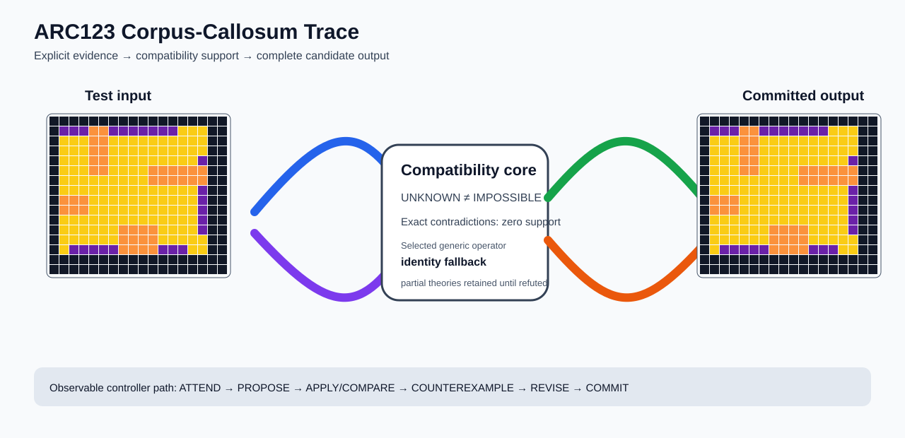

# ARC2 `d93c6891` P0008 Brain Surgery Report

## Outcome: NO — TEST CELLS DO NOT ALL MATCH

- **Compared positions:** 288
- **Mismatched cells:** 48
- **Training compatibility:** `False`
- **Fallback used:** `True`
- **Selected hypothesis:** `fallback_identity_complete_grid`
- **Source commit:** `71f86ff4c5304e452e0659131171f0519b50e21c`
- **Frozen controller commit:** `4bed6c917523bc2baa05eec69f67303805d88dae`

## Live-Agent Boundary

The controller receives only visible training input/output examples and test inputs. It receives no task ID, imported cohort label, GT feature record, GT solver, historical decomposition, or held-out output before committing a complete grid. The expected output appears only in the post-answer V&V section.

## Corpus-Callosum Visualization



- Full explicit event record: [`learning_trace.json`](learning_trace.json)

## Frozen Measurement

This task was evaluated with the controller and operator configuration pinned before the frozen cohort was run. A result in this packet cannot alter that controller configuration.

## Post-Answer V&V

### Test case 1
- **All cells match:** `False`
- **Mismatched cells:** `48`
- **Prediction:
```json
[[0, 0, 0, 0, 0, 0, 0, 0, 0, 0, 0, 0, 0, 0, 0, 0, 0, 0], [0, 5, 5, 5, 7, 7, 5, 5, 5, 5, 5, 5, 5, 4, 4, 4, 0, 0], [0, 4, 4, 4, 7, 7, 4, 4, 4, 4, 4, 4, 4, 4, 4, 4, 0, 0], [0, 4, 4, 4, 7, 7, 4, 4, 4, 4, 4, 4, 4, 4, 4, 4, 0, 0], [0, 4, 4, 4, 7, 7, 4, 4, 4, 4, 4, 4, 4, 4, 4, 5, 0, 0], [0, 4, 4, 4, 7, 7, 4, 4, 4, 4, 7, 7, 7, 7, 7, 7, 0, 0], [0, 4, 4, 4, 4, 4, 4, 4, 4, 4, 7, 7, 7, 7, 7, 7, 0, 0], [0, 4, 4, 4, 4, 4, 4, 4, 4, 4, 4, 4, 4, 4, 4, 5, 0, 0], [0, 7, 7, 7, 4, 4, 4, 4, 4, 4, 4, 4, 4, 4, 4, 5, 0, 0], [0, 7, 7, 7, 4, 4, 4, 4, 4, 4, 4, 4, 4, 4, 4, 5, 0, 0], [0, 4, 4, 4, 4, 4, 4, 4, 4, 4, 4, 4, 4, 4, 4, 5, 0, 0], [0, 4, 4, 4, 4, 4, 4, 7, 7, 7, 7, 4, 4, 4, 4, 5, 0, 0], [0, 4, 4, 4, 4, 4, 4, 7, 7, 7, 7, 4, 4, 4, 4, 4, 0, 0], [0, 4, 5, 5, 5, 5, 5, 7, 7, 7, 7, 5, 5, 5, 4, 4, 0, 0], [0, 0, 0, 0, 0, 0, 0, 0, 0, 0, 0, 0, 0, 0, 0, 0, 0, 0], [0, 0, 0, 0, 0, 0, 0, 0, 0, 0, 0, 0, 0, 0, 0, 0, 0, 0]]
```
- **Expected output (post-answer only):**
```json
[[0, 0, 0, 0, 0, 0, 0, 0, 0, 0, 0, 0, 0, 0, 0, 0, 0, 0], [0, 4, 4, 4, 5, 5, 4, 4, 4, 4, 4, 4, 4, 4, 4, 4, 0, 0], [0, 4, 4, 4, 5, 5, 4, 4, 4, 4, 4, 4, 4, 4, 4, 4, 0, 0], [0, 4, 4, 4, 5, 5, 4, 4, 4, 4, 4, 4, 4, 4, 4, 4, 0, 0], [0, 4, 4, 4, 5, 5, 4, 4, 4, 4, 4, 4, 4, 4, 4, 4, 0, 0], [0, 4, 4, 4, 5, 5, 4, 4, 4, 4, 7, 7, 7, 5, 5, 5, 0, 0], [0, 4, 4, 4, 4, 4, 4, 4, 4, 4, 7, 7, 7, 5, 5, 5, 0, 0], [0, 4, 4, 4, 4, 4, 4, 4, 4, 4, 4, 4, 4, 4, 4, 4, 0, 0], [0, 7, 7, 7, 4, 4, 4, 4, 4, 4, 4, 4, 4, 4, 4, 4, 0, 0], [0, 7, 7, 7, 4, 4, 4, 4, 4, 4, 4, 4, 4, 4, 4, 4, 0, 0], [0, 4, 4, 4, 4, 4, 4, 4, 4, 4, 4, 4, 4, 4, 4, 4, 0, 0], [0, 4, 4, 4, 4, 4, 4, 7, 7, 7, 7, 4, 4, 4, 4, 4, 0, 0], [0, 4, 4, 4, 4, 4, 4, 5, 5, 5, 5, 4, 4, 4, 4, 4, 0, 0], [0, 4, 4, 4, 4, 4, 4, 5, 5, 5, 5, 4, 4, 4, 4, 4, 0, 0], [0, 0, 0, 0, 0, 0, 0, 0, 0, 0, 0, 0, 0, 0, 0, 0, 0, 0], [0, 0, 0, 0, 0, 0, 0, 0, 0, 0, 0, 0, 0, 0, 0, 0, 0, 0]]
```

## Observable IHL Walkthrough

The record contains explicit actions, predictions, feedback, and revisions; it does not claim or store hidden model reasoning.

### Action totals

- `ADD_CONDITION`: 1
- `APPLY_HYPOTHESIS`: 244
- `ATTEND`: 244
- `BIND_PARAMETER`: 1
- `CHOOSE_NEXT_DEMO`: 244
- `COMMIT`: 1
- `COMPARE`: 244
- `COMPOSE_RULE`: 8
- `EXPLAIN_RESIDUAL`: 8
- `FIND_COUNTEREXAMPLE`: 12
- `PROPOSE`: 1
- `SPECIALIZE`: 136

### Decision milestones

- `0` `PROPOSE` — `{"parent_theory_id":"T0000","rule":{"description_length":1,"name":"identity","operation":"identity","parameters":{},"rule_id":"identity","scope":{"kind":"all","value":null}},"stage":"initial_generic_theories","theory_id":"T0001"}`
- `2` `ATTEND` — `{"reason":"initial_highest_observed_change_and_color_discrimination","selected_demo":0,"selected_region":{"column":4,"row":4},"theory_id":"T0001"}`
- `6` `ATTEND` — `{"reason":"counterexample_requires_visible_conditional_evidence:unseen_demo_selected_for_residual_version_space_discrimination","selected_demo":2,"selected_region":{"column":0,"row":4},"theory_id":"T0001"}`
- `10` `ATTEND` — `{"reason":"counterexample_requires_visible_conditional_evidence:unseen_demo_selected_for_residual_version_space_discrimination","selected_demo":1,"selected_region":{"column":4,"row":4},"theory_id":"T0001"}`
- `16` `SPECIALIZE` — `{"added_rule":{"description_length":4,"name":"row_span_fill(fill_color=7,seed_color=7)","operation":"full_operator","parameters":{"fill_color":7,"operator":"row_span_fill","seed_color":7},"rule_id":"structural-row_span_fill","scope":{"kind":"all","value":null}},"parent_theory_id":"T0001","reason":"unexplained_residual_proposed_generic_structural_rule","theory_id":"T0003"}`
- `17` `SPECIALIZE` — `{"added_rule":{"description_length":4,"name":"row_span_fill(fill_color=5,seed_color=7)","operation":"full_operator","parameters":{"fill_color":5,"operator":"row_span_fill","seed_color":7},"rule_id":"structural-row_span_fill","scope":{"kind":"all","value":null}},"parent_theory_id":"T0001","reason":"unexplained_residual_proposed_generic_structural_rule","theory_id":"T0004"}`
- `18` `SPECIALIZE` — `{"added_rule":{"description_length":4,"name":"row_span_fill(fill_color=7,seed_color=5)","operation":"full_operator","parameters":{"fill_color":7,"operator":"row_span_fill","seed_color":5},"rule_id":"structural-row_span_fill","scope":{"kind":"all","value":null}},"parent_theory_id":"T0001","reason":"unexplained_residual_proposed_generic_structural_rule","theory_id":"T0005"}`
- `19` `SPECIALIZE` — `{"added_rule":{"description_length":4,"name":"row_span_fill(fill_color=5,seed_color=5)","operation":"full_operator","parameters":{"fill_color":5,"operator":"row_span_fill","seed_color":5},"rule_id":"structural-row_span_fill","scope":{"kind":"all","value":null}},"parent_theory_id":"T0001","reason":"unexplained_residual_proposed_generic_structural_rule","theory_id":"T0006"}`
- `20` `SPECIALIZE` — `{"added_rule":{"description_length":4,"name":"line_extend(direction=left,fill_color=7,seed_color=5)","operation":"full_operator","parameters":{"direction":"left","fill_color":7,"operator":"line_extend","seed_color":5},"rule_id":"structural-line_extend","scope":{"kind":"all","value":null}},"parent_theory_id":"T0001","reason":"unexplained_residual_proposed_generic_structural_rule","theory_id":"T0007"}`
- `21` `SPECIALIZE` — `{"added_rule":{"description_length":4,"name":"line_extend(direction=left,fill_color=5,seed_color=5)","operation":"full_operator","parameters":{"direction":"left","fill_color":5,"operator":"line_extend","seed_color":5},"rule_id":"structural-line_extend","scope":{"kind":"all","value":null}},"parent_theory_id":"T0001","reason":"unexplained_residual_proposed_generic_structural_rule","theory_id":"T0008"}`
- `22` `SPECIALIZE` — `{"added_rule":{"description_length":4,"name":"line_extend(direction=left,fill_color=7,seed_color=7)","operation":"full_operator","parameters":{"direction":"left","fill_color":7,"operator":"line_extend","seed_color":7},"rule_id":"structural-line_extend","scope":{"kind":"all","value":null}},"parent_theory_id":"T0001","reason":"unexplained_residual_proposed_generic_structural_rule","theory_id":"T0009"}`
- `23` `SPECIALIZE` — `{"added_rule":{"description_length":4,"name":"line_extend(direction=left,fill_color=5,seed_color=7)","operation":"full_operator","parameters":{"direction":"left","fill_color":5,"operator":"line_extend","seed_color":7},"rule_id":"structural-line_extend","scope":{"kind":"all","value":null}},"parent_theory_id":"T0001","reason":"unexplained_residual_proposed_generic_structural_rule","theory_id":"T0010"}`
- `24` `SPECIALIZE` — `{"added_rule":{"description_length":4,"name":"line_extend(direction=right,fill_color=7,seed_color=7)","operation":"full_operator","parameters":{"direction":"right","fill_color":7,"operator":"line_extend","seed_color":7},"rule_id":"structural-line_extend","scope":{"kind":"all","value":null}},"parent_theory_id":"T0001","reason":"unexplained_residual_proposed_generic_structural_rule","theory_id":"T0011"}`
- `25` `SPECIALIZE` — `{"added_rule":{"description_length":4,"name":"line_extend(direction=right,fill_color=5,seed_color=7)","operation":"full_operator","parameters":{"direction":"right","fill_color":5,"operator":"line_extend","seed_color":7},"rule_id":"structural-line_extend","scope":{"kind":"all","value":null}},"parent_theory_id":"T0001","reason":"unexplained_residual_proposed_generic_structural_rule","theory_id":"T0012"}`
- `26` `SPECIALIZE` — `{"added_rule":{"description_length":4,"name":"line_extend(direction=up,fill_color=7,seed_color=7)","operation":"full_operator","parameters":{"direction":"up","fill_color":7,"operator":"line_extend","seed_color":7},"rule_id":"structural-line_extend","scope":{"kind":"all","value":null}},"parent_theory_id":"T0001","reason":"unexplained_residual_proposed_generic_structural_rule","theory_id":"T0013"}`
- `27` `SPECIALIZE` — `{"added_rule":{"description_length":4,"name":"line_extend(direction=up,fill_color=5,seed_color=7)","operation":"full_operator","parameters":{"direction":"up","fill_color":5,"operator":"line_extend","seed_color":7},"rule_id":"structural-line_extend","scope":{"kind":"all","value":null}},"parent_theory_id":"T0001","reason":"unexplained_residual_proposed_generic_structural_rule","theory_id":"T0014"}`
- `29` `ATTEND` — `{"reason":"initial_highest_observed_change_and_color_discrimination","selected_demo":0,"selected_region":{"column":9,"row":4},"theory_id":"T0002"}`
- `33` `ATTEND` — `{"reason":"initial_highest_observed_change_and_color_discrimination","selected_demo":0,"selected_region":{"column":4,"row":4},"theory_id":"T0003"}`
- `37` `ATTEND` — `{"reason":"initial_highest_observed_change_and_color_discrimination","selected_demo":0,"selected_region":{"column":4,"row":4},"theory_id":"T0004"}`
- `41` `ATTEND` — `{"reason":"initial_highest_observed_change_and_color_discrimination","selected_demo":0,"selected_region":{"column":4,"row":4},"theory_id":"T0005"}`
- `45` `ATTEND` — `{"reason":"initial_highest_observed_change_and_color_discrimination","selected_demo":0,"selected_region":{"column":4,"row":4},"theory_id":"T0006"}`
- `49` `ATTEND` — `{"reason":"initial_highest_observed_change_and_color_discrimination","selected_demo":0,"selected_region":{"column":4,"row":4},"theory_id":"T0007"}`
- `53` `ATTEND` — `{"reason":"initial_highest_observed_change_and_color_discrimination","selected_demo":0,"selected_region":{"column":4,"row":4},"theory_id":"T0008"}`
- `57` `ATTEND` — `{"reason":"initial_highest_observed_change_and_color_discrimination","selected_demo":0,"selected_region":{"column":4,"row":4},"theory_id":"T0009"}`
- `61` `ATTEND` — `{"reason":"initial_highest_observed_change_and_color_discrimination","selected_demo":0,"selected_region":{"column":4,"row":4},"theory_id":"T0010"}`
- `65` `ATTEND` — `{"reason":"initial_highest_observed_change_and_color_discrimination","selected_demo":0,"selected_region":{"column":4,"row":4},"theory_id":"T0011"}`
- `69` `ATTEND` — `{"reason":"initial_highest_observed_change_and_color_discrimination","selected_demo":0,"selected_region":{"column":4,"row":4},"theory_id":"T0012"}`
- `73` `ATTEND` — `{"reason":"initial_highest_observed_change_and_color_discrimination","selected_demo":0,"selected_region":{"column":4,"row":4},"theory_id":"T0013"}`
- `77` `ATTEND` — `{"reason":"counterexample_requires_visible_conditional_evidence:unseen_demo_selected_for_residual_version_space_discrimination","selected_demo":2,"selected_region":{"column":0,"row":4},"theory_id":"T0002"}`
- `81` `ATTEND` — `{"reason":"counterexample_requires_visible_conditional_evidence:unseen_demo_selected_for_residual_version_space_discrimination","selected_demo":2,"selected_region":{"column":0,"row":4},"theory_id":"T0003"}`
- `85` `ATTEND` — `{"reason":"counterexample_requires_visible_conditional_evidence:unseen_demo_selected_for_residual_version_space_discrimination","selected_demo":2,"selected_region":{"column":0,"row":4},"theory_id":"T0004"}`
- `89` `ATTEND` — `{"reason":"counterexample_requires_visible_conditional_evidence:unseen_demo_selected_for_residual_version_space_discrimination","selected_demo":2,"selected_region":{"column":0,"row":4},"theory_id":"T0005"}`
- `93` `ATTEND` — `{"reason":"counterexample_requires_visible_conditional_evidence:unseen_demo_selected_for_residual_version_space_discrimination","selected_demo":2,"selected_region":{"column":0,"row":4},"theory_id":"T0006"}`
- `97` `ATTEND` — `{"reason":"counterexample_requires_visible_conditional_evidence:unseen_demo_selected_for_residual_version_space_discrimination","selected_demo":2,"selected_region":{"column":0,"row":4},"theory_id":"T0007"}`
- `101` `ATTEND` — `{"reason":"counterexample_requires_visible_conditional_evidence:unseen_demo_selected_for_residual_version_space_discrimination","selected_demo":2,"selected_region":{"column":0,"row":4},"theory_id":"T0008"}`
- `105` `ATTEND` — `{"reason":"counterexample_requires_visible_conditional_evidence:unseen_demo_selected_for_residual_version_space_discrimination","selected_demo":2,"selected_region":{"column":0,"row":4},"theory_id":"T0009"}`
- `109` `ATTEND` — `{"reason":"counterexample_requires_visible_conditional_evidence:unseen_demo_selected_for_residual_version_space_discrimination","selected_demo":2,"selected_region":{"column":0,"row":4},"theory_id":"T0010"}`
- `113` `ATTEND` — `{"reason":"counterexample_requires_visible_conditional_evidence:unseen_demo_selected_for_residual_version_space_discrimination","selected_demo":1,"selected_region":{"column":4,"row":4},"theory_id":"T0002"}`
- `117` `ATTEND` — `{"reason":"counterexample_requires_visible_conditional_evidence:unseen_demo_selected_for_residual_version_space_discrimination","selected_demo":2,"selected_region":{"column":2,"row":0},"theory_id":"T0013"}`
- `123` `SPECIALIZE` — `{"added_rule":{"description_length":4,"name":"row_span_fill(fill_color=7,seed_color=7)","operation":"full_operator","parameters":{"fill_color":7,"operator":"row_span_fill","seed_color":7},"rule_id":"structural-row_span_fill","scope":{"kind":"all","value":null}},"parent_theory_id":"T0002","reason":"unexplained_residual_proposed_generic_structural_rule","theory_id":"T0016"}`
- `124` `SPECIALIZE` — `{"added_rule":{"description_length":4,"name":"row_span_fill(fill_color=5,seed_color=7)","operation":"full_operator","parameters":{"fill_color":5,"operator":"row_span_fill","seed_color":7},"rule_id":"structural-row_span_fill","scope":{"kind":"all","value":null}},"parent_theory_id":"T0002","reason":"unexplained_residual_proposed_generic_structural_rule","theory_id":"T0017"}`
- `125` `SPECIALIZE` — `{"added_rule":{"description_length":4,"name":"row_span_fill(fill_color=7,seed_color=5)","operation":"full_operator","parameters":{"fill_color":7,"operator":"row_span_fill","seed_color":5},"rule_id":"structural-row_span_fill","scope":{"kind":"all","value":null}},"parent_theory_id":"T0002","reason":"unexplained_residual_proposed_generic_structural_rule","theory_id":"T0018"}`
- `126` `SPECIALIZE` — `{"added_rule":{"description_length":4,"name":"row_span_fill(fill_color=5,seed_color=5)","operation":"full_operator","parameters":{"fill_color":5,"operator":"row_span_fill","seed_color":5},"rule_id":"structural-row_span_fill","scope":{"kind":"all","value":null}},"parent_theory_id":"T0002","reason":"unexplained_residual_proposed_generic_structural_rule","theory_id":"T0019"}`
- `127` `SPECIALIZE` — `{"added_rule":{"description_length":4,"name":"line_extend(direction=left,fill_color=7,seed_color=5)","operation":"full_operator","parameters":{"direction":"left","fill_color":7,"operator":"line_extend","seed_color":5},"rule_id":"structural-line_extend","scope":{"kind":"all","value":null}},"parent_theory_id":"T0002","reason":"unexplained_residual_proposed_generic_structural_rule","theory_id":"T0020"}`
- `128` `SPECIALIZE` — `{"added_rule":{"description_length":4,"name":"line_extend(direction=left,fill_color=5,seed_color=5)","operation":"full_operator","parameters":{"direction":"left","fill_color":5,"operator":"line_extend","seed_color":5},"rule_id":"structural-line_extend","scope":{"kind":"all","value":null}},"parent_theory_id":"T0002","reason":"unexplained_residual_proposed_generic_structural_rule","theory_id":"T0021"}`
- `129` `SPECIALIZE` — `{"added_rule":{"description_length":4,"name":"line_extend(direction=left,fill_color=7,seed_color=7)","operation":"full_operator","parameters":{"direction":"left","fill_color":7,"operator":"line_extend","seed_color":7},"rule_id":"structural-line_extend","scope":{"kind":"all","value":null}},"parent_theory_id":"T0002","reason":"unexplained_residual_proposed_generic_structural_rule","theory_id":"T0022"}`
- `130` `SPECIALIZE` — `{"added_rule":{"description_length":4,"name":"line_extend(direction=left,fill_color=5,seed_color=7)","operation":"full_operator","parameters":{"direction":"left","fill_color":5,"operator":"line_extend","seed_color":7},"rule_id":"structural-line_extend","scope":{"kind":"all","value":null}},"parent_theory_id":"T0002","reason":"unexplained_residual_proposed_generic_structural_rule","theory_id":"T0023"}`
- `131` `SPECIALIZE` — `{"added_rule":{"description_length":4,"name":"line_extend(direction=right,fill_color=7,seed_color=7)","operation":"full_operator","parameters":{"direction":"right","fill_color":7,"operator":"line_extend","seed_color":7},"rule_id":"structural-line_extend","scope":{"kind":"all","value":null}},"parent_theory_id":"T0002","reason":"unexplained_residual_proposed_generic_structural_rule","theory_id":"T0024"}`
- `132` `SPECIALIZE` — `{"added_rule":{"description_length":4,"name":"line_extend(direction=right,fill_color=5,seed_color=7)","operation":"full_operator","parameters":{"direction":"right","fill_color":5,"operator":"line_extend","seed_color":7},"rule_id":"structural-line_extend","scope":{"kind":"all","value":null}},"parent_theory_id":"T0002","reason":"unexplained_residual_proposed_generic_structural_rule","theory_id":"T0025"}`
- `133` `SPECIALIZE` — `{"added_rule":{"description_length":4,"name":"line_extend(direction=up,fill_color=7,seed_color=7)","operation":"full_operator","parameters":{"direction":"up","fill_color":7,"operator":"line_extend","seed_color":7},"rule_id":"structural-line_extend","scope":{"kind":"all","value":null}},"parent_theory_id":"T0002","reason":"unexplained_residual_proposed_generic_structural_rule","theory_id":"T0026"}`
- `134` `SPECIALIZE` — `{"added_rule":{"description_length":4,"name":"line_extend(direction=up,fill_color=5,seed_color=7)","operation":"full_operator","parameters":{"direction":"up","fill_color":5,"operator":"line_extend","seed_color":7},"rule_id":"structural-line_extend","scope":{"kind":"all","value":null}},"parent_theory_id":"T0002","reason":"unexplained_residual_proposed_generic_structural_rule","theory_id":"T0027"}`
- `136` `ATTEND` — `{"reason":"initial_highest_observed_change_and_color_discrimination","selected_demo":0,"selected_region":{"column":6,"row":10},"theory_id":"T0015"}`
- `140` `ATTEND` — `{"reason":"initial_highest_observed_change_and_color_discrimination","selected_demo":0,"selected_region":{"column":4,"row":4},"theory_id":"T0016"}`
- `144` `ATTEND` — `{"reason":"initial_highest_observed_change_and_color_discrimination","selected_demo":0,"selected_region":{"column":4,"row":4},"theory_id":"T0017"}`
- `148` `ATTEND` — `{"reason":"initial_highest_observed_change_and_color_discrimination","selected_demo":0,"selected_region":{"column":4,"row":4},"theory_id":"T0018"}`
- `152` `ATTEND` — `{"reason":"initial_highest_observed_change_and_color_discrimination","selected_demo":0,"selected_region":{"column":4,"row":4},"theory_id":"T0019"}`
- `156` `ATTEND` — `{"reason":"initial_highest_observed_change_and_color_discrimination","selected_demo":0,"selected_region":{"column":4,"row":4},"theory_id":"T0020"}`
- `160` `ATTEND` — `{"reason":"initial_highest_observed_change_and_color_discrimination","selected_demo":0,"selected_region":{"column":4,"row":4},"theory_id":"T0021"}`
- `164` `ATTEND` — `{"reason":"initial_highest_observed_change_and_color_discrimination","selected_demo":0,"selected_region":{"column":4,"row":4},"theory_id":"T0022"}`
- `168` `ATTEND` — `{"reason":"initial_highest_observed_change_and_color_discrimination","selected_demo":0,"selected_region":{"column":4,"row":4},"theory_id":"T0023"}`
- `172` `ATTEND` — `{"reason":"initial_highest_observed_change_and_color_discrimination","selected_demo":0,"selected_region":{"column":4,"row":4},"theory_id":"T0024"}`
- `176` `ATTEND` — `{"reason":"initial_highest_observed_change_and_color_discrimination","selected_demo":0,"selected_region":{"column":4,"row":4},"theory_id":"T0025"}`
- `180` `ATTEND` — `{"reason":"initial_highest_observed_change_and_color_discrimination","selected_demo":0,"selected_region":{"column":4,"row":4},"theory_id":"T0026"}`
- `184` `ATTEND` — `{"reason":"counterexample_requires_visible_conditional_evidence:unseen_demo_selected_for_residual_version_space_discrimination","selected_demo":2,"selected_region":{"column":0,"row":4},"theory_id":"T0015"}`
- `188` `ATTEND` — `{"reason":"counterexample_requires_visible_conditional_evidence:unseen_demo_selected_for_residual_version_space_discrimination","selected_demo":1,"selected_region":{"region":"whole_demo"},"theory_id":"T0015"}`
- `192` `SPECIALIZE` — `{"added_rule":{"description_length":4,"name":"row_span_fill(fill_color=7,seed_color=7)","operation":"full_operator","parameters":{"fill_color":7,"operator":"row_span_fill","seed_color":7},"rule_id":"structural-row_span_fill","scope":{"kind":"all","value":null}},"parent_theory_id":"T0015","reason":"unexplained_residual_proposed_generic_structural_rule","theory_id":"T0028"}`
- `193` `SPECIALIZE` — `{"added_rule":{"description_length":4,"name":"row_span_fill(fill_color=5,seed_color=7)","operation":"full_operator","parameters":{"fill_color":5,"operator":"row_span_fill","seed_color":7},"rule_id":"structural-row_span_fill","scope":{"kind":"all","value":null}},"parent_theory_id":"T0015","reason":"unexplained_residual_proposed_generic_structural_rule","theory_id":"T0029"}`
- `194` `SPECIALIZE` — `{"added_rule":{"description_length":4,"name":"row_span_fill(fill_color=7,seed_color=5)","operation":"full_operator","parameters":{"fill_color":7,"operator":"row_span_fill","seed_color":5},"rule_id":"structural-row_span_fill","scope":{"kind":"all","value":null}},"parent_theory_id":"T0015","reason":"unexplained_residual_proposed_generic_structural_rule","theory_id":"T0030"}`
- `195` `SPECIALIZE` — `{"added_rule":{"description_length":4,"name":"row_span_fill(fill_color=5,seed_color=5)","operation":"full_operator","parameters":{"fill_color":5,"operator":"row_span_fill","seed_color":5},"rule_id":"structural-row_span_fill","scope":{"kind":"all","value":null}},"parent_theory_id":"T0015","reason":"unexplained_residual_proposed_generic_structural_rule","theory_id":"T0031"}`
- `196` `SPECIALIZE` — `{"added_rule":{"description_length":4,"name":"line_extend(direction=left,fill_color=7,seed_color=5)","operation":"full_operator","parameters":{"direction":"left","fill_color":7,"operator":"line_extend","seed_color":5},"rule_id":"structural-line_extend","scope":{"kind":"all","value":null}},"parent_theory_id":"T0015","reason":"unexplained_residual_proposed_generic_structural_rule","theory_id":"T0032"}`
- `197` `SPECIALIZE` — `{"added_rule":{"description_length":4,"name":"line_extend(direction=left,fill_color=5,seed_color=5)","operation":"full_operator","parameters":{"direction":"left","fill_color":5,"operator":"line_extend","seed_color":5},"rule_id":"structural-line_extend","scope":{"kind":"all","value":null}},"parent_theory_id":"T0015","reason":"unexplained_residual_proposed_generic_structural_rule","theory_id":"T0033"}`
- `198` `SPECIALIZE` — `{"added_rule":{"description_length":4,"name":"line_extend(direction=left,fill_color=7,seed_color=7)","operation":"full_operator","parameters":{"direction":"left","fill_color":7,"operator":"line_extend","seed_color":7},"rule_id":"structural-line_extend","scope":{"kind":"all","value":null}},"parent_theory_id":"T0015","reason":"unexplained_residual_proposed_generic_structural_rule","theory_id":"T0034"}`
- `199` `SPECIALIZE` — `{"added_rule":{"description_length":4,"name":"line_extend(direction=left,fill_color=5,seed_color=7)","operation":"full_operator","parameters":{"direction":"left","fill_color":5,"operator":"line_extend","seed_color":7},"rule_id":"structural-line_extend","scope":{"kind":"all","value":null}},"parent_theory_id":"T0015","reason":"unexplained_residual_proposed_generic_structural_rule","theory_id":"T0035"}`
- `200` `SPECIALIZE` — `{"added_rule":{"description_length":4,"name":"line_extend(direction=right,fill_color=7,seed_color=7)","operation":"full_operator","parameters":{"direction":"right","fill_color":7,"operator":"line_extend","seed_color":7},"rule_id":"structural-line_extend","scope":{"kind":"all","value":null}},"parent_theory_id":"T0015","reason":"unexplained_residual_proposed_generic_structural_rule","theory_id":"T0036"}`
- `201` `SPECIALIZE` — `{"added_rule":{"description_length":4,"name":"line_extend(direction=right,fill_color=5,seed_color=7)","operation":"full_operator","parameters":{"direction":"right","fill_color":5,"operator":"line_extend","seed_color":7},"rule_id":"structural-line_extend","scope":{"kind":"all","value":null}},"parent_theory_id":"T0015","reason":"unexplained_residual_proposed_generic_structural_rule","theory_id":"T0037"}`
- `202` `SPECIALIZE` — `{"added_rule":{"description_length":4,"name":"line_extend(direction=up,fill_color=7,seed_color=7)","operation":"full_operator","parameters":{"direction":"up","fill_color":7,"operator":"line_extend","seed_color":7},"rule_id":"structural-line_extend","scope":{"kind":"all","value":null}},"parent_theory_id":"T0015","reason":"unexplained_residual_proposed_generic_structural_rule","theory_id":"T0038"}`
- `203` `SPECIALIZE` — `{"added_rule":{"description_length":4,"name":"line_extend(direction=up,fill_color=5,seed_color=7)","operation":"full_operator","parameters":{"direction":"up","fill_color":5,"operator":"line_extend","seed_color":7},"rule_id":"structural-line_extend","scope":{"kind":"all","value":null}},"parent_theory_id":"T0015","reason":"unexplained_residual_proposed_generic_structural_rule","theory_id":"T0039"}`
- `205` `ATTEND` — `{"reason":"initial_highest_observed_change_and_color_discrimination","selected_demo":0,"selected_region":{"column":4,"row":4},"theory_id":"T0028"}`
- `209` `ATTEND` — `{"reason":"initial_highest_observed_change_and_color_discrimination","selected_demo":0,"selected_region":{"column":4,"row":4},"theory_id":"T0029"}`
- `213` `ATTEND` — `{"reason":"initial_highest_observed_change_and_color_discrimination","selected_demo":0,"selected_region":{"column":4,"row":4},"theory_id":"T0030"}`
- `217` `ATTEND` — `{"reason":"initial_highest_observed_change_and_color_discrimination","selected_demo":0,"selected_region":{"column":4,"row":4},"theory_id":"T0031"}`
- `221` `ATTEND` — `{"reason":"initial_highest_observed_change_and_color_discrimination","selected_demo":0,"selected_region":{"column":4,"row":4},"theory_id":"T0032"}`
- `225` `ATTEND` — `{"reason":"initial_highest_observed_change_and_color_discrimination","selected_demo":0,"selected_region":{"column":4,"row":4},"theory_id":"T0033"}`
- `229` `ATTEND` — `{"reason":"initial_highest_observed_change_and_color_discrimination","selected_demo":0,"selected_region":{"column":4,"row":4},"theory_id":"T0034"}`
- `233` `ATTEND` — `{"reason":"initial_highest_observed_change_and_color_discrimination","selected_demo":0,"selected_region":{"column":4,"row":4},"theory_id":"T0035"}`
- `237` `ATTEND` — `{"reason":"initial_highest_observed_change_and_color_discrimination","selected_demo":0,"selected_region":{"column":4,"row":4},"theory_id":"T0036"}`
- `241` `ATTEND` — `{"reason":"initial_highest_observed_change_and_color_discrimination","selected_demo":0,"selected_region":{"column":4,"row":4},"theory_id":"T0037"}`
- `245` `ATTEND` — `{"reason":"initial_highest_observed_change_and_color_discrimination","selected_demo":0,"selected_region":{"column":4,"row":4},"theory_id":"T0038"}`
- `249` `ATTEND` — `{"reason":"initial_highest_observed_change_and_color_discrimination","selected_demo":0,"selected_region":{"column":4,"row":4},"theory_id":"T0039"}`
- `253` `ATTEND` — `{"reason":"counterexample_requires_visible_conditional_evidence:unseen_demo_selected_for_residual_version_space_discrimination","selected_demo":2,"selected_region":{"column":0,"row":4},"theory_id":"T0028"}`
- `257` `ATTEND` — `{"reason":"counterexample_requires_visible_conditional_evidence:unseen_demo_selected_for_residual_version_space_discrimination","selected_demo":2,"selected_region":{"column":0,"row":4},"theory_id":"T0029"}`
- `261` `ATTEND` — `{"reason":"counterexample_requires_visible_conditional_evidence:unseen_demo_selected_for_residual_version_space_discrimination","selected_demo":2,"selected_region":{"column":0,"row":4},"theory_id":"T0030"}`
- `265` `ATTEND` — `{"reason":"counterexample_requires_visible_conditional_evidence:unseen_demo_selected_for_residual_version_space_discrimination","selected_demo":2,"selected_region":{"column":0,"row":4},"theory_id":"T0031"}`
- `269` `ATTEND` — `{"reason":"counterexample_requires_visible_conditional_evidence:unseen_demo_selected_for_residual_version_space_discrimination","selected_demo":2,"selected_region":{"column":0,"row":4},"theory_id":"T0032"}`
- `273` `ATTEND` — `{"reason":"counterexample_requires_visible_conditional_evidence:unseen_demo_selected_for_residual_version_space_discrimination","selected_demo":2,"selected_region":{"column":0,"row":4},"theory_id":"T0033"}`
- `277` `ATTEND` — `{"reason":"counterexample_requires_visible_conditional_evidence:unseen_demo_selected_for_residual_version_space_discrimination","selected_demo":2,"selected_region":{"column":0,"row":4},"theory_id":"T0034"}`
- `281` `ATTEND` — `{"reason":"counterexample_requires_visible_conditional_evidence:unseen_demo_selected_for_residual_version_space_discrimination","selected_demo":2,"selected_region":{"column":0,"row":4},"theory_id":"T0035"}`
- `285` `ATTEND` — `{"reason":"counterexample_requires_visible_conditional_evidence:unseen_demo_selected_for_residual_version_space_discrimination","selected_demo":2,"selected_region":{"column":2,"row":0},"theory_id":"T0038"}`
- `289` `ATTEND` — `{"reason":"counterexample_requires_visible_conditional_evidence:unseen_demo_selected_for_residual_version_space_discrimination","selected_demo":2,"selected_region":{"column":2,"row":0},"theory_id":"T0039"}`
- `293` `ATTEND` — `{"reason":"counterexample_requires_visible_conditional_evidence:unseen_demo_selected_for_residual_version_space_discrimination","selected_demo":1,"selected_region":{"column":4,"row":4},"theory_id":"T0028"}`
- `297` `ATTEND` — `{"reason":"counterexample_requires_visible_conditional_evidence:unseen_demo_selected_for_residual_version_space_discrimination","selected_demo":1,"selected_region":{"column":4,"row":4},"theory_id":"T0029"}`
- `301` `ATTEND` — `{"reason":"counterexample_requires_visible_conditional_evidence:unseen_demo_selected_for_residual_version_space_discrimination","selected_demo":1,"selected_region":{"column":4,"row":4},"theory_id":"T0030"}`
- `305` `ATTEND` — `{"reason":"counterexample_requires_visible_conditional_evidence:unseen_demo_selected_for_residual_version_space_discrimination","selected_demo":1,"selected_region":{"column":4,"row":4},"theory_id":"T0031"}`
- `309` `ATTEND` — `{"reason":"counterexample_requires_visible_conditional_evidence:unseen_demo_selected_for_residual_version_space_discrimination","selected_demo":1,"selected_region":{"column":4,"row":4},"theory_id":"T0032"}`
- `313` `ATTEND` — `{"reason":"counterexample_requires_visible_conditional_evidence:unseen_demo_selected_for_residual_version_space_discrimination","selected_demo":1,"selected_region":{"column":4,"row":4},"theory_id":"T0033"}`
- `317` `ATTEND` — `{"reason":"counterexample_requires_visible_conditional_evidence:unseen_demo_selected_for_residual_version_space_discrimination","selected_demo":1,"selected_region":{"column":0,"row":4},"theory_id":"T0034"}`
- `321` `ATTEND` — `{"reason":"counterexample_requires_visible_conditional_evidence:unseen_demo_selected_for_residual_version_space_discrimination","selected_demo":1,"selected_region":{"column":0,"row":4},"theory_id":"T0035"}`
- `327` `SPECIALIZE` — `{"added_rule":{"description_length":4,"name":"row_span_fill(fill_color=5,seed_color=7)","operation":"full_operator","parameters":{"fill_color":5,"operator":"row_span_fill","seed_color":7},"rule_id":"structural-row_span_fill","scope":{"kind":"all","value":null}},"parent_theory_id":"T0028","reason":"unexplained_residual_proposed_generic_structural_rule","theory_id":"T0041"}`
- `328` `SPECIALIZE` — `{"added_rule":{"description_length":4,"name":"row_span_fill(fill_color=7,seed_color=5)","operation":"full_operator","parameters":{"fill_color":7,"operator":"row_span_fill","seed_color":5},"rule_id":"structural-row_span_fill","scope":{"kind":"all","value":null}},"parent_theory_id":"T0028","reason":"unexplained_residual_proposed_generic_structural_rule","theory_id":"T0042"}`
- `329` `SPECIALIZE` — `{"added_rule":{"description_length":4,"name":"row_span_fill(fill_color=5,seed_color=5)","operation":"full_operator","parameters":{"fill_color":5,"operator":"row_span_fill","seed_color":5},"rule_id":"structural-row_span_fill","scope":{"kind":"all","value":null}},"parent_theory_id":"T0028","reason":"unexplained_residual_proposed_generic_structural_rule","theory_id":"T0043"}`
- `330` `SPECIALIZE` — `{"added_rule":{"description_length":4,"name":"line_extend(direction=left,fill_color=7,seed_color=5)","operation":"full_operator","parameters":{"direction":"left","fill_color":7,"operator":"line_extend","seed_color":5},"rule_id":"structural-line_extend","scope":{"kind":"all","value":null}},"parent_theory_id":"T0028","reason":"unexplained_residual_proposed_generic_structural_rule","theory_id":"T0044"}`
- `331` `SPECIALIZE` — `{"added_rule":{"description_length":4,"name":"line_extend(direction=left,fill_color=5,seed_color=5)","operation":"full_operator","parameters":{"direction":"left","fill_color":5,"operator":"line_extend","seed_color":5},"rule_id":"structural-line_extend","scope":{"kind":"all","value":null}},"parent_theory_id":"T0028","reason":"unexplained_residual_proposed_generic_structural_rule","theory_id":"T0045"}`
- `332` `SPECIALIZE` — `{"added_rule":{"description_length":4,"name":"line_extend(direction=left,fill_color=7,seed_color=7)","operation":"full_operator","parameters":{"direction":"left","fill_color":7,"operator":"line_extend","seed_color":7},"rule_id":"structural-line_extend","scope":{"kind":"all","value":null}},"parent_theory_id":"T0028","reason":"unexplained_residual_proposed_generic_structural_rule","theory_id":"T0046"}`
- `333` `SPECIALIZE` — `{"added_rule":{"description_length":4,"name":"line_extend(direction=left,fill_color=5,seed_color=7)","operation":"full_operator","parameters":{"direction":"left","fill_color":5,"operator":"line_extend","seed_color":7},"rule_id":"structural-line_extend","scope":{"kind":"all","value":null}},"parent_theory_id":"T0028","reason":"unexplained_residual_proposed_generic_structural_rule","theory_id":"T0047"}`
- `334` `SPECIALIZE` — `{"added_rule":{"description_length":4,"name":"line_extend(direction=right,fill_color=7,seed_color=7)","operation":"full_operator","parameters":{"direction":"right","fill_color":7,"operator":"line_extend","seed_color":7},"rule_id":"structural-line_extend","scope":{"kind":"all","value":null}},"parent_theory_id":"T0028","reason":"unexplained_residual_proposed_generic_structural_rule","theory_id":"T0048"}`
- `335` `SPECIALIZE` — `{"added_rule":{"description_length":4,"name":"line_extend(direction=right,fill_color=5,seed_color=7)","operation":"full_operator","parameters":{"direction":"right","fill_color":5,"operator":"line_extend","seed_color":7},"rule_id":"structural-line_extend","scope":{"kind":"all","value":null}},"parent_theory_id":"T0028","reason":"unexplained_residual_proposed_generic_structural_rule","theory_id":"T0049"}`
- `336` `SPECIALIZE` — `{"added_rule":{"description_length":4,"name":"line_extend(direction=up,fill_color=7,seed_color=7)","operation":"full_operator","parameters":{"direction":"up","fill_color":7,"operator":"line_extend","seed_color":7},"rule_id":"structural-line_extend","scope":{"kind":"all","value":null}},"parent_theory_id":"T0028","reason":"unexplained_residual_proposed_generic_structural_rule","theory_id":"T0050"}`
- `337` `SPECIALIZE` — `{"added_rule":{"description_length":4,"name":"line_extend(direction=up,fill_color=5,seed_color=7)","operation":"full_operator","parameters":{"direction":"up","fill_color":5,"operator":"line_extend","seed_color":7},"rule_id":"structural-line_extend","scope":{"kind":"all","value":null}},"parent_theory_id":"T0028","reason":"unexplained_residual_proposed_generic_structural_rule","theory_id":"T0051"}`
- `339` `ATTEND` — `{"reason":"initial_highest_observed_change_and_color_discrimination","selected_demo":0,"selected_region":{"column":4,"row":4},"theory_id":"T0040"}`
- `343` `ATTEND` — `{"reason":"initial_highest_observed_change_and_color_discrimination","selected_demo":0,"selected_region":{"column":4,"row":4},"theory_id":"T0041"}`
- `347` `ATTEND` — `{"reason":"initial_highest_observed_change_and_color_discrimination","selected_demo":0,"selected_region":{"column":4,"row":4},"theory_id":"T0042"}`
- `351` `ATTEND` — `{"reason":"initial_highest_observed_change_and_color_discrimination","selected_demo":0,"selected_region":{"column":4,"row":4},"theory_id":"T0043"}`
- `355` `ATTEND` — `{"reason":"initial_highest_observed_change_and_color_discrimination","selected_demo":0,"selected_region":{"column":4,"row":4},"theory_id":"T0044"}`
- `359` `ATTEND` — `{"reason":"initial_highest_observed_change_and_color_discrimination","selected_demo":0,"selected_region":{"column":4,"row":4},"theory_id":"T0045"}`
- `363` `ATTEND` — `{"reason":"initial_highest_observed_change_and_color_discrimination","selected_demo":0,"selected_region":{"column":4,"row":4},"theory_id":"T0046"}`
- `367` `ATTEND` — `{"reason":"initial_highest_observed_change_and_color_discrimination","selected_demo":0,"selected_region":{"column":4,"row":4},"theory_id":"T0047"}`
- `371` `ATTEND` — `{"reason":"initial_highest_observed_change_and_color_discrimination","selected_demo":0,"selected_region":{"column":4,"row":4},"theory_id":"T0048"}`
- `375` `ATTEND` — `{"reason":"initial_highest_observed_change_and_color_discrimination","selected_demo":0,"selected_region":{"column":4,"row":4},"theory_id":"T0049"}`
- `379` `ATTEND` — `{"reason":"initial_highest_observed_change_and_color_discrimination","selected_demo":0,"selected_region":{"column":4,"row":4},"theory_id":"T0050"}`
- `383` `ATTEND` — `{"reason":"initial_highest_observed_change_and_color_discrimination","selected_demo":0,"selected_region":{"column":4,"row":4},"theory_id":"T0051"}`
- `387` `ATTEND` — `{"reason":"counterexample_requires_visible_conditional_evidence:unseen_demo_selected_for_residual_version_space_discrimination","selected_demo":2,"selected_region":{"column":0,"row":4},"theory_id":"T0040"}`
- `391` `ATTEND` — `{"reason":"counterexample_requires_visible_conditional_evidence:unseen_demo_selected_for_residual_version_space_discrimination","selected_demo":2,"selected_region":{"column":0,"row":4},"theory_id":"T0041"}`
- `395` `ATTEND` — `{"reason":"counterexample_requires_visible_conditional_evidence:unseen_demo_selected_for_residual_version_space_discrimination","selected_demo":2,"selected_region":{"column":0,"row":4},"theory_id":"T0042"}`
- `399` `ATTEND` — `{"reason":"counterexample_requires_visible_conditional_evidence:unseen_demo_selected_for_residual_version_space_discrimination","selected_demo":2,"selected_region":{"column":0,"row":4},"theory_id":"T0043"}`
- `403` `ATTEND` — `{"reason":"counterexample_requires_visible_conditional_evidence:unseen_demo_selected_for_residual_version_space_discrimination","selected_demo":2,"selected_region":{"column":0,"row":4},"theory_id":"T0044"}`
- `407` `ATTEND` — `{"reason":"counterexample_requires_visible_conditional_evidence:unseen_demo_selected_for_residual_version_space_discrimination","selected_demo":2,"selected_region":{"column":0,"row":4},"theory_id":"T0045"}`
- `411` `ATTEND` — `{"reason":"counterexample_requires_visible_conditional_evidence:unseen_demo_selected_for_residual_version_space_discrimination","selected_demo":2,"selected_region":{"column":0,"row":4},"theory_id":"T0046"}`
- `415` `ATTEND` — `{"reason":"counterexample_requires_visible_conditional_evidence:unseen_demo_selected_for_residual_version_space_discrimination","selected_demo":2,"selected_region":{"column":0,"row":4},"theory_id":"T0047"}`
- `419` `ATTEND` — `{"reason":"counterexample_requires_visible_conditional_evidence:unseen_demo_selected_for_residual_version_space_discrimination","selected_demo":2,"selected_region":{"column":2,"row":0},"theory_id":"T0050"}`
- `423` `ATTEND` — `{"reason":"counterexample_requires_visible_conditional_evidence:unseen_demo_selected_for_residual_version_space_discrimination","selected_demo":2,"selected_region":{"column":2,"row":0},"theory_id":"T0051"}`
- `427` `ATTEND` — `{"reason":"counterexample_requires_visible_conditional_evidence:unseen_demo_selected_for_residual_version_space_discrimination","selected_demo":1,"selected_region":{"column":4,"row":4},"theory_id":"T0040"}`
- `431` `ATTEND` — `{"reason":"counterexample_requires_visible_conditional_evidence:unseen_demo_selected_for_residual_version_space_discrimination","selected_demo":1,"selected_region":{"column":4,"row":4},"theory_id":"T0041"}`
- `435` `ATTEND` — `{"reason":"counterexample_requires_visible_conditional_evidence:unseen_demo_selected_for_residual_version_space_discrimination","selected_demo":1,"selected_region":{"column":4,"row":4},"theory_id":"T0042"}`
- `439` `ATTEND` — `{"reason":"counterexample_requires_visible_conditional_evidence:unseen_demo_selected_for_residual_version_space_discrimination","selected_demo":1,"selected_region":{"column":4,"row":4},"theory_id":"T0043"}`
- `443` `ATTEND` — `{"reason":"counterexample_requires_visible_conditional_evidence:unseen_demo_selected_for_residual_version_space_discrimination","selected_demo":1,"selected_region":{"column":4,"row":4},"theory_id":"T0044"}`
- `447` `ATTEND` — `{"reason":"counterexample_requires_visible_conditional_evidence:unseen_demo_selected_for_residual_version_space_discrimination","selected_demo":1,"selected_region":{"column":4,"row":4},"theory_id":"T0045"}`
- `451` `ATTEND` — `{"reason":"counterexample_requires_visible_conditional_evidence:unseen_demo_selected_for_residual_version_space_discrimination","selected_demo":1,"selected_region":{"column":0,"row":4},"theory_id":"T0046"}`
- `455` `ATTEND` — `{"reason":"counterexample_requires_visible_conditional_evidence:unseen_demo_selected_for_residual_version_space_discrimination","selected_demo":1,"selected_region":{"column":0,"row":4},"theory_id":"T0047"}`
- `461` `SPECIALIZE` — `{"added_rule":{"description_length":4,"name":"row_span_fill(fill_color=7,seed_color=7)","operation":"full_operator","parameters":{"fill_color":7,"operator":"row_span_fill","seed_color":7},"rule_id":"structural-row_span_fill","scope":{"kind":"all","value":null}},"parent_theory_id":"T0040","reason":"unexplained_residual_proposed_generic_structural_rule","theory_id":"T0053"}`
- `462` `SPECIALIZE` — `{"added_rule":{"description_length":4,"name":"row_span_fill(fill_color=5,seed_color=7)","operation":"full_operator","parameters":{"fill_color":5,"operator":"row_span_fill","seed_color":7},"rule_id":"structural-row_span_fill","scope":{"kind":"all","value":null}},"parent_theory_id":"T0040","reason":"unexplained_residual_proposed_generic_structural_rule","theory_id":"T0054"}`
- `463` `SPECIALIZE` — `{"added_rule":{"description_length":4,"name":"row_span_fill(fill_color=7,seed_color=5)","operation":"full_operator","parameters":{"fill_color":7,"operator":"row_span_fill","seed_color":5},"rule_id":"structural-row_span_fill","scope":{"kind":"all","value":null}},"parent_theory_id":"T0040","reason":"unexplained_residual_proposed_generic_structural_rule","theory_id":"T0055"}`
- `464` `SPECIALIZE` — `{"added_rule":{"description_length":4,"name":"row_span_fill(fill_color=5,seed_color=5)","operation":"full_operator","parameters":{"fill_color":5,"operator":"row_span_fill","seed_color":5},"rule_id":"structural-row_span_fill","scope":{"kind":"all","value":null}},"parent_theory_id":"T0040","reason":"unexplained_residual_proposed_generic_structural_rule","theory_id":"T0056"}`
- `465` `SPECIALIZE` — `{"added_rule":{"description_length":4,"name":"line_extend(direction=left,fill_color=7,seed_color=5)","operation":"full_operator","parameters":{"direction":"left","fill_color":7,"operator":"line_extend","seed_color":5},"rule_id":"structural-line_extend","scope":{"kind":"all","value":null}},"parent_theory_id":"T0040","reason":"unexplained_residual_proposed_generic_structural_rule","theory_id":"T0057"}`
- `466` `SPECIALIZE` — `{"added_rule":{"description_length":4,"name":"line_extend(direction=left,fill_color=5,seed_color=5)","operation":"full_operator","parameters":{"direction":"left","fill_color":5,"operator":"line_extend","seed_color":5},"rule_id":"structural-line_extend","scope":{"kind":"all","value":null}},"parent_theory_id":"T0040","reason":"unexplained_residual_proposed_generic_structural_rule","theory_id":"T0058"}`
- `467` `SPECIALIZE` — `{"added_rule":{"description_length":4,"name":"line_extend(direction=left,fill_color=7,seed_color=7)","operation":"full_operator","parameters":{"direction":"left","fill_color":7,"operator":"line_extend","seed_color":7},"rule_id":"structural-line_extend","scope":{"kind":"all","value":null}},"parent_theory_id":"T0040","reason":"unexplained_residual_proposed_generic_structural_rule","theory_id":"T0059"}`
- `468` `SPECIALIZE` — `{"added_rule":{"description_length":4,"name":"line_extend(direction=left,fill_color=5,seed_color=7)","operation":"full_operator","parameters":{"direction":"left","fill_color":5,"operator":"line_extend","seed_color":7},"rule_id":"structural-line_extend","scope":{"kind":"all","value":null}},"parent_theory_id":"T0040","reason":"unexplained_residual_proposed_generic_structural_rule","theory_id":"T0060"}`
- `469` `SPECIALIZE` — `{"added_rule":{"description_length":4,"name":"line_extend(direction=right,fill_color=7,seed_color=7)","operation":"full_operator","parameters":{"direction":"right","fill_color":7,"operator":"line_extend","seed_color":7},"rule_id":"structural-line_extend","scope":{"kind":"all","value":null}},"parent_theory_id":"T0040","reason":"unexplained_residual_proposed_generic_structural_rule","theory_id":"T0061"}`
- `470` `SPECIALIZE` — `{"added_rule":{"description_length":4,"name":"line_extend(direction=right,fill_color=5,seed_color=7)","operation":"full_operator","parameters":{"direction":"right","fill_color":5,"operator":"line_extend","seed_color":7},"rule_id":"structural-line_extend","scope":{"kind":"all","value":null}},"parent_theory_id":"T0040","reason":"unexplained_residual_proposed_generic_structural_rule","theory_id":"T0062"}`
- `471` `SPECIALIZE` — `{"added_rule":{"description_length":4,"name":"line_extend(direction=up,fill_color=7,seed_color=7)","operation":"full_operator","parameters":{"direction":"up","fill_color":7,"operator":"line_extend","seed_color":7},"rule_id":"structural-line_extend","scope":{"kind":"all","value":null}},"parent_theory_id":"T0040","reason":"unexplained_residual_proposed_generic_structural_rule","theory_id":"T0063"}`
- `472` `SPECIALIZE` — `{"added_rule":{"description_length":4,"name":"line_extend(direction=up,fill_color=5,seed_color=7)","operation":"full_operator","parameters":{"direction":"up","fill_color":5,"operator":"line_extend","seed_color":7},"rule_id":"structural-line_extend","scope":{"kind":"all","value":null}},"parent_theory_id":"T0040","reason":"unexplained_residual_proposed_generic_structural_rule","theory_id":"T0064"}`
- `474` `ATTEND` — `{"reason":"initial_highest_observed_change_and_color_discrimination","selected_demo":0,"selected_region":{"column":9,"row":4},"theory_id":"T0052"}`
- `478` `ATTEND` — `{"reason":"initial_highest_observed_change_and_color_discrimination","selected_demo":0,"selected_region":{"column":4,"row":4},"theory_id":"T0053"}`
- `482` `ATTEND` — `{"reason":"initial_highest_observed_change_and_color_discrimination","selected_demo":0,"selected_region":{"column":4,"row":4},"theory_id":"T0054"}`
- `486` `ATTEND` — `{"reason":"initial_highest_observed_change_and_color_discrimination","selected_demo":0,"selected_region":{"column":4,"row":4},"theory_id":"T0055"}`
- `490` `ATTEND` — `{"reason":"initial_highest_observed_change_and_color_discrimination","selected_demo":0,"selected_region":{"column":4,"row":4},"theory_id":"T0056"}`
- `494` `ATTEND` — `{"reason":"initial_highest_observed_change_and_color_discrimination","selected_demo":0,"selected_region":{"column":4,"row":4},"theory_id":"T0057"}`
- `498` `ATTEND` — `{"reason":"initial_highest_observed_change_and_color_discrimination","selected_demo":0,"selected_region":{"column":4,"row":4},"theory_id":"T0058"}`
- `502` `ATTEND` — `{"reason":"initial_highest_observed_change_and_color_discrimination","selected_demo":0,"selected_region":{"column":4,"row":4},"theory_id":"T0059"}`
- `506` `ATTEND` — `{"reason":"initial_highest_observed_change_and_color_discrimination","selected_demo":0,"selected_region":{"column":4,"row":4},"theory_id":"T0060"}`
- `510` `ATTEND` — `{"reason":"initial_highest_observed_change_and_color_discrimination","selected_demo":0,"selected_region":{"column":4,"row":4},"theory_id":"T0061"}`
- `514` `ATTEND` — `{"reason":"initial_highest_observed_change_and_color_discrimination","selected_demo":0,"selected_region":{"column":4,"row":4},"theory_id":"T0062"}`
- `518` `ATTEND` — `{"reason":"initial_highest_observed_change_and_color_discrimination","selected_demo":0,"selected_region":{"column":4,"row":4},"theory_id":"T0063"}`
- `522` `ATTEND` — `{"reason":"counterexample_requires_visible_conditional_evidence:unseen_demo_selected_for_residual_version_space_discrimination","selected_demo":2,"selected_region":{"column":3,"row":4},"theory_id":"T0052"}`
- `526` `ATTEND` — `{"reason":"counterexample_requires_visible_conditional_evidence:unseen_demo_selected_for_residual_version_space_discrimination","selected_demo":1,"selected_region":{"column":4,"row":4},"theory_id":"T0052"}`
- `530` `ATTEND` — `{"reason":"counterexample_requires_visible_conditional_evidence:unseen_demo_selected_for_residual_version_space_discrimination","selected_demo":2,"selected_region":{"column":0,"row":4},"theory_id":"T0053"}`
- `534` `ATTEND` — `{"reason":"counterexample_requires_visible_conditional_evidence:unseen_demo_selected_for_residual_version_space_discrimination","selected_demo":2,"selected_region":{"column":0,"row":4},"theory_id":"T0054"}`
- `538` `ATTEND` — `{"reason":"counterexample_requires_visible_conditional_evidence:unseen_demo_selected_for_residual_version_space_discrimination","selected_demo":2,"selected_region":{"column":0,"row":4},"theory_id":"T0055"}`
- `542` `ATTEND` — `{"reason":"counterexample_requires_visible_conditional_evidence:unseen_demo_selected_for_residual_version_space_discrimination","selected_demo":2,"selected_region":{"column":0,"row":4},"theory_id":"T0056"}`
- `546` `ATTEND` — `{"reason":"counterexample_requires_visible_conditional_evidence:unseen_demo_selected_for_residual_version_space_discrimination","selected_demo":2,"selected_region":{"column":0,"row":4},"theory_id":"T0057"}`
- `550` `ATTEND` — `{"reason":"counterexample_requires_visible_conditional_evidence:unseen_demo_selected_for_residual_version_space_discrimination","selected_demo":2,"selected_region":{"column":0,"row":4},"theory_id":"T0058"}`
- `556` `SPECIALIZE` — `{"added_rule":{"description_length":4,"name":"row_span_fill(fill_color=7,seed_color=7)","operation":"full_operator","parameters":{"fill_color":7,"operator":"row_span_fill","seed_color":7},"rule_id":"structural-row_span_fill","scope":{"kind":"all","value":null}},"parent_theory_id":"T0052","reason":"unexplained_residual_proposed_generic_structural_rule","theory_id":"T0066"}`
- `557` `SPECIALIZE` — `{"added_rule":{"description_length":4,"name":"row_span_fill(fill_color=5,seed_color=7)","operation":"full_operator","parameters":{"fill_color":5,"operator":"row_span_fill","seed_color":7},"rule_id":"structural-row_span_fill","scope":{"kind":"all","value":null}},"parent_theory_id":"T0052","reason":"unexplained_residual_proposed_generic_structural_rule","theory_id":"T0067"}`
- `558` `SPECIALIZE` — `{"added_rule":{"description_length":4,"name":"row_span_fill(fill_color=7,seed_color=5)","operation":"full_operator","parameters":{"fill_color":7,"operator":"row_span_fill","seed_color":5},"rule_id":"structural-row_span_fill","scope":{"kind":"all","value":null}},"parent_theory_id":"T0052","reason":"unexplained_residual_proposed_generic_structural_rule","theory_id":"T0068"}`
- `559` `SPECIALIZE` — `{"added_rule":{"description_length":4,"name":"row_span_fill(fill_color=5,seed_color=5)","operation":"full_operator","parameters":{"fill_color":5,"operator":"row_span_fill","seed_color":5},"rule_id":"structural-row_span_fill","scope":{"kind":"all","value":null}},"parent_theory_id":"T0052","reason":"unexplained_residual_proposed_generic_structural_rule","theory_id":"T0069"}`
- `560` `SPECIALIZE` — `{"added_rule":{"description_length":4,"name":"line_extend(direction=left,fill_color=7,seed_color=5)","operation":"full_operator","parameters":{"direction":"left","fill_color":7,"operator":"line_extend","seed_color":5},"rule_id":"structural-line_extend","scope":{"kind":"all","value":null}},"parent_theory_id":"T0052","reason":"unexplained_residual_proposed_generic_structural_rule","theory_id":"T0070"}`
- `561` `SPECIALIZE` — `{"added_rule":{"description_length":4,"name":"line_extend(direction=left,fill_color=5,seed_color=5)","operation":"full_operator","parameters":{"direction":"left","fill_color":5,"operator":"line_extend","seed_color":5},"rule_id":"structural-line_extend","scope":{"kind":"all","value":null}},"parent_theory_id":"T0052","reason":"unexplained_residual_proposed_generic_structural_rule","theory_id":"T0071"}`
- `562` `SPECIALIZE` — `{"added_rule":{"description_length":4,"name":"line_extend(direction=left,fill_color=7,seed_color=7)","operation":"full_operator","parameters":{"direction":"left","fill_color":7,"operator":"line_extend","seed_color":7},"rule_id":"structural-line_extend","scope":{"kind":"all","value":null}},"parent_theory_id":"T0052","reason":"unexplained_residual_proposed_generic_structural_rule","theory_id":"T0072"}`
- `563` `SPECIALIZE` — `{"added_rule":{"description_length":4,"name":"line_extend(direction=left,fill_color=5,seed_color=7)","operation":"full_operator","parameters":{"direction":"left","fill_color":5,"operator":"line_extend","seed_color":7},"rule_id":"structural-line_extend","scope":{"kind":"all","value":null}},"parent_theory_id":"T0052","reason":"unexplained_residual_proposed_generic_structural_rule","theory_id":"T0073"}`
- `564` `SPECIALIZE` — `{"added_rule":{"description_length":4,"name":"line_extend(direction=right,fill_color=7,seed_color=7)","operation":"full_operator","parameters":{"direction":"right","fill_color":7,"operator":"line_extend","seed_color":7},"rule_id":"structural-line_extend","scope":{"kind":"all","value":null}},"parent_theory_id":"T0052","reason":"unexplained_residual_proposed_generic_structural_rule","theory_id":"T0074"}`
- `565` `SPECIALIZE` — `{"added_rule":{"description_length":4,"name":"line_extend(direction=right,fill_color=5,seed_color=7)","operation":"full_operator","parameters":{"direction":"right","fill_color":5,"operator":"line_extend","seed_color":7},"rule_id":"structural-line_extend","scope":{"kind":"all","value":null}},"parent_theory_id":"T0052","reason":"unexplained_residual_proposed_generic_structural_rule","theory_id":"T0075"}`
- `566` `SPECIALIZE` — `{"added_rule":{"description_length":4,"name":"line_extend(direction=up,fill_color=7,seed_color=7)","operation":"full_operator","parameters":{"direction":"up","fill_color":7,"operator":"line_extend","seed_color":7},"rule_id":"structural-line_extend","scope":{"kind":"all","value":null}},"parent_theory_id":"T0052","reason":"unexplained_residual_proposed_generic_structural_rule","theory_id":"T0076"}`
- `567` `SPECIALIZE` — `{"added_rule":{"description_length":4,"name":"line_extend(direction=up,fill_color=5,seed_color=7)","operation":"full_operator","parameters":{"direction":"up","fill_color":5,"operator":"line_extend","seed_color":7},"rule_id":"structural-line_extend","scope":{"kind":"all","value":null}},"parent_theory_id":"T0052","reason":"unexplained_residual_proposed_generic_structural_rule","theory_id":"T0077"}`
- `569` `ATTEND` — `{"reason":"initial_highest_observed_change_and_color_discrimination","selected_demo":0,"selected_region":{"column":6,"row":10},"theory_id":"T0065"}`
- `573` `ATTEND` — `{"reason":"initial_highest_observed_change_and_color_discrimination","selected_demo":0,"selected_region":{"column":4,"row":4},"theory_id":"T0066"}`
- `577` `ATTEND` — `{"reason":"initial_highest_observed_change_and_color_discrimination","selected_demo":0,"selected_region":{"column":4,"row":4},"theory_id":"T0067"}`
- `581` `ATTEND` — `{"reason":"initial_highest_observed_change_and_color_discrimination","selected_demo":0,"selected_region":{"column":4,"row":4},"theory_id":"T0068"}`
- `585` `ATTEND` — `{"reason":"initial_highest_observed_change_and_color_discrimination","selected_demo":0,"selected_region":{"column":4,"row":4},"theory_id":"T0069"}`
- `589` `ATTEND` — `{"reason":"initial_highest_observed_change_and_color_discrimination","selected_demo":0,"selected_region":{"column":4,"row":4},"theory_id":"T0070"}`
- `593` `ATTEND` — `{"reason":"initial_highest_observed_change_and_color_discrimination","selected_demo":0,"selected_region":{"column":4,"row":4},"theory_id":"T0071"}`
- `597` `ATTEND` — `{"reason":"initial_highest_observed_change_and_color_discrimination","selected_demo":0,"selected_region":{"column":4,"row":4},"theory_id":"T0072"}`
- `601` `ATTEND` — `{"reason":"initial_highest_observed_change_and_color_discrimination","selected_demo":0,"selected_region":{"column":4,"row":4},"theory_id":"T0073"}`
- `605` `ATTEND` — `{"reason":"initial_highest_observed_change_and_color_discrimination","selected_demo":0,"selected_region":{"column":4,"row":4},"theory_id":"T0074"}`
- `609` `ATTEND` — `{"reason":"initial_highest_observed_change_and_color_discrimination","selected_demo":0,"selected_region":{"column":4,"row":4},"theory_id":"T0075"}`
- `613` `ATTEND` — `{"reason":"initial_highest_observed_change_and_color_discrimination","selected_demo":0,"selected_region":{"column":4,"row":4},"theory_id":"T0076"}`
- `617` `ATTEND` — `{"reason":"counterexample_requires_visible_conditional_evidence:unseen_demo_selected_for_residual_version_space_discrimination","selected_demo":2,"selected_region":{"column":3,"row":5},"theory_id":"T0065"}`
- `621` `ATTEND` — `{"reason":"counterexample_requires_visible_conditional_evidence:unseen_demo_selected_for_residual_version_space_discrimination","selected_demo":1,"selected_region":{"region":"whole_demo"},"theory_id":"T0065"}`
- `625` `SPECIALIZE` — `{"added_rule":{"description_length":4,"name":"row_span_fill(fill_color=7,seed_color=7)","operation":"full_operator","parameters":{"fill_color":7,"operator":"row_span_fill","seed_color":7},"rule_id":"structural-row_span_fill","scope":{"kind":"all","value":null}},"parent_theory_id":"T0065","reason":"unexplained_residual_proposed_generic_structural_rule","theory_id":"T0078"}`
- `626` `SPECIALIZE` — `{"added_rule":{"description_length":4,"name":"row_span_fill(fill_color=5,seed_color=7)","operation":"full_operator","parameters":{"fill_color":5,"operator":"row_span_fill","seed_color":7},"rule_id":"structural-row_span_fill","scope":{"kind":"all","value":null}},"parent_theory_id":"T0065","reason":"unexplained_residual_proposed_generic_structural_rule","theory_id":"T0079"}`
- `627` `SPECIALIZE` — `{"added_rule":{"description_length":4,"name":"row_span_fill(fill_color=7,seed_color=5)","operation":"full_operator","parameters":{"fill_color":7,"operator":"row_span_fill","seed_color":5},"rule_id":"structural-row_span_fill","scope":{"kind":"all","value":null}},"parent_theory_id":"T0065","reason":"unexplained_residual_proposed_generic_structural_rule","theory_id":"T0080"}`
- `628` `SPECIALIZE` — `{"added_rule":{"description_length":4,"name":"row_span_fill(fill_color=5,seed_color=5)","operation":"full_operator","parameters":{"fill_color":5,"operator":"row_span_fill","seed_color":5},"rule_id":"structural-row_span_fill","scope":{"kind":"all","value":null}},"parent_theory_id":"T0065","reason":"unexplained_residual_proposed_generic_structural_rule","theory_id":"T0081"}`
- `629` `SPECIALIZE` — `{"added_rule":{"description_length":4,"name":"line_extend(direction=left,fill_color=7,seed_color=5)","operation":"full_operator","parameters":{"direction":"left","fill_color":7,"operator":"line_extend","seed_color":5},"rule_id":"structural-line_extend","scope":{"kind":"all","value":null}},"parent_theory_id":"T0065","reason":"unexplained_residual_proposed_generic_structural_rule","theory_id":"T0082"}`
- `630` `SPECIALIZE` — `{"added_rule":{"description_length":4,"name":"line_extend(direction=left,fill_color=5,seed_color=5)","operation":"full_operator","parameters":{"direction":"left","fill_color":5,"operator":"line_extend","seed_color":5},"rule_id":"structural-line_extend","scope":{"kind":"all","value":null}},"parent_theory_id":"T0065","reason":"unexplained_residual_proposed_generic_structural_rule","theory_id":"T0083"}`
- `631` `SPECIALIZE` — `{"added_rule":{"description_length":4,"name":"line_extend(direction=left,fill_color=7,seed_color=7)","operation":"full_operator","parameters":{"direction":"left","fill_color":7,"operator":"line_extend","seed_color":7},"rule_id":"structural-line_extend","scope":{"kind":"all","value":null}},"parent_theory_id":"T0065","reason":"unexplained_residual_proposed_generic_structural_rule","theory_id":"T0084"}`
- `632` `SPECIALIZE` — `{"added_rule":{"description_length":4,"name":"line_extend(direction=left,fill_color=5,seed_color=7)","operation":"full_operator","parameters":{"direction":"left","fill_color":5,"operator":"line_extend","seed_color":7},"rule_id":"structural-line_extend","scope":{"kind":"all","value":null}},"parent_theory_id":"T0065","reason":"unexplained_residual_proposed_generic_structural_rule","theory_id":"T0085"}`
- `633` `SPECIALIZE` — `{"added_rule":{"description_length":4,"name":"line_extend(direction=right,fill_color=7,seed_color=7)","operation":"full_operator","parameters":{"direction":"right","fill_color":7,"operator":"line_extend","seed_color":7},"rule_id":"structural-line_extend","scope":{"kind":"all","value":null}},"parent_theory_id":"T0065","reason":"unexplained_residual_proposed_generic_structural_rule","theory_id":"T0086"}`
- `634` `SPECIALIZE` — `{"added_rule":{"description_length":4,"name":"line_extend(direction=right,fill_color=5,seed_color=7)","operation":"full_operator","parameters":{"direction":"right","fill_color":5,"operator":"line_extend","seed_color":7},"rule_id":"structural-line_extend","scope":{"kind":"all","value":null}},"parent_theory_id":"T0065","reason":"unexplained_residual_proposed_generic_structural_rule","theory_id":"T0087"}`
- `635` `SPECIALIZE` — `{"added_rule":{"description_length":4,"name":"line_extend(direction=up,fill_color=7,seed_color=7)","operation":"full_operator","parameters":{"direction":"up","fill_color":7,"operator":"line_extend","seed_color":7},"rule_id":"structural-line_extend","scope":{"kind":"all","value":null}},"parent_theory_id":"T0065","reason":"unexplained_residual_proposed_generic_structural_rule","theory_id":"T0088"}`
- `636` `SPECIALIZE` — `{"added_rule":{"description_length":4,"name":"line_extend(direction=up,fill_color=5,seed_color=7)","operation":"full_operator","parameters":{"direction":"up","fill_color":5,"operator":"line_extend","seed_color":7},"rule_id":"structural-line_extend","scope":{"kind":"all","value":null}},"parent_theory_id":"T0065","reason":"unexplained_residual_proposed_generic_structural_rule","theory_id":"T0089"}`
- `638` `ATTEND` — `{"reason":"initial_highest_observed_change_and_color_discrimination","selected_demo":0,"selected_region":{"column":4,"row":4},"theory_id":"T0078"}`
- `642` `ATTEND` — `{"reason":"initial_highest_observed_change_and_color_discrimination","selected_demo":0,"selected_region":{"column":4,"row":4},"theory_id":"T0079"}`
- `646` `ATTEND` — `{"reason":"initial_highest_observed_change_and_color_discrimination","selected_demo":0,"selected_region":{"column":4,"row":4},"theory_id":"T0080"}`
- `650` `ATTEND` — `{"reason":"initial_highest_observed_change_and_color_discrimination","selected_demo":0,"selected_region":{"column":4,"row":4},"theory_id":"T0081"}`
- `654` `ATTEND` — `{"reason":"initial_highest_observed_change_and_color_discrimination","selected_demo":0,"selected_region":{"column":4,"row":4},"theory_id":"T0082"}`
- `658` `ATTEND` — `{"reason":"initial_highest_observed_change_and_color_discrimination","selected_demo":0,"selected_region":{"column":4,"row":4},"theory_id":"T0083"}`
- `662` `ATTEND` — `{"reason":"initial_highest_observed_change_and_color_discrimination","selected_demo":0,"selected_region":{"column":4,"row":4},"theory_id":"T0084"}`
- `666` `ATTEND` — `{"reason":"initial_highest_observed_change_and_color_discrimination","selected_demo":0,"selected_region":{"column":4,"row":4},"theory_id":"T0085"}`
- `670` `ATTEND` — `{"reason":"initial_highest_observed_change_and_color_discrimination","selected_demo":0,"selected_region":{"column":4,"row":4},"theory_id":"T0086"}`
- `674` `ATTEND` — `{"reason":"initial_highest_observed_change_and_color_discrimination","selected_demo":0,"selected_region":{"column":4,"row":4},"theory_id":"T0087"}`
- `678` `ATTEND` — `{"reason":"initial_highest_observed_change_and_color_discrimination","selected_demo":0,"selected_region":{"column":4,"row":4},"theory_id":"T0088"}`
- `682` `ATTEND` — `{"reason":"initial_highest_observed_change_and_color_discrimination","selected_demo":0,"selected_region":{"column":4,"row":4},"theory_id":"T0089"}`
- `686` `ATTEND` — `{"reason":"counterexample_requires_visible_conditional_evidence:unseen_demo_selected_for_residual_version_space_discrimination","selected_demo":2,"selected_region":{"column":0,"row":4},"theory_id":"T0078"}`
- `690` `ATTEND` — `{"reason":"counterexample_requires_visible_conditional_evidence:unseen_demo_selected_for_residual_version_space_discrimination","selected_demo":2,"selected_region":{"column":0,"row":4},"theory_id":"T0079"}`
- `694` `ATTEND` — `{"reason":"counterexample_requires_visible_conditional_evidence:unseen_demo_selected_for_residual_version_space_discrimination","selected_demo":2,"selected_region":{"column":0,"row":4},"theory_id":"T0080"}`
- `698` `ATTEND` — `{"reason":"counterexample_requires_visible_conditional_evidence:unseen_demo_selected_for_residual_version_space_discrimination","selected_demo":2,"selected_region":{"column":0,"row":4},"theory_id":"T0081"}`
- `702` `ATTEND` — `{"reason":"counterexample_requires_visible_conditional_evidence:unseen_demo_selected_for_residual_version_space_discrimination","selected_demo":2,"selected_region":{"column":0,"row":4},"theory_id":"T0082"}`
- `706` `ATTEND` — `{"reason":"counterexample_requires_visible_conditional_evidence:unseen_demo_selected_for_residual_version_space_discrimination","selected_demo":2,"selected_region":{"column":0,"row":4},"theory_id":"T0083"}`
- `710` `ATTEND` — `{"reason":"counterexample_requires_visible_conditional_evidence:unseen_demo_selected_for_residual_version_space_discrimination","selected_demo":2,"selected_region":{"column":0,"row":4},"theory_id":"T0084"}`
- `714` `ATTEND` — `{"reason":"counterexample_requires_visible_conditional_evidence:unseen_demo_selected_for_residual_version_space_discrimination","selected_demo":2,"selected_region":{"column":0,"row":4},"theory_id":"T0085"}`
- `718` `ATTEND` — `{"reason":"counterexample_requires_visible_conditional_evidence:unseen_demo_selected_for_residual_version_space_discrimination","selected_demo":2,"selected_region":{"column":2,"row":0},"theory_id":"T0088"}`
- `722` `ATTEND` — `{"reason":"counterexample_requires_visible_conditional_evidence:unseen_demo_selected_for_residual_version_space_discrimination","selected_demo":2,"selected_region":{"column":2,"row":0},"theory_id":"T0089"}`
- `726` `ATTEND` — `{"reason":"counterexample_requires_visible_conditional_evidence:unseen_demo_selected_for_residual_version_space_discrimination","selected_demo":1,"selected_region":{"column":4,"row":4},"theory_id":"T0078"}`
- `730` `ATTEND` — `{"reason":"counterexample_requires_visible_conditional_evidence:unseen_demo_selected_for_residual_version_space_discrimination","selected_demo":1,"selected_region":{"column":4,"row":4},"theory_id":"T0079"}`
- `734` `ATTEND` — `{"reason":"counterexample_requires_visible_conditional_evidence:unseen_demo_selected_for_residual_version_space_discrimination","selected_demo":1,"selected_region":{"column":4,"row":4},"theory_id":"T0080"}`
- `738` `ATTEND` — `{"reason":"counterexample_requires_visible_conditional_evidence:unseen_demo_selected_for_residual_version_space_discrimination","selected_demo":1,"selected_region":{"column":4,"row":4},"theory_id":"T0081"}`
- `742` `ATTEND` — `{"reason":"counterexample_requires_visible_conditional_evidence:unseen_demo_selected_for_residual_version_space_discrimination","selected_demo":1,"selected_region":{"column":4,"row":4},"theory_id":"T0082"}`
- `746` `ATTEND` — `{"reason":"counterexample_requires_visible_conditional_evidence:unseen_demo_selected_for_residual_version_space_discrimination","selected_demo":1,"selected_region":{"column":4,"row":4},"theory_id":"T0083"}`
- `750` `ATTEND` — `{"reason":"counterexample_requires_visible_conditional_evidence:unseen_demo_selected_for_residual_version_space_discrimination","selected_demo":1,"selected_region":{"column":0,"row":4},"theory_id":"T0084"}`
- `754` `ATTEND` — `{"reason":"counterexample_requires_visible_conditional_evidence:unseen_demo_selected_for_residual_version_space_discrimination","selected_demo":1,"selected_region":{"column":0,"row":4},"theory_id":"T0085"}`
- `760` `SPECIALIZE` — `{"added_rule":{"description_length":4,"name":"row_span_fill(fill_color=5,seed_color=7)","operation":"full_operator","parameters":{"fill_color":5,"operator":"row_span_fill","seed_color":7},"rule_id":"structural-row_span_fill","scope":{"kind":"all","value":null}},"parent_theory_id":"T0078","reason":"unexplained_residual_proposed_generic_structural_rule","theory_id":"T0091"}`
- `761` `SPECIALIZE` — `{"added_rule":{"description_length":4,"name":"row_span_fill(fill_color=7,seed_color=5)","operation":"full_operator","parameters":{"fill_color":7,"operator":"row_span_fill","seed_color":5},"rule_id":"structural-row_span_fill","scope":{"kind":"all","value":null}},"parent_theory_id":"T0078","reason":"unexplained_residual_proposed_generic_structural_rule","theory_id":"T0092"}`
- `762` `SPECIALIZE` — `{"added_rule":{"description_length":4,"name":"row_span_fill(fill_color=5,seed_color=5)","operation":"full_operator","parameters":{"fill_color":5,"operator":"row_span_fill","seed_color":5},"rule_id":"structural-row_span_fill","scope":{"kind":"all","value":null}},"parent_theory_id":"T0078","reason":"unexplained_residual_proposed_generic_structural_rule","theory_id":"T0093"}`
- `763` `SPECIALIZE` — `{"added_rule":{"description_length":4,"name":"line_extend(direction=left,fill_color=7,seed_color=5)","operation":"full_operator","parameters":{"direction":"left","fill_color":7,"operator":"line_extend","seed_color":5},"rule_id":"structural-line_extend","scope":{"kind":"all","value":null}},"parent_theory_id":"T0078","reason":"unexplained_residual_proposed_generic_structural_rule","theory_id":"T0094"}`
- `764` `SPECIALIZE` — `{"added_rule":{"description_length":4,"name":"line_extend(direction=left,fill_color=5,seed_color=5)","operation":"full_operator","parameters":{"direction":"left","fill_color":5,"operator":"line_extend","seed_color":5},"rule_id":"structural-line_extend","scope":{"kind":"all","value":null}},"parent_theory_id":"T0078","reason":"unexplained_residual_proposed_generic_structural_rule","theory_id":"T0095"}`
- `765` `SPECIALIZE` — `{"added_rule":{"description_length":4,"name":"line_extend(direction=left,fill_color=7,seed_color=7)","operation":"full_operator","parameters":{"direction":"left","fill_color":7,"operator":"line_extend","seed_color":7},"rule_id":"structural-line_extend","scope":{"kind":"all","value":null}},"parent_theory_id":"T0078","reason":"unexplained_residual_proposed_generic_structural_rule","theory_id":"T0096"}`
- `766` `SPECIALIZE` — `{"added_rule":{"description_length":4,"name":"line_extend(direction=left,fill_color=5,seed_color=7)","operation":"full_operator","parameters":{"direction":"left","fill_color":5,"operator":"line_extend","seed_color":7},"rule_id":"structural-line_extend","scope":{"kind":"all","value":null}},"parent_theory_id":"T0078","reason":"unexplained_residual_proposed_generic_structural_rule","theory_id":"T0097"}`
- `767` `SPECIALIZE` — `{"added_rule":{"description_length":4,"name":"line_extend(direction=right,fill_color=7,seed_color=7)","operation":"full_operator","parameters":{"direction":"right","fill_color":7,"operator":"line_extend","seed_color":7},"rule_id":"structural-line_extend","scope":{"kind":"all","value":null}},"parent_theory_id":"T0078","reason":"unexplained_residual_proposed_generic_structural_rule","theory_id":"T0098"}`
- `768` `SPECIALIZE` — `{"added_rule":{"description_length":4,"name":"line_extend(direction=right,fill_color=5,seed_color=7)","operation":"full_operator","parameters":{"direction":"right","fill_color":5,"operator":"line_extend","seed_color":7},"rule_id":"structural-line_extend","scope":{"kind":"all","value":null}},"parent_theory_id":"T0078","reason":"unexplained_residual_proposed_generic_structural_rule","theory_id":"T0099"}`
- `769` `SPECIALIZE` — `{"added_rule":{"description_length":4,"name":"line_extend(direction=up,fill_color=7,seed_color=7)","operation":"full_operator","parameters":{"direction":"up","fill_color":7,"operator":"line_extend","seed_color":7},"rule_id":"structural-line_extend","scope":{"kind":"all","value":null}},"parent_theory_id":"T0078","reason":"unexplained_residual_proposed_generic_structural_rule","theory_id":"T0100"}`
- `770` `SPECIALIZE` — `{"added_rule":{"description_length":4,"name":"line_extend(direction=up,fill_color=5,seed_color=7)","operation":"full_operator","parameters":{"direction":"up","fill_color":5,"operator":"line_extend","seed_color":7},"rule_id":"structural-line_extend","scope":{"kind":"all","value":null}},"parent_theory_id":"T0078","reason":"unexplained_residual_proposed_generic_structural_rule","theory_id":"T0101"}`
- `772` `ATTEND` — `{"reason":"initial_highest_observed_change_and_color_discrimination","selected_demo":0,"selected_region":{"column":9,"row":4},"theory_id":"T0090"}`
- `776` `ATTEND` — `{"reason":"initial_highest_observed_change_and_color_discrimination","selected_demo":0,"selected_region":{"column":4,"row":4},"theory_id":"T0091"}`
- `780` `ATTEND` — `{"reason":"initial_highest_observed_change_and_color_discrimination","selected_demo":0,"selected_region":{"column":4,"row":4},"theory_id":"T0092"}`
- `784` `ATTEND` — `{"reason":"initial_highest_observed_change_and_color_discrimination","selected_demo":0,"selected_region":{"column":4,"row":4},"theory_id":"T0093"}`
- `788` `ATTEND` — `{"reason":"initial_highest_observed_change_and_color_discrimination","selected_demo":0,"selected_region":{"column":4,"row":4},"theory_id":"T0094"}`
- `792` `ATTEND` — `{"reason":"initial_highest_observed_change_and_color_discrimination","selected_demo":0,"selected_region":{"column":4,"row":4},"theory_id":"T0095"}`
- `796` `ATTEND` — `{"reason":"initial_highest_observed_change_and_color_discrimination","selected_demo":0,"selected_region":{"column":4,"row":4},"theory_id":"T0096"}`
- `800` `ATTEND` — `{"reason":"initial_highest_observed_change_and_color_discrimination","selected_demo":0,"selected_region":{"column":4,"row":4},"theory_id":"T0097"}`
- `804` `ATTEND` — `{"reason":"initial_highest_observed_change_and_color_discrimination","selected_demo":0,"selected_region":{"column":4,"row":4},"theory_id":"T0098"}`
- `808` `ATTEND` — `{"reason":"initial_highest_observed_change_and_color_discrimination","selected_demo":0,"selected_region":{"column":4,"row":4},"theory_id":"T0099"}`
- `812` `ATTEND` — `{"reason":"initial_highest_observed_change_and_color_discrimination","selected_demo":0,"selected_region":{"column":4,"row":4},"theory_id":"T0100"}`
- `816` `ATTEND` — `{"reason":"initial_highest_observed_change_and_color_discrimination","selected_demo":0,"selected_region":{"column":4,"row":4},"theory_id":"T0101"}`
- `820` `ATTEND` — `{"reason":"counterexample_requires_visible_conditional_evidence:unseen_demo_selected_for_residual_version_space_discrimination","selected_demo":2,"selected_region":{"column":3,"row":4},"theory_id":"T0090"}`
- `824` `ATTEND` — `{"reason":"counterexample_requires_visible_conditional_evidence:unseen_demo_selected_for_residual_version_space_discrimination","selected_demo":1,"selected_region":{"column":4,"row":4},"theory_id":"T0090"}`
- `828` `ATTEND` — `{"reason":"counterexample_requires_visible_conditional_evidence:unseen_demo_selected_for_residual_version_space_discrimination","selected_demo":2,"selected_region":{"column":0,"row":4},"theory_id":"T0091"}`
- `832` `ATTEND` — `{"reason":"counterexample_requires_visible_conditional_evidence:unseen_demo_selected_for_residual_version_space_discrimination","selected_demo":2,"selected_region":{"column":0,"row":4},"theory_id":"T0092"}`
- `836` `ATTEND` — `{"reason":"counterexample_requires_visible_conditional_evidence:unseen_demo_selected_for_residual_version_space_discrimination","selected_demo":2,"selected_region":{"column":0,"row":4},"theory_id":"T0093"}`
- `840` `ATTEND` — `{"reason":"counterexample_requires_visible_conditional_evidence:unseen_demo_selected_for_residual_version_space_discrimination","selected_demo":2,"selected_region":{"column":0,"row":4},"theory_id":"T0094"}`
- `844` `ATTEND` — `{"reason":"counterexample_requires_visible_conditional_evidence:unseen_demo_selected_for_residual_version_space_discrimination","selected_demo":2,"selected_region":{"column":0,"row":4},"theory_id":"T0095"}`
- `850` `SPECIALIZE` — `{"added_rule":{"description_length":4,"name":"row_span_fill(fill_color=5,seed_color=7)","operation":"full_operator","parameters":{"fill_color":5,"operator":"row_span_fill","seed_color":7},"rule_id":"structural-row_span_fill","scope":{"kind":"all","value":null}},"parent_theory_id":"T0090","reason":"unexplained_residual_proposed_generic_structural_rule","theory_id":"T0103"}`
- `851` `SPECIALIZE` — `{"added_rule":{"description_length":4,"name":"row_span_fill(fill_color=7,seed_color=5)","operation":"full_operator","parameters":{"fill_color":7,"operator":"row_span_fill","seed_color":5},"rule_id":"structural-row_span_fill","scope":{"kind":"all","value":null}},"parent_theory_id":"T0090","reason":"unexplained_residual_proposed_generic_structural_rule","theory_id":"T0104"}`
- `852` `SPECIALIZE` — `{"added_rule":{"description_length":4,"name":"row_span_fill(fill_color=5,seed_color=5)","operation":"full_operator","parameters":{"fill_color":5,"operator":"row_span_fill","seed_color":5},"rule_id":"structural-row_span_fill","scope":{"kind":"all","value":null}},"parent_theory_id":"T0090","reason":"unexplained_residual_proposed_generic_structural_rule","theory_id":"T0105"}`
- `853` `SPECIALIZE` — `{"added_rule":{"description_length":4,"name":"line_extend(direction=left,fill_color=7,seed_color=5)","operation":"full_operator","parameters":{"direction":"left","fill_color":7,"operator":"line_extend","seed_color":5},"rule_id":"structural-line_extend","scope":{"kind":"all","value":null}},"parent_theory_id":"T0090","reason":"unexplained_residual_proposed_generic_structural_rule","theory_id":"T0106"}`
- `854` `SPECIALIZE` — `{"added_rule":{"description_length":4,"name":"line_extend(direction=left,fill_color=5,seed_color=5)","operation":"full_operator","parameters":{"direction":"left","fill_color":5,"operator":"line_extend","seed_color":5},"rule_id":"structural-line_extend","scope":{"kind":"all","value":null}},"parent_theory_id":"T0090","reason":"unexplained_residual_proposed_generic_structural_rule","theory_id":"T0107"}`
- `855` `SPECIALIZE` — `{"added_rule":{"description_length":4,"name":"line_extend(direction=left,fill_color=7,seed_color=7)","operation":"full_operator","parameters":{"direction":"left","fill_color":7,"operator":"line_extend","seed_color":7},"rule_id":"structural-line_extend","scope":{"kind":"all","value":null}},"parent_theory_id":"T0090","reason":"unexplained_residual_proposed_generic_structural_rule","theory_id":"T0108"}`
- `856` `SPECIALIZE` — `{"added_rule":{"description_length":4,"name":"line_extend(direction=left,fill_color=5,seed_color=7)","operation":"full_operator","parameters":{"direction":"left","fill_color":5,"operator":"line_extend","seed_color":7},"rule_id":"structural-line_extend","scope":{"kind":"all","value":null}},"parent_theory_id":"T0090","reason":"unexplained_residual_proposed_generic_structural_rule","theory_id":"T0109"}`
- `857` `SPECIALIZE` — `{"added_rule":{"description_length":4,"name":"line_extend(direction=right,fill_color=7,seed_color=7)","operation":"full_operator","parameters":{"direction":"right","fill_color":7,"operator":"line_extend","seed_color":7},"rule_id":"structural-line_extend","scope":{"kind":"all","value":null}},"parent_theory_id":"T0090","reason":"unexplained_residual_proposed_generic_structural_rule","theory_id":"T0110"}`
- `858` `SPECIALIZE` — `{"added_rule":{"description_length":4,"name":"line_extend(direction=right,fill_color=5,seed_color=7)","operation":"full_operator","parameters":{"direction":"right","fill_color":5,"operator":"line_extend","seed_color":7},"rule_id":"structural-line_extend","scope":{"kind":"all","value":null}},"parent_theory_id":"T0090","reason":"unexplained_residual_proposed_generic_structural_rule","theory_id":"T0111"}`
- `859` `SPECIALIZE` — `{"added_rule":{"description_length":4,"name":"line_extend(direction=up,fill_color=7,seed_color=7)","operation":"full_operator","parameters":{"direction":"up","fill_color":7,"operator":"line_extend","seed_color":7},"rule_id":"structural-line_extend","scope":{"kind":"all","value":null}},"parent_theory_id":"T0090","reason":"unexplained_residual_proposed_generic_structural_rule","theory_id":"T0112"}`
- `860` `SPECIALIZE` — `{"added_rule":{"description_length":4,"name":"line_extend(direction=up,fill_color=5,seed_color=7)","operation":"full_operator","parameters":{"direction":"up","fill_color":5,"operator":"line_extend","seed_color":7},"rule_id":"structural-line_extend","scope":{"kind":"all","value":null}},"parent_theory_id":"T0090","reason":"unexplained_residual_proposed_generic_structural_rule","theory_id":"T0113"}`
- `862` `ATTEND` — `{"reason":"initial_highest_observed_change_and_color_discrimination","selected_demo":0,"selected_region":{"column":6,"row":10},"theory_id":"T0102"}`
- `866` `ATTEND` — `{"reason":"initial_highest_observed_change_and_color_discrimination","selected_demo":0,"selected_region":{"column":4,"row":4},"theory_id":"T0103"}`
- `870` `ATTEND` — `{"reason":"initial_highest_observed_change_and_color_discrimination","selected_demo":0,"selected_region":{"column":4,"row":4},"theory_id":"T0104"}`
- `874` `ATTEND` — `{"reason":"initial_highest_observed_change_and_color_discrimination","selected_demo":0,"selected_region":{"column":4,"row":4},"theory_id":"T0105"}`
- `878` `ATTEND` — `{"reason":"initial_highest_observed_change_and_color_discrimination","selected_demo":0,"selected_region":{"column":4,"row":4},"theory_id":"T0106"}`
- `882` `ATTEND` — `{"reason":"initial_highest_observed_change_and_color_discrimination","selected_demo":0,"selected_region":{"column":4,"row":4},"theory_id":"T0107"}`
- `886` `ATTEND` — `{"reason":"initial_highest_observed_change_and_color_discrimination","selected_demo":0,"selected_region":{"column":4,"row":4},"theory_id":"T0108"}`
- `890` `ATTEND` — `{"reason":"initial_highest_observed_change_and_color_discrimination","selected_demo":0,"selected_region":{"column":4,"row":4},"theory_id":"T0109"}`
- `894` `ATTEND` — `{"reason":"initial_highest_observed_change_and_color_discrimination","selected_demo":0,"selected_region":{"column":4,"row":4},"theory_id":"T0110"}`
- `898` `ATTEND` — `{"reason":"initial_highest_observed_change_and_color_discrimination","selected_demo":0,"selected_region":{"column":4,"row":4},"theory_id":"T0111"}`
- `902` `ATTEND` — `{"reason":"initial_highest_observed_change_and_color_discrimination","selected_demo":0,"selected_region":{"column":4,"row":4},"theory_id":"T0112"}`
- `906` `ATTEND` — `{"reason":"initial_highest_observed_change_and_color_discrimination","selected_demo":0,"selected_region":{"column":4,"row":4},"theory_id":"T0113"}`
- `910` `ATTEND` — `{"reason":"counterexample_requires_visible_conditional_evidence:unseen_demo_selected_for_residual_version_space_discrimination","selected_demo":2,"selected_region":{"column":3,"row":5},"theory_id":"T0102"}`
- `914` `ATTEND` — `{"reason":"counterexample_requires_visible_conditional_evidence:unseen_demo_selected_for_residual_version_space_discrimination","selected_demo":1,"selected_region":{"region":"whole_demo"},"theory_id":"T0102"}`
- `918` `SPECIALIZE` — `{"added_rule":{"description_length":4,"name":"row_span_fill(fill_color=5,seed_color=7)","operation":"full_operator","parameters":{"fill_color":5,"operator":"row_span_fill","seed_color":7},"rule_id":"structural-row_span_fill","scope":{"kind":"all","value":null}},"parent_theory_id":"T0102","reason":"unexplained_residual_proposed_generic_structural_rule","theory_id":"T0114"}`
- `919` `SPECIALIZE` — `{"added_rule":{"description_length":4,"name":"row_span_fill(fill_color=7,seed_color=5)","operation":"full_operator","parameters":{"fill_color":7,"operator":"row_span_fill","seed_color":5},"rule_id":"structural-row_span_fill","scope":{"kind":"all","value":null}},"parent_theory_id":"T0102","reason":"unexplained_residual_proposed_generic_structural_rule","theory_id":"T0115"}`
- `920` `SPECIALIZE` — `{"added_rule":{"description_length":4,"name":"row_span_fill(fill_color=5,seed_color=5)","operation":"full_operator","parameters":{"fill_color":5,"operator":"row_span_fill","seed_color":5},"rule_id":"structural-row_span_fill","scope":{"kind":"all","value":null}},"parent_theory_id":"T0102","reason":"unexplained_residual_proposed_generic_structural_rule","theory_id":"T0116"}`
- `921` `SPECIALIZE` — `{"added_rule":{"description_length":4,"name":"line_extend(direction=left,fill_color=7,seed_color=5)","operation":"full_operator","parameters":{"direction":"left","fill_color":7,"operator":"line_extend","seed_color":5},"rule_id":"structural-line_extend","scope":{"kind":"all","value":null}},"parent_theory_id":"T0102","reason":"unexplained_residual_proposed_generic_structural_rule","theory_id":"T0117"}`
- `922` `SPECIALIZE` — `{"added_rule":{"description_length":4,"name":"line_extend(direction=left,fill_color=5,seed_color=5)","operation":"full_operator","parameters":{"direction":"left","fill_color":5,"operator":"line_extend","seed_color":5},"rule_id":"structural-line_extend","scope":{"kind":"all","value":null}},"parent_theory_id":"T0102","reason":"unexplained_residual_proposed_generic_structural_rule","theory_id":"T0118"}`
- `923` `SPECIALIZE` — `{"added_rule":{"description_length":4,"name":"line_extend(direction=left,fill_color=7,seed_color=7)","operation":"full_operator","parameters":{"direction":"left","fill_color":7,"operator":"line_extend","seed_color":7},"rule_id":"structural-line_extend","scope":{"kind":"all","value":null}},"parent_theory_id":"T0102","reason":"unexplained_residual_proposed_generic_structural_rule","theory_id":"T0119"}`
- `924` `SPECIALIZE` — `{"added_rule":{"description_length":4,"name":"line_extend(direction=left,fill_color=5,seed_color=7)","operation":"full_operator","parameters":{"direction":"left","fill_color":5,"operator":"line_extend","seed_color":7},"rule_id":"structural-line_extend","scope":{"kind":"all","value":null}},"parent_theory_id":"T0102","reason":"unexplained_residual_proposed_generic_structural_rule","theory_id":"T0120"}`
- `925` `SPECIALIZE` — `{"added_rule":{"description_length":4,"name":"line_extend(direction=right,fill_color=7,seed_color=7)","operation":"full_operator","parameters":{"direction":"right","fill_color":7,"operator":"line_extend","seed_color":7},"rule_id":"structural-line_extend","scope":{"kind":"all","value":null}},"parent_theory_id":"T0102","reason":"unexplained_residual_proposed_generic_structural_rule","theory_id":"T0121"}`
- `926` `SPECIALIZE` — `{"added_rule":{"description_length":4,"name":"line_extend(direction=right,fill_color=5,seed_color=7)","operation":"full_operator","parameters":{"direction":"right","fill_color":5,"operator":"line_extend","seed_color":7},"rule_id":"structural-line_extend","scope":{"kind":"all","value":null}},"parent_theory_id":"T0102","reason":"unexplained_residual_proposed_generic_structural_rule","theory_id":"T0122"}`
- `927` `SPECIALIZE` — `{"added_rule":{"description_length":4,"name":"line_extend(direction=up,fill_color=7,seed_color=7)","operation":"full_operator","parameters":{"direction":"up","fill_color":7,"operator":"line_extend","seed_color":7},"rule_id":"structural-line_extend","scope":{"kind":"all","value":null}},"parent_theory_id":"T0102","reason":"unexplained_residual_proposed_generic_structural_rule","theory_id":"T0123"}`
- `928` `SPECIALIZE` — `{"added_rule":{"description_length":4,"name":"line_extend(direction=up,fill_color=5,seed_color=7)","operation":"full_operator","parameters":{"direction":"up","fill_color":5,"operator":"line_extend","seed_color":7},"rule_id":"structural-line_extend","scope":{"kind":"all","value":null}},"parent_theory_id":"T0102","reason":"unexplained_residual_proposed_generic_structural_rule","theory_id":"T0124"}`
- `930` `ATTEND` — `{"reason":"initial_highest_observed_change_and_color_discrimination","selected_demo":0,"selected_region":{"column":4,"row":4},"theory_id":"T0114"}`
- `934` `ATTEND` — `{"reason":"initial_highest_observed_change_and_color_discrimination","selected_demo":0,"selected_region":{"column":4,"row":4},"theory_id":"T0115"}`
- `938` `ATTEND` — `{"reason":"initial_highest_observed_change_and_color_discrimination","selected_demo":0,"selected_region":{"column":4,"row":4},"theory_id":"T0116"}`
- `942` `ATTEND` — `{"reason":"initial_highest_observed_change_and_color_discrimination","selected_demo":0,"selected_region":{"column":4,"row":4},"theory_id":"T0117"}`
- `946` `ATTEND` — `{"reason":"initial_highest_observed_change_and_color_discrimination","selected_demo":0,"selected_region":{"column":4,"row":4},"theory_id":"T0118"}`
- `950` `ATTEND` — `{"reason":"initial_highest_observed_change_and_color_discrimination","selected_demo":0,"selected_region":{"column":4,"row":4},"theory_id":"T0119"}`
- `954` `ATTEND` — `{"reason":"initial_highest_observed_change_and_color_discrimination","selected_demo":0,"selected_region":{"column":4,"row":4},"theory_id":"T0120"}`
- `958` `ATTEND` — `{"reason":"initial_highest_observed_change_and_color_discrimination","selected_demo":0,"selected_region":{"column":4,"row":4},"theory_id":"T0121"}`
- `962` `ATTEND` — `{"reason":"initial_highest_observed_change_and_color_discrimination","selected_demo":0,"selected_region":{"column":4,"row":4},"theory_id":"T0122"}`
- `966` `ATTEND` — `{"reason":"initial_highest_observed_change_and_color_discrimination","selected_demo":0,"selected_region":{"column":4,"row":4},"theory_id":"T0123"}`
- `970` `ATTEND` — `{"reason":"initial_highest_observed_change_and_color_discrimination","selected_demo":0,"selected_region":{"column":4,"row":4},"theory_id":"T0124"}`
- `974` `ATTEND` — `{"reason":"counterexample_requires_visible_conditional_evidence:unseen_demo_selected_for_residual_version_space_discrimination","selected_demo":2,"selected_region":{"column":0,"row":4},"theory_id":"T0103"}`
- `978` `ATTEND` — `{"reason":"counterexample_requires_visible_conditional_evidence:unseen_demo_selected_for_residual_version_space_discrimination","selected_demo":2,"selected_region":{"column":0,"row":4},"theory_id":"T0114"}`
- `982` `ATTEND` — `{"reason":"counterexample_requires_visible_conditional_evidence:unseen_demo_selected_for_residual_version_space_discrimination","selected_demo":2,"selected_region":{"column":0,"row":4},"theory_id":"T0115"}`
- `986` `ATTEND` — `{"reason":"counterexample_requires_visible_conditional_evidence:unseen_demo_selected_for_residual_version_space_discrimination","selected_demo":2,"selected_region":{"column":0,"row":4},"theory_id":"T0116"}`
- `990` `ATTEND` — `{"reason":"counterexample_requires_visible_conditional_evidence:unseen_demo_selected_for_residual_version_space_discrimination","selected_demo":2,"selected_region":{"column":0,"row":4},"theory_id":"T0117"}`
- `994` `ATTEND` — `{"reason":"counterexample_requires_visible_conditional_evidence:unseen_demo_selected_for_residual_version_space_discrimination","selected_demo":2,"selected_region":{"column":0,"row":4},"theory_id":"T0118"}`
- `998` `ATTEND` — `{"reason":"counterexample_requires_visible_conditional_evidence:unseen_demo_selected_for_residual_version_space_discrimination","selected_demo":2,"selected_region":{"column":0,"row":4},"theory_id":"T0119"}`
- `1002` `ATTEND` — `{"reason":"counterexample_requires_visible_conditional_evidence:unseen_demo_selected_for_residual_version_space_discrimination","selected_demo":2,"selected_region":{"column":0,"row":4},"theory_id":"T0120"}`
- `1006` `ATTEND` — `{"reason":"counterexample_requires_visible_conditional_evidence:unseen_demo_selected_for_residual_version_space_discrimination","selected_demo":2,"selected_region":{"column":2,"row":0},"theory_id":"T0123"}`
- `1010` `ATTEND` — `{"reason":"counterexample_requires_visible_conditional_evidence:unseen_demo_selected_for_residual_version_space_discrimination","selected_demo":2,"selected_region":{"column":2,"row":0},"theory_id":"T0124"}`
- `1014` `ATTEND` — `{"reason":"counterexample_requires_visible_conditional_evidence:unseen_demo_selected_for_residual_version_space_discrimination","selected_demo":1,"selected_region":{"column":4,"row":4},"theory_id":"T0103"}`
- `1018` `ATTEND` — `{"reason":"counterexample_requires_visible_conditional_evidence:unseen_demo_selected_for_residual_version_space_discrimination","selected_demo":1,"selected_region":{"column":4,"row":4},"theory_id":"T0114"}`
- `1022` `ATTEND` — `{"reason":"counterexample_requires_visible_conditional_evidence:unseen_demo_selected_for_residual_version_space_discrimination","selected_demo":1,"selected_region":{"column":4,"row":4},"theory_id":"T0115"}`
- `1026` `ATTEND` — `{"reason":"counterexample_requires_visible_conditional_evidence:unseen_demo_selected_for_residual_version_space_discrimination","selected_demo":1,"selected_region":{"column":4,"row":4},"theory_id":"T0116"}`
- `1030` `ATTEND` — `{"reason":"counterexample_requires_visible_conditional_evidence:unseen_demo_selected_for_residual_version_space_discrimination","selected_demo":1,"selected_region":{"column":4,"row":4},"theory_id":"T0117"}`
- `1034` `ATTEND` — `{"reason":"counterexample_requires_visible_conditional_evidence:unseen_demo_selected_for_residual_version_space_discrimination","selected_demo":1,"selected_region":{"column":4,"row":4},"theory_id":"T0118"}`
- `1038` `ATTEND` — `{"reason":"counterexample_requires_visible_conditional_evidence:unseen_demo_selected_for_residual_version_space_discrimination","selected_demo":1,"selected_region":{"column":0,"row":4},"theory_id":"T0119"}`
- `1042` `ATTEND` — `{"reason":"counterexample_requires_visible_conditional_evidence:unseen_demo_selected_for_residual_version_space_discrimination","selected_demo":1,"selected_region":{"column":0,"row":4},"theory_id":"T0120"}`
- `1048` `SPECIALIZE` — `{"added_rule":{"description_length":4,"name":"row_span_fill(fill_color=7,seed_color=5)","operation":"full_operator","parameters":{"fill_color":7,"operator":"row_span_fill","seed_color":5},"rule_id":"structural-row_span_fill","scope":{"kind":"all","value":null}},"parent_theory_id":"T0103","reason":"unexplained_residual_proposed_generic_structural_rule","theory_id":"T0126"}`
- `1049` `SPECIALIZE` — `{"added_rule":{"description_length":4,"name":"row_span_fill(fill_color=5,seed_color=5)","operation":"full_operator","parameters":{"fill_color":5,"operator":"row_span_fill","seed_color":5},"rule_id":"structural-row_span_fill","scope":{"kind":"all","value":null}},"parent_theory_id":"T0103","reason":"unexplained_residual_proposed_generic_structural_rule","theory_id":"T0127"}`
- `1050` `SPECIALIZE` — `{"added_rule":{"description_length":4,"name":"line_extend(direction=left,fill_color=7,seed_color=5)","operation":"full_operator","parameters":{"direction":"left","fill_color":7,"operator":"line_extend","seed_color":5},"rule_id":"structural-line_extend","scope":{"kind":"all","value":null}},"parent_theory_id":"T0103","reason":"unexplained_residual_proposed_generic_structural_rule","theory_id":"T0128"}`
- `1051` `SPECIALIZE` — `{"added_rule":{"description_length":4,"name":"line_extend(direction=left,fill_color=5,seed_color=5)","operation":"full_operator","parameters":{"direction":"left","fill_color":5,"operator":"line_extend","seed_color":5},"rule_id":"structural-line_extend","scope":{"kind":"all","value":null}},"parent_theory_id":"T0103","reason":"unexplained_residual_proposed_generic_structural_rule","theory_id":"T0129"}`
- `1052` `SPECIALIZE` — `{"added_rule":{"description_length":4,"name":"line_extend(direction=left,fill_color=7,seed_color=7)","operation":"full_operator","parameters":{"direction":"left","fill_color":7,"operator":"line_extend","seed_color":7},"rule_id":"structural-line_extend","scope":{"kind":"all","value":null}},"parent_theory_id":"T0103","reason":"unexplained_residual_proposed_generic_structural_rule","theory_id":"T0130"}`
- `1053` `SPECIALIZE` — `{"added_rule":{"description_length":4,"name":"line_extend(direction=left,fill_color=5,seed_color=7)","operation":"full_operator","parameters":{"direction":"left","fill_color":5,"operator":"line_extend","seed_color":7},"rule_id":"structural-line_extend","scope":{"kind":"all","value":null}},"parent_theory_id":"T0103","reason":"unexplained_residual_proposed_generic_structural_rule","theory_id":"T0131"}`
- `1054` `SPECIALIZE` — `{"added_rule":{"description_length":4,"name":"line_extend(direction=right,fill_color=7,seed_color=7)","operation":"full_operator","parameters":{"direction":"right","fill_color":7,"operator":"line_extend","seed_color":7},"rule_id":"structural-line_extend","scope":{"kind":"all","value":null}},"parent_theory_id":"T0103","reason":"unexplained_residual_proposed_generic_structural_rule","theory_id":"T0132"}`
- `1055` `SPECIALIZE` — `{"added_rule":{"description_length":4,"name":"line_extend(direction=right,fill_color=5,seed_color=7)","operation":"full_operator","parameters":{"direction":"right","fill_color":5,"operator":"line_extend","seed_color":7},"rule_id":"structural-line_extend","scope":{"kind":"all","value":null}},"parent_theory_id":"T0103","reason":"unexplained_residual_proposed_generic_structural_rule","theory_id":"T0133"}`
- `1056` `SPECIALIZE` — `{"added_rule":{"description_length":4,"name":"line_extend(direction=up,fill_color=7,seed_color=7)","operation":"full_operator","parameters":{"direction":"up","fill_color":7,"operator":"line_extend","seed_color":7},"rule_id":"structural-line_extend","scope":{"kind":"all","value":null}},"parent_theory_id":"T0103","reason":"unexplained_residual_proposed_generic_structural_rule","theory_id":"T0134"}`
- `1057` `SPECIALIZE` — `{"added_rule":{"description_length":4,"name":"line_extend(direction=up,fill_color=5,seed_color=7)","operation":"full_operator","parameters":{"direction":"up","fill_color":5,"operator":"line_extend","seed_color":7},"rule_id":"structural-line_extend","scope":{"kind":"all","value":null}},"parent_theory_id":"T0103","reason":"unexplained_residual_proposed_generic_structural_rule","theory_id":"T0135"}`
- `1059` `ATTEND` — `{"reason":"initial_highest_observed_change_and_color_discrimination","selected_demo":0,"selected_region":{"column":9,"row":4},"theory_id":"T0125"}`
- `1063` `ATTEND` — `{"reason":"initial_highest_observed_change_and_color_discrimination","selected_demo":0,"selected_region":{"column":4,"row":4},"theory_id":"T0126"}`
- `1067` `ATTEND` — `{"reason":"initial_highest_observed_change_and_color_discrimination","selected_demo":0,"selected_region":{"column":4,"row":4},"theory_id":"T0127"}`
- `1071` `ATTEND` — `{"reason":"initial_highest_observed_change_and_color_discrimination","selected_demo":0,"selected_region":{"column":4,"row":4},"theory_id":"T0128"}`
- `1075` `ATTEND` — `{"reason":"initial_highest_observed_change_and_color_discrimination","selected_demo":0,"selected_region":{"column":4,"row":4},"theory_id":"T0129"}`
- `1079` `ATTEND` — `{"reason":"initial_highest_observed_change_and_color_discrimination","selected_demo":0,"selected_region":{"column":4,"row":4},"theory_id":"T0130"}`
- `1083` `ATTEND` — `{"reason":"initial_highest_observed_change_and_color_discrimination","selected_demo":0,"selected_region":{"column":4,"row":4},"theory_id":"T0131"}`
- `1087` `ATTEND` — `{"reason":"initial_highest_observed_change_and_color_discrimination","selected_demo":0,"selected_region":{"column":4,"row":4},"theory_id":"T0132"}`
- `1091` `ATTEND` — `{"reason":"initial_highest_observed_change_and_color_discrimination","selected_demo":0,"selected_region":{"column":4,"row":4},"theory_id":"T0133"}`
- `1095` `ATTEND` — `{"reason":"initial_highest_observed_change_and_color_discrimination","selected_demo":0,"selected_region":{"column":4,"row":4},"theory_id":"T0134"}`
- `1099` `ATTEND` — `{"reason":"initial_highest_observed_change_and_color_discrimination","selected_demo":0,"selected_region":{"column":4,"row":4},"theory_id":"T0135"}`
- `1103` `ATTEND` — `{"reason":"counterexample_requires_visible_conditional_evidence:unseen_demo_selected_for_residual_version_space_discrimination","selected_demo":2,"selected_region":{"column":3,"row":4},"theory_id":"T0125"}`
- `1107` `ATTEND` — `{"reason":"counterexample_requires_visible_conditional_evidence:unseen_demo_selected_for_residual_version_space_discrimination","selected_demo":1,"selected_region":{"column":4,"row":4},"theory_id":"T0125"}`
- `1111` `ATTEND` — `{"reason":"counterexample_requires_visible_conditional_evidence:unseen_demo_selected_for_residual_version_space_discrimination","selected_demo":2,"selected_region":{"column":0,"row":4},"theory_id":"T0126"}`
- `1115` `ATTEND` — `{"reason":"counterexample_requires_visible_conditional_evidence:unseen_demo_selected_for_residual_version_space_discrimination","selected_demo":2,"selected_region":{"column":0,"row":4},"theory_id":"T0127"}`
- `1119` `ATTEND` — `{"reason":"counterexample_requires_visible_conditional_evidence:unseen_demo_selected_for_residual_version_space_discrimination","selected_demo":2,"selected_region":{"column":0,"row":4},"theory_id":"T0128"}`
- `1123` `ATTEND` — `{"reason":"counterexample_requires_visible_conditional_evidence:unseen_demo_selected_for_residual_version_space_discrimination","selected_demo":2,"selected_region":{"column":0,"row":4},"theory_id":"T0129"}`
- `1129` `SPECIALIZE` — `{"added_rule":{"description_length":4,"name":"row_span_fill(fill_color=7,seed_color=5)","operation":"full_operator","parameters":{"fill_color":7,"operator":"row_span_fill","seed_color":5},"rule_id":"structural-row_span_fill","scope":{"kind":"all","value":null}},"parent_theory_id":"T0125","reason":"unexplained_residual_proposed_generic_structural_rule","theory_id":"T0137"}`
- `1130` `SPECIALIZE` — `{"added_rule":{"description_length":4,"name":"row_span_fill(fill_color=5,seed_color=5)","operation":"full_operator","parameters":{"fill_color":5,"operator":"row_span_fill","seed_color":5},"rule_id":"structural-row_span_fill","scope":{"kind":"all","value":null}},"parent_theory_id":"T0125","reason":"unexplained_residual_proposed_generic_structural_rule","theory_id":"T0138"}`
- `1131` `SPECIALIZE` — `{"added_rule":{"description_length":4,"name":"line_extend(direction=left,fill_color=7,seed_color=5)","operation":"full_operator","parameters":{"direction":"left","fill_color":7,"operator":"line_extend","seed_color":5},"rule_id":"structural-line_extend","scope":{"kind":"all","value":null}},"parent_theory_id":"T0125","reason":"unexplained_residual_proposed_generic_structural_rule","theory_id":"T0139"}`
- `1132` `SPECIALIZE` — `{"added_rule":{"description_length":4,"name":"line_extend(direction=left,fill_color=5,seed_color=5)","operation":"full_operator","parameters":{"direction":"left","fill_color":5,"operator":"line_extend","seed_color":5},"rule_id":"structural-line_extend","scope":{"kind":"all","value":null}},"parent_theory_id":"T0125","reason":"unexplained_residual_proposed_generic_structural_rule","theory_id":"T0140"}`
- `1133` `SPECIALIZE` — `{"added_rule":{"description_length":4,"name":"line_extend(direction=left,fill_color=7,seed_color=7)","operation":"full_operator","parameters":{"direction":"left","fill_color":7,"operator":"line_extend","seed_color":7},"rule_id":"structural-line_extend","scope":{"kind":"all","value":null}},"parent_theory_id":"T0125","reason":"unexplained_residual_proposed_generic_structural_rule","theory_id":"T0141"}`
- `1134` `SPECIALIZE` — `{"added_rule":{"description_length":4,"name":"line_extend(direction=left,fill_color=5,seed_color=7)","operation":"full_operator","parameters":{"direction":"left","fill_color":5,"operator":"line_extend","seed_color":7},"rule_id":"structural-line_extend","scope":{"kind":"all","value":null}},"parent_theory_id":"T0125","reason":"unexplained_residual_proposed_generic_structural_rule","theory_id":"T0142"}`
- `1135` `SPECIALIZE` — `{"added_rule":{"description_length":4,"name":"line_extend(direction=right,fill_color=7,seed_color=7)","operation":"full_operator","parameters":{"direction":"right","fill_color":7,"operator":"line_extend","seed_color":7},"rule_id":"structural-line_extend","scope":{"kind":"all","value":null}},"parent_theory_id":"T0125","reason":"unexplained_residual_proposed_generic_structural_rule","theory_id":"T0143"}`
- `1136` `SPECIALIZE` — `{"added_rule":{"description_length":4,"name":"line_extend(direction=right,fill_color=5,seed_color=7)","operation":"full_operator","parameters":{"direction":"right","fill_color":5,"operator":"line_extend","seed_color":7},"rule_id":"structural-line_extend","scope":{"kind":"all","value":null}},"parent_theory_id":"T0125","reason":"unexplained_residual_proposed_generic_structural_rule","theory_id":"T0144"}`
- `1137` `SPECIALIZE` — `{"added_rule":{"description_length":4,"name":"line_extend(direction=up,fill_color=7,seed_color=7)","operation":"full_operator","parameters":{"direction":"up","fill_color":7,"operator":"line_extend","seed_color":7},"rule_id":"structural-line_extend","scope":{"kind":"all","value":null}},"parent_theory_id":"T0125","reason":"unexplained_residual_proposed_generic_structural_rule","theory_id":"T0145"}`
- `1138` `SPECIALIZE` — `{"added_rule":{"description_length":4,"name":"line_extend(direction=up,fill_color=5,seed_color=7)","operation":"full_operator","parameters":{"direction":"up","fill_color":5,"operator":"line_extend","seed_color":7},"rule_id":"structural-line_extend","scope":{"kind":"all","value":null}},"parent_theory_id":"T0125","reason":"unexplained_residual_proposed_generic_structural_rule","theory_id":"T0146"}`
- `1140` `ATTEND` — `{"reason":"initial_highest_observed_change_and_color_discrimination","selected_demo":0,"selected_region":{"column":6,"row":10},"theory_id":"T0136"}`
- `1143` `COMMIT` — `{"best_partial_theory":{"contradiction_count":0,"counterexamples":[],"description_length":1,"evaluated_demo_indices":[],"history":[{"kind":"ADD_RULE","parameters":{"initial_proposal":true,"operation":"identity"},"target":"identity"}],"matching_cell_count":0,"name":"identity","parameter_bindings":{},"parent_theory_id":"T0000","rules":[{"description_length":1,"name":"identity","operation":"identity","parameters":{},"rule_id":"identity","scope":{"kind":"all","value":null}}],"scope_predicates":[{"kind":"all","value":null}],"theory_id":"T0001","unknown_cell_count":0,"unresolved_unknown":[]},"complete_prediction_group_count":0,"fallback_reason":"no_complete_training_compatible_partial_theory","posterior_mass":0.0,"selected_hypothesis":"fallback_identity_complete_grid","training_exact":false}`

### First counterexamples

- `13` — `{"causal_next_operation":"scope_or_rule_revision","counterexample":{"column":4,"demo_index":0,"observed":4,"predicted":5,"row":4},"responsible_rule":{"description_length":1,"name":"identity","operation":"identity","parameters":{},"rule_id":"identity","scope":{"kind":"all","value":null}},"responsible_rule_id":"identity","theory_id":"T0001"}`
- `120` — `{"causal_next_operation":"scope_or_rule_revision","counterexample":{"column":9,"demo_index":0,"observed":5,"predicted":7,"row":4},"responsible_rule":{"description_length":1,"name":"identity","operation":"identity","parameters":{},"rule_id":"identity","scope":{"kind":"all","value":null}},"responsible_rule_id":"identity","theory_id":"T0002"}`
- `191` — `{"causal_next_operation":"scope_or_rule_revision","counterexample":{"column":6,"demo_index":0,"observed":7,"predicted":5,"row":10},"responsible_rule":{"description_length":2,"name":"recolor(to=5,scope=color==7)","operation":"recolor_scoped","parameters":{"to_color":5},"rule_id":"recolor-color-7-to-5","scope":{"kind":"color_equals","value":7}},"responsible_rule_id":"recolor-color-7-to-5","theory_id":"T0015"}`
- `324` — `{"causal_next_operation":"scope_or_rule_revision","counterexample":{"column":4,"demo_index":0,"observed":4,"predicted":5,"row":4},"responsible_rule":{"description_length":4,"name":"row_span_fill(fill_color=7,seed_color=7)","operation":"full_operator","parameters":{"fill_color":7,"operator":"row_span_fill","seed_color":7},"rule_id":"structural-row_span_fill","scope":{"kind":"all","value":null}},"responsible_rule_id":"structural-row_span_fill","theory_id":"T0028"}`
- `458` — `{"causal_next_operation":"scope_or_rule_revision","counterexample":{"column":4,"demo_index":0,"observed":4,"predicted":5,"row":4},"responsible_rule":{"description_length":5,"name":"row_span_fill(fill_color=7,seed_color=7,selection=global_minimum)","operation":"full_operator","parameters":{"fill_color":7,"operator":"row_span_fill","seed_color":7,"selection":"global_minimum"},"rule_id":"structural-row_span_fill","scope":{"kind":"all","value":null}},"responsible_rule_id":"structural-row_span_fill","theory_id":"T0040"}`
- `7` additional explicit counterexamples are retained in `learning_trace.json`.
