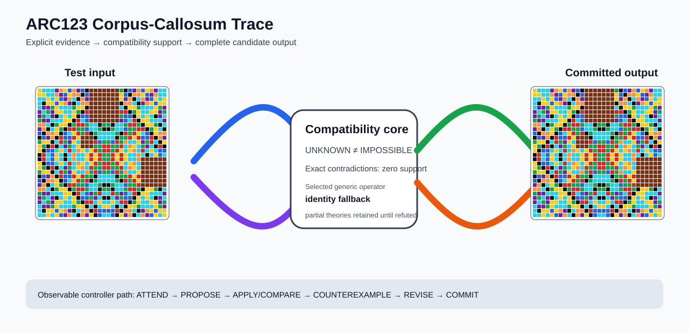

# ARC2 `f9d67f8b` P0008 Brain Surgery Report

## Outcome: NO — TEST CELLS DO NOT ALL MATCH

- **Compared positions:** 900
- **Mismatched cells:** 107
- **Training compatibility:** `False`
- **Fallback used:** `True`
- **Selected hypothesis:** `fallback_identity_complete_grid`
- **Source commit:** `71f86ff4c5304e452e0659131171f0519b50e21c`
- **Frozen controller commit:** `4bed6c917523bc2baa05eec69f67303805d88dae`

## Live-Agent Boundary

The controller receives only visible training input/output examples and test inputs. It receives no task ID, imported cohort label, GT feature record, GT solver, historical decomposition, or held-out output before committing a complete grid. The expected output appears only in the post-answer V&V section.

## Corpus-Callosum Visualization



- Full explicit event record: [`learning_trace.json`](learning_trace.json)

## Frozen Measurement

This task was evaluated with the controller and operator configuration pinned before the frozen cohort was run. A result in this packet cannot alter that controller configuration.

## Post-Answer V&V

### Test case 1
- **All cells match:** `False`
- **Mismatched cells:** `107`
- **Prediction:
```json
[[4, 8, 8, 8, 5, 7, 4, 1, 7, 5, 1, 6, 9, 9, 9, 9, 9, 9, 9, 3, 6, 1, 5, 7, 1, 4, 7, 5, 8, 8], [4, 4, 8, 8, 7, 5, 1, 4, 7, 7, 6, 1, 9, 9, 9, 9, 9, 9, 9, 4, 1, 6, 7, 7, 4, 1, 5, 7, 8, 8], [8, 8, 4, 8, 4, 1, 5, 7, 8, 6, 7, 5, 9, 9, 9, 9, 9, 9, 9, 4, 5, 7, 6, 8, 7, 5, 1, 4, 8, 4], [8, 6, 4, 4, 1, 4, 7, 5, 6, 8, 7, 7, 9, 9, 9, 9, 9, 9, 9, 6, 7, 7, 8, 6, 5, 7, 4, 1, 4, 4], [8, 5, 5, 3, 4, 8, 8, 8, 3, 4, 4, 6, 9, 9, 9, 9, 9, 9, 9, 8, 6, 4, 4, 3, 8, 8, 8, 4, 3, 5], [5, 8, 3, 5, 4, 4, 8, 8, 4, 3, 6, 2, 9, 9, 9, 9, 9, 9, 9, 2, 2, 6, 3, 4, 8, 8, 4, 4, 5, 3], [5, 3, 8, 5, 6, 8, 4, 8, 4, 6, 1, 1, 9, 9, 9, 9, 9, 9, 9, 3, 1, 1, 6, 4, 8, 4, 8, 6, 5, 8], [3, 5, 5, 8, 8, 8, 4, 4, 6, 2, 8, 1, 9, 9, 9, 9, 9, 9, 9, 5, 1, 8, 2, 6, 4, 4, 8, 8, 8, 5], [7, 7, 8, 6, 3, 4, 4, 6, 3, 2, 2, 3, 8, 8, 6, 3, 3, 6, 8, 8, 3, 2, 2, 3, 6, 4, 4, 3, 6, 8], [5, 7, 6, 8, 4, 3, 6, 2, 2, 3, 3, 1, 8, 8, 3, 6, 6, 3, 8, 8, 1, 3, 3, 2, 2, 6, 3, 4, 8, 6], [1, 6, 7, 7, 4, 6, 1, 8, 4, 2, 3, 2, 6, 3, 8, 8, 8, 8, 3, 6, 2, 3, 2, 4, 8, 1, 6, 4, 7, 7], [6, 1, 5, 7, 6, 2, 1, 1, 2, 4, 9, 9, 9, 6, 8, 8, 8, 8, 6, 3, 3, 2, 4, 2, 1, 1, 2, 6, 7, 5], [3, 4, 4, 6, 8, 2, 3, 5, 4, 8, 9, 9, 9, 2, 1, 3, 3, 1, 2, 3, 7, 8, 8, 4, 5, 3, 2, 8, 6, 4], [4, 3, 6, 2, 6, 8, 5, 3, 8, 4, 9, 9, 9, 3, 3, 2, 2, 3, 3, 2, 8, 7, 4, 8, 3, 5, 8, 6, 2, 6], [4, 6, 1, 1, 8, 4, 8, 2, 8, 7, 4, 8, 4, 2, 3, 2, 2, 3, 2, 4, 8, 4, 7, 8, 2, 8, 4, 8, 1, 1], [6, 2, 8, 1, 4, 8, 6, 8, 7, 8, 8, 4, 2, 4, 2, 3, 3, 2, 4, 2, 4, 8, 8, 7, 8, 6, 8, 4, 1, 8], [6, 2, 8, 1, 4, 8, 6, 8, 7, 8, 8, 4, 2, 4, 2, 3, 3, 2, 4, 2, 4, 8, 8, 7, 9, 9, 9, 9, 9, 9], [4, 6, 1, 1, 8, 4, 8, 2, 8, 7, 4, 8, 4, 2, 3, 2, 2, 3, 2, 4, 8, 4, 7, 8, 9, 9, 9, 9, 9, 9], [4, 3, 6, 2, 6, 8, 5, 3, 8, 4, 7, 8, 2, 3, 3, 2, 2, 3, 3, 2, 8, 7, 4, 8, 9, 9, 9, 9, 9, 9], [3, 4, 4, 6, 8, 2, 3, 5, 4, 8, 8, 7, 3, 2, 1, 3, 3, 1, 2, 3, 7, 8, 8, 4, 9, 9, 9, 9, 9, 9], [6, 1, 5, 7, 6, 2, 1, 1, 2, 4, 2, 3, 3, 6, 8, 8, 8, 8, 6, 3, 3, 2, 4, 2, 9, 9, 9, 9, 9, 9], [1, 6, 7, 7, 4, 6, 1, 8, 4, 2, 3, 2, 6, 3, 8, 8, 8, 8, 3, 6, 2, 3, 2, 4, 9, 9, 9, 9, 9, 9], [5, 7, 6, 8, 4, 3, 6, 2, 2, 3, 3, 1, 8, 8, 3, 6, 6, 3, 8, 8, 1, 3, 3, 2, 9, 9, 9, 9, 9, 9], [7, 7, 8, 6, 3, 4, 4, 6, 3, 2, 2, 3, 8, 8, 6, 3, 3, 6, 8, 8, 3, 2, 2, 3, 6, 4, 4, 3, 6, 8], [3, 5, 5, 8, 8, 8, 4, 4, 6, 2, 8, 1, 5, 3, 2, 8, 8, 2, 3, 5, 1, 8, 2, 6, 4, 4, 8, 8, 8, 5], [5, 3, 8, 5, 6, 8, 4, 8, 4, 6, 1, 1, 3, 5, 8, 6, 6, 8, 5, 3, 1, 1, 6, 4, 8, 4, 8, 6, 5, 8], [5, 8, 3, 5, 4, 4, 8, 8, 4, 3, 6, 2, 2, 8, 4, 8, 8, 4, 8, 2, 2, 6, 3, 4, 8, 8, 4, 4, 5, 3], [8, 5, 5, 3, 4, 8, 8, 8, 3, 4, 4, 6, 8, 6, 8, 4, 4, 8, 6, 8, 6, 4, 4, 3, 8, 8, 8, 4, 3, 5], [8, 6, 4, 4, 1, 4, 7, 5, 6, 8, 7, 7, 6, 2, 1, 1, 1, 1, 2, 6, 7, 7, 8, 6, 5, 7, 4, 1, 4, 4], [8, 8, 4, 8, 4, 1, 5, 7, 8, 6, 7, 5, 4, 6, 1, 8, 8, 1, 6, 4, 5, 7, 6, 8, 7, 5, 1, 4, 8, 4]]
```
- **Expected output (post-answer only):**
```json
[[4, 8, 8, 8, 5, 7, 4, 1, 7, 5, 1, 6, 3, 4, 4, 6, 6, 4, 4, 3, 6, 1, 5, 7, 1, 4, 7, 5, 8, 8], [4, 4, 8, 8, 7, 5, 1, 4, 7, 7, 6, 1, 4, 3, 6, 2, 2, 6, 3, 4, 1, 6, 7, 7, 4, 1, 5, 7, 8, 8], [8, 8, 4, 8, 4, 1, 5, 7, 8, 6, 7, 5, 4, 6, 1, 8, 8, 1, 6, 4, 5, 7, 6, 8, 7, 5, 1, 4, 8, 4], [8, 6, 4, 4, 1, 4, 7, 5, 6, 8, 7, 7, 6, 2, 1, 1, 1, 1, 2, 6, 7, 7, 8, 6, 5, 7, 4, 1, 4, 4], [8, 5, 5, 3, 4, 8, 8, 8, 3, 4, 4, 6, 8, 6, 8, 4, 4, 8, 6, 8, 6, 4, 4, 3, 8, 8, 8, 4, 3, 5], [5, 8, 3, 5, 4, 4, 8, 8, 4, 3, 6, 2, 2, 8, 4, 8, 8, 4, 8, 2, 2, 6, 3, 4, 8, 8, 4, 4, 5, 3], [5, 3, 8, 5, 6, 8, 4, 8, 4, 6, 1, 1, 3, 5, 8, 6, 6, 8, 5, 3, 1, 1, 6, 4, 8, 4, 8, 6, 5, 8], [3, 5, 5, 8, 8, 8, 4, 4, 6, 2, 8, 1, 5, 3, 2, 8, 8, 2, 3, 5, 1, 8, 2, 6, 4, 4, 8, 8, 8, 5], [7, 7, 8, 6, 3, 4, 4, 6, 3, 2, 2, 3, 8, 8, 6, 3, 3, 6, 8, 8, 3, 2, 2, 3, 6, 4, 4, 3, 6, 8], [5, 7, 6, 8, 4, 3, 6, 2, 2, 3, 3, 1, 8, 8, 3, 6, 6, 3, 8, 8, 1, 3, 3, 2, 2, 6, 3, 4, 8, 6], [1, 6, 7, 7, 4, 6, 1, 8, 4, 2, 3, 2, 6, 3, 8, 8, 8, 8, 3, 6, 2, 3, 2, 4, 8, 1, 6, 4, 7, 7], [6, 1, 5, 7, 6, 2, 1, 1, 2, 4, 2, 3, 3, 6, 8, 8, 8, 8, 6, 3, 3, 2, 4, 2, 1, 1, 2, 6, 7, 5], [3, 4, 4, 6, 8, 2, 3, 5, 4, 8, 8, 7, 3, 2, 1, 3, 3, 1, 2, 3, 7, 8, 8, 4, 5, 3, 2, 8, 6, 4], [4, 3, 6, 2, 6, 8, 5, 3, 8, 4, 7, 8, 2, 3, 3, 2, 2, 3, 3, 2, 8, 7, 4, 8, 3, 5, 8, 6, 2, 6], [4, 6, 1, 1, 8, 4, 8, 2, 8, 7, 4, 8, 4, 2, 3, 2, 2, 3, 2, 4, 8, 4, 7, 8, 2, 8, 4, 8, 1, 1], [6, 2, 8, 1, 4, 8, 6, 8, 7, 8, 8, 4, 2, 4, 2, 3, 3, 2, 4, 2, 4, 8, 8, 7, 8, 6, 8, 4, 1, 8], [6, 2, 8, 1, 4, 8, 6, 8, 7, 8, 8, 4, 2, 4, 2, 3, 3, 2, 4, 2, 4, 8, 8, 7, 8, 6, 8, 4, 1, 8], [4, 6, 1, 1, 8, 4, 8, 2, 8, 7, 4, 8, 4, 2, 3, 2, 2, 3, 2, 4, 8, 4, 7, 8, 2, 8, 4, 8, 1, 1], [4, 3, 6, 2, 6, 8, 5, 3, 8, 4, 7, 8, 2, 3, 3, 2, 2, 3, 3, 2, 8, 7, 4, 8, 3, 5, 8, 6, 2, 6], [3, 4, 4, 6, 8, 2, 3, 5, 4, 8, 8, 7, 3, 2, 1, 3, 3, 1, 2, 3, 7, 8, 8, 4, 5, 3, 2, 8, 6, 4], [6, 1, 5, 7, 6, 2, 1, 1, 2, 4, 2, 3, 3, 6, 8, 8, 8, 8, 6, 3, 3, 2, 4, 2, 1, 1, 2, 6, 7, 5], [1, 6, 7, 7, 4, 6, 1, 8, 4, 2, 3, 2, 6, 3, 8, 8, 8, 8, 3, 6, 2, 3, 2, 4, 8, 1, 6, 4, 7, 7], [5, 7, 6, 8, 4, 3, 6, 2, 2, 3, 3, 1, 8, 8, 3, 6, 6, 3, 8, 8, 1, 3, 3, 2, 2, 6, 3, 4, 8, 6], [7, 7, 8, 6, 3, 4, 4, 6, 3, 2, 2, 3, 8, 8, 6, 3, 3, 6, 8, 8, 3, 2, 2, 3, 6, 4, 4, 3, 6, 8], [3, 5, 5, 8, 8, 8, 4, 4, 6, 2, 8, 1, 5, 3, 2, 8, 8, 2, 3, 5, 1, 8, 2, 6, 4, 4, 8, 8, 8, 5], [5, 3, 8, 5, 6, 8, 4, 8, 4, 6, 1, 1, 3, 5, 8, 6, 6, 8, 5, 3, 1, 1, 6, 4, 8, 4, 8, 6, 5, 8], [5, 8, 3, 5, 4, 4, 8, 8, 4, 3, 6, 2, 2, 8, 4, 8, 8, 4, 8, 2, 2, 6, 3, 4, 8, 8, 4, 4, 5, 3], [8, 5, 5, 3, 4, 8, 8, 8, 3, 4, 4, 6, 8, 6, 8, 4, 4, 8, 6, 8, 6, 4, 4, 3, 8, 8, 8, 4, 3, 5], [8, 6, 4, 4, 1, 4, 7, 5, 6, 8, 7, 7, 6, 2, 1, 1, 1, 1, 2, 6, 7, 7, 8, 6, 5, 7, 4, 1, 4, 4], [8, 8, 4, 8, 4, 1, 5, 7, 8, 6, 7, 5, 4, 6, 1, 8, 8, 1, 6, 4, 5, 7, 6, 8, 7, 5, 1, 4, 8, 4]]
```

## Observable IHL Walkthrough

The record contains explicit actions, predictions, feedback, and revisions; it does not claim or store hidden model reasoning.

### Action totals

- `APPLY_HYPOTHESIS`: 250
- `ATTEND`: 250
- `CHOOSE_NEXT_DEMO`: 250
- `COMMIT`: 1
- `COMPARE`: 250
- `COMPOSE_RULE`: 6
- `EXPLAIN_RESIDUAL`: 6
- `FIND_COUNTEREXAMPLE`: 6
- `PROPOSE`: 1
- `SPECIALIZE`: 72

### Decision milestones

- `0` `PROPOSE` — `{"parent_theory_id":"T0000","rule":{"description_length":1,"name":"identity","operation":"identity","parameters":{},"rule_id":"identity","scope":{"kind":"all","value":null}},"stage":"initial_generic_theories","theory_id":"T0001"}`
- `2` `ATTEND` — `{"reason":"initial_highest_observed_change_and_color_discrimination","selected_demo":1,"selected_region":{"column":8,"row":3},"theory_id":"T0001"}`
- `6` `ATTEND` — `{"reason":"counterexample_requires_visible_conditional_evidence:unseen_demo_selected_for_residual_version_space_discrimination","selected_demo":0,"selected_region":{"column":26,"row":4},"theory_id":"T0001"}`
- `10` `ATTEND` — `{"reason":"counterexample_requires_visible_conditional_evidence:unseen_demo_selected_for_residual_version_space_discrimination","selected_demo":3,"selected_region":{"column":17,"row":7},"theory_id":"T0001"}`
- `14` `ATTEND` — `{"reason":"counterexample_requires_visible_conditional_evidence:unseen_demo_selected_for_residual_version_space_discrimination","selected_demo":2,"selected_region":{"column":17,"row":3},"theory_id":"T0001"}`
- `20` `SPECIALIZE` — `{"added_rule":{"description_length":4,"name":"row_span_fill(fill_color=9,seed_color=9)","operation":"full_operator","parameters":{"fill_color":9,"operator":"row_span_fill","seed_color":9},"rule_id":"structural-row_span_fill","scope":{"kind":"all","value":null}},"parent_theory_id":"T0001","reason":"unexplained_residual_proposed_generic_structural_rule","theory_id":"T0003"}`
- `21` `SPECIALIZE` — `{"added_rule":{"description_length":4,"name":"row_span_fill(fill_color=8,seed_color=9)","operation":"full_operator","parameters":{"fill_color":8,"operator":"row_span_fill","seed_color":9},"rule_id":"structural-row_span_fill","scope":{"kind":"all","value":null}},"parent_theory_id":"T0001","reason":"unexplained_residual_proposed_generic_structural_rule","theory_id":"T0004"}`
- `22` `SPECIALIZE` — `{"added_rule":{"description_length":4,"name":"row_span_fill(fill_color=7,seed_color=9)","operation":"full_operator","parameters":{"fill_color":7,"operator":"row_span_fill","seed_color":9},"rule_id":"structural-row_span_fill","scope":{"kind":"all","value":null}},"parent_theory_id":"T0001","reason":"unexplained_residual_proposed_generic_structural_rule","theory_id":"T0005"}`
- `23` `SPECIALIZE` — `{"added_rule":{"description_length":4,"name":"row_span_fill(fill_color=4,seed_color=9)","operation":"full_operator","parameters":{"fill_color":4,"operator":"row_span_fill","seed_color":9},"rule_id":"structural-row_span_fill","scope":{"kind":"all","value":null}},"parent_theory_id":"T0001","reason":"unexplained_residual_proposed_generic_structural_rule","theory_id":"T0006"}`
- `24` `SPECIALIZE` — `{"added_rule":{"description_length":4,"name":"row_span_fill(fill_color=2,seed_color=9)","operation":"full_operator","parameters":{"fill_color":2,"operator":"row_span_fill","seed_color":9},"rule_id":"structural-row_span_fill","scope":{"kind":"all","value":null}},"parent_theory_id":"T0001","reason":"unexplained_residual_proposed_generic_structural_rule","theory_id":"T0007"}`
- `25` `SPECIALIZE` — `{"added_rule":{"description_length":4,"name":"row_span_fill(fill_color=1,seed_color=9)","operation":"full_operator","parameters":{"fill_color":1,"operator":"row_span_fill","seed_color":9},"rule_id":"structural-row_span_fill","scope":{"kind":"all","value":null}},"parent_theory_id":"T0001","reason":"unexplained_residual_proposed_generic_structural_rule","theory_id":"T0008"}`
- `26` `SPECIALIZE` — `{"added_rule":{"description_length":4,"name":"line_extend(direction=up,fill_color=9,seed_color=9)","operation":"full_operator","parameters":{"direction":"up","fill_color":9,"operator":"line_extend","seed_color":9},"rule_id":"structural-line_extend","scope":{"kind":"all","value":null}},"parent_theory_id":"T0001","reason":"unexplained_residual_proposed_generic_structural_rule","theory_id":"T0009"}`
- `27` `SPECIALIZE` — `{"added_rule":{"description_length":4,"name":"line_extend(direction=up,fill_color=8,seed_color=9)","operation":"full_operator","parameters":{"direction":"up","fill_color":8,"operator":"line_extend","seed_color":9},"rule_id":"structural-line_extend","scope":{"kind":"all","value":null}},"parent_theory_id":"T0001","reason":"unexplained_residual_proposed_generic_structural_rule","theory_id":"T0010"}`
- `28` `SPECIALIZE` — `{"added_rule":{"description_length":4,"name":"line_extend(direction=up,fill_color=7,seed_color=9)","operation":"full_operator","parameters":{"direction":"up","fill_color":7,"operator":"line_extend","seed_color":9},"rule_id":"structural-line_extend","scope":{"kind":"all","value":null}},"parent_theory_id":"T0001","reason":"unexplained_residual_proposed_generic_structural_rule","theory_id":"T0011"}`
- `29` `SPECIALIZE` — `{"added_rule":{"description_length":4,"name":"line_extend(direction=up,fill_color=4,seed_color=9)","operation":"full_operator","parameters":{"direction":"up","fill_color":4,"operator":"line_extend","seed_color":9},"rule_id":"structural-line_extend","scope":{"kind":"all","value":null}},"parent_theory_id":"T0001","reason":"unexplained_residual_proposed_generic_structural_rule","theory_id":"T0012"}`
- `30` `SPECIALIZE` — `{"added_rule":{"description_length":4,"name":"line_extend(direction=up,fill_color=2,seed_color=9)","operation":"full_operator","parameters":{"direction":"up","fill_color":2,"operator":"line_extend","seed_color":9},"rule_id":"structural-line_extend","scope":{"kind":"all","value":null}},"parent_theory_id":"T0001","reason":"unexplained_residual_proposed_generic_structural_rule","theory_id":"T0013"}`
- `31` `SPECIALIZE` — `{"added_rule":{"description_length":4,"name":"line_extend(direction=up,fill_color=1,seed_color=9)","operation":"full_operator","parameters":{"direction":"up","fill_color":1,"operator":"line_extend","seed_color":9},"rule_id":"structural-line_extend","scope":{"kind":"all","value":null}},"parent_theory_id":"T0001","reason":"unexplained_residual_proposed_generic_structural_rule","theory_id":"T0014"}`
- `33` `ATTEND` — `{"reason":"initial_highest_observed_change_and_color_discrimination","selected_demo":1,"selected_region":{"column":8,"row":3},"theory_id":"T0002"}`
- `37` `ATTEND` — `{"reason":"initial_highest_observed_change_and_color_discrimination","selected_demo":1,"selected_region":{"column":8,"row":3},"theory_id":"T0003"}`
- `41` `ATTEND` — `{"reason":"initial_highest_observed_change_and_color_discrimination","selected_demo":1,"selected_region":{"column":8,"row":3},"theory_id":"T0004"}`
- `45` `ATTEND` — `{"reason":"initial_highest_observed_change_and_color_discrimination","selected_demo":1,"selected_region":{"column":8,"row":3},"theory_id":"T0005"}`
- `49` `ATTEND` — `{"reason":"initial_highest_observed_change_and_color_discrimination","selected_demo":1,"selected_region":{"column":8,"row":3},"theory_id":"T0006"}`
- `53` `ATTEND` — `{"reason":"initial_highest_observed_change_and_color_discrimination","selected_demo":1,"selected_region":{"column":8,"row":3},"theory_id":"T0007"}`
- `57` `ATTEND` — `{"reason":"initial_highest_observed_change_and_color_discrimination","selected_demo":1,"selected_region":{"column":8,"row":3},"theory_id":"T0008"}`
- `61` `ATTEND` — `{"reason":"initial_highest_observed_change_and_color_discrimination","selected_demo":1,"selected_region":{"column":12,"row":0},"theory_id":"T0009"}`
- `65` `ATTEND` — `{"reason":"initial_highest_observed_change_and_color_discrimination","selected_demo":1,"selected_region":{"column":12,"row":0},"theory_id":"T0010"}`
- `69` `ATTEND` — `{"reason":"initial_highest_observed_change_and_color_discrimination","selected_demo":1,"selected_region":{"column":12,"row":0},"theory_id":"T0011"}`
- `73` `ATTEND` — `{"reason":"initial_highest_observed_change_and_color_discrimination","selected_demo":1,"selected_region":{"column":12,"row":0},"theory_id":"T0012"}`
- `77` `ATTEND` — `{"reason":"initial_highest_observed_change_and_color_discrimination","selected_demo":1,"selected_region":{"column":12,"row":0},"theory_id":"T0013"}`
- `81` `ATTEND` — `{"reason":"counterexample_requires_visible_conditional_evidence:unseen_demo_selected_for_residual_version_space_discrimination","selected_demo":0,"selected_region":{"column":28,"row":4},"theory_id":"T0002"}`
- `85` `ATTEND` — `{"reason":"counterexample_requires_visible_conditional_evidence:unseen_demo_selected_for_residual_version_space_discrimination","selected_demo":0,"selected_region":{"column":26,"row":4},"theory_id":"T0003"}`
- `89` `ATTEND` — `{"reason":"counterexample_requires_visible_conditional_evidence:unseen_demo_selected_for_residual_version_space_discrimination","selected_demo":0,"selected_region":{"column":26,"row":4},"theory_id":"T0004"}`
- `93` `ATTEND` — `{"reason":"counterexample_requires_visible_conditional_evidence:unseen_demo_selected_for_residual_version_space_discrimination","selected_demo":0,"selected_region":{"column":26,"row":4},"theory_id":"T0005"}`
- `97` `ATTEND` — `{"reason":"counterexample_requires_visible_conditional_evidence:unseen_demo_selected_for_residual_version_space_discrimination","selected_demo":0,"selected_region":{"column":26,"row":4},"theory_id":"T0006"}`
- `101` `ATTEND` — `{"reason":"counterexample_requires_visible_conditional_evidence:unseen_demo_selected_for_residual_version_space_discrimination","selected_demo":0,"selected_region":{"column":26,"row":4},"theory_id":"T0007"}`
- `105` `ATTEND` — `{"reason":"counterexample_requires_visible_conditional_evidence:unseen_demo_selected_for_residual_version_space_discrimination","selected_demo":0,"selected_region":{"column":26,"row":4},"theory_id":"T0008"}`
- `109` `ATTEND` — `{"reason":"counterexample_requires_visible_conditional_evidence:unseen_demo_selected_for_residual_version_space_discrimination","selected_demo":0,"selected_region":{"column":26,"row":4},"theory_id":"T0009"}`
- `113` `ATTEND` — `{"reason":"counterexample_requires_visible_conditional_evidence:unseen_demo_selected_for_residual_version_space_discrimination","selected_demo":0,"selected_region":{"column":26,"row":4},"theory_id":"T0010"}`
- `117` `ATTEND` — `{"reason":"counterexample_requires_visible_conditional_evidence:unseen_demo_selected_for_residual_version_space_discrimination","selected_demo":0,"selected_region":{"column":26,"row":4},"theory_id":"T0011"}`
- `121` `ATTEND` — `{"reason":"counterexample_requires_visible_conditional_evidence:unseen_demo_selected_for_residual_version_space_discrimination","selected_demo":0,"selected_region":{"column":26,"row":4},"theory_id":"T0012"}`
- `125` `ATTEND` — `{"reason":"counterexample_requires_visible_conditional_evidence:unseen_demo_selected_for_residual_version_space_discrimination","selected_demo":0,"selected_region":{"column":26,"row":4},"theory_id":"T0013"}`
- `129` `ATTEND` — `{"reason":"counterexample_requires_visible_conditional_evidence:unseen_demo_selected_for_residual_version_space_discrimination","selected_demo":3,"selected_region":{"column":17,"row":7},"theory_id":"T0002"}`
- `133` `ATTEND` — `{"reason":"counterexample_requires_visible_conditional_evidence:unseen_demo_selected_for_residual_version_space_discrimination","selected_demo":3,"selected_region":{"column":17,"row":7},"theory_id":"T0003"}`
- `137` `ATTEND` — `{"reason":"counterexample_requires_visible_conditional_evidence:unseen_demo_selected_for_residual_version_space_discrimination","selected_demo":3,"selected_region":{"column":17,"row":7},"theory_id":"T0004"}`
- `141` `ATTEND` — `{"reason":"counterexample_requires_visible_conditional_evidence:unseen_demo_selected_for_residual_version_space_discrimination","selected_demo":3,"selected_region":{"column":17,"row":7},"theory_id":"T0005"}`
- `145` `ATTEND` — `{"reason":"counterexample_requires_visible_conditional_evidence:unseen_demo_selected_for_residual_version_space_discrimination","selected_demo":3,"selected_region":{"column":17,"row":7},"theory_id":"T0006"}`
- `149` `ATTEND` — `{"reason":"counterexample_requires_visible_conditional_evidence:unseen_demo_selected_for_residual_version_space_discrimination","selected_demo":3,"selected_region":{"column":17,"row":7},"theory_id":"T0007"}`
- `153` `ATTEND` — `{"reason":"counterexample_requires_visible_conditional_evidence:unseen_demo_selected_for_residual_version_space_discrimination","selected_demo":3,"selected_region":{"column":17,"row":7},"theory_id":"T0008"}`
- `157` `ATTEND` — `{"reason":"counterexample_requires_visible_conditional_evidence:unseen_demo_selected_for_residual_version_space_discrimination","selected_demo":2,"selected_region":{"column":17,"row":3},"theory_id":"T0002"}`
- `161` `ATTEND` — `{"reason":"counterexample_requires_visible_conditional_evidence:unseen_demo_selected_for_residual_version_space_discrimination","selected_demo":3,"selected_region":{"column":17,"row":1},"theory_id":"T0009"}`
- `165` `ATTEND` — `{"reason":"counterexample_requires_visible_conditional_evidence:unseen_demo_selected_for_residual_version_space_discrimination","selected_demo":3,"selected_region":{"column":17,"row":1},"theory_id":"T0010"}`
- `169` `ATTEND` — `{"reason":"counterexample_requires_visible_conditional_evidence:unseen_demo_selected_for_residual_version_space_discrimination","selected_demo":3,"selected_region":{"column":17,"row":1},"theory_id":"T0011"}`
- `173` `ATTEND` — `{"reason":"counterexample_requires_visible_conditional_evidence:unseen_demo_selected_for_residual_version_space_discrimination","selected_demo":3,"selected_region":{"column":17,"row":1},"theory_id":"T0012"}`
- `177` `ATTEND` — `{"reason":"counterexample_requires_visible_conditional_evidence:unseen_demo_selected_for_residual_version_space_discrimination","selected_demo":3,"selected_region":{"column":17,"row":1},"theory_id":"T0013"}`
- `181` `ATTEND` — `{"reason":"counterexample_requires_visible_conditional_evidence:unseen_demo_selected_for_residual_version_space_discrimination","selected_demo":2,"selected_region":{"column":17,"row":3},"theory_id":"T0003"}`
- `185` `ATTEND` — `{"reason":"counterexample_requires_visible_conditional_evidence:unseen_demo_selected_for_residual_version_space_discrimination","selected_demo":2,"selected_region":{"column":17,"row":3},"theory_id":"T0004"}`
- `189` `ATTEND` — `{"reason":"counterexample_requires_visible_conditional_evidence:unseen_demo_selected_for_residual_version_space_discrimination","selected_demo":2,"selected_region":{"column":17,"row":3},"theory_id":"T0005"}`
- `193` `ATTEND` — `{"reason":"counterexample_requires_visible_conditional_evidence:unseen_demo_selected_for_residual_version_space_discrimination","selected_demo":2,"selected_region":{"column":17,"row":3},"theory_id":"T0006"}`
- `197` `ATTEND` — `{"reason":"counterexample_requires_visible_conditional_evidence:unseen_demo_selected_for_residual_version_space_discrimination","selected_demo":2,"selected_region":{"column":17,"row":3},"theory_id":"T0007"}`
- `201` `ATTEND` — `{"reason":"counterexample_requires_visible_conditional_evidence:unseen_demo_selected_for_residual_version_space_discrimination","selected_demo":2,"selected_region":{"column":17,"row":3},"theory_id":"T0008"}`
- `207` `SPECIALIZE` — `{"added_rule":{"description_length":4,"name":"row_span_fill(fill_color=9,seed_color=9)","operation":"full_operator","parameters":{"fill_color":9,"operator":"row_span_fill","seed_color":9},"rule_id":"structural-row_span_fill","scope":{"kind":"all","value":null}},"parent_theory_id":"T0002","reason":"unexplained_residual_proposed_generic_structural_rule","theory_id":"T0016"}`
- `208` `SPECIALIZE` — `{"added_rule":{"description_length":4,"name":"row_span_fill(fill_color=8,seed_color=9)","operation":"full_operator","parameters":{"fill_color":8,"operator":"row_span_fill","seed_color":9},"rule_id":"structural-row_span_fill","scope":{"kind":"all","value":null}},"parent_theory_id":"T0002","reason":"unexplained_residual_proposed_generic_structural_rule","theory_id":"T0017"}`
- `209` `SPECIALIZE` — `{"added_rule":{"description_length":4,"name":"row_span_fill(fill_color=7,seed_color=9)","operation":"full_operator","parameters":{"fill_color":7,"operator":"row_span_fill","seed_color":9},"rule_id":"structural-row_span_fill","scope":{"kind":"all","value":null}},"parent_theory_id":"T0002","reason":"unexplained_residual_proposed_generic_structural_rule","theory_id":"T0018"}`
- `210` `SPECIALIZE` — `{"added_rule":{"description_length":4,"name":"row_span_fill(fill_color=4,seed_color=9)","operation":"full_operator","parameters":{"fill_color":4,"operator":"row_span_fill","seed_color":9},"rule_id":"structural-row_span_fill","scope":{"kind":"all","value":null}},"parent_theory_id":"T0002","reason":"unexplained_residual_proposed_generic_structural_rule","theory_id":"T0019"}`
- `211` `SPECIALIZE` — `{"added_rule":{"description_length":4,"name":"row_span_fill(fill_color=2,seed_color=9)","operation":"full_operator","parameters":{"fill_color":2,"operator":"row_span_fill","seed_color":9},"rule_id":"structural-row_span_fill","scope":{"kind":"all","value":null}},"parent_theory_id":"T0002","reason":"unexplained_residual_proposed_generic_structural_rule","theory_id":"T0020"}`
- `212` `SPECIALIZE` — `{"added_rule":{"description_length":4,"name":"row_span_fill(fill_color=1,seed_color=9)","operation":"full_operator","parameters":{"fill_color":1,"operator":"row_span_fill","seed_color":9},"rule_id":"structural-row_span_fill","scope":{"kind":"all","value":null}},"parent_theory_id":"T0002","reason":"unexplained_residual_proposed_generic_structural_rule","theory_id":"T0021"}`
- `213` `SPECIALIZE` — `{"added_rule":{"description_length":4,"name":"line_extend(direction=up,fill_color=9,seed_color=9)","operation":"full_operator","parameters":{"direction":"up","fill_color":9,"operator":"line_extend","seed_color":9},"rule_id":"structural-line_extend","scope":{"kind":"all","value":null}},"parent_theory_id":"T0002","reason":"unexplained_residual_proposed_generic_structural_rule","theory_id":"T0022"}`
- `214` `SPECIALIZE` — `{"added_rule":{"description_length":4,"name":"line_extend(direction=up,fill_color=8,seed_color=9)","operation":"full_operator","parameters":{"direction":"up","fill_color":8,"operator":"line_extend","seed_color":9},"rule_id":"structural-line_extend","scope":{"kind":"all","value":null}},"parent_theory_id":"T0002","reason":"unexplained_residual_proposed_generic_structural_rule","theory_id":"T0023"}`
- `215` `SPECIALIZE` — `{"added_rule":{"description_length":4,"name":"line_extend(direction=up,fill_color=7,seed_color=9)","operation":"full_operator","parameters":{"direction":"up","fill_color":7,"operator":"line_extend","seed_color":9},"rule_id":"structural-line_extend","scope":{"kind":"all","value":null}},"parent_theory_id":"T0002","reason":"unexplained_residual_proposed_generic_structural_rule","theory_id":"T0024"}`
- `216` `SPECIALIZE` — `{"added_rule":{"description_length":4,"name":"line_extend(direction=up,fill_color=4,seed_color=9)","operation":"full_operator","parameters":{"direction":"up","fill_color":4,"operator":"line_extend","seed_color":9},"rule_id":"structural-line_extend","scope":{"kind":"all","value":null}},"parent_theory_id":"T0002","reason":"unexplained_residual_proposed_generic_structural_rule","theory_id":"T0025"}`
- `217` `SPECIALIZE` — `{"added_rule":{"description_length":4,"name":"line_extend(direction=up,fill_color=2,seed_color=9)","operation":"full_operator","parameters":{"direction":"up","fill_color":2,"operator":"line_extend","seed_color":9},"rule_id":"structural-line_extend","scope":{"kind":"all","value":null}},"parent_theory_id":"T0002","reason":"unexplained_residual_proposed_generic_structural_rule","theory_id":"T0026"}`
- `218` `SPECIALIZE` — `{"added_rule":{"description_length":4,"name":"line_extend(direction=up,fill_color=1,seed_color=9)","operation":"full_operator","parameters":{"direction":"up","fill_color":1,"operator":"line_extend","seed_color":9},"rule_id":"structural-line_extend","scope":{"kind":"all","value":null}},"parent_theory_id":"T0002","reason":"unexplained_residual_proposed_generic_structural_rule","theory_id":"T0027"}`
- `220` `ATTEND` — `{"reason":"initial_highest_observed_change_and_color_discrimination","selected_demo":1,"selected_region":{"column":8,"row":3},"theory_id":"T0015"}`
- `224` `ATTEND` — `{"reason":"initial_highest_observed_change_and_color_discrimination","selected_demo":1,"selected_region":{"column":8,"row":3},"theory_id":"T0016"}`
- `228` `ATTEND` — `{"reason":"initial_highest_observed_change_and_color_discrimination","selected_demo":1,"selected_region":{"column":8,"row":3},"theory_id":"T0017"}`
- `232` `ATTEND` — `{"reason":"initial_highest_observed_change_and_color_discrimination","selected_demo":1,"selected_region":{"column":8,"row":3},"theory_id":"T0018"}`
- `236` `ATTEND` — `{"reason":"initial_highest_observed_change_and_color_discrimination","selected_demo":1,"selected_region":{"column":8,"row":3},"theory_id":"T0019"}`
- `240` `ATTEND` — `{"reason":"initial_highest_observed_change_and_color_discrimination","selected_demo":1,"selected_region":{"column":8,"row":3},"theory_id":"T0020"}`
- `244` `ATTEND` — `{"reason":"initial_highest_observed_change_and_color_discrimination","selected_demo":1,"selected_region":{"column":8,"row":3},"theory_id":"T0021"}`
- `248` `ATTEND` — `{"reason":"initial_highest_observed_change_and_color_discrimination","selected_demo":1,"selected_region":{"column":12,"row":0},"theory_id":"T0022"}`
- `252` `ATTEND` — `{"reason":"initial_highest_observed_change_and_color_discrimination","selected_demo":1,"selected_region":{"column":12,"row":0},"theory_id":"T0023"}`
- `256` `ATTEND` — `{"reason":"initial_highest_observed_change_and_color_discrimination","selected_demo":1,"selected_region":{"column":12,"row":0},"theory_id":"T0024"}`
- `260` `ATTEND` — `{"reason":"initial_highest_observed_change_and_color_discrimination","selected_demo":1,"selected_region":{"column":12,"row":0},"theory_id":"T0025"}`
- `264` `ATTEND` — `{"reason":"initial_highest_observed_change_and_color_discrimination","selected_demo":1,"selected_region":{"column":12,"row":0},"theory_id":"T0026"}`
- `268` `ATTEND` — `{"reason":"counterexample_requires_visible_conditional_evidence:unseen_demo_selected_for_residual_version_space_discrimination","selected_demo":0,"selected_region":{"column":26,"row":4},"theory_id":"T0015"}`
- `272` `ATTEND` — `{"reason":"counterexample_requires_visible_conditional_evidence:unseen_demo_selected_for_residual_version_space_discrimination","selected_demo":0,"selected_region":{"column":26,"row":4},"theory_id":"T0016"}`
- `276` `ATTEND` — `{"reason":"counterexample_requires_visible_conditional_evidence:unseen_demo_selected_for_residual_version_space_discrimination","selected_demo":0,"selected_region":{"column":26,"row":4},"theory_id":"T0017"}`
- `280` `ATTEND` — `{"reason":"counterexample_requires_visible_conditional_evidence:unseen_demo_selected_for_residual_version_space_discrimination","selected_demo":0,"selected_region":{"column":26,"row":4},"theory_id":"T0018"}`
- `284` `ATTEND` — `{"reason":"counterexample_requires_visible_conditional_evidence:unseen_demo_selected_for_residual_version_space_discrimination","selected_demo":0,"selected_region":{"column":26,"row":4},"theory_id":"T0019"}`
- `288` `ATTEND` — `{"reason":"counterexample_requires_visible_conditional_evidence:unseen_demo_selected_for_residual_version_space_discrimination","selected_demo":0,"selected_region":{"column":26,"row":4},"theory_id":"T0020"}`
- `292` `ATTEND` — `{"reason":"counterexample_requires_visible_conditional_evidence:unseen_demo_selected_for_residual_version_space_discrimination","selected_demo":0,"selected_region":{"column":26,"row":4},"theory_id":"T0021"}`
- `296` `ATTEND` — `{"reason":"counterexample_requires_visible_conditional_evidence:unseen_demo_selected_for_residual_version_space_discrimination","selected_demo":0,"selected_region":{"column":26,"row":4},"theory_id":"T0022"}`
- `300` `ATTEND` — `{"reason":"counterexample_requires_visible_conditional_evidence:unseen_demo_selected_for_residual_version_space_discrimination","selected_demo":0,"selected_region":{"column":26,"row":4},"theory_id":"T0023"}`
- `304` `ATTEND` — `{"reason":"counterexample_requires_visible_conditional_evidence:unseen_demo_selected_for_residual_version_space_discrimination","selected_demo":0,"selected_region":{"column":26,"row":4},"theory_id":"T0024"}`
- `308` `ATTEND` — `{"reason":"counterexample_requires_visible_conditional_evidence:unseen_demo_selected_for_residual_version_space_discrimination","selected_demo":0,"selected_region":{"column":26,"row":4},"theory_id":"T0025"}`
- `312` `ATTEND` — `{"reason":"counterexample_requires_visible_conditional_evidence:unseen_demo_selected_for_residual_version_space_discrimination","selected_demo":0,"selected_region":{"column":26,"row":4},"theory_id":"T0026"}`
- `316` `ATTEND` — `{"reason":"counterexample_requires_visible_conditional_evidence:unseen_demo_selected_for_residual_version_space_discrimination","selected_demo":3,"selected_region":{"column":17,"row":7},"theory_id":"T0015"}`
- `320` `ATTEND` — `{"reason":"counterexample_requires_visible_conditional_evidence:unseen_demo_selected_for_residual_version_space_discrimination","selected_demo":3,"selected_region":{"column":17,"row":7},"theory_id":"T0016"}`
- `324` `ATTEND` — `{"reason":"counterexample_requires_visible_conditional_evidence:unseen_demo_selected_for_residual_version_space_discrimination","selected_demo":3,"selected_region":{"column":17,"row":7},"theory_id":"T0017"}`
- `328` `ATTEND` — `{"reason":"counterexample_requires_visible_conditional_evidence:unseen_demo_selected_for_residual_version_space_discrimination","selected_demo":3,"selected_region":{"column":17,"row":7},"theory_id":"T0018"}`
- `332` `ATTEND` — `{"reason":"counterexample_requires_visible_conditional_evidence:unseen_demo_selected_for_residual_version_space_discrimination","selected_demo":3,"selected_region":{"column":17,"row":7},"theory_id":"T0019"}`
- `336` `ATTEND` — `{"reason":"counterexample_requires_visible_conditional_evidence:unseen_demo_selected_for_residual_version_space_discrimination","selected_demo":3,"selected_region":{"column":17,"row":7},"theory_id":"T0020"}`
- `340` `ATTEND` — `{"reason":"counterexample_requires_visible_conditional_evidence:unseen_demo_selected_for_residual_version_space_discrimination","selected_demo":3,"selected_region":{"column":17,"row":7},"theory_id":"T0021"}`
- `344` `ATTEND` — `{"reason":"counterexample_requires_visible_conditional_evidence:unseen_demo_selected_for_residual_version_space_discrimination","selected_demo":2,"selected_region":{"column":18,"row":3},"theory_id":"T0015"}`
- `348` `ATTEND` — `{"reason":"counterexample_requires_visible_conditional_evidence:unseen_demo_selected_for_residual_version_space_discrimination","selected_demo":3,"selected_region":{"column":17,"row":1},"theory_id":"T0022"}`
- `352` `ATTEND` — `{"reason":"counterexample_requires_visible_conditional_evidence:unseen_demo_selected_for_residual_version_space_discrimination","selected_demo":3,"selected_region":{"column":17,"row":1},"theory_id":"T0023"}`
- `356` `ATTEND` — `{"reason":"counterexample_requires_visible_conditional_evidence:unseen_demo_selected_for_residual_version_space_discrimination","selected_demo":3,"selected_region":{"column":17,"row":1},"theory_id":"T0024"}`
- `360` `ATTEND` — `{"reason":"counterexample_requires_visible_conditional_evidence:unseen_demo_selected_for_residual_version_space_discrimination","selected_demo":3,"selected_region":{"column":17,"row":1},"theory_id":"T0025"}`
- `364` `ATTEND` — `{"reason":"counterexample_requires_visible_conditional_evidence:unseen_demo_selected_for_residual_version_space_discrimination","selected_demo":3,"selected_region":{"column":17,"row":1},"theory_id":"T0026"}`
- `368` `ATTEND` — `{"reason":"counterexample_requires_visible_conditional_evidence:unseen_demo_selected_for_residual_version_space_discrimination","selected_demo":2,"selected_region":{"column":17,"row":3},"theory_id":"T0016"}`
- `372` `ATTEND` — `{"reason":"counterexample_requires_visible_conditional_evidence:unseen_demo_selected_for_residual_version_space_discrimination","selected_demo":2,"selected_region":{"column":17,"row":3},"theory_id":"T0017"}`
- `376` `ATTEND` — `{"reason":"counterexample_requires_visible_conditional_evidence:unseen_demo_selected_for_residual_version_space_discrimination","selected_demo":2,"selected_region":{"column":17,"row":3},"theory_id":"T0018"}`
- `380` `ATTEND` — `{"reason":"counterexample_requires_visible_conditional_evidence:unseen_demo_selected_for_residual_version_space_discrimination","selected_demo":2,"selected_region":{"column":17,"row":3},"theory_id":"T0019"}`
- `384` `ATTEND` — `{"reason":"counterexample_requires_visible_conditional_evidence:unseen_demo_selected_for_residual_version_space_discrimination","selected_demo":2,"selected_region":{"column":17,"row":3},"theory_id":"T0020"}`
- `388` `ATTEND` — `{"reason":"counterexample_requires_visible_conditional_evidence:unseen_demo_selected_for_residual_version_space_discrimination","selected_demo":2,"selected_region":{"column":17,"row":3},"theory_id":"T0021"}`
- `394` `SPECIALIZE` — `{"added_rule":{"description_length":4,"name":"row_span_fill(fill_color=9,seed_color=9)","operation":"full_operator","parameters":{"fill_color":9,"operator":"row_span_fill","seed_color":9},"rule_id":"structural-row_span_fill","scope":{"kind":"all","value":null}},"parent_theory_id":"T0015","reason":"unexplained_residual_proposed_generic_structural_rule","theory_id":"T0029"}`
- `395` `SPECIALIZE` — `{"added_rule":{"description_length":4,"name":"row_span_fill(fill_color=8,seed_color=9)","operation":"full_operator","parameters":{"fill_color":8,"operator":"row_span_fill","seed_color":9},"rule_id":"structural-row_span_fill","scope":{"kind":"all","value":null}},"parent_theory_id":"T0015","reason":"unexplained_residual_proposed_generic_structural_rule","theory_id":"T0030"}`
- `396` `SPECIALIZE` — `{"added_rule":{"description_length":4,"name":"row_span_fill(fill_color=7,seed_color=9)","operation":"full_operator","parameters":{"fill_color":7,"operator":"row_span_fill","seed_color":9},"rule_id":"structural-row_span_fill","scope":{"kind":"all","value":null}},"parent_theory_id":"T0015","reason":"unexplained_residual_proposed_generic_structural_rule","theory_id":"T0031"}`
- `397` `SPECIALIZE` — `{"added_rule":{"description_length":4,"name":"row_span_fill(fill_color=4,seed_color=9)","operation":"full_operator","parameters":{"fill_color":4,"operator":"row_span_fill","seed_color":9},"rule_id":"structural-row_span_fill","scope":{"kind":"all","value":null}},"parent_theory_id":"T0015","reason":"unexplained_residual_proposed_generic_structural_rule","theory_id":"T0032"}`
- `398` `SPECIALIZE` — `{"added_rule":{"description_length":4,"name":"row_span_fill(fill_color=2,seed_color=9)","operation":"full_operator","parameters":{"fill_color":2,"operator":"row_span_fill","seed_color":9},"rule_id":"structural-row_span_fill","scope":{"kind":"all","value":null}},"parent_theory_id":"T0015","reason":"unexplained_residual_proposed_generic_structural_rule","theory_id":"T0033"}`
- `399` `SPECIALIZE` — `{"added_rule":{"description_length":4,"name":"row_span_fill(fill_color=1,seed_color=9)","operation":"full_operator","parameters":{"fill_color":1,"operator":"row_span_fill","seed_color":9},"rule_id":"structural-row_span_fill","scope":{"kind":"all","value":null}},"parent_theory_id":"T0015","reason":"unexplained_residual_proposed_generic_structural_rule","theory_id":"T0034"}`
- `400` `SPECIALIZE` — `{"added_rule":{"description_length":4,"name":"line_extend(direction=up,fill_color=9,seed_color=9)","operation":"full_operator","parameters":{"direction":"up","fill_color":9,"operator":"line_extend","seed_color":9},"rule_id":"structural-line_extend","scope":{"kind":"all","value":null}},"parent_theory_id":"T0015","reason":"unexplained_residual_proposed_generic_structural_rule","theory_id":"T0035"}`
- `401` `SPECIALIZE` — `{"added_rule":{"description_length":4,"name":"line_extend(direction=up,fill_color=8,seed_color=9)","operation":"full_operator","parameters":{"direction":"up","fill_color":8,"operator":"line_extend","seed_color":9},"rule_id":"structural-line_extend","scope":{"kind":"all","value":null}},"parent_theory_id":"T0015","reason":"unexplained_residual_proposed_generic_structural_rule","theory_id":"T0036"}`
- `402` `SPECIALIZE` — `{"added_rule":{"description_length":4,"name":"line_extend(direction=up,fill_color=7,seed_color=9)","operation":"full_operator","parameters":{"direction":"up","fill_color":7,"operator":"line_extend","seed_color":9},"rule_id":"structural-line_extend","scope":{"kind":"all","value":null}},"parent_theory_id":"T0015","reason":"unexplained_residual_proposed_generic_structural_rule","theory_id":"T0037"}`
- `403` `SPECIALIZE` — `{"added_rule":{"description_length":4,"name":"line_extend(direction=up,fill_color=4,seed_color=9)","operation":"full_operator","parameters":{"direction":"up","fill_color":4,"operator":"line_extend","seed_color":9},"rule_id":"structural-line_extend","scope":{"kind":"all","value":null}},"parent_theory_id":"T0015","reason":"unexplained_residual_proposed_generic_structural_rule","theory_id":"T0038"}`
- `404` `SPECIALIZE` — `{"added_rule":{"description_length":4,"name":"line_extend(direction=up,fill_color=2,seed_color=9)","operation":"full_operator","parameters":{"direction":"up","fill_color":2,"operator":"line_extend","seed_color":9},"rule_id":"structural-line_extend","scope":{"kind":"all","value":null}},"parent_theory_id":"T0015","reason":"unexplained_residual_proposed_generic_structural_rule","theory_id":"T0039"}`
- `405` `SPECIALIZE` — `{"added_rule":{"description_length":4,"name":"line_extend(direction=up,fill_color=1,seed_color=9)","operation":"full_operator","parameters":{"direction":"up","fill_color":1,"operator":"line_extend","seed_color":9},"rule_id":"structural-line_extend","scope":{"kind":"all","value":null}},"parent_theory_id":"T0015","reason":"unexplained_residual_proposed_generic_structural_rule","theory_id":"T0040"}`
- `407` `ATTEND` — `{"reason":"initial_highest_observed_change_and_color_discrimination","selected_demo":1,"selected_region":{"column":8,"row":3},"theory_id":"T0028"}`
- `411` `ATTEND` — `{"reason":"initial_highest_observed_change_and_color_discrimination","selected_demo":1,"selected_region":{"column":8,"row":3},"theory_id":"T0029"}`
- `415` `ATTEND` — `{"reason":"initial_highest_observed_change_and_color_discrimination","selected_demo":1,"selected_region":{"column":8,"row":3},"theory_id":"T0030"}`
- `419` `ATTEND` — `{"reason":"initial_highest_observed_change_and_color_discrimination","selected_demo":1,"selected_region":{"column":8,"row":3},"theory_id":"T0031"}`
- `423` `ATTEND` — `{"reason":"initial_highest_observed_change_and_color_discrimination","selected_demo":1,"selected_region":{"column":8,"row":3},"theory_id":"T0032"}`
- `427` `ATTEND` — `{"reason":"initial_highest_observed_change_and_color_discrimination","selected_demo":1,"selected_region":{"column":8,"row":3},"theory_id":"T0033"}`
- `431` `ATTEND` — `{"reason":"initial_highest_observed_change_and_color_discrimination","selected_demo":1,"selected_region":{"column":8,"row":3},"theory_id":"T0034"}`
- `435` `ATTEND` — `{"reason":"initial_highest_observed_change_and_color_discrimination","selected_demo":1,"selected_region":{"column":12,"row":0},"theory_id":"T0035"}`
- `439` `ATTEND` — `{"reason":"initial_highest_observed_change_and_color_discrimination","selected_demo":1,"selected_region":{"column":12,"row":0},"theory_id":"T0036"}`
- `443` `ATTEND` — `{"reason":"initial_highest_observed_change_and_color_discrimination","selected_demo":1,"selected_region":{"column":12,"row":0},"theory_id":"T0037"}`
- `447` `ATTEND` — `{"reason":"initial_highest_observed_change_and_color_discrimination","selected_demo":1,"selected_region":{"column":12,"row":0},"theory_id":"T0038"}`
- `451` `ATTEND` — `{"reason":"initial_highest_observed_change_and_color_discrimination","selected_demo":1,"selected_region":{"column":12,"row":0},"theory_id":"T0039"}`
- `455` `ATTEND` — `{"reason":"counterexample_requires_visible_conditional_evidence:unseen_demo_selected_for_residual_version_space_discrimination","selected_demo":0,"selected_region":{"column":28,"row":4},"theory_id":"T0028"}`
- `459` `ATTEND` — `{"reason":"counterexample_requires_visible_conditional_evidence:unseen_demo_selected_for_residual_version_space_discrimination","selected_demo":0,"selected_region":{"column":26,"row":4},"theory_id":"T0029"}`
- `463` `ATTEND` — `{"reason":"counterexample_requires_visible_conditional_evidence:unseen_demo_selected_for_residual_version_space_discrimination","selected_demo":0,"selected_region":{"column":26,"row":4},"theory_id":"T0030"}`
- `467` `ATTEND` — `{"reason":"counterexample_requires_visible_conditional_evidence:unseen_demo_selected_for_residual_version_space_discrimination","selected_demo":0,"selected_region":{"column":26,"row":4},"theory_id":"T0031"}`
- `471` `ATTEND` — `{"reason":"counterexample_requires_visible_conditional_evidence:unseen_demo_selected_for_residual_version_space_discrimination","selected_demo":0,"selected_region":{"column":26,"row":4},"theory_id":"T0032"}`
- `475` `ATTEND` — `{"reason":"counterexample_requires_visible_conditional_evidence:unseen_demo_selected_for_residual_version_space_discrimination","selected_demo":0,"selected_region":{"column":26,"row":4},"theory_id":"T0033"}`
- `479` `ATTEND` — `{"reason":"counterexample_requires_visible_conditional_evidence:unseen_demo_selected_for_residual_version_space_discrimination","selected_demo":0,"selected_region":{"column":26,"row":4},"theory_id":"T0034"}`
- `483` `ATTEND` — `{"reason":"counterexample_requires_visible_conditional_evidence:unseen_demo_selected_for_residual_version_space_discrimination","selected_demo":0,"selected_region":{"column":26,"row":4},"theory_id":"T0035"}`
- `487` `ATTEND` — `{"reason":"counterexample_requires_visible_conditional_evidence:unseen_demo_selected_for_residual_version_space_discrimination","selected_demo":0,"selected_region":{"column":26,"row":4},"theory_id":"T0036"}`
- `491` `ATTEND` — `{"reason":"counterexample_requires_visible_conditional_evidence:unseen_demo_selected_for_residual_version_space_discrimination","selected_demo":0,"selected_region":{"column":26,"row":4},"theory_id":"T0037"}`
- `495` `ATTEND` — `{"reason":"counterexample_requires_visible_conditional_evidence:unseen_demo_selected_for_residual_version_space_discrimination","selected_demo":0,"selected_region":{"column":26,"row":4},"theory_id":"T0038"}`
- `499` `ATTEND` — `{"reason":"counterexample_requires_visible_conditional_evidence:unseen_demo_selected_for_residual_version_space_discrimination","selected_demo":0,"selected_region":{"column":26,"row":4},"theory_id":"T0039"}`
- `503` `ATTEND` — `{"reason":"counterexample_requires_visible_conditional_evidence:unseen_demo_selected_for_residual_version_space_discrimination","selected_demo":3,"selected_region":{"column":17,"row":7},"theory_id":"T0028"}`
- `507` `ATTEND` — `{"reason":"counterexample_requires_visible_conditional_evidence:unseen_demo_selected_for_residual_version_space_discrimination","selected_demo":3,"selected_region":{"column":17,"row":7},"theory_id":"T0029"}`
- `511` `ATTEND` — `{"reason":"counterexample_requires_visible_conditional_evidence:unseen_demo_selected_for_residual_version_space_discrimination","selected_demo":3,"selected_region":{"column":17,"row":7},"theory_id":"T0030"}`
- `515` `ATTEND` — `{"reason":"counterexample_requires_visible_conditional_evidence:unseen_demo_selected_for_residual_version_space_discrimination","selected_demo":3,"selected_region":{"column":17,"row":7},"theory_id":"T0031"}`
- `519` `ATTEND` — `{"reason":"counterexample_requires_visible_conditional_evidence:unseen_demo_selected_for_residual_version_space_discrimination","selected_demo":3,"selected_region":{"column":17,"row":7},"theory_id":"T0032"}`
- `523` `ATTEND` — `{"reason":"counterexample_requires_visible_conditional_evidence:unseen_demo_selected_for_residual_version_space_discrimination","selected_demo":3,"selected_region":{"column":17,"row":7},"theory_id":"T0033"}`
- `527` `ATTEND` — `{"reason":"counterexample_requires_visible_conditional_evidence:unseen_demo_selected_for_residual_version_space_discrimination","selected_demo":3,"selected_region":{"column":17,"row":7},"theory_id":"T0034"}`
- `531` `ATTEND` — `{"reason":"counterexample_requires_visible_conditional_evidence:unseen_demo_selected_for_residual_version_space_discrimination","selected_demo":2,"selected_region":{"column":17,"row":3},"theory_id":"T0028"}`
- `535` `ATTEND` — `{"reason":"counterexample_requires_visible_conditional_evidence:unseen_demo_selected_for_residual_version_space_discrimination","selected_demo":3,"selected_region":{"column":17,"row":1},"theory_id":"T0035"}`
- `539` `ATTEND` — `{"reason":"counterexample_requires_visible_conditional_evidence:unseen_demo_selected_for_residual_version_space_discrimination","selected_demo":3,"selected_region":{"column":17,"row":1},"theory_id":"T0036"}`
- `543` `ATTEND` — `{"reason":"counterexample_requires_visible_conditional_evidence:unseen_demo_selected_for_residual_version_space_discrimination","selected_demo":3,"selected_region":{"column":17,"row":1},"theory_id":"T0037"}`
- `547` `ATTEND` — `{"reason":"counterexample_requires_visible_conditional_evidence:unseen_demo_selected_for_residual_version_space_discrimination","selected_demo":3,"selected_region":{"column":17,"row":1},"theory_id":"T0038"}`
- `551` `ATTEND` — `{"reason":"counterexample_requires_visible_conditional_evidence:unseen_demo_selected_for_residual_version_space_discrimination","selected_demo":3,"selected_region":{"column":17,"row":1},"theory_id":"T0039"}`
- `555` `ATTEND` — `{"reason":"counterexample_requires_visible_conditional_evidence:unseen_demo_selected_for_residual_version_space_discrimination","selected_demo":2,"selected_region":{"column":17,"row":3},"theory_id":"T0029"}`
- `559` `ATTEND` — `{"reason":"counterexample_requires_visible_conditional_evidence:unseen_demo_selected_for_residual_version_space_discrimination","selected_demo":2,"selected_region":{"column":17,"row":3},"theory_id":"T0030"}`
- `563` `ATTEND` — `{"reason":"counterexample_requires_visible_conditional_evidence:unseen_demo_selected_for_residual_version_space_discrimination","selected_demo":2,"selected_region":{"column":17,"row":3},"theory_id":"T0031"}`
- `567` `ATTEND` — `{"reason":"counterexample_requires_visible_conditional_evidence:unseen_demo_selected_for_residual_version_space_discrimination","selected_demo":2,"selected_region":{"column":17,"row":3},"theory_id":"T0032"}`
- `571` `ATTEND` — `{"reason":"counterexample_requires_visible_conditional_evidence:unseen_demo_selected_for_residual_version_space_discrimination","selected_demo":2,"selected_region":{"column":17,"row":3},"theory_id":"T0033"}`
- `575` `ATTEND` — `{"reason":"counterexample_requires_visible_conditional_evidence:unseen_demo_selected_for_residual_version_space_discrimination","selected_demo":2,"selected_region":{"column":17,"row":3},"theory_id":"T0034"}`
- `581` `SPECIALIZE` — `{"added_rule":{"description_length":4,"name":"row_span_fill(fill_color=9,seed_color=9)","operation":"full_operator","parameters":{"fill_color":9,"operator":"row_span_fill","seed_color":9},"rule_id":"structural-row_span_fill","scope":{"kind":"all","value":null}},"parent_theory_id":"T0028","reason":"unexplained_residual_proposed_generic_structural_rule","theory_id":"T0042"}`
- `582` `SPECIALIZE` — `{"added_rule":{"description_length":4,"name":"row_span_fill(fill_color=8,seed_color=9)","operation":"full_operator","parameters":{"fill_color":8,"operator":"row_span_fill","seed_color":9},"rule_id":"structural-row_span_fill","scope":{"kind":"all","value":null}},"parent_theory_id":"T0028","reason":"unexplained_residual_proposed_generic_structural_rule","theory_id":"T0043"}`
- `583` `SPECIALIZE` — `{"added_rule":{"description_length":4,"name":"row_span_fill(fill_color=7,seed_color=9)","operation":"full_operator","parameters":{"fill_color":7,"operator":"row_span_fill","seed_color":9},"rule_id":"structural-row_span_fill","scope":{"kind":"all","value":null}},"parent_theory_id":"T0028","reason":"unexplained_residual_proposed_generic_structural_rule","theory_id":"T0044"}`
- `584` `SPECIALIZE` — `{"added_rule":{"description_length":4,"name":"row_span_fill(fill_color=4,seed_color=9)","operation":"full_operator","parameters":{"fill_color":4,"operator":"row_span_fill","seed_color":9},"rule_id":"structural-row_span_fill","scope":{"kind":"all","value":null}},"parent_theory_id":"T0028","reason":"unexplained_residual_proposed_generic_structural_rule","theory_id":"T0045"}`
- `585` `SPECIALIZE` — `{"added_rule":{"description_length":4,"name":"row_span_fill(fill_color=2,seed_color=9)","operation":"full_operator","parameters":{"fill_color":2,"operator":"row_span_fill","seed_color":9},"rule_id":"structural-row_span_fill","scope":{"kind":"all","value":null}},"parent_theory_id":"T0028","reason":"unexplained_residual_proposed_generic_structural_rule","theory_id":"T0046"}`
- `586` `SPECIALIZE` — `{"added_rule":{"description_length":4,"name":"row_span_fill(fill_color=1,seed_color=9)","operation":"full_operator","parameters":{"fill_color":1,"operator":"row_span_fill","seed_color":9},"rule_id":"structural-row_span_fill","scope":{"kind":"all","value":null}},"parent_theory_id":"T0028","reason":"unexplained_residual_proposed_generic_structural_rule","theory_id":"T0047"}`
- `587` `SPECIALIZE` — `{"added_rule":{"description_length":4,"name":"line_extend(direction=up,fill_color=9,seed_color=9)","operation":"full_operator","parameters":{"direction":"up","fill_color":9,"operator":"line_extend","seed_color":9},"rule_id":"structural-line_extend","scope":{"kind":"all","value":null}},"parent_theory_id":"T0028","reason":"unexplained_residual_proposed_generic_structural_rule","theory_id":"T0048"}`
- `588` `SPECIALIZE` — `{"added_rule":{"description_length":4,"name":"line_extend(direction=up,fill_color=8,seed_color=9)","operation":"full_operator","parameters":{"direction":"up","fill_color":8,"operator":"line_extend","seed_color":9},"rule_id":"structural-line_extend","scope":{"kind":"all","value":null}},"parent_theory_id":"T0028","reason":"unexplained_residual_proposed_generic_structural_rule","theory_id":"T0049"}`
- `589` `SPECIALIZE` — `{"added_rule":{"description_length":4,"name":"line_extend(direction=up,fill_color=7,seed_color=9)","operation":"full_operator","parameters":{"direction":"up","fill_color":7,"operator":"line_extend","seed_color":9},"rule_id":"structural-line_extend","scope":{"kind":"all","value":null}},"parent_theory_id":"T0028","reason":"unexplained_residual_proposed_generic_structural_rule","theory_id":"T0050"}`
- `590` `SPECIALIZE` — `{"added_rule":{"description_length":4,"name":"line_extend(direction=up,fill_color=4,seed_color=9)","operation":"full_operator","parameters":{"direction":"up","fill_color":4,"operator":"line_extend","seed_color":9},"rule_id":"structural-line_extend","scope":{"kind":"all","value":null}},"parent_theory_id":"T0028","reason":"unexplained_residual_proposed_generic_structural_rule","theory_id":"T0051"}`
- `591` `SPECIALIZE` — `{"added_rule":{"description_length":4,"name":"line_extend(direction=up,fill_color=2,seed_color=9)","operation":"full_operator","parameters":{"direction":"up","fill_color":2,"operator":"line_extend","seed_color":9},"rule_id":"structural-line_extend","scope":{"kind":"all","value":null}},"parent_theory_id":"T0028","reason":"unexplained_residual_proposed_generic_structural_rule","theory_id":"T0052"}`
- `592` `SPECIALIZE` — `{"added_rule":{"description_length":4,"name":"line_extend(direction=up,fill_color=1,seed_color=9)","operation":"full_operator","parameters":{"direction":"up","fill_color":1,"operator":"line_extend","seed_color":9},"rule_id":"structural-line_extend","scope":{"kind":"all","value":null}},"parent_theory_id":"T0028","reason":"unexplained_residual_proposed_generic_structural_rule","theory_id":"T0053"}`
- `594` `ATTEND` — `{"reason":"initial_highest_observed_change_and_color_discrimination","selected_demo":1,"selected_region":{"column":8,"row":3},"theory_id":"T0041"}`
- `598` `ATTEND` — `{"reason":"initial_highest_observed_change_and_color_discrimination","selected_demo":1,"selected_region":{"column":8,"row":3},"theory_id":"T0042"}`
- `602` `ATTEND` — `{"reason":"initial_highest_observed_change_and_color_discrimination","selected_demo":1,"selected_region":{"column":8,"row":3},"theory_id":"T0043"}`
- `606` `ATTEND` — `{"reason":"initial_highest_observed_change_and_color_discrimination","selected_demo":1,"selected_region":{"column":8,"row":3},"theory_id":"T0044"}`
- `610` `ATTEND` — `{"reason":"initial_highest_observed_change_and_color_discrimination","selected_demo":1,"selected_region":{"column":8,"row":3},"theory_id":"T0045"}`
- `614` `ATTEND` — `{"reason":"initial_highest_observed_change_and_color_discrimination","selected_demo":1,"selected_region":{"column":8,"row":3},"theory_id":"T0046"}`
- `618` `ATTEND` — `{"reason":"initial_highest_observed_change_and_color_discrimination","selected_demo":1,"selected_region":{"column":8,"row":3},"theory_id":"T0047"}`
- `622` `ATTEND` — `{"reason":"initial_highest_observed_change_and_color_discrimination","selected_demo":1,"selected_region":{"column":12,"row":0},"theory_id":"T0048"}`
- `626` `ATTEND` — `{"reason":"initial_highest_observed_change_and_color_discrimination","selected_demo":1,"selected_region":{"column":12,"row":0},"theory_id":"T0049"}`
- `630` `ATTEND` — `{"reason":"initial_highest_observed_change_and_color_discrimination","selected_demo":1,"selected_region":{"column":12,"row":0},"theory_id":"T0050"}`
- `634` `ATTEND` — `{"reason":"initial_highest_observed_change_and_color_discrimination","selected_demo":1,"selected_region":{"column":12,"row":0},"theory_id":"T0051"}`
- `638` `ATTEND` — `{"reason":"initial_highest_observed_change_and_color_discrimination","selected_demo":1,"selected_region":{"column":12,"row":0},"theory_id":"T0052"}`
- `642` `ATTEND` — `{"reason":"counterexample_requires_visible_conditional_evidence:unseen_demo_selected_for_residual_version_space_discrimination","selected_demo":0,"selected_region":{"column":26,"row":4},"theory_id":"T0041"}`
- `646` `ATTEND` — `{"reason":"counterexample_requires_visible_conditional_evidence:unseen_demo_selected_for_residual_version_space_discrimination","selected_demo":0,"selected_region":{"column":26,"row":4},"theory_id":"T0042"}`
- `650` `ATTEND` — `{"reason":"counterexample_requires_visible_conditional_evidence:unseen_demo_selected_for_residual_version_space_discrimination","selected_demo":0,"selected_region":{"column":26,"row":4},"theory_id":"T0043"}`
- `654` `ATTEND` — `{"reason":"counterexample_requires_visible_conditional_evidence:unseen_demo_selected_for_residual_version_space_discrimination","selected_demo":0,"selected_region":{"column":26,"row":4},"theory_id":"T0044"}`
- `658` `ATTEND` — `{"reason":"counterexample_requires_visible_conditional_evidence:unseen_demo_selected_for_residual_version_space_discrimination","selected_demo":0,"selected_region":{"column":26,"row":4},"theory_id":"T0045"}`
- `662` `ATTEND` — `{"reason":"counterexample_requires_visible_conditional_evidence:unseen_demo_selected_for_residual_version_space_discrimination","selected_demo":0,"selected_region":{"column":26,"row":4},"theory_id":"T0046"}`
- `666` `ATTEND` — `{"reason":"counterexample_requires_visible_conditional_evidence:unseen_demo_selected_for_residual_version_space_discrimination","selected_demo":0,"selected_region":{"column":26,"row":4},"theory_id":"T0047"}`
- `670` `ATTEND` — `{"reason":"counterexample_requires_visible_conditional_evidence:unseen_demo_selected_for_residual_version_space_discrimination","selected_demo":0,"selected_region":{"column":26,"row":4},"theory_id":"T0048"}`
- `674` `ATTEND` — `{"reason":"counterexample_requires_visible_conditional_evidence:unseen_demo_selected_for_residual_version_space_discrimination","selected_demo":0,"selected_region":{"column":26,"row":4},"theory_id":"T0049"}`
- `678` `ATTEND` — `{"reason":"counterexample_requires_visible_conditional_evidence:unseen_demo_selected_for_residual_version_space_discrimination","selected_demo":0,"selected_region":{"column":26,"row":4},"theory_id":"T0050"}`
- `682` `ATTEND` — `{"reason":"counterexample_requires_visible_conditional_evidence:unseen_demo_selected_for_residual_version_space_discrimination","selected_demo":0,"selected_region":{"column":26,"row":4},"theory_id":"T0051"}`
- `686` `ATTEND` — `{"reason":"counterexample_requires_visible_conditional_evidence:unseen_demo_selected_for_residual_version_space_discrimination","selected_demo":0,"selected_region":{"column":26,"row":4},"theory_id":"T0052"}`
- `690` `ATTEND` — `{"reason":"counterexample_requires_visible_conditional_evidence:unseen_demo_selected_for_residual_version_space_discrimination","selected_demo":3,"selected_region":{"column":17,"row":7},"theory_id":"T0041"}`
- `694` `ATTEND` — `{"reason":"counterexample_requires_visible_conditional_evidence:unseen_demo_selected_for_residual_version_space_discrimination","selected_demo":3,"selected_region":{"column":17,"row":7},"theory_id":"T0042"}`
- `698` `ATTEND` — `{"reason":"counterexample_requires_visible_conditional_evidence:unseen_demo_selected_for_residual_version_space_discrimination","selected_demo":3,"selected_region":{"column":17,"row":7},"theory_id":"T0043"}`
- `702` `ATTEND` — `{"reason":"counterexample_requires_visible_conditional_evidence:unseen_demo_selected_for_residual_version_space_discrimination","selected_demo":3,"selected_region":{"column":17,"row":7},"theory_id":"T0044"}`
- `706` `ATTEND` — `{"reason":"counterexample_requires_visible_conditional_evidence:unseen_demo_selected_for_residual_version_space_discrimination","selected_demo":3,"selected_region":{"column":17,"row":7},"theory_id":"T0045"}`
- `710` `ATTEND` — `{"reason":"counterexample_requires_visible_conditional_evidence:unseen_demo_selected_for_residual_version_space_discrimination","selected_demo":3,"selected_region":{"column":17,"row":7},"theory_id":"T0046"}`
- `714` `ATTEND` — `{"reason":"counterexample_requires_visible_conditional_evidence:unseen_demo_selected_for_residual_version_space_discrimination","selected_demo":3,"selected_region":{"column":17,"row":7},"theory_id":"T0047"}`
- `718` `ATTEND` — `{"reason":"counterexample_requires_visible_conditional_evidence:unseen_demo_selected_for_residual_version_space_discrimination","selected_demo":2,"selected_region":{"column":18,"row":3},"theory_id":"T0041"}`
- `722` `ATTEND` — `{"reason":"counterexample_requires_visible_conditional_evidence:unseen_demo_selected_for_residual_version_space_discrimination","selected_demo":3,"selected_region":{"column":17,"row":1},"theory_id":"T0048"}`
- `726` `ATTEND` — `{"reason":"counterexample_requires_visible_conditional_evidence:unseen_demo_selected_for_residual_version_space_discrimination","selected_demo":3,"selected_region":{"column":17,"row":1},"theory_id":"T0049"}`
- `730` `ATTEND` — `{"reason":"counterexample_requires_visible_conditional_evidence:unseen_demo_selected_for_residual_version_space_discrimination","selected_demo":3,"selected_region":{"column":17,"row":1},"theory_id":"T0050"}`
- `734` `ATTEND` — `{"reason":"counterexample_requires_visible_conditional_evidence:unseen_demo_selected_for_residual_version_space_discrimination","selected_demo":3,"selected_region":{"column":17,"row":1},"theory_id":"T0051"}`
- `738` `ATTEND` — `{"reason":"counterexample_requires_visible_conditional_evidence:unseen_demo_selected_for_residual_version_space_discrimination","selected_demo":3,"selected_region":{"column":17,"row":1},"theory_id":"T0052"}`
- `742` `ATTEND` — `{"reason":"counterexample_requires_visible_conditional_evidence:unseen_demo_selected_for_residual_version_space_discrimination","selected_demo":2,"selected_region":{"column":17,"row":3},"theory_id":"T0042"}`
- `746` `ATTEND` — `{"reason":"counterexample_requires_visible_conditional_evidence:unseen_demo_selected_for_residual_version_space_discrimination","selected_demo":2,"selected_region":{"column":17,"row":3},"theory_id":"T0043"}`
- `750` `ATTEND` — `{"reason":"counterexample_requires_visible_conditional_evidence:unseen_demo_selected_for_residual_version_space_discrimination","selected_demo":2,"selected_region":{"column":17,"row":3},"theory_id":"T0044"}`
- `754` `ATTEND` — `{"reason":"counterexample_requires_visible_conditional_evidence:unseen_demo_selected_for_residual_version_space_discrimination","selected_demo":2,"selected_region":{"column":17,"row":3},"theory_id":"T0045"}`
- `758` `ATTEND` — `{"reason":"counterexample_requires_visible_conditional_evidence:unseen_demo_selected_for_residual_version_space_discrimination","selected_demo":2,"selected_region":{"column":17,"row":3},"theory_id":"T0046"}`
- `762` `ATTEND` — `{"reason":"counterexample_requires_visible_conditional_evidence:unseen_demo_selected_for_residual_version_space_discrimination","selected_demo":2,"selected_region":{"column":17,"row":3},"theory_id":"T0047"}`
- `768` `SPECIALIZE` — `{"added_rule":{"description_length":4,"name":"row_span_fill(fill_color=9,seed_color=9)","operation":"full_operator","parameters":{"fill_color":9,"operator":"row_span_fill","seed_color":9},"rule_id":"structural-row_span_fill","scope":{"kind":"all","value":null}},"parent_theory_id":"T0041","reason":"unexplained_residual_proposed_generic_structural_rule","theory_id":"T0055"}`
- `769` `SPECIALIZE` — `{"added_rule":{"description_length":4,"name":"row_span_fill(fill_color=8,seed_color=9)","operation":"full_operator","parameters":{"fill_color":8,"operator":"row_span_fill","seed_color":9},"rule_id":"structural-row_span_fill","scope":{"kind":"all","value":null}},"parent_theory_id":"T0041","reason":"unexplained_residual_proposed_generic_structural_rule","theory_id":"T0056"}`
- `770` `SPECIALIZE` — `{"added_rule":{"description_length":4,"name":"row_span_fill(fill_color=7,seed_color=9)","operation":"full_operator","parameters":{"fill_color":7,"operator":"row_span_fill","seed_color":9},"rule_id":"structural-row_span_fill","scope":{"kind":"all","value":null}},"parent_theory_id":"T0041","reason":"unexplained_residual_proposed_generic_structural_rule","theory_id":"T0057"}`
- `771` `SPECIALIZE` — `{"added_rule":{"description_length":4,"name":"row_span_fill(fill_color=4,seed_color=9)","operation":"full_operator","parameters":{"fill_color":4,"operator":"row_span_fill","seed_color":9},"rule_id":"structural-row_span_fill","scope":{"kind":"all","value":null}},"parent_theory_id":"T0041","reason":"unexplained_residual_proposed_generic_structural_rule","theory_id":"T0058"}`
- `772` `SPECIALIZE` — `{"added_rule":{"description_length":4,"name":"row_span_fill(fill_color=2,seed_color=9)","operation":"full_operator","parameters":{"fill_color":2,"operator":"row_span_fill","seed_color":9},"rule_id":"structural-row_span_fill","scope":{"kind":"all","value":null}},"parent_theory_id":"T0041","reason":"unexplained_residual_proposed_generic_structural_rule","theory_id":"T0059"}`
- `773` `SPECIALIZE` — `{"added_rule":{"description_length":4,"name":"row_span_fill(fill_color=1,seed_color=9)","operation":"full_operator","parameters":{"fill_color":1,"operator":"row_span_fill","seed_color":9},"rule_id":"structural-row_span_fill","scope":{"kind":"all","value":null}},"parent_theory_id":"T0041","reason":"unexplained_residual_proposed_generic_structural_rule","theory_id":"T0060"}`
- `774` `SPECIALIZE` — `{"added_rule":{"description_length":4,"name":"line_extend(direction=up,fill_color=9,seed_color=9)","operation":"full_operator","parameters":{"direction":"up","fill_color":9,"operator":"line_extend","seed_color":9},"rule_id":"structural-line_extend","scope":{"kind":"all","value":null}},"parent_theory_id":"T0041","reason":"unexplained_residual_proposed_generic_structural_rule","theory_id":"T0061"}`
- `775` `SPECIALIZE` — `{"added_rule":{"description_length":4,"name":"line_extend(direction=up,fill_color=8,seed_color=9)","operation":"full_operator","parameters":{"direction":"up","fill_color":8,"operator":"line_extend","seed_color":9},"rule_id":"structural-line_extend","scope":{"kind":"all","value":null}},"parent_theory_id":"T0041","reason":"unexplained_residual_proposed_generic_structural_rule","theory_id":"T0062"}`
- `776` `SPECIALIZE` — `{"added_rule":{"description_length":4,"name":"line_extend(direction=up,fill_color=7,seed_color=9)","operation":"full_operator","parameters":{"direction":"up","fill_color":7,"operator":"line_extend","seed_color":9},"rule_id":"structural-line_extend","scope":{"kind":"all","value":null}},"parent_theory_id":"T0041","reason":"unexplained_residual_proposed_generic_structural_rule","theory_id":"T0063"}`
- `777` `SPECIALIZE` — `{"added_rule":{"description_length":4,"name":"line_extend(direction=up,fill_color=4,seed_color=9)","operation":"full_operator","parameters":{"direction":"up","fill_color":4,"operator":"line_extend","seed_color":9},"rule_id":"structural-line_extend","scope":{"kind":"all","value":null}},"parent_theory_id":"T0041","reason":"unexplained_residual_proposed_generic_structural_rule","theory_id":"T0064"}`
- `778` `SPECIALIZE` — `{"added_rule":{"description_length":4,"name":"line_extend(direction=up,fill_color=2,seed_color=9)","operation":"full_operator","parameters":{"direction":"up","fill_color":2,"operator":"line_extend","seed_color":9},"rule_id":"structural-line_extend","scope":{"kind":"all","value":null}},"parent_theory_id":"T0041","reason":"unexplained_residual_proposed_generic_structural_rule","theory_id":"T0065"}`
- `779` `SPECIALIZE` — `{"added_rule":{"description_length":4,"name":"line_extend(direction=up,fill_color=1,seed_color=9)","operation":"full_operator","parameters":{"direction":"up","fill_color":1,"operator":"line_extend","seed_color":9},"rule_id":"structural-line_extend","scope":{"kind":"all","value":null}},"parent_theory_id":"T0041","reason":"unexplained_residual_proposed_generic_structural_rule","theory_id":"T0066"}`
- `781` `ATTEND` — `{"reason":"initial_highest_observed_change_and_color_discrimination","selected_demo":1,"selected_region":{"column":8,"row":3},"theory_id":"T0054"}`
- `785` `ATTEND` — `{"reason":"initial_highest_observed_change_and_color_discrimination","selected_demo":1,"selected_region":{"column":8,"row":3},"theory_id":"T0055"}`
- `789` `ATTEND` — `{"reason":"initial_highest_observed_change_and_color_discrimination","selected_demo":1,"selected_region":{"column":8,"row":3},"theory_id":"T0056"}`
- `793` `ATTEND` — `{"reason":"initial_highest_observed_change_and_color_discrimination","selected_demo":1,"selected_region":{"column":8,"row":3},"theory_id":"T0057"}`
- `797` `ATTEND` — `{"reason":"initial_highest_observed_change_and_color_discrimination","selected_demo":1,"selected_region":{"column":8,"row":3},"theory_id":"T0058"}`
- `801` `ATTEND` — `{"reason":"initial_highest_observed_change_and_color_discrimination","selected_demo":1,"selected_region":{"column":8,"row":3},"theory_id":"T0059"}`
- `805` `ATTEND` — `{"reason":"initial_highest_observed_change_and_color_discrimination","selected_demo":1,"selected_region":{"column":8,"row":3},"theory_id":"T0060"}`
- `809` `ATTEND` — `{"reason":"initial_highest_observed_change_and_color_discrimination","selected_demo":1,"selected_region":{"column":12,"row":0},"theory_id":"T0061"}`
- `813` `ATTEND` — `{"reason":"initial_highest_observed_change_and_color_discrimination","selected_demo":1,"selected_region":{"column":12,"row":0},"theory_id":"T0062"}`
- `817` `ATTEND` — `{"reason":"initial_highest_observed_change_and_color_discrimination","selected_demo":1,"selected_region":{"column":12,"row":0},"theory_id":"T0063"}`
- `821` `ATTEND` — `{"reason":"initial_highest_observed_change_and_color_discrimination","selected_demo":1,"selected_region":{"column":12,"row":0},"theory_id":"T0064"}`
- `825` `ATTEND` — `{"reason":"initial_highest_observed_change_and_color_discrimination","selected_demo":1,"selected_region":{"column":12,"row":0},"theory_id":"T0065"}`
- `829` `ATTEND` — `{"reason":"counterexample_requires_visible_conditional_evidence:unseen_demo_selected_for_residual_version_space_discrimination","selected_demo":0,"selected_region":{"column":28,"row":4},"theory_id":"T0054"}`
- `833` `ATTEND` — `{"reason":"counterexample_requires_visible_conditional_evidence:unseen_demo_selected_for_residual_version_space_discrimination","selected_demo":0,"selected_region":{"column":26,"row":4},"theory_id":"T0055"}`
- `837` `ATTEND` — `{"reason":"counterexample_requires_visible_conditional_evidence:unseen_demo_selected_for_residual_version_space_discrimination","selected_demo":0,"selected_region":{"column":26,"row":4},"theory_id":"T0056"}`
- `841` `ATTEND` — `{"reason":"counterexample_requires_visible_conditional_evidence:unseen_demo_selected_for_residual_version_space_discrimination","selected_demo":0,"selected_region":{"column":26,"row":4},"theory_id":"T0057"}`
- `845` `ATTEND` — `{"reason":"counterexample_requires_visible_conditional_evidence:unseen_demo_selected_for_residual_version_space_discrimination","selected_demo":0,"selected_region":{"column":26,"row":4},"theory_id":"T0058"}`
- `849` `ATTEND` — `{"reason":"counterexample_requires_visible_conditional_evidence:unseen_demo_selected_for_residual_version_space_discrimination","selected_demo":0,"selected_region":{"column":26,"row":4},"theory_id":"T0059"}`
- `853` `ATTEND` — `{"reason":"counterexample_requires_visible_conditional_evidence:unseen_demo_selected_for_residual_version_space_discrimination","selected_demo":0,"selected_region":{"column":26,"row":4},"theory_id":"T0060"}`
- `857` `ATTEND` — `{"reason":"counterexample_requires_visible_conditional_evidence:unseen_demo_selected_for_residual_version_space_discrimination","selected_demo":0,"selected_region":{"column":26,"row":4},"theory_id":"T0061"}`
- `861` `ATTEND` — `{"reason":"counterexample_requires_visible_conditional_evidence:unseen_demo_selected_for_residual_version_space_discrimination","selected_demo":0,"selected_region":{"column":26,"row":4},"theory_id":"T0062"}`
- `865` `ATTEND` — `{"reason":"counterexample_requires_visible_conditional_evidence:unseen_demo_selected_for_residual_version_space_discrimination","selected_demo":0,"selected_region":{"column":26,"row":4},"theory_id":"T0063"}`
- `869` `ATTEND` — `{"reason":"counterexample_requires_visible_conditional_evidence:unseen_demo_selected_for_residual_version_space_discrimination","selected_demo":0,"selected_region":{"column":26,"row":4},"theory_id":"T0064"}`
- `873` `ATTEND` — `{"reason":"counterexample_requires_visible_conditional_evidence:unseen_demo_selected_for_residual_version_space_discrimination","selected_demo":0,"selected_region":{"column":26,"row":4},"theory_id":"T0065"}`
- `877` `ATTEND` — `{"reason":"counterexample_requires_visible_conditional_evidence:unseen_demo_selected_for_residual_version_space_discrimination","selected_demo":3,"selected_region":{"column":17,"row":7},"theory_id":"T0054"}`
- `881` `ATTEND` — `{"reason":"counterexample_requires_visible_conditional_evidence:unseen_demo_selected_for_residual_version_space_discrimination","selected_demo":3,"selected_region":{"column":17,"row":7},"theory_id":"T0055"}`
- `885` `ATTEND` — `{"reason":"counterexample_requires_visible_conditional_evidence:unseen_demo_selected_for_residual_version_space_discrimination","selected_demo":3,"selected_region":{"column":17,"row":7},"theory_id":"T0056"}`
- `889` `ATTEND` — `{"reason":"counterexample_requires_visible_conditional_evidence:unseen_demo_selected_for_residual_version_space_discrimination","selected_demo":3,"selected_region":{"column":17,"row":7},"theory_id":"T0057"}`
- `893` `ATTEND` — `{"reason":"counterexample_requires_visible_conditional_evidence:unseen_demo_selected_for_residual_version_space_discrimination","selected_demo":3,"selected_region":{"column":17,"row":7},"theory_id":"T0058"}`
- `897` `ATTEND` — `{"reason":"counterexample_requires_visible_conditional_evidence:unseen_demo_selected_for_residual_version_space_discrimination","selected_demo":3,"selected_region":{"column":17,"row":7},"theory_id":"T0059"}`
- `901` `ATTEND` — `{"reason":"counterexample_requires_visible_conditional_evidence:unseen_demo_selected_for_residual_version_space_discrimination","selected_demo":3,"selected_region":{"column":17,"row":7},"theory_id":"T0060"}`
- `905` `ATTEND` — `{"reason":"counterexample_requires_visible_conditional_evidence:unseen_demo_selected_for_residual_version_space_discrimination","selected_demo":2,"selected_region":{"column":17,"row":3},"theory_id":"T0054"}`
- `909` `ATTEND` — `{"reason":"counterexample_requires_visible_conditional_evidence:unseen_demo_selected_for_residual_version_space_discrimination","selected_demo":3,"selected_region":{"column":17,"row":1},"theory_id":"T0061"}`
- `913` `ATTEND` — `{"reason":"counterexample_requires_visible_conditional_evidence:unseen_demo_selected_for_residual_version_space_discrimination","selected_demo":3,"selected_region":{"column":17,"row":1},"theory_id":"T0062"}`
- `917` `ATTEND` — `{"reason":"counterexample_requires_visible_conditional_evidence:unseen_demo_selected_for_residual_version_space_discrimination","selected_demo":3,"selected_region":{"column":17,"row":1},"theory_id":"T0063"}`
- `921` `ATTEND` — `{"reason":"counterexample_requires_visible_conditional_evidence:unseen_demo_selected_for_residual_version_space_discrimination","selected_demo":3,"selected_region":{"column":17,"row":1},"theory_id":"T0064"}`
- `925` `ATTEND` — `{"reason":"counterexample_requires_visible_conditional_evidence:unseen_demo_selected_for_residual_version_space_discrimination","selected_demo":3,"selected_region":{"column":17,"row":1},"theory_id":"T0065"}`
- `929` `ATTEND` — `{"reason":"counterexample_requires_visible_conditional_evidence:unseen_demo_selected_for_residual_version_space_discrimination","selected_demo":2,"selected_region":{"column":17,"row":3},"theory_id":"T0055"}`
- `933` `ATTEND` — `{"reason":"counterexample_requires_visible_conditional_evidence:unseen_demo_selected_for_residual_version_space_discrimination","selected_demo":2,"selected_region":{"column":17,"row":3},"theory_id":"T0056"}`
- `937` `ATTEND` — `{"reason":"counterexample_requires_visible_conditional_evidence:unseen_demo_selected_for_residual_version_space_discrimination","selected_demo":2,"selected_region":{"column":17,"row":3},"theory_id":"T0057"}`
- `941` `ATTEND` — `{"reason":"counterexample_requires_visible_conditional_evidence:unseen_demo_selected_for_residual_version_space_discrimination","selected_demo":2,"selected_region":{"column":17,"row":3},"theory_id":"T0058"}`
- `945` `ATTEND` — `{"reason":"counterexample_requires_visible_conditional_evidence:unseen_demo_selected_for_residual_version_space_discrimination","selected_demo":2,"selected_region":{"column":17,"row":3},"theory_id":"T0059"}`
- `949` `ATTEND` — `{"reason":"counterexample_requires_visible_conditional_evidence:unseen_demo_selected_for_residual_version_space_discrimination","selected_demo":2,"selected_region":{"column":17,"row":3},"theory_id":"T0060"}`
- `955` `SPECIALIZE` — `{"added_rule":{"description_length":4,"name":"row_span_fill(fill_color=9,seed_color=9)","operation":"full_operator","parameters":{"fill_color":9,"operator":"row_span_fill","seed_color":9},"rule_id":"structural-row_span_fill","scope":{"kind":"all","value":null}},"parent_theory_id":"T0054","reason":"unexplained_residual_proposed_generic_structural_rule","theory_id":"T0068"}`
- `956` `SPECIALIZE` — `{"added_rule":{"description_length":4,"name":"row_span_fill(fill_color=8,seed_color=9)","operation":"full_operator","parameters":{"fill_color":8,"operator":"row_span_fill","seed_color":9},"rule_id":"structural-row_span_fill","scope":{"kind":"all","value":null}},"parent_theory_id":"T0054","reason":"unexplained_residual_proposed_generic_structural_rule","theory_id":"T0069"}`
- `957` `SPECIALIZE` — `{"added_rule":{"description_length":4,"name":"row_span_fill(fill_color=7,seed_color=9)","operation":"full_operator","parameters":{"fill_color":7,"operator":"row_span_fill","seed_color":9},"rule_id":"structural-row_span_fill","scope":{"kind":"all","value":null}},"parent_theory_id":"T0054","reason":"unexplained_residual_proposed_generic_structural_rule","theory_id":"T0070"}`
- `958` `SPECIALIZE` — `{"added_rule":{"description_length":4,"name":"row_span_fill(fill_color=4,seed_color=9)","operation":"full_operator","parameters":{"fill_color":4,"operator":"row_span_fill","seed_color":9},"rule_id":"structural-row_span_fill","scope":{"kind":"all","value":null}},"parent_theory_id":"T0054","reason":"unexplained_residual_proposed_generic_structural_rule","theory_id":"T0071"}`
- `959` `SPECIALIZE` — `{"added_rule":{"description_length":4,"name":"row_span_fill(fill_color=2,seed_color=9)","operation":"full_operator","parameters":{"fill_color":2,"operator":"row_span_fill","seed_color":9},"rule_id":"structural-row_span_fill","scope":{"kind":"all","value":null}},"parent_theory_id":"T0054","reason":"unexplained_residual_proposed_generic_structural_rule","theory_id":"T0072"}`
- `960` `SPECIALIZE` — `{"added_rule":{"description_length":4,"name":"row_span_fill(fill_color=1,seed_color=9)","operation":"full_operator","parameters":{"fill_color":1,"operator":"row_span_fill","seed_color":9},"rule_id":"structural-row_span_fill","scope":{"kind":"all","value":null}},"parent_theory_id":"T0054","reason":"unexplained_residual_proposed_generic_structural_rule","theory_id":"T0073"}`
- `961` `SPECIALIZE` — `{"added_rule":{"description_length":4,"name":"line_extend(direction=up,fill_color=9,seed_color=9)","operation":"full_operator","parameters":{"direction":"up","fill_color":9,"operator":"line_extend","seed_color":9},"rule_id":"structural-line_extend","scope":{"kind":"all","value":null}},"parent_theory_id":"T0054","reason":"unexplained_residual_proposed_generic_structural_rule","theory_id":"T0074"}`
- `962` `SPECIALIZE` — `{"added_rule":{"description_length":4,"name":"line_extend(direction=up,fill_color=8,seed_color=9)","operation":"full_operator","parameters":{"direction":"up","fill_color":8,"operator":"line_extend","seed_color":9},"rule_id":"structural-line_extend","scope":{"kind":"all","value":null}},"parent_theory_id":"T0054","reason":"unexplained_residual_proposed_generic_structural_rule","theory_id":"T0075"}`
- `963` `SPECIALIZE` — `{"added_rule":{"description_length":4,"name":"line_extend(direction=up,fill_color=7,seed_color=9)","operation":"full_operator","parameters":{"direction":"up","fill_color":7,"operator":"line_extend","seed_color":9},"rule_id":"structural-line_extend","scope":{"kind":"all","value":null}},"parent_theory_id":"T0054","reason":"unexplained_residual_proposed_generic_structural_rule","theory_id":"T0076"}`
- `964` `SPECIALIZE` — `{"added_rule":{"description_length":4,"name":"line_extend(direction=up,fill_color=4,seed_color=9)","operation":"full_operator","parameters":{"direction":"up","fill_color":4,"operator":"line_extend","seed_color":9},"rule_id":"structural-line_extend","scope":{"kind":"all","value":null}},"parent_theory_id":"T0054","reason":"unexplained_residual_proposed_generic_structural_rule","theory_id":"T0077"}`
- `965` `SPECIALIZE` — `{"added_rule":{"description_length":4,"name":"line_extend(direction=up,fill_color=2,seed_color=9)","operation":"full_operator","parameters":{"direction":"up","fill_color":2,"operator":"line_extend","seed_color":9},"rule_id":"structural-line_extend","scope":{"kind":"all","value":null}},"parent_theory_id":"T0054","reason":"unexplained_residual_proposed_generic_structural_rule","theory_id":"T0078"}`
- `966` `SPECIALIZE` — `{"added_rule":{"description_length":4,"name":"line_extend(direction=up,fill_color=1,seed_color=9)","operation":"full_operator","parameters":{"direction":"up","fill_color":1,"operator":"line_extend","seed_color":9},"rule_id":"structural-line_extend","scope":{"kind":"all","value":null}},"parent_theory_id":"T0054","reason":"unexplained_residual_proposed_generic_structural_rule","theory_id":"T0079"}`
- `968` `ATTEND` — `{"reason":"initial_highest_observed_change_and_color_discrimination","selected_demo":1,"selected_region":{"column":8,"row":3},"theory_id":"T0067"}`
- `972` `ATTEND` — `{"reason":"initial_highest_observed_change_and_color_discrimination","selected_demo":1,"selected_region":{"column":8,"row":3},"theory_id":"T0068"}`
- `976` `ATTEND` — `{"reason":"initial_highest_observed_change_and_color_discrimination","selected_demo":1,"selected_region":{"column":8,"row":3},"theory_id":"T0069"}`
- `980` `ATTEND` — `{"reason":"initial_highest_observed_change_and_color_discrimination","selected_demo":1,"selected_region":{"column":8,"row":3},"theory_id":"T0070"}`
- `984` `ATTEND` — `{"reason":"initial_highest_observed_change_and_color_discrimination","selected_demo":1,"selected_region":{"column":8,"row":3},"theory_id":"T0071"}`
- `988` `ATTEND` — `{"reason":"initial_highest_observed_change_and_color_discrimination","selected_demo":1,"selected_region":{"column":8,"row":3},"theory_id":"T0072"}`
- `992` `ATTEND` — `{"reason":"initial_highest_observed_change_and_color_discrimination","selected_demo":1,"selected_region":{"column":8,"row":3},"theory_id":"T0073"}`
- `996` `ATTEND` — `{"reason":"initial_highest_observed_change_and_color_discrimination","selected_demo":1,"selected_region":{"column":12,"row":0},"theory_id":"T0074"}`
- `1000` `ATTEND` — `{"reason":"initial_highest_observed_change_and_color_discrimination","selected_demo":1,"selected_region":{"column":12,"row":0},"theory_id":"T0075"}`
- `1004` `ATTEND` — `{"reason":"initial_highest_observed_change_and_color_discrimination","selected_demo":1,"selected_region":{"column":12,"row":0},"theory_id":"T0076"}`
- `1008` `ATTEND` — `{"reason":"initial_highest_observed_change_and_color_discrimination","selected_demo":1,"selected_region":{"column":12,"row":0},"theory_id":"T0077"}`
- `1012` `ATTEND` — `{"reason":"initial_highest_observed_change_and_color_discrimination","selected_demo":1,"selected_region":{"column":12,"row":0},"theory_id":"T0078"}`
- `1016` `ATTEND` — `{"reason":"counterexample_requires_visible_conditional_evidence:unseen_demo_selected_for_residual_version_space_discrimination","selected_demo":0,"selected_region":{"column":26,"row":4},"theory_id":"T0067"}`
- `1020` `ATTEND` — `{"reason":"counterexample_requires_visible_conditional_evidence:unseen_demo_selected_for_residual_version_space_discrimination","selected_demo":0,"selected_region":{"column":26,"row":4},"theory_id":"T0068"}`
- `1024` `ATTEND` — `{"reason":"counterexample_requires_visible_conditional_evidence:unseen_demo_selected_for_residual_version_space_discrimination","selected_demo":0,"selected_region":{"column":26,"row":4},"theory_id":"T0069"}`
- `1028` `ATTEND` — `{"reason":"counterexample_requires_visible_conditional_evidence:unseen_demo_selected_for_residual_version_space_discrimination","selected_demo":0,"selected_region":{"column":26,"row":4},"theory_id":"T0070"}`
- `1032` `ATTEND` — `{"reason":"counterexample_requires_visible_conditional_evidence:unseen_demo_selected_for_residual_version_space_discrimination","selected_demo":0,"selected_region":{"column":26,"row":4},"theory_id":"T0071"}`
- `1036` `ATTEND` — `{"reason":"counterexample_requires_visible_conditional_evidence:unseen_demo_selected_for_residual_version_space_discrimination","selected_demo":0,"selected_region":{"column":26,"row":4},"theory_id":"T0072"}`
- `1040` `ATTEND` — `{"reason":"counterexample_requires_visible_conditional_evidence:unseen_demo_selected_for_residual_version_space_discrimination","selected_demo":0,"selected_region":{"column":26,"row":4},"theory_id":"T0073"}`
- `1044` `ATTEND` — `{"reason":"counterexample_requires_visible_conditional_evidence:unseen_demo_selected_for_residual_version_space_discrimination","selected_demo":0,"selected_region":{"column":26,"row":4},"theory_id":"T0074"}`
- `1048` `ATTEND` — `{"reason":"counterexample_requires_visible_conditional_evidence:unseen_demo_selected_for_residual_version_space_discrimination","selected_demo":0,"selected_region":{"column":26,"row":4},"theory_id":"T0075"}`
- `1052` `ATTEND` — `{"reason":"counterexample_requires_visible_conditional_evidence:unseen_demo_selected_for_residual_version_space_discrimination","selected_demo":0,"selected_region":{"column":26,"row":4},"theory_id":"T0076"}`
- `1056` `ATTEND` — `{"reason":"counterexample_requires_visible_conditional_evidence:unseen_demo_selected_for_residual_version_space_discrimination","selected_demo":0,"selected_region":{"column":26,"row":4},"theory_id":"T0077"}`
- `1060` `ATTEND` — `{"reason":"counterexample_requires_visible_conditional_evidence:unseen_demo_selected_for_residual_version_space_discrimination","selected_demo":0,"selected_region":{"column":26,"row":4},"theory_id":"T0078"}`
- `1064` `ATTEND` — `{"reason":"counterexample_requires_visible_conditional_evidence:unseen_demo_selected_for_residual_version_space_discrimination","selected_demo":3,"selected_region":{"column":17,"row":7},"theory_id":"T0067"}`
- `1068` `ATTEND` — `{"reason":"counterexample_requires_visible_conditional_evidence:unseen_demo_selected_for_residual_version_space_discrimination","selected_demo":3,"selected_region":{"column":17,"row":7},"theory_id":"T0068"}`
- `1072` `ATTEND` — `{"reason":"counterexample_requires_visible_conditional_evidence:unseen_demo_selected_for_residual_version_space_discrimination","selected_demo":3,"selected_region":{"column":17,"row":7},"theory_id":"T0069"}`
- `1076` `ATTEND` — `{"reason":"counterexample_requires_visible_conditional_evidence:unseen_demo_selected_for_residual_version_space_discrimination","selected_demo":3,"selected_region":{"column":17,"row":7},"theory_id":"T0070"}`
- `1080` `ATTEND` — `{"reason":"counterexample_requires_visible_conditional_evidence:unseen_demo_selected_for_residual_version_space_discrimination","selected_demo":3,"selected_region":{"column":17,"row":7},"theory_id":"T0071"}`
- `1084` `ATTEND` — `{"reason":"counterexample_requires_visible_conditional_evidence:unseen_demo_selected_for_residual_version_space_discrimination","selected_demo":3,"selected_region":{"column":17,"row":7},"theory_id":"T0072"}`
- `1088` `ATTEND` — `{"reason":"counterexample_requires_visible_conditional_evidence:unseen_demo_selected_for_residual_version_space_discrimination","selected_demo":3,"selected_region":{"column":17,"row":7},"theory_id":"T0073"}`
- `1091` `COMMIT` — `{"best_partial_theory":{"contradiction_count":0,"counterexamples":[],"description_length":1,"evaluated_demo_indices":[],"history":[{"kind":"ADD_RULE","parameters":{"initial_proposal":true,"operation":"identity"},"target":"identity"}],"matching_cell_count":0,"name":"identity","parameter_bindings":{},"parent_theory_id":"T0000","rules":[{"description_length":1,"name":"identity","operation":"identity","parameters":{},"rule_id":"identity","scope":{"kind":"all","value":null}}],"scope_predicates":[{"kind":"all","value":null}],"theory_id":"T0001","unknown_cell_count":0,"unresolved_unknown":[]},"complete_prediction_group_count":0,"fallback_reason":"no_complete_training_compatible_partial_theory","posterior_mass":0.0,"selected_hypothesis":"fallback_identity_complete_grid","training_exact":false}`

### First counterexamples

- `17` — `{"causal_next_operation":"scope_or_rule_revision","counterexample":{"column":26,"demo_index":0,"observed":3,"predicted":9,"row":4},"responsible_rule":{"description_length":1,"name":"identity","operation":"identity","parameters":{},"rule_id":"identity","scope":{"kind":"all","value":null}},"responsible_rule_id":"identity","theory_id":"T0001"}`
- `204` — `{"causal_next_operation":"scope_or_rule_revision","counterexample":{"column":28,"demo_index":0,"observed":8,"predicted":3,"row":4},"responsible_rule":{"description_length":2,"name":"recolor(to=3,scope=color==9)","operation":"recolor_scoped","parameters":{"to_color":3},"rule_id":"recolor-color-9-to-3","scope":{"kind":"color_equals","value":9}},"responsible_rule_id":"recolor-color-9-to-3","theory_id":"T0002"}`
- `391` — `{"causal_next_operation":"scope_or_rule_revision","counterexample":{"column":26,"demo_index":0,"observed":3,"predicted":8,"row":4},"responsible_rule":{"description_length":2,"name":"recolor(to=8,scope=color==9)","operation":"recolor_scoped","parameters":{"to_color":8},"rule_id":"recolor-color-9-to-8","scope":{"kind":"color_equals","value":9}},"responsible_rule_id":"recolor-color-9-to-8","theory_id":"T0015"}`
- `578` — `{"causal_next_operation":"scope_or_rule_revision","counterexample":{"column":28,"demo_index":0,"observed":8,"predicted":3,"row":4},"responsible_rule":{"description_length":2,"name":"recolor(to=3,scope=color==9)","operation":"recolor_scoped","parameters":{"to_color":3},"rule_id":"recolor-color-9-to-3","scope":{"kind":"color_equals","value":9}},"responsible_rule_id":"recolor-color-9-to-3","theory_id":"T0028"}`
- `765` — `{"causal_next_operation":"scope_or_rule_revision","counterexample":{"column":26,"demo_index":0,"observed":3,"predicted":8,"row":4},"responsible_rule":{"description_length":2,"name":"recolor(to=8,scope=color==9)","operation":"recolor_scoped","parameters":{"to_color":8},"rule_id":"recolor-color-9-to-8","scope":{"kind":"color_equals","value":9}},"responsible_rule_id":"recolor-color-9-to-8","theory_id":"T0041"}`
- `1` additional explicit counterexamples are retained in `learning_trace.json`.
