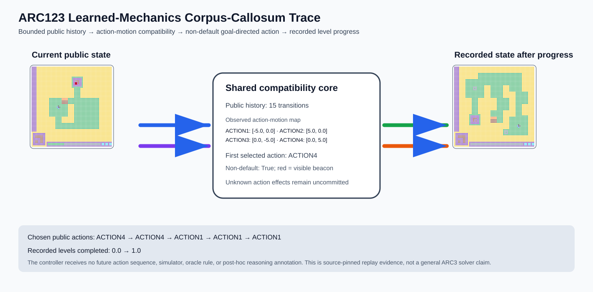

# ARC3 `ls20` L1 Learned-Mechanics Brain Surgery Report

## Outcome: YES — LEARNED MECHANICS CONTRIBUTED TO RECORDED LEVEL PROGRESS

- **Prior public transitions consumed:** `15`
- **Learned action effects:** `4`
- **First action non-default:** `True`
- **Recorded levels completed:** `0.0` → `1.0`
- **Source commit:** `c0f27916881071fe4c9f622383d5c47a3bcc05ab`
- **General ARC3 / ARC-AGI solver claim:** `NO`

## Live-Agent Boundary

The controller receives only public transitions before the live cursor, then one current public frame and currently available actions. It receives no source provenance, cursor, future action sequence, future frame, simulator, post-hoc rule, oracle diff, or reasoning annotation. A non-recorded action is refused rather than simulated.

## Corpus-Callosum Visualization

- Full explicit action/evidence/revision record: [`learning_trace.json`](learning_trace.json)

## Pre-Registered Gate

- At least `4` observed action effects: `True`
- Non-default goal-directed action: `True`
- Every selected action reduces the visible relation: `True`
- Recorded level progress: `True`
- **Gate passed:** `True`

## Observed Action Choices

- `1` `ACTION4`: visible squared distance `237.25` → `172.25`; non-default=`True`; observed match=`True`.
- `2` `ACTION4`: visible squared distance `172.25` → `157.25`; non-default=`True`; observed match=`True`.
- `3` `ACTION1`: visible squared distance `157.25` → `57.25`; non-default=`False`; observed match=`True`.
- `4` `ACTION1`: visible squared distance `57.25` → `7.25`; non-default=`False`; observed match=`True`.
- `5` `ACTION1`: visible squared distance `7.25` → `1.0`; non-default=`False`; observed match=`True`.

## V&V

- Source-pinned trajectory: [demos/human_play/segmented/ls20_L1_human.jsonl](https://github.com/dannaf/SingularityML/blob/c0f27916881071fe4c9f622383d5c47a3bcc05ab/demos/human_play/segmented/ls20_L1_human.jsonl)
- Source content SHA-256: `70f83f41eb54ec81cf8ac0ec9e4e0b1a4ec5ccf4ab9868f48513f0d08a00434d`
- Controller oracle-boundary scan: `pass`
- Re-run with `--verify` reconstructs every artifact in a temporary directory and compares all SHA-256 hashes.
- This is bounded causal replay evidence only; it is not a benchmark submission or a claim of broad ARC capability.

## Observable IHL Walkthrough

The record contains explicit actions, predictions, feedback, and revisions; it does not claim or store hidden model reasoning.

### Action totals

- `APPLY_LOCALLY`: 6
- `ATTEND`: 1
- `BIND_PARAMETER`: 4
- `COMMIT`: 1
- `COMPARE`: 5
- `FIND_COUNTEREXAMPLE`: 1
- `PROMOTE_CONSTRAINT`: 2
- `PROPOSE`: 6
- `SPECIALIZE`: 1

### Decision milestones

- `0` `ATTEND` — `{"future_transition_visible":false,"live_oracle_visible":false,"observation":{"metadata":{"oracle_visible":false,"replay_cursor":15,"source_category":"observable_real_action_trajectory"},"observation_id":"arc3-ls20-l1-learned-mechanics:step:15","observation_kind":"external_public_game_state","payload":{"available_actions":["ACTION1","ACTION2","ACTION3","ACTION4"],"frame":{"grid_summary":{"colors":[0,1,3,4,5,8,9,11,12],"height":64,"width":64}},"levels_completed":0,"score":0,"state":"GameState.NOT_FINISHED"},"world_id":"arc3-ls20-l1-learned-mechanics"},"public_history_transition_count":15,"theory_id":"T0001"}`
- `1` `PROPOSE` — `{"mechanics_prediction":"action effects remain UNKNOWN until observed","theory":{"contradiction_count":0,"counterexamples":[],"description_length":1,"evaluated_demo_indices":[],"history":[{"kind":"ADD_RULE","parameters":{"effect":"action_effects_unknown","learned_store_initially_empty":true,"unobserved_actions_remain_unknown":true},"target":"environment-effect"}],"matching_cell_count":0,"name":"environment_transition(effect=action_effects_unknown)","parameter_bindings":{},"parent_theory_id":"T0000","rules":[{"description_length":1,"name":"environment_transition(effect=action_effects_unknown)","operation":"environment_transition","parameters":{"effect":"action_effects_unknown"},"rule_id":"environment-effect","scope":{"kind":"all","value":null}}],"scope_predicates":[{"kind":"all","value":null}],"theory_id":"T0001","unknown_cell_count":0,"unresolved_unknown":[]},"theory_id":"T0001"}`
- `4` `SPECIALIZE` — `{"parent_theory_id":"T0001","revised_rule":{"description_length":1,"name":"environment_transition(effect=action_motion_map)","operation":"environment_transition","parameters":{"effect":"action_motion_map"},"rule_id":"environment-effect","scope":{"kind":"all","value":null}},"theory_id":"T0002"}`
- `9` `PROMOTE_CONSTRAINT` — `{"controlled_component":{"area":10,"color":12,"shape":[[0,0],[0,1],[0,2],[0,3],[0,4],[1,0],[1,1],[1,2],[1,3],[1,4]]},"stable_beacon_count":2,"status":"public_action_motion_map_retained","theory_id":"T0002","unobserved_actions_remain_unknown":true}`
- `10` `PROPOSE` — `{"action_index":0,"choice":{"action":{"action_type":"external_key","parameters":{"key":"ACTION4"}},"aligned_axis":"column","aligned_axis_residual_after":4.0,"beacon":{"bbox":[13,35,13,35],"center":[13.0,35.0],"signature":{"area":1,"color":9,"shape":[[0,0]]}},"default_action":{"action_type":"external_key","parameters":{"key":"ACTION1"}},"goal_distance_after":172.25,"goal_distance_before":237.25,"goal_relation_component":{"bbox":[25,24,26,28],"center":[25.5,26.0],"signature":{"area":10,"color":12,"shape":[[0,0],[0,1],[0,2],[0,3],[0,4],[1,0],[1,1],[1,2],[1,3],[1,4]]}},"is_non_default":true,"predicted_delta":[0.0,5.0],"primary_component":{"bbox":[25,24,26,28],"center":[25.5,26.0],"signature":{"area":10,"color":12,"shape":[[0,0],[0,1],[0,2],[0,3],[0,4],[1,0],[1,1],[1,2],[1,3],[1,4]]}},"selection_rule":"visible_axis_alignment_then_goal_distance"},"phase":"goal_directed_action_selection","theory_id":"T0002"}`
- `13` `PROPOSE` — `{"action_index":1,"choice":{"action":{"action_type":"external_key","parameters":{"key":"ACTION4"}},"aligned_axis":"column","aligned_axis_residual_after":1.0,"beacon":{"bbox":[13,35,13,35],"center":[13.0,35.0],"signature":{"area":1,"color":9,"shape":[[0,0]]}},"default_action":{"action_type":"external_key","parameters":{"key":"ACTION1"}},"goal_distance_after":157.25,"goal_distance_before":172.25,"goal_relation_component":{"bbox":[25,29,26,33],"center":[25.5,31.0],"signature":{"area":10,"color":12,"shape":[[0,0],[0,1],[0,2],[0,3],[0,4],[1,0],[1,1],[1,2],[1,3],[1,4]]}},"is_non_default":true,"predicted_delta":[0.0,5.0],"primary_component":{"bbox":[25,29,26,33],"center":[25.5,31.0],"signature":{"area":10,"color":12,"shape":[[0,0],[0,1],[0,2],[0,3],[0,4],[1,0],[1,1],[1,2],[1,3],[1,4]]}},"selection_rule":"visible_axis_alignment_then_goal_distance"},"phase":"goal_directed_action_selection","theory_id":"T0002"}`
- `16` `PROPOSE` — `{"action_index":2,"choice":{"action":{"action_type":"external_key","parameters":{"key":"ACTION1"}},"aligned_axis":"row","aligned_axis_residual_after":7.5,"beacon":{"bbox":[13,35,13,35],"center":[13.0,35.0],"signature":{"area":1,"color":9,"shape":[[0,0]]}},"default_action":{"action_type":"external_key","parameters":{"key":"ACTION1"}},"goal_distance_after":57.25,"goal_distance_before":157.25,"goal_relation_component":{"bbox":[25,34,26,38],"center":[25.5,36.0],"signature":{"area":10,"color":12,"shape":[[0,0],[0,1],[0,2],[0,3],[0,4],[1,0],[1,1],[1,2],[1,3],[1,4]]}},"is_non_default":false,"predicted_delta":[-5.0,0.0],"primary_component":{"bbox":[25,34,26,38],"center":[25.5,36.0],"signature":{"area":10,"color":12,"shape":[[0,0],[0,1],[0,2],[0,3],[0,4],[1,0],[1,1],[1,2],[1,3],[1,4]]}},"selection_rule":"visible_axis_alignment_then_goal_distance"},"phase":"goal_directed_action_selection","theory_id":"T0002"}`
- `19` `PROPOSE` — `{"action_index":3,"choice":{"action":{"action_type":"external_key","parameters":{"key":"ACTION1"}},"aligned_axis":"row","aligned_axis_residual_after":2.5,"beacon":{"bbox":[13,35,13,35],"center":[13.0,35.0],"signature":{"area":1,"color":9,"shape":[[0,0]]}},"default_action":{"action_type":"external_key","parameters":{"key":"ACTION1"}},"goal_distance_after":7.25,"goal_distance_before":57.25,"goal_relation_component":{"bbox":[20,34,21,38],"center":[20.5,36.0],"signature":{"area":10,"color":12,"shape":[[0,0],[0,1],[0,2],[0,3],[0,4],[1,0],[1,1],[1,2],[1,3],[1,4]]}},"is_non_default":false,"predicted_delta":[-5.0,0.0],"primary_component":{"bbox":[20,34,21,38],"center":[20.5,36.0],"signature":{"area":10,"color":12,"shape":[[0,0],[0,1],[0,2],[0,3],[0,4],[1,0],[1,1],[1,2],[1,3],[1,4]]}},"selection_rule":"visible_axis_alignment_then_goal_distance"},"phase":"goal_directed_action_selection","theory_id":"T0002"}`
- `22` `PROPOSE` — `{"action_index":4,"choice":{"action":{"action_type":"external_key","parameters":{"key":"ACTION1"}},"aligned_axis":"row","aligned_axis_residual_after":0.0,"beacon":{"bbox":[13,35,13,35],"center":[13.0,35.0],"signature":{"area":1,"color":9,"shape":[[0,0]]}},"default_action":{"action_type":"external_key","parameters":{"key":"ACTION1"}},"goal_distance_after":1.0,"goal_distance_before":7.25,"goal_relation_component":{"bbox":[17,34,19,38],"center":[18.0,36.0],"signature":{"area":15,"color":9,"shape":[[0,0],[0,1],[0,2],[0,3],[0,4],[1,0],[1,1],[1,2],[1,3],[1,4],[2,0],[2,1],[2,2],[2,3],[2,4]]}},"is_non_default":false,"predicted_delta":[-5.0,0.0],"primary_component":{"bbox":[15,34,16,38],"center":[15.5,36.0],"signature":{"area":10,"color":12,"shape":[[0,0],[0,1],[0,2],[0,3],[0,4],[1,0],[1,1],[1,2],[1,3],[1,4]]}},"selection_rule":"visible_axis_alignment_then_goal_distance"},"phase":"goal_directed_action_selection","theory_id":"T0002"}`
- `25` `PROMOTE_CONSTRAINT` — `{"initial_progress":0.0,"observed_progress":1.0,"status":"recorded_goal_directed_actions_contributed_to_level_progress","theory_id":"T0002"}`
- `26` `COMMIT` — `{"completion_claim":"source_pinned_recorded_replay_mechanics_evidence_not_a_general_arc3_solver","final_theory":{"contradiction_count":0,"counterexamples":[],"description_length":1,"evaluated_demo_indices":[],"history":[{"kind":"ADD_RULE","parameters":{"effect":"action_effects_unknown","learned_store_initially_empty":true,"unobserved_actions_remain_unknown":true},"target":"environment-effect"},{"kind":"SPECIALIZE","parameters":{"from_effect":"action_effects_unknown","source":"bounded_public_history","to_effect":"action_motion_map"},"target":"environment-effect"}],"learned_motion_model":{"action_effects":[{"delta":[-5.0,0.0],"key":"ACTION1","support_count":7},{"delta":[5.0,0.0],"key":"ACTION2","support_count":3},{"delta":[0.0,-5.0],"key":"ACTION3","support_count":3},{"delta":[0.0,5.0],"key":"ACTION4","support_count":1}],"beacon_signatures":[{"area":1,"color":9,"shape":[[0,0]]},{"area":5,"color":9,"shape":[[0,0],[0,1],[0,2],[1,2],[2,2]]}],"co_moving_colors":[9,12],"co_moving_components":[{"area":10,"color":12,"shape":[[0,0],[0,1],[0,2],[0,3],[0,4],[1,0],[1,1],[1,2],[1,3],[1,4]]},{"area":15,"color":9,"shape":[[0,0],[0,1],[0,2],[0,3],[0,4],[1,0],[1,1],[1,2],[1,3],[1,4],[2,0],[2,1],[2,2],[2,3],[2,4]]}],"controlled_component":{"area":10,"color":12,"shape":[[0,0],[0,1],[0,2],[0,3],[0,4],[1,0],[1,1],[1,2],[1,3],[1,4]]},"history_transition_count":15,"unobserved_actions_remain_unknown":true},"matching_cell_count":0,"name":"environment_transition(effect=action_motion_map)","parameter_bindings":{},"parent_theory_id":"T0001","rules":[{"description_length":1,"name":"environment_transition(effect=action_motion_map)","operation":"environment_transition","parameters":{"effect":"action_motion_map"},"rule_id":"environment-effect","scope":{"kind":"all","value":null}}],"scope_predicates":[{"kind":"all","value":null}],"theory_id":"T0002","unknown_cell_count":0,"unresolved_unknown":[]},"goal_directed_action_confirmed":true,"level_progress_observed":true,"mechanics_learning_confirmed":true,"non_default_action_confirmed":true,"selected_hypothesis":"environment_transition(effect=action_motion_map)","theory_id":"T0002"}`

### First counterexamples

- `3` — `{"causal_next_operation":"specialize_to_observed_action_motion_map","counterexample":{"distinct_observed_actions":4,"observation":"repeatable_action_conditioned_motion","prior_effect":"action_effects_unknown"},"theory_id":"T0001"}`
