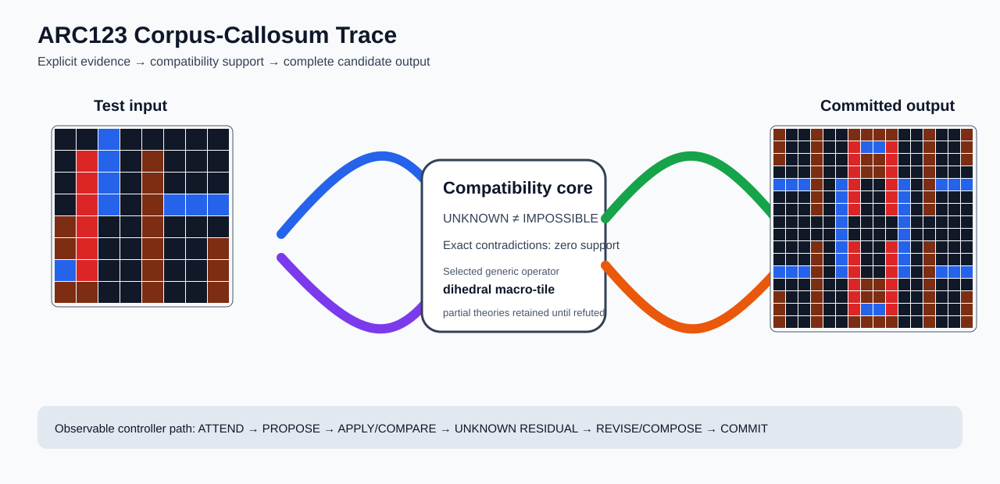

# ARC1 `833dafe3` IHL Brain Surgery Report

## Outcome: YES — ALL TEST CELLS MATCH

- **Compared positions:** 256
- **Mismatched cells:** 0
- **Source commit:** `085f6dbe39050afac3d1d743f840bac95b1a8d1c`
- **Selected hypothesis:** `compose(identity,dihedral_tile(column_factor=2,row_factor=2,template=rotate_180;flip_tb;flip_lr;identity))`
- **Training compatibility:** `True`
- **Fallback used:** `False`

## Live-Agent Boundary

The controller receives only training input/output evidence and the test input. It receives no task ID, historical schema/decomposition, GT feature contract, GT solver, or test target. The expected test output below is accessed only after the complete prediction is committed for V&V.

## Corpus-Callosum Visualization



- Full explicit event record: [`learning_trace.json`](learning_trace.json)

The diagram shows the actual test input, the typed compatibility core, and the committed full prediction. It renders observable operations only; it does not fabricate a one-to-one causal fiber where the selected program is only a factor-level dependency.

## Post-Answer V&V

### Test case 1
- **All cells match:** `True`
- **Mismatched cells:** `0`
- **Prediction:**
```json
[[9, 0, 0, 9, 0, 0, 9, 9, 9, 9, 0, 0, 9, 0, 0, 9], [9, 0, 0, 9, 0, 0, 2, 1, 1, 2, 0, 0, 9, 0, 0, 9], [9, 0, 0, 9, 0, 0, 2, 9, 9, 2, 0, 0, 9, 0, 0, 9], [0, 0, 0, 9, 0, 0, 2, 9, 9, 2, 0, 0, 9, 0, 0, 0], [1, 1, 1, 9, 0, 1, 2, 0, 0, 2, 1, 0, 9, 1, 1, 1], [0, 0, 0, 9, 0, 1, 2, 0, 0, 2, 1, 0, 9, 0, 0, 0], [0, 0, 0, 9, 0, 1, 2, 0, 0, 2, 1, 0, 9, 0, 0, 0], [0, 0, 0, 0, 0, 1, 0, 0, 0, 0, 1, 0, 0, 0, 0, 0], [0, 0, 0, 0, 0, 1, 0, 0, 0, 0, 1, 0, 0, 0, 0, 0], [0, 0, 0, 9, 0, 1, 2, 0, 0, 2, 1, 0, 9, 0, 0, 0], [0, 0, 0, 9, 0, 1, 2, 0, 0, 2, 1, 0, 9, 0, 0, 0], [1, 1, 1, 9, 0, 1, 2, 0, 0, 2, 1, 0, 9, 1, 1, 1], [0, 0, 0, 9, 0, 0, 2, 9, 9, 2, 0, 0, 9, 0, 0, 0], [9, 0, 0, 9, 0, 0, 2, 9, 9, 2, 0, 0, 9, 0, 0, 9], [9, 0, 0, 9, 0, 0, 2, 1, 1, 2, 0, 0, 9, 0, 0, 9], [9, 0, 0, 9, 0, 0, 9, 9, 9, 9, 0, 0, 9, 0, 0, 9]]
```
- **Expected output (post-answer only):**
```json
[[9, 0, 0, 9, 0, 0, 9, 9, 9, 9, 0, 0, 9, 0, 0, 9], [9, 0, 0, 9, 0, 0, 2, 1, 1, 2, 0, 0, 9, 0, 0, 9], [9, 0, 0, 9, 0, 0, 2, 9, 9, 2, 0, 0, 9, 0, 0, 9], [0, 0, 0, 9, 0, 0, 2, 9, 9, 2, 0, 0, 9, 0, 0, 0], [1, 1, 1, 9, 0, 1, 2, 0, 0, 2, 1, 0, 9, 1, 1, 1], [0, 0, 0, 9, 0, 1, 2, 0, 0, 2, 1, 0, 9, 0, 0, 0], [0, 0, 0, 9, 0, 1, 2, 0, 0, 2, 1, 0, 9, 0, 0, 0], [0, 0, 0, 0, 0, 1, 0, 0, 0, 0, 1, 0, 0, 0, 0, 0], [0, 0, 0, 0, 0, 1, 0, 0, 0, 0, 1, 0, 0, 0, 0, 0], [0, 0, 0, 9, 0, 1, 2, 0, 0, 2, 1, 0, 9, 0, 0, 0], [0, 0, 0, 9, 0, 1, 2, 0, 0, 2, 1, 0, 9, 0, 0, 0], [1, 1, 1, 9, 0, 1, 2, 0, 0, 2, 1, 0, 9, 1, 1, 1], [0, 0, 0, 9, 0, 0, 2, 9, 9, 2, 0, 0, 9, 0, 0, 0], [9, 0, 0, 9, 0, 0, 2, 9, 9, 2, 0, 0, 9, 0, 0, 9], [9, 0, 0, 9, 0, 0, 2, 1, 1, 2, 0, 0, 9, 0, 0, 9], [9, 0, 0, 9, 0, 0, 9, 9, 9, 9, 0, 0, 9, 0, 0, 9]]
```

## Observable IHL Walkthrough

The record contains explicit actions, predictions, feedback, and revisions; it does not claim or store hidden model reasoning.

### Action totals

- `APPLY_HYPOTHESIS`: 25
- `ATTEND`: 25
- `CHOOSE_NEXT_DEMO`: 25
- `COMMIT`: 1
- `COMPARE`: 25
- `COMPOSE_RULE`: 9
- `EXPLAIN_RESIDUAL`: 9
- `FIND_COUNTEREXAMPLE`: 3
- `MERGE_RULES`: 1
- `PROMOTE_CONSTRAINT`: 7
- `PROPOSE`: 5
- `SPECIALIZE`: 7

### Decision milestones

- `0` `PROPOSE` — `{"parent_theory_id":"T0000","rule":{"description_length":1,"name":"identity","operation":"identity","parameters":{},"rule_id":"identity","scope":{"kind":"all","value":null}},"stage":"initial_generic_theories","theory_id":"T0001"}`
- `1` `PROPOSE` — `{"parent_theory_id":"T0000","rule":{"description_length":3,"name":"tile_repeat(column_factor=2,row_factor=2)","operation":"full_operator","parameters":{"column_factor":2,"operator":"tile_repeat","row_factor":2},"rule_id":"rule-tile_repeat","scope":{"kind":"all","value":null}},"stage":"initial_generic_theories","theory_id":"T0002"}`
- `2` `PROPOSE` — `{"parent_theory_id":"T0000","rule":{"description_length":2,"name":"left_right(scope=all)","operation":"coordinate_transform","parameters":{"axis":"left_right"},"rule_id":"coordinate-left_right","scope":{"kind":"all","value":null}},"stage":"initial_generic_theories","theory_id":"T0003"}`
- `3` `PROPOSE` — `{"parent_theory_id":"T0000","rule":{"description_length":2,"name":"top_bottom(scope=all)","operation":"coordinate_transform","parameters":{"axis":"top_bottom"},"rule_id":"coordinate-top_bottom","scope":{"kind":"all","value":null}},"stage":"initial_generic_theories","theory_id":"T0004"}`
- `4` `PROPOSE` — `{"parent_theory_id":"T0000","rule":{"description_length":2,"name":"rotate_180(scope=all)","operation":"coordinate_transform","parameters":{"axis":"rotate_180"},"rule_id":"coordinate-rotate_180","scope":{"kind":"all","value":null}},"stage":"initial_generic_theories","theory_id":"T0005"}`
- `6` `ATTEND` — `{"reason":"initial_highest_observed_change_and_color_discrimination","selected_demo":1,"selected_region":{"region":"whole_demo"},"theory_id":"T0001"}`
- `10` `ATTEND` — `{"reason":"initial_highest_observed_change_and_color_discrimination","selected_demo":1,"selected_region":{"region":"whole_demo"},"theory_id":"T0003"}`
- `14` `ATTEND` — `{"reason":"initial_highest_observed_change_and_color_discrimination","selected_demo":1,"selected_region":{"region":"whole_demo"},"theory_id":"T0004"}`
- `18` `ATTEND` — `{"reason":"initial_highest_observed_change_and_color_discrimination","selected_demo":1,"selected_region":{"region":"whole_demo"},"theory_id":"T0005"}`
- `22` `ATTEND` — `{"reason":"initial_highest_observed_change_and_color_discrimination","selected_demo":1,"selected_region":{"column":1,"row":0},"theory_id":"T0002"}`
- `26` `ATTEND` — `{"reason":"unseen_demo_selected_for_residual_version_space_discrimination","selected_demo":0,"selected_region":{"region":"whole_demo"},"theory_id":"T0001"}`
- `30` `ATTEND` — `{"reason":"unseen_demo_selected_for_residual_version_space_discrimination","selected_demo":0,"selected_region":{"region":"whole_demo"},"theory_id":"T0003"}`
- `34` `ATTEND` — `{"reason":"unseen_demo_selected_for_residual_version_space_discrimination","selected_demo":0,"selected_region":{"region":"whole_demo"},"theory_id":"T0004"}`
- `38` `ATTEND` — `{"reason":"unseen_demo_selected_for_residual_version_space_discrimination","selected_demo":0,"selected_region":{"region":"whole_demo"},"theory_id":"T0005"}`
- `41` `SPECIALIZE` — `{"added_rule":{"description_length":8,"name":"dihedral_tile(column_factor=2,row_factor=2,template=rotate_180;flip_tb;flip_lr;identity)","operation":"full_operator","parameters":{"column_factor":2,"operator":"dihedral_tile","row_factor":2,"template":"rotate_180;flip_tb;flip_lr;identity"},"rule_id":"structural-dihedral_tile","scope":{"kind":"all","value":null}},"parent_theory_id":"T0001","reason":"unexplained_residual_proposed_generic_structural_rule","theory_id":"T0006"}`
- `45` `ATTEND` — `{"reason":"initial_highest_observed_change_and_color_discrimination","selected_demo":1,"selected_region":{"region":"whole_demo"},"theory_id":"T0006"}`
- `49` `ATTEND` — `{"reason":"unseen_demo_selected_for_residual_version_space_discrimination","selected_demo":0,"selected_region":{"region":"whole_demo"},"theory_id":"T0006"}`
- `52` `PROMOTE_CONSTRAINT` — `{"evaluated_demo_count":2,"rule_count":2,"status":"complete_training_compatibility_after_revision","theory_id":"T0006"}`
- `53` `SPECIALIZE` — `{"added_rule":{"description_length":8,"name":"dihedral_tile(column_factor=2,row_factor=2,template=rotate_180;flip_tb;flip_lr;identity)","operation":"full_operator","parameters":{"column_factor":2,"operator":"dihedral_tile","row_factor":2,"template":"rotate_180;flip_tb;flip_lr;identity"},"rule_id":"structural-dihedral_tile","scope":{"kind":"all","value":null}},"parent_theory_id":"T0003","reason":"unexplained_residual_proposed_generic_structural_rule","theory_id":"T0007"}`
- `57` `ATTEND` — `{"reason":"initial_highest_observed_change_and_color_discrimination","selected_demo":1,"selected_region":{"region":"whole_demo"},"theory_id":"T0007"}`
- `61` `ATTEND` — `{"reason":"unseen_demo_selected_for_residual_version_space_discrimination","selected_demo":0,"selected_region":{"region":"whole_demo"},"theory_id":"T0007"}`
- `64` `PROMOTE_CONSTRAINT` — `{"evaluated_demo_count":2,"rule_count":3,"status":"complete_training_compatibility_after_revision","theory_id":"T0007"}`
- `65` `SPECIALIZE` — `{"added_rule":{"description_length":8,"name":"dihedral_tile(column_factor=2,row_factor=2,template=rotate_180;flip_tb;flip_lr;identity)","operation":"full_operator","parameters":{"column_factor":2,"operator":"dihedral_tile","row_factor":2,"template":"rotate_180;flip_tb;flip_lr;identity"},"rule_id":"structural-dihedral_tile","scope":{"kind":"all","value":null}},"parent_theory_id":"T0004","reason":"unexplained_residual_proposed_generic_structural_rule","theory_id":"T0008"}`
- `69` `ATTEND` — `{"reason":"initial_highest_observed_change_and_color_discrimination","selected_demo":1,"selected_region":{"region":"whole_demo"},"theory_id":"T0008"}`
- `73` `ATTEND` — `{"reason":"unseen_demo_selected_for_residual_version_space_discrimination","selected_demo":0,"selected_region":{"region":"whole_demo"},"theory_id":"T0008"}`
- `76` `PROMOTE_CONSTRAINT` — `{"evaluated_demo_count":2,"rule_count":3,"status":"complete_training_compatibility_after_revision","theory_id":"T0008"}`
- `77` `SPECIALIZE` — `{"added_rule":{"description_length":8,"name":"dihedral_tile(column_factor=2,row_factor=2,template=rotate_180;flip_tb;flip_lr;identity)","operation":"full_operator","parameters":{"column_factor":2,"operator":"dihedral_tile","row_factor":2,"template":"rotate_180;flip_tb;flip_lr;identity"},"rule_id":"structural-dihedral_tile","scope":{"kind":"all","value":null}},"parent_theory_id":"T0005","reason":"unexplained_residual_proposed_generic_structural_rule","theory_id":"T0009"}`
- `81` `ATTEND` — `{"reason":"initial_highest_observed_change_and_color_discrimination","selected_demo":1,"selected_region":{"region":"whole_demo"},"theory_id":"T0009"}`
- `85` `ATTEND` — `{"reason":"unseen_demo_selected_for_residual_version_space_discrimination","selected_demo":0,"selected_region":{"region":"whole_demo"},"theory_id":"T0009"}`
- `88` `PROMOTE_CONSTRAINT` — `{"evaluated_demo_count":2,"rule_count":3,"status":"complete_training_compatibility_after_revision","theory_id":"T0009"}`
- `92` `SPECIALIZE` — `{"added_rule":{"description_length":8,"name":"dihedral_tile(column_factor=2,row_factor=2,template=rotate_180;flip_tb;flip_lr;identity)","operation":"full_operator","parameters":{"column_factor":2,"operator":"dihedral_tile","row_factor":2,"template":"rotate_180;flip_tb;flip_lr;identity"},"rule_id":"structural-dihedral_tile","scope":{"kind":"all","value":null}},"parent_theory_id":"T0002","reason":"unexplained_residual_proposed_generic_structural_rule","theory_id":"T0011"}`
- `96` `ATTEND` — `{"reason":"initial_highest_observed_change_and_color_discrimination","selected_demo":1,"selected_region":{"column":2,"row":0},"theory_id":"T0010"}`
- `100` `ATTEND` — `{"reason":"initial_highest_observed_change_and_color_discrimination","selected_demo":1,"selected_region":{"region":"whole_demo"},"theory_id":"T0011"}`
- `104` `ATTEND` — `{"reason":"unseen_demo_selected_for_residual_version_space_discrimination","selected_demo":0,"selected_region":{"region":"whole_demo"},"theory_id":"T0011"}`
- `107` `PROMOTE_CONSTRAINT` — `{"evaluated_demo_count":2,"rule_count":3,"status":"complete_training_compatibility_after_revision","theory_id":"T0011"}`
- `111` `SPECIALIZE` — `{"added_rule":{"description_length":8,"name":"dihedral_tile(column_factor=2,row_factor=2,template=rotate_180;flip_tb;flip_lr;identity)","operation":"full_operator","parameters":{"column_factor":2,"operator":"dihedral_tile","row_factor":2,"template":"rotate_180;flip_tb;flip_lr;identity"},"rule_id":"structural-dihedral_tile","scope":{"kind":"all","value":null}},"parent_theory_id":"T0010","reason":"unexplained_residual_proposed_generic_structural_rule","theory_id":"T0013"}`
- `115` `ATTEND` — `{"reason":"initial_highest_observed_change_and_color_discrimination","selected_demo":1,"selected_region":{"column":0,"row":0},"theory_id":"T0012"}`
- `119` `ATTEND` — `{"reason":"initial_highest_observed_change_and_color_discrimination","selected_demo":1,"selected_region":{"region":"whole_demo"},"theory_id":"T0013"}`
- `123` `ATTEND` — `{"reason":"unseen_demo_selected_for_residual_version_space_discrimination","selected_demo":0,"selected_region":{"region":"whole_demo"},"theory_id":"T0013"}`
- `126` `PROMOTE_CONSTRAINT` — `{"evaluated_demo_count":2,"rule_count":4,"status":"complete_training_compatibility_after_revision","theory_id":"T0013"}`
- `128` `SPECIALIZE` — `{"added_rule":{"description_length":8,"name":"dihedral_tile(column_factor=2,row_factor=2,template=rotate_180;flip_tb;flip_lr;identity)","operation":"full_operator","parameters":{"column_factor":2,"operator":"dihedral_tile","row_factor":2,"template":"rotate_180;flip_tb;flip_lr;identity"},"rule_id":"structural-dihedral_tile","scope":{"kind":"all","value":null}},"parent_theory_id":"T0012","reason":"unexplained_residual_proposed_generic_structural_rule","theory_id":"T0014"}`
- `132` `ATTEND` — `{"reason":"initial_highest_observed_change_and_color_discrimination","selected_demo":1,"selected_region":{"region":"whole_demo"},"theory_id":"T0014"}`
- `136` `ATTEND` — `{"reason":"unseen_demo_selected_for_residual_version_space_discrimination","selected_demo":0,"selected_region":{"region":"whole_demo"},"theory_id":"T0014"}`
- `139` `PROMOTE_CONSTRAINT` — `{"evaluated_demo_count":2,"rule_count":5,"status":"complete_training_compatibility_after_revision","theory_id":"T0014"}`
- `140` `MERGE_RULES` — `{"compatible_theory_ids":["T0006","T0007","T0008","T0009","T0011","T0013","T0014"],"complete_prediction_group_size":7}`
- `141` `COMMIT` — `{"complete_prediction_group_count":1,"final_theory":{"contradiction_count":0,"counterexamples":[],"description_length":9,"evaluated_demo_indices":[0,1],"history":[{"kind":"ADD_RULE","parameters":{"initial_proposal":true,"operation":"identity"},"target":"identity"},{"kind":"ATTEND","parameters":{"information_score":[64,0,4],"reason":"initial_highest_observed_change_and_color_discrimination"},"target":"demo:1"},{"kind":"ATTEND","parameters":{"information_score":[36,0,4],"reason":"unseen_demo_selected_for_residual_version_space_discrimination"},"target":"demo:0"},{"kind":"ADD_RULE","parameters":{"observed_residual_ranking":{"contradiction_count":0,"matching_cell_count":100,"unknown_cell_count":0},"operator":"dihedral_tile","proposal_family":"structural_residual"},"target":"structural-dihedral_tile"},{"kind":"ATTEND","parameters":{"information_score":[64,0,4],"reason":"initial_highest_observed_change_and_color_discrimination"},"target":"demo:1"},{"kind":"ATTEND","parameters":{"information_score":[36,0,4],"reason":"unseen_demo_selected_for_residual_version_space_discrimination"},"target":"demo:0"}],"matching_cell_count":100,"name":"compose(identity,dihedral_tile(column_factor=2,row_factor=2,template=rotate_180;flip_tb;flip_lr;identity))","parameter_bindings":{},"parent_theory_id":"T0001","rules":[{"description_length":1,"name":"identity","operation":"identity","parameters":{},"rule_id":"identity","scope":{"kind":"all","value":null}},{"description_length":8,"name":"dihedral_tile(column_factor=2,row_factor=2,template=rotate_180;flip_tb;flip_lr;identity)","operation":"full_operator","parameters":{"column_factor":2,"operator":"dihedral_tile","row_factor":2,"template":"rotate_180;flip_tb;flip_lr;identity"},"rule_id":"structural-dihedral_tile","scope":{"kind":"all","value":null}}],"scope_predicates":[{"kind":"all","value":null},{"kind":"all","value":null}],"theory_id":"T0006","unknown_cell_count":0,"unresolved_unknown":[]},"posterior_mass":1.0,"selected_hypothesis":"compose(identity,dihedral_tile(column_factor=2,row_factor=2,template=rotate_180;flip_tb;flip_lr;identity))","theory_id":"T0006","training_exact":true}`

### First counterexamples

- `89` — `{"causal_next_operation":"scope_or_rule_revision","counterexample":{"column":1,"demo_index":1,"observed":3,"predicted":6,"row":0},"responsible_rule":{"description_length":3,"name":"tile_repeat(column_factor=2,row_factor=2)","operation":"full_operator","parameters":{"column_factor":2,"operator":"tile_repeat","row_factor":2},"rule_id":"rule-tile_repeat","scope":{"kind":"all","value":null}},"responsible_rule_id":"rule-tile_repeat","theory_id":"T0002"}`
- `108` — `{"causal_next_operation":"scope_or_rule_revision","counterexample":{"column":2,"demo_index":1,"observed":3,"predicted":0,"row":0},"responsible_rule":{"description_length":3,"name":"tile_repeat(column_factor=2,row_factor=2)","operation":"full_operator","parameters":{"column_factor":2,"operator":"tile_repeat","row_factor":2},"rule_id":"rule-tile_repeat","scope":{"kind":"all","value":null}},"responsible_rule_id":"rule-tile_repeat","theory_id":"T0010"}`
- `127` — `{"causal_next_operation":"scope_or_rule_revision","counterexample":{"column":0,"demo_index":1,"observed":0,"predicted":3,"row":0},"responsible_rule":{"description_length":2,"name":"recolor(to=3,scope=color==0)","operation":"recolor_scoped","parameters":{"to_color":3},"rule_id":"recolor-color-0-to-3","scope":{"kind":"color_equals","value":0}},"responsible_rule_id":"recolor-color-0-to-3","theory_id":"T0012"}`
