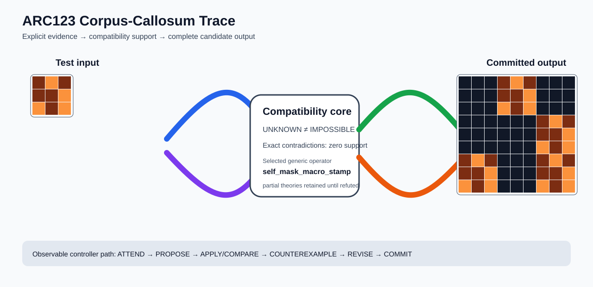

# ARC1 `48f8583b` IHL Brain Surgery Report

## Outcome: YES — ALL TEST CELLS MATCH

- **Compared positions:** 81
- **Mismatched cells:** 0
- **Source commit:** `085f6dbe39050afac3d1d743f840bac95b1a8d1c`
- **Selected hypothesis:** `self_mask_macro_stamp(blank_color=0,selector=least_frequent,template=input)`
- **Training compatibility:** `True`
- **Fallback used:** `False`

## Live-Agent Boundary

The controller receives only training input/output evidence and the test input. It receives no task ID, historical schema/decomposition, GT feature contract, GT solver, or test target. The expected test output below is accessed only after the complete prediction is committed for V&V.

## Corpus-Callosum Visualization



- Full explicit event record: [`learning_trace.json`](learning_trace.json)

The diagram shows the actual test input, the typed compatibility core, and the committed full prediction. It renders observable operations only; it does not fabricate a one-to-one causal fiber where the selected program is only a factor-level dependency.

## Post-Answer V&V

### Test case 1
- **All cells match:** `True`
- **Mismatched cells:** `0`
- **Prediction:**
```json
[[0, 0, 0, 9, 7, 9, 0, 0, 0], [0, 0, 0, 9, 9, 7, 0, 0, 0], [0, 0, 0, 7, 9, 7, 0, 0, 0], [0, 0, 0, 0, 0, 0, 9, 7, 9], [0, 0, 0, 0, 0, 0, 9, 9, 7], [0, 0, 0, 0, 0, 0, 7, 9, 7], [9, 7, 9, 0, 0, 0, 9, 7, 9], [9, 9, 7, 0, 0, 0, 9, 9, 7], [7, 9, 7, 0, 0, 0, 7, 9, 7]]
```
- **Expected output (post-answer only):**
```json
[[0, 0, 0, 9, 7, 9, 0, 0, 0], [0, 0, 0, 9, 9, 7, 0, 0, 0], [0, 0, 0, 7, 9, 7, 0, 0, 0], [0, 0, 0, 0, 0, 0, 9, 7, 9], [0, 0, 0, 0, 0, 0, 9, 9, 7], [0, 0, 0, 0, 0, 0, 7, 9, 7], [9, 7, 9, 0, 0, 0, 9, 7, 9], [9, 9, 7, 0, 0, 0, 9, 9, 7], [7, 9, 7, 0, 0, 0, 7, 9, 7]]
```

## Observable IHL Walkthrough

The record contains explicit actions, predictions, feedback, and revisions; it does not claim or store hidden model reasoning.

### Action totals

- `APPLY_HYPOTHESIS`: 38
- `ATTEND`: 38
- `CHOOSE_NEXT_DEMO`: 38
- `COMMIT`: 1
- `COMPARE`: 38
- `COMPOSE_RULE`: 2
- `EXPLAIN_RESIDUAL`: 2
- `FIND_COUNTEREXAMPLE`: 8
- `PROMOTE_CONSTRAINT`: 1
- `PROPOSE`: 6
- `REJECT_RULE`: 5

### Decision milestones

- `0` `PROPOSE` — `{"parent_theory_id":"T0000","rule":{"description_length":1,"name":"identity","operation":"identity","parameters":{},"rule_id":"identity","scope":{"kind":"all","value":null}},"stage":"initial_generic_theories","theory_id":"T0001"}`
- `1` `PROPOSE` — `{"parent_theory_id":"T0000","rule":{"description_length":3,"name":"tile_repeat(column_factor=3,row_factor=3)","operation":"full_operator","parameters":{"column_factor":3,"operator":"tile_repeat","row_factor":3},"rule_id":"rule-tile_repeat","scope":{"kind":"all","value":null}},"stage":"initial_generic_theories","theory_id":"T0002"}`
- `2` `PROPOSE` — `{"parent_theory_id":"T0000","rule":{"description_length":5,"name":"self_mask_macro_stamp(blank_color=0,selector=least_frequent,template=input)","operation":"full_operator","parameters":{"blank_color":0,"operator":"self_mask_macro_stamp","selector":"least_frequent","template":"input"},"rule_id":"rule-self_mask_macro_stamp","scope":{"kind":"all","value":null}},"stage":"initial_generic_theories","theory_id":"T0003"}`
- `3` `PROPOSE` — `{"parent_theory_id":"T0000","rule":{"description_length":2,"name":"left_right(scope=all)","operation":"coordinate_transform","parameters":{"axis":"left_right"},"rule_id":"coordinate-left_right","scope":{"kind":"all","value":null}},"stage":"initial_generic_theories","theory_id":"T0004"}`
- `4` `PROPOSE` — `{"parent_theory_id":"T0000","rule":{"description_length":2,"name":"top_bottom(scope=all)","operation":"coordinate_transform","parameters":{"axis":"top_bottom"},"rule_id":"coordinate-top_bottom","scope":{"kind":"all","value":null}},"stage":"initial_generic_theories","theory_id":"T0005"}`
- `5` `PROPOSE` — `{"parent_theory_id":"T0000","rule":{"description_length":2,"name":"rotate_180(scope=all)","operation":"coordinate_transform","parameters":{"axis":"rotate_180"},"rule_id":"coordinate-rotate_180","scope":{"kind":"all","value":null}},"stage":"initial_generic_theories","theory_id":"T0006"}`
- `7` `ATTEND` — `{"reason":"initial_highest_observed_change_and_color_discrimination","selected_demo":0,"selected_region":{"region":"whole_demo"},"theory_id":"T0001"}`
- `11` `ATTEND` — `{"reason":"initial_highest_observed_change_and_color_discrimination","selected_demo":0,"selected_region":{"region":"whole_demo"},"theory_id":"T0004"}`
- `15` `ATTEND` — `{"reason":"initial_highest_observed_change_and_color_discrimination","selected_demo":0,"selected_region":{"region":"whole_demo"},"theory_id":"T0005"}`
- `19` `ATTEND` — `{"reason":"initial_highest_observed_change_and_color_discrimination","selected_demo":0,"selected_region":{"region":"whole_demo"},"theory_id":"T0006"}`
- `23` `ATTEND` — `{"reason":"initial_highest_observed_change_and_color_discrimination","selected_demo":0,"selected_region":{"column":0,"row":0},"theory_id":"T0002"}`
- `27` `ATTEND` — `{"reason":"initial_highest_observed_change_and_color_discrimination","selected_demo":0,"selected_region":{"region":"whole_demo"},"theory_id":"T0003"}`
- `31` `ATTEND` — `{"reason":"unseen_demo_selected_for_residual_version_space_discrimination","selected_demo":3,"selected_region":{"region":"whole_demo"},"theory_id":"T0003"}`
- `35` `ATTEND` — `{"reason":"unseen_demo_selected_for_residual_version_space_discrimination","selected_demo":1,"selected_region":{"region":"whole_demo"},"theory_id":"T0003"}`
- `39` `ATTEND` — `{"reason":"unseen_demo_selected_for_residual_version_space_discrimination","selected_demo":4,"selected_region":{"region":"whole_demo"},"theory_id":"T0003"}`
- `43` `ATTEND` — `{"reason":"unseen_demo_selected_for_residual_version_space_discrimination","selected_demo":2,"selected_region":{"region":"whole_demo"},"theory_id":"T0003"}`
- `47` `ATTEND` — `{"reason":"unseen_demo_selected_for_residual_version_space_discrimination","selected_demo":5,"selected_region":{"region":"whole_demo"},"theory_id":"T0003"}`
- `50` `PROMOTE_CONSTRAINT` — `{"evaluated_demo_count":6,"rule_count":1,"status":"complete_training_compatibility_after_revision","theory_id":"T0003"}`
- `52` `ATTEND` — `{"reason":"unseen_demo_selected_for_residual_version_space_discrimination","selected_demo":3,"selected_region":{"region":"whole_demo"},"theory_id":"T0001"}`
- `56` `ATTEND` — `{"reason":"unseen_demo_selected_for_residual_version_space_discrimination","selected_demo":3,"selected_region":{"region":"whole_demo"},"theory_id":"T0004"}`
- `60` `ATTEND` — `{"reason":"unseen_demo_selected_for_residual_version_space_discrimination","selected_demo":3,"selected_region":{"region":"whole_demo"},"theory_id":"T0005"}`
- `64` `ATTEND` — `{"reason":"unseen_demo_selected_for_residual_version_space_discrimination","selected_demo":3,"selected_region":{"region":"whole_demo"},"theory_id":"T0006"}`
- `68` `ATTEND` — `{"reason":"unseen_demo_selected_for_residual_version_space_discrimination","selected_demo":1,"selected_region":{"region":"whole_demo"},"theory_id":"T0001"}`
- `72` `ATTEND` — `{"reason":"unseen_demo_selected_for_residual_version_space_discrimination","selected_demo":1,"selected_region":{"region":"whole_demo"},"theory_id":"T0004"}`
- `76` `ATTEND` — `{"reason":"unseen_demo_selected_for_residual_version_space_discrimination","selected_demo":1,"selected_region":{"region":"whole_demo"},"theory_id":"T0005"}`
- `80` `ATTEND` — `{"reason":"unseen_demo_selected_for_residual_version_space_discrimination","selected_demo":1,"selected_region":{"region":"whole_demo"},"theory_id":"T0006"}`
- `84` `ATTEND` — `{"reason":"unseen_demo_selected_for_residual_version_space_discrimination","selected_demo":4,"selected_region":{"region":"whole_demo"},"theory_id":"T0001"}`
- `88` `ATTEND` — `{"reason":"unseen_demo_selected_for_residual_version_space_discrimination","selected_demo":4,"selected_region":{"region":"whole_demo"},"theory_id":"T0004"}`
- `92` `ATTEND` — `{"reason":"unseen_demo_selected_for_residual_version_space_discrimination","selected_demo":4,"selected_region":{"region":"whole_demo"},"theory_id":"T0005"}`
- `96` `ATTEND` — `{"reason":"unseen_demo_selected_for_residual_version_space_discrimination","selected_demo":4,"selected_region":{"region":"whole_demo"},"theory_id":"T0006"}`
- `100` `ATTEND` — `{"reason":"unseen_demo_selected_for_residual_version_space_discrimination","selected_demo":2,"selected_region":{"region":"whole_demo"},"theory_id":"T0001"}`
- `104` `ATTEND` — `{"reason":"unseen_demo_selected_for_residual_version_space_discrimination","selected_demo":2,"selected_region":{"region":"whole_demo"},"theory_id":"T0004"}`
- `108` `ATTEND` — `{"reason":"unseen_demo_selected_for_residual_version_space_discrimination","selected_demo":2,"selected_region":{"region":"whole_demo"},"theory_id":"T0005"}`
- `112` `ATTEND` — `{"reason":"unseen_demo_selected_for_residual_version_space_discrimination","selected_demo":2,"selected_region":{"region":"whole_demo"},"theory_id":"T0006"}`
- `116` `ATTEND` — `{"reason":"unseen_demo_selected_for_residual_version_space_discrimination","selected_demo":5,"selected_region":{"region":"whole_demo"},"theory_id":"T0001"}`
- `120` `ATTEND` — `{"reason":"unseen_demo_selected_for_residual_version_space_discrimination","selected_demo":5,"selected_region":{"region":"whole_demo"},"theory_id":"T0004"}`
- `124` `ATTEND` — `{"reason":"unseen_demo_selected_for_residual_version_space_discrimination","selected_demo":5,"selected_region":{"region":"whole_demo"},"theory_id":"T0005"}`
- `128` `ATTEND` — `{"reason":"unseen_demo_selected_for_residual_version_space_discrimination","selected_demo":5,"selected_region":{"region":"whole_demo"},"theory_id":"T0006"}`
- `139` `ATTEND` — `{"reason":"initial_highest_observed_change_and_color_discrimination","selected_demo":0,"selected_region":{"column":2,"row":0},"theory_id":"T0007"}`
- `146` `ATTEND` — `{"reason":"initial_highest_observed_change_and_color_discrimination","selected_demo":0,"selected_region":{"column":3,"row":0},"theory_id":"T0008"}`
- `151` `ATTEND` — `{"reason":"unseen_demo_selected_for_residual_version_space_discrimination","selected_demo":3,"selected_region":{"column":3,"row":0},"theory_id":"T0008"}`
- `156` `ATTEND` — `{"reason":"unseen_demo_selected_for_residual_version_space_discrimination","selected_demo":1,"selected_region":{"column":0,"row":0},"theory_id":"T0008"}`
- `161` `ATTEND` — `{"reason":"unseen_demo_selected_for_residual_version_space_discrimination","selected_demo":4,"selected_region":{"column":1,"row":0},"theory_id":"T0008"}`
- `166` `ATTEND` — `{"reason":"unseen_demo_selected_for_residual_version_space_discrimination","selected_demo":2,"selected_region":{"column":0,"row":0},"theory_id":"T0008"}`
- `171` `ATTEND` — `{"reason":"unseen_demo_selected_for_residual_version_space_discrimination","selected_demo":5,"selected_region":{"column":6,"row":0},"theory_id":"T0008"}`
- `176` `COMMIT` — `{"complete_prediction_group_count":1,"final_theory":{"contradiction_count":0,"counterexamples":[],"description_length":5,"evaluated_demo_indices":[0,1,2,3,4,5],"history":[{"kind":"ADD_RULE","parameters":{"initial_proposal":true,"operation":"full_operator"},"target":"rule-self_mask_macro_stamp"},{"kind":"ATTEND","parameters":{"information_score":[81,1,5],"reason":"initial_highest_observed_change_and_color_discrimination"},"target":"demo:0"},{"kind":"ATTEND","parameters":{"information_score":[81,1,5],"reason":"unseen_demo_selected_for_residual_version_space_discrimination"},"target":"demo:3"},{"kind":"ATTEND","parameters":{"information_score":[81,1,4],"reason":"unseen_demo_selected_for_residual_version_space_discrimination"},"target":"demo:1"},{"kind":"ATTEND","parameters":{"information_score":[81,1,4],"reason":"unseen_demo_selected_for_residual_version_space_discrimination"},"target":"demo:4"},{"kind":"ATTEND","parameters":{"information_score":[81,1,3],"reason":"unseen_demo_selected_for_residual_version_space_discrimination"},"target":"demo:2"},{"kind":"ATTEND","parameters":{"information_score":[81,1,3],"reason":"unseen_demo_selected_for_residual_version_space_discrimination"},"target":"demo:5"}],"matching_cell_count":486,"name":"self_mask_macro_stamp(blank_color=0,selector=least_frequent,template=input)","parameter_bindings":{},"parent_theory_id":"T0000","rules":[{"description_length":5,"name":"self_mask_macro_stamp(blank_color=0,selector=least_frequent,template=input)","operation":"full_operator","parameters":{"blank_color":0,"operator":"self_mask_macro_stamp","selector":"least_frequent","template":"input"},"rule_id":"rule-self_mask_macro_stamp","scope":{"kind":"all","value":null}}],"scope_predicates":[{"kind":"all","value":null}],"theory_id":"T0003","unknown_cell_count":0,"unresolved_unknown":[]},"posterior_mass":1.0,"selected_hypothesis":"self_mask_macro_stamp(blank_color=0,selector=least_frequent,template=input)","theory_id":"T0003","training_exact":true}`

### First counterexamples

- `135` — `{"causal_next_operation":"scope_or_rule_revision","counterexample":{"column":0,"demo_index":0,"observed":0,"predicted":9,"row":0},"responsible_rule":{"description_length":3,"name":"tile_repeat(column_factor=3,row_factor=3)","operation":"full_operator","parameters":{"column_factor":3,"operator":"tile_repeat","row_factor":3},"rule_id":"rule-tile_repeat","scope":{"kind":"all","value":null}},"responsible_rule_id":"rule-tile_repeat","theory_id":"T0002"}`
- `142` — `{"causal_next_operation":"scope_or_rule_revision","counterexample":{"column":2,"demo_index":0,"observed":0,"predicted":6,"row":0},"responsible_rule":{"description_length":3,"name":"tile_repeat(column_factor=3,row_factor=3)","operation":"full_operator","parameters":{"column_factor":3,"operator":"tile_repeat","row_factor":3},"rule_id":"rule-tile_repeat","scope":{"kind":"all","value":null}},"responsible_rule_id":"rule-tile_repeat","theory_id":"T0007"}`
- `149` — `{"causal_next_operation":"scope_or_rule_revision","counterexample":{"column":3,"demo_index":0,"observed":0,"predicted":9,"row":0},"responsible_rule":{"description_length":3,"name":"tile_repeat(column_factor=3,row_factor=3)","operation":"full_operator","parameters":{"column_factor":3,"operator":"tile_repeat","row_factor":3},"rule_id":"rule-tile_repeat","scope":{"kind":"all","value":null}},"responsible_rule_id":"rule-tile_repeat","theory_id":"T0008"}`
- `154` — `{"causal_next_operation":"scope_or_rule_revision","counterexample":{"column":3,"demo_index":0,"observed":0,"predicted":9,"row":0},"responsible_rule":{"description_length":3,"name":"tile_repeat(column_factor=3,row_factor=3)","operation":"full_operator","parameters":{"column_factor":3,"operator":"tile_repeat","row_factor":3},"rule_id":"rule-tile_repeat","scope":{"kind":"all","value":null}},"responsible_rule_id":"rule-tile_repeat","theory_id":"T0008"}`
- `159` — `{"causal_next_operation":"scope_or_rule_revision","counterexample":{"column":3,"demo_index":0,"observed":0,"predicted":9,"row":0},"responsible_rule":{"description_length":3,"name":"tile_repeat(column_factor=3,row_factor=3)","operation":"full_operator","parameters":{"column_factor":3,"operator":"tile_repeat","row_factor":3},"rule_id":"rule-tile_repeat","scope":{"kind":"all","value":null}},"responsible_rule_id":"rule-tile_repeat","theory_id":"T0008"}`
- `3` additional explicit counterexamples are retained in `learning_trace.json`.
