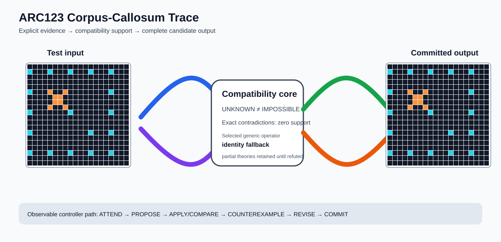

# ARC2 `dfadab01` P0013-ARC12-FRESH-FILENAME-FROZEN-50 Brain Surgery Report

## Outcome: NO — TEST CELLS DO NOT ALL MATCH

- **Compared positions:** 400
- **Mismatched cells:** 135
- **Training compatibility:** `False`
- **Fallback used:** `True`
- **Selected hypothesis:** `fallback_identity_complete_grid`
- **Source commit:** `71f86ff4c5304e452e0659131171f0519b50e21c`
- **Frozen controller commit:** `f767df1e8c03dfad47abf65d2b99b72a4dbe91e4`

## Live-Agent Boundary

The controller receives only visible training input/output examples and test inputs. It receives no task ID, imported cohort metadata, GT feature contract, GT solver, historical decomposition, or held-out output before committing a complete grid. The expected output appears only in post-answer V&V.

## Corpus-Callosum Visualization



- Full explicit event record: [`learning_trace.json`](learning_trace.json)

## Frozen Measurement

The controller bytes, generic operator vocabulary, source task checksums, and cohort membership were frozen before this task was parsed or scored. This result cannot tune the frozen controller.

## Post-Answer V&V

### Test case 1
- **All cells match:** `False`
- **Mismatched cells:** `135`
- **Prediction:**
```json
[[0, 0, 0, 0, 0, 0, 0, 0, 0, 0, 0, 0, 0, 0, 0, 0, 0, 0, 0, 0], [8, 0, 0, 0, 8, 0, 0, 0, 8, 0, 0, 0, 8, 0, 0, 0, 8, 0, 0, 0], [0, 0, 0, 0, 0, 0, 0, 0, 0, 0, 0, 0, 0, 0, 0, 0, 0, 0, 0, 0], [0, 0, 0, 0, 0, 0, 0, 0, 0, 0, 0, 0, 0, 0, 0, 0, 0, 0, 0, 0], [0, 0, 0, 0, 0, 0, 0, 0, 0, 0, 0, 0, 0, 0, 0, 0, 0, 0, 0, 0], [8, 0, 0, 0, 7, 0, 0, 7, 0, 0, 0, 0, 0, 0, 0, 0, 8, 0, 0, 0], [0, 0, 0, 0, 0, 7, 7, 0, 0, 0, 0, 0, 0, 0, 0, 0, 0, 0, 0, 0], [0, 0, 0, 0, 0, 7, 7, 0, 0, 0, 0, 0, 0, 0, 0, 0, 0, 0, 0, 0], [0, 0, 0, 0, 7, 0, 0, 7, 0, 0, 0, 0, 0, 0, 0, 0, 0, 0, 0, 0], [8, 0, 0, 0, 0, 0, 0, 0, 8, 0, 0, 0, 0, 0, 0, 0, 8, 0, 0, 0], [0, 0, 0, 0, 0, 0, 0, 0, 0, 0, 0, 0, 0, 0, 0, 0, 0, 0, 0, 0], [0, 0, 0, 0, 0, 0, 0, 0, 0, 0, 0, 0, 0, 0, 0, 0, 0, 0, 0, 0], [0, 0, 0, 0, 0, 0, 0, 0, 0, 0, 0, 0, 0, 0, 0, 0, 0, 0, 0, 0], [8, 0, 0, 0, 0, 0, 0, 0, 0, 0, 0, 0, 8, 0, 0, 0, 8, 0, 0, 0], [0, 0, 0, 0, 0, 0, 0, 0, 0, 0, 0, 0, 0, 0, 0, 0, 0, 0, 0, 0], [0, 0, 0, 0, 0, 0, 0, 0, 0, 0, 0, 0, 0, 0, 0, 0, 0, 0, 0, 0], [0, 0, 0, 0, 0, 0, 0, 0, 0, 0, 0, 0, 0, 0, 0, 0, 0, 0, 0, 0], [8, 0, 0, 0, 8, 0, 0, 0, 8, 0, 0, 0, 8, 0, 0, 0, 8, 0, 0, 0], [0, 0, 0, 0, 0, 0, 0, 0, 0, 0, 0, 0, 0, 0, 0, 0, 0, 0, 0, 0], [0, 0, 0, 0, 0, 0, 0, 0, 0, 0, 0, 0, 0, 0, 0, 0, 0, 0, 0, 0]]
```
- **Expected output (post-answer only):**
```json
[[0, 0, 0, 0, 0, 0, 0, 0, 0, 0, 0, 0, 0, 0, 0, 0, 0, 0, 0, 0], [7, 0, 0, 7, 7, 0, 0, 7, 7, 0, 0, 7, 7, 0, 0, 7, 7, 0, 0, 7], [0, 7, 7, 0, 0, 7, 7, 0, 0, 7, 7, 0, 0, 7, 7, 0, 0, 7, 7, 0], [0, 7, 7, 0, 0, 7, 7, 0, 0, 7, 7, 0, 0, 7, 7, 0, 0, 7, 7, 0], [7, 0, 0, 7, 7, 0, 0, 7, 7, 0, 0, 7, 7, 0, 0, 7, 7, 0, 0, 7], [7, 0, 0, 7, 0, 0, 0, 0, 0, 0, 0, 0, 0, 0, 0, 0, 7, 0, 0, 7], [0, 7, 7, 0, 0, 0, 0, 0, 0, 0, 0, 0, 0, 0, 0, 0, 0, 7, 7, 0], [0, 7, 7, 0, 0, 0, 0, 0, 0, 0, 0, 0, 0, 0, 0, 0, 0, 7, 7, 0], [7, 0, 0, 7, 0, 0, 0, 0, 0, 0, 0, 0, 0, 0, 0, 0, 7, 0, 0, 7], [7, 0, 0, 7, 0, 0, 0, 0, 0, 0, 0, 0, 0, 0, 0, 0, 7, 0, 0, 7], [0, 7, 7, 0, 0, 0, 0, 0, 0, 0, 0, 0, 0, 0, 0, 0, 0, 7, 7, 0], [0, 7, 7, 0, 0, 0, 0, 0, 0, 0, 0, 0, 0, 0, 0, 0, 0, 7, 7, 0], [7, 0, 0, 7, 0, 0, 0, 0, 0, 0, 0, 0, 0, 0, 0, 0, 7, 0, 0, 7], [7, 0, 0, 7, 0, 0, 0, 0, 0, 0, 0, 0, 7, 0, 0, 7, 7, 0, 0, 7], [0, 7, 7, 0, 0, 0, 0, 0, 0, 0, 0, 0, 0, 7, 7, 0, 0, 7, 7, 0], [0, 7, 7, 0, 0, 0, 0, 0, 0, 0, 0, 0, 0, 7, 7, 0, 0, 7, 7, 0], [7, 0, 0, 7, 0, 0, 0, 0, 0, 0, 0, 0, 7, 0, 0, 7, 7, 0, 0, 7], [7, 0, 0, 7, 7, 0, 0, 7, 7, 0, 0, 7, 7, 0, 0, 7, 7, 0, 0, 7], [0, 7, 7, 0, 0, 7, 7, 0, 0, 7, 7, 0, 0, 7, 7, 0, 0, 7, 7, 0], [0, 7, 7, 0, 0, 7, 7, 0, 0, 7, 7, 0, 0, 7, 7, 0, 0, 7, 7, 0]]
```

## Observable IHL Walkthrough

The record contains explicit actions, predictions, feedback, and revisions; it does not claim or store hidden model reasoning.

### Action totals

- `APPLY_HYPOTHESIS`: 89
- `ATTEND`: 89
- `CHOOSE_NEXT_DEMO`: 89
- `COMMIT`: 1
- `COMPARE`: 89
- `COMPOSE_RULE`: 7
- `EXPLAIN_RESIDUAL`: 7
- `FIND_COUNTEREXAMPLE`: 7
- `PROPOSE`: 35
- `SPECIALIZE`: 77

### Decision milestones

- `0` `PROPOSE` — `{"parent_theory_id":"T0000","rule":{"description_length":1,"name":"identity","operation":"identity","parameters":{},"rule_id":"identity","scope":{"kind":"all","value":null}},"stage":"initial_generic_theories","theory_id":"T0001"}`
- `1` `PROPOSE` — `{"parent_theory_id":"T0000","rule":{"description_length":3,"name":"translate(column_offset=-19,row_offset=-19)","operation":"full_operator","parameters":{"column_offset":-19,"operator":"translate","row_offset":-19},"rule_id":"rule-translate","scope":{"kind":"all","value":null}},"stage":"initial_generic_theories","theory_id":"T0002"}`
- `2` `PROPOSE` — `{"parent_theory_id":"T0000","rule":{"description_length":3,"name":"translate(column_offset=-18,row_offset=-19)","operation":"full_operator","parameters":{"column_offset":-18,"operator":"translate","row_offset":-19},"rule_id":"rule-translate","scope":{"kind":"all","value":null}},"stage":"initial_generic_theories","theory_id":"T0003"}`
- `3` `PROPOSE` — `{"parent_theory_id":"T0000","rule":{"description_length":3,"name":"translate(column_offset=-17,row_offset=-19)","operation":"full_operator","parameters":{"column_offset":-17,"operator":"translate","row_offset":-19},"rule_id":"rule-translate","scope":{"kind":"all","value":null}},"stage":"initial_generic_theories","theory_id":"T0004"}`
- `4` `PROPOSE` — `{"parent_theory_id":"T0000","rule":{"description_length":3,"name":"translate(column_offset=-16,row_offset=-19)","operation":"full_operator","parameters":{"column_offset":-16,"operator":"translate","row_offset":-19},"rule_id":"rule-translate","scope":{"kind":"all","value":null}},"stage":"initial_generic_theories","theory_id":"T0005"}`
- `5` `PROPOSE` — `{"parent_theory_id":"T0000","rule":{"description_length":3,"name":"translate(column_offset=-15,row_offset=-19)","operation":"full_operator","parameters":{"column_offset":-15,"operator":"translate","row_offset":-19},"rule_id":"rule-translate","scope":{"kind":"all","value":null}},"stage":"initial_generic_theories","theory_id":"T0006"}`
- `6` `PROPOSE` — `{"parent_theory_id":"T0000","rule":{"description_length":3,"name":"translate(column_offset=-14,row_offset=-19)","operation":"full_operator","parameters":{"column_offset":-14,"operator":"translate","row_offset":-19},"rule_id":"rule-translate","scope":{"kind":"all","value":null}},"stage":"initial_generic_theories","theory_id":"T0007"}`
- `7` `PROPOSE` — `{"parent_theory_id":"T0000","rule":{"description_length":3,"name":"translate(column_offset=-13,row_offset=-19)","operation":"full_operator","parameters":{"column_offset":-13,"operator":"translate","row_offset":-19},"rule_id":"rule-translate","scope":{"kind":"all","value":null}},"stage":"initial_generic_theories","theory_id":"T0008"}`
- `8` `PROPOSE` — `{"parent_theory_id":"T0000","rule":{"description_length":3,"name":"translate(column_offset=-12,row_offset=-19)","operation":"full_operator","parameters":{"column_offset":-12,"operator":"translate","row_offset":-19},"rule_id":"rule-translate","scope":{"kind":"all","value":null}},"stage":"initial_generic_theories","theory_id":"T0009"}`
- `9` `PROPOSE` — `{"parent_theory_id":"T0000","rule":{"description_length":3,"name":"translate(column_offset=-11,row_offset=-19)","operation":"full_operator","parameters":{"column_offset":-11,"operator":"translate","row_offset":-19},"rule_id":"rule-translate","scope":{"kind":"all","value":null}},"stage":"initial_generic_theories","theory_id":"T0010"}`
- `10` `PROPOSE` — `{"parent_theory_id":"T0000","rule":{"description_length":3,"name":"translate(column_offset=-10,row_offset=-19)","operation":"full_operator","parameters":{"column_offset":-10,"operator":"translate","row_offset":-19},"rule_id":"rule-translate","scope":{"kind":"all","value":null}},"stage":"initial_generic_theories","theory_id":"T0011"}`
- `11` `PROPOSE` — `{"parent_theory_id":"T0000","rule":{"description_length":3,"name":"translate(column_offset=-9,row_offset=-19)","operation":"full_operator","parameters":{"column_offset":-9,"operator":"translate","row_offset":-19},"rule_id":"rule-translate","scope":{"kind":"all","value":null}},"stage":"initial_generic_theories","theory_id":"T0012"}`
- `12` `PROPOSE` — `{"parent_theory_id":"T0000","rule":{"description_length":3,"name":"translate(column_offset=-8,row_offset=-19)","operation":"full_operator","parameters":{"column_offset":-8,"operator":"translate","row_offset":-19},"rule_id":"rule-translate","scope":{"kind":"all","value":null}},"stage":"initial_generic_theories","theory_id":"T0013"}`
- `13` `PROPOSE` — `{"parent_theory_id":"T0000","rule":{"description_length":3,"name":"translate(column_offset=-7,row_offset=-19)","operation":"full_operator","parameters":{"column_offset":-7,"operator":"translate","row_offset":-19},"rule_id":"rule-translate","scope":{"kind":"all","value":null}},"stage":"initial_generic_theories","theory_id":"T0014"}`
- `14` `PROPOSE` — `{"parent_theory_id":"T0000","rule":{"description_length":3,"name":"translate(column_offset=-6,row_offset=-19)","operation":"full_operator","parameters":{"column_offset":-6,"operator":"translate","row_offset":-19},"rule_id":"rule-translate","scope":{"kind":"all","value":null}},"stage":"initial_generic_theories","theory_id":"T0015"}`
- `15` `PROPOSE` — `{"parent_theory_id":"T0000","rule":{"description_length":3,"name":"translate(column_offset=-5,row_offset=-19)","operation":"full_operator","parameters":{"column_offset":-5,"operator":"translate","row_offset":-19},"rule_id":"rule-translate","scope":{"kind":"all","value":null}},"stage":"initial_generic_theories","theory_id":"T0016"}`
- `16` `PROPOSE` — `{"parent_theory_id":"T0000","rule":{"description_length":3,"name":"translate(column_offset=-4,row_offset=-19)","operation":"full_operator","parameters":{"column_offset":-4,"operator":"translate","row_offset":-19},"rule_id":"rule-translate","scope":{"kind":"all","value":null}},"stage":"initial_generic_theories","theory_id":"T0017"}`
- `17` `PROPOSE` — `{"parent_theory_id":"T0000","rule":{"description_length":3,"name":"translate(column_offset=-3,row_offset=-19)","operation":"full_operator","parameters":{"column_offset":-3,"operator":"translate","row_offset":-19},"rule_id":"rule-translate","scope":{"kind":"all","value":null}},"stage":"initial_generic_theories","theory_id":"T0018"}`
- `18` `PROPOSE` — `{"parent_theory_id":"T0000","rule":{"description_length":3,"name":"translate(column_offset=-2,row_offset=-19)","operation":"full_operator","parameters":{"column_offset":-2,"operator":"translate","row_offset":-19},"rule_id":"rule-translate","scope":{"kind":"all","value":null}},"stage":"initial_generic_theories","theory_id":"T0019"}`
- `19` `PROPOSE` — `{"parent_theory_id":"T0000","rule":{"description_length":3,"name":"translate(column_offset=-1,row_offset=-19)","operation":"full_operator","parameters":{"column_offset":-1,"operator":"translate","row_offset":-19},"rule_id":"rule-translate","scope":{"kind":"all","value":null}},"stage":"initial_generic_theories","theory_id":"T0020"}`
- `20` `PROPOSE` — `{"parent_theory_id":"T0000","rule":{"description_length":3,"name":"translate(column_offset=0,row_offset=-19)","operation":"full_operator","parameters":{"column_offset":0,"operator":"translate","row_offset":-19},"rule_id":"rule-translate","scope":{"kind":"all","value":null}},"stage":"initial_generic_theories","theory_id":"T0021"}`
- `21` `PROPOSE` — `{"parent_theory_id":"T0000","rule":{"description_length":3,"name":"translate(column_offset=1,row_offset=-19)","operation":"full_operator","parameters":{"column_offset":1,"operator":"translate","row_offset":-19},"rule_id":"rule-translate","scope":{"kind":"all","value":null}},"stage":"initial_generic_theories","theory_id":"T0022"}`
- `22` `PROPOSE` — `{"parent_theory_id":"T0000","rule":{"description_length":3,"name":"translate(column_offset=2,row_offset=-19)","operation":"full_operator","parameters":{"column_offset":2,"operator":"translate","row_offset":-19},"rule_id":"rule-translate","scope":{"kind":"all","value":null}},"stage":"initial_generic_theories","theory_id":"T0023"}`
- `23` `PROPOSE` — `{"parent_theory_id":"T0000","rule":{"description_length":3,"name":"translate(column_offset=3,row_offset=-19)","operation":"full_operator","parameters":{"column_offset":3,"operator":"translate","row_offset":-19},"rule_id":"rule-translate","scope":{"kind":"all","value":null}},"stage":"initial_generic_theories","theory_id":"T0024"}`
- `24` `PROPOSE` — `{"parent_theory_id":"T0000","rule":{"description_length":3,"name":"translate(column_offset=4,row_offset=-19)","operation":"full_operator","parameters":{"column_offset":4,"operator":"translate","row_offset":-19},"rule_id":"rule-translate","scope":{"kind":"all","value":null}},"stage":"initial_generic_theories","theory_id":"T0025"}`
- `25` `PROPOSE` — `{"parent_theory_id":"T0000","rule":{"description_length":3,"name":"translate(column_offset=5,row_offset=-19)","operation":"full_operator","parameters":{"column_offset":5,"operator":"translate","row_offset":-19},"rule_id":"rule-translate","scope":{"kind":"all","value":null}},"stage":"initial_generic_theories","theory_id":"T0026"}`
- `26` `PROPOSE` — `{"parent_theory_id":"T0000","rule":{"description_length":3,"name":"translate(column_offset=6,row_offset=-19)","operation":"full_operator","parameters":{"column_offset":6,"operator":"translate","row_offset":-19},"rule_id":"rule-translate","scope":{"kind":"all","value":null}},"stage":"initial_generic_theories","theory_id":"T0027"}`
- `27` `PROPOSE` — `{"parent_theory_id":"T0000","rule":{"description_length":3,"name":"translate(column_offset=7,row_offset=-19)","operation":"full_operator","parameters":{"column_offset":7,"operator":"translate","row_offset":-19},"rule_id":"rule-translate","scope":{"kind":"all","value":null}},"stage":"initial_generic_theories","theory_id":"T0028"}`
- `28` `PROPOSE` — `{"parent_theory_id":"T0000","rule":{"description_length":3,"name":"translate(column_offset=8,row_offset=-19)","operation":"full_operator","parameters":{"column_offset":8,"operator":"translate","row_offset":-19},"rule_id":"rule-translate","scope":{"kind":"all","value":null}},"stage":"initial_generic_theories","theory_id":"T0029"}`
- `29` `PROPOSE` — `{"parent_theory_id":"T0000","rule":{"description_length":3,"name":"translate(column_offset=9,row_offset=-19)","operation":"full_operator","parameters":{"column_offset":9,"operator":"translate","row_offset":-19},"rule_id":"rule-translate","scope":{"kind":"all","value":null}},"stage":"initial_generic_theories","theory_id":"T0030"}`
- `30` `PROPOSE` — `{"parent_theory_id":"T0000","rule":{"description_length":3,"name":"translate(column_offset=10,row_offset=-19)","operation":"full_operator","parameters":{"column_offset":10,"operator":"translate","row_offset":-19},"rule_id":"rule-translate","scope":{"kind":"all","value":null}},"stage":"initial_generic_theories","theory_id":"T0031"}`
- `31` `PROPOSE` — `{"parent_theory_id":"T0000","rule":{"description_length":3,"name":"translate(column_offset=11,row_offset=-19)","operation":"full_operator","parameters":{"column_offset":11,"operator":"translate","row_offset":-19},"rule_id":"rule-translate","scope":{"kind":"all","value":null}},"stage":"initial_generic_theories","theory_id":"T0032"}`
- `32` `PROPOSE` — `{"parent_theory_id":"T0000","rule":{"description_length":2,"name":"left_right(scope=all)","operation":"coordinate_transform","parameters":{"axis":"left_right"},"rule_id":"coordinate-left_right","scope":{"kind":"all","value":null}},"stage":"initial_generic_theories","theory_id":"T0033"}`
- `33` `PROPOSE` — `{"parent_theory_id":"T0000","rule":{"description_length":2,"name":"top_bottom(scope=all)","operation":"coordinate_transform","parameters":{"axis":"top_bottom"},"rule_id":"coordinate-top_bottom","scope":{"kind":"all","value":null}},"stage":"initial_generic_theories","theory_id":"T0034"}`
- `34` `PROPOSE` — `{"parent_theory_id":"T0000","rule":{"description_length":2,"name":"rotate_180(scope=all)","operation":"coordinate_transform","parameters":{"axis":"rotate_180"},"rule_id":"coordinate-rotate_180","scope":{"kind":"all","value":null}},"stage":"initial_generic_theories","theory_id":"T0035"}`
- `36` `ATTEND` — `{"reason":"initial_highest_observed_change_and_color_discrimination","selected_demo":3,"selected_region":{"column":0,"row":0},"theory_id":"T0001"}`
- `40` `ATTEND` — `{"reason":"initial_highest_observed_change_and_color_discrimination","selected_demo":3,"selected_region":{"column":0,"row":0},"theory_id":"T0033"}`
- `44` `ATTEND` — `{"reason":"initial_highest_observed_change_and_color_discrimination","selected_demo":3,"selected_region":{"column":0,"row":0},"theory_id":"T0034"}`
- `48` `ATTEND` — `{"reason":"initial_highest_observed_change_and_color_discrimination","selected_demo":3,"selected_region":{"column":0,"row":0},"theory_id":"T0035"}`
- `52` `ATTEND` — `{"reason":"initial_highest_observed_change_and_color_discrimination","selected_demo":3,"selected_region":{"column":0,"row":0},"theory_id":"T0002"}`
- `56` `ATTEND` — `{"reason":"initial_highest_observed_change_and_color_discrimination","selected_demo":3,"selected_region":{"column":0,"row":0},"theory_id":"T0003"}`
- `60` `ATTEND` — `{"reason":"initial_highest_observed_change_and_color_discrimination","selected_demo":3,"selected_region":{"column":0,"row":0},"theory_id":"T0004"}`
- `64` `ATTEND` — `{"reason":"initial_highest_observed_change_and_color_discrimination","selected_demo":3,"selected_region":{"column":0,"row":0},"theory_id":"T0005"}`
- `68` `ATTEND` — `{"reason":"initial_highest_observed_change_and_color_discrimination","selected_demo":3,"selected_region":{"column":0,"row":0},"theory_id":"T0006"}`
- `72` `ATTEND` — `{"reason":"initial_highest_observed_change_and_color_discrimination","selected_demo":3,"selected_region":{"column":0,"row":0},"theory_id":"T0007"}`
- `76` `ATTEND` — `{"reason":"initial_highest_observed_change_and_color_discrimination","selected_demo":3,"selected_region":{"column":0,"row":0},"theory_id":"T0008"}`
- `80` `ATTEND` — `{"reason":"initial_highest_observed_change_and_color_discrimination","selected_demo":3,"selected_region":{"column":0,"row":0},"theory_id":"T0009"}`
- `86` `SPECIALIZE` — `{"added_rule":{"description_length":4,"name":"line_extend(direction=right,fill_color=4,seed_color=2)","operation":"full_operator","parameters":{"direction":"right","fill_color":4,"operator":"line_extend","seed_color":2},"rule_id":"structural-line_extend","scope":{"kind":"all","value":null}},"parent_theory_id":"T0002","reason":"unexplained_residual_proposed_generic_structural_rule","theory_id":"T0037"}`
- `87` `SPECIALIZE` — `{"added_rule":{"description_length":4,"name":"line_extend(direction=down,fill_color=4,seed_color=2)","operation":"full_operator","parameters":{"direction":"down","fill_color":4,"operator":"line_extend","seed_color":2},"rule_id":"structural-line_extend","scope":{"kind":"all","value":null}},"parent_theory_id":"T0002","reason":"unexplained_residual_proposed_generic_structural_rule","theory_id":"T0038"}`
- `88` `SPECIALIZE` — `{"added_rule":{"description_length":4,"name":"row_span_fill(fill_color=4,seed_color=2)","operation":"full_operator","parameters":{"fill_color":4,"operator":"row_span_fill","seed_color":2},"rule_id":"structural-row_span_fill","scope":{"kind":"all","value":null}},"parent_theory_id":"T0002","reason":"unexplained_residual_proposed_generic_structural_rule","theory_id":"T0039"}`
- `89` `SPECIALIZE` — `{"added_rule":{"description_length":4,"name":"row_span_fill(fill_color=4,seed_color=3)","operation":"full_operator","parameters":{"fill_color":4,"operator":"row_span_fill","seed_color":3},"rule_id":"structural-row_span_fill","scope":{"kind":"all","value":null}},"parent_theory_id":"T0002","reason":"unexplained_residual_proposed_generic_structural_rule","theory_id":"T0040"}`
- `90` `SPECIALIZE` — `{"added_rule":{"description_length":4,"name":"line_extend(direction=up,fill_color=4,seed_color=5)","operation":"full_operator","parameters":{"direction":"up","fill_color":4,"operator":"line_extend","seed_color":5},"rule_id":"structural-line_extend","scope":{"kind":"all","value":null}},"parent_theory_id":"T0002","reason":"unexplained_residual_proposed_generic_structural_rule","theory_id":"T0041"}`
- `91` `SPECIALIZE` — `{"added_rule":{"description_length":4,"name":"line_extend(direction=left,fill_color=4,seed_color=8)","operation":"full_operator","parameters":{"direction":"left","fill_color":4,"operator":"line_extend","seed_color":8},"rule_id":"structural-line_extend","scope":{"kind":"all","value":null}},"parent_theory_id":"T0002","reason":"unexplained_residual_proposed_generic_structural_rule","theory_id":"T0042"}`
- `92` `SPECIALIZE` — `{"added_rule":{"description_length":4,"name":"line_extend(direction=left,fill_color=4,seed_color=3)","operation":"full_operator","parameters":{"direction":"left","fill_color":4,"operator":"line_extend","seed_color":3},"rule_id":"structural-line_extend","scope":{"kind":"all","value":null}},"parent_theory_id":"T0002","reason":"unexplained_residual_proposed_generic_structural_rule","theory_id":"T0043"}`
- `93` `SPECIALIZE` — `{"added_rule":{"description_length":4,"name":"line_extend(direction=down,fill_color=1,seed_color=3)","operation":"full_operator","parameters":{"direction":"down","fill_color":1,"operator":"line_extend","seed_color":3},"rule_id":"structural-line_extend","scope":{"kind":"all","value":null}},"parent_theory_id":"T0002","reason":"unexplained_residual_proposed_generic_structural_rule","theory_id":"T0044"}`
- `94` `SPECIALIZE` — `{"added_rule":{"description_length":4,"name":"row_span_fill(fill_color=1,seed_color=3)","operation":"full_operator","parameters":{"fill_color":1,"operator":"row_span_fill","seed_color":3},"rule_id":"structural-row_span_fill","scope":{"kind":"all","value":null}},"parent_theory_id":"T0002","reason":"unexplained_residual_proposed_generic_structural_rule","theory_id":"T0045"}`
- `95` `SPECIALIZE` — `{"added_rule":{"description_length":4,"name":"row_span_fill(fill_color=1,seed_color=2)","operation":"full_operator","parameters":{"fill_color":1,"operator":"row_span_fill","seed_color":2},"rule_id":"structural-row_span_fill","scope":{"kind":"all","value":null}},"parent_theory_id":"T0002","reason":"unexplained_residual_proposed_generic_structural_rule","theory_id":"T0046"}`
- `96` `SPECIALIZE` — `{"added_rule":{"description_length":4,"name":"line_extend(direction=up,fill_color=4,seed_color=3)","operation":"full_operator","parameters":{"direction":"up","fill_color":4,"operator":"line_extend","seed_color":3},"rule_id":"structural-line_extend","scope":{"kind":"all","value":null}},"parent_theory_id":"T0002","reason":"unexplained_residual_proposed_generic_structural_rule","theory_id":"T0047"}`
- `97` `SPECIALIZE` — `{"added_rule":{"description_length":4,"name":"line_extend(direction=up,fill_color=1,seed_color=3)","operation":"full_operator","parameters":{"direction":"up","fill_color":1,"operator":"line_extend","seed_color":3},"rule_id":"structural-line_extend","scope":{"kind":"all","value":null}},"parent_theory_id":"T0002","reason":"unexplained_residual_proposed_generic_structural_rule","theory_id":"T0048"}`
- `99` `ATTEND` — `{"reason":"initial_highest_observed_change_and_color_discrimination","selected_demo":3,"selected_region":{"column":1,"row":0},"theory_id":"T0036"}`
- `103` `ATTEND` — `{"reason":"initial_highest_observed_change_and_color_discrimination","selected_demo":3,"selected_region":{"column":0,"row":0},"theory_id":"T0037"}`
- `107` `ATTEND` — `{"reason":"initial_highest_observed_change_and_color_discrimination","selected_demo":3,"selected_region":{"column":0,"row":0},"theory_id":"T0038"}`
- `111` `ATTEND` — `{"reason":"initial_highest_observed_change_and_color_discrimination","selected_demo":3,"selected_region":{"column":0,"row":0},"theory_id":"T0039"}`
- `115` `ATTEND` — `{"reason":"initial_highest_observed_change_and_color_discrimination","selected_demo":3,"selected_region":{"column":0,"row":0},"theory_id":"T0040"}`
- `119` `ATTEND` — `{"reason":"initial_highest_observed_change_and_color_discrimination","selected_demo":3,"selected_region":{"column":0,"row":0},"theory_id":"T0041"}`
- `123` `ATTEND` — `{"reason":"initial_highest_observed_change_and_color_discrimination","selected_demo":3,"selected_region":{"column":0,"row":0},"theory_id":"T0042"}`
- `127` `ATTEND` — `{"reason":"initial_highest_observed_change_and_color_discrimination","selected_demo":3,"selected_region":{"column":0,"row":0},"theory_id":"T0043"}`
- `131` `ATTEND` — `{"reason":"initial_highest_observed_change_and_color_discrimination","selected_demo":3,"selected_region":{"column":0,"row":0},"theory_id":"T0044"}`
- `135` `ATTEND` — `{"reason":"initial_highest_observed_change_and_color_discrimination","selected_demo":3,"selected_region":{"column":0,"row":0},"theory_id":"T0045"}`
- `139` `ATTEND` — `{"reason":"initial_highest_observed_change_and_color_discrimination","selected_demo":3,"selected_region":{"column":0,"row":0},"theory_id":"T0046"}`
- `143` `ATTEND` — `{"reason":"initial_highest_observed_change_and_color_discrimination","selected_demo":3,"selected_region":{"column":0,"row":0},"theory_id":"T0047"}`
- `149` `SPECIALIZE` — `{"added_rule":{"description_length":4,"name":"line_extend(direction=right,fill_color=4,seed_color=2)","operation":"full_operator","parameters":{"direction":"right","fill_color":4,"operator":"line_extend","seed_color":2},"rule_id":"structural-line_extend","scope":{"kind":"all","value":null}},"parent_theory_id":"T0036","reason":"unexplained_residual_proposed_generic_structural_rule","theory_id":"T0050"}`
- `150` `SPECIALIZE` — `{"added_rule":{"description_length":4,"name":"line_extend(direction=down,fill_color=4,seed_color=2)","operation":"full_operator","parameters":{"direction":"down","fill_color":4,"operator":"line_extend","seed_color":2},"rule_id":"structural-line_extend","scope":{"kind":"all","value":null}},"parent_theory_id":"T0036","reason":"unexplained_residual_proposed_generic_structural_rule","theory_id":"T0051"}`
- `151` `SPECIALIZE` — `{"added_rule":{"description_length":4,"name":"row_span_fill(fill_color=4,seed_color=2)","operation":"full_operator","parameters":{"fill_color":4,"operator":"row_span_fill","seed_color":2},"rule_id":"structural-row_span_fill","scope":{"kind":"all","value":null}},"parent_theory_id":"T0036","reason":"unexplained_residual_proposed_generic_structural_rule","theory_id":"T0052"}`
- `152` `SPECIALIZE` — `{"added_rule":{"description_length":4,"name":"row_span_fill(fill_color=4,seed_color=3)","operation":"full_operator","parameters":{"fill_color":4,"operator":"row_span_fill","seed_color":3},"rule_id":"structural-row_span_fill","scope":{"kind":"all","value":null}},"parent_theory_id":"T0036","reason":"unexplained_residual_proposed_generic_structural_rule","theory_id":"T0053"}`
- `153` `SPECIALIZE` — `{"added_rule":{"description_length":4,"name":"line_extend(direction=up,fill_color=4,seed_color=5)","operation":"full_operator","parameters":{"direction":"up","fill_color":4,"operator":"line_extend","seed_color":5},"rule_id":"structural-line_extend","scope":{"kind":"all","value":null}},"parent_theory_id":"T0036","reason":"unexplained_residual_proposed_generic_structural_rule","theory_id":"T0054"}`
- `154` `SPECIALIZE` — `{"added_rule":{"description_length":4,"name":"line_extend(direction=left,fill_color=4,seed_color=8)","operation":"full_operator","parameters":{"direction":"left","fill_color":4,"operator":"line_extend","seed_color":8},"rule_id":"structural-line_extend","scope":{"kind":"all","value":null}},"parent_theory_id":"T0036","reason":"unexplained_residual_proposed_generic_structural_rule","theory_id":"T0055"}`
- `155` `SPECIALIZE` — `{"added_rule":{"description_length":4,"name":"line_extend(direction=left,fill_color=4,seed_color=3)","operation":"full_operator","parameters":{"direction":"left","fill_color":4,"operator":"line_extend","seed_color":3},"rule_id":"structural-line_extend","scope":{"kind":"all","value":null}},"parent_theory_id":"T0036","reason":"unexplained_residual_proposed_generic_structural_rule","theory_id":"T0056"}`
- `156` `SPECIALIZE` — `{"added_rule":{"description_length":4,"name":"line_extend(direction=down,fill_color=1,seed_color=3)","operation":"full_operator","parameters":{"direction":"down","fill_color":1,"operator":"line_extend","seed_color":3},"rule_id":"structural-line_extend","scope":{"kind":"all","value":null}},"parent_theory_id":"T0036","reason":"unexplained_residual_proposed_generic_structural_rule","theory_id":"T0057"}`
- `157` `SPECIALIZE` — `{"added_rule":{"description_length":4,"name":"row_span_fill(fill_color=1,seed_color=3)","operation":"full_operator","parameters":{"fill_color":1,"operator":"row_span_fill","seed_color":3},"rule_id":"structural-row_span_fill","scope":{"kind":"all","value":null}},"parent_theory_id":"T0036","reason":"unexplained_residual_proposed_generic_structural_rule","theory_id":"T0058"}`
- `158` `SPECIALIZE` — `{"added_rule":{"description_length":4,"name":"row_span_fill(fill_color=1,seed_color=2)","operation":"full_operator","parameters":{"fill_color":1,"operator":"row_span_fill","seed_color":2},"rule_id":"structural-row_span_fill","scope":{"kind":"all","value":null}},"parent_theory_id":"T0036","reason":"unexplained_residual_proposed_generic_structural_rule","theory_id":"T0059"}`
- `159` `SPECIALIZE` — `{"added_rule":{"description_length":4,"name":"line_extend(direction=up,fill_color=4,seed_color=3)","operation":"full_operator","parameters":{"direction":"up","fill_color":4,"operator":"line_extend","seed_color":3},"rule_id":"structural-line_extend","scope":{"kind":"all","value":null}},"parent_theory_id":"T0036","reason":"unexplained_residual_proposed_generic_structural_rule","theory_id":"T0060"}`
- `160` `SPECIALIZE` — `{"added_rule":{"description_length":4,"name":"line_extend(direction=up,fill_color=1,seed_color=3)","operation":"full_operator","parameters":{"direction":"up","fill_color":1,"operator":"line_extend","seed_color":3},"rule_id":"structural-line_extend","scope":{"kind":"all","value":null}},"parent_theory_id":"T0036","reason":"unexplained_residual_proposed_generic_structural_rule","theory_id":"T0061"}`
- `162` `ATTEND` — `{"reason":"initial_highest_observed_change_and_color_discrimination","selected_demo":3,"selected_region":{"column":8,"row":0},"theory_id":"T0049"}`
- `166` `ATTEND` — `{"reason":"initial_highest_observed_change_and_color_discrimination","selected_demo":3,"selected_region":{"column":0,"row":0},"theory_id":"T0050"}`
- `170` `ATTEND` — `{"reason":"initial_highest_observed_change_and_color_discrimination","selected_demo":3,"selected_region":{"column":0,"row":0},"theory_id":"T0051"}`
- `174` `ATTEND` — `{"reason":"initial_highest_observed_change_and_color_discrimination","selected_demo":3,"selected_region":{"column":0,"row":0},"theory_id":"T0052"}`
- `178` `ATTEND` — `{"reason":"initial_highest_observed_change_and_color_discrimination","selected_demo":3,"selected_region":{"column":0,"row":0},"theory_id":"T0053"}`
- `182` `ATTEND` — `{"reason":"initial_highest_observed_change_and_color_discrimination","selected_demo":3,"selected_region":{"column":0,"row":0},"theory_id":"T0054"}`
- `186` `ATTEND` — `{"reason":"initial_highest_observed_change_and_color_discrimination","selected_demo":3,"selected_region":{"column":0,"row":0},"theory_id":"T0055"}`
- `190` `ATTEND` — `{"reason":"initial_highest_observed_change_and_color_discrimination","selected_demo":3,"selected_region":{"column":0,"row":0},"theory_id":"T0056"}`
- `194` `ATTEND` — `{"reason":"initial_highest_observed_change_and_color_discrimination","selected_demo":3,"selected_region":{"column":0,"row":0},"theory_id":"T0057"}`
- `198` `ATTEND` — `{"reason":"initial_highest_observed_change_and_color_discrimination","selected_demo":3,"selected_region":{"column":0,"row":0},"theory_id":"T0058"}`
- `202` `ATTEND` — `{"reason":"initial_highest_observed_change_and_color_discrimination","selected_demo":3,"selected_region":{"column":0,"row":0},"theory_id":"T0059"}`
- `206` `ATTEND` — `{"reason":"initial_highest_observed_change_and_color_discrimination","selected_demo":3,"selected_region":{"column":0,"row":0},"theory_id":"T0060"}`
- `212` `SPECIALIZE` — `{"added_rule":{"description_length":4,"name":"line_extend(direction=down,fill_color=4,seed_color=2)","operation":"full_operator","parameters":{"direction":"down","fill_color":4,"operator":"line_extend","seed_color":2},"rule_id":"structural-line_extend","scope":{"kind":"all","value":null}},"parent_theory_id":"T0050","reason":"unexplained_residual_proposed_generic_structural_rule","theory_id":"T0063"}`
- `213` `SPECIALIZE` — `{"added_rule":{"description_length":4,"name":"row_span_fill(fill_color=4,seed_color=2)","operation":"full_operator","parameters":{"fill_color":4,"operator":"row_span_fill","seed_color":2},"rule_id":"structural-row_span_fill","scope":{"kind":"all","value":null}},"parent_theory_id":"T0050","reason":"unexplained_residual_proposed_generic_structural_rule","theory_id":"T0064"}`
- `214` `SPECIALIZE` — `{"added_rule":{"description_length":4,"name":"row_span_fill(fill_color=4,seed_color=3)","operation":"full_operator","parameters":{"fill_color":4,"operator":"row_span_fill","seed_color":3},"rule_id":"structural-row_span_fill","scope":{"kind":"all","value":null}},"parent_theory_id":"T0050","reason":"unexplained_residual_proposed_generic_structural_rule","theory_id":"T0065"}`
- `215` `SPECIALIZE` — `{"added_rule":{"description_length":4,"name":"line_extend(direction=up,fill_color=4,seed_color=5)","operation":"full_operator","parameters":{"direction":"up","fill_color":4,"operator":"line_extend","seed_color":5},"rule_id":"structural-line_extend","scope":{"kind":"all","value":null}},"parent_theory_id":"T0050","reason":"unexplained_residual_proposed_generic_structural_rule","theory_id":"T0066"}`
- `216` `SPECIALIZE` — `{"added_rule":{"description_length":4,"name":"line_extend(direction=left,fill_color=4,seed_color=8)","operation":"full_operator","parameters":{"direction":"left","fill_color":4,"operator":"line_extend","seed_color":8},"rule_id":"structural-line_extend","scope":{"kind":"all","value":null}},"parent_theory_id":"T0050","reason":"unexplained_residual_proposed_generic_structural_rule","theory_id":"T0067"}`
- `217` `SPECIALIZE` — `{"added_rule":{"description_length":4,"name":"line_extend(direction=left,fill_color=4,seed_color=3)","operation":"full_operator","parameters":{"direction":"left","fill_color":4,"operator":"line_extend","seed_color":3},"rule_id":"structural-line_extend","scope":{"kind":"all","value":null}},"parent_theory_id":"T0050","reason":"unexplained_residual_proposed_generic_structural_rule","theory_id":"T0068"}`
- `218` `SPECIALIZE` — `{"added_rule":{"description_length":4,"name":"line_extend(direction=down,fill_color=1,seed_color=3)","operation":"full_operator","parameters":{"direction":"down","fill_color":1,"operator":"line_extend","seed_color":3},"rule_id":"structural-line_extend","scope":{"kind":"all","value":null}},"parent_theory_id":"T0050","reason":"unexplained_residual_proposed_generic_structural_rule","theory_id":"T0069"}`
- `219` `SPECIALIZE` — `{"added_rule":{"description_length":4,"name":"row_span_fill(fill_color=1,seed_color=3)","operation":"full_operator","parameters":{"fill_color":1,"operator":"row_span_fill","seed_color":3},"rule_id":"structural-row_span_fill","scope":{"kind":"all","value":null}},"parent_theory_id":"T0050","reason":"unexplained_residual_proposed_generic_structural_rule","theory_id":"T0070"}`
- `220` `SPECIALIZE` — `{"added_rule":{"description_length":4,"name":"row_span_fill(fill_color=1,seed_color=2)","operation":"full_operator","parameters":{"fill_color":1,"operator":"row_span_fill","seed_color":2},"rule_id":"structural-row_span_fill","scope":{"kind":"all","value":null}},"parent_theory_id":"T0050","reason":"unexplained_residual_proposed_generic_structural_rule","theory_id":"T0071"}`
- `221` `SPECIALIZE` — `{"added_rule":{"description_length":4,"name":"line_extend(direction=up,fill_color=4,seed_color=3)","operation":"full_operator","parameters":{"direction":"up","fill_color":4,"operator":"line_extend","seed_color":3},"rule_id":"structural-line_extend","scope":{"kind":"all","value":null}},"parent_theory_id":"T0050","reason":"unexplained_residual_proposed_generic_structural_rule","theory_id":"T0072"}`
- `222` `SPECIALIZE` — `{"added_rule":{"description_length":4,"name":"line_extend(direction=up,fill_color=1,seed_color=3)","operation":"full_operator","parameters":{"direction":"up","fill_color":1,"operator":"line_extend","seed_color":3},"rule_id":"structural-line_extend","scope":{"kind":"all","value":null}},"parent_theory_id":"T0050","reason":"unexplained_residual_proposed_generic_structural_rule","theory_id":"T0073"}`
- `224` `ATTEND` — `{"reason":"initial_highest_observed_change_and_color_discrimination","selected_demo":3,"selected_region":{"column":8,"row":0},"theory_id":"T0062"}`
- `228` `ATTEND` — `{"reason":"initial_highest_observed_change_and_color_discrimination","selected_demo":3,"selected_region":{"column":0,"row":0},"theory_id":"T0063"}`
- `232` `ATTEND` — `{"reason":"initial_highest_observed_change_and_color_discrimination","selected_demo":3,"selected_region":{"column":0,"row":0},"theory_id":"T0064"}`
- `236` `ATTEND` — `{"reason":"initial_highest_observed_change_and_color_discrimination","selected_demo":3,"selected_region":{"column":0,"row":0},"theory_id":"T0065"}`
- `240` `ATTEND` — `{"reason":"initial_highest_observed_change_and_color_discrimination","selected_demo":3,"selected_region":{"column":0,"row":0},"theory_id":"T0066"}`
- `244` `ATTEND` — `{"reason":"initial_highest_observed_change_and_color_discrimination","selected_demo":3,"selected_region":{"column":0,"row":0},"theory_id":"T0067"}`
- `248` `ATTEND` — `{"reason":"initial_highest_observed_change_and_color_discrimination","selected_demo":3,"selected_region":{"column":0,"row":0},"theory_id":"T0068"}`
- `252` `ATTEND` — `{"reason":"initial_highest_observed_change_and_color_discrimination","selected_demo":3,"selected_region":{"column":0,"row":0},"theory_id":"T0069"}`
- `256` `ATTEND` — `{"reason":"initial_highest_observed_change_and_color_discrimination","selected_demo":3,"selected_region":{"column":0,"row":0},"theory_id":"T0070"}`
- `260` `ATTEND` — `{"reason":"initial_highest_observed_change_and_color_discrimination","selected_demo":3,"selected_region":{"column":0,"row":0},"theory_id":"T0071"}`
- `264` `ATTEND` — `{"reason":"initial_highest_observed_change_and_color_discrimination","selected_demo":3,"selected_region":{"column":0,"row":0},"theory_id":"T0072"}`
- `268` `ATTEND` — `{"reason":"initial_highest_observed_change_and_color_discrimination","selected_demo":3,"selected_region":{"column":0,"row":0},"theory_id":"T0073"}`
- `274` `SPECIALIZE` — `{"added_rule":{"description_length":4,"name":"line_extend(direction=down,fill_color=4,seed_color=2)","operation":"full_operator","parameters":{"direction":"down","fill_color":4,"operator":"line_extend","seed_color":2},"rule_id":"structural-line_extend","scope":{"kind":"all","value":null}},"parent_theory_id":"T0062","reason":"unexplained_residual_proposed_generic_structural_rule","theory_id":"T0075"}`
- `275` `SPECIALIZE` — `{"added_rule":{"description_length":4,"name":"row_span_fill(fill_color=4,seed_color=2)","operation":"full_operator","parameters":{"fill_color":4,"operator":"row_span_fill","seed_color":2},"rule_id":"structural-row_span_fill","scope":{"kind":"all","value":null}},"parent_theory_id":"T0062","reason":"unexplained_residual_proposed_generic_structural_rule","theory_id":"T0076"}`
- `276` `SPECIALIZE` — `{"added_rule":{"description_length":4,"name":"row_span_fill(fill_color=4,seed_color=3)","operation":"full_operator","parameters":{"fill_color":4,"operator":"row_span_fill","seed_color":3},"rule_id":"structural-row_span_fill","scope":{"kind":"all","value":null}},"parent_theory_id":"T0062","reason":"unexplained_residual_proposed_generic_structural_rule","theory_id":"T0077"}`
- `277` `SPECIALIZE` — `{"added_rule":{"description_length":4,"name":"line_extend(direction=up,fill_color=4,seed_color=5)","operation":"full_operator","parameters":{"direction":"up","fill_color":4,"operator":"line_extend","seed_color":5},"rule_id":"structural-line_extend","scope":{"kind":"all","value":null}},"parent_theory_id":"T0062","reason":"unexplained_residual_proposed_generic_structural_rule","theory_id":"T0078"}`
- `278` `SPECIALIZE` — `{"added_rule":{"description_length":4,"name":"line_extend(direction=left,fill_color=4,seed_color=8)","operation":"full_operator","parameters":{"direction":"left","fill_color":4,"operator":"line_extend","seed_color":8},"rule_id":"structural-line_extend","scope":{"kind":"all","value":null}},"parent_theory_id":"T0062","reason":"unexplained_residual_proposed_generic_structural_rule","theory_id":"T0079"}`
- `279` `SPECIALIZE` — `{"added_rule":{"description_length":4,"name":"line_extend(direction=left,fill_color=4,seed_color=3)","operation":"full_operator","parameters":{"direction":"left","fill_color":4,"operator":"line_extend","seed_color":3},"rule_id":"structural-line_extend","scope":{"kind":"all","value":null}},"parent_theory_id":"T0062","reason":"unexplained_residual_proposed_generic_structural_rule","theory_id":"T0080"}`
- `280` `SPECIALIZE` — `{"added_rule":{"description_length":4,"name":"line_extend(direction=down,fill_color=1,seed_color=3)","operation":"full_operator","parameters":{"direction":"down","fill_color":1,"operator":"line_extend","seed_color":3},"rule_id":"structural-line_extend","scope":{"kind":"all","value":null}},"parent_theory_id":"T0062","reason":"unexplained_residual_proposed_generic_structural_rule","theory_id":"T0081"}`
- `281` `SPECIALIZE` — `{"added_rule":{"description_length":4,"name":"row_span_fill(fill_color=1,seed_color=3)","operation":"full_operator","parameters":{"fill_color":1,"operator":"row_span_fill","seed_color":3},"rule_id":"structural-row_span_fill","scope":{"kind":"all","value":null}},"parent_theory_id":"T0062","reason":"unexplained_residual_proposed_generic_structural_rule","theory_id":"T0082"}`
- `282` `SPECIALIZE` — `{"added_rule":{"description_length":4,"name":"row_span_fill(fill_color=1,seed_color=2)","operation":"full_operator","parameters":{"fill_color":1,"operator":"row_span_fill","seed_color":2},"rule_id":"structural-row_span_fill","scope":{"kind":"all","value":null}},"parent_theory_id":"T0062","reason":"unexplained_residual_proposed_generic_structural_rule","theory_id":"T0083"}`
- `283` `SPECIALIZE` — `{"added_rule":{"description_length":4,"name":"line_extend(direction=up,fill_color=4,seed_color=3)","operation":"full_operator","parameters":{"direction":"up","fill_color":4,"operator":"line_extend","seed_color":3},"rule_id":"structural-line_extend","scope":{"kind":"all","value":null}},"parent_theory_id":"T0062","reason":"unexplained_residual_proposed_generic_structural_rule","theory_id":"T0084"}`
- `284` `SPECIALIZE` — `{"added_rule":{"description_length":4,"name":"line_extend(direction=up,fill_color=1,seed_color=3)","operation":"full_operator","parameters":{"direction":"up","fill_color":1,"operator":"line_extend","seed_color":3},"rule_id":"structural-line_extend","scope":{"kind":"all","value":null}},"parent_theory_id":"T0062","reason":"unexplained_residual_proposed_generic_structural_rule","theory_id":"T0085"}`
- `286` `ATTEND` — `{"reason":"initial_highest_observed_change_and_color_discrimination","selected_demo":3,"selected_region":{"column":9,"row":0},"theory_id":"T0074"}`
- `290` `ATTEND` — `{"reason":"initial_highest_observed_change_and_color_discrimination","selected_demo":3,"selected_region":{"column":0,"row":0},"theory_id":"T0075"}`
- `294` `ATTEND` — `{"reason":"initial_highest_observed_change_and_color_discrimination","selected_demo":3,"selected_region":{"column":0,"row":0},"theory_id":"T0076"}`
- `298` `ATTEND` — `{"reason":"initial_highest_observed_change_and_color_discrimination","selected_demo":3,"selected_region":{"column":0,"row":0},"theory_id":"T0077"}`
- `302` `ATTEND` — `{"reason":"initial_highest_observed_change_and_color_discrimination","selected_demo":3,"selected_region":{"column":0,"row":0},"theory_id":"T0078"}`
- `306` `ATTEND` — `{"reason":"initial_highest_observed_change_and_color_discrimination","selected_demo":3,"selected_region":{"column":0,"row":0},"theory_id":"T0079"}`
- `310` `ATTEND` — `{"reason":"initial_highest_observed_change_and_color_discrimination","selected_demo":3,"selected_region":{"column":0,"row":0},"theory_id":"T0080"}`
- `314` `ATTEND` — `{"reason":"initial_highest_observed_change_and_color_discrimination","selected_demo":3,"selected_region":{"column":0,"row":0},"theory_id":"T0081"}`
- `318` `ATTEND` — `{"reason":"initial_highest_observed_change_and_color_discrimination","selected_demo":3,"selected_region":{"column":0,"row":0},"theory_id":"T0082"}`
- `322` `ATTEND` — `{"reason":"initial_highest_observed_change_and_color_discrimination","selected_demo":3,"selected_region":{"column":0,"row":0},"theory_id":"T0083"}`
- `326` `ATTEND` — `{"reason":"initial_highest_observed_change_and_color_discrimination","selected_demo":3,"selected_region":{"column":0,"row":0},"theory_id":"T0084"}`
- `330` `ATTEND` — `{"reason":"initial_highest_observed_change_and_color_discrimination","selected_demo":3,"selected_region":{"column":0,"row":0},"theory_id":"T0085"}`
- `336` `SPECIALIZE` — `{"added_rule":{"description_length":4,"name":"line_extend(direction=down,fill_color=4,seed_color=2)","operation":"full_operator","parameters":{"direction":"down","fill_color":4,"operator":"line_extend","seed_color":2},"rule_id":"structural-line_extend","scope":{"kind":"all","value":null}},"parent_theory_id":"T0074","reason":"unexplained_residual_proposed_generic_structural_rule","theory_id":"T0087"}`
- `337` `SPECIALIZE` — `{"added_rule":{"description_length":4,"name":"row_span_fill(fill_color=4,seed_color=2)","operation":"full_operator","parameters":{"fill_color":4,"operator":"row_span_fill","seed_color":2},"rule_id":"structural-row_span_fill","scope":{"kind":"all","value":null}},"parent_theory_id":"T0074","reason":"unexplained_residual_proposed_generic_structural_rule","theory_id":"T0088"}`
- `338` `SPECIALIZE` — `{"added_rule":{"description_length":4,"name":"row_span_fill(fill_color=4,seed_color=3)","operation":"full_operator","parameters":{"fill_color":4,"operator":"row_span_fill","seed_color":3},"rule_id":"structural-row_span_fill","scope":{"kind":"all","value":null}},"parent_theory_id":"T0074","reason":"unexplained_residual_proposed_generic_structural_rule","theory_id":"T0089"}`
- `339` `SPECIALIZE` — `{"added_rule":{"description_length":4,"name":"line_extend(direction=up,fill_color=4,seed_color=5)","operation":"full_operator","parameters":{"direction":"up","fill_color":4,"operator":"line_extend","seed_color":5},"rule_id":"structural-line_extend","scope":{"kind":"all","value":null}},"parent_theory_id":"T0074","reason":"unexplained_residual_proposed_generic_structural_rule","theory_id":"T0090"}`
- `340` `SPECIALIZE` — `{"added_rule":{"description_length":4,"name":"line_extend(direction=left,fill_color=4,seed_color=8)","operation":"full_operator","parameters":{"direction":"left","fill_color":4,"operator":"line_extend","seed_color":8},"rule_id":"structural-line_extend","scope":{"kind":"all","value":null}},"parent_theory_id":"T0074","reason":"unexplained_residual_proposed_generic_structural_rule","theory_id":"T0091"}`
- `341` `SPECIALIZE` — `{"added_rule":{"description_length":4,"name":"line_extend(direction=left,fill_color=4,seed_color=3)","operation":"full_operator","parameters":{"direction":"left","fill_color":4,"operator":"line_extend","seed_color":3},"rule_id":"structural-line_extend","scope":{"kind":"all","value":null}},"parent_theory_id":"T0074","reason":"unexplained_residual_proposed_generic_structural_rule","theory_id":"T0092"}`
- `342` `SPECIALIZE` — `{"added_rule":{"description_length":4,"name":"line_extend(direction=down,fill_color=1,seed_color=3)","operation":"full_operator","parameters":{"direction":"down","fill_color":1,"operator":"line_extend","seed_color":3},"rule_id":"structural-line_extend","scope":{"kind":"all","value":null}},"parent_theory_id":"T0074","reason":"unexplained_residual_proposed_generic_structural_rule","theory_id":"T0093"}`
- `343` `SPECIALIZE` — `{"added_rule":{"description_length":4,"name":"row_span_fill(fill_color=1,seed_color=3)","operation":"full_operator","parameters":{"fill_color":1,"operator":"row_span_fill","seed_color":3},"rule_id":"structural-row_span_fill","scope":{"kind":"all","value":null}},"parent_theory_id":"T0074","reason":"unexplained_residual_proposed_generic_structural_rule","theory_id":"T0094"}`
- `344` `SPECIALIZE` — `{"added_rule":{"description_length":4,"name":"row_span_fill(fill_color=1,seed_color=2)","operation":"full_operator","parameters":{"fill_color":1,"operator":"row_span_fill","seed_color":2},"rule_id":"structural-row_span_fill","scope":{"kind":"all","value":null}},"parent_theory_id":"T0074","reason":"unexplained_residual_proposed_generic_structural_rule","theory_id":"T0095"}`
- `345` `SPECIALIZE` — `{"added_rule":{"description_length":4,"name":"line_extend(direction=up,fill_color=4,seed_color=3)","operation":"full_operator","parameters":{"direction":"up","fill_color":4,"operator":"line_extend","seed_color":3},"rule_id":"structural-line_extend","scope":{"kind":"all","value":null}},"parent_theory_id":"T0074","reason":"unexplained_residual_proposed_generic_structural_rule","theory_id":"T0096"}`
- `346` `SPECIALIZE` — `{"added_rule":{"description_length":4,"name":"line_extend(direction=up,fill_color=1,seed_color=3)","operation":"full_operator","parameters":{"direction":"up","fill_color":1,"operator":"line_extend","seed_color":3},"rule_id":"structural-line_extend","scope":{"kind":"all","value":null}},"parent_theory_id":"T0074","reason":"unexplained_residual_proposed_generic_structural_rule","theory_id":"T0097"}`
- `348` `ATTEND` — `{"reason":"initial_highest_observed_change_and_color_discrimination","selected_demo":3,"selected_region":{"column":1,"row":0},"theory_id":"T0086"}`
- `352` `ATTEND` — `{"reason":"initial_highest_observed_change_and_color_discrimination","selected_demo":3,"selected_region":{"column":0,"row":0},"theory_id":"T0087"}`
- `356` `ATTEND` — `{"reason":"initial_highest_observed_change_and_color_discrimination","selected_demo":3,"selected_region":{"column":0,"row":0},"theory_id":"T0088"}`
- `360` `ATTEND` — `{"reason":"initial_highest_observed_change_and_color_discrimination","selected_demo":3,"selected_region":{"column":0,"row":0},"theory_id":"T0089"}`
- `364` `ATTEND` — `{"reason":"initial_highest_observed_change_and_color_discrimination","selected_demo":3,"selected_region":{"column":0,"row":0},"theory_id":"T0090"}`
- `368` `ATTEND` — `{"reason":"initial_highest_observed_change_and_color_discrimination","selected_demo":3,"selected_region":{"column":0,"row":0},"theory_id":"T0091"}`
- `372` `ATTEND` — `{"reason":"initial_highest_observed_change_and_color_discrimination","selected_demo":3,"selected_region":{"column":0,"row":0},"theory_id":"T0092"}`
- `376` `ATTEND` — `{"reason":"initial_highest_observed_change_and_color_discrimination","selected_demo":3,"selected_region":{"column":0,"row":0},"theory_id":"T0093"}`
- `380` `ATTEND` — `{"reason":"initial_highest_observed_change_and_color_discrimination","selected_demo":3,"selected_region":{"column":0,"row":0},"theory_id":"T0094"}`
- `384` `ATTEND` — `{"reason":"initial_highest_observed_change_and_color_discrimination","selected_demo":3,"selected_region":{"column":0,"row":0},"theory_id":"T0095"}`
- `388` `ATTEND` — `{"reason":"initial_highest_observed_change_and_color_discrimination","selected_demo":3,"selected_region":{"column":0,"row":0},"theory_id":"T0096"}`
- `392` `ATTEND` — `{"reason":"initial_highest_observed_change_and_color_discrimination","selected_demo":3,"selected_region":{"column":0,"row":0},"theory_id":"T0097"}`
- `398` `SPECIALIZE` — `{"added_rule":{"description_length":4,"name":"row_span_fill(fill_color=4,seed_color=2)","operation":"full_operator","parameters":{"fill_color":4,"operator":"row_span_fill","seed_color":2},"rule_id":"structural-row_span_fill","scope":{"kind":"all","value":null}},"parent_theory_id":"T0087","reason":"unexplained_residual_proposed_generic_structural_rule","theory_id":"T0099"}`
- `399` `SPECIALIZE` — `{"added_rule":{"description_length":4,"name":"row_span_fill(fill_color=4,seed_color=3)","operation":"full_operator","parameters":{"fill_color":4,"operator":"row_span_fill","seed_color":3},"rule_id":"structural-row_span_fill","scope":{"kind":"all","value":null}},"parent_theory_id":"T0087","reason":"unexplained_residual_proposed_generic_structural_rule","theory_id":"T0100"}`
- `400` `SPECIALIZE` — `{"added_rule":{"description_length":4,"name":"line_extend(direction=up,fill_color=4,seed_color=5)","operation":"full_operator","parameters":{"direction":"up","fill_color":4,"operator":"line_extend","seed_color":5},"rule_id":"structural-line_extend","scope":{"kind":"all","value":null}},"parent_theory_id":"T0087","reason":"unexplained_residual_proposed_generic_structural_rule","theory_id":"T0101"}`
- `401` `SPECIALIZE` — `{"added_rule":{"description_length":4,"name":"line_extend(direction=left,fill_color=4,seed_color=8)","operation":"full_operator","parameters":{"direction":"left","fill_color":4,"operator":"line_extend","seed_color":8},"rule_id":"structural-line_extend","scope":{"kind":"all","value":null}},"parent_theory_id":"T0087","reason":"unexplained_residual_proposed_generic_structural_rule","theory_id":"T0102"}`
- `402` `SPECIALIZE` — `{"added_rule":{"description_length":4,"name":"line_extend(direction=left,fill_color=4,seed_color=3)","operation":"full_operator","parameters":{"direction":"left","fill_color":4,"operator":"line_extend","seed_color":3},"rule_id":"structural-line_extend","scope":{"kind":"all","value":null}},"parent_theory_id":"T0087","reason":"unexplained_residual_proposed_generic_structural_rule","theory_id":"T0103"}`
- `403` `SPECIALIZE` — `{"added_rule":{"description_length":4,"name":"line_extend(direction=down,fill_color=1,seed_color=3)","operation":"full_operator","parameters":{"direction":"down","fill_color":1,"operator":"line_extend","seed_color":3},"rule_id":"structural-line_extend","scope":{"kind":"all","value":null}},"parent_theory_id":"T0087","reason":"unexplained_residual_proposed_generic_structural_rule","theory_id":"T0104"}`
- `404` `SPECIALIZE` — `{"added_rule":{"description_length":4,"name":"row_span_fill(fill_color=1,seed_color=3)","operation":"full_operator","parameters":{"fill_color":1,"operator":"row_span_fill","seed_color":3},"rule_id":"structural-row_span_fill","scope":{"kind":"all","value":null}},"parent_theory_id":"T0087","reason":"unexplained_residual_proposed_generic_structural_rule","theory_id":"T0105"}`
- `405` `SPECIALIZE` — `{"added_rule":{"description_length":4,"name":"row_span_fill(fill_color=1,seed_color=2)","operation":"full_operator","parameters":{"fill_color":1,"operator":"row_span_fill","seed_color":2},"rule_id":"structural-row_span_fill","scope":{"kind":"all","value":null}},"parent_theory_id":"T0087","reason":"unexplained_residual_proposed_generic_structural_rule","theory_id":"T0106"}`
- `406` `SPECIALIZE` — `{"added_rule":{"description_length":4,"name":"line_extend(direction=up,fill_color=4,seed_color=3)","operation":"full_operator","parameters":{"direction":"up","fill_color":4,"operator":"line_extend","seed_color":3},"rule_id":"structural-line_extend","scope":{"kind":"all","value":null}},"parent_theory_id":"T0087","reason":"unexplained_residual_proposed_generic_structural_rule","theory_id":"T0107"}`
- `407` `SPECIALIZE` — `{"added_rule":{"description_length":4,"name":"line_extend(direction=up,fill_color=1,seed_color=3)","operation":"full_operator","parameters":{"direction":"up","fill_color":1,"operator":"line_extend","seed_color":3},"rule_id":"structural-line_extend","scope":{"kind":"all","value":null}},"parent_theory_id":"T0087","reason":"unexplained_residual_proposed_generic_structural_rule","theory_id":"T0108"}`
- `409` `ATTEND` — `{"reason":"initial_highest_observed_change_and_color_discrimination","selected_demo":3,"selected_region":{"column":1,"row":0},"theory_id":"T0098"}`
- `413` `ATTEND` — `{"reason":"initial_highest_observed_change_and_color_discrimination","selected_demo":3,"selected_region":{"column":0,"row":0},"theory_id":"T0099"}`
- `417` `ATTEND` — `{"reason":"initial_highest_observed_change_and_color_discrimination","selected_demo":3,"selected_region":{"column":0,"row":0},"theory_id":"T0100"}`
- `421` `ATTEND` — `{"reason":"initial_highest_observed_change_and_color_discrimination","selected_demo":3,"selected_region":{"column":0,"row":0},"theory_id":"T0101"}`
- `425` `ATTEND` — `{"reason":"initial_highest_observed_change_and_color_discrimination","selected_demo":3,"selected_region":{"column":0,"row":0},"theory_id":"T0102"}`
- `429` `ATTEND` — `{"reason":"initial_highest_observed_change_and_color_discrimination","selected_demo":3,"selected_region":{"column":0,"row":0},"theory_id":"T0103"}`
- `433` `ATTEND` — `{"reason":"initial_highest_observed_change_and_color_discrimination","selected_demo":3,"selected_region":{"column":0,"row":0},"theory_id":"T0104"}`
- `437` `ATTEND` — `{"reason":"initial_highest_observed_change_and_color_discrimination","selected_demo":3,"selected_region":{"column":0,"row":0},"theory_id":"T0105"}`
- `441` `ATTEND` — `{"reason":"initial_highest_observed_change_and_color_discrimination","selected_demo":3,"selected_region":{"column":0,"row":0},"theory_id":"T0106"}`
- `445` `ATTEND` — `{"reason":"initial_highest_observed_change_and_color_discrimination","selected_demo":3,"selected_region":{"column":0,"row":0},"theory_id":"T0107"}`
- `449` `ATTEND` — `{"reason":"initial_highest_observed_change_and_color_discrimination","selected_demo":3,"selected_region":{"column":0,"row":0},"theory_id":"T0108"}`
- `455` `SPECIALIZE` — `{"added_rule":{"description_length":4,"name":"row_span_fill(fill_color=4,seed_color=2)","operation":"full_operator","parameters":{"fill_color":4,"operator":"row_span_fill","seed_color":2},"rule_id":"structural-row_span_fill","scope":{"kind":"all","value":null}},"parent_theory_id":"T0098","reason":"unexplained_residual_proposed_generic_structural_rule","theory_id":"T0110"}`
- `456` `SPECIALIZE` — `{"added_rule":{"description_length":4,"name":"row_span_fill(fill_color=4,seed_color=3)","operation":"full_operator","parameters":{"fill_color":4,"operator":"row_span_fill","seed_color":3},"rule_id":"structural-row_span_fill","scope":{"kind":"all","value":null}},"parent_theory_id":"T0098","reason":"unexplained_residual_proposed_generic_structural_rule","theory_id":"T0111"}`
- `457` `SPECIALIZE` — `{"added_rule":{"description_length":4,"name":"line_extend(direction=up,fill_color=4,seed_color=5)","operation":"full_operator","parameters":{"direction":"up","fill_color":4,"operator":"line_extend","seed_color":5},"rule_id":"structural-line_extend","scope":{"kind":"all","value":null}},"parent_theory_id":"T0098","reason":"unexplained_residual_proposed_generic_structural_rule","theory_id":"T0112"}`
- `458` `SPECIALIZE` — `{"added_rule":{"description_length":4,"name":"line_extend(direction=left,fill_color=4,seed_color=8)","operation":"full_operator","parameters":{"direction":"left","fill_color":4,"operator":"line_extend","seed_color":8},"rule_id":"structural-line_extend","scope":{"kind":"all","value":null}},"parent_theory_id":"T0098","reason":"unexplained_residual_proposed_generic_structural_rule","theory_id":"T0113"}`
- `459` `SPECIALIZE` — `{"added_rule":{"description_length":4,"name":"line_extend(direction=left,fill_color=4,seed_color=3)","operation":"full_operator","parameters":{"direction":"left","fill_color":4,"operator":"line_extend","seed_color":3},"rule_id":"structural-line_extend","scope":{"kind":"all","value":null}},"parent_theory_id":"T0098","reason":"unexplained_residual_proposed_generic_structural_rule","theory_id":"T0114"}`
- `460` `SPECIALIZE` — `{"added_rule":{"description_length":4,"name":"line_extend(direction=down,fill_color=1,seed_color=3)","operation":"full_operator","parameters":{"direction":"down","fill_color":1,"operator":"line_extend","seed_color":3},"rule_id":"structural-line_extend","scope":{"kind":"all","value":null}},"parent_theory_id":"T0098","reason":"unexplained_residual_proposed_generic_structural_rule","theory_id":"T0115"}`
- `461` `SPECIALIZE` — `{"added_rule":{"description_length":4,"name":"row_span_fill(fill_color=1,seed_color=3)","operation":"full_operator","parameters":{"fill_color":1,"operator":"row_span_fill","seed_color":3},"rule_id":"structural-row_span_fill","scope":{"kind":"all","value":null}},"parent_theory_id":"T0098","reason":"unexplained_residual_proposed_generic_structural_rule","theory_id":"T0116"}`
- `462` `SPECIALIZE` — `{"added_rule":{"description_length":4,"name":"row_span_fill(fill_color=1,seed_color=2)","operation":"full_operator","parameters":{"fill_color":1,"operator":"row_span_fill","seed_color":2},"rule_id":"structural-row_span_fill","scope":{"kind":"all","value":null}},"parent_theory_id":"T0098","reason":"unexplained_residual_proposed_generic_structural_rule","theory_id":"T0117"}`
- `463` `SPECIALIZE` — `{"added_rule":{"description_length":4,"name":"line_extend(direction=up,fill_color=4,seed_color=3)","operation":"full_operator","parameters":{"direction":"up","fill_color":4,"operator":"line_extend","seed_color":3},"rule_id":"structural-line_extend","scope":{"kind":"all","value":null}},"parent_theory_id":"T0098","reason":"unexplained_residual_proposed_generic_structural_rule","theory_id":"T0118"}`
- `464` `SPECIALIZE` — `{"added_rule":{"description_length":4,"name":"line_extend(direction=up,fill_color=1,seed_color=3)","operation":"full_operator","parameters":{"direction":"up","fill_color":1,"operator":"line_extend","seed_color":3},"rule_id":"structural-line_extend","scope":{"kind":"all","value":null}},"parent_theory_id":"T0098","reason":"unexplained_residual_proposed_generic_structural_rule","theory_id":"T0119"}`
- `466` `ATTEND` — `{"reason":"initial_highest_observed_change_and_color_discrimination","selected_demo":3,"selected_region":{"column":8,"row":0},"theory_id":"T0109"}`
- `470` `ATTEND` — `{"reason":"initial_highest_observed_change_and_color_discrimination","selected_demo":3,"selected_region":{"column":0,"row":0},"theory_id":"T0110"}`
- `474` `ATTEND` — `{"reason":"initial_highest_observed_change_and_color_discrimination","selected_demo":3,"selected_region":{"column":0,"row":0},"theory_id":"T0111"}`
- `478` `ATTEND` — `{"reason":"initial_highest_observed_change_and_color_discrimination","selected_demo":3,"selected_region":{"column":0,"row":0},"theory_id":"T0112"}`
- `482` `ATTEND` — `{"reason":"initial_highest_observed_change_and_color_discrimination","selected_demo":3,"selected_region":{"column":0,"row":0},"theory_id":"T0113"}`
- `486` `ATTEND` — `{"reason":"initial_highest_observed_change_and_color_discrimination","selected_demo":3,"selected_region":{"column":0,"row":0},"theory_id":"T0114"}`
- `489` `COMMIT` — `{"best_partial_theory":{"contradiction_count":0,"counterexamples":[],"description_length":1,"evaluated_demo_indices":[],"history":[{"kind":"ADD_RULE","parameters":{"initial_proposal":true,"operation":"identity"},"target":"identity"}],"matching_cell_count":0,"name":"identity","parameter_bindings":{},"parent_theory_id":"T0000","rules":[{"description_length":1,"name":"identity","operation":"identity","parameters":{},"rule_id":"identity","scope":{"kind":"all","value":null}}],"scope_predicates":[{"kind":"all","value":null}],"theory_id":"T0001","unknown_cell_count":0,"unresolved_unknown":[]},"complete_prediction_group_count":0,"fallback_reason":"no_complete_training_compatible_partial_theory","posterior_mass":0.0,"selected_hypothesis":"fallback_identity_complete_grid","training_exact":false}`

### First counterexamples

- `83` — `{"causal_next_operation":"scope_or_rule_revision","counterexample":{"column":0,"demo_index":3,"observed":4,"predicted":0,"row":0},"responsible_rule":{"description_length":3,"name":"translate(column_offset=-19,row_offset=-19)","operation":"full_operator","parameters":{"column_offset":-19,"operator":"translate","row_offset":-19},"rule_id":"rule-translate","scope":{"kind":"all","value":null}},"responsible_rule_id":"rule-translate","theory_id":"T0002"}`
- `146` — `{"causal_next_operation":"scope_or_rule_revision","counterexample":{"column":1,"demo_index":3,"observed":4,"predicted":0,"row":0},"responsible_rule":{"description_length":3,"name":"translate(column_offset=-19,row_offset=-19)","operation":"full_operator","parameters":{"column_offset":-19,"operator":"translate","row_offset":-19},"rule_id":"rule-translate","scope":{"kind":"all","value":null}},"responsible_rule_id":"rule-translate","theory_id":"T0036"}`
- `209` — `{"causal_next_operation":"scope_or_rule_revision","counterexample":{"column":0,"demo_index":3,"observed":4,"predicted":2,"row":0},"responsible_rule":{"description_length":4,"name":"line_extend(direction=right,fill_color=4,seed_color=2)","operation":"full_operator","parameters":{"direction":"right","fill_color":4,"operator":"line_extend","seed_color":2},"rule_id":"structural-line_extend","scope":{"kind":"all","value":null}},"responsible_rule_id":"structural-line_extend","theory_id":"T0050"}`
- `271` — `{"causal_next_operation":"scope_or_rule_revision","counterexample":{"column":8,"demo_index":3,"observed":6,"predicted":5,"row":0},"responsible_rule":{"description_length":4,"name":"line_extend(direction=right,fill_color=4,seed_color=2)","operation":"full_operator","parameters":{"direction":"right","fill_color":4,"operator":"line_extend","seed_color":2},"rule_id":"structural-line_extend","scope":{"kind":"all","value":null}},"responsible_rule_id":"structural-line_extend","theory_id":"T0062"}`
- `333` — `{"causal_next_operation":"scope_or_rule_revision","counterexample":{"column":9,"demo_index":3,"observed":6,"predicted":4,"row":0},"responsible_rule":{"description_length":4,"name":"line_extend(direction=right,fill_color=4,seed_color=2)","operation":"full_operator","parameters":{"direction":"right","fill_color":4,"operator":"line_extend","seed_color":2},"rule_id":"structural-line_extend","scope":{"kind":"all","value":null}},"responsible_rule_id":"structural-line_extend","theory_id":"T0074"}`
- `2` additional explicit counterexamples are retained in `learning_trace.json`.
