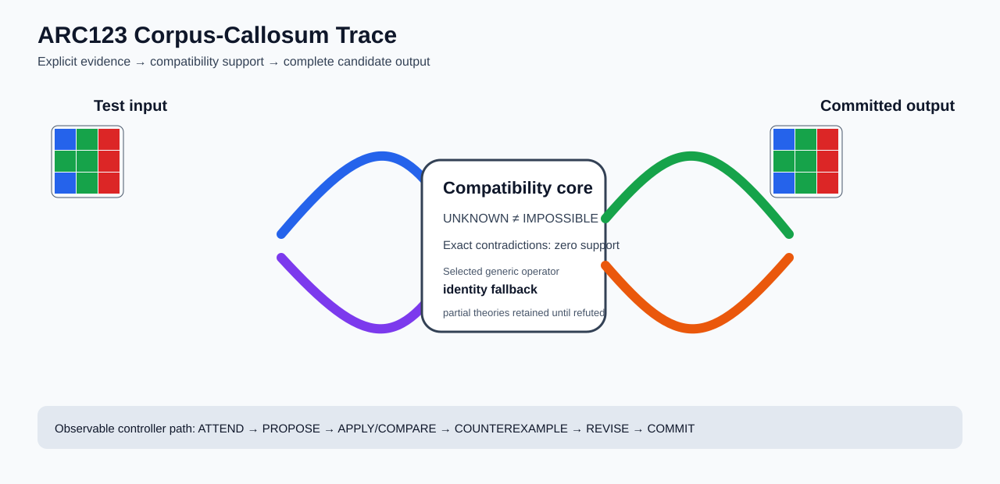

# ARC1 `9565186b` P0018-ARC12-DEVELOPMENT-BASELINE-40 Brain Surgery Report

## Outcome: NO — TEST CELLS DO NOT ALL MATCH

- **Compared positions:** 9
- **Mismatched cells:** 5
- **Training compatibility:** `False`
- **Fallback used:** `True`
- **Selected hypothesis:** `fallback_identity_complete_grid`
- **Source commit:** `085f6dbe39050afac3d1d743f840bac95b1a8d1c`
- **Frozen controller commit:** `260c212129445d1ba4bbda8cfa42f62b41a3446d`

## Live-Agent Boundary

The controller receives only visible training input/output examples and test inputs. It receives no task ID, imported cohort metadata, GT feature contract, GT solver, historical decomposition, or held-out output before committing a complete grid. The expected output appears only in post-answer V&V.

## Corpus-Callosum Visualization



- Full explicit event record: [`learning_trace.json`](learning_trace.json)

## Frozen Measurement

The controller bytes, generic operator vocabulary, source task checksums, and cohort membership were frozen before this task was parsed or scored. This result cannot tune the frozen controller.

## Post-Answer V&V

### Test case 1
- **All cells match:** `False`
- **Mismatched cells:** `5`
- **Prediction:**
```json
[[1, 3, 2], [3, 3, 2], [1, 3, 2]]
```
- **Expected output (post-answer only):**
```json
[[5, 3, 5], [3, 3, 5], [5, 3, 5]]
```

## Observable IHL Walkthrough

The record contains explicit actions, predictions, feedback, and revisions; it does not claim or store hidden model reasoning.

### Action totals

- `APPLY_HYPOTHESIS`: 89
- `ATTEND`: 89
- `CHOOSE_NEXT_DEMO`: 89
- `COMMIT`: 1
- `COMPARE`: 89
- `COMPOSE_RULE`: 6
- `EXPLAIN_RESIDUAL`: 6
- `FIND_COUNTEREXAMPLE`: 7
- `PROPOSE`: 28
- `SPECIALIZE`: 81

### Decision milestones

- `0` `PROPOSE` — `{"parent_theory_id":"T0000","rule":{"description_length":1,"name":"identity","operation":"identity","parameters":{},"rule_id":"identity","scope":{"kind":"all","value":null}},"stage":"initial_generic_theories","theory_id":"T0001"}`
- `1` `PROPOSE` — `{"parent_theory_id":"T0000","rule":{"description_length":3,"name":"translate(column_offset=-2,row_offset=-2)","operation":"full_operator","parameters":{"column_offset":-2,"operator":"translate","row_offset":-2},"rule_id":"rule-translate","scope":{"kind":"all","value":null}},"stage":"initial_generic_theories","theory_id":"T0002"}`
- `2` `PROPOSE` — `{"parent_theory_id":"T0000","rule":{"description_length":3,"name":"translate(column_offset=-1,row_offset=-2)","operation":"full_operator","parameters":{"column_offset":-1,"operator":"translate","row_offset":-2},"rule_id":"rule-translate","scope":{"kind":"all","value":null}},"stage":"initial_generic_theories","theory_id":"T0003"}`
- `3` `PROPOSE` — `{"parent_theory_id":"T0000","rule":{"description_length":3,"name":"translate(column_offset=0,row_offset=-2)","operation":"full_operator","parameters":{"column_offset":0,"operator":"translate","row_offset":-2},"rule_id":"rule-translate","scope":{"kind":"all","value":null}},"stage":"initial_generic_theories","theory_id":"T0004"}`
- `4` `PROPOSE` — `{"parent_theory_id":"T0000","rule":{"description_length":3,"name":"translate(column_offset=1,row_offset=-2)","operation":"full_operator","parameters":{"column_offset":1,"operator":"translate","row_offset":-2},"rule_id":"rule-translate","scope":{"kind":"all","value":null}},"stage":"initial_generic_theories","theory_id":"T0005"}`
- `5` `PROPOSE` — `{"parent_theory_id":"T0000","rule":{"description_length":3,"name":"translate(column_offset=2,row_offset=-2)","operation":"full_operator","parameters":{"column_offset":2,"operator":"translate","row_offset":-2},"rule_id":"rule-translate","scope":{"kind":"all","value":null}},"stage":"initial_generic_theories","theory_id":"T0006"}`
- `6` `PROPOSE` — `{"parent_theory_id":"T0000","rule":{"description_length":3,"name":"translate(column_offset=-2,row_offset=-1)","operation":"full_operator","parameters":{"column_offset":-2,"operator":"translate","row_offset":-1},"rule_id":"rule-translate","scope":{"kind":"all","value":null}},"stage":"initial_generic_theories","theory_id":"T0007"}`
- `7` `PROPOSE` — `{"parent_theory_id":"T0000","rule":{"description_length":3,"name":"translate(column_offset=-1,row_offset=-1)","operation":"full_operator","parameters":{"column_offset":-1,"operator":"translate","row_offset":-1},"rule_id":"rule-translate","scope":{"kind":"all","value":null}},"stage":"initial_generic_theories","theory_id":"T0008"}`
- `8` `PROPOSE` — `{"parent_theory_id":"T0000","rule":{"description_length":3,"name":"translate(column_offset=0,row_offset=-1)","operation":"full_operator","parameters":{"column_offset":0,"operator":"translate","row_offset":-1},"rule_id":"rule-translate","scope":{"kind":"all","value":null}},"stage":"initial_generic_theories","theory_id":"T0009"}`
- `9` `PROPOSE` — `{"parent_theory_id":"T0000","rule":{"description_length":3,"name":"translate(column_offset=1,row_offset=-1)","operation":"full_operator","parameters":{"column_offset":1,"operator":"translate","row_offset":-1},"rule_id":"rule-translate","scope":{"kind":"all","value":null}},"stage":"initial_generic_theories","theory_id":"T0010"}`
- `10` `PROPOSE` — `{"parent_theory_id":"T0000","rule":{"description_length":3,"name":"translate(column_offset=2,row_offset=-1)","operation":"full_operator","parameters":{"column_offset":2,"operator":"translate","row_offset":-1},"rule_id":"rule-translate","scope":{"kind":"all","value":null}},"stage":"initial_generic_theories","theory_id":"T0011"}`
- `11` `PROPOSE` — `{"parent_theory_id":"T0000","rule":{"description_length":3,"name":"translate(column_offset=-2,row_offset=0)","operation":"full_operator","parameters":{"column_offset":-2,"operator":"translate","row_offset":0},"rule_id":"rule-translate","scope":{"kind":"all","value":null}},"stage":"initial_generic_theories","theory_id":"T0012"}`
- `12` `PROPOSE` — `{"parent_theory_id":"T0000","rule":{"description_length":3,"name":"translate(column_offset=-1,row_offset=0)","operation":"full_operator","parameters":{"column_offset":-1,"operator":"translate","row_offset":0},"rule_id":"rule-translate","scope":{"kind":"all","value":null}},"stage":"initial_generic_theories","theory_id":"T0013"}`
- `13` `PROPOSE` — `{"parent_theory_id":"T0000","rule":{"description_length":3,"name":"translate(column_offset=1,row_offset=0)","operation":"full_operator","parameters":{"column_offset":1,"operator":"translate","row_offset":0},"rule_id":"rule-translate","scope":{"kind":"all","value":null}},"stage":"initial_generic_theories","theory_id":"T0014"}`
- `14` `PROPOSE` — `{"parent_theory_id":"T0000","rule":{"description_length":3,"name":"translate(column_offset=2,row_offset=0)","operation":"full_operator","parameters":{"column_offset":2,"operator":"translate","row_offset":0},"rule_id":"rule-translate","scope":{"kind":"all","value":null}},"stage":"initial_generic_theories","theory_id":"T0015"}`
- `15` `PROPOSE` — `{"parent_theory_id":"T0000","rule":{"description_length":3,"name":"translate(column_offset=-2,row_offset=1)","operation":"full_operator","parameters":{"column_offset":-2,"operator":"translate","row_offset":1},"rule_id":"rule-translate","scope":{"kind":"all","value":null}},"stage":"initial_generic_theories","theory_id":"T0016"}`
- `16` `PROPOSE` — `{"parent_theory_id":"T0000","rule":{"description_length":3,"name":"translate(column_offset=-1,row_offset=1)","operation":"full_operator","parameters":{"column_offset":-1,"operator":"translate","row_offset":1},"rule_id":"rule-translate","scope":{"kind":"all","value":null}},"stage":"initial_generic_theories","theory_id":"T0017"}`
- `17` `PROPOSE` — `{"parent_theory_id":"T0000","rule":{"description_length":3,"name":"translate(column_offset=0,row_offset=1)","operation":"full_operator","parameters":{"column_offset":0,"operator":"translate","row_offset":1},"rule_id":"rule-translate","scope":{"kind":"all","value":null}},"stage":"initial_generic_theories","theory_id":"T0018"}`
- `18` `PROPOSE` — `{"parent_theory_id":"T0000","rule":{"description_length":3,"name":"translate(column_offset=1,row_offset=1)","operation":"full_operator","parameters":{"column_offset":1,"operator":"translate","row_offset":1},"rule_id":"rule-translate","scope":{"kind":"all","value":null}},"stage":"initial_generic_theories","theory_id":"T0019"}`
- `19` `PROPOSE` — `{"parent_theory_id":"T0000","rule":{"description_length":3,"name":"translate(column_offset=2,row_offset=1)","operation":"full_operator","parameters":{"column_offset":2,"operator":"translate","row_offset":1},"rule_id":"rule-translate","scope":{"kind":"all","value":null}},"stage":"initial_generic_theories","theory_id":"T0020"}`
- `20` `PROPOSE` — `{"parent_theory_id":"T0000","rule":{"description_length":3,"name":"translate(column_offset=-2,row_offset=2)","operation":"full_operator","parameters":{"column_offset":-2,"operator":"translate","row_offset":2},"rule_id":"rule-translate","scope":{"kind":"all","value":null}},"stage":"initial_generic_theories","theory_id":"T0021"}`
- `21` `PROPOSE` — `{"parent_theory_id":"T0000","rule":{"description_length":3,"name":"translate(column_offset=-1,row_offset=2)","operation":"full_operator","parameters":{"column_offset":-1,"operator":"translate","row_offset":2},"rule_id":"rule-translate","scope":{"kind":"all","value":null}},"stage":"initial_generic_theories","theory_id":"T0022"}`
- `22` `PROPOSE` — `{"parent_theory_id":"T0000","rule":{"description_length":3,"name":"translate(column_offset=0,row_offset=2)","operation":"full_operator","parameters":{"column_offset":0,"operator":"translate","row_offset":2},"rule_id":"rule-translate","scope":{"kind":"all","value":null}},"stage":"initial_generic_theories","theory_id":"T0023"}`
- `23` `PROPOSE` — `{"parent_theory_id":"T0000","rule":{"description_length":3,"name":"translate(column_offset=1,row_offset=2)","operation":"full_operator","parameters":{"column_offset":1,"operator":"translate","row_offset":2},"rule_id":"rule-translate","scope":{"kind":"all","value":null}},"stage":"initial_generic_theories","theory_id":"T0024"}`
- `24` `PROPOSE` — `{"parent_theory_id":"T0000","rule":{"description_length":3,"name":"translate(column_offset=2,row_offset=2)","operation":"full_operator","parameters":{"column_offset":2,"operator":"translate","row_offset":2},"rule_id":"rule-translate","scope":{"kind":"all","value":null}},"stage":"initial_generic_theories","theory_id":"T0025"}`
- `25` `PROPOSE` — `{"parent_theory_id":"T0000","rule":{"description_length":2,"name":"left_right(scope=all)","operation":"coordinate_transform","parameters":{"axis":"left_right"},"rule_id":"coordinate-left_right","scope":{"kind":"all","value":null}},"stage":"initial_generic_theories","theory_id":"T0026"}`
- `26` `PROPOSE` — `{"parent_theory_id":"T0000","rule":{"description_length":2,"name":"top_bottom(scope=all)","operation":"coordinate_transform","parameters":{"axis":"top_bottom"},"rule_id":"coordinate-top_bottom","scope":{"kind":"all","value":null}},"stage":"initial_generic_theories","theory_id":"T0027"}`
- `27` `PROPOSE` — `{"parent_theory_id":"T0000","rule":{"description_length":2,"name":"rotate_180(scope=all)","operation":"coordinate_transform","parameters":{"axis":"rotate_180"},"rule_id":"coordinate-rotate_180","scope":{"kind":"all","value":null}},"stage":"initial_generic_theories","theory_id":"T0028"}`
- `29` `ATTEND` — `{"reason":"initial_highest_observed_change_and_color_discrimination","selected_demo":3,"selected_region":{"column":0,"row":0},"theory_id":"T0001"}`
- `33` `ATTEND` — `{"reason":"initial_highest_observed_change_and_color_discrimination","selected_demo":3,"selected_region":{"column":0,"row":0},"theory_id":"T0026"}`
- `37` `ATTEND` — `{"reason":"initial_highest_observed_change_and_color_discrimination","selected_demo":3,"selected_region":{"column":0,"row":0},"theory_id":"T0027"}`
- `41` `ATTEND` — `{"reason":"initial_highest_observed_change_and_color_discrimination","selected_demo":3,"selected_region":{"column":0,"row":0},"theory_id":"T0028"}`
- `45` `ATTEND` — `{"reason":"initial_highest_observed_change_and_color_discrimination","selected_demo":3,"selected_region":{"column":0,"row":0},"theory_id":"T0002"}`
- `49` `ATTEND` — `{"reason":"initial_highest_observed_change_and_color_discrimination","selected_demo":3,"selected_region":{"column":0,"row":0},"theory_id":"T0003"}`
- `53` `ATTEND` — `{"reason":"initial_highest_observed_change_and_color_discrimination","selected_demo":3,"selected_region":{"column":0,"row":0},"theory_id":"T0004"}`
- `57` `ATTEND` — `{"reason":"initial_highest_observed_change_and_color_discrimination","selected_demo":3,"selected_region":{"column":0,"row":0},"theory_id":"T0005"}`
- `61` `ATTEND` — `{"reason":"initial_highest_observed_change_and_color_discrimination","selected_demo":3,"selected_region":{"column":0,"row":0},"theory_id":"T0006"}`
- `65` `ATTEND` — `{"reason":"initial_highest_observed_change_and_color_discrimination","selected_demo":3,"selected_region":{"column":0,"row":0},"theory_id":"T0007"}`
- `69` `ATTEND` — `{"reason":"initial_highest_observed_change_and_color_discrimination","selected_demo":3,"selected_region":{"column":0,"row":0},"theory_id":"T0008"}`
- `73` `ATTEND` — `{"reason":"initial_highest_observed_change_and_color_discrimination","selected_demo":3,"selected_region":{"column":0,"row":0},"theory_id":"T0009"}`
- `79` `SPECIALIZE` — `{"added_rule":{"description_length":4,"name":"row_span_fill(fill_color=8,seed_color=8)","operation":"full_operator","parameters":{"fill_color":8,"operator":"row_span_fill","seed_color":8},"rule_id":"structural-row_span_fill","scope":{"kind":"all","value":null}},"parent_theory_id":"T0001","reason":"unexplained_residual_proposed_generic_structural_rule","theory_id":"T0030"}`
- `80` `SPECIALIZE` — `{"added_rule":{"description_length":4,"name":"row_span_fill(fill_color=8,seed_color=5)","operation":"full_operator","parameters":{"fill_color":8,"operator":"row_span_fill","seed_color":5},"rule_id":"structural-row_span_fill","scope":{"kind":"all","value":null}},"parent_theory_id":"T0001","reason":"unexplained_residual_proposed_generic_structural_rule","theory_id":"T0031"}`
- `81` `SPECIALIZE` — `{"added_rule":{"description_length":4,"name":"row_span_fill(fill_color=8,seed_color=3)","operation":"full_operator","parameters":{"fill_color":8,"operator":"row_span_fill","seed_color":3},"rule_id":"structural-row_span_fill","scope":{"kind":"all","value":null}},"parent_theory_id":"T0001","reason":"unexplained_residual_proposed_generic_structural_rule","theory_id":"T0032"}`
- `82` `SPECIALIZE` — `{"added_rule":{"description_length":4,"name":"row_span_fill(fill_color=8,seed_color=1)","operation":"full_operator","parameters":{"fill_color":8,"operator":"row_span_fill","seed_color":1},"rule_id":"structural-row_span_fill","scope":{"kind":"all","value":null}},"parent_theory_id":"T0001","reason":"unexplained_residual_proposed_generic_structural_rule","theory_id":"T0033"}`
- `83` `SPECIALIZE` — `{"added_rule":{"description_length":4,"name":"row_span_fill(fill_color=5,seed_color=8)","operation":"full_operator","parameters":{"fill_color":5,"operator":"row_span_fill","seed_color":8},"rule_id":"structural-row_span_fill","scope":{"kind":"all","value":null}},"parent_theory_id":"T0001","reason":"unexplained_residual_proposed_generic_structural_rule","theory_id":"T0034"}`
- `84` `SPECIALIZE` — `{"added_rule":{"description_length":4,"name":"row_span_fill(fill_color=5,seed_color=5)","operation":"full_operator","parameters":{"fill_color":5,"operator":"row_span_fill","seed_color":5},"rule_id":"structural-row_span_fill","scope":{"kind":"all","value":null}},"parent_theory_id":"T0001","reason":"unexplained_residual_proposed_generic_structural_rule","theory_id":"T0035"}`
- `85` `SPECIALIZE` — `{"added_rule":{"description_length":4,"name":"row_span_fill(fill_color=5,seed_color=3)","operation":"full_operator","parameters":{"fill_color":5,"operator":"row_span_fill","seed_color":3},"rule_id":"structural-row_span_fill","scope":{"kind":"all","value":null}},"parent_theory_id":"T0001","reason":"unexplained_residual_proposed_generic_structural_rule","theory_id":"T0036"}`
- `86` `SPECIALIZE` — `{"added_rule":{"description_length":4,"name":"row_span_fill(fill_color=5,seed_color=1)","operation":"full_operator","parameters":{"fill_color":5,"operator":"row_span_fill","seed_color":1},"rule_id":"structural-row_span_fill","scope":{"kind":"all","value":null}},"parent_theory_id":"T0001","reason":"unexplained_residual_proposed_generic_structural_rule","theory_id":"T0037"}`
- `87` `SPECIALIZE` — `{"added_rule":{"description_length":4,"name":"row_span_fill(fill_color=3,seed_color=8)","operation":"full_operator","parameters":{"fill_color":3,"operator":"row_span_fill","seed_color":8},"rule_id":"structural-row_span_fill","scope":{"kind":"all","value":null}},"parent_theory_id":"T0001","reason":"unexplained_residual_proposed_generic_structural_rule","theory_id":"T0038"}`
- `88` `SPECIALIZE` — `{"added_rule":{"description_length":4,"name":"row_span_fill(fill_color=3,seed_color=5)","operation":"full_operator","parameters":{"fill_color":3,"operator":"row_span_fill","seed_color":5},"rule_id":"structural-row_span_fill","scope":{"kind":"all","value":null}},"parent_theory_id":"T0001","reason":"unexplained_residual_proposed_generic_structural_rule","theory_id":"T0039"}`
- `89` `SPECIALIZE` — `{"added_rule":{"description_length":4,"name":"row_span_fill(fill_color=3,seed_color=3)","operation":"full_operator","parameters":{"fill_color":3,"operator":"row_span_fill","seed_color":3},"rule_id":"structural-row_span_fill","scope":{"kind":"all","value":null}},"parent_theory_id":"T0001","reason":"unexplained_residual_proposed_generic_structural_rule","theory_id":"T0040"}`
- `90` `SPECIALIZE` — `{"added_rule":{"description_length":4,"name":"row_span_fill(fill_color=3,seed_color=1)","operation":"full_operator","parameters":{"fill_color":3,"operator":"row_span_fill","seed_color":1},"rule_id":"structural-row_span_fill","scope":{"kind":"all","value":null}},"parent_theory_id":"T0001","reason":"unexplained_residual_proposed_generic_structural_rule","theory_id":"T0041"}`
- `92` `ATTEND` — `{"reason":"initial_highest_observed_change_and_color_discrimination","selected_demo":3,"selected_region":{"column":2,"row":0},"theory_id":"T0029"}`
- `96` `ATTEND` — `{"reason":"initial_highest_observed_change_and_color_discrimination","selected_demo":3,"selected_region":{"column":0,"row":0},"theory_id":"T0030"}`
- `100` `ATTEND` — `{"reason":"initial_highest_observed_change_and_color_discrimination","selected_demo":3,"selected_region":{"column":0,"row":0},"theory_id":"T0031"}`
- `104` `ATTEND` — `{"reason":"initial_highest_observed_change_and_color_discrimination","selected_demo":3,"selected_region":{"column":0,"row":0},"theory_id":"T0032"}`
- `108` `ATTEND` — `{"reason":"initial_highest_observed_change_and_color_discrimination","selected_demo":3,"selected_region":{"column":0,"row":0},"theory_id":"T0033"}`
- `112` `ATTEND` — `{"reason":"initial_highest_observed_change_and_color_discrimination","selected_demo":3,"selected_region":{"column":0,"row":0},"theory_id":"T0034"}`
- `116` `ATTEND` — `{"reason":"initial_highest_observed_change_and_color_discrimination","selected_demo":3,"selected_region":{"column":0,"row":0},"theory_id":"T0035"}`
- `120` `ATTEND` — `{"reason":"initial_highest_observed_change_and_color_discrimination","selected_demo":3,"selected_region":{"column":0,"row":0},"theory_id":"T0036"}`
- `124` `ATTEND` — `{"reason":"initial_highest_observed_change_and_color_discrimination","selected_demo":3,"selected_region":{"column":0,"row":0},"theory_id":"T0037"}`
- `128` `ATTEND` — `{"reason":"initial_highest_observed_change_and_color_discrimination","selected_demo":3,"selected_region":{"column":0,"row":0},"theory_id":"T0038"}`
- `132` `ATTEND` — `{"reason":"initial_highest_observed_change_and_color_discrimination","selected_demo":3,"selected_region":{"column":0,"row":0},"theory_id":"T0039"}`
- `136` `ATTEND` — `{"reason":"initial_highest_observed_change_and_color_discrimination","selected_demo":3,"selected_region":{"column":0,"row":0},"theory_id":"T0040"}`
- `142` `SPECIALIZE` — `{"added_rule":{"description_length":4,"name":"row_span_fill(fill_color=8,seed_color=8)","operation":"full_operator","parameters":{"fill_color":8,"operator":"row_span_fill","seed_color":8},"rule_id":"structural-row_span_fill","scope":{"kind":"all","value":null}},"parent_theory_id":"T0029","reason":"unexplained_residual_proposed_generic_structural_rule","theory_id":"T0043"}`
- `143` `SPECIALIZE` — `{"added_rule":{"description_length":4,"name":"row_span_fill(fill_color=8,seed_color=5)","operation":"full_operator","parameters":{"fill_color":8,"operator":"row_span_fill","seed_color":5},"rule_id":"structural-row_span_fill","scope":{"kind":"all","value":null}},"parent_theory_id":"T0029","reason":"unexplained_residual_proposed_generic_structural_rule","theory_id":"T0044"}`
- `144` `SPECIALIZE` — `{"added_rule":{"description_length":4,"name":"row_span_fill(fill_color=8,seed_color=3)","operation":"full_operator","parameters":{"fill_color":8,"operator":"row_span_fill","seed_color":3},"rule_id":"structural-row_span_fill","scope":{"kind":"all","value":null}},"parent_theory_id":"T0029","reason":"unexplained_residual_proposed_generic_structural_rule","theory_id":"T0045"}`
- `145` `SPECIALIZE` — `{"added_rule":{"description_length":4,"name":"row_span_fill(fill_color=8,seed_color=1)","operation":"full_operator","parameters":{"fill_color":8,"operator":"row_span_fill","seed_color":1},"rule_id":"structural-row_span_fill","scope":{"kind":"all","value":null}},"parent_theory_id":"T0029","reason":"unexplained_residual_proposed_generic_structural_rule","theory_id":"T0046"}`
- `146` `SPECIALIZE` — `{"added_rule":{"description_length":4,"name":"row_span_fill(fill_color=5,seed_color=8)","operation":"full_operator","parameters":{"fill_color":5,"operator":"row_span_fill","seed_color":8},"rule_id":"structural-row_span_fill","scope":{"kind":"all","value":null}},"parent_theory_id":"T0029","reason":"unexplained_residual_proposed_generic_structural_rule","theory_id":"T0047"}`
- `147` `SPECIALIZE` — `{"added_rule":{"description_length":4,"name":"row_span_fill(fill_color=5,seed_color=5)","operation":"full_operator","parameters":{"fill_color":5,"operator":"row_span_fill","seed_color":5},"rule_id":"structural-row_span_fill","scope":{"kind":"all","value":null}},"parent_theory_id":"T0029","reason":"unexplained_residual_proposed_generic_structural_rule","theory_id":"T0048"}`
- `148` `SPECIALIZE` — `{"added_rule":{"description_length":4,"name":"row_span_fill(fill_color=5,seed_color=3)","operation":"full_operator","parameters":{"fill_color":5,"operator":"row_span_fill","seed_color":3},"rule_id":"structural-row_span_fill","scope":{"kind":"all","value":null}},"parent_theory_id":"T0029","reason":"unexplained_residual_proposed_generic_structural_rule","theory_id":"T0049"}`
- `149` `SPECIALIZE` — `{"added_rule":{"description_length":4,"name":"row_span_fill(fill_color=5,seed_color=1)","operation":"full_operator","parameters":{"fill_color":5,"operator":"row_span_fill","seed_color":1},"rule_id":"structural-row_span_fill","scope":{"kind":"all","value":null}},"parent_theory_id":"T0029","reason":"unexplained_residual_proposed_generic_structural_rule","theory_id":"T0050"}`
- `150` `SPECIALIZE` — `{"added_rule":{"description_length":4,"name":"row_span_fill(fill_color=3,seed_color=8)","operation":"full_operator","parameters":{"fill_color":3,"operator":"row_span_fill","seed_color":8},"rule_id":"structural-row_span_fill","scope":{"kind":"all","value":null}},"parent_theory_id":"T0029","reason":"unexplained_residual_proposed_generic_structural_rule","theory_id":"T0051"}`
- `151` `SPECIALIZE` — `{"added_rule":{"description_length":4,"name":"row_span_fill(fill_color=3,seed_color=5)","operation":"full_operator","parameters":{"fill_color":3,"operator":"row_span_fill","seed_color":5},"rule_id":"structural-row_span_fill","scope":{"kind":"all","value":null}},"parent_theory_id":"T0029","reason":"unexplained_residual_proposed_generic_structural_rule","theory_id":"T0052"}`
- `152` `SPECIALIZE` — `{"added_rule":{"description_length":4,"name":"row_span_fill(fill_color=3,seed_color=3)","operation":"full_operator","parameters":{"fill_color":3,"operator":"row_span_fill","seed_color":3},"rule_id":"structural-row_span_fill","scope":{"kind":"all","value":null}},"parent_theory_id":"T0029","reason":"unexplained_residual_proposed_generic_structural_rule","theory_id":"T0053"}`
- `153` `SPECIALIZE` — `{"added_rule":{"description_length":4,"name":"row_span_fill(fill_color=3,seed_color=1)","operation":"full_operator","parameters":{"fill_color":3,"operator":"row_span_fill","seed_color":1},"rule_id":"structural-row_span_fill","scope":{"kind":"all","value":null}},"parent_theory_id":"T0029","reason":"unexplained_residual_proposed_generic_structural_rule","theory_id":"T0054"}`
- `155` `ATTEND` — `{"reason":"initial_highest_observed_change_and_color_discrimination","selected_demo":3,"selected_region":{"column":1,"row":2},"theory_id":"T0042"}`
- `159` `ATTEND` — `{"reason":"initial_highest_observed_change_and_color_discrimination","selected_demo":3,"selected_region":{"column":0,"row":0},"theory_id":"T0043"}`
- `163` `ATTEND` — `{"reason":"initial_highest_observed_change_and_color_discrimination","selected_demo":3,"selected_region":{"column":0,"row":0},"theory_id":"T0044"}`
- `167` `ATTEND` — `{"reason":"initial_highest_observed_change_and_color_discrimination","selected_demo":3,"selected_region":{"column":0,"row":0},"theory_id":"T0045"}`
- `171` `ATTEND` — `{"reason":"initial_highest_observed_change_and_color_discrimination","selected_demo":3,"selected_region":{"column":0,"row":0},"theory_id":"T0046"}`
- `175` `ATTEND` — `{"reason":"initial_highest_observed_change_and_color_discrimination","selected_demo":3,"selected_region":{"column":0,"row":0},"theory_id":"T0047"}`
- `179` `ATTEND` — `{"reason":"initial_highest_observed_change_and_color_discrimination","selected_demo":3,"selected_region":{"column":0,"row":0},"theory_id":"T0048"}`
- `183` `ATTEND` — `{"reason":"initial_highest_observed_change_and_color_discrimination","selected_demo":3,"selected_region":{"column":0,"row":0},"theory_id":"T0049"}`
- `187` `ATTEND` — `{"reason":"initial_highest_observed_change_and_color_discrimination","selected_demo":3,"selected_region":{"column":0,"row":0},"theory_id":"T0050"}`
- `191` `ATTEND` — `{"reason":"initial_highest_observed_change_and_color_discrimination","selected_demo":3,"selected_region":{"column":0,"row":0},"theory_id":"T0051"}`
- `195` `ATTEND` — `{"reason":"initial_highest_observed_change_and_color_discrimination","selected_demo":3,"selected_region":{"column":0,"row":0},"theory_id":"T0052"}`
- `199` `ATTEND` — `{"reason":"initial_highest_observed_change_and_color_discrimination","selected_demo":3,"selected_region":{"column":0,"row":0},"theory_id":"T0053"}`
- `205` `SPECIALIZE` — `{"added_rule":{"description_length":4,"name":"row_span_fill(fill_color=8,seed_color=8)","operation":"full_operator","parameters":{"fill_color":8,"operator":"row_span_fill","seed_color":8},"rule_id":"structural-row_span_fill","scope":{"kind":"all","value":null}},"parent_theory_id":"T0042","reason":"unexplained_residual_proposed_generic_structural_rule","theory_id":"T0056"}`
- `206` `SPECIALIZE` — `{"added_rule":{"description_length":4,"name":"row_span_fill(fill_color=8,seed_color=5)","operation":"full_operator","parameters":{"fill_color":8,"operator":"row_span_fill","seed_color":5},"rule_id":"structural-row_span_fill","scope":{"kind":"all","value":null}},"parent_theory_id":"T0042","reason":"unexplained_residual_proposed_generic_structural_rule","theory_id":"T0057"}`
- `207` `SPECIALIZE` — `{"added_rule":{"description_length":4,"name":"row_span_fill(fill_color=8,seed_color=3)","operation":"full_operator","parameters":{"fill_color":8,"operator":"row_span_fill","seed_color":3},"rule_id":"structural-row_span_fill","scope":{"kind":"all","value":null}},"parent_theory_id":"T0042","reason":"unexplained_residual_proposed_generic_structural_rule","theory_id":"T0058"}`
- `208` `SPECIALIZE` — `{"added_rule":{"description_length":4,"name":"row_span_fill(fill_color=8,seed_color=1)","operation":"full_operator","parameters":{"fill_color":8,"operator":"row_span_fill","seed_color":1},"rule_id":"structural-row_span_fill","scope":{"kind":"all","value":null}},"parent_theory_id":"T0042","reason":"unexplained_residual_proposed_generic_structural_rule","theory_id":"T0059"}`
- `209` `SPECIALIZE` — `{"added_rule":{"description_length":4,"name":"row_span_fill(fill_color=5,seed_color=8)","operation":"full_operator","parameters":{"fill_color":5,"operator":"row_span_fill","seed_color":8},"rule_id":"structural-row_span_fill","scope":{"kind":"all","value":null}},"parent_theory_id":"T0042","reason":"unexplained_residual_proposed_generic_structural_rule","theory_id":"T0060"}`
- `210` `SPECIALIZE` — `{"added_rule":{"description_length":4,"name":"row_span_fill(fill_color=5,seed_color=5)","operation":"full_operator","parameters":{"fill_color":5,"operator":"row_span_fill","seed_color":5},"rule_id":"structural-row_span_fill","scope":{"kind":"all","value":null}},"parent_theory_id":"T0042","reason":"unexplained_residual_proposed_generic_structural_rule","theory_id":"T0061"}`
- `211` `SPECIALIZE` — `{"added_rule":{"description_length":4,"name":"row_span_fill(fill_color=5,seed_color=3)","operation":"full_operator","parameters":{"fill_color":5,"operator":"row_span_fill","seed_color":3},"rule_id":"structural-row_span_fill","scope":{"kind":"all","value":null}},"parent_theory_id":"T0042","reason":"unexplained_residual_proposed_generic_structural_rule","theory_id":"T0062"}`
- `212` `SPECIALIZE` — `{"added_rule":{"description_length":4,"name":"row_span_fill(fill_color=5,seed_color=1)","operation":"full_operator","parameters":{"fill_color":5,"operator":"row_span_fill","seed_color":1},"rule_id":"structural-row_span_fill","scope":{"kind":"all","value":null}},"parent_theory_id":"T0042","reason":"unexplained_residual_proposed_generic_structural_rule","theory_id":"T0063"}`
- `213` `SPECIALIZE` — `{"added_rule":{"description_length":4,"name":"row_span_fill(fill_color=3,seed_color=8)","operation":"full_operator","parameters":{"fill_color":3,"operator":"row_span_fill","seed_color":8},"rule_id":"structural-row_span_fill","scope":{"kind":"all","value":null}},"parent_theory_id":"T0042","reason":"unexplained_residual_proposed_generic_structural_rule","theory_id":"T0064"}`
- `214` `SPECIALIZE` — `{"added_rule":{"description_length":4,"name":"row_span_fill(fill_color=3,seed_color=5)","operation":"full_operator","parameters":{"fill_color":3,"operator":"row_span_fill","seed_color":5},"rule_id":"structural-row_span_fill","scope":{"kind":"all","value":null}},"parent_theory_id":"T0042","reason":"unexplained_residual_proposed_generic_structural_rule","theory_id":"T0065"}`
- `215` `SPECIALIZE` — `{"added_rule":{"description_length":4,"name":"row_span_fill(fill_color=3,seed_color=3)","operation":"full_operator","parameters":{"fill_color":3,"operator":"row_span_fill","seed_color":3},"rule_id":"structural-row_span_fill","scope":{"kind":"all","value":null}},"parent_theory_id":"T0042","reason":"unexplained_residual_proposed_generic_structural_rule","theory_id":"T0066"}`
- `216` `SPECIALIZE` — `{"added_rule":{"description_length":4,"name":"row_span_fill(fill_color=3,seed_color=1)","operation":"full_operator","parameters":{"fill_color":3,"operator":"row_span_fill","seed_color":1},"rule_id":"structural-row_span_fill","scope":{"kind":"all","value":null}},"parent_theory_id":"T0042","reason":"unexplained_residual_proposed_generic_structural_rule","theory_id":"T0067"}`
- `218` `ATTEND` — `{"reason":"initial_highest_observed_change_and_color_discrimination","selected_demo":3,"selected_region":{"region":"whole_demo"},"theory_id":"T0055"}`
- `222` `ATTEND` — `{"reason":"unseen_demo_selected_for_residual_version_space_discrimination","selected_demo":1,"selected_region":{"column":0,"row":0},"theory_id":"T0055"}`
- `226` `ATTEND` — `{"reason":"initial_highest_observed_change_and_color_discrimination","selected_demo":3,"selected_region":{"column":0,"row":0},"theory_id":"T0056"}`
- `230` `ATTEND` — `{"reason":"initial_highest_observed_change_and_color_discrimination","selected_demo":3,"selected_region":{"column":0,"row":0},"theory_id":"T0057"}`
- `234` `ATTEND` — `{"reason":"initial_highest_observed_change_and_color_discrimination","selected_demo":3,"selected_region":{"column":0,"row":0},"theory_id":"T0058"}`
- `238` `ATTEND` — `{"reason":"initial_highest_observed_change_and_color_discrimination","selected_demo":3,"selected_region":{"column":0,"row":0},"theory_id":"T0059"}`
- `242` `ATTEND` — `{"reason":"initial_highest_observed_change_and_color_discrimination","selected_demo":3,"selected_region":{"column":0,"row":0},"theory_id":"T0060"}`
- `246` `ATTEND` — `{"reason":"initial_highest_observed_change_and_color_discrimination","selected_demo":3,"selected_region":{"column":0,"row":0},"theory_id":"T0061"}`
- `250` `ATTEND` — `{"reason":"initial_highest_observed_change_and_color_discrimination","selected_demo":3,"selected_region":{"column":0,"row":0},"theory_id":"T0062"}`
- `254` `ATTEND` — `{"reason":"initial_highest_observed_change_and_color_discrimination","selected_demo":3,"selected_region":{"column":0,"row":0},"theory_id":"T0063"}`
- `258` `ATTEND` — `{"reason":"initial_highest_observed_change_and_color_discrimination","selected_demo":3,"selected_region":{"column":0,"row":0},"theory_id":"T0064"}`
- `262` `ATTEND` — `{"reason":"initial_highest_observed_change_and_color_discrimination","selected_demo":3,"selected_region":{"column":0,"row":0},"theory_id":"T0065"}`
- `266` `ATTEND` — `{"reason":"initial_highest_observed_change_and_color_discrimination","selected_demo":3,"selected_region":{"column":0,"row":0},"theory_id":"T0066"}`
- `270` `SPECIALIZE` — `{"added_rule":{"description_length":4,"name":"row_span_fill(fill_color=8,seed_color=8)","operation":"full_operator","parameters":{"fill_color":8,"operator":"row_span_fill","seed_color":8},"rule_id":"structural-row_span_fill","scope":{"kind":"all","value":null}},"parent_theory_id":"T0055","reason":"unexplained_residual_proposed_generic_structural_rule","theory_id":"T0068"}`
- `271` `SPECIALIZE` — `{"added_rule":{"description_length":4,"name":"row_span_fill(fill_color=8,seed_color=5)","operation":"full_operator","parameters":{"fill_color":8,"operator":"row_span_fill","seed_color":5},"rule_id":"structural-row_span_fill","scope":{"kind":"all","value":null}},"parent_theory_id":"T0055","reason":"unexplained_residual_proposed_generic_structural_rule","theory_id":"T0069"}`
- `272` `SPECIALIZE` — `{"added_rule":{"description_length":4,"name":"row_span_fill(fill_color=8,seed_color=3)","operation":"full_operator","parameters":{"fill_color":8,"operator":"row_span_fill","seed_color":3},"rule_id":"structural-row_span_fill","scope":{"kind":"all","value":null}},"parent_theory_id":"T0055","reason":"unexplained_residual_proposed_generic_structural_rule","theory_id":"T0070"}`
- `273` `SPECIALIZE` — `{"added_rule":{"description_length":4,"name":"row_span_fill(fill_color=8,seed_color=2)","operation":"full_operator","parameters":{"fill_color":8,"operator":"row_span_fill","seed_color":2},"rule_id":"structural-row_span_fill","scope":{"kind":"all","value":null}},"parent_theory_id":"T0055","reason":"unexplained_residual_proposed_generic_structural_rule","theory_id":"T0071"}`
- `274` `SPECIALIZE` — `{"added_rule":{"description_length":4,"name":"row_span_fill(fill_color=5,seed_color=8)","operation":"full_operator","parameters":{"fill_color":5,"operator":"row_span_fill","seed_color":8},"rule_id":"structural-row_span_fill","scope":{"kind":"all","value":null}},"parent_theory_id":"T0055","reason":"unexplained_residual_proposed_generic_structural_rule","theory_id":"T0072"}`
- `275` `SPECIALIZE` — `{"added_rule":{"description_length":4,"name":"row_span_fill(fill_color=5,seed_color=5)","operation":"full_operator","parameters":{"fill_color":5,"operator":"row_span_fill","seed_color":5},"rule_id":"structural-row_span_fill","scope":{"kind":"all","value":null}},"parent_theory_id":"T0055","reason":"unexplained_residual_proposed_generic_structural_rule","theory_id":"T0073"}`
- `276` `SPECIALIZE` — `{"added_rule":{"description_length":4,"name":"row_span_fill(fill_color=5,seed_color=3)","operation":"full_operator","parameters":{"fill_color":5,"operator":"row_span_fill","seed_color":3},"rule_id":"structural-row_span_fill","scope":{"kind":"all","value":null}},"parent_theory_id":"T0055","reason":"unexplained_residual_proposed_generic_structural_rule","theory_id":"T0074"}`
- `277` `SPECIALIZE` — `{"added_rule":{"description_length":4,"name":"row_span_fill(fill_color=5,seed_color=2)","operation":"full_operator","parameters":{"fill_color":5,"operator":"row_span_fill","seed_color":2},"rule_id":"structural-row_span_fill","scope":{"kind":"all","value":null}},"parent_theory_id":"T0055","reason":"unexplained_residual_proposed_generic_structural_rule","theory_id":"T0075"}`
- `278` `SPECIALIZE` — `{"added_rule":{"description_length":4,"name":"row_span_fill(fill_color=3,seed_color=8)","operation":"full_operator","parameters":{"fill_color":3,"operator":"row_span_fill","seed_color":8},"rule_id":"structural-row_span_fill","scope":{"kind":"all","value":null}},"parent_theory_id":"T0055","reason":"unexplained_residual_proposed_generic_structural_rule","theory_id":"T0076"}`
- `279` `SPECIALIZE` — `{"added_rule":{"description_length":4,"name":"row_span_fill(fill_color=3,seed_color=5)","operation":"full_operator","parameters":{"fill_color":3,"operator":"row_span_fill","seed_color":5},"rule_id":"structural-row_span_fill","scope":{"kind":"all","value":null}},"parent_theory_id":"T0055","reason":"unexplained_residual_proposed_generic_structural_rule","theory_id":"T0077"}`
- `280` `SPECIALIZE` — `{"added_rule":{"description_length":4,"name":"row_span_fill(fill_color=3,seed_color=3)","operation":"full_operator","parameters":{"fill_color":3,"operator":"row_span_fill","seed_color":3},"rule_id":"structural-row_span_fill","scope":{"kind":"all","value":null}},"parent_theory_id":"T0055","reason":"unexplained_residual_proposed_generic_structural_rule","theory_id":"T0078"}`
- `281` `SPECIALIZE` — `{"added_rule":{"description_length":4,"name":"row_span_fill(fill_color=3,seed_color=2)","operation":"full_operator","parameters":{"fill_color":3,"operator":"row_span_fill","seed_color":2},"rule_id":"structural-row_span_fill","scope":{"kind":"all","value":null}},"parent_theory_id":"T0055","reason":"unexplained_residual_proposed_generic_structural_rule","theory_id":"T0079"}`
- `283` `ATTEND` — `{"reason":"initial_highest_observed_change_and_color_discrimination","selected_demo":3,"selected_region":{"column":0,"row":0},"theory_id":"T0068"}`
- `287` `ATTEND` — `{"reason":"initial_highest_observed_change_and_color_discrimination","selected_demo":3,"selected_region":{"column":0,"row":0},"theory_id":"T0069"}`
- `291` `ATTEND` — `{"reason":"initial_highest_observed_change_and_color_discrimination","selected_demo":3,"selected_region":{"column":0,"row":0},"theory_id":"T0070"}`
- `295` `ATTEND` — `{"reason":"initial_highest_observed_change_and_color_discrimination","selected_demo":3,"selected_region":{"column":0,"row":0},"theory_id":"T0071"}`
- `299` `ATTEND` — `{"reason":"initial_highest_observed_change_and_color_discrimination","selected_demo":3,"selected_region":{"column":0,"row":0},"theory_id":"T0072"}`
- `303` `ATTEND` — `{"reason":"initial_highest_observed_change_and_color_discrimination","selected_demo":3,"selected_region":{"column":0,"row":0},"theory_id":"T0073"}`
- `307` `ATTEND` — `{"reason":"initial_highest_observed_change_and_color_discrimination","selected_demo":3,"selected_region":{"column":0,"row":0},"theory_id":"T0074"}`
- `311` `ATTEND` — `{"reason":"initial_highest_observed_change_and_color_discrimination","selected_demo":3,"selected_region":{"column":0,"row":0},"theory_id":"T0075"}`
- `315` `ATTEND` — `{"reason":"initial_highest_observed_change_and_color_discrimination","selected_demo":3,"selected_region":{"column":0,"row":0},"theory_id":"T0076"}`
- `319` `ATTEND` — `{"reason":"initial_highest_observed_change_and_color_discrimination","selected_demo":3,"selected_region":{"column":0,"row":0},"theory_id":"T0077"}`
- `323` `ATTEND` — `{"reason":"initial_highest_observed_change_and_color_discrimination","selected_demo":3,"selected_region":{"column":0,"row":0},"theory_id":"T0078"}`
- `327` `ATTEND` — `{"reason":"initial_highest_observed_change_and_color_discrimination","selected_demo":3,"selected_region":{"column":0,"row":0},"theory_id":"T0079"}`
- `333` `SPECIALIZE` — `{"added_rule":{"description_length":4,"name":"row_span_fill(fill_color=8,seed_color=5)","operation":"full_operator","parameters":{"fill_color":8,"operator":"row_span_fill","seed_color":5},"rule_id":"structural-row_span_fill","scope":{"kind":"all","value":null}},"parent_theory_id":"T0068","reason":"unexplained_residual_proposed_generic_structural_rule","theory_id":"T0081"}`
- `334` `SPECIALIZE` — `{"added_rule":{"description_length":4,"name":"row_span_fill(fill_color=8,seed_color=3)","operation":"full_operator","parameters":{"fill_color":8,"operator":"row_span_fill","seed_color":3},"rule_id":"structural-row_span_fill","scope":{"kind":"all","value":null}},"parent_theory_id":"T0068","reason":"unexplained_residual_proposed_generic_structural_rule","theory_id":"T0082"}`
- `335` `SPECIALIZE` — `{"added_rule":{"description_length":4,"name":"row_span_fill(fill_color=8,seed_color=1)","operation":"full_operator","parameters":{"fill_color":8,"operator":"row_span_fill","seed_color":1},"rule_id":"structural-row_span_fill","scope":{"kind":"all","value":null}},"parent_theory_id":"T0068","reason":"unexplained_residual_proposed_generic_structural_rule","theory_id":"T0083"}`
- `336` `SPECIALIZE` — `{"added_rule":{"description_length":4,"name":"row_span_fill(fill_color=5,seed_color=8)","operation":"full_operator","parameters":{"fill_color":5,"operator":"row_span_fill","seed_color":8},"rule_id":"structural-row_span_fill","scope":{"kind":"all","value":null}},"parent_theory_id":"T0068","reason":"unexplained_residual_proposed_generic_structural_rule","theory_id":"T0084"}`
- `337` `SPECIALIZE` — `{"added_rule":{"description_length":4,"name":"row_span_fill(fill_color=5,seed_color=5)","operation":"full_operator","parameters":{"fill_color":5,"operator":"row_span_fill","seed_color":5},"rule_id":"structural-row_span_fill","scope":{"kind":"all","value":null}},"parent_theory_id":"T0068","reason":"unexplained_residual_proposed_generic_structural_rule","theory_id":"T0085"}`
- `338` `SPECIALIZE` — `{"added_rule":{"description_length":4,"name":"row_span_fill(fill_color=5,seed_color=3)","operation":"full_operator","parameters":{"fill_color":5,"operator":"row_span_fill","seed_color":3},"rule_id":"structural-row_span_fill","scope":{"kind":"all","value":null}},"parent_theory_id":"T0068","reason":"unexplained_residual_proposed_generic_structural_rule","theory_id":"T0086"}`
- `339` `SPECIALIZE` — `{"added_rule":{"description_length":4,"name":"row_span_fill(fill_color=5,seed_color=1)","operation":"full_operator","parameters":{"fill_color":5,"operator":"row_span_fill","seed_color":1},"rule_id":"structural-row_span_fill","scope":{"kind":"all","value":null}},"parent_theory_id":"T0068","reason":"unexplained_residual_proposed_generic_structural_rule","theory_id":"T0087"}`
- `340` `SPECIALIZE` — `{"added_rule":{"description_length":4,"name":"row_span_fill(fill_color=3,seed_color=8)","operation":"full_operator","parameters":{"fill_color":3,"operator":"row_span_fill","seed_color":8},"rule_id":"structural-row_span_fill","scope":{"kind":"all","value":null}},"parent_theory_id":"T0068","reason":"unexplained_residual_proposed_generic_structural_rule","theory_id":"T0088"}`
- `341` `SPECIALIZE` — `{"added_rule":{"description_length":4,"name":"row_span_fill(fill_color=3,seed_color=5)","operation":"full_operator","parameters":{"fill_color":3,"operator":"row_span_fill","seed_color":5},"rule_id":"structural-row_span_fill","scope":{"kind":"all","value":null}},"parent_theory_id":"T0068","reason":"unexplained_residual_proposed_generic_structural_rule","theory_id":"T0089"}`
- `342` `SPECIALIZE` — `{"added_rule":{"description_length":4,"name":"row_span_fill(fill_color=3,seed_color=3)","operation":"full_operator","parameters":{"fill_color":3,"operator":"row_span_fill","seed_color":3},"rule_id":"structural-row_span_fill","scope":{"kind":"all","value":null}},"parent_theory_id":"T0068","reason":"unexplained_residual_proposed_generic_structural_rule","theory_id":"T0090"}`
- `343` `SPECIALIZE` — `{"added_rule":{"description_length":4,"name":"row_span_fill(fill_color=3,seed_color=1)","operation":"full_operator","parameters":{"fill_color":3,"operator":"row_span_fill","seed_color":1},"rule_id":"structural-row_span_fill","scope":{"kind":"all","value":null}},"parent_theory_id":"T0068","reason":"unexplained_residual_proposed_generic_structural_rule","theory_id":"T0091"}`
- `345` `ATTEND` — `{"reason":"initial_highest_observed_change_and_color_discrimination","selected_demo":3,"selected_region":{"column":2,"row":0},"theory_id":"T0080"}`
- `349` `ATTEND` — `{"reason":"initial_highest_observed_change_and_color_discrimination","selected_demo":3,"selected_region":{"column":0,"row":0},"theory_id":"T0081"}`
- `353` `ATTEND` — `{"reason":"initial_highest_observed_change_and_color_discrimination","selected_demo":3,"selected_region":{"column":0,"row":0},"theory_id":"T0082"}`
- `357` `ATTEND` — `{"reason":"initial_highest_observed_change_and_color_discrimination","selected_demo":3,"selected_region":{"column":0,"row":0},"theory_id":"T0083"}`
- `361` `ATTEND` — `{"reason":"initial_highest_observed_change_and_color_discrimination","selected_demo":3,"selected_region":{"column":0,"row":0},"theory_id":"T0084"}`
- `365` `ATTEND` — `{"reason":"initial_highest_observed_change_and_color_discrimination","selected_demo":3,"selected_region":{"column":0,"row":0},"theory_id":"T0085"}`
- `369` `ATTEND` — `{"reason":"initial_highest_observed_change_and_color_discrimination","selected_demo":3,"selected_region":{"column":0,"row":0},"theory_id":"T0086"}`
- `373` `ATTEND` — `{"reason":"initial_highest_observed_change_and_color_discrimination","selected_demo":3,"selected_region":{"column":0,"row":0},"theory_id":"T0087"}`
- `377` `ATTEND` — `{"reason":"initial_highest_observed_change_and_color_discrimination","selected_demo":3,"selected_region":{"column":0,"row":0},"theory_id":"T0088"}`
- `381` `ATTEND` — `{"reason":"initial_highest_observed_change_and_color_discrimination","selected_demo":3,"selected_region":{"column":0,"row":0},"theory_id":"T0089"}`
- `385` `ATTEND` — `{"reason":"initial_highest_observed_change_and_color_discrimination","selected_demo":3,"selected_region":{"column":0,"row":0},"theory_id":"T0090"}`
- `389` `ATTEND` — `{"reason":"initial_highest_observed_change_and_color_discrimination","selected_demo":3,"selected_region":{"column":0,"row":0},"theory_id":"T0091"}`
- `395` `SPECIALIZE` — `{"added_rule":{"description_length":4,"name":"row_span_fill(fill_color=8,seed_color=5)","operation":"full_operator","parameters":{"fill_color":8,"operator":"row_span_fill","seed_color":5},"rule_id":"structural-row_span_fill","scope":{"kind":"all","value":null}},"parent_theory_id":"T0080","reason":"unexplained_residual_proposed_generic_structural_rule","theory_id":"T0093"}`
- `396` `SPECIALIZE` — `{"added_rule":{"description_length":4,"name":"row_span_fill(fill_color=8,seed_color=3)","operation":"full_operator","parameters":{"fill_color":8,"operator":"row_span_fill","seed_color":3},"rule_id":"structural-row_span_fill","scope":{"kind":"all","value":null}},"parent_theory_id":"T0080","reason":"unexplained_residual_proposed_generic_structural_rule","theory_id":"T0094"}`
- `397` `SPECIALIZE` — `{"added_rule":{"description_length":4,"name":"row_span_fill(fill_color=8,seed_color=1)","operation":"full_operator","parameters":{"fill_color":8,"operator":"row_span_fill","seed_color":1},"rule_id":"structural-row_span_fill","scope":{"kind":"all","value":null}},"parent_theory_id":"T0080","reason":"unexplained_residual_proposed_generic_structural_rule","theory_id":"T0095"}`
- `398` `SPECIALIZE` — `{"added_rule":{"description_length":4,"name":"row_span_fill(fill_color=5,seed_color=8)","operation":"full_operator","parameters":{"fill_color":5,"operator":"row_span_fill","seed_color":8},"rule_id":"structural-row_span_fill","scope":{"kind":"all","value":null}},"parent_theory_id":"T0080","reason":"unexplained_residual_proposed_generic_structural_rule","theory_id":"T0096"}`
- `399` `SPECIALIZE` — `{"added_rule":{"description_length":4,"name":"row_span_fill(fill_color=5,seed_color=5)","operation":"full_operator","parameters":{"fill_color":5,"operator":"row_span_fill","seed_color":5},"rule_id":"structural-row_span_fill","scope":{"kind":"all","value":null}},"parent_theory_id":"T0080","reason":"unexplained_residual_proposed_generic_structural_rule","theory_id":"T0097"}`
- `400` `SPECIALIZE` — `{"added_rule":{"description_length":4,"name":"row_span_fill(fill_color=5,seed_color=3)","operation":"full_operator","parameters":{"fill_color":5,"operator":"row_span_fill","seed_color":3},"rule_id":"structural-row_span_fill","scope":{"kind":"all","value":null}},"parent_theory_id":"T0080","reason":"unexplained_residual_proposed_generic_structural_rule","theory_id":"T0098"}`
- `401` `SPECIALIZE` — `{"added_rule":{"description_length":4,"name":"row_span_fill(fill_color=5,seed_color=1)","operation":"full_operator","parameters":{"fill_color":5,"operator":"row_span_fill","seed_color":1},"rule_id":"structural-row_span_fill","scope":{"kind":"all","value":null}},"parent_theory_id":"T0080","reason":"unexplained_residual_proposed_generic_structural_rule","theory_id":"T0099"}`
- `402` `SPECIALIZE` — `{"added_rule":{"description_length":4,"name":"row_span_fill(fill_color=3,seed_color=8)","operation":"full_operator","parameters":{"fill_color":3,"operator":"row_span_fill","seed_color":8},"rule_id":"structural-row_span_fill","scope":{"kind":"all","value":null}},"parent_theory_id":"T0080","reason":"unexplained_residual_proposed_generic_structural_rule","theory_id":"T0100"}`
- `403` `SPECIALIZE` — `{"added_rule":{"description_length":4,"name":"row_span_fill(fill_color=3,seed_color=5)","operation":"full_operator","parameters":{"fill_color":3,"operator":"row_span_fill","seed_color":5},"rule_id":"structural-row_span_fill","scope":{"kind":"all","value":null}},"parent_theory_id":"T0080","reason":"unexplained_residual_proposed_generic_structural_rule","theory_id":"T0101"}`
- `404` `SPECIALIZE` — `{"added_rule":{"description_length":4,"name":"row_span_fill(fill_color=3,seed_color=3)","operation":"full_operator","parameters":{"fill_color":3,"operator":"row_span_fill","seed_color":3},"rule_id":"structural-row_span_fill","scope":{"kind":"all","value":null}},"parent_theory_id":"T0080","reason":"unexplained_residual_proposed_generic_structural_rule","theory_id":"T0102"}`
- `405` `SPECIALIZE` — `{"added_rule":{"description_length":4,"name":"row_span_fill(fill_color=3,seed_color=1)","operation":"full_operator","parameters":{"fill_color":3,"operator":"row_span_fill","seed_color":1},"rule_id":"structural-row_span_fill","scope":{"kind":"all","value":null}},"parent_theory_id":"T0080","reason":"unexplained_residual_proposed_generic_structural_rule","theory_id":"T0103"}`
- `407` `ATTEND` — `{"reason":"initial_highest_observed_change_and_color_discrimination","selected_demo":3,"selected_region":{"column":1,"row":2},"theory_id":"T0092"}`
- `411` `ATTEND` — `{"reason":"initial_highest_observed_change_and_color_discrimination","selected_demo":3,"selected_region":{"column":0,"row":0},"theory_id":"T0093"}`
- `415` `ATTEND` — `{"reason":"initial_highest_observed_change_and_color_discrimination","selected_demo":3,"selected_region":{"column":0,"row":0},"theory_id":"T0094"}`
- `419` `ATTEND` — `{"reason":"initial_highest_observed_change_and_color_discrimination","selected_demo":3,"selected_region":{"column":0,"row":0},"theory_id":"T0095"}`
- `423` `ATTEND` — `{"reason":"initial_highest_observed_change_and_color_discrimination","selected_demo":3,"selected_region":{"column":0,"row":0},"theory_id":"T0096"}`
- `427` `ATTEND` — `{"reason":"initial_highest_observed_change_and_color_discrimination","selected_demo":3,"selected_region":{"column":0,"row":0},"theory_id":"T0097"}`
- `431` `ATTEND` — `{"reason":"initial_highest_observed_change_and_color_discrimination","selected_demo":3,"selected_region":{"column":0,"row":0},"theory_id":"T0098"}`
- `435` `ATTEND` — `{"reason":"initial_highest_observed_change_and_color_discrimination","selected_demo":3,"selected_region":{"column":0,"row":0},"theory_id":"T0099"}`
- `439` `ATTEND` — `{"reason":"initial_highest_observed_change_and_color_discrimination","selected_demo":3,"selected_region":{"column":0,"row":0},"theory_id":"T0100"}`
- `443` `ATTEND` — `{"reason":"initial_highest_observed_change_and_color_discrimination","selected_demo":3,"selected_region":{"column":0,"row":0},"theory_id":"T0101"}`
- `447` `ATTEND` — `{"reason":"initial_highest_observed_change_and_color_discrimination","selected_demo":3,"selected_region":{"column":0,"row":0},"theory_id":"T0102"}`
- `451` `ATTEND` — `{"reason":"initial_highest_observed_change_and_color_discrimination","selected_demo":3,"selected_region":{"column":0,"row":0},"theory_id":"T0103"}`
- `457` `SPECIALIZE` — `{"added_rule":{"description_length":4,"name":"row_span_fill(fill_color=8,seed_color=5)","operation":"full_operator","parameters":{"fill_color":8,"operator":"row_span_fill","seed_color":5},"rule_id":"structural-row_span_fill","scope":{"kind":"all","value":null}},"parent_theory_id":"T0092","reason":"unexplained_residual_proposed_generic_structural_rule","theory_id":"T0105"}`
- `458` `SPECIALIZE` — `{"added_rule":{"description_length":4,"name":"row_span_fill(fill_color=8,seed_color=3)","operation":"full_operator","parameters":{"fill_color":8,"operator":"row_span_fill","seed_color":3},"rule_id":"structural-row_span_fill","scope":{"kind":"all","value":null}},"parent_theory_id":"T0092","reason":"unexplained_residual_proposed_generic_structural_rule","theory_id":"T0106"}`
- `459` `SPECIALIZE` — `{"added_rule":{"description_length":4,"name":"row_span_fill(fill_color=8,seed_color=1)","operation":"full_operator","parameters":{"fill_color":8,"operator":"row_span_fill","seed_color":1},"rule_id":"structural-row_span_fill","scope":{"kind":"all","value":null}},"parent_theory_id":"T0092","reason":"unexplained_residual_proposed_generic_structural_rule","theory_id":"T0107"}`
- `460` `SPECIALIZE` — `{"added_rule":{"description_length":4,"name":"row_span_fill(fill_color=5,seed_color=8)","operation":"full_operator","parameters":{"fill_color":5,"operator":"row_span_fill","seed_color":8},"rule_id":"structural-row_span_fill","scope":{"kind":"all","value":null}},"parent_theory_id":"T0092","reason":"unexplained_residual_proposed_generic_structural_rule","theory_id":"T0108"}`
- `461` `SPECIALIZE` — `{"added_rule":{"description_length":4,"name":"row_span_fill(fill_color=5,seed_color=5)","operation":"full_operator","parameters":{"fill_color":5,"operator":"row_span_fill","seed_color":5},"rule_id":"structural-row_span_fill","scope":{"kind":"all","value":null}},"parent_theory_id":"T0092","reason":"unexplained_residual_proposed_generic_structural_rule","theory_id":"T0109"}`
- `462` `SPECIALIZE` — `{"added_rule":{"description_length":4,"name":"row_span_fill(fill_color=5,seed_color=3)","operation":"full_operator","parameters":{"fill_color":5,"operator":"row_span_fill","seed_color":3},"rule_id":"structural-row_span_fill","scope":{"kind":"all","value":null}},"parent_theory_id":"T0092","reason":"unexplained_residual_proposed_generic_structural_rule","theory_id":"T0110"}`
- `463` `SPECIALIZE` — `{"added_rule":{"description_length":4,"name":"row_span_fill(fill_color=5,seed_color=1)","operation":"full_operator","parameters":{"fill_color":5,"operator":"row_span_fill","seed_color":1},"rule_id":"structural-row_span_fill","scope":{"kind":"all","value":null}},"parent_theory_id":"T0092","reason":"unexplained_residual_proposed_generic_structural_rule","theory_id":"T0111"}`
- `464` `SPECIALIZE` — `{"added_rule":{"description_length":4,"name":"row_span_fill(fill_color=3,seed_color=8)","operation":"full_operator","parameters":{"fill_color":3,"operator":"row_span_fill","seed_color":8},"rule_id":"structural-row_span_fill","scope":{"kind":"all","value":null}},"parent_theory_id":"T0092","reason":"unexplained_residual_proposed_generic_structural_rule","theory_id":"T0112"}`
- `465` `SPECIALIZE` — `{"added_rule":{"description_length":4,"name":"row_span_fill(fill_color=3,seed_color=5)","operation":"full_operator","parameters":{"fill_color":3,"operator":"row_span_fill","seed_color":5},"rule_id":"structural-row_span_fill","scope":{"kind":"all","value":null}},"parent_theory_id":"T0092","reason":"unexplained_residual_proposed_generic_structural_rule","theory_id":"T0113"}`
- `466` `SPECIALIZE` — `{"added_rule":{"description_length":4,"name":"row_span_fill(fill_color=3,seed_color=3)","operation":"full_operator","parameters":{"fill_color":3,"operator":"row_span_fill","seed_color":3},"rule_id":"structural-row_span_fill","scope":{"kind":"all","value":null}},"parent_theory_id":"T0092","reason":"unexplained_residual_proposed_generic_structural_rule","theory_id":"T0114"}`
- `467` `SPECIALIZE` — `{"added_rule":{"description_length":4,"name":"row_span_fill(fill_color=3,seed_color=1)","operation":"full_operator","parameters":{"fill_color":3,"operator":"row_span_fill","seed_color":1},"rule_id":"structural-row_span_fill","scope":{"kind":"all","value":null}},"parent_theory_id":"T0092","reason":"unexplained_residual_proposed_generic_structural_rule","theory_id":"T0115"}`
- `469` `ATTEND` — `{"reason":"initial_highest_observed_change_and_color_discrimination","selected_demo":3,"selected_region":{"region":"whole_demo"},"theory_id":"T0104"}`
- `473` `ATTEND` — `{"reason":"unseen_demo_selected_for_residual_version_space_discrimination","selected_demo":1,"selected_region":{"column":0,"row":0},"theory_id":"T0104"}`
- `477` `ATTEND` — `{"reason":"initial_highest_observed_change_and_color_discrimination","selected_demo":3,"selected_region":{"column":0,"row":0},"theory_id":"T0105"}`
- `481` `ATTEND` — `{"reason":"initial_highest_observed_change_and_color_discrimination","selected_demo":3,"selected_region":{"column":0,"row":0},"theory_id":"T0106"}`
- `484` `COMMIT` — `{"best_partial_theory":{"contradiction_count":0,"counterexamples":[],"description_length":7,"evaluated_demo_indices":[3],"history":[{"kind":"ADD_RULE","parameters":{"initial_proposal":true,"operation":"identity"},"target":"identity"},{"kind":"ATTEND","parameters":{"information_score":[6,4,5],"reason":"initial_highest_observed_change_and_color_discrimination"},"target":"demo:3"},{"kind":"ADD_RULE","parameters":{"counterexample":{"column":0,"demo_index":3,"observed":5,"predicted":3,"row":0},"source_color":3,"target_color":5},"target":"recolor-color-3-to-5"},{"kind":"ATTEND","parameters":{"information_score":[6,4,5],"reason":"initial_highest_observed_change_and_color_discrimination"},"target":"demo:3"},{"kind":"ADD_RULE","parameters":{"counterexample":{"column":2,"demo_index":3,"observed":5,"predicted":8,"row":0},"source_color":8,"target_color":5},"target":"recolor-color-8-to-5"},{"kind":"ATTEND","parameters":{"information_score":[6,4,5],"reason":"initial_highest_observed_change_and_color_discrimination"},"target":"demo:3"},{"kind":"ADD_RULE","parameters":{"counterexample":{"column":1,"demo_index":3,"observed":5,"predicted":1,"row":2},"source_color":1,"target_color":5},"target":"recolor-color-1-to-5"},{"kind":"ATTEND","parameters":{"information_score":[6,4,5],"reason":"initial_highest_observed_change_and_color_discrimination"},"target":"demo:3"}],"matching_cell_count":9,"name":"compose(identity,recolor(to=5,scope=color==3),recolor(to=5,scope=color==8),recolor(to=5,scope=color==1))","parameter_bindings":{},"parent_theory_id":"T0042","rules":[{"description_length":1,"name":"identity","operation":"identity","parameters":{},"rule_id":"identity","scope":{"kind":"all","value":null}},{"description_length":2,"name":"recolor(to=5,scope=color==3)","operation":"recolor_scoped","parameters":{"to_color":5},"rule_id":"recolor-color-3-to-5","scope":{"kind":"color_equals","value":3}},{"description_length":2,"name":"recolor(to=5,scope=color==8)","operation":"recolor_scoped","parameters":{"to_color":5},"rule_id":"recolor-color-8-to-5","scope":{"kind":"color_equals","value":8}},{"description_length":2,"name":"recolor(to=5,scope=color==1)","operation":"recolor_scoped","parameters":{"to_color":5},"rule_id":"recolor-color-1-to-5","scope":{"kind":"color_equals","value":1}}],"scope_predicates":[{"kind":"all","value":null},{"kind":"color_equals","value":3},{"kind":"color_equals","value":8},{"kind":"color_equals","value":1}],"theory_id":"T0055","unknown_cell_count":0,"unresolved_unknown":[]},"complete_prediction_group_count":0,"fallback_reason":"no_complete_training_compatible_partial_theory","posterior_mass":0.0,"selected_hypothesis":"fallback_identity_complete_grid","training_exact":false}`

### First counterexamples

- `76` — `{"causal_next_operation":"scope_or_rule_revision","counterexample":{"column":0,"demo_index":3,"observed":5,"predicted":3,"row":0},"responsible_rule":{"description_length":1,"name":"identity","operation":"identity","parameters":{},"rule_id":"identity","scope":{"kind":"all","value":null}},"responsible_rule_id":"identity","theory_id":"T0001"}`
- `139` — `{"causal_next_operation":"scope_or_rule_revision","counterexample":{"column":2,"demo_index":3,"observed":5,"predicted":8,"row":0},"responsible_rule":{"description_length":1,"name":"identity","operation":"identity","parameters":{},"rule_id":"identity","scope":{"kind":"all","value":null}},"responsible_rule_id":"identity","theory_id":"T0029"}`
- `202` — `{"causal_next_operation":"scope_or_rule_revision","counterexample":{"column":1,"demo_index":3,"observed":5,"predicted":1,"row":2},"responsible_rule":{"description_length":1,"name":"identity","operation":"identity","parameters":{},"rule_id":"identity","scope":{"kind":"all","value":null}},"responsible_rule_id":"identity","theory_id":"T0042"}`
- `269` — `{"causal_next_operation":"scope_or_rule_revision","counterexample":{"column":0,"demo_index":1,"observed":1,"predicted":5,"row":0},"responsible_rule":{"description_length":2,"name":"recolor(to=5,scope=color==1)","operation":"recolor_scoped","parameters":{"to_color":5},"rule_id":"recolor-color-1-to-5","scope":{"kind":"color_equals","value":1}},"responsible_rule_id":"recolor-color-1-to-5","theory_id":"T0055"}`
- `330` — `{"causal_next_operation":"scope_or_rule_revision","counterexample":{"column":0,"demo_index":3,"observed":5,"predicted":3,"row":0},"responsible_rule":{"description_length":4,"name":"row_span_fill(fill_color=8,seed_color=8)","operation":"full_operator","parameters":{"fill_color":8,"operator":"row_span_fill","seed_color":8},"rule_id":"structural-row_span_fill","scope":{"kind":"all","value":null}},"responsible_rule_id":"structural-row_span_fill","theory_id":"T0068"}`
- `2` additional explicit counterexamples are retained in `learning_trace.json`.
