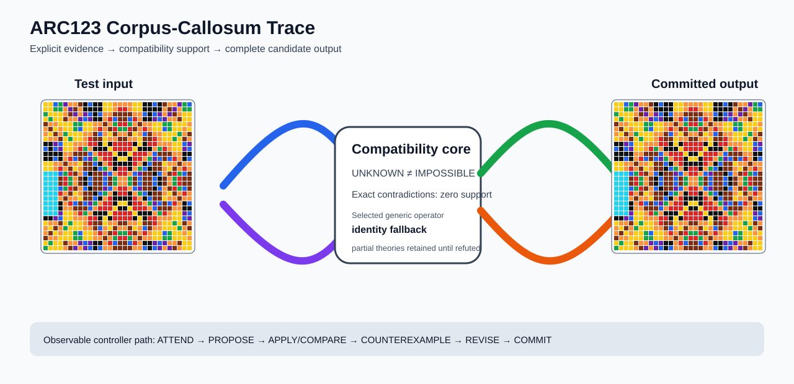

# ARC2 `0934a4d8` P0021-ARC12-BILATERAL-SCALE-DEVELOPMENT-40 Brain Surgery Report

## Outcome: NO — TEST CELLS DO NOT ALL MATCH

- **Compared positions:** 27
- **Mismatched cells:** 27
- **Training compatibility:** `False`
- **Fallback used:** `True`
- **Selected hypothesis:** `fallback_identity_complete_grid`
- **Source commit:** `71f86ff4c5304e452e0659131171f0519b50e21c`
- **Frozen controller commit:** `15833b3826281b49f70da8b9c7b2060ca1f00b8b`

## Live-Agent Boundary

The controller receives only visible training input/output examples and test inputs. It receives no task ID, imported cohort metadata, GT feature contract, GT solver, historical decomposition, or held-out output before committing a complete grid. The expected output appears only in post-answer V&V.

## Corpus-Callosum Visualization



- Full explicit event record: [`learning_trace.json`](learning_trace.json)

## Frozen Measurement

The controller bytes, generic operator vocabulary, source task checksums, and cohort membership were frozen before this task was parsed or scored. This result cannot tune the frozen controller.

## Post-Answer V&V

### Test case 1
- **All cells match:** `False`
- **Mismatched cells:** `27`
- **Prediction:**
```json
[[4, 4, 1, 3, 5, 7, 7, 9, 6, 1, 6, 6, 4, 4, 7, 7, 7, 7, 4, 4, 6, 6, 1, 6, 9, 7, 7, 5, 3, 1], [4, 4, 3, 3, 7, 5, 9, 7, 6, 6, 6, 6, 4, 4, 7, 2, 2, 7, 4, 4, 6, 6, 6, 6, 7, 9, 5, 7, 3, 3], [3, 4, 4, 4, 7, 9, 5, 7, 5, 1, 6, 1, 7, 7, 9, 9, 9, 9, 7, 7, 1, 6, 1, 5, 7, 5, 9, 7, 4, 4], [4, 3, 4, 4, 9, 7, 7, 5, 1, 5, 6, 6, 7, 2, 1, 9, 9, 1, 2, 7, 6, 6, 5, 1, 5, 7, 7, 9, 4, 4], [9, 7, 7, 4, 4, 4, 3, 3, 4, 4, 7, 7, 9, 7, 3, 2, 2, 3, 7, 9, 7, 7, 4, 4, 3, 3, 4, 4, 4, 7], [7, 9, 4, 7, 4, 4, 3, 1, 4, 4, 7, 2, 7, 9, 2, 3, 3, 2, 9, 7, 2, 7, 4, 4, 1, 3, 4, 4, 7, 4], [7, 4, 9, 7, 3, 4, 4, 4, 7, 7, 9, 1, 7, 4, 9, 7, 7, 9, 4, 7, 1, 9, 7, 7, 4, 4, 4, 3, 7, 9], [4, 7, 7, 9, 4, 3, 4, 4, 7, 2, 9, 9, 4, 7, 7, 9, 9, 7, 7, 4, 9, 9, 2, 7, 4, 4, 3, 4, 9, 7], [6, 6, 5, 1, 4, 4, 7, 7, 7, 2, 2, 6, 4, 6, 2, 2, 2, 2, 6, 4, 6, 2, 2, 7, 7, 7, 4, 4, 1, 5], [1, 6, 1, 5, 4, 4, 7, 2, 3, 7, 6, 6, 6, 4, 2, 2, 2, 2, 4, 6, 6, 6, 7, 3, 2, 7, 4, 4, 5, 1], [6, 6, 6, 6, 7, 7, 9, 9, 9, 1, 7, 2, 2, 2, 4, 6, 6, 4, 2, 2, 2, 7, 1, 9, 9, 9, 7, 7, 6, 6], [6, 6, 1, 6, 7, 2, 1, 9, 1, 5, 3, 7, 2, 2, 6, 4, 4, 6, 2, 2, 7, 3, 5, 1, 9, 1, 2, 7, 6, 1], [4, 4, 7, 7, 9, 7, 7, 4, 9, 9, 1, 6, 7, 2, 6, 6, 6, 6, 2, 7, 6, 1, 9, 9, 4, 7, 7, 9, 7, 7], [4, 4, 7, 2, 7, 9, 4, 7, 9, 9, 6, 1, 3, 7, 6, 2, 2, 6, 7, 3, 1, 6, 9, 9, 7, 4, 9, 7, 2, 7], [8, 8, 8, 1, 3, 2, 9, 7, 1, 6, 9, 9, 5, 1, 7, 2, 2, 7, 1, 5, 9, 9, 6, 1, 7, 9, 2, 3, 1, 9], [8, 8, 8, 9, 2, 3, 7, 9, 6, 1, 9, 9, 1, 9, 3, 7, 7, 3, 9, 1, 9, 9, 1, 6, 9, 7, 3, 2, 9, 9], [8, 8, 8, 9, 2, 3, 7, 9, 6, 1, 9, 9, 1, 9, 3, 7, 7, 3, 9, 1, 9, 9, 1, 6, 9, 7, 3, 2, 9, 9], [8, 8, 8, 1, 3, 2, 9, 7, 1, 6, 9, 9, 5, 1, 7, 2, 2, 7, 1, 5, 9, 9, 6, 1, 7, 9, 2, 3, 1, 9], [8, 8, 8, 2, 7, 9, 4, 7, 9, 9, 6, 1, 3, 7, 6, 2, 2, 6, 7, 3, 1, 6, 9, 9, 7, 4, 9, 7, 2, 7], [8, 8, 8, 7, 9, 7, 7, 4, 9, 9, 1, 6, 7, 2, 6, 6, 6, 6, 2, 7, 6, 1, 9, 9, 4, 7, 7, 9, 7, 7], [8, 8, 8, 6, 7, 2, 1, 9, 1, 5, 3, 7, 2, 2, 6, 4, 4, 6, 2, 2, 7, 3, 5, 1, 9, 1, 2, 7, 6, 1], [8, 8, 8, 6, 7, 7, 9, 9, 9, 1, 7, 2, 2, 2, 4, 6, 6, 4, 2, 2, 2, 7, 1, 9, 9, 9, 7, 7, 6, 6], [8, 8, 8, 5, 4, 4, 7, 2, 3, 7, 6, 6, 6, 4, 2, 2, 2, 2, 4, 6, 6, 6, 7, 3, 2, 7, 4, 4, 5, 1], [6, 6, 5, 1, 4, 4, 7, 7, 7, 2, 2, 6, 4, 6, 2, 2, 2, 2, 6, 4, 6, 2, 2, 7, 7, 7, 4, 4, 1, 5], [4, 7, 7, 9, 4, 3, 4, 4, 7, 2, 9, 9, 4, 7, 7, 9, 9, 7, 7, 4, 9, 9, 2, 7, 4, 4, 3, 4, 9, 7], [7, 4, 9, 7, 3, 4, 4, 4, 7, 7, 9, 1, 7, 4, 9, 7, 7, 9, 4, 7, 1, 9, 7, 7, 4, 4, 4, 3, 7, 9], [7, 9, 4, 7, 4, 4, 3, 1, 4, 4, 7, 2, 7, 9, 2, 3, 3, 2, 9, 7, 2, 7, 4, 4, 1, 3, 4, 4, 7, 4], [9, 7, 7, 4, 4, 4, 3, 3, 4, 4, 7, 7, 9, 7, 3, 2, 2, 3, 7, 9, 7, 7, 4, 4, 3, 3, 4, 4, 4, 7], [4, 3, 4, 4, 9, 7, 7, 5, 1, 5, 6, 6, 7, 2, 1, 9, 9, 1, 2, 7, 6, 6, 5, 1, 5, 7, 7, 9, 4, 4], [3, 4, 4, 4, 7, 9, 5, 7, 5, 1, 6, 1, 7, 7, 9, 9, 9, 9, 7, 7, 1, 6, 1, 5, 7, 5, 9, 7, 4, 4]]
```
- **Expected output (post-answer only):**
```json
[[7, 7, 9], [7, 2, 9], [7, 2, 9], [7, 7, 9], [4, 4, 7], [4, 4, 7], [6, 6, 1], [6, 6, 6], [1, 6, 1]]
```

## Observable IHL Walkthrough

The record contains explicit actions, predictions, feedback, and revisions; it does not claim or store hidden model reasoning.

### Action totals

- `APPLY_HYPOTHESIS`: 16
- `ATTEND`: 16
- `CHOOSE_NEXT_DEMO`: 16
- `COMMIT`: 1
- `COMPARE`: 16
- `PROPOSE`: 4
- `REJECT_RULE`: 4

### Decision milestones

- `0` `PROPOSE` — `{"parent_theory_id":"T0000","rule":{"description_length":1,"name":"identity","operation":"identity","parameters":{},"rule_id":"identity","scope":{"kind":"all","value":null}},"stage":"initial_generic_theories","theory_id":"T0001"}`
- `1` `PROPOSE` — `{"parent_theory_id":"T0000","rule":{"description_length":2,"name":"left_right(scope=all)","operation":"coordinate_transform","parameters":{"axis":"left_right"},"rule_id":"coordinate-left_right","scope":{"kind":"all","value":null}},"stage":"initial_generic_theories","theory_id":"T0002"}`
- `2` `PROPOSE` — `{"parent_theory_id":"T0000","rule":{"description_length":2,"name":"top_bottom(scope=all)","operation":"coordinate_transform","parameters":{"axis":"top_bottom"},"rule_id":"coordinate-top_bottom","scope":{"kind":"all","value":null}},"stage":"initial_generic_theories","theory_id":"T0003"}`
- `3` `PROPOSE` — `{"parent_theory_id":"T0000","rule":{"description_length":2,"name":"rotate_180(scope=all)","operation":"coordinate_transform","parameters":{"axis":"rotate_180"},"rule_id":"coordinate-rotate_180","scope":{"kind":"all","value":null}},"stage":"initial_generic_theories","theory_id":"T0004"}`
- `5` `ATTEND` — `{"reason":"initial_highest_observed_change_and_color_discrimination","selected_demo":0,"selected_region":{"region":"whole_demo"},"theory_id":"T0001"}`
- `9` `ATTEND` — `{"reason":"initial_highest_observed_change_and_color_discrimination","selected_demo":0,"selected_region":{"region":"whole_demo"},"theory_id":"T0002"}`
- `13` `ATTEND` — `{"reason":"initial_highest_observed_change_and_color_discrimination","selected_demo":0,"selected_region":{"region":"whole_demo"},"theory_id":"T0003"}`
- `17` `ATTEND` — `{"reason":"initial_highest_observed_change_and_color_discrimination","selected_demo":0,"selected_region":{"region":"whole_demo"},"theory_id":"T0004"}`
- `21` `ATTEND` — `{"reason":"unseen_demo_selected_for_residual_version_space_discrimination","selected_demo":2,"selected_region":{"region":"whole_demo"},"theory_id":"T0001"}`
- `25` `ATTEND` — `{"reason":"unseen_demo_selected_for_residual_version_space_discrimination","selected_demo":2,"selected_region":{"region":"whole_demo"},"theory_id":"T0002"}`
- `29` `ATTEND` — `{"reason":"unseen_demo_selected_for_residual_version_space_discrimination","selected_demo":2,"selected_region":{"region":"whole_demo"},"theory_id":"T0003"}`
- `33` `ATTEND` — `{"reason":"unseen_demo_selected_for_residual_version_space_discrimination","selected_demo":2,"selected_region":{"region":"whole_demo"},"theory_id":"T0004"}`
- `37` `ATTEND` — `{"reason":"unseen_demo_selected_for_residual_version_space_discrimination","selected_demo":1,"selected_region":{"region":"whole_demo"},"theory_id":"T0001"}`
- `41` `ATTEND` — `{"reason":"unseen_demo_selected_for_residual_version_space_discrimination","selected_demo":1,"selected_region":{"region":"whole_demo"},"theory_id":"T0002"}`
- `45` `ATTEND` — `{"reason":"unseen_demo_selected_for_residual_version_space_discrimination","selected_demo":1,"selected_region":{"region":"whole_demo"},"theory_id":"T0003"}`
- `49` `ATTEND` — `{"reason":"unseen_demo_selected_for_residual_version_space_discrimination","selected_demo":1,"selected_region":{"region":"whole_demo"},"theory_id":"T0004"}`
- `53` `ATTEND` — `{"reason":"unseen_demo_selected_for_residual_version_space_discrimination","selected_demo":3,"selected_region":{"region":"whole_demo"},"theory_id":"T0001"}`
- `57` `ATTEND` — `{"reason":"unseen_demo_selected_for_residual_version_space_discrimination","selected_demo":3,"selected_region":{"region":"whole_demo"},"theory_id":"T0002"}`
- `61` `ATTEND` — `{"reason":"unseen_demo_selected_for_residual_version_space_discrimination","selected_demo":3,"selected_region":{"region":"whole_demo"},"theory_id":"T0003"}`
- `65` `ATTEND` — `{"reason":"unseen_demo_selected_for_residual_version_space_discrimination","selected_demo":3,"selected_region":{"region":"whole_demo"},"theory_id":"T0004"}`
- `72` `COMMIT` — `{"best_partial_theory":{"contradiction_count":0,"counterexamples":[],"description_length":1,"evaluated_demo_indices":[],"history":[{"kind":"ADD_RULE","parameters":{"initial_proposal":true,"operation":"identity"},"target":"identity"}],"matching_cell_count":0,"name":"identity","parameter_bindings":{},"parent_theory_id":"T0000","rules":[{"description_length":1,"name":"identity","operation":"identity","parameters":{},"rule_id":"identity","scope":{"kind":"all","value":null}}],"scope_predicates":[{"kind":"all","value":null}],"theory_id":"T0001","unknown_cell_count":0,"unresolved_unknown":[]},"complete_prediction_group_count":0,"fallback_reason":"no_complete_training_compatible_partial_theory","posterior_mass":0.0,"selected_hypothesis":"fallback_identity_complete_grid","training_exact":false}`
