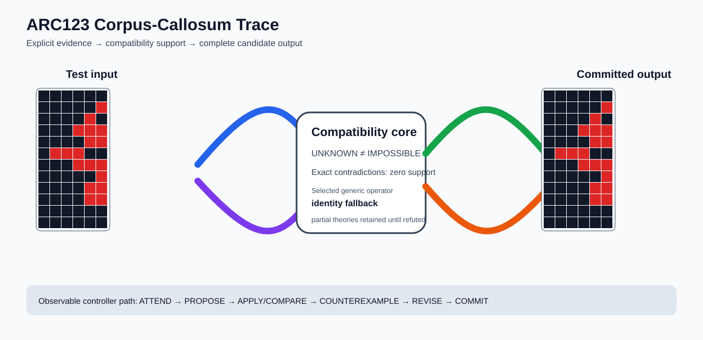

# ARC1 `6f473927` P0022-ARC12-BILATERAL-SCALE-TRANSFER-50 Brain Surgery Report

## Outcome: NO — TEST CELLS DO NOT ALL MATCH

- **Compared positions:** 144
- **Mismatched cells:** 144
- **Training compatibility:** `False`
- **Fallback used:** `True`
- **Selected hypothesis:** `fallback_identity_complete_grid`
- **Source commit:** `085f6dbe39050afac3d1d743f840bac95b1a8d1c`
- **Frozen controller commit:** `cf3ff72abc98d8c8654d50694ca18ce68700b3af`

## Live-Agent Boundary

The controller receives only visible training input/output examples and test inputs. It receives no task ID, imported cohort metadata, GT feature contract, GT solver, historical decomposition, or held-out output before committing a complete grid. The expected output appears only in post-answer V&V.

## Corpus-Callosum Visualization



- Full explicit event record: [`learning_trace.json`](learning_trace.json)

## Frozen Measurement

The controller bytes, generic operator vocabulary, source task checksums, and cohort membership were frozen before this task was parsed or scored. This result cannot tune the frozen controller.

## Post-Answer V&V

### Test case 1
- **All cells match:** `False`
- **Mismatched cells:** `144`
- **Prediction:**
```json
[[0, 0, 0, 0, 0, 0], [0, 0, 0, 0, 0, 2], [0, 0, 0, 0, 2, 0], [0, 0, 0, 2, 2, 2], [0, 0, 0, 0, 2, 2], [0, 2, 2, 2, 0, 0], [0, 0, 0, 2, 2, 2], [0, 0, 0, 0, 0, 2], [0, 0, 0, 0, 2, 2], [0, 0, 0, 0, 2, 2], [0, 0, 0, 0, 0, 0], [0, 0, 0, 0, 0, 0]]
```
- **Expected output (post-answer only):**
```json
[[0, 0, 0, 0, 0, 0, 8, 8, 8, 8, 8, 8], [0, 0, 0, 0, 0, 2, 0, 8, 8, 8, 8, 8], [0, 0, 0, 0, 2, 0, 8, 0, 8, 8, 8, 8], [0, 0, 0, 2, 2, 2, 0, 0, 0, 8, 8, 8], [0, 0, 0, 0, 2, 2, 0, 0, 8, 8, 8, 8], [0, 2, 2, 2, 0, 0, 8, 8, 0, 0, 0, 8], [0, 0, 0, 2, 2, 2, 0, 0, 0, 8, 8, 8], [0, 0, 0, 0, 0, 2, 0, 8, 8, 8, 8, 8], [0, 0, 0, 0, 2, 2, 0, 0, 8, 8, 8, 8], [0, 0, 0, 0, 2, 2, 0, 0, 8, 8, 8, 8], [0, 0, 0, 0, 0, 0, 8, 8, 8, 8, 8, 8], [0, 0, 0, 0, 0, 0, 8, 8, 8, 8, 8, 8]]
```

## Observable IHL Walkthrough

The record contains explicit actions, predictions, feedback, and revisions; it does not claim or store hidden model reasoning.

### Action totals

- `APPLY_HYPOTHESIS`: 20
- `ATTEND`: 20
- `CHOOSE_NEXT_DEMO`: 20
- `COMMIT`: 1
- `COMPARE`: 20
- `FIND_COUNTEREXAMPLE`: 4
- `PROPOSE`: 5
- `REJECT_RULE`: 5

### Decision milestones

- `0` `PROPOSE` — `{"parent_theory_id":"T0000","rule":{"description_length":1,"name":"identity","operation":"identity","parameters":{},"rule_id":"identity","scope":{"kind":"all","value":null}},"stage":"initial_generic_theories","theory_id":"T0001"}`
- `1` `PROPOSE` — `{"parent_theory_id":"T0000","rule":{"description_length":3,"name":"tile_repeat(column_factor=2,row_factor=1)","operation":"full_operator","parameters":{"column_factor":2,"operator":"tile_repeat","row_factor":1},"rule_id":"rule-tile_repeat","scope":{"kind":"all","value":null}},"stage":"initial_generic_theories","theory_id":"T0002"}`
- `2` `PROPOSE` — `{"parent_theory_id":"T0000","rule":{"description_length":2,"name":"left_right(scope=all)","operation":"coordinate_transform","parameters":{"axis":"left_right"},"rule_id":"coordinate-left_right","scope":{"kind":"all","value":null}},"stage":"initial_generic_theories","theory_id":"T0003"}`
- `3` `PROPOSE` — `{"parent_theory_id":"T0000","rule":{"description_length":2,"name":"top_bottom(scope=all)","operation":"coordinate_transform","parameters":{"axis":"top_bottom"},"rule_id":"coordinate-top_bottom","scope":{"kind":"all","value":null}},"stage":"initial_generic_theories","theory_id":"T0004"}`
- `4` `PROPOSE` — `{"parent_theory_id":"T0000","rule":{"description_length":2,"name":"rotate_180(scope=all)","operation":"coordinate_transform","parameters":{"axis":"rotate_180"},"rule_id":"coordinate-rotate_180","scope":{"kind":"all","value":null}},"stage":"initial_generic_theories","theory_id":"T0005"}`
- `6` `ATTEND` — `{"reason":"initial_highest_observed_change_and_color_discrimination","selected_demo":0,"selected_region":{"region":"whole_demo"},"theory_id":"T0001"}`
- `10` `ATTEND` — `{"reason":"initial_highest_observed_change_and_color_discrimination","selected_demo":0,"selected_region":{"region":"whole_demo"},"theory_id":"T0003"}`
- `14` `ATTEND` — `{"reason":"initial_highest_observed_change_and_color_discrimination","selected_demo":0,"selected_region":{"region":"whole_demo"},"theory_id":"T0004"}`
- `18` `ATTEND` — `{"reason":"initial_highest_observed_change_and_color_discrimination","selected_demo":0,"selected_region":{"region":"whole_demo"},"theory_id":"T0005"}`
- `22` `ATTEND` — `{"reason":"initial_highest_observed_change_and_color_discrimination","selected_demo":0,"selected_region":{"column":5,"row":0},"theory_id":"T0002"}`
- `26` `ATTEND` — `{"reason":"unseen_demo_selected_for_residual_version_space_discrimination","selected_demo":1,"selected_region":{"region":"whole_demo"},"theory_id":"T0001"}`
- `30` `ATTEND` — `{"reason":"unseen_demo_selected_for_residual_version_space_discrimination","selected_demo":1,"selected_region":{"region":"whole_demo"},"theory_id":"T0003"}`
- `34` `ATTEND` — `{"reason":"unseen_demo_selected_for_residual_version_space_discrimination","selected_demo":1,"selected_region":{"region":"whole_demo"},"theory_id":"T0004"}`
- `38` `ATTEND` — `{"reason":"unseen_demo_selected_for_residual_version_space_discrimination","selected_demo":1,"selected_region":{"region":"whole_demo"},"theory_id":"T0005"}`
- `42` `ATTEND` — `{"reason":"unseen_demo_selected_for_residual_version_space_discrimination","selected_demo":2,"selected_region":{"region":"whole_demo"},"theory_id":"T0001"}`
- `46` `ATTEND` — `{"reason":"unseen_demo_selected_for_residual_version_space_discrimination","selected_demo":2,"selected_region":{"region":"whole_demo"},"theory_id":"T0003"}`
- `50` `ATTEND` — `{"reason":"unseen_demo_selected_for_residual_version_space_discrimination","selected_demo":2,"selected_region":{"region":"whole_demo"},"theory_id":"T0004"}`
- `54` `ATTEND` — `{"reason":"unseen_demo_selected_for_residual_version_space_discrimination","selected_demo":2,"selected_region":{"region":"whole_demo"},"theory_id":"T0005"}`
- `58` `ATTEND` — `{"reason":"unseen_demo_selected_for_residual_version_space_discrimination","selected_demo":3,"selected_region":{"region":"whole_demo"},"theory_id":"T0001"}`
- `62` `ATTEND` — `{"reason":"unseen_demo_selected_for_residual_version_space_discrimination","selected_demo":3,"selected_region":{"region":"whole_demo"},"theory_id":"T0003"}`
- `66` `ATTEND` — `{"reason":"unseen_demo_selected_for_residual_version_space_discrimination","selected_demo":3,"selected_region":{"region":"whole_demo"},"theory_id":"T0004"}`
- `70` `ATTEND` — `{"reason":"unseen_demo_selected_for_residual_version_space_discrimination","selected_demo":3,"selected_region":{"region":"whole_demo"},"theory_id":"T0005"}`
- `79` `ATTEND` — `{"reason":"unseen_demo_selected_for_residual_version_space_discrimination","selected_demo":1,"selected_region":{"column":0,"row":0},"theory_id":"T0002"}`
- `84` `ATTEND` — `{"reason":"unseen_demo_selected_for_residual_version_space_discrimination","selected_demo":2,"selected_region":{"column":3,"row":0},"theory_id":"T0002"}`
- `89` `ATTEND` — `{"reason":"unseen_demo_selected_for_residual_version_space_discrimination","selected_demo":3,"selected_region":{"column":0,"row":0},"theory_id":"T0002"}`
- `94` `COMMIT` — `{"best_partial_theory":{"contradiction_count":0,"counterexamples":[],"description_length":1,"evaluated_demo_indices":[],"history":[{"kind":"ADD_RULE","parameters":{"initial_proposal":true,"operation":"identity"},"target":"identity"}],"matching_cell_count":0,"name":"identity","parameter_bindings":{},"parent_theory_id":"T0000","rules":[{"description_length":1,"name":"identity","operation":"identity","parameters":{},"rule_id":"identity","scope":{"kind":"all","value":null}}],"scope_predicates":[{"kind":"all","value":null}],"theory_id":"T0001","unknown_cell_count":0,"unresolved_unknown":[]},"complete_prediction_group_count":0,"fallback_reason":"no_complete_training_compatible_partial_theory","posterior_mass":0.0,"selected_hypothesis":"fallback_identity_complete_grid","training_exact":false}`

### First counterexamples

- `77` — `{"causal_next_operation":"scope_or_rule_revision","counterexample":{"column":5,"demo_index":0,"observed":8,"predicted":0,"row":0},"responsible_rule":{"description_length":3,"name":"tile_repeat(column_factor=2,row_factor=1)","operation":"full_operator","parameters":{"column_factor":2,"operator":"tile_repeat","row_factor":1},"rule_id":"rule-tile_repeat","scope":{"kind":"all","value":null}},"responsible_rule_id":"rule-tile_repeat","theory_id":"T0002"}`
- `82` — `{"causal_next_operation":"scope_or_rule_revision","counterexample":{"column":5,"demo_index":0,"observed":8,"predicted":0,"row":0},"responsible_rule":{"description_length":3,"name":"tile_repeat(column_factor=2,row_factor=1)","operation":"full_operator","parameters":{"column_factor":2,"operator":"tile_repeat","row_factor":1},"rule_id":"rule-tile_repeat","scope":{"kind":"all","value":null}},"responsible_rule_id":"rule-tile_repeat","theory_id":"T0002"}`
- `87` — `{"causal_next_operation":"scope_or_rule_revision","counterexample":{"column":5,"demo_index":0,"observed":8,"predicted":0,"row":0},"responsible_rule":{"description_length":3,"name":"tile_repeat(column_factor=2,row_factor=1)","operation":"full_operator","parameters":{"column_factor":2,"operator":"tile_repeat","row_factor":1},"rule_id":"rule-tile_repeat","scope":{"kind":"all","value":null}},"responsible_rule_id":"rule-tile_repeat","theory_id":"T0002"}`
- `92` — `{"causal_next_operation":"scope_or_rule_revision","counterexample":{"column":5,"demo_index":0,"observed":8,"predicted":0,"row":0},"responsible_rule":{"description_length":3,"name":"tile_repeat(column_factor=2,row_factor=1)","operation":"full_operator","parameters":{"column_factor":2,"operator":"tile_repeat","row_factor":1},"rule_id":"rule-tile_repeat","scope":{"kind":"all","value":null}},"responsible_rule_id":"rule-tile_repeat","theory_id":"T0002"}`
