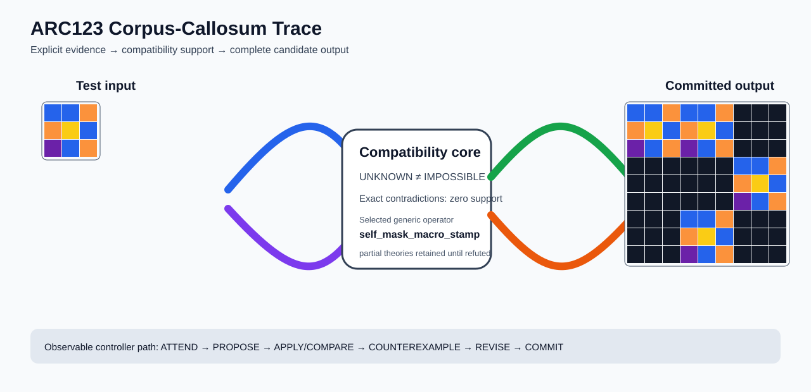

# ARC1 `c3e719e8` P0024-ARC12-PANEL-STREAM-FRACTAL-DEVELOPMENT-40 Brain Surgery Report

## Outcome: YES — ALL TEST CELLS MATCH

- **Compared positions:** 81
- **Mismatched cells:** 0
- **Training compatibility:** `True`
- **Fallback used:** `False`
- **Selected hypothesis:** `self_mask_macro_stamp(blank_color=0,selector=most_frequent,template=input)`
- **Source commit:** `085f6dbe39050afac3d1d743f840bac95b1a8d1c`
- **Frozen controller commit:** `a232432be2bc34e3e1beed732717a9936c6dda2f`

## Live-Agent Boundary

The controller receives only visible training input/output examples and test inputs. It receives no task ID, imported cohort metadata, GT feature contract, GT solver, historical decomposition, or held-out output before committing a complete grid. The expected output appears only in post-answer V&V.

## Corpus-Callosum Visualization



- Full explicit event record: [`learning_trace.json`](learning_trace.json)

## Frozen Measurement

The controller bytes, generic operator vocabulary, source task checksums, and cohort membership were frozen before this task was parsed or scored. This result cannot tune the frozen controller.

## Post-Answer V&V

### Test case 1
- **All cells match:** `True`
- **Mismatched cells:** `0`
- **Prediction:**
```json
[[1, 1, 7, 1, 1, 7, 0, 0, 0], [7, 4, 1, 7, 4, 1, 0, 0, 0], [5, 1, 7, 5, 1, 7, 0, 0, 0], [0, 0, 0, 0, 0, 0, 1, 1, 7], [0, 0, 0, 0, 0, 0, 7, 4, 1], [0, 0, 0, 0, 0, 0, 5, 1, 7], [0, 0, 0, 1, 1, 7, 0, 0, 0], [0, 0, 0, 7, 4, 1, 0, 0, 0], [0, 0, 0, 5, 1, 7, 0, 0, 0]]
```
- **Expected output (post-answer only):**
```json
[[1, 1, 7, 1, 1, 7, 0, 0, 0], [7, 4, 1, 7, 4, 1, 0, 0, 0], [5, 1, 7, 5, 1, 7, 0, 0, 0], [0, 0, 0, 0, 0, 0, 1, 1, 7], [0, 0, 0, 0, 0, 0, 7, 4, 1], [0, 0, 0, 0, 0, 0, 5, 1, 7], [0, 0, 0, 1, 1, 7, 0, 0, 0], [0, 0, 0, 7, 4, 1, 0, 0, 0], [0, 0, 0, 5, 1, 7, 0, 0, 0]]
```

## Observable IHL Walkthrough

The record contains explicit actions, predictions, feedback, and revisions; it does not claim or store hidden model reasoning.

### Action totals

- `APPLY_HYPOTHESIS`: 18
- `ATTEND`: 18
- `CHOOSE_NEXT_DEMO`: 18
- `COMMIT`: 1
- `COMPARE`: 18
- `FIND_COUNTEREXAMPLE`: 3
- `PROMOTE_CONSTRAINT`: 1
- `PROPOSE`: 6
- `REJECT_RULE`: 5

### Decision milestones

- `0` `PROPOSE` — `{"parent_theory_id":"T0000","rule":{"description_length":1,"name":"identity","operation":"identity","parameters":{},"rule_id":"identity","scope":{"kind":"all","value":null}},"stage":"initial_generic_theories","theory_id":"T0001"}`
- `1` `PROPOSE` — `{"parent_theory_id":"T0000","rule":{"description_length":3,"name":"tile_repeat(column_factor=3,row_factor=3)","operation":"full_operator","parameters":{"column_factor":3,"operator":"tile_repeat","row_factor":3},"rule_id":"rule-tile_repeat","scope":{"kind":"all","value":null}},"stage":"initial_generic_theories","theory_id":"T0002"}`
- `2` `PROPOSE` — `{"parent_theory_id":"T0000","rule":{"description_length":5,"name":"self_mask_macro_stamp(blank_color=0,selector=most_frequent,template=input)","operation":"full_operator","parameters":{"blank_color":0,"operator":"self_mask_macro_stamp","selector":"most_frequent","template":"input"},"rule_id":"rule-self_mask_macro_stamp","scope":{"kind":"all","value":null}},"stage":"initial_generic_theories","theory_id":"T0003"}`
- `3` `PROPOSE` — `{"parent_theory_id":"T0000","rule":{"description_length":2,"name":"left_right(scope=all)","operation":"coordinate_transform","parameters":{"axis":"left_right"},"rule_id":"coordinate-left_right","scope":{"kind":"all","value":null}},"stage":"initial_generic_theories","theory_id":"T0004"}`
- `4` `PROPOSE` — `{"parent_theory_id":"T0000","rule":{"description_length":2,"name":"top_bottom(scope=all)","operation":"coordinate_transform","parameters":{"axis":"top_bottom"},"rule_id":"coordinate-top_bottom","scope":{"kind":"all","value":null}},"stage":"initial_generic_theories","theory_id":"T0005"}`
- `5` `PROPOSE` — `{"parent_theory_id":"T0000","rule":{"description_length":2,"name":"rotate_180(scope=all)","operation":"coordinate_transform","parameters":{"axis":"rotate_180"},"rule_id":"coordinate-rotate_180","scope":{"kind":"all","value":null}},"stage":"initial_generic_theories","theory_id":"T0006"}`
- `7` `ATTEND` — `{"reason":"initial_highest_observed_change_and_color_discrimination","selected_demo":0,"selected_region":{"region":"whole_demo"},"theory_id":"T0001"}`
- `11` `ATTEND` — `{"reason":"initial_highest_observed_change_and_color_discrimination","selected_demo":0,"selected_region":{"region":"whole_demo"},"theory_id":"T0004"}`
- `15` `ATTEND` — `{"reason":"initial_highest_observed_change_and_color_discrimination","selected_demo":0,"selected_region":{"region":"whole_demo"},"theory_id":"T0005"}`
- `19` `ATTEND` — `{"reason":"initial_highest_observed_change_and_color_discrimination","selected_demo":0,"selected_region":{"region":"whole_demo"},"theory_id":"T0006"}`
- `23` `ATTEND` — `{"reason":"initial_highest_observed_change_and_color_discrimination","selected_demo":0,"selected_region":{"column":3,"row":0},"theory_id":"T0002"}`
- `27` `ATTEND` — `{"reason":"initial_highest_observed_change_and_color_discrimination","selected_demo":0,"selected_region":{"region":"whole_demo"},"theory_id":"T0003"}`
- `31` `ATTEND` — `{"reason":"unseen_demo_selected_for_residual_version_space_discrimination","selected_demo":2,"selected_region":{"region":"whole_demo"},"theory_id":"T0003"}`
- `35` `ATTEND` — `{"reason":"unseen_demo_selected_for_residual_version_space_discrimination","selected_demo":1,"selected_region":{"region":"whole_demo"},"theory_id":"T0003"}`
- `38` `PROMOTE_CONSTRAINT` — `{"evaluated_demo_count":3,"rule_count":1,"status":"complete_training_compatibility_after_revision","theory_id":"T0003"}`
- `40` `ATTEND` — `{"reason":"unseen_demo_selected_for_residual_version_space_discrimination","selected_demo":2,"selected_region":{"region":"whole_demo"},"theory_id":"T0001"}`
- `44` `ATTEND` — `{"reason":"unseen_demo_selected_for_residual_version_space_discrimination","selected_demo":2,"selected_region":{"region":"whole_demo"},"theory_id":"T0004"}`
- `48` `ATTEND` — `{"reason":"unseen_demo_selected_for_residual_version_space_discrimination","selected_demo":2,"selected_region":{"region":"whole_demo"},"theory_id":"T0005"}`
- `52` `ATTEND` — `{"reason":"unseen_demo_selected_for_residual_version_space_discrimination","selected_demo":2,"selected_region":{"region":"whole_demo"},"theory_id":"T0006"}`
- `56` `ATTEND` — `{"reason":"unseen_demo_selected_for_residual_version_space_discrimination","selected_demo":1,"selected_region":{"region":"whole_demo"},"theory_id":"T0001"}`
- `60` `ATTEND` — `{"reason":"unseen_demo_selected_for_residual_version_space_discrimination","selected_demo":1,"selected_region":{"region":"whole_demo"},"theory_id":"T0004"}`
- `64` `ATTEND` — `{"reason":"unseen_demo_selected_for_residual_version_space_discrimination","selected_demo":1,"selected_region":{"region":"whole_demo"},"theory_id":"T0005"}`
- `68` `ATTEND` — `{"reason":"unseen_demo_selected_for_residual_version_space_discrimination","selected_demo":1,"selected_region":{"region":"whole_demo"},"theory_id":"T0006"}`
- `77` `ATTEND` — `{"reason":"unseen_demo_selected_for_residual_version_space_discrimination","selected_demo":2,"selected_region":{"column":0,"row":0},"theory_id":"T0002"}`
- `82` `ATTEND` — `{"reason":"unseen_demo_selected_for_residual_version_space_discrimination","selected_demo":1,"selected_region":{"column":3,"row":0},"theory_id":"T0002"}`
- `87` `COMMIT` — `{"complete_prediction_group_count":1,"final_theory":{"contradiction_count":0,"counterexamples":[],"description_length":5,"evaluated_demo_indices":[0,1,2],"history":[{"kind":"ADD_RULE","parameters":{"initial_proposal":true,"operation":"full_operator"},"target":"rule-self_mask_macro_stamp"},{"kind":"ATTEND","parameters":{"information_score":[81,1,5],"reason":"initial_highest_observed_change_and_color_discrimination"},"target":"demo:0"},{"kind":"ATTEND","parameters":{"information_score":[81,1,5],"reason":"unseen_demo_selected_for_residual_version_space_discrimination"},"target":"demo:2"},{"kind":"ATTEND","parameters":{"information_score":[81,1,4],"reason":"unseen_demo_selected_for_residual_version_space_discrimination"},"target":"demo:1"}],"matching_cell_count":243,"name":"self_mask_macro_stamp(blank_color=0,selector=most_frequent,template=input)","parameter_bindings":{},"parent_theory_id":"T0000","rules":[{"description_length":5,"name":"self_mask_macro_stamp(blank_color=0,selector=most_frequent,template=input)","operation":"full_operator","parameters":{"blank_color":0,"operator":"self_mask_macro_stamp","selector":"most_frequent","template":"input"},"rule_id":"rule-self_mask_macro_stamp","scope":{"kind":"all","value":null}}],"scope_predicates":[{"kind":"all","value":null}],"theory_id":"T0003","unknown_cell_count":0,"unresolved_unknown":[]},"posterior_mass":1.0,"selected_hypothesis":"self_mask_macro_stamp(blank_color=0,selector=most_frequent,template=input)","theory_id":"T0003","training_exact":true}`

### First counterexamples

- `75` — `{"causal_next_operation":"scope_or_rule_revision","counterexample":{"column":3,"demo_index":0,"observed":0,"predicted":3,"row":0},"responsible_rule":{"description_length":3,"name":"tile_repeat(column_factor=3,row_factor=3)","operation":"full_operator","parameters":{"column_factor":3,"operator":"tile_repeat","row_factor":3},"rule_id":"rule-tile_repeat","scope":{"kind":"all","value":null}},"responsible_rule_id":"rule-tile_repeat","theory_id":"T0002"}`
- `80` — `{"causal_next_operation":"scope_or_rule_revision","counterexample":{"column":3,"demo_index":0,"observed":0,"predicted":3,"row":0},"responsible_rule":{"description_length":3,"name":"tile_repeat(column_factor=3,row_factor=3)","operation":"full_operator","parameters":{"column_factor":3,"operator":"tile_repeat","row_factor":3},"rule_id":"rule-tile_repeat","scope":{"kind":"all","value":null}},"responsible_rule_id":"rule-tile_repeat","theory_id":"T0002"}`
- `85` — `{"causal_next_operation":"scope_or_rule_revision","counterexample":{"column":3,"demo_index":0,"observed":0,"predicted":3,"row":0},"responsible_rule":{"description_length":3,"name":"tile_repeat(column_factor=3,row_factor=3)","operation":"full_operator","parameters":{"column_factor":3,"operator":"tile_repeat","row_factor":3},"rule_id":"rule-tile_repeat","scope":{"kind":"all","value":null}},"responsible_rule_id":"rule-tile_repeat","theory_id":"T0002"}`
