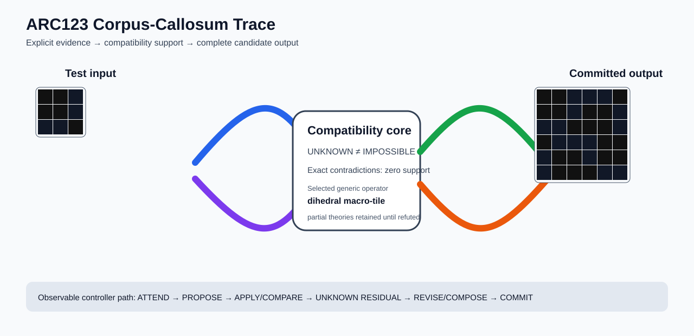

# ARC2 `ed98d772` P0026-ARC12-HIDDEN-ZERO-TRANSFER-50 Brain Surgery Report

## Outcome: YES — ALL TEST CELLS MATCH

- **Compared positions:** 36
- **Mismatched cells:** 0
- **Training compatibility:** `True`
- **Fallback used:** `False`
- **Selected hypothesis:** `compose(identity,dihedral_tile(column_factor=2,row_factor=2,template=identity;rotate_270;rotate_180;rotate_90))`
- **Source commit:** `71f86ff4c5304e452e0659131171f0519b50e21c`
- **Frozen controller commit:** `eac3e7967acfbc7142b551a5c336f506d5df5440`

## Live-Agent Boundary

The controller receives only visible training input/output examples and test inputs. It receives no task ID, imported cohort metadata, GT feature contract, GT solver, historical decomposition, or held-out output before committing a complete grid. The expected output appears only in post-answer V&V.

## Corpus-Callosum Visualization



- Full explicit event record: [`learning_trace.json`](learning_trace.json)

## Frozen Measurement

The controller bytes, generic operator vocabulary, source task checksums, and cohort membership were frozen before this task was parsed or scored. This result cannot tune the frozen controller.

## Post-Answer V&V

### Test case 1
- **All cells match:** `True`
- **Mismatched cells:** `0`
- **Prediction:**
```json
[[6, 6, 0, 0, 0, 6], [6, 6, 0, 6, 6, 0], [0, 0, 6, 6, 6, 0], [6, 0, 0, 0, 6, 6], [0, 6, 6, 0, 6, 6], [0, 6, 6, 6, 0, 0]]
```
- **Expected output (post-answer only):**
```json
[[6, 6, 0, 0, 0, 6], [6, 6, 0, 6, 6, 0], [0, 0, 6, 6, 6, 0], [6, 0, 0, 0, 6, 6], [0, 6, 6, 0, 6, 6], [0, 6, 6, 6, 0, 0]]
```

## Observable IHL Walkthrough

The record contains explicit actions, predictions, feedback, and revisions; it does not claim or store hidden model reasoning.

### Action totals

- `APPLY_HYPOTHESIS`: 46
- `ATTEND`: 46
- `CHOOSE_NEXT_DEMO`: 46
- `COMMIT`: 1
- `COMPARE`: 46
- `COMPOSE_RULE`: 5
- `EXPLAIN_RESIDUAL`: 5
- `FIND_COUNTEREXAMPLE`: 1
- `MERGE_RULES`: 1
- `PROMOTE_CONSTRAINT`: 5
- `PROPOSE`: 5
- `SPECIALIZE`: 5

### Decision milestones

- `0` `PROPOSE` — `{"parent_theory_id":"T0000","rule":{"description_length":1,"name":"identity","operation":"identity","parameters":{},"rule_id":"identity","scope":{"kind":"all","value":null}},"stage":"initial_generic_theories","theory_id":"T0001"}`
- `1` `PROPOSE` — `{"parent_theory_id":"T0000","rule":{"description_length":3,"name":"tile_repeat(column_factor=2,row_factor=2)","operation":"full_operator","parameters":{"column_factor":2,"operator":"tile_repeat","row_factor":2},"rule_id":"rule-tile_repeat","scope":{"kind":"all","value":null}},"stage":"initial_generic_theories","theory_id":"T0002"}`
- `2` `PROPOSE` — `{"parent_theory_id":"T0000","rule":{"description_length":2,"name":"left_right(scope=all)","operation":"coordinate_transform","parameters":{"axis":"left_right"},"rule_id":"coordinate-left_right","scope":{"kind":"all","value":null}},"stage":"initial_generic_theories","theory_id":"T0003"}`
- `3` `PROPOSE` — `{"parent_theory_id":"T0000","rule":{"description_length":2,"name":"top_bottom(scope=all)","operation":"coordinate_transform","parameters":{"axis":"top_bottom"},"rule_id":"coordinate-top_bottom","scope":{"kind":"all","value":null}},"stage":"initial_generic_theories","theory_id":"T0004"}`
- `4` `PROPOSE` — `{"parent_theory_id":"T0000","rule":{"description_length":2,"name":"rotate_180(scope=all)","operation":"coordinate_transform","parameters":{"axis":"rotate_180"},"rule_id":"coordinate-rotate_180","scope":{"kind":"all","value":null}},"stage":"initial_generic_theories","theory_id":"T0005"}`
- `6` `ATTEND` — `{"reason":"initial_highest_observed_change_and_color_discrimination","selected_demo":0,"selected_region":{"region":"whole_demo"},"theory_id":"T0001"}`
- `10` `ATTEND` — `{"reason":"initial_highest_observed_change_and_color_discrimination","selected_demo":0,"selected_region":{"region":"whole_demo"},"theory_id":"T0003"}`
- `14` `ATTEND` — `{"reason":"initial_highest_observed_change_and_color_discrimination","selected_demo":0,"selected_region":{"region":"whole_demo"},"theory_id":"T0004"}`
- `18` `ATTEND` — `{"reason":"initial_highest_observed_change_and_color_discrimination","selected_demo":0,"selected_region":{"region":"whole_demo"},"theory_id":"T0005"}`
- `22` `ATTEND` — `{"reason":"initial_highest_observed_change_and_color_discrimination","selected_demo":0,"selected_region":{"column":5,"row":0},"theory_id":"T0002"}`
- `26` `ATTEND` — `{"reason":"unseen_demo_selected_for_residual_version_space_discrimination","selected_demo":1,"selected_region":{"region":"whole_demo"},"theory_id":"T0001"}`
- `30` `ATTEND` — `{"reason":"unseen_demo_selected_for_residual_version_space_discrimination","selected_demo":1,"selected_region":{"region":"whole_demo"},"theory_id":"T0003"}`
- `34` `ATTEND` — `{"reason":"unseen_demo_selected_for_residual_version_space_discrimination","selected_demo":1,"selected_region":{"region":"whole_demo"},"theory_id":"T0004"}`
- `38` `ATTEND` — `{"reason":"unseen_demo_selected_for_residual_version_space_discrimination","selected_demo":1,"selected_region":{"region":"whole_demo"},"theory_id":"T0005"}`
- `42` `ATTEND` — `{"reason":"unseen_demo_selected_for_residual_version_space_discrimination","selected_demo":2,"selected_region":{"region":"whole_demo"},"theory_id":"T0001"}`
- `46` `ATTEND` — `{"reason":"unseen_demo_selected_for_residual_version_space_discrimination","selected_demo":2,"selected_region":{"region":"whole_demo"},"theory_id":"T0003"}`
- `50` `ATTEND` — `{"reason":"unseen_demo_selected_for_residual_version_space_discrimination","selected_demo":2,"selected_region":{"region":"whole_demo"},"theory_id":"T0004"}`
- `54` `ATTEND` — `{"reason":"unseen_demo_selected_for_residual_version_space_discrimination","selected_demo":2,"selected_region":{"region":"whole_demo"},"theory_id":"T0005"}`
- `58` `ATTEND` — `{"reason":"unseen_demo_selected_for_residual_version_space_discrimination","selected_demo":3,"selected_region":{"region":"whole_demo"},"theory_id":"T0001"}`
- `62` `ATTEND` — `{"reason":"unseen_demo_selected_for_residual_version_space_discrimination","selected_demo":3,"selected_region":{"region":"whole_demo"},"theory_id":"T0003"}`
- `66` `ATTEND` — `{"reason":"unseen_demo_selected_for_residual_version_space_discrimination","selected_demo":3,"selected_region":{"region":"whole_demo"},"theory_id":"T0004"}`
- `70` `ATTEND` — `{"reason":"unseen_demo_selected_for_residual_version_space_discrimination","selected_demo":3,"selected_region":{"region":"whole_demo"},"theory_id":"T0005"}`
- `74` `ATTEND` — `{"reason":"unseen_demo_selected_for_residual_version_space_discrimination","selected_demo":4,"selected_region":{"region":"whole_demo"},"theory_id":"T0001"}`
- `78` `ATTEND` — `{"reason":"unseen_demo_selected_for_residual_version_space_discrimination","selected_demo":4,"selected_region":{"region":"whole_demo"},"theory_id":"T0003"}`
- `82` `ATTEND` — `{"reason":"unseen_demo_selected_for_residual_version_space_discrimination","selected_demo":4,"selected_region":{"region":"whole_demo"},"theory_id":"T0004"}`
- `86` `ATTEND` — `{"reason":"unseen_demo_selected_for_residual_version_space_discrimination","selected_demo":4,"selected_region":{"region":"whole_demo"},"theory_id":"T0005"}`
- `89` `SPECIALIZE` — `{"added_rule":{"description_length":8,"name":"dihedral_tile(column_factor=2,row_factor=2,template=identity;rotate_270;rotate_180;rotate_90)","operation":"full_operator","parameters":{"column_factor":2,"operator":"dihedral_tile","row_factor":2,"template":"identity;rotate_270;rotate_180;rotate_90"},"rule_id":"structural-dihedral_tile","scope":{"kind":"all","value":null}},"parent_theory_id":"T0001","reason":"unexplained_residual_proposed_generic_structural_rule","theory_id":"T0006"}`
- `93` `ATTEND` — `{"reason":"initial_highest_observed_change_and_color_discrimination","selected_demo":0,"selected_region":{"region":"whole_demo"},"theory_id":"T0006"}`
- `97` `ATTEND` — `{"reason":"unseen_demo_selected_for_residual_version_space_discrimination","selected_demo":1,"selected_region":{"region":"whole_demo"},"theory_id":"T0006"}`
- `101` `ATTEND` — `{"reason":"unseen_demo_selected_for_residual_version_space_discrimination","selected_demo":2,"selected_region":{"region":"whole_demo"},"theory_id":"T0006"}`
- `105` `ATTEND` — `{"reason":"unseen_demo_selected_for_residual_version_space_discrimination","selected_demo":3,"selected_region":{"region":"whole_demo"},"theory_id":"T0006"}`
- `109` `ATTEND` — `{"reason":"unseen_demo_selected_for_residual_version_space_discrimination","selected_demo":4,"selected_region":{"region":"whole_demo"},"theory_id":"T0006"}`
- `112` `PROMOTE_CONSTRAINT` — `{"evaluated_demo_count":5,"rule_count":2,"status":"complete_training_compatibility_after_revision","theory_id":"T0006"}`
- `113` `SPECIALIZE` — `{"added_rule":{"description_length":8,"name":"dihedral_tile(column_factor=2,row_factor=2,template=identity;rotate_270;rotate_180;rotate_90)","operation":"full_operator","parameters":{"column_factor":2,"operator":"dihedral_tile","row_factor":2,"template":"identity;rotate_270;rotate_180;rotate_90"},"rule_id":"structural-dihedral_tile","scope":{"kind":"all","value":null}},"parent_theory_id":"T0003","reason":"unexplained_residual_proposed_generic_structural_rule","theory_id":"T0007"}`
- `117` `ATTEND` — `{"reason":"initial_highest_observed_change_and_color_discrimination","selected_demo":0,"selected_region":{"region":"whole_demo"},"theory_id":"T0007"}`
- `121` `ATTEND` — `{"reason":"unseen_demo_selected_for_residual_version_space_discrimination","selected_demo":1,"selected_region":{"region":"whole_demo"},"theory_id":"T0007"}`
- `125` `ATTEND` — `{"reason":"unseen_demo_selected_for_residual_version_space_discrimination","selected_demo":2,"selected_region":{"region":"whole_demo"},"theory_id":"T0007"}`
- `129` `ATTEND` — `{"reason":"unseen_demo_selected_for_residual_version_space_discrimination","selected_demo":3,"selected_region":{"region":"whole_demo"},"theory_id":"T0007"}`
- `133` `ATTEND` — `{"reason":"unseen_demo_selected_for_residual_version_space_discrimination","selected_demo":4,"selected_region":{"region":"whole_demo"},"theory_id":"T0007"}`
- `136` `PROMOTE_CONSTRAINT` — `{"evaluated_demo_count":5,"rule_count":3,"status":"complete_training_compatibility_after_revision","theory_id":"T0007"}`
- `137` `SPECIALIZE` — `{"added_rule":{"description_length":8,"name":"dihedral_tile(column_factor=2,row_factor=2,template=identity;rotate_270;rotate_180;rotate_90)","operation":"full_operator","parameters":{"column_factor":2,"operator":"dihedral_tile","row_factor":2,"template":"identity;rotate_270;rotate_180;rotate_90"},"rule_id":"structural-dihedral_tile","scope":{"kind":"all","value":null}},"parent_theory_id":"T0004","reason":"unexplained_residual_proposed_generic_structural_rule","theory_id":"T0008"}`
- `141` `ATTEND` — `{"reason":"initial_highest_observed_change_and_color_discrimination","selected_demo":0,"selected_region":{"region":"whole_demo"},"theory_id":"T0008"}`
- `145` `ATTEND` — `{"reason":"unseen_demo_selected_for_residual_version_space_discrimination","selected_demo":1,"selected_region":{"region":"whole_demo"},"theory_id":"T0008"}`
- `149` `ATTEND` — `{"reason":"unseen_demo_selected_for_residual_version_space_discrimination","selected_demo":2,"selected_region":{"region":"whole_demo"},"theory_id":"T0008"}`
- `153` `ATTEND` — `{"reason":"unseen_demo_selected_for_residual_version_space_discrimination","selected_demo":3,"selected_region":{"region":"whole_demo"},"theory_id":"T0008"}`
- `157` `ATTEND` — `{"reason":"unseen_demo_selected_for_residual_version_space_discrimination","selected_demo":4,"selected_region":{"region":"whole_demo"},"theory_id":"T0008"}`
- `160` `PROMOTE_CONSTRAINT` — `{"evaluated_demo_count":5,"rule_count":3,"status":"complete_training_compatibility_after_revision","theory_id":"T0008"}`
- `161` `SPECIALIZE` — `{"added_rule":{"description_length":8,"name":"dihedral_tile(column_factor=2,row_factor=2,template=identity;rotate_270;rotate_180;rotate_90)","operation":"full_operator","parameters":{"column_factor":2,"operator":"dihedral_tile","row_factor":2,"template":"identity;rotate_270;rotate_180;rotate_90"},"rule_id":"structural-dihedral_tile","scope":{"kind":"all","value":null}},"parent_theory_id":"T0005","reason":"unexplained_residual_proposed_generic_structural_rule","theory_id":"T0009"}`
- `165` `ATTEND` — `{"reason":"initial_highest_observed_change_and_color_discrimination","selected_demo":0,"selected_region":{"region":"whole_demo"},"theory_id":"T0009"}`
- `169` `ATTEND` — `{"reason":"unseen_demo_selected_for_residual_version_space_discrimination","selected_demo":1,"selected_region":{"region":"whole_demo"},"theory_id":"T0009"}`
- `173` `ATTEND` — `{"reason":"unseen_demo_selected_for_residual_version_space_discrimination","selected_demo":2,"selected_region":{"region":"whole_demo"},"theory_id":"T0009"}`
- `177` `ATTEND` — `{"reason":"unseen_demo_selected_for_residual_version_space_discrimination","selected_demo":3,"selected_region":{"region":"whole_demo"},"theory_id":"T0009"}`
- `181` `ATTEND` — `{"reason":"unseen_demo_selected_for_residual_version_space_discrimination","selected_demo":4,"selected_region":{"region":"whole_demo"},"theory_id":"T0009"}`
- `184` `PROMOTE_CONSTRAINT` — `{"evaluated_demo_count":5,"rule_count":3,"status":"complete_training_compatibility_after_revision","theory_id":"T0009"}`
- `186` `SPECIALIZE` — `{"added_rule":{"description_length":8,"name":"dihedral_tile(column_factor=2,row_factor=2,template=identity;rotate_270;rotate_180;rotate_90)","operation":"full_operator","parameters":{"column_factor":2,"operator":"dihedral_tile","row_factor":2,"template":"identity;rotate_270;rotate_180;rotate_90"},"rule_id":"structural-dihedral_tile","scope":{"kind":"all","value":null}},"parent_theory_id":"T0002","reason":"unexplained_residual_proposed_generic_structural_rule","theory_id":"T0010"}`
- `190` `ATTEND` — `{"reason":"initial_highest_observed_change_and_color_discrimination","selected_demo":0,"selected_region":{"region":"whole_demo"},"theory_id":"T0010"}`
- `194` `ATTEND` — `{"reason":"unseen_demo_selected_for_residual_version_space_discrimination","selected_demo":1,"selected_region":{"region":"whole_demo"},"theory_id":"T0010"}`
- `198` `ATTEND` — `{"reason":"unseen_demo_selected_for_residual_version_space_discrimination","selected_demo":2,"selected_region":{"region":"whole_demo"},"theory_id":"T0010"}`
- `202` `ATTEND` — `{"reason":"unseen_demo_selected_for_residual_version_space_discrimination","selected_demo":3,"selected_region":{"region":"whole_demo"},"theory_id":"T0010"}`
- `206` `ATTEND` — `{"reason":"unseen_demo_selected_for_residual_version_space_discrimination","selected_demo":4,"selected_region":{"region":"whole_demo"},"theory_id":"T0010"}`
- `209` `PROMOTE_CONSTRAINT` — `{"evaluated_demo_count":5,"rule_count":3,"status":"complete_training_compatibility_after_revision","theory_id":"T0010"}`
- `210` `MERGE_RULES` — `{"compatible_theory_ids":["T0006","T0007","T0008","T0009","T0010"],"complete_prediction_group_size":5}`
- `211` `COMMIT` — `{"complete_prediction_group_count":1,"final_theory":{"contradiction_count":0,"counterexamples":[],"description_length":9,"evaluated_demo_indices":[0,1,2,3,4],"history":[{"kind":"ADD_RULE","parameters":{"initial_proposal":true,"operation":"identity"},"target":"identity"},{"kind":"ATTEND","parameters":{"information_score":[36,0,2],"reason":"initial_highest_observed_change_and_color_discrimination"},"target":"demo:0"},{"kind":"ATTEND","parameters":{"information_score":[36,0,2],"reason":"unseen_demo_selected_for_residual_version_space_discrimination"},"target":"demo:1"},{"kind":"ATTEND","parameters":{"information_score":[36,0,2],"reason":"unseen_demo_selected_for_residual_version_space_discrimination"},"target":"demo:2"},{"kind":"ATTEND","parameters":{"information_score":[36,0,2],"reason":"unseen_demo_selected_for_residual_version_space_discrimination"},"target":"demo:3"},{"kind":"ATTEND","parameters":{"information_score":[36,0,2],"reason":"unseen_demo_selected_for_residual_version_space_discrimination"},"target":"demo:4"},{"kind":"ADD_RULE","parameters":{"observed_residual_ranking":{"contradiction_count":0,"matching_cell_count":180,"unknown_cell_count":0},"operator":"dihedral_tile","proposal_family":"structural_residual"},"target":"structural-dihedral_tile"},{"kind":"ATTEND","parameters":{"information_score":[36,0,2],"reason":"initial_highest_observed_change_and_color_discrimination"},"target":"demo:0"},{"kind":"ATTEND","parameters":{"information_score":[36,0,2],"reason":"unseen_demo_selected_for_residual_version_space_discrimination"},"target":"demo:1"},{"kind":"ATTEND","parameters":{"information_score":[36,0,2],"reason":"unseen_demo_selected_for_residual_version_space_discrimination"},"target":"demo:2"},{"kind":"ATTEND","parameters":{"information_score":[36,0,2],"reason":"unseen_demo_selected_for_residual_version_space_discrimination"},"target":"demo:3"},{"kind":"ATTEND","parameters":{"information_score":[36,0,2],"reason":"unseen_demo_selected_for_residual_version_space_discrimination"},"target":"demo:4"}],"matching_cell_count":180,"name":"compose(identity,dihedral_tile(column_factor=2,row_factor=2,template=identity;rotate_270;rotate_180;rotate_90))","parameter_bindings":{},"parent_theory_id":"T0001","rules":[{"description_length":1,"name":"identity","operation":"identity","parameters":{},"rule_id":"identity","scope":{"kind":"all","value":null}},{"description_length":8,"name":"dihedral_tile(column_factor=2,row_factor=2,template=identity;rotate_270;rotate_180;rotate_90)","operation":"full_operator","parameters":{"column_factor":2,"operator":"dihedral_tile","row_factor":2,"template":"identity;rotate_270;rotate_180;rotate_90"},"rule_id":"structural-dihedral_tile","scope":{"kind":"all","value":null}}],"scope_predicates":[{"kind":"all","value":null},{"kind":"all","value":null}],"theory_id":"T0006","unknown_cell_count":0,"unresolved_unknown":[]},"posterior_mass":1.0,"selected_hypothesis":"compose(identity,dihedral_tile(column_factor=2,row_factor=2,template=identity;rotate_270;rotate_180;rotate_90))","theory_id":"T0006","training_exact":true}`

### First counterexamples

- `185` — `{"causal_next_operation":"scope_or_rule_revision","counterexample":{"column":5,"demo_index":0,"observed":0,"predicted":8,"row":0},"responsible_rule":{"description_length":3,"name":"tile_repeat(column_factor=2,row_factor=2)","operation":"full_operator","parameters":{"column_factor":2,"operator":"tile_repeat","row_factor":2},"rule_id":"rule-tile_repeat","scope":{"kind":"all","value":null}},"responsible_rule_id":"rule-tile_repeat","theory_id":"T0002"}`
