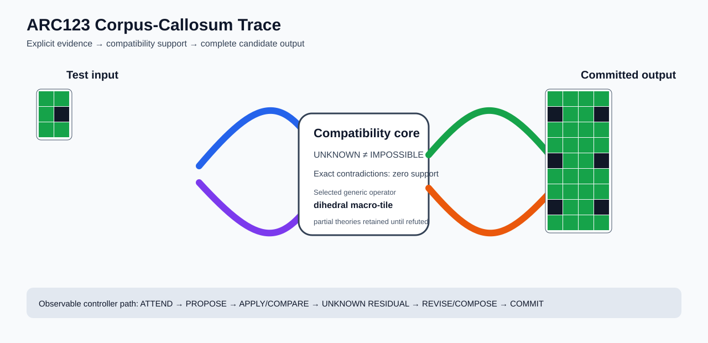

# ARC1 `8d5021e8` P0029-ARC12-COMPATIBILITY-PORTFOLIO-TRAINING-TRANSFER-50 Brain Surgery Report

## Outcome: YES — ALL TEST CELLS MATCH

- **Compared positions:** 36
- **Mismatched cells:** 0
- **Training compatibility:** `True`
- **Fallback used:** `False`
- **Selected hypothesis:** `compose(identity,dihedral_tile(column_factor=2,row_factor=3,template=rotate_180;flip_tb;flip_lr;identity;rotate_180;flip_tb))`
- **Source commit:** `085f6dbe39050afac3d1d743f840bac95b1a8d1c`
- **Frozen controller commit:** `a12e6344822d9e423bcc9267f3dbc3b34e4c3502`

## Live-Agent Boundary

The controller receives only visible training input/output examples and test inputs. It receives no task ID, imported cohort metadata, GT feature contract, GT solver, historical decomposition, or held-out output before committing a complete grid. The expected output appears only in post-answer V&V.

## Corpus-Callosum Visualization



- Full explicit event record: [`learning_trace.json`](learning_trace.json)

## Frozen Measurement

The controller bytes, generic operator vocabulary, source task checksums, and cohort membership were frozen before this task was parsed or scored. This result cannot tune the frozen controller.

## Post-Answer V&V

### Test case 1
- **All cells match:** `True`
- **Mismatched cells:** `0`
- **Prediction:**
```json
[[3, 3, 3, 3], [0, 3, 3, 0], [3, 3, 3, 3], [3, 3, 3, 3], [0, 3, 3, 0], [3, 3, 3, 3], [3, 3, 3, 3], [0, 3, 3, 0], [3, 3, 3, 3]]
```
- **Expected output (post-answer only):**
```json
[[3, 3, 3, 3], [0, 3, 3, 0], [3, 3, 3, 3], [3, 3, 3, 3], [0, 3, 3, 0], [3, 3, 3, 3], [3, 3, 3, 3], [0, 3, 3, 0], [3, 3, 3, 3]]
```

## Observable IHL Walkthrough

The record contains explicit actions, predictions, feedback, and revisions; it does not claim or store hidden model reasoning.

### Action totals

- `APPLY_HYPOTHESIS`: 66
- `ATTEND`: 66
- `CHOOSE_NEXT_DEMO`: 66
- `COMMIT`: 1
- `COMPARE`: 71
- `COMPOSE_RULE`: 21
- `EXPLAIN_RESIDUAL`: 21
- `FIND_COUNTEREXAMPLE`: 18
- `MERGE_RULES`: 1
- `PROMOTE_CONSTRAINT`: 10
- `PROPOSE`: 5
- `SPECIALIZE`: 13

### Decision milestones

- `0` `PROPOSE` — `{"parent_theory_id":"T0000","rule":{"description_length":1,"name":"identity","operation":"identity","parameters":{},"rule_id":"identity","scope":{"kind":"all","value":null}},"stage":"initial_generic_theories","theory_id":"T0001"}`
- `1` `PROPOSE` — `{"parent_theory_id":"T0000","rule":{"description_length":3,"name":"tile_repeat(column_factor=2,row_factor=3)","operation":"full_operator","parameters":{"column_factor":2,"operator":"tile_repeat","row_factor":3},"rule_id":"rule-tile_repeat","scope":{"kind":"all","value":null}},"stage":"initial_generic_theories","theory_id":"T0002"}`
- `2` `PROPOSE` — `{"parent_theory_id":"T0000","rule":{"description_length":2,"name":"left_right(scope=all)","operation":"coordinate_transform","parameters":{"axis":"left_right"},"rule_id":"coordinate-left_right","scope":{"kind":"all","value":null}},"stage":"initial_generic_theories","theory_id":"T0003"}`
- `3` `PROPOSE` — `{"parent_theory_id":"T0000","rule":{"description_length":2,"name":"top_bottom(scope=all)","operation":"coordinate_transform","parameters":{"axis":"top_bottom"},"rule_id":"coordinate-top_bottom","scope":{"kind":"all","value":null}},"stage":"initial_generic_theories","theory_id":"T0004"}`
- `4` `PROPOSE` — `{"parent_theory_id":"T0000","rule":{"description_length":2,"name":"rotate_180(scope=all)","operation":"coordinate_transform","parameters":{"axis":"rotate_180"},"rule_id":"coordinate-rotate_180","scope":{"kind":"all","value":null}},"stage":"initial_generic_theories","theory_id":"T0005"}`
- `11` `ATTEND` — `{"reason":"initial_highest_observed_change_and_color_discrimination","selected_demo":0,"selected_region":{"region":"whole_demo"},"theory_id":"T0001"}`
- `15` `ATTEND` — `{"reason":"initial_highest_observed_change_and_color_discrimination","selected_demo":0,"selected_region":{"region":"whole_demo"},"theory_id":"T0003"}`
- `19` `ATTEND` — `{"reason":"initial_highest_observed_change_and_color_discrimination","selected_demo":0,"selected_region":{"region":"whole_demo"},"theory_id":"T0004"}`
- `23` `ATTEND` — `{"reason":"initial_highest_observed_change_and_color_discrimination","selected_demo":0,"selected_region":{"region":"whole_demo"},"theory_id":"T0005"}`
- `27` `ATTEND` — `{"reason":"initial_highest_observed_change_and_color_discrimination","selected_demo":0,"selected_region":{"column":0,"row":0},"theory_id":"T0002"}`
- `31` `ATTEND` — `{"reason":"unseen_demo_selected_for_residual_version_space_discrimination","selected_demo":1,"selected_region":{"region":"whole_demo"},"theory_id":"T0001"}`
- `35` `ATTEND` — `{"reason":"unseen_demo_selected_for_residual_version_space_discrimination","selected_demo":1,"selected_region":{"region":"whole_demo"},"theory_id":"T0003"}`
- `39` `ATTEND` — `{"reason":"unseen_demo_selected_for_residual_version_space_discrimination","selected_demo":1,"selected_region":{"region":"whole_demo"},"theory_id":"T0004"}`
- `43` `ATTEND` — `{"reason":"unseen_demo_selected_for_residual_version_space_discrimination","selected_demo":1,"selected_region":{"region":"whole_demo"},"theory_id":"T0005"}`
- `47` `ATTEND` — `{"reason":"unseen_demo_selected_for_residual_version_space_discrimination","selected_demo":2,"selected_region":{"region":"whole_demo"},"theory_id":"T0001"}`
- `51` `ATTEND` — `{"reason":"unseen_demo_selected_for_residual_version_space_discrimination","selected_demo":2,"selected_region":{"region":"whole_demo"},"theory_id":"T0003"}`
- `55` `ATTEND` — `{"reason":"unseen_demo_selected_for_residual_version_space_discrimination","selected_demo":2,"selected_region":{"region":"whole_demo"},"theory_id":"T0004"}`
- `59` `ATTEND` — `{"reason":"unseen_demo_selected_for_residual_version_space_discrimination","selected_demo":2,"selected_region":{"region":"whole_demo"},"theory_id":"T0005"}`
- `62` `SPECIALIZE` — `{"added_rule":{"description_length":10,"name":"dihedral_tile(column_factor=2,row_factor=3,template=rotate_180;flip_tb;flip_lr;identity;rotate_180;flip_tb)","operation":"full_operator","parameters":{"column_factor":2,"operator":"dihedral_tile","row_factor":3,"template":"rotate_180;flip_tb;flip_lr;identity;rotate_180;flip_tb"},"rule_id":"structural-dihedral_tile","scope":{"kind":"all","value":null}},"parent_theory_id":"T0001","reason":"unexplained_residual_proposed_generic_structural_rule","theory_id":"T0006"}`
- `66` `ATTEND` — `{"reason":"initial_highest_observed_change_and_color_discrimination","selected_demo":0,"selected_region":{"region":"whole_demo"},"theory_id":"T0006"}`
- `70` `ATTEND` — `{"reason":"unseen_demo_selected_for_residual_version_space_discrimination","selected_demo":1,"selected_region":{"region":"whole_demo"},"theory_id":"T0006"}`
- `74` `ATTEND` — `{"reason":"unseen_demo_selected_for_residual_version_space_discrimination","selected_demo":2,"selected_region":{"region":"whole_demo"},"theory_id":"T0006"}`
- `77` `PROMOTE_CONSTRAINT` — `{"evaluated_demo_count":3,"rule_count":2,"status":"complete_training_compatibility_after_revision","theory_id":"T0006"}`
- `78` `SPECIALIZE` — `{"added_rule":{"description_length":10,"name":"dihedral_tile(column_factor=2,row_factor=3,template=rotate_180;flip_tb;flip_lr;identity;rotate_180;flip_tb)","operation":"full_operator","parameters":{"column_factor":2,"operator":"dihedral_tile","row_factor":3,"template":"rotate_180;flip_tb;flip_lr;identity;rotate_180;flip_tb"},"rule_id":"structural-dihedral_tile","scope":{"kind":"all","value":null}},"parent_theory_id":"T0003","reason":"unexplained_residual_proposed_generic_structural_rule","theory_id":"T0007"}`
- `82` `ATTEND` — `{"reason":"initial_highest_observed_change_and_color_discrimination","selected_demo":0,"selected_region":{"region":"whole_demo"},"theory_id":"T0007"}`
- `86` `ATTEND` — `{"reason":"unseen_demo_selected_for_residual_version_space_discrimination","selected_demo":1,"selected_region":{"region":"whole_demo"},"theory_id":"T0007"}`
- `90` `ATTEND` — `{"reason":"unseen_demo_selected_for_residual_version_space_discrimination","selected_demo":2,"selected_region":{"region":"whole_demo"},"theory_id":"T0007"}`
- `93` `PROMOTE_CONSTRAINT` — `{"evaluated_demo_count":3,"rule_count":3,"status":"complete_training_compatibility_after_revision","theory_id":"T0007"}`
- `94` `SPECIALIZE` — `{"added_rule":{"description_length":10,"name":"dihedral_tile(column_factor=2,row_factor=3,template=rotate_180;flip_tb;flip_lr;identity;rotate_180;flip_tb)","operation":"full_operator","parameters":{"column_factor":2,"operator":"dihedral_tile","row_factor":3,"template":"rotate_180;flip_tb;flip_lr;identity;rotate_180;flip_tb"},"rule_id":"structural-dihedral_tile","scope":{"kind":"all","value":null}},"parent_theory_id":"T0004","reason":"unexplained_residual_proposed_generic_structural_rule","theory_id":"T0008"}`
- `98` `ATTEND` — `{"reason":"initial_highest_observed_change_and_color_discrimination","selected_demo":0,"selected_region":{"region":"whole_demo"},"theory_id":"T0008"}`
- `102` `ATTEND` — `{"reason":"unseen_demo_selected_for_residual_version_space_discrimination","selected_demo":1,"selected_region":{"region":"whole_demo"},"theory_id":"T0008"}`
- `106` `ATTEND` — `{"reason":"unseen_demo_selected_for_residual_version_space_discrimination","selected_demo":2,"selected_region":{"region":"whole_demo"},"theory_id":"T0008"}`
- `109` `PROMOTE_CONSTRAINT` — `{"evaluated_demo_count":3,"rule_count":3,"status":"complete_training_compatibility_after_revision","theory_id":"T0008"}`
- `110` `SPECIALIZE` — `{"added_rule":{"description_length":10,"name":"dihedral_tile(column_factor=2,row_factor=3,template=rotate_180;flip_tb;flip_lr;identity;rotate_180;flip_tb)","operation":"full_operator","parameters":{"column_factor":2,"operator":"dihedral_tile","row_factor":3,"template":"rotate_180;flip_tb;flip_lr;identity;rotate_180;flip_tb"},"rule_id":"structural-dihedral_tile","scope":{"kind":"all","value":null}},"parent_theory_id":"T0005","reason":"unexplained_residual_proposed_generic_structural_rule","theory_id":"T0009"}`
- `114` `ATTEND` — `{"reason":"initial_highest_observed_change_and_color_discrimination","selected_demo":0,"selected_region":{"region":"whole_demo"},"theory_id":"T0009"}`
- `118` `ATTEND` — `{"reason":"unseen_demo_selected_for_residual_version_space_discrimination","selected_demo":1,"selected_region":{"region":"whole_demo"},"theory_id":"T0009"}`
- `122` `ATTEND` — `{"reason":"unseen_demo_selected_for_residual_version_space_discrimination","selected_demo":2,"selected_region":{"region":"whole_demo"},"theory_id":"T0009"}`
- `125` `PROMOTE_CONSTRAINT` — `{"evaluated_demo_count":3,"rule_count":3,"status":"complete_training_compatibility_after_revision","theory_id":"T0009"}`
- `129` `SPECIALIZE` — `{"added_rule":{"description_length":8,"name":"dihedral_tile(column_factor=2,row_factor=3,template=flip_lr;identity;flip_lr;identity;flip_lr;identity)","operation":"full_operator","parameters":{"column_factor":2,"operator":"dihedral_tile","row_factor":3,"template":"flip_lr;identity;flip_lr;identity;flip_lr;identity"},"rule_id":"structural-dihedral_tile","scope":{"kind":"all","value":null}},"parent_theory_id":"T0002","reason":"unexplained_residual_proposed_generic_structural_rule","theory_id":"T0011"}`
- `133` `ATTEND` — `{"reason":"initial_highest_observed_change_and_color_discrimination","selected_demo":0,"selected_region":{"column":1,"row":0},"theory_id":"T0010"}`
- `137` `ATTEND` — `{"reason":"initial_highest_observed_change_and_color_discrimination","selected_demo":0,"selected_region":{"region":"whole_demo"},"theory_id":"T0011"}`
- `141` `ATTEND` — `{"reason":"unseen_demo_selected_for_residual_version_space_discrimination","selected_demo":1,"selected_region":{"region":"whole_demo"},"theory_id":"T0011"}`
- `145` `ATTEND` — `{"reason":"unseen_demo_selected_for_residual_version_space_discrimination","selected_demo":2,"selected_region":{"column":1,"row":0},"theory_id":"T0011"}`
- `151` `SPECIALIZE` — `{"added_rule":{"description_length":10,"name":"dihedral_tile(column_factor=2,row_factor=3,template=rotate_180;flip_tb;flip_lr;identity;rotate_180;flip_tb)","operation":"full_operator","parameters":{"column_factor":2,"operator":"dihedral_tile","row_factor":3,"template":"rotate_180;flip_tb;flip_lr;identity;rotate_180;flip_tb"},"rule_id":"structural-dihedral_tile","scope":{"kind":"all","value":null}},"parent_theory_id":"T0011","reason":"unexplained_residual_proposed_generic_structural_rule","theory_id":"T0013"}`
- `155` `ATTEND` — `{"reason":"initial_highest_observed_change_and_color_discrimination","selected_demo":0,"selected_region":{"column":0,"row":0},"theory_id":"T0012"}`
- `159` `ATTEND` — `{"reason":"initial_highest_observed_change_and_color_discrimination","selected_demo":0,"selected_region":{"region":"whole_demo"},"theory_id":"T0013"}`
- `163` `ATTEND` — `{"reason":"unseen_demo_selected_for_residual_version_space_discrimination","selected_demo":1,"selected_region":{"region":"whole_demo"},"theory_id":"T0013"}`
- `167` `ATTEND` — `{"reason":"unseen_demo_selected_for_residual_version_space_discrimination","selected_demo":2,"selected_region":{"region":"whole_demo"},"theory_id":"T0013"}`
- `170` `PROMOTE_CONSTRAINT` — `{"evaluated_demo_count":3,"rule_count":4,"status":"complete_training_compatibility_after_revision","theory_id":"T0013"}`
- `175` `ATTEND` — `{"reason":"initial_highest_observed_change_and_color_discrimination","selected_demo":0,"selected_region":{"column":0,"row":1},"theory_id":"T0014"}`
- `180` `ATTEND` — `{"reason":"unseen_demo_selected_for_residual_version_space_discrimination","selected_demo":1,"selected_region":{"column":1,"row":0},"theory_id":"T0014"}`
- `185` `ATTEND` — `{"reason":"unseen_demo_selected_for_residual_version_space_discrimination","selected_demo":2,"selected_region":{"column":0,"row":0},"theory_id":"T0014"}`
- `191` `SPECIALIZE` — `{"added_rule":{"description_length":8,"name":"dihedral_tile(column_factor=2,row_factor=3,template=flip_lr;identity;flip_lr;identity;flip_lr;identity)","operation":"full_operator","parameters":{"column_factor":2,"operator":"dihedral_tile","row_factor":3,"template":"flip_lr;identity;flip_lr;identity;flip_lr;identity"},"rule_id":"structural-dihedral_tile","scope":{"kind":"all","value":null}},"parent_theory_id":"T0010","reason":"unexplained_residual_proposed_generic_structural_rule","theory_id":"T0016"}`
- `195` `ATTEND` — `{"reason":"initial_highest_observed_change_and_color_discrimination","selected_demo":0,"selected_region":{"column":0,"row":1},"theory_id":"T0015"}`
- `199` `ATTEND` — `{"reason":"initial_highest_observed_change_and_color_discrimination","selected_demo":0,"selected_region":{"region":"whole_demo"},"theory_id":"T0016"}`
- `203` `ATTEND` — `{"reason":"unseen_demo_selected_for_residual_version_space_discrimination","selected_demo":1,"selected_region":{"region":"whole_demo"},"theory_id":"T0016"}`
- `207` `ATTEND` — `{"reason":"unseen_demo_selected_for_residual_version_space_discrimination","selected_demo":2,"selected_region":{"column":1,"row":0},"theory_id":"T0016"}`
- `213` `SPECIALIZE` — `{"added_rule":{"description_length":10,"name":"dihedral_tile(column_factor=2,row_factor=3,template=rotate_180;flip_tb;flip_lr;identity;rotate_180;flip_tb)","operation":"full_operator","parameters":{"column_factor":2,"operator":"dihedral_tile","row_factor":3,"template":"rotate_180;flip_tb;flip_lr;identity;rotate_180;flip_tb"},"rule_id":"structural-dihedral_tile","scope":{"kind":"all","value":null}},"parent_theory_id":"T0016","reason":"unexplained_residual_proposed_generic_structural_rule","theory_id":"T0018"}`
- `217` `ATTEND` — `{"reason":"initial_highest_observed_change_and_color_discrimination","selected_demo":0,"selected_region":{"column":0,"row":0},"theory_id":"T0017"}`
- `221` `ATTEND` — `{"reason":"initial_highest_observed_change_and_color_discrimination","selected_demo":0,"selected_region":{"region":"whole_demo"},"theory_id":"T0018"}`
- `225` `ATTEND` — `{"reason":"unseen_demo_selected_for_residual_version_space_discrimination","selected_demo":1,"selected_region":{"region":"whole_demo"},"theory_id":"T0018"}`
- `229` `ATTEND` — `{"reason":"unseen_demo_selected_for_residual_version_space_discrimination","selected_demo":2,"selected_region":{"region":"whole_demo"},"theory_id":"T0018"}`
- `232` `PROMOTE_CONSTRAINT` — `{"evaluated_demo_count":3,"rule_count":5,"status":"complete_training_compatibility_after_revision","theory_id":"T0018"}`
- `237` `ATTEND` — `{"reason":"initial_highest_observed_change_and_color_discrimination","selected_demo":0,"selected_region":{"column":0,"row":1},"theory_id":"T0019"}`
- `242` `ATTEND` — `{"reason":"unseen_demo_selected_for_residual_version_space_discrimination","selected_demo":1,"selected_region":{"column":1,"row":0},"theory_id":"T0019"}`
- `247` `ATTEND` — `{"reason":"unseen_demo_selected_for_residual_version_space_discrimination","selected_demo":2,"selected_region":{"column":0,"row":0},"theory_id":"T0019"}`
- `251` `SPECIALIZE` — `{"added_rule":{"description_length":8,"name":"dihedral_tile(column_factor=2,row_factor=3,template=flip_lr;identity;flip_lr;identity;flip_lr;identity)","operation":"full_operator","parameters":{"column_factor":2,"operator":"dihedral_tile","row_factor":3,"template":"flip_lr;identity;flip_lr;identity;flip_lr;identity"},"rule_id":"structural-dihedral_tile","scope":{"kind":"all","value":null}},"parent_theory_id":"T0015","reason":"unexplained_residual_proposed_generic_structural_rule","theory_id":"T0020"}`
- `255` `ATTEND` — `{"reason":"initial_highest_observed_change_and_color_discrimination","selected_demo":0,"selected_region":{"region":"whole_demo"},"theory_id":"T0020"}`
- `259` `ATTEND` — `{"reason":"unseen_demo_selected_for_residual_version_space_discrimination","selected_demo":1,"selected_region":{"region":"whole_demo"},"theory_id":"T0020"}`
- `263` `ATTEND` — `{"reason":"unseen_demo_selected_for_residual_version_space_discrimination","selected_demo":2,"selected_region":{"column":1,"row":0},"theory_id":"T0020"}`
- `269` `SPECIALIZE` — `{"added_rule":{"description_length":10,"name":"dihedral_tile(column_factor=2,row_factor=3,template=rotate_180;flip_tb;flip_lr;identity;rotate_180;flip_tb)","operation":"full_operator","parameters":{"column_factor":2,"operator":"dihedral_tile","row_factor":3,"template":"rotate_180;flip_tb;flip_lr;identity;rotate_180;flip_tb"},"rule_id":"structural-dihedral_tile","scope":{"kind":"all","value":null}},"parent_theory_id":"T0020","reason":"unexplained_residual_proposed_generic_structural_rule","theory_id":"T0022"}`
- `273` `ATTEND` — `{"reason":"initial_highest_observed_change_and_color_discrimination","selected_demo":0,"selected_region":{"column":0,"row":0},"theory_id":"T0021"}`
- `277` `ATTEND` — `{"reason":"initial_highest_observed_change_and_color_discrimination","selected_demo":0,"selected_region":{"region":"whole_demo"},"theory_id":"T0022"}`
- `281` `ATTEND` — `{"reason":"unseen_demo_selected_for_residual_version_space_discrimination","selected_demo":1,"selected_region":{"region":"whole_demo"},"theory_id":"T0022"}`
- `285` `ATTEND` — `{"reason":"unseen_demo_selected_for_residual_version_space_discrimination","selected_demo":2,"selected_region":{"region":"whole_demo"},"theory_id":"T0022"}`
- `288` `PROMOTE_CONSTRAINT` — `{"evaluated_demo_count":3,"rule_count":6,"status":"complete_training_compatibility_after_revision","theory_id":"T0022"}`
- `293` `ATTEND` — `{"reason":"initial_highest_observed_change_and_color_discrimination","selected_demo":0,"selected_region":{"column":0,"row":1},"theory_id":"T0023"}`
- `298` `ATTEND` — `{"reason":"unseen_demo_selected_for_residual_version_space_discrimination","selected_demo":1,"selected_region":{"column":1,"row":0},"theory_id":"T0023"}`
- `303` `ATTEND` — `{"reason":"unseen_demo_selected_for_residual_version_space_discrimination","selected_demo":2,"selected_region":{"column":0,"row":0},"theory_id":"T0023"}`
- `307` `SPECIALIZE` — `{"added_rule":{"description_length":10,"name":"dihedral_tile(column_factor=2,row_factor=3,template=rotate_180;flip_tb;flip_lr;identity;rotate_180;flip_tb)","operation":"full_operator","parameters":{"column_factor":2,"operator":"dihedral_tile","row_factor":3,"template":"rotate_180;flip_tb;flip_lr;identity;rotate_180;flip_tb"},"rule_id":"structural-dihedral_tile","scope":{"kind":"all","value":null}},"parent_theory_id":"T0014","reason":"unexplained_residual_proposed_generic_structural_rule","theory_id":"T0024"}`
- `311` `ATTEND` — `{"reason":"initial_highest_observed_change_and_color_discrimination","selected_demo":0,"selected_region":{"region":"whole_demo"},"theory_id":"T0024"}`
- `315` `ATTEND` — `{"reason":"unseen_demo_selected_for_residual_version_space_discrimination","selected_demo":1,"selected_region":{"region":"whole_demo"},"theory_id":"T0024"}`
- `319` `ATTEND` — `{"reason":"unseen_demo_selected_for_residual_version_space_discrimination","selected_demo":2,"selected_region":{"region":"whole_demo"},"theory_id":"T0024"}`
- `322` `PROMOTE_CONSTRAINT` — `{"evaluated_demo_count":3,"rule_count":6,"status":"complete_training_compatibility_after_revision","theory_id":"T0024"}`
- `324` `SPECIALIZE` — `{"added_rule":{"description_length":10,"name":"dihedral_tile(column_factor=2,row_factor=3,template=rotate_180;flip_tb;flip_lr;identity;rotate_180;flip_tb)","operation":"full_operator","parameters":{"column_factor":2,"operator":"dihedral_tile","row_factor":3,"template":"rotate_180;flip_tb;flip_lr;identity;rotate_180;flip_tb"},"rule_id":"structural-dihedral_tile","scope":{"kind":"all","value":null}},"parent_theory_id":"T0019","reason":"unexplained_residual_proposed_generic_structural_rule","theory_id":"T0025"}`
- `328` `ATTEND` — `{"reason":"initial_highest_observed_change_and_color_discrimination","selected_demo":0,"selected_region":{"region":"whole_demo"},"theory_id":"T0025"}`
- `332` `ATTEND` — `{"reason":"unseen_demo_selected_for_residual_version_space_discrimination","selected_demo":1,"selected_region":{"region":"whole_demo"},"theory_id":"T0025"}`
- `336` `ATTEND` — `{"reason":"unseen_demo_selected_for_residual_version_space_discrimination","selected_demo":2,"selected_region":{"region":"whole_demo"},"theory_id":"T0025"}`
- `339` `PROMOTE_CONSTRAINT` — `{"evaluated_demo_count":3,"rule_count":7,"status":"complete_training_compatibility_after_revision","theory_id":"T0025"}`
- `341` `SPECIALIZE` — `{"added_rule":{"description_length":10,"name":"dihedral_tile(column_factor=2,row_factor=3,template=rotate_180;flip_tb;flip_lr;identity;rotate_180;flip_tb)","operation":"full_operator","parameters":{"column_factor":2,"operator":"dihedral_tile","row_factor":3,"template":"rotate_180;flip_tb;flip_lr;identity;rotate_180;flip_tb"},"rule_id":"structural-dihedral_tile","scope":{"kind":"all","value":null}},"parent_theory_id":"T0023","reason":"unexplained_residual_proposed_generic_structural_rule","theory_id":"T0026"}`
- `345` `ATTEND` — `{"reason":"initial_highest_observed_change_and_color_discrimination","selected_demo":0,"selected_region":{"region":"whole_demo"},"theory_id":"T0026"}`
- `349` `ATTEND` — `{"reason":"unseen_demo_selected_for_residual_version_space_discrimination","selected_demo":1,"selected_region":{"region":"whole_demo"},"theory_id":"T0026"}`
- `353` `ATTEND` — `{"reason":"unseen_demo_selected_for_residual_version_space_discrimination","selected_demo":2,"selected_region":{"region":"whole_demo"},"theory_id":"T0026"}`
- `356` `PROMOTE_CONSTRAINT` — `{"evaluated_demo_count":3,"rule_count":8,"status":"complete_training_compatibility_after_revision","theory_id":"T0026"}`
- `357` `MERGE_RULES` — `{"compatible_theory_ids":["T0006","T0007","T0008","T0009","T0013","T0018","T0022","T0024","T0025","T0026"],"complete_prediction_group_size":10}`
- `358` `COMMIT` — `{"complete_prediction_group_count":1,"final_theory":{"contradiction_count":0,"counterexamples":[],"description_length":11,"evaluated_demo_indices":[0,1,2],"history":[{"kind":"ADD_RULE","parameters":{"initial_proposal":true,"operation":"identity"},"target":"identity"},{"kind":"ATTEND","parameters":{"information_score":[36,0,2],"reason":"initial_highest_observed_change_and_color_discrimination"},"target":"demo:0"},{"kind":"ATTEND","parameters":{"information_score":[36,0,2],"reason":"unseen_demo_selected_for_residual_version_space_discrimination"},"target":"demo:1"},{"kind":"ATTEND","parameters":{"information_score":[36,0,2],"reason":"unseen_demo_selected_for_residual_version_space_discrimination"},"target":"demo:2"},{"kind":"ADD_RULE","parameters":{"observed_residual_ranking":{"contradiction_count":0,"matching_cell_count":108,"unknown_cell_count":0},"operator":"dihedral_tile","proposal_family":"structural_residual"},"target":"structural-dihedral_tile"},{"kind":"ATTEND","parameters":{"information_score":[36,0,2],"reason":"initial_highest_observed_change_and_color_discrimination"},"target":"demo:0"},{"kind":"ATTEND","parameters":{"information_score":[36,0,2],"reason":"unseen_demo_selected_for_residual_version_space_discrimination"},"target":"demo:1"},{"kind":"ATTEND","parameters":{"information_score":[36,0,2],"reason":"unseen_demo_selected_for_residual_version_space_discrimination"},"target":"demo:2"}],"matching_cell_count":108,"name":"compose(identity,dihedral_tile(column_factor=2,row_factor=3,template=rotate_180;flip_tb;flip_lr;identity;rotate_180;flip_tb))","parameter_bindings":{},"parent_theory_id":"T0001","rules":[{"description_length":1,"name":"identity","operation":"identity","parameters":{},"rule_id":"identity","scope":{"kind":"all","value":null}},{"description_length":10,"name":"dihedral_tile(column_factor=2,row_factor=3,template=rotate_180;flip_tb;flip_lr;identity;rotate_180;flip_tb)","operation":"full_operator","parameters":{"column_factor":2,"operator":"dihedral_tile","row_factor":3,"template":"rotate_180;flip_tb;flip_lr;identity;rotate_180;flip_tb"},"rule_id":"structural-dihedral_tile","scope":{"kind":"all","value":null}}],"scope_predicates":[{"kind":"all","value":null},{"kind":"all","value":null}],"theory_id":"T0006","unknown_cell_count":0,"unresolved_unknown":[]},"posterior_mass":1.0,"selected_hypothesis":"compose(identity,dihedral_tile(column_factor=2,row_factor=3,template=rotate_180;flip_tb;flip_lr;identity;rotate_180;flip_tb))","theory_id":"T0006","training_exact":true}`

### First counterexamples

- `126` — `{"causal_next_operation":"scope_or_rule_revision","counterexample":{"column":0,"demo_index":0,"observed":8,"predicted":0,"row":0},"responsible_rule":{"description_length":3,"name":"tile_repeat(column_factor=2,row_factor=3)","operation":"full_operator","parameters":{"column_factor":2,"operator":"tile_repeat","row_factor":3},"rule_id":"rule-tile_repeat","scope":{"kind":"all","value":null}},"responsible_rule_id":"rule-tile_repeat","theory_id":"T0002"}`
- `148` — `{"causal_next_operation":"scope_or_rule_revision","counterexample":{"column":1,"demo_index":2,"observed":5,"predicted":0,"row":0},"responsible_rule":{"description_length":8,"name":"dihedral_tile(column_factor=2,row_factor=3,template=flip_lr;identity;flip_lr;identity;flip_lr;identity)","operation":"full_operator","parameters":{"column_factor":2,"operator":"dihedral_tile","row_factor":3,"template":"flip_lr;identity;flip_lr;identity;flip_lr;identity"},"rule_id":"structural-dihedral_tile","scope":{"kind":"all","value":null}},"responsible_rule_id":"structural-dihedral_tile","theory_id":"T0011"}`
- `171` — `{"causal_next_operation":"scope_or_rule_revision","counterexample":{"column":0,"demo_index":0,"observed":8,"predicted":5,"row":0},"responsible_rule":{"description_length":2,"name":"recolor(to=5,scope=color==0)","operation":"recolor_scoped","parameters":{"to_color":5},"rule_id":"recolor-color-0-to-5","scope":{"kind":"color_equals","value":0}},"responsible_rule_id":"recolor-color-0-to-5","theory_id":"T0012"}`
- `178` — `{"causal_next_operation":"scope_or_rule_revision","counterexample":{"column":0,"demo_index":0,"observed":0,"predicted":8,"row":1},"responsible_rule":{"description_length":2,"name":"recolor(to=8,scope=color==0)","operation":"recolor_scoped","parameters":{"to_color":8},"rule_id":"recolor-color-0-to-8","scope":{"kind":"color_equals","value":0}},"responsible_rule_id":"recolor-color-0-to-8","theory_id":"T0014"}`
- `183` — `{"causal_next_operation":"scope_or_rule_revision","counterexample":{"column":0,"demo_index":0,"observed":0,"predicted":8,"row":1},"responsible_rule":{"description_length":2,"name":"recolor(to=8,scope=color==0)","operation":"recolor_scoped","parameters":{"to_color":8},"rule_id":"recolor-color-0-to-8","scope":{"kind":"color_equals","value":0}},"responsible_rule_id":"recolor-color-0-to-8","theory_id":"T0014"}`
- `13` additional explicit counterexamples are retained in `learning_trace.json`.
