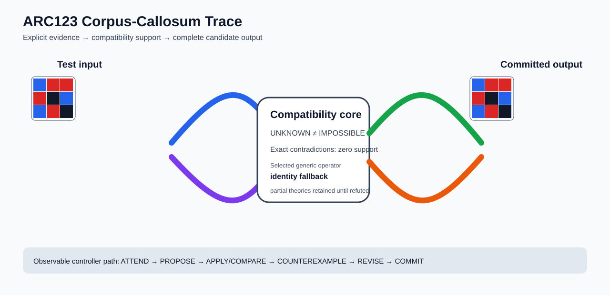

# ARC1 `cce03e0d` P0029-ARC12-COMPATIBILITY-PORTFOLIO-TRAINING-TRANSFER-50 Brain Surgery Report

## Outcome: NO — TEST CELLS DO NOT ALL MATCH

- **Compared positions:** 81
- **Mismatched cells:** 81
- **Training compatibility:** `False`
- **Fallback used:** `True`
- **Selected hypothesis:** `fallback_identity_complete_grid`
- **Source commit:** `085f6dbe39050afac3d1d743f840bac95b1a8d1c`
- **Frozen controller commit:** `a12e6344822d9e423bcc9267f3dbc3b34e4c3502`

## Live-Agent Boundary

The controller receives only visible training input/output examples and test inputs. It receives no task ID, imported cohort metadata, GT feature contract, GT solver, historical decomposition, or held-out output before committing a complete grid. The expected output appears only in post-answer V&V.

## Corpus-Callosum Visualization



- Full explicit event record: [`learning_trace.json`](learning_trace.json)

## Frozen Measurement

The controller bytes, generic operator vocabulary, source task checksums, and cohort membership were frozen before this task was parsed or scored. This result cannot tune the frozen controller.

## Post-Answer V&V

### Test case 1
- **All cells match:** `False`
- **Mismatched cells:** `81`
- **Prediction:**
```json
[[1, 2, 2], [2, 0, 1], [1, 2, 0]]
```
- **Expected output (post-answer only):**
```json
[[0, 0, 0, 1, 2, 2, 1, 2, 2], [0, 0, 0, 2, 0, 1, 2, 0, 1], [0, 0, 0, 1, 2, 0, 1, 2, 0], [1, 2, 2, 0, 0, 0, 0, 0, 0], [2, 0, 1, 0, 0, 0, 0, 0, 0], [1, 2, 0, 0, 0, 0, 0, 0, 0], [0, 0, 0, 1, 2, 2, 0, 0, 0], [0, 0, 0, 2, 0, 1, 0, 0, 0], [0, 0, 0, 1, 2, 0, 0, 0, 0]]
```

## Observable IHL Walkthrough

The record contains explicit actions, predictions, feedback, and revisions; it does not claim or store hidden model reasoning.

### Action totals

- `APPLY_HYPOTHESIS`: 20
- `ATTEND`: 20
- `CHOOSE_NEXT_DEMO`: 20
- `COMMIT`: 1
- `COMPARE`: 25
- `COMPOSE_RULE`: 3
- `EXPLAIN_RESIDUAL`: 3
- `FIND_COUNTEREXAMPLE`: 6
- `PROPOSE`: 5
- `REJECT_RULE`: 6
- `SPECIALIZE`: 2

### Decision milestones

- `0` `PROPOSE` — `{"parent_theory_id":"T0000","rule":{"description_length":1,"name":"identity","operation":"identity","parameters":{},"rule_id":"identity","scope":{"kind":"all","value":null}},"stage":"initial_generic_theories","theory_id":"T0001"}`
- `1` `PROPOSE` — `{"parent_theory_id":"T0000","rule":{"description_length":3,"name":"tile_repeat(column_factor=3,row_factor=3)","operation":"full_operator","parameters":{"column_factor":3,"operator":"tile_repeat","row_factor":3},"rule_id":"rule-tile_repeat","scope":{"kind":"all","value":null}},"stage":"initial_generic_theories","theory_id":"T0002"}`
- `2` `PROPOSE` — `{"parent_theory_id":"T0000","rule":{"description_length":2,"name":"left_right(scope=all)","operation":"coordinate_transform","parameters":{"axis":"left_right"},"rule_id":"coordinate-left_right","scope":{"kind":"all","value":null}},"stage":"initial_generic_theories","theory_id":"T0003"}`
- `3` `PROPOSE` — `{"parent_theory_id":"T0000","rule":{"description_length":2,"name":"top_bottom(scope=all)","operation":"coordinate_transform","parameters":{"axis":"top_bottom"},"rule_id":"coordinate-top_bottom","scope":{"kind":"all","value":null}},"stage":"initial_generic_theories","theory_id":"T0004"}`
- `4` `PROPOSE` — `{"parent_theory_id":"T0000","rule":{"description_length":2,"name":"rotate_180(scope=all)","operation":"coordinate_transform","parameters":{"axis":"rotate_180"},"rule_id":"coordinate-rotate_180","scope":{"kind":"all","value":null}},"stage":"initial_generic_theories","theory_id":"T0005"}`
- `11` `ATTEND` — `{"reason":"initial_highest_observed_change_and_color_discrimination","selected_demo":0,"selected_region":{"region":"whole_demo"},"theory_id":"T0001"}`
- `15` `ATTEND` — `{"reason":"initial_highest_observed_change_and_color_discrimination","selected_demo":0,"selected_region":{"region":"whole_demo"},"theory_id":"T0003"}`
- `19` `ATTEND` — `{"reason":"initial_highest_observed_change_and_color_discrimination","selected_demo":0,"selected_region":{"region":"whole_demo"},"theory_id":"T0004"}`
- `23` `ATTEND` — `{"reason":"initial_highest_observed_change_and_color_discrimination","selected_demo":0,"selected_region":{"region":"whole_demo"},"theory_id":"T0005"}`
- `27` `ATTEND` — `{"reason":"initial_highest_observed_change_and_color_discrimination","selected_demo":0,"selected_region":{"column":0,"row":0},"theory_id":"T0002"}`
- `31` `ATTEND` — `{"reason":"unseen_demo_selected_for_residual_version_space_discrimination","selected_demo":1,"selected_region":{"region":"whole_demo"},"theory_id":"T0001"}`
- `35` `ATTEND` — `{"reason":"unseen_demo_selected_for_residual_version_space_discrimination","selected_demo":1,"selected_region":{"region":"whole_demo"},"theory_id":"T0003"}`
- `39` `ATTEND` — `{"reason":"unseen_demo_selected_for_residual_version_space_discrimination","selected_demo":1,"selected_region":{"region":"whole_demo"},"theory_id":"T0004"}`
- `43` `ATTEND` — `{"reason":"unseen_demo_selected_for_residual_version_space_discrimination","selected_demo":1,"selected_region":{"region":"whole_demo"},"theory_id":"T0005"}`
- `47` `ATTEND` — `{"reason":"unseen_demo_selected_for_residual_version_space_discrimination","selected_demo":2,"selected_region":{"region":"whole_demo"},"theory_id":"T0001"}`
- `51` `ATTEND` — `{"reason":"unseen_demo_selected_for_residual_version_space_discrimination","selected_demo":2,"selected_region":{"region":"whole_demo"},"theory_id":"T0003"}`
- `55` `ATTEND` — `{"reason":"unseen_demo_selected_for_residual_version_space_discrimination","selected_demo":2,"selected_region":{"region":"whole_demo"},"theory_id":"T0004"}`
- `59` `ATTEND` — `{"reason":"unseen_demo_selected_for_residual_version_space_discrimination","selected_demo":2,"selected_region":{"region":"whole_demo"},"theory_id":"T0005"}`
- `69` `SPECIALIZE` — `{"added_rule":{"description_length":13,"name":"dihedral_tile(column_factor=3,row_factor=3,template=blank;blank;blank;identity;blank;blank;blank;blank;blank)","operation":"full_operator","parameters":{"column_factor":3,"operator":"dihedral_tile","row_factor":3,"template":"blank;blank;blank;identity;blank;blank;blank;blank;blank"},"rule_id":"structural-dihedral_tile","scope":{"kind":"all","value":null}},"parent_theory_id":"T0002","reason":"unexplained_residual_proposed_generic_structural_rule","theory_id":"T0007"}`
- `73` `ATTEND` — `{"reason":"initial_highest_observed_change_and_color_discrimination","selected_demo":0,"selected_region":{"column":3,"row":0},"theory_id":"T0006"}`
- `77` `ATTEND` — `{"reason":"initial_highest_observed_change_and_color_discrimination","selected_demo":0,"selected_region":{"region":"whole_demo"},"theory_id":"T0007"}`
- `81` `ATTEND` — `{"reason":"unseen_demo_selected_for_residual_version_space_discrimination","selected_demo":1,"selected_region":{"column":7,"row":0},"theory_id":"T0007"}`
- `86` `ATTEND` — `{"reason":"unseen_demo_selected_for_residual_version_space_discrimination","selected_demo":2,"selected_region":{"column":1,"row":0},"theory_id":"T0007"}`
- `90` `SPECIALIZE` — `{"added_rule":{"description_length":13,"name":"dihedral_tile(column_factor=3,row_factor=3,template=blank;blank;blank;identity;blank;blank;blank;blank;blank)","operation":"full_operator","parameters":{"column_factor":3,"operator":"dihedral_tile","row_factor":3,"template":"blank;blank;blank;identity;blank;blank;blank;blank;blank"},"rule_id":"structural-dihedral_tile","scope":{"kind":"all","value":null}},"parent_theory_id":"T0006","reason":"unexplained_residual_proposed_generic_structural_rule","theory_id":"T0008"}`
- `94` `ATTEND` — `{"reason":"initial_highest_observed_change_and_color_discrimination","selected_demo":0,"selected_region":{"region":"whole_demo"},"theory_id":"T0008"}`
- `98` `ATTEND` — `{"reason":"unseen_demo_selected_for_residual_version_space_discrimination","selected_demo":1,"selected_region":{"column":7,"row":0},"theory_id":"T0008"}`
- `103` `ATTEND` — `{"reason":"unseen_demo_selected_for_residual_version_space_discrimination","selected_demo":2,"selected_region":{"column":1,"row":0},"theory_id":"T0008"}`
- `110` `COMMIT` — `{"best_partial_theory":{"contradiction_count":0,"counterexamples":[],"description_length":17,"evaluated_demo_indices":[0],"history":[{"kind":"ADD_RULE","parameters":{"initial_proposal":true,"operation":"full_operator"},"target":"rule-tile_repeat"},{"kind":"ATTEND","parameters":{"information_score":[81,0,3],"reason":"initial_highest_observed_change_and_color_discrimination"},"target":"demo:0"},{"kind":"ADD_RULE","parameters":{"observed_residual_ranking":{"contradiction_count":0,"matching_cell_count":81,"unknown_cell_count":0},"operator":"dihedral_tile","proposal_family":"structural_residual"},"target":"structural-dihedral_tile"},{"kind":"ATTEND","parameters":{"information_score":[81,0,3],"reason":"initial_highest_observed_change_and_color_discrimination"},"target":"demo:0"}],"matching_cell_count":81,"name":"compose(identity,tile_repeat(column_factor=3,row_factor=3),dihedral_tile(column_factor=3,row_factor=3,template=blank;blank;blank;identity;blank;blank;blank;blank;blank))","parameter_bindings":{},"parent_theory_id":"T0002","rules":[{"description_length":1,"name":"identity","operation":"identity","parameters":{},"rule_id":"identity","scope":{"kind":"all","value":null}},{"description_length":3,"name":"tile_repeat(column_factor=3,row_factor=3)","operation":"full_operator","parameters":{"column_factor":3,"operator":"tile_repeat","row_factor":3},"rule_id":"rule-tile_repeat","scope":{"kind":"all","value":null}},{"description_length":13,"name":"dihedral_tile(column_factor=3,row_factor=3,template=blank;blank;blank;identity;blank;blank;blank;blank;blank)","operation":"full_operator","parameters":{"column_factor":3,"operator":"dihedral_tile","row_factor":3,"template":"blank;blank;blank;identity;blank;blank;blank;blank;blank"},"rule_id":"structural-dihedral_tile","scope":{"kind":"all","value":null}}],"scope_predicates":[{"kind":"all","value":null},{"kind":"all","value":null},{"kind":"all","value":null}],"theory_id":"T0007","unknown_cell_count":0,"unresolved_unknown":[]},"complete_prediction_group_count":0,"fallback_reason":"no_complete_training_compatible_partial_theory","posterior_mass":0.0,"selected_hypothesis":"fallback_identity_complete_grid","training_exact":false}`

### First counterexamples

- `66` — `{"causal_next_operation":"scope_or_rule_revision","counterexample":{"column":0,"demo_index":0,"observed":0,"predicted":1,"row":0},"responsible_rule":{"description_length":3,"name":"tile_repeat(column_factor=3,row_factor=3)","operation":"full_operator","parameters":{"column_factor":3,"operator":"tile_repeat","row_factor":3},"rule_id":"rule-tile_repeat","scope":{"kind":"all","value":null}},"responsible_rule_id":"rule-tile_repeat","theory_id":"T0002"}`
- `84` — `{"causal_next_operation":"scope_or_rule_revision","counterexample":{"column":7,"demo_index":1,"observed":1,"predicted":0,"row":0},"responsible_rule":{"description_length":13,"name":"dihedral_tile(column_factor=3,row_factor=3,template=blank;blank;blank;identity;blank;blank;blank;blank;blank)","operation":"full_operator","parameters":{"column_factor":3,"operator":"dihedral_tile","row_factor":3,"template":"blank;blank;blank;identity;blank;blank;blank;blank;blank"},"rule_id":"structural-dihedral_tile","scope":{"kind":"all","value":null}},"responsible_rule_id":"structural-dihedral_tile","theory_id":"T0007"}`
- `89` — `{"causal_next_operation":"scope_or_rule_revision","counterexample":{"column":3,"demo_index":0,"observed":0,"predicted":1,"row":0},"responsible_rule":{"description_length":3,"name":"tile_repeat(column_factor=3,row_factor=3)","operation":"full_operator","parameters":{"column_factor":3,"operator":"tile_repeat","row_factor":3},"rule_id":"rule-tile_repeat","scope":{"kind":"all","value":null}},"responsible_rule_id":"rule-tile_repeat","theory_id":"T0006"}`
- `101` — `{"causal_next_operation":"scope_or_rule_revision","counterexample":{"column":7,"demo_index":1,"observed":1,"predicted":0,"row":0},"responsible_rule":{"description_length":13,"name":"dihedral_tile(column_factor=3,row_factor=3,template=blank;blank;blank;identity;blank;blank;blank;blank;blank)","operation":"full_operator","parameters":{"column_factor":3,"operator":"dihedral_tile","row_factor":3,"template":"blank;blank;blank;identity;blank;blank;blank;blank;blank"},"rule_id":"structural-dihedral_tile","scope":{"kind":"all","value":null}},"responsible_rule_id":"structural-dihedral_tile","theory_id":"T0008"}`
- `106` — `{"causal_next_operation":"scope_or_rule_revision","counterexample":{"column":7,"demo_index":1,"observed":1,"predicted":0,"row":0},"responsible_rule":{"description_length":13,"name":"dihedral_tile(column_factor=3,row_factor=3,template=blank;blank;blank;identity;blank;blank;blank;blank;blank)","operation":"full_operator","parameters":{"column_factor":3,"operator":"dihedral_tile","row_factor":3,"template":"blank;blank;blank;identity;blank;blank;blank;blank;blank"},"rule_id":"structural-dihedral_tile","scope":{"kind":"all","value":null}},"responsible_rule_id":"structural-dihedral_tile","theory_id":"T0007"}`
- `1` additional explicit counterexamples are retained in `learning_trace.json`.
