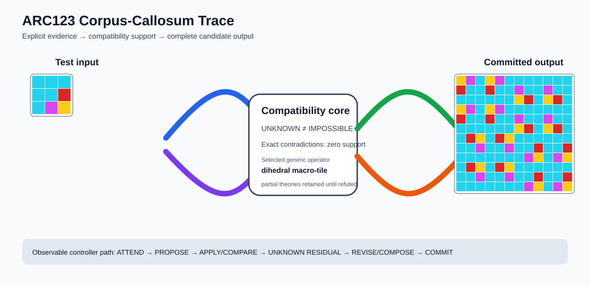

# ARC2 `cf5fd0ad` P0042-ARC12-MIXED-PARTITION-DEVELOPMENT-BASELINE-40 Brain Surgery Report

## Outcome: YES — ALL TEST CELLS MATCH

- **Compared positions:** 144
- **Mismatched cells:** 0
- **Training compatibility:** `True`
- **Fallback used:** `False`
- **Selected hypothesis:** `compose(identity,dihedral_tile(column_factor=4,row_factor=4,template=rotate_180;rotate_180;rotate_90;rotate_90;rotate_180;rotate_180;rotate_90;rotate_90;rotate_270;rotate_270;identity;identity;rotate_270;rotate_270;identity;identity))`
- **Source commit:** `71f86ff4c5304e452e0659131171f0519b50e21c`
- **Frozen controller commit:** `9f59a647518dbf3fa8e08acd8a58463c6b258bec`

## Live-Agent Boundary

The controller receives only visible training input/output examples and test inputs. It receives no task ID, imported cohort metadata, GT feature contract, GT solver, historical decomposition, or held-out output before committing a complete grid. The expected output appears only in post-answer V&V.

## Corpus-Callosum Visualization



- Full explicit event record: [`learning_trace.json`](learning_trace.json)

## Frozen Measurement

The controller bytes, generic operator vocabulary, source task checksums, and cohort membership were frozen before this task was parsed or scored. This result cannot tune the frozen controller.

## Post-Answer V&V

### Test case 1
- **All cells match:** `True`
- **Mismatched cells:** `0`
- **Prediction:**
```json
[[4, 6, 8, 4, 6, 8, 8, 8, 8, 8, 8, 8], [2, 8, 8, 2, 8, 8, 6, 8, 8, 6, 8, 8], [8, 8, 8, 8, 8, 8, 4, 2, 8, 4, 2, 8], [4, 6, 8, 4, 6, 8, 8, 8, 8, 8, 8, 8], [2, 8, 8, 2, 8, 8, 6, 8, 8, 6, 8, 8], [8, 8, 8, 8, 8, 8, 4, 2, 8, 4, 2, 8], [8, 2, 4, 8, 2, 4, 8, 8, 8, 8, 8, 8], [8, 8, 6, 8, 8, 6, 8, 8, 2, 8, 8, 2], [8, 8, 8, 8, 8, 8, 8, 6, 4, 8, 6, 4], [8, 2, 4, 8, 2, 4, 8, 8, 8, 8, 8, 8], [8, 8, 6, 8, 8, 6, 8, 8, 2, 8, 8, 2], [8, 8, 8, 8, 8, 8, 8, 6, 4, 8, 6, 4]]
```
- **Expected output (post-answer only):**
```json
[[4, 6, 8, 4, 6, 8, 8, 8, 8, 8, 8, 8], [2, 8, 8, 2, 8, 8, 6, 8, 8, 6, 8, 8], [8, 8, 8, 8, 8, 8, 4, 2, 8, 4, 2, 8], [4, 6, 8, 4, 6, 8, 8, 8, 8, 8, 8, 8], [2, 8, 8, 2, 8, 8, 6, 8, 8, 6, 8, 8], [8, 8, 8, 8, 8, 8, 4, 2, 8, 4, 2, 8], [8, 2, 4, 8, 2, 4, 8, 8, 8, 8, 8, 8], [8, 8, 6, 8, 8, 6, 8, 8, 2, 8, 8, 2], [8, 8, 8, 8, 8, 8, 8, 6, 4, 8, 6, 4], [8, 2, 4, 8, 2, 4, 8, 8, 8, 8, 8, 8], [8, 8, 6, 8, 8, 6, 8, 8, 2, 8, 8, 2], [8, 8, 8, 8, 8, 8, 8, 6, 4, 8, 6, 4]]
```

## Observable IHL Walkthrough

The record contains explicit actions, predictions, feedback, and revisions; it does not claim or store hidden model reasoning.

### Action totals

- `APPLY_HYPOTHESIS`: 36
- `ATTEND`: 36
- `CHOOSE_NEXT_DEMO`: 36
- `COMMIT`: 1
- `COMPARE`: 41
- `COMPOSE_RULE`: 9
- `EXPLAIN_RESIDUAL`: 9
- `FIND_COUNTEREXAMPLE`: 3
- `MERGE_RULES`: 1
- `PROMOTE_CONSTRAINT`: 7
- `PROPOSE`: 5
- `SPECIALIZE`: 7

### Decision milestones

- `0` `PROPOSE` — `{"parent_theory_id":"T0000","rule":{"description_length":1,"name":"identity","operation":"identity","parameters":{},"rule_id":"identity","scope":{"kind":"all","value":null}},"stage":"initial_generic_theories","theory_id":"T0001"}`
- `1` `PROPOSE` — `{"parent_theory_id":"T0000","rule":{"description_length":3,"name":"tile_repeat(column_factor=4,row_factor=4)","operation":"full_operator","parameters":{"column_factor":4,"operator":"tile_repeat","row_factor":4},"rule_id":"rule-tile_repeat","scope":{"kind":"all","value":null}},"stage":"initial_generic_theories","theory_id":"T0002"}`
- `2` `PROPOSE` — `{"parent_theory_id":"T0000","rule":{"description_length":2,"name":"left_right(scope=all)","operation":"coordinate_transform","parameters":{"axis":"left_right"},"rule_id":"coordinate-left_right","scope":{"kind":"all","value":null}},"stage":"initial_generic_theories","theory_id":"T0003"}`
- `3` `PROPOSE` — `{"parent_theory_id":"T0000","rule":{"description_length":2,"name":"top_bottom(scope=all)","operation":"coordinate_transform","parameters":{"axis":"top_bottom"},"rule_id":"coordinate-top_bottom","scope":{"kind":"all","value":null}},"stage":"initial_generic_theories","theory_id":"T0004"}`
- `4` `PROPOSE` — `{"parent_theory_id":"T0000","rule":{"description_length":2,"name":"rotate_180(scope=all)","operation":"coordinate_transform","parameters":{"axis":"rotate_180"},"rule_id":"coordinate-rotate_180","scope":{"kind":"all","value":null}},"stage":"initial_generic_theories","theory_id":"T0005"}`
- `11` `ATTEND` — `{"reason":"initial_highest_observed_change_and_color_discrimination","selected_demo":0,"selected_region":{"region":"whole_demo"},"theory_id":"T0001"}`
- `15` `ATTEND` — `{"reason":"initial_highest_observed_change_and_color_discrimination","selected_demo":0,"selected_region":{"region":"whole_demo"},"theory_id":"T0003"}`
- `19` `ATTEND` — `{"reason":"initial_highest_observed_change_and_color_discrimination","selected_demo":0,"selected_region":{"region":"whole_demo"},"theory_id":"T0004"}`
- `23` `ATTEND` — `{"reason":"initial_highest_observed_change_and_color_discrimination","selected_demo":0,"selected_region":{"region":"whole_demo"},"theory_id":"T0005"}`
- `27` `ATTEND` — `{"reason":"initial_highest_observed_change_and_color_discrimination","selected_demo":0,"selected_region":{"column":0,"row":0},"theory_id":"T0002"}`
- `31` `ATTEND` — `{"reason":"unseen_demo_selected_for_residual_version_space_discrimination","selected_demo":1,"selected_region":{"region":"whole_demo"},"theory_id":"T0001"}`
- `35` `ATTEND` — `{"reason":"unseen_demo_selected_for_residual_version_space_discrimination","selected_demo":1,"selected_region":{"region":"whole_demo"},"theory_id":"T0003"}`
- `39` `ATTEND` — `{"reason":"unseen_demo_selected_for_residual_version_space_discrimination","selected_demo":1,"selected_region":{"region":"whole_demo"},"theory_id":"T0004"}`
- `43` `ATTEND` — `{"reason":"unseen_demo_selected_for_residual_version_space_discrimination","selected_demo":1,"selected_region":{"region":"whole_demo"},"theory_id":"T0005"}`
- `47` `ATTEND` — `{"reason":"unseen_demo_selected_for_residual_version_space_discrimination","selected_demo":2,"selected_region":{"region":"whole_demo"},"theory_id":"T0001"}`
- `51` `ATTEND` — `{"reason":"unseen_demo_selected_for_residual_version_space_discrimination","selected_demo":2,"selected_region":{"region":"whole_demo"},"theory_id":"T0003"}`
- `55` `ATTEND` — `{"reason":"unseen_demo_selected_for_residual_version_space_discrimination","selected_demo":2,"selected_region":{"region":"whole_demo"},"theory_id":"T0004"}`
- `59` `ATTEND` — `{"reason":"unseen_demo_selected_for_residual_version_space_discrimination","selected_demo":2,"selected_region":{"region":"whole_demo"},"theory_id":"T0005"}`
- `62` `SPECIALIZE` — `{"added_rule":{"description_length":17,"name":"dihedral_tile(column_factor=4,row_factor=4,template=rotate_180;rotate_180;rotate_90;rotate_90;rotate_180;rotate_180;rotate_90;rotate_90;rotate_270;rotate_270;identity;identity;rotate_270;rotate_270;identity;identity)","operation":"full_operator","parameters":{"column_factor":4,"operator":"dihedral_tile","row_factor":4,"template":"rotate_180;rotate_180;rotate_90;rotate_90;rotate_180;rotate_180;rotate_90;rotate_90;rotate_270;rotate_270;identity;identity;rotate_270;rotate_270;identity;identity"},"rule_id":"structural-dihedral_tile","scope":{"kind":"all","value":null}},"parent_theory_id":"T0001","reason":"unexplained_residual_proposed_generic_structural_rule","theory_id":"T0006"}`
- `66` `ATTEND` — `{"reason":"initial_highest_observed_change_and_color_discrimination","selected_demo":0,"selected_region":{"region":"whole_demo"},"theory_id":"T0006"}`
- `70` `ATTEND` — `{"reason":"unseen_demo_selected_for_residual_version_space_discrimination","selected_demo":1,"selected_region":{"region":"whole_demo"},"theory_id":"T0006"}`
- `74` `ATTEND` — `{"reason":"unseen_demo_selected_for_residual_version_space_discrimination","selected_demo":2,"selected_region":{"region":"whole_demo"},"theory_id":"T0006"}`
- `77` `PROMOTE_CONSTRAINT` — `{"evaluated_demo_count":3,"rule_count":2,"status":"complete_training_compatibility_after_revision","theory_id":"T0006"}`
- `78` `SPECIALIZE` — `{"added_rule":{"description_length":17,"name":"dihedral_tile(column_factor=4,row_factor=4,template=rotate_180;rotate_180;rotate_90;rotate_90;rotate_180;rotate_180;rotate_90;rotate_90;rotate_270;rotate_270;identity;identity;rotate_270;rotate_270;identity;identity)","operation":"full_operator","parameters":{"column_factor":4,"operator":"dihedral_tile","row_factor":4,"template":"rotate_180;rotate_180;rotate_90;rotate_90;rotate_180;rotate_180;rotate_90;rotate_90;rotate_270;rotate_270;identity;identity;rotate_270;rotate_270;identity;identity"},"rule_id":"structural-dihedral_tile","scope":{"kind":"all","value":null}},"parent_theory_id":"T0003","reason":"unexplained_residual_proposed_generic_structural_rule","theory_id":"T0007"}`
- `82` `ATTEND` — `{"reason":"initial_highest_observed_change_and_color_discrimination","selected_demo":0,"selected_region":{"region":"whole_demo"},"theory_id":"T0007"}`
- `86` `ATTEND` — `{"reason":"unseen_demo_selected_for_residual_version_space_discrimination","selected_demo":1,"selected_region":{"region":"whole_demo"},"theory_id":"T0007"}`
- `90` `ATTEND` — `{"reason":"unseen_demo_selected_for_residual_version_space_discrimination","selected_demo":2,"selected_region":{"region":"whole_demo"},"theory_id":"T0007"}`
- `93` `PROMOTE_CONSTRAINT` — `{"evaluated_demo_count":3,"rule_count":3,"status":"complete_training_compatibility_after_revision","theory_id":"T0007"}`
- `94` `SPECIALIZE` — `{"added_rule":{"description_length":17,"name":"dihedral_tile(column_factor=4,row_factor=4,template=rotate_180;rotate_180;rotate_90;rotate_90;rotate_180;rotate_180;rotate_90;rotate_90;rotate_270;rotate_270;identity;identity;rotate_270;rotate_270;identity;identity)","operation":"full_operator","parameters":{"column_factor":4,"operator":"dihedral_tile","row_factor":4,"template":"rotate_180;rotate_180;rotate_90;rotate_90;rotate_180;rotate_180;rotate_90;rotate_90;rotate_270;rotate_270;identity;identity;rotate_270;rotate_270;identity;identity"},"rule_id":"structural-dihedral_tile","scope":{"kind":"all","value":null}},"parent_theory_id":"T0004","reason":"unexplained_residual_proposed_generic_structural_rule","theory_id":"T0008"}`
- `98` `ATTEND` — `{"reason":"initial_highest_observed_change_and_color_discrimination","selected_demo":0,"selected_region":{"region":"whole_demo"},"theory_id":"T0008"}`
- `102` `ATTEND` — `{"reason":"unseen_demo_selected_for_residual_version_space_discrimination","selected_demo":1,"selected_region":{"region":"whole_demo"},"theory_id":"T0008"}`
- `106` `ATTEND` — `{"reason":"unseen_demo_selected_for_residual_version_space_discrimination","selected_demo":2,"selected_region":{"region":"whole_demo"},"theory_id":"T0008"}`
- `109` `PROMOTE_CONSTRAINT` — `{"evaluated_demo_count":3,"rule_count":3,"status":"complete_training_compatibility_after_revision","theory_id":"T0008"}`
- `110` `SPECIALIZE` — `{"added_rule":{"description_length":17,"name":"dihedral_tile(column_factor=4,row_factor=4,template=rotate_180;rotate_180;rotate_90;rotate_90;rotate_180;rotate_180;rotate_90;rotate_90;rotate_270;rotate_270;identity;identity;rotate_270;rotate_270;identity;identity)","operation":"full_operator","parameters":{"column_factor":4,"operator":"dihedral_tile","row_factor":4,"template":"rotate_180;rotate_180;rotate_90;rotate_90;rotate_180;rotate_180;rotate_90;rotate_90;rotate_270;rotate_270;identity;identity;rotate_270;rotate_270;identity;identity"},"rule_id":"structural-dihedral_tile","scope":{"kind":"all","value":null}},"parent_theory_id":"T0005","reason":"unexplained_residual_proposed_generic_structural_rule","theory_id":"T0009"}`
- `114` `ATTEND` — `{"reason":"initial_highest_observed_change_and_color_discrimination","selected_demo":0,"selected_region":{"region":"whole_demo"},"theory_id":"T0009"}`
- `118` `ATTEND` — `{"reason":"unseen_demo_selected_for_residual_version_space_discrimination","selected_demo":1,"selected_region":{"region":"whole_demo"},"theory_id":"T0009"}`
- `122` `ATTEND` — `{"reason":"unseen_demo_selected_for_residual_version_space_discrimination","selected_demo":2,"selected_region":{"region":"whole_demo"},"theory_id":"T0009"}`
- `125` `PROMOTE_CONSTRAINT` — `{"evaluated_demo_count":3,"rule_count":3,"status":"complete_training_compatibility_after_revision","theory_id":"T0009"}`
- `129` `SPECIALIZE` — `{"added_rule":{"description_length":17,"name":"dihedral_tile(column_factor=4,row_factor=4,template=rotate_180;rotate_180;rotate_90;rotate_90;rotate_180;rotate_180;rotate_90;rotate_90;rotate_270;rotate_270;identity;identity;rotate_270;rotate_270;identity;identity)","operation":"full_operator","parameters":{"column_factor":4,"operator":"dihedral_tile","row_factor":4,"template":"rotate_180;rotate_180;rotate_90;rotate_90;rotate_180;rotate_180;rotate_90;rotate_90;rotate_270;rotate_270;identity;identity;rotate_270;rotate_270;identity;identity"},"rule_id":"structural-dihedral_tile","scope":{"kind":"all","value":null}},"parent_theory_id":"T0002","reason":"unexplained_residual_proposed_generic_structural_rule","theory_id":"T0011"}`
- `133` `ATTEND` — `{"reason":"initial_highest_observed_change_and_color_discrimination","selected_demo":0,"selected_region":{"column":1,"row":0},"theory_id":"T0010"}`
- `137` `ATTEND` — `{"reason":"initial_highest_observed_change_and_color_discrimination","selected_demo":0,"selected_region":{"region":"whole_demo"},"theory_id":"T0011"}`
- `141` `ATTEND` — `{"reason":"unseen_demo_selected_for_residual_version_space_discrimination","selected_demo":1,"selected_region":{"region":"whole_demo"},"theory_id":"T0011"}`
- `145` `ATTEND` — `{"reason":"unseen_demo_selected_for_residual_version_space_discrimination","selected_demo":2,"selected_region":{"region":"whole_demo"},"theory_id":"T0011"}`
- `148` `PROMOTE_CONSTRAINT` — `{"evaluated_demo_count":3,"rule_count":3,"status":"complete_training_compatibility_after_revision","theory_id":"T0011"}`
- `152` `SPECIALIZE` — `{"added_rule":{"description_length":17,"name":"dihedral_tile(column_factor=4,row_factor=4,template=rotate_180;rotate_180;rotate_90;rotate_90;rotate_180;rotate_180;rotate_90;rotate_90;rotate_270;rotate_270;identity;identity;rotate_270;rotate_270;identity;identity)","operation":"full_operator","parameters":{"column_factor":4,"operator":"dihedral_tile","row_factor":4,"template":"rotate_180;rotate_180;rotate_90;rotate_90;rotate_180;rotate_180;rotate_90;rotate_90;rotate_270;rotate_270;identity;identity;rotate_270;rotate_270;identity;identity"},"rule_id":"structural-dihedral_tile","scope":{"kind":"all","value":null}},"parent_theory_id":"T0010","reason":"unexplained_residual_proposed_generic_structural_rule","theory_id":"T0013"}`
- `156` `ATTEND` — `{"reason":"initial_highest_observed_change_and_color_discrimination","selected_demo":0,"selected_region":{"column":2,"row":0},"theory_id":"T0012"}`
- `160` `ATTEND` — `{"reason":"initial_highest_observed_change_and_color_discrimination","selected_demo":0,"selected_region":{"region":"whole_demo"},"theory_id":"T0013"}`
- `164` `ATTEND` — `{"reason":"unseen_demo_selected_for_residual_version_space_discrimination","selected_demo":1,"selected_region":{"region":"whole_demo"},"theory_id":"T0013"}`
- `168` `ATTEND` — `{"reason":"unseen_demo_selected_for_residual_version_space_discrimination","selected_demo":2,"selected_region":{"region":"whole_demo"},"theory_id":"T0013"}`
- `171` `PROMOTE_CONSTRAINT` — `{"evaluated_demo_count":3,"rule_count":4,"status":"complete_training_compatibility_after_revision","theory_id":"T0013"}`
- `173` `SPECIALIZE` — `{"added_rule":{"description_length":17,"name":"dihedral_tile(column_factor=4,row_factor=4,template=rotate_180;rotate_180;rotate_90;rotate_90;rotate_180;rotate_180;rotate_90;rotate_90;rotate_270;rotate_270;identity;identity;rotate_270;rotate_270;identity;identity)","operation":"full_operator","parameters":{"column_factor":4,"operator":"dihedral_tile","row_factor":4,"template":"rotate_180;rotate_180;rotate_90;rotate_90;rotate_180;rotate_180;rotate_90;rotate_90;rotate_270;rotate_270;identity;identity;rotate_270;rotate_270;identity;identity"},"rule_id":"structural-dihedral_tile","scope":{"kind":"all","value":null}},"parent_theory_id":"T0012","reason":"unexplained_residual_proposed_generic_structural_rule","theory_id":"T0014"}`
- `177` `ATTEND` — `{"reason":"initial_highest_observed_change_and_color_discrimination","selected_demo":0,"selected_region":{"region":"whole_demo"},"theory_id":"T0014"}`
- `181` `ATTEND` — `{"reason":"unseen_demo_selected_for_residual_version_space_discrimination","selected_demo":1,"selected_region":{"region":"whole_demo"},"theory_id":"T0014"}`
- `185` `ATTEND` — `{"reason":"unseen_demo_selected_for_residual_version_space_discrimination","selected_demo":2,"selected_region":{"region":"whole_demo"},"theory_id":"T0014"}`
- `188` `PROMOTE_CONSTRAINT` — `{"evaluated_demo_count":3,"rule_count":5,"status":"complete_training_compatibility_after_revision","theory_id":"T0014"}`
- `189` `MERGE_RULES` — `{"compatible_theory_ids":["T0006","T0007","T0008","T0009","T0011","T0013","T0014"],"complete_prediction_group_size":7}`
- `190` `COMMIT` — `{"complete_prediction_group_count":1,"final_theory":{"contradiction_count":0,"counterexamples":[],"description_length":18,"evaluated_demo_indices":[0,1,2],"history":[{"kind":"ADD_RULE","parameters":{"initial_proposal":true,"operation":"identity"},"target":"identity"},{"kind":"ATTEND","parameters":{"information_score":[144,0,4],"reason":"initial_highest_observed_change_and_color_discrimination"},"target":"demo:0"},{"kind":"ATTEND","parameters":{"information_score":[144,0,2],"reason":"unseen_demo_selected_for_residual_version_space_discrimination"},"target":"demo:1"},{"kind":"ATTEND","parameters":{"information_score":[144,0,2],"reason":"unseen_demo_selected_for_residual_version_space_discrimination"},"target":"demo:2"},{"kind":"ADD_RULE","parameters":{"observed_residual_ranking":{"contradiction_count":0,"matching_cell_count":432,"unknown_cell_count":0},"operator":"dihedral_tile","proposal_family":"structural_residual"},"target":"structural-dihedral_tile"},{"kind":"ATTEND","parameters":{"information_score":[144,0,4],"reason":"initial_highest_observed_change_and_color_discrimination"},"target":"demo:0"},{"kind":"ATTEND","parameters":{"information_score":[144,0,2],"reason":"unseen_demo_selected_for_residual_version_space_discrimination"},"target":"demo:1"},{"kind":"ATTEND","parameters":{"information_score":[144,0,2],"reason":"unseen_demo_selected_for_residual_version_space_discrimination"},"target":"demo:2"}],"matching_cell_count":432,"name":"compose(identity,dihedral_tile(column_factor=4,row_factor=4,template=rotate_180;rotate_180;rotate_90;rotate_90;rotate_180;rotate_180;rotate_90;rotate_90;rotate_270;rotate_270;identity;identity;rotate_270;rotate_270;identity;identity))","parameter_bindings":{},"parent_theory_id":"T0001","rules":[{"description_length":1,"name":"identity","operation":"identity","parameters":{},"rule_id":"identity","scope":{"kind":"all","value":null}},{"description_length":17,"name":"dihedral_tile(column_factor=4,row_factor=4,template=rotate_180;rotate_180;rotate_90;rotate_90;rotate_180;rotate_180;rotate_90;rotate_90;rotate_270;rotate_270;identity;identity;rotate_270;rotate_270;identity;identity)","operation":"full_operator","parameters":{"column_factor":4,"operator":"dihedral_tile","row_factor":4,"template":"rotate_180;rotate_180;rotate_90;rotate_90;rotate_180;rotate_180;rotate_90;rotate_90;rotate_270;rotate_270;identity;identity;rotate_270;rotate_270;identity;identity"},"rule_id":"structural-dihedral_tile","scope":{"kind":"all","value":null}}],"scope_predicates":[{"kind":"all","value":null},{"kind":"all","value":null}],"theory_id":"T0006","unknown_cell_count":0,"unresolved_unknown":[]},"posterior_mass":1.0,"selected_hypothesis":"compose(identity,dihedral_tile(column_factor=4,row_factor=4,template=rotate_180;rotate_180;rotate_90;rotate_90;rotate_180;rotate_180;rotate_90;rotate_90;rotate_270;rotate_270;identity;identity;rotate_270;rotate_270;identity;identity))","theory_id":"T0006","training_exact":true}`

### First counterexamples

- `126` — `{"causal_next_operation":"scope_or_rule_revision","counterexample":{"column":0,"demo_index":0,"observed":1,"predicted":8,"row":0},"responsible_rule":{"description_length":3,"name":"tile_repeat(column_factor=4,row_factor=4)","operation":"full_operator","parameters":{"column_factor":4,"operator":"tile_repeat","row_factor":4},"rule_id":"rule-tile_repeat","scope":{"kind":"all","value":null}},"responsible_rule_id":"rule-tile_repeat","theory_id":"T0002"}`
- `149` — `{"causal_next_operation":"scope_or_rule_revision","counterexample":{"column":1,"demo_index":0,"observed":5,"predicted":7,"row":0},"responsible_rule":{"description_length":3,"name":"tile_repeat(column_factor=4,row_factor=4)","operation":"full_operator","parameters":{"column_factor":4,"operator":"tile_repeat","row_factor":4},"rule_id":"rule-tile_repeat","scope":{"kind":"all","value":null}},"responsible_rule_id":"rule-tile_repeat","theory_id":"T0010"}`
- `172` — `{"causal_next_operation":"scope_or_rule_revision","counterexample":{"column":2,"demo_index":0,"observed":8,"predicted":1,"row":0},"responsible_rule":{"description_length":2,"name":"recolor(to=1,scope=color==8)","operation":"recolor_scoped","parameters":{"to_color":1},"rule_id":"recolor-color-8-to-1","scope":{"kind":"color_equals","value":8}},"responsible_rule_id":"recolor-color-8-to-1","theory_id":"T0012"}`
