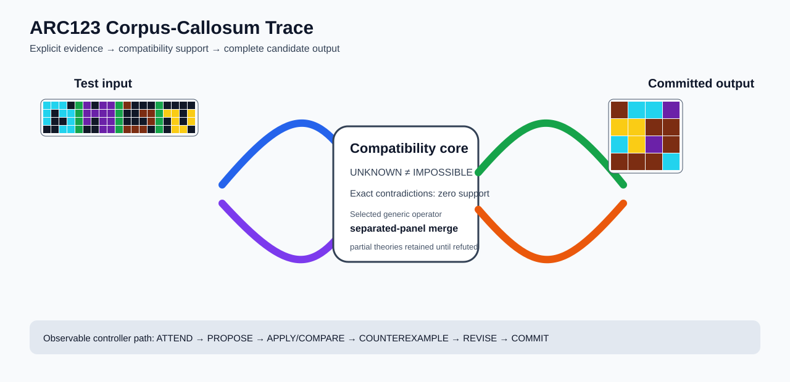

# ARC1 `281123b4` P0044-ARC12-SEPARATOR-ARROW-GUIDED-PANEL-STAMP-MIXED-PARTITION-TRANSFER-40 Brain Surgery Report

## Outcome: YES — ALL TEST CELLS MATCH

- **Compared positions:** 16
- **Mismatched cells:** 0
- **Training compatibility:** `True`
- **Fallback used:** `False`
- **Selected hypothesis:** `separated_panel_cellwise_combine(axis=vertical,panel_count=4,table=0,0,0,0:0;0,0,0,4:4;0,0,9,0:9;0,0,9,4:9;0,5,0,0:5;0,5,0,4:4;0,5,9,0:9;0,5,9,4:9;8,0,0,0:8;8,0,0,4:4;8,0,9,0:9;8,0,9,4:9;8,5,0,0:8;8,5,0,4:4;8,5,9,0:9;8,5,9,4:9)`
- **Source commit:** `085f6dbe39050afac3d1d743f840bac95b1a8d1c`
- **Frozen controller commit:** `feff068b8e1e1116427f87f59af4e54b922a1dd1`

## Live-Agent Boundary

The controller receives only visible training input/output examples and test inputs. It receives no task ID, imported cohort metadata, GT feature contract, GT solver, historical decomposition, or held-out output before committing a complete grid. The expected output appears only in post-answer V&V.

## Corpus-Callosum Visualization



- Full explicit event record: [`learning_trace.json`](learning_trace.json)

## Frozen Measurement

The controller bytes, generic operator vocabulary, source task checksums, and cohort membership were frozen before this task was parsed or scored. This result cannot tune the frozen controller.

## Post-Answer V&V

### Test case 1
- **All cells match:** `True`
- **Mismatched cells:** `0`
- **Prediction:**
```json
[[9, 8, 8, 5], [4, 4, 9, 9], [8, 4, 5, 9], [9, 9, 9, 8]]
```
- **Expected output (post-answer only):**
```json
[[9, 8, 8, 5], [4, 4, 9, 9], [8, 4, 5, 9], [9, 9, 9, 8]]
```

## Observable IHL Walkthrough

The record contains explicit actions, predictions, feedback, and revisions; it does not claim or store hidden model reasoning.

### Action totals

- `APPLY_HYPOTHESIS`: 30
- `ATTEND`: 30
- `CHOOSE_NEXT_DEMO`: 30
- `COMMIT`: 1
- `COMPARE`: 35
- `PROMOTE_CONSTRAINT`: 1
- `PROPOSE`: 5
- `REJECT_RULE`: 4

### Decision milestones

- `0` `PROPOSE` — `{"parent_theory_id":"T0000","rule":{"description_length":1,"name":"identity","operation":"identity","parameters":{},"rule_id":"identity","scope":{"kind":"all","value":null}},"stage":"initial_generic_theories","theory_id":"T0001"}`
- `1` `PROPOSE` — `{"parent_theory_id":"T0000","rule":{"description_length":24,"name":"separated_panel_cellwise_combine(axis=vertical,panel_count=4,table=0,0,0,0:0;0,0,0,4:4;0,0,9,0:9;0,0,9,4:9;0,5,0,0:5;0,5,0,4:4;0,5,9,0:9;0,5,9,4:9;8,0,0,0:8;8,0,0,4:4;8,0,9,0:9;8,0,9,4:9;8,5,0,0:8;8,5,0,4:4;8,5,9,0:9;8,5,9,4:9)","operation":"full_operator","parameters":{"axis":"vertical","operator":"separated_panel_cellwise_combine","panel_count":4,"table":"0,0,0,0:0;0,0,0,4:4;0,0,9,0:9;0,0,9,4:9;0,5,0,0:5;0,5,0,4:4;0,5,9,0:9;0,5,9,4:9;8,0,0,0:8;8,0,0,4:4;8,0,9,0:9;8,0,9,4:9;8,5,0,0:8;8,5,0,4:4;8,5,9,0:9;8,5,9,4:9"},"rule_id":"rule-separated_panel_cellwise_combine","scope":{"kind":"all","value":null}},"stage":"initial_generic_theories","theory_id":"T0002"}`
- `2` `PROPOSE` — `{"parent_theory_id":"T0000","rule":{"description_length":2,"name":"left_right(scope=all)","operation":"coordinate_transform","parameters":{"axis":"left_right"},"rule_id":"coordinate-left_right","scope":{"kind":"all","value":null}},"stage":"initial_generic_theories","theory_id":"T0003"}`
- `3` `PROPOSE` — `{"parent_theory_id":"T0000","rule":{"description_length":2,"name":"top_bottom(scope=all)","operation":"coordinate_transform","parameters":{"axis":"top_bottom"},"rule_id":"coordinate-top_bottom","scope":{"kind":"all","value":null}},"stage":"initial_generic_theories","theory_id":"T0004"}`
- `4` `PROPOSE` — `{"parent_theory_id":"T0000","rule":{"description_length":2,"name":"rotate_180(scope=all)","operation":"coordinate_transform","parameters":{"axis":"rotate_180"},"rule_id":"coordinate-rotate_180","scope":{"kind":"all","value":null}},"stage":"initial_generic_theories","theory_id":"T0005"}`
- `11` `ATTEND` — `{"reason":"initial_highest_observed_change_and_color_discrimination","selected_demo":0,"selected_region":{"region":"whole_demo"},"theory_id":"T0002"}`
- `15` `ATTEND` — `{"reason":"unseen_demo_selected_for_residual_version_space_discrimination","selected_demo":1,"selected_region":{"region":"whole_demo"},"theory_id":"T0002"}`
- `19` `ATTEND` — `{"reason":"unseen_demo_selected_for_residual_version_space_discrimination","selected_demo":3,"selected_region":{"region":"whole_demo"},"theory_id":"T0002"}`
- `23` `ATTEND` — `{"reason":"unseen_demo_selected_for_residual_version_space_discrimination","selected_demo":4,"selected_region":{"region":"whole_demo"},"theory_id":"T0002"}`
- `27` `ATTEND` — `{"reason":"unseen_demo_selected_for_residual_version_space_discrimination","selected_demo":2,"selected_region":{"region":"whole_demo"},"theory_id":"T0002"}`
- `31` `ATTEND` — `{"reason":"unseen_demo_selected_for_residual_version_space_discrimination","selected_demo":5,"selected_region":{"region":"whole_demo"},"theory_id":"T0002"}`
- `34` `PROMOTE_CONSTRAINT` — `{"evaluated_demo_count":6,"rule_count":1,"status":"complete_training_compatibility_after_revision","theory_id":"T0002"}`
- `36` `ATTEND` — `{"reason":"initial_highest_observed_change_and_color_discrimination","selected_demo":0,"selected_region":{"region":"whole_demo"},"theory_id":"T0001"}`
- `40` `ATTEND` — `{"reason":"initial_highest_observed_change_and_color_discrimination","selected_demo":0,"selected_region":{"region":"whole_demo"},"theory_id":"T0003"}`
- `44` `ATTEND` — `{"reason":"initial_highest_observed_change_and_color_discrimination","selected_demo":0,"selected_region":{"region":"whole_demo"},"theory_id":"T0004"}`
- `48` `ATTEND` — `{"reason":"initial_highest_observed_change_and_color_discrimination","selected_demo":0,"selected_region":{"region":"whole_demo"},"theory_id":"T0005"}`
- `52` `ATTEND` — `{"reason":"unseen_demo_selected_for_residual_version_space_discrimination","selected_demo":1,"selected_region":{"region":"whole_demo"},"theory_id":"T0001"}`
- `56` `ATTEND` — `{"reason":"unseen_demo_selected_for_residual_version_space_discrimination","selected_demo":1,"selected_region":{"region":"whole_demo"},"theory_id":"T0003"}`
- `60` `ATTEND` — `{"reason":"unseen_demo_selected_for_residual_version_space_discrimination","selected_demo":1,"selected_region":{"region":"whole_demo"},"theory_id":"T0004"}`
- `64` `ATTEND` — `{"reason":"unseen_demo_selected_for_residual_version_space_discrimination","selected_demo":1,"selected_region":{"region":"whole_demo"},"theory_id":"T0005"}`
- `68` `ATTEND` — `{"reason":"unseen_demo_selected_for_residual_version_space_discrimination","selected_demo":3,"selected_region":{"region":"whole_demo"},"theory_id":"T0001"}`
- `72` `ATTEND` — `{"reason":"unseen_demo_selected_for_residual_version_space_discrimination","selected_demo":3,"selected_region":{"region":"whole_demo"},"theory_id":"T0003"}`
- `76` `ATTEND` — `{"reason":"unseen_demo_selected_for_residual_version_space_discrimination","selected_demo":3,"selected_region":{"region":"whole_demo"},"theory_id":"T0004"}`
- `80` `ATTEND` — `{"reason":"unseen_demo_selected_for_residual_version_space_discrimination","selected_demo":3,"selected_region":{"region":"whole_demo"},"theory_id":"T0005"}`
- `84` `ATTEND` — `{"reason":"unseen_demo_selected_for_residual_version_space_discrimination","selected_demo":4,"selected_region":{"region":"whole_demo"},"theory_id":"T0001"}`
- `88` `ATTEND` — `{"reason":"unseen_demo_selected_for_residual_version_space_discrimination","selected_demo":4,"selected_region":{"region":"whole_demo"},"theory_id":"T0003"}`
- `92` `ATTEND` — `{"reason":"unseen_demo_selected_for_residual_version_space_discrimination","selected_demo":4,"selected_region":{"region":"whole_demo"},"theory_id":"T0004"}`
- `96` `ATTEND` — `{"reason":"unseen_demo_selected_for_residual_version_space_discrimination","selected_demo":4,"selected_region":{"region":"whole_demo"},"theory_id":"T0005"}`
- `100` `ATTEND` — `{"reason":"unseen_demo_selected_for_residual_version_space_discrimination","selected_demo":2,"selected_region":{"region":"whole_demo"},"theory_id":"T0001"}`
- `104` `ATTEND` — `{"reason":"unseen_demo_selected_for_residual_version_space_discrimination","selected_demo":2,"selected_region":{"region":"whole_demo"},"theory_id":"T0003"}`
- `108` `ATTEND` — `{"reason":"unseen_demo_selected_for_residual_version_space_discrimination","selected_demo":2,"selected_region":{"region":"whole_demo"},"theory_id":"T0004"}`
- `112` `ATTEND` — `{"reason":"unseen_demo_selected_for_residual_version_space_discrimination","selected_demo":2,"selected_region":{"region":"whole_demo"},"theory_id":"T0005"}`
- `116` `ATTEND` — `{"reason":"unseen_demo_selected_for_residual_version_space_discrimination","selected_demo":5,"selected_region":{"region":"whole_demo"},"theory_id":"T0001"}`
- `120` `ATTEND` — `{"reason":"unseen_demo_selected_for_residual_version_space_discrimination","selected_demo":5,"selected_region":{"region":"whole_demo"},"theory_id":"T0003"}`
- `124` `ATTEND` — `{"reason":"unseen_demo_selected_for_residual_version_space_discrimination","selected_demo":5,"selected_region":{"region":"whole_demo"},"theory_id":"T0004"}`
- `128` `ATTEND` — `{"reason":"unseen_demo_selected_for_residual_version_space_discrimination","selected_demo":5,"selected_region":{"region":"whole_demo"},"theory_id":"T0005"}`
- `135` `COMMIT` — `{"complete_prediction_group_count":1,"final_theory":{"contradiction_count":0,"counterexamples":[],"description_length":24,"evaluated_demo_indices":[0,1,2,3,4,5],"history":[{"kind":"ADD_RULE","parameters":{"initial_proposal":true,"operation":"full_operator"},"target":"rule-separated_panel_cellwise_combine"},{"kind":"ATTEND","parameters":{"information_score":[16,2,6],"reason":"initial_highest_observed_change_and_color_discrimination"},"target":"demo:0"},{"kind":"ATTEND","parameters":{"information_score":[16,2,6],"reason":"unseen_demo_selected_for_residual_version_space_discrimination"},"target":"demo:1"},{"kind":"ATTEND","parameters":{"information_score":[16,2,6],"reason":"unseen_demo_selected_for_residual_version_space_discrimination"},"target":"demo:3"},{"kind":"ATTEND","parameters":{"information_score":[16,2,6],"reason":"unseen_demo_selected_for_residual_version_space_discrimination"},"target":"demo:4"},{"kind":"ATTEND","parameters":{"information_score":[16,1,6],"reason":"unseen_demo_selected_for_residual_version_space_discrimination"},"target":"demo:2"},{"kind":"ATTEND","parameters":{"information_score":[16,1,6],"reason":"unseen_demo_selected_for_residual_version_space_discrimination"},"target":"demo:5"}],"matching_cell_count":96,"name":"separated_panel_cellwise_combine(axis=vertical,panel_count=4,table=0,0,0,0:0;0,0,0,4:4;0,0,9,0:9;0,0,9,4:9;0,5,0,0:5;0,5,0,4:4;0,5,9,0:9;0,5,9,4:9;8,0,0,0:8;8,0,0,4:4;8,0,9,0:9;8,0,9,4:9;8,5,0,0:8;8,5,0,4:4;8,5,9,0:9;8,5,9,4:9)","parameter_bindings":{},"parent_theory_id":"T0000","rules":[{"description_length":24,"name":"separated_panel_cellwise_combine(axis=vertical,panel_count=4,table=0,0,0,0:0;0,0,0,4:4;0,0,9,0:9;0,0,9,4:9;0,5,0,0:5;0,5,0,4:4;0,5,9,0:9;0,5,9,4:9;8,0,0,0:8;8,0,0,4:4;8,0,9,0:9;8,0,9,4:9;8,5,0,0:8;8,5,0,4:4;8,5,9,0:9;8,5,9,4:9)","operation":"full_operator","parameters":{"axis":"vertical","operator":"separated_panel_cellwise_combine","panel_count":4,"table":"0,0,0,0:0;0,0,0,4:4;0,0,9,0:9;0,0,9,4:9;0,5,0,0:5;0,5,0,4:4;0,5,9,0:9;0,5,9,4:9;8,0,0,0:8;8,0,0,4:4;8,0,9,0:9;8,0,9,4:9;8,5,0,0:8;8,5,0,4:4;8,5,9,0:9;8,5,9,4:9"},"rule_id":"rule-separated_panel_cellwise_combine","scope":{"kind":"all","value":null}}],"scope_predicates":[{"kind":"all","value":null}],"theory_id":"T0002","unknown_cell_count":0,"unresolved_unknown":[]},"posterior_mass":1.0,"selected_hypothesis":"separated_panel_cellwise_combine(axis=vertical,panel_count=4,table=0,0,0,0:0;0,0,0,4:4;0,0,9,0:9;0,0,9,4:9;0,5,0,0:5;0,5,0,4:4;0,5,9,0:9;0,5,9,4:9;8,0,0,0:8;8,0,0,4:4;8,0,9,0:9;8,0,9,4:9;8,5,0,0:8;8,5,0,4:4;8,5,9,0:9;8,5,9,4:9)","theory_id":"T0002","training_exact":true}`
